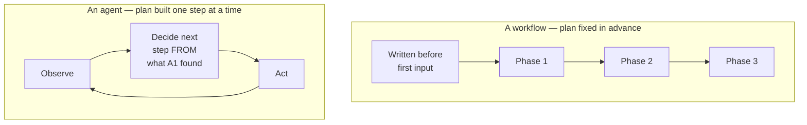
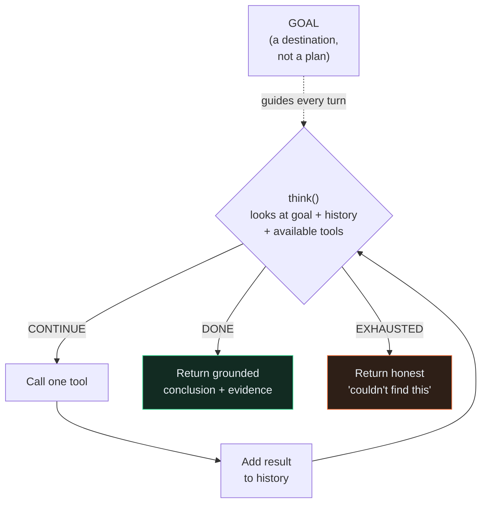
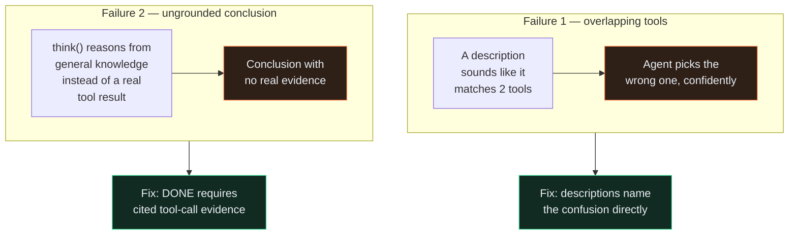
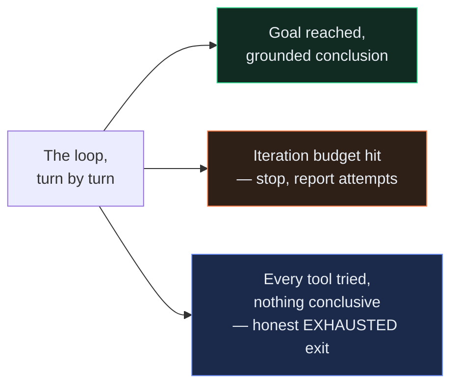
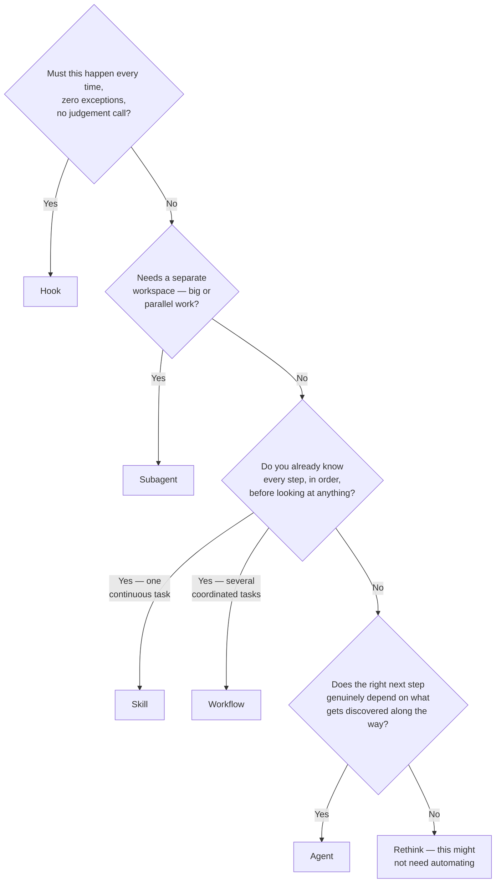
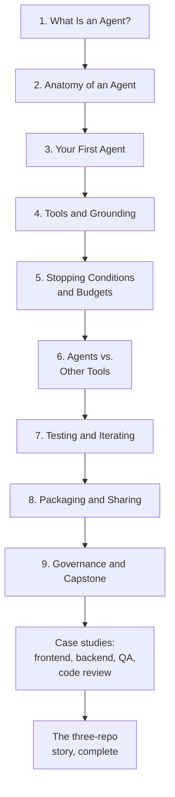
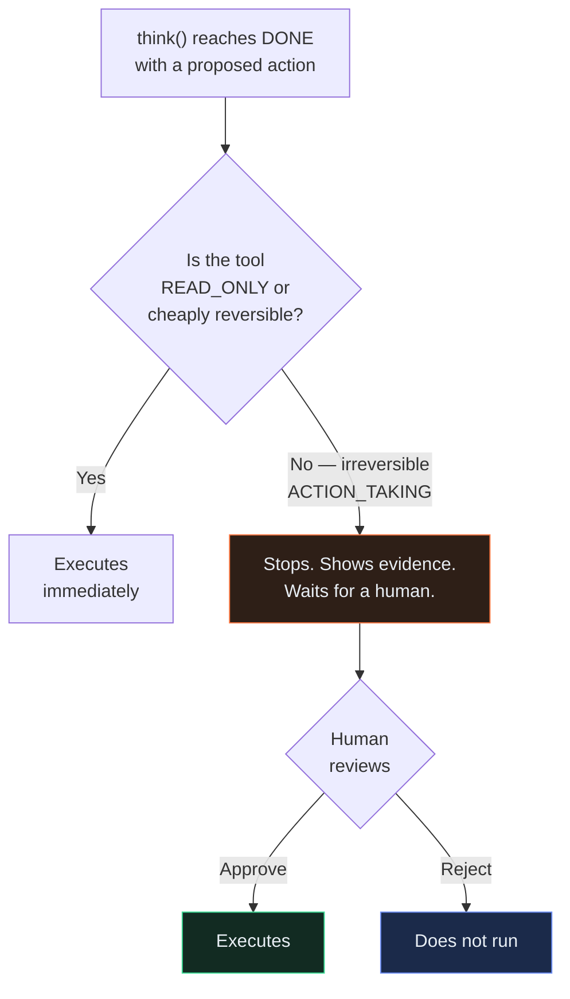
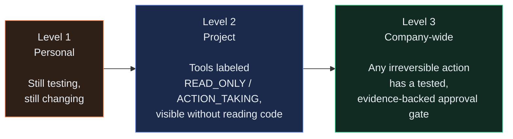
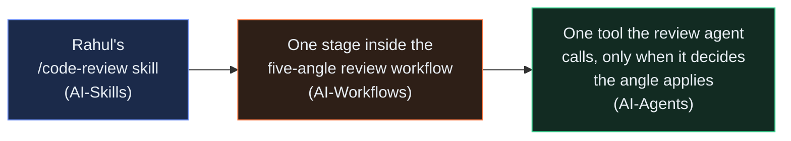

# Visuals

← [Back to README](../README.md)

Same two-part shape as the AI-Skills and AI-Workflows visuals pages. Part 1 is real, working Mermaid diagrams — most Markdown viewers, including GitHub, render these directly. Part 2 has copy-paste prompts for illustrative art, if you want a more polished look for a wiki page or a presentation.

---

## Part 1 — Real diagrams

### A fixed plan vs. an agent's loop

The single most important picture in this tutorial — [Chapter 1](../tutorial/01-what-is-an-agent.md)'s core distinction, made visual.

In the workflow, every phase existed before the first real input arrived. In the agent, step 2 didn't exist as a concept until step 1's result created the reason for it.

---

### The agent loop, in detail

[Chapter 2](../tutorial/02-anatomy-of-an-agent.md)'s four parts, as a cycle.

---

### Tool overlap and grounding

[Chapter 4](../tutorial/04-tools-and-grounding.md)'s two failure modes, side by side.

---

### Stopping honestly

[Chapter 5](../tutorial/05-stopping-conditions-and-budgets.md)'s three real exits from the loop.

The dangerous fourth path — silent circling, forever — is exactly what the repeat-detection guard exists to prevent from ever being a real fourth option.

---

### The full decision framework

[Chapter 6](../tutorial/06-agents-vs-other-tools.md), extended one more time from the AI-Skills version.

---

### The nine-chapter arc

---

### The approval gate

[Chapter 9](../tutorial/09-governance-and-capstone.md)'s fix for the risk unique to agents.

---

### The sharing ladder, agent version

---

### The whole ladder — Skill to Workflow to Agent

The picture Goal 3 exists to prove out — see [`docs/how-the-three-connect.md`](../../docs/how-the-three-connect.md) for the full version.

---

## Part 2 — Image-generation prompts

Optional. Use these with any image-capable tool for a team wiki, a slide deck, or an onboarding page. None of this is required to use the tutorial.

### 1. Cover image

**Suggested filename:** `assets/cover.png`

**Brief:** A wide banner showing a figure following a trail that's being laid down one step at a time just ahead of them — each new stepping-stone appearing only after the last one is reached, rather than a path already fully visible. Should feel different in kind from the AI-Workflows cover's "several streams converging" image — this one is about not knowing the whole route in advance.

**Style:** Flat, modern illustration, same palette family as the AI-Skills and AI-Workflows covers (muted blue, teal, warm-neutral) so all three read as one series. Wide aspect ratio (roughly 3:1).

---

### 2. The cast, investigating

**Suggested filename:** `assets/kestrel-team-agents.png`

**Brief:** The same five illustrated portraits, same consistent style as the prior two repos, but each now shown mid-investigation instead of mid-coordination — Divya following a trail of highlighted code references, Vikram with a whiteboard of crossed-out and circled theories, Ananya at a terminal with a staging-environment badge visible, Rahul reading a diff with a magnifying-glass motif.

**Style:** Same flat illustration style as the prior two cast images, for visual continuity across all three repos.

---

### 3. The detective analogy, illustrated

**Suggested filename:** `assets/detective-analogy.png`

**Brief:** A literal illustrated detective's evidence board — string connecting a few clue cards, with one card clearly leading to the next only after being pinned up, some empty space still on the board for clues not yet found. Makes Chapter 1's core analogy visually literal, the same way AI-Skills' directory-board image did for its own analogy.

**Style:** Clean, slightly playful, like an infographic rather than a photo. Warm desk-lamp lighting, one accent colour tracing the confirmed connections.

---

### 4. The near-miss, calm not alarming

**Suggested filename:** `assets/near-miss-agent.png`

**Brief:** A person looking at a dashboard showing a single quarantined test with a small "auto" tag next to it, expression curious and diagnostic rather than alarmed — reviewing what happened, not reacting to a disaster. Should match the calm tone of the AI-Skills and AI-Workflows near-miss images.

**Style:** Same flat illustration style as the rest of this series. Neutral palette, one accent colour on the "auto" tag being reviewed.

---

### 5. The approval gate, illustrated

**Suggested filename:** `assets/approval-gate-illustrated.png`

**Brief:** A literal small gate or turnstile, with a labelled card ("quarantine this test") waiting on one side and a person's hand about to either wave it through or turn it back — visually showing the pause-and-check moment before an irreversible action, without needing any caption.

**Style:** Simple, icon-driven, matches the Mermaid approval-gate diagram above in spirit.

---

### 6. The whole ladder, illustrated

**Suggested filename:** `assets/skill-workflow-agent-ladder.png`

**Brief:** Three simple platforms at increasing height — Skill at the bottom, Workflow in the middle, Agent at the top — with one small glowing token (representing Rahul's original code-review logic) visibly present on all three levels at once, connected by a thread running straight up through them. Makes the "nothing was thrown away" idea from all three capstones visually literal in one image.

**Style:** Clean, icon-driven, warm accent colour on the connecting thread.

---

← [Back to README](../README.md)
