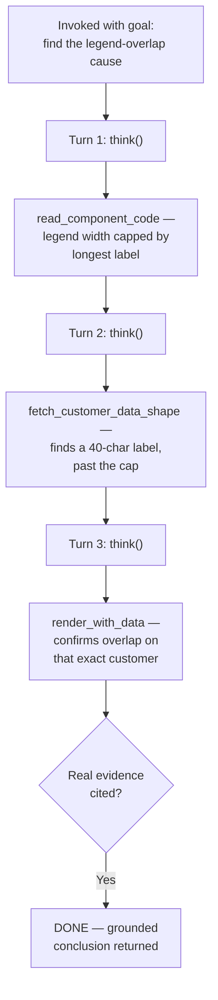

# Flow Diagram — `chart-overlap-investigator`

← [Back to case study](../README.md)

A real run resolves in 3 turns when the label-length theory is right on the first try — see [`agent.md`](../agent.md) for the full loop, and [the case study](../README.md#what-went-wrong-the-first-time) for the run that instead ends in an honest `EXHAUSTED` on a cause this agent's tools can't see.

---

← [Back to case study](../README.md)
