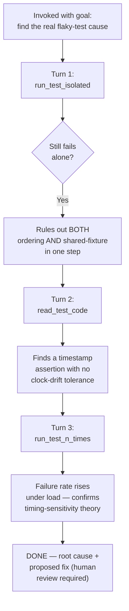

# Flow Diagram — `flaky-test-triage-agent`

← [Back to case study](../README.md)

See [`agent.md`](../agent.md) for the full loop. Note the agent proposes a fix but never applies one — see [the case study](../README.md#what-went-wrong-the-first-time) for why the first draft's auto-edit tool was removed.

---

← [Back to case study](../README.md)
