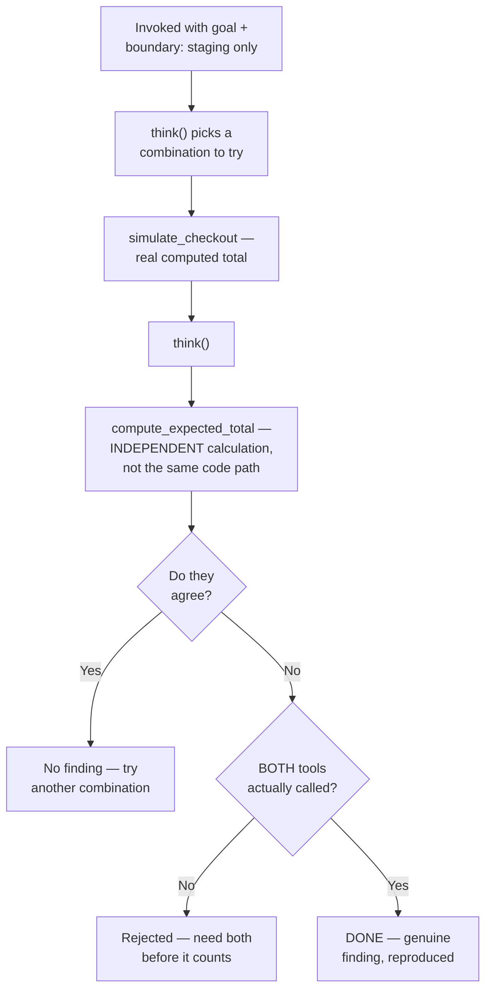

# Flow Diagram — `discount-combination-explorer`

← [Back to case study](../README.md)

See [`agent.md`](../agent.md) for the full loop, including the stricter grounding check requiring both tools before a finding counts — the direct fix for ["What went wrong the first time"](../README.md#what-went-wrong-the-first-time).

---

← [Back to case study](../README.md)
