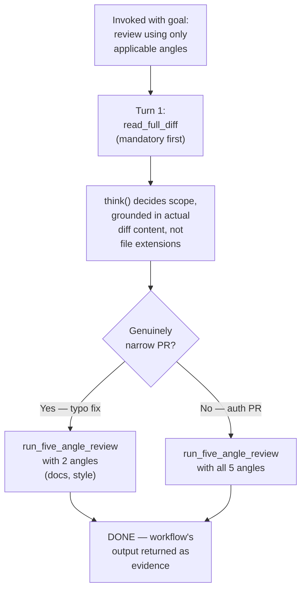

# Flow Diagram — `adaptive-pr-review-agent`

← [Back to case study](../README.md)

See [`agent.md`](../agent.md) for the full loop, including the guard that rejects any angle-selection decision made before `read_full_diff` actually ran — the direct fix for the file-extension near-miss in ["What went wrong the first time"](../README.md#what-went-wrong-the-first-time).

---

← [Back to case study](../README.md)
