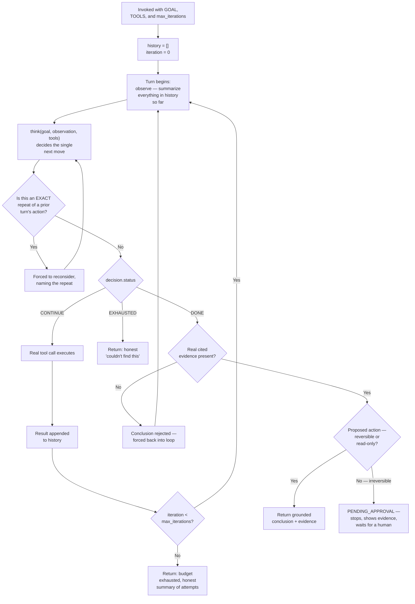

# Chapter 10 — The Execution Lifecycle

← [Chapter 9 — Governance and Capstone](09-governance-and-capstone.md) · [Learning path](../learning-path.md) · Next: [Case Studies →](../case-studies/README.md)

A bonus chapter, not part of the original nine — but worth reading before the case studies, because it traces, turn by turn, everything that happens when a real agent runs — including the parts that don't show up in the pseudocode, and the parts whose *number* isn't knowable in advance.

---

## Where you left off

Your config-discrepancy investigator is finished, tested, shared, and governed against unapproved irreversible action. Rahul asks one more question before the case studies:

> "A workflow, you could trace exactly — I could tell you in advance how many stages would run, and in what order. Can you tell me that for your agent, before it runs?"

You can't. Not because you don't understand it — because the honest answer is that the number of turns, and what happens on each one, genuinely isn't decided until the agent is actually running. Tracing this lifecycle means tracing something whose length isn't fixed, which is a different kind of trace than [AI-Workflows Chapter 10](../../AI-Workflows/tutorial/10-lifecycle-of-execution.md) walked through.

---

## What you'll learn

1. The full sequence from invocation to final return, for a real agent — including the parts whose count varies run to run.
2. What actually happens, in order, on a single turn of the loop: observe, think, guard, act.
3. The three different ways a run can end, and exactly what happens at each one.

---

## The lesson

### The one fact everything else follows from

An agent is invoked deliberately, the same as a workflow — with a goal, a tool set, and a budget, handed in at the start. What's different from a workflow is what happens *after* invocation: there's no fixed list of stages to walk through. There's a loop, and the loop's actual length is discovered by running it, not by reading it.

### The full sequence, traced against the config-discrepancy investigator

Walk through each part of a single turn, in the order it actually happens.

**1. Invocation.** The goal, the tool list (with each tool's `access` and `reversible` flags), and `max_iterations` are handed in. `history` starts empty. `iteration` starts at 0. Nothing has happened yet — this is the only part of the whole run that's fixed and knowable in advance.

**2. Observe.** Every turn starts here: `summarize(history)` looks at everything learned in every prior turn, not just the last one. On turn 1, this is empty — the agent is starting from nothing but the goal.

**3. Think.** `think(goal, observation, tools)` is the one call in the entire lifecycle with no fixed answer. It weighs the goal, everything observed so far, and the available tools, and returns exactly one of three things: `CONTINUE` with a specific next action, `DONE` with a conclusion, or `EXHAUSTED`.

**4. The repeat guard.** Before anything else happens with a `CONTINUE` decision, it's checked against every prior turn's exact action. If it matches one exactly, `think()` is called again, this time told explicitly that this action was already tried and what it returned — from [Chapter 5](05-stopping-conditions-and-budgets.md). This guard runs on *every single turn*, not just ones that look suspicious.

**5. The tool call.** Only once a `CONTINUE` decision clears the repeat guard does a real tool actually execute — reading a file, checking a flag, running a query. This is the only point in the entire loop where anything outside the agent's own reasoning actually happens.

**6. Append and check budget.** The result joins `history`, `iteration` increments, and the loop checks whether it's still under `max_iterations`. If yes, back to step 2 — and note that step 2 on this next turn now has strictly more to observe than it did last time, which is exactly why turn 2's decision can be genuinely different in kind from turn 1's, not just a continuation of the same plan.

**7. Ending on `EXHAUSTED`.** If `think()` ever decides every available tool has been tried and nothing conclusive turned up, the loop ends immediately, with an honest summary — it does not wait for the iteration budget to run out first.

**8. Ending on budget.** If the loop reaches `max_iterations` without either `DONE` or `EXHAUSTED`, it stops there, with a summary of what was tried. This is the hard backstop — it fires regardless of what `think()` might have decided on a turn 9 that never gets to happen.

**9. Ending on `DONE` — the grounding gate.** A `DONE` decision doesn't return immediately. First, per [Chapter 4](04-tools-and-grounding.md), its evidence is checked — real cited tool-call results, not a restatement of the conclusion. If there's no real evidence, the conclusion is rejected and the loop continues, exactly like a `CONTINUE` decision would have.

**10. Ending on `DONE` — the approval gate.** Only once a `DONE` decision clears the grounding check does its proposed action, if any, get checked against [Chapter 9](09-governance-and-capstone.md)'s access rules. A read-only or cheaply-reversible action executes and the run ends normally. An irreversible, action-taking one stops short of executing — the run ends in `PENDING_APPROVAL`, with the evidence attached, waiting on a human.

### Why the turn count genuinely isn't knowable in advance

This is the concrete answer to Rahul's original question. Compare turn 2's `think()` call to turn 1's: they're the *same function*, called with genuinely different inputs, because `history` is strictly larger on turn 2. A run that gets lucky on turn 1 — an unambiguous, immediately conclusive tool result — can reach step 9 in one turn. A run on a genuinely hard case can spend all 8 turns without ever reaching a grounded conclusion, correctly ending at step 8 instead. **Both are the same agent, correctly executing the same lifecycle** — the lifecycle's *shape* (the diagram above) is fixed and traceable; its *length*, for any specific real input, is not, and that's not a gap in the trace — it's the accurate description of what an agent actually is.

### Tracing the approval gate specifically

One path worth walking through on its own, because it's the newest idea in the whole series: a `DONE` decision proposing `quarantine_flaky_test`. It clears the grounding gate — real evidence cited. It reaches the approval gate, and `quarantine_flaky_test` is marked `ACTION_TAKING`, `reversible: false`. The loop does not call the tool. It returns `PENDING_APPROVAL`, with the full evidence chain attached. **The agent's own execution genuinely stops here** — not paused, not queued internally, actually returned — until a human, outside this lifecycle entirely, makes the call. Tracing this precisely is what proves the gate is real: there is no code path from `DONE` to an irreversible tool call that skips the human step.

---

## Try it yourself

Take an agent you've built. Run it once and write down, turn by turn as it happens, exactly what `think()` decided and why, using the ten steps above as your checklist. Then run it again on a harder input, and confirm the *shape* of the trace — the ten steps — stayed identical, even though the *number* of turns and the specific path through them changed.

---

## What's still missing

Nothing, for an agent's lifecycle — you've now traced a real run start to end, including both its honest failure exits and its approval gate.

This closes the loop across all three tutorials. A skill's lifecycle is fixed-length and stateless between messages. A workflow's lifecycle is fixed-shape and knowable in advance. An agent's lifecycle is fixed-shape but genuinely variable-length — the direct runtime consequence of everything [Chapter 1](01-what-is-an-agent.md) taught you about what an agent actually is.

For now: the [case studies](../case-studies/README.md) are next, each one now including a real, ready-to-use agent definition you can trace through this exact lifecycle yourself.

---

← [Chapter 9 — Governance and Capstone](09-governance-and-capstone.md) · [Learning path](../learning-path.md) · Next: [Case Studies →](../case-studies/README.md)
