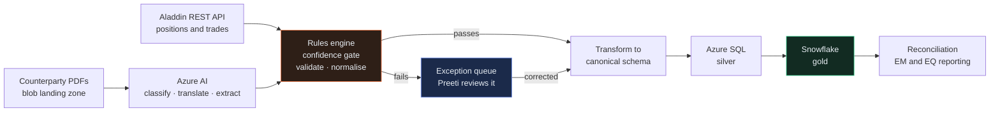

# The Story So Far

← [AI-Agents](../AI-Agents/README.md) · [README](README.md) →

If you're arriving from [AI-Skills](../AI-Skills/00-the-story.md), [AI-Workflows](../AI-Workflows/00-the-story.md) and [AI-Agents](../AI-Agents/00-the-story.md), you already know Kestrel Software and you already know Gautam and Pankaj. If you're arriving fresh — welcome. This book works on its own. It's the fourth chapter of one continuous story, but you won't be lost.

---

## Where you left off

You built a skill. Then a workflow. Then an agent.

All three still run at Kestrel every day. Gautam's review tooling has looked at something like four hundred pull requests by now. Pankaj's test suites catch things nobody would have caught by hand.

And every single one of those three books had the same quiet assumption baked into it, which nobody said out loud:

**One person. One AI. One task.**

That's what a skill is for. That's what a workflow coordinates. That's what an agent loops over. Read all three books back to back and you come away extremely good at getting one AI to do one thing well.

That is not what a software project is.

---

## The thing that broke

Kestrel won a piece of work with Northwind Asset Management — a mid-size asset manager with about $40 billion under management, offices in London and Los Angeles, and a problem that has nothing to do with AI and everything to do with paperwork.

Seven people were assigned. A project manager, a product owner, an architect, a team lead, two engineers, one QA. All seven had read the first three books. All seven were, individually, extremely good at prompting.

Six weeks in, the project was a mess.

Not because anyone did bad work. Because of this:

- Preetinka, the product owner, wrote requirements with an AI. Good requirements.
- Hem, the architect, designed the system with an AI. Good design.
- Except Hem's design solved a slightly different problem than the one Preetinka had written down, because Hem had described the problem to her AI **in her own words** rather than handing it Preetinka's document.
- Ravi built what Hem designed. Beautifully. In three days instead of two weeks.
- Pankaj tested what Ravi built and found five defects, one of which was serious enough that the fix changed the design.
- And at that point **nobody knew what to do next.** There was no prompt for "the thing is built, it's wrong, and fixing it means going back three steps."

Atul, the project manager, put it more bluntly than that in the retro. What he actually said was:

> "We've got seven people each running their own private AI session, each producing something excellent, and none of it fits together. We're not slow. We're just all going in slightly different directions very, very fast."

---

## The two problems this book is about

Read that story again and there are exactly two things wrong, and they're the two things every prompt library on the internet quietly ignores.

### Problem one: the handoff

Preetinka produced a document. Hem needed that document. What actually crossed the gap between them was **Hem's memory of a conversation about the document.**

That's the handoff, and it's where AI-assisted teams fall apart. Not in the prompting — the prompting was fine. In the seam between one person's output and the next person's input.

When one human hands work to another human, the receiving human asks questions. They notice the gap. They say "wait, what about refunds?" An AI doesn't do that. An AI takes whatever you give it and produces something confident and complete-looking on top of it, gap and all. **The AI will not tell you that you handed it the wrong thing.**

So the fix isn't a better prompt. It's a **contract** — an explicit, written agreement about what each artifact guarantees to the next person who picks it up. That idea runs through this entire book.

### Problem two: the loop

Every prompt library you have ever read — including, honestly, the fifteen prompts you probably arrived here with — describes a **straight line**. Write the PRD. Plan it. Build it. Test it. Ship it.

Software does not go in a straight line. Software goes:

```
build → test → it's broken → understand why → fix → test → still broken →
the spec was wrong → update the spec → fix again → review → three comments →
two of them are fair → fix → test → ship
```

That loop is where **most of a sprint actually goes.** And there is no prompt for it. There is a prompt for "write the code" and a prompt for "debug an error", and between those two sits the entire real working life of an engineer — which is: *the code is written, it runs, the tests pass, and QA says it's wrong.*

That's the exact question that started this book:

> "Suppose Dev A is working on a story which is code generated. Now after doing some testing there are some issues. For that, what kind of prompt do we have to use?"

[Phase 6](AI-Prompts-Library/03-the-rework-loop.md) is the answer, and it's the longest phase in the library on purpose.

---

## What this book is

Two things, sitting side by side.

**[The AI Prompts Library](AI-Prompts-Library/README.md)** — thirty-six prompts covering the full agile lifecycle, from Sprint 0 setup through discovery, design, planning, build, verification, rework, release and improvement. Each one says who runs it, what it needs to already exist, what it produces, **why it's the last prompt you need for that job**, and — the part that matters most — **what to run when it isn't.**

**[The Case Study](Case-Study/Python-ETL/README.md)** — the Northwind project, told sprint by sprint, with every prompt shown in use by a named person at a real moment, and every artifact they produced sitting in a folder you can open. Including the code. Including the bug report. Including the retro where they admit what went wrong.

They're meant to be read together. The library tells you how a prompt works; the case study shows you a human getting it slightly wrong first.

---

## The project you'll follow

Northwind runs two sets of books that have to agree.

**What Northwind thinks it owns** comes out of BlackRock Aladdin — their portfolio management system — over a REST API. Structured, reliable, already in the pipeline. Easy.

**What everybody else says Northwind owns** comes from counterparties: prime brokers, custodians, fund administrators. They send statements and trade confirmations as **PDFs**. Every provider uses a different layout. Some are scanned. Some are faxed and then scanned. The Emerging Markets ones arrive in Spanish and Portuguese.

Proving those two agree is called **reconciliation**. Where they disagree, you have a **break** — a position that doesn't match, a missing trade, a fee charged but not accrued. Breaks cost real money.

Here's the part that makes it a project: **the reconciliation logic already works fine.** The bottleneck is that before it can run, a human being — an operations analyst named Preeti Singh — has to open each PDF and type the numbers into a spreadsheet. Several hours a day. Every day. Worse at month-end.

That manual step is why breaks are found on **T+2** (two business days after the trade) instead of **T+1**.

So the job is: read the PDFs automatically, apply a rules engine that decides whether the machine's reading can be trusted, transform what survives into Northwind's schema, and load it into Azure SQL and Snowflake alongside the Aladdin feed.



**The one idea to hold on to:** a wrong number is worse than no number. Every field the AI pulls off a PDF comes with a score saying how sure it was. The rules engine compares that score to a limit. Below the limit, nothing goes into the warehouse — it goes to Preeti. That single design choice is what makes the whole thing safe to build, and half the arguments in this book are about it.

---

## What "done" will look like

By the end of this book you'll be able to:

- Run a **whole team** on AI-assisted delivery, not just yourself — with each of seven roles knowing which prompt is theirs and what they owe the next person.
- Write a **handoff contract** so the artifact one role produces is genuinely usable by the next, instead of being re-explained from memory.
- Work the **rework loop** — the part nobody writes prompts for — from a QA bug report back through diagnosis, fix, spec correction and re-review, without losing the thread.
- Know **when to stop prompting.** Every prompt in the library states its own exit criteria, because the most expensive mistake in AI-assisted work isn't a bad prompt, it's a good prompt run eleven more times on something that was already finished.
- Recognise the failure modes that are **specific to AI-assisted teams** and don't exist otherwise: the invented helper that duplicates one already in the repo, the test quietly edited until it passed, the spec and the code drifting apart because someone fixed it in code and never went back.

---

## The shape of the book

| Phase | What happens | Who leads | Prompts |
|---|---|---|---|
| **0 — Foundation** | Sprint 0. Nothing ships. You make the environment safe to work in. | Team Lead | [P01–P05](AI-Prompts-Library/README.md#phase-0--foundation) |
| **1 — Discovery** | What are we building and why. Requirements, stories, acceptance criteria, ranking. | Product Owner | [P06–P09](AI-Prompts-Library/README.md#phase-1--discovery) |
| **2 — Design** | How it will be shaped, and the decisions that are expensive to reverse. | Architect | [P10–P14](AI-Prompts-Library/README.md#phase-2--design) |
| **3 — Planning** | Turning design into a sequence a team can actually execute. | Team Lead + PM | [P15–P17](AI-Prompts-Library/README.md#phase-3--planning) |
| **4 — Build** | Code, UI, tests. The part everyone thinks is the whole job. | Engineers | [P18–P21](AI-Prompts-Library/README.md#phase-4--build) |
| **5 — Verify** | Finding out what's actually true rather than what you hoped. | QA | [P22–P25](AI-Prompts-Library/README.md#phase-5--verify) |
| **6 — Rework** | **The loop.** Bug report → diagnosis → fix → spec → review → done. | Engineers | [P26–P30](AI-Prompts-Library/README.md#phase-6--rework) |
| **7 — Release** | Commits, readiness, and the document the on-call person reads at 3am. | PM + Team Lead | [P31–P33](AI-Prompts-Library/README.md#phase-7--release) |
| **8 — Improve** | Debt, dead code, and an honest retrospective. | Architect + PM | [P34–P36](AI-Prompts-Library/README.md#phase-8--improve) |

---

## A note before you start

This book is deliberately less tidy than the first three.

Those three each taught one clean idea — a skill is this, a workflow is that, an agent is the other. You could read them and feel like you understood something completely.

This one is about seven people disagreeing about a system that reads PDFs badly, and about the specific ways an AI makes that disagreement faster and more confident rather than slower. The middle of it — Sprint 3, where Pankaj finds the bug — is the messiest part, and it's the part worth reading twice.

If a section makes you think "that would never happen on my team," it's probably the section you need.

---

## Ready?

Meet the seven people first — [the cast](the-cast.md) — or skip straight to the [learning path](learning-path.md) for the full map.

If you arrived here with a prompt library of your own and want to know what's wrong with it before you read anything else, start with [the prompt analysis](prompt-analysis.md). It's blunt.

---

← [AI-Agents](../AI-Agents/README.md) · [README](README.md) →
