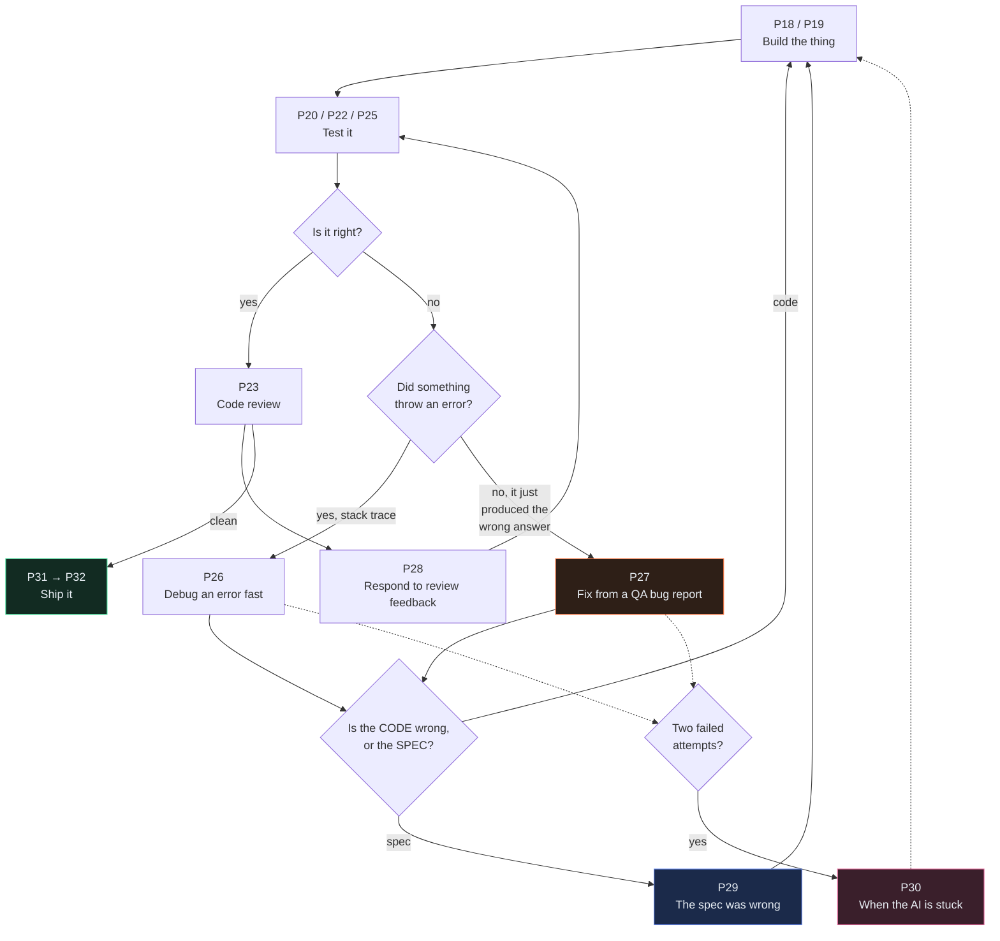

# The Rework Loop

← [The handoff contract](02-the-handoff-contract.md) · [Library index](README.md) · Next: [P01 — Generate the project context file](phase-0-foundation/P01-generate-the-project-context-file.md)

> **One line:** the code is written, the tests pass, and QA says it's wrong — this is the map of what to do next.

Every prompt library on the internet describes a straight line. This file is about the part that isn't.

---

## 1. The question this book was built to answer

Someone asked it plainly:

> *"Suppose Dev A is working on a story which is code generated. Now after doing some testing there are some issues. For that, what kind of prompt do we have to use?"*

It's the right question, and almost nothing answers it. Search for AI development prompts and you'll find dozens for **write the PRD**, **plan the feature**, **implement it**, **debug this error**, **write the commit**.

Between "implement it" and "write the commit" sits a gap. In that gap is where **most of a sprint actually goes.**

---

## 2. The line everyone draws, and the loop that's actually there

Here's the picture every prompt library implies:

```
PRD → plan → spec → build → test → ship
```

Clean. Six steps. Each one has a prompt.

Here's what happened to story NWD-103 at Northwind — one story, one engineer, one sprint:

```
build → test (passes) → QA finds a defect → reproduce it →
understand why → fix → test (passes) → QA re-tests → still wrong →
realise the SPEC didn't cover this case → update the spec →
get it approved → fix properly → add a regression test →
code review → three comments → one is a real defect, two are preferences →
fix the defect, push back on one preference, add a comment for the other →
re-review → done
```

Seventeen steps. Four of them are "build" or "test." **Thirteen are rework.**

That ratio is not a sign of a bad team. Tomas is a good engineer, Sofia writes careful specs, and Ananya is excellent. That ratio is just what building software looks like when you're honest about it — and the fact that twelve of those thirteen steps have no prompt anywhere is the gap this phase fills.

---

## 3. The map



Four decision diamonds. Get any of them wrong and you waste an hour or a day. Let's take them one at a time.

---

## 4. The fork that matters most: did something throw?

This is the decision people get wrong most often, and it's the cheapest one to get right.

| | **Something threw** | **Nothing threw** |
|---|---|---|
| What you have | A stack trace, an exception, a red test, a 500 | A number that's wrong. A row that's missing. A screen showing the wrong thing |
| What you know | Exactly which line failed | Only that the output disagrees with expectation |
| Where to start | The trace — it hands you the location | A **reproduction** — you have to build the evidence yourself |
| The prompt | **[P26 — Debug an error fast](phase-6-rework/P26-debug-an-error-fast.md)** | **[P27 — Fix from a QA bug report](phase-6-rework/P27-fix-from-a-qa-bug-report.md)** |

**Why using the wrong one costs you.** P26 opens with *"read the stack trace, open the exact files involved."* Point that at a bug where nothing threw and the AI has no anchor — so it does what an AI always does with no anchor. It picks a plausible-looking file, reads it, forms a confident theory, and changes something.

Sometimes the change even makes the symptom go away, which is worse, because now you have a fix for a bug you never actually located.

**The tell:** if you cannot paste a stack trace, you are not debugging. You are diagnosing. Use P27.

Bug [NWD-142](../Case-Study/Python-ETL/artifacts/bug-NWD-142.md) is the pure case. A Broker Alpha statement whose positions table crosses a page boundary loses the rows on page two. Nothing throws. No test fails. The confidence gate — the system's entire safety mechanism — reports everything fine, because every field it *did* extract was genuinely high confidence.

Fourteen positions on the PDF. Nine rows in Snowflake. Silence.

---

## 5. The fork nobody plans for: is the spec wrong?

You've found the defect. You know how to fix it. Now ask one question before you touch anything:

> **Does the code disagree with the spec, or does the spec disagree with reality?**

Two very different situations that feel identical from inside the code.

**Code is wrong** — the spec said the right thing and the implementation didn't do it. Fix the code. Add a test. Move on. This is the common case and it's easy.

**Spec is wrong** — the implementation did exactly what the spec said, and the spec never contemplated this case. This is NWD-142. The spec described a *confidence* gate. Every field it checked was high confidence. The spec was answering "can I trust this number?" when the question that mattered was "is this number even here?"

Fixing that in code alone is the trap, and it's a real one:

> **If you fix a spec problem in code and don't update the spec, the spec becomes a lie.** The next person reads it and believes it. Worse — the next AI session is *grounded* in it, and produces confident work built on a document that no longer describes the system.

That's [P29](phase-6-rework/P29-the-spec-was-wrong.md), and the sequence is deliberately awkward on purpose: stop, write down the divergence, update the spec, get it approved, *then* change the code, then re-check every other story that leaned on the old spec.

Awkward, because the awkwardness is what stops people doing it silently.

---

## 6. The fork people are too proud for: is the session stuck?

Two failed fix attempts. You're about to try a third.

Don't.

The AI is not "nearly there." What's actually happened is that your context is now full of failed attempts, wrong theories and half-reverted edits, and every one of those is still influencing the next response. The good information is buried under the bad. **The third attempt is statistically worse than the first, not better.**

That's counterintuitive because it's the opposite of how it works with a person, where the third attempt genuinely does benefit from the first two.

The recovery moves, cheapest first — the full version is in [P30](phase-6-rework/P30-when-the-ai-is-stuck.md):

1. **Re-ground it.** Paste the actual current file. It's probably reasoning about a version that no longer exists.
2. **Ask for assumptions, not action.** *"Before changing anything, state what you believe to be true about this code, and how you know."* You will often find the false belief immediately.
3. **Ask it to explain the failure, not fix it.** Diagnosis and repair are different tasks, and asking for both at once gets you a confident repair of a guessed diagnosis.
4. **Narrow to one file.** Big scope means big plausible rewrites.
5. **Throw the session away.** Start fresh with a better-framed prompt, informed by what you now know. This is the move people resist, and it is usually the right one.

---

## 7. The five prompts

| | Prompt | Use it when | Owner |
|---|---|---|---|
| [P26](phase-6-rework/P26-debug-an-error-fast.md) | Debug an Error Fast | Something threw. You have a trace | Engineer |
| [P27](phase-6-rework/P27-fix-from-a-qa-bug-report.md) | **Fix From a QA Bug Report** | **Nothing threw. It's just wrong** | Engineer |
| [P28](phase-6-rework/P28-respond-to-code-review-feedback.md) | Respond to Code Review Feedback | Someone reviewed it and left comments | Engineer |
| [P29](phase-6-rework/P29-the-spec-was-wrong.md) | The Spec Was Wrong | The code did what the spec said, and the spec was wrong | Architect + Lead |
| [P30](phase-6-rework/P30-when-the-ai-is-stuck.md) | When the AI Is Stuck | Two failed attempts, circling, or confident nonsense | Anyone |

---

## 8. Three principles that run through all five

### Reproduce before you fix

**Always.** The AI must produce a **failing test that demonstrates the defect** before it writes one line of fix.

This sounds like process overhead. It isn't — it's the single highest-value habit in the whole phase, and here's why:

An AI asked to fix a described bug will fix **the bug it inferred from your description.** That's often adjacent to the real one. The code changes, the described symptom disappears, and the actual defect is still sitting there — now harder to find, because the obvious symptom is gone.

A failing test is proof you found the real thing. When it goes green, that's proof you fixed the real thing. Without it you have two guesses stacked on each other.

For NWD-142 the failing test is a two-page fixture PDF with fourteen positions, asserting fourteen rows out. It fails with nine. Now everyone — you, the AI, Ananya, the reviewer — is looking at the same object.

### Name the boundary

An AI told to fix something will also do adjacent things it considers helpful. It renames variables. It reformats. It refactors the function it's fixing. It adds a docstring to the function next door.

Now your one-line fix is a 200-line diff and the reviewer can't see the fix inside it.

Every rework prompt carries a **Do not** list, and it's the highest-leverage part:

```text
Do not:
* Change any behaviour beyond the defect described
* Rename, reformat or reorganise anything you were not asked to touch
* Modify an existing test to make it pass
* Add a dependency
```

That third line deserves special attention. **An AI will absolutely edit a test to make it pass**, sincerely believing it's helping, and it is one of the most dangerous things that happens in AI-assisted development — because your safety net now agrees with your bug. Put it in every prompt. Put it in your [Definition of Done](phase-3-planning/P17-definition-of-done.md) too.

### Search for the pattern elsewhere

The last step of every fix: **where else does this exist?**

Bugs come from a *way of thinking*, and the way of thinking was applied in more than one place. NWD-142's real cause isn't a bug in the extraction code — it's that nobody on the team had the concept of *completeness* as distinct from *correctness*. Once that's named, the same hole turns up in the reconciliation input path and in the Aladdin API pull, where paging could silently truncate the same way.

One bug report. Three fixes. That's normal, and finding the other two is nearly free once you know what you're looking for.

```text
This defect came from <the underlying mistaken assumption>.
Search the repository for every other place that same assumption is made.
For each hit: file, line, whether it has the same defect, and why or why not.
Report only. Do not change anything yet.
```

---

## 9. What the loop costs when you skip it

Northwind's Sprint 3, honestly accounted for:

| | Time |
|---|---|
| Building NWD-101 through NWD-107 | 4 days |
| Testing | 2 days |
| **Rework** | **6 days** |
| Release prep | 1 day |

Six days of rework against four days of build. Farhan's estimate had one day for "bug fixing."

The point isn't that the estimate was bad. It's that **rework was never a named activity**, so it had no prompts, no artifacts, and no place in the plan. It happened in the gaps, invisibly, and the sprint was late for reasons nobody could point at.

Naming it is most of the fix. After Sprint 3, Farhan's estimates carried an explicit rework line, and the [retro](../Case-Study/Python-ETL/10-retrospective.md) is where that changed.

---

## 10. Where to go now

**If you have a bug right now:** [P27](phase-6-rework/P27-fix-from-a-qa-bug-report.md) if nothing threw, [P26](phase-6-rework/P26-debug-an-error-fast.md) if something did.

**If you want to watch it happen:** [Sprint 3 — Rework](../Case-Study/Python-ETL/08-sprint-3-rework.md) follows NWD-142 from Ananya counting positions on a PDF through to the merged fix, the spec change, and the two other places the same assumption was hiding.

**If you're setting up a team:** read [the handoff contract](02-the-handoff-contract.md) first. Most rework isn't caused by bad code — it's caused by a gap in a handoff three steps earlier, and Phase 6 is where you pay for it.

---

← [The handoff contract](02-the-handoff-contract.md) · [Library index](README.md) · Next: [P01 — Generate the project context file](phase-0-foundation/P01-generate-the-project-context-file.md)
