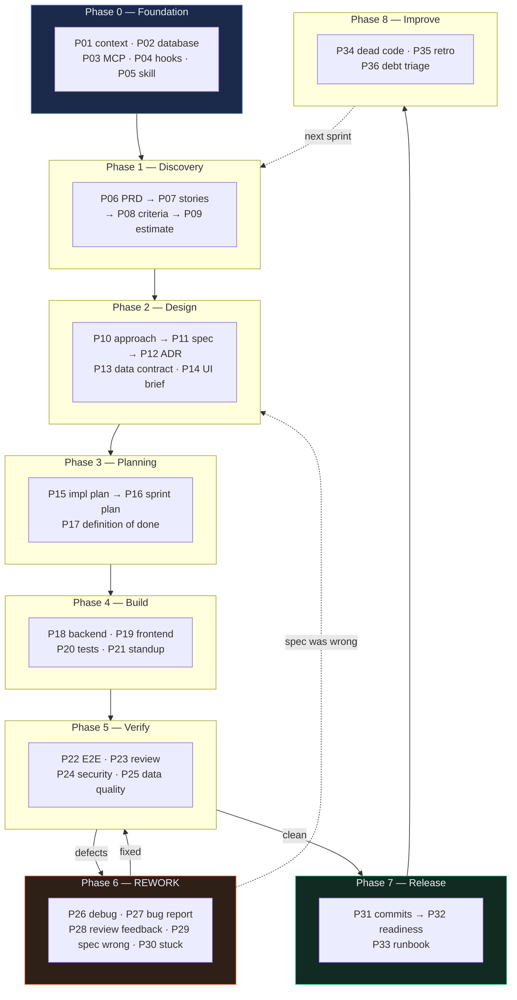

# The AI Prompts Library

← [Book README](../README.md) · [The cast](../the-cast.md) · Next: [How to use this library](00-how-to-use-this-library.md)

Thirty-six prompts covering the full agile lifecycle, mapped to seven roles, with an explicit answer to the question most prompt libraries skip: **what do you run when the output isn't right?**

---

## Read these four first

| | | |
|---|---|---|
| [00](00-how-to-use-this-library.md) | **How to use this library** | The eleven sections in every file, and which to read in a hurry |
| [01](01-anatomy-of-a-good-prompt.md) | **Anatomy of a good prompt** | The seven parts. Why the "Do not" list matters most |
| [02](02-the-handoff-contract.md) | **The handoff contract** | **The core idea.** Why teams break at the seams, not the prompts |
| [03](03-the-rework-loop.md) | **The rework loop** | **The other core idea.** The map of Phase 6 |

---

## Phase 0 — Foundation

**Sprint 0. Nothing ships. You make the environment safe to work in.** Led by the Team Lead (Rahul).

| | Prompt | Role | Produces |
|---|---|---|---|
| [P01](phase-0-foundation/P01-generate-the-project-context-file.md) | Generate the Project Context File | Team Lead | `CLAUDE.md` |
| [P02](phase-0-foundation/P02-connect-the-database.md) | Connect the Database | Backend Eng | `sql/schema.sql`, sink modules |
| [P03](phase-0-foundation/P03-wire-up-an-mcp-server.md) | Wire Up an MCP Server | Team Lead | `.mcp.json` |
| [P04](phase-0-foundation/P04-hooks-as-guardrails.md) | Hooks as Guardrails | Team Lead | `.claude/settings.json` + hook scripts |
| [P05](phase-0-foundation/P05-turn-a-repeated-task-into-a-skill.md) | Turn a Repeated Task into a Skill | Team Lead | `.claude/skills/onboard-counterparty/SKILL.md` |

> **Why a sprint that ships nothing is worth it.** Everything after this is faster and safer because the AI knows your conventions, can read your real schema instead of guessing at it, and physically cannot edit production config without asking. Skipping Sprint 0 doesn't save a sprint — it spends one later, in smaller and more annoying pieces.

---

## Phase 1 — Discovery

**What are we building, and why.** Led by the Product Owner (Amara).

| | Prompt | Role | Produces |
|---|---|---|---|
| [P06](phase-1-discovery/P06-write-a-full-prd.md) | Write a Full PRD | Product Owner | `artifacts/prd-counterparty-ingestion.md` |
| [P07](phase-1-discovery/P07-slice-the-prd-into-stories.md) | Slice the PRD into Stories | Product Owner | `artifacts/stories/NWD-101…108.md` |
| [P08](phase-1-discovery/P08-write-acceptance-criteria.md) | Write Acceptance Criteria | PO + QA | `artifacts/acceptance-criteria-NWD-103.md` |
| [P09](phase-1-discovery/P09-estimate-and-rank-the-backlog.md) | Estimate and Rank the Backlog | PM + Team Lead | a ranked, sized backlog |

---

## Phase 2 — Design

**The shape of the system, and the decisions that are expensive to reverse.** Led by the Architect (Sofia).

| | Prompt | Role | Produces |
|---|---|---|---|
| [P10](phase-2-design/P10-ultra-plan-mode.md) | Ultra Plan Mode | Architect | an approach recommendation + a stop gate |
| [P11](phase-2-design/P11-write-the-technical-spec.md) | Write the Technical Spec | Architect | `artifacts/spec-confidence-gate.md` |
| [P12](phase-2-design/P12-record-an-architecture-decision.md) | Record an Architecture Decision | Architect | `artifacts/adr/0001…0003.md` |
| [P13](phase-2-design/P13-design-the-data-contract.md) | Design the Data Contract | Architect + BE | `artifacts/data-contract-counterparty-position.md` |
| [P14](phase-2-design/P14-ui-ux-design-brief.md) | UI/UX Design Brief | Frontend Eng + PO | `artifacts/ui-brief-exception-queue.md` |

---

## Phase 3 — Planning

**Turning design into a sequence a team can execute.** Led by the Team Lead and PM.

| | Prompt | Role | Produces |
|---|---|---|---|
| [P15](phase-3-planning/P15-implementation-plan.md) | Implementation Plan | Team Lead | `artifacts/implementation-plan-NWD-103.md` |
| [P16](phase-3-planning/P16-sprint-plan-and-assignment.md) | Sprint Plan and Assignment | Project Manager | the sprint board + goal |
| [P17](phase-3-planning/P17-definition-of-done.md) | Definition of Done | Team Lead + QA | `artifacts/definition-of-done.md` |

---

## Phase 4 — Build

**Code, UI, tests. The part everyone thinks is the whole job.** Engineers.

| | Prompt | Role | Produces |
|---|---|---|---|
| [P18](phase-4-build/P18-implement-a-story.md) | Implement a Story | Backend Eng | `core/confidence.py`, `core/rules.py` |
| [P19](phase-4-build/P19-build-the-ui-from-the-brief.md) | Build the UI from the Brief | Frontend Eng | the exception queue screen |
| [P20](phase-4-build/P20-write-tests-alongside-the-code.md) | Write Tests Alongside the Code | BE + FE | `tests/test_confidence.py` and friends |
| [P21](phase-4-build/P21-daily-standup-summary.md) | Daily Standup Summary | everyone | the honest three lines each |

---

## Phase 5 — Verify

**Finding out what's actually true rather than what you hoped.** Led by QA (Ananya).

| | Prompt | Role | Produces |
|---|---|---|---|
| [P22](phase-5-verify/P22-e2e-test-the-application.md) | E2E Test the Application | QA | Playwright + pipeline E2E suite |
| [P23](phase-5-verify/P23-review-someone-elses-code.md) | Review Someone Else's Code | Team Lead | `artifacts/code-review-NWD-103.md` |
| [P24](phase-5-verify/P24-find-security-gaps.md) | Find Security Gaps | QA + Architect | a ranked findings report |
| [P25](phase-5-verify/P25-data-quality-validation.md) | Data Quality Validation | QA + BE | the data-quality suite |

> **[P25](phase-5-verify/P25-data-quality-validation.md) is the one to read even if you skip the rest of this phase.** It is the prompt that would have caught [NWD-142](../Case-Study/Python-ETL/artifacts/bug-NWD-142.md), and it catches the class of defect that unit tests structurally cannot: data that is silently missing rather than wrong.

---

## Phase 6 — Rework

**The loop.** Five prompts, the longest phase in the book, and the reason it exists.

| | Prompt | Use it when | Role |
|---|---|---|---|
| [P26](phase-6-rework/P26-debug-an-error-fast.md) | Debug an Error Fast | Something threw. You have a trace | Engineer |
| [P27](phase-6-rework/P27-fix-from-a-qa-bug-report.md) | **Fix From a QA Bug Report** | **Nothing threw. It's just wrong** | Engineer |
| [P28](phase-6-rework/P28-respond-to-code-review-feedback.md) | Respond to Code Review Feedback | Someone reviewed it and commented | Engineer |
| [P29](phase-6-rework/P29-the-spec-was-wrong.md) | The Spec Was Wrong | The code did what the spec said, and the spec was wrong | Architect + Lead |
| [P30](phase-6-rework/P30-when-the-ai-is-stuck.md) | When the AI Is Stuck | Two failed attempts, circling, or confident nonsense | Anyone |

> **The fork that matters:** if you cannot paste a stack trace, you are not debugging — you are diagnosing. Use [P27](phase-6-rework/P27-fix-from-a-qa-bug-report.md), not [P26](phase-6-rework/P26-debug-an-error-fast.md). Getting this wrong costs an hour and often produces a fix for a bug that was never located. Full map in [the rework loop](03-the-rework-loop.md).

---

## Phase 7 — Release

**Shipping it safely.** PM and Team Lead.

| | Prompt | Role | Produces |
|---|---|---|---|
| [P31](phase-7-release/P31-write-clean-git-commits.md) | Write Clean Git Commits | everyone | a commit plan, then commits |
| [P32](phase-7-release/P32-release-readiness-check.md) | Release Readiness Check | PM + Team Lead | `artifacts/release-readiness-v1.0.md` |
| [P33](phase-7-release/P33-write-the-runbook.md) | Write the Runbook | Backend Eng | `artifacts/runbook-doc-ingestion.md` |

---

## Phase 8 — Improve

**Debt, dead code, and an honest retrospective.** Architect and PM.

| | Prompt | Role | Produces |
|---|---|---|---|
| [P34](phase-8-improve/P34-clean-up-dead-code.md) | Clean Up Dead Code | Team Lead | small verified deletions |
| [P35](phase-8-improve/P35-run-the-retrospective.md) | Run the Retrospective | Project Manager | `artifacts/retrospective-sprint-3.md` |
| [P36](phase-8-improve/P36-tech-debt-triage.md) | Tech Debt Triage | Architect + Team Lead | a ranked debt register |

---

## The whole thing on one page

---

## See it happen

Every prompt links to the [case study](../Case-Study/Python-ETL/README.md) chapter where a named person ran it on the Northwind project — usually getting it slightly wrong the first time, which is the part worth reading.

| Sprint | Chapter | Prompts in use |
|---|---|---|
| 0 | [Foundations](../Case-Study/Python-ETL/01-sprint-0-foundations.md) | P01–P05 |
| 1 | [Discovery](../Case-Study/Python-ETL/02-sprint-1-discovery.md) · [Design](../Case-Study/Python-ETL/03-sprint-1-design.md) | P06–P14 |
| 2 | [Planning](../Case-Study/Python-ETL/04-sprint-2-planning.md) · [Backend](../Case-Study/Python-ETL/05-sprint-2-build-backend.md) · [Frontend](../Case-Study/Python-ETL/06-sprint-2-build-frontend.md) | P15–P21 |
| 3 | [Verify](../Case-Study/Python-ETL/07-sprint-3-verify.md) · **[Rework](../Case-Study/Python-ETL/08-sprint-3-rework.md)** | P22–P30 |
| 4 | [Release](../Case-Study/Python-ETL/09-sprint-4-release.md) · [Retrospective](../Case-Study/Python-ETL/10-retrospective.md) | P31–P36 |

---

← [Book README](../README.md) · Next: [How to use this library](00-how-to-use-this-library.md)
