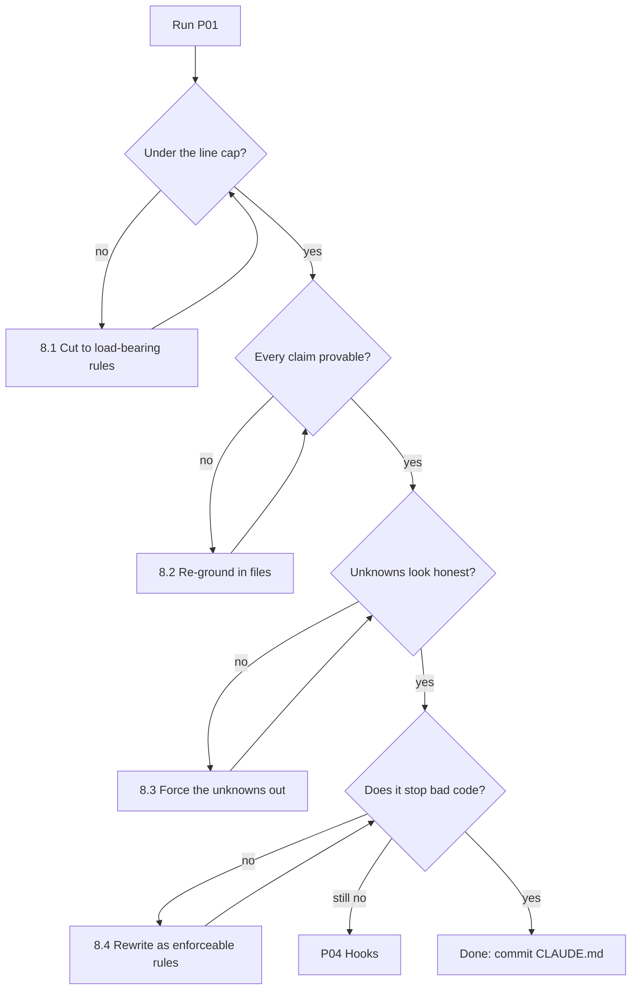

# P01 — Generate the Project Context File

← [Previous](../00-how-to-use-this-library.md) · [Library index](../README.md) · Next: [P02](P02-connect-the-database.md)

> **One line:** Make the AI read your codebase once and write down the rules, so it stops guessing.

| | |
|---|---|
| **Phase** | 0 — Foundation (Sprint 0) |
| **Who runs it** | Team Lead (Gautam ) |
| **When** | Day one of Sprint 0, before anyone writes a line of production code |
| **Takes in** | The repository skeleton at `Case-Study/Python-ETL/code/doc_ingestion/`, and the one-page brief from Northwind |
| **Produces** | `CLAUDE.md` at the repo root — archived in the book as `Case-Study/Python-ETL/artifacts/CLAUDE.md` |
| **Hands off to** | Backend Engineer (Ravi Mullick), who runs [P02 — Connect the Database](P02-connect-the-database.md) |
| **Time to run** | 30 minutes to generate, an hour to argue about and trim |

---

## 1. The scene

It is Monday morning of Sprint 0. Kestrel Software has just signed the Northwind Asset Management engagement, and the whole team is sitting in a room with a repository that contains eleven files, most of them empty.

Nothing ships this sprint. That is not a failure of planning, it is the plan. Sprint 0 exists so that the five sprints after it do not spend their first two days re-litigating decisions nobody wrote down. Atul, the project manager, put it on the board as "Foundations" and told everyone that the demo at the end of the week is a demo of the *setup*, not of the product. Preetinka raised an eyebrow. Atul said the thing he always says, which is "what happens if that takes twice as long," and everyone let it go.

Gautam has done this before. In the three earlier engagements the team ran — the ones that became `AI-Skills`, `AI-Workflows` and `AI-Agents` — he watched the same thing happen every single time. Someone opens an AI coding assistant on a fresh repository, asks for something reasonable, and gets back code that is competent, idiomatic, and completely wrong for this project.

Here is the exact thing that happened at 09:40 on that Monday. Ravi, wanting to feel productive, asked the assistant for "a function that writes extracted positions into Azure SQL." Ten seconds later he had a clean, well-typed, tested-looking function. It opened a connection with a connection string. The connection string had a password in it, read from an environment variable called `SQL_PASSWORD`.

That is a perfectly normal way to connect to a database. It is also, on this project, a hard no. Northwind's security review has one non-negotiable line in it: **no API keys, no passwords, anywhere.** Every Azure service is reached with managed identity — a mechanism where the running code proves who it is using the platform's own identity system rather than a secret it carries around. The assistant had no way of knowing that. Nobody had told it.

Gautam closed Ravi's laptop lid about two inches, which is his version of shouting, and said: before anyone generates another line, we generate the context file.

---

## 2. What this prompt actually does — in plain language

### The problem, stated bluntly

An AI coding assistant starts every conversation knowing nothing about your project.

That sounds obvious, and everyone nods along, and then everyone forgets it about four minutes later. It is worth sitting with, because almost every frustration people have with AI coding tools comes straight out of it.

The assistant knows an enormous amount about Python in general. It knows how people usually connect to SQL Server. It knows what a well-named function looks like. What it does not know is that *on this project*, in this repository, connecting to SQL Server with a password is a fireable offence, the test suite is run with `pytest -q` and not `python -m unittest`, and every file that touches a counterparty document has to write an audit row before it does anything else.

So it guesses. And a guess that is right 80% of the time is exactly the worst kind of wrong, because you stop checking.

**The project context file is the fix: one file, in the repository, that the assistant reads automatically at the start of every session, containing the rules it could not have inferred.**

### What "context" actually means here

Two things go by the name "context" and it is worth separating them.

**The context window** is the amount of text the model can hold in its head at once. Think of it as short-term working memory. Everything you type, everything it reads, everything it writes — all of it takes up room in that window. When the conversation ends, the window is emptied. Nothing carries over. Tomorrow morning the assistant is a brand new colleague who has never seen your code.

**The project context file** is the fix for that emptiness. It is a plain Markdown file, conventionally named `CLAUDE.md`, that sits at the root of your repository. The tool loads it into the context window automatically, at the start of every session, before you type anything. You do not have to remember to attach it.

The analogy that actually holds: imagine hiring a genuinely excellent contract developer who is extremely fast, knows every library you use, and has total amnesia every night at midnight. You would not re-explain the project verbally every morning. You would write a one-page onboarding note, pin it to their desk, and update it when something changed. `CLAUDE.md` is that note.

### Why the obvious approach fails

The obvious approach is: just tell it in the prompt.

"Write a function that inserts positions into Azure SQL. Use managed identity, not a password. Our tests run with pytest. Follow the existing style in `sinks/blob_sink.py`."

That works. Once. It fails as a strategy for four reasons, and they compound:

| Why "just tell it each time" fails | What it looks like in practice |
|---|---|
| You forget | You remember the managed-identity rule on Monday. On Thursday you are tired and you do not. The password version ships. |
| Other people do not know the rules | Dzmitry joins the frontend work in Sprint 2. She has never heard of your SQL convention. Neither has her assistant. |
| The rules grow | By Sprint 3 there are nineteen conventions. Nobody types nineteen conventions into a prompt. |
| It costs you the good part of the prompt | Every token you spend restating conventions is a token you did not spend describing the actual task. |

The context file solves all four at once because it lives in version control, next to the code, read by everyone and every session.

### What actually goes in it

A good context file answers the questions a competent new joiner would ask in their first hour, and nothing else. Concretely:

**What is this project and what does it do?** Two or three sentences. Not marketing. "This service turns counterparty PDF statements into typed rows in a warehouse so that reconciliation can run a day earlier."

**How do I run it?** The literal commands. `pytest -q`. `ruff check .`. `func start`. If a command has a flag that matters, the flag goes in.

**What is the shape of the code?** Which folder does what. Not every file — the map, not the territory. "`core/` is pure logic with no I/O. `sinks/` is the only place that writes anywhere. `sources/` is the only place that reads from outside."

**What must never change?** This is the section that earns the file. The invariants. The things that are expensive or dangerous to get wrong, written as rules rather than preferences.

**What are the local conventions?** Naming, error handling, logging, typing. The stuff that makes a diff look like it belongs.

**What is deliberately not here?** Equally important. If you tried a thing and rejected it, say so, or the assistant will helpfully re-suggest it every sprint.

### Why the prompt is shaped the way it is

Look at §3 before reading this bit, then come back. The prompt has a specific order, and each part is load-bearing.

**It says "read first, write second."** This is the single most important instruction in the prompt. If you just ask an AI to "write a CLAUDE.md for my project," it will write you a beautiful, generic, plausible document describing a project that does not exist. Forcing it to enumerate the actual files first means the output describes your repository rather than the average repository.

**It separates observed from prescribed.** Some things the AI can find by looking — the folder layout, the test command in `pyproject.toml`, the Python version. Other things it cannot possibly know — that Northwind's security review bans API keys. The prompt makes the AI mark which is which, and asks you outright for the second category. That way you can trust the observed half and review the prescribed half.

**It caps the length.** Left alone, an AI will write you 900 lines of context file. A 900-line context file is worse than no context file, because it fills the working memory with noise and the assistant starts skimming. The cap forces prioritisation.

**It bans speculation.** There is an explicit "do not invent" rule. Without it you get lines like "the project uses a repository pattern for data access" in a repository that has no such thing, and six weeks later someone builds one because the context file said so.

**It ends with a stop gate.** The prompt asks the AI to list what it could not determine and stop for you to fill in, rather than filling the gaps itself. This is the pattern that makes the whole library work, and you will see it again in almost every prompt from here on.

### What the AI is actually doing when this runs

Mechanically, three passes:

1. **Enumerate.** It walks the directory tree, reads file names, opens the ones that describe configuration — `pyproject.toml`, `requirements.txt`, `host.json`, any existing README. It is building an inventory.
2. **Infer.** From the inventory it derives claims. A `tests/` folder with `test_*.py` files and `pytest` in the requirements means the test runner is pytest. A `function_app.py` with decorators means this is an Azure Functions app.
3. **Compose.** It writes the file to the structure you specified, tags each claim as observed or supplied, and lists its unknowns.

None of that is magic. It is exactly what a careful human would do, done in ninety seconds instead of an afternoon.

### Terms you will hit in this file, defined

Because you will see these in the sample output and I am not going to make you look them up:

> **Azure Functions.** A way of running small pieces of code in the cloud without managing a server. You write a Python function, mark it with a decorator saying what should trigger it — a file arriving, a message on a queue, a timer — and the platform runs it when that happens and charges you for the milliseconds it ran. "Serverless" is the marketing word. There is a server; you just do not touch it.

> **Managed identity.** An identity the cloud platform hands to your running code automatically. Instead of your code carrying a password to prove who it is, the platform vouches for it. In Python you get this through `DefaultAzureCredential`, a helper from the Azure SDK that tries several ways of proving identity in order and uses the first that works — your developer login on your laptop, the platform-assigned identity in production.

> **ruff.** A Python linter and formatter. A linter reads your code without running it and complains about things that are wrong or ugly — unused imports, bad naming, lines too long. Ruff is the fast one, written in Rust, and it has largely replaced the older tools.

> **mypy.** A static type checker for Python. Python does not normally check that the thing you called a `str` is actually a `str`. Mypy reads your type annotations and tells you where they disagree with the code, before you run it.

> **pytest.** The standard Python test runner. Finds files named `test_*.py`, runs the functions inside named `test_*`, reports pass or fail.

> **ADLS Gen2.** Azure Data Lake Storage Gen2. Azure Blob Storage with a proper folder hierarchy bolted on, so `raw/broker_alpha/2026-03-04/statement.pdf` is a real path rather than a filename with slashes in it.

> **Bronze, silver, gold.** A naming convention for the three stages data passes through. Bronze is the untouched original, exactly as received. Silver is cleaned and typed but still per-source. Gold is the modelled, joined, business-ready version. The point of bronze is that when you find a parsing bug next month, you reprocess bronze for free instead of asking the counterparty to resend everything.

### The one idea to remember

If you forget everything else in this file, remember this: **the assistant's failures are usually not intelligence failures, they are briefing failures.** When it writes something wrong for your project, the first question is not "why is it bad at this" but "what did I never tell it." The context file is where the answer goes so you only have to tell it once.

---

## 3. The prompt

Run this in the repository root, with the assistant able to read the whole tree. It works on an empty-ish skeleton and it works on a two-year-old codebase; the second case just produces a longer unknowns list.

```text
You are the **Team Lead** joining a new engineering project. Your goal is to produce the
project context file that every future AI session on this repository will read first.

**Read before you write.** Start by walking the repository at [REPO ROOT PATH]. Open and
read: any README, any dependency manifest (pyproject.toml / requirements.txt / package.json),
any config files, any CI definition, and enough source files to understand the layout.
**Do not write a single line of the context file until you have done this.**

**Then produce** a Markdown file with exactly these sections, in this order:

1. `## What this project is` — 2–4 sentences. What it does and for whom. No marketing.
2. `## How to run it` — the literal commands for install, run, test, lint, type-check.
3. `## Repository map` — a table of top-level folders and the single responsibility of each.
4. `## Non-negotiable invariants` — numbered rules that must never be broken.
5. `## Conventions` — naming, error handling, logging, typing, imports, test style.
6. `## Deliberately not doing` — approaches considered and rejected, with one line of why.
7. `## Unknowns` — everything you could not determine, phrased as a question to a human.

**Mark every claim.** Prefix each bullet in sections 2–5 with either:
  - `(observed)` — you found this in the repository and can name the file that proves it, or
  - `(supplied)` — it came from the brief below and is not visible in the code.
**Never write an unmarked claim.**

**Project facts supplied by me** (treat these as authoritative, they override anything you infer):
- Project name: [PROJECT NAME]
- One-line purpose: [ONE-LINE PROJECT PURPOSE]
- Primary language and version: [PRIMARY LANGUAGE AND VERSION]
- Runtime / hosting: [RUNTIME OR HOSTING]
- Test command: [TEST COMMAND]
- Lint and type-check commands: [LINT AND TYPECHECK COMMANDS]
- Non-negotiable invariants: [INVARIANTS LIST]
- Things we already decided against: [REJECTED APPROACHES]

**Constraints:**
- **Hard limit of [MAX LINES] lines.** If you run out of room, cut Conventions before Invariants.
- **Write rules, not prose.** "Never persist an extracted field below its confidence threshold"
  beats a paragraph about the importance of data quality.
- **Use the project's real file paths** in every example. No placeholder paths.

**Do not:**
- Do not invent a convention you cannot point at a file for, or that I did not supply.
- Do not describe design patterns the code does not currently use.
- Do not include a "Getting Started" tutorial, a contribution guide, or a licence section.
- Do not write aspirational statements ("the team values clean code").
- Do not guess at anything in the Unknowns list — leave it as a question.

**STOP GATE:** After writing section 7 (`Unknowns`), **stop and show me the file**. Do not
fill in the unknowns yourself and do not proceed to any other task.

**You are done when:** every section exists, every bullet in sections 2–5 is tagged
`(observed)` or `(supplied)`, the file is under [MAX LINES] lines, and the Unknowns section
contains at least one real question.

Save the result to [OUTPUT PATH].
```

---

## 4. Every placeholder, explained

| Placeholder | What to put in it | Northwind example | What happens if you get it wrong |
|---|---|---|---|
| `[REPO ROOT PATH]` | The absolute or relative path the assistant should walk. Give it the root, not a subfolder. | `Case-Study/Python-ETL/code/doc_ingestion/` | Point it at a subfolder and the repository map describes a slice of the project, so the assistant later believes `sinks/` is the whole codebase. |
| `[PROJECT NAME]` | The name people actually say out loud in standup. | `Northwind Counterparty Document Ingestion` | A vague name ("Data Platform") makes every generated docstring vague too. |
| `[ONE-LINE PROJECT PURPOSE]` | What it does and why, in one sentence, in business terms. | `Turn counterparty PDF statements into typed, audited rows so reconciliation breaks surface at T+1 instead of T+2.` | Leave it out and the AI writes "a Python data pipeline," which tells nobody anything and gets copied into the README. |
| `[PRIMARY LANGUAGE AND VERSION]` | Language plus the exact version. Versions matter — syntax and library support differ. | `Python 3.11` | Say "Python" and you get code using syntax from 3.12 that will not run on your Functions host. |
| `[RUNTIME OR HOSTING]` | Where the code actually executes. | `Azure Functions (Python v2 programming model), consumption plan` | Omit it and the AI assumes a long-running process, so it writes module-level connection pools that break on a serverless cold start. See [P02](P02-connect-the-database.md) §2. |
| `[TEST COMMAND]` | The literal command, with flags. | `pytest -q` | Wrong command means every future session tells you tests pass when it never ran them. |
| `[LINT AND TYPECHECK COMMANDS]` | Both, literally. | `ruff check . && ruff format --check .` and `mypy core sources sinks recon` | If the mypy target paths are missing, the assistant runs `mypy .`, drowns in errors from `tests/`, and concludes typing is not enforced here. |
| `[INVARIANTS LIST]` | The rules that are expensive to break. Five to ten. Write them as commands. | See §5 — the eight Northwind invariants | This is the highest-value field in the prompt. Skip it and you get a context file that describes the code but does not protect it. |
| `[REJECTED APPROACHES]` | Things you tried or considered and said no to. | `No ORM — raw parameterised SQL only. No API keys — managed identity everywhere. No partial document loads.` | Without this, every sprint someone's assistant suggests adding SQLAlchemy and someone spends an hour explaining why not. |
| `[MAX LINES]` | A hard cap. Be strict. | `150` | Leave it blank and you get 600 lines that nobody reads and that crowd out the actual task. |
| `[OUTPUT PATH]` | Where the file goes. Root of the repo, always. | `CLAUDE.md` | Put it in `docs/` and the tool does not auto-load it, which quietly undoes the entire point. |

---

## 5. The filled-in example

This is what Gautam actually pasted, at 09:55 on the Monday of Sprint 0, in the root of the Northwind repository.

```text
You are the **Team Lead** joining a new engineering project. Your goal is to produce the
project context file that every future AI session on this repository will read first.

**Read before you write.** Start by walking the repository at
Case-Study/Python-ETL/code/doc_ingestion/. Open and read: any README, any dependency
manifest (pyproject.toml / requirements.txt / package.json), any config files, any CI
definition, and enough source files to understand the layout.
**Do not write a single line of the context file until you have done this.**

**Then produce** a Markdown file with exactly these sections, in this order:

1. `## What this project is` — 2–4 sentences. What it does and for whom. No marketing.
2. `## How to run it` — the literal commands for install, run, test, lint, type-check.
3. `## Repository map` — a table of top-level folders and the single responsibility of each.
4. `## Non-negotiable invariants` — numbered rules that must never be broken.
5. `## Conventions` — naming, error handling, logging, typing, imports, test style.
6. `## Deliberately not doing` — approaches considered and rejected, with one line of why.
7. `## Unknowns` — everything you could not determine, phrased as a question to a human.

**Mark every claim.** Prefix each bullet in sections 2–5 with either:
  - `(observed)` — you found this in the repository and can name the file that proves it, or
  - `(supplied)` — it came from the brief below and is not visible in the code.
**Never write an unmarked claim.**

**Project facts supplied by me** (treat these as authoritative, they override anything you infer):
- Project name: Northwind Counterparty Document Ingestion
- One-line purpose: Turn counterparty PDF statements into typed, audited rows so that
  reconciliation breaks surface at T+1 instead of T+2.
- Primary language and version: Python 3.11
- Runtime / hosting: Azure Functions, Python v2 programming model, consumption plan
- Test command: pytest -q
- Lint and type-check commands: ruff check . && ruff format --check .  |  mypy core sources sinks recon
- Non-negotiable invariants:
  1. A wrong number is worse than no number. Every extracted field carries a confidence
     score and low confidence never silently enters the warehouse.
  2. One failing field sends the whole document to review. Never partially ingest a statement.
  3. Bronze is immutable and is written before any parsing happens.
  4. Idempotency is by SHA-256 of file content, never by filename.
  5. Redaction fails closed — if the PII call errors, raw text is not persisted, a marker is.
  6. No API keys anywhere. Managed identity via DefaultAzureCredential for all Azure services;
     Snowflake uses key-pair (JWT) auth.
  7. The confidence gate sits upstream of reconciliation, never downstream.
  8. Adding a counterparty is a YAML change plus a trained model — never a code change.
- Things we already decided against:
  - No ORM. Raw parameterised SQL only, so the audit trail is readable in the source.
  - No secrets in connection strings or environment variables.
  - No partial document loads, however tempting, because they create fake reconciliation breaks.
  - No per-counterparty Python modules — that was the previous vendor's design and it is why
    onboarding a broker took three weeks.

**Constraints:**
- **Hard limit of 150 lines.** If you run out of room, cut Conventions before Invariants.
- **Write rules, not prose.** "Never persist an extracted field below its confidence threshold"
  beats a paragraph about the importance of data quality.
- **Use the project's real file paths** in every example. No placeholder paths.

**Do not:**
- Do not invent a convention you cannot point at a file for, or that I did not supply.
- Do not describe design patterns the code does not currently use.
- Do not include a "Getting Started" tutorial, a contribution guide, or a licence section.
- Do not write aspirational statements ("the team values clean code").
- Do not guess at anything in the Unknowns list — leave it as a question.

**STOP GATE:** After writing section 7 (`Unknowns`), **stop and show me the file**. Do not
fill in the unknowns yourself and do not proceed to any other task.

**You are done when:** every section exists, every bullet in sections 2–5 is tagged
`(observed)` or `(supplied)`, the file is under 150 lines, and the Unknowns section contains
at least one real question.

Save the result to CLAUDE.md.
```

---

## 6. What comes back

Abridged, but this is the real shape. The full version is archived at
[`Case-Study/Python-ETL/artifacts/CLAUDE.md`](../../Case-Study/Python-ETL/artifacts/CLAUDE.md).

```markdown
# CLAUDE.md — Northwind Counterparty Document Ingestion

## What this project is

An Azure Functions service that receives counterparty statements and trade confirmations as
PDFs, extracts the positions and trades from them with Azure AI Document Intelligence, gates
every extracted field on its confidence score, and loads what passes into Azure SQL and
Snowflake. Anything that fails the gate goes to a human review queue instead. The purpose is
to remove manual keying so that reconciliation breaks against the Aladdin feed surface at T+1
rather than T+2.

## How to run it

- (observed) Install: `pip install -r requirements.txt` — see `requirements.txt`
- (supplied) Run locally: `func start` from `code/doc_ingestion/`
- (supplied) Tests: `pytest -q`
- (supplied) Lint: `ruff check . && ruff format --check .`
- (supplied) Types: `mypy core sources sinks recon`
- (observed) Local settings are read from `config/settings.py`, which reads environment
  variables; there are no secrets in the file itself.

## Repository map

| Folder | Single responsibility |
|---|---|
| `config/` | (observed) `sources.yaml` holds one block per counterparty; `settings.py` holds environment-derived configuration. No logic. |
| `core/` | (observed) Pure logic. Classification, extraction orchestration, the confidence gate, the rules engine, transform, redaction, translation, idempotency. No direct I/O to storage or databases. |
| `sources/` | (observed) Inbound integrations. Today only `aladdin_api.py`, the internal positions feed. |
| `sinks/` | (observed) The only place that writes anywhere: `blob_sink.py`, `sql_sink.py`, `snowflake_sink.py`. |
| `recon/` | (observed) `reconcile.py` — full outer join of internal against external, break classification. |
| `sql/` | (observed) `schema.sql` — the Azure SQL silver-layer schema. Production config. |
| `tests/` | (observed) pytest suite mirroring `core/`. |
| `function_app.py` | (observed) Azure Functions entry point. Trigger bindings only, no business logic. |

## Non-negotiable invariants

1. (supplied) **A wrong number is worse than no number.** Every extracted field carries a
   confidence score. A field below its threshold never reaches Azure SQL or Snowflake.
2. (supplied) **One failing field sends the whole document to review.** Never write a subset
   of a statement's rows. Partial ingestion produces reconciliation breaks that look genuine.
3. (supplied) **Bronze before parsing.** The complete raw Document Intelligence response is
   written to `bronze/` before a single field is read out of it.
4. (supplied) **Idempotency is by SHA-256 of file content.** Never key on filename.
   Counterparties resend the same statement under new names routinely.
5. (supplied) **Redaction fails closed.** If the Azure AI Language PII call errors, persist a
   marker, never the raw text.
6. (supplied) **No API keys.** All Azure access is `DefaultAzureCredential`. Roles in use:
   `Cognitive Services User`, `Storage Blob Data Contributor`, `Key Vault Secrets User`.
   Snowflake uses key-pair (JWT) auth.
7. (supplied) **The confidence gate is upstream of reconciliation.** Low-confidence rows must
   never reach `recon/reconcile.py`.
8. (supplied) **Adding a counterparty is a YAML change plus a trained model.** If onboarding a
   broker requires editing Python, the design has been broken.

## Conventions

- (supplied) Raw parameterised SQL only. No ORM. Every query is readable in the source file
  that runs it.
- (observed) Type annotations on every public function. `mypy` runs in strict mode over
  `core`, `sources`, `sinks`, `recon`.
- (supplied) Logging is structured. One event per document, carrying `document_sha256`,
  `counterparty`, and `min_confidence`. Never log extracted field values.
- (supplied) Errors that a human must act on become rows in `etl.extraction_exception`, not
  log lines. Log lines are for engineers; the exception queue is for Preeti.
- (observed) Tests are named `test_<behaviour>_<condition>`, e.g.
  `test_gate_rejects_currency_below_threshold`.
- (supplied) `core/` may not import from `sinks/` or `sources/`. Dependencies point inward.

## Deliberately not doing

- No ORM — the audit story requires that a reviewer can read the exact SQL that ran.
- No secrets in connection strings or environment variables — Northwind security review.
- No partial document loads — creates false reconciliation breaks. See invariant 2.
- No per-counterparty Python modules — the previous vendor did this and onboarding a broker
  took three weeks.

## Unknowns

1. What is the retention policy on `bronze/`? Indefinite, or a lifecycle rule?
2. Is there a staging Snowflake account, or does everything below production go to Azure SQL only?
3. Which Azure region are the Document Intelligence resources in? This affects both latency
   and whether the EM documents can be processed at all under data residency rules.
4. Who owns `sql/schema.sql` in production — us, or Northwind's DBA team?
5. Is there an existing Application Insights workspace to log into, or do we create one?
```

### How to read this

Three things to look at, and one that is usually wrong.

**Look at the invariants section first.** That is the part doing the work. Every future prompt in this library relies on it. When Ravi runs [P02](P02-connect-the-database.md) tomorrow and asks for a SQL sink, invariant 6 is what stops him getting a password in a connection string again.

**Look at the `(observed)` / `(supplied)` tags.** Anything tagged `(observed)` you can verify in thirty seconds by opening the named file. Anything tagged `(supplied)` is your own claim reflected back at you, so if it is wrong, that is on the brief, not the AI. This split is what makes the file reviewable instead of just plausible.

**Look at the Unknowns.** A generated context file with an empty Unknowns section has failed. It means the AI filled gaps with guesses. Gautam's actual output had five, and question 4 — who owns `schema.sql` in production — turned into an entire conversation with Northwind that changed the deployment design.

**The part that is commonly wrong: the repository map on a young repo.** On Monday of Sprint 0, half those folders had one empty file in them. The AI cheerfully described `core/` as "pure logic, no I/O" because that is what the folder name implies, not because it read code proving it. Gautam kept the line anyway — but he moved it mentally from "description" to "rule," and that distinction matters. On a mature codebase, the same line would be a fact. On day one, it is an intention. Know which one you are writing.

---

## 7. Why this is the final prompt

### What "done" means here

Done is not "the file reads well." Done is: **a person who has never seen this project could pick up any ticket in the backlog and not violate a rule that costs money to reverse.**

That is testable. Hand the file to someone off the project, give them one of the stories from the backlog, and ask what they would do first. If they say "check the confidence threshold in `sources.yaml`," you are done. If they say "I'd probably just write the insert," you are not.

### The checklist

- [ ] Every section from the prompt exists, in order, with nothing extra bolted on.
- [ ] Every bullet in sections 2–5 carries `(observed)` or `(supplied)`.
- [ ] Every `(observed)` claim names a file, and that file exists.
- [ ] The Unknowns section has at least three real questions, and each one is answerable by a named human.
- [ ] The file is under your line cap. Count it. Do not estimate.
- [ ] The invariants are written as rules ("never", "always"), not as values ("we care about").
- [ ] The file is at the repository root, committed, and its name matches what your tool auto-loads.

### Why you should stop rather than keep prompting

The failure mode here is very specific and very seductive: **the AI is excellent at making this document longer and almost useless at making it better.**

Ask for another pass and you will get more sections. A "Testing philosophy" section. An "Architecture overview" with a diagram. A "Common tasks" cookbook. Each addition is individually reasonable and collectively fatal, because the file's entire value is that it gets read every session, and a file that gets read every session is competing for the same working memory as your actual question.

Gautam's rule, from the earlier engagements: **if adding a line does not change what the assistant would do, it is not context, it is decoration.** Cut it.

The second reason to stop: this file is meant to be wrong at first. It gets corrected by contact with reality, not by more prompting. You will edit it four times in Sprint 1 and twice more in Sprint 3 after Pankaj finds NWD-142, and each of those edits will be worth more than the polish pass you skipped today.

### The signal that you are NOT done

You ask the assistant for something ordinary — a new sink, a new test — and it produces code that breaks one of your invariants without noticing. That means the rule is either missing from the file, buried too deep in it, or written as a preference rather than a command. Go to §8.

---

## 8. When it is not done — the follow-up prompts

| What you're seeing | What's actually wrong | Run this next |
|---|---|---|
| The file is 400 lines and reads like a tutorial | You did not set `[MAX LINES]`, or the AI ignored it because you asked nicely instead of ordering it | **8.1 — Cut it to the load-bearing rules** |
| Sections are full of confident claims about code that does not exist yet | The read-first instruction was skipped, or the repo is too empty to observe anything | **8.2 — Re-ground every claim in a file** |
| Unknowns section is empty or has one throwaway question | The AI filled gaps with plausible guesses instead of admitting them | **8.3 — Force the unknowns out** |
| The assistant still writes code that breaks an invariant | The invariant is present but phrased as a preference, or it is too far down the file | **8.4 — Rewrite invariants as enforceable rules** |
| It described a design pattern the code does not use | Speculation. Common on young repos where folder names imply more than the code delivers | **8.2**, then delete the section by hand |
| Everything is right but it does not stop the wrong code | Context files are advisory, not enforced — you need machinery, not words | **[P04 — Hooks as Guardrails](P04-hooks-as-guardrails.md)** |
| The team keeps re-doing a nine-step ritual the file describes but does not automate | Documentation is the wrong container for a procedure | **[P05 — Turn a Repeated Task into a Skill](P05-turn-a-repeated-task-into-a-skill.md)** |

### 8.1 "It's 400 lines and nobody will read it"

Use this when the output is thorough, accurate, and far too long.

```text
The context file you produced is [CURRENT LINE COUNT] lines. That is too long to be read at
the start of every session.

**Cut it to [TARGET] lines** using this test, applied to every single line:

> If I deleted this line, would the assistant do anything differently?

If the answer is no, **delete the line**. Not shorten — delete.

**Priority order when cutting** (cut from the bottom of this list first):
1. Non-negotiable invariants — never cut
2. How to run it — never cut
3. Repository map — compress to one line per folder
4. Conventions — keep only the ones that have actually been violated or would be
5. Deliberately not doing — keep only where someone would plausibly re-suggest the thing
6. Anything else — delete

**Do not** rewrite for style. **Do not** merge sections. **Do not** add a summary at the top.
Show me the line count before and after.
```

What changes: you get the same file with roughly 60% of the lines gone and none of the rules gone. If the invariants section shrank, reject the output.

### 8.2 "It's describing a project that doesn't exist"

Use this when the file makes confident architectural claims about an empty or half-built repo.

```text
Some claims in the context file are not supported by the repository. Re-ground the file.

**For every bullet currently tagged `(observed)`:**
- Name the exact file and line range that proves it.
- If you cannot, **change the tag to `(assumed)`** and move the bullet to a new section at the
  bottom called `## Assumptions to confirm`.

**For every architectural claim** (anything of the form "the project uses X pattern" or
"layer A never calls layer B"): if it is not enforced by an import, a lint rule, or a test,
it is an intention, not a fact. **Move it to `## Non-negotiable invariants` and phrase it as
a rule**, or delete it.

**Do not** add new claims. **Do not** soften wording to make a claim defensible — either it is
provable or it is an assumption.

Show me the resulting `## Assumptions to confirm` section separately so I can review it first.
```

What changes: the file shrinks, and the `Assumptions to confirm` section becomes a genuinely useful list of things to settle before Sprint 1.

### 8.3 "The Unknowns section is suspiciously empty"

Use this when the AI clearly knew less than it let on.

```text
Your `## Unknowns` section has [N] entries. That is too few for a repository at this stage.

**List every decision you made while writing the context file where you had to choose between
two plausible options and had no evidence.** For each one, give:
- The question, phrased so a specific human could answer it in one sentence
- The option you assumed
- What breaks downstream if the assumption is wrong

Cover at minimum: deployment target, secret handling, data retention, schema ownership,
observability destination, environment topology (dev/staging/prod), and who is on call.

**Do not** answer any of them. **Do not** rank them. Just surface them.
```

What changes: you typically go from two unknowns to nine, and two or three of them turn out to be real project risks. On Northwind, this pass is what surfaced the data-residency question about EM documents.

### 8.4 "It knows the rule and breaks it anyway"

Use this when an invariant is in the file but the assistant still writes code that violates it.

```text
The assistant produced code that violates this invariant:

  [PASTE THE INVARIANT AS CURRENTLY WRITTEN]

Here is the offending code:

  [PASTE THE CODE]

**Diagnose why the rule failed to prevent this**, choosing from:
(a) the rule is phrased as a preference rather than a prohibition,
(b) the rule does not say what to do instead,
(c) the rule is ambiguous about scope — it is unclear which files it applies to,
(d) the rule is buried below other content.

**Then rewrite the invariant** so that it:
- starts with "Never" or "Always",
- names the exact files or folders it governs,
- states the correct alternative explicitly,
- includes a one-line wrong/right code pair.

Show me the old and new wording side by side. **Do not** change any other invariant.
```

What changes: invariant 6 went from "No API keys anywhere, use managed identity" to a version naming `sinks/`, `sources/` and `core/clients.py` explicitly and carrying a two-line wrong/right example. Ravi never got a password in a connection string again.

### The loop



---

## 9. How this goes wrong

### 9.1 You write it once and never touch it again

This is the most common failure and it is quiet. The file is correct on day one, drifts in Sprint 1, and is actively misleading by Sprint 3. The assistant keeps reading it, keeps trusting it, and keeps producing code that fits a project you no longer have.

It happens because updating the context file is nobody's job. There is no ticket for it.

The fix is mechanical, not cultural. Put "does this change need a `CLAUDE.md` line?" into the Definition of Done ([P17](../phase-3-planning/P17-definition-of-done.md)), so it is checked on every story rather than remembered by a good person on a good day. On Northwind, the NWD-142 fix in Sprint 3 added a ninth invariant about table continuation, and it went in because the DoD forced the question.

### 9.2 You put secrets or client data in it

The context file is a normal file in a normal repository. It gets committed, pushed, cloned onto laptops, and read by every tool you point at the repo.

People put connection strings in it. People put the client's actual account numbers in it as "examples." Hem caught exactly this in Sprint 0 — an early draft of the repository map used a real Northwind account number in a sample path, copied straight out of a test PDF, because the assistant had read a fixture file and helpfully used what it found.

The fix: never paste real documents or credentials into the generation prompt, and add a line to the file itself saying no secrets, no client data, no real identifiers. Then let [P24 — Find Security Gaps](../phase-5-verify/P24-find-security-gaps.md) check it in Sprint 3 like any other file.

### 9.3 You confuse it with the README

They look similar and they are for different readers.

The README is for a human deciding whether to use or contribute to your project. It has a description, a quick start, a licence, badges. The context file is for a machine that is about to modify your code. It has rules, paths, and prohibitions. A README says "we use Azure AI Document Intelligence to extract fields." A context file says "never call the Document Intelligence client directly outside `core/clients.py`."

When they get merged, both jobs get done badly. Keep two files. Let the README link to the context file if you like, but do not let it absorb it.

### 9.4 The invariants are values, not rules

"We prioritise data quality" is a value. It stops nothing. "Never write a row to `etl.counterparty_position` where any field's confidence is below its threshold in `config/sources.yaml`" is a rule, and it stops something specific.

The tell is the verb. Values use *value, prioritise, believe, aim, strive.* Rules use *never, always, must, only.* If a bullet in your invariants section does not contain never, always, must or only, it is probably decoration.

The fix is §8.4, and it is worth running it on every invariant, not just the one that got violated.

### 9.5 This prompt is the wrong tool entirely

Two situations where you should not run P01.

**The repository has fewer than about ten real files.** There is nothing to observe, so everything comes out `(supplied)`, and you have just used an AI to reformat a list you already wrote. Write the file by hand in twenty minutes. Run P01 later, in Sprint 2, when there is a codebase to read.

**You are trying to enforce something, not document it.** If what you actually want is "ruff must run after every Python edit," a context file cannot deliver that. It is advisory. The assistant reads it, agrees with it, and then forgets under load. What you want is [P04 — Hooks as Guardrails](P04-hooks-as-guardrails.md), where the harness runs ruff whether the assistant likes it or not. Documentation persuades. Hooks enforce. Know which one your problem needs.

---

## 10. The handoff

The context file lands in the repository root before lunch on the Monday of Sprint 0. Gautam commits it with a message that says exactly what it is, because he knows from the earlier engagements that a file called `CLAUDE.md` with the commit message "add docs" gets ignored for a month.

Ravi picks it up next. His first real task is the one he tried and failed to do at 09:40 — get the project talking to Azure SQL and Snowflake — and he runs [P02 — Connect the Database](P02-connect-the-database.md) to do it. He does not need to explain the managed-identity rule in that prompt, because invariant 6 is already loaded before he types a word. That is the whole return on this file: **every prompt from here on is shorter and safer because this one exists.**

Gautam then runs the remaining three Sprint 0 prompts himself. [P03](P03-wire-up-an-mcp-server.md) gives the assistant a way to read the real database schema instead of inferring it from `schema.sql`. [P04](P04-hooks-as-guardrails.md) converts the invariants that can be mechanically checked into things the harness enforces automatically. [P05](P05-turn-a-repeated-task-into-a-skill.md) takes the nine-step counterparty onboarding ritual and makes it a single command. All three of them read the context file as their starting point, so all three of them inherit the invariants without restating them.

Hem reads it for a different reason. She is about to write the first ADR — an Architecture Decision Record, a short document capturing one decision and why it was made — and the `Deliberately not doing` section is her list of decisions that were made informally and now need to be made properly. Two of the four lines in that section became ADRs in Sprint 1.

> **Artifact contract — `CLAUDE.md`**
>
> Anyone reading this file can rely on finding:
> - A two-to-four sentence statement of what the system does, in business terms.
> - The literal commands to install, run, test, lint and type-check, with flags.
> - A one-line responsibility statement for every top-level folder.
> - A numbered list of invariants, each phrased as a prohibition or a requirement, each naming the files it governs.
> - An explicit list of approaches already rejected, with a reason.
> - An honest list of open questions, each answerable by a named person.
> - Every claim tagged `(observed)` with a file reference, or `(supplied)` by a human.
>
> If any of those is missing, the artifact is not done — go back to §7.

---

## 11. In the case study

This prompt is the first thing that happens in
[`Case-Study/Python-ETL/01-sprint-0-foundations.md`](../../Case-Study/Python-ETL/01-sprint-0-foundations.md),
and the artifact it produced is at
[`Case-Study/Python-ETL/artifacts/CLAUDE.md`](../../Case-Study/Python-ETL/artifacts/CLAUDE.md).

The thing that went wrong is worth knowing about. Gautam's first run produced a context file with the invariants in the wrong order — the managed-identity rule was invariant 6, near the bottom, below four rules about confidence scoring. That felt right at the time, because confidence scoring is what the project is *about*. Two days later, in the middle of a long session where Ravi was building out the Snowflake sink, the assistant produced a `snowflake.connector.connect()` call with a password parameter, and did it while cheerfully citing the confidence invariants at the top of the file.

Gautam's read on it: rules at the top of a long file get applied; rules at the bottom get skimmed. He reordered so that the two security invariants sit at positions 1 and 2, and the confidence rules follow. That ordering survived the rest of the project. It is also why §8.4's diagnosis list includes option (d), "the rule is buried below other content," which most people never think to check.

The second thing worth knowing: the Unknowns section did its job. Question 4, about who owns `sql/schema.sql` in production, got asked in the Wednesday call with Northwind. The answer was "our DBA team, and they will not accept an automated migration from a vendor." That single answer changed the entire deployment design in [P02](P02-connect-the-database.md), added a manual approval step to the runbook in [P33](../phase-7-release/P33-write-the-runbook.md), and is the direct reason `sql/schema.sql` ended up behind a blocking hook in [P04](P04-hooks-as-guardrails.md). A generated document that admits what it does not know is worth more than a confident one that does not.

---

← [Previous](../00-how-to-use-this-library.md) · [Library index](../README.md) · Next: [P02](P02-connect-the-database.md)
