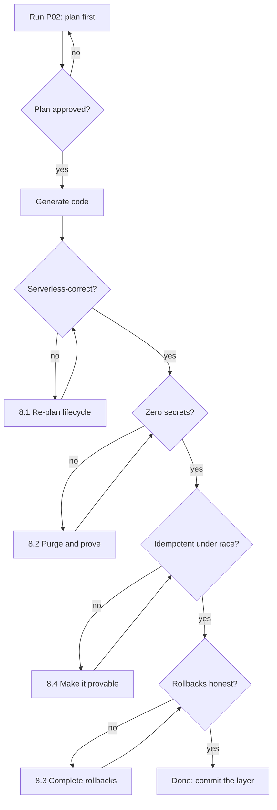

# P02 — Connect the Database

← [Previous](P01-generate-the-project-context-file.md) · [Library index](../README.md) · Next: [P03](P03-wire-up-an-mcp-server.md)

> **One line:** Get the project talking to Azure SQL and Snowflake safely, once, properly.

| | |
|---|---|
| **Phase** | 0 — Foundation (Sprint 0) |
| **Who runs it** | Backend Engineer (Ravi Mullick) |
| **When** | Day one or two of Sprint 0, immediately after `CLAUDE.md` exists |
| **Takes in** | `CLAUDE.md` from [P01](P01-generate-the-project-context-file.md); the target database names and the deployment story |
| **Produces** | `sql/schema.sql`, `sql/migrations/`, `config/settings.py`, `core/clients.py`, `sinks/sql_sink.py`, `sinks/snowflake_sink.py`, `tests/test_sinks_contract.py` |
| **Hands off to** | Team Lead (Gautam ), who runs [P03 — Wire Up an MCP Server](P03-wire-up-an-mcp-server.md) |
| **Time to run** | Half a day, including the review argument about migrations |

---

## 1. The scene

Ravi got told off on Monday morning. By Monday afternoon he has a project context file, and he is doing the same task again properly.

The task itself is unglamorous and nothing about it ships. Sprint 0 does not produce a demo of working software, which Atul has already explained twice and will explain again at the demo on Friday. What Sprint 0 produces is the difference between Sprint 2 taking two weeks and Sprint 2 taking three. Nobody claps for a connection layer. Everybody notices when it is wrong.

The shape of the problem: this pipeline writes to two completely different databases, for two completely different reasons, using two completely different authentication mechanisms, from inside a runtime that shuts your process down when it feels like it.

**Azure SQL** holds the silver layer — typed rows that passed the confidence gate — plus two operational tables the pipeline cannot function without: a ledger of every document it has ever processed, and the exception queue that Preeti works from every morning. **Snowflake** holds gold, the modelled warehouse layer that Northwind's analysts and the reconciliation report read from. Azure SQL is reached with managed identity. Snowflake is reached with a key pair. And all of it runs inside Azure Functions, where your code might be started cold, run for four hundred milliseconds, and be killed.

Hem stops by his desk while he is staring at this and asks her question. She asks it about everything, and she asked it about the connection layer on three previous projects: *what does this look like when it's wrong?*

Ravi thinks about it and says: a document loads half its rows into silver, the run dies, and nobody knows it happened.

Hem says good, that is the one, build for that.

---

## 2. What this prompt actually does — in plain language

### The problem, stated bluntly

"Connect to the database" sounds like a solved problem you should be able to do in ten minutes, and for a script on your laptop it is. For a pipeline that must produce an audit trail, it is not, and the gap between those two is where most of the pain in this kind of project lives.

Here is what actually has to be true before a single position row is worth anything:

- The write either happens completely or does not happen at all.
- Running the same document twice produces one row, not two.
- Nobody can read a password out of the code, the config, or the environment.
- When it fails, a human can find out which document, which field, and why — six months later.
- The schema in the database matches the schema in the repository, and you can prove it.

**This prompt exists because every one of those is a design decision, and if you do not make them deliberately in Sprint 0, they get made accidentally in Sprint 2 by whoever is in a hurry.**

### The two databases, and why there are two

New readers ask this immediately and it deserves a straight answer.

> **Azure SQL** is Microsoft's managed version of SQL Server. You get a normal relational database — tables, rows, transactions, indexes, foreign keys — without running a server. It is very good at the thing this pipeline needs constantly: writing a handful of rows atomically, with a transaction, right now.

> **Snowflake** is a cloud data warehouse. Different job. It is built for reading enormous amounts of data quickly and for keeping compute separate from storage, so the analytics team can run a heavy query without slowing down anything else. It is not built for firing thousands of tiny individual inserts at it.

So the split is not architectural fashion, it is a workload split:

| | Azure SQL (silver) | Snowflake (gold) |
|---|---|---|
| Written by | The Function, one document at a time | A batch load, periodically |
| Write shape | Small, transactional, frequent | Large, set-based, infrequent |
| Read by | The exception queue UI, the pipeline itself | Analysts, the reconciliation report |
| Holds | Staging rows, the processed-document ledger, the exception queue | The modelled, joined, business-ready tables |
| Auth | Managed identity | Key pair (JWT) |

### Bronze, silver, gold — one more time, concretely

You met these words in [P01](P01-generate-the-project-context-file.md). Here is what they are in this project, as actual storage:

- **Bronze** is a blob. The complete, untouched JSON that Azure AI Document Intelligence returned, written to `bronze/{sha256}.json` before anyone reads a field out of it. It is not a database at all. It exists so that when you find a parsing bug in Sprint 3 — and you will, it is called NWD-142 — you can reprocess every document you have ever seen for free instead of paying per page again.
- **Silver** is `etl.counterparty_position` in Azure SQL. Typed, validated, one row per position, still recognisably shaped like the source document.
- **Gold** is `NORTHWIND.RECON.COUNTERPARTY_POSITION` in Snowflake. Modelled for reading, carrying the audit columns that let an analyst ask "how confident were we about this, and where is the original."

### The three tables in Azure SQL, and why each exists

This is the part people skip, and it is the part that determines whether the system is operable.

**`etl.counterparty_position`** — the silver layer. One row per position on a statement. Nothing surprising: security identifier, quantity, market value, currency, valuation date, counterparty, plus the audit columns.

**`etl.processed_document`** — the ledger. One row per document the pipeline has ever seen, keyed on the SHA-256 hash of the file's bytes.

> **SHA-256** is a hash function. Feed it any file and it returns a 64-character string. The same bytes always produce the same string; different bytes essentially never do. That is the whole idea.

Why a hash and not a filename? Because counterparties resend. Broker Alpha sends `positions_20260304.pdf`, then resends the identical file as `positions_20260304_RESEND.pdf`, then their ops team sends it again as `positions_20260304 (1).pdf`. Same document, three names. Key on the name and you get three sets of positions in the warehouse and a reconciliation report full of doubled quantities. Key on the content and the second and third arrivals are recognised instantly and skipped. This is invariant 4 in the context file, and it is also bug **NWD-140**, which Pankaj files in Sprint 3 because one code path did the wrong thing.

**`etl.extraction_exception`** — the queue. Every document the rules engine rejected, with the reason, the field that failed, its confidence score, and a pointer to the bronze blob. This is not a log table. It is a work queue with a state machine, and it is the data behind Dzmitry's review screen. Preeti opens it at 08:30 every morning and it is her actual job.

The distinction matters and it is worth being explicit: **logs are for engineers debugging the system; the exception queue is for an analyst doing their job.** They have different retention, different access, different shapes, and putting one in the other ruins both.

### Authentication: two mechanisms, and why neither is a password

The invariant from [P01](P01-generate-the-project-context-file.md) is blunt: no API keys anywhere. Here is what replaces them.

#### Managed identity, for Azure SQL

> **What it is in one line.** Managed identity means your running code has its own identity in Azure's directory, and the platform proves that identity on its behalf. There is no secret in your code, because there is no secret.

> **Why it's here.** A password in an environment variable is a password in a deployment pipeline, in a developer's shell history, and in a screenshot someone pasted into a chat. Managed identity has none of those failure modes, because there is nothing to paste.

> **The catch.** It only works where Azure can vouch for you. On your laptop, `DefaultAzureCredential` falls back to your own developer login — the account you signed into the Azure CLI with. That means "works on my machine" and "works in production" are genuinely different code paths, and you have to test both.

In Python this is one object:

```python
from azure.identity import DefaultAzureCredential
credential = DefaultAzureCredential()
```

`DefaultAzureCredential` tries a chain of methods in order and uses the first that works: environment variables, the platform-assigned managed identity, your Azure CLI login, your IDE login. You write it once and it behaves correctly in every environment.

The identity then needs permissions. In Azure these are **roles**, assigned to the identity on a specific resource. This project uses three:

| Role | Grants what | Needed for |
|---|---|---|
| `Storage Blob Data Contributor` | Read and write blobs in a storage account | Landing PDFs, writing bronze |
| `Cognitive Services User` | Call Azure AI services | Document Intelligence, Language, Translator |
| `Key Vault Secrets User` | Read secrets from Key Vault | Fetching the Snowflake private key |

Azure SQL is slightly different: the identity has to be created as a *user inside the database* as well, with `CREATE USER [<app-name>] FROM EXTERNAL PROVIDER`. This trips up nearly everyone the first time, because the role assignment in the Azure portal looks correct and the connection still fails.

#### Key-pair JWT, for Snowflake

Snowflake is not an Azure service, so managed identity does not apply. Its recommended non-password mechanism is key-pair authentication.

> **What a key pair is.** Two mathematically linked keys. The **private** key you keep secret. The **public** key you hand out. Anything signed with the private key can be verified with the public key, which proves the signer had the private key without ever revealing it.

> **What a JWT is.** A JSON Web Token: a small blob of JSON saying who you are and when the claim expires, signed with your private key. You send it instead of a password. Snowflake already has your public key on your user account, so it verifies the signature and lets you in.

> **Where the private key lives.** Azure Key Vault, fetched at runtime with the managed identity above. So the chain is: platform vouches for the Function → Function reads the private key from Key Vault → key signs a JWT → Snowflake accepts the JWT. **At no point is there a password.**

Yes, this is more moving parts than a password. That is the trade, and it is the right one for a system whose value proposition is auditability.

### Connection pooling, and why serverless breaks the normal advice

This is the part where good general advice becomes bad specific advice, so read it carefully.

> **A connection pool** is a set of already-open database connections that your application reuses. Opening a connection is slow — a network round trip, a TLS handshake, an authentication exchange, often 50 to 300 milliseconds. A pool opens some connections up front and hands them out, so most requests skip that cost.

For a normal long-running web server this is unambiguously correct. For Azure Functions on a consumption plan it is a trap, for three reasons:

**Reason one: your process does not live long.** The platform starts an instance when work arrives and shuts it down when work stops. A pool of ten connections opened at module load, used once, and then killed is ten connections' worth of setup cost for one query's worth of work.

**Reason two: scaling multiplies the pool.** Consumption plans scale out by starting more instances. At month-end, when 200 documents/day briefly becomes a burst, you may have 40 instances running. A pool of ten per instance is 400 connections. Azure SQL will start refusing them, and the error you get is confusing enough that people usually blame the wrong thing.

**Reason three: cold start.** The first invocation on a new instance pays for module import, credential acquisition, and connection setup. Putting expensive work at module level makes every cold start worse, and cold starts are exactly when you are already slow.

The pattern that actually works:

- **Acquire the credential once**, at module level, and cache it. `DefaultAzureCredential` caches tokens internally and token acquisition is the expensive part.
- **Open a connection per invocation**, inside a context manager, and close it when done.
- **Keep the pool small if you use one at all** — `max_size` of 2 or 3, not 10.
- **Retry on transient failures.** Azure SQL throws transient errors under load; they are normal and they are retryable. Snowflake and Document Intelligence both throw HTTP 429 ("too many requests") at month-end, which is bug **NWD-141** when you do not handle it.

This is exactly the kind of thing the AI gets wrong by default, because the overwhelming majority of the Python it has read is written for long-running servers. **Telling it the runtime is serverless is not optional; it changes the correct answer.**

### Migrations, and why you need the rollback

> **A migration** is a numbered, ordered SQL script that changes the schema. `001_create_etl_schema.sql` creates things. `002_add_confidence_columns.sql` adds columns. You run them in order against a database and it arrives at the right shape. A table records which have been applied so you never run one twice.

Why not just keep `schema.sql` up to date and run it? Because `schema.sql` describes the destination and says nothing about how to get there from where a database currently is. Production is not empty. Production has data in it.

**Every migration needs a rollback.** This is the part people skip and it is the part that matters at 23:00 on a release night. A rollback is the inverse script: `002_add_confidence_columns.down.sql` drops what `002` added.

The honest caveat: not everything is reversible. Dropping a column loses the data in it. A rollback for a destructive change is a *plan*, not a script, and the plan usually involves a backup. The prompt below asks the AI to say so explicitly rather than pretend, because a rollback script that silently loses data is worse than an admission that there is not one.

On Northwind there is a further wrinkle, and it came straight out of the Unknowns section in [P01](P01-generate-the-project-context-file.md): **Northwind's DBA team owns production schema changes and will not accept an automated migration from a vendor.** So the migrations are generated and tested by Kestrel, run automatically in dev and test, and handed to Northwind's DBAs as reviewed scripts for production. That constraint has to be in the prompt, or the AI will happily wire up an auto-apply-on-startup mechanism that nobody is allowed to use.

### Typed query helpers, and the two things they buy you

The context file bans an ORM.

> **An ORM** — Object-Relational Mapper — is a library that lets you write `session.query(Position).filter(...)` instead of SQL, and generates the SQL for you. SQLAlchemy and Django's ORM are the well-known Python ones.

Banning it is a real decision with real costs, and the reason is auditability: on this project a reviewer has to be able to read the exact SQL that touched a client's position data, in the source file that ran it, without mentally simulating a query builder.

But "no ORM" must not become "SQL strings scattered through the codebase," which is how you get SQL injection and unreadable diffs. The middle ground is a small typed helper layer:

```python
def fetch_all(sql: str, params: Mapping[str, Any]) -> list[Row]: ...
def execute(sql: str, params: Mapping[str, Any]) -> int: ...
def execute_many(sql: str, rows: Sequence[Mapping[str, Any]]) -> int: ...
```

Three functions. Every query in the codebase goes through them. That buys two things.

**Parameterisation is enforced.** Parameters are passed separately from the SQL text and the driver handles quoting. This is what prevents **SQL injection** — an attack where data supplied from outside gets interpreted as SQL commands. A statement filename containing `'; DROP TABLE etl.counterparty_position; --` is a string when parameterised and a catastrophe when interpolated. Counterparty filenames come from outside your system. Treat them as hostile.

**One place to add cross-cutting behaviour.** Retry on transient errors, timing metrics, structured logging of which query ran against which document — all of it goes in three functions instead of ninety call sites.

### Atomicity, and Hem's question

Back to what Ravi said at his desk: a document loads half its rows, the run dies, nobody knows.

The defence is a **transaction** — a group of statements that either all take effect or none do. Wrap the position inserts and the ledger row in one transaction and commit once. If anything throws, the database rolls back and it is as though nothing happened. The next run finds no ledger row, sees the document as unprocessed, and does it again cleanly.

The ordering matters and it is counter-intuitive: **write the ledger row inside the same transaction as the data, not before it and not after it.** Before, and a crash leaves a document marked processed with no data, permanently invisible. After, and a crash leaves data with no ledger row, so the next run duplicates it. Inside, and both outcomes are impossible. This is the concrete implementation of invariant 2 from [P01](P01-generate-the-project-context-file.md): one failing field sends the whole document to review. Not most of it. All of it.

### The one idea to remember

**The connection layer is not plumbing, it is where your audit story is either true or false.** Everything above — the hash, the transaction, the ledger, the absence of passwords — exists so that in nine months somebody can point at a number in a Snowflake table and you can show them the PDF it came from, what the model's confidence was, and who approved it. Build that in Sprint 0 and it is free. Retrofit it in Sprint 4 and it is a rewrite.

---

## 3. The prompt

Run this from the repository root with `CLAUDE.md` in place, so the invariants are already loaded.

```text
You are the **Backend Engineer** setting up the database layer for this project. Your goal is
a connection, schema and sink layer that is correct on day one and does not need revisiting.

**STOP GATE — read this first.** Produce a written plan before any code. The plan must state:
your table design, your transaction boundaries, your connection strategy, and your migration
strategy. **Stop and show me the plan. Do not write a single file until I reply "approved".**

**Context you must honour** (these come from CLAUDE.md and override anything you would
normally do):
- Runtime: [RUNTIME] — this changes the correct connection strategy, do not assume a
  long-running process.
- Operational database: [OPERATIONAL DB] holding [OPERATIONAL PURPOSE]
- Analytical database: [ANALYTICAL DB] holding [ANALYTICAL PURPOSE]
- Authentication: [AUTH MECHANISMS] — **no passwords, no API keys, anywhere, including tests**
- ORM policy: [ORM POLICY]
- Migration policy: [MIGRATION POLICY]
- Idempotency key: [IDEMPOTENCY KEY]

**Build, in this order:**

1. **Schema** at `[SCHEMA PATH]`. Create these tables, with the exact purposes given:
   [TABLE LIST]
   For every table give: primary key, indexes with a one-line reason each, nullability, and
   the audit columns.

2. **Migrations** under `[MIGRATIONS PATH]`, numbered `NNN_description.sql` with a matching
   `NNN_description.down.sql` for every one. **Where a rollback would lose data, do not write a
   fake one — write a comment stating what the recovery plan is instead.**

3. **Settings** at `[SETTINGS PATH]`. Every value read from the environment, typed, validated
   at import, failing loudly with the name of the missing variable. **No secret values.**

4. **Clients** at `[CLIENTS PATH]`. Credential acquisition, cached at module level. Connection
   acquisition, per-invocation, as a context manager.

5. **Typed query helpers** — `fetch_all`, `execute`, `execute_many` — with parameters passed
   separately from SQL text. **Every query in the codebase goes through these.**

6. **Sinks** at `[SINK PATHS]`. Each exposes a single write function that takes typed rows and
   is idempotent on [IDEMPOTENCY KEY].

7. **Contract tests** at `[TEST PATH]` proving: (a) re-running the same input writes one row
   not two, (b) a failure mid-write leaves zero rows, (c) no code path builds SQL by string
   interpolation.

**Transaction rule:** the data rows and the ledger row commit in **one** transaction. Never
write the ledger before the data. Never write it after.

**For every retry you add**, state what error it retries, the backoff, and the maximum
attempts. **Do not add a blanket retry-on-any-exception.**

**Do not:**
- Do not use an ORM or a query builder.
- Do not open connections at module level or build a pool larger than [MAX POOL].
- Do not read secrets from environment variables — secrets come from [SECRET STORE].
- Do not add auto-apply-on-startup migrations.
- Do not invent columns that are not in the table list; ask instead.
- Do not write a `.down.sql` that silently loses data without saying so.

**You are done when:** the plan was approved, every table in the list exists in the schema with
indexes and reasons, every migration has a rollback or a stated recovery plan, no string in the
repository concatenates a value into SQL, and the three contract tests pass.

Save to the paths given above.
```

---

## 4. Every placeholder, explained

| Placeholder | What to put in it | Northwind example | What happens if you get it wrong |
|---|---|---|---|
| `[RUNTIME]` | The exact execution model, including the hosting plan. | `Azure Functions, Python 3.11 v2 model, consumption plan — processes are short-lived and scale out horizontally` | The single highest-cost mistake in this prompt. Omit it and you get a module-level pool of ten connections, which works on your laptop and exhausts the SQL connection limit at month-end. |
| `[OPERATIONAL DB]` | The transactional database, with product name and version. | `Azure SQL Database (SQL Server 2022 compatibility)` | Say just "SQL" and you get generic ANSI SQL without `MERGE`, `OFFSET/FETCH`, or the T-SQL error handling you need. |
| `[OPERATIONAL PURPOSE]` | What lives there, in one clause. | `the silver staging layer, the processed-document ledger, and the analyst exception queue` | Left vague, the AI puts the exception queue in Snowflake, where the review UI cannot write to it quickly. |
| `[ANALYTICAL DB]` | The warehouse. | `Snowflake, database NORTHWIND, schema RECON` | Without the database and schema names, every generated statement uses placeholders you then hand-edit in twelve files. |
| `[ANALYTICAL PURPOSE]` | What gold is for. | `the modelled gold layer read by analysts and the reconciliation report` | You get row-by-row inserts into Snowflake, which is the single most expensive way to use it. |
| `[AUTH MECHANISMS]` | Both, named precisely, per system. | `Azure SQL via managed identity (DefaultAzureCredential); Snowflake via key-pair JWT with the private key in Azure Key Vault` | Be vague and you get `password=os.environ["SQL_PASSWORD"]`. This is literally the mistake from §1 of [P01](P01-generate-the-project-context-file.md). |
| `[ORM POLICY]` | Your decision, plus the reason. | `No ORM. Raw parameterised SQL only, so a reviewer can read the exact statement that touched client data.` | State the ban without the reason and the AI writes a hand-rolled mini-ORM to be helpful, which is worse than either option. |
| `[MIGRATION POLICY]` | Who runs them where, and what they will not accept. | `Auto-apply in dev and test. Production scripts are handed to Northwind's DBA team for manual review and execution — no auto-apply in production, ever.` | You get startup migrations. Northwind's DBAs reject the whole deployment and you find out in release week. |
| `[IDEMPOTENCY KEY]` | Exactly what makes a record unique. | `SHA-256 of the PDF file content — never the filename` | This is bug NWD-140. Say "the document ID" and the AI picks the filename, because that is what a document ID usually is. |
| `[SCHEMA PATH]` | Where the schema lives. | `sql/schema.sql` | Wrong path and the blocking hook in [P04](P04-hooks-as-guardrails.md) protects a file nobody uses. |
| `[TABLE LIST]` | One line per table, name plus purpose. Be specific. | See §5 — three tables | Leave it open and you get eleven tables including a `users` table you do not need and an `audit_log` that duplicates your ledger. |
| `[MIGRATIONS PATH]` | Folder for numbered scripts. | `sql/migrations/` | Scripts scattered next to `schema.sql`; ordering becomes guesswork. |
| `[SETTINGS PATH]` | The config module. | `config/settings.py` | Config gets read with `os.environ[...]` at nine call sites and a missing variable fails at 03:00 instead of at import. |
| `[CLIENTS PATH]` | Where credential and connection acquisition lives. | `core/clients.py` | Credentials get constructed in every sink, so each one pays the token-acquisition cost separately. |
| `[SINK PATHS]` | The write modules. | `sinks/sql_sink.py` and `sinks/snowflake_sink.py` | Both databases end up in one file and the Snowflake batch logic gets tangled with per-document transactions. |
| `[TEST PATH]` | Contract tests. | `tests/test_sinks_contract.py` | No tests means the idempotency claim is an assertion rather than a fact. |
| `[MAX POOL]` | Hard cap on pooled connections per instance. | `2` | Unbounded pools times horizontal scale-out equals connection exhaustion at exactly the busiest moment. |
| `[SECRET STORE]` | Where secrets actually come from. | `Azure Key Vault, read with the managed identity` | The Snowflake private key ends up base64-encoded in an environment variable, which is a password wearing a hat. |

---

## 5. The filled-in example

Ravi ran this on Monday afternoon of Sprint 0, after `CLAUDE.md` was committed.

```text
You are the **Backend Engineer** setting up the database layer for this project. Your goal is
a connection, schema and sink layer that is correct on day one and does not need revisiting.

**STOP GATE — read this first.** Produce a written plan before any code. The plan must state:
your table design, your transaction boundaries, your connection strategy, and your migration
strategy. **Stop and show me the plan. Do not write a single file until I reply "approved".**

**Context you must honour** (these come from CLAUDE.md and override anything you would
normally do):
- Runtime: Azure Functions, Python 3.11 v2 programming model, consumption plan. Processes are
  short-lived, cold-started, and scale out horizontally to dozens of instances at month-end.
  This changes the correct connection strategy — do not assume a long-running process.
- Operational database: Azure SQL Database (SQL Server 2022 compatibility) holding the silver
  staging layer, the processed-document ledger, and the analyst exception queue.
- Analytical database: Snowflake, database NORTHWIND, schema RECON, holding the modelled gold
  layer read by analysts and by the reconciliation report.
- Authentication: Azure SQL via managed identity using DefaultAzureCredential; Snowflake via
  key-pair JWT with the private key stored in Azure Key Vault and read with the same managed
  identity. **No passwords, no API keys, anywhere, including tests.**
- ORM policy: No ORM and no query builder. Raw parameterised SQL only, so that a reviewer can
  read the exact statement that touched client position data in the file that ran it.
- Migration policy: auto-apply in dev and test only. Production migration scripts are handed to
  Northwind's DBA team for manual review and execution. No auto-apply in production, ever.
- Idempotency key: SHA-256 of the PDF file content. Never the filename — counterparties resend
  identical statements under new names constantly.

**Build, in this order:**

1. **Schema** at `sql/schema.sql`. Create these tables, with the exact purposes given:
   - `etl.counterparty_position` — silver layer. One row per position line on a statement.
     Carries security identifier, quantity, market value, currency, valuation date,
     counterparty code, plus audit columns: document SHA-256, minimum field confidence,
     bronze blob path, extraction model id, loaded-at timestamp.
   - `etl.processed_document` — the ledger. One row per document ever seen, keyed on the file
     content SHA-256. Records counterparty, source blob path, bronze path, classification
     confidence, outcome (LOADED / EXCEPTION / SKIPPED_DUPLICATE), row count, processed-at.
   - `etl.extraction_exception` — the analyst work queue. One row per rejected document, with
     the failing field name, its confidence score, the threshold it missed, the reason code,
     the bronze path, a state (OPEN / IN_REVIEW / RESOLVED / REJECTED), assignee, and
     resolution notes.
   For every table give: primary key, indexes with a one-line reason each, nullability, and
   the audit columns.

2. **Migrations** under `sql/migrations/`, numbered `NNN_description.sql` with a matching
   `NNN_description.down.sql` for every one. **Where a rollback would lose data, do not write a
   fake one — write a comment stating what the recovery plan is instead.**

3. **Settings** at `config/settings.py`. Every value read from the environment, typed,
   validated at import, failing loudly with the name of the missing variable. **No secret values.**

4. **Clients** at `core/clients.py`. Credential acquisition, cached at module level. Connection
   acquisition, per-invocation, as a context manager.

5. **Typed query helpers** — `fetch_all`, `execute`, `execute_many` — with parameters passed
   separately from SQL text. **Every query in the codebase goes through these.**

6. **Sinks** at `sinks/sql_sink.py` and `sinks/snowflake_sink.py`. Each exposes a single write
   function that takes typed rows and is idempotent on the document SHA-256.

7. **Contract tests** at `tests/test_sinks_contract.py` proving: (a) re-running the same input
   writes one row not two, (b) a failure mid-write leaves zero rows, (c) no code path builds
   SQL by string interpolation.

**Transaction rule:** the position rows and the ledger row commit in **one** transaction. Never
write the ledger before the data. Never write it after.

**For every retry you add**, state what error it retries, the backoff, and the maximum
attempts. **Do not add a blanket retry-on-any-exception.**

**Do not:**
- Do not use an ORM or a query builder.
- Do not open connections at module level or build a pool larger than 2.
- Do not read secrets from environment variables — secrets come from Azure Key Vault.
- Do not add auto-apply-on-startup migrations.
- Do not invent columns that are not in the table list; ask instead.
- Do not write a `.down.sql` that silently loses data without saying so.

**You are done when:** the plan was approved, every table in the list exists in the schema with
indexes and reasons, every migration has a rollback or a stated recovery plan, no string in the
repository concatenates a value into SQL, and the three contract tests pass.

Save to the paths given above.
```

---

## 6. What comes back

First the plan, because the stop gate demands it.

```text
PLAN — database layer

Tables
  etl.processed_document   PK document_sha256 CHAR(64). The ledger and the idempotency guard.
  etl.counterparty_position PK position_id BIGINT IDENTITY. FK document_sha256 -> ledger.
  etl.extraction_exception  PK exception_id BIGINT IDENTITY. FK document_sha256 -> ledger.

  Both child tables reference the ledger, so the ledger is written FIRST inside the transaction
  as an ordering requirement of the foreign key, not as a separate commit. Flagged because the
  prompt says "never write the ledger before the data" — the intent (no separate commit) is
  honoured; the physical insert order inside the single transaction is ledger-then-rows because
  of referential integrity. Confirm this reading is acceptable.

Transaction boundary
  One transaction per document. Contains: ledger insert, position inserts, exception inserts.
  Commit once. Any exception rolls the whole thing back, leaving the document unprocessed.

Connection strategy
  DefaultAzureCredential constructed once at module import in core/clients.py and reused —
  it caches tokens internally, and token acquisition is the expensive part.
  Connections opened per invocation via a context manager, closed on exit. No module-level
  connection. Pool max_size 2 where pooling is used at all.
  Retry only on: transient SQL error numbers 4060, 40197, 40501, 40613, 49918, 49919, 49920,
  and on HTTP 429 from Snowflake. Exponential backoff 0.5s base, 4 attempts, full jitter.

Migrations
  sql/migrations/001_create_etl_schema.sql .. NNN. Each with a .down.sql.
  A migration_history table records applied versions. Applied automatically only when
  ENVIRONMENT in (dev, test). In production the runner prints the pending scripts and exits 0
  without executing, so the DBA team can take them.

Open question for you
  The exception queue state machine: is RESOLVED terminal, or can a resolved exception be
  reopened when the analyst's correction turns out to be wrong? This changes whether state is
  a column or a separate history table.

Awaiting "approved".
```

Then, after approval, the artifacts. Abridged:

```sql
-- sql/schema.sql (excerpt)
CREATE SCHEMA etl;
GO

CREATE TABLE etl.processed_document (
    document_sha256        CHAR(64)       NOT NULL,
    counterparty_code      VARCHAR(64)    NOT NULL,
    source_blob_path       NVARCHAR(1024) NOT NULL,
    bronze_blob_path       NVARCHAR(1024) NOT NULL,
    classifier_confidence  DECIMAL(5,4)   NULL,
    extraction_model_id    VARCHAR(128)   NULL,
    outcome                VARCHAR(24)    NOT NULL,   -- LOADED | EXCEPTION | SKIPPED_DUPLICATE
    row_count              INT            NOT NULL CONSTRAINT DF_pd_rows DEFAULT 0,
    processed_at_utc       DATETIME2(3)   NOT NULL CONSTRAINT DF_pd_at DEFAULT SYSUTCDATETIME(),
    CONSTRAINT PK_processed_document PRIMARY KEY CLUSTERED (document_sha256),
    CONSTRAINT CK_pd_outcome CHECK (outcome IN ('LOADED','EXCEPTION','SKIPPED_DUPLICATE'))
);

-- Reason: the duplicate check on every arriving document is a point lookup on the PK.
-- Reason: operations asks "what did we process for broker X yesterday" every morning.
CREATE INDEX IX_pd_counterparty_date
    ON etl.processed_document (counterparty_code, processed_at_utc DESC)
    INCLUDE (outcome, row_count);

CREATE TABLE etl.counterparty_position (
    position_id          BIGINT         IDENTITY(1,1) NOT NULL,
    document_sha256      CHAR(64)       NOT NULL,
    counterparty_code    VARCHAR(64)    NOT NULL,
    security_identifier  VARCHAR(64)    NOT NULL,
    security_name        NVARCHAR(256)  NULL,
    quantity             DECIMAL(28,8)  NOT NULL,
    market_value         DECIMAL(28,4)  NOT NULL,
    currency             CHAR(3)        NOT NULL,
    valuation_date       DATE           NOT NULL,
    min_field_confidence DECIMAL(5,4)   NOT NULL,
    bronze_blob_path     NVARCHAR(1024) NOT NULL,
    loaded_at_utc        DATETIME2(3)   NOT NULL CONSTRAINT DF_cp_at DEFAULT SYSUTCDATETIME(),
    CONSTRAINT PK_counterparty_position PRIMARY KEY CLUSTERED (position_id),
    CONSTRAINT FK_cp_document FOREIGN KEY (document_sha256)
        REFERENCES etl.processed_document (document_sha256)
);

-- Reason: reconciliation joins on (counterparty, security, valuation_date) for a whole book.
CREATE INDEX IX_cp_recon_key
    ON etl.counterparty_position (valuation_date, counterparty_code, security_identifier)
    INCLUDE (quantity, market_value, currency, min_field_confidence);

CREATE TABLE etl.extraction_exception (
    exception_id       BIGINT         IDENTITY(1,1) NOT NULL,
    document_sha256    CHAR(64)       NOT NULL,
    counterparty_code  VARCHAR(64)    NOT NULL,
    reason_code        VARCHAR(48)    NOT NULL,  -- LOW_CONFIDENCE | VALIDATION | CLASSIFY | REDACT_FAILED
    failing_field      VARCHAR(128)   NULL,
    field_confidence   DECIMAL(5,4)   NULL,
    threshold_applied  DECIMAL(5,4)   NULL,
    bronze_blob_path   NVARCHAR(1024) NOT NULL,
    state              VARCHAR(16)    NOT NULL CONSTRAINT DF_ee_state DEFAULT 'OPEN',
    assigned_to        NVARCHAR(128)  NULL,
    raised_at_utc      DATETIME2(3)   NOT NULL CONSTRAINT DF_ee_at DEFAULT SYSUTCDATETIME(),
    CONSTRAINT PK_extraction_exception PRIMARY KEY CLUSTERED (exception_id),
    CONSTRAINT FK_ee_document FOREIGN KEY (document_sha256)
        REFERENCES etl.processed_document (document_sha256),
    CONSTRAINT CK_ee_state CHECK (state IN ('OPEN','IN_REVIEW','RESOLVED','REJECTED'))
);

-- Reason: Preeti's screen opens on "everything OPEN, oldest first". This is that query.
CREATE INDEX IX_ee_open_queue
    ON etl.extraction_exception (state, raised_at_utc)
    INCLUDE (counterparty_code, reason_code, failing_field, field_confidence);
```

```python
# core/clients.py (excerpt)
"""Credential and connection acquisition. Nothing else lives here."""
_SQL_SCOPE = "https://database.windows.net/.default"
_SQL_ACCESS_TOKEN_OPTION = 1256  # SQL_COPT_SS_ACCESS_TOKEN


@lru_cache(maxsize=1)
def credential() -> DefaultAzureCredential:
    """One credential per process. Token caching happens inside the object."""
    return DefaultAzureCredential()


@contextlib.contextmanager
def sql_connection() -> Iterator[pyodbc.Connection]:
    """Per-invocation connection. Never hold one across invocations.

    The consumption plan scales out horizontally; a long-lived pool per instance
    multiplies into connection exhaustion at month-end.
    """
    token = credential().get_token(_SQL_SCOPE).token
    token_bytes = _encode_access_token(token)
    conn = pyodbc.connect(
        settings.SQL_CONNECTION_STRING,   # server + database only. No credentials in it.
        attrs_before={_SQL_ACCESS_TOKEN_OPTION: token_bytes},
        timeout=settings.SQL_LOGIN_TIMEOUT_SECONDS,
    )
    try:
        conn.autocommit = False
        yield conn
    finally:
        conn.close()
```

```python
# sinks/sql_sink.py (excerpt)
def write_document(
    ledger: LedgerRow,
    positions: Sequence[PositionRow],
    exceptions: Sequence[ExceptionRow],
) -> WriteResult:
    """Write one document atomically. Idempotent on ledger.document_sha256.

    Either everything lands or nothing does. A second call with the same SHA-256
    returns SKIPPED_DUPLICATE and writes nothing.
    """
    with sql_connection() as conn:
        cur = conn.cursor()
        try:
            inserted = cur.execute(
                """
                INSERT INTO etl.processed_document (
                    document_sha256, counterparty_code, source_blob_path,
                    bronze_blob_path, classifier_confidence, extraction_model_id,
                    outcome, row_count)
                SELECT ?, ?, ?, ?, ?, ?, ?, ?
                WHERE NOT EXISTS (
                    SELECT 1 FROM etl.processed_document WITH (UPDLOCK, HOLDLOCK)
                    WHERE document_sha256 = ?)
                """,
                (ledger.sha256, ledger.counterparty, ledger.source_path,
                 ledger.bronze_path, ledger.classifier_confidence, ledger.model_id,
                 ledger.outcome, len(positions), ledger.sha256),
            ).rowcount

            if inserted == 0:
                conn.rollback()
                return WriteResult(outcome="SKIPPED_DUPLICATE", rows_written=0)

            if positions:
                cur.executemany(_INSERT_POSITION, [p.as_params() for p in positions])
            if exceptions:
                cur.executemany(_INSERT_EXCEPTION, [e.as_params() for e in exceptions])

            conn.commit()
            return WriteResult(outcome=ledger.outcome, rows_written=len(positions))
        except Exception:
            conn.rollback()
            raise
```

### How to read this

**Look at the plan's "Open question" first.** The AI found a real ambiguity — whether a resolved exception can be reopened — that nobody on the team had thought about. Ravi took it to Preetinka. Her answer, from her custodian-bank days, was immediate: yes, of course it can, an analyst fixes a break and then finds out they fixed it wrong, that happens weekly. That answer turned into a separate history table and it would have been much more expensive to discover in Sprint 3.

**Look at the flagged conflict in the plan.** The prompt said "never write the ledger before the data." The foreign keys force ledger-first inside the transaction. The AI did not silently pick one; it named the tension, explained the reading it took, and asked. That behaviour comes directly from the stop gate, and it is the single most valuable thing the stop gate buys you.

**Look at the `WHERE NOT EXISTS ... WITH (UPDLOCK, HOLDLOCK)` in the insert.** That is the idempotency guard doing real work under concurrency. Two Function instances can pick up the same resent PDF within milliseconds of each other. Without those hints both check, both see nothing, and both insert. With them, one waits and then sees the other's row. If you take one line of SQL from this file, take that one.

**The part that is commonly wrong: the retry list.** The first output had a bare `@retry(attempts=3)` decorator on everything. That is worse than no retry, because it retries a constraint violation three times before failing, and it retries a bug. The prompt explicitly demands that every retry name its error class, which is why the plan above lists SQL error numbers instead. Check this every time — it is the instruction the AI most often softens.

---

## 7. Why this is the final prompt

### What "done" means here

Done is: **you can delete every row in both databases, replay a day of documents from the blob landing zone, and get back byte-identical results — and if you replay them twice, you get the same thing again.**

That is one sentence and it silently requires all of it: idempotency, atomicity, a working ledger, and no state hidden in the application.

### The checklist

- [ ] The plan was reviewed and approved by a second person before code was written. Not skimmed. Read.
- [ ] Every table in the schema has at least one index, and every index has a written reason.
- [ ] Every migration has either a `.down.sql` or a comment stating why a rollback is impossible and what the recovery plan is.
- [ ] `grep` for f-strings, `%`, `.format(` and `+` near the word `SELECT`, `INSERT`, `UPDATE` or `MERGE` returns nothing.
- [ ] No password, key, token or secret appears in the repository — including in test fixtures and docstrings.
- [ ] The three contract tests exist and pass: duplicate-write, mid-write-failure, no-interpolation.
- [ ] Someone has run the code against a real database once, with a real managed identity, not only against a mock.

### Why you should stop rather than keep prompting

Two specific over-prompting traps here.

**The first is schema creep.** Ask the AI to "improve the schema" and you will get soft deletes, effective-dated history on every table, a `created_by`/`updated_by` pair, a generic `metadata` JSON column, and a lookup table for counterparties. Each is defensible in isolation. Together they double the surface area of a layer you have not yet used in anger. Every column you add now is a column you migrate later.

**The second is premature abstraction of the sinks.** The AI will offer to extract a `BaseSink` class so that SQL and Snowflake share an interface. Do not take it yet. They are genuinely different — one is per-document and transactional, the other is batch and set-based — and the shared abstraction that looks elegant on day two becomes the thing you fight in Sprint 2 when the Snowflake `MERGE` needs a staging table the SQL path has no concept of.

The right time to abstract is when you have three, not two, and you have seen them all work. Hem has an ADR about exactly this in Sprint 1.

### The signal that you are NOT done

You cannot answer, out loud, in one sentence, what happens if the process is killed halfway through writing a document. If the answer involves the word "probably," go to §8.

---

## 8. When it is not done — the follow-up prompts

| What you're seeing | What's actually wrong | Run this next |
|---|---|---|
| Connections open at module level, or the pool is 10 | The runtime constraint did not land — the AI defaulted to long-running-server advice | **8.1 — Re-plan for the serverless lifecycle** |
| A password or key appears anywhere, including tests | The auth mechanism was described loosely, or the test fixture took the easy route | **8.2 — Purge every secret and prove it** |
| Migrations exist but half have no rollback | The AI wrote rollbacks where they were easy and skipped where they were not, silently | **8.3 — Complete the rollback story honestly** |
| Re-running the same document produces two rows | Idempotency was implemented as a check-then-insert without a lock, or keyed on the wrong thing | **8.4 — Make idempotency provable under concurrency** |
| Everything works but nobody can tell what the pipeline did last night | You built writes and forgot readers — the ledger has no query surface | **8.5 — Add the operator queries** |
| The AI is guessing at column types and table names | It has no visibility of the real database | **[P03 — Wire Up an MCP Server](P03-wire-up-an-mcp-server.md)** |
| The rules keep getting broken on later edits | Advisory rules are not enough for something this expensive to get wrong | **[P04 — Hooks as Guardrails](P04-hooks-as-guardrails.md)** |

### 8.1 "It built this for a server that never restarts"

Use this when you see module-level connections, a big pool, or anything cached across invocations that should not be.

```text
This code assumes a long-running process. The runtime is [RUNTIME], where processes are
short-lived, cold-started, and scale out to [MAX INSTANCES] instances under load.

**Re-plan the connection lifecycle** and answer these five questions explicitly before changing
any code:
1. What is created at module import, and what does it cost on a cold start?
2. What is created per invocation, and what does it cost?
3. At [MAX INSTANCES] instances with a pool of N, what is the total connection count, and what
   is the database's limit?
4. What happens to an in-flight transaction when the platform shuts the instance down?
5. Which of these is safe to cache across invocations, and why: the credential, the access
   token, the connection, a prepared statement?

**Then apply the plan.** Move anything expensive and safe to module level. Move anything
stateful to per-invocation. Cap the pool at [MAX POOL].

**Do not** add a keep-alive, a background refresh thread, or a warm-up timer trigger to work
around cold start. Those are separate decisions and they are not yours to make here.
```

What changes: the credential stays at module level, connections move inside the context manager, and the pool shrinks or disappears. Cold start usually gets faster too, because the AI stops eagerly opening things.

### 8.2 "There's a secret in here somewhere"

Use this after any change to the connection layer, and always before the first commit.

```text
**Audit this repository for secrets.** Search for, and report every occurrence of:
- the words password, passwd, pwd, secret, apikey, api_key, token, private_key, connectionstring
- any string longer than 20 characters that is high-entropy (base64, hex, PEM blocks)
- any `os.environ` or `os.getenv` read whose variable name suggests a credential
- any connection string containing `=` followed by something that is not a server or database
- **including in tests, fixtures, docstrings, comments, and example files**

For each hit, classify it as one of:
  (a) a real secret — must be removed and moved to [SECRET STORE]
  (b) a variable name only, no value — acceptable, say so
  (c) a placeholder in documentation — acceptable if obviously fake, flag if it looks real

**Then, for every (a):** show the replacement using [AUTH MECHANISM], and state what
permission the identity needs in order for the replacement to work.

**Do not** fix anything until you have shown me the full list. **Do not** move a secret from
code into an environment variable and call it fixed — that is the same secret in a different
place.
```

What changes: on Northwind this found two things, both in tests — a fake-looking Snowflake password that was actually the real dev-account one, and a PEM private key pasted into a fixture "temporarily."

### 8.3 "Half the migrations have no way back"

Use this when the down-scripts are patchy.

```text
Review every migration in [MIGRATIONS PATH]. For each one, classify the change:

  REVERSIBLE       — the .down.sql restores the exact prior state with no data loss
  LOSSY            — reversible in structure, but data is lost (e.g. dropping a column)
  IRREVERSIBLE     — cannot be undone by SQL alone (e.g. a destructive data rewrite)

**For every REVERSIBLE:** ensure a `.down.sql` exists and actually inverts the change. Test the
inversion mentally and state the result.

**For every LOSSY:** write the `.down.sql`, and add a header comment stating in one line
exactly what data is destroyed by running it.

**For every IRREVERSIBLE:** do not write a `.down.sql`. Instead write a `.down.md` containing
the recovery plan — what backup is needed, who runs it, and how long it takes.

**Then produce a single table** of migration number, classification, and recovery time estimate.

**Do not** write a `.down.sql` that is a no-op just so that every migration has one. An empty
rollback that looks like a rollback is the failure mode this is trying to prevent.
```

What changes: you get an honest picture, usually with two or three migrations reclassified as lossy that everyone assumed were safe.

### 8.4 "It writes duplicates when two instances race"

Use this when the same document, processed twice concurrently, produces two rows.

```text
The idempotency guard fails under concurrency. Two workers can process the same
[IDEMPOTENCY KEY] simultaneously; both check, both find nothing, both insert.

**Diagnose the current guard** and say which of these it is:
(a) check-then-insert in two separate statements
(b) check-then-insert in one statement but without a lock hint
(c) a unique constraint that is present but whose violation is not caught and handled
(d) keyed on the wrong value entirely

**Then implement the fix** using the database's own guarantees rather than application logic.
Acceptable approaches, in order of preference:
1. A unique constraint on [IDEMPOTENCY KEY], with the violation caught and translated to a
   SKIPPED_DUPLICATE result
2. A single atomic statement with an appropriate lock hint
3. A MERGE with the correct isolation

**Then write a test** that runs two writers against the same key concurrently and asserts
exactly one row exists and exactly one caller received SKIPPED_DUPLICATE.

**Do not** solve this with an application-level lock, a cache, or a "check again after
inserting". The database is the only thing that can arbitrate this.
```

What changes: the guard becomes a constraint plus a caught violation, and you get a concurrency test. This is the fix for **NWD-140** in advance.

### 8.5 "It writes fine, but I can't see what it did"

Use this when the pipeline works and operations still cannot answer basic questions.

```text
The write path is complete. The read path for operators is missing.

**Write the queries an operator needs**, as named functions in [READ MODULE PATH], each with
a docstring stating the question it answers:

1. What did we process yesterday, by counterparty, with outcome counts?
2. Which documents are in the exception queue right now, oldest first, with the failing field?
3. Which documents were skipped as duplicates in the last 7 days, and what were the original
   filenames? (This is how you spot a counterparty resending because they think we failed.)
4. What is the straight-through rate — documents needing zero human touch — for the last
   30 days, by counterparty?
5. For a given [IDEMPOTENCY KEY], the full story: when it arrived, what was extracted, what
   the confidences were, what happened, and the bronze path.

Every query goes through the typed helpers. Every query is parameterised. Each returns a typed
row, not a tuple.

**Do not** build a dashboard, an endpoint, or a CLI. Just the queries.
```

What changes: query 4 is the straight-through rate, which is the headline metric for this whole project and which Atul will ask for in the Sprint 2 demo. Better to have it early.

### The loop



---

## 9. How this goes wrong

### 9.1 The AI invents your schema and you accept it

Ask for "a table for extracted positions" and you will get one. It will have a `created_at`, an `updated_at`, a soft-delete flag, a `metadata` JSON column, and a surrogate UUID key. None of that was asked for. All of it is plausible. Some of it will be actively wrong for your reconciliation join.

It happens because the AI is pattern-matching against a million generic application schemas, and yours is not a generic application schema — it is a staging layer for a financial control process.

The fix is the `[TABLE LIST]` placeholder, filled in with real intent for every table. If you cannot state a table's purpose in one clause, you are not ready to generate it. And when the AI adds a column you did not ask for, delete it, do not rationalise it.

### 9.2 The connection layer works on a laptop and dies in the cloud

`DefaultAzureCredential` on your machine falls back to your Azure CLI login, which is probably an account with far more permission than the Function's identity will have. So everything works locally, and the first deployment fails with a permissions error that reads like a connection error.

Ravi lost most of a Tuesday to this exact thing. The managed identity had `Storage Blob Data Contributor` on the storage account and looked correctly configured in the portal, but nobody had run `CREATE USER [nwd-doc-ingestion] FROM EXTERNAL PROVIDER` inside the database itself. Azure-level role assignment and in-database user creation are two separate steps, and the second one is easy to miss because the portal gives you no hint that it exists.

The fix is procedural: deploy the connection layer to a real environment on day two of Sprint 0, with nothing else in it, and prove it connects. Do not discover this in Sprint 2 with a deadline attached.

### 9.3 You let the sink layer know about business rules

The tempting version of `write_document` takes raw extracted fields, applies the confidence thresholds, decides what is an exception, and writes the result. It is fewer files and it reads nicely.

It is also wrong, and the reason is invariant 7 from the context file: the confidence gate sits upstream. If the gate lives inside the sink, then anything that writes without going through that sink bypasses it — the reprocessing job, the manual correction path from Dzmitry's UI, the backfill script somebody writes in Sprint 4. Each of those is a hole, and each hole puts a low-confidence number into the warehouse.

The fix: the sink takes rows that have *already* been decided. It has no opinion about confidence. `core/rules.py` decides; `sinks/` writes. If a sink function has an `if confidence <` in it, that is the smell.

### 9.4 The migrations drift from the schema file

Six weeks in, `sql/schema.sql` says one thing and the sum of the migrations says another, because somebody added a column via migration and forgot the schema file, or edited the schema file and forgot the migration.

This is not a discipline problem, it is a design problem: you have two sources of truth. Either generate `schema.sql` from the migrations, or treat `schema.sql` as documentation and stop trusting it. Pick one and write it in `CLAUDE.md`.

On Northwind the answer was the second, plus a check in CI that dumps the dev database schema and diffs it against `sql/schema.sql`, failing the build on a mismatch. That check is also why `sql/schema.sql` ends up behind a blocking hook in [P04](P04-hooks-as-guardrails.md).

### 9.5 This prompt is the wrong tool entirely

Two cases.

**You are prototyping and do not know the data shape yet.** Then generating a schema with indexes, migrations, rollbacks and contract tests is premature and expensive. Use SQLite and a single table, learn the shape, and run P02 when you know what you are building. Sprint 0 on Northwind could do this properly because the data contract was already sketched in the brief.

**Your organisation has a platform team that owns database provisioning.** If someone else owns the schema, the roles and the migrations, this prompt generates work you are not allowed to apply, and the friction of un-picking it costs more than it saved. What you want instead is the read-only half — [P03](P03-wire-up-an-mcp-server.md), which gives the AI access to the real schema so it can write correct queries against a database somebody else defined.

---

## 10. The handoff

The connection layer lands late on the Monday of Sprint 0, and Gautam reviews it on Tuesday morning. His review is short, because the plan was reviewed before the code existed and that is where the design questions got settled. This is the whole argument for the stop gate: reviewing a plan takes ten minutes, and reviewing three hundred lines of generated code that implements the wrong plan takes an afternoon and produces a worse outcome.

Gautam picks up next with [P03 — Wire Up an MCP Server](P03-wire-up-an-mcp-server.md), and the reason follows directly from what Ravi just built. The AI now knows what the schema *should* be, because it wrote `sql/schema.sql`. It has no way to know what the schema actually *is* in a running database. Those two things diverge — after the first manual DBA change, after the first hotfix column — and every divergence produces confidently wrong SQL. P03 closes that gap by letting the assistant query the real catalog instead of reading a file that claims to describe it.

Ravi himself picks this back up much later, in Sprint 2, when he implements **NWD-107** — load positions into Azure SQL and Snowflake idempotently. That story is comparatively easy, because the hard parts are already done and reviewed. The sink signature is stable, the transaction boundary is decided, the idempotency guard is written and tested. What NWD-107 adds is the mapping from extracted fields to rows, and the Snowflake batch path. That is the return on Sprint 0.

Hem reads the plan, not the code, and takes two things from it into Sprint 1: the exception-queue state machine question becomes part of the data contract in [P13](../phase-2-design/P13-design-the-data-contract.md), and the two-sources-of-truth problem in §9.4 becomes ADR-0002.

> **Artifact contract — `sql/schema.sql`, `core/clients.py`, `sinks/*.py`**
>
> Anyone reading these files can rely on finding:
> - A table for every stage in the pipeline's write path, each with a stated purpose and at least one index with a written reason.
> - Exactly one function that acquires a credential, and exactly one that acquires a connection.
> - Every SQL statement parameterised, with values passed separately from statement text.
> - One transaction per document, containing both the data rows and the ledger row.
> - An idempotency guard enforced by a database constraint, not by application logic.
> - No secret value of any kind, in any file, including tests.
> - A migration for every schema change, each with a rollback script or a written recovery plan.
>
> If any of those is missing, the artifact is not done — go back to §7.

---

## 11. In the case study

This runs on day one and two of
[`Case-Study/Python-ETL/01-sprint-0-foundations.md`](../../Case-Study/Python-ETL/01-sprint-0-foundations.md).
The generated schema is the ancestor of everything in
[`Case-Study/Python-ETL/artifacts/data-contract-counterparty-position.md`](../../Case-Study/Python-ETL/artifacts/data-contract-counterparty-position.md).

The thing that went slightly wrong is instructive because it is not a code problem. Ravi approved the plan himself. He read it, it looked right, he typed "approved," and he generated the code. Gautam found out on Tuesday and was less annoyed about the process violation than about what it cost: the plan's open question — whether a resolved exception can be reopened — went unanswered for four days, because Ravi did not know the answer and quietly picked one. He picked "RESOLVED is terminal," which is the simpler design and the wrong one.

Preetinka corrected it in the Friday review in about eleven seconds. Analysts resolve a break, the correction turns out to be wrong, they reopen it. This happens constantly. The redesign cost half a day in Sprint 0, which is fine. Discovered in Sprint 3, with Dzmitry's UI already built against a terminal state, it would have cost a week and a conversation with the client.

The rule Gautam wrote into the team's definition of done that afternoon: **a stop gate you approve yourself is not a stop gate.** Somebody else reads the plan. It is in [P17](../phase-3-planning/P17-definition-of-done.md) and it stayed there for the whole engagement.

The second thing worth knowing: the `WITH (UPDLOCK, HOLDLOCK)` hint in the idempotency guard was in the generated code from the first run, and nobody on the team would have written it by hand. Ravi admitted as much in the retro. It is a good reminder that the failure mode of these tools is not "the code is bad" — it is "the code is good and solves a problem you did not state."

---

← [Previous](P01-generate-the-project-context-file.md) · [Library index](../README.md) · Next: [P03](P03-wire-up-an-mcp-server.md)
