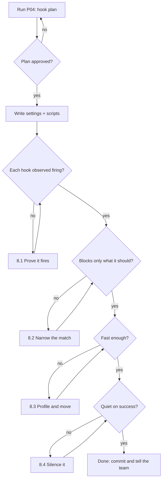

# P04 — Hooks as Guardrails

← [Previous](P03-wire-up-an-mcp-server.md) · [Library index](../README.md) · Next: [P05](P05-turn-a-repeated-task-into-a-skill.md)

> **One line:** Turn the rules you keep repeating into machinery that runs whether anyone remembers or not.

| | |
|---|---|
| **Phase** | 0 — Foundation (Sprint 0) |
| **Who runs it** | Team Lead (Gautam ) |
| **When** | Day three of Sprint 0, once `CLAUDE.md` has been ignored at least once |
| **Takes in** | `CLAUDE.md` from [P01](P01-generate-the-project-context-file.md); the lint, type-check and test commands; the list of files nobody may edit casually |
| **Produces** | `.claude/settings.json` hooks block, `scripts/hooks/*.sh`, and a line in `docs/mcp-setup.md`'s sibling `docs/hooks.md` |
| **Hands off to** | Team Lead again, who runs [P05 — Turn a Repeated Task into a Skill](P05-turn-a-repeated-task-into-a-skill.md) |
| **Time to run** | Two hours, most of it spent making the hooks fast enough to tolerate |

---

## 1. The scene

Wednesday of Sprint 0. Still nothing shipped, and Atul has moved on to worrying about Sprint 2.

Gautam runs an experiment. He opens a fresh session, with `CLAUDE.md` loaded and the MCP servers from [P03](P03-wire-up-an-mcp-server.md) connected, and asks for something entirely ordinary: add support for a third counterparty called `broker_gamma`, English, standard thresholds.

The assistant does a good job. It reads `config/sources.yaml`, adds a block, follows the existing shape, gets the threshold structure right. Then, being helpful, it notices that `broker_gamma` will need a row in a lookup table, opens `sql/schema.sql`, and adds one.

`sql/schema.sql` is the file Northwind's DBA team owns. The one from the Unknowns list in [P01](P01-generate-the-project-context-file.md), where the answer came back "our DBA team, and they will not accept an automated migration from a vendor." It is written in the context file. The assistant had read it. It edited the file anyway, because the edit was a reasonable thing to do and the rule was a sentence in a document.

Gautam does the same thing three more times with different phrasings. Twice it asks first. Once it does not.

He also goes back through Tuesday's transcripts and counts something else. `CLAUDE.md` says the project runs `ruff` and `mypy`. Across nineteen Python edits on Tuesday, the assistant ran ruff eleven times. Not zero, which would at least be a clear failure. Eleven out of nineteen, which is the worst possible number, because it means everyone has been assuming it happens.

**The lesson Gautam writes on the whiteboard: a rule that is followed most of the time is not a rule, it is a habit, and habits do not survive a long session at 17:40 on a Friday.**

That afternoon he sets up hooks.

---

## 2. What this prompt actually does — in plain language

### What a hook actually is

Start from nothing, because this is the concept people most often think they understand and do not.

> **What it is in one line.** A hook is a command that the tool wrapping the AI — the harness — runs automatically when a particular event happens. It is configured by you, in a file, and it runs whether the AI cooperates or not.

Read that last clause again, because it is the whole point.

Everything in [P01](P01-generate-the-project-context-file.md) was advisory. You wrote invariants in `CLAUDE.md`, the model read them, and it mostly followed them. Everything in [P03](P03-wire-up-an-mcp-server.md) was a capability. You gave the model a way to read the database, and it mostly used it.

A hook is neither. **The model does not decide whether a hook runs.** The harness runs it, at the configured moment, with no input from the model at all. It cannot be forgotten under context pressure, skipped because the session got long, or reasoned around because the task seemed urgent.

The analogy: `CLAUDE.md` is the staff handbook. An MCP server is a key card that opens certain doors. A hook is the door that locks itself at 18:00 regardless of what anyone intended.

### Deterministic versus probabilistic — the distinction that matters

Everything about working with these tools gets clearer once you sort your requirements into two buckets.

| | Probabilistic | Deterministic |
|---|---|---|
| Mechanism | You ask the model | The harness executes |
| Examples | "Prefer small functions", "use our naming convention", "think about edge cases" | "ruff runs after every Python edit", "nobody edits `sql/schema.sql` without asking" |
| Reliability | High, not certain. Degrades under long context and time pressure | Total |
| Good for | Judgement, taste, design, anything with exceptions | Checks, gates, formatting, anything with no exceptions |
| Wrong tool when | The rule must hold every single time | The rule needs judgement about when it applies |

**Put every requirement in one bucket deliberately.** The mistake Gautam made on Tuesday was leaving a deterministic requirement — ruff runs after edits — in the probabilistic bucket, where it delivered 11 out of 19.

The corollary matters too: do not push judgement into a hook. A hook that tries to enforce "functions should be small" by failing on anything over forty lines will block a legitimate ninety-line state machine and train the team to bypass it. Taste goes in `CLAUDE.md`. Rules go in hooks.

### The events you can hook, and what each is for

Different harnesses expose slightly different event sets, but the shape is consistent. Four matter here.

**`PreToolUse` — before a tool runs, with the power to stop it.**
The harness is about to perform an action the model requested: edit a file, run a command, call an MCP tool. The hook sees what is about to happen and can say no. This is the only event that can *prevent* something, which makes it the one you use for anything irreversible.

**`PostToolUse` — after a tool has run, with the power to feed something back.**
The action has happened. The hook runs, and whatever it outputs can be pushed back into the conversation. This is the event for checks: the file was just edited, so lint it, and if lint complains, hand the complaint to the model.

**`Stop` — when the assistant finishes its turn.**
The model believes it is done and is about to hand control back to you. This is the last moment before a human sees the result, which makes it the right place for the expensive, whole-project check you do not want after every keystroke.

**`Notification` — when the harness needs your attention.**
The assistant is waiting for input — a permission prompt, a question, an approval. On a long unattended run, this is what tells you the thing has stopped and is waiting for you rather than still working.

There are others depending on your tool — session start, user prompt submitted, subagent completion — and the same principles apply. Start with these four.

### How a hook talks back

A hook is just a program. It communicates in the two ways any program does.

**Exit code.** Zero means fine, carry on. Non-zero means something is wrong. In Claude Code specifically, exit code 2 is special: it blocks the action and feeds whatever the hook wrote to stderr back to the model as a message. That combination — block *and* explain — is what makes a blocking hook useful rather than merely obstructive.

**Output.** Anything the hook prints can be surfaced. For richer control some harnesses accept structured JSON on stdout — decision, reason, extra context to inject — which lets one hook do something more nuanced than pass or fail.

The pattern to internalise:

```text
exit 0  → carry on, nothing to say
exit 2  → stop this, and here is why (stderr goes back to the model)
other   → something went wrong with the hook itself
```

**A hook that blocks without explaining is the single most annoying thing you can build.** The model gets refused, does not know why, tries a variation, gets refused again, and burns four turns. Always write the reason.

### Matchers — which tools a hook fires on

A hook declaration includes a matcher: a pattern saying which tool invocations it applies to. You do not want your Python linter running after the assistant reads a file or writes a Markdown doc.

Matchers are how you keep hooks cheap. `Edit|Write` for file-modifying tools. `Bash` for shell commands. A matcher that is too broad turns a 200ms check into a 200ms tax on every single action, and slow hooks are the number one reason teams delete their hooks.

### The four hooks this project needs

Gautam picked four. Each maps to something that was already going wrong.

#### 1. `PostToolUse` — ruff and mypy after every Python edit

**The problem it fixes:** 11 out of 19.

**What it does:** whenever a tool edits or writes a `.py` file, run `ruff check --fix` and `mypy` on that file. If either complains, put the complaint back into the conversation.

**Why this is better than asking:** two reasons, and the second is the interesting one.

The obvious reason is that it happens every time.

The subtle reason is *timing*. The error arrives while the model still has full context on the change it just made — what it was trying to do, why, what the surrounding code looks like. It fixes it in the same turn, cheaply. Compare that with the alternative, where lint runs in CI forty minutes later, and someone has to reconstruct the intent from a diff. **The value of a fast feedback loop is not that it catches more; it is that it catches things while fixing them is still cheap.**

**The cost:** every Python edit gets slower by however long ruff and mypy take. Ruff is fast, single-file, tens of milliseconds. Mypy is not fast, and mypy on a single file with imports can take seconds. This is why the prompt below insists you scope and time the hook, and why Gautam ended up running mypy only on the edited file with a cache, not on the whole project.

#### 2. `PreToolUse` — block edits to `sql/schema.sql` and `config/sources.yaml`

**The problem it fixes:** Wednesday morning's experiment.

**What it does:** before any tool edits either file, stop it, and explain why in a message the model will read.

**Why these two files specifically:**

`sql/schema.sql` is owned by Northwind's DBA team. A change to it that arrives without a conversation is a change that gets rejected in release week, which is the worst time to find out. This came directly out of the Unknowns section in [P01](P01-generate-the-project-context-file.md).

`config/sources.yaml` is production configuration. It holds one block per counterparty, and every confidence threshold in the system. Changing `broker_alpha`'s currency threshold from 0.92 to 0.90 is a two-character edit that silently lets a class of bad extraction into the warehouse. It is the most dangerous file in the repository per byte, and it looks completely innocuous.

**Why a hook rather than a rule:** because the rule was already written down, in the file that gets loaded every session, and it was violated on the first serious test. Repeating it more loudly does not change the mechanism.

**The important design detail:** the hook blocks, it does not silently refuse. The message it returns says what the file is, who owns it, and what to do instead — propose the change in the response and let a human apply it. A blocked action with a clear alternative costs one turn. A blocked action with no explanation costs five.

#### 3. `Stop` — run pytest when the assistant finishes

**The problem it fixes:** "I've implemented the change" followed by a broken test suite, discovered by the next person.

**What it does:** when the model finishes its turn, run the test suite. If it fails, say so before the human reads a confident summary.

**Why `Stop` and not `PostToolUse`:** cost. The suite takes tens of seconds. Running it after every single edit would make the tool unusable, and would also run it mid-way through multi-file changes when it is guaranteed to be red. `Stop` is the moment the model believes it is finished, which is exactly when "are the tests actually green" is a meaningful question.

**The trap:** if the suite takes four minutes, this hook makes every interaction end with a four-minute wait, and within two days somebody will comment it out. Keep the `Stop` hook on the fast subset — unit tests only, no integration, no network — and leave the slow suite to CI. Gautam's threshold: **if it takes longer than thirty seconds, it does not go in a `Stop` hook.**

#### 4. `Notification` — tell me when it needs me

**The problem it fixes:** the assistant asks a question at 14:02, you notice at 14:35.

**What it does:** when the harness needs input, fire a desktop notification, a terminal bell, or a message.

**Why it earns a slot:** this one is not about correctness at all. It is about the fact that these tools spend real time working, and the natural thing to do is switch to something else, and the cost of switching back late is the whole benefit you just gained. It is the smallest hook in the list and the one people thank you for.

### What hooks cost you, honestly

Four real costs. Anyone selling you hooks without these is selling.

**They run with your permissions.** A hook is a shell command on your machine. It can do anything you can. A hook config pulled from a repository you did not read is arbitrary code execution, politely. Review hook scripts the way you would review a dependency, and keep them in the repo where they can be diffed.

**They slow everything down.** Every millisecond in a `PostToolUse` hook is paid on every matching action, all day. Measure them. A hook you have not timed is a hook you will eventually delete in frustration.

**A noisy hook trains you to ignore it.** If the lint hook fires warnings on every edit that nobody acts on, within a week the whole team reads past hook output. Then the one that matters gets read past too. Hooks must be quiet when things are fine.

**They can be wrong.** A `PreToolUse` block on a file pattern that is too broad will stop legitimate work, and the model cannot argue with it. Gautam's first version blocked anything matching `*.sql`, which blocked the migration files too, which meant Ravi could not do his job for an hour on Thursday.

### Where the configuration lives

Hooks are declared in your harness's settings file. In Claude Code that is `.claude/settings.json` in the repository — checked in, shared by the whole team, reviewed like any other file. Personal overrides go in `.claude/settings.local.json`, which is git-ignored.

The distinction matters: **the guardrails belong in the shared file.** A hook that only exists on Gautam's laptop protects nothing. If it is worth enforcing, it is worth enforcing for everyone, and it should show up in a pull request when it changes.

### The one idea to remember

**A hook is the only way to guarantee something happens every single time.** Documentation persuades, capabilities enable, hooks enforce. When you find yourself writing a rule down for the third time, or saying "please remember to" in a standup, you have found a hook. The question to ask is never "how do I get the AI to remember this" — it is "why is this a thing the AI has to remember at all."

---

## 3. The prompt

Run this from the repository root, with `CLAUDE.md` in place so the invariants are loaded.

```text
You are the **Team Lead** configuring hooks — commands the harness runs automatically on
events — so that this project's non-negotiable rules are enforced rather than requested.

**STOP GATE:** Before writing any configuration, produce a **hook plan** as a table with one
row per hook: event, matcher, command, what it costs in milliseconds, what happens on failure,
and what legitimate work it might block. **Show me the plan and stop. Do not write any file
until I reply "approved".**

**Hooks to configure** (these and only these):
[HOOK LIST]

**Rules for every hook you write:**
- **Scope it as narrowly as possible.** A matcher that fires on more tools than necessary is
  a tax on every action all day.
- **Be silent on success.** Output only when there is something a human or the model must act on.
- **Explain every block.** A blocking hook must write to stderr exactly: what was blocked, why,
  who owns the thing, and what to do instead. Never block without an alternative.
- **Fail open where the check is advisory, fail closed where the rule is absolute.** State which
  you chose for each hook and why.
- **Time it.** State the expected duration. Anything over [SLOW THRESHOLD] in a per-edit hook
  must be justified or moved to a later event.

**Configuration location:** `[SETTINGS PATH]` — the shared, committed settings file, so the
guardrails apply to the whole team. Hook scripts live in `[SCRIPTS PATH]`, are executable, and
are reviewed like any other code.

**Also produce** `[DOCS PATH]` containing:
- One paragraph per hook: what it does, why it exists, and the incident that motivated it
- How to temporarily disable a hook, and the rule about when that is acceptable
- How to verify each hook actually fires — a concrete test per hook
- The warning that hook scripts run with the developer's full permissions

**Do not:**
- Do not add hooks not in the list, however sensible they look.
- Do not enforce matters of taste or judgement — those belong in CLAUDE.md, not in a hook.
- Do not write a hook that runs the full test suite on every edit.
- Do not write a blocking hook whose message is only "not allowed".
- Do not use a file matcher broader than the exact paths given — [PROTECTED FILES] and nothing else.
- Do not have any hook modify source files other than through [FORMATTER], and say so explicitly
  if [FORMATTER] rewrites files.

**You are done when:** the plan was approved, every hook in the list exists, each has a stated
duration, each blocking hook has a tested message, and the verification test for every hook has
been run and observed to fire.

Save to the paths above.
```

---

## 4. Every placeholder, explained

| Placeholder | What to put in it | Northwind example | What happens if you get it wrong |
|---|---|---|---|
| `[HOOK LIST]` | The exact hooks, one line each: event, trigger, action, and the incident that motivated it. Four or five, not fifteen. | See §5 — the four hooks | Leave it open and you get twelve hooks including a commit-message linter and a spell-checker, and the whole set gets deleted in a fortnight because everything is slow. |
| `[SLOW THRESHOLD]` | The duration above which a per-edit hook is unacceptable. Be strict. | `500ms` | No threshold means mypy-on-the-whole-project ends up in a `PostToolUse` hook and every edit takes eleven seconds. |
| `[SETTINGS PATH]` | The shared, committed settings file. | `.claude/settings.json` | Put it in the local override file and the guardrails exist on one laptop, which is the same as not existing. |
| `[SCRIPTS PATH]` | Where hook scripts live, in the repo. | `scripts/hooks/` | Inline shell in JSON is unreadable, untestable, and impossible to review in a diff. |
| `[DOCS PATH]` | Where you explain the hooks to the team. | `docs/hooks.md` | Without it, the first person a hook blocks assumes it is a bug and disables it. |
| `[PROTECTED FILES]` | The exact paths that may not be edited without a human. Exact, not patterns. | `sql/schema.sql` and `config/sources.yaml` | A pattern like `*.sql` also blocks the migration files, which is the mistake that cost Ravi an hour. Name the files. |
| `[FORMATTER]` | The one tool permitted to rewrite files automatically, if any. | `ruff check --fix` and `ruff format` | If you allow silent rewrites without saying so, the model's next read of the file disagrees with what it just wrote and it gets confused about its own change. |

---

## 5. The filled-in example

Gautam ran this on Wednesday afternoon, after the schema-edit experiment.

```text
You are the **Team Lead** configuring hooks — commands the harness runs automatically on
events — so that this project's non-negotiable rules are enforced rather than requested.

**STOP GATE:** Before writing any configuration, produce a **hook plan** as a table with one
row per hook: event, matcher, command, what it costs in milliseconds, what happens on failure,
and what legitimate work it might block. **Show me the plan and stop. Do not write any file
until I reply "approved".**

**Hooks to configure** (these and only these):

1. **PostToolUse — lint and type-check Python.** After any tool edits or writes a `.py` file,
   run `ruff check --fix` and `mypy` on that file, and feed any complaint back into the
   conversation. Motivation: across nineteen Python edits yesterday, ruff ran eleven times.
   CLAUDE.md says it should run every time.

2. **PreToolUse — block edits to production config.** Before any tool edits `sql/schema.sql`
   or `config/sources.yaml`, block the edit and explain. `sql/schema.sql` is owned by
   Northwind's DBA team and changes must be handed to them as reviewed scripts.
   `config/sources.yaml` holds every counterparty's confidence thresholds — a two-character
   edit there silently changes what data is allowed into the warehouse. Motivation: this
   morning a session edited sql/schema.sql unprompted while adding a counterparty, despite the
   rule being written in CLAUDE.md.

3. **Stop — run the fast test suite.** When the assistant finishes its turn, run
   `pytest -q -m "not integration"` and report failures before I read the summary.
   Motivation: "implemented and working" has twice meant a red suite.

4. **Notification — tell me when input is needed.** When the harness is waiting on me, fire a
   desktop notification. Motivation: sessions sit blocked for half an hour because nobody is
   watching the terminal.

**Rules for every hook you write:**
- **Scope it as narrowly as possible.** A matcher that fires on more tools than necessary is
  a tax on every action all day.
- **Be silent on success.** Output only when there is something a human or the model must act on.
- **Explain every block.** A blocking hook must write to stderr exactly: what was blocked, why,
  who owns the thing, and what to do instead. Never block without an alternative.
- **Fail open where the check is advisory, fail closed where the rule is absolute.** State which
  you chose for each hook and why.
- **Time it.** State the expected duration. Anything over 500ms in a per-edit hook must be
  justified or moved to a later event.

**Configuration location:** `.claude/settings.json` — the shared, committed settings file, so
the guardrails apply to the whole team. Hook scripts live in `scripts/hooks/`, are executable,
and are reviewed like any other code.

**Also produce** `docs/hooks.md` containing:
- One paragraph per hook: what it does, why it exists, and the incident that motivated it
- How to temporarily disable a hook, and the rule about when that is acceptable
- How to verify each hook actually fires — a concrete test per hook
- The warning that hook scripts run with the developer's full permissions

**Do not:**
- Do not add hooks not in the list, however sensible they look.
- Do not enforce matters of taste or judgement — those belong in CLAUDE.md, not in a hook.
- Do not write a hook that runs the full test suite on every edit.
- Do not write a blocking hook whose message is only "not allowed".
- Do not use a file matcher broader than the exact paths given — `sql/schema.sql` and
  `config/sources.yaml` and nothing else. In particular do not match `*.sql`, because
  `sql/migrations/` must stay editable.
- Do not have any hook modify source files other than through `ruff check --fix` and
  `ruff format`, and say so explicitly because ruff does rewrite files.

**You are done when:** the plan was approved, every hook in the list exists, each has a stated
duration, each blocking hook has a tested message, and the verification test for every hook has
been run and observed to fire.

Save to the paths above.
```

---

## 6. What comes back

The plan first.

```text
HOOK PLAN

| # | Event        | Matcher      | Command                          | Cost    | On failure        | Might block |
|---|--------------|--------------|----------------------------------|---------|-------------------|-------------|
| 1 | PostToolUse  | Edit|Write   | scripts/hooks/py_check.sh $FILE  | 80-400ms| exit 2, msg back  | nothing — advisory, never blocks the edit itself |
| 2 | PreToolUse   | Edit|Write   | scripts/hooks/protect_paths.sh   | <10ms   | exit 2, blocks    | legitimate schema work — mitigated by the override note in the message |
| 3 | Stop         | (none)       | scripts/hooks/fast_tests.sh      | 6-9s    | exit 2, msg back  | nothing, but adds 6-9s to every turn end |
| 4 | Notification | (none)       | scripts/hooks/notify.sh          | <20ms   | exit 0 always     | nothing |

Fail-open / fail-closed decisions
  1  FAILS OPEN if ruff or mypy is not installed. A missing toolchain must not stop work;
     it prints one warning line and exits 0. It fails CLOSED on an actual lint/type error.
  2  FAILS CLOSED, always. If the script itself errors, the edit is still blocked. This is the
     correct bias for an irreversible, human-owned file.
  3  FAILS OPEN if pytest is missing. FAILS CLOSED on a red suite.
  4  ALWAYS exit 0. A notification failure must never affect the session.

Timing measured on this repo
  ruff check --fix on one file        ~30ms
  mypy --follow-imports=skip on one   ~250ms cold, ~50ms warm (cache in .mypy_cache)
  pytest -q -m "not integration"      6.4s, 84 tests

Three things I want to flag before writing anything
  a) Hook 1 uses `ruff check --fix`, which REWRITES the file the model just wrote. The model's
     mental model of the file will be stale immediately afterwards. I will make the hook echo
     "ruff applied N fixes; re-read the file before further edits" so this is not silent.
  b) Hook 2 needs the file path from the tool input. That comes in on stdin as JSON, not as an
     argument. Parsing it needs jq or python — I will use python3 since it is already required.
  c) Hook 3 at 6.4s means every single turn ends with a ~7 second pause. That is right at the
     edge of tolerable. Recommend revisiting if the fast suite passes 15s.

Awaiting "approved".
```

Then the artifacts.

```json
// .claude/settings.json
{
  "hooks": {
    "PreToolUse": [
      {
        "matcher": "Edit|Write|MultiEdit",
        "hooks": [
          { "type": "command", "command": "scripts/hooks/protect_paths.sh" }
        ]
      }
    ],
    "PostToolUse": [
      {
        "matcher": "Edit|Write|MultiEdit",
        "hooks": [
          { "type": "command", "command": "scripts/hooks/py_check.sh" }
        ]
      }
    ],
    "Stop": [
      {
        "hooks": [
          { "type": "command", "command": "scripts/hooks/fast_tests.sh" }
        ]
      }
    ],
    "Notification": [
      {
        "hooks": [
          { "type": "command", "command": "scripts/hooks/notify.sh" }
        ]
      }
    ]
  }
}
```

```bash
#!/usr/bin/env bash
# scripts/hooks/protect_paths.sh
# PreToolUse. Blocks edits to files owned outside this repository's review process.
# FAILS CLOSED: if this script cannot determine the path, the edit is blocked.
set -uo pipefail

PROTECTED=("sql/schema.sql" "config/sources.yaml")

# The harness passes tool input as JSON on stdin.
FILE_PATH="$(python3 -c '
import json, sys
try:
    d = json.load(sys.stdin)
    print(d.get("tool_input", {}).get("file_path", "UNKNOWN"))
except Exception:
    print("UNKNOWN")
')"

if [[ "$FILE_PATH" == "UNKNOWN" ]]; then
  echo "protect_paths: could not determine target path; blocking by default." >&2
  exit 2
fi

for p in "${PROTECTED[@]}"; do
  if [[ "$FILE_PATH" == *"$p" ]]; then
    cat >&2 <<EOF
BLOCKED: $p is not editable by an AI session.

Why: $p is production configuration.
  - sql/schema.sql is owned by Northwind's DBA team. Changes are handed to them as
    reviewed migration scripts, never applied by us.
  - config/sources.yaml holds every counterparty's confidence thresholds. A one-character
    change here silently alters what data is allowed into the warehouse.

What to do instead:
  1. Do NOT retry with a different tool or path spelling.
  2. Output the exact change you would make, as a diff, in your response.
  3. A human reviews it and applies it.

If this block is wrong, the override is documented in docs/hooks.md and requires a
second person.
EOF
    exit 2
  fi
done

exit 0
```

```bash
#!/usr/bin/env bash
# scripts/hooks/py_check.sh
# PostToolUse. Lints and type-checks the file that was just edited.
# FAILS OPEN if the toolchain is missing. FAILS CLOSED on a real error.
set -uo pipefail

FILE_PATH="$(python3 -c '
import json, sys
d = json.load(sys.stdin)
print(d.get("tool_input", {}).get("file_path", ""))
' 2>/dev/null)"

[[ "$FILE_PATH" == *.py ]] || exit 0          # silent: not a Python file
[[ -f "$FILE_PATH" ]]      || exit 0          # silent: file was deleted

command -v ruff >/dev/null 2>&1 || { echo "py_check: ruff not installed, skipping." >&2; exit 0; }

RUFF_OUT="$(ruff check --fix "$FILE_PATH" 2>&1)"
RUFF_RC=$?
FIXED="$(printf '%s' "$RUFF_OUT" | grep -c 'Fixed' || true)"

MYPY_OUT=""
MYPY_RC=0
if command -v mypy >/dev/null 2>&1; then
  MYPY_OUT="$(mypy --follow-imports=skip --no-error-summary "$FILE_PATH" 2>&1)"
  MYPY_RC=$?
fi

if [[ $RUFF_RC -eq 0 && $MYPY_RC -eq 0 && "$FIXED" -eq 0 ]]; then
  exit 0                                       # silent on success
fi

{
  [[ "$FIXED" -gt 0 ]] && echo "ruff applied automatic fixes to $FILE_PATH — re-read it before editing again."
  [[ $RUFF_RC -ne 0 ]] && { echo "ruff:"; echo "$RUFF_OUT"; }
  [[ $MYPY_RC -ne 0 ]] && { echo "mypy:"; echo "$MYPY_OUT"; }
  echo "Fix these before continuing."
} >&2

exit 2
```

```markdown
<!-- docs/hooks.md (excerpt) -->
## Verifying each hook actually fires

A hook you have not seen fire is a hook you are assuming.

| Hook | Test | Expected |
|---|---|---|
| py_check | Ask the assistant to add `import os` to any `.py` file and not use it | Hook returns an F401 unused-import error into the conversation, and the assistant fixes it in the same turn |
| protect_paths | Ask the assistant to add a comment to `sql/schema.sql` | Edit is blocked; the assistant outputs a proposed diff instead |
| protect_paths (negative) | Ask it to add a comment to `sql/migrations/001_create_etl_schema.sql` | Edit **succeeds**. If it is blocked, the matcher is too broad — fix it before anyone loses an hour |
| fast_tests | Break an assertion in `tests/test_confidence.py` and end the turn | The failure appears before the assistant's summary |
| notify | Ask a question that requires a permission prompt | Desktop notification within a second |

## Temporarily disabling a hook

Comment out the block in `.claude/settings.json` and note why in your commit message.

**Acceptable:** a hook is broken and blocking legitimate work, and you are fixing it today.
**Not acceptable:** the hook is correct and inconvenient.

`protect_paths` requires a second person to disable. That is the whole point of it.

## Warning

Hook scripts run with your full user permissions on every matching action. Read
`scripts/hooks/*` before you trust a clone of this repository, exactly as you would read a
dependency.
```

### How to read this

**Look at flag (a) in the plan.** The AI noticed that `ruff check --fix` rewrites the file the model just wrote, which means the model's understanding of that file is stale the instant the hook finishes. Nobody on the team had thought about this. The mitigation — echo a line telling the model to re-read — is small and it prevents a genuinely confusing failure where the assistant makes a second edit based on the pre-fix version of the file.

**Look at the negative test in `docs/hooks.md`.** "Ask it to edit a migration file, and the edit must succeed." That row exists because a protective hook with too broad a matcher is worse than no hook: it blocks real work, it does so silently from the model's perspective, and the team's response is to disable the whole thing. Every blocking hook needs a test that proves what it does *not* block.

**Look at the fail-open / fail-closed table.** These are four separate deliberate decisions, and the reasoning differs for each. The lint hook fails open on a missing toolchain because a developer without mypy installed should still be able to work. The protection hook fails closed on its own errors because the cost of one wrongly-blocked edit is minutes and the cost of one wrongly-allowed edit is a rejected release. Getting these backwards is the most common hook design error.

**The part that is commonly wrong: silence on success.** The first draft of `py_check.sh` printed "ruff: clean, mypy: clean" every time. That is 19 lines of noise a day, every day, and within a week it is scrolled past. By the time it says something real, nobody is reading. Hooks earn attention by not spending it.

---

## 7. Why this is the final prompt

### What "done" means here

Done is: **you have watched every hook fire, and you have watched every blocking hook not fire on the thing it should allow.**

Both halves, again. A hook you configured and never observed is a configuration file, not a guardrail.

### The checklist

- [ ] The hook plan was reviewed by someone else, with the timings in it, before any script was written.
- [ ] Every hook has been fired deliberately and observed. Not inferred from the config.
- [ ] Every blocking hook has a matching negative test proving it allows adjacent legitimate work.
- [ ] Every hook is silent when everything is fine.
- [ ] Every blocking message says what, why, who owns it, and what to do instead.
- [ ] No per-edit hook exceeds your slow threshold. You measured; you did not estimate.
- [ ] Hook scripts are in the repository, executable, and readable in a diff — not inline JSON strings.
- [ ] Settings are in the shared committed file, not a personal override.

### Why you should stop rather than keep prompting

**Hook sprawl is the failure here, and it kills the whole system rather than degrading it.**

Ask the AI what else could be hooked and you will get a wonderful list: check commit message format, enforce docstrings, block `TODO` comments, verify import ordering, warn on functions over fifty lines, scan for secrets on every edit. Each is defensible. Together they add two seconds to every action and produce output on every second edit.

What happens next is entirely predictable, and Gautam has watched it on two previous engagements. The team tolerates it for a week. Someone comments out the noisiest one. A fortnight later the whole `hooks` block is commented out with a `// TODO: re-enable` above it, and the two hooks that actually mattered are gone along with the ten that did not.

**Four hooks that always run beat fifteen that got disabled.** Protect the small set.

The second reason to stop: hooks are infrastructure, and infrastructure should be boring. Every change to `.claude/settings.json` changes what happens automatically on every developer's machine. That deserves a pull request and a reviewer, not an afternoon of iteration.

### The signal that you are NOT done

Somebody on the team says "oh yeah, I turned that off." Or a rule you thought was enforced turns out to have been enforced only on the machine of the person who wrote it. Go to §8.

---

## 8. When it is not done — the follow-up prompts

| What you're seeing | What's actually wrong | Run this next |
|---|---|---|
| The hook does not seem to run at all | Wrong event name, wrong matcher, script not executable, or a path resolved from the wrong directory | **8.1 — Prove the hook fires** |
| Legitimate work is being blocked | The matcher is broader than the rule it implements | **8.2 — Narrow a protective hook** |
| Every action feels slow now | A per-edit hook is doing project-wide work | **8.3 — Profile and move the expensive hook** |
| Hook output scrolls past on every edit | The hook talks when nothing is wrong | **8.4 — Make it silent on success** |
| It blocks and the assistant just retries the same thing | The block message does not say what to do instead | **8.5 — Rewrite the block message** |
| The rule needs judgement about when it applies | It is not a hook, it is a convention | **[P01](P01-generate-the-project-context-file.md)** §8.4 — write it as an invariant instead |
| You want to encode a whole procedure, not a check | Hooks fire on events; procedures need a different container | **[P05 — Turn a Repeated Task into a Skill](P05-turn-a-repeated-task-into-a-skill.md)** |

### 8.1 "I don't think it's running"

Use this before you believe any hook is working.

```text
The `[HOOK NAME]` hook does not appear to be running. **Prove whether it fires, empirically.**

1. **Add a trace line** as the very first executable line of the script:
   `echo "[HOOK NAME] fired at $(date -Iseconds) for: $*" >> /tmp/hook-trace.log`
2. **Perform the action that should trigger it.** Tell me exactly what action you performed.
3. **Read /tmp/hook-trace.log.** Report whether a line appeared.

If NO line appeared, diagnose in this order and report each:
  a. Is the event name spelled exactly as the harness expects? (case matters)
  b. Does the matcher match the tool that actually ran? Name the tool that ran.
  c. Is the script executable? (`ls -l`)
  d. Does the command path resolve from the harness's working directory, not the repo root?
  e. Does the script run at all when invoked manually with sample stdin?

If a line DID appear but nothing happened, the hook is firing and its logic is wrong —
say so and move to diagnosing the exit code.

**Do not** remove the trace line until I confirm. **Do not** change the hook's logic while
you are still establishing whether it runs.
```

What changes: on Northwind this found (d) twice. Relative command paths resolve from wherever the harness was started, which is not always the repository root.

### 8.2 "It's blocking things it shouldn't"

Use this the first time a protective hook stops legitimate work.

```text
The `[HOOK NAME]` hook blocked this legitimate action:

  [PASTE WHAT WAS BLOCKED]

**Diagnose the over-match.** Show me the current matching logic and say precisely which part
matched, and why it should not have.

**Then rewrite the match to be exact rather than pattern-based.** The protected set is:
  [EXACT LIST OF PROTECTED PATHS]
and nothing else. Match on full relative path equality, not on suffix, glob, or substring.

**Then write two tests** into `[DOCS PATH]`:
- A positive test: an action that MUST be blocked
- A negative test: the closest possible action that MUST be allowed

For the negative test, pick the thing that was just wrongly blocked.

**Do not** solve this by adding an exception list. An exception list means the match is still
wrong and you are patching symptoms. Fix the match.
```

What changes: `*.sql` becomes `sql/schema.sql`, and `sql/migrations/` becomes editable again. Ravi gets his hour back.

### 8.3 "Everything is slow now"

Use this when a per-edit hook has grown expensive.

```text
Interactions have become noticeably slower since the hooks were added.

**Measure, do not guess.** For each hook, wrap the command in a timer and report:
- Median duration over 10 runs
- Worst case
- How many times it fires in a typical 30-minute session
- Total time cost per session (duration × frequency)

**Then rank by total cost per session, not by duration.**

**For the worst offender, propose a fix from this list, in order of preference:**
1. Narrow the matcher so it fires less often
2. Scope the work to only the changed file rather than the project
3. Add or warm a cache
4. Move it to a later, less frequent event (PostToolUse → Stop)
5. Move it out of hooks entirely and into CI

**Do not** propose running it in the background and ignoring the result. A check whose result
nobody waits for is not a check.
```

What changes: mypy usually moves from project-wide to single-file with `--follow-imports=skip`, which is a ten-times improvement and loses very little.

### 8.4 "The output is just noise now"

Use this when hook output has become wallpaper.

```text
The `[HOOK NAME]` hook produces output on every run, including when nothing is wrong. Nobody
reads it any more.

**Rewrite it to be silent on success.** Specifically:
- Exit 0 with **zero output** when the check passes.
- Output only the lines describing what is wrong, and what to do about it.
- Never output a summary, a banner, a count of things checked, or a success message.
- If the tool being wrapped is chatty by default, suppress its output and re-emit only failures.

**Then state** what the hook now prints in each of these cases: clean pass, one failure,
tool-not-installed, and hook-script-error.

**Do not** add a verbose flag or a debug mode as the fix. The default must be silent; a flag
nobody sets does not solve a noise problem.
```

What changes: the hook stops speaking unless it matters, and the team starts reading it again.

### 8.5 "It blocks and then it just tries again"

Use this when a blocking hook sends the assistant into a retry loop.

```text
The `[HOOK NAME]` hook blocked an action, and the assistant then attempted [N] variations of
the same action before giving up. Here is the transcript:

  [PASTE]

**The block message is the problem.** Rewrite it so it contains, in this order:
1. **What** was blocked — the exact path or action
2. **Why** — the actual reason, in one sentence, not a policy reference
3. **Who owns it** — the named team or person who can approve a change
4. **What to do instead** — a concrete alternative action the assistant can take right now
5. **An explicit "do not retry"** — state that trying a different tool, path spelling, or
   approach will also be blocked

Point 5 is what stops the loop. Without it, the assistant reasonably assumes it chose the
wrong method rather than the wrong goal.

**Then re-run the same request** and show me the assistant's first response after the block.
It should propose a diff, not attempt a workaround.
```

What changes: the assistant stops trying `Write` after `Edit` is refused, and starts outputting a proposed diff, which is the behaviour you actually want.

### The loop



---

## 9. How this goes wrong

### 9.1 You hook judgement instead of rules

Somebody adds a hook that fails any function over forty lines, or any file without a module docstring, or any commit touching more than five files.

Every one of those is a reasonable *default* and a terrible *rule*. The ninety-line state machine in `core/rules.py` is ninety lines because the alternative is six functions that are only ever called in sequence. A hook cannot know that. It fails, the developer cannot argue with it, and the outcome is either a worse design or a disabled hook.

The test: **can you state the rule with no exceptions, ever?** "ruff must pass" — yes, no exceptions, because ruff's own config is where the exceptions live. "Functions should be small" — no, obviously exceptions exist. The first is a hook. The second goes in `CLAUDE.md` as a convention, where a model can apply judgement to it.

### 9.2 The matcher is broader than the rule

This is the one that actually happened. Gautam's first `protect_paths.sh` matched `*.sql`, reasoning that the SQL files were the DBA-owned ones. `sql/migrations/003_add_exception_history.sql` is also a `.sql` file, and Ravi spent an hour on Thursday unable to write a migration, initially convinced his editor was broken.

It happens because the protected thing has a natural category ("the SQL") that is bigger than the actual rule ("this one file"). Broad matchers feel safer. They are not — they are just differently unsafe, and the damage is invisible because the model cannot tell you it was blocked unfairly.

The fix is in §8.2 and it is the negative test. For every blocking hook, write down the closest thing that must still be allowed, and verify it.

### 9.3 The hooks are on one laptop

Gautam writes the hooks. They work. Three weeks later Dzmitry joins for the frontend work, clones the repo, and has none of them, because the config went into `.claude/settings.local.json` — the personal, git-ignored file — during testing and never moved.

The symptom is confusing: the same rules are enforced for some people and not others, so bugs appear that nobody can reproduce, and the team slowly stops trusting the guardrails.

The fix is the `[SETTINGS PATH]` placeholder, and a check in the Definition of Done ([P17](../phase-3-planning/P17-definition-of-done.md)): a new clone, on a new machine, with no local configuration, has the hooks. Test it once with a real clone.

### 9.4 A hook rewrites a file and the model does not know

`ruff check --fix` modifies the file after the model wrote it. So does `ruff format`. So does anything with `--fix`, `--write`, or `--in-place` in it.

The model now holds a version of the file that does not exist on disk. Its next edit is computed against stale content, and depending on the tool, either the edit fails to apply or it applies somewhere unintended. The failure looks like the model being confused, and it is, but not for the reason it appears.

The AI flagged this itself in §6, which is a small win for the stop gate. The mitigation is the one it proposed: when the hook changes a file, say so explicitly in the output, so the model knows to re-read before continuing. If your formatter is aggressive, consider `--check` mode in the hook and let the model do the fixing.

### 9.5 This prompt is the wrong tool entirely

Three cases.

**You want a procedure, not a check.** "When onboarding a counterparty, do these nine steps in this order" is not hookable. There is no event that means "somebody is onboarding a counterparty." That is [P05](P05-turn-a-repeated-task-into-a-skill.md).

**You want it enforced for everyone, including people not using this tool.** Hooks fire in the AI harness. They do not fire when someone edits a file in vim, or when CI runs, or when a contractor with a different setup pushes a branch. If the rule must hold universally, it belongs in CI and in branch protection. Hooks are the fast inner loop; CI is the outer one. **Use both, and do not confuse one for the other.** The lint hook catching an error in two seconds is worth having even though CI would catch it in ten minutes — but only CI catches it for the person who is not using hooks at all.

**You are trying to stop the model doing something you have not decided is wrong.** If the reason for the block is "it makes me nervous," you do not have a rule yet, you have an unease. Write the rule down first, argue about it, and hook it when it is settled. A hook is a decision made permanent, and permanence is expensive when the decision was provisional.

---

## 10. The handoff

The hooks land on Wednesday evening of Sprint 0, and their first real effect happens on Thursday morning, which is when Ravi cannot write a migration. That is a genuine cost and Gautam does not pretend otherwise — an hour lost to a matcher that was one character too broad. It gets fixed with §8.2 and a negative test, and the negative test is the thing that stays.

Gautam moves straight to the last piece of Sprint 0, [P05 — Turn a Repeated Task into a Skill](P05-turn-a-repeated-task-into-a-skill.md), and the reason is the first line of §9.5. The hooks now enforce checks — things that are true or false about a file, evaluated on an event. What they cannot express is a *procedure*: adding a counterparty is nine steps in a specific order, spanning YAML, a trained model, a fixture, a test and a docs entry, and there is no event that fires when someone starts doing it. That needs a different container, and P05 is where the Sprint 0 story finishes.

Pankaj inherits something from this file that she does not know about yet. In Sprint 3, when she runs acceptance testing and files five bugs, the `Stop` hook is what means "Ravi says it's fixed" and "the test suite is green" are the same statement. On the previous engagement they were not, and about a third of her retest cycles were wasted on changes that had never passed locally. It is a small thing that removes a whole category of friction from the rework loop in [P27](../phase-6-rework/P27-fix-from-a-qa-bug-report.md).

Hem takes one thing into Sprint 1: the `protect_paths` list is a list of things the team decided are owned elsewhere, which is exactly the kind of decision that deserves an ADR rather than living in a shell script. ADR-0003 records why `sql/schema.sql` is DBA-owned and what the handoff process is.

> **Artifact contract — `.claude/settings.json` and `scripts/hooks/`**
>
> Anyone reading these files can rely on finding:
> - A hook for every rule the team has agreed must hold every single time, and no hooks for matters of judgement.
> - A measured duration for each hook, with no per-edit hook above the project's slow threshold.
> - Silence on success from every hook.
> - A written explanation on every block: what, why, who owns it, what to do instead, and do not retry.
> - A documented positive and negative test for every blocking hook, both of which have been run.
> - Hook logic in reviewable script files in the repository, not inline in JSON.
> - Configuration in the shared committed settings file, so a fresh clone gets the guardrails.
>
> If any of those is missing, the artifact is not done — go back to §7.

---

## 11. In the case study

This is Wednesday and Thursday of
[`Case-Study/Python-ETL/01-sprint-0-foundations.md`](../../Case-Study/Python-ETL/01-sprint-0-foundations.md).

The thing that went wrong is the `*.sql` matcher, and it is worth telling properly because the interesting part is not the mistake, it is how long it took to identify. Ravi spent his hour not diagnosing a hook, but diagnosing his editor, then his file permissions, then the MCP server from [P03](P03-wire-up-an-mcp-server.md). It never occurred to him that a guardrail he had watched Gautam demo the previous evening was the cause, because from inside the session the block looked like a tool malfunction rather than a policy.

That is the real lesson about blocking hooks, and it is why §8.5 and the "explain every block" rule are in the prompt at all. A guardrail that stops you without telling you it was a guardrail is indistinguishable from a broken tool. Gautam's fix was not just narrowing the matcher — it was rewriting the message so the first line is the word BLOCKED and the second line names the hook script, so the next person's first question is "what is `protect_paths.sh`" rather than "is my editor broken."

The second thing worth recording is the number Gautam put in the Sprint 0 review, because Atul asked what any of this was for. Across Tuesday, before hooks: nineteen Python edits, eleven lint runs, four lint errors reaching a commit. Across Thursday and Friday, after hooks: thirty-one Python edits, thirty-one lint runs, zero lint errors reaching a commit.

Atul wrote it down. It came up again in the Sprint 4 retrospective ([P35](../phase-8-improve/P35-run-the-retrospective.md)) as the single clearest piece of evidence that Sprint 0 had been worth having, on an engagement where the sprint that shipped nothing was the one people had been most sceptical about.

---

← [Previous](P03-wire-up-an-mcp-server.md) · [Library index](../README.md) · Next: [P05](P05-turn-a-repeated-task-into-a-skill.md)
