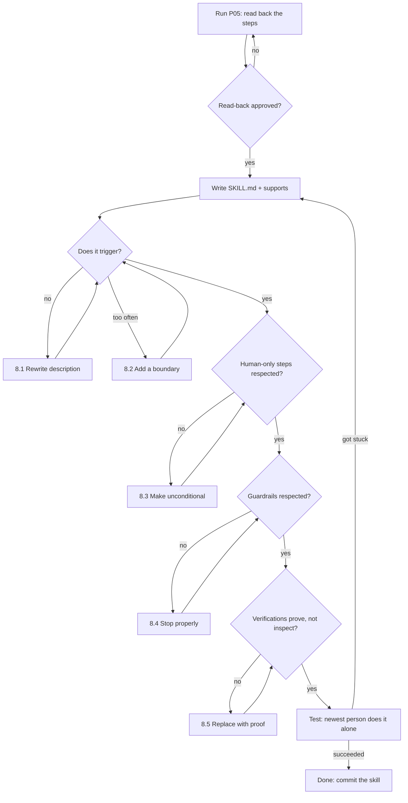

# P05 — Turn a Repeated Task into a Skill

← [Previous](P04-hooks-as-guardrails.md) · [Library index](../README.md) · Next: [P06](../phase-1-discovery/P06-write-a-full-prd.md)

> **One line:** Take the nine-step ritual everyone half-remembers and write it down where the AI will find it.

| | |
|---|---|
| **Phase** | 0 — Foundation (Sprint 0) |
| **Who runs it** | Team Lead (Rahul Nair) |
| **When** | Day four or five of Sprint 0, the last thing before Sprint 1 planning |
| **Takes in** | `CLAUDE.md`, `config/sources.yaml`, the hooks from [P04](P04-hooks-as-guardrails.md), and the onboarding steps as somebody actually does them |
| **Produces** | `.claude/skills/onboard-counterparty/SKILL.md` plus its bundled templates and checklist |
| **Hands off to** | Product Owner (Amara Osei), who opens Sprint 1 with [P06 — Write a Full PRD](../phase-1-discovery/P06-write-a-full-prd.md) |
| **Time to run** | Half a day, most of it spent watching somebody do the task and writing down what they actually did |

---

## 1. The scene

Thursday afternoon of Sprint 0. The last real piece of setup.

Rahul has a list on the whiteboard, left over from the Monday kick-off. Northwind has twelve counterparties. Two of them — `broker_alpha` and `broker_beta_em` — are the ones the team is building against. The other ten arrive over the following six months, one or two at a time, and each one has to be onboarded into the pipeline.

He has watched Tomas do this once, for the test case he set up on Wednesday. It took most of a day, and it is nine steps, and they are not in one place. Two of them are in a YAML file. One of them is in a different Azure service with its own web interface. One is a test. One is a documentation entry that Tomas did not do, and which Rahul only noticed because he went looking.

The step Tomas actually got wrong was worse than the one he skipped. He forgot to register the classifier label — step five, the one that lives in the Document Intelligence portal rather than in the repository. Everything downstream of it looked fine. The extraction model existed. The YAML block was correct. The test passed, because the test named the counterparty explicitly and never went through classification at all.

It would have failed exactly once, in production, on the first real document, with an error saying the classifier returned a confidence of 0.31 and the document was routed to review. And it would have been routed to review for every single document from that counterparty, forever, which is precisely the outcome this entire project exists to eliminate.

Rahul has been here before. In the first engagement with this team — the one written up as `AI-Skills` — he had the same problem with code review: a repeatable, multi-step thing that everyone did slightly differently and that got worse under time pressure. The answer then was a skill, and it worked well enough that the team still uses it. This is the same shape.

**Nothing shipped this week, which was the plan. What shipped instead is that the next ten counterparties cost an afternoon each instead of a day each.**

---

## 2. What this prompt actually does — in plain language

### What a skill actually is

If you have read `AI-Skills` you can skim this. If not, start here.

> **What it is in one line.** A skill is a folder containing a Markdown file of instructions, with a short description at the top, which the assistant loads automatically when your request matches that description.

> **Why it's here.** Some knowledge is procedural — a sequence of steps in a particular order, with specific gotchas — and it is knowledge nobody can hold reliably in their head. A skill is where that knowledge lives so it gets applied every time, by anyone, including the AI.

> **The catch.** A skill is instructions, not machinery. The assistant reads it and follows it, which it does very reliably but not with the absolute certainty of a hook. Choose accordingly; §2's four-way table below is the whole decision.

The minimum shape is a folder and one file:

```text
.claude/skills/
└── onboard-counterparty/
    ├── SKILL.md                    ← the instructions, with a description at the top
    ├── sources-block.template.yaml ← a template it fills in
    ├── field-map.reference.md      ← detail it reads only when needed
    └── checklist.md                ← the nine steps, ticked off
```

The `SKILL.md` opens with a small metadata block — a name and a description — and then the instructions in ordinary Markdown.

### The four containers, and how to choose between them

This table is the payoff for the whole of Phase 0. Everything you have set up this week is one of these four things, and picking the wrong container is the most common structural mistake people make with these tools.

| Container | What it is | When it applies | Reliability | Sprint 0 example |
|---|---|---|---|---|
| **Context file** ([P01](P01-generate-the-project-context-file.md)) | Always-loaded background facts and rules | Applies to *everything* you do in this repo | High, degrades over long sessions | `CLAUDE.md` |
| **MCP server** ([P03](P03-wire-up-an-mcp-server.md)) | A capability — a way to reach outside | The model needs to *see* something it cannot see | Total, when it chooses to use it | Read the real `etl` schema |
| **Hook** ([P04](P04-hooks-as-guardrails.md)) | A command the harness runs on an event | A rule that must hold *every single time*, with no exceptions | Absolute — the model has no say | ruff after every Python edit |
| **Skill** (this file) | A procedure, loaded when the task matches | A multi-step task done *repeatedly*, needing judgement within the steps | High — the model follows it once triggered | Onboard a counterparty |

The distinguishing questions, in order:

1. **Does it apply to everything?** → context file.
2. **Is it access to something, rather than knowledge?** → MCP server.
3. **Must it happen every time, with no exceptions, regardless of what anyone intends?** → hook.
4. **Is it a sequence of steps for a recurring task?** → skill.

The onboarding ritual fails 1 (it applies only when onboarding), fails 2 (it is knowledge, not access), and fails 3 — there is no event that fires when somebody decides to onboard a counterparty. It is a skill.

### Progressive disclosure, and why the description line matters most

Here is the mechanic that makes skills worth having rather than being just a document in a folder.

**The description is always loaded. The body is not.**

At the start of every session, the assistant sees the name and one-line description of every available skill. That is cheap — a line or two each. It does *not* see the instructions. When your request matches a description, the assistant reads that skill's body and follows it. Any files the body points at are read only if and when the body says to read them.

Three levels, loading only what is needed:

```text
Always in context        name + description             ~20 tokens per skill
Loaded when triggered    SKILL.md body                  ~500-1500 tokens
Loaded when referenced   bundled templates, references  as needed
```

Two consequences follow, and the second one is the thing people get wrong.

The first is that you can have a lot of skills without paying for them. Twenty skills is four hundred tokens of standing cost.

The second is that **the description line is the single most important line in the file**, because it is the only part the assistant sees when deciding. A perfect set of instructions with a vague description never fires. A description saying "helps with counterparties" will not trigger when Tomas says "we need to add Broker Gamma to the pipeline."

Write descriptions with the words a person would actually use. Include the synonyms. "Use when onboarding, adding, or configuring a new counterparty, broker, custodian or fund administrator in the ingestion pipeline" is a good description because it covers the four words people actually say and the three verbs they actually use.

### The rule of three

Not everything repeated deserves a skill. The threshold Rahul uses, carried over from the earlier engagements:

> **Write a skill when you have done the task three times, or when you have watched two different people do it differently.**

Before three, you do not yet know which parts are essential and which were accidents of the first attempt. You will write down the wrong thing with great confidence. After three, the shape is clear.

The counterparty onboarding gets an exemption from this rule, and it is worth being explicit about why: there are ten more coming, the cost of getting it wrong is a production failure that is invisible until it happens, and Rahul has watched one person do it once and get it wrong. The rule of three is about not writing down noise. When the failure mode is already known and expensive, write it down at one.

### The nine steps, and which one bites

Here is the ritual, as it actually is. Each step matters and each one has a reason.

**1. Add the counterparty block to `config/sources.yaml`.** The identity of the counterparty in the system: its code, its display name, its language, its document type. This is the file the pipeline reads to know a counterparty exists at all.

**2. Write the field map.** The translation from what the counterparty's document calls a thing to what the canonical schema calls it. Broker Alpha's statement says "Nominal"; the schema says `quantity`. Broker Beta's says "Cantidad." The field map is where that lives, and it is per-counterparty because every layout is different.

**3. Set the threshold overrides.** Most counterparties use the defaults: 0.90 for currency and quantity, 0.85 for dates, 0.75 for descriptive strings. Some do not. `broker_alpha`'s currency threshold is 0.92 because their scan quality is poor, and that number is the difference between a false confidence and a real one.

**4. Train the custom extraction model.** In Azure AI Document Intelligence, using labelled sample documents. Roughly fifty labelled documents for a production-quality model; fifteen is enough to prove the approach works. Training itself is free — you pay per page analysed, not per model trained — which means there is no reason to be shy about retraining.

**5. Register the classifier label.** A separate model in the same service, whose job is to look at an unknown incoming PDF and say which counterparty layout it is. The extraction model cannot run until classification has chosen it. **This is the step that gets forgotten**, and §1 explains why: everything else looks correct without it, including the tests.

**6. Add a fixture PDF.** A sample document committed to `tests/fixtures/`, redacted, so the test suite has something real to run against.

**7. Write the test.** At minimum: this document, through the real pipeline, produces the expected rows. Ideally also a negative case, where a deliberately degraded field is correctly rejected by the gate.

**8. Dry run.** Run the full pipeline against the fixture with writes disabled, and read the output. Not the test — the actual output, read by a human, once.

**9. Documentation entry.** One row in the counterparty table in the docs: code, layout name, language, model ID, threshold overrides, date onboarded. This is what the person doing the eleventh counterparty reads.

Nine steps, four different systems, two of them outside the repository. That is exactly the shape of thing that is done inconsistently by good people in a hurry.

### Why step 5 is the interesting one

It is worth dwelling on, because it teaches something general.

Step 5 fails silently *and* passes every check you would think to run. The YAML is valid. The extraction model exists and works. The test passes, because the test hands the document straight to the extraction model with the counterparty already known — which is a sensible way to write that test and is what everyone does.

The only thing that catches it is a document arriving with nobody having told the system what it is. Which happens exactly once, in production, at 07:00, on the day the counterparty goes live.

So the skill does something specific about it: **the checklist has a verification for every step, and step 5's verification is a classification call on the fixture, not an inspection of a portal.** The general principle: for every step in a ritual, ask what would prove it was done, and prefer a proof that exercises the thing over a proof that looks at it.

### What a skill is not

**It is not a hook.** The assistant follows a skill reliably; it does not follow one inevitably. If a step genuinely must happen every time regardless of anything, that step needs a hook or a CI check, and the skill should say so. In this case the ninth step, the docs entry, is checked in CI as well as being in the skill, because it is the one people skip when tired.

**It is not a subagent.** A subagent is a separate assistant with its own context, spawned to do a chunk of work and report back. Some tasks want that — a big independent search, a long refactor. Onboarding a counterparty does not, because it needs your judgement at four points and you want to be in the conversation for those.

**It is not a script.** Where a step is fully mechanical, write a script and have the skill call it. The skill is for the parts that need reading, judgement or a human decision. A skill that is nine shell commands should have been a shell script, and would be faster and more reliable as one.

### The stop points

The most important design decision in this particular skill: it does not do everything.

Two of the nine steps are blocked outright by the hooks from [P04](P04-hooks-as-guardrails.md), because `config/sources.yaml` is protected. That is not an obstacle to work around — it is the design working. The skill's instruction for step 1 is to *propose* the YAML block as a diff and stop, so a human applies it.

Two more steps happen outside the repository entirely, in the Document Intelligence portal, and the AI cannot do them at all. The skill's job there is not to pretend — it is to say exactly what the human must do, give them the values to paste, and then verify the result afterwards.

**A skill that quietly does the parts it can and stays silent about the parts it cannot is worse than no skill**, because it produces the feeling of completion without the fact of it. Which is, precisely, what happened to Tomas on Wednesday.

### The one idea to remember

**When you find yourself explaining the same sequence for the third time, you are not being helpful, you are being a single point of failure.** The knowledge lives in your head, it degrades under pressure, and it leaves when you do. A skill moves it into the repository where it is versioned, reviewable, improvable by anyone, and applied by default.

---

## 3. The prompt

Run this after you have watched somebody do the task at least once and written down what they actually did — not what the documentation says they should do.

```text
You are the **Team Lead** turning a repeated multi-step task into a reusable skill, so that
the whole team and every AI session performs it the same way.

**STOP GATE:** First, read back the task to me as a numbered list of steps, and for each step
state: (a) who or what performs it — AI, human, or script, (b) how you would verify it was
actually done, and (c) whether it can be done from inside this repository at all.
**Show me that list and stop. Do not write the skill until I reply "approved".**

**The task:**
[TASK NAME] — [ONE LINE DESCRIPTION]

**The steps, as they are actually performed today:**
[THE RITUAL STEPS]

**Known failure modes** — things that have gone wrong doing this before:
[KNOWN FAILURES]

**Produce a skill at `[SKILL PATH]`** containing:

1. `SKILL.md` with:
   - A metadata block containing `name` and `description`.
   - **The description must contain every word a person might actually use** when asking for
     this. Include synonyms for the object and the verb. This line is the trigger; if it does
     not match how people speak, the skill never fires.
   - The steps, in order, each with: what to do, how to verify it, and what it looks like when
     it is wrong.
   - **Explicit STOP points** where a human must act — see the constraint below.
2. Supporting files for anything long or reusable: [SUPPORTING FILES]
   Reference them from `SKILL.md` so they load only when needed. Do not inline them.
3. A `checklist.md` — one tickable line per step, each phrased as a verifiable outcome, not
   as an action.

**Constraints — these shape the skill more than anything else:**
- **Name every step the AI cannot do.** For each, state plainly that a human must do it, give
  the exact values they need, and give the verification to run afterwards.
  [BLOCKED STEPS]
- **Never work around a guardrail.** Where a hook blocks an edit, the instruction is to output
  the proposed change as a diff and stop, not to find another route.
- **Verification beats inspection.** Where a step can be proved by exercising the thing rather
  than by looking at a screen, prove it that way.
- Keep `SKILL.md` under [MAX LINES] lines. Detail goes in the supporting files.

**Do not:**
- Do not add steps that are not in the list above.
- Do not turn judgement into a rule — where a step needs a decision, say what the decision is
  and what informs it, then ask.
- Do not write instructions that assume the reader already knows the system.
- Do not claim a step is complete based on the absence of an error.
- Do not write a skill whose steps are all mechanical — if every step is a command, say so and
  recommend a script instead.

**You are done when:** the step list was approved, `SKILL.md` exists with a description
containing the real words people use, every step has a verification, every human-only step is
labelled as such, and the checklist can be ticked by someone who has never done this before.

Save to `[SKILL PATH]`.
```

---

## 4. Every placeholder, explained

| Placeholder | What to put in it | Northwind example | What happens if you get it wrong |
|---|---|---|---|
| `[TASK NAME]` | The task as the team says it out loud. | `Onboard a new counterparty` | An internal name nobody uses ("source integration provisioning") produces a description that never matches what people type. |
| `[ONE LINE DESCRIPTION]` | What it accomplishes and when it is needed. | `Everything required to make the pipeline correctly ingest documents from a counterparty it has never seen before` | Vague here means vague in the description line, which means the skill never triggers. |
| `[THE RITUAL STEPS]` | The steps as actually performed, in order, including the ones outside the repo. Watch someone do it; do not copy the wiki. | The nine steps in §5 | Write the idealised version and you get a skill that omits exactly the step people forget, since nobody documents the step they forget. |
| `[KNOWN FAILURES]` | Things that have actually gone wrong, and how they showed up. | `Step 5, the classifier label, was missed. Everything downstream looked correct and the test passed, because the test bypasses classification. It would have failed only on the first real document in production.` | This is the highest-value field. Without it you get a competent procedure with no defences at the exact points that need them. |
| `[SKILL PATH]` | Where the skill folder lives, in the repository. | `.claude/skills/onboard-counterparty/` | Outside the repo and it exists on one laptop. In the wrong folder and the harness never discovers it. |
| `[SUPPORTING FILES]` | The long or reusable pieces that should load only when needed. | `sources-block.template.yaml`, `field-map.reference.md`, `labelling-guide.md` | Inline everything and `SKILL.md` is 600 lines, which costs context every time it triggers and gets skimmed. |
| `[BLOCKED STEPS]` | Steps the AI cannot or must not perform, and why. | `Step 1 edits config/sources.yaml, which is blocked by the protect_paths hook. Steps 4 and 5 happen in the Azure AI Document Intelligence portal and cannot be done from here at all.` | Omit this and the skill will confidently instruct the AI to do something it will be blocked from doing, producing a retry loop and a confused developer. |
| `[MAX LINES]` | Hard cap on `SKILL.md`. | `120` | Uncapped skills grow into manuals, and a manual that loads on every trigger is exactly the context bloat progressive disclosure exists to avoid. |

---

## 5. The filled-in example

Rahul ran this on Thursday afternoon, after sitting with Tomas for forty minutes and writing down what he had actually done on Wednesday.

```text
You are the **Team Lead** turning a repeated multi-step task into a reusable skill, so that
the whole team and every AI session performs it the same way.

**STOP GATE:** First, read back the task to me as a numbered list of steps, and for each step
state: (a) who or what performs it — AI, human, or script, (b) how you would verify it was
actually done, and (c) whether it can be done from inside this repository at all.
**Show me that list and stop. Do not write the skill until I reply "approved".**

**The task:**
Onboard a new counterparty — everything required to make the ingestion pipeline correctly
classify, extract, validate and load documents from a broker, custodian or fund administrator
it has never seen before. We have two counterparties live and ten more arriving over the next
six months.

**The steps, as they are actually performed today:**
1. Add a counterparty block to `config/sources.yaml`: code, display name, language,
   document type, extraction model id.
2. Write the field map — the mapping from the counterparty's own field labels to our canonical
   schema. Broker Alpha calls quantity "Nominal"; Broker Beta calls it "Cantidad".
3. Set any confidence threshold overrides. Defaults are 0.90 currency, 0.90 quantity,
   0.85 date, 0.75 descriptive string. broker_alpha overrides currency to 0.92 because their
   scan quality is poor.
4. Train a custom extraction model in Azure AI Document Intelligence from labelled samples.
   ~50 labelled documents for production quality; 15 is enough to prove the approach.
   Training is free; you pay per page analysed.
5. Register the counterparty as a label on the custom classifier model, so an unknown incoming
   PDF can be routed to the right extraction model. Classifier minimum confidence is 0.75.
6. Add a redacted fixture PDF to `tests/fixtures/`.
7. Write a test: this document through the real pipeline produces the expected rows, plus a
   negative case where a degraded field is correctly rejected by the confidence gate.
8. Dry run the full pipeline against the fixture with writes disabled, and read the output.
9. Add a row to the counterparty table in `docs/counterparties.md`: code, layout, language,
   model id, threshold overrides, date onboarded.

**Known failure modes** — things that have gone wrong doing this before:
- Step 5 was missed on our first attempt. Everything downstream looked correct: the YAML was
  valid, the extraction model existed and worked, and the test passed — because the test hands
  the document straight to the extraction model with the counterparty already known, so it
  never goes through classification. It would have failed only on the first real document in
  production, and then on every document from that counterparty forever.
- Step 9 was skipped. Nobody noticed until someone went looking.
- On a previous project, thresholds were copied from another counterparty without checking
  scan quality, which let a class of bad extraction through the gate for three weeks.

**Produce a skill at `.claude/skills/onboard-counterparty/`** containing:

1. `SKILL.md` with:
   - A metadata block containing `name` and `description`.
   - **The description must contain every word a person might actually use** when asking for
     this. Include synonyms for the object and the verb. This line is the trigger; if it does
     not match how people speak, the skill never fires. People here say: counterparty, broker,
     custodian, fund administrator, source. And: onboard, add, set up, configure, wire up.
   - The steps, in order, each with: what to do, how to verify it, and what it looks like when
     it is wrong.
   - **Explicit STOP points** where a human must act.
2. Supporting files: `sources-block.template.yaml`, `field-map.reference.md`,
   `labelling-guide.md`. Reference them from `SKILL.md` so they load only when needed.
   Do not inline them.
3. A `checklist.md` — one tickable line per step, each phrased as a verifiable outcome, not
   as an action.

**Constraints — these shape the skill more than anything else:**
- **Name every step the AI cannot do.** For each, state plainly that a human must do it, give
  the exact values they need, and give the verification to run afterwards.
  Step 1 edits `config/sources.yaml`, which is blocked by the `protect_paths` hook — the
  instruction is to output the block as a diff and stop. Steps 4 and 5 happen in the Azure AI
  Document Intelligence portal and cannot be done from this repository at all.
- **Never work around a guardrail.** Where a hook blocks an edit, output the proposed change
  as a diff and stop, do not find another route.
- **Verification beats inspection.** Step 5 in particular must be verified by making a real
  classification call against the fixture and checking the returned label and confidence — not
  by looking at the portal.
- Keep `SKILL.md` under 120 lines. Detail goes in the supporting files.

**Do not:**
- Do not add steps that are not in the list above.
- Do not turn judgement into a rule — where a step needs a decision, say what the decision is
  and what informs it, then ask.
- Do not write instructions that assume the reader already knows the system.
- Do not claim a step is complete based on the absence of an error.
- Do not write a skill whose steps are all mechanical — if every step is a command, say so and
  recommend a script instead.

**You are done when:** the step list was approved, `SKILL.md` exists with a description
containing the real words people use, every step has a verification, every human-only step is
labelled as such, and the checklist can be ticked by someone who has never done this before.

Save to `.claude/skills/onboard-counterparty/`.
```

---

## 6. What comes back

The step read-back first, because of the stop gate. Abridged to the interesting rows:

```text
STEP READ-BACK

| # | Step                        | Performed by | Verified how                                    | In repo? |
|---|-----------------------------|--------------|-------------------------------------------------|----------|
| 1 | sources.yaml block          | HUMAN applies| Config loads; counterparty appears in registry   | blocked  |
| 2 | field map                   | AI proposes  | Every canonical field has a source, or is marked | blocked* |
| 3 | threshold overrides         | AI proposes  | Values differ from default only with a reason    | blocked* |
| 4 | train extraction model      | HUMAN        | Model id returned; test analyse on fixture works | NO       |
| 5 | register classifier label   | HUMAN        | CLASSIFY the fixture; label + conf >= 0.75       | NO       |
| 6 | fixture PDF                 | HUMAN adds   | File present, redacted, opens                    | yes      |
| 7 | test                        | AI           | pytest passes, incl. the negative case           | yes      |
| 8 | dry run                     | AI runs      | Human reads output                               | yes      |
| 9 | docs row                    | AI           | Row present with all six columns                 | yes      |

* steps 2 and 3 also live in config/sources.yaml, so they are blocked by the same hook. They
  become part of the same proposed diff as step 1 rather than three separate stops.

Two things I want to raise before writing

  a) Steps 1, 2 and 3 are one file edit, not three. Presenting them as three separate STOP
     points would make a human apply three diffs to the same file. Recommend combining into
     one proposed block and one stop.

  b) Step 7's negative case is currently described as "a degraded field is correctly rejected".
     That needs a fixture that FAILS the gate, which means a second fixture PDF, which is not
     in the step list. Either step 6 produces two fixtures, or step 7's negative case is
     synthetic (mutate the extracted JSON rather than the PDF). Recommend synthetic — it is
     deterministic and does not need a second document from the counterparty. Confirm?

Awaiting "approved".
```

Then the skill.

```markdown
---
name: onboard-counterparty
description: >
  Use when onboarding, adding, setting up, configuring or wiring up a new counterparty,
  broker, custodian, fund administrator or document source in the ingestion pipeline.
  Covers the sources.yaml block, field map, confidence thresholds, extraction model,
  classifier label, fixture, tests, dry run and docs. Also use when a newly added
  counterparty's documents are being routed to review unexpectedly.
---

# Onboard a counterparty

Nine steps across four systems. Two of them cannot be done from this repository. One of them
is silently skippable and that is the one that has already bitten us.

**Before you start**, confirm you have: the counterparty code, at least 15 sample documents
(50 for production quality), the document language, and whether their scan quality is known
to be poor.

## Steps 1–3 — the `config/sources.yaml` block  **STOP POINT**

These are one file edit, not three.

Fill `sources-block.template.yaml` using the sample documents to determine the field map.
Read `field-map.reference.md` for the canonical field names and the mapping rules — in
particular, **identifier fields are never translated**, only descriptive ones.

Thresholds default to: currency 0.90, quantity 0.90, date 0.85, string 0.75.
**Only override with a stated reason.** Poor scan quality is a reason; "the other broker has
it" is not.

**STOP.** `config/sources.yaml` is protected by the `protect_paths` hook.** Output the completed
block as a diff and **stop**. A human applies it. Do not attempt another tool or path.

**Verify:** after a human applies it, load the config and confirm the counterparty appears in
the registry with the expected thresholds.

## Step 4 — train the extraction model  **HUMAN ONLY**

Cannot be done from this repository. A human works in the Azure AI Document Intelligence
Studio. Read `labelling-guide.md` and give them: the counterparty code, the field list from
step 2, and the naming convention `{counterparty}-{doctype}-v{n}`.

Training is free. You pay only per page analysed, so retraining is cheap — do not settle for
a weak model to avoid a second training run.

**Verify:** analyse one fixture with the returned model id. Every field in the field map is
present in the response and carries a confidence score.

## Step 5 — register the classifier label  **HUMAN ONLY — MOST-MISSED STEP**

Cannot be done from this repository. The classifier is a separate model whose job is to look
at an unknown PDF and say which layout it is. **Without this step everything else works and
the pipeline still fails on every real document**, because classification never routes to the
extraction model. Our tests do not catch it: they hand the document straight to extraction
with the counterparty already known.

**Verify — this one is not optional and is not a portal check.** Run a real classification
call against the fixture:

    python -m core.classify --file tests/fixtures/{counterparty}_sample.pdf

Expect the counterparty's own label, with confidence ≥ 0.75. **Anything else means step 5 is
not done, whatever the portal shows.**

## Step 6 — fixture  **HUMAN ADDS THE FILE**

Add one redacted sample to `tests/fixtures/{counterparty}_sample.pdf`. Redaction is not
optional — see `CLAUDE.md` invariant 5 and `docs/mcp-setup.md`.

**Verify:** the file opens, and no account number, name or contact detail is legible.

## Step 7 — tests

Write two: a positive case producing the expected canonical rows, and a **synthetic** negative
case where an extracted field's confidence is lowered below its threshold and the gate is
asserted to reject the whole document.

**Verify:** `pytest -q tests/test_{counterparty}.py` passes, and the negative case fails when
the gate is disabled. A negative test that passes with the gate off is testing nothing.

## Step 8 — dry run

    python -m function_app --dry-run --file tests/fixtures/{counterparty}_sample.pdf

**Verify:** a human reads the output. Not the exit code. The output.

## Step 9 — docs

Add a row to the table in `docs/counterparties.md`: code, layout name, language, model id,
threshold overrides with reasons, date onboarded.

**Verify:** the row has all six columns filled. CI checks this too, but do not rely on that.

## Done

Work through `checklist.md`. Every line is an outcome you can observe, not an action you
remember taking.
```

### How to read this

**Look at flags (a) and (b) in the read-back.** The AI noticed that three "steps" are one file edit, which would have produced three separate stop points and three diffs against the same file — annoying, and the kind of thing that makes people stop using a skill. It also noticed that the negative test as described needs a fixture that does not exist, and proposed a better approach. Both of those come from the stop gate. Neither would have been caught by reviewing the finished skill, because in a finished skill they look deliberate.

**Look at the description block.** It contains five nouns and five verbs, plus a second sentence covering a completely different entry point: "also use when a newly added counterparty's documents are being routed to review unexpectedly." That second sentence is the symptom of a missed step 5. Somebody debugging that problem does not know they are looking for the onboarding skill, and now the skill finds them.

**Look at step 5's verification.** It is a command, not an instruction to check a screen. That is the difference between a checklist that catches the failure and a checklist that records the belief that it did not happen. Ninety per cent of the value of this whole skill is in that one command.

**The part that is commonly wrong: the human-only steps get quietly softened.** The first draft said, of step 4, "if you have access to the Document Intelligence Studio, train the model." That "if" is fatal. It gives the assistant a branch where it can decide the step does not apply, and a checklist item that can be ticked because it was not applicable. Steps 4 and 5 are not conditional. They are always required and always human. The final version says so in four words: `HUMAN ONLY`.

---

## 7. Why this is the final prompt

### What "done" means here

Done is: **somebody who has never onboarded a counterparty can do it correctly, on their own, using only the skill — including the two steps that happen outside the repository.**

That is testable and you should test it. Hand it to the person on the team who has done it least. Watch. Do not help.

### The checklist

- [ ] The step read-back was reviewed by someone who has actually done the task, before the skill was written.
- [ ] The description contains the real words people say — both the nouns and the verbs — and at least one symptom-based entry point.
- [ ] Every step has a verification, and the verification exercises the thing rather than inspecting it.
- [ ] Every step the AI cannot perform is labelled unconditionally, with no "if you have access" escape hatch.
- [ ] Every guardrail from [P04](P04-hooks-as-guardrails.md) is respected, with an explicit instruction to propose a diff and stop rather than route around it.
- [ ] `SKILL.md` is under the line cap, with detail in supporting files.
- [ ] Somebody who has never done the task has completed it using only the skill, and the places they got stuck have been fixed.

### Why you should stop rather than keep prompting

Two traps, and the first is the classic one.

**The skill becomes a manual.** Ask for improvements and you will get background on how Document Intelligence works, an explanation of confidence scoring, a troubleshooting appendix, and a section on cost optimisation. All useful. None of it belongs here. Every line in `SKILL.md` is loaded whenever the skill triggers, competing with the actual task. Detail goes in a supporting file that loads only when referenced — that is what progressive disclosure is for, and it stops being an advantage the moment you inline everything.

**The skill starts absorbing adjacent tasks.** "While we're here, it should also handle updating an existing counterparty's thresholds, and retiring a counterparty, and re-training a stale model." Those are three different tasks with three different triggers and three different risk profiles. Merging them produces a skill whose description matches everything and whose body is mostly irrelevant on any given trigger.

Rahul's rule from `AI-Skills`, unchanged: **one skill, one trigger, one outcome.** If you need a second sentence starting with "and also," you need a second skill.

### The signal that you are NOT done

The skill fires and the assistant does something the person watching would not have done — skips a verification, works around a stop point, or ticks a step it did not actually complete. Go to §8.

---

## 8. When it is not done — the follow-up prompts

| What you're seeing | What's actually wrong | Run this next |
|---|---|---|
| The skill never triggers; people ask for the task and nothing loads | The description does not contain the words people actually use | **8.1 — Rewrite the description around real language** |
| It triggers on things it should not | The description is too broad, or overlaps another skill | **8.2 — Tighten the trigger boundary** |
| It runs but skips the human-only steps | Those steps are phrased conditionally, so the model resolves the condition as "no" | **8.3 — Make human-only steps unconditional** |
| It hits a protected file and starts trying alternatives | The skill does not tell it what to do when blocked | **8.4 — Teach it to stop properly** |
| It reports success on a step that was not done | The verification inspects rather than exercises | **8.5 — Replace inspection with proof** |
| `SKILL.md` has grown past 300 lines | Everything got inlined; progressive disclosure is not being used | **[P01](P01-generate-the-project-context-file.md)** §8.1 — the same cutting prompt works |
| Every step is a shell command | This should be a script, not a skill | Write the script. Have a one-line skill call it. |

### 8.1 "Nobody's skill ever fires"

Use this when the instructions are good and nothing triggers them.

```text
The `[SKILL NAME]` skill is not triggering. Here are three real requests where it should have
fired and did not:

  [PASTE THE THREE REQUESTS, VERBATIM, AS THE PERSON TYPED THEM]

**The description is the only thing that decides.** Rewrite it.

1. **Extract the vocabulary** from those three requests: every noun used for the object, every
   verb used for the action, every abbreviation.
2. **Add every synonym** the team uses in speech, even the sloppy ones. If people say "wire up
   a broker", "wire up" and "broker" both go in.
3. **Add one symptom-based entry point** — the sentence someone would type when they have
   the problem this skill prevents, without knowing this skill exists.
4. Keep it to three sentences.

**Then test it:** for each of the three requests above, say whether the new description would
match, and why.

**Do not** change the body of the skill. **Do not** make the description generic to catch more
— a description matching everything is as useless as one matching nothing.
```

What changes: the description usually doubles in vocabulary and the skill starts firing. The symptom-based sentence is the one people never think of and it catches the most valuable case.

### 8.2 "It fires on everything now"

Use this after 8.1 over-corrects, or when two skills compete.

```text
The `[SKILL NAME]` skill is triggering on requests it should not handle. Examples:

  [PASTE]

**Add a boundary.** Rewrite the description so it states, explicitly:
- what this skill IS for, in one sentence
- what it is NOT for, naming the adjacent tasks and — where one exists — the skill that does
  handle them

Then add to the top of `SKILL.md` a two-line "Not this skill if..." block, so that even when it
triggers wrongly, the first thing the assistant reads tells it to stop.

**Do not** solve this by making the description shorter. Precision, not brevity, is the fix.
An overlapping trigger usually means two skills should be one, or one should be two — say
which you think it is.
```

What changes: you get an explicit boundary, and often the realisation that "onboard a counterparty" and "update an existing counterparty" were always two skills.

### 8.3 "It skipped the step only a human can do"

Use this when the assistant marks a human-only step as complete or not applicable.

```text
The skill instructed a step that only a human can perform, and the assistant treated it as
optional or already done. Here is what it said:

  [PASTE]

**Find every conditional in the human-only steps.** Look for: "if", "where possible",
"assuming you have", "if you have access", "optionally", "you may need to".
**Each one is an escape hatch.** List them.

**Rewrite each human-only step to be unconditional:**
- Start with an unmissable marker on its own line
- State that the assistant CANNOT do this and must not attempt it
- Give the exact values the human needs, in a copyable block
- Give the verification command the assistant runs AFTERWARDS to prove it happened
- State explicitly what to do while waiting: **stop, and ask**

**Then** check the checklist: every human-only step's line must be phrased as an observed
outcome ("classification returns the label at ≥0.75"), never as an action ("registered the
label").

**Do not** add a step where the assistant asks permission to skip. There is no skipping.
```

What changes: "if you have access to the Studio, train the model" becomes four lines that cannot be resolved as not-applicable.

### 8.4 "It hit a hook and started improvising"

Use this when the skill collides with a guardrail from [P04](P04-hooks-as-guardrails.md).

```text
The skill instructed an edit to `[PROTECTED FILE]`, which is blocked by the `[HOOK NAME]`
hook. The assistant then tried [N] alternative approaches before stopping.

**This is the skill's fault, not the hook's.** The hook is correct.

**Rewrite the affected step** to:
1. State up front that the file is protected and by which hook
2. Instruct the assistant to produce the change as a **unified diff in its response**
3. Instruct it to **stop and wait** for a human to apply it
4. State explicitly: do not retry with a different tool, a different path spelling, or a
   different file
5. Give the verification to run **after** a human confirms they have applied it

**Then scan the whole skill** for any other step that touches a protected path, and apply the
same treatment.

**Do not** propose removing or relaxing the hook. **Do not** propose a helper script that
performs the write on the skill's behalf — that is working around the guardrail with extra
steps.
```

What changes: the skill and the guardrails stop fighting, and the stop point becomes a designed part of the procedure rather than a collision.

### 8.5 "It said the step was done and it wasn't"

Use this the first time a verification passes on an incomplete step. This is the step 5 problem.

```text
The skill reported step [N] as complete when it was not. The verification was:

  [PASTE THE CURRENT VERIFICATION]

**Classify what that verification actually does:**
  INSPECTION — looks at a state, a screen, a config value, or the absence of an error
  PROOF      — exercises the thing end to end and checks the result

**If it is INSPECTION, replace it with PROOF.** The replacement must:
- perform the real operation the step enables, against real inputs
- assert on a specific returned value, not on the absence of an exception
- be a command that can be pasted and run

**Then apply the same test to every other step** and give me a table: step, current
verification, classification, and the proof-based replacement where one is needed.

**Do not** accept "no error was raised" as a verification anywhere. That is the failure mode
this skill exists to prevent.
```

What changes: step 5 goes from "check the label appears in the portal" to a classification call asserting label and confidence. Every other step usually gets one degree harder too.

### The loop



---

## 9. How this goes wrong

### 9.1 You write down the idealised procedure, not the real one

You open the wiki page, or you write the steps from memory sitting at your desk, and you produce a clean nine-step procedure that is subtly not what anyone does.

The problem is that the steps people forget are, by definition, the steps missing from every written account of the procedure — including the one in your head. Tomas would not have listed step 5, because he did not do step 5.

The fix is unglamorous and there is no way around it: **sit next to somebody while they do the task, and write down what they actually do, including the bits they do wrong.** Forty minutes. It is the highest-value forty minutes in this entire prompt, and it is the part most likely to get skipped because it feels like it is not work.

### 9.2 The description is written for the file, not for the person

Descriptions written by looking at the skill's contents come out as summaries: "Handles counterparty onboarding configuration." Descriptions written by looking at how people ask come out as triggers: "Use when onboarding, adding, setting up or wiring up a new counterparty, broker, custodian or fund administrator."

The first never fires, because nobody types "handle counterparty onboarding configuration." They type "we need to add Broker Gamma."

The fix is §8.1, and specifically its first instruction: gather three real requests, verbatim, before touching the description. Not paraphrased. Verbatim, including the sloppy words.

### 9.3 The skill quietly does the easy parts

This is the failure the whole design of this prompt is arranged against, and it is worth naming precisely because it produces the *feeling* of completion.

Left to itself, an assistant running a nine-step procedure will do the seven steps it can, mention the other two briefly, and produce a confident summary. The person reading the summary sees a job done. Two of the nine steps did not happen and one of them is invisible until production.

The fix is threefold and all three parts are needed: unconditional markers on human-only steps (§8.3), verifications that exercise rather than inspect (§8.5), and a checklist phrased as observed outcomes rather than remembered actions. Any one of those alone leaks.

### 9.4 The skill and the hooks fight

The skill says edit `config/sources.yaml`. The hook says no. The assistant, reasonably, concludes it used the wrong method and tries `Write` instead of `Edit`, then a shell heredoc, then a Python script. Four turns burned, and a developer who now believes the tooling is broken.

Both components are individually correct. The problem is that they were designed separately, and nobody wrote down what should happen at the point they meet.

The fix is to treat the collision as a designed feature: the stop point. `config/sources.yaml` is protected *because* a human should look at threshold changes, and the skill's job at that boundary is to produce a reviewable diff and wait. Once written that way, the guardrail stops being an obstacle and becomes the review step the procedure always needed.

### 9.5 This prompt is the wrong tool entirely

Three cases, and the third is the one people resist.

**You have done it once.** You do not know yet which parts of what you did were necessary and which were accidents. Write it in a scratch note, do it twice more, then run P05. The exception, as in §2, is when the failure mode is already known and expensive.

**Every step is a command.** If the nine steps are nine shell commands with no judgement between them, you have written a bash script in Markdown, and it will be slower and less reliable than the bash script. Write the script. Then, if the script needs context to be used correctly, write a five-line skill that says when to run it and what to check afterwards.

**It must happen every time, whether anyone invokes it or not.** A skill triggers on a request. If your requirement is "this always happens on this event, no exceptions," you are describing a hook — go back to [P04](P04-hooks-as-guardrails.md). The docs-entry step in this skill is the illustrative case: it is in the skill *and* checked in CI, because being in the skill makes it likely and being in CI makes it certain. Where a step matters enough, use both containers rather than arguing about which one is right.

---

## 10. The handoff

The skill lands on Thursday evening, and Rahul tests it on Friday morning in the way §7 demands: he hands it to Ji-woo, who has not touched the pipeline, will not touch it for another two sprints, and has never onboarded anything. She gets through it, gets stuck twice, and both places she got stuck get fixed before lunch.

That is the end of Sprint 0. Nothing shipped, which was the plan and which Farhan says out loud one final time at the Friday demo. What exists is a project context file that stops the AI guessing about conventions, a database layer whose audit story is true, an MCP setup that lets the assistant read real state, four hooks that enforce the rules nobody can be trusted to remember, and one skill that makes the next ten counterparties cheap.

Sprint 1 opens on Monday with Amara and [P06 — Write a Full PRD](../phase-1-discovery/P06-write-a-full-prd.md). She is going to write down, properly, what the system must do and what "done" means for Northwind's business — and every prompt she runs from here on inherits the whole of Sprint 0 for free. She does not have to explain the confidence gate, or the invariants, or the folder structure, because `CLAUDE.md` already does. **That is the actual return on the week that shipped nothing: every prompt from here on is shorter, and the mistakes it can make are fewer.**

The skill itself does not get used in anger until Sprint 4, when Northwind's third counterparty comes online. That is a long gap, and it is exactly why the "somebody who has never done it" test on Friday morning mattered — by the time it is needed, nobody will remember writing it.

> **Artifact contract — `.claude/skills/onboard-counterparty/`**
>
> Anyone reading this skill can rely on finding:
> - A description containing the words the team actually uses, both nouns and verbs, plus at least one symptom-based entry point.
> - Every step of the procedure, in order, including the steps that happen outside this repository.
> - An unconditional marker on every step the AI cannot perform, with the exact values a human needs.
> - A verification for every step that exercises the thing rather than inspecting it.
> - An explicit stop point wherever the procedure meets a guardrail, with an instruction to propose a diff and wait.
> - A checklist whose lines are observed outcomes, not remembered actions.
> - Long or reusable detail in separate files that load only when referenced.
>
> If any of those is missing, the artifact is not done — go back to §7.

---

## 11. In the case study

This closes
[`Case-Study/Python-ETL/01-sprint-0-foundations.md`](../../Case-Study/Python-ETL/01-sprint-0-foundations.md).

The thing worth telling is the Friday morning test, because it did not go the way Rahul expected. Ji-woo got stuck in two places and neither was one of the two he had worried about.

The first was step 2, the field map. The skill told her to read `field-map.reference.md` and write the mapping. What it did not say was where the counterparty's own field labels come from — she had a sample PDF and no idea whether "Nominal" was meant to be typed exactly as printed, including capitalisation, or normalised first. She guessed. She guessed wrong. The fix was one sentence.

The second was step 8, the dry run, where she read the output, saw nothing obviously broken, and ticked it. Rahul asked what she had been looking for. She said she was not sure. The skill said "a human reads the output," which turns out to mean nothing to someone who does not already know what good output looks like. The fix was three bullet points describing what a correct dry run looks like — how many rows, what the confidence range should roughly be, and the one line that indicates the classifier routed correctly.

Both fixes are small. Neither would have been found by reviewing the skill, by testing it with someone experienced, or by any amount of further prompting. **A procedure written by someone who knows the system always has holes exactly where the author's knowledge is invisible to them**, and the only instrument that finds those holes is a person who does not have that knowledge, working alone, while you watch and say nothing.

It is also worth recording that the HUMAN ONLY marker on step 5 worked. Ji-woo did not skip it, did not try to work around it, and ran the classification command. It returned `broker_gamma` at 0.91. Nobody had told her what a good number was, so she asked — which is exactly the right behaviour, and which is why the "what good looks like" fix from step 8 got applied to step 5 as well.

---

← [Previous](P04-hooks-as-guardrails.md) · [Library index](../README.md) · Next: [P06](../phase-1-discovery/P06-write-a-full-prd.md)
