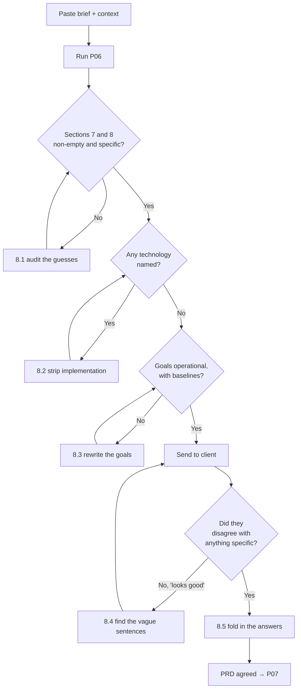

# P06 — Write a Full PRD

← [P05 — Turn a Repeated Task into a Skill](../phase-0-foundation/P05-turn-a-repeated-task-into-a-skill.md) · [Library index](../README.md) · Next: [P07 — Slice the PRD into Stories](P07-slice-the-prd-into-stories.md)

> **One line:** Turn a vague client ask into a written statement of the problem, the users, and what success actually measures.

| | |
|---|---|
| **Phase** | 1 — Discovery |
| **Who runs it** | Product Owner (Amara Osei) |
| **When** | Day one of Sprint 1, the morning after Sprint 0's foundations land |
| **Takes in** | `Case-Study/Python-ETL/00-the-brief.md` (the client's original ask, in their words), `Case-Study/Python-ETL/artifacts/CLAUDE.md` (the project context file from [P01](../phase-0-foundation/P01-generate-the-project-context-file.md)) |
| **Produces** | `Case-Study/Python-ETL/artifacts/prd-counterparty-ingestion.md` |
| **Hands off to** | The Product Owner again, running [P07 — Slice the PRD into Stories](P07-slice-the-prd-into-stories.md) |
| **Time to run** | Half a day. Twenty minutes of prompting, three hours of arguing with the client about the answers. |

---

## 1. The scene

Sprint 0 is over. Rahul spent two weeks on plumbing: the repo, the project context file, the database connection, an MCP server so the team's AI tooling can see the schema, a set of hooks that stop anyone committing a secret, and one team skill that packages the code review the team runs a hundred times a year. Nothing shipped. Nothing was supposed to.

What Rahul does have is a working environment where an AI assistant knows the shape of the project without being told again every morning. That matters more in about ten minutes than it looks like it should.

Amara Osei walks in with a two-page email. It is from Northwind Asset Management's head of operations, and it is the entire written brief for a project that Kestrel Software has already signed a contract for. The email says, in its most specific paragraph, *"we need to stop manually keying broker statements — it's killing our T+1 targets."*

That is the whole requirement. Everything else in the email is background, apologies for the delay in sending it, and a list of four people who should be on the distribution list.

Amara has seen this before. She spent six years on the operations floor of a custodian bank before she moved into product, so she can read that sentence and translate it into about forty questions. What counts as a broker statement? All counterparties or the top ten? What happens when the PDF is unreadable? Who fixes it? Does "stop manually keying" mean zero human touch, or does it mean a human only touches the hard ones? Because those are completely different projects with completely different budgets.

**She is not going to get those answers by asking the client forty questions in one email.** She is going to get them by writing down her best current understanding, in a form specific enough that the client can point at a sentence and say "no, that's wrong." That document is a PRD, and this prompt writes the first draft of it.

---

## 2. What this prompt actually does — in plain language

### First, the words. All of them.

This book uses agile vocabulary constantly and most of it is jargon dressed up as ordinary English. If you have never worked in a scrum team, the next few paragraphs are the ones that make the rest of the book readable. Nothing here is complicated. It is just named.

**Agile** is a family of ways of running software projects where you build a small useful thing, show it to somebody, and change your plan based on what they say. The alternative — write a 200-page specification, disappear for a year, deliver something nobody wants — is what agile was a reaction to. That is genuinely the whole idea. Everything else is machinery for doing that reliably with more than three people.

**Scrum** is one specific brand of agile. It has fixed-length work periods, a small set of named roles, and four recurring meetings. Most teams calling themselves agile are running something loosely scrum-shaped.

**A sprint** is a fixed block of time — usually two weeks — in which the team commits to finishing a specific list of work. The length never changes. The list is decided at the start and, by convention, is not added to mid-sprint. Northwind's project runs five sprints, numbered 0 to 4.

**The backlog** is the ordered list of everything the team might build, most important first. Not a wish list — an ordered queue. Ordering it is the single highest-leverage thing a Product Owner does, and it is a full-time job.

**A Product Owner** owns that ordering and owns the definition of "done" from the business side. Amara is the Product Owner. When somebody asks "should we build the CSV export or the Spanish translation first," she answers, and her answer is final. She is not the same as a project manager. Farhan is the project manager and he owns dates, risk and sequencing. Amara owns *what* and *why*; Farhan owns *when* and *what happens if it slips*.

**A user story** is one small unit of work in the backlog, written from the point of view of somebody who wants an outcome. They are the subject of [P07](P07-slice-the-prd-into-stories.md).

**Acceptance criteria** are the specific conditions that make a story done. They belong to [P08](P08-write-acceptance-criteria.md).

**Discovery** is the phase before you build anything, where you work out what the problem actually is. That is where you are now.

None of those words appear in this prompt because you need to sound agile. They appear because when Farhan says "put that in the backlog" in Sprint 2, you need to already know what he means.

### So what is a PRD?

**PRD** stands for **Product Requirements Document**. It is a single written document that answers four questions, in this order:

1. What problem are we solving, for whom, and what does it currently cost them?
2. What will be true when we have solved it, stated as a number we can actually measure?
3. What is in scope, and — just as important — what is explicitly out?
4. What do we not know yet, and who has to decide?

That is it. A PRD is a shared understanding, written down so it can be argued with. Its main purpose is not to instruct engineers. Its main purpose is to make disagreement visible *early*, while disagreement is still cheap.

The test of a good PRD is not "is it comprehensive." The test is: **can the client read it, find one sentence they disagree with, and point at it?** A document that generates a specific objection has done its job. A document that generates "yes, looks good" has usually failed, because nobody read it carefully enough to disagree.

### What a PRD is NOT — read this part twice

This is where most people go wrong, and it is where AI assistants go wrong hardest and fastest.

**A PRD is not a technical specification.** A spec says *how*. It names services, describes classes, defines schemas, specifies retry policy. That document exists in this project — it is [P11's](../phase-2-design/P11-write-the-technical-spec.md) output, `spec-confidence-gate.md`, and Sofia Marchetti writes it in Sprint 1's design half. It is a different document written by a different person for a different audience.

**A PRD does not name technology.** The Northwind PRD does not say "use Azure AI Document Intelligence." It says "the system must extract structured fields from a PDF statement and report how confident it is in each one." That is a requirement. Which service satisfies it is an architecture decision, and architecture decisions get recorded in an ADR ([P12](../phase-2-design/P12-record-an-architecture-decision.md)) where they can be revisited. If you bake the vendor into the PRD, you have quietly removed the team's ability to change their mind without a change request.

**A PRD does not contain a schema.** No column names, no table definitions, no JSON shapes. Those live in the data contract ([P13](../phase-2-design/P13-design-the-data-contract.md)).

**A PRD does not contain estimates or dates.** Those come from [P09](P09-estimate-and-rank-the-backlog.md) and from Farhan. A PRD that contains a Gantt chart is a project plan wearing a PRD's coat.

**A PRD is not a user story list.** Stories are a slicing of the PRD, and slicing them well is hard enough to need its own prompt.

Here is the distinction that actually sticks:

| Document | Answers | Owned by | Northwind file |
|---|---|---|---|
| PRD | What problem, for whom, measured how | Product Owner (Amara) | `prd-counterparty-ingestion.md` |
| Stories | What increments deliver it | Product Owner (Amara) | `stories/NWD-101…108` |
| Acceptance criteria | When is one increment done | PO + QA (Amara + Ananya) | `acceptance-criteria-NWD-103.md` |
| Technical spec | How it is built | Architect (Sofia) | `spec-confidence-gate.md` |
| ADR | Why this approach and not that one | Architect (Sofia) | `adr/0001…0003` |
| Data contract | What the data looks like exactly | Architect + Backend (Sofia + Tomas) | `data-contract-counterparty-position.md` |

If a sentence you are writing belongs in a lower row, cut it out of the PRD and leave a note that it is somebody else's problem.

### Why the obvious approach fails

The obvious approach is to ask an AI: "write me a PRD for a document ingestion system." You will get four pages back in about eight seconds and every one of them will be plausible.

It will also be useless, in three specific ways.

**It will invent requirements you never agreed to.** Somewhere in section 4 it will say the system supports bulk re-processing of historical archives, because that is a sensible thing for a document ingestion system to do. Nobody at Northwind asked for it. Now it is written down in a document with your name on it, and in six weeks somebody will ask why it is not built.

**It will state success in model terms instead of business terms.** This is the big one and it gets its own subsection below.

**It will be confidently vague in exactly the places you needed it to be specific.** "The system shall handle documents in a performant manner." That sentence cannot be disagreed with, which means it cannot be checked, which means it is not a requirement. It is set dressing.

The prompt in §3 is shaped to prevent all three. It forces the model to distinguish what it was told from what it assumed, it bans implementation language, and it demands every success metric be a number with a baseline and a target.

### Success metrics: operational, not model

This is the single most important idea in this file, so it gets the bold.

**A PRD states success in terms the operations floor can feel, not in terms the data science team can compute.**

Consider two ways of writing the same goal for Northwind.

The model-terms version:

> The extraction model shall achieve an F1 score of at least 0.94 on the held-out validation set.

The operational version:

> Break detection moves from T+2 to T+1. The straight-through rate — the percentage of counterparty documents that reach the warehouse with zero human touch — rises from a baseline of 61% to 85% within one quarter of go-live.

Both are numbers. Only one of them means anything to Priya Raman, the operations analyst at Northwind who currently opens each PDF and types the numbers into a spreadsheet.

Some glossary, because this is exactly the kind of sentence the reader should not have to search for:

> **F1 score.** A single number between 0 and 1 that combines two things: how often the model's answers were right, and how many of the right answers it found. Data scientists use it because it is one number instead of two. It is a fine internal diagnostic. It is a terrible business goal, because nobody's day gets better when it goes from 0.93 to 0.94.

> **T+1 and T+2.** Trade date plus one business day, and plus two. Financial operations measure everything in days after the trade. If a discrepancy between what Northwind thinks it owns and what the broker says it owns surfaces on T+2 instead of T+1, there is one fewer day to fix it before settlement. That is not an abstraction; that is somebody's evening.

> **Straight-through rate.** The percentage of documents that go from arriving to landing in the warehouse without a human touching them. Northwind's baseline is 61% and the target is 85%. This is the headline metric for the whole project. Note what it does *not* say: it does not say 100%. Fifteen percent of documents going to a human is the design, not a failure.

> **Reconciliation** and **break.** Northwind keeps two sets of records that must agree: their own, from BlackRock Aladdin, and the counterparty's, from the PDFs. Proving they agree is reconciliation. Where they disagree, you have a break. A break might be a genuine settlement problem, or it might be that somebody typed 1,200 instead of 12,00. Telling those apart is expensive.

The reason this distinction matters so much on *this* project: the entire design rests on the invariant that **a wrong number is worse than no number**. If the PRD's success metric were "extraction accuracy," then a system that guesses confidently would score well. Because the success metric is straight-through rate *and* T+1 break detection, a system that guesses confidently scores terribly — its wrong guesses create fake breaks, operations stops trusting the break report, and T+1 gets further away, not closer.

The metric shapes the system. Choose it carelessly and you will build the wrong thing correctly.

### Why the prompt is shaped the way it is

Read §3 alongside this. Each instruction is there for a reason.

**Role line first.** "You are helping a Product Owner" sets the altitude. Without it, models default to a technical-writer voice and start naming services in paragraph two.

**The source material is pasted in verbatim, not summarised.** You paste the client's actual email, ugly and rambling as it is. If you summarise it first, you have already made the judgement calls the PRD is supposed to surface, and you have made them invisibly.

**The "separate what you were told from what you assumed" instruction.** This is the highest-value line in the prompt. Models will fill gaps — that is what they are for — but an assumption you cannot see is a liability. Forcing the assumptions into their own numbered list turns them into a checklist you can walk through with the client in twenty minutes.

**The explicit ban on implementation.** "Do not name any cloud service, library, database or vendor" is stated as a hard rule, in the Do-not list, because it is the single most common failure. Models trained on engineering documentation slide into engineering documentation.

**The stop gate.** The prompt says: if fewer than three of the required sections can be filled from the source material, stop and ask questions instead of writing. This is deliberate. A PRD hallucinated from thin material is worse than no PRD, because it looks finished. **A document that looks finished stops people asking questions, and asking questions is the entire point of discovery.**

**The open-questions section is mandatory and cannot be empty.** If the model produces a PRD with no open questions, it has invented answers. There are always open questions on day one. Amara's version had eleven.

**"You are done when" is stated explicitly.** This makes §7 of this file answerable, and it gives the model a completion condition rather than a length target. Models given a length target pad. Models given a completion condition stop.

### What the AI is actually doing when this runs

It helps to be unromantic about it.

The model reads your pasted brief and the project context file. It has, from training, a strong prior about the shape of a PRD — the sections, the order, the register. It maps the specifics of your brief onto that shape, and where your brief is silent, it fills from the prior.

That last clause is the whole risk and the whole value. Filling from the prior is why you get a usable draft in ninety seconds instead of a blank page for three days. It is also why an unconstrained PRD contains requirements nobody asked for.

So the prompt's job is not to make the model smarter. **The prompt's job is to make the model's guessing visible.** Every constraint in §3 is a way of separating "this came from the client" from "this came from the general shape of documents like this."

### The one thing to remember

If you forget everything else in this file: **a PRD describes the problem and how you will know it is solved. The moment it starts describing the solution, you have started building, and you have started building before anyone agreed on what you are building.**

---

## 3. The prompt

Paste your source material at the bottom, verbatim. Do not tidy it first. The mess is information.

```text
You are helping a **Product Owner** write the first draft of a Product Requirements
Document (PRD) for a new project. You are not writing a technical specification and you
are not designing the solution.

**STOP GATE — read this first.** If the source material below does not give you enough to
fill at least five of the eight required sections with real, specific content, **do not
write the PRD.** Instead, output a numbered list of the questions you would need answered,
grouped by who is likely to know the answer. Say plainly which sections you could not
fill. Writing a plausible PRD from thin material is worse than writing nothing.

**Read** the source material at the end of this prompt, and the project context file at
[PATH TO PROJECT CONTEXT FILE].

**Write** a PRD with exactly these eight sections, in this order:

1. **Problem statement.** Who has the problem, what it costs them today, in concrete
   units — hours, days, money, errors. If the source material gives you a number, use it.
   If it does not, say so.
2. **Who this is for.** The named user roles and, for each, one sentence on what their
   working day looks like now. Distinguish the person who uses the system daily from the
   person who signs off on it.
3. **Goals — what success looks like.** Between three and five measurable outcomes.
   **Every goal must be stated in operational terms the business already tracks**, with a
   baseline and a target. Do not state goals as model performance metrics (accuracy, F1,
   precision, recall) — those are internal diagnostics, not business outcomes.
4. **Non-goals.** What this project explicitly does not do. Minimum four items. Be
   specific enough that someone could be disappointed by this list.
5. **Capabilities required.** What the system must be able to do, as numbered
   capabilities, in the language of the business. Each capability gets an ID like CAP-01.
   Describe the outcome, never the mechanism.
6. **Constraints and rules that cannot be broken.** Regulatory, operational, budgetary or
   risk constraints stated as absolutes. These are the things that, if violated, make the
   whole system unacceptable regardless of how well it performs.
7. **Assumptions I made.** A numbered list of everything you inferred rather than read.
   Each one flagged as HIGH, MEDIUM or LOW risk if wrong. This section must not be empty.
8. **Open questions.** Numbered, each with a named role or team who should answer it, and
   a note on what is blocked until they do. This section must not be empty.

**Constrain** yourself as follows:

- **Do not** name any cloud service, vendor, product, library, database, framework or
  programming language. Not one. If the source material names one, record it under
  section 6 as a stated constraint, not as a design choice.
- **Do not** propose an architecture, a data model, a schema, table names, field names,
  or an API shape.
- **Do not** include estimates, story points, dates, timelines or team allocations.
- **Do not** write user stories or acceptance criteria. That is a later step.
- **Do not** invent a requirement that is not traceable to the source material. If you
  believe something is needed but nobody asked for it, put it in section 8 as an open
  question, not in section 5 as a capability.
- **Do not** use the words "seamless", "robust", "scalable" or "performant" as
  requirements. If you mean a number, write the number.
- **Do not** write more than 4 pages. A PRD nobody finishes reading is not a PRD.

**Flag** every place where you had to guess by wrapping it like this: [ASSUMED: ...] so a
reviewer can find your guesses with a text search.

**You are done when:** every one of the eight sections has real content, section 3 has at
least three goals each with a baseline and a target, sections 7 and 8 are non-empty, and a
text search for the word "assumed" finds every guess you made.

**Save** the result to [OUTPUT PATH].

---
SOURCE MATERIAL (verbatim, do not tidy):

[PASTE THE CLIENT BRIEF, EMAIL, MEETING NOTES OR TRANSCRIPT HERE]

---
ADDITIONAL CONTEXT I ALREADY KNOW:

[ANYTHING YOU KNOW THAT IS NOT IN THE SOURCE MATERIAL — DOMAIN KNOWLEDGE, PRIOR
CONVERSATIONS, CONSTRAINTS YOU WERE TOLD VERBALLY]
```

---

## 4. Every placeholder, explained

| Placeholder | What to put in it | Northwind example | What happens if you get it wrong |
|---|---|---|---|
| `[PATH TO PROJECT CONTEXT FILE]` | The path to the file produced by [P01](../phase-0-foundation/P01-generate-the-project-context-file.md) — the standing description of the project the AI reads every session. | `Case-Study/Python-ETL/artifacts/CLAUDE.md` | Omit it and the model has no idea this is finance, so it writes a generic document-processing PRD. Point it at a stale one and it will confidently describe last quarter's project. |
| `[OUTPUT PATH]` | The exact file path for the PRD, including the filename. Use the project's real artifact folder. | `Case-Study/Python-ETL/artifacts/prd-counterparty-ingestion.md` | A vague path means the file lands somewhere nobody looks, and [P07](P07-slice-the-prd-into-stories.md) cannot find its input. This chain breaks quietly. |
| `[PASTE THE CLIENT BRIEF...]` | The actual source words. The email, the call transcript, the notes from the kickoff. Verbatim, including the rambling. | The two-page email from Northwind's head of operations, including the distribution list nobody needed | Summarise it first and you make the interpretation calls invisibly, which is exactly what the PRD is supposed to expose. Paste nothing and the model writes fiction. |
| `[ANYTHING YOU KNOW THAT IS NOT IN THE SOURCE MATERIAL]` | Domain knowledge you have that the brief does not contain. Verbal constraints, things the client said on a call, numbers you know from experience. | "Northwind runs two books, EM and EQ. EM statements often arrive in Spanish or Portuguese. Break detection currently lands on T+2. Volume is roughly 200 documents a day, spiking at month-end." | Leave it blank and every one of those facts becomes an assumption in section 7 — which is not a disaster, but it wastes a review cycle confirming things you already knew. |

**A note on that last row.** It is tempting to leave it empty and let the model ask. Do not. Amara filled it with six lines and it removed four items from the open-questions list, which meant the client meeting spent its time on the questions that actually needed a client.

---

## 5. The filled-in example

This is what Amara actually ran, at 9:40 on the Monday morning of Sprint 1, with the operations email open in a second window.

```text
You are helping a **Product Owner** write the first draft of a Product Requirements
Document (PRD) for a new project. You are not writing a technical specification and you
are not designing the solution.

**STOP GATE — read this first.** If the source material below does not give you enough to
fill at least five of the eight required sections with real, specific content, **do not
write the PRD.** Instead, output a numbered list of the questions you would need answered,
grouped by who is likely to know the answer. Say plainly which sections you could not
fill. Writing a plausible PRD from thin material is worse than writing nothing.

**Read** the source material at the end of this prompt, and the project context file at
Case-Study/Python-ETL/artifacts/CLAUDE.md.

**Write** a PRD with exactly these eight sections, in this order:

1. **Problem statement.** Who has the problem, what it costs them today, in concrete
   units — hours, days, money, errors. If the source material gives you a number, use it.
   If it does not, say so.
2. **Who this is for.** The named user roles and, for each, one sentence on what their
   working day looks like now. Distinguish the person who uses the system daily from the
   person who signs off on it.
3. **Goals — what success looks like.** Between three and five measurable outcomes.
   **Every goal must be stated in operational terms the business already tracks**, with a
   baseline and a target. Do not state goals as model performance metrics (accuracy, F1,
   precision, recall) — those are internal diagnostics, not business outcomes.
4. **Non-goals.** What this project explicitly does not do. Minimum four items. Be
   specific enough that someone could be disappointed by this list.
5. **Capabilities required.** What the system must be able to do, as numbered
   capabilities, in the language of the business. Each capability gets an ID like CAP-01.
   Describe the outcome, never the mechanism.
6. **Constraints and rules that cannot be broken.** Regulatory, operational, budgetary or
   risk constraints stated as absolutes. These are the things that, if violated, make the
   whole system unacceptable regardless of how well it performs.
7. **Assumptions I made.** A numbered list of everything you inferred rather than read.
   Each one flagged as HIGH, MEDIUM or LOW risk if wrong. This section must not be empty.
8. **Open questions.** Numbered, each with a named role or team who should answer it, and
   a note on what is blocked until they do. This section must not be empty.

**Constrain** yourself as follows:

- **Do not** name any cloud service, vendor, product, library, database, framework or
  programming language. Not one. If the source material names one, record it under
  section 6 as a stated constraint, not as a design choice.
- **Do not** propose an architecture, a data model, a schema, table names, field names,
  or an API shape.
- **Do not** include estimates, story points, dates, timelines or team allocations.
- **Do not** write user stories or acceptance criteria. That is a later step.
- **Do not** invent a requirement that is not traceable to the source material. If you
  believe something is needed but nobody asked for it, put it in section 8 as an open
  question, not in section 5 as a capability.
- **Do not** use the words "seamless", "robust", "scalable" or "performant" as
  requirements. If you mean a number, write the number.
- **Do not** write more than 4 pages. A PRD nobody finishes reading is not a PRD.

**Flag** every place where you had to guess by wrapping it like this: [ASSUMED: ...] so a
reviewer can find your guesses with a text search.

**You are done when:** every one of the eight sections has real content, section 3 has at
least three goals each with a baseline and a target, sections 7 and 8 are non-empty, and a
text search for the word "assumed" finds every guess you made.

**Save** the result to Case-Study/Python-ETL/artifacts/prd-counterparty-ingestion.md.

---
SOURCE MATERIAL (verbatim, do not tidy):

From: Head of Operations, Northwind Asset Management
Subject: RE: RE: Kickoff — sorry for the delay

Apologies this has taken three weeks, month-end plus two people on leave.

Short version: we need to stop manually keying broker statements — it's killing our T+1
targets. Every morning the ops team downloads statements from the prime brokers and the
custodians, opens each PDF, and types the positions into a spreadsheet so recon can run.
Two analysts, most of the morning, every day. Month-end is worse.

The layouts are all different. Every broker has their own format and they change them
without telling us. Some of the EM ones come through scanned rather than as proper PDFs
and a couple of them are in Spanish and Portuguese.

What we care about: recon breaks should surface on T+1, not T+2. Right now by the time
we've keyed everything and run recon it's the following day and the window to chase the
counterparty is basically gone.

One thing I'd flag — we've been burned before by a system that guessed. Two years ago we
had an OCR pilot that filled in numbers it wasn't sure about and we spent a fortnight
chasing breaks that turned out to be the tool's own typos. Whatever we do here, I'd rather
it told us it didn't know than gave us a number that's wrong.

Copying in [four names] for visibility.

---
ADDITIONAL CONTEXT I ALREADY KNOW:

- Northwind runs two reporting books: EM (Emerging Markets) and EQ (Equity). ~$40bn AUM.
  Offices in London and Los Angeles.
- Their internal position and trade records come out of BlackRock Aladdin over a REST API.
  That side is structured and reliable. The problem is entirely the counterparty side.
- Volume is roughly 200 documents a day, 3 pages average, spiking hard at month-end.
- The named analyst on the client side is Priya Raman. She is currently the person doing
  the keying, and she will be the primary user of whatever we build.
- Their current straight-through rate — documents needing zero human touch — is 61%,
  because 61% is the share that already arrives as machine-readable data feeds rather
  than PDFs. The PDFs are the other 39%.
- Compliance require an audit trail on anything that touches the books of record.
```

---

## 6. What comes back

Abridged. The real output ran to just under four pages. This is roughly two thirds of it, with sections 5 and 6 trimmed to their most instructive entries.

```markdown
# PRD — Counterparty Document Ingestion

**Status:** Draft 1 — not reviewed with client
**Product Owner:** Amara Osei
**Date:** Sprint 1, Day 1

---

## 1. Problem statement

Northwind Asset Management reconciles its internal position records against records
supplied by external counterparties — prime brokers, custodians and fund administrators.
Internal records arrive as structured data. Roughly 39% of counterparty records arrive as
PDF statements and trade confirmations, each counterparty using its own layout, some
scanned rather than digitally generated, some in Spanish or Portuguese.

Before reconciliation can run, a human must read each PDF and type its contents into a
spreadsheet. Today this occupies two operations analysts for most of each morning, and
substantially longer at month-end.

The cost is not primarily the analyst time. The cost is timing. Because the keying step
sits in front of reconciliation, discrepancies between Northwind's records and the
counterparty's records surface on T+2 — two business days after the trade — rather than
T+1. By T+2 the practical window to challenge the counterparty has closed.

A previous attempt to automate this step, an OCR pilot two years ago, made the problem
worse for a period. That system supplied values it was not confident in without
indicating uncertainty. The resulting incorrect values produced discrepancies that were
indistinguishable from genuine settlement failures, and roughly two weeks of analyst time
went into chasing them. This history is directly relevant to how success is defined below.

[ASSUMED: "most of each morning" is approximately 3–4 hours per analyst per day. The
source material does not quantify it. Flagged as an open question.]

---

## 2. Who this is for

**Operations analyst — daily user.** Currently opens each incoming PDF, locates the
position or trade rows, types them into a spreadsheet, and hands the spreadsheet to the
reconciliation process. Named contact: Priya Raman. Her working day is currently
front-loaded with data entry and back-loaded with chasing discrepancies, many of which
turn out to be her own or the previous system's transcription errors.

**Head of Operations — accountable sponsor.** Does not use the system daily. Cares about
one thing: whether break detection lands on T+1. Signs off on go-live.

**Reconciliation process owner — downstream consumer.** Consumes the output. Cares that
what arrives is complete and correct, and that anything uncertain has been withheld rather
than guessed.

**Compliance — approver, not user.** Requires that anything touching the books of record
can be traced back to its source document.

---

## 3. Goals — what success looks like

| # | Goal | Baseline | Target | How it is measured |
|---|---|---|---|---|
| G1 | Reconciliation breaks are detected on T+1 rather than T+2 | T+2 | T+1 | Timestamp of break report generation relative to trade date, measured across a full month |
| G2 | Straight-through rate — the share of incoming counterparty documents that reach the reconciliation input with zero human touch | 61% | 85% within one quarter of go-live | Count of documents processed with no analyst intervention, divided by total documents |
| G3 | Manual keying of counterparty statements is eliminated as a routine daily task | 2 analysts, most of each morning | 0 hours of routine keying; analyst time spent only on flagged exceptions | Analyst time logging, or a direct count of documents routed to human review |
| G4 | No incorrect value enters the reconciliation input as a result of automated extraction | Unknown — the previous pilot's error rate was never measured | Zero. Any value the system is not sufficiently confident in must be withheld and flagged, never estimated | Sampling audit: for a sample of processed documents, compare every persisted value against the source PDF |

**Note on G4.** This is stated as an absolute rather than a percentage deliberately. The
source material is explicit that a wrong value is more damaging than a missing one,
because a wrong value produces a discrepancy that looks genuine and consumes analyst time
to disprove. A missing value produces an explicit flag that costs a few minutes to
resolve. These outcomes are not symmetric and the system's design must reflect that.

[ASSUMED: the 85% target for G2 is not stated in the source material. It is derived as a
reasonable first-quarter target given the 39% PDF share. HIGH risk if wrong — this number
will drive scope decisions. Flagged as an open question.]

---

## 4. Non-goals

1. **This project does not replace the reconciliation process itself.** It replaces the
   manual data-entry step in front of it. The matching logic, tolerances and break
   classification are out of scope for this phase.
2. **This project does not process historical archives.** Only documents arriving from
   go-live forward. Reprocessing back-history is a separate conversation.
3. **This project does not automate the chasing of counterparties.** A detected break is
   still resolved by a human contacting the counterparty.
4. **This project does not aim for 100% automation.** A defined share of documents will be
   routed to human review by design, and that is a success condition, not a failure.
5. **This project does not change how documents arrive.** Counterparties continue sending
   whatever they currently send, however they currently send it. Asking twenty
   counterparties to change their file format is not a project Northwind can run.
6. **This project does not cover internal record ingestion.** The internal side already
   arrives as structured data and is not in scope.

---

## 5. Capabilities required

**CAP-01 — Receive and retain source documents.**
Every incoming counterparty document must be retained, unaltered, in a form that can be
referred back to for the life of the audit requirement. Any value that later appears in
the books of record must be traceable to the specific source document it came from.

**CAP-02 — Identify which counterparty and which document type.**
Documents arrive without reliable metadata. The system must determine which counterparty
sent it and which of that counterparty's document types it is, because a position
statement and a trade confirmation contain different things. Where the system cannot
determine this with sufficient certainty, the document goes to a human rather than being
processed as a guess.

**CAP-03 — Extract the business values from the document.**
The system must locate and read the values that reconciliation needs — the instrument
identifier, the quantity, the value, the relevant dates, the account — from documents
whose layout varies by counterparty and changes without notice.

**CAP-04 — Report its own certainty and withhold when uncertain.**
For every value it extracts, the system must produce an indication of how certain it is,
and must compare that against a threshold. Values below the threshold must not reach the
reconciliation input. The thresholds must be different for different kinds of value: a
monetary amount that is wrong is materially worse than a descriptive text field that is
wrong. [ASSUMED: the business will accept different thresholds by field type rather than
one global threshold. MEDIUM risk. Flagged as an open question.]

**CAP-05 — Route anything uncertain to a human, with the reason.**
When a document is withheld, an analyst must be able to see it, see specifically which
value or values fell below threshold, see the source document alongside, correct it, and
release it. The reason must be specific enough to act on. "Extraction failed" is not
sufficient.

**CAP-06 — Handle documents that are not in English.**
A share of EM documents arrive in Spanish or Portuguese. The system must be able to
process these to the same standard as English documents.

**CAP-07 — Tolerate the same document arriving more than once.**
Counterparties resend. The system must not create duplicate records when the same
document content arrives a second time, including when it arrives under a different
filename.

**CAP-08 — Onboard a new counterparty without a software release.**
Northwind adds counterparties. Adding one must not require a code change and a deployment
cycle. [ASSUMED: this is a requirement rather than a nice-to-have. The source material
mentions layouts changing without notice, which implies it. MEDIUM risk.]

---

## 6. Constraints and rules that cannot be broken

**C1 — A wrong value is worse than a missing value.** This governs every design decision
downstream. When in doubt, withhold.

**C2 — Anything touching the books of record must be auditable.** Compliance requirement,
non-negotiable. Every persisted value traces to a source document.

**C3 — Personal data must not be persisted in the analytical store.** Counterparty
statements contain names and account identifiers. [ASSUMED: this follows from standard
financial-services data handling; it is not stated explicitly in the source material.
HIGH risk if wrong in either direction — over-restricting breaks matching, under-
restricting is a regulatory problem. Must be confirmed with Compliance.]

**C4 — Northwind cannot require counterparties to change their formats.** Stated
indirectly but firmly in the source material.

**C5 — Partial processing of a document is not acceptable.** [ASSUMED: if half a
statement's rows are ingested and half withheld, reconciliation sees the missing half as a
genuine discrepancy. This appears to follow directly from C1 but is not stated. HIGH risk.
Must be confirmed.]

---

## 7. Assumptions I made

| # | Assumption | Risk if wrong |
|---|---|---|
| A1 | "Most of each morning" is 3–4 hours per analyst per day | LOW — affects the business case narrative, not the design |
| A2 | The 85% straight-through target is acceptable to the sponsor | HIGH — drives scope |
| A3 | Different confidence thresholds per field type are acceptable | MEDIUM — a single global threshold would be simpler but would either over-reject text or under-protect money |
| A4 | Onboarding a new counterparty without a release is a requirement | MEDIUM |
| A5 | PII must not reach the analytical store | HIGH — regulatory |
| A6 | A document is all-or-nothing: partial ingestion is unacceptable | HIGH — this is a central design decision and it is inferred, not stated |
| A7 | The volume figure of ~200 documents/day is stable outside month-end | LOW |
| A8 | Documents arrive by email and/or SFTP | MEDIUM — affects the intake mechanism entirely |

---

## 8. Open questions

| # | Question | Who answers | What is blocked |
|---|---|---|---|
| Q1 | Is 85% the right first-quarter straight-through target, or is the sponsor expecting higher? | Head of Operations | Scope of how many counterparty layouts we support in phase one |
| Q2 | Confirm A6: if a statement's rows cannot all be extracted with confidence, is withholding the entire document acceptable, even though it means more analyst work? | Head of Operations + Reconciliation owner | The single most important design decision in the project |
| Q3 | What exactly must be redacted, and does redacted data need to be recoverable? | Compliance | Whether the retained source documents can be stored as-is |
| Q4 | How do documents physically arrive today — email attachment, SFTP drop, portal download? | Operations | The entire intake mechanism |
| Q5 | How many counterparties are in scope for phase one, and which? | Head of Operations | Effort, sequencing, and the shape of the backlog |
| Q6 | What is the acceptable turnaround for a document routed to human review — minutes, hours, same day? | Operations | Whether the review screen needs to support bulk actions |
| Q7 | Which languages beyond Spanish and Portuguese, if any? | Operations | Scope of CAP-06 |
| Q8 | Is there a budget ceiling for per-document processing cost? | Head of Operations + Farhan | Approach selection |
| Q9 | Who owns the review screen operationally — is it Priya's team or a separate exceptions team? | Head of Operations | User model for the review screen |
| Q10 | What does the reconciliation process expect as input today — a spreadsheet in a specific shape, or can it consume something else? | Reconciliation owner | Output contract |
| Q11 | Does the previous OCR pilot still run for any counterparty, and does it need decommissioning? | Operations | Migration and cutover |
```

### How to read this

Three things in that output matter more than the rest.

**Look at section 3, G4.** It is stated as an absolute — "zero incorrect values" — rather than a percentage. That is unusual for a goal and it is correct here. The model picked it up from one paragraph of the client's email about the failed OCR pilot. That single paragraph is doing more work in this PRD than the entire first page. **When a client tells you about a previous failure, that story is usually the real requirement.**

**Look at Q2 in section 8.** "If a statement's rows cannot all be extracted with confidence, is withholding the entire document acceptable?" That question, and the assumption A6 behind it, became the design invariant the whole project rests on: one failing field sends the whole document to review. Amara did not know that on Monday morning. The prompt surfaced it as a question because it was forced to expose its assumptions rather than quietly encode them. If A6 had been buried inside CAP-04 as a stated fact, nobody would have asked the client, and the team would have built the wrong thing and found out in Sprint 3.

**Now look at what is commonly wrong.** Section 5, CAP-04 says "the system must produce an indication of how certain it is." It does not say "confidence score." It does not say "0.90 for currency fields." Those numbers exist and they are in this book, but they belong in the technical spec, not here. If your PRD output contains a threshold table, the model has drifted into specification and you should cut it. The tell is any sentence containing a number that only an engineer could have chosen.

One more, smaller: the model wrote "[ASSUMED: ...]" inline in the body *and* summarised the assumptions in section 7. That duplication is deliberate and worth keeping. The inline flags let a reviewer see the guess at the point it affects them; the table lets Amara walk the client through all eight in ten minutes.

---

## 7. Why this is the final prompt

### What "done" means here

The PRD is done when **it is specific enough for the client to disagree with a particular sentence, and the disagreements you get back are about the business, not about the writing.**

That is the real test and it is behavioural, not textual. You send it. If the reply is "looks good," it is not done — nobody engaged. If the reply is "no, we'd never withhold the whole statement, we can live with partial rows," it is done, and you have just saved a sprint.

### The checklist

- [ ] Every one of the eight sections has content that could not have been written about a different project.
- [ ] Section 3 has at least three goals, each with a **baseline** and a **target**, both stated in units the operations floor already tracks.
- [ ] No goal is stated as a model metric. Search the document for "accuracy", "F1", "precision", "recall". Zero hits.
- [ ] No cloud service, vendor, library or language appears anywhere. Search for the obvious ones. Zero hits.
- [ ] Section 4 (non-goals) has at least four entries and at least one of them would genuinely disappoint somebody.
- [ ] Sections 7 and 8 are non-empty, and every HIGH-risk assumption has a matching open question with a named owner.
- [ ] The whole thing is four pages or fewer.

### Why you should stop rather than keep prompting

Two failure modes, and the second is the one that gets people.

The first is scope creep. Every additional prompt round tempts you to add a capability. CAP-09, CAP-10, and now you have a PRD describing a platform rather than a project. Non-goals exist to fight this and they only work if you stop.

The second is subtler. **After about the third round, the model stops improving the substance and starts improving the prose.** Sentences get tighter, headings get better, and nothing changes about what the system does. This feels like progress and is not. The way to tell: diff round three against round four. If the only changes are wording, you finished at round three and you have been polishing since.

The substance you are missing is not going to come from another prompt. It is going to come from the client answering Q1 through Q11. Send it.

### The signal that you are NOT done

If section 8 is empty, or if every open question has "the team" as its owner rather than a named person or function, the model invented answers instead of admitting gaps — go to §8.

---

## 8. When it is not done — the follow-up prompts

| What you're seeing | What's actually wrong | Run this next |
|---|---|---|
| Section 8 is empty, or has two vague questions | The model filled every gap from its prior and hid the guessing. This is the most dangerous output because it looks complete. | **8.1** below |
| Requirements name services, libraries or a database | The model drifted from PRD into technical spec. Very common if the project context file is engineering-heavy. | **8.2** below |
| Goals read like "improve accuracy" or "achieve 95% extraction quality" | Success stated in model terms, not operational terms. The single most common substantive failure of this prompt. | **8.3** below |
| It reads well but you cannot point at anything to disagree with | Everything is true and nothing is specific. Requirements that cannot be falsified are not requirements. | **8.4** below |
| The client replied and half your assumptions were wrong | Working as designed. This is the good outcome. | **8.5** below |
| There are capabilities you never asked for | Prior-filling. Cut them, or demote them to open questions. | **8.1** below, then cut by hand |
| You have a solid PRD and want the next artifact | Nothing is wrong | **[P07 — Slice the PRD into Stories](P07-slice-the-prd-into-stories.md)** |
| The PRD is fine but you cannot tell what to build first | Not a PRD problem. Prioritisation is a different job. | **[P09 — Estimate and Rank the Backlog](P09-estimate-and-rank-the-backlog.md)** |

### 8.1 "It answered everything and asked nothing"

Use this when section 8 has fewer than five questions, or when the questions are generic ("what is the timeline?").

```text
Go back through the PRD you just wrote, sentence by sentence.

For **every** factual claim, requirement, threshold, number or user behaviour it states,
answer one question: **was this in the source material, or did you supply it?**

**Produce** a two-column table. Left column: the exact sentence from the PRD. Right
column: either a direct quote from the source material that supports it, or the word
INFERRED.

Then, for every row marked INFERRED, **decide** whether it belongs in section 7
(assumption) or section 8 (open question). The rule: if getting it wrong costs a
conversation, it is an assumption. If getting it wrong costs a sprint, it is an open
question, and it needs a named owner.

**Do not** rewrite the PRD yet. Show me the table first.
```

What changes: you get an audit of your own document. On the Northwind run this produced nineteen INFERRED rows, of which six were promoted to open questions. Two of those six — the partial-ingestion rule and the PII scope — turned out to be the two most expensive decisions in the project.

### 8.2 "It's a technical spec wearing a PRD's coat"

Use this when you see service names, schemas, field names, or anything with a version number.

```text
The PRD you produced contains implementation detail. That is a different document.

**Find** every sentence that names a technology, a service, a vendor, a library, a
database, a schema, a field name, a data type, an API, a file format or a version number.

For each one, **do one of three things** and tell me which you did:

1. If it is a **constraint the client imposed** (they already own it, or they mandated
   it), move it verbatim into section 6 and label it as a stated constraint.
2. If it is **a design choice you made**, delete it, and replace it with a sentence
   describing the *outcome* that choice was serving. "Store the raw API response in blob
   storage" becomes "the system must retain the unparsed source response so that a later
   parsing defect can be corrected without re-processing the original document."
3. If it is **neither** — you cannot say what outcome it serves — delete it entirely and
   note the deletion.

**Do not** add anything new while you are doing this. Output the revised sections only.
```

What changes: the PRD gets shorter and, counterintuitively, more useful. On the Northwind run this removed four sentences and turned one of them into CAP-01's audit-trail requirement, which is a stronger statement than the storage choice it replaced.

### 8.3 "The goals are model metrics, not business outcomes"

Use this whenever a goal contains a percentage that only a data scientist would care about.

```text
Look only at section 3 of the PRD.

A goal in a PRD must be something **the business already measures, or could start
measuring on Monday without building anything.** Model performance metrics — accuracy,
F1, precision, recall, confidence, error rate — do not qualify. They are internal
diagnostics for the build team, and a system can score well on them while making the
business worse off.

For **each** goal currently stated:

1. **Say** whether it is operational or model-shaped.
2. If it is model-shaped, **rewrite** it as the operational outcome it is a proxy for.
   Ask yourself: whose day gets better when this number moves, and how would they notice?
3. **Give** each rewritten goal a baseline (what it is today) and a target (what it should
   be, and by when). If you do not know the baseline, write UNKNOWN and add an open
   question rather than guessing a number.

**Do not** keep both versions. The model metric belongs in the technical spec, not here.
```

What changes: "achieve 94% extraction accuracy" becomes "the straight-through rate rises from 61% to 85% within one quarter." The second one can be argued about by somebody who has never trained a model, which is the point.

### 8.4 "It reads well and says nothing"

Use this when the document is fluent, plausible, and impossible to object to.

```text
Play the role of a sceptical client sponsor reading this PRD for the first time. You are
the Head of Operations. You are busy, you have been burned by a previous vendor, and you
are looking for reasons this project will waste your money.

**List** every sentence in the PRD that you could not disagree with, because it is too
general to be either true or false. Quote them.

For each one, **write** the specific version — the one that a reasonable person could
read and say "no, that's not right for us." If making it specific requires a fact you do
not have, write the question instead and mark it for section 8.

**Then** tell me which single sentence in this PRD is most likely to be wrong, and why.
```

What changes: you find out which parts of your document are decoration. The last instruction is the useful one — asking a model to nominate its own most-likely-wrong claim gets a surprisingly honest answer, and on the Northwind run it nominated the 85% target, which was indeed the number the client pushed back on first.

### 8.5 "The client answered and I was wrong about three things"

Use this after the review meeting. This is the normal path, not an exception path.

```text
The client has reviewed the PRD. Here is what they said:

[PASTE THE CLIENT'S ACTUAL RESPONSE, VERBATIM]

**Update** the PRD as follows:

1. For each assumption in section 7 that the client confirmed, **move** it into the body
   as a stated fact, remove the [ASSUMED: ] flag, and cite who confirmed it.
2. For each assumption the client **contradicted**, rewrite the affected section. Then
   **list separately** every other part of the document that depended on the old
   assumption, because contradicted assumptions have knock-on effects and those are what
   get missed.
3. For each open question the client answered, move the answer into the relevant section
   and strike the question.
4. For each open question they did **not** answer, leave it open and note the date it was
   asked. Do not quietly drop it.

**Output** a short changelog at the top of the document: what changed, what it affects,
and what is still open.

**Do not** treat silence as agreement. If they did not mention it, it is still open.
```

What changes: the PRD goes from draft to agreed. Instruction 2 is the important one — when Northwind confirmed that yes, a document is all-or-nothing, that answer changed CAP-04, CAP-05, the shape of the review screen, and the entire non-goal about 100% automation. The model found three of those four. Amara found the fourth.

### The loop, drawn



The shape to notice: you loop with the model twice, then you loop with a human. **The human loop is the one that actually improves the document.** The model loops are just making it fit to send.

---

## 9. How this goes wrong

### The PRD becomes the spec by accident

You write CAP-04 as "compare the confidence score against a threshold of 0.90 for currency fields and 0.85 for dates." It feels helpful. It is precise, it is correct, and those exact numbers do end up in this project.

The problem is what you have removed. Those numbers came from somewhere — from testing, from the cost of a false rejection versus a false acceptance, from one broker with bad scan quality needing 0.92 instead of 0.90. Every one of those is a decision that should be visible, argued, and recorded in a spec where an engineer can change it when they learn something. Buried in a PRD, it becomes a requirement the client signed off, and now changing it needs a conversation with the Head of Operations instead of a code review.

The fix: any number in a PRD must be a business number. Days, percentages of documents, money, headcount. If only an engineer could have chosen it, it belongs in `spec-confidence-gate.md`.

### Nobody reads it because it is nine pages

The prompt caps at four pages for a reason. A nine-page PRD gets skimmed, and skimming produces "looks good," and "looks good" is the failure state.

This happens when you keep prompting for completeness. Each round adds a capability, a risk, a stakeholder note, and the document grows past the point where a busy sponsor will finish it. The document's value is entirely in whether the sponsor engages with it.

The fix: cut capabilities into the open-questions list. "Should the system support bulk re-processing?" as a question takes one line. As a capability it takes half a page and commits you to building it.

### The assumptions section is real but nobody acts on it

Amara's first draft had eight assumptions, correctly flagged, correctly risk-rated. It also went into a folder and the review meeting spent forty minutes on the goals table.

An assumption you write down and do not test is worse than one you never noticed, because you now have a paper trail showing you knew. Section 7 is only useful if section 8 has the matching question with a named owner and section 8 drives the agenda of the review meeting.

The fix: run the review meeting *from* section 8, top to bottom, and do not open the document at page one. If you get through the questions, the rest of the PRD is almost certainly fine.

### You wrote a PRD when you needed a conversation

Sometimes the source material is one line from a client who has not thought about it yet. The stop gate exists for this, but people override it because they want a document to show progress.

A PRD written from nothing is a very expensive way to have a conversation, because the client will now react to your invented requirements rather than describing their actual problem. You have anchored them. Everything they say afterwards is a modification of your fiction.

The fix: let the stop gate fire. Take its list of questions into a forty-five minute call. Record the call. Paste the transcript into the source-material block and run the prompt properly. This is slower on Monday and faster by Friday.

### This prompt is the wrong tool entirely

Two cases.

**The project is a change to something that already exists.** If Northwind had asked to add three new counterparties to a working system, a PRD would be theatre. What that needs is stories and acceptance criteria, straight to [P07](P07-slice-the-prd-into-stories.md) and [P08](P08-write-acceptance-criteria.md). PRDs are for when the problem is not yet agreed. If everyone already agrees on the problem, skip it.

**The decision is technical, not product.** "Should we use one model per counterparty or one model with a layout hint?" is not a PRD question and no amount of PRD-writing will answer it. That is an ADR ([P12](../phase-2-design/P12-record-an-architecture-decision.md)) and it belongs to Sofia. If you find yourself writing a PRD to settle an argument between two engineers, you are using the wrong document.

---

## 10. The handoff

The PRD goes back to Amara, and Amara runs [P07](P07-slice-the-prd-into-stories.md) on it herself. That is unusual in this library — most artifacts change hands — and it is deliberate. Slicing a PRD into stories is an act of product judgement, not a translation exercise, and handing it to an engineer at this point produces stories sliced by technical layer, which is the failure [P07](P07-slice-the-prd-into-stories.md) spends most of its length preventing.

What P07 is guaranteed to find: eight capabilities with IDs, each described as an outcome rather than a mechanism, and a non-goals list that tells it what not to slice. The CAP IDs matter. Every story that comes out of P07 traces back to a CAP number, and every CAP number must be covered by at least one story. That traceability is how Amara answers Farhan when he asks, in Sprint 2, whether cutting NWD-104 breaks anything the client was promised.

Sofia also reads this document, but she does not act on it directly. She reads it for constraints — C1 through C5 — because those are the things her architecture has to survive. C1, "a wrong value is worse than a missing value," is the sentence that produces the confidence gate, and it is also the sentence she quotes in ADR 0001 when she rejects the simpler design. Her recurring question, "what does this look like when it's wrong," has an answer in this PRD, and that is unusual enough to be worth noticing.

Farhan reads section 8 and nothing else, at first. Eleven open questions with named owners is his risk register for the week.

> **Artifact contract — `Case-Study/Python-ETL/artifacts/prd-counterparty-ingestion.md`**
>
> Anyone reading this file can rely on finding:
> - A problem statement with at least one concrete cost figure, in business units.
> - Named user roles, distinguishing the daily user from the sign-off authority.
> - Three or more goals, each with a baseline and a target, stated in operational terms — never model metrics.
> - A non-goals list of at least four items.
> - Numbered capabilities (CAP-nn) describing outcomes, with no technology named anywhere in the document.
> - Constraints stated as absolutes, including the ones inferred rather than stated, clearly marked.
> - A non-empty assumptions list with risk ratings.
> - A non-empty open-questions list, every question owned by a named role.
>
> If any of those is missing, the artifact is not done — go back to §7.

---

## 11. In the case study

This prompt runs on the first morning of Sprint 1, in [`02-sprint-1-discovery.md`](../../Case-Study/Python-ETL/02-sprint-1-discovery.md). Amara runs it at 9:40, has a draft by 9:55, and spends until lunchtime doing the part the prompt cannot do — walking through the eleven open questions and deciding which four are worth a client's time this week.

The thing that went wrong is worth the space. The first run produced a PRD with a section 5 containing a capability the model called "CAP-09 — Provide a management dashboard showing ingestion volumes and error rates." Nobody at Northwind asked for a dashboard. It appeared because dashboards appear in documents shaped like this one.

Amara nearly left it in. It seemed harmless and probably useful. She cut it, moved it to open question Q12 — "does operations want visibility into ingestion volumes, or is that already covered by existing monitoring?" — and forgot about it.

Six weeks later, in Sprint 3, the client asked for exactly that dashboard. Because it had been sitting in the open-questions list as a question rather than in the capabilities list as a commitment, it was a scope conversation with a price attached, not a defect. Farhan has referred to that moment more than once since. **The assumption you write down as a question is the one that does not cost you a sprint.**

The other thing to notice in that chapter: the client's answer to Q2 — the partial-ingestion question — was not what Amara expected. She had assumed operations would want as many rows as possible and would tolerate gaps. They wanted the opposite, emphatically, and gave her the two-week break-chasing story again to explain why. That answer becomes design invariant number two, it becomes the reason the confidence gate is document-scoped rather than field-scoped, and it is the exact rule that bug [NWD-142](../../Case-Study/Python-ETL/artifacts/bug-NWD-142.md) violates in Sprint 3 without anyone noticing until Ananya tests it.

The PRD it produced is at [`artifacts/prd-counterparty-ingestion.md`](../../Case-Study/Python-ETL/artifacts/prd-counterparty-ingestion.md).

---

← [P05 — Turn a Repeated Task into a Skill](../phase-0-foundation/P05-turn-a-repeated-task-into-a-skill.md) · [Library index](../README.md) · Next: [P07 — Slice the PRD into Stories](P07-slice-the-prd-into-stories.md)
