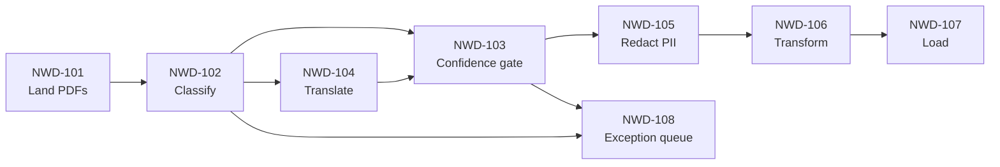
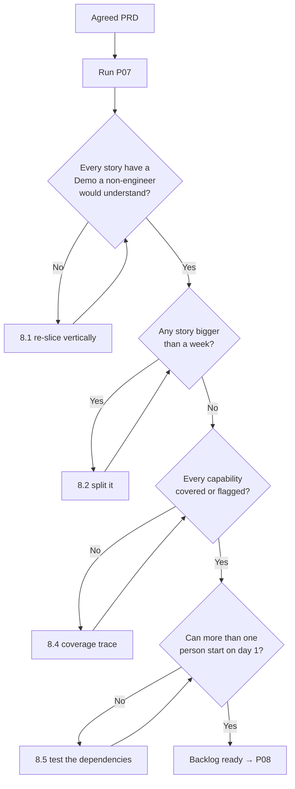

# P07 — Slice the PRD into Stories

← [P06 — Write a Full PRD](P06-write-a-full-prd.md) · [Library index](../README.md) · Next: [P08 — Write Acceptance Criteria](P08-write-acceptance-criteria.md)

> **One line:** Cut an agreed PRD into small, independently valuable pieces of work with IDs.

| | |
|---|---|
| **Phase** | 1 — Discovery |
| **Who runs it** | Product Owner (Preetinka Sharma) |
| **When** | Sprint 1, day three, the afternoon the client signs off the PRD |
| **Takes in** | `Case-Study/Python-ETL/artifacts/prd-counterparty-ingestion.md` (from [P06](P06-write-a-full-prd.md)), `Case-Study/Python-ETL/artifacts/CLAUDE.md` |
| **Produces** | `Case-Study/Python-ETL/artifacts/stories/NWD-101.md` … `NWD-108.md` — one file per story |
| **Hands off to** | Product Owner + QA together, running [P08 — Write Acceptance Criteria](P08-write-acceptance-criteria.md) |
| **Time to run** | Two hours. Fifteen minutes of prompting, the rest arguing about where the cuts go. |

---

## 1. The scene

The client came back on Wednesday. Nine of Preetinka's eleven open questions got answers, one got "ask Compliance, they'll be slow," and one — Q2, the partial-ingestion question — got a five-minute answer that ran twice as long as it needed to because the Head of Operations wanted to tell the OCR-pilot story again.

The answer was unambiguous. If a statement's rows cannot all be extracted with confidence, hold the entire document. All of it. They would rather Preeti Singh opened forty documents a day than have one silently half-loaded statement produce a break that looks real.

Preetinka now has an agreed PRD with eight capabilities. What she does not have is anything anyone can build. **CAP-04 — "report its own certainty and withhold when uncertain" — is a sentence, not a unit of work.** It could be three days or three weeks, it touches four parts of the system, and if she put it in front of Ravi Mullick on Monday he would build something, but nobody could say when it was finished.

Atul needs the work broken into pieces before he can sequence anything. Pankaj needs pieces before she can write tests. Gautam needs pieces before he can decide what order to build them in. And Preetinka needs pieces because she is the one who will be asked, in three weeks, whether the thing that got demoed is actually done.

Breaking a PRD into pieces sounds like formatting. It is not. **Where you put the cuts determines whether you find out in week two that the design is wrong, or in week nine.** Cut it one way and every piece is demoable and you learn constantly. Cut it the other way and nothing works until everything works, and you learn nothing until the end.

This prompt is about where the cuts go.

---

## 2. What this prompt actually does — in plain language

### What a user story is, with nothing assumed

A **user story** is one piece of work in the backlog, small enough to finish inside a sprint, written from the point of view of somebody who wants an outcome.

The conventional shape is three clauses:

> **As a** operations analyst
> **I want** any statement value the system is unsure about to be held back rather than loaded
> **So that** I stop chasing reconciliation breaks that turn out to be extraction errors

That format is a hundred percent optional. Teams that hate it write a plain sentence instead and lose nothing. But the three clauses do force something useful: **who**, **what**, and **why**. If you cannot fill the third clause, the story probably should not exist, and that is the format's real value.

A story is not a task. "Add a column to the staging table" is a task. It has no user, no outcome, and nobody outside the team cares whether it is done. Tasks live inside stories. A story is not a requirement either — a requirement lives in the PRD and describes what the finished system does forever, while a story describes a change you are making now. CAP-04 is a requirement. NWD-103 is the story that delivers most of it.

**A story ID** is a stable identifier — `NWD-103` — that follows the work through estimation, the sprint board, the branch name, the commit message, the test file, the bug report and the release notes. Northwind's prefix is NWD. The number means nothing beyond order. Stories are 101 upward; bugs found later start at 138. This is not sophisticated and it does not need to be.

**The backlog**, from [P06](P06-write-a-full-prd.md), is the ordered list of stories. After this prompt runs you have the list. Ordering it is [P09](P09-estimate-and-rank-the-backlog.md).

### Why you cannot just build the PRD

You could hand Ravi the whole PRD on Monday and ask for it by Christmas. Some teams genuinely work like this. Three things go wrong, reliably.

**You find out too late.** With one big lump of work, the first honest signal about whether the design works arrives at the end. On this project, the design question that mattered most was whether document-level withholding produced a tolerable number of exceptions or buried Preeti in work. That is a question you can answer in week two with a crude version, or in week nine with a finished one. Week two is a design conversation. Week nine is a rewrite.

**You cannot tell progress from motion.** "The extraction is 70% done" means nothing. "Documents from Broker Alpha now land in the raw zone and can be listed by date" is either true or false, and anyone can check it. And you cannot change your mind cheaply — half-built systems are hard to redirect, while eight finished small things are easy to reorder.

### Vertical slicing versus horizontal slicing — the whole point of this file

Here is the mistake nearly everyone makes the first time, including experienced engineers, and especially AI assistants.

You have a system with layers. Storage at the bottom, then extraction, then business rules, then the database, then the screen the analyst uses. So you slice by layer:

```text
Story 1: Build the storage layer
Story 2: Build the extraction layer
Story 3: Build the rules engine
Story 4: Build the database schema
Story 5: Build the UI
```

That is **horizontal slicing**, and it is very tempting because it matches how the system is drawn and how the team is organised. It is also close to useless, for one reason:

**Nothing works until all of it works.** Story 1 delivers a storage layer nobody can use. Story 4 delivers tables nobody writes to. You cannot demo any of them. You cannot test any of them end to end. You cannot ship any of them. And crucially, you cannot learn anything from any of them, because the questions you actually need answered — does the confidence gate reject too much, does the analyst screen make sense, does translation break the identifier match — all live in the interaction between layers.

**Vertical slicing** cuts the other way. Each slice is thin, but it goes all the way through every layer, and at the end of it something observable is different:

```text
Story 1: A Broker Alpha PDF that arrives in the landing zone is retained
         unaltered and can be found again by date and counterparty
Story 2: An arriving PDF is identified as a Broker Alpha position statement,
         or routed to review if we cannot tell
Story 3: Every extracted value is checked against a confidence threshold, and
         if any value fails, the whole document is held back with the reason
```

Every one of those touches storage, processing and persistence. Every one of them can be demonstrated to Preeti. Every one of them can be tested end to end. And each one answers a real question while it is still cheap to act on the answer.

A picture, because this one is worth a picture:

```text
HORIZONTAL — nothing works until the last box is filled

              ┌──────────────────────────────────────┐
   Screen     │              Story 5                 │
              ├──────────────────────────────────────┤
   Database   │              Story 4                 │
              ├──────────────────────────────────────┤
   Rules      │              Story 3                 │
              ├──────────────────────────────────────┤
   Extract    │              Story 2                 │
              ├──────────────────────────────────────┤
   Storage    │              Story 1                 │
              └──────────────────────────────────────┘


VERTICAL — each column is a working, demonstrable thing

              ┌────────┬────────┬────────┬────────┐
   Screen     │        │        │        │        │
              │        │        │        │        │
   Database   │ NWD-   │ NWD-   │ NWD-   │ NWD-   │
              │  101   │  102   │  103   │  108   │
   Rules      │        │        │        │        │
              │        │        │        │        │
   Extract    │        │        │        │        │
              │        │        │        │        │
   Storage    │        │        │        │        │
              └────────┴────────┴────────┴────────┘
```

The vertical slices are not equal width. NWD-103 is much fatter than NWD-101. That is fine. What matters is that each one is a complete column.

**The test for a vertical slice: could you show the finished thing to a non-engineer and would they understand what changed?** If the answer is "well, you'd have to look at the database," it is horizontal.

There is one honest complication. Some genuinely necessary work is horizontal and has no user-visible outcome — a shared client library, a schema migration, a configuration loader. The answer is not to invent a fake user story for it. The answer is to make it part of the first vertical slice that needs it. NWD-101 carries the storage client because NWD-101 is the first story that stores anything. It costs NWD-101 a bit of extra size and it saves you a story nobody can demo.

### INVEST — six letters, in plain English

**INVEST** is a checklist for whether a story is well-formed. It is an acronym, it dates from 2003, and it is the only agile mnemonic in this book that consistently earns its keep. Each letter is one question you ask about a story.

**I — Independent.** Can this story be built without waiting for another story to finish first? Perfect independence is impossible; you cannot classify a document you have not stored. What the letter really asks is: *are the dependencies real, or did I create them by slicing badly?* If story B cannot start until story A is done because A stores files and B reads them, that is a real dependency and it is fine. If B cannot start until A is done because you split one coherent job across two stories, that is a slicing error.

**N — Negotiable.** A story is a placeholder for a conversation, not a contract. It says what outcome is wanted, not how to build it. If your story dictates the implementation, you have removed the team's ability to find a better way. "Store the file in blob storage with a SHA-256-based name" is not negotiable. "Retain the file unaltered and make it findable again even if the counterparty resends it under a different name" is, and it leaves the hashing decision where it belongs.

**V — Valuable.** Somebody outside the delivery team is better off when this is done. Name them. If the only beneficiary is the team, it is a task, and it belongs inside a story rather than beside one. This is the letter that kills "build the database schema" as a story.

**E — Estimable.** The team can look at it and form a view on its size. Not an accurate view — that is not what estimation is for, as [P09](P09-estimate-and-rank-the-backlog.md) explains at length. Just a view. If the honest answer is "no idea, depends entirely on how the extraction service behaves," the story is not estimable, and the fix is usually a **spike**: a small, time-boxed piece of investigation whose output is knowledge rather than working software. "Spend one day finding out whether the extraction service returns per-field confidence for line items inside tables" is a legitimate spike and it is exactly what Hem ran before NWD-103 was estimable.

**S — Small.** It fits comfortably in one sprint, with room to spare. A story that fills the whole sprint is a story that fails the sprint, because the first surprise eats the buffer.

**T — Testable.** Somebody who did not build it can decide whether it is done. This is Pankaj's letter and she enforces it hard. "Improve extraction quality" is not testable. "A statement with any field below its confidence threshold is held back and appears in the exception queue with the failing field named" is.

A story failing one letter is usually fixable in a minute. A story failing three needs re-slicing.

### Why the prompt is shaped the way it is

**It reads the PRD, not a summary.** Slicing decisions depend on the constraints in section 6, not just the capabilities in section 5. The all-or-nothing rule (C5) is what makes NWD-103 document-scoped rather than field-scoped.

**Vertical slicing is stated as a hard rule with an example of the failure.** Models slice horizontally by default because their training data is full of engineering task breakdowns. Telling them "slice vertically" is not enough. You have to show them the shape you are rejecting. The prompt does both.

**Every story must name its beneficiary, and the beneficiary cannot be the team.** This one line eliminates most of the bad output. "As a developer, I want a configuration loader" fails it immediately.

**Every story must trace to a CAP number.** This gives you two-way traceability. Every story exists for a reason you can point at, and every capability the client agreed to is covered by at least one story. When Atul proposes cutting a story in Sprint 2, Preetinka can say exactly which capability goes with it.

**The coverage table is mandatory.** The model must output a table mapping CAP-01 through CAP-08 to the stories that deliver them, and must explicitly flag any capability with no story. Uncovered capabilities are how projects quietly drop scope.

**A dependency list per story, with a reason.** "Depends on NWD-101" is not useful. "Depends on NWD-101 because it reads the retained document" is, because it tells you whether the dependency is real or an artefact of bad slicing.

**Hard cap on story count.** Without one you get twenty-three stories, most of them tasks. Eight to twelve for a project this size. The cap forces the model to make judgement calls about what belongs together rather than splitting everything.

**No estimates, no priority order.** Those are [P09](P09-estimate-and-rank-the-backlog.md)'s job and doing them here produces worse versions of both. A model asked to slice and estimate in one pass will size the stories to make the estimates look neat.

### What the AI is actually doing when this runs

It is pattern-matching your capabilities against the enormous number of backlogs in its training data, and most of those backlogs are horizontally sliced, because most real backlogs are badly sliced. The default is the average of a bad population.

So the constraints in §3 are not politeness. They are the entire mechanism. Every hard rule is pushing back against a strong prior. **You are not asking the model to slice; you are asking it not to slice the way it wants to.**

The judgement it genuinely cannot make is where the *interesting* seams are. It will produce a defensible eight-story split. Whether NWD-103 should be one story or two — gate the fields, then hold the document — is a call about what you want to learn first, and that depends on which risk keeps you awake. That is Preetinka's call, and §8.1 is how she makes it.

### The one thing to remember

If you forget everything else: **a story is a thin vertical slice through every layer that leaves something a non-engineer can see. If nobody outside the team can tell it is finished, it is not a story.**

---

## 3. The prompt

Have the agreed PRD saved before you run this. Slicing a draft PRD produces stories you throw away.

```text
You are helping a **Product Owner** cut an agreed Product Requirements Document into user
stories for a delivery backlog.

**STOP GATE.** Before you write any stories, check that the PRD has: numbered
capabilities, a non-goals section, and a constraints section. If any of those is missing,
**stop** and say which. Slicing a PRD without its constraints produces stories that
violate rules nobody wrote down.

**Read** the PRD at [PATH TO PRD] and the project context file at [PATH TO CONTEXT FILE].
Read the constraints section as carefully as the capabilities section — constraints
determine where the cuts go.

**Slice** the PRD into between [MIN] and [MAX] user stories.

**The slicing rule — this is the most important instruction in this prompt.**

Slice **vertically**, never horizontally.

A vertical slice goes all the way through every layer of the system — intake, processing,
persistence, presentation — and ends with something a non-engineer could look at and say
"that is different now." It is thin, but it is complete.

A horizontal slice is one layer across the whole system. "Build the storage layer."
"Build the API." "Create the database schema." "Build the UI." These are forbidden. They
cannot be demonstrated, they cannot be tested end to end, and none of them delivers
anything until all of them are finished.

If a piece of shared plumbing is needed — a client library, a schema, a config loader —
do **not** give it its own story. Fold it into the first story that needs it, and say in
that story's notes that it carries the plumbing.

**Write** each story with exactly this structure:

    ## [PREFIX]-nnn — <short title, imperative, under ten words>

    **As a** <named role from the PRD's user section — never a developer, never the team>
    **I want** <the outcome, not the mechanism>
    **So that** <the benefit, traceable to a PRD goal>

    **Delivers:** <which CAP numbers this story delivers, in whole or in part>
    **Depends on:** <story IDs, each with a one-line reason it is a real dependency,
                    or "nothing">
    **Demo:** <one sentence describing what you would show a non-engineer to prove this
              is done>
    **Out of scope for this story:** <2–4 things a reader might assume are included>
    **Notes:** <anything the team needs to know, including shared plumbing this story
               carries>

**Then produce**, after the stories, these three things:

1. **A coverage table** with one row per capability in the PRD, listing the stories that
   deliver it. **Explicitly flag any capability with no story.**
2. **An INVEST check** — for each story, one line saying whether it satisfies all six of
   Independent, Negotiable, Valuable, Estimable, Small, Testable, and naming any letter
   it fails and why. Be honest. A story that fails a letter and says so is more useful
   than one that claims six out of six.
3. **A dependency diagram** in mermaid, showing which stories block which.

**Do not:**

- **Do not** write a story whose beneficiary is the delivery team. Every story's "As a"
  must name someone outside it.
- **Do not** slice by technical layer, by component, or by which engineer would build it.
- **Do not** write acceptance criteria. That is a separate step with a different author.
- **Do not** estimate, size, or prioritise. Do not order the stories by importance —
  order them by natural build sequence only.
- **Do not** invent a story for something the PRD does not require. If you think
  something is missing, list it separately under "gaps I think the PRD is missing" and
  let a human decide.
- **Do not** exceed [MAX] stories. If you cannot fit, say which capabilities you had to
  combine and why.
- **Do not** use the word "system" as the beneficiary.

**You are done when:** every capability in the PRD appears in the coverage table with at
least one story or an explicit flag, every story has a Demo line that a non-engineer
would understand, and the INVEST check names at least one genuine weakness somewhere in
the set. A set of stories where nothing fails INVEST has not been checked honestly.

**Save** each story as its own file at [STORY FOLDER]/[PREFIX]-nnn.md, and save the
coverage table, INVEST check and dependency diagram to [STORY FOLDER]/README.md.
```

---

## 4. Every placeholder, explained

| Placeholder | What to put in it | Northwind example | What happens if you get it wrong |
|---|---|---|---|
| `[PATH TO PRD]` | Path to the **agreed** PRD from [P06](P06-write-a-full-prd.md). Agreed, not draft. | `Case-Study/Python-ETL/artifacts/prd-counterparty-ingestion.md` | Slice a draft and you re-slice after the client review. Two hours wasted, and worse, some of the discarded stories will already be on the board. |
| `[PATH TO CONTEXT FILE]` | The project context file from [P01](../phase-0-foundation/P01-generate-the-project-context-file.md). | `Case-Study/Python-ETL/artifacts/CLAUDE.md` | Without it the model does not know the domain, and story titles come out generic: "process documents" rather than "classify to counterparty layout". |
| `[MIN]` / `[MAX]` | The story count range. For a project of this size, 8 and 12. For a two-week piece of work, 3 and 6. | `8` and `12` | Too high and you get tasks dressed as stories. Too low and each story is a month of work and the whole point is lost. If you genuinely do not know, use 6 and 12 and cut afterwards. |
| `[PREFIX]` | The project's story ID prefix. Whatever your tracker uses. | `NWD` | Get this wrong and every branch name, commit message and test file references an ID that does not exist in the tracker. Annoying to fix later, free to fix now. |
| `[STORY FOLDER]` | Where the story files go. One file per story. | `Case-Study/Python-ETL/artifacts/stories` | If you let them all land in one file, [P08](P08-write-acceptance-criteria.md) has nothing to attach criteria to, and story-level history in git becomes unreadable. |

**On the numbering.** The prompt does not specify a starting number. Preetinka started at 101 by hand, because starting stories at 001 and bugs at 001 in the same tracker is a mistake you make once. Northwind's bugs start at 138.

---

## 5. The filled-in example

Preetinka ran this on Wednesday afternoon, ten minutes after the client call ended, with the PRD updated to include the answer to Q2.

```text
You are helping a **Product Owner** cut an agreed Product Requirements Document into user
stories for a delivery backlog.

**STOP GATE.** Before you write any stories, check that the PRD has: numbered
capabilities, a non-goals section, and a constraints section. If any of those is missing,
**stop** and say which. Slicing a PRD without its constraints produces stories that
violate rules nobody wrote down.

**Read** the PRD at Case-Study/Python-ETL/artifacts/prd-counterparty-ingestion.md and the
project context file at Case-Study/Python-ETL/artifacts/CLAUDE.md. Read the constraints
section as carefully as the capabilities section — constraints determine where the cuts go.

**Slice** the PRD into between 8 and 12 user stories.

**The slicing rule — this is the most important instruction in this prompt.**

Slice **vertically**, never horizontally.

A vertical slice goes all the way through every layer of the system — intake, processing,
persistence, presentation — and ends with something a non-engineer could look at and say
"that is different now." It is thin, but it is complete.

A horizontal slice is one layer across the whole system. "Build the storage layer."
"Build the API." "Create the database schema." "Build the UI." These are forbidden. They
cannot be demonstrated, they cannot be tested end to end, and none of them delivers
anything until all of them are finished.

If a piece of shared plumbing is needed — a client library, a schema, a config loader —
do **not** give it its own story. Fold it into the first story that needs it, and say in
that story's notes that it carries the plumbing.

**Write** each story with exactly this structure:

    ## NWD-nnn — <short title, imperative, under ten words>

    **As a** <named role from the PRD's user section — never a developer, never the team>
    **I want** <the outcome, not the mechanism>
    **So that** <the benefit, traceable to a PRD goal>

    **Delivers:** <which CAP numbers this story delivers, in whole or in part>
    **Depends on:** <story IDs, each with a one-line reason it is a real dependency,
                    or "nothing">
    **Demo:** <one sentence describing what you would show a non-engineer to prove this
              is done>
    **Out of scope for this story:** <2–4 things a reader might assume are included>
    **Notes:** <anything the team needs to know, including shared plumbing this story
               carries>

**Then produce**, after the stories, these three things:

1. **A coverage table** with one row per capability in the PRD, listing the stories that
   deliver it. **Explicitly flag any capability with no story.**
2. **An INVEST check** — for each story, one line saying whether it satisfies all six of
   Independent, Negotiable, Valuable, Estimable, Small, Testable, and naming any letter
   it fails and why. Be honest. A story that fails a letter and says so is more useful
   than one that claims six out of six.
3. **A dependency diagram** in mermaid, showing which stories block which.

**Do not:**

- **Do not** write a story whose beneficiary is the delivery team. Every story's "As a"
  must name someone outside it.
- **Do not** slice by technical layer, by component, or by which engineer would build it.
- **Do not** write acceptance criteria. That is a separate step with a different author.
- **Do not** estimate, size, or prioritise. Do not order the stories by importance —
  order them by natural build sequence only.
- **Do not** invent a story for something the PRD does not require. If you think
  something is missing, list it separately under "gaps I think the PRD is missing" and
  let a human decide.
- **Do not** exceed 12 stories. If you cannot fit, say which capabilities you had to
  combine and why.
- **Do not** use the word "system" as the beneficiary.

**You are done when:** every capability in the PRD appears in the coverage table with at
least one story or an explicit flag, every story has a Demo line that a non-engineer
would understand, and the INVEST check names at least one genuine weakness somewhere in
the set. A set of stories where nothing fails INVEST has not been checked honestly.

**Save** each story as its own file at
Case-Study/Python-ETL/artifacts/stories/NWD-nnn.md, and save the coverage table, INVEST
check and dependency diagram to Case-Study/Python-ETL/artifacts/stories/README.md.

Start the numbering at NWD-101.
```

---

## 6. What comes back

The full output is eight story files plus a README. Here are four of the eight stories in full, then the coverage table, the INVEST check and the dependency diagram from the README.

```markdown
## NWD-101 — Land counterparty PDFs immutably in the raw zone

**As an** operations analyst
**I want** every statement a counterparty sends us to be kept exactly as it arrived, and
findable again later by counterparty and date
**So that** when a number in the warehouse is questioned months later, I can open the
original document it came from instead of asking the broker to resend it

**Delivers:** CAP-01 (fully)
**Depends on:** nothing
**Demo:** Drop three PDFs from different counterparties into the intake. Show them
appearing in the retained store, organised by counterparty and date, byte-identical to
what was sent. Show that re-dropping the same file does not create a second copy.
**Out of scope for this story:**
- Reading anything inside the PDF. Nothing is parsed here.
- Deciding which counterparty it came from — that is NWD-102. This story uses whatever
  the intake channel tells us.
- Retention policy and deletion. Nothing is deleted in this story.
**Notes:** This story carries the shared storage client that every later story uses, and
the content-based duplicate check. Folding them in here rather than giving them their own
story keeps the first slice demonstrable. The duplicate check is content-based rather than
filename-based because PRD constraint C4 notes counterparties resend under new names —
NWD-107 depends on this being right.

---

## NWD-102 — Classify an incoming PDF to its counterparty layout

**As an** operations analyst
**I want** an arriving document to be identified as a specific counterparty's specific
document type, or held for me if it cannot be identified confidently
**So that** the right reading rules are applied to it, and an unrecognised document
reaches me as a question rather than as wrong data

**Delivers:** CAP-02 (fully)
**Depends on:** NWD-101 — it reads the retained document, so retention must exist first.
This is a real dependency, not a slicing artefact.
**Demo:** Feed in one Broker Alpha position statement, one Broker Beta EM trade
confirmation, and one document from a counterparty we have never seen. Show the first two
correctly identified and the third routed to review with the reason "could not identify
counterparty layout with sufficient confidence."
**Out of scope for this story:**
- Extracting any values. Classification only.
- The review screen itself — NWD-108. This story puts the item in the queue; it does not
  render it.
- Training or onboarding a new counterparty layout — CAP-08, deferred, see gaps.
**Notes:** The "held for me if it cannot be identified" half is as important as the
identification half, and is easy to drop under time pressure. PRD constraint C1 applies:
an unidentified document must never be processed as a best guess.

---

## NWD-103 — Gate every extracted field on its confidence score

**As an** operations analyst
**I want** every value read off a statement to be checked against a certainty threshold
before it goes anywhere, and the whole document held back if any single value fails
**So that** I never again spend a fortnight chasing reconciliation breaks that turn out
to be the tool's own reading errors

**Delivers:** CAP-03 (partly — the reading), CAP-04 (fully), CAP-05 (partly — the routing
and the reason, not the screen)
**Depends on:**
- NWD-101 — reads the retained document.
- NWD-102 — needs to know which layout it is before it knows what fields to expect.
**Demo:** Take one clean Broker Alpha statement and one where a quantity is smudged. Show
the clean one passing through to staging with every value present. Show the smudged one
held back entirely — not partly — with the exception reason naming the specific field and
its score. Show the numbers in staging, and show that the held document put nothing there.
**Out of scope for this story:**
- Correcting a held document. Release-after-correction is NWD-108.
- Translation of non-English documents — NWD-104.
- Loading anything into the warehouse — NWD-107. This story stops at staging.
- Tuning the thresholds. This story makes them configurable and uses a first set;
  choosing the final numbers is a data exercise, not this story.
**Notes:** This is the story the whole project is about. Two things in it are easy to get
subtly wrong and both come from PRD constraints. First, C5: the gate is document-scoped,
not field-scoped. Rejecting one field must reject the document, not just that field.
Second, C1: thresholds differ by kind of value, because a wrong monetary amount and a
wrong description are not equally bad. The exception reason must name the failing field
specifically — "extraction failed" is not acceptable per CAP-05.

---

## NWD-108 — Exception queue screen for analyst review

**As an** operations analyst
**I want** a screen listing every document that was held back, showing me exactly which
value failed and why, with the original document alongside it, so I can correct it and
release it
**So that** a held document costs me two minutes instead of being a dead end, and the
work that was automated stays automated

**Delivers:** CAP-05 (fully), and completes the human half of CAP-02 and CAP-04
**Depends on:**
- NWD-102 — needs classification failures to have something to show.
- NWD-103 — needs confidence failures, which are the bulk of the queue.
**Demo:** Show Preeti the queue with six held documents. Open one. Show the failing field
highlighted, its score shown as a percentage, and the source PDF page beside it. Correct
the value, release it, and show it appear in staging within seconds. Show the queue count
drop to five.
**Out of scope for this story:**
- Bulk release of multiple documents. Open question Q6 in the PRD; not answered yet.
- Editing a value that passed the gate. Only failing fields are editable.
- Any reporting or analytics over the queue.
**Notes:** The beneficiary here is Preeti specifically and the demo should be run with her
in the room, not for her. PRD goal G3 depends on this screen being fast to use — if
clearing an exception takes ten minutes, the 85% straight-through target is irrelevant
because the other 15% eats the day.
```

And the README:

```markdown
# Backlog — Counterparty Document Ingestion

## Stories

| ID | Title | Owner |
|---|---|---|
| NWD-101 | Land counterparty PDFs immutably in the raw zone | Backend |
| NWD-102 | Classify an incoming PDF to its counterparty layout | Backend |
| NWD-103 | Gate every extracted field on its confidence score | Backend |
| NWD-104 | Translate EM documents to English before matching | Backend |
| NWD-105 | Redact PII before anything is persisted | Backend |
| NWD-106 | Transform extracted fields into the canonical position schema | Backend |
| NWD-107 | Load positions into staging and the warehouse idempotently | Backend |
| NWD-108 | Exception queue screen for analyst review | Frontend |

## Capability coverage

| Capability | Delivered by | Status |
|---|---|---|
| CAP-01 Receive and retain source documents | NWD-101 | Fully covered |
| CAP-02 Identify counterparty and document type | NWD-102, NWD-108 | Fully covered |
| CAP-03 Extract the business values | NWD-103, NWD-106 | Fully covered |
| CAP-04 Report certainty and withhold when uncertain | NWD-103, NWD-108 | Fully covered |
| CAP-05 Route uncertain items to a human with the reason | NWD-103, NWD-108 | Fully covered |
| CAP-06 Handle non-English documents | NWD-104 | Fully covered |
| CAP-07 Tolerate duplicate arrivals | NWD-101, NWD-107 | Fully covered |
| CAP-08 Onboard a counterparty without a release | — | **NOT COVERED** |

**CAP-08 is not covered by any story.** Onboarding a new counterparty without a software
release is a property of how NWD-102 and NWD-103 are built rather than a separate
deliverable, but nothing in the current stories forces it. A Product Owner decision is
needed: either add a story that proves it (add a ninth counterparty end to end, changing
configuration only), or accept that CAP-08 is a design constraint on other stories and
record it as such. Leaving it as-is means nobody ever verifies it.

## INVEST check

| Story | I | N | V | E | S | T | Weakness |
|---|---|---|---|---|---|---|---|
| NWD-101 | ✓ | ✓ | ✓ | ✓ | ✓ | ✓ | None. Good first slice. |
| NWD-102 | ✓ | ✓ | ✓ | ~ | ✓ | ✓ | **Estimable is weak.** Nobody knows yet how many labelled examples a classifier needs to be reliable. Recommend a spike before estimating. |
| NWD-103 | ✓ | ✓ | ✓ | ~ | ✗ | ✓ | **Small fails.** This story does field-level checking, document-level rejection, threshold configuration, and exception routing. It is the largest story in the set by a wide margin and a strong candidate for splitting. See note below. |
| NWD-104 | ~ | ✓ | ✓ | ✓ | ✓ | ✓ | **Independent is weak** — it changes what NWD-103 sees, so building it after NWD-103 means revisiting NWD-103's tests. |
| NWD-105 | ✓ | ✓ | ~ | ✓ | ✓ | ✓ | **Valuable is indirect.** The beneficiary is Compliance, who is an approver rather than a user. Legitimate, but worth naming honestly. |
| NWD-106 | ✓ | ✓ | ✓ | ✓ | ✓ | ✓ | None. |
| NWD-107 | ✓ | ✓ | ✓ | ✓ | ✓ | ✓ | None. |
| NWD-108 | ✓ | ✓ | ✓ | ~ | ~ | ✓ | **Small and Estimable both weak** — the scope depends on PRD open question Q6 (bulk actions), which is unanswered. |

**On NWD-103.** A defensible split: (a) check every field against a per-type threshold
and record the result, (b) reject the whole document if any field failed, and route it
with the reason. Splitting gives you a working gate a week earlier. Not splitting keeps
the story's central point — document-scoped rejection — intact and un-droppable. Product
Owner decision. Recommend not splitting, because (a) alone would ship a field-scoped gate
and field-scoped gates are exactly what PRD constraint C5 forbids.

## Dependencies



## Gaps I think the PRD is missing

1. Nothing describes what happens when the intake channel itself fails — a counterparty
   sends nothing at all on a day they normally send something. Silence is currently
   indistinguishable from success.
2. Nothing describes how a counterparty's layout changing is detected. The PRD notes
   layouts change without notice; no story notices.
3. No story covers monitoring or alerting on the pipeline itself.

These are not stories yet because the PRD does not require them. A Product Owner should
decide whether they are scope, later scope, or non-goals.
```

### How to read this

**Look at the CAP-08 row in the coverage table first.** It says NOT COVERED, in bold, with a paragraph explaining the decision that needs making. That row is the highest-value line in the entire output. Without it, "adding a counterparty is a configuration change, not a code change" would have stayed a nice idea nobody tested, and the first time Northwind added a counterparty in production it would have taken a release. The prompt produced it because the coverage table was mandatory and flagging gaps was explicit.

**Look at the INVEST row for NWD-103.** It fails Small and says so, and then argues *against* splitting it. That is the useful shape: an honest weakness plus a reasoned recommendation, leaving the decision with a human. A model that gave every story six ticks would have told you nothing.

**Look at NWD-101's Notes.** It says the story carries the shared storage client and the content-based duplicate check. That is the anti-horizontal-slicing rule working. The alternative — an NWD-100 called "build the storage layer" — would have been a story with no user, no demo, and no way to know it was finished.

**Now the part that is commonly wrong.** Look at the dependency diagram. NWD-104 (translate) sits between NWD-102 and NWD-103, which means translation must be built before the confidence gate. That is one defensible reading, and it is not the one the team took. Building NWD-103 first against English documents only, and inserting translation afterwards, was faster and lower-risk. The model's dependency ordering is a *plausible* build sequence, not the right one — the right one depends on risk, on who is available, and on what you want to learn first. That is [P09](P09-estimate-and-rank-the-backlog.md)'s job and Gautam's, and you should expect to override this diagram.

The related trap: the model ordered NWD-105 (redact PII) after NWD-103. That looks fine until you read PRD constraint C3, which says PII must not be persisted. NWD-103 persists to staging. So either redaction moves earlier or NWD-103's staging write is not really persistence. Preetinka caught this. The model did not, because it was ordering by data flow rather than by constraint. **Constraints do not respect the data flow diagram, and this is exactly the kind of thing to check by hand.**

---

## 7. Why this is the final prompt

### What "done" means here

The stories are done when **Pankaj can pick any one of them, read it, and start writing acceptance criteria without asking Preetinka a question first.**

That is a real test and you can run it. Hand her NWD-106. If her first response is "what does 'canonical schema' mean here," the story is not done. If it is a list of edge cases she wants to cover, it is.

The second test, less formal: read each Demo line out loud and imagine Preeti Singh in the room. If you would be embarrassed to demo it because there is nothing to look at, that story is horizontal and needs re-slicing.

### The checklist

- [ ] Every story's "As a" names a person outside the delivery team. Search for "as a developer" and "as an engineer". Zero hits.
- [ ] Every story has a Demo line that a non-engineer would understand without follow-up questions.
- [ ] No story title is a system layer. Search for "layer", "schema", "API", "infrastructure", "framework" in the titles. Zero hits.
- [ ] The coverage table covers every capability in the PRD, and gaps are flagged rather than fudged.
- [ ] Every dependency has a stated reason, and you agree the reason is real rather than a slicing artefact.
- [ ] The INVEST check names at least one genuine weakness. If everything passes, it was not checked honestly.
- [ ] Story count is inside your range, and you can say what the largest story is.

### Why you should stop rather than keep prompting

Story slicing has a specific over-prompting failure and it is splitting.

Every time you ask a model to split stories further, it will. It is always possible to make a story smaller. Ask three times and you have twenty-three stories, most of them tasks, and a dependency diagram that looks like a plate of noodles. **The stories get smaller and the work gets harder, because coordination cost grows faster than story size shrinks.**

There is a floor. A story that takes two people two days is at the floor. Below that you are tracking tasks in a story tracker and paying the overhead of both.

The other reason to stop: **the remaining ambiguity in these stories is not the model's to resolve.** Whether NWD-103 splits, whether CAP-08 gets its own story, whether translation comes before or after the gate — those are Preetinka's calls, informed by what she knows about the client and what Gautam knows about the team. Prompting harder will get you more options, not a decision.

### The signal that you are NOT done

If you read a story's Demo line and cannot picture what you would put on the screen during the sprint review, that story is horizontal and §8 has the fix.

---

## 8. When it is not done — the follow-up prompts

| What you're seeing | What's actually wrong | Run this next |
|---|---|---|
| Story titles are "Build the extraction service", "Create the schema", "Set up storage" | Classic horizontal slicing. The model matched its training data instead of your instruction. | **8.1** below |
| Every story is huge — each one looks like a month of work | Under-sliced. Usually happens when MAX was set too low, or one capability is genuinely the whole project. | **8.2** below |
| Two stories keep coming up in the same conversation and neither makes sense alone | They are one story wearing two hats. Over-slicing. | **8.3** below |
| A capability has no story and the model did not say so | The coverage table was skipped or fudged. Highest-risk failure — this is how scope goes missing silently. | **8.4** below |
| Dependencies form a chain where nothing can start until everything else is done | Either the slicing is wrong, or the dependencies are assumed rather than real. | **8.5** below |
| The stories look right but you cannot tell what to build first | Not a slicing problem. That is prioritisation. | **[P09 — Estimate and Rank the Backlog](P09-estimate-and-rank-the-backlog.md)** |
| A story is not estimable because nobody knows how the technology behaves | Needs a spike, not a better story | **8.2** below, then the design phase — **[P10](../phase-2-design/P10-ultra-plan-mode.md)** |
| Stories are good and you need to define "done" for each | Nothing is wrong | **[P08 — Write Acceptance Criteria](P08-write-acceptance-criteria.md)** |

### 8.1 "These are all horizontal — they're system layers, not slices"

Use this the moment you see a story title containing the word "layer", "service", "schema", "API" or "component".

```text
The stories you produced are sliced horizontally, by system layer. That is the failure
mode I asked you to avoid, so let us fix it directly rather than starting over.

For **each** story you wrote, answer these two questions honestly:

1. If this story were the **only** thing built, what could a non-engineer see or do that
   they could not before? If the honest answer is "nothing", say "nothing".
2. Which other stories must **also** be finished before anyone can see any difference?

**Then re-slice.** Take the stories that answered "nothing" and redistribute their
contents across stories that answer with something real. The plumbing does not get its
own story — it gets folded into the first story that needs it.

Aim for the same total amount of work in fewer, thicker, complete slices. It is normal
and correct for the new stories to be individually larger than the old ones.

**Show me** a before-and-after mapping so I can see where each piece of the old stories
ended up. Do not lose anything in the reshuffle — if something in an old story has no
home, list it separately rather than dropping it.
```

What changes: the story count drops, usually by a third, and every survivor has a Demo line. On the Northwind run this turned five layer-shaped stories into three vertical ones and surfaced two pieces of work — retry handling and structured logging — that had no home and became notes on other stories.

### 8.2 "It gave me eight stories and they're all too big"

Use this when a story looks like more than a week of work for two people, or when the INVEST check fails Small in three or more places.

```text
Story [ID] is too large to finish comfortably in one sprint. Split it.

**Split it vertically, not horizontally.** Both halves must still go through every layer
and both must still be demonstrable on their own. Splitting into "the back end of X" and
"the front end of X" is not acceptable.

Use one of these patterns and **tell me which one you used**:

- **By rule complexity** — the simple, common case first; the exceptions and edge cases
  second. (Handle the standard layout; then handle the one with the awkward table.)
- **By data variation** — one input type first, the rest second. (English documents;
  then Spanish.)
- **By workflow step** — the happy path end to end; then the correction path.
- **By operation** — read first, then write. Or create first, then edit and delete.
- **By quality of service** — make it work; then make it survive failure and retry.

For **each** resulting story, give me the full story structure including a Demo line, and
say explicitly what the **first** half delivers on its own that is worth having even if
the second half is never built.

If you cannot answer that last question for a split, **the split is wrong** — say so and
try a different pattern.

**Do not** produce more than three stories from one. If it genuinely needs four, the
original was not a story, it was a capability, and I need to know that.
```

What changes: you get a defensible split with a named pattern, plus the sanity check that the first half is independently worth having. That last instruction catches the most common bad split — where part one is "do half the work" and delivers nothing.

### 8.3 "These two stories are really one story"

Use this when two stories always come up together, or when one story's Demo requires the other to be finished.

```text
Stories [ID A] and [ID B] look like one story to me. Check whether they are.

**Answer these five questions:**

1. Could [A] ship to production without [B], and would anyone benefit?
2. Could [B] ship without [A], and would anyone benefit?
3. Do they have the **same** beneficiary and the **same** underlying reason to exist?
4. Would the sprint review demo for [A] make any sense without showing [B]?
5. Would a tester writing acceptance criteria for [A] find themselves writing criteria
   that are really about [B]?

**If questions 1 and 2 both answer "no"** — neither ships alone — they are one story.
Merge them, write the merged story in full, and say what the merged story is called.

**If only one of them answers "no"**, they are not two stories, they are one story and
one piece of the same story that got separated. Fold the dependent one into the other.

**If both answer "yes"**, they are genuinely separate. Say so, and tell me what I was
seeing that made them look joined — it is usually a shared piece of implementation, which
is not a reason to merge stories.

Be willing to tell me I am wrong. Merging stories that should stay separate is as bad as
splitting ones that should not.
```

What changes: you get a decision with reasoning instead of a merge. The last paragraph matters — models are agreeable, and a model that merges whenever asked is not checking anything. On the Northwind run Preetinka asked this about NWD-106 and NWD-107 and got told no, correctly, because transform-to-canonical-schema ships value on its own even if nothing loads to the warehouse yet.

### 8.4 "Something from the PRD has gone missing"

Use this when the coverage table is absent, or when you have a nagging feeling something was dropped.

```text
I want to verify nothing from the PRD was lost in slicing.

**Work capability by capability**, in order, from CAP-01 to the last one. For each:

1. Quote the capability from the PRD, verbatim.
2. Name every story that delivers any part of it.
3. State whether the coverage is **full**, **partial** or **none**.
4. If partial, say precisely which part of the capability no story delivers.

**Then do the same in reverse.** For each story, name the capability it traces to. Any
story that traces to no capability is scope you added — flag it loudly, because either the
PRD is incomplete or the story should not exist, and those need different fixes.

**Then check the constraints section separately.** Constraints are not capabilities and do
not get their own stories, but every constraint must be honoured by the stories that could
violate it. For each constraint, name the stories where violating it is possible, and say
whether the story text acknowledges it.

**Output** a single table. Do not rewrite any stories.
```

What changes: you get a two-way trace plus a constraint check. The constraint half is the part people skip and it is where the Northwind PII ordering problem showed up — NWD-105 redacting after NWD-103 had already written to staging, in violation of C3.

### 8.5 "The dependency chain means nothing can start"

Use this when the mermaid diagram is one long line, or when Atul says he cannot parallelise anything.

```text
The dependency graph you produced is almost entirely sequential, which means only one
person can work at a time. Check whether the dependencies are real.

For **each** dependency edge, classify it as one of:

- **HARD** — story B literally cannot function without story A's output existing. State
  what the output is.
- **SOFT** — B would be easier after A, but B could be built against a stub, a fixture,
  or a hardcoded value and wired up later. State what the stub would be.
- **ARTEFACT** — the dependency only exists because of how I sliced. Both stories touch
  the same code. State how a different slicing removes it.

**Then** tell me what the dependency graph looks like if every SOFT edge is broken by
building against a stub, and how many stories could then start in parallel on day one.

**Do not** tell me to build stubs everywhere. Stubs have a cost and the cost is paid
twice — once writing them, once removing them. Tell me which two or three would buy the
most parallelism, and what it would cost to be wrong about them.
```

What changes: a sequential chain usually turns out to be two or three hard edges and a lot of soft ones. On the Northwind run, breaking one soft edge — building NWD-108's screen against fixture data rather than waiting for NWD-103 — let Dzmitry start in week one instead of week three. That single decision is why the exception queue was ready for Pankaj to test at all.

### The loop, drawn



Notice that 8.3 is not in the loop. Merging is a judgement you make once, when something feels wrong, not a step you always run. If you find yourself running it repeatedly you have an over-splitting habit, and the fix is a bigger MIN in the original prompt.

---

## 9. How this goes wrong

### You slice by who will build it

This one is seductive because it looks like sensible planning. Ravi does backend, Dzmitry does frontend, so there is a backend story and a frontend story. Two people, two stories, no conflicts.

What you have actually done is slice horizontally with extra steps. The backend story delivers nothing anyone can see. The frontend story has nothing real to show. Both finish, neither works, and the integration is a third piece of work nobody estimated.

The fix is uncomfortable and correct: a story that needs both people is one story that two people work on together. NWD-108 is Dzmitry's story, but the exception reason format that NWD-103 writes and NWD-108 renders is one decision made once, by both of them, inside one of the stories. Which one is a coin flip. Splitting it across both is the mistake.

### The stories are perfect and nobody can build them

You can write stories so pure — so free of implementation, so focused on outcome — that they contain no usable information. "As an analyst I want accurate data so that I can trust the reconciliation." Six INVEST ticks. Completely unbuildable.

This happens when you over-apply Negotiable. Negotiable means the story does not dictate the solution. It does not mean the story withholds what you already know. If the PRD says thresholds vary by field type, the story should say so. If a constraint governs the story, name the constraint.

The fix: the Notes field exists for this. Everything you know that would help and is not a requirement goes in Notes. NWD-103's Notes carry both the C5 document-scoping rule and the C1 threshold-varies-by-type rule, and Ravi reads both before he writes a line.

### The coverage table lies by omission

The model produces a coverage table where every capability has a story listed against it, and it is technically true, and it is still wrong. CAP-08 gets NWD-102 listed against it because NWD-102 touches classification and classification is where layouts live.

This is the most dangerous failure in this prompt because it produces confidence. Everyone reads the table, sees full coverage, and stops looking.

The fix: run §8.4 and read the "partial" rows properly. On the Northwind run the model got this one right and flagged CAP-08 as uncovered. That was luck as much as prompting. Preetinka now checks the coverage table by hand against the PRD, capability by capability, and it takes eleven minutes.

### You slice a PRD that is not agreed yet

Preetinka sliced the draft PRD on Tuesday, before the client call. It seemed efficient. Then Q2 came back with the all-or-nothing answer and NWD-103 changed from a field-level gate to a document-level gate, which changed NWD-108's whole shape, which changed the dependency graph. Nothing catastrophic happened because it was one day; if it had been a week, with estimates already against the stories, unwinding it would have cost more than the slicing did.

The fix: the stop gate does not check for "agreed" because a document cannot tell you whether a human nodded at it. You have to. Do not run this prompt until the PRD's open-questions list has owners' answers written into it.

### This prompt is the wrong tool entirely

**The work is one thing and does not divide.** Sometimes a piece of work is genuinely atomic — a single rule change, a single defect, a single configuration switch. Slicing it produces one story that says the same thing as the original ask, plus a coverage table and a dependency diagram with one node. Just write the story by hand.

**You are not slicing scope, you are sequencing known work.** If somebody has already decided what the pieces are and you need to know what order to do them in, that is [P09](P09-estimate-and-rank-the-backlog.md) and [P15](../phase-3-planning/P15-implementation-plan.md), not this. Running this prompt will re-slice work that was already sliced, and you will spend an afternoon reconciling two backlogs.

---

## 10. The handoff

The eight story files go to Preetinka and Pankaj together, and they run [P08](P08-write-acceptance-criteria.md) side by side. That pairing is deliberate and it is the subject of most of P08's second section — criteria written by a Product Owner alone describe what should happen, and criteria written with QA in the room describe what happens when it does not.

They start with NWD-103, because NWD-103 is where the project's central claim lives and because it is the story most likely to be wrong. What P08 is guaranteed to find in each story file: a named beneficiary, an outcome stated without a mechanism, a Demo line, an explicit out-of-scope list, and the CAP numbers it traces back to. The out-of-scope list is the one Pankaj reads first — it tells her which failure paths belong to this story and which belong to a different one, which is the difference between thorough testing and scope creep with a test plan attached.

Atul takes the dependency diagram and the story list into [P09](P09-estimate-and-rank-the-backlog.md) with Gautam. He does not take the INVEST check, and this turns out to be a small mistake — the two stories flagged as weak on Estimable are exactly the two that cause him trouble in Sprint 2, and the flag was sitting there in the README all along.

Hem reads the whole backlog once, quickly, looking for the stories where her recurring question has an interesting answer. She finds three. NWD-103's "what does this look like when it's wrong" is the one that turns into ADR 0001.

> **Artifact contract — `Case-Study/Python-ETL/artifacts/stories/NWD-nnn.md`**
>
> Anyone reading a story file can rely on finding:
> - A stable ID matching the tracker, and a title under ten words describing an outcome.
> - A beneficiary who is not a member of the delivery team.
> - The wanted outcome stated without naming a technology or a mechanism.
> - The CAP numbers from the PRD that this story delivers, in whole or in part.
> - Dependencies, each with a stated reason it is real.
> - A Demo line describing what you would show a non-engineer.
> - An explicit out-of-scope list of at least two items.
> - Notes carrying any PRD constraint that governs this story, and any shared plumbing it carries.
>
> And in `stories/README.md`: a coverage table over every PRD capability with gaps flagged, an honest INVEST check, and a dependency diagram.
>
> If any of those is missing, the artifact is not done — go back to §7.

---

## 11. In the case study

This runs on the Wednesday afternoon of Sprint 1, in [`02-sprint-1-discovery.md`](../../Case-Study/Python-ETL/02-sprint-1-discovery.md). Preetinka had the eight stories by half past three and spent until six on two arguments, one with herself and one with Gautam.

The argument with herself was NWD-103. The model flagged it as failing Small and offered a split: check the fields, then reject the document. The split was clean and it would have got a working confidence check into the sprint a week earlier. Preetinka said no, and her reasoning is worth repeating, because it is the kind of judgement the model correctly declined to make.

If you ship part (a) alone, you have a field-scoped gate. Field-scoped gates are what the PRD's constraint C5 exists to forbid, and constraint C5 exists because the client told the OCR-pilot story twice. **A half-finished story that behaves like the thing you promised not to build is more dangerous than an unfinished one**, because somebody will demo it, and somebody will like it. She kept NWD-103 whole and it took eleven days.

The argument with Gautam was CAP-08 — the uncovered capability. Gautam's position was that adding a counterparty without a release is a property of the design, and Hem would honour it in the architecture, so a story was bureaucracy. Preetinka's position was that untested properties are not properties. They compromised: no new story, but NWD-102's acceptance criteria would include onboarding a ninth counterparty by configuration only. That criterion is in [`acceptance-criteria-NWD-103.md`](../../Case-Study/Python-ETL/artifacts/acceptance-criteria-NWD-103.md)'s sibling file, it passed, and in Sprint 4 Northwind added a counterparty in forty minutes without a deployment. Gautam was right about the design and Preetinka was right that nobody would have known.

The thing that went wrong is quieter. The dependency diagram put NWD-105 (redact PII) after NWD-103, and NWD-103 writes to staging. PRD constraint C3 says PII must not be persisted. Nobody caught it in the story review. It was caught eight days later by Hem, writing the technical spec, asking her usual question. The fix was cheap because nothing had been built yet. It would not have been cheap in Sprint 3, and it is the reason §8.4's constraint check exists as a separate instruction rather than a line in the coverage table.

The stories are at [`artifacts/stories/`](../../Case-Study/Python-ETL/artifacts/stories/).

---

← [P06 — Write a Full PRD](P06-write-a-full-prd.md) · [Library index](../README.md) · Next: [P08 — Write Acceptance Criteria](P08-write-acceptance-criteria.md)
