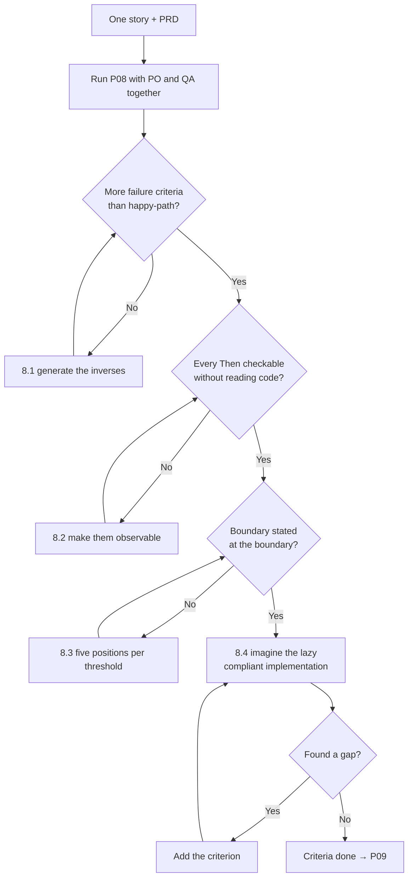

# P08 — Write Acceptance Criteria

← [P07 — Slice the PRD into Stories](P07-slice-the-prd-into-stories.md) · [Library index](../README.md) · Next: [P09 — Estimate and Rank the Backlog](P09-estimate-and-rank-the-backlog.md)

> **One line:** Turn one story into a checkable list of conditions, written by the Product Owner and QA together.

| | |
|---|---|
| **Phase** | 1 — Discovery |
| **Who runs it** | Product Owner + QA, in the same room (Amara Osei and Ananya Iyer) |
| **When** | Sprint 1, day four, immediately after the backlog is sliced and before anything is estimated |
| **Takes in** | `Case-Study/Python-ETL/artifacts/stories/NWD-103.md` (from [P07](P07-slice-the-prd-into-stories.md)), `Case-Study/Python-ETL/artifacts/prd-counterparty-ingestion.md` |
| **Produces** | `Case-Study/Python-ETL/artifacts/acceptance-criteria-NWD-103.md` |
| **Hands off to** | Project Manager + Team Lead, running [P09 — Estimate and Rank the Backlog](P09-estimate-and-rank-the-backlog.md) |
| **Time to run** | Ninety minutes for the flagship story. Twenty for a small one. |

---

## 1. The scene

Thursday morning. Amara has eight stories, one of which — NWD-103, gate every extracted field on its confidence score — is the reason the project exists. Farhan wants estimates by Friday so he can plan Sprint 2. Rahul wants to know whether the confidence gate is one week or three. Nobody can answer either question, because nobody can say what "done" means for NWD-103.

The story says: *any value the system is unsure about is held back, and if any single value fails, the whole document is held.* That is a good story. It has a beneficiary, an outcome and a demo. It is also, if you are the person who has to decide whether the finished code is correct, almost useless. Unsure by how much? Held back to where? What counts as a value? What happens if the document has forty values and one of them is a blank field that was always going to be blank?

Amara books a room and asks Ananya Iyer to join. This is not a courtesy. **Ananya is there because Amara has learned that she writes the happy path and Ananya writes everything else, and everything else is where the defects live.**

Amara's first pass, alone, produced six criteria. All six described a document processing correctly, or a document with one bad field being held. All six passed on the code Tomas eventually wrote. Ananya's additions took it to nineteen, and eleven of those nineteen described things going wrong — a document with no values at all, a value present but blank, a confidence score the service did not return, the same document arriving twice while one copy is already held.

Three of Ananya's eleven caught real defects during Sprint 3. One of them did not catch the defect it should have, and that story — why nineteen criteria written by two careful people still missed bug [NWD-142](../../Case-Study/Python-ETL/artifacts/bug-NWD-142.md) — is the most useful thing in this file.

---

## 2. What this prompt actually does — in plain language

### What acceptance criteria are

**Acceptance criteria** are the specific, checkable conditions that make a story done. Not "the confidence gate works." Something a person who did not build it can verify without asking a question.

They belong to the story. One story, one set of criteria, written before anyone builds anything. Write them before the build and they are a specification of intent — the developer knows what to aim at, the tester knows what to check, and the Product Owner knows what she is accepting. Write them after the build and they are a description of what got built, which is a very expensive way of agreeing with yourself.

**They are not test cases.** A test case has data in it: this exact PDF, this exact expected value. Acceptance criteria describe a class of situation. One criterion usually becomes three or four test cases. Ananya writes the test cases later, in [P20](../phase-4-build/P20-write-tests-alongside-the-code.md) and [P22](../phase-5-verify/P22-e2e-test-the-application.md), and she writes them faster because the criteria exist.

**They are not the Definition of Done.** The **Definition of Done** is one checklist that applies to *every* story — code reviewed, tests written, deployed to staging, documentation updated. It is the same for NWD-101 and NWD-108 and it lives in [P17](../phase-3-planning/P17-definition-of-done.md). Acceptance criteria are different for every story and describe what *that* story does. A story is finished when it meets its acceptance criteria **and** the Definition of Done. Confusing the two is the single most common vocabulary mistake in agile teams, and it causes real arguments in sprint reviews.

**They are not a spec either.** Criteria say what must be observably true. The technical spec ([P11](../phase-2-design/P11-write-the-technical-spec.md)) says how it is built. A criterion can say "the document is not persisted"; it must not say "the transaction is rolled back before the sink is called."

### Given / When / Then, in plain English

The standard format has three parts and it takes one minute to learn.

> **Given** a Broker Alpha position statement where the quantity field on line three has a confidence score of 0.71
> **When** the document is processed
> **Then** no rows from this document are written to staging, and the document appears in the exception queue with the reason naming the quantity field on line three and its score

**Given** is the starting situation. Everything that is true before anything happens. The setup.

**When** is the single thing that happens. One action, one event, one trigger. If your When has the word "and" in it, you have two criteria pretending to be one.

**Then** is what must be observably different afterwards. Observable is the load-bearing word. "Then the value is rejected" is weak — rejected how, visible where? "Then no rows are written to staging and an exception queue entry exists naming the field" is checkable by a person with a database client and no knowledge of the code.

That is the entire format. It is sometimes called **Gherkin**, the name of the syntax used by test automation tools that can execute these directly, and sometimes **BDD**, for behaviour-driven development, the broader practice of writing behaviour down before the code. You need neither tool nor philosophy to use the three words. **They are useful because they force you to separate the setup from the trigger from the result, and most badly-written criteria fail because those three are mashed together.**

Two additions you will see and should use. **And** extends any of the three — `Given ... And ...` for extra setup, `Then ... And ...` for extra outcomes — and is fine everywhere except in the When. **But** is `And` for a negative outcome: `Then the document is held **But** the raw file is still retained.`

### Why the format is worth the ceremony

You could write criteria as a bullet list. Plenty of teams do, and for simple stories it is fine. The format earns its keep in three ways.

**It forces a starting situation.** A bullet saying "low-confidence fields are rejected" hides the question "in what circumstances?" Given forces you to name the document, the field, the score. The moment you write Given you discover you have four situations, not one.

**It separates the trigger.** When there is exactly one action, the criterion has exactly one cause. Criteria with several causes cannot be diagnosed when they fail — you know something broke but not which thing.

**It makes the negative cases sayable.** "Then no rows are written" is a perfectly good Then. In a bullet list, absences are awkward to write and get skipped, and absence-of-behaviour is where the expensive bugs live. Hold that thought, because it is exactly what happens in §11.

### The failure paths — why QA is in the room

This is the central claim of this file so it gets the bold.

**A Product Owner writing acceptance criteria alone will describe what should happen. A QA engineer writing them will describe what happens when it doesn't. You need both, and only one of them is instinctive.**

It is not that Product Owners are careless. A Product Owner's job is holding the desired outcome in mind, and holding that while simultaneously imagining forty ways it fails is two jobs. The second one is a distinct professional skill. What Ananya adds, concretely, in categories:

| Category | The question she asks | Northwind example |
|---|---|---|
| **Absence** | What if the thing isn't there at all? | A statement with a positions table containing zero rows |
| **Boundary** | What happens exactly at the limit? | A confidence score of exactly 0.90 when the threshold is 0.90 — pass or fail? |
| **Malformed** | What if the input is wrong in a way nobody anticipated? | A PDF that is actually a scanned photograph of a screen |
| **Partial** | What if it half-works? | Extraction returns eight of twelve expected fields with no error |
| **Repeat** | What if it happens twice? | The same statement arrives again while the first copy is sitting in the exception queue |
| **Downstream** | Who else notices, and what do they see? | Reconciliation runs while a document is held — what does it see? |
| **Recovery** | How does someone get out of the bad state? | An analyst corrects a held document; does it re-run the gate on the corrected value? |
| **Silence** | What if nothing happens at all? | The service returns success but with an empty result |

That last row is the one that matters most and the one that gets left out most often. Hold that thought too.

The practical consequence: **run this prompt with both people present, not sequentially.** Amara running it and emailing the output to Ananya produces a document Ananya annotates. Both of them in a room produces an argument, and the argument is the value. The Northwind session ran ninety minutes and forty of those were Ananya saying "okay, but what if" and Amara saying "that can't happen" and then, twice, "actually it can."

### Where criteria come from

Not from imagination. From four specific places, and the prompt walks all four. **The story itself** — the outcome in the "I want" clause becomes the main happy-path criterion. That is the easy one.

**The PRD's constraints.** Every constraint that could be violated by this story becomes a criterion. NWD-103 is governed by C1 (a wrong value is worse than a missing one) and C5 (partial processing is not acceptable). C5 alone produces three criteria, because there are three different ways to partially process a document.

**The story's out-of-scope list.** This is the underused one. Each out-of-scope item is a boundary, and boundaries are testable in the negative. "Correcting a held document is out of scope" produces the criterion: *Then the held document remains held and no correction interface is offered* — which stops the developer helpfully building half of NWD-108 inside NWD-103.

**The failure taxonomy above.** Walk all eight categories. Some produce nothing for a given story; write "not applicable" rather than skipping, because a category with nothing in it is a claim you are making.

### Why the prompt is shaped the way it is

**It takes one story, not the backlog.** Criteria for eight stories in one pass are shallow for all eight. This prompt runs once per story, and the flagship gets ninety minutes while NWD-139-shaped work gets ten.

**It demands the happy path and the failure paths be produced in separate, labelled passes.** If you ask for "acceptance criteria," you get seven, six of which are happy-path variations. Asking for the happy path first, then explicitly walking a failure taxonomy, produces roughly a 1:2 ratio. The taxonomy is pasted into the prompt because a model asked to "think of failure cases" thinks of the three most common ones.

**Every criterion must be checkable without reading the code.** Stated as a hard rule because the drift is constant. "Then the validation method returns False" is a unit test, not an acceptance criterion. And **boundaries must be stated at the boundary, not near it** — a criterion saying "a low score is rejected" leaves the equality case undefined, and the equality case is where off-by-one defects live.

**Nothing may be counted without saying what happens to the ones not counted.** This is a lesson learned from NWD-142 and it was added to this prompt *after* Sprint 3. §11 explains why.

**A "criteria I could not write" section is mandatory.** Where the story is genuinely ambiguous, the model must say so rather than invent a rule. Amara would rather have four open questions than four fabricated thresholds.

### What the AI is actually doing

Two different jobs, and it is much better at one. Generating the happy path is close to trivial — the story says what should happen and the model restates it in Given/When/Then. You could do that with a template.

Generating failure paths is genuinely useful, because the model has seen a very large number of systems fail in a very large number of ways and it will suggest categories you would not have. It suggested, on the Northwind run, the case where the extraction service returns a confidence score for a field that does not exist in the document — a thing nobody in the room had considered and which turned out to be real.

What it cannot do is know which failures matter *here*. It will happily generate a criterion about behaviour under 10,000 concurrent documents for a system processing two hundred a day. **The model widens the net; the humans in the room decide what to keep.** That division of labour is why this is a two-person prompt with a model in the middle rather than a prompt you run alone.

### The one thing to remember

**A criterion that describes something being absent is worth three that describe something being present.** Systems rarely fail by doing the wrong thing loudly. They fail by not doing something, quietly.

---

## 3. The prompt

Run this with the story file and the PRD both saved. Run it with both people in the room.

```text
You are helping a **Product Owner and a QA engineer, working together**, write acceptance
criteria for a single user story.

**STOP GATE.** Read the story first. If it does not have a named beneficiary, a stated
outcome, and an out-of-scope list, **stop** and say what is missing. Criteria written
against a vague story will be vague, and they will be treated as precise because of the
format they are written in. That is worse than having none.

**Read:**
- The story at [PATH TO STORY FILE]
- The PRD at [PATH TO PRD], especially its constraints section
- The project context file at [PATH TO CONTEXT FILE]

**Write** acceptance criteria in Given / When / Then form, in **three clearly separated
and labelled passes**. Do not merge them.

---

**PASS 1 — The happy path.**

The criteria that describe the story working as intended. Aim for 3 to 6. These are the
ones that come from the story's own "I want" clause.

---

**PASS 2 — The constraints.**

Go through the PRD's constraints section, one constraint at a time. For **each**
constraint, ask: could this story violate it? If yes, write the criterion or criteria that
prove it does not. Reference the constraint ID in the criterion.

Then go through the story's out-of-scope list. For **each** item, write the criterion
proving the story stops where it says it stops. These are stated in the negative — what
must NOT happen.

---

**PASS 3 — The failure paths.**

Walk **every one** of these eight categories, in order. For each, write one or more
criteria, or write "not applicable to this story" with a one-line reason. **Do not skip a
category silently.**

1. **Absence** — the expected thing is not there at all. Empty, missing, zero rows, null.
2. **Boundary** — exactly at the limit. If a threshold is 0.90, what happens at exactly
   0.90? State it explicitly. Do not leave the equality case implied.
3. **Malformed** — the input is wrong in a way nobody planned for.
4. **Partial** — it half-works. Some of the expected output arrives and some does not,
   with no error raised.
5. **Repeat** — the same thing happens twice, including while the first one is still in
   progress or in an unresolved state.
6. **Downstream** — something else in the system observes this while it is happening or
   after it has failed. What does that observer see?
7. **Recovery** — a human intervenes to fix the bad state. What must be true afterwards?
8. **Silence** — the operation reports success but produces nothing, or produces less
   than expected without saying so.

---

**Rules that apply to every criterion:**

- **Write** it so that somebody who has never seen the code can decide whether it passed.
  If checking it requires reading a function, rewrite it.
- **Use** exactly one action in the When. If the When contains "and", split the criterion.
- **State** outcomes as observable facts: what is in the database, what is on the screen,
  what is in the queue, what the reason text says. Not internal state.
- **Where anything is counted, filtered, selected or iterated over, you must also state
  what happens to the items that were not counted, filtered in, selected or reached.**
  A criterion about a subset is incomplete without a criterion about the remainder.
- **Number** every criterion as AC-01, AC-02 and so on, continuous across all three passes.
- **Tag** each criterion with the pass it came from and, where relevant, the PRD
  constraint or out-of-scope item it enforces.

**Do not:**

- **Do not** write test cases. No specific filenames, no specific expected numbers, unless
  the number is the rule itself (a threshold value is the rule; a quantity of 4,500 is
  test data).
- **Do not** describe implementation. No function names, no class names, no service names,
  no HTTP status codes.
- **Do not** restate the Definition of Done. Code review, test coverage and deployment are
  not acceptance criteria for a story; they apply to every story.
- **Do not** invent a threshold, a tolerance, a timeout or a limit that is not in the story
  or the PRD. If a criterion needs a number nobody has decided, write the criterion with
  the number as a blank and list it under "decisions still needed".
- **Do not** produce fewer failure-path criteria than happy-path criteria. If you have,
  you have not walked the categories properly.

**Finally, produce two short lists:**

- **Decisions still needed** — every place you needed a number, a rule or a behaviour that
  nobody has decided. Each with a named role who should decide.
- **Criteria I could not write** — anything you believe should be checked but could not
  express as an observable outcome, and why.

**You are done when:** every one of the eight failure categories has been addressed
explicitly, there are more failure-path criteria than happy-path criteria, every criterion
can be checked without reading code, and any counting or filtering behaviour has a
matching criterion about the items not counted.

**Save** the result to [OUTPUT PATH].
```

---

## 4. Every placeholder, explained

| Placeholder | What to put in it | Northwind example | What happens if you get it wrong |
|---|---|---|---|
| `[PATH TO STORY FILE]` | One story file from [P07](P07-slice-the-prd-into-stories.md). One. Not the folder. | `Case-Study/Python-ETL/artifacts/stories/NWD-103.md` | Point at the folder and the model writes shallow criteria for all eight stories. You get 40 criteria, none of them deep enough to catch anything. |
| `[PATH TO PRD]` | The agreed PRD, for its constraints section. | `Case-Study/Python-ETL/artifacts/prd-counterparty-ingestion.md` | Omit it and pass 2 produces nothing, which removes every criterion that enforces a business rule. This is where the all-or-nothing rule lives. |
| `[PATH TO CONTEXT FILE]` | The project context file from [P01](../phase-0-foundation/P01-generate-the-project-context-file.md). | `Case-Study/Python-ETL/artifacts/CLAUDE.md` | Without domain context the failure paths are generic — network timeouts and null pointers rather than "a scanned statement where the table crosses a page boundary". |
| `[OUTPUT PATH]` | One file per story, named for the story. | `Case-Study/Python-ETL/artifacts/acceptance-criteria-NWD-103.md` | Criteria that do not live next to their story get out of sync with it, and the version in the tracker becomes the real one while this file quietly rots. |

**On running this once per story.** Eight stories means eight runs. That sounds tedious and it is, a bit, but the runs are not equal — NWD-103 took ninety minutes and NWD-101 took twelve. Spend the time where the risk is.

---

## 5. The filled-in example

Thursday, 10:15. Amara at the keyboard, Ananya beside her with the PRD open on paper because she likes marking it up.

```text
You are helping a **Product Owner and a QA engineer, working together**, write acceptance
criteria for a single user story.

**STOP GATE.** Read the story first. If it does not have a named beneficiary, a stated
outcome, and an out-of-scope list, **stop** and say what is missing. Criteria written
against a vague story will be vague, and they will be treated as precise because of the
format they are written in. That is worse than having none.

**Read:**
- The story at Case-Study/Python-ETL/artifacts/stories/NWD-103.md
- The PRD at Case-Study/Python-ETL/artifacts/prd-counterparty-ingestion.md, especially its
  constraints section
- The project context file at Case-Study/Python-ETL/artifacts/CLAUDE.md

**Write** acceptance criteria in Given / When / Then form, in **three clearly separated
and labelled passes**. Do not merge them.

---

**PASS 1 — The happy path.**

The criteria that describe the story working as intended. Aim for 3 to 6. These are the
ones that come from the story's own "I want" clause.

---

**PASS 2 — The constraints.**

Go through the PRD's constraints section, one constraint at a time. For **each**
constraint, ask: could this story violate it? If yes, write the criterion or criteria that
prove it does not. Reference the constraint ID in the criterion.

Then go through the story's out-of-scope list. For **each** item, write the criterion
proving the story stops where it says it stops. These are stated in the negative — what
must NOT happen.

---

**PASS 3 — The failure paths.**

Walk **every one** of these eight categories, in order. For each, write one or more
criteria, or write "not applicable to this story" with a one-line reason. **Do not skip a
category silently.**

1. **Absence** — the expected thing is not there at all. Empty, missing, zero rows, null.
2. **Boundary** — exactly at the limit. If a threshold is 0.90, what happens at exactly
   0.90? State it explicitly. Do not leave the equality case implied.
3. **Malformed** — the input is wrong in a way nobody planned for.
4. **Partial** — it half-works. Some of the expected output arrives and some does not,
   with no error raised.
5. **Repeat** — the same thing happens twice, including while the first one is still in
   progress or in an unresolved state.
6. **Downstream** — something else in the system observes this while it is happening or
   after it has failed. What does that observer see?
7. **Recovery** — a human intervenes to fix the bad state. What must be true afterwards?
8. **Silence** — the operation reports success but produces nothing, or produces less
   than expected without saying so.

---

**Rules that apply to every criterion:**

- **Write** it so that somebody who has never seen the code can decide whether it passed.
  If checking it requires reading a function, rewrite it.
- **Use** exactly one action in the When. If the When contains "and", split the criterion.
- **State** outcomes as observable facts: what is in the database, what is on the screen,
  what is in the queue, what the reason text says. Not internal state.
- **Where anything is counted, filtered, selected or iterated over, you must also state
  what happens to the items that were not counted, filtered in, selected or reached.**
  A criterion about a subset is incomplete without a criterion about the remainder.
- **Number** every criterion as AC-01, AC-02 and so on, continuous across all three passes.
- **Tag** each criterion with the pass it came from and, where relevant, the PRD
  constraint or out-of-scope item it enforces.

**Do not:**

- **Do not** write test cases. No specific filenames, no specific expected numbers, unless
  the number is the rule itself (a threshold value is the rule; a quantity of 4,500 is
  test data).
- **Do not** describe implementation. No function names, no class names, no service names,
  no HTTP status codes.
- **Do not** restate the Definition of Done. Code review, test coverage and deployment are
  not acceptance criteria for a story; they apply to every story.
- **Do not** invent a threshold, a tolerance, a timeout or a limit that is not in the story
  or the PRD. If a criterion needs a number nobody has decided, write the criterion with
  the number as a blank and list it under "decisions still needed".
- **Do not** produce fewer failure-path criteria than happy-path criteria. If you have,
  you have not walked the categories properly.

**Finally, produce two short lists:**

- **Decisions still needed** — every place you needed a number, a rule or a behaviour that
  nobody has decided. Each with a named role who should decide.
- **Criteria I could not write** — anything you believe should be checked but could not
  express as an observable outcome, and why.

**You are done when:** every one of the eight failure categories has been addressed
explicitly, there are more failure-path criteria than happy-path criteria, every criterion
can be checked without reading code, and any counting or filtering behaviour has a
matching criterion about the items not counted.

**Save** the result to
Case-Study/Python-ETL/artifacts/acceptance-criteria-NWD-103.md.
```

---

## 6. What comes back

This is the real artifact, lightly abridged. Nineteen criteria across three passes; AC-09, AC-13 and AC-17 are cut here for length and the numbering is left as it is in the file, so the criterion numbers referred to elsewhere in this chapter still match.

```markdown
# Acceptance Criteria — NWD-103

**Story:** Gate every extracted field on its confidence score
**Written by:** Amara Osei (Product Owner) and Ananya Iyer (QA), Sprint 1 day 4
**Enforces PRD constraints:** C1, C2, C5

---

## Pass 1 — The happy path

### AC-01 — A clean document passes end to end
**Given** a position statement from a known counterparty
**And** every extracted value scores at or above the threshold for its field type
**When** the document is processed
**Then** every extracted row appears in staging
**And** no exception queue entry is created for this document
**And** the lowest confidence score across all fields is recorded alongside the rows

*Tag: happy path. The last clause enforces PRD constraint C2 — anything in the books of
record must be traceable, and knowing how confident we were is part of that trace.*

### AC-02 — Thresholds differ by field type
**Given** a document with a monetary field scoring 0.88 and a descriptive text field
scoring 0.80
**And** the monetary threshold is higher than the descriptive threshold
**When** the document is processed
**Then** the monetary field is treated as failing
**And** the descriptive field is treated as passing
**And** the document is held because of the monetary field only

*Tag: happy path. Proves the per-type threshold rule from PRD CAP-04.*

### AC-03 — A per-counterparty threshold override is honoured
**Given** a counterparty configured with a stricter monetary threshold than the default
**And** a document from them with a monetary field scoring between the two
**When** the document is processed
**Then** the field is treated as failing under the override
**And** the exception reason states the threshold that was applied

*Tag: happy path. One counterparty has poor scan quality and needs a stricter bar. The
reason must state which threshold applied or nobody can reproduce the decision.*

### AC-04 — The exception reason names the specific failure
**Given** a document held because one field failed
**When** an analyst opens the exception queue entry
**Then** the entry names the specific field, the row or line it appeared on, the score it
received, and the threshold it was measured against

*Tag: happy path. PRD CAP-05 explicitly rejects "extraction failed" as a reason.*

---

## Pass 2 — The constraints

### AC-05 — One failing field holds the entire document (C5)
**Given** a position statement containing twenty rows
**And** exactly one field on exactly one row scores below its threshold
**When** the document is processed
**Then** **zero** rows from this document are written to staging
**And** the whole document appears in the exception queue as a single entry

*Tag: constraint C5. The central rule of the project. Partial ingestion produces a
reconciliation break indistinguishable from a genuine settlement failure.*

### AC-06 — Held documents leave no trace downstream (C5, C1)
**Given** a document that has been held
**When** the reconciliation process runs
**Then** no positions from the held document are visible to it
**And** the output does not report them as missing from the external side, because they
were never claimed

*Tag: constraint C1 and C5. Ananya's addition. A held document must be invisible
downstream, not visible-and-empty.*

### AC-07 — The source document is retained regardless (C2)
**Given** any document, held or passed
**When** processing completes
**Then** the original remains retrievable, unaltered, and reachable from both the loaded
rows and the exception entry

*Tag: constraint C2.*

### AC-08 — Correcting a held value is not offered here (out of scope)
**Given** a document in the exception queue
**When** it is examined through anything this story delivers
**Then** no facility exists to change a value or release the document

*Tag: out of scope. Correction and release belong to NWD-108. Stated as a criterion so
that a helpful developer does not build half of NWD-108 inside this story.*

---

## Pass 3 — The failure paths

### Absence

### AC-10 — A document with no extractable rows
**Given** a document recognised as a position statement
**But** extraction returns zero rows
**When** the document is processed
**Then** nothing is written to staging
**And** the document is held with the reason "no rows extracted"
**And** it is distinguishable in the queue from a document held for low confidence

*Tag: absence. Ananya's. An empty result is not the same problem as a bad result.*

### AC-11 — A field the layout expects is entirely missing
**Given** a document whose layout defines a settlement date field
**And** the extraction returns no settlement date at all — not a low score, no field
**When** the document is processed
**Then** the document is held
**And** the reason distinguishes "field missing" from "field below threshold"

*Tag: absence. A missing field has no score, so a naive threshold check passes it by
never examining it. This criterion exists specifically to make that impossible.*

### Boundary

### AC-12 — A score exactly equal to the threshold passes
**Given** a monetary field with a confidence score exactly equal to its configured
threshold
**When** the document is processed
**Then** the field is treated as passing
**And** the document is not held on account of that field

*Tag: boundary. The rule is "at or above passes". Written explicitly because the equality
case is where off-by-one defects live, and because "below threshold" and "not at or above
threshold" are the same sentence to a human and different code.*

### Malformed

### AC-14 — An unreadable document
**Given** a file recognised as belonging to a counterparty
**But** its contents cannot be read as a document at all
**When** processing is attempted
**Then** nothing is written to staging
**And** the document is held with a reason an analyst can act on
**And** the failure does not stop the processing of other documents

*Tag: malformed. The last clause is Ananya's and it is about the batch, not the document.*

### Partial

### AC-15 — Extraction returns fewer fields than the layout defines
**Given** a layout that defines twelve fields
**And** extraction returns eight, all high confidence, and reports no error
**When** the document is processed
**Then** the document is held
**And** the reason names the four fields that were not returned

*Tag: partial. **The criterion intended to catch a silently incomplete extraction.** See
the note at the end of this document.*

### Repeat

### AC-16 — The same document arrives while a copy is held
**Given** a document already sitting in the exception queue
**And** the identical document arrives again
**When** the second copy is processed
**Then** no second exception queue entry is created, and the existing entry is unchanged

*Tag: repeat. Counterparties resend constantly, often under a new filename.*

### Downstream

### AC-18 — Reconciliation running mid-processing sees a consistent view
**Given** a document part-way through processing
**When** the reconciliation process runs at that moment
**Then** it sees either all of that document's rows or none, never some

*Tag: downstream. Ananya's, and the one Tomas argued about longest.*

### Recovery

### AC-19 — A corrected value is re-checked, not trusted
**Given** a held document whose failing value has been corrected by an analyst
**When** the corrected document is released
**Then** the corrected value is subject to the same gate as any other value
**And** if the correction still fails, the document is held again with an updated reason

*Tag: recovery. Written here even though release belongs to NWD-108, because it is a rule
about the gate rather than about the screen. Cross-referenced in NWD-108's criteria.*

### Silence

**Not applicable to this story** — the extraction service reporting success while
returning nothing is covered by AC-10 (zero rows) and AC-15 (fewer fields than expected).

---

## Decisions still needed

| # | Decision | Who decides |
|---|---|---|
| D1 | The actual threshold value for each field type. AC-02 and AC-12 depend on there being one, not on what it is. | Architect + PO, after a sample run |
| D2 | Which counterparty gets the stricter override in AC-03, and what value. | Architect, after seeing scan quality |
| D3 | Whether AC-14's "does not stop other documents" means the batch continues or is retried. | Team Lead |
| D4 | Whether a held document expires. If nobody clears the queue for a week, what happens? | Product Owner — not answered in the PRD |

## Criteria I could not write

1. **"The gate is not too strict."** If the thresholds hold back 60% of documents the
   project fails its straight-through goal, but that is not observable on a single
   document. It is a measurement over a sample and belongs in a data-quality check.
2. **"The reason text is genuinely useful to an analyst."** AC-04 checks the reason names
   the field, the score and the threshold. Whether Priya can actually act on it is a
   usability question and needs her in the room, not a criterion.
```

### How to read this

**Count them.** Four happy-path criteria, five constraint criteria, ten failure-path criteria. That ratio — roughly one to three — is what the three-pass structure buys you. Amara's solo attempt on Wednesday produced six criteria and five of them were variations on AC-01.

**Look at AC-05 and then AC-06.** AC-05 says a held document writes zero rows. AC-06 says the reconciliation process cannot see it. Those look like the same criterion and they are not. AC-05 is about the write; AC-06 is about the read. A system could satisfy AC-05 by writing rows and marking them inactive, and fail AC-06 if reconciliation does not filter on the flag. Ananya added AC-06 for exactly that reason.

**Look at AC-11.** A missing field has no confidence score. A threshold check that iterates over the fields it received never sees it, so a naive implementation passes a document that is missing half its data. That criterion is the single most valuable line in this document and it came out of the Absence category, which the prompt forces you to walk.

**Look at AC-12, and notice how boring it is.** "A score exactly equal to the threshold passes." One sentence, no drama, and it removes an entire class of argument during code review. Boundary criteria are boring and they are worth writing every time.

**Now the part that is commonly wrong, and it is the important one.** Look at AC-15. It says: if extraction returns eight of twelve *defined fields*, hold the document. That criterion is about **fields**. It says nothing about **rows**. A position statement has a table of line items, and the number of line items is not defined anywhere — it is however many positions the broker is reporting. There is no "expected count" to check against.

So when bug [NWD-142](../../Case-Study/Python-ETL/artifacts/bug-NWD-142.md) happens — a table spanning a page boundary, the page-two line items silently dropped, every extracted field high confidence — AC-15 passes. The twelve defined fields all came back. They came back for six line items instead of fourteen, and nothing in these nineteen criteria says a word about that.

**Nobody wrote "and no line items are silently dropped," because nobody imagined a line item could be dropped without anything noticing.** §11 is about that sentence.

---

## 7. Why this is the final prompt

### What "done" means here

The criteria are done when **Tomas can read them and start building without asking a question, and Ananya can read them and start writing tests without asking a different question.** Both halves matter. Criteria precise enough for QA but not for the developer are usually missing the setup — a Given that assumes context. Criteria precise enough for the developer but not for QA are usually stating internal behaviour rather than observable outcomes.

There is a cheaper test that catches most problems: read each Then aloud and ask *how would I check that, right now, with the tools I have?* If the answer involves reading source code, it is not a criterion.

### The checklist

- [ ] There are more failure-path criteria than happy-path criteria. If not, pass 3 was not walked properly.
- [ ] All eight failure categories are addressed explicitly, including the ones marked not applicable with a reason.
- [ ] Every threshold, limit or boundary has a criterion stating what happens at exactly the boundary.
- [ ] Every criterion can be checked by someone who has not seen the code. Read each Then and name the tool you would check it with.
- [ ] Every When contains exactly one action. Search for "and" in the When lines.
- [ ] Every PRD constraint that this story could violate has a criterion enforcing it, tagged with the constraint ID, and every out-of-scope item has a criterion stating the boundary in the negative.
- [ ] Anywhere the story counts, filters or iterates, there is a criterion about the items **not** included.
- [ ] The "decisions still needed" list has a named owner per row.

That seventh box is the one added after Sprint 3. It would not have caught NWD-142 on its own — see §11 for the honest version — but it is the closest thing to a general rule that would have.

### Why you should stop rather than keep prompting

Acceptance criteria have an unusually clear over-prompting failure: **the criteria become test cases.**

Round one gives you AC-12, "a score exactly equal to the threshold passes." Round three gives you "a score of 0.9000001 passes and 0.8999999 fails." Round five is arguing about floating-point representation. All of that is real and all of it belongs in unit tests written by the person who wrote the code, not in a document the Product Owner signs off. The tell: if a criterion contains a value that could only have been chosen by someone who knows how the code stores numbers, you have gone one round too far.

The second failure is volume. Nineteen criteria is a lot for one story and it is justified because NWD-103 is the flagship. Forty criteria for one story means the story is too big, and the fix is [P07's §8.2](P07-slice-the-prd-into-stories.md#82-it-gave-me-eight-stories-and-theyre-all-too-big), not more prompting here.

### The signal that you are NOT done

If you can describe a way the story could be built that satisfies every criterion and still leaves the analyst worse off, there is a missing criterion and §8 is where you find it.

---

## 8. When it is not done — the follow-up prompts

| What you're seeing | What's actually wrong | Run this next |
|---|---|---|
| Every criterion describes something working | Pass 3 was skipped or done shallowly. The most common outcome when the PO runs this alone. | **8.1** below |
| Criteria mention functions, classes, services or status codes | The model drifted into specification. Usually happens when the context file is engineering-heavy. | **8.2** below |
| A threshold exists but nothing says what happens exactly at it | Boundary case undefined. Cheap to fix now, expensive in code review. | **8.3** below |
| You can imagine a compliant implementation that is still wrong | The criteria constrain the output but not the completeness of the input. This is the NWD-142 shape. | **8.4** below |
| Criteria for two stories keep referring to each other | The stories were sliced wrong, not the criteria written wrong | **[P07 §8.3](P07-slice-the-prd-into-stories.md#83-these-two-stories-are-really-one-story)** |
| The story turns out to be ambiguous and the criteria cannot be written | The story is the problem | Back to **[P07](P07-slice-the-prd-into-stories.md)** |
| Criteria are good and you need a size for the story | Nothing is wrong | **[P09 — Estimate and Rank the Backlog](P09-estimate-and-rank-the-backlog.md)** |
| Criteria are good but you need the same checklist for every story | You want a Definition of Done, not more criteria | **[P17](../phase-3-planning/P17-definition-of-done.md)** |

### 8.1 "These are all happy path"

Use this whenever the failure-path count is lower than the happy-path count. Run it with QA present.

```text
The criteria you produced describe the story working. I need the criteria that describe it
failing.

**For each** criterion you already wrote, generate its inverse: the situation where the
precondition in the Given is not met, or is met in an unexpected way. Ask, in order:

- What if the thing in the Given is **empty**?
- What if it is **there but blank** — present, and containing nothing?
- What if there are **more of them than expected**? Fewer?
- What if it arrives **twice**, and the second one arrives before the first has finished?
- What if the operation reports **success but produces nothing**?
- What if it produces **less than expected and reports success**?
- What if a **human intervenes** half-way?

For each of those that could actually happen in this system — not theoretically, actually,
given what the project context file says about volumes and inputs — **write** the
criterion.

For each that could not, **say so in one line and say why.** Do not silently skip.

**Then** tell me which single one of the new criteria you think is most likely to be
violated by a reasonable implementation, and why.
```

What changes: the count roughly triples and the character changes. That final instruction is the useful one — asking the model to nominate the criterion most likely to be violated gets a specific, checkable answer. On the Northwind run it nominated AC-11, the missing-field case, which is exactly right.

### 8.2 "These are specifications, not criteria"

Use this when you see anything that could only be checked by reading code.

```text
Some of these criteria describe how the system works internally rather than what is
observably true. That makes them impossible for QA to check and impossible for the
Product Owner to sign off.

**Find** every criterion whose Then clause refers to a function, a class, a method, a
return value, a service, an HTTP status code, an exception type, a database transaction,
or any other internal mechanism.

**Rewrite** each one as an observable outcome. For each, name the specific thing a person
would look at to check it: a table and what is in it, a screen and what it shows, a queue
and what is on it, a file and whether it exists, a message and what it says.

**If** a criterion cannot be rewritten observably — if the only way to check it is to read
the code — then it is not an acceptance criterion. Move it to a separate list called
"belongs in unit tests" and say who should own it.

**Do not** simply reword. If the rewrite does not name something a person could point at,
it has not been fixed.
```

What changes: about a fifth of the criteria move to the unit-test list, and the ones that remain get testable. The moved ones are not lost — they belong to the developer in [P20](../phase-4-build/P20-write-tests-alongside-the-code.md) rather than to the Product Owner here.

### 8.3 "Nothing says what happens at the boundary"

Use this whenever the story involves a threshold, a limit, a tolerance, a count or a date range.

```text
This story involves at least one threshold or limit. Boundary behaviour is where defects
concentrate and none of the current criteria states it explicitly.

**List** every threshold, limit, tolerance, maximum, minimum, count or range in this story
or in the PRD constraints that govern it.

For **each** one, write criteria covering **all five** of these positions:

1. Clearly below it
2. **Exactly at it** — and state unambiguously whether at-the-boundary passes or fails
3. Clearly above it
4. Absent — the value the threshold applies to is not present at all
5. Not a valid value at all — the wrong type, out of range, negative where negative is
   meaningless

Position 2 and position 4 are the ones that matter. Position 4 especially: a threshold
check that iterates over values it received never examines a value it did not receive.

**Write out** position 2 in words that leave no room for interpretation. "At or above the
threshold passes" and "above the threshold passes" are different rules and both are
reasonable — pick one and say it.
```

What changes: you get five criteria per threshold where you had one vague one. Position 4 is the addition most likely to catch something real; on the Northwind run it produced AC-11.

### 8.4 "I can imagine a build that passes all of these and is still wrong"

Use this on the flagship story, always. Use it on any story where being wrong is expensive. This is the most valuable follow-up in this file.

```text
Play the role of a developer who wants to finish this story as fast as possible. You are
not malicious, you are just busy and you will do exactly what the criteria say and nothing
more.

**Describe** an implementation that satisfies every acceptance criterion above and is
still wrong — still leaves the user worse off, still lets bad data through, still fails at
the thing the story exists to do.

Be specific and be concrete. "It could have bugs" is not an answer. I want the actual
shape of the shortcut.

**Pay particular attention to completeness of input.** Most criteria constrain what the
system does with what it received. Very few constrain whether it received everything it
should have. Ask directly:

- Could the system process a **subset** of the input and satisfy every criterion, because
  every criterion is about the items it did process?
- Is there anything in this story that is counted, listed, iterated over, or read in a
  loop, where the **expected total is not known in advance**? If so, how would anyone
  detect that the loop ended early?
- Is there any point where "found nothing" and "found everything" produce the same
  observable outcome?

**Then**, for each gap you find, write the criterion that would close it. If a gap cannot
be closed by a criterion — if detecting it requires information the system does not have —
**say so explicitly**, because that is a design problem, not a criteria problem, and it
needs to go to the architect.
```

What changes: this is the prompt that would have found NWD-142, and it is in this file because it was written after NWD-142. The three questions under "completeness of input" are reverse-engineered from that bug; the third — "is there any point where found-nothing and found-everything look the same" — is the general form of the defect. Run it on the Northwind criteria and it produces: *the gate checks that all twelve defined fields returned, but a position statement's line items have no expected count, so an extraction returning six of fourteen rows with high confidence on all six is indistinguishable from a complete extraction of a six-row statement.* Which is the bug, stated in advance, six weeks early.

### 8.5 "The criteria are fine but they contradict another story"

Use this when two stories' criteria describe the same behaviour differently.

```text
Criteria for story [ID A] and story [ID B] both describe [BEHAVIOUR]. Check whether they
agree.

**Quote** the relevant criterion from each, side by side. **State** whether they are:
identical, compatible but differently worded, or genuinely contradictory.

**If compatible but differently worded**, propose the single wording, say which story
owns it, and say that the other story should reference it rather than restate it.
Duplicated criteria drift apart.

**If contradictory**, do not resolve it. State the contradiction plainly, name what each
version implies for the build, and name who has to decide. Contradictions between stories
are usually a PRD ambiguity surfacing late, and papering over one is how a system ends up
with two different rules for the same thing in two different code paths.
```

What changes: you find out early that NWD-103 and NWD-108 disagree about what happens to a corrected value. On the Northwind run they did — NWD-103's AC-19 says a corrected value is re-gated; an early draft of NWD-108's criteria said a released document goes straight to staging.

### The loop, drawn



Note that 8.4 is inside the loop rather than a branch off it. On any story that matters, you run it at least once even when everything looks finished. **The criteria you can think of are not the problem; the ones you cannot are.**

---

## 9. How this goes wrong

### The Product Owner writes them alone

This is the default, it is nobody's fault, and it produces happy-path criteria every time. Amara is good at this and her solo pass still produced six criteria that were all variations on "it works." Not because she is careless — because holding the desired outcome in mind is her job, and the mental move required to write AC-11 is the opposite move. You have to stop wanting the thing to work.

The fix is not a better prompt. It is a second person, and specifically a person whose professional instinct is suspicion. If your QA engineer genuinely cannot be in the room, run §8.1 and §8.4 and treat their output as a QA engineer's first draft rather than a finished set. It is worse than having Ananya there. It is much better than nothing.

### Criteria become test cases

You start with "a score at the threshold passes" and forty minutes later you are writing "a score of 0.90 on the quantity field of row 3 of `broker_alpha_20240115.pdf` results in row 3 appearing in staging with quantity 4,500."

That is a test case. It is a good test case. It belongs in Ananya's test suite and not in a document Amara signs. The moment criteria contain test data, three things happen: the document gets long, the Product Owner stops reading it, and the criteria go stale the first time the fixture file changes. The fix: keep the rule, drop the instance. "At or above the threshold passes" is the rule. Which file proves it is Ananya's business.

### The criteria describe the output and ignore the input

This is the expensive one and it is the reason §8.4 exists.

Nearly every criterion you will naturally write has this shape: *given some input, when processed, then the output looks like this.* Every one of them constrains what the system does with what it received. Almost none constrain whether it received everything.

For most stories that is fine, because the expected input is known — twelve defined fields, either all present or not. For any story that processes a variable-length collection, it is a hole. A loop that ends early produces output that satisfies every criterion about the items it processed.

The fix is the checklist item added after Sprint 3: anywhere the story counts, filters or iterates, write a criterion about the items **not** included. It is not a complete fix. §11 is honest about why.

### Criteria are written after the code

It happens under deadline pressure and it feels harmless — the code is nearly done, the criteria are a formality, write them Friday. What you get is a description of what was built. Every criterion passes on the first run, which feels great and means nothing, because they were derived from the implementation. You have documentation, not a specification.

The fix is scheduling, not prompting: criteria are written in discovery, before estimation, because [P09](P09-estimate-and-rank-the-backlog.md) cannot size a story whose done-condition is unknown. If the criteria are late, the estimate was a guess and the sprint plan is built on it.

### This prompt is the wrong tool entirely

**For a cosmetic change.** Bug NWD-139 — the exception queue showing `0.8234567` instead of `82%` — has one criterion and you can write it in ten seconds. Running a three-pass failure taxonomy over it produces a page of criteria about locale formatting and rounding modes for a one-line fix. Match the ceremony to the risk.

**For a story that is really a spike.** If the story is "find out whether the extraction service returns confidence for line items inside tables," there are no acceptance criteria, because the output is knowledge. That needs a time-box and a question, not Given/When/Then.

**For non-functional requirements.** "The system handles 200 documents a day" is not a story criterion; it is a property of the whole system measured over time. Those belong in the technical spec ([P11](../phase-2-design/P11-write-the-technical-spec.md)) and are verified in [P25](../phase-5-verify/P25-data-quality-validation.md), not here. Forcing them into Given/When/Then produces criteria nobody can check on a single document, which is exactly what the "criteria I could not write" section in §6 records.

---

## 10. The handoff

The criteria file goes to Farhan and Rahul, who run [P09](P09-estimate-and-rank-the-backlog.md) on the whole backlog. This is the direct dependency that makes P08 come before P09 rather than after: **you cannot size a story whose done-condition is unknown.** A team estimating NWD-103 without these nineteen criteria is estimating a sentence, and their number will be wrong by a factor of two in a direction they cannot predict. Rahul reads them for a different reason than Farhan — he is looking for criteria that imply work nobody has thought about, and AC-18, about reconciliation seeing a consistent view mid-processing, implies transactional behaviour that nothing in the story mentions.

Then the file has a long second life. Tomas reads it before he writes a line of NWD-103 in [P18](../phase-4-build/P18-implement-a-story.md), and the nineteen criteria become the structure of his test file in [P20](../phase-4-build/P20-write-tests-alongside-the-code.md). Ananya reads it when she builds the E2E suite in [P22](../phase-5-verify/P22-e2e-test-the-application.md). Amara reads it in the sprint review to decide whether to accept the story. And when Ananya files [NWD-142](../../Case-Study/Python-ETL/artifacts/bug-NWD-142.md) in Sprint 3, the first question everyone asks is which criterion should have caught it, and the answer — none of them — is what sends the fix through [P29](../phase-6-rework/P29-the-spec-was-wrong.md) rather than straight to a code change.

> **Artifact contract — `Case-Study/Python-ETL/artifacts/acceptance-criteria-NWD-103.md`**
>
> Anyone reading this file can rely on finding:
> - Numbered criteria (AC-nn) in Given/When/Then form, continuous across all passes.
> - Three labelled passes: happy path, constraints, failure paths — with more criteria in the third than the first.
> - All eight failure categories addressed, including any marked not applicable with a stated reason.
> - Every threshold covered at the boundary, with the equality case stated unambiguously.
> - Every governing PRD constraint enforced by at least one criterion, tagged with its constraint ID.
> - Every out-of-scope item from the story stated as a negative criterion.
> - Outcomes observable without reading source code.
> - A "decisions still needed" list with a named owner per row, and an honestly populated "criteria I could not write" list.
>
> If any of those is missing, the artifact is not done — go back to §7.

---

## 11. In the case study

This runs on Thursday of Sprint 1, in [`02-sprint-1-discovery.md`](../../Case-Study/Python-ETL/02-sprint-1-discovery.md). Ninety minutes, two people, nineteen criteria, and one of the better sessions in the project. Three of Ananya's failure-path criteria caught real defects in Sprint 3: AC-11 caught a missing-field case in Tomas's first implementation, AC-16 is the criterion that NWD-140 violates, and AC-19 caught a re-gating gap in Ji-woo's release flow. And then there is AC-15, which is the reason this section is worth reading twice.

AC-15 says: if extraction returns eight of twelve defined fields with no error, hold the document and name the four that are missing. It is a good criterion. Ananya wrote it under the Partial category. It went into the test suite, it passed, and everyone was satisfied that partial extraction was covered.

Six weeks later Ananya finds bug [NWD-142](../../Case-Study/Python-ETL/artifacts/bug-NWD-142.md). A Broker Alpha statement where the positions table spans a page boundary. The line items on page two are dropped. Every field that was extracted has high confidence — the gate passes it, cleanly, and it loads into Snowflake with half its positions. Reconciliation then reports `MISSING_EXTERNAL` breaks for the dropped rows, which look exactly like a genuine settlement failure, which is precisely the outcome the entire project exists to prevent.

AC-15 did not catch it. It was written to catch it — Partial is the right category, the instinct was right — and it did not, and it is worth being exact about why.

**AC-15 is about fields. NWD-142 is about rows.**

A layout defines twelve fields, so you can check that twelve came back. A position statement's table has however many line items the broker chose to report — six, fourteen, two hundred. There is no expected count. So a criterion of the form "check you got them all" has nothing to compare against, and an extraction that returns six rows when there were fourteen produces output that is indistinguishable, in every observable way, from a complete extraction of a six-row statement. Found-nothing and found-everything produce the same observable outcome. That is the shape of the defect, and it is general — it is not about PDFs or page boundaries.

Nobody in that room wrote "and no line items are silently dropped." Not because they were sloppy. Because to write that sentence you have to first believe that a line item *can* be dropped without anything noticing, and that belief is very hard to hold about a service that returns a confidence score for everything it finds. **The confidence score creates a false sense of completeness. It tells you how sure the service is about what it found. It says nothing at all about what it did not find, and there is no score for an absence.**

That is the lesson the team took out of Sprint 3, and it is why §8.4 exists in this file with those three specific questions under "completeness of input." It is also, honestly, why AC-15 is left in §6 exactly as it was written rather than quietly upgraded. A criteria document that looks like it anticipated everything teaches nothing.

The fix, when it came, was not a criterion. It was a design change — a table continuation rule in the spec, and a check that the extracted row count matches a total the statement itself declares, where one is declared. That path runs through [P29 — The Spec Was Wrong](../phase-6-rework/P29-the-spec-was-wrong.md), and it is the reason NWD-142 is the flagship of the rework chapter rather than a one-line fix.

The criteria file is at [`artifacts/acceptance-criteria-NWD-103.md`](../../Case-Study/Python-ETL/artifacts/acceptance-criteria-NWD-103.md). The bug is at [`artifacts/bug-NWD-142.md`](../../Case-Study/Python-ETL/artifacts/bug-NWD-142.md). Read them in that order.

---

← [P07 — Slice the PRD into Stories](P07-slice-the-prd-into-stories.md) · [Library index](../README.md) · Next: [P09 — Estimate and Rank the Backlog](P09-estimate-and-rank-the-backlog.md)
