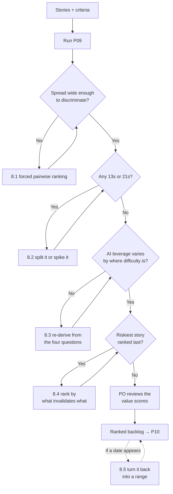

# P09 — Estimate and Rank the Backlog

← [P08 — Write Acceptance Criteria](P08-write-acceptance-criteria.md) · [Library index](../README.md) · Next: [P10 — Ultra Plan Mode](../phase-2-design/P10-ultra-plan-mode.md)

> **One line:** Size eight stories relative to each other, then put them in the order you will actually build them.

| | |
|---|---|
| **Phase** | 1 — Discovery |
| **Who runs it** | Project Manager + Team Lead, together (Atuland Gautam ) |
| **When** | Sprint 1, Friday morning, the last thing before design work starts |
| **Takes in** | `Case-Study/Python-ETL/artifacts/stories/` (all eight, from [P07](P07-slice-the-prd-into-stories.md)), `Case-Study/Python-ETL/artifacts/acceptance-criteria-NWD-103.md` (from [P08](P08-write-acceptance-criteria.md)), `Case-Study/Python-ETL/artifacts/prd-counterparty-ingestion.md` |
| **Produces** | `Case-Study/Python-ETL/artifacts/backlog-ranked.md` |
| **Hands off to** | Architect, running [P10 — Ultra Plan Mode](../phase-2-design/P10-ultra-plan-mode.md) |
| **Time to run** | Two hours with the team. Ten minutes of prompting; the rest is the conversation the prompt is there to start. |

---

## 1. The scene

Friday, 9am. Atulhas a client status call at four and he needs something to say about dates.

He has eight stories with acceptance criteria on the important ones. What he does not have is any sense of size. NWD-103 has nineteen acceptance criteria and NWD-101 has six, which suggests NWD-103 is bigger, but nineteen criteria could mean a hard problem or a thorough QA engineer and Atul cannot tell which from here.

Gautam  has a different problem and he does not know it yet.

Gautam's view is that this project is mostly boilerplate. Read a file, call a service, apply a rule, write a row. He built the review skill in Sprint 0 and watched it collapse three days of work into an afternoon. His honest expectation, walking into the room, is that AI tooling makes all eight stories roughly half what they would have been two years ago.

**He is right about five of them and wrong about three, and the three he is wrong about are the three that matter.**

Atul's instinct is to ask for hours. He has asked for hours on every project he has run and it has never worked, and he does it anyway because the client asks for dates and hours look like dates. Gautam talks him out of it, badly, in a conversation that takes twenty minutes and ends with Atul saying "fine, but I still have a call at four."

This prompt is what they ran next. It produced a number Atul could work with, and one specific piece of advice that he ignored, and the story of what that cost is §11.

---

## 2. What this prompt actually does — in plain language

### The ceremonies, for someone who has never done this

Scrum has four recurring meetings. Estimation is not one of them, which surprises people, because estimation is the thing everyone associates with agile. It happens inside two of the four.

**Sprint planning.** At the start of each sprint, the team decides what it will finish by the end of it. The Product Owner brings the ordered backlog, the team pulls from the top until it is full, and the sprint's contents are fixed. To pull "until it is full" you need to know how big each item is, so estimates are either done here or brought in ready. That is [P16](../phase-3-planning/P16-sprint-plan-and-assignment.md).

**Daily standup.** Fifteen minutes every morning, standing up so it stays fifteen minutes. Each person says what they finished, what they are doing, and what is blocking them. It is not a status report to the manager — it is the team synchronising with itself. That is [P21](../phase-4-build/P21-daily-standup-summary.md).

**Sprint review, or demo.** At the end of the sprint, the team shows the working software to whoever cares. Working software, not slides. This is where the Demo line from each story in [P07](P07-slice-the-prd-into-stories.md) gets used, and it is why horizontal slices are so painful — you cannot demo a database schema.

**Retrospective.** Straight after the review. The team talks about how the sprint went as a process, not as a product. What to keep, what to change. That is [P35](../phase-8-improve/P35-run-the-retrospective.md).

There is a fifth meeting that scrum does not name but everyone runs: **backlog refinement**, sometimes called grooming. Mid-sprint, an hour, the team looks at stories coming up and estimates them so sprint planning is not a three-hour argument. **What you are doing in this prompt is refinement, run early, before the first sprint that builds anything.**

One more term you will hear constantly. **Velocity** is how many points of work a team actually finished in a sprint. Not planned — finished. It is measured, never chosen, and it takes about three sprints before it means anything. Its only legitimate use is forecasting: this team did 21, 18 and 23 points, so roughly 20 a sprint, so 40 points of backlog is about two sprints. Its most common illegitimate use is as a performance target, which corrupts it immediately, because a team told to raise velocity will raise its estimates and nothing else. Kestrel does not report velocity to Northwind for exactly that reason.

### Why hours are a trap

Atul wanted hours. Everyone wants hours. Here is why they do not work, stated as plainly as it can be.

**You are bad at estimating hours and no amount of experience fixes it.** Not you specifically. Everyone. Ask ten engineers how long a task takes and you get a range spanning a factor of four, and the true answer often sits outside all ten. This is one of the most reliably reproduced findings in software engineering and it has not moved in forty years.

**But you are good at comparison.** Ask the same ten engineers whether task A is bigger than task B and they will agree, immediately, and be right. Humans are poor at absolute magnitude and good at relative magnitude. This is true of weight, distance, brightness and software.

So the trick is: stop asking for absolute size, ask for relative size.

**An hour estimate is a promise. A comparison is an opinion.** The moment Gautam says "eighteen hours," Atul writes it down, adds it up, and tells Northwind a date. When the eighteen becomes thirty — not because Gautam was careless, but because the extraction service turned out not to return per-field confidence on nested tables — the conversation is about Gautam's estimate rather than about the discovery. Everybody defends and nobody learns.

**Hours hide who is doing it.** Three days for Ravi is a week and a half for someone who has not seen the codebase. So which is it? The story does not change size depending on who picks it up, but the hours do, so you cannot estimate until you have assigned, and you cannot sensibly assign until you have estimated.

**Hours make you estimate the wrong thing.** Asked for hours, people estimate typing time. The typing is never the problem. The problem is the two days spent finding out that the service behaves differently on scanned documents than on digital ones.

### Story points, and the one thing everybody gets wrong

A **story point** is a unit of relative size. It has no fixed meaning in hours and it is not supposed to.

You pick one story everybody understands and call it your reference. Gautam used NWD-101 — land PDFs in the raw zone — and called it 3. Everything else is then sized against it. Twice as much work as NWD-101? That is 5 or 8. Half? That is 1 or 2.

The scale is usually a rough Fibonacci sequence: **1, 2, 3, 5, 8, 13, 21**. The gaps widen deliberately, because precision at the big end is fake. You can genuinely tell a 2 from a 3. You cannot tell a 13 from a 14, and a scale that lets you write 14 invites an argument that produces nothing.

**What a point measures is not effort. It is effort plus uncertainty plus complexity, mashed together on purpose.** A story that is two days of obvious typing and a story that is two days of typing plus a real chance of a nasty surprise are not the same size, and the point value should say so. This is the bit that feels wrong to engineers at first and is the entire reason the technique works.

Here is what everybody gets wrong: **treating points as hours in disguise.** Somebody works out that the team does about 20 points a sprint over 10 working days, so a point is half a day, so a 5 is two and a half days. Two sprints later everyone is estimating in half-days and calling them points, and every problem with hours is back with an extra layer of translation.

The tell is a sentence like "that can't be a 5, it's only two days' work." Points do not convert. If a 5 comes in at two days and the next 5 comes in at five days, that is fine — over ten stories it averages out, and averaging out is all forecasting needs.

**What a 13 or a 21 actually means.** Not "very big." It means **you do not understand it well enough to estimate it.** The correct response to a 21 is not to plan for 21 points of work. It is to break it up ([P07 §8.2](P07-slice-the-prd-into-stories.md#82-it-gave-me-eight-stories-and-theyre-all-too-big)) or spike it. A **spike** is a small time-boxed investigation whose output is knowledge — "spend one day finding out whether the extraction service returns confidence for line items inside tables" — and it is the correct answer whenever the honest estimate is a shrug.

**Planning poker** is the ritual for producing these numbers. Everyone picks a number privately, everyone reveals at once, and if the numbers differ wildly the outliers explain themselves. The private-then-simultaneous part is the whole mechanism: it stops the most senior voice anchoring the room. **The discussion between a 3 and a 13 is worth more than either number**, because it is always someone knowing something the others did not.

### Ranking: value against effort

Sizing tells you how big. It does not tell you what to do first. That is ranking, and it is a different question with a different owner — Preetinka owns business value, Gautam owns technical sequence, Atul owns risk.

The simple version: score each story on value and on effort, and do the high-value, low-effort ones first. It fits on a napkin and it is right most of the time.

The version with a name is **WSJF — Weighted Shortest Job First**. It comes from a scaling framework called SAFe, and it is a formula:

```text
WSJF = Cost of Delay ÷ Job Size

where Cost of Delay = Business Value + Time Criticality + Risk Reduction
```

In English, and every term defined:

- **Business value** — how much someone outside the team wants this. Score 1 to 10, relative to the other stories, not absolute.
- **Time criticality** — how much the value drops if it arrives late. A story that is worth the same in March as in January scores low. A story tied to a regulatory date scores high. This is the term people leave out and it is the one that changes answers.
- **Risk reduction** — how much doing this early tells you something you need to know. **This is where the confidence gate scores enormously.** NWD-103 is not the most valuable story on its own; it is the story that proves the design works, and if it does not work you want to know in week two.
- **Job size** — the story points you just produced.

Divide the top by the bottom, sort descending, and you get an order that favours small things with big payoffs and pushes big things with vague benefits down.

**Do not treat the number as an answer.** WSJF is an argument-structuring device. Its value is that when two people disagree about order, you can find out which of the four scores they actually disagree about, instead of trading opinions about the whole story. Atul and Gautam disagreed about NWD-105 and it turned out they agreed on business value and size and disagreed entirely about time criticality, because Atul knew Compliance had a review date and Gautam did not.

If WSJF feels like overhead for eight stories, it probably is. Use value-versus-effort, put the results in four quadrants, and move on. The prompt supports both.

### The part that is specific to AI-assisted development

Here is the thing this file exists to say.

**AI tooling changes the estimate for some story shapes and does not change it at all for others, and if you apply a flat discount you will be wrong in a specific and painful direction.**

Gautam's instinct — everything is roughly half — is understandable. He watched a code review that used to take three days finish in an afternoon. That was real. The mistake is generalising it.

Where AI collapses the estimate:

- **Boilerplate with a known shape.** A repository class, a data transfer object, a client wrapper with retry, a set of CRUD endpoints. The model has seen ten thousand of these. NWD-107 — load positions to staging and the warehouse idempotently — is almost entirely this.
- **Translating between formats.** Extracted fields into a canonical schema. NWD-106. The rules are stated, the work is mechanical, the model is fast and accurate.
- **Test scaffolding from written criteria.** Give it AC-01 through AC-19 and you get a test file structure in minutes. Not the tricky assertions. The structure.
- **Framework-shaped UI.** A table, a filter, a detail panel. Dzmitry's NWD-108 has a lot of this.

Where AI changes almost nothing:

- **Anything needing a judgement call about a domain the model does not know.** *What confidence threshold is safe for a monetary field?* There is no correct answer in any training corpus. The answer comes from what a wrong number costs Northwind, which is knowledge held by four people, none of whom work at Kestrel. NWD-103 is full of these.
- **Anything where the hard part is finding out how an external service actually behaves.** Documentation says the extraction service returns per-field confidence. Does it return confidence for a field inside a table that spans a page? You find out by trying it. AI does not accelerate trying it.
- **Anything requiring agreement between people.** NWD-105's redaction scope is a conversation with Compliance. No model shortens it.
- **Anything where being wrong is expensive and the check is subtle.** NWD-103 again. The model will write a confidence gate quickly. Whether that gate is document-scoped or field-scoped is the entire project, and reviewing it properly takes as long as it always did.

The pattern underneath:

| The hard part is... | Does AI shrink it? | Northwind story |
|---|---|---|
| Typing known code | Yes, a lot | NWD-107, NWD-106 |
| Knowing the shape of a standard solution | Yes | NWD-101, NWD-108's grid |
| Deciding a domain-specific number | No | NWD-103's thresholds |
| Discovering how a real service behaves | No | NWD-102, NWD-103 |
| Getting humans to agree | No | NWD-105 |
| Reviewing something subtle and expensive | No, and it may get worse | NWD-103 |

That last row deserves its bold, because it is counterintuitive. **When code is produced faster, there is more of it to review, and review is the part that did not speed up.** A team that halves its build time and keeps its review time has not halved its cycle time; it has moved the bottleneck and made it more painful. Gautam knew this in principle and did not price it in on Friday.

So the prompt asks the model to classify each story by where its difficulty lives, and to state an **AI leverage factor** — high, medium or none — with a reason. That factor is not applied automatically to the estimate. It is a note the humans argue about, because the model's own view of how much it helps is exactly the view you should trust least.

### Why the prompt is shaped the way it is

**It requires a reference story, supplied by you.** Without an anchor, models produce points from an internal sense of typical size, which is meaningless. With one, everything is relative to something your team understands.

**It requires the acceptance criteria, not just the stories.** Criteria are where size lives. NWD-103's nineteen criteria include AC-18, about consistent views during processing, which implies transactional work nothing in the story text mentions.

**It gives a range and a confidence, not a point.** A story estimated "5, could be 8, low confidence because nobody has tested how the service handles scanned tables" is far more useful than "5." The reason for low confidence is the most actionable thing in the output — it is a list of spikes.

**It bans converting points to days.** Stated as a hard rule because the model will helpfully offer it, and once a day-figure is on the page it is what Atul writes down.

**It separates sizing from ranking into two passes.** Done together, the model sizes to justify the ranking. Atul tried it in one pass and got the four stories it ranked highest all coming back as 3s.

**It demands the AI-leverage classification with a reason per story.** And it demands the reason name where the difficulty lives, not just assert a factor.

**It requires an explicit "what would make this estimate wrong" per story.** This is the risk register, generated for free, and Atul cares about it more than the numbers.

### What the AI is actually doing

Two different jobs with two different reliability levels, and you should treat them differently.

Sizing: it is comparing your stories against an enormous number of similar-shaped pieces of work and against each other. It is genuinely decent at relative ordering — which stories are bigger than which — and unreliable at absolute magnitude, which is fine, because relative ordering is what points are.

Ranking: it is applying a formula to numbers it made up. The formula is arithmetic and correct. The inputs — business value, time criticality — are guesses about a business it does not work for. **Take the model's sizes as a first draft and the model's value scores as a provocation.** Preetinka's business-value numbers replace the model's every time.

The thing to watch: the model has an interest in the answer. Ask a coding assistant how much faster it makes coding and you will get an optimistic number. Asking it to state *why* difficulty exists rather than *how much* it helps produces something more honest, which is why the prompt is worded that way.

### The one thing to remember

**Estimate relatively, rank by value against size, and never apply a flat AI discount — find out where each story's difficulty actually lives first, because AI moves typing and does not move judgement.**

---

## 3. The prompt

Run this with the team present. The output is the start of the conversation, not the end of it.

```text
You are helping a **Project Manager and a Team Lead** size and rank a backlog. The team
is using AI coding assistance, which affects some kinds of work far more than others, and
that difference must be reflected.

**STOP GATE.** Check that at least the largest stories have acceptance criteria. If a
story has none, **say so and refuse to estimate it** — put it in a "cannot estimate" list
instead. A story with no stated done-condition cannot be sized; any number you give would
be invented. Do not estimate it anyway with a caveat.

**Read:**
- Every story in [PATH TO STORIES FOLDER]
- The acceptance criteria in [PATH TO CRITERIA FILES]
- The PRD at [PATH TO PRD] — for its goals and constraints
- The project context file at [PATH TO CONTEXT FILE]

---

**PASS 1 — Size, relative to a reference.**

The reference story is **[REFERENCE STORY ID]** and it is **[REFERENCE POINTS] points**.
Every other estimate is relative to that one.

Use the scale **1, 2, 3, 5, 8, 13, 21**. Nothing between the values.

For **each** story, give:

| Field | What to give |
|---|---|
| Points | A single value from the scale |
| Range | The plausible span, e.g. "5, could be 8" |
| Confidence | HIGH / MEDIUM / LOW |
| Where the difficulty is | One of: **typing volume**, **standard-solution knowledge**, **domain judgement**, **external-system discovery**, **human agreement**, **subtle review**. Name the dominant one and any strong second. |
| AI leverage | HIGH / MEDIUM / NONE, **with a reason that refers to where the difficulty is** — not a general claim about AI |
| What would make this wrong | The single most likely thing that turns this estimate into double |

**Rules for pass 1:**

- **Anything you size at 13 or 21 must come with a recommendation**: split it, or spike it.
  A 13 means "not understood well enough to estimate", not "big". Say which it is.
- **Do not** convert points into hours or days anywhere, for any reason, even as a helpful
  aside. If asked to, refuse.
- **Do not** apply a uniform AI discount across stories. A story whose difficulty is
  domain judgement or external-system discovery gets **no** discount, however much code it
  contains.
- **Do** consider that faster code production increases review load. If a story produces a
  lot of code that needs careful review, say so — the review does not shrink.
- **Base** the size on the acceptance criteria, not the story title. Criteria that imply
  work not mentioned in the story text are the main source of underestimation; call them
  out by criterion number.

---

**PASS 2 — Rank.**

Now, separately, rank the stories. Do not revise the sizes to suit the ranking.

Use [RANKING METHOD]. Score each story 1–10 on:
- **Business value** — how much someone outside the team wants it, relative to the others
- **Time criticality** — how much the value decays if it arrives late
- **Risk reduction** — how much building this early tells us something we need to know

Then compute the priority score and sort.

**State explicitly**, in one line each:
- Which story has the highest **risk reduction** score and why. This is usually the one to
  build first regardless of what the arithmetic says.
- Any place where the ranking conflicts with the dependency graph in the stories folder —
  a story cannot be built before something it depends on, however high it ranks.
- Which single story you are **least confident** about ranking, and what information would
  settle it.

---

**Then produce:**

1. **A summary table** — story, points, priority score, proposed order.
2. **A total** in points, and a statement of what the total does and does not tell you.
   It must say that a forecast needs measured velocity, which this team does not have yet.
3. **A spike list** — every investigation needed before a LOW-confidence story can be
   sized properly, each with a suggested time-box and the specific question it answers.
4. **The risk list** — the "what would make this wrong" answers, gathered together and
   sorted by how bad it would be.

**Do not:**

- **Do not** produce a schedule, a date, a Gantt chart or a sprint allocation. That is a
  later step with a different owner.
- **Do not** assign stories to people.
- **Do not** average away disagreement. If a story could plausibly be a 3 or an 8, say
  that and say what distinguishes them.
- **Do not** estimate a story with no acceptance criteria.
- **Do not** tell me how much faster AI makes things in general. Only ever in terms of
  where a specific story's difficulty sits.

**You are done when:** every story has points, a confidence, a named location of
difficulty, and an AI-leverage judgement with a reason tied to that location; every
LOW-confidence story has a spike; and the total is accompanied by a statement of what it
cannot tell you.

**Save** the result to [OUTPUT PATH].
```

---

## 4. Every placeholder, explained

| Placeholder | What to put in it | Northwind example | What happens if you get it wrong |
|---|---|---|---|
| `[PATH TO STORIES FOLDER]` | The folder of story files from [P07](P07-slice-the-prd-into-stories.md). | `Case-Study/Python-ETL/artifacts/stories/` | Give it a summary list instead and it sizes titles. Titles are the least informative part of a story. |
| `[PATH TO CRITERIA FILES]` | The acceptance-criteria files from [P08](P08-write-acceptance-criteria.md). At minimum for the biggest stories. | `Case-Study/Python-ETL/artifacts/acceptance-criteria-NWD-103.md` | Without criteria every estimate is 40% low, consistently, because the work implied by failure-path criteria is invisible in the story text. |
| `[PATH TO PRD]` | The agreed PRD, for goals and constraints. | `Case-Study/Python-ETL/artifacts/prd-counterparty-ingestion.md` | Pass 2 needs the goals to score business value. Without it, value scores are guesses about a business it knows nothing about. |
| `[PATH TO CONTEXT FILE]` | Project context from [P01](../phase-0-foundation/P01-generate-the-project-context-file.md). | `Case-Study/Python-ETL/artifacts/CLAUDE.md` | The AI-leverage judgement depends on knowing the stack and the team. Without it you get generic claims. |
| `[REFERENCE STORY ID]` | One story everybody on the team understands, ideally already built or very well specified. | `NWD-101` | A reference nobody understands makes every other number meaningless. Pick the boring one, not the interesting one. |
| `[REFERENCE POINTS]` | The points you assign the reference. 3 is a good default — it leaves room below. | `3` | Anchor at 1 and everything above is 5, 8, 13 and you lose the bottom of the scale. Anchor at 8 and half your stories are fractions. |
| `[RANKING METHOD]` | `WSJF` or `simple value-versus-effort`. | `WSJF` | WSJF on five stories is ceremony. Value-versus-effort on forty stories does not discriminate enough. Eight is the crossover; either works. |
| `[OUTPUT PATH]` | Where the ranked backlog goes. | `Case-Study/Python-ETL/artifacts/backlog-ranked.md` | An estimate that lives only in a chat window is an estimate nobody can challenge in three weeks when it turns out to be wrong. |

**On the reference story.** Gautam picked NWD-101 because it is the story with least mystery in it. The temptation is to anchor on the interesting story. Do not — the reference has to be a story where nobody argues, and NWD-103 is a story where everybody argues.

---

## 5. The filled-in example

Friday 9:20. Atul driving, Gautam beside him, Ravi and Dzmitry on a call, Pankaj in the room for the last half hour.

```text
You are helping a **Project Manager and a Team Lead** size and rank a backlog. The team
is using AI coding assistance, which affects some kinds of work far more than others, and
that difference must be reflected.

**STOP GATE.** Check that at least the largest stories have acceptance criteria. If a
story has none, **say so and refuse to estimate it** — put it in a "cannot estimate" list
instead. A story with no stated done-condition cannot be sized; any number you give would
be invented. Do not estimate it anyway with a caveat.

**Read:**
- Every story in Case-Study/Python-ETL/artifacts/stories/
- The acceptance criteria in Case-Study/Python-ETL/artifacts/acceptance-criteria-NWD-103.md
- The PRD at Case-Study/Python-ETL/artifacts/prd-counterparty-ingestion.md — for its goals
  and constraints
- The project context file at Case-Study/Python-ETL/artifacts/CLAUDE.md

---

**PASS 1 — Size, relative to a reference.**

The reference story is **NWD-101** and it is **3 points**. Every other estimate is
relative to that one.

Use the scale **1, 2, 3, 5, 8, 13, 21**. Nothing between the values.

For **each** story, give:

| Field | What to give |
|---|---|
| Points | A single value from the scale |
| Range | The plausible span, e.g. "5, could be 8" |
| Confidence | HIGH / MEDIUM / LOW |
| Where the difficulty is | One of: **typing volume**, **standard-solution knowledge**, **domain judgement**, **external-system discovery**, **human agreement**, **subtle review**. Name the dominant one and any strong second. |
| AI leverage | HIGH / MEDIUM / NONE, **with a reason that refers to where the difficulty is** — not a general claim about AI |
| What would make this wrong | The single most likely thing that turns this estimate into double |

**Rules for pass 1:**

- **Anything you size at 13 or 21 must come with a recommendation**: split it, or spike it.
  A 13 means "not understood well enough to estimate", not "big". Say which it is.
- **Do not** convert points into hours or days anywhere, for any reason, even as a helpful
  aside. If asked to, refuse.
- **Do not** apply a uniform AI discount across stories. A story whose difficulty is
  domain judgement or external-system discovery gets **no** discount, however much code it
  contains.
- **Do** consider that faster code production increases review load. If a story produces a
  lot of code that needs careful review, say so — the review does not shrink.
- **Base** the size on the acceptance criteria, not the story title. Criteria that imply
  work not mentioned in the story text are the main source of underestimation; call them
  out by criterion number.

---

**PASS 2 — Rank.**

Now, separately, rank the stories. Do not revise the sizes to suit the ranking.

Use WSJF. Score each story 1–10 on:
- **Business value** — how much someone outside the team wants it, relative to the others
- **Time criticality** — how much the value decays if it arrives late
- **Risk reduction** — how much building this early tells us something we need to know

Then compute the priority score and sort.

**State explicitly**, in one line each:
- Which story has the highest **risk reduction** score and why. This is usually the one to
  build first regardless of what the arithmetic says.
- Any place where the ranking conflicts with the dependency graph in the stories folder —
  a story cannot be built before something it depends on, however high it ranks.
- Which single story you are **least confident** about ranking, and what information would
  settle it.

---

**Then produce:**

1. **A summary table** — story, points, priority score, proposed order.
2. **A total** in points, and a statement of what the total does and does not tell you.
   It must say that a forecast needs measured velocity, which this team does not have yet.
3. **A spike list** — every investigation needed before a LOW-confidence story can be
   sized properly, each with a suggested time-box and the specific question it answers.
4. **The risk list** — the "what would make this wrong" answers, gathered together and
   sorted by how bad it would be.

**Do not:**

- **Do not** produce a schedule, a date, a Gantt chart or a sprint allocation. That is a
  later step with a different owner.
- **Do not** assign stories to people.
- **Do not** average away disagreement. If a story could plausibly be a 3 or an 8, say
  that and say what distinguishes them.
- **Do not** estimate a story with no acceptance criteria.
- **Do not** tell me how much faster AI makes things in general. Only ever in terms of
  where a specific story's difficulty sits.

**You are done when:** every story has points, a confidence, a named location of
difficulty, and an AI-leverage judgement with a reason tied to that location; every
LOW-confidence story has a spike; and the total is accompanied by a statement of what it
cannot tell you.

**Save** the result to Case-Study/Python-ETL/artifacts/backlog-ranked.md.
```

---

## 6. What comes back

Abridged — four of the eight story blocks in full, then the summary, the spikes and the risks.

```markdown
# Ranked Backlog — Counterparty Document Ingestion

**Reference:** NWD-101 = 3 points
**Sized by:** Atul(PM) and Gautam  (Team Lead), Sprint 1 day 5

---

## Pass 1 — Sizing

### NWD-101 — Land counterparty PDFs immutably in the raw zone
- **Points:** 3 (reference)
- **Range:** 3
- **Confidence:** HIGH
- **Where the difficulty is:** typing volume, with a secondary of standard-solution
  knowledge for the content-based duplicate check
- **AI leverage:** HIGH — this story is a storage client, a path convention and a hash.
  All three are extremely well-trodden shapes with no domain judgement in them. The only
  decision requiring thought is hashing content rather than filename, and the story's own
  Notes already state that decision.
- **What would make this wrong:** the intake mechanism turns out to be something awkward.
  The PRD's open question Q4 — how documents physically arrive — is still unanswered. If
  the answer is "a mailbox someone forwards manually", this becomes an 8.

### NWD-103 — Gate every extracted field on its confidence score
- **Points:** 13
- **Range:** 8 to 21
- **Confidence:** LOW
- **Where the difficulty is:** **domain judgement**, primary. Secondary:
  **external-system discovery**. Tertiary: **subtle review**. Typing volume is the
  smallest component of this story by a wide margin.
- **AI leverage:** **NONE, in the parts that matter.** The mechanical part — read scores,
  compare to a table of thresholds, branch — is perhaps 15% of this story and yes, that
  part is fast. The other 85% is: deciding what threshold is safe for a monetary field,
  which is a question about what a wrong number costs Northwind and has no answer in any
  documentation; establishing whether the extraction service returns confidence for every
  field type in every position, which is found out by trying it; and reviewing the result
  carefully enough to be sure the gate rejects at document scope rather than field scope,
  per PRD constraint C5. None of those three shrink.
- **Criteria implying unmentioned work:** AC-18 requires that a concurrent reader sees
  either all of a document's rows or none. Nothing in the story text mentions transactional
  behaviour. This is a meaningful addition. AC-11 requires distinguishing a missing field
  from a low-scoring one, which means the gate cannot simply iterate the fields it
  received — it must compare against a definition of expected fields.
- **What would make this wrong:** the extraction service does not return per-field
  confidence for values inside a table, only at document level. If that is true, the entire
  approach in this story does not work and this is not a 13, it is a redesign.
- **Recommendation:** **SPIKE before committing to this number.** A 13 here means "not
  understood well enough", not "large". One day answering the confidence-inside-tables
  question would move this to HIGH confidence at 8, or reveal that a different design is
  needed. Do not put this in a sprint at 13 and hope.

### NWD-106 — Transform extracted fields into the canonical position schema
- **Points:** 3
- **Range:** 2 to 5
- **Confidence:** HIGH
- **Where the difficulty is:** typing volume
- **AI leverage:** HIGH — mapping one named structure onto another named structure is the
  single most mechanical thing in this backlog. Given the data contract, this is close to
  transcription. Two years ago this was a 5; the mapping code is the entire story and the
  mapping code writes itself.
- **What would make this wrong:** the canonical schema does not exist yet. This estimate
  assumes the data contract is settled before the story starts. If NWD-106 starts before
  the contract is agreed, it becomes an 8 and most of the extra is rework.

### NWD-105 — Redact PII before anything is persisted
- **Points:** 8
- **Range:** 5 to 13
- **Confidence:** LOW
- **Where the difficulty is:** **human agreement**, overwhelmingly. Secondary:
  external-system discovery.
- **AI leverage:** **NONE.** The code is a service call and a fail-closed branch — an hour
  of work. The story is not the code. The story is finding out from Compliance what counts
  as personal data in a broker statement, whether a redacted value must remain recoverable
  for audit, and what "fails closed" means when the redaction call itself errors. PRD open
  question Q3 is unanswered and Compliance has already been described as slow. No amount
  of tooling makes a compliance review faster.
- **What would make this wrong:** Compliance requires recoverable redaction — that
  redacted values be retrievable under controlled access. That is a different and much
  larger story involving key management, and it would be a 21.

*(NWD-102: 8, MEDIUM, external-system discovery, AI leverage MEDIUM. NWD-104: 5, MEDIUM.
NWD-107: 5, HIGH confidence, AI leverage HIGH. NWD-108: 8, MEDIUM, AI leverage MEDIUM —
the grid and detail panel are standard, the analyst workflow is not.)*

---

## Pass 2 — Ranking (WSJF)

| Story | Value | Time crit. | Risk red. | Cost of delay | Size | WSJF |
|---|---|---|---|---|---|---|
| NWD-103 | 10 | 7 | **10** | 27 | 13 | **2.08** |
| NWD-101 | 6 | 5 | 4 | 15 | 3 | **5.00** |
| NWD-102 | 8 | 6 | 7 | 21 | 8 | **2.63** |
| NWD-107 | 7 | 5 | 3 | 15 | 5 | **3.00** |
| NWD-106 | 6 | 4 | 2 | 12 | 3 | **4.00** |
| NWD-108 | 9 | 8 | 5 | 22 | 8 | **2.75** |
| NWD-104 | 5 | 3 | 4 | 12 | 5 | **2.40** |
| NWD-105 | 4 | 9 | 3 | 16 | 8 | **2.00** |

**Highest risk reduction: NWD-103, scoring 10.** It is the only story that can invalidate
the design. If per-field confidence is not available in the shape this project assumes,
every other story is built on sand. Its WSJF score is low because it is large, and that
is exactly the situation where WSJF's arithmetic gives the wrong answer — the formula
rewards small jobs, and the thing you most need to learn is expensive to learn. **Spike it
first regardless of its score.**

**Conflict with the dependency graph:** NWD-101 ranks second on WSJF and is a dependency
of everything, so it goes first on both counts. But NWD-106 ranks fifth and depends on
NWD-103, which ranks last-but-two. The order cannot be the WSJF order. Dependencies win.

**Least confident ranking: NWD-105.** Business value scored 4 because no user asks for
redaction, but time criticality scored 9 because a Compliance review has a lead time
nobody has measured. If Compliance needs six weeks, this becomes the first story in the
backlog by a wide margin and everything else reorders around it. **Someone should ask
Compliance for a date this week.** Until then this ranking is a placeholder.

**Proposed order**, reconciling WSJF with dependencies and risk:

1. **Spike:** confidence-inside-tables question (1 day, before anything)
2. NWD-101 — nothing depends on anything, everything depends on it
3. NWD-102 — unblocks the rest, and de-risks the classifier assumption
4. NWD-103 — highest risk reduction, size permitting after the spike
5. NWD-108 — can start in parallel against fixture data; do not wait for NWD-103
6. NWD-106
7. NWD-107
8. NWD-104
9. NWD-105 — **unless Compliance's lead time forces it earlier, which it may**

---

## Total

**53 points**, plus one spike.

**What this total tells you:** the relative weight of the backlog, and that NWD-103 alone
is a quarter of it.

**What this total does not tell you:** anything about dates. Converting points to time
requires velocity — how many points this team actually completes in a sprint — and this
team has never run a sprint together on this codebase. Any forecast made now is a guess
wearing a number. After two sprints there will be a real figure. **Do not report a date
derived from this total.**

---

## Spike list

| Spike | Question it answers | Time-box | Blocks |
|---|---|---|---|
| S1 | Does the extraction service return a confidence score for every field inside a table, including tables that span pages? | 1 day | NWD-103's entire approach |
| S2 | How many labelled examples does a counterparty classifier need before it is reliable enough for the 0.75 floor? | 1 day | NWD-102's size |
| S3 | What is Compliance's actual review lead time, and does redaction need to be recoverable? | 1 email, then wait | NWD-105's size and position |

---

## Risk list, worst first

1. **Per-field confidence is not available inside tables** (NWD-103). If true, the core
   design does not work and the project needs a different approach. Mitigated by S1.
2. **Compliance requires recoverable redaction** (NWD-105). Turns an 8 into a 21 and adds
   key management to a project that does not currently have any. Mitigated by S3.
3. **The canonical schema is not settled before NWD-106 starts** (NWD-106, NWD-107).
   Entirely within our control. Sequence the data contract first.
4. **Intake mechanism turns out to be manual** (NWD-101). Turns a 3 into an 8 and changes
   the operational story. PRD open question Q4.
5. **Review capacity becomes the bottleneck.** Four of eight stories have HIGH AI leverage
   on code production. That code still needs reviewing at the same rate as always, by the
   same people. If build time halves and review time does not, review is the constraint
   from Sprint 2 onward. This is not a story-level risk and it does not appear in any
   estimate above.
```

### How to read this

**Look at NWD-103's AI-leverage entry and NWD-106's, side by side.** Both stories involve writing Python that moves data around. One gets NONE and one gets HIGH, and the reasons are about where the difficulty lives rather than how much code there is. That contrast is the entire point of this prompt and it is the thing Gautam walked into the room not believing.

**Look at the 13 on NWD-103, and the recommendation attached to it.** The recommendation is not "plan for 13 points." It is "spike it, because 13 means you do not understand it." A team that puts a LOW-confidence 13 into a sprint is committing to a number nobody believes.

**Look at the NWD-103 row in the WSJF table.** It has the highest risk-reduction score of anything in the backlog and the second-lowest WSJF score, because the formula divides by size and it is the biggest story. The model flagged this rather than following its own arithmetic, which is the right behaviour and is worth checking for — **a ranking method that tells you to defer the story that could invalidate your design is telling you something about the method, not about the story.**

**Look at risk 5.** Review capacity. It is not attached to any story, it does not appear in the 53 points, and it is the risk that actually bit. It appeared in the output because the prompt explicitly asks the model to consider that faster code production increases review load. Without that instruction it would not be there.

**Now the part that is commonly wrong.** The value scores in the WSJF table were produced by the model, and they are the weakest numbers in the document. It scored NWD-105 — redact PII — at 4 for business value, because no user asks for redaction and models score value by user desire. Preetinka's number was 9, because an unredacted analytical store is not a feature nobody wants, it is a regulatory incident.

**Take the model's sizes as a draft and its business-value scores as a provocation.** Sizes are relative comparisons between things the model can see. Value is a claim about a business it does not work for. Atul replaced all eight value scores with Preetinka's within the hour, and the ranking changed in two places.

---

## 7. Why this is the final prompt

### What "done" means here

The backlog is ranked when **Atul can say, on the client call, what the team is doing first and why, and can answer "what happens if that takes twice as long" without opening another document.**

That is the real test and it is Atul's own question, the one he asks about everything. If the answer to "what if NWD-103 doubles" is a shrug, the estimate has no range and no risk attached, and it is a number rather than an estimate.

The second test: every LOW-confidence story has a spike against it with a time-box. LOW confidence with no spike means you have written down that you do not know something and then done nothing about it.

### The checklist

- [ ] Every story has points from the scale, a range, and a confidence rating.
- [ ] Every story names **where its difficulty lives**, and the AI-leverage judgement refers to that location rather than making a general claim.
- [ ] No story is sized 13 or 21 without an explicit split-or-spike recommendation.
- [ ] Nothing anywhere converts points into days or hours. Search the document for "day", "hour", "week". Every hit is a time-box on a spike, or a mistake.
- [ ] Every LOW-confidence story has a matching spike with a time-box and a specific question.
- [ ] The proposed order does not violate the dependency graph, and any conflict between ranking and dependencies is stated rather than silently resolved.
- [ ] Business-value scores have been reviewed by the Product Owner, not accepted as generated.
- [ ] The total is stated with an explicit note about what it cannot tell you.

### Why you should stop rather than keep prompting

Estimation has the most seductive over-prompting failure in this library, because the extra rounds feel like rigour.

You ask for more precision. The model obliges. NWD-103 goes from 13 to "13, and here is a breakdown of the eight sub-tasks with points each." Then those get broken down. Three rounds in you have a work breakdown structure with forty items and a total of 12.5 points, and **you have reinvented the hour estimate with extra steps.** The precision is fake. It was fake at 13 too, but at 13 everyone knew.

There is a hard rule worth adopting: **if you find yourself wanting a number between two values on the scale, stop.** The scale is coarse deliberately. Wanting 6 instead of 5-or-8 means you have started believing the numbers.

The second reason to stop: the remaining uncertainty is not resolvable by thinking. S1 asks whether the extraction service returns confidence inside tables. No amount of prompting answers that. Somebody has to upload a PDF and look. Every additional estimation round is time not spent running the spike that would make the estimate real.

### The signal that you are NOT done

If any story is sized but nobody in the room can say what would make that number double, the estimate has no risk attached and §8 is where you fix it.

---

## 8. When it is not done — the follow-up prompts

| What you're seeing | What's actually wrong | Run this next |
|---|---|---|
| Everything came back a 3 or a 5 | The model is regressing to the middle. Usually means the reference story was badly chosen or the criteria were not read. | **8.1** below |
| A story is a 13 or a 21 | Not an estimate, an admission. It needs splitting or spiking. | **8.2** below |
| Every story got the same AI discount | The flat-discount error. This is the failure this whole file exists to prevent. | **8.3** below |
| The ranking says to build the risky story last | WSJF's arithmetic penalises big stories, and the riskiest story is usually big. | **8.4** below |
| Someone converted points to days and now there is a date | The number has been laundered into a commitment. Fix it before it reaches a client. | **8.5** below |
| A story cannot be estimated at all | It has no acceptance criteria, or it is a spike wearing a story's clothes | Back to **[P08](P08-write-acceptance-criteria.md)**, or write it as a spike |
| Estimates look fine and you need a build sequence | Nothing is wrong | **[P10 — Ultra Plan Mode](../phase-2-design/P10-ultra-plan-mode.md)**, then **[P15](../phase-3-planning/P15-implementation-plan.md)** |
| Estimates look fine and you need to fill a sprint | Nothing is wrong | **[P16 — Sprint Plan and Assignment](../phase-3-planning/P16-sprint-plan-and-assignment.md)** |

### 8.1 "Everything is a 3 or a 5"

Use this when the spread is too narrow to be informative. A backlog where every story is the same size has not been estimated.

```text
The estimates you produced cluster tightly and do not discriminate between the stories.
That means the sizing is not doing its job. Redo it by forced comparison instead.

**Rank all the stories** from smallest to largest, by direct pairwise comparison. Do not
assign any points yet. For each adjacent pair in your ordering, **state what makes the
larger one larger** — is it more work, more unknowns, or more risk of being wrong?

**Then** anchor: the smallest story is [SMALLEST STORY ID] at 1 point. Work upward.

For each step up the ordering, **ask explicitly**: is this story roughly the same as the
one below it, noticeably bigger, or more than twice as big? Assign points accordingly on
the 1/2/3/5/8/13/21 scale.

**If two stories genuinely tie**, say so and give them the same value. Ties are fine.
Everything tying is not.

**Finally**, tell me the ratio between your largest and your smallest. If it is under 4,
either the backlog really is very uniform — which is unusual and worth saying out loud —
or the sizing is still not discriminating and I need to know that.
```

What changes: forced pairwise comparison spreads the values out, because comparison is the thing humans and models are both good at. The final ratio check is the diagnostic — a healthy backlog of eight stories usually spans at least 1 to 8.

### 8.2 "This one is a 13 and I need to know what to do about it"

Use this on any 13 or 21 before it goes anywhere near a sprint.

```text
Story [ID] came back as [POINTS] points at [CONFIDENCE] confidence. A number that size
means one of two very different things, and they need opposite responses. Work out which.

**Decide** between these, and commit to one:

- **It is large but understood.** The work is clear, there is just a lot of it. Response:
  split it. Propose the split, using a vertical-slicing pattern, and give the pieces their
  own estimates. Say which piece delivers value on its own.
- **It is not understood well enough to estimate.** Response: spike it. Say precisely what
  question the spike answers, what the answer would have to be for the estimate to change,
  and what you would do differently under each possible answer.

**If it is genuinely both**, spike first and split after. Say so.

For the spike, **write** it out properly:
- The **one question** it answers, phrased so the answer is yes/no or a specific value
- A **time-box**, in days
- What you will do if the answer is the good one
- What you will do if the answer is the bad one — this is the part people skip, and it is
  the part that makes a spike worth running

**Do not** just reduce the number. A 13 you talk yourself down to an 8 is still a 13.
```

What changes: you get either a split or a spike with an explicit plan for both outcomes. That last requirement — what you do if the answer is bad — is what separates a spike from an afternoon of reading documentation.

### 8.3 "It applied the same AI discount to everything"

Use this whenever the AI-leverage column reads the same down the page. Run it even if it looks reasonable.

```text
The AI-leverage judgements in your estimates are too uniform. Re-derive them from where
each story's difficulty actually sits.

For **each** story, answer these four questions **separately**, and give a rough
percentage of the story's total effort to each:

1. **How much of this story is writing code whose shape is already well known?**
   (Repository patterns, mappers, clients, standard UI components, test scaffolding.)
2. **How much of it is deciding something specific to this business that is written down
   nowhere?** (What threshold is safe for a monetary field. What counts as a break. What
   an analyst needs to see to make a decision in under two minutes.)
3. **How much of it is finding out how something outside our control actually behaves,
   as opposed to how its documentation says it behaves?**
4. **How much of it is getting agreement between people?**

**Only question 1 shrinks with AI assistance.** Questions 2, 3 and 4 do not shrink at all.
Question 2 may get slower, because a model will produce a confident answer to a question
it cannot know, and someone has to notice.

**Then** state, per story, the percentage of effort that is category 1, and derive the AI
leverage from that percentage rather than from a general impression.

**Separately**, answer this: across the whole backlog, how much **more code** will exist
at the end of Sprint 2 than would have existed without AI assistance, and who reviews it?
Review effort scales with code volume and does not shrink. If the backlog produces
significantly more code, name that as a capacity risk with a specific person's name
against it.
```

What changes: the leverage column stops being uniform and starts being useful. The final question is the one Gautam did not ask on Friday, and §11 is what it cost.

### 8.4 "The ranking says build the scary one last"

Use this whenever the highest-risk story sorts to the bottom, which happens most times you run WSJF on a real backlog.

```text
The ranking puts [STORY ID] near the bottom, and it is also the story with the highest
risk-reduction score. That combination is a known weakness of size-divided ranking
formulas: the story that could invalidate the design is usually the biggest one, and
dividing by size buries it.

**Re-rank** using only two questions, ignoring size entirely:

1. **If this story turns out to be impossible or much harder than we think, how much of
   the rest of the backlog becomes worthless?** Score 1–10.
2. **How long would it take to find out?** Not to build it — to find out. Hours, a day,
   a week.

**Sort** by question 1 descending. Anything scoring 8 or above on question 1 with a
short answer to question 2 should be investigated in the first week, regardless of where
it sits in the value ranking, because it is not a delivery decision, it is a design
question wearing a story's clothes.

**Then** tell me: what is the cheapest possible experiment that would tell us whether
[STORY ID]'s core assumption holds? Not the story. The experiment. It should be much
smaller than the story and it should be runnable before the next sprint starts.

**Do not** re-order the whole backlog. Just tell me what to find out first.
```

What changes: you separate "what to build first" from "what to find out first," which are different questions that WSJF conflates. On the Northwind run the cheapest experiment was uploading two Broker Alpha statements — one single-page, one where the table spans pages — to the extraction service and reading the raw response. That is an hour of work and it would have answered S1.

### 8.5 "Someone turned the points into a date"

Use this the moment a date appears in a document that started as an estimate. Run it before the client call, not after.

```text
A date has been derived from these story points. Check whether that derivation is
legitimate.

**State plainly:**

1. What **measured velocity** was used? Not assumed, not derived from a points-per-day
   ratio — measured, from sprints this team has actually completed on this codebase.
2. If there is no measured velocity, **say so directly**: any date derived from this
   backlog is a guess presented as a calculation, and the presentation is the problem.
3. What does the date assume about **the LOW-confidence stories**? List them and their
   ranges. If NWD-103 is 8 and not 13, what is the date? If it is 21?
4. What does the date assume about the **spikes**? A spike whose answer is "no, that does
   not work" does not just consume its time-box, it invalidates the plan behind it.

**Then produce** a range, not a date. Give me the optimistic case (every LOW-confidence
story lands at the bottom of its range, every spike answers well), the pessimistic case
(top of every range, one spike answers badly), and say which single unknown moves the
range most.

**Do not** give me a single date with a confidence percentage attached. A percentage on a
date is a number that cannot be checked and it will be repeated without the percentage.
```

What changes: a date becomes a range with a named dominant unknown. That last instruction matters — "we are 80% confident of March 14th" gets quoted as "March 14th" in every subsequent email, and the 80% never travels with it.

### The loop, drawn



8.5 sits outside the main loop on a dotted line, because it is not a step you run — it is a thing you do when a date escapes. It escapes more often than you would think.

---

## 9. How this goes wrong

### The flat AI discount

Gautam's mistake, and it is the one worth the most words.

The reasoning is sound as far as it goes. AI assistance measurably speeds up code production. The team is using it. Therefore stories are smaller than they used to be. Apply a factor, move on.

What it misses is that a story's size is not its code volume. NWD-103 contains less code than NWD-107 and is four times the size, because NWD-103's difficulty is in deciding what threshold is safe for a monetary field — a question whose answer lives in the heads of four people at Northwind and appears in no documentation anywhere. A model will answer that question. It will answer it confidently, with a plausible number and a plausible justification. **The confident wrong answer is not a time saving; it is a new review burden, because now somebody has to notice.**

The fix is the classification in pass 1. Not "how much AI leverage" but "where does the difficulty live", and then leverage derived from that. §8.3 is the recovery.

### Points become days become dates

It starts helpfully. The team does 20 points in a two-week sprint, so a point is half a day, so 53 points is 26 days, so six weeks. Atul says six weeks on a call and now six weeks exists.

Two problems. The first is that the conversion is only valid over many stories and long periods — an individual 5 might be two days or six. The second is worse: once a date exists, the estimates stop being estimates. Nobody revises a 5 upward when revising it moves a date somebody committed to, so the numbers stop tracking reality and the whole apparatus becomes theatre.

The fix is a rule, and it is unpopular: points never leave the room as days. Forecasts come from measured velocity, expressed as a range, and a team with no measured velocity says so.

### Estimating without acceptance criteria

The stop gate exists because this is the most common cause of a large underestimate.

Read NWD-103's story text and you would say 5. Read its nineteen acceptance criteria and you find AC-18, which requires that a concurrent reader sees all of a document's rows or none, and AC-11, which requires distinguishing a missing field from a low-scoring one. Neither is visible in the story text. Both are real work. The story is a 13.

Story text describes the intent. Criteria describe the surface area. **You are building the surface area.**

The fix is sequencing, which is why P08 comes before P09 in this library, and it is a genuinely load-bearing ordering rather than a tidy one.

### Averaging away the disagreement

The team estimates NWD-102. Ravi says 3. Pankaj says 13. Somebody says "let us call it 8" and the meeting moves on.

Eight is almost certainly the wrong number and, more importantly, the wrong number is not the loss. **The loss is that Pankaj knew something.** She had seen a classifier fail on scanned documents before and she was pricing that in. That information was available, for free, in the room, and averaging discarded it.

The fix: when estimates differ by more than one step on the scale, the outliers explain before anyone re-votes. Not "why did you say 13" as a challenge — "what do you know that the rest of us do not."

### This prompt is the wrong tool entirely

**For a team with real velocity and a settled backlog.** After three sprints Atul has measured numbers and the estimating conversation takes ten minutes with no prompt at all. This prompt is for the cold start, when there is no history to reason from.

**For a single urgent piece of work.** Bug NWD-141 — the 429 from the extraction service killing the run at month-end — does not need estimating. It needs fixing. Running a WSJF analysis on a one-item backlog is a way of avoiding starting.

**For deciding whether to do the project at all.** WSJF ranks stories within a backlog. It says nothing about whether the backlog is worth building. That is a business case and it lives above the PRD.

---

## 10. The handoff

The ranked backlog goes to Hem, who starts design work in [P10 — Ultra Plan Mode](../phase-2-design/P10-ultra-plan-mode.md). She reads it differently from everyone else: she goes straight to the spike list and the risk list, and largely ignores the points.

That is correct. **The spike list is a design agenda.** S1 asks whether the extraction service returns confidence for fields inside tables — that is not a project-management question, it is the question that determines whether the confidence gate can exist in the shape everyone has assumed. Hem's job in the design phase is to answer it before anyone builds against the assumption, and the fact that it is written down with a time-box against it is why it gets answered in week two instead of discovered in week nine.

Risk 1 becomes the central question of ADR 0001 ([P12](../phase-2-design/P12-record-an-architecture-decision.md)). Risk 3, the canonical schema not being settled, is why the data contract ([P13](../phase-2-design/P13-design-the-data-contract.md)) is written before NWD-106 starts rather than alongside it.

Atul keeps the points, the ranking and the risk list, and takes them into [P16](../phase-3-planning/P16-sprint-plan-and-assignment.md) when Sprint 2 planning comes around. He does not take a date to the four o'clock call. What he takes is: here is the order, here is what we are finding out first, and here is the one thing that could change the shape of the project. That is a better status update than a date and it is a harder one to give.

Gautam takes the AI-leverage column into [P15](../phase-3-planning/P15-implementation-plan.md), where it decides which stories get a detailed implementation plan and which get a paragraph. The HIGH-leverage stories need less plan; the NONE ones need more, and more review.

> **Artifact contract — `Case-Study/Python-ETL/artifacts/backlog-ranked.md`**
>
> Anyone reading this file can rely on finding:
> - Every story sized on the 1/2/3/5/8/13/21 scale, relative to a named reference story with a stated point value.
> - A plausible range and a confidence rating per story.
> - A named location of difficulty per story, from a fixed vocabulary, and an AI-leverage judgement justified by that location rather than by a general claim.
> - A split-or-spike recommendation against every 13 and 21.
> - A ranking with its method named, and any conflict between ranking and dependency order stated explicitly.
> - A spike list, each with a time-box and one specific question.
> - A risk list sorted by consequence, including risks not attached to any single story.
> - A total, accompanied by a statement of what it cannot tell you.
> - No conversion of points into days, hours or dates, anywhere.
>
> If any of those is missing, the artifact is not done — go back to §7.

---

## 11. In the case study

This runs on the Friday of Sprint 1, in [`02-sprint-1-discovery.md`](../../Case-Study/Python-ETL/02-sprint-1-discovery.md), and it is the session where Gautam is wrong in public.

He opened by saying the backlog was smaller than it looked, and he had reasons. The Sprint 0 review skill was real. He had watched three days become an afternoon. His working assumption was a broad discount, and he was ready to argue for it.

The output argued back. NWD-107 came in at 5 with HIGH leverage, NWD-106 at 3 with HIGH leverage — both of those confirmed his instinct, and both landed roughly as estimated. Then NWD-103 came in at 13 with an AI-leverage line reading NONE, and a paragraph explaining that deciding what confidence threshold is safe for a monetary field is a question about what a wrong number costs Northwind, and there is no answer to that in any documentation anywhere.

Gautam pushed back once. The gate is a comparison against a table of thresholds, he said. That is fifty lines of code. The response was the 15/85 split: yes, fifty lines, and that is fifteen percent of the story. The other eighty-five is choosing the numbers, finding out whether the service gives you a score in every position you need one, and reviewing the result carefully enough to be sure the gate rejects at document scope rather than field scope.

NWD-103 took eleven days. The estimate was right.

**And then there is risk 5, which Atul ignored.**

Risk 5 was not attached to any story. It said: four of eight stories have HIGH AI leverage on code production, that code still needs reviewing at the same rate as always, by the same people, and if build time halves and review time does not, review becomes the constraint from Sprint 2 onward.

Atul read it, agreed with it, and did nothing, because it was not a story, it had no points, and he had a call at four. It is the kind of risk that has no owner by construction — it belongs to the process rather than to any item on the board.

In Sprint 2, Ravi shipped NWD-106 and NWD-107 in four days between them. Both were fine. Both sat waiting for review for three days, because Gautam was the only person who could review the confidence gate work and the confidence gate work was where his attention had to be. The board showed two stories done and two stories in review, and the velocity number for Sprint 2 came out lower than it should have been for reasons that had nothing to do with how fast anyone wrote code.

Atul raised it in the Sprint 2 retrospective ([P35](../phase-8-improve/P35-run-the-retrospective.md)) and the team added a second reviewer. **The lesson he took, and repeats: when a tool makes one part of the work faster, the next part becomes the constraint, and the estimate for the next part did not change.** It was in the output on the Friday of Sprint 1, sorted fifth, with nobody's name against it.

The ranked backlog is at [`artifacts/backlog-ranked.md`](../../Case-Study/Python-ETL/artifacts/backlog-ranked.md). Spike S1 ran in Sprint 1's design half; its answer — yes, per-field confidence is available inside tables — is what let NWD-103 proceed as designed. Nobody thought to ask whether the *rows* of a table were all there. That question, and its consequences, are [P08 §11](P08-write-acceptance-criteria.md#11-in-the-case-study) and the whole of the rework chapter.

---

← [P08 — Write Acceptance Criteria](P08-write-acceptance-criteria.md) · [Library index](../README.md) · Next: [P10 — Ultra Plan Mode](../phase-2-design/P10-ultra-plan-mode.md)
