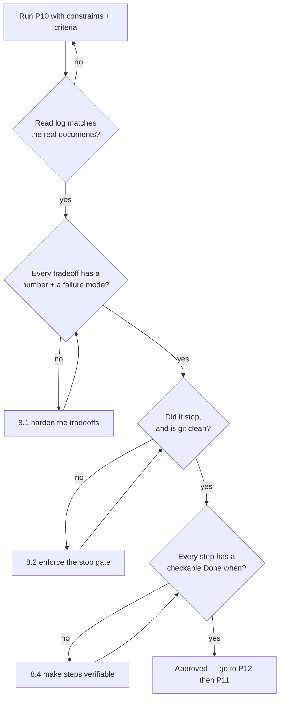

# P10 — Ultra Plan Mode

← [Previous](../phase-1-discovery/P09-estimate-and-rank-the-backlog.md) · [Library index](../README.md) · Next: [P11](P11-write-the-technical-spec.md)

> **One line:** Make the AI read everything, propose real options, pick one, and then stop.

| | |
|---|---|
| **Phase** | 2 — Design |
| **Who runs it** | Architect (Hem Singh) |
| **When** | Sprint 1, day 4. The backlog is estimated and ranked. Nobody has written a line of pipeline code yet. |
| **Takes in** | `artifacts/prd-counterparty-ingestion.md`, `artifacts/stories/NWD-101…NWD-108`, `artifacts/acceptance-criteria-NWD-103.md`, the ranked backlog from [P09](../phase-1-discovery/P09-estimate-and-rank-the-backlog.md), and `artifacts/CLAUDE.md` |
| **Produces** | A written plan in the session, whose decision section becomes `artifacts/adr/0001-extraction-approach.md` via [P12](P12-record-an-architecture-decision.md) |
| **Hands off to** | Hem again, running [P11 — Write the Technical Spec](P11-write-the-technical-spec.md) |
| **Time to run** | Half a day. Twenty minutes of AI time, the rest is Hem reading it properly and arguing with two of the tradeoffs. |

---

## 1. The scene

It is Tuesday of Sprint 1. Preetinka has the backlog ranked — eight stories, NWD-101 through NWD-108, with **NWD-103 "Gate every extracted field on its confidence score"** sitting at the top because everything downstream depends on it. Atul has already asked his favourite question about it twice: "what happens if that takes twice as long."

Hem opens Slack and finds a branch notification. Ravi has pushed `spike/extract-poc`. It is forty lines of Python that sends a page of a Broker Alpha statement to a large language model with the prompt "extract the positions as JSON." It works. On the one PDF he tried, it works beautifully.

This is the exact moment the project can go wrong, quietly, for six weeks.

Because Ravi's forty lines are not wrong. They are *plausible*. The JSON comes back clean, the field names look right, and if you squint at the output you would sign it off. What it does not come back with is any way of knowing which of those numbers the model was sure about and which it guessed. And Northwind's whole reason for buying this system is that **a wrong number is worse than no number** — a confidently-wrong quantity flows into the warehouse, hits reconciliation, and produces a break that looks exactly like a genuine settlement failure. Preeti then spends a morning chasing a ghost.

Hem does not tell Ravi he is wrong. She does not know yet that he is. What she knows is that the team is about to make a decision that is expensive to reverse — the extraction approach touches the rules engine, the exception queue, the audit trail and the monthly bill — and it is currently being made by whoever pushed a branch first.

So she opens a fresh AI session and runs the prompt in this file. Not to get an answer. To get **three answers, honestly compared, and then a hard stop before anybody writes code.**

---

## 2. What this prompt actually does — in plain language

### The problem: AI is fastest at exactly the wrong moment

Give a coding assistant a story and it will start writing code. That is what it is good at, and most of the time that is what you want.

But at the start of a project there is a window — usually a few days long — where the most expensive thing you can do is produce working code. Working code creates gravity. Once `extract.py` exists and passes a test, nobody wants to delete it. The design conversation stops happening because there is already an implementation and implementations argue for themselves.

**The obvious approach — "just ask the AI to build the thing" — fails here not because the code is bad, but because the code is good enough to stop you asking whether it is the right thing.**

### What "plan mode" means

Plan mode is a way of running an AI session where it is allowed to **read** and **think** and **write a proposal**, and is forbidden to change anything. No files created, no files edited, no commands run that alter state.

Some tools have this as a literal switch. Claude Code has a plan mode you toggle. Others do not. It does not matter much, because plan mode is really a *prompt discipline*, not a feature: you tell the AI, in the first three lines, what it may and may not do, and you tell it to stop at a specific point and wait for a human. That instruction is what this whole prompt is built around.

The "ultra" in the name is not marketing. It means: read *more* than you think you need, propose *more* than one option, and stop *earlier* than feels natural.

### What a stop gate is, and why it matters more with AI

A **stop gate** is a point in a process where work halts and does not resume until a named human says so. In a factory it is the line stopping so somebody can inspect a part. Here it is the AI writing a plan and then genuinely stopping — not "and now I'll begin implementing step 1."

You might reasonably ask why this needs saying. Humans plan and then check with each other all the time without ceremony.

The reason is speed and plausibility, and it is worth being precise about it.

When a human takes a wrong design and starts building, they build slowly. Day three, somebody notices. The wrongness surfaces because it costs effort to keep going and effort creates friction and friction creates conversation.

When an AI takes a wrong design and starts building, it produces four files, a config schema, tests that pass, and a README, in about nine minutes. There is no friction. Every artifact looks like the artifacts a correct design would produce. **Plausible-wrong is far more expensive than obviously-wrong, because obviously-wrong gets caught in an hour and plausible-wrong gets caught in a sprint.**

That asymmetry is the entire justification for the stop gate. You are deliberately inserting the friction that the AI removed.

### Why three approaches instead of one

Ask an AI "how should I extract fields from these PDFs?" and it will give you an answer. It will be a reasonable answer. It will also be the *first* reasonable answer, shaped heavily by how you phrased the question.

There is a well-known effect here and it has nothing to do with AI specifically: if you name a technology in your question, you get that technology in the answer. Ask "how should I use an LLM to extract these fields" and you will never hear about Document Intelligence. The model is agreeable by construction.

Forcing two or three options does three useful things:

1. It surfaces the option you had not thought of. Hem genuinely had not costed OCR-plus-regex before this run.
2. It makes the tradeoffs visible, because a tradeoff only exists relative to an alternative. "Document Intelligence is accurate" is not a tradeoff. "Document Intelligence costs $30 per thousand pages and needs fifty labelled documents per layout, where regex costs nothing and needs zero training but breaks the day a broker moves a column" is a tradeoff.
3. It gives you something to write in the ADR later. An architecture decision record with no rejected options is not a decision record, it is an announcement. [P12](P12-record-an-architecture-decision.md) leans on this directly.

### What makes a tradeoff "real" instead of hand-wavy

This is the single most common way this prompt underdelivers, so it is worth a definition you can hold the output against.

A real tradeoff names three things:

| Part | What it means | Hand-wavy version | Real version |
|---|---|---|---|
| **A number** | Cost, latency, volume, accuracy, headcount, or time | "It's cheap" | "~$378/month at 12,600 pages" |
| **A failure mode** | The specific way this option breaks in production | "It can be unreliable" | "Broker Alpha changes their column order in January and every quantity silently lands in the price column" |
| **A thing you give up** | What choosing this option costs you elsewhere | "There are some limitations" | "You lose per-field confidence, so the confidence gate in NWD-103 cannot be built at all" |

If a bullet in the output does not have all three, it is prose, not analysis. §8.1 has a follow-up prompt that does nothing but force those three in.

### The Northwind decision, explained from scratch

The decision Hem is running this prompt for is: **how do we turn a counterparty PDF into typed rows?** Three candidate approaches. Here is each, in ordinary words, because the rest of this book assumes you know them.

#### Option A — Azure AI Document Intelligence, custom models

**What it is in one line.** Azure AI Document Intelligence is a service you send a PDF to and get structured fields back — "this is the account number, this is the quantity, this is the trade date" — instead of just a wall of text.

**Custom model** means: you take about fifty example documents from one counterparty, draw boxes on them saying "this box is the quantity," and the service trains a model on that layout family. Training is free; you pay per page analysed. Afterwards you send it a new statement from that counterparty and it returns the fields.

**The part that matters.** Every field comes back with a **confidence score** — a number between 0 and 1 saying how sure the model is that it read that field correctly. `0.97` means very sure. `0.61` means it is guessing.

**Why it's here.** Northwind's design invariant is that a wrong number is worse than no number. A per-field confidence score is what makes that invariant enforceable. Without it, "gate every extracted field on its confidence score" is not a story, it is a wish.

#### Option B — a large language model

**What it is in one line.** A large language model (LLM) is a general text model you give an instruction and some content, and it writes an answer. You paste the page text, say "return the positions as JSON," and it does.

**Why it's tempting.** Zero training data. No labelling. It handles a brand new broker layout on day one because it is reading the document the way a person would. Ravi's forty-line spike works because this genuinely is the fastest path to a first result.

**The catch.** It returns an answer, not a measurement. Ask it "how confident were you about the quantity on line 6" and you get a number it made up in the same breath as the quantity. That number is not calibrated against anything. It is a second opinion from the same source, which is not an opinion at all.

There is a second catch that matters for a regulated client: reproducibility. The same page can produce a marginally different answer on a different day, which makes an audit trail awkward to defend.

#### Option C — OCR plus regular expressions

**What it is in one line.** OCR — optical character recognition — turns the pixels of a scanned page into characters. You then use **regular expressions** (regex: small pattern-matching rules like "a run of digits, a comma, two more digits") to pull the values out of that text by position or by nearby labels.

**Why it's here.** It costs almost nothing per page, it is completely deterministic, and every rule is readable by a human. For a fixed-layout document from a cooperative counterparty this is a genuinely fine answer and people underrate it.

**The catch.** It has no concept of confidence at all — a regex either matches or it does not, and a *wrong* match looks exactly like a right one. And a layout change is a code change, which collides head-on with Northwind's invariant that adding a counterparty should be a YAML change plus a trained model, never a code change.

#### Why the answer turns out to be A

Because of the confidence score, and only because of it. Everything else about the three options is arguable. Cost is comparable at this volume. Effort is comparable over a quarter. What is not arguable is that **the confidence gate, the exception queue, and the audit trail all consume a per-field confidence number, and exactly one of the three options produces one.**

That single sentence is what the ADR in [P12](P12-record-an-architecture-decision.md) is built on.

### What "break it into verifiable steps" means

The last thing this prompt asks for is a sequence of steps. Not "build the extractor" — a sequence where each step ends with something you can check.

A step is verifiable when you can answer, in one sentence, "how would I know this step is finished and correct?" Compare:

- Not verifiable: *"Set up Document Intelligence."*
- Verifiable: *"Train a custom model on 15 labelled Broker Alpha statements and prove it returns `quantity` and `market_value` with confidence above 0.90 on 5 held-out statements. Done when the 5 held-out results are in a table in the session."*

Fifteen, not fifty, is deliberate — fifty labelled documents is the production number, fifteen is the number that proves the approach. That distinction is exactly the kind of thing a good plan surfaces and a bad plan glosses over.

The steps are also what Gautam turns into a build sequence in [P15](../phase-3-planning/P15-implementation-plan.md). If they are not verifiable here, they arrive at planning as mush.

### What the AI is actually doing when this runs

Mechanically: it reads the files you point it at, holds them in context, and generates a document. There is no magic. The value comes almost entirely from three constraints you impose:

1. **Read first, in a stated order.** Without this it will start answering from the story title alone.
2. **Produce N options before producing a recommendation.** Ordering matters. If you ask for a recommendation first and options second, the options become justifications for a conclusion already written.
3. **Stop.** Explicitly, with a named condition.

That third constraint is the one that gets ignored most often, which is why §8.2 exists.

### The one thing to remember

**The plan is the cheap artifact and the code is the expensive one, so spend your arguing on the plan.** Half a day of Hem disagreeing with a tradeoff table costs the project nothing. Half a sprint of Ravi building against an approach that cannot produce a confidence score costs the project a sprint.

---

## 3. The prompt

Paste this into a fresh session with access to your repo. Fresh matters — a session that has already been writing code will keep wanting to write code.

```text
You are a **software architect**. Your job in this session is to produce a design plan and then STOP.

**STOP GATE — read this first.**
You must not create, edit, or delete any file. You must not run any command that changes state.
You must not write implementation code, not even as an illustration, beyond a maximum of five lines
of pseudocode inside the plan. When you have finished writing the plan, you **stop and wait** for a
human to reply. Do not begin step 1. Do not offer to begin step 1. End your output with the line
"AWAITING REVIEW — no files have been changed."

**Read these first, in this order, and say in one line what each one told you:**
[ARTIFACTS TO READ]

**Project context:**
[PROJECT CONTEXT FILE]

**The decision I need made:**
[THE DECISION TO MAKE]

**The story or problem this decision serves:**
[STORY OR PROBLEM]

**Hard constraints — an approach that violates any of these is disqualified, say so explicitly:**
[CONSTRAINTS]

**How I will judge the options — weight them in this order:**
[DECISION CRITERIA]

**Now produce a plan with exactly these sections:**

1. **What I understand** — restate the problem in your own words in under 150 words. If anything in
   the artifacts contradicts anything else, say so here and do not paper over it.

2. **Approaches** — give me [NUMBER OF APPROACHES] genuinely different approaches. For each one:
   - What it is, in two sentences, assuming I have never heard of it
   - **A number**: cost, latency, volume, training effort, or time — with the arithmetic shown
   - **A failure mode**: the specific way this breaks in production, not "it may be unreliable"
   - **What I give up** by choosing it, named concretely
   - Whether it satisfies each hard constraint above — one line per constraint, yes or no
   Do not include an approach you consider obviously bad just to have three. If only two are
   defensible, give me two and say why the third was not worth writing.

3. **Comparison table** — one row per approach, one column per decision criterion, plus cost.

4. **Recommendation** — pick ONE. State the single deciding factor in one sentence. Then state,
   honestly, **what would have to be true for this to be the wrong choice** — the condition under
   which I should come back and reverse it.

5. **Steps** — break the recommended approach into 5 to 9 steps. Every step must have:
   - a one-line goal
   - "Done when: <a condition someone else could check without asking me>"
   - the artifact or file it touches
   - its dependency on earlier steps
   No step may be larger than one working day.

6. **Open questions** — everything you could not decide from the artifacts, phrased as a question
   with a named person who should answer it. If you had to assume something, list the assumption
   here, not silently inside a step.

7. **What I did not consider** — approaches you ruled out in under a sentence, so I can challenge them.

**Do not:**
- Do not write any file. Do not modify the repo.
- Do not begin implementing, even the first step, even if it seems trivial.
- Do not invent numbers. If you do not know a price or a limit, write "UNKNOWN — verify" and put it
  in Open questions. A made-up cost is worse than a missing one.
- Do not recommend an approach that fails a hard constraint, however good it looks otherwise.
- Do not soften the tradeoffs to be agreeable. If my stated preference is wrong, say it is wrong.
- Do not produce a fourth approach that is approach one with a different name.

**You are done when:** the seven sections above are complete, every approach has a number and a named
failure mode, every step has a checkable "Done when", and you have printed
"AWAITING REVIEW — no files have been changed."

After I approve the plan in this session, I will ask you separately to write it up. The decision
section will be turned into an ADR at [OUTPUT PATH].
```

---

## 4. Every placeholder, explained

| Placeholder | What to put in it | Northwind example | What happens if you get it wrong |
|---|---|---|---|
| `[ARTIFACTS TO READ]` | The exact file paths, in reading order. Put the business document first and the technical one second. | `artifacts/prd-counterparty-ingestion.md`, `artifacts/stories/NWD-103-confidence-gate.md`, `artifacts/acceptance-criteria-NWD-103.md`, `artifacts/CLAUDE.md` | Leave it out and the AI answers from the title of your question. You get a generic architecture essay that mentions "scalability" and never mentions Broker Alpha. |
| `[PROJECT CONTEXT FILE]` | Path to the standing context file — stack, conventions, constraints. Built in [P01](../phase-0-foundation/P01-generate-the-project-context-file.md). | `artifacts/CLAUDE.md` | Without it you get recommendations in the wrong stack. Hem's first run without it proposed a Databricks job, which Northwind does not own. |
| `[THE DECISION TO MAKE]` | One sentence, phrased as a question, naming no technology you have already decided on. | "How do we turn a counterparty PDF into typed rows, given that every field must carry a trustworthy confidence score?" | Name a technology here and you have made the decision. "How should we use GPT to extract fields" returns three flavours of GPT. |
| `[STORY OR PROBLEM]` | The story ID and its one-line goal, so the plan stays scoped to something shippable. | NWD-103 — gate every extracted field on its confidence score, with per-type thresholds. | Omit it and you get an architecture for the whole platform instead of a decision for this sprint. |
| `[CONSTRAINTS]` | The non-negotiables. Copy them from the PRD and the invariants list. Say "disqualifying" out loud. | Per-field confidence required · no API keys, managed identity only · adding a counterparty must be a YAML change, not a code change · full raw response persisted to bronze before parsing · budget under $600/month | The AI will happily recommend something excellent that you cannot ship. A constraint stated after the recommendation is a constraint that gets argued with. |
| `[DECISION CRITERIA]` | Two to four criteria in priority order. Priority order is the important part. | 1. Produces a per-field confidence score. 2. Auditable and reproducible. 3. Adding a counterparty needs no code change. 4. Cost at 12,600 pages/month. | Unordered criteria produce a comparison table with no winner, and you end up choosing by vibe anyway. |
| `[NUMBER OF APPROACHES]` | 2 or 3. Never more. | 3 | Ask for five and you get two real options and three padded ones, which makes the table look thorough and the analysis worse. |
| `[OUTPUT PATH]` | Where the decision will be recorded once approved. | `artifacts/adr/0001-extraction-approach.md` | Skip it and the plan lives in a chat window, and in three weeks nobody can explain why the choice was made. |

---

## 5. The filled-in example

Hem runs this on the Tuesday of Sprint 1, at 09:40, before standup, in a session with read access to the Kestrel repo and nothing else.

```text
You are a **software architect**. Your job in this session is to produce a design plan and then STOP.

**STOP GATE — read this first.**
You must not create, edit, or delete any file. You must not run any command that changes state.
You must not write implementation code, not even as an illustration, beyond a maximum of five lines
of pseudocode inside the plan. When you have finished writing the plan, you **stop and wait** for a
human to reply. Do not begin step 1. Do not offer to begin step 1. End your output with the line
"AWAITING REVIEW — no files have been changed."

**Read these first, in this order, and say in one line what each one told you:**
1. artifacts/prd-counterparty-ingestion.md
2. artifacts/stories/NWD-103-confidence-gate.md
3. artifacts/acceptance-criteria-NWD-103.md
4. artifacts/CLAUDE.md

**Project context:**
artifacts/CLAUDE.md — Python 3.11 on Azure Functions, Azure Blob (ADLS Gen2) landing zone,
Azure SQL silver, Snowflake gold, managed identity everywhere, no secrets in code.

**The decision I need made:**
How do we turn a counterparty PDF into typed rows, given that every extracted field must carry a
confidence score we can trust and defend to an auditor?

**The story or problem this decision serves:**
NWD-103 — "Gate every extracted field on its confidence score." Per-type thresholds: currency 0.90,
number/quantity 0.90, date 0.85, descriptive string 0.75. One failing field sends the whole document
to the exception queue. This is the top-ranked story in the backlog and NWD-104 through NWD-107
depend on it.

**Hard constraints — an approach that violates any of these is disqualified, say so explicitly:**
- Every extracted field must carry a confidence score produced by the extraction step itself, not
  estimated afterwards.
- No API keys anywhere. Managed identity via DefaultAzureCredential only.
- Adding a new counterparty must be a YAML change plus a trained model — never a code change.
- The full raw response must be persisted to bronze before anything is parsed.
- Total Azure AI spend under $600/month at 200 documents/day, 3 pages average, 21 business days.
- Documents in Spanish and Portuguese must be supported for the EM book.

**How I will judge the options — weight them in this order:**
1. Produces a genuine per-field confidence score.
2. Auditable and reproducible — the same input gives the same output, and I can show an auditor why.
3. Onboarding a new counterparty requires no code change.
4. Monthly cost at 12,600 pages.

**Now produce a plan with exactly these sections:**

1. **What I understand** — restate the problem in your own words in under 150 words. If anything in
   the artifacts contradicts anything else, say so here and do not paper over it.

2. **Approaches** — give me 3 genuinely different approaches. For each one:
   - What it is, in two sentences, assuming I have never heard of it
   - **A number**: cost, latency, volume, training effort, or time — with the arithmetic shown
   - **A failure mode**: the specific way this breaks in production, not "it may be unreliable"
   - **What I give up** by choosing it, named concretely
   - Whether it satisfies each hard constraint above — one line per constraint, yes or no
   Do not include an approach you consider obviously bad just to have three. If only two are
   defensible, give me two and say why the third was not worth writing.

3. **Comparison table** — one row per approach, one column per decision criterion, plus cost.

4. **Recommendation** — pick ONE. State the single deciding factor in one sentence. Then state,
   honestly, **what would have to be true for this to be the wrong choice**.

5. **Steps** — break the recommended approach into 5 to 9 steps, each with a one-line goal, a
   "Done when:" condition someone else could check, the artifact it touches, and its dependency.
   No step larger than one working day.

6. **Open questions** — with a named person who should answer each.

7. **What I did not consider.**

**Do not:**
- Do not write any file. Do not modify the repo.
- Do not begin implementing, even the first step.
- Do not invent numbers. Write "UNKNOWN — verify" and list it in Open questions.
- Do not recommend an approach that fails a hard constraint.
- Do not soften the tradeoffs to be agreeable.
- Do not produce a fourth approach that is approach one renamed.

**You are done when:** the seven sections are complete, every approach has a number and a named
failure mode, every step has a checkable "Done when", and you have printed
"AWAITING REVIEW — no files have been changed."

The decision section will be turned into an ADR at artifacts/adr/0001-extraction-approach.md.
```

---

## 6. What comes back

Abridged — the real run was about 400 lines. This is the shape and the substance.

```markdown
## Read log

- prd-counterparty-ingestion.md — the business goal is moving break detection from T+2 to T+1 by
  removing the manual keying step; the straight-through rate (documents needing zero human touch) is
  the headline metric, currently 61% against a target of 85%.
- stories/NWD-103-confidence-gate.md — the gate is per-field with per-type thresholds, and one
  failing field rejects the whole document, not just that field.
- acceptance-criteria-NWD-103.md — thresholds are configurable per counterparty; broker_alpha
  overrides currency to 0.92.
- CLAUDE.md — Python on Azure Functions, managed identity, no secrets, Blob → Azure SQL → Snowflake.

## 1. What I understand

Northwind receives ~200 counterparty PDFs a day in inconsistent layouts, some scanned, some in
Spanish or Portuguese. They must become typed position rows that can be reconciled against the
Aladdin feed. The binding requirement is not accuracy in the abstract — it is *knowing when you were
inaccurate*. Every field must arrive with a confidence number that the pipeline can compare against a
threshold, because a silently wrong quantity produces a reconciliation break indistinguishable from a
real settlement failure.

One tension: the PRD asks for 85% straight-through processing, while NWD-103 rejects the entire
document when any single field fails. Those pull against each other. Raising straight-through rate by
loosening thresholds directly attacks the invariant. I have flagged this in Open questions rather
than resolving it myself.

## 2. Approaches

### A — Azure AI Document Intelligence, custom extraction models (one per layout family)

**What it is.** A managed service you post a PDF to and get named fields back rather than raw text.
You train it by labelling roughly 50 documents per layout family; training itself is free and you pay
per page analysed.

**Number.** 200 docs/day × 3 pages × 21 business days = 12,600 pages/month.
Custom extraction ≈ $30 per 1,000 pages → 12.6 × $30 = **$378/month**.
Add a custom classifier at ≈ $3 per 1,000 pages → **$38/month**. Total ≈ **$416/month**.
Labelling effort: ~50 docs per layout, ~4 hours per layout for a first pass, 15 docs is enough to
prove the approach before committing to 50.

**Failure mode.** A counterparty changes their layout materially — a new column, a merged header —
and the trained model's confidence drops across the affected fields. This is a *loud* failure: the
documents go to the exception queue rather than loading wrong. You notice it as a spike in Preeti's
queue on the day it happens, not as a break report three weeks later.

**What you give up.** Day-one support for a brand new counterparty. You cannot onboard a broker in an
afternoon; you need documents to label first. Onboarding is measured in days, not hours.

**Constraints:** per-field confidence YES · managed identity YES (Cognitive Services User role) ·
YAML + model, no code change YES · raw response to bronze YES (the full analyse response is JSON) ·
budget YES ($416 of $600) · Spanish/Portuguese YES, via Azure AI Translator ahead of extraction.

### B — Large language model extraction

**What it is.** Send the page text (or the page image) to a general-purpose language model with an
instruction describing the fields you want, and parse the JSON it writes back.

**Number.** Roughly 2,500 input tokens per page plus ~600 output. At 12,600 pages that is ~39M
tokens/month. Actual cost is model-dependent — **UNKNOWN — verify against current pricing** — but it
lands in the same order of magnitude as option A, so cost is not the deciding factor either way.

**Failure mode.** The model returns a well-formed, confident, wrong number. There is no signal
distinguishing "I read 14,500 clearly" from "the cell was smudged and 14,500 is my best guess." The
failure is *silent*, and silent failure is precisely the class of bug this system exists to prevent.
Asking the model to self-report a confidence score does not fix this: the score comes from the same
process that produced the error, so it is correlated with the mistake rather than independent of it.

**What you give up.** The confidence gate. Not a weakened version of it — NWD-103 as specified cannot
be built on this approach, because there is no calibrated per-field score to compare to a threshold.
You also give up reproducibility, which matters when an auditor asks why a row has the value it has.

**Constraints:** per-field confidence **NO — disqualifying** · managed identity YES · no code change
per counterparty YES (arguably its best property) · bronze YES · budget PROBABLY · languages YES.

### C — OCR plus regular expressions

**What it is.** Convert the page to text with an OCR engine, then pull values out with hand-written
pattern rules keyed to labels or positions on the page.

**Number.** Effectively free per page. Development cost is the real number: roughly 1–2 days per
counterparty layout for the initial rules, plus ongoing maintenance every time a layout shifts.

**Failure mode.** A pattern matches the wrong thing. If Broker Alpha inserts an "Accrued Interest"
column before "Market Value", a positional rule now reads accrued interest as market value with total
success and no complaint. Silent, and worse than option B's failure because it is systematic — every
row on every document is wrong the same way.

**What you give up.** Confidence entirely (a regex matches or it does not), and the no-code-change
onboarding rule. Every new counterparty is a Python change, a review, and a deploy.

**Constraints:** per-field confidence **NO — disqualifying** · managed identity YES ·
no code change per counterparty **NO — disqualifying** · bronze N/A · budget YES · languages PARTIAL.

## 3. Comparison

| | A — DI custom models | B — LLM | C — OCR + regex |
|---|---|---|---|
| Per-field confidence (criterion 1) | Yes, calibrated, per field | No — self-reported only | No |
| Auditable / reproducible (2) | Yes — same input, same output, raw JSON in bronze | Weak — output can vary run to run | Yes |
| Onboard without code change (3) | Yes — YAML + trained model | Yes | No |
| Cost/month at 12,600 pages (4) | ~$416 | UNKNOWN, same order | ~$0 + dev time |
| Time to first working counterparty | ~3 days incl. labelling | ~1 day | ~2 days |
| How it fails | Loudly, into the exception queue | Silently, into the warehouse | Silently and systematically |

## 4. Recommendation

**Approach A — Azure AI Document Intelligence custom extraction models.**

**Deciding factor:** it is the only option of the three that produces a per-field confidence score
from the extraction step itself, and every downstream component — the confidence gate, the exception
queue, the MIN_CONFIDENCE column carried into Snowflake — consumes that number.

**What would have to be true for this to be wrong:** if Northwind's counterparty list turned over
faster than it could be labelled — say more than three new layouts a month — the labelling cost would
dominate and a hybrid (LLM for unseen layouts, routed straight to review) would beat it. At the
current rate of roughly one new counterparty a quarter, that is not the case. Revisit if the
onboarding rate exceeds two new layouts per month for two consecutive months.

## 5. Steps

| # | Goal | Done when | Touches | Depends on |
|---|---|---|---|---|
| 1 | Prove the approach on one layout | A custom extraction model trained on **15** labelled Broker Alpha statements returns `quantity` and `market_value` on 5 held-out statements, and the confidence figures are in a table in this session | (spike only, no repo change) | — |
| 2 | Fix the confidence contract | A written table of per-type thresholds (currency 0.90, number 0.90, date 0.85, string 0.75) plus the broker_alpha currency override of 0.92, agreed by Preetinka | `artifacts/spec-confidence-gate.md` | 1 |
| 3 | Land the raw response first | An analyse response for one document is written to `bronze/{broker}/{yyyy-mm-dd}/{sha256}.json` before any parsing happens, verified by deleting the parser and re-running | `core/clients.py`, `sinks/blob_sink.py` | 1 |
| 4 | Build the gate as pure functions | `core/confidence.py` exposes a function that takes fields + a threshold config and returns pass/fail plus the failing field list, with unit tests, no Azure calls in the tests | `core/confidence.py`, `tests/test_confidence.py` | 2 |
| 5 | Make thresholds config, not code | `config/sources.yaml` carries per-counterparty thresholds; changing broker_alpha's currency threshold to 0.92 requires no Python edit | `config/sources.yaml` | 4 |
| 6 | Wire rejection to the queue | A document with one failing field produces zero silver rows and exactly one exception row carrying the failing field name and its score | `core/rules.py`, `sinks/sql_sink.py` | 4, 5 |
| 7 | Carry confidence to gold | Accepted rows reach Snowflake with `MIN_CONFIDENCE` and `BRONZE_PATH` populated | `sinks/snowflake_sink.py` | 6 |

## 6. Open questions

- **Preetinka** — the PRD targets 85% straight-through, but whole-document rejection will suppress that
  number early on. Is 85% a launch target or a quarter-three target?
- **Preetinka** — does an analyst correction in the exception queue need to be re-gated, or is a human
  edit trusted by definition?
- **Hem** — the free tier (F0) analyses only the first two pages and caps files at 4 MB. Confirm we
  are on a paid tier before step 1, or step 1 will produce a misleading result on a 3-page statement.
- **Ravi** — does the Broker Beta EM Spanish document need translating before extraction or after?
  It changes step ordering. (Assumption used above: before, for descriptive fields only.)

## 7. What I did not consider

- A human-in-the-loop-only path with no extraction at all. Rejected: it is the current state and the
  project exists to remove it.
- Asking counterparties to send structured files instead of PDFs. Rejected as out of Kestrel's
  control, though it is worth Preetinka raising it — three of eleven counterparties may already offer CSV.
- Building our own layout model. Rejected on effort against a managed service at $416/month.

AWAITING REVIEW — no files have been changed.
```

### How to read this

Three parts carry the weight.

**The read log at the top.** It is four lines and it is the cheapest quality check in the whole prompt. If the AI summarises a document you know says something else, stop immediately — everything downstream is built on a misreading. Hem's second run had a read log claiming the thresholds were global, not per-counterparty. That one line saved an hour.

**The "what would have to be true for this to be wrong" paragraph.** Most recommendations are unfalsifiable: they tell you what to do and give you no way to know later that it stopped being right. This paragraph converts the decision into something with a trigger. "Revisit if onboarding exceeds two new layouts a month for two consecutive months" is a monitorable condition, and it goes straight into the ADR's consequences section in [P12](P12-record-an-architecture-decision.md).

**Step 1's "Done when."** Fifteen labelled documents, five held out, the numbers in a table. Someone who is not Hem can check that. Compare it with what a weak run produces — "Done when the model is trained" — which is unverifiable because "trained" is not an observable state.

**And the part that is commonly wrong:** the cost line for option B. The output says "UNKNOWN — verify" and that is correct behaviour, but it is also the line most people skim past and quietly treat as "about the same." It is not about the same until someone checks. Note that the plan does not pretend — the `Do not invent numbers` instruction is doing real work there, and it is worth keeping even when it makes the output less tidy.

---

## 7. Why this is the final prompt

**What "done" means here.** You have three things: a comparison you would be willing to show Atul, one recommendation with a named deciding factor, and a set of steps somebody other than you could pick up. And no files have changed.

Done is *not* "the AI produced a plan." Done is "Hem has argued with at least one part of the plan and it survived, or it changed."

### The checklist

- [ ] The read log matches what the documents actually say — you spot-checked at least one.
- [ ] Every approach has a **number with arithmetic shown**, a **named failure mode**, and a **named thing you give up**.
- [ ] Every hard constraint is answered yes/no for every approach, and anything failing a constraint is marked disqualifying rather than quietly ranked lower.
- [ ] The recommendation names one deciding factor, not a list of five reasons.
- [ ] There is a stated condition under which the decision should be reversed.
- [ ] Every step has a "Done when" a different person could verify without asking you.
- [ ] The session ended with the stop line and the repo is unchanged (`git status` is clean).

### Why you should stop rather than keep prompting

The failure mode here is *polish*. Ask for another pass and you will get a better-written plan: smoother prose, more sections, an extra approach, a risk register nobody asked for. None of that reduces risk. The risk lives in the two or three tradeoffs you have not yet verified against reality, and no amount of re-prompting verifies them — only checking the actual price page, or training an actual model on fifteen actual documents, does that.

There is a second reason. A plan that keeps growing stops being read. Atul will read two pages. Ravi will read the steps table and nothing else. A twelve-page plan is a plan that gets skimmed, and a skimmed plan is worse than a short one because everybody believes it was agreed.

### The signal that you are NOT done

You cannot say, out loud, in one sentence, why the other two approaches lost. If the answer comes out as "it seemed better overall," the analysis is hand-wavy and §8.1 is your next move.

---

## 8. When it is not done — the follow-up prompts

| What you're seeing | What's actually wrong | Run this next |
|---|---|---|
| The tradeoffs read like brochure copy — "flexible", "may have limitations", "generally reliable" | No numbers and no named failure modes. The AI wrote comparison-shaped prose without comparing anything. | **§8.1** below |
| It wrote the plan and then created `core/extract.py` anyway | The stop gate was stated but not enforced, usually because it was buried below a long constraints block | **§8.2** below |
| Two of the three approaches are obviously silly | Straw men. You get a real option and two decoys, which makes the recommendation look inevitable when it isn't | **§8.3** below |
| The steps say things like "implement the extraction logic" | Steps are goals, not verifiable units. They will fall apart in planning | **§8.4** below |
| It recommended something you explicitly ruled out | A constraint was stated as a preference, or stated after the recommendation section in the prompt | **§8.5** below |
| The plan is right but you need it written down properly as a decision | Nothing is wrong. Move on | **[P12 — Record an Architecture Decision](P12-record-an-architecture-decision.md)** |
| The plan is right and you need behaviour-level detail before building | Nothing is wrong. Move on | **[P11 — Write the Technical Spec](P11-write-the-technical-spec.md)** |
| The decision affects the shape of the data crossing systems | You have a second, separate decision to make | **[P13 — Design the Data Contract](P13-design-the-data-contract.md)** |

### 8.1 "It picked an approach but the tradeoffs are hand-wavy"

Use this when the comparison sounds reasonable and you could not defend a single line of it in a meeting.

```text
Your tradeoffs are not usable yet. Rewrite section 2 only.

For **each** approach, every bullet must contain at least one of:
- a number, with the arithmetic that produced it shown inline
- a specific named failure — an actual sequence of events at Northwind, naming a counterparty,
  a field, and what lands in the database as a result
- a capability that is lost, named as the story or component it breaks

**Delete** any sentence containing: flexible, scalable, may vary, generally, potentially,
could be limited, industry standard, best practice. If removing those words leaves the bullet empty,
the bullet was empty.

For every number you cannot source, write "UNKNOWN — verify at <where I would check>" and move it to
Open questions. Do not estimate.

Then add one row to the comparison table: **"How does this fail?"** — one sentence per approach,
in the form "X happens, then Y lands in the warehouse, and we find out when Z."

Do not touch any other section. Do not write any file.
```

What changes: the table stops being decorative. In Hem's run this is what turned "LLMs may hallucinate values" into "the model returns 14,500 with no signal that the cell was smudged, the row loads, and reconciliation reports MISSING_EXTERNAL two days later" — which is the sentence that actually decided the ADR.

### 8.2 "It started writing code despite the stop gate"

Use this the moment you see a file-write tool call, or a section headed "Implementation".

```text
Stop. You breached the stop gate.

1. List every file you created or modified in this session, with full paths.
2. Revert them — tell me the exact command to undo each one; do not run it yourself.
3. Explain, in one sentence, which instruction you interpreted as permission to begin.

Then re-read the constraint: you produce a plan and you stop. No file writes, no commands that change
state, no implementation code beyond five lines of pseudocode inside the plan itself.

Resume from section 5 (Steps) and complete the plan. End with
"AWAITING REVIEW — no files have been changed."
```

What changes: you get the mess enumerated instead of hidden, and step 3 usually tells you something useful about your own prompt. Nine times out of ten the answer is "the step list read as a task list," which is why the stop gate belongs at the *top* of the prompt and not the bottom.

### 8.3 "It gave me one real option and two straw men"

Use this when approaches B and C exist only to lose.

```text
Approaches [B] and [C] are straw men — they were written to be rejected.

Rewrite section 2. For each of the three approaches, first write a paragraph headed
**"The strongest case for this"** — argue for it as if you had chosen it and had to defend it to
Atul, who will ask what happens when it takes twice as long.

Then, and only then, write the failure mode.

If after arguing the strongest case you still believe an approach is not defensible, **delete it**
and give me two approaches, with one line explaining why the third did not survive its own argument.
Two honest options beat three padded ones.

Do not change the recommendation yet. I want to see whether it survives.
```

What changes: sometimes the recommendation flips. More often it holds, but you now have the counter-argument written down, which is exactly what the ADR's "rejected options" section needs.

### 8.4 "The steps aren't verifiable"

Use this when a step could be marked complete by two different people at two different times.

```text
Rewrite section 5 only.

Every step's "Done when" must be checkable by someone who was not in this conversation, without
asking me a question. Concretely, it must reference at least one of:
- a file that exists at a stated path, with a stated property
- a test that passes, named
- a number in a table, with the number stated
- an observable behaviour: "given input X, the system produces Y"

Banned as "Done when" text: implemented, working, complete, set up, configured, integrated, ready.

If a step cannot be made checkable, it is too big. Split it. No step may take more than one working
day. If splitting produces more than 9 steps, tell me which of them belong in a later story rather
than padding this one.
```

What changes: usually the step count goes up by two and one step turns out to be a separate story, which is the useful part. In Hem's run, "wire the gate into the pipeline" split into steps 6 and 7, and step 7 revealed that `MIN_CONFIDENCE` needed to exist in the Snowflake schema — which is what triggered [P13](P13-design-the-data-contract.md).

### 8.5 "It recommended something I explicitly ruled out"

Use this when the recommendation violates a stated constraint and the plan just did not mention it.

```text
Your recommendation violates a hard constraint I stated: [QUOTE THE CONSTRAINT VERBATIM].

Do not argue for an exception and do not tell me the constraint is a tradeoff. It is a constraint.

1. Add a **Constraint check** subsection under each approach: one line per constraint, PASS or FAIL,
   with the specific reason.
2. Mark every approach that FAILS any constraint as **DISQUALIFIED** in the comparison table, not
   merely ranked lower.
3. Re-issue the recommendation choosing only among approaches that pass every constraint.
4. If no approach passes every constraint, say so plainly and tell me which single constraint, if
   relaxed, would open the most options — and what relaxing it would cost.

Do not write any file.
```

What changes: point 4 is the valuable one. A plan that says "nothing satisfies all six of your constraints, and the cheapest one to relax is 'no code change per counterparty'" is a genuinely useful result, and it is a conversation with Preetinka rather than a technical problem.

### The loop



---

## 9. How this goes wrong

### You run plan mode on a decision that has already been made

Hem nearly did this. If Ravi's spike had been merged before Tuesday, the honest version of this prompt would have been "justify what we already built," and the AI would have obliged with a very convincing three-option comparison in which option A wins.

The tell is in your own prompt: if `[THE DECISION TO MAKE]` names a technology, the decision is made. "How should we structure our Document Intelligence models" is not a decision, it is an implementation question — perfectly good, but it belongs in [P11](P11-write-the-technical-spec.md), not here.

**The fix:** write the decision as a question that a person who has never heard of Azure could ask. If you cannot, you are not deciding anything and you should skip to the spec.

### You give it the answer inside the question

Closely related and much sneakier. Constraints can smuggle answers. "Must produce a per-field confidence score" is a legitimate constraint at Northwind because it comes from a business invariant — a wrong number is worse than no number — but if you had written "must integrate with Document Intelligence," you would have written the conclusion into the premise.

**The fix:** for every constraint, ask "would I still hold this if a completely different technology were on the table?" If the answer is no, it is a preference wearing a constraint's clothes. Move it to `[DECISION CRITERIA]` where it will be weighed rather than enforced.

### Planning as procrastination — the wrong-tool case

This prompt is genuinely the wrong tool for reversible decisions, and running it anyway is a common way to feel productive while shipping nothing.

The test is cost of reversal. Choosing the extraction service is expensive to reverse: it shapes the confidence gate, the exception queue, the bronze layer, and the audit story. Choosing whether `core/confidence.py` returns a tuple or a small dataclass is not — Ravi can change it in ten minutes and nobody outside the file notices.

Gautam's rule on the Northwind project, stated in Sprint 1 and repeated in Sprint 3: **if you can reverse it in under an hour without touching another component, do not plan it, just build it and see.**

**The fix:** before running this, say what it would cost to undo the decision in three months. Under a day? Skip to [P18](../phase-4-build/P18-implement-a-story.md) and build a spike.

### You trust a number the AI produced

The output above contains `$378/month`, `$38/month`, `12,600 pages`. Those are correct because they come from the PRD and from published Azure pricing that Hem checked. The output also contains `UNKNOWN — verify` for LLM token cost, which is correct behaviour.

What happens without the "do not invent numbers" instruction is that every one of those slots gets filled with a confident, wrong figure. Not wildly wrong — plausibly wrong, off by a factor of two, in the direction that supports the recommendation. Hem's very first attempt at this prompt, before the `Do not` block existed, returned an LLM cost of "approximately $95/month" with no arithmetic. It was invented.

**The fix:** keep the instruction, and treat every number in the plan as unverified until you have personally opened the pricing page. Circle them in the document if that helps. Atul does exactly this and it is not paranoia.

### The plan lives and dies in a chat window

The most common failure and the least dramatic. The plan is excellent, everyone agrees, the session is closed, and six weeks later in Sprint 3 somebody asks "why aren't we using an LLM for this, it would handle the new broker instantly," and nobody can reconstruct the argument. The tradeoff table is gone. The reasoning gets re-litigated from memory, badly.

**The fix:** the plan is not the artifact. Section 4 of the plan becomes ADR-0001 via [P12](P12-record-an-architecture-decision.md) *the same day*, while the reasoning is still in your head. Section 5 becomes the spec via [P11](P11-write-the-technical-spec.md). If neither happens within twenty-four hours, the half-day you spent planning is gone.

---

## 10. The handoff

Hem is the next reader of her own output, which is unusual in this library and worth naming. She runs [P11 — Write the Technical Spec](P11-write-the-technical-spec.md) next, using section 5 of this plan as the scope boundary — the spec covers exactly steps 2, 4, 5 and 6, which are the confidence gate, and deliberately does not cover the bronze layer or the Snowflake load, which belong to other stories.

Before that, though, she runs [P12 — Record an Architecture Decision](P12-record-an-architecture-decision.md) on section 4. This ordering is not arbitrary. The decision is what constrains the spec; if the spec is written first it will quietly assume an extraction approach, and then the ADR becomes documentation of a fait accompli rather than a record of a choice.

Ravi gets the steps table. He will read it as a task list and that is fine, because §8.4 made every step checkable. His branch `spike/extract-poc` gets closed, not merged — and Hem makes a point of saying in standup that the spike did its job, because a spike that gets deleted after informing a decision is a success and it should not feel like one being thrown away.

Atul gets the open questions. Two of the four have his name on them indirectly, since both are really "is 85% a launch number or a quarter-three number," which is a date question wearing a technical hat.

> **Artifact contract — the approved plan (session output, feeding `artifacts/adr/0001-*.md`)**
> Anyone reading this plan can rely on finding:
> - A read log naming every source document and one line on what it said
> - Two or three approaches, each with a number, a named failure mode, and a named capability given up
> - An explicit PASS/FAIL against every hard constraint, for every approach
> - Exactly one recommendation, with a single stated deciding factor
> - A stated condition under which the decision should be reversed
> - Five to nine steps, each with a "Done when" checkable by someone who was not in the session
> - An open-questions list where every assumption is visible rather than buried in a step
> - Confirmation that no file was created or modified
>
> If any of those is missing, the artifact is not done — go back to §7.

---

## 11. In the case study

This prompt is the opening scene of [Chapter 3 — Sprint 1: Design](../../Case-Study/Python-ETL/03-sprint-1-design.md). Hem runs it on the Tuesday morning of Sprint 1 and the output is the direct parent of [`artifacts/adr/0001-extraction-approach.md`](../../Case-Study/Python-ETL/artifacts/adr/0001-extraction-approach.md).

The thing worth reading the chapter for is what went wrong on the first attempt. Hem's initial run did not have the `Do not invent numbers` line, and the plan came back with an LLM cost of about $95 a month against Document Intelligence's $378. On those figures the recommendation should have been the LLM, and the plan said so. Hem only caught it because $95 for 39 million tokens felt low, and checking took four minutes.

The interesting part is that the corrected plan reached the *same conclusion the original had been about to reject* — Document Intelligence — but for an entirely different reason. Cost was never the deciding factor. The confidence score was. The first plan had buried that under a cost comparison that turned out to be fictional, which is a very good illustration of why §8.1 exists: a plan can be wrong in its reasoning and right in its conclusion, and that is not the same as being right.

There is also a small scene at the end of the chapter where Ravi asks why his spike is being deleted when it worked. Hem's answer — "it worked at the only thing we asked it to do, which was tell us what we lose" — is the sentence Gautam quotes back at the retrospective in [Chapter 10](../../Case-Study/Python-ETL/10-retrospective.md).

---

← [Previous](../phase-1-discovery/P09-estimate-and-rank-the-backlog.md) · [Library index](../README.md) · Next: [P11](P11-write-the-technical-spec.md)
