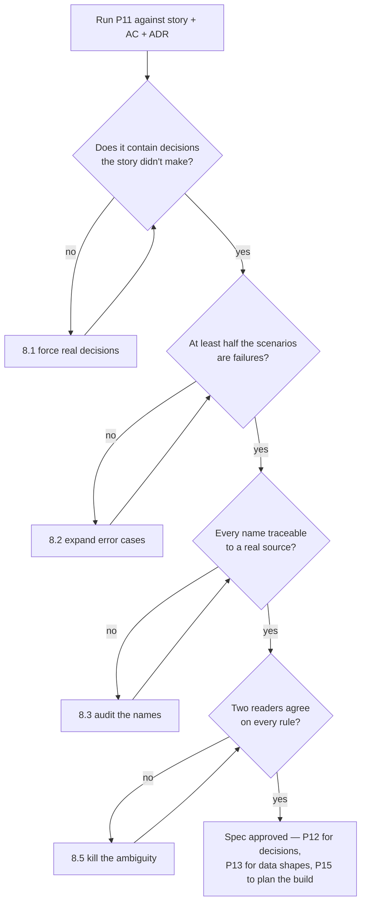

# P11 — Write the Technical Spec

← [Previous](P10-ultra-plan-mode.md) · [Library index](../README.md) · Next: [P12](P12-record-an-architecture-decision.md)

> **One line:** Turn an approved approach into a behaviour contract precise enough to build and test against.

| | |
|---|---|
| **Phase** | 2 — Design |
| **Who runs it** | Architect (Sofia Marchetti) |
| **When** | Sprint 1, day 5. The plan from [P10](P10-ultra-plan-mode.md) is approved and ADR-0001 is written. Tomas is scheduled to start NWD-103 on Monday. |
| **Takes in** | The approved plan from [P10](P10-ultra-plan-mode.md), `artifacts/stories/NWD-103-confidence-gate.md`, `artifacts/acceptance-criteria-NWD-103.md`, `artifacts/adr/0001-extraction-approach.md`, `artifacts/CLAUDE.md` |
| **Produces** | `Case-Study/Python-ETL/artifacts/spec-confidence-gate.md` |
| **Hands off to** | Sofia running [P12](P12-record-an-architecture-decision.md) for anything the spec exposed as a decision, then Rahul running [P15](../phase-3-planning/P15-implementation-plan.md) |
| **Time to run** | Two hours. Twenty minutes of generation, ninety minutes of Sofia and Amara arguing about three of the error cases. |

---

## 1. The scene

Wednesday afternoon. ADR-0001 is written and merged. The team has agreed to build extraction on Azure AI Document Intelligence custom models, and the deciding factor — the only one that mattered — was that it returns a confidence score for every field.

So far so good. Then Amara asks a question in the corridor that stops Sofia dead.

"When a Broker Alpha statement comes in and the trade date scores 0.83, what happens to the fourteen positions on that page?"

Sofia knows the answer. The threshold for a date is 0.85, so 0.83 fails, so the document goes to review. All fourteen positions. Not thirteen good ones plus one flagged one — the whole document.

But when she goes looking for where that is written down, it is not written down anywhere. The story NWD-103 says "gate every extracted field on its confidence score." The acceptance criteria say the thresholds are configurable per counterparty. The ADR says why Document Intelligence won. Nowhere does any document say what the system *does* when a field fails, whether a missing field counts as a failing field, what happens when Document Intelligence returns no confidence value at all, or what the exception row looks like when it lands in Priya's queue.

Every one of those is a decision. Right now every one of them is going to get made by Tomas, at speed, on Monday morning, alone, and the first anyone will hear about it is when Ananya tests it in Sprint 3.

**That gap — between "we know the approach" and "we know the behaviour" — is what a technical spec fills, and it is the single most commonly skipped artifact in software.** Sofia opens a session and runs this prompt.

---

## 2. What this prompt actually does — in plain language

### The problem: everyone thinks it is already written down

Ask a team where the behaviour of a feature is specified and you get four answers: the story, the acceptance criteria, the ticket comments, and "ask Tomas." Three of those are not documents and the fourth is a person.

Meanwhile the code gets written. And the code does specify the behaviour — perfectly, unambiguously, in complete detail. That is the trap. **Code is a perfect specification of what the system does and a terrible specification of what it was supposed to do**, because it cannot tell you which of its behaviours were chosen and which were accidents.

When Ananya finds NWD-142 in Sprint 3 — line items on page 2 of a multi-page statement silently dropped — the argument that follows is entirely about whether that was a bug or an unstated requirement. With a spec, that argument takes four minutes. Without one it takes a day and ends in a compromise.

### PRD versus spec — the confusion that costs the most

Readers mix these up constantly, so here is the distinction in the plainest terms available.

A **PRD** is a Product Requirements Document. It is written by the Product Owner — Amara — and it answers **what** we are building and **why the business wants it**. Its audience is everybody: sponsors, the PM, the team, occasionally the client's finance director. Its currency is outcomes.

A **spec** is a technical specification. It is written by the Architect or the engineer — Sofia — and it answers **exactly how the system behaves**, in cases including the ugly ones. Its audience is the person who will build it and the person who will test it. Its currency is behaviour.

Here is the same feature in both:

| | PRD says | Spec says |
|---|---|---|
| The goal | "Low-confidence extractions must never reach the warehouse; they go to an analyst instead." | "`evaluate_confidence(fields, policy)` returns `REVIEW` when any field's score is strictly below its type threshold." |
| The numbers | "Thresholds should be tunable per counterparty." | "Thresholds resolve in order: field-level override → counterparty override → type default → hard default 0.90. First match wins." |
| The edge | (silent) | "A field present in the layout definition but absent from the response is treated as a failure with score `null` and reason `FIELD_MISSING`." |
| Success | "Straight-through rate rises from 61% to 85%." | "Given 100 documents where 12 contain at least one sub-threshold field, exactly 88 produce silver rows and exactly 12 produce exception rows." |
| Who owns it | Amara | Sofia |

Two rules follow from that table and they are worth memorising:

1. **If it has a business reason in it, it belongs in the PRD.** A spec that explains why Northwind wants T+1 reconciliation has drifted.
2. **If it has a decision in it that a developer would otherwise make alone, it belongs in the spec.** Nullability, rounding, ordering, what happens on the second attempt — all spec.

There is a third document type worth naming so you can rule it out: an **ADR** records *one decision and why*, and it is covered in [P12](P12-record-an-architecture-decision.md). PRD is why-business. ADR is why-technical. Spec is what-exactly. Three documents, three different questions.

### What "spec-driven development" means

Spec-driven development is a working agreement with one rule:

**The spec is the source of truth, not the code. If reality forces you to deviate, you stop, update the spec, get it approved, and then continue.**

That is the whole thing. It sounds bureaucratic and it takes about ten minutes in practice, and it is the difference between a system whose documentation is true and one whose documentation is a historical record of intentions.

The failure it prevents is specific. Tomas is building the gate on Tuesday. He discovers Document Intelligence sometimes returns a field with `confidence: null` rather than omitting it. The spec does not cover that. His options are:

- **Decide silently.** Treat null as 0.0, ship it, tell nobody. Now the spec is a lie and Ananya's test suite is testing something else.
- **Stop and ask.** Message Sofia: "spec doesn't cover null confidence, I propose treating it as a failure with reason `CONFIDENCE_ABSENT`." Sofia says yes in four minutes. The spec gets a line. Ananya's tests get a case.

The second path is spec-driven development. Notice it costs almost nothing — the expensive part is not the update, it is the stopping, and the stopping only feels expensive the first three times.

[P29 — The Spec Was Wrong](../phase-6-rework/P29-the-spec-was-wrong.md) is the prompt for when the deviation is big enough that the spec has to change substantially. Nothing in this discipline says the spec is right. It says the spec is *current*.

### Given / when / then, from scratch

The core of a good spec is a set of scenarios written in a fixed three-part shape:

- **Given** — the starting state. What already exists, what is configured, what has already happened.
- **When** — the single triggering event. One event. If you need "and then", you have two scenarios.
- **Then** — the observable result. What changed that someone could see from outside.

Example, in full:

> **Given** counterparty `broker_alpha` with a currency threshold of 0.92
> **And** an extracted `market_value` field with confidence 0.91
> **When** the confidence gate evaluates the document
> **Then** the document decision is `REVIEW`
> **And** zero rows are written to `silver.counterparty_position`
> **And** one row is written to `silver.exception_queue` with `failing_field = 'market_value'` and `field_confidence = 0.91`

Why this shape and not prose? Three reasons, all practical.

**It is testable without translation.** Ananya can turn that into a test case without asking anyone what it means. That property is why [P08](../phase-1-discovery/P08-write-acceptance-criteria.md) uses the same shape at the story level and why [P20](../phase-4-build/P20-write-tests-alongside-the-code.md) can generate tests directly from a spec.

**It forces the observable result.** "Then the document is rejected" is not a Then, because "rejected" is an internal state nobody can see. "Zero rows in silver, one row in the exception queue" is a Then.

**It exposes missing Givens.** The moment you try to write the scenario for a missing field, you notice you never decided what "missing" means. That is the spec doing its job before the code does it badly.

One warning worth stating early: the value of Given/When/Then is entirely in the discipline, not the keywords. A scenario reading "Given the system is running, When a document arrives, Then it is processed correctly" is prose in a costume.

### API shapes — and why a spec names them

An **API shape** here does not mean a web endpoint. It means the signature of the seam: what goes in, what comes out, and what the types are. For a Python function that is the function signature and the return type. For an HTTP endpoint it is the route, the request body and the response body. For a database write it is the table and the columns.

The spec names these because they are the parts other people build against. Ji-woo cannot build the exception queue screen without knowing what an exception row contains. Ananya cannot write a test without knowing what the function returns. If the shapes only exist in Tomas's head until Thursday, two people are blocked and neither of them knows it.

What the spec does **not** do is write the implementation. The distinction:

- **In scope:** `evaluate_confidence(fields: list[ExtractedField], policy: ConfidencePolicy) -> GateResult`, and what `GateResult` contains.
- **Out of scope:** whether the function iterates with a list comprehension, whether the policy is a dataclass or a dict, whether thresholds are cached.

The test: **if changing it would break someone else's code or someone else's test, it is in the spec. If it would not, it is Tomas's business.**

### Error cases are the whole point

Most specs describe the happy path in loving detail and then stop. That is backwards — the happy path is the part everybody gets right anyway.

Sofia's recurring question is "what does this look like when it's wrong?" and it is the reason her specs are longer than most. For the confidence gate, the wrong cases are:

| Situation | The question the spec must answer |
|---|---|
| A field expected by the layout is absent from the response | Is that a failure, or is it fine because it might be optional? |
| A field is present but has no confidence value | Treat as 0.0? As pass? As a distinct reason code? |
| The document classifier itself scored below 0.75 | Do we even try to extract? |
| The counterparty has no threshold config at all | Fall back to defaults, or refuse to process? |
| A configured threshold is 1.5 | Fail at config load, or clamp, or ignore? |
| The document contains zero line items | Empty statement, or a parse failure disguised as an empty one? |

Notice the last one. That is the shape of NWD-142 — the bug where page-2 line items vanish — appearing eleven weeks early as a question nobody could answer yet. It did not get fully answered in this spec, and [Chapter 8](../../Case-Study/Python-ETL/08-sprint-3-rework.md) is what that cost.

### Why the prompt is shaped the way it is

The order of instructions in §3 is deliberate, and it is not the order you would guess.

1. **Scope first, including what is out of scope.** Specs sprawl. Naming the boundary before writing anything is the only thing that reliably stops it.
2. **Behaviour before structure.** If you ask for the data model first, everything after it is written to fit the model rather than the requirement.
3. **Error cases as a required section with a minimum count.** Without a number, you get two. With "at least six, and for each say what the caller sees", you get the ones that matter.
4. **Open questions as a required section.** A spec with no open questions after a first pass is a spec that guessed. Making the section mandatory converts silent assumptions into visible ones.
5. **An explicit ban on business justification.** Otherwise the AI helpfully re-explains the T+1 goal for two paragraphs, and the spec starts to read like the PRD, and then nobody knows which one is authoritative.

### The one thing to remember

**A spec earns its keep on the day someone disagrees about what the system should do.** Everything else — the tidy sections, the tables, the scenarios — is in service of that one moment. Write it so that the moment resolves in four minutes.

---

## 3. The prompt

Run this in a session that has read access to the story, the acceptance criteria and the approved plan. It works best immediately after [P10](P10-ultra-plan-mode.md), while the plan is still in context.

```text
You are a **software architect** writing a technical specification. The spec, not the code, is the
source of truth for this feature.

**Read these first and summarise each in one line:**
[ARTIFACTS TO READ]

**The feature to specify:**
[FEATURE AND STORY ID]

**Scope — specify exactly this and nothing else:**
[IN SCOPE]

**Explicitly out of scope — mention these only where the boundary needs stating:**
[OUT OF SCOPE]

**Known constraints and decisions already made (do not re-open these):**
[DECISIONS ALREADY MADE]

**Write the specification with exactly these sections, in this order:**

1. **Purpose** — three sentences maximum. What this component does. No business justification, no
   benefits, no history. If you catch yourself explaining why the client wants it, delete the
   sentence — that lives in the PRD.

2. **Scope** — two lists: In scope, Out of scope. The out-of-scope list must name where each excluded
   thing is handled instead.

3. **Definitions** — every term, type and field name used later in this document, defined in one line
   each. Include units and allowed values. If a term appears later that is not in this list, that is
   a defect in the spec.

4. **Behaviour** — the rules, numbered, each stated as a single testable sentence. Where a rule
   depends on configuration, state the resolution order explicitly and say which wins.

5. **Interface** — the exact shape of every seam another component builds against: function
   signatures with types, the structure of every returned object, the shape of any configuration, and
   the columns of any row written. Do **not** specify internal implementation — no algorithms, no
   control flow, no data-structure choices that are not visible from outside.

6. **Scenarios** — at least [SCENARIO COUNT] scenarios in Given / When / Then form. Rules:
   - one triggering event per scenario; if you need "and then", split it
   - every Then must be externally observable — a row written, a value returned, a call not made
   - include at least [ERROR SCENARIO COUNT] scenarios covering failure and edge cases
   - number them S1, S2, S3… so tests and bug reports can cite them

7. **Error cases** — a table: Situation | What the system does | What the caller sees | Reason code.
   Every reason code must be a fixed string another component can match on.

8. **Non-functional requirements** — only the ones with a number: latency, throughput, volume,
   retry counts. Delete this section rather than fill it with adjectives.

9. **Open questions** — every question you could not answer from the inputs, each with the named
   person who must decide it. Every assumption you had to make goes here too, phrased as
   "ASSUMED: <x>. Confirm with <person>." Do not bury an assumption inside a rule.

10. **Change log** — a table with Date | Change | Who | Why. Seed it with the first row for today.

**Do not:**
- Do not restate the story or the acceptance criteria. Reference them by ID and move on.
- Do not include business justification, expected benefits, or rollout plans.
- Do not write implementation code. Type signatures and configuration examples only.
- Do not invent field names. Use exactly the names in the inputs; if a name is needed and does not
  exist, propose it in Open questions rather than using it silently.
- Do not write a scenario whose Then is an internal state ("the document is rejected"). State what
  is observable ("zero rows written to X, one row written to Y with reason Z").
- Do not fill Non-functional requirements with words like fast, scalable or reliable.
- Do not resolve an ambiguity by choosing quietly. Every choice you make that was not in the inputs
  belongs in Open questions.

**You are done when:** every rule in section 4 is covered by at least one scenario in section 6,
every reason code in section 7 appears in at least one scenario, every term used is defined in
section 3, and section 9 is non-empty.

Save the result to [OUTPUT PATH].
```

---

## 4. Every placeholder, explained

| Placeholder | What to put in it | Northwind example | What happens if you get it wrong |
|---|---|---|---|
| `[ARTIFACTS TO READ]` | Story, acceptance criteria, the approved plan, any ADR that constrains this, the project context file | `artifacts/stories/NWD-103-confidence-gate.md`, `artifacts/acceptance-criteria-NWD-103.md`, the approved P10 plan, `artifacts/adr/0001-extraction-approach.md`, `artifacts/CLAUDE.md` | Without the ADR, the spec re-opens a settled decision. Sofia's first draft contained a paragraph weighing an LLM fallback, which had been decided against the day before. |
| `[FEATURE AND STORY ID]` | The component name plus the story ID it implements | "The confidence gate — NWD-103" | A spec without a story ID drifts into specifying the whole pipeline. The ID is the leash. |
| `[IN SCOPE]` | Bullet list of the behaviours this spec must cover. Be specific enough to be checkable | Threshold resolution, per-type defaults, per-counterparty overrides, the accept/review decision, the exception row contents | Vague scope produces a spec that covers everything shallowly. "The confidence gate" alone gets you three pages on Document Intelligence. |
| `[OUT OF SCOPE]` | What a reader might reasonably expect here but will not find, plus where it lives instead | Model training (NWD-102), translation (NWD-104), the exception queue UI (NWD-108, see [P14](P14-ui-ux-design-brief.md)), the Snowflake load (NWD-107) | Omit this and the spec grows to cover the pipeline. Every reviewer will also ask "what about translation?" and you will answer it five times. |
| `[DECISIONS ALREADY MADE]` | Settled decisions, with the ADR number where one exists | ADR-0001: Document Intelligence custom models. ADR-0003: one failing field rejects the whole document. Thresholds: currency 0.90, number 0.90, date 0.85, string 0.75; classifier 0.75; broker_alpha currency 0.92 | Without these the AI helpfully proposes alternatives, and you spend the review re-litigating rather than reading. |
| `[SCENARIO COUNT]` | Total scenarios. Ten to fifteen for a component this size | 12 | Ask for four and you get the happy path plus a token failure. Ask for thirty and you get near-duplicates that pad the test suite. |
| `[ERROR SCENARIO COUNT]` | How many of those must be failure or edge cases. Aim for half | 6 | This is the number that determines whether the spec is worth having. Set it low and you have documented the easy part. |
| `[OUTPUT PATH]` | Exact repo path | `Case-Study/Python-ETL/artifacts/spec-confidence-gate.md` | A spec that lives in a chat window is not a source of truth, it is a memory. |

---

## 5. The filled-in example

Sofia runs this on Wednesday at 15:20, straight after the corridor conversation with Amara, in the same session that produced the approved plan.

```text
You are a **software architect** writing a technical specification. The spec, not the code, is the
source of truth for this feature.

**Read these first and summarise each in one line:**
1. artifacts/stories/NWD-103-confidence-gate.md
2. artifacts/acceptance-criteria-NWD-103.md
3. The approved plan from earlier in this session
4. artifacts/adr/0001-extraction-approach.md
5. artifacts/CLAUDE.md

**The feature to specify:**
The confidence gate — NWD-103. The component that decides whether an extracted document may be
written to silver, or must go to the exception queue for analyst review.

**Scope — specify exactly this and nothing else:**
- Resolving the confidence threshold that applies to a given field
- Per-type defaults and per-counterparty overrides, and the order they resolve in
- The accept / review decision for a whole document
- What the exception record contains when a document is sent to review
- What happens when a field is missing, or present with no confidence value
- The classifier confidence check that runs before extraction

**Explicitly out of scope — mention these only where the boundary needs stating:**
- Training the custom models (NWD-102)
- Translation of Spanish/Portuguese documents (NWD-104)
- PII redaction (NWD-105)
- The exception queue user interface (NWD-108)
- The Azure SQL and Snowflake loads (NWD-107)

**Known constraints and decisions already made (do not re-open these):**
- ADR-0001: extraction is Azure AI Document Intelligence custom models. Per-field confidence exists.
- ADR-0003: one failing field sends the whole document to review. Partial ingestion is not an option.
- Type thresholds: currency 0.90, number/quantity 0.90, date 0.85, descriptive string 0.75.
- Classifier minimum confidence: 0.75.
- broker_alpha overrides currency to 0.92 because of poor scan quality.
- Thresholds live in config/sources.yaml. Adding or changing one must never require a code change.
- Python 3.11, Azure Functions, no secrets in code.

**Write the specification with exactly these sections, in this order:**
[sections 1–10 exactly as in the template above]

**Do not:**
[the Do-not block exactly as in the template above]

**You are done when:** every rule in section 4 is covered by at least one scenario in section 6,
every reason code in section 7 appears in at least one scenario, every term used is defined in
section 3, and section 9 is non-empty.

Save the result to Case-Study/Python-ETL/artifacts/spec-confidence-gate.md.
```

---

## 6. What comes back

The real file is 230 lines. This is most of it — sections 8 and 10 are trimmed.

```markdown
# Spec — Confidence Gate (NWD-103)

Status: Draft · Owner: Sofia Marchetti · Implements: NWD-103 · Constrained by: ADR-0001, ADR-0003

## 1. Purpose

The confidence gate decides whether an extracted document may be written to the silver layer or must
be routed to the exception queue. It compares the confidence score of every extracted field against a
threshold resolved for that field, and produces a single document-level decision. It writes nothing
itself; it returns a decision that the rules engine acts on.

## 2. Scope

**In scope**
- Threshold resolution for a single field
- Per-type defaults and per-counterparty overrides
- The document-level ACCEPT / REVIEW decision
- The contents of the exception record produced on REVIEW
- Handling of missing fields and fields with an absent confidence value
- The classifier confidence check performed before extraction is attempted

**Out of scope**
- Training custom models — NWD-102
- Translation — NWD-104, runs before extraction
- PII redaction — NWD-105, runs after the gate, before persistence
- The analyst review screen — NWD-108, see ui-brief-exception-queue.md
- Writing to Azure SQL or Snowflake — NWD-107

## 3. Definitions

| Term | Definition |
|---|---|
| `ExtractedField` | One field returned by Document Intelligence: `name` (str), `value` (str \| null), `value_type` (FieldType), `confidence` (float 0.0–1.0, or null), `page` (int, 1-based) |
| `FieldType` | One of: `currency`, `number`, `date`, `string`. Determines the default threshold. |
| `threshold` | A float in [0.0, 1.0]. A field **passes** when `confidence >= threshold`. Equality passes. |
| `ConfidencePolicy` | The resolved set of thresholds for one counterparty, loaded from `config/sources.yaml` |
| `GateResult` | The return value: `decision` (ACCEPT \| REVIEW), `min_confidence` (float \| null), `failures` (list of FieldFailure) |
| `FieldFailure` | `field_name` (str), `confidence` (float \| null), `threshold` (float), `reason` (ReasonCode), `page` (int \| null) |
| `ReasonCode` | Fixed string. One of: `BELOW_THRESHOLD`, `FIELD_MISSING`, `CONFIDENCE_ABSENT`, `CLASSIFIER_BELOW_THRESHOLD`, `NO_FIELDS_RETURNED` |
| `min_confidence` | The lowest confidence across all fields that had one. Carried to Snowflake as `MIN_CONFIDENCE`. Null only when no field had a confidence value. |

## 4. Behaviour

**R1** — A field passes when `confidence >= threshold`. Equality passes. Comparison is on the float
value as returned; no rounding is applied before comparison.

**R2** — The threshold for a field resolves in this order, first match wins:
  1. a field-name override for this counterparty (`fields.<name>.min_confidence`)
  2. a type override for this counterparty (`thresholds.<type>`)
  3. the type default (currency 0.90, number 0.90, date 0.85, string 0.75)
  4. the hard default 0.90
Resolution never falls through to a lower value silently; if a counterparty is not present in
`sources.yaml` the document is not processed (see R8).

**R3** — The document decision is ACCEPT only when **every** field passes. One failure produces
REVIEW for the whole document, with no rows written to silver. (ADR-0003.)

**R4** — A field named in the layout definition but absent from the extraction response is a failure
with `confidence = null` and `reason = FIELD_MISSING`.

**R5** — A field present in the response with `confidence = null` is a failure with
`reason = CONFIDENCE_ABSENT`. It is **not** treated as 0.0 and it is **not** treated as passing.

**R6** — `min_confidence` is the minimum confidence across all fields that carry one. Fields with a
null confidence are excluded from the minimum but still cause failure under R4 or R5. When no field
carries a confidence value, `min_confidence` is null and the decision is REVIEW with
`reason = NO_FIELDS_RETURNED`.

**R7** — The classifier is checked before extraction. When the classifier's confidence is below 0.75,
extraction is not attempted at all, and the result is REVIEW with a single failure carrying
`reason = CLASSIFIER_BELOW_THRESHOLD`. No extraction cost is incurred for that document.

**R8** — A counterparty with no entry in `config/sources.yaml` is a configuration error, not a
document error. The gate raises `UnknownCounterpartyError`; the document remains unprocessed in the
raw zone and is retried after config is fixed. It does **not** land in the exception queue, because
the exception queue is for documents an analyst can fix and this is not one.

**R9** — All failing fields are reported, not just the first. Priya needs to see every problem in one
pass; returning only the first failure means a document bounces through review repeatedly.

**R10** — The gate performs no I/O. It receives fields and a policy and returns a result. Persisting
the decision is the rules engine's job.

## 5. Interface

```python
def evaluate_confidence(
    fields: list[ExtractedField],
    policy: ConfidencePolicy,
) -> GateResult: ...

def load_policy(counterparty_id: str, config: dict) -> ConfidencePolicy: ...
    # raises UnknownCounterpartyError when counterparty_id is absent from config
```

`GateResult`:

| Field | Type | Null? | Meaning |
|---|---|---|---|
| `decision` | `"ACCEPT" \| "REVIEW"` | no | The document-level outcome |
| `min_confidence` | float | yes | Lowest confidence across fields that had one; null when none did |
| `failures` | list[FieldFailure] | no | Empty on ACCEPT; one entry per failing field on REVIEW |

Configuration shape in `config/sources.yaml`:

```yaml
counterparties:
  broker_alpha:
    display_name: "Broker Alpha, Daily Position Statement"
    model_id: broker-alpha-position-v3
    language: en
    thresholds:
      currency: 0.92        # overrides the 0.90 default — poor scan quality
    fields:
      settlement_date:
        min_confidence: 0.90  # field-level override, wins over the type default
  broker_beta_em:
    display_name: "Broker Beta, EM Trade Confirmations"
    model_id: broker-beta-confirm-v1
    language: es
    translate: true
```

Exception record written by the rules engine on REVIEW (columns, not DDL):

| Column | Type | Meaning |
|---|---|---|
| `EXCEPTION_ID` | uuid | Surrogate key |
| `CONTENT_HASH` | char(64) | SHA-256 of the source document; the idempotency key |
| `BRONZE_PATH` | varchar(512) | Where the raw response is stored |
| `COUNTERPARTY_ID` | varchar(32) | e.g. `broker_alpha` |
| `FAILING_FIELD` | varchar(64) | One row per failing field |
| `FIELD_CONFIDENCE` | decimal(5,4) | Null where the reason is FIELD_MISSING |
| `THRESHOLD_APPLIED` | decimal(5,4) | The resolved threshold, so the analyst sees the bar |
| `REASON_CODE` | varchar(32) | From ReasonCode |
| `SOURCE_PAGE` | int | 1-based; null where unknown |
| `CREATED_AT_UTC` | timestamp | UTC, no local time anywhere |

## 6. Scenarios

**S1 — Clean document accepts**
Given counterparty `broker_alpha` with default thresholds
And every extracted field has confidence 0.95 or above
When the gate evaluates the document
Then decision is ACCEPT
And `failures` is empty
And `min_confidence` is 0.95

**S2 — One currency field below the counterparty override**
Given counterparty `broker_alpha` with `thresholds.currency = 0.92`
And `market_value` has confidence 0.91 and every other field is above 0.95
When the gate evaluates the document
Then decision is REVIEW
And `failures` contains exactly one entry with `field_name = "market_value"`,
    `threshold = 0.92`, `reason = BELOW_THRESHOLD`

**S3 — The same value passes for a different counterparty**
Given counterparty `broker_beta_em` with no currency override (default 0.90)
And `market_value` has confidence 0.91
When the gate evaluates the document
Then decision is ACCEPT
[This scenario exists to prove R2 resolves per counterparty, not globally.]

**S4 — Exact equality passes**
Given a `date` field with confidence 0.85 and a resolved threshold of 0.85
When the gate evaluates the document
Then that field does not appear in `failures`

**S5 — Field-level override beats the type default**
Given `broker_alpha` with `fields.settlement_date.min_confidence = 0.90`
And `settlement_date` has confidence 0.87
When the gate evaluates the document
Then decision is REVIEW with `threshold = 0.90` for that field
[Under the type default for dates, 0.85, this would have passed.]

**S6 — Missing field**
Given the layout defines `quantity` and the extraction response does not contain it
When the gate evaluates the document
Then decision is REVIEW
And `failures` contains `field_name = "quantity"`, `confidence = null`,
    `reason = FIELD_MISSING`

**S7 — Confidence absent on a present field**
Given `quantity` is returned with a value and `confidence = null`
When the gate evaluates the document
Then decision is REVIEW with `reason = CONFIDENCE_ABSENT`
And the field is excluded from the `min_confidence` calculation

**S8 — All failures reported, not just the first**
Given three fields fail: `quantity` (0.71), `market_value` (0.88), `trade_date` (0.60)
When the gate evaluates the document
Then `failures` has length 3
And `min_confidence` is 0.60

**S9 — Classifier below threshold short-circuits**
Given the classifier returns confidence 0.62 for an incoming document
When the pipeline processes it
Then extraction is not called at all
And decision is REVIEW with a single failure carrying
    `reason = CLASSIFIER_BELOW_THRESHOLD`

**S10 — Empty extraction**
Given the extraction response contains zero fields
When the gate evaluates the document
Then decision is REVIEW with `reason = NO_FIELDS_RETURNED`
And `min_confidence` is null

**S11 — Unknown counterparty raises rather than reviews**
Given a document classified as `broker_gamma`, which has no entry in `config/sources.yaml`
When `load_policy` is called
Then `UnknownCounterpartyError` is raised
And no exception-queue row is created

**S12 — Adding a counterparty needs no code change**
Given a new counterparty block is added to `config/sources.yaml` with a model id and thresholds
When the pipeline next runs
Then documents for that counterparty are gated using the new thresholds
And no Python file has changed
[This is the executable form of the invariant in ADR-0001.]

## 7. Error cases

| Situation | What the system does | What the caller sees | Reason code |
|---|---|---|---|
| Field below its threshold | Rejects the document | `GateResult(REVIEW, failures=[…])` | `BELOW_THRESHOLD` |
| Expected field absent from response | Rejects the document | failure with `confidence = null` | `FIELD_MISSING` |
| Field present, confidence null | Rejects the document | failure, excluded from min | `CONFIDENCE_ABSENT` |
| Classifier below 0.75 | Skips extraction entirely | single failure, no extraction cost | `CLASSIFIER_BELOW_THRESHOLD` |
| Zero fields returned | Rejects the document | `min_confidence = null` | `NO_FIELDS_RETURNED` |
| Counterparty missing from config | Raises; document stays in raw | `UnknownCounterpartyError` | — (not a document error) |
| Threshold outside [0.0, 1.0] in config | Fails at config load, before any document is processed | `InvalidPolicyError` naming the counterparty and key | — (not a document error) |

## 9. Open questions

- **Amara** — when Priya corrects a field in the exception queue, is the corrected value re-gated, or
  is a human edit trusted by definition? ASSUMED: trusted, and the row is written with
  `MIN_CONFIDENCE` set to the original machine minimum plus a `MANUALLY_CORRECTED` flag. Confirm.
- **Amara** — does a document rejected purely on `CLASSIFIER_BELOW_THRESHOLD` go to the same queue as
  a field failure? Priya's action is different — she is picking a counterparty, not fixing a number.
- **Tomas** — does the Document Intelligence response ever return a confidence of exactly 0.0, or is
  absence the only signal? Changes whether R5 is a real case or a defensive one.
- **Sofia** — line items are a repeating structure with per-item confidence. This spec treats fields
  as flat. Does a low-confidence line item reject the document under the same rule?
  ASSUMED: yes, same rule. **This needs its own spec section before NWD-106.**
- **Ananya** — do we need a scenario for a document whose table spans a page boundary? The extraction
  response shape for that case is not documented anywhere I can find.
```

### How to read this

**Section 4, rule R2, is the load-bearing part of the whole document.** Threshold resolution order is exactly the kind of thing that gets decided by accident in code — whichever `if` happens to be checked first — and then differs between the gate and the exception queue and the report, and nobody notices for a quarter. Four numbered lines, first match wins, done.

**S3 exists only to prove S2 was not a global rule.** Scenarios that assert a *non*-effect are the ones people skip and they are worth more than the happy path. If S3 were missing, an implementation with a single global currency threshold would pass every other scenario in the list.

**Section 9 is the most valuable section and the one that looks least finished.** Five open questions on a first draft is healthy. Sofia took them to Amara that afternoon; two were resolved in ten minutes, one produced a new story, and one — the last one, Ananya's — was left open.

**The part that is commonly wrong, and was here:** the fourth open question, about line items. The spec treats fields as a flat list. Real Document Intelligence responses have a repeating table structure with its own per-row confidence, and this spec never resolves how that interacts with R3. Sofia wrote "ASSUMED: yes, same rule" and moved on. That assumption is a first cousin of bug **NWD-142** eleven weeks later — line items on page 2 of a Broker Alpha statement dropped silently, every field that *was* extracted scoring high, gate passing cleanly. The spec did not cause the bug. But it is where the bug was visible earliest and cheapest, and nobody chased it. [P29 — The Spec Was Wrong](../phase-6-rework/P29-the-spec-was-wrong.md) is where that gets fixed, and the fix is a change to this file first and to `core/extract.py` second.

---

## 7. Why this is the final prompt

**What "done" means here.** Tomas can build from it without asking a question that changes behaviour, and Ananya can write tests from it without asking what a scenario means. Those two conditions, and nothing about prose quality.

The practical version: hand it to someone who was not in the design conversation and ask them what happens when a date scores 0.83 on a Broker Alpha statement. If they can answer in under a minute by reading, the spec is done.

### The checklist

- [ ] Every rule in section 4 is exercised by at least one numbered scenario.
- [ ] Every reason code in section 7 appears in at least one scenario.
- [ ] Every term used anywhere in the document is defined in section 3, with its type and units.
- [ ] At least half the scenarios are failures or edge cases, not happy paths.
- [ ] Every `Then` is externally observable — a returned value, a row written, a call not made.
- [ ] Section 9 is non-empty, and every assumption in it names the person who must confirm it.
- [ ] Nothing in the document explains why the business wants this. That is the PRD's job.

### Why you should stop rather than keep prompting

Two specific failure modes, both of which look like progress.

**Scope creep.** Ask for one more pass and the spec grows a section on retry policy, then one on observability, then one on the Snowflake merge. Each addition is individually reasonable. Collectively they turn a spec for one story into a spec for the pipeline, and the moment that happens the document stops being reviewable and starts being skimmed. The out-of-scope list exists to be enforced, not admired.

**Prose polish.** The AI is very good at making a spec read better. Better-reading specs are not more correct, and re-generation carries a real risk: a regenerated spec quietly loses one of the edge cases you fought to include. Sofia lost the `CONFIDENCE_ABSENT` rule on a "tighten the wording" pass and only caught it because Ananya's test referenced R5 by number.

Once the checklist passes, the remaining risk is not in the writing. It is in the open questions, and those are resolved by talking to Amara, not by prompting.

### The signal that you are NOT done

Two people read the spec and give different answers to "what happens when a field is missing?" That is not a wording problem; it is an unspecified behaviour, and §8 is your next stop.

---

## 8. When it is not done — the follow-up prompts

| What you're seeing | What's actually wrong | Run this next |
|---|---|---|
| The spec reads like the story with more paragraphs | It restated requirements instead of specifying behaviour. No decisions were made | **§8.1** below |
| Ten scenarios, nine of them happy paths | Error cases were treated as an afterthought section rather than the point | **§8.2** below |
| It used a field name you have never seen | It invented a name to fill a gap, instead of asking | **§8.3** below |
| It describes how the code should work — loops, caches, class hierarchies | It slid from contract into implementation. This will be wrong within a week and nobody will update it | **§8.4** below |
| Two reviewers answer the same question differently | An ambiguity survived. Usually resolution order or nullability | **§8.5** below |
| Open questions is empty | It guessed and hid the guesses | **§8.5** below, then talk to a human |
| The spec exposed a decision that needs recording | Nothing is wrong — you found an ADR | **[P12](P12-record-an-architecture-decision.md)** |
| The spec exposed a data shape crossing systems | Nothing is wrong — you found a data contract | **[P13](P13-design-the-data-contract.md)** |
| The spec is right but reality has since diverged | You are past design and into rework | **[P29](../phase-6-rework/P29-the-spec-was-wrong.md)** |

### 8.1 "It just restated the story in more words"

Use this when you finish reading and know nothing you did not know before.

```text
This is a restatement, not a specification. Rewrite it.

A specification must contain **decisions the story did not make**. For each of these, state the
decision explicitly, even if the answer feels obvious:

- What happens when a required input is absent entirely
- What happens when it is present but empty, or null, or zero
- Which of two conflicting configuration values wins, and in what order they are checked
- Whether a boundary value passes or fails (>= or >)
- What the caller receives on each distinct failure, as a fixed string it can match on
- Whether the operation is safe to run twice on the same input

For every one of those where the story gives you no answer, make the smallest reasonable decision,
mark it **ASSUMED** in Open questions with a named person to confirm, and carry on.

Then delete every sentence that could have been copied from the story without changing its meaning.
```

What changes: the spec roughly doubles and starts to be useful. Every added line is a decision that was going to be made silently.

### 8.2 "It only specified the happy path"

Use this when section 7 has three rows and two of them are "invalid input".

```text
Expand the error and edge cases. I want at least [N] more scenarios, all failures or boundaries.

Cover, at minimum:
- each input being absent, null, empty, and at the exact boundary value
- each external dependency being slow, returning an error, and returning a well-formed but
  unexpected shape
- the operation running twice on identical input (what is written the second time?)
- the configuration itself being wrong: missing key, out-of-range value, unknown identifier
- the volume edge: zero items, and one item, and the largest realistic case

For each new scenario, add a matching row to the Error cases table with a fixed reason code.

Then answer this in one paragraph at the end: **which failure would be hardest to notice in
production, and what would make it visible?** Be specific about what a person would see and when.
```

What changes: that final paragraph is the reason to run this follow-up. On the confidence gate it produced "a document that extracts fewer line items than it contains would pass every check here" — which is NWD-142, described before it existed. Nobody acted on it. Do better than Northwind did.

### 8.3 "It invented field names"

Use this when you see `document_score`, `is_valid`, or anything else you do not recognise.

```text
You used field names that do not appear in any input I gave you. List every name in this spec and
mark each one:

- **SOURCE** — appears verbatim in the story, acceptance criteria, ADR, or existing code (say where)
- **INVENTED** — you created it

For every INVENTED name: either replace it with the real name from the inputs, or move it to Open
questions as a proposal — "propose `<name>` for `<purpose>`, confirm with Tomas" — and remove it from
the body of the spec.

Names are a contract. Ji-woo builds a screen against these names and Ananya writes assertions against
them. A name invented here becomes a rename ticket in Sprint 2.
```

What changes: usually two or three names get corrected, and one turns out to be a genuinely missing concept that needs naming properly rather than in passing.

### 8.4 "It's a design document, not a contract"

Use this when the spec tells you how to implement rather than how it must behave.

```text
Cut everything that describes implementation rather than observable behaviour.

**Keep:** function signatures, parameter and return types, configuration shape, column names and
types, reason-code strings, ordering guarantees, and anything visible from outside the module.

**Delete:** algorithms, control flow, caching strategy, class structure, choice of data structures,
performance micro-decisions, and any sentence beginning "the implementation should".

Apply this test to each remaining sentence: *if Tomas did the opposite of this, would any other
person's code or test break?* If no, delete it — it is his decision, not the spec's.

Then re-read section 5. If a return type is described only in prose, give me the concrete shape as a
typed structure.
```

What changes: the spec gets shorter and lasts longer. Implementation detail in a spec is the reason specs go stale — the code changes, the spec does not, and within a month people stop trusting it.

### 8.5 "Two people read it differently"

Use this when a review produces a disagreement about meaning rather than about the decision.

```text
Two reviewers disagreed about this spec: [QUOTE THE DISAGREEMENT].

1. Quote the exact sentence or sentences that permit both readings.
2. State both readings plainly, as A and B.
3. Say which one the rest of the spec implies, and why — or say the spec is genuinely silent.
4. Rewrite the sentence so only one reading survives. Use "must" and "must not", never "should".
5. Add a scenario that would fail under the reading we did not choose. That scenario is the
   guarantee that this ambiguity does not come back.

Then scan the whole document for the same class of ambiguity and list every other place it appears.
Ambiguities of the same kind — resolution order, inclusive versus exclusive bounds, null handling —
almost never occur alone.
```

What changes: step 5 is the one that matters. A test that fails under the rejected reading is worth more than any amount of clarified wording, because wording drifts and tests do not.

### The loop



---

## 9. How this goes wrong

### The spec becomes a second PRD

The commonest failure and the hardest to see, because the result reads well. The spec opens with two paragraphs about T+1 reconciliation and the cost of a break, then a section on expected benefits, then finally some behaviour.

It happens because the AI has the PRD in context and business framing is what makes documents feel complete. It is corrosive for one reason: **two documents that both claim to say what the system does will disagree within a month, and nobody will know which is authoritative.**

**The fix:** the `Do not include business justification` line in the prompt, plus a hard rule in review — if a sentence would be equally at home in the PRD, cut it. Sofia's version of this rule is that a spec should be slightly boring to a business reader. If Amara enjoys reading it, something has leaked.

### It specifies the implementation and goes stale in a week

The spec says the policy is cached in a module-level dict. Tomas builds it with a dataclass loaded per invocation, because Azure Functions do not keep module state the way the spec assumed. Now the spec is wrong on a detail nobody cared about, and the next reader notices it is wrong and concludes the whole document is unreliable.

That conclusion is rational and it is fatal. A spec that is wrong about anything gets trusted about nothing.

**The fix:** §8.4, applied ruthlessly, and the test inside it — would anyone else's code break if this were done differently? Everything failing that test is not the spec's business.

### Assumptions get buried inside rules

This one nearly bit Northwind. An early draft contained the sentence "the minimum confidence across the document's fields is carried forward," which quietly assumes line items are fields. They are not; they are a nested repeating structure with their own confidences. The assumption was invisible because it was phrased as a rule.

Assumptions phrased as rules are undetectable in review. Assumptions in an Open questions section, prefixed `ASSUMED:`, get read by Amara on a Wednesday afternoon and half of them get corrected.

**The fix:** the mandatory Open questions section, plus a review habit — for each rule, ask "did the inputs tell us this, or did we decide it?" Anything decided moves to Open questions with a name attached.

### The spec is written and then never touched again

Northwind's spec for the confidence gate was written on the Wednesday of Sprint 1 and next edited in Sprint 3, under duress, after NWD-142. In between, three behaviours changed in code: null-confidence handling, the classifier short-circuit ordering, and the exception row gaining `THRESHOLD_APPLIED`. None of the three reached this file at the time.

That is the failure of spec-driven development in practice. Not that people refuse to write the spec — that they refuse to *stop* when reality diverges, because stopping feels like it costs more than it does.

**The fix:** the change log section, and a Definition-of-Done line that says a story is not done if it changed behaviour the spec describes and the spec was not updated. That line lives in [P17](../phase-3-planning/P17-definition-of-done.md) precisely so it is enforced by process rather than by memory.

### You wrote a spec for something that did not need one — the wrong-tool case

Not every story needs this. NWD-139 — the exception queue showing confidence as `0.8234567` instead of `82%` — is a one-line fix with an obvious correct behaviour and no seam anybody else builds against. Writing a spec for it would take longer than the fix and would be a way of avoiding doing the fix.

The test is the same one from [P10](P10-ultra-plan-mode.md), applied to behaviour rather than architecture: **does more than one person need to agree about this before it is built?** If only Tomas needs to know, the acceptance criteria are enough.

**The fix:** specs for seams — anything two people build against, anything with a stated threshold, anything with an error contract. Acceptance criteria for everything else.

---

## 10. The handoff

Three people pick this up, for three different reasons, and the spec has to serve all three.

**Tomas** builds NWD-103 from it in [P18](../phase-4-build/P18-implement-a-story.md). What he is guaranteed to find is the resolution order in R2, the exact `GateResult` shape, and the five reason-code strings. He will not have to invent a single name. When he hits a case the spec does not cover — and he will, because Document Intelligence has behaviours nobody documented — the agreement is that he stops and gets one line added, rather than deciding alone.

**Ananya** writes tests from it in [P20](../phase-4-build/P20-write-tests-alongside-the-code.md) and again in [P22](../phase-5-verify/P22-e2e-test-the-application.md). The scenario numbers matter to her more than anything else in the document, because a test named `test_S7_confidence_absent_is_not_zero` traces back to a line in a spec, and a bug report that says "S7 fails" is unambiguous. This is not decoration: her bug report for NWD-142 cites spec sections directly, which is what makes it good enough to prompt with in [P27](../phase-6-rework/P27-fix-from-a-qa-bug-report.md).

**Ji-woo** reads exactly one part — the exception record table in section 5 — and builds the queue screen against it in [P19](../phase-4-build/P19-build-the-ui-from-the-brief.md). She needs `THRESHOLD_APPLIED` to exist, because "0.91 (needed 0.92)" is a far more useful thing to show Priya than "0.91". That column exists because Sofia wrote the spec before the UI brief, and the brief in [P14](P14-ui-ux-design-brief.md) could then assume it.

Sofia's own next move is [P12](P12-record-an-architecture-decision.md), because writing this spec exposed a decision that was being treated as obvious — one failing field rejects the whole document — and obvious decisions are exactly the ones that get challenged in Sprint 3 with nobody able to remember why.

> **Artifact contract — `Case-Study/Python-ETL/artifacts/spec-confidence-gate.md`**
> Anyone reading this file can rely on finding:
> - A purpose in three sentences with no business justification in it
> - An explicit out-of-scope list naming where each excluded concern is handled instead
> - Every term, type, unit and allowed value defined before it is used
> - Numbered behaviour rules, each a single testable sentence, including resolution order where configuration can conflict
> - The exact interface — function signatures, return shapes, configuration shape, and column list for anything written
> - Numbered Given/When/Then scenarios where every `Then` is externally observable, at least half of them failure cases
> - An error table where every reason code is a fixed matchable string
> - A non-empty Open questions section where every assumption names the person who must confirm it
> - A change log with at least one row
>
> If any of those is missing, the artifact is not done — go back to §7.

---

## 11. In the case study

This is the second half of [Chapter 3 — Sprint 1: Design](../../Case-Study/Python-ETL/03-sprint-1-design.md), and it produces [`artifacts/spec-confidence-gate.md`](../../Case-Study/Python-ETL/artifacts/spec-confidence-gate.md).

The scene worth reading is the review. Sofia takes the draft to Amara on Thursday morning expecting a ten-minute conversation about thresholds. What actually happens is that Amara reads R3 — one failing field rejects the whole document — and asks whether that is going to make the straight-through rate look terrible in the first month. Sofia says yes. Amara says the 85% target is a quarter-three number then, not a launch number, and writes that down. That single exchange, which happens because a rule was written explicitly enough to object to, resets a target that Farhan was about to commit to a client.

The other thing that happens in that chapter is smaller and matters more later. Sofia writes the fourth open question — the one about line items being a nested structure rather than a flat field list — marks it `ASSUMED: yes, same rule`, and nobody follows it up. Eleven weeks later Ananya files **NWD-142**: on a Broker Alpha statement where the positions table spans a page boundary, the page-2 line items are dropped, every extracted field is high confidence, the gate passes, and half a statement loads into Snowflake. Reconciliation reports `MISSING_EXTERNAL` breaks that look exactly like genuine settlement failures.

When the team traces it back in [Chapter 8](../../Case-Study/Python-ETL/08-sprint-3-rework.md), the earliest point the bug was visible is that open question. It was written down. It was correct. It just was not chased. Rahul's note in the retrospective is the one worth stealing: **an open question with nobody's name on it is a decision to ignore it.**

---

← [Previous](P10-ultra-plan-mode.md) · [Library index](../README.md) · Next: [P12](P12-record-an-architecture-decision.md)
