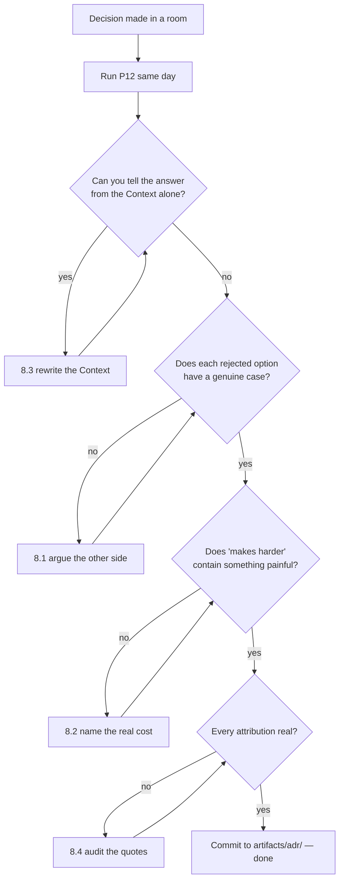

# P12 — Record an Architecture Decision

← [Previous](P11-write-the-technical-spec.md) · [Library index](../README.md) · Next: [P13](P13-design-the-data-contract.md)

> **One line:** Capture one decision, its options and its consequences, at the moment you make it.

| | |
|---|---|
| **Phase** | 2 — Design |
| **Who runs it** | Architect (Hem Singh) |
| **When** | The same day a decision is made. Sprint 1, days 4–5, three times in one week. |
| **Takes in** | The approved plan from [P10](P10-ultra-plan-mode.md), the draft spec from [P11](P11-write-the-technical-spec.md), and whatever conversation actually settled the question |
| **Produces** | `Case-Study/Python-ETL/artifacts/adr/0003-one-failing-field-rejects-the-document.md` (and 0001, 0002) |
| **Hands off to** | Hem + Ravi running [P13](P13-design-the-data-contract.md); every later reviewer who asks "why is it like this?" |
| **Time to run** | Twenty minutes. Genuinely. If it takes an hour you are writing a design document, not an ADR. |

---

## 1. The scene

Thursday morning of Sprint 1. Hem is in a review of the confidence gate spec with Preetinka, Gautam and Ravi. Everything is going fine until rule R3.

R3 says: the document decision is ACCEPT only when every field passes. One failure sends the whole document to review, with no rows written.

Ravi objects, and his objection is completely reasonable. "A Broker Alpha statement has fourteen positions. If one settlement date scores 0.83, we're throwing away thirteen perfectly good rows and giving Preeti a whole document to re-key. That's going to wreck the straight-through rate and she's going to hate us."

Gautam thinks partial ingestion sounds sensible too. Preetinka is not sure. Hem explains: a partially-loaded statement produces a reconciliation break for the missing rows that looks exactly like a genuine settlement failure, so operations chase a ghost. Preetinka — who came off the operations floor at a custodian bank — immediately agrees, because she has chased that ghost.

Decision made. Meeting moves on. Everyone is satisfied.

Nine weeks later, in Sprint 3, a different engineer looks at the same rule with fresh eyes and says the same thing Ravi said, almost word for word. Nobody in the room can reconstruct the argument. Preetinka is on leave. What people remember is "Hem wanted it that way," which is not a reason, and the decision gets re-litigated for two hours and very nearly reversed.

**That two hours — repeated every time somebody new meets a surprising decision — is what an ADR costs twenty minutes to prevent.** Hem goes back to her desk and writes ADR-0003.

---

## 2. What this prompt actually does — in plain language

### What an ADR is, from scratch

**ADR** stands for **Architecture Decision Record**. It is a short numbered document that captures exactly one decision.

That is the whole definition, and every word in it is doing work:

- **Short.** One to two pages. If it is longer, it has become a design document and it will not be read.
- **Numbered.** `0001`, `0002`, `0003`, in the order they were made. The number is the citable name. "See ADR-0003" appears in code comments, spec sections, pull request descriptions and bug reports.
- **One decision.** Not a chapter on the extraction subsystem. One question with one answer. If you find yourself writing "and we also decided", you have two ADRs.
- **A record.** Past tense, permanent, never quietly edited. When a decision changes you write a new ADR that supersedes the old one, and the old one stays in the repo with a status of `Superseded by 0011`.

The last point surprises people. Why keep a wrong document? Because the value of an ADR is not the answer, it is the reasoning. When ADR-0003 gets superseded, the interesting artifact is the pair — what we believed then, what changed, why.

### What goes in one

Five parts. There are many published templates and they all reduce to these.

| Part | The question it answers | The mistake people make |
|---|---|---|
| **Context** | What situation forced a decision? What was true at the time? | Writing the solution here |
| **Options** | What did we actually consider? | Listing one real option and two straw men |
| **Decision** | What did we choose, and what was the deciding factor? | Giving five reasons instead of one |
| **Consequences** | What does this cost us, now and later? | Only listing the good ones |
| **Status** | Proposed / Accepted / Superseded / Deprecated | Leaving it at Proposed forever |

The section people skip is **Consequences**, and it is the section that makes the document worth writing. An ADR that lists only benefits is a sales pitch. A real consequences section says things like "Preeti's queue will be larger than it needs to be, and the straight-through rate will read lower than the underlying extraction quality." That sentence is what makes the decision defensible nine weeks later, because it proves the cost was known and accepted rather than missed.

### Written at the moment of deciding — never reconstructed

This is the rule that matters most and the one most often broken.

An ADR written on the day carries something no later reconstruction can: the alternatives that were genuinely live, and the reason one won *at that time, with the information then available*. Three weeks later that information is gone. You remember the conclusion. You have forgotten the option you nearly took and why you did not, which is precisely the part a future reader needs.

Reconstructed ADRs have a distinctive smell. They are tidy. Every option lines up neatly against the criteria. The chosen one wins on every axis. Real decisions do not look like that — real decisions have an option that was better on two of four criteria and lost anyway, and the ADR that says so is worth ten that do not.

There is a practical corollary: **if you cannot write the ADR in twenty minutes, you have not actually made the decision yet.** The difficulty of writing it is a measurement. Hem uses this deliberately — when a decision feels agreed but the ADR will not come out, she goes back to the room, because something is still open.

### Why not just put this in the spec?

Because they answer different questions and they age differently.

The spec ([P11](P11-write-the-technical-spec.md)) says **what the system does**. It is a living document, updated whenever behaviour changes. When R3 changes, the spec changes and the old text is gone.

The ADR says **why we chose this over that**. It is frozen. Its whole job is to survive the change.

There is a neat way to see the difference. The spec's rule R3 tells you the document is rejected when any field fails. It does not tell you that partial ingestion was considered and rejected, or why. If you only had the spec, the correct reaction on meeting R3 is "that seems wasteful, let's improve it" — which is exactly what happened in Sprint 3. The ADR turns that reaction into "that seems wasteful — oh, right, false breaks, never mind."

And a third document type for completeness: the **PRD** says what the business wants and why. Three documents, three questions:

```
PRD   → why does the business want this?          (Preetinka, living)
ADR   → why did we choose this over that?         (Hem, frozen)
Spec  → what exactly does the system do?          (Hem, living)
```

### The three Northwind ADRs

Sprint 1 produced three. Together they are most of the architecture.

**ADR-0001 — Use Document Intelligence custom models, not an LLM, for field extraction.**
Comes straight out of the plan in [P10](P10-ultra-plan-mode.md). The deciding factor is that Document Intelligence returns a calibrated confidence score per field, and a large language model does not — its self-reported confidence comes from the same process that produced the error, so it is correlated with the mistake rather than independent of it. Everything downstream consumes that score.

**ADR-0002 — Persist the full API response to bronze before parsing anything.**
"Bronze" is the raw layer of a medallion architecture — a common convention where data lands in three tiers: **bronze** is exactly what arrived, untouched; **silver** is cleaned and typed; **gold** is modelled for consumption. The decision is that the complete JSON response from Document Intelligence is written to blob storage at `bronze/{broker}/{yyyy-mm-dd}/{sha256}.json` *before* a single field is read out of it. The cost is storage, which is negligible. The benefit is that a parsing bug found next month is fixed by reprocessing files you already have, instead of re-uploading 12,600 pages and paying $378 again. It also gives an auditor the actual bytes the decision was made from.

**ADR-0003 — One failing field sends the whole document to review.**
The counter-intuitive one, and the worked example below. It is counter-intuitive because it looks like it throws away good data for no reason, and it gets challenged repeatedly — by Ravi in Sprint 1, by a reviewer in Sprint 3, and by Atul in the release readiness check when he sees what it does to the straight-through number. That repetition is exactly why it needs the strongest ADR of the three.

### Why ADR-0003 is the right thing to practise on

Three properties make it the best teaching example in the book.

**It is unpopular on first contact.** Every engineer who meets it wants to soften it. An ADR that only records decisions everybody liked is not earning anything.

**The reasoning is non-local.** The cost of partial ingestion does not appear in the ingestion code at all. It appears two systems away, in the reconciliation report, as a `MISSING_EXTERNAL` break for the rows that never loaded. You cannot see that from `rules.py`. **A decision whose justification lives in a different component is exactly the kind that gets reversed by someone acting locally and sensibly.**

**It has a real, painful, named cost.** The straight-through rate — the headline metric, the percentage of documents needing zero human touch — is directly suppressed by this rule. It started at 61% against a target of 85%. A weak ADR would omit that. A good one states it, and states that it was accepted knowingly.

### What "consequences" really means

Split them three ways, because the second and third are the ones people forget.

- **What this makes easier.** Reconciliation output is trustworthy. There is exactly one state per document, so the exception queue is simple.
- **What this makes harder.** The straight-through rate reads lower. Preeti re-checks fields that were fine. Extraction quality on one field can dominate the metric for a whole counterparty.
- **What this makes impossible until we revisit.** Loading the thirteen good positions and flagging the fourteenth. Not merely discouraged — the schema has one status per document, so partial loading would require a data model change, not a config change.

That third category is the one worth insisting on. It converts "we prefer not to" into "we cannot without changing X", which is a far more honest description of what a decision costs.

### Why the prompt is shaped the way it is

Four deliberate choices in §3, all of them countering a specific way ADRs go bad.

1. **Context before options, options before decision.** Written in any other order, the context becomes a justification for a conclusion you have already stated.
2. **A mandatory "rejected options with their strongest case".** This is the straw-man killer. If you cannot write a good sentence in favour of the option you rejected, you did not consider it.
3. **Consequences split into easier / harder / impossible.** Ask for "consequences" alone and you get four bullets, all positive.
4. **A required reversal trigger.** One line naming what would have to become true for this to be the wrong call. It turns the ADR from an opinion into something you can monitor.

### The one thing to remember

**An ADR exists to stop the same argument happening twice.** If it does not contain the counter-argument, it will not do that — a document that only says what you chose reads as an assertion, and assertions get challenged.

---

## 3. The prompt

Run this immediately after the decision is made, in the session where you made it, so the alternatives are still in context. If the decision was made in a meeting rather than a session, paste your notes in first.

```text
You are a **software architect** writing an Architecture Decision Record (ADR). An ADR captures ONE
decision, at the moment it is made, so nobody has to reconstruct the reasoning later.

**The decision:**
[THE DECISION IN ONE SENTENCE]

**When and where it was made, and by whom:**
[WHEN AND WHO]

**The situation that forced it — what was true at the time:**
[CONTEXT]

**The options that were genuinely on the table:**
[OPTIONS CONSIDERED]

**The deciding factor, as far as I can state it:**
[DECIDING FACTOR]

**Source material — read this and use it, do not invent around it:**
[SOURCE MATERIAL]

**Write the ADR with exactly these sections:**

# ADR-[NUMBER] — [Title in the imperative: "Use X", "Reject Y", not "Discussion of Z"]

**Status:** Accepted
**Date:** [DATE]
**Deciders:** [names]
**Supersedes:** [ADR number, or "none"]
**Related:** [story IDs, spec paths, other ADRs]

## Context
What was true when this decision was made. The constraint, the volume, the requirement, the thing
that broke. Six to ten sentences. **Do not name the chosen solution in this section** — if a reader
cannot tell from the Context alone which option you picked, the Context is honest.

## Options considered
One subsection per option. For each:
- what it is, in two sentences, for someone who has not heard of it
- **The strongest case for it** — argue for it as if you had chosen it
- why it lost (or won), with a number or a named failure, not an adjective

Include every option that was seriously discussed. If an option was rejected in under a minute, say
so and say why — a one-line rejection is honest, a missing option is not.

## Decision
One paragraph. State what was chosen and **the single deciding factor** in one sentence. If you find
yourself listing five reasons, you have not found the deciding one — the deciding factor is the thing
that would have flipped the decision if it were untrue.

## Consequences
Three separate lists, all required:
- **What this makes easier** — concrete, with the component or person it helps
- **What this makes harder** — the real cost, named, including any metric it damages
- **What this makes impossible until we revisit** — things now ruled out, and what would have to
  change to allow them (a schema change? a new service? a config flag?)

## Reversal trigger
One sentence: what would have to become true for this to be the wrong decision, stated as something
observable. Then: what we would do about it.

## Notes
Anything that will read as surprising in six months. Objections raised at the time and who raised
them. Keep this short.

**Do not:**
- Do not write more than two pages. An ADR nobody reads has failed.
- Do not include implementation detail. This is why, not how. How lives in the spec.
- Do not list an option you did not seriously consider, and do not weaken an option to make the
  decision look better. If the rejected option was genuinely good, say so.
- Do not write only positive consequences. If the "makes harder" list is shorter than the "makes
  easier" list, you are selling, not recording.
- Do not use hedging language: "we may want to", "it might be beneficial", "consider". A decision
  was made. Write it in the past tense and be definite.
- Do not restate the spec. Reference it by path.
- Do not invent who said what. If you do not know, write "TO CONFIRM" and leave it for me.

**You are done when:** the Context does not reveal the answer, every rejected option has a genuine
argument in its favour, the Decision names exactly one deciding factor, all three consequence lists
are non-empty, and the reversal trigger is observable.

Save to [OUTPUT PATH]. Use the number [NUMBER], which is the next unused number in that folder.
```

---

## 4. Every placeholder, explained

| Placeholder | What to put in it | Northwind example | What happens if you get it wrong |
|---|---|---|---|
| `[THE DECISION IN ONE SENTENCE]` | The choice, in the imperative, naming the thing chosen and the thing rejected | "One failing field sends the whole document to review; partial ingestion of a statement is not permitted." | Vague input gives you a vague ADR. "Improve our approach to confidence" is not a decision and will produce an essay. |
| `[WHEN AND WHO]` | The date and the people in the room. Real names | "Thursday 12 March, spec review — Hem, Preetinka, Gautam, Ravi" | Missing deciders is the single most common gap. In nine months the useful question is "who agreed to this", and "the team" is not an answer. |
| `[CONTEXT]` | What was true at the time, with numbers. Do not include the answer | "~200 documents/day, each with up to ~20 positions. Every field carries a confidence score. Reconciliation full-outer-joins against Aladdin and classifies missing rows as `MISSING_EXTERNAL`." | Weak context produces an unfalsifiable ADR. A reader six months later must be able to check whether the situation still holds. |
| `[OPTIONS CONSIDERED]` | Every option that got airtime, including the one somebody argued for and lost | 1. Reject whole document. 2. Load passing rows, flag failing ones. 3. Load passing rows and suppress that document from reconciliation until resolved. | Give it one option and you get an ADR with two invented straw men, which is worse than no ADR because it looks thorough. |
| `[DECIDING FACTOR]` | Your best statement of what actually settled it. It is fine to be unsure — the AI will sharpen it | "A partially-loaded statement produces reconciliation breaks that are indistinguishable from genuine settlement failures." | If you supply five factors you will get five, and no one deciding factor, and the ADR will not survive a challenge. |
| `[SOURCE MATERIAL]` | Paths to the spec, story, plan and any prior ADR | `artifacts/spec-confidence-gate.md`, `artifacts/stories/NWD-103-confidence-gate.md`, `artifacts/adr/0001-extraction-approach.md` | Without it the ADR contradicts the spec on a threshold or a name, and now you have two documents disagreeing. |
| `[NUMBER]` | The next unused number, zero-padded to four digits. Never reuse one | `0003` | Reusing a number breaks every citation. Numbers are permanent even when the ADR is superseded. |
| `[DATE]` | The date the decision was made, not the date you wrote it up | 2024-03-12 | Post-dating hides how long the write-up lagged, which is the exact information you need to know whether it was reconstructed. |
| `[OUTPUT PATH]` | The ADR folder | `Case-Study/Python-ETL/artifacts/adr/0003-one-failing-field-rejects-the-document.md` | ADRs in a wiki get lost. They belong in the repo, next to the code, so they arrive with the checkout. |

---

## 5. The filled-in example

Hem writes this at 11:40 on Thursday, forty minutes after the spec review ended, in the same session where she drafted the spec.

```text
You are a **software architect** writing an Architecture Decision Record (ADR). An ADR captures ONE
decision, at the moment it is made, so nobody has to reconstruct the reasoning later.

**The decision:**
One failing field sends the whole document to the exception queue. We do not partially ingest a
statement — no rows are written to silver unless every extracted field passes its confidence
threshold.

**When and where it was made, and by whom:**
Thursday 12 March 2024, in the NWD-103 spec review. Present: Hem Singh (architect),
Preetinka Sharma (product owner), Gautam  (team lead), Ravi Mullick (backend). Ravi objected;
Preetinka backed the decision on operational grounds.

**The situation that forced it — what was true at the time:**
- ~200 counterparty documents a day, each carrying up to ~20 position lines
- Every extracted field arrives with a per-field confidence score (per ADR-0001)
- Thresholds are per type: currency 0.90, number 0.90, date 0.85, string 0.75; broker_alpha
  overrides currency to 0.92
- Downstream, recon/reconcile.py full-outer-joins external positions against the Aladdin feed and
  classifies anything present in Aladdin but absent externally as MISSING_EXTERNAL
- The headline business metric is the straight-through rate: the percentage of documents needing zero
  human touch. Currently 61%, target 85%
- Preeti Singh, the Northwind operations analyst, works the exception queue and clears roughly 40
  items in a morning

**The options that were genuinely on the table:**
1. Reject the whole document — no rows written, one exception record per failing field.
2. Load the passing rows into silver, write an exception only for the failing field. Ravi argued
   for this: thirteen good positions out of fourteen should not be thrown away.
3. Load the passing rows but suppress that counterparty/date combination from the reconciliation run
   until the exception is resolved.

**The deciding factor, as far as I can state it:**
A partially-loaded statement produces MISSING_EXTERNAL breaks for the rows that were never loaded,
and those breaks are indistinguishable from a genuine settlement failure. Operations then investigate
a problem that does not exist, which is worse than having no data at all — it actively costs Preeti
time and erodes trust in the break report.

**Source material — read this and use it, do not invent around it:**
- artifacts/spec-confidence-gate.md (rule R3)
- artifacts/stories/NWD-103-confidence-gate.md
- artifacts/adr/0001-extraction-approach.md
- artifacts/prd-counterparty-ingestion.md (straight-through rate definition)

**Write the ADR with exactly these sections:**
[sections exactly as in the template above]

**Do not:**
[the Do-not block exactly as in the template above]

**You are done when:** the Context does not reveal the answer, every rejected option has a genuine
argument in its favour, the Decision names exactly one deciding factor, all three consequence lists
are non-empty, and the reversal trigger is observable.

Save to Case-Study/Python-ETL/artifacts/adr/0003-one-failing-field-rejects-the-document.md.
Use the number 0003, which is the next unused number in that folder.
```

---

## 6. What comes back

This is the file, essentially as written. ADRs are short by design, so almost nothing is abridged.

```markdown
# ADR-0003 — Reject the whole document when any field fails its confidence threshold

**Status:** Accepted
**Date:** 2024-03-12
**Deciders:** Hem Singh, Preetinka Sharma, Gautam , Ravi Mullick
**Supersedes:** none
**Related:** NWD-103 · `artifacts/spec-confidence-gate.md` (R3) · ADR-0001

## Context

Northwind receives roughly 200 counterparty documents a day. A single position statement carries up
to about twenty position lines, and each extracted field arrives with its own confidence score from
Document Intelligence (ADR-0001). Thresholds are set per field type — 0.90 for currency and
quantities, 0.85 for dates, 0.75 for descriptive strings — with per-counterparty overrides, such as
broker_alpha's 0.92 on currency because their scans are poor.

Documents are not the end of the road. Extracted positions land in silver, are merged into Snowflake,
and are then full-outer-joined against the internal Aladdin feed by `recon/reconcile.py`. A position
that exists in Aladdin but not in the external data is classified `MISSING_EXTERNAL`, which is the
signal operations uses to investigate a possible settlement failure. Operations treats that signal as
real, because until now it always has been.

The headline business metric is the straight-through rate: the share of documents that need no human
touch at all. It stands at 61% and the target is 85%. Anything that sends more documents to a human
pushes that number down.

Preeti Singh, the Northwind operations analyst, works the exception queue. She clears roughly forty
items in a morning. Every additional item is a real cost to a real person, and every unnecessary one
is a reason to stop trusting the queue.

The question this decision answers: when a statement has fourteen positions and one field on it falls
below its threshold, what happens to the other thirteen?

## Options considered

### Option 1 — Reject the whole document

No rows are written to silver. One exception record is created per failing field, carrying the field
name, its confidence, the threshold applied, and the page it came from. The analyst reviews the
document as a unit.

**The strongest case for it:** the data that reaches reconciliation is either complete or absent, and
absence is visible as a document sitting in the queue rather than as a phantom break. There is
exactly one state per document, so every downstream component — the queue, the audit trail, the
Snowflake merge — has a single simple rule to follow.

**Why it won:** see Decision.

### Option 2 — Load the passing rows, flag only the failing field

Thirteen good positions go to silver, the fourteenth becomes an exception. Argued for by Ravi on the
grounds that discarding correct data is waste, and that it protects the straight-through rate.

**The strongest case for it:** it is the intuitively correct answer, it maximises usable data, and it
minimises what Preeti has to re-check. If the only cost of a low-confidence field were that field,
this option would be obviously right and there would be no ADR.

**Why it lost:** the cost is not local. The thirteen loaded rows make the statement *look* complete.
The missing fourteenth position appears in the reconciliation report as `MISSING_EXTERNAL`, which is
the same signal produced by a genuine failed settlement. An operations analyst cannot tell the two
apart from the report, so they investigate — contacting the broker, checking the custodian — for a
position that was simply never loaded. **A false break costs more analyst time than the exception
would have, and it spends that time in a different team, invisibly.**

### Option 3 — Load the passing rows and suppress that document from reconciliation

A middle path: partial data lands, but the affected counterparty and date are excluded from the
reconciliation run until the exception is cleared.

**The strongest case for it:** it keeps the good data and prevents the false break, which is
genuinely both halves of the problem solved.

**Why it lost:** it requires reconciliation to know about extraction state, which couples two systems
that are otherwise independent, and it introduces a third document state — loaded-but-not-reconciled
— that every downstream consumer must understand. It also creates a silent-failure path: if the
suppression list is ever not cleared, positions sit in Snowflake permanently unreconciled and nothing
alerts anybody. We may revisit this if exception volume becomes the binding constraint, but not for
v1.

## Decision

We reject the entire document when any extracted field fails its confidence threshold. No rows are
written to silver; the document goes to the exception queue with one record per failing field.

**The deciding factor:** partial ingestion creates reconciliation breaks that are indistinguishable
from genuine settlement failures, and a break report that contains false positives stops being used.
Everything else — data volume, straight-through rate, analyst effort — is a cost we can measure and
manage. Loss of trust in the break report is not recoverable by tuning.

## Consequences

**What this makes easier**
- `recon/reconcile.py` can treat every `MISSING_EXTERNAL` break as genuine. No provenance checking,
  no partial-load exclusion list.
- The exception queue has one document-level state, so Dzmitry's screen shows one PDF and one decision
  rather than a per-row status grid (see `artifacts/ui-brief-exception-queue.md`).
- The Snowflake merge is simple: a document contributes all its rows or none, so
  `MIN_CONFIDENCE` at row level is meaningful and comparable.
- Audit is straightforward: every row in gold came from a document that passed every threshold.

**What this makes harder**
- The straight-through rate is directly suppressed. One weak field on a twenty-position statement
  costs a whole document. At launch this will read materially below the 85% target and the number
  will understate actual extraction quality. **Accepted knowingly.**
- Preeti re-checks fields that were fine, because the queue presents the whole document. The UI must
  make the failing field obvious and everything else fast to skim, or this becomes forty minutes of
  wasted attention a morning.
- One consistently weak field on one counterparty — broker_alpha's currency scans — can dominate the
  exception volume for that counterparty and mask other problems.

**What this makes impossible until we revisit**
- Loading thirteen of fourteen positions. Not merely discouraged: the silver schema carries one
  status per document, so partial loading is a data-model change, not a config flag.
- Per-row confidence gating with per-row exceptions. Same reason.
- Any "best effort" ingestion mode for a counterparty we trust more than others. There is no
  per-counterparty escape hatch and we deliberately did not add one, because the first time it is
  used it will be used under month-end pressure.

## Reversal trigger

If the exception queue exceeds roughly 60 documents a day sustained for two weeks, **and** analysis
shows that more than half of those are single-field failures on documents whose other fields all
scored above 0.95, the cost balance has shifted and Option 3 becomes worth building. The observable
signal is the daily exception count in Application Insights plus a weekly breakdown of failing-field
counts per document.

What we would do: build Option 3 behind a per-counterparty flag, starting with the counterparty
producing the most single-field exceptions, and measure whether false-break volume stays at zero.

## Notes

Ravi raised the obvious objection at the time — thirteen good rows should not be thrown away — and
it is the right instinct. The counter is that the cost of the fourteenth row is not paid in the
ingestion pipeline; it is paid two systems downstream, by a different team, in a form that looks like
a real problem. Expect this decision to be challenged again by anyone reading `core/rules.py` in
isolation, because from inside that file the choice looks purely wasteful. That is the nature of a
decision whose justification lives elsewhere.

Preetinka's framing in the review, worth keeping: "a break I have to chase and then find out was never
real costs me more than a document I have to key."
```

### How to read this

**The Context section never says what was chosen.** Read it and you genuinely cannot tell whether the answer will be option 1, 2 or 3. That is the test of an honest context, and it is a rare property — most ADRs write the context as a runway to the conclusion.

**Option 2's "strongest case" is the best paragraph in the document.** It concedes that the rejected option is the intuitive one and would be obviously right if the cost were local. When somebody challenges this decision in Sprint 3, that paragraph is what stops the conversation being adversarial — their argument is already in the document, stated better than they would state it, with the answer attached.

**The "makes harder" list contains the number that hurts.** The straight-through rate is the headline metric of the whole project and this decision damages it. Saying so, in the ADR, marked **Accepted knowingly**, is what makes it survivable when Atul sees 61% in [P32](../phase-7-release/P32-release-readiness-check.md) and asks why. The answer is not improvisation; it is a link.

**The reversal trigger is observable.** "Roughly 60 documents a day sustained for two weeks, more than half being single-field failures on otherwise-strong documents." Somebody can build that query. Compare with the usual formulation — "revisit if this becomes a problem" — which is not a trigger, it is a shrug.

**And the part that is commonly wrong:** the Notes section is where fabrication creeps in. The AI will happily invent who said what, complete with a plausible quote. Here Preetinka's line is real, because Hem was in the room and wrote it down. The prompt's `Do not invent who said what` instruction, and its instruction to write `TO CONFIRM`, exist because the first draft attributed a quote about audit trails to Gautam that Gautam never said. Attributed quotes in a repo document are a small thing that damages trust badly.

---

## 7. Why this is the final prompt

**What "done" means here.** An engineer who joins the project in six months reads this file and does not reopen the argument. That is the entire success condition and it is checkable — you can literally hand it to someone who was not there.

### The checklist

- [ ] The Context does not reveal which option was chosen.
- [ ] Every rejected option has a paragraph arguing genuinely in its favour.
- [ ] The Decision names exactly **one** deciding factor, phrased so that if it were untrue the decision would flip.
- [ ] All three consequence lists are non-empty, and "makes harder" contains something that actually hurts.
- [ ] The reversal trigger names an observable signal, not a feeling.
- [ ] Every name, quote and objection attributed to a person is real, or marked `TO CONFIRM`.
- [ ] It fits on two pages.
- [ ] The number is the next unused one, and the file is in the repo, not a wiki.

### Why you should stop rather than keep prompting

The strongest temptation with an ADR is to make it complete. Add the sequence diagram. Add the cost model. Add the migration path. Add the alternatives you thought of afterwards.

Resist all of it, because **length is the mechanism by which ADRs fail.** The document's job is to be read in three minutes by someone mildly annoyed at a design decision. A twelve-page ADR is not read at all, which means the argument gets had again, which means the ADR bought you nothing for the extra hours.

The second temptation is to keep refining the reasoning after the decision has been made. That is not ADR work. If the reasoning is still moving, the decision is not settled, and you should go back to [P10](P10-ultra-plan-mode.md) rather than polishing a record of a choice you have not made.

### The signal that you are NOT done

You read the rejected options and none of them sounds even slightly tempting. Real decisions are close; if all the alternatives look silly, they have been made to look silly, and §8.1 is next.

---

## 8. When it is not done — the follow-up prompts

| What you're seeing | What's actually wrong | Run this next |
|---|---|---|
| The rejected options all look obviously bad | Straw men. The ADR will not survive its first real challenge | **§8.1** below |
| Consequences are four bullets, all good news | It wrote a justification, not a record | **§8.2** below |
| Three pages of background before the decision appears | It is a design document. It will not be read | **§8.3** below |
| The Context already tells you the answer | Written backwards from the conclusion | **§8.3** below |
| It quotes people saying things you do not remember them saying | Fabricated attribution | **§8.4** below |
| It repeats the thresholds, the config shape, the rules | It is duplicating the spec. These will drift apart | **§8.5** below |
| It covers three decisions at once | It is three ADRs | **§8.5** below |
| Status still says Proposed a week later | Nobody actually decided. This is not a writing problem | Go back to the room, or to **[P10](P10-ultra-plan-mode.md)** |
| The decision is right but the behaviour is unspecified | Nothing is wrong — you need the spec | **[P11](P11-write-the-technical-spec.md)** |
| A later decision reverses this one | Write a new ADR, do not edit this one | This prompt again, with `Supersedes:` filled in |

### 8.1 "The rejected options are straw men"

Use this when every option except the chosen one is transparently bad.

```text
Your rejected options were written to lose. Rewrite the Options section.

For **each** rejected option, write a paragraph headed **"The strongest case for this"** in which you
argue for it as its best advocate would. Specifically:
- name the thing it does better than the option we chose
- name who would prefer it and why they would be right to
- if it would have won under different circumstances, say which circumstances

Only after that paragraph do you write why it lost, and that reason must cite a number, a named
failure sequence, or a constraint — never an adjective.

If, having argued the strongest case, an option now looks better than the one we chose, **say so
plainly.** Do not adjust the argument to protect the decision. I would rather find out here.
```

What changes: sometimes it makes you nervous, which is the point. On ADR-0003 this follow-up produced Option 2's paragraph about the answer being obviously right if the cost were local, which is the line the whole document turns on.

### 8.2 "The consequences are all upside"

Use this when the "makes harder" list is short, vague, or missing.

```text
Rewrite the Consequences section. It is currently a justification.

Three lists, and the middle one must be the longest:

**Makes easier** — maximum four bullets. Name the component or person helped.

**Makes harder** — at least four bullets. Every one must name either a metric that gets worse with
its direction, a person who does more work and how much, or a scenario that becomes more painful.
Include the single worst consequence first, and if it is bad enough, mark it "Accepted knowingly."

**Impossible until we revisit** — at least two bullets. For each, say what would have to change to
allow it: a schema change, a new component, a config flag, a vendor capability we do not have.

Then, in one sentence: **who pays the biggest cost of this decision, and do they know?** If the
answer is somebody outside this team, that sentence goes in Notes.
```

What changes: the last question is the useful one. On ADR-0003 the answer was Preeti — a person outside Kestrel entirely — and it is what made Dzmitry's UI brief in [P14](P14-ui-ux-design-brief.md) treat scanning speed as a hard requirement rather than a nicety.

### 8.3 "It's an essay, not an ADR"

Use this when the file is over two pages or the context reads like a chapter.

```text
Cut this to two pages. It is currently a design document.

Rules for the cut:
- Context: maximum ten sentences. Keep only facts a reader needs to judge whether the decision still
  applies. Delete history, delete motivation, delete anything about what the business wants.
- Options: three sentences of description each, plus the strongest case, plus one reason it lost.
- Decision: one paragraph. One deciding factor.
- Consequences: bullets only, no prose paragraphs.
- Delete every diagram. If a diagram is genuinely needed, it belongs in the spec and should be
  referenced by path.
- Delete every sentence that would still be true if we had chosen a different option.

Then check the Context against this test: **reading only the Context, could I tell which option was
chosen?** If yes, rewrite the Context until I cannot. It is currently arguing for the answer.
```

What changes: usually the file halves and gets sharper. The final test is the valuable one — a context you cannot predict the answer from is the mark of a real record rather than a defence.

### 8.4 "It made up who said what"

Use this the moment you see a quote you do not recognise.

```text
List every statement in this ADR attributed to a named person, with the exact sentence.

For each one, mark it:
- **VERIFIED** — it appears in the source material I gave you (quote where)
- **INFERRED** — you concluded it from someone's role or from the discussion
- **INVENTED** — you wrote it

Delete every INVENTED attribution. Replace every INFERRED one with "TO CONFIRM: did [name] raise
[point]?" and leave it for me to check.

Attributed quotes in a repo document are load-bearing. In nine months somebody will cite this file in
a meeting, and if the quote is wrong, everything else in the file becomes suspect too.
```

What changes: usually one or two lines get pulled. It is a small correction with an outsized effect on whether the document is trusted.

### 8.5 "It duplicates the spec" / "it's three decisions"

Use this when the ADR restates behaviour, or when the title contains "and".

```text
Two problems to fix.

**First — duplication.** List every fact in this ADR that also appears in
`artifacts/spec-confidence-gate.md`. For each, delete it from the ADR and replace with a reference
("thresholds are defined in spec-confidence-gate.md §4"). The ADR records *why we chose*, never
*what the system does*. Anything that would need editing when a threshold changes does not belong
here — an ADR is frozen and the spec is not, so duplicated facts guarantee drift.

**Second — scope.** If this ADR contains more than one decision, split it. A decision is separate
when it could have gone the other way independently of the others.
List each decision you find, give it a title in the imperative, and tell me which one should keep
number [NUMBER] and which need new numbers. Then rewrite only the one that keeps the number.
```

What changes: this is how ADR-0002 came to exist. Hem's first draft of 0001 covered both the extraction service *and* the decision to persist the raw response to bronze first. They are independent — you would persist raw responses whichever service you used — so they became two ADRs, and 0002 is the one people cite most often when a parsing bug shows up.

### The loop



---

## 9. How this goes wrong

### You write it three weeks later

The most common failure, and it produces a document that is worse than nothing because it looks authoritative.

What is lost is specific: the options that were genuinely live, and the state of knowledge at the time. Three weeks on you remember the conclusion and reconstruct a justification for it, and the reconstruction is always cleaner than the reality. Every criterion lines up. Nothing was close. Nobody objected.

Then somebody who *was* in the room reads it and finds it does not match what happened, and stops trusting the ADR folder entirely.

**The fix:** write it the same day, and if that is impossible, write it late but say so. A line reading "written 3 April from notes; the option list may be incomplete" costs you nothing and preserves trust. Hem does exactly this on ADR-0002, which was written two days late.

### It becomes documentation of the code

An ADR that says "we use `evaluate_confidence(fields, policy)` returning a `GateResult` with a decision, a min confidence and a failure list" is describing the code, not a decision. It will be wrong the first time Ravi refactors, and a wrong ADR poisons the rest of the folder.

The test is durability: **an ADR should still be true after a rewrite of the module it concerns.** ADR-0003 survives any refactor of `rules.py` because it is about what happens to the other thirteen positions, which is a policy, not a signature.

**The fix:** §8.5. Anything that would need editing when the code changes belongs in the spec.

### Only the comfortable decisions get recorded

A subtler failure. Teams write ADRs for the decisions they are proud of — the elegant service choice, the neat schema — and skip the awkward ones: the vendor picked because procurement already had a contract, the design chosen because there were four weeks left, the compromise nobody liked.

Those are precisely the decisions that get challenged, because from the outside they look arbitrary. And they were not arbitrary; they had a reason, and the reason was "we had four weeks", and that is a legitimate thing to write down.

**The fix:** an ADR is allowed to say "we chose this because of the deadline" or "because the client's platform team will not approve a new service this quarter." Constraints are context. Write them and the decision stops looking arbitrary. Kestrel's ADR-0002 has a line saying storage was chosen partly because Northwind's platform team had already approved ADLS Gen2 and approving anything new took six weeks. That is the real reason and hiding it would help nobody.

### The ADR nobody can find

Written in Confluence. Or in a Slack thread. Or in a Google Doc in someone's drive.

An ADR is a repo artifact. It travels with the checkout, it appears in pull request diffs, and it can be cited from a code comment as a relative path. Put it in a wiki and it will be found by exactly the people who already know the decision.

**The fix:** `artifacts/adr/NNNN-title-in-kebab-case.md`, committed alongside the code, and cited from the spec and from the code. `core/rules.py` at Northwind carries a comment: `# Whole-document rejection: see artifacts/adr/0003-*.md before "improving" this.` That comment has stopped two well-meaning refactors.

### You wrote an ADR for a decision that costs nothing to reverse — the wrong-tool case

Not every decision needs a record. Whether `GateResult` is a dataclass or a NamedTuple is not an architecture decision; it is a preference Ravi can change on a Tuesday afternoon.

The test is the same one from [P10](P10-ultra-plan-mode.md): cost of reversal. If a decision can be undone in under a day without touching another component or another team, it does not need an ADR. Writing one anyway dilutes the folder, and a folder of thirty ADRs where four matter is a folder nobody reads.

**The fix:** ADRs for decisions that are expensive to reverse, cross a team boundary, or will look wrong to a newcomer. Northwind's Sprint 1 produced exactly three. That is the right order of magnitude.

---

## 10. The handoff

The immediate consumer is the spec. Hem goes back to [`spec-confidence-gate.md`](../../Case-Study/Python-ETL/artifacts/spec-confidence-gate.md) and adds `(ADR-0003)` to rule R3, so the two documents are joined and neither has to repeat the other. The spec says what happens; the ADR says why that was chosen. A reader who wants the reasoning follows one link.

The second consumer is Dzmitry, and this one is easy to miss. ADR-0003's "makes harder" list contains the sentence about Preeti re-checking fields that were fine. That sentence is a design requirement for the exception queue, and it arrives in [P14 — UI/UX Design Brief](P14-ui-ux-design-brief.md) as a hard constraint: the failing field must be findable in under two seconds, and the fields that passed must be skimmable without reading them. Dzmitry does not need to have been in the spec review to know that. She needs to have read one ADR.

The third consumer is the code review in [P23](../phase-5-verify/P23-review-someone-elses-code.md) and the release check in [P32](../phase-7-release/P32-release-readiness-check.md). When Atul sees the straight-through rate at 61% and asks whether something is broken, the answer is a link, not a meeting.

Hem's own next step is [P13 — Design the Data Contract](P13-design-the-data-contract.md), with Ravi. Writing ADR-0003 made something explicit that had been implicit: the silver schema carries one status per document, which is *why* partial loading is a data-model change rather than a flag. That sentence is a claim about a schema nobody has written down yet, and claims about a schema that does not exist are exactly how contracts get broken.

> **Artifact contract — `Case-Study/Python-ETL/artifacts/adr/NNNN-*.md`**
> Anyone reading an ADR in this folder can rely on finding:
> - A status, a date, and the real names of the people who decided
> - A context stating what was true at the time, from which the chosen option is not predictable
> - Every option that was seriously considered, each with a genuine argument in its favour
> - Exactly one deciding factor, phrased so that its falsity would flip the decision
> - Three consequence lists — easier, harder, impossible-until-revisited — all non-empty
> - An observable reversal trigger and what would be done about it
> - No duplication of the spec, and no attributed quote that was not actually said
> - The whole thing in two pages or fewer
>
> If any of those is missing, the artifact is not done — go back to §7.

---

## 11. In the case study

All three Sprint 1 ADRs are written in [Chapter 3 — Sprint 1: Design](../../Case-Study/Python-ETL/03-sprint-1-design.md), and ADR-0003 is the one that keeps coming back. The file is [`artifacts/adr/0003-one-failing-field-rejects-the-document.md`](../../Case-Study/Python-ETL/artifacts/adr/0003-one-failing-field-rejects-the-document.md).

The moment worth reading is in [Chapter 7](../../Case-Study/Python-ETL/07-sprint-3-verify.md), during code review. A reviewer reads `core/rules.py`, sees the whole-document rejection, and writes exactly the comment Hem predicted in the Notes section: "this discards valid rows, suggest we flag per-row instead." Gautam replies with a single line — the path to ADR-0003 — and the thread closes in one exchange. Hem's prediction that the decision would be challenged by anyone reading the module in isolation turns out to be correct within nine weeks of her writing it down.

The awkward moment is in [Chapter 9](../../Case-Study/Python-ETL/09-sprint-4-release.md). Atul runs the release readiness check, sees the straight-through rate at 61% against a stated target of 85%, and asks whether the system is working. It is. The gap is mostly this decision plus broker_alpha's scan quality, and both are documented — the metric damage is in ADR-0003's "makes harder" list, marked **Accepted knowingly**, and Preetinka's reset of 85% to a quarter-three target is in the spec review notes from [Chapter 3](../../Case-Study/Python-ETL/03-sprint-1-design.md).

Atul's reaction is the sentence the retrospective in [Chapter 10](../../Case-Study/Python-ETL/10-retrospective.md) ends on: "I don't mind a bad number. I mind a bad number nobody predicted." ADR-0003 predicted it, in writing, ten weeks earlier, which is the entire reason the release went ahead on schedule.

---

← [Previous](P11-write-the-technical-spec.md) · [Library index](../README.md) · Next: [P13](P13-design-the-data-contract.md)
