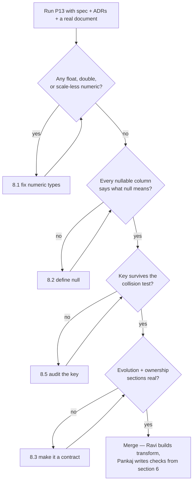

# P13 — Design the Data Contract

← [Previous](P12-record-an-architecture-decision.md) · [Library index](../README.md) · Next: [P14](P14-ui-ux-design-brief.md)

> **One line:** Agree the exact shape, types and meaning of the data crossing every boundary — before anyone writes to it.

| | |
|---|---|
| **Phase** | 2 — Design |
| **Who runs it** | Architect (Hem Singh) with the Backend Engineer (Ravi Mullick) |
| **When** | Sprint 1, day 5, straight after ADR-0003. Before NWD-106 (transform) and NWD-107 (load) are started. |
| **Takes in** | `artifacts/spec-confidence-gate.md`, `artifacts/adr/0001…0003`, `artifacts/stories/NWD-106`, `NWD-107`, the Aladdin field list, one real Broker Alpha statement |
| **Produces** | `Case-Study/Python-ETL/artifacts/data-contract-counterparty-position.md` |
| **Hands off to** | Ravi building `core/transform.py` and `sinks/*` via [P18](../phase-4-build/P18-implement-a-story.md); Pankaj writing data-quality checks in [P25](../phase-5-verify/P25-data-quality-validation.md) |
| **Time to run** | A morning. Forty minutes generating, two hours with Hem and Ravi arguing about nullability and one decimal place. |

---

## 1. The scene

Friday morning of Sprint 1. ADR-0003 is written and merged, and it contains a sentence Hem typed without thinking much about it:

> the silver schema carries one status per document, so partial loading is a data-model change, not a config flag

Gautam spots it in review and asks the obvious question. What silver schema?

There isn't one. There is a story called NWD-106 — "Transform extracted fields into the canonical position schema" — which refers to a canonical position schema in the definite article, as though it exists, and nowhere in the repo is there a document saying what its columns are. There is a spec for the confidence gate. There is an ADR about extraction. There is a PRD full of business outcomes. Between them they mention `quantity`, `market_value`, `security_id`, `min_confidence` and `bronze_path`, in five different capitalisations, with no types.

Hem gets Ravi and a whiteboard. Within ten minutes they are stuck on something that sounds trivial and is not:

Ravi: "Quantity's a float, obviously."
Hem: "What does this look like when it's wrong?"
Ravi: "It's a number of shares. What's going to go wrong?"
Hem: "Reconciliation has a quantity tolerance of 0.0001 written into it. Why do you think that's there?"

It is there because floating-point arithmetic does not represent decimal fractions exactly, so a quantity that went through a float somewhere comes out as `14500.000000000002`, and comparing it to Aladdin's `14500` produces a difference. Somebody, at some point, papered over that with a tolerance instead of fixing the type. Now the tolerance is load-bearing, and a genuine break of 0.00005 shares would be invisible.

**That conversation — types, precision, nullability, what a column actually means — is a data contract, and having it on a whiteboard on the Friday is the cheapest it will ever be.** Hem opens a session.

---

## 2. What this prompt actually does — in plain language

### What a data contract is

A **data contract** is a written agreement about the data crossing a boundary. It states:

- the **shape** — what fields exist, and their order where order matters
- the **types** — including precision and scale for numbers, and length for strings
- the **nullability** — which fields may be absent, and what absent means
- the **units and allowed values** — is `quantity` in shares or lots, is `currency` an ISO code
- the **meaning** — what the field is, in a sentence, so two people do not fill it differently
- the **key** — what makes a row unique, which is what makes loading repeatable
- **who may change it, and how** — the part everybody forgets, and the part that makes it a contract

A **boundary** is any point where data leaves one team's or one component's control and enters another's. Extraction hands fields to the rules engine: boundary. The rules engine writes rows to Azure SQL: boundary. Azure SQL merges into Snowflake: boundary. Reconciliation reads Snowflake and the Aladdin feed together: boundary.

Without the last bullet — who may change it — you have a schema, not a contract. **A schema describes what the data looks like today; a contract describes what you may rely on tomorrow.** That distinction is the entire reason this artifact exists.

### Why this is the critical artifact for an ETL project

ETL stands for extract, transform, load: pull data from somewhere, reshape it, put it somewhere else. Northwind's pipeline is exactly that — PDFs in, typed rows out, into a warehouse.

In an ETL system the data *is* the product. There is no user interface for most of it and no user pressing buttons. If a column's meaning is ambiguous, nobody finds out by clicking around. They find out three months later when a report is wrong, and by then a quarter of a million rows carry the ambiguity.

And yet almost every prompt library skips this. You will find prompts for PRDs, for stories, for architecture, for tests. You will rarely find one for "write down exactly what a row means." The result is a pipeline where the schema was decided by whoever wrote `CREATE TABLE` first, at speed, on a Tuesday.

### The medallion layers, since they will keep appearing

Northwind's pipeline uses a common warehouse convention with three tiers. It is worth stating plainly because the contract spans all three.

| Layer | What lives there | Northwind |
|---|---|---|
| **Bronze** | Exactly what arrived, untouched. Immutable. | The complete Document Intelligence JSON response at `bronze/{broker}/{yyyy-mm-dd}/{sha256}.json`, written before parsing (ADR-0002) |
| **Silver** | Cleaned, typed, one row per business fact | `silver.counterparty_position` in Azure SQL |
| **Gold** | Modelled for consumption, joined, aggregated | `GOLD.COUNTERPARTY_POSITION` in Snowflake, read by reconciliation |

The contract in this file describes the **canonical position record** — the shape that comes out of transform, lands in silver, and merges into gold. Bronze has no schema by design, which is the point of bronze.

### Natural key versus surrogate key

The **key** is what makes a row unique. Get it wrong and you get either duplicates or lost data, and both are quiet.

A **surrogate key** is a meaningless identifier you generate — a UUID, an auto-incrementing integer. It is unique by construction and it tells you nothing.

A **natural key** is the combination of real business fields that uniquely identifies the thing. For a position it is: which counterparty, which account, which security, as of which date, in which book.

You want both, and for different reasons. The surrogate key gives you something stable to reference. The natural key is what **MERGE** matches on — MERGE being the SQL operation that says "if a row with this key exists, update it; otherwise insert it." Without a natural key you cannot merge, and without merging you cannot reprocess a document without duplicating it.

This matters at Northwind for a very concrete reason. Counterparties resend the same statement under a new filename constantly. Design invariant four says idempotency — the property that running something twice has the same effect as running it once — is by SHA-256 hash of the content, never the filename. Bug **NWD-140** is exactly what happens when one code path forgets: a resent statement under a new name creates a duplicate row.

So the contract must state two different things and not confuse them:

- **`CONTENT_HASH`** identifies the *document*. Same bytes, same hash, regardless of filename.
- **The natural key** identifies the *position*. Two different documents can legitimately produce a row with the same natural key — a corrected statement, for instance — and the later one should win.

Getting those backwards gives you either duplicate positions or a corrected statement that silently fails to apply.

### Nullability, and why "it depends" is not an answer

**Nullability** is whether a column may hold no value at all. `NULL` in SQL does not mean zero and does not mean empty string; it means "no value here."

Three questions per column, and the contract must answer all three:

1. **Can it be null?** Yes or no. Not "usually not."
2. **What does null mean here?** Not applicable? Not yet known? Not extracted? These are different and they are frequently conflated.
3. **What must a consumer do about it?** Skip the row? Treat as zero? Fail?

Northwind has a genuine example of all three at once. `FX_RATE` is null when the position's currency equals the base currency, because no conversion applies. `MARKET_VALUE_BASE` is null in exactly the same case, and reconciliation must not treat that as zero, because a position worth nothing and a position needing no conversion are extremely different things.

The default should be `NOT NULL`. Every nullable column is a branch in every consumer's code forever. Make each one earn its place.

### Decimal, never float — the section to read twice

This is the single most consequential line in the contract and it is worth being exact about why.

A **float** (floating-point number) stores an approximation in binary. Most decimal fractions cannot be represented exactly in binary, the same way one third cannot be written exactly in decimal. So:

```python
>>> 0.1 + 0.2
0.30000000000000004
>>> 1234567.89 * 100
123456788.99999999
```

Neither of those is a bug in Python. It is what floats are.

A **decimal** stores the digits and the position of the point exactly. `Decimal("0.1") + Decimal("0.2")` is exactly `Decimal("0.3")`.

**Precision** is the total number of digits. **Scale** is how many of them are after the point. `DECIMAL(28,8)` means twenty-eight digits total, eight after the point — so up to twenty digits before it.

Why this is not pedantry at Northwind:

- Reconciliation full-outer-joins external positions against Aladdin and reports differences. A quantity that passed through a float arrives as `14500.000000000002`, and the difference against `14500` is real to the comparison even though it is meaningless.
- That is why the quantity tolerance of `0.0001` exists in the reconciliation config. It is a workaround for a type mistake that was made somewhere upstream, and it has a cost: a genuine break smaller than 0.0001 shares is now invisible.
- The market value tolerance of `0.005` — fifty basis points, a basis point being one hundredth of one percent — is a *different* thing and a legitimate one. It exists because Northwind and the counterparty price from different sources at slightly different times. That tolerance is a business rule. The quantity one is scar tissue.

So the contract says: **money and quantity are `DECIMAL`, everywhere, end to end — in Python, in Azure SQL, in Snowflake, and in the JSON between them.** In Python that means `decimal.Decimal` constructed from a *string*, because `Decimal(0.1)` takes the float's error with it. In JSON it means the number is serialised as a string, because JSON numbers are floats in most parsers and a round-trip through `json.loads` silently converts.

That last point catches people. It is worth saying in the contract explicitly, and Northwind's does.

### Timezones, and the two different kinds of date

Northwind has offices in London and Los Angeles, an eight-hour gap. "Today" is not a shared concept, which means every date needs its kind stated.

**A business date** is a date with no time and no timezone. `AS_OF_DATE` is the date printed on the statement. It is not "midnight UTC on that day" and converting it to a timestamp is a mistake that will eventually shift it by one day for somebody. Store it as `DATE`. Compare it to other business dates. Never localise it.

**An instant** is a moment in time. `EXTRACTED_AT_UTC` is when the pipeline processed the document. It is stored in UTC, always, with the suffix in the column name so nobody has to guess. Local time is a presentation concern and it belongs in Dzmitry's UI, not in the database.

The rule, stated once: **business dates never carry a timezone; instants are always UTC and say so in the column name.** Mixing them is how a trade dated the 31st appears in the following month's report for the Los Angeles office only.

### Schema evolution — the part that makes it a contract

Everything above describes today. Evolution rules describe what consumers may rely on tomorrow, and that is where the word "contract" starts being accurate.

The standard set, in plain terms:

| Change | Allowed? | Why |
|---|---|---|
| Add a nullable column | Yes, without ceremony | Existing consumers ignore it. Nothing breaks. |
| Add a NOT NULL column with a default | Yes, with a note | Existing rows get the default. Consumers still work. |
| Add a NOT NULL column with no default | No | Every existing row becomes invalid at once. |
| Widen a type (DECIMAL(18,4) → DECIMAL(28,8)) | Yes | Every old value still fits. |
| Narrow a type | No | Silent truncation, and you find out from a wrong report. |
| Rename a column | No | Add the new one, populate both, deprecate the old over two releases. |
| Change a column's meaning without renaming it | Never | The worst possible change, because nothing fails. Every consumer keeps reading it and quietly means something else. |
| Remove a column | Only after two releases marked deprecated | Consumers need a window. |
| Change the natural key | New major version | Everything downstream that merges on it must change together. |

The last row deserves emphasis. Changing a natural key is not a schema change, it is a new contract, and it needs a version bump and an ADR. Northwind versions the contract itself — `v1.0` — and the version travels in the document header. When the key changes, so does the major number, and the gold table gets a new name so both can coexist during migration.

There is one more rule that is purely social and matters as much as the rest: **the contract names its owner and lists its consumers.** Hem owns it. The listed consumers are `core/transform.py`, `sinks/sql_sink.py`, `sinks/snowflake_sink.py`, `recon/reconcile.py`, and Dzmitry's exception queue. A change proposal goes to all of them. Without that list, "who do I need to tell" is answered by memory.

### What the AI is actually doing here

It is doing three things you would otherwise do by hand, and one you probably would not.

It **collects** field names scattered across the spec, the stories and a real statement, and puts them in one place — which immediately exposes that `security_id` and `securityId` and `SECURITY_ID` are three spellings of one thing.

It **proposes** types, precisions and nullability, which you will change. That is fine. Arguing with a proposal is much faster than starting from an empty table.

It **fills in** the parts people skip because they are boring: units, allowed values, the meaning sentence per column.

And the thing you probably would not do: it **asks what null means** for every nullable column, one by one, which is a tedious question that finds real problems. Two of Northwind's open questions came out of it.

### The one thing to remember

**Every ambiguity you leave in a data contract will be resolved, by somebody, in code, at speed, without telling you.** The contract is not documentation of a decision — it is the decision, made once, in the cheap place.

---

## 3. The prompt

Run this with the spec, the ADRs and — this matters — one real document in context. Field names invented from stories are wrong about half the time.

```text
You are a **data architect** writing a data contract. A data contract states the exact shape, types,
nullability, units and meaning of data crossing a boundary, plus who may change it and how.

**Read these first and summarise each in one line:**
[ARTIFACTS TO READ]

**The record this contract describes:**
[RECORD NAME AND PURPOSE]

**The boundaries it crosses — name every producer and every consumer:**
[BOUNDARIES]

**The fields I know about so far (names may be inconsistent — normalise them and tell me what you
changed):**
[KNOWN FIELDS]

**Non-negotiable rules for this contract:**
[RULES]

**Write the contract with exactly these sections:**

## 1. Purpose and scope
What this record represents, in three sentences. One row equals what, exactly. State what it is NOT.

## 2. Producers and consumers
A table: Component | Role (produces / consumes / both) | What it relies on. Every consumer named
here must be notified of any change.

## 3. Natural key
The minimum set of columns that uniquely identifies one row. Justify each column's inclusion in one
line — say what would collide if it were removed. State separately whether there is a surrogate key
and what it is for. State what happens when the same natural key arrives twice.

## 4. Field definitions
One table, one row per field, with these columns and no others:
`Field` | `Type` | `Null?` | `Unit / allowed values` | `Meaning` | `Source`

Rules for this table:
- Money and quantity are **DECIMAL with explicit precision and scale**. Never float, never double,
  never REAL. State the precision and scale and justify the scale in the Meaning column.
- Every nullable field must state, in Meaning, **what null means** and what a consumer must do
  about it. "Optional" is not an answer.
- Every date or timestamp must state whether it is a **business date** (no time, no timezone) or an
  **instant** (UTC). Name instants with a `_UTC` suffix.
- Every coded value must list its allowed values or name the standard it follows.
- `Source` says where the value comes from: an extracted field name, a computed rule, or a constant.

## 5. Type mapping across the boundary
A table showing each field's concrete type in **Python**, **Azure SQL**, **Snowflake**, and **JSON**
when serialised between components. Call out explicitly any place a naive implementation would lose
precision or change a value.

## 6. Validation rules
The checks that must pass before a row is accepted. Numbered, each testable. Include cross-field
rules, not just per-field ones.

## 7. Schema evolution rules
State plainly which changes are allowed without a version bump, which require a deprecation period
and how long, and which require a new major version. Include the rule for changing the natural key
and the rule for changing a column's meaning.

## 8. Ownership and change process
Who owns this contract. How a change is proposed. Who must approve. What must be updated at the same
time. Whether an ADR is required, and for which classes of change.

## 9. Example row
One realistic row as JSON and as a SQL INSERT, using real values from the source material.

## 10. Open questions
Every decision you could not make from the inputs, each with a named person. Every assumption you
made, prefixed ASSUMED, with the person who must confirm it.

**Do not:**
- Do not use FLOAT, DOUBLE, REAL or a bare NUMERIC for any monetary or quantity field. If you think a
  float is acceptable somewhere, say why in Open questions rather than using it.
- Do not mark a field nullable without saying what null means and what a consumer does about it.
- Do not invent field names. Use the names in the source material. Where a name is needed and does
  not exist, propose it in Open questions and mark it clearly.
- Do not use a timestamp for a business date, and do not store any local time.
- Do not write DDL beyond the single example in section 9. This is a contract, not a migration.
- Do not include business justification. The reason Northwind wants this data lives in the PRD.
- Do not skip section 7. A schema without evolution rules is not a contract.

**You are done when:** every field has a type with explicit precision where numeric, every nullable
field explains what null means, every date is classified as business date or UTC instant, section 7
covers key changes and meaning changes, and section 10 is non-empty.

Save to [OUTPUT PATH].
```

---

## 4. Every placeholder, explained

| Placeholder | What to put in it | Northwind example | What happens if you get it wrong |
|---|---|---|---|
| `[ARTIFACTS TO READ]` | Spec, ADRs, the transform/load stories, and — critically — one real source document or a screenshot of one | `artifacts/spec-confidence-gate.md`, `artifacts/adr/0001…0003`, `artifacts/stories/NWD-106`, `NWD-107`, a real Broker Alpha statement, the Aladdin position field list | Skip the real document and you get plausible field names that do not exist. Hem's first run invented `trade_reference`, which Broker Alpha does not print. |
| `[RECORD NAME AND PURPOSE]` | The record's name and what exactly one row is | "`counterparty_position` — one row is one security holding, at one counterparty, in one account, on one business date, for one book (EM or EQ)" | "One row is a position" is not precise enough. If the grain is ambiguous, duplicates appear and nobody can say whether they are wrong. |
| `[BOUNDARIES]` | Every producer and consumer by file or system name | Produced by `core/transform.py`; consumed by `sinks/sql_sink.py`, `sinks/snowflake_sink.py`, `recon/reconcile.py`, and the exception queue UI | Miss a consumer and the contract changes without them, which is exactly how the UI ends up rendering `0.8234567` (bug NWD-139). |
| `[KNOWN FIELDS]` | Every field name you have seen, in whatever inconsistent form, with where you saw it | `quantity`, `market_value`, `security_id`, `securityId`, `SECURITY_ID`, `min_confidence`, `bronze_path`, `content_hash`, `as_of_date`, `currency` | Give it nothing and it invents a schema. Give it the mess and it normalises the mess, and tells you what it changed — which is the useful part. |
| `[RULES]` | The invariants that cannot be traded away | Decimal for all money and quantity · all instants UTC · natural key must support MERGE · every row carries `MIN_CONFIDENCE`, `CONTENT_HASH`, `BRONZE_PATH` for audit · idempotency by content hash, never filename | State these or you will get `FLOAT` for market value and a `created_at` in local time, both of which look completely normal in review. |
| `[OUTPUT PATH]` | The exact repo path | `Case-Study/Python-ETL/artifacts/data-contract-counterparty-position.md` | A contract that is not in the repo is not enforceable in a pull request. |

---

## 5. The filled-in example

Hem and Ravi run this together on Friday at 10:15, with a printed Broker Alpha statement on the desk between them.

```text
You are a **data architect** writing a data contract. A data contract states the exact shape, types,
nullability, units and meaning of data crossing a boundary, plus who may change it and how.

**Read these first and summarise each in one line:**
1. artifacts/spec-confidence-gate.md
2. artifacts/adr/0001-extraction-approach.md
3. artifacts/adr/0002-persist-bronze-before-parsing.md
4. artifacts/adr/0003-one-failing-field-rejects-the-document.md
5. artifacts/stories/NWD-106-transform-to-canonical-schema.md
6. artifacts/stories/NWD-107-load-idempotently.md
7. The attached Broker Alpha daily position statement (real, redacted)
8. The Aladdin position field list from sources/aladdin_api.py

**The record this contract describes:**
`counterparty_position` — the canonical position record. One row is one security holding, at one
counterparty, in one account, on one business date, for one reporting book (EM or EQ). It is not a
trade, not a cash balance, and not a position snapshot from Aladdin — Aladdin positions are the other
side of the reconciliation and have their own shape.

**The boundaries it crosses — name every producer and every consumer:**
- Produced by: core/transform.py (from gated, extracted fields)
- Consumed by: sinks/sql_sink.py (Azure SQL silver), sinks/snowflake_sink.py (Snowflake gold),
  recon/reconcile.py (full outer join against Aladdin), and the exception queue UI (NWD-108) for the
  fields it displays back to the analyst

**The fields I know about so far (names may be inconsistent — normalise them and tell me what you
changed):**
From the spec and stories: quantity, market_value, security_id, securityId, SECURITY_ID,
security_name, currency, as_of_date, account, account_id, counterparty, counterparty_id, book,
min_confidence, MIN_CONFIDENCE, content_hash, bronze_path, page.
From the Broker Alpha statement: Account, ISIN, Description, Quantity, Price, Market Value, Currency,
Statement Date.
From Aladdin: portfolio_id, isin, quantity, market_value, currency, base_currency, fx_rate, book.

**Non-negotiable rules for this contract:**
- All monetary and quantity values are DECIMAL with stated precision and scale. No floats anywhere,
  including in JSON between components.
- All instants are UTC and named with a _UTC suffix. Business dates carry no time and no timezone.
- The natural key must support a MERGE — the same statement resent must update, not duplicate.
- Idempotency is by SHA-256 of document content, never filename (invariant 4).
- Every row carries MIN_CONFIDENCE, CONTENT_HASH and BRONZE_PATH so any value can be traced back to
  the raw response it came from.
- Reconciliation tolerances are quantity 0.0001 and market value 0.005; the contract must not make
  those tolerances load-bearing for type reasons.
- Adding a counterparty must never require a schema change.

**Write the contract with exactly these sections:**
[sections 1–10 exactly as in the template above]

**Do not:**
[the Do-not block exactly as in the template above]

**You are done when:** every field has a type with explicit precision where numeric, every nullable
field explains what null means, every date is classified as business date or UTC instant, section 7
covers key changes and meaning changes, and section 10 is non-empty.

Save to Case-Study/Python-ETL/artifacts/data-contract-counterparty-position.md.
```

---

## 6. What comes back

Sections 1–4 and 7–10 in full; 5 and 6 lightly trimmed.

```markdown
# Data Contract — `counterparty_position` v1.0

**Owner:** Hem Singh · **Status:** Accepted · **Date:** 2024-03-13
**Related:** NWD-106, NWD-107 · ADR-0002, ADR-0003 · `artifacts/spec-confidence-gate.md`

**Name normalisation applied:** `securityId` / `SECURITY_ID` / `security_id` → `SECURITY_ID`;
`account` / `account_id` → `ACCOUNT_ID`; `counterparty` → `COUNTERPARTY_ID`. All field names are
UPPER_SNAKE_CASE at rest in both Azure SQL and Snowflake, and lower_snake_case in Python. The mapping
is mechanical and is stated in section 5.

## 1. Purpose and scope

One row is **one security holding, at one counterparty, in one account, on one business date, for one
reporting book**. It is the external side of the reconciliation: the counterparty's assertion of what
Northwind holds.

It is **not** a trade (trade confirmations are a separate record), **not** a cash balance, and
**not** an internal position — internal positions come from Aladdin over REST and keep their own
shape. Reconciliation joins the two; it does not merge them into one table.

A row exists only for a document that passed the confidence gate in full (ADR-0003). There is no such
thing as a partially-loaded statement.

## 2. Producers and consumers

| Component | Role | What it relies on |
|---|---|---|
| `core/transform.py` | Produces | Every field. Owns the mapping from extracted fields to this shape |
| `sinks/sql_sink.py` | Consumes | The natural key for MERGE into `silver.counterparty_position`; all types |
| `sinks/snowflake_sink.py` | Consumes | The natural key; `MIN_CONFIDENCE`, `CONTENT_HASH`, `BRONZE_PATH` for audit |
| `recon/reconcile.py` | Consumes | `SECURITY_ID`, `ACCOUNT_ID`, `AS_OF_DATE`, `BOOK`, `QUANTITY`, `MARKET_VALUE`, `CURRENCY` |
| Exception queue UI (NWD-108) | Consumes | `MIN_CONFIDENCE`, `SOURCE_PAGE`, `BRONZE_PATH`, plus the field names for display |
| `sql/schema.sql` | Defines | The physical silver table. Must match this document or CI fails |

Any change to this contract must be raised with every component above. See section 8.

## 3. Natural key

```
(COUNTERPARTY_ID, ACCOUNT_ID, SECURITY_ID, SECURITY_ID_TYPE, AS_OF_DATE, BOOK)
```

| Column | Why it is in the key |
|---|---|
| `COUNTERPARTY_ID` | The same account number can exist at two counterparties. Without it, Broker Alpha and Broker Beta collide |
| `ACCOUNT_ID` | One counterparty holds several Northwind accounts. Without it, positions in different accounts sum together silently |
| `SECURITY_ID` | The security held |
| `SECURITY_ID_TYPE` | An ISIN and a CUSIP can be the same string in principle. Without it the key is ambiguous across identifier schemes |
| `AS_OF_DATE` | Positions are a daily snapshot. Without it, today overwrites yesterday and history is lost |
| `BOOK` | EM and EQ are reconciled separately and reported separately. A security can appear in both |

**Surrogate key:** `POSITION_ID`, a UUID, generated at transform. It exists so the exception queue and
audit logs can reference a specific row without carrying six columns. It is **never** used for
matching, deduplication or MERGE.

**Same natural key arriving twice:** last write wins, matched on the natural key. This is intentional
and it is how a corrected statement supersedes an earlier one. The superseded row's
`CONTENT_HASH` and `BRONZE_PATH` are overwritten, so the audit trail for the *current* value always
points at the document that produced it. Prior versions remain recoverable from bronze, which is
immutable.

**Not in the key:** `CONTENT_HASH`. The hash identifies a document, not a position. Including it in
the key would make every resent statement a new row — which is bug NWD-140 expressed as a schema
mistake rather than a code one.

## 4. Field definitions

| Field | Type | Null? | Unit / allowed values | Meaning | Source |
|---|---|---|---|---|---|
| `POSITION_ID` | `CHAR(36)` | no | UUID v4 | Surrogate key. Reference only, never matched on | computed at transform |
| `COUNTERPARTY_ID` | `VARCHAR(32)` | no | Key from `config/sources.yaml`, e.g. `broker_alpha` | Which counterparty asserted this position | classifier result |
| `ACCOUNT_ID` | `VARCHAR(64)` | no | As printed, trimmed, uppercased | The counterparty's account identifier | extracted `Account` |
| `BOOK` | `CHAR(2)` | no | `EM` or `EQ` only | Reporting book. Reconciled and reported separately | derived from account mapping |
| `AS_OF_DATE` | `DATE` | no | **Business date** — no time, no timezone | The statement date as printed. Never converted, never localised | extracted `Statement Date` |
| `SECURITY_ID` | `VARCHAR(32)` | no | Uppercase, no spaces | The security identifier as printed | extracted `ISIN` |
| `SECURITY_ID_TYPE` | `VARCHAR(8)` | no | `ISIN`, `CUSIP`, `SEDOL`, `INTERNAL` | Which identifier scheme `SECURITY_ID` uses | per-counterparty config |
| `SECURITY_NAME` | `VARCHAR(256)` | yes | Free text, English | Descriptive name. **Null means the counterparty did not print one.** Consumers must not match on this field and must not treat null as an error. Translated for EM documents; the identifier is never translated (see NWD-138) | extracted `Description` |
| `QUANTITY` | `DECIMAL(28,8)` | no | Units of the security (shares, or face value for bonds) | Holding size. Scale 8 covers fractional bond face values and fractional shares; it is deliberately wider than the 0.0001 reconciliation tolerance so that tolerance stays a business choice rather than a type artefact | extracted `Quantity` |
| `PRICE` | `DECIMAL(28,8)` | yes | Per unit, in `CURRENCY` | Unit price as printed. **Null means the counterparty did not print a price**, which is common on trade confirmations. Consumers must not compute it as `MARKET_VALUE / QUANTITY` — a derived price is not the counterparty's assertion | extracted `Price` |
| `MARKET_VALUE` | `DECIMAL(28,4)` | no | In `CURRENCY` | Value as printed by the counterparty. Scale 4 matches the smallest currency subdivision we handle plus two guard digits | extracted `Market Value` |
| `CURRENCY` | `CHAR(3)` | no | ISO 4217, uppercase | Currency of `PRICE` and `MARKET_VALUE` | extracted `Currency` |
| `BASE_CURRENCY` | `CHAR(3)` | no | ISO 4217. `USD` for both books at v1.0 | Northwind's reporting currency for this book | constant per book |
| `FX_RATE` | `DECIMAL(18,10)` | yes | Units of `BASE_CURRENCY` per unit of `CURRENCY` | **Null means `CURRENCY = BASE_CURRENCY` and no conversion applies.** Consumers must not substitute 0 or 1 without checking; treating null as 0 zeroes the position | rate service, as of `AS_OF_DATE` |
| `MARKET_VALUE_BASE` | `DECIMAL(28,4)` | yes | In `BASE_CURRENCY` | `MARKET_VALUE × FX_RATE`, computed in Decimal. **Null exactly when `FX_RATE` is null**, in which case `MARKET_VALUE` is already in base | computed |
| `MIN_CONFIDENCE` | `DECIMAL(5,4)` | no | 0.0000–1.0000 | The lowest extraction confidence across every field on the source document. Carried to gold for audit. A row cannot exist with a value below its counterparty's thresholds (ADR-0003) | from `GateResult` |
| `CONTENT_HASH` | `CHAR(64)` | no | SHA-256 hex, lowercase | Hash of the **document bytes**, not the filename. The idempotency key for document processing | computed at land |
| `BRONZE_PATH` | `VARCHAR(512)` | no | `bronze/{counterparty}/{yyyy-mm-dd}/{sha256}.json` | Where the full raw extraction response is stored (ADR-0002). Every value in this row is traceable to that file | computed at land |
| `SOURCE_PAGE` | `INT` | yes | 1-based | Page of the source PDF this line item was read from. **Null means the extraction response did not report a page.** Used by the exception queue to open the PDF at the right page | extraction response |
| `INGEST_RUN_ID` | `CHAR(36)` | no | UUID v4 | The pipeline run that wrote this row. Groups everything produced by one execution | run context |
| `EXTRACTED_AT_UTC` | `DATETIME2(3)` | no | **Instant, UTC** | When extraction completed. Millisecond precision. Never local time | run context |
| `LOADED_AT_UTC` | `DATETIME2(3)` | no | **Instant, UTC** | When this row was written or last updated by MERGE | sink |

## 5. Type mapping across the boundary

| Field | Python | Azure SQL | Snowflake | JSON on the wire |
|---|---|---|---|---|
| `QUANTITY` | `decimal.Decimal` | `DECIMAL(28,8)` | `NUMBER(28,8)` | **string**, e.g. `"14500.00000000"` |
| `PRICE` | `decimal.Decimal \| None` | `DECIMAL(28,8)` | `NUMBER(28,8)` | string or `null` |
| `MARKET_VALUE` | `decimal.Decimal` | `DECIMAL(28,4)` | `NUMBER(28,4)` | string |
| `FX_RATE` | `decimal.Decimal \| None` | `DECIMAL(18,10)` | `NUMBER(18,10)` | string or `null` |
| `MIN_CONFIDENCE` | `decimal.Decimal` | `DECIMAL(5,4)` | `NUMBER(5,4)` | string |
| `AS_OF_DATE` | `datetime.date` | `DATE` | `DATE` | `"2024-03-12"` |
| `EXTRACTED_AT_UTC` | `datetime` (tz-aware UTC) | `DATETIME2(3)` | `TIMESTAMP_NTZ(3)` | `"2024-03-12T09:41:22.145Z"` |
| `CONTENT_HASH` | `str` | `CHAR(64)` | `CHAR(64)` | string |

**Precision traps — all three of these have bitten someone:**

1. **JSON numbers are floats.** `json.loads('{"q": 14500.00000001}')` returns a Python float and the
   exactness is already gone. All decimal fields are serialised as **strings** between components and
   parsed with `Decimal(value_str)`. Never `Decimal(float_value)` — that carries the float's error in.
2. **`Decimal("0.1")` is exact; `Decimal(0.1)` is not.** Construct from strings, always. The
   extraction response gives strings; keep them as strings until the Decimal.
3. **`TIMESTAMP_NTZ` in Snowflake has no timezone.** We store UTC in it by convention and enforce
   that convention in the sink, because nothing in the type will enforce it for us. The `_UTC` suffix
   in the column name is the only reminder a future reader gets.

## 6. Validation rules

**V1** — Every field marked `no` in Null? is present and non-null. A violation is a transform bug, not
a document problem: the row is not written and the run fails loudly.
**V2** — `CURRENCY` and `BASE_CURRENCY` are three uppercase letters and appear in the ISO 4217 list.
**V3** — `BOOK` is exactly `EM` or `EQ`.
**V4** — `MIN_CONFIDENCE` is between 0 and 1 inclusive.
**V5** — `FX_RATE` is null if and only if `CURRENCY = BASE_CURRENCY`. Both directions are checked.
**V6** — `MARKET_VALUE_BASE` is null if and only if `FX_RATE` is null.
**V7** — Where both are present, `MARKET_VALUE_BASE` equals `MARKET_VALUE × FX_RATE` computed in
Decimal and rounded half-up to 4 places. Recomputed in the sink, not trusted from the caller.
**V8** — `CONTENT_HASH` is 64 lowercase hex characters.
**V9** — `BRONZE_PATH` starts with `bronze/` and ends with `.json`, and the blob exists.
**V10** — `AS_OF_DATE` is not in the future relative to `EXTRACTED_AT_UTC`'s date, and not more than
400 days in the past. Outside that range is a misread date, not a real one.
**V11** — `QUANTITY` may be negative (a short position) but not zero. A zero-quantity line on a
statement is a formatting artefact and is dropped at transform, with a counter emitted.

## 7. Schema evolution rules

**Allowed without a version bump**, announced in the change log:
- Adding a nullable column.
- Adding a NOT NULL column that has a default, where the default is correct for historical rows.
- Widening a numeric type or a string length. `DECIMAL(28,4)` → `DECIMAL(28,8)` is fine.
- Adding an allowed value to a coded field, provided consumers already handle unknown values.

**Requires a deprecation period of two releases:**
- Removing a column. It is marked deprecated in this document, consumers confirm they have stopped
  reading it, then it is dropped.
- Renaming a column. Renames are performed as add-new, populate-both, deprecate-old. There is no
  in-place rename.

**Requires a new major version (`v2.0`), a new gold table name, and an ADR:**
- Any change to the natural key. Everything downstream that merges on it changes at the same time.
- Narrowing a type, or reducing decimal scale.
- Changing a column's **meaning** while keeping its name. This is the most dangerous possible change
  because nothing fails — every consumer keeps reading the column and quietly means something else.
  If a meaning must change, the column is renamed, no exceptions.
- Changing the grain (what one row represents).

The version in this document's title is authoritative. Both major versions coexist during a
migration; consumers move one at a time.

## 8. Ownership and change process

**Owner:** Hem Singh. **Deputy:** Gautam .

To change this contract:
1. Open a pull request that edits **this file first**, before any code.
2. Tag every component listed in section 2. Each confirms impact or no impact.
3. For anything in the "new major version" list, write an ADR ([P12](P12-record-an-architecture-decision.md))
   and get the owner's approval before merging.
4. Update `sql/schema.sql`, the Snowflake DDL, and `tests/test_transform.py` in the same pull request.
   CI fails if the physical schema and this document disagree on column names, types or nullability.
5. Add a row to the change log.

**A change to the code that is not reflected here is a defect**, and is treated as one in review —
see the Definition of Done in [P17](../phase-3-planning/P17-definition-of-done.md).

## 9. Example row

```json
{
  "POSITION_ID": "8f14e45f-ea4f-4d0a-9c1b-2b3c4d5e6f70",
  "COUNTERPARTY_ID": "broker_alpha",
  "ACCOUNT_ID": "NW-EQ-004821",
  "BOOK": "EQ",
  "AS_OF_DATE": "2024-03-12",
  "SECURITY_ID": "US0378331005",
  "SECURITY_ID_TYPE": "ISIN",
  "SECURITY_NAME": "Apple Inc Common Stock",
  "QUANTITY": "14500.00000000",
  "PRICE": "172.62000000",
  "MARKET_VALUE": "2502990.0000",
  "CURRENCY": "USD",
  "BASE_CURRENCY": "USD",
  "FX_RATE": null,
  "MARKET_VALUE_BASE": null,
  "MIN_CONFIDENCE": "0.9310",
  "CONTENT_HASH": "3f79bb7b435b05321651daefd374cdc681dc06faa65e374e38337b88ca046dea",
  "BRONZE_PATH": "bronze/broker_alpha/2024-03-12/3f79bb7b435b05321651daefd374cdc681dc06faa65e374e38337b88ca046dea.json",
  "SOURCE_PAGE": 2,
  "INGEST_RUN_ID": "c0ffee00-1234-4abc-9def-000000000001",
  "EXTRACTED_AT_UTC": "2024-03-12T09:41:22.145Z",
  "LOADED_AT_UTC": "2024-03-12T09:41:23.007Z"
}
```

Note that every decimal is a **string** in JSON, and `FX_RATE` and `MARKET_VALUE_BASE` are both null
because the position is already in the base currency — V5 and V6 both hold.

## 10. Open questions

- **Preetinka** — when Preeti corrects a value in the exception queue, does the row keep the machine
  `MIN_CONFIDENCE` or get a sentinel? ASSUMED: keeps the machine value and gains a separate
  `MANUALLY_CORRECTED` flag, which is **not yet in this contract**. Confirm before NWD-108.
- **Hem** — `BASE_CURRENCY` is USD for both books at v1.0. If EM ever reports in a second currency
  this becomes per-account rather than per-book. Adding it now costs nothing; adding it later is a
  meaning change. Decide.
- **Ravi** — does Broker Alpha ever print a security with no ISIN? If so, `SECURITY_ID_TYPE` needs
  `INTERNAL` handling at transform and the reconciliation match rule changes.
- **Pankaj** — V11 drops zero-quantity lines. Should that emit a warning per document, or only a
  counter? If a statement is entirely zero-quantity lines we currently produce a valid empty result,
  which looks identical to a successful parse of nothing.
- **Hem / Ravi** — `SOURCE_PAGE` is nullable because the extraction response may omit it. If a
  multi-page table can produce line items with no page attribution, we cannot tell "page 2 was
  dropped" from "page 2 had no rows". ASSUMED: acceptable for v1.0. **This is the weakest point in
  the contract.**
```

### How to read this

**Section 3 is the part to read twice.** The natural key, with a one-line justification per column, and then the explicit statement that `CONTENT_HASH` is *not* in it. That exclusion is the whole of bug NWD-140 pre-empted — if the hash were part of the key, every resent statement would become a new row and it would look completely reasonable in a schema diagram.

**Look at what the nullable columns say.** `FX_RATE` does not say "optional." It says null means the currencies match, and it says a consumer must not substitute zero. That is three sentences that prevent a class of bug where a position denominated in USD quietly values at nothing.

**Section 5's precision traps are the most reused part of the document.** Ravi printed them and stuck them on his monitor. `Decimal(0.1)` is not `Decimal("0.1")` is the kind of thing everyone knows and half of everyone forgets at 4pm.

**And the part that is commonly wrong, which here is admitted rather than hidden:** the final open question. `SOURCE_PAGE` is nullable, and the contract states plainly that if page attribution is missing, you cannot distinguish "page 2 was dropped" from "page 2 was empty." That is bug **NWD-142** — the page-boundary bug Pankaj finds in Sprint 3 — described in a data contract eleven weeks before it is filed, and labelled the weakest point in the document by the people who wrote it.

They still shipped it. That is not a criticism; it was the right call with the information available. But it is the second time the same gap has appeared in a design artifact ([P11](P11-write-the-technical-spec.md)'s open questions had it too), and two independent artifacts flagging the same weakness is a signal worth more than either one alone. Nobody joined them up. [Chapter 8](../../Case-Study/Python-ETL/08-sprint-3-rework.md) is what it cost.

---

## 7. Why this is the final prompt

**What "done" means here.** Ravi can write `core/transform.py` and both sinks without asking a single question about types, names or nullability, and Pankaj can write data-quality checks in [P25](../phase-5-verify/P25-data-quality-validation.md) directly from section 6 without asking what a column means.

A sharper test: hand it to somebody and ask what `FX_RATE = null` means. If they hesitate, the contract is not finished.

### The checklist

- [ ] Every numeric field has an explicit type with precision and scale. No `FLOAT`, `REAL`, `DOUBLE` or bare `NUMERIC` anywhere near money or quantity.
- [ ] Every nullable field says what null means and what a consumer must do about it.
- [ ] Every date is labelled a business date or a UTC instant, and every instant's column name ends `_UTC`.
- [ ] The natural key is stated, with a one-line justification per column, and it is stated what happens when the same key arrives twice.
- [ ] Section 7 covers changing the key and changing a column's meaning — the two changes that break consumers silently.
- [ ] Section 2 lists every consumer by name, so "who do I tell" is not answered from memory.
- [ ] The example row uses real values and round-trips through the types in section 5 without loss.
- [ ] Section 10 is non-empty and every assumption names a person.

### Why you should stop rather than keep prompting

The failure mode here is **schema creep**, and it is the most seductive one in this library. Every extra column is individually defensible. `SETTLEMENT_DATE` would be useful. `ASSET_CLASS` would be handy for reporting. `TRADE_COUNT` might help someone.

None of them are in a story. Each one is a field somebody must populate, validate, test, and — the expensive part — keep meaningful forever. Columns are much easier to add later than to remove, and a column that is populated inconsistently for six months is worse than a column that does not exist, because reports will use it.

The rule: **a column earns its place by being needed by a named consumer for a named story.** Everything else goes in section 10 as a question, not in section 4 as a field.

The second failure mode is prompting for more validation rules. Ten good ones that are enforced beat thirty that are aspirational. Pankaj will add more in [P25](../phase-5-verify/P25-data-quality-validation.md) from real data, which is where the useful ones come from anyway.

### The signal that you are NOT done

Two people give different answers to "what does null mean in this column?" for any column. That is not a documentation gap — it is two implementations waiting to happen, and §8 is next.

---

## 8. When it is not done — the follow-up prompts

| What you're seeing | What's actually wrong | Run this next |
|---|---|---|
| `FLOAT` or `NUMERIC` on a money or quantity column | The precision rule was stated but not enforced. This is the highest-cost defect in the document | **§8.1** below |
| Nullable columns with no explanation of what null means | It treated nullability as a type property rather than a meaning | **§8.2** below |
| Types are `string` for everything, or types are missing | It wrote a field list, not a contract | **§8.1** below |
| No section 7, or a vague one | It wrote a schema. A schema is not a contract | **§8.3** below |
| It produced `CREATE TABLE` statements and migration scripts | It wrote the implementation instead of the agreement | **§8.4** below |
| The natural key includes a hash, a timestamp, or a surrogate id | It confused document identity with row identity. This causes duplicates | **§8.5** below |
| A column exists that no listed consumer uses | Schema creep. Cut it | **§8.5** below |
| The contract is right but the *behaviour* around it is unspecified | Nothing is wrong — you need the spec | **[P11](P11-write-the-technical-spec.md)** |
| The contract exposed a decision worth freezing | Nothing is wrong — you found an ADR | **[P12](P12-record-an-architecture-decision.md)** |
| You need checks that run against real loaded data | You are past design | **[P25](../phase-5-verify/P25-data-quality-validation.md)** |

### 8.1 "It used floats for money" / "everything is a string"

Use this the moment you see `FLOAT`, `DOUBLE`, `REAL`, or a numeric column with no scale.

```text
Fix the numeric types. This is the highest-cost defect in a data contract because it is invisible
until a report is wrong.

For **every** field that represents money, a quantity, a rate, a price, or a ratio:
- give it an explicit `DECIMAL(precision, scale)` in Azure SQL and `NUMBER(precision, scale)` in
  Snowflake
- justify the **scale** in one line: what real-world subdivision does the last digit represent
- state the Python type as `decimal.Decimal`, and state that it is constructed **from a string**
- state how it crosses JSON, and if the answer is "as a JSON number", change it to a string and say
  why in the row

Then add a subsection headed **"Precision traps"** listing every place in this pipeline where a naive
implementation would silently lose precision — JSON parsing, ORM defaults, pandas dtypes, CSV
round-trips, the database driver's own conversions. Give the wrong code and the right code for each,
one line apiece.

Finally: is any tolerance in the reconciliation config compensating for a type mistake rather than a
real business difference? Name it if so.
```

What changes: the last question is the one worth running this for. At Northwind it produced the finding that the 0.0001 quantity tolerance was scar tissue while the 0.005 market value tolerance was a genuine business rule, and those two had been treated identically in the config for months.

### 8.2 "Nullable columns with no meaning"

Use this when Null? says "yes" and Meaning says "optional."

```text
For every field marked nullable, answer three questions in the Meaning column. "Optional" is not an
answer to any of them.

1. **What does null mean here?** Choose exactly one: not applicable in this case / not yet known /
   not provided by the source / deliberately withheld. These are different and consumers treat them
   differently.
2. **What must a consumer do?** Skip the row? Substitute a value (which)? Treat as an error? Display
   a placeholder?
3. **Is it null in relation to another field?** If null here implies null (or non-null) there, state
   it as a cross-field validation rule in section 6, in both directions.

Then re-examine every field currently marked NOT NULL and ask whether it can genuinely never be
absent — including on the worst document we have seen. If it can, either mark it nullable with the
three answers above, or state what the pipeline does when it is missing.

Nullable is not the safe default. Every nullable column is a branch in every consumer, forever.
```

What changes: usually one NOT NULL column turns out to be optimistic and two nullable ones turn out to be lazy. The cross-field rules that come out of question 3 are the ones that catch real bugs — Northwind's V5 and V6 both came from this.

### 8.3 "It wrote a schema, not a contract"

Use this when section 7 is missing, thin, or made of adjectives.

```text
Section 7 is not usable. Rewrite it as three explicit lists.

**List A — allowed with no version bump.** Changes existing consumers cannot notice. For each, say
why no consumer breaks.

**List B — allowed with a deprecation period.** State the period in releases, not in time. State what
must happen in each release. Cover removal and rename explicitly, and state that renames are
performed as add-new / populate-both / deprecate-old rather than in place.

**List C — requires a new major version.** Must include, at minimum: changing the natural key,
narrowing any type or reducing decimal scale, changing the grain, and **changing a column's meaning
while keeping its name**. For that last one, explain in a sentence why it is the most dangerous
change possible — nothing fails, every consumer keeps reading, and the data quietly means something
else.

Then write section 8: who owns this, how a change is proposed, who must approve, what else must
change in the same pull request, and which classes of change require an ADR.

A schema without these two sections tells people what the data looks like today. Only these sections
tell them what they may rely on tomorrow.
```

What changes: the contract stops being a description and starts being enforceable in a pull request, which is the only place it ever gets enforced.

### 8.4 "It wrote DDL instead of a contract"

Use this when you get `CREATE TABLE`, indexes, partitioning and a migration script.

```text
Remove the implementation. This document is the agreement, not the deployment.

**Delete:** CREATE TABLE statements beyond the single example, indexes, partitioning, clustering
keys, distribution keys, storage settings, migration scripts, and any performance tuning.

**Keep:** field names, types with precision, nullability, units, allowed values, meaning, the natural
key, validation rules, evolution rules, ownership.

The test for each line: **would this need to change if we moved from Azure SQL to a different
database?** If yes, it is implementation and it belongs in `sql/schema.sql`. If no, it is contract.

Then add one line to section 8 saying that `sql/schema.sql` and the Snowflake DDL must be kept in
step with this document, and that CI fails when column names, types or nullability disagree.
```

What changes: the contract gets shorter and stops going stale every time an index is tuned. The CI line is what stops the two drifting, and it is worth actually building — Northwind's check is thirty lines of Python comparing this markdown table to `INFORMATION_SCHEMA`.

### 8.5 "The key is wrong" / "there are columns nobody uses"

Use this when the key contains something that is not business identity, or when section 4 has grown.

```text
Two audits.

**Audit 1 — the key.** For each column in the natural key, answer: if I removed this column, what two
genuinely different rows would collide? If you cannot name a collision, the column does not belong in
the key.
Then check for the opposite mistake: does the key contain anything that identifies a *document* or a
*run* rather than a *business fact* — a content hash, an ingest id, a load timestamp? If so, remove
it and explain what would have gone wrong: every reprocessing of the same document would create a
new row instead of updating the existing one.
Finally, state explicitly what happens when the same natural key arrives twice, and whether that is
the behaviour we want for a corrected statement.

**Audit 2 — the columns.** For every field in section 4, name the consumer from section 2 that reads
it and the story that requires it. Any field with no named consumer and no story goes to section 10
as a question — "should we carry X?" — and comes out of section 4.

A column is much easier to add later than to remove, and a column populated inconsistently for six
months is worse than a column that never existed.
```

What changes: audit 1 is a five-minute check that prevents the whole class of duplicate-row bugs. Audit 2 usually removes two or three columns and turns one into a real open question.

### The loop



---

## 9. How this goes wrong

### The contract is written after the table exists

By far the most common. Somebody needs to load data on Tuesday, writes `CREATE TABLE`, and the contract is written the following week by reading the DDL back.

The result looks fine and is nearly useless, because it documents whatever decisions happened to be made under time pressure rather than the decisions you would make deliberately. Every ambiguity survives, promoted to official status. And nobody argues with a contract that describes a table that already has data in it.

**The fix:** the contract is a Sprint 1 artifact, before the transform story is picked up. Hem's rule is that a pull request creating a table is rejected if the contract does not exist. It sounds heavy-handed and it takes one Friday morning.

### Floats sneak in through a library

You can write `DECIMAL(28,8)` in the contract and still end up with floats, because something in the middle converts. `json.loads` returns floats. `pandas.read_csv` infers float64. Some database drivers convert `DECIMAL` to float on read unless told otherwise. An ORM may map a column to a Python float by default.

The value is exact in the database and exact in the target, and lossy in between, and nothing errors.

**The fix:** the precision-traps subsection from §8.1, plus one test. Northwind's `tests/test_transform.py` round-trips a value with eight decimal places through every boundary — JSON, the SQL driver, the Snowflake connector — and asserts the string is unchanged. It fails the day somebody adds a library that converts, which is the only warning you will get.

### A column's meaning changes without the name changing

The most damaging failure in the list, because nothing breaks.

The scenario: `MARKET_VALUE` originally means "as printed by the counterparty." Six months later, somebody handling a counterparty that does not print a market value computes it as quantity times price and writes it to the same column. Perfectly reasonable in isolation. Now the column means two things, reconciliation compares a printed value with a derived one, and every difference is a false break.

The contract's defence is the explicit meaning sentence plus the rule in section 7 that a meaning change requires a rename. Northwind's `PRICE` column carries the same defence in the other direction: "consumers must not compute it as `MARKET_VALUE / QUANTITY` — a derived price is not the counterparty's assertion."

**The fix:** one sentence of meaning per column, and section 7's no-exceptions rule. It is the cheapest insurance in the document.

### Nobody tells the consumers

The contract changes. The pull request is reviewed by the person who wrote it and one other backend engineer. Both are consumers of the Azure SQL side. Neither is Dzmitry, whose UI reads `MIN_CONFIDENCE` and renders it.

That is how NWD-139 happens — the exception queue showing `0.8234567` instead of `82%`. It is a one-line cosmetic bug, and it exists because a decimal type reached a screen nobody thought of as a consumer.

**The fix:** section 2 lists consumers by name, and the change process in section 8 requires each to confirm. It takes four Slack messages. The UI counts as a consumer even though it reads through an API — anything that renders a value is bound by the contract's meaning.

### You wrote one for data that never crosses a boundary — the wrong-tool case

A contract is for data leaving your control. An internal dataclass passed between two functions in the same module does not need one, and writing one is process theatre that makes the real contracts less special.

The test: **does anyone outside this module read this shape?** `GateResult` from the confidence spec crosses from `core/confidence.py` to `core/rules.py` and is fully described in the spec — that is enough. `counterparty_position` crosses into two databases, a reconciliation engine and a UI, and lives for years. Only the second one needs this.

**The fix:** contracts for persisted data, cross-team interfaces, and anything with consumers who will not read your code. Type hints and a spec section for everything else.

---

## 10. The handoff

Ravi is the immediate consumer and he starts on Monday. He builds `core/transform.py` against section 4 and both sinks against sections 3 and 5, using [P18](../phase-4-build/P18-implement-a-story.md). What he is guaranteed to find: every field name settled in one casing, every numeric type with an explicit scale, the natural key with the MERGE semantics spelled out, and a worked example row he can paste into a test as a fixture. He does not have to decide anything about types, which is precisely the point — the decisions were made on Friday with Hem in the room, not on Monday alone at speed.

Pankaj reads section 6 and turns each numbered validation rule into a data-quality check in [P25](../phase-5-verify/P25-data-quality-validation.md). The numbering matters as much as it did in the spec: a failing check reported as "V5 violated on 14 rows" is unambiguous, and it is the kind of detail that makes her bug reports good enough to prompt with in [P27](../phase-6-rework/P27-fix-from-a-qa-bug-report.md).

Dzmitry reads three rows of section 4 — `MIN_CONFIDENCE`, `SOURCE_PAGE`, `BRONZE_PATH` — and builds against them in [P14](P14-ui-ux-design-brief.md) and then [P19](../phase-4-build/P19-build-the-ui-from-the-brief.md). `SOURCE_PAGE` is why the exception queue can open the PDF at page 2 rather than page 1, which saves Preeti a scroll on every multi-page document. Forty documents a morning, one scroll each.

And Hem's next move is [P14 — UI/UX Design Brief](P14-ui-ux-design-brief.md), with Dzmitry and Preetinka. The contract has settled what the data *is*. The brief settles what a person does with it when it is wrong, which is the last unanswered question in the design phase.

> **Artifact contract — `Case-Study/Python-ETL/artifacts/data-contract-counterparty-position.md`**
> Anyone reading this file can rely on finding:
> - A one-sentence statement of what exactly one row represents, and what it is not
> - Every producer and consumer named, so a change has a notification list
> - The natural key, justified column by column, with the behaviour when the same key arrives twice
> - Every field with an explicit type including precision and scale — never a float for money or quantity
> - For every nullable field: what null means and what a consumer must do about it
> - Every date classified as a business date or a UTC instant, with instants named `_UTC`
> - A type mapping across Python, Azure SQL, Snowflake and JSON, with the precision traps named
> - Numbered validation rules, including cross-field ones
> - Explicit evolution rules covering key changes and meaning changes
> - A named owner and a change process that says what else must be updated in the same pull request
> - A realistic example row that round-trips through the stated types without loss
>
> If any of those is missing, the artifact is not done — go back to §7.

---

## 11. In the case study

This runs at the end of [Chapter 3 — Sprint 1: Design](../../Case-Study/Python-ETL/03-sprint-1-design.md) and produces [`artifacts/data-contract-counterparty-position.md`](../../Case-Study/Python-ETL/artifacts/data-contract-counterparty-position.md).

The scene worth reading is the argument about `PRICE`. Ravi wants it NOT NULL, computed as market value divided by quantity where the counterparty does not print it, because a null price makes the exception queue look broken. Hem refuses, and her reason is the recurring one: what does this look like when it's wrong? A derived price that looks like an asserted price is a value that cannot be traced to any document, and the first time it disagrees with Aladdin nobody can say whether the counterparty is wrong or the pipeline is. It takes twenty minutes and it ends with the "consumers must not compute it" sentence in the Meaning column, which is a sentence written specifically to stop a future Ravi doing the sensible thing.

The other thing that happens is quieter and matters more. The last open question — `SOURCE_PAGE` being nullable, and the resulting inability to distinguish a dropped page from an empty one — is written down, marked as the weakest point in the contract, and left. Hem's own words. It is the second design artifact in two days to flag the same gap; [`spec-confidence-gate.md`](../../Case-Study/Python-ETL/artifacts/spec-confidence-gate.md) has it too, in different words, from a different angle.

Eleven weeks later Pankaj files **NWD-142**: on a Broker Alpha statement where the positions table spans a page boundary, the page-2 line items vanish, the confidence gate passes because everything present scored high, and half a statement loads into Snowflake. Reconciliation reports `MISSING_EXTERNAL` for the missing rows and operations chases settlements that never failed — which is precisely the harm ADR-0003 was written to prevent, arriving through a door nobody had locked.

When Gautam traces it in [Chapter 8](../../Case-Study/Python-ETL/08-sprint-3-rework.md), the finding is not that the team missed it. They found it twice. The finding is that no process joined two open questions in two different documents into one risk with one owner, and that is the concrete improvement that comes out of the retrospective in [Chapter 10](../../Case-Study/Python-ETL/10-retrospective.md).

---

← [Previous](P12-record-an-architecture-decision.md) · [Library index](../README.md) · Next: [P14](P14-ui-ux-design-brief.md)
