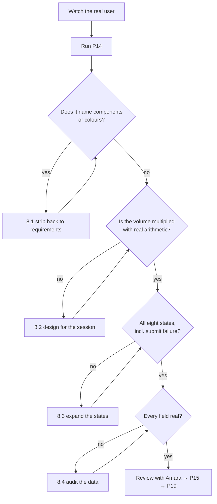

# P14 — UI/UX Design Brief

← [Previous](P13-design-the-data-contract.md) · [Library index](../README.md) · Next: [P15](../phase-3-planning/P15-implementation-plan.md)

> **One line:** Describe the user's actual working day so the screen fits it, before anyone opens a component library.

| | |
|---|---|
| **Phase** | 2 — Design |
| **Who runs it** | Frontend Engineer (Ji-woo Park), with the Product Owner (Amara Osei) |
| **When** | Sprint 1, day 5. The confidence gate spec and the data contract are done. NWD-108 is queued for Sprint 2. |
| **Takes in** | `artifacts/stories/NWD-108-exception-queue.md`, `artifacts/spec-confidence-gate.md` (the exception record shape), `artifacts/data-contract-counterparty-position.md`, `artifacts/adr/0003-one-failing-field-rejects-the-document.md`, and forty-five minutes of watching Priya work |
| **Produces** | `Case-Study/Python-ETL/artifacts/ui-brief-exception-queue.md` |
| **Hands off to** | Rahul running [P15 — Implementation Plan](../phase-3-planning/P15-implementation-plan.md), then Ji-woo building it in [P19](../phase-4-build/P19-build-the-ui-from-the-brief.md) |
| **Time to run** | A day. Forty-five minutes with Priya, forty minutes generating, the rest reviewing with Amara. |

---

## 1. The scene

Friday afternoon of Sprint 1. Ji-woo has the story — NWD-108, "Exception queue screen for analyst review" — and about four lines of detail. She has the exception record shape from the confidence gate spec. She has the data contract from this morning. She has, in other words, everything except any idea what the screen is for.

She could start building. React, a table, a detail panel, a form. Two days and it would demo fine.

Instead she asks Amara for twenty minutes with Priya Raman, the operations analyst at Northwind who is currently doing this job by hand, and gets forty-five. What she watches is not what she expected.

Priya starts at 07:30 because the reconciliation run kicks off at 10:00 and everything has to be in before then. She works from a spreadsheet, a folder of PDFs, and a second monitor. She does about forty documents in that window. Not carefully, one at a time, savouring each — she goes fast, because forty documents in two and a half hours is under four minutes each including the ones that need a phone call.

Two things stand out and neither would have occurred to Ji-woo at a desk.

Priya almost never uses her mouse. She has the spreadsheet's keyboard shortcuts in her fingers and when she has to reach for the mouse she visibly slows down. And when she opens a PDF, the first thing she does is scroll to find the page with the table on it, every single time, because the viewer opens at page one and the positions are usually on page two or three.

Ji-woo does the arithmetic on the way back. One scroll per document, forty documents, five seconds each: three and a half minutes a morning, spent scrolling. **Every extra click costs Priya forty clicks, and a design brief that does not know that will produce a screen that demos beautifully and is hated by 08:15.**

She opens a session and runs this prompt.

---

## 2. What this prompt actually does — in plain language

### What a design brief is

A **design brief** is a written description of what a screen must let someone do, and under what conditions, written before anyone designs the screen.

It is not a picture. It is not a wireframe. It contains no colours, no fonts, and no component names. What it contains is:

- **Who** uses it, and what their day actually looks like
- **The job** they are trying to get done — in their words, not the system's
- **The volume and the rhythm** — how many, how often, under what time pressure
- **What must be on screen** and what must be one action away
- **Every state** the screen can be in, including the ugly ones
- **What "good" means**, as a number somebody could measure
- **What is deliberately out of scope**

The word "brief" is doing work. It is short, and it briefs somebody — it is written *to* the person who will build the thing, to give them what they need before they start.

### Brief, spec, wireframe — three different things

This library now has three design artifacts that people confuse, so here they are side by side.

| | Answers | Written by | Contains |
|---|---|---|---|
| **Spec** ([P11](P11-write-the-technical-spec.md)) | What does the system do? | Sofia | Rules, interfaces, given/when/then, error codes |
| **Brief** (this file) | What must the user be able to do, and under what conditions? | Ji-woo + Amara | The user's day, the job, the states, the constraints, the success measure |
| **Wireframe / mockup** | What does it look like? | Whoever designs it | Layout, hierarchy, actual pixels |

The order matters and it is frequently reversed. A wireframe drawn before a brief is a guess about the user's day that everyone then treats as a requirement, because a picture is very persuasive and very hard to argue with. Once there is a screenshot in the ticket, the conversation is about button placement rather than about whether the workflow fits the morning.

**Write the brief first, and the wireframe becomes a proposal that can be wrong. Draw the wireframe first, and the brief becomes a description of the wireframe.**

### "Job to be done", in plain terms

A useful way to state what a screen is for: describe the job the user is hiring it to do, in their language.

Not: "the exception queue displays rejected documents and allows field-level correction."
But: "when a statement gets kicked back, I need to see what the machine wasn't sure about, check it against the PDF, fix it, and get to the next one — before ten o'clock."

The second version contains a deadline, a comparison task, and an implied volume. The first contains a component list. Only one of them tells you that the PDF and the fields must be visible at the same time.

The format that works, and the one the prompt asks for:

> **When** [situation], **I want to** [motivation], **so I can** [expected outcome].

> **When** a document lands in my queue, **I want to** see the failing field next to the page it came from, **so I can** decide in seconds whether it is a scan problem or a real discrepancy.

### Why the working day is the whole point

This is the teaching point of the file, so it gets its own treatment.

Most UI briefs describe a screen in isolation: here is the list, here is the detail view, here are the fields. That description is not wrong. It is just missing the multiplier.

Priya does forty of these in a morning. So:

| Design choice | Cost per document | Cost per morning |
|---|---|---|
| PDF opens at page 1, positions are on page 2 | one scroll, ~5s | 3m 20s |
| Confirming requires a mouse click on a button | hand leaves keyboard, ~2s | 1m 20s |
| Passing fields shown identically to failing ones | ~8s of visual search | 5m 20s |
| A confirmation dialog on submit | ~2s plus a decision | 1m 20s + irritation |
| Queue does not auto-advance to the next item | ~4s | 2m 40s |

Add those up and you have thirteen minutes and forty seconds of a two-and-a-half-hour window, spent on nothing. That is ten percent of the job, invented by five decisions each of which is individually defensible.

**A design brief's real job is to carry the multiplier into the room where the decisions get made.** Anybody looking at a single-document mockup will approve the confirmation dialog, because in isolation a confirmation dialog is obviously good practice. The brief is what says: forty times, before ten o'clock.

### The states nobody writes down

A screen is not one screen. It is a set of states, and the ones that get skipped are the ones users actually hit.

| State | The question | Why it gets skipped |
|---|---|---|
| **Loading** | What is on screen while data arrives? | The developer's machine is fast |
| **Empty** | Nothing in the queue — what then? | Never happens in test data |
| **Error** | The API failed. What can the user still do? | Requires deciding what is recoverable |
| **Partial** | Some data loaded, some did not | Requires deciding what is usable alone |
| **Stale** | Someone else already handled this item | Only happens with two users |
| **Submit failure** | Their edits are in the form and the save failed | The most damaging one, and the least designed |

The last one deserves the emphasis. Priya types a corrected quantity, presses submit, the network drops. If the screen clears the form, she has lost work and she will not trust the screen again. That behaviour is a design decision and it will be made by whoever writes the submit handler unless the brief makes it.

Empty is worth a word too, because at Northwind it is *good news*. An empty exception queue means every document went straight through. The screen should say so, plainly, rather than showing a sad grey box that reads like something is broken.

### Keyboard-first is a requirement, not a nicety

Ji-woo watched Priya avoid the mouse. That observation converts directly into a requirement, and it is worth understanding why it is more than a preference.

A mouse action requires the user to *look*, locate a target, move, and click. A keyboard action requires none of that once it is in muscle memory. For a task done forty times a morning, every day, muscle memory is the dominant factor — the difference between a fast worker and a slow one is almost entirely how much of the task has stopped requiring attention.

So the brief specifies a keyboard model: move through the queue, open an item, move between fields, submit, skip, undo. Every one of those, without the mouse. Not as an accessibility checkbox — as the primary path, with the mouse as the alternative.

Which brings a bonus. A screen that is genuinely keyboard-complete is most of the way to being usable with a screen reader, because both depend on a sensible focus order and on every control being reachable and labelled.

### Accessibility, stated plainly

Two things belong in every brief and they are cheap to specify and expensive to retrofit.

**Never signal with colour alone.** A red border on a failing field is fine as reinforcement. It cannot be the only signal, because roughly one in twelve men has some form of colour vision deficiency, and because a red border means nothing on a printout or a screenshot pasted into an email. Colour plus an icon plus text.

**Everything reachable and labelled.** Focus order follows reading order. Focus is visible. Every input has a label a screen reader will read. Every error is associated with its field, not floating at the top of the form.

That is the floor, and it fits in five lines of a brief.

### What the brief must NOT contain

Just as important, because briefs sprawl into design.

- **No component names.** "A modal with a data grid" is a solution. The brief says what must be true; the wireframe proposes how.
- **No visual design.** Colours, spacing, typography, brand — later, and by someone whose job that is.
- **No API design.** The brief may say a field must display its threshold; whether that comes from one endpoint or two is [P15](../phase-3-planning/P15-implementation-plan.md)'s problem.
- **No business justification.** Why Northwind wants T+1 lives in the PRD.

A useful test for each line: **could this be true of a good design that looked completely different from the one in my head?** If yes, it is a brief. If no, it is a mockup in prose.

### Why the prompt is shaped the way it is

Five deliberate ordering choices in §3.

1. **The user's day comes first, before any mention of the screen.** Written the other way round, the day becomes a justification for a layout already imagined.
2. **Volume and the interaction budget are their own required section.** Without a number, "efficient" is an adjective.
3. **States are a required table with a minimum count.** Otherwise you get the happy path and a loading spinner.
4. **A required "what this must not do" section.** Screens grow. Naming the non-goals on day one is the only thing that reliably stops it.
5. **Success stated as a measurable number.** "Priya can clear a document in under 45 seconds median" is checkable in [P22](../phase-5-verify/P22-e2e-test-the-application.md). "Intuitive" is not checkable by anyone, ever.

### The one thing to remember

**Design the morning, not the screen.** The screen is what falls out of understanding the morning. Ji-woo's brief works because forty-five minutes of watching produced two facts — Priya avoids the mouse, and the positions are never on page one — and both facts turn into requirements that would never have surfaced from the story.

---

## 3. The prompt

Run this after watching the real user, not before. If you have not watched anyone, say so in the prompt — the output will be honest about what it is guessing.

```text
You are a **product designer** writing a UI/UX design brief. A brief describes what a user must be
able to do and under what conditions. It is not a wireframe, it names no components, and it specifies
no visual design.

**Read these first and summarise each in one line:**
[ARTIFACTS TO READ]

**The screen:**
[SCREEN NAME AND ONE-LINE PURPOSE]

**The user — everything I observed, including the small things:**
[THE USER AND THEIR DAY]

**Volume and rhythm:**
[VOLUME AND TIMING]

**The data available to this screen (do not invent fields beyond these):**
[AVAILABLE DATA]

**Constraints that cannot be traded away:**
[CONSTRAINTS]

**Write the brief with exactly these sections:**

## 1. The user and their day
Who they are, when they do this, what else is happening around it, what they are measured on, and
what they currently do instead. Write it as a narrative of a real morning, not a persona card. If I
have not given you an observation, do not invent one — write "NOT OBSERVED" and list it in Open
questions.

## 2. The job to be done
One primary job in the form: **When** [situation], **I want to** [motivation], **so I can**
[outcome]. Then at most three secondary jobs in the same form. Use the user's language, not the
system's.

## 3. Volume and the interaction budget
State the volume. Then give a table: for each interaction the user performs per item, the cost per
item and the cost across a full session. Include at least five plausible design choices and what each
one costs at this volume — this table is the reason the brief exists, so make it concrete.
Then state the **interaction budget**: the maximum number of actions to complete one item, and the
target median time.

## 4. What must be on screen
Three lists:
- **Always visible** — and why, tied to a step in the job
- **One action away** — and which action
- **Available but not surfaced** — findable, not in the way
For each entry, name the field from the available data. Do not name any field I did not give you.

## 5. Layout intent
Describe the spatial relationships that matter and why — what must be side by side, what must be
above what, what must not move as the user works. Use plain description or a simple ASCII sketch.
**No component names, no pixel sizes, no colours.** This section says what must be true, not what it
looks like.

## 6. Interaction model
The complete keyboard path through the primary job, key by key. Then the mouse path. Then: what
happens on submit, what happens on skip, what happens when the user changes their mind. State
explicitly whether the screen advances automatically to the next item.

## 7. States
A table: State | What the user sees | What they can do | How they get out.
Cover at least: loading, empty, error on load, partial data, item already handled by someone else,
submit in flight, submit failed, and success. For submit-failed, state explicitly what happens to the
user's unsaved input.

## 8. Accessibility requirements
The floor, stated concretely: keyboard completeness, focus order and visibility, labelling, and the
rule that no state is signalled by colour alone. Name the specific signals used instead.

## 9. Success measures
Three to five, each a number someone could measure after launch. At least one must be about speed at
volume and at least one about errors or rework.

## 10. Out of scope
What this screen deliberately does not do, and where each excluded thing is handled instead. Include
at least three items. This list exists to be quoted back at people in Sprint 3.

## 11. Open questions
Everything you could not determine from what I gave you, each with a named person. Every assumption
prefixed ASSUMED, with who must confirm it.

**Do not:**
- Do not name UI components, libraries, or patterns — no "modal", "data grid", "accordion", "toast".
  Describe the requirement, not the solution.
- Do not specify colours, fonts, spacing, or brand.
- Do not invent user behaviour I did not observe. Mark it NOT OBSERVED and ask.
- Do not invent data fields. Use only the fields I listed.
- Do not describe only the happy path. Section 7 is not optional.
- Do not use the words intuitive, clean, modern, user-friendly, or delightful. They are unmeasurable.
- Do not include business justification for the project.

**You are done when:** section 3 contains a volume table with real arithmetic, section 7 covers all
eight states including submit-failure, every field named in section 4 exists in the data I gave you,
every success measure in section 9 is a number, and section 11 is non-empty.

Save to [OUTPUT PATH].
```

---

## 4. Every placeholder, explained

| Placeholder | What to put in it | Northwind example | What happens if you get it wrong |
|---|---|---|---|
| `[ARTIFACTS TO READ]` | The story, the spec section defining the data this screen shows, the data contract, and any ADR that shapes the workflow | `artifacts/stories/NWD-108-exception-queue.md`, `artifacts/spec-confidence-gate.md` §5, `artifacts/data-contract-counterparty-position.md`, `artifacts/adr/0003-one-failing-field-rejects-the-document.md` | Without ADR-0003 the brief designs a per-row correction screen, which contradicts the architecture. Whole-document review is not a UI choice. |
| `[SCREEN NAME AND ONE-LINE PURPOSE]` | The name and what one use of it accomplishes | "Exception queue — where an analyst reviews a document the rules engine rejected, corrects the failing fields, and releases it" | Vague purpose produces a dashboard. Dashboards are what you get when nobody said what the screen is for. |
| `[THE USER AND THEIR DAY]` | Everything you observed, including things that seem irrelevant. The small observations are the valuable ones | Priya, ops analyst, London. Starts 07:30, recon at 10:00, ~40 documents. Avoids the mouse. Scrolls every PDF to find the table. Two monitors. Phones the broker maybe twice a morning | This is the whole prompt. Give it a persona card and you get a persona-card brief. Give it "she scrolls every PDF" and you get a requirement worth three minutes a day. |
| `[VOLUME AND TIMING]` | How many, in what window, and the worst case | ~40 a morning in a 2.5-hour window; month-end spikes past 100; must be clear before the 10:00 reconciliation run | Without volume, section 3 is empty and the brief loses its main argument. |
| `[AVAILABLE DATA]` | The actual fields the screen can show, from the spec and contract | `FAILING_FIELD`, `FIELD_CONFIDENCE`, `THRESHOLD_APPLIED`, `REASON_CODE`, `SOURCE_PAGE`, `BRONZE_PATH`, `CONTENT_HASH`, `COUNTERPARTY_ID`, `MIN_CONFIDENCE`, plus all extracted field values | Omit it and the brief will ask for a field that does not exist, which becomes a backend story nobody planned. |
| `[CONSTRAINTS]` | Non-negotiables from architecture and environment | Whole-document accept or reject (ADR-0003) · corrections are audited and attributed · the PDF is in blob storage and must open at `SOURCE_PAGE` · desktop only, dual monitor, Chrome · English UI even for Spanish documents | Unstated constraints get discovered in build. "Corrections must be attributed" changes the submit flow, and finding that out in Sprint 2 costs a day. |
| `[OUTPUT PATH]` | The exact repo path | `Case-Study/Python-ETL/artifacts/ui-brief-exception-queue.md` | A brief in a chat window cannot be quoted back at anyone in Sprint 3, which is half its purpose. |

---

## 5. The filled-in example

Ji-woo runs this on Friday at 16:10, straight after getting back from Northwind, with her notes still open.

```text
You are a **product designer** writing a UI/UX design brief. A brief describes what a user must be
able to do and under what conditions. It is not a wireframe, it names no components, and it specifies
no visual design.

**Read these first and summarise each in one line:**
1. artifacts/stories/NWD-108-exception-queue.md
2. artifacts/spec-confidence-gate.md — section 5, the exception record columns
3. artifacts/data-contract-counterparty-position.md
4. artifacts/adr/0003-one-failing-field-rejects-the-document.md

**The screen:**
Exception queue — where a Northwind operations analyst reviews a counterparty document that the rules
engine rejected, sees which field failed and why, corrects it against the source PDF, and releases
the document for loading.

**The user — everything I observed, including the small things:**
Priya Raman, operations analyst at Northwind, London office. I watched her for 45 minutes on
Thursday morning.
- She starts at 07:30. The reconciliation run is at 10:00 and everything must be in before it.
- She works through about 40 documents in that window. Some take 20 seconds, a few need a phone call
  to the broker and take ten minutes.
- She barely touches the mouse. She has the spreadsheet shortcuts in her fingers and visibly slows
  down when she has to reach for it.
- Every time she opens a PDF she scrolls to find the positions table. It is almost never on page 1.
- Two monitors. PDF on the left, spreadsheet on the right, always in that arrangement.
- She reads the number off the PDF and types it, then reads it back once to check. She does this
  every time, without exception.
- When something looks wrong she does not guess. She flags it and phones the broker. She said the
  thing she hates most is "finding out at 4pm that a number I typed at 8am was wrong."
- She keeps a paper notepad for brokers she is waiting to hear back from.
- NOT OBSERVED: what she does at month-end when volume doubles. She mentioned it, I did not see it.

**Volume and rhythm:**
~40 documents a morning in a 2.5-hour window, so roughly 3.5 minutes each including the slow ones.
Month-end spikes past 100. Hard deadline at 10:00 when reconciliation runs. Currently she is the only
person doing this; a second analyst covers her leave.

**The data available to this screen (do not invent fields beyond these):**
From the exception record: EXCEPTION_ID, CONTENT_HASH, BRONZE_PATH, COUNTERPARTY_ID, FAILING_FIELD,
FIELD_CONFIDENCE, THRESHOLD_APPLIED, REASON_CODE (one of BELOW_THRESHOLD, FIELD_MISSING,
CONFIDENCE_ABSENT, CLASSIFIER_BELOW_THRESHOLD, NO_FIELDS_RETURNED), SOURCE_PAGE, CREATED_AT_UTC.
From the extraction: every extracted field with its value, its confidence, and its page.
From the data contract: MIN_CONFIDENCE, AS_OF_DATE, ACCOUNT_ID, BOOK, SECURITY_ID, SECURITY_NAME,
QUANTITY, PRICE, MARKET_VALUE, CURRENCY.
The source PDF itself is in blob storage and can be rendered.

**Constraints that cannot be traded away:**
- A document is accepted or rejected as a whole (ADR-0003). There is no per-row release.
- Every correction is attributed to the user and audited — who changed what, from what, to what, when.
- The PDF must be openable at the page the failing field came from (SOURCE_PAGE).
- Desktop only, dual monitor, Chrome. No mobile, no tablet.
- The UI is in English even when the source document is Spanish or Portuguese.
- A corrected value is trusted; it is not re-gated against the confidence thresholds.

**Write the brief with exactly these sections:**
[sections 1–11 exactly as in the template above]

**Do not:**
[the Do-not block exactly as in the template above]

**You are done when:** section 3 contains a volume table with real arithmetic, section 7 covers all
eight states including submit-failure, every field named in section 4 exists in the data I gave you,
every success measure in section 9 is a number, and section 11 is non-empty.

Save to Case-Study/Python-ETL/artifacts/ui-brief-exception-queue.md.
```

---

## 6. What comes back

Sections 1–7 and 9–11 in full; section 8 lightly trimmed.

```markdown
# UI Brief — Exception Queue (NWD-108)

**Author:** Ji-woo Park · **Reviewed by:** Amara Osei · **Date:** 2024-03-13
**Related:** NWD-108 · ADR-0003 · `spec-confidence-gate.md` §5 · `data-contract-counterparty-position.md`

## 1. The user and their day

Priya Raman is an operations analyst at Northwind, London office. She is at her desk at 07:30 because
the reconciliation run starts at 10:00 and anything not cleared by then shows up as a break, and a
break is a phone call from the front office.

She works through roughly forty counterparty documents in that window. Most are quick — a number is
smudged, she reads it off the PDF, types it, moves on. A handful are not: a security she does not
recognise, a quantity that disagrees with what she expects, a statement that arrived in Spanish.
Those get a phone call to the broker and go on a paper notepad on her desk while she waits.

She works almost entirely from the keyboard. She has the spreadsheet's shortcuts in her fingers and
when she reaches for the mouse she slows down visibly. Her two monitors are always arranged the same
way: the PDF on the left, what she is typing into on the right. She never varies it.

Every time she opens a PDF she scrolls to find the positions table, because it is almost never on the
first page. She does this forty times a morning.

When she types a number, she reads it back once against the PDF before moving on. Every time, without
being asked. What she said she hates most is "finding out at 4pm that a number I typed at 8am was
wrong" — she is not optimising for speed at the cost of certainty, and a screen that pushes her to go
faster than she can verify will be rejected, not adopted.

**NOT OBSERVED:** her month-end workflow, when volume roughly doubles. She mentioned it. See Open
questions.

## 2. The job to be done

**Primary**
**When** a document is rejected and lands in my queue, **I want to** see exactly which field the
machine was unsure about and the part of the page it came from, **so I can** decide in seconds
whether it is a scan problem I can fix or a real discrepancy I need to call the broker about.

**Secondary**
- **When** I have fixed the field, **I want to** release the whole document and land on the next one
  without touching the mouse, **so I can** hold a rhythm.
- **When** I cannot resolve something now, **I want to** park it with a note and come back,
  **so I can** stop keeping a paper list.
- **When** I finish, **I want to** know the queue is genuinely empty rather than still loading,
  **so I can** stop worrying about the 10:00 run.

## 3. Volume and the interaction budget

**Volume:** ~40 documents in a 2.5-hour window on a normal day. 100+ at month-end. Hard stop at 10:00.

Every interaction is multiplied by forty. This table is the argument for every decision below.

| Design choice | Cost per document | Cost per morning (×40) |
|---|---|---|
| PDF opens at page 1 instead of `SOURCE_PAGE` | ~5s of scrolling | **3m 20s** |
| Submit requires a mouse click | ~2s, plus losing keyboard position | **1m 20s** |
| Failing fields not visually distinct from passing ones | ~8s of visual search | **5m 20s** |
| A confirmation dialog before submit | ~2s and a decision | **1m 20s** |
| Queue does not auto-advance after submit | ~4s | **2m 40s** |
| Confidence shown as `0.8234567` instead of `82%` | ~1s of parsing, every field | **~2m** |
| PDF and fields on separate tabs rather than side by side | ~6s per switch, ~2 switches | **8m** |

Everything in that right-hand column is time removed from a two-and-a-half-hour window by a decision
that looks harmless when you are looking at one document.

**Interaction budget:** a document with one failing numeric field must be resolvable in **six
keystrokes or fewer** and **zero mouse actions**. Target median time to clear one straightforward
exception: **under 45 seconds**, measured from the item appearing to the next item being on screen.

## 4. What must be on screen

**Always visible**
| What | Why |
|---|---|
| The source PDF, open at `SOURCE_PAGE` | She verifies every number against it. This is the job, not a reference |
| `FAILING_FIELD` — name, current value, editable | The thing she is here to fix |
| `FIELD_CONFIDENCE` and `THRESHOLD_APPLIED`, together | "0.91, needed 0.92" tells her it is a marginal scan. "0.31, needed 0.90" tells her to look properly. The bar is as informative as the score |
| `REASON_CODE`, in plain English | `FIELD_MISSING` and `BELOW_THRESHOLD` need completely different actions from her |
| `COUNTERPARTY_ID` and `AS_OF_DATE` | Orientation. She works across counterparties and dates in one session |
| Position in the queue — "7 of 34" | She is working against a clock and needs to know if she will make 10:00 |

**One action away**
| What | Which action |
|---|---|
| All other extracted fields with their values and confidences | One key. She sometimes wants to sanity-check a field that passed |
| Other pages of the PDF | Page keys. Some documents need cross-page checking |
| Park with a note | One key. Replaces the paper notepad |
| The document's history — who touched it before, and when | One key. Only matters when a second analyst is covering |

**Available but not surfaced**
`CONTENT_HASH`, `BRONZE_PATH`, `EXCEPTION_ID`, `MIN_CONFIDENCE` for the whole document. She does not
need these to do the job, but when she phones Kestrel about something odd, being able to read out an
identifier turns a twenty-minute conversation into a two-minute one.

## 5. Layout intent

What must be true, spatially:

```
+---------------------------+---------------------------------+
|                           |  Counterparty · date · 7 of 34  |
|                           +---------------------------------+
|      SOURCE PDF           |  FAILING FIELD                  |
|      opened at            |    name                         |
|      SOURCE_PAGE          |    [ editable value ]           |
|                           |    0.91 — needed 0.92           |
|                           |    reason, in plain English     |
|                           +---------------------------------+
|                           |  other fields (collapsed)       |
|                           +---------------------------------+
|                           |  submit · park · skip           |
+---------------------------+---------------------------------+
```

- The PDF and the field being corrected are **side by side and both fully visible at once**. She
  compares them continuously; anything requiring a tab switch or a scroll to see both fails the job.
- PDF on the **left**, input on the **right**. This is the arrangement she already uses and has
  muscle memory for. Reversing it would be defensible in the abstract and wrong in practice.
- The failing field sits at a **fixed position** and does not move between documents. Her eyes should
  land in the right place before the page has finished rendering.
- Passing fields are present but **visually quieter** and collapsed by default, so the failing field
  is found without searching.
- The action row does not move and does not reflow when a field grows.

No component names, no sizes, no colours — those are the wireframe's job.

## 6. Interaction model

**Keyboard path — the primary path, no mouse anywhere**

| Key | Action |
|---|---|
| `j` / `k` | Next / previous item in the queue |
| `Enter` | Open the highlighted item |
| `Tab` | Move to the next failing field (not every field — only the ones that failed) |
| type | Edit the value; the field is focused on open, so she can type immediately |
| `Ctrl+Enter` | Submit and advance to the next item |
| `p` | Park with a note; a note field takes focus, `Ctrl+Enter` saves and advances |
| `s` | Skip without changes and advance |
| `e` | Expand or collapse the passing fields |
| `[` / `]` | Previous / next PDF page |
| `Ctrl+Z` | Undo the last edit in this item, before submit |
| `Esc` | Return to the queue list without saving |

The failing field is focused when an item opens. **The most common document in the queue — one
numeric field below threshold — is: `Enter`, type the value, `Ctrl+Enter`. Three actions.**

**Mouse path:** everything above is also clickable. The mouse is the alternative, not the default.

**On submit:** the whole document is released (ADR-0003 — accept or reject as a unit). The correction
is written with the user, the old value, the new value and a UTC timestamp. The screen **advances
automatically** to the next item. There is **no confirmation dialog** — `Ctrl+Z` before submit and a
five-second undo after it cover the mistake case at a fraction of the cost.

**On park:** the item leaves the active queue with a note and a "waiting" marker, and appears in a
separate parked list. It does not count against the 10:00 deadline.

**On skip:** no changes are written; the item stays in the queue.

## 7. States

| State | What the user sees | What she can do | How she gets out |
|---|---|---|---|
| **Loading queue** | Count and skeleton rows; the keyboard shortcuts are already live | Nothing yet | Resolves in under 1s or shows progress |
| **Empty queue** | "Nothing to review — every document today went straight through," with today's count. This is **good news** and must read as good news | Nothing needed | Refresh, or leave |
| **Error on load** | What failed, in plain English, plus a retry. The last known queue count if we have it | Retry; contact support with the trace id shown | Retry succeeds, or she calls |
| **Partial data — PDF will not render** | The fields and the correction form still work; the PDF pane shows the failure and a direct download link | She can still correct **if** she is confident; the form warns that she cannot verify against the source | Download the PDF, or park |
| **Item already handled** | "Handled by [name] at [time]" and it is removed from the queue | Move to the next item; view what was changed | Automatic advance |
| **Submit in flight** | The action row shows in-progress; the form is **not** cleared and remains readable | Wait; nothing is lost if she navigates away | Resolves to success or failure |
| **Submit failed** | The error, and **her edits are still in the form, unchanged**. Retry is one key | Retry, or copy the value out, or park | Retry succeeds; nothing is ever silently discarded |
| **Success** | Brief confirmation; auto-advance to the next item; a 5-second undo is available | Continue, or undo | Automatic |

**Submit-failure is the state that decides whether she trusts this screen.** Losing typed input once
is enough for her to start keeping a parallel spreadsheet, and then we have added a step rather than
removed one.

## 8. Accessibility requirements

- Every action in section 6 is reachable by keyboard. Nothing is mouse-only.
- Focus order follows reading order: queue position, failing field, other fields, actions. Focus is
  always visible, with a clear indicator that survives a busy background.
- **No state is signalled by colour alone.** A failing field carries an icon, the literal text
  "below threshold", and the numbers "0.91 — needed 0.92". Colour reinforces; it never carries the
  message on its own.
- Every input has a programmatic label. Errors are associated with their field, not floated at the
  top of the form.
- Confidence is rendered as a **percentage** — "91%" — not a raw decimal. `0.8234567` is not a number
  a person reads at speed, and she reads forty of them a morning.
- The PDF pane exposes a text alternative where the document has an embedded text layer.

## 9. Success measures

| Measure | Target | How measured |
|---|---|---|
| Median time to clear a single-field exception | **under 45 seconds** | Timestamp from item opened to next item opened |
| Mouse actions on the primary path | **zero** | Observed session, one week after launch |
| Corrections later found to be wrong | **under 1%** of corrections | Downstream break analysis, monthly |
| Documents parked because the screen could not show what she needed | **under 5%** | Park reason codes |
| Queue cleared before 10:00 | **every business day** in the first month | Timestamp of the last cleared item |

## 10. Out of scope

| Not doing | Where it is handled instead |
|---|---|
| Bulk-editing several documents at once | Every correction is verified against its own PDF. Bulk editing removes the verification, which is the point of the screen. Revisit only if month-end volume proves unmanageable |
| Editing the extraction model or thresholds | `config/sources.yaml`, changed by Kestrel — see `spec-confidence-gate.md` |
| Any analytics or trend dashboard | Straight-through rate reporting is a separate story, not yet written |
| Re-running extraction from the screen | Pipeline concern. Reprocessing is done from bronze — see ADR-0002 |
| Mobile or tablet layouts | Desktop dual-monitor only, per constraints |
| Translating the UI | English UI even for Spanish and Portuguese documents, per constraints |

## 11. Open questions

- **Amara** — at month-end, volume roughly doubles and a second analyst covers. Do two people work
  the same queue simultaneously? If so, item locking becomes a v1 requirement, not a v2 one, and the
  "already handled" state gets much more common.
- **Amara / Priya** — is the parked list Priya's alone, or shared? Her paper notepad is private today
  and making it visible changes the social dynamic of chasing a broker.
- **Sofia** — a document rejected on `CLASSIFIER_BELOW_THRESHOLD` has no extracted fields at all. Her
  action is picking a counterparty, not fixing a number. That is a genuinely different screen.
  ASSUMED: out of scope for v1, those go to a separate holding list. Confirm.
- **Tomas** — can the PDF be rendered directly from blob storage with the user's identity, or does it
  need a signed URL through the API? Changes the load path and possibly the perceived speed.
- **Ji-woo** — NOT OBSERVED: the month-end workflow. I should watch one before we build the parked
  list, because that is when it matters most and I am currently designing it from a description.
```

### How to read this

**Section 3 is the reason the document exists.** The right-hand column — three minutes twenty, five minutes twenty, eight minutes — is what makes a design conversation short. Nobody argues with "the PDF should open at the right page" once they have seen it cost three and a half minutes a morning. Take that table out and the brief becomes a set of opinions.

**Section 6's three-keystroke path is the design in one line.** `Enter`, type, `Ctrl+Enter`. If a proposed wireframe cannot do that, it is wrong, regardless of how it looks. That is a usefully brutal test to have written down before anyone draws anything.

**Section 7's submit-failure row is the most important row in the brief.** "Her edits are still in the form, unchanged." That behaviour will not happen by accident — the default in most form implementations is to clear or re-fetch — and it is the difference between a tool she trusts and a tool she keeps a spreadsheet alongside.

**Section 8 quietly kills a bug before it is written.** "Confidence is rendered as a percentage, not a raw decimal." That is bug **NWD-139** — the exception queue showing `0.8234567` — specified out of existence in Sprint 1. It still happens, because the brief said it and the implementation missed it, which is its own lesson: a brief prevents nothing on its own, it just makes the bug a one-line fix with an obvious right answer instead of a design discussion.

**And the part that is commonly wrong:** the `NOT OBSERVED` marker on the month-end workflow, and the open question that follows it. That is honest and it is also a gap. Ji-woo is designing the parked list — a feature that matters most under exactly the conditions she has not watched — from a sentence Priya said in passing. She flagged it. Whether anyone acts on it before Sprint 2 is the difference between a good brief and a good outcome.

---

## 7. Why this is the final prompt

**What "done" means here.** Someone could draw three genuinely different wireframes from this brief and you could tell which of them are wrong, without discussing taste. That is the test. A brief that permits any layout is too vague; a brief that permits only one is a mockup in prose.

The practical version: hand it to Rahul for [P15](../phase-3-planning/P15-implementation-plan.md) and see whether he can size the work. If he cannot, something in sections 4, 6 or 7 is missing.

### The checklist

- [ ] Section 1 is a narrative of a real observed morning, with anything unobserved marked `NOT OBSERVED`.
- [ ] Section 3 contains the volume multiplication with actual arithmetic, not an assertion that efficiency matters.
- [ ] Every field named in section 4 exists in the data you supplied. No inventions.
- [ ] Section 6 gives a complete keyboard path with no mouse action on the primary flow.
- [ ] Section 7 covers all eight states, and submit-failure explicitly says what happens to unsaved input.
- [ ] Every success measure in section 9 is a number with a stated way of measuring it.
- [ ] Section 10 has at least three out-of-scope items, each with a home.
- [ ] No component names, no colours, no fonts, and none of the banned adjectives.

### Why you should stop rather than keep prompting

Two failure modes, both of which feel like diligence.

**The brief drifts into design.** One more pass and you get a suggested layout, then component recommendations, then a colour treatment for the confidence indicator. Every addition narrows what the wireframe stage can explore, and the wireframe stage is where the good ideas come from. A brief that has already decided is not a brief.

**The brief grows features.** Priya mentioned a paper notepad, so add a notes feature. She works across counterparties, so add a filter. She has a deadline, so add a countdown. Each is plausible. Together they turn a screen with one job into a workspace, and the interaction budget in section 3 quietly becomes unachievable.

Once the checklist passes, the remaining uncertainty is not in the writing. It is in the open questions, and those are answered by talking to Amara and by watching one month-end — not by another generation.

### The signal that you are NOT done

You cannot say what happens when the save fails while her corrected value is in the box. If that is unanswered, the brief describes a demo, not a tool, and §8 is next.

---

## 8. When it is not done — the follow-up prompts

| What you're seeing | What's actually wrong | Run this next |
|---|---|---|
| A list of components: table, modal, form, toast | It designed a screen instead of describing a job | **§8.1** below |
| One user journey, described once, all going well | It ignored volume. This is the classic failure | **§8.2** below |
| No empty state, no error state, no submit failure | Only the happy path was designed | **§8.3** below |
| It shows fields your API does not return | Invented data. This becomes an unplanned backend story | **§8.4** below |
| The brief reads like a wireframe in words — positions, sizes, colours | It jumped to solution. The wireframe stage now has nothing left to decide | **§8.1** below |
| Success measures say "intuitive" and "efficient" | Unmeasurable. Nobody can verify it in [P22](../phase-5-verify/P22-e2e-test-the-application.md) | **§8.5** below |
| The brief is fine and you need a build sequence | Nothing is wrong — move on | **[P15](../phase-3-planning/P15-implementation-plan.md)** |
| The brief is fine and you are ready to build | Nothing is wrong — move on | **[P19](../phase-4-build/P19-build-the-ui-from-the-brief.md)** |
| The brief exposed a workflow decision worth freezing | You found an ADR | **[P12](P12-record-an-architecture-decision.md)** |

### 8.1 "It gave me a component inventory, not a brief"

Use this when the output names modals, grids, accordions or toasts.

```text
This is a solution, not a brief. Rewrite it.

Remove every UI component name — modal, dialog, grid, table, accordion, drawer, toast, card, tab,
sidebar, dropdown. Remove every layout measurement and every colour.

Replace each removed thing with the **requirement it was trying to satisfy**, in the form "the user
must be able to X while Y is visible" or "Z must not move when W changes".

Apply this test to each remaining line: **could a good design that looks completely different from
the one in my head still satisfy this?** If no, the line is a mockup, not a requirement — rewrite it
until the answer is yes.

Then check section 5. It should describe spatial relationships and why they matter — what must be
simultaneously visible, what must stay still, what must be adjacent — and nothing else.
```

What changes: the brief gets shorter and the wireframe stage gets its job back. Constraints survive; decisions do not.

### 8.2 "It designed for one item, not for forty"

Use this when section 3 is thin or the phrase "the user then clicks" appears without a multiplier.

```text
You designed a single interaction. This user does [N] of these in [WINDOW]. Rewrite section 3.

Build a table with at least seven rows. Each row is a plausible design choice, its cost per item in
seconds, and its cost across a full session at [N] items. Include, at minimum:
- an extra click on the primary path
- a confirmation dialog
- content not opening at the right position
- the target of the user's attention not being visually distinct
- no auto-advance after completing an item
- data displayed in a form that needs mental translation before it can be read
- anything requiring a context switch — a tab, a new window, a second application

Then state the **interaction budget**: the maximum number of actions for the most common case, and a
target median time.

Then answer this in one paragraph: **what is the single worst thing this screen could do to someone
doing it forty times before ten in the morning?** Design against that specifically.
```

What changes: the last paragraph reframes the whole brief. On the exception queue the answer was "lose a value she has already typed and verified", which is what made submit-failure the most carefully specified state in the document.

### 8.3 "It only designed the happy path"

Use this when section 7 has three rows and one of them is "loading".

```text
Expand section 7. Every state below is required, and each needs: what the user sees, what she can do,
and how she gets out.

- Loading, first time
- Loading, when data is already on screen from a previous item
- Empty — and say whether empty is good news or bad news here, because it changes the wording entirely
- Error on load, distinguishing "try again" from "this will not work, get help"
- Partial data: the main content loaded but a dependency did not. State what still works
- The item was already handled by someone else while she was looking at it
- Submit in flight
- **Submit failed** — state explicitly what happens to her unsaved input. If the answer is anything
  other than "it stays exactly as she left it", justify it
- Success, and whether it advances automatically
- Offline or network lost mid-session

Then answer: **in which of these states can the user lose work she has already done?** For each one,
say what prevents it.
```

What changes: the last question routinely finds one path where work is lost. It is the highest-value question in this entire file, because losing typed input once permanently changes how a person uses a tool.

### 8.4 "It invented fields"

Use this when the brief shows a "risk score" or a "similar documents" panel nobody built.

```text
List every piece of data this brief puts on screen. Mark each one:

- **AVAILABLE** — it is in the data I gave you (name the exact field)
- **DERIVABLE** — it can be computed from available fields (show the computation)
- **INVENTED** — it does not exist

For every INVENTED item: remove it from the brief and move it to Open questions as a request — "this
screen would be better with X; does it exist, and what would it cost?" — addressed to the backend
engineer by name.

For every DERIVABLE item, state where the derivation happens: in the API, or in the UI. That is a
real decision with a real cost and it should not be discovered during the build.

Invented data in a brief becomes an unplanned backend story in the middle of the sprint, which is how
a two-day screen becomes a five-day screen.
```

What changes: usually one or two things move to Open questions, and one turns out to be genuinely easy and worth adding on purpose.

### 8.5 "The success measures are adjectives"

Use this when section 9 says intuitive, clean, or efficient.

```text
Rewrite section 9. Every measure must be a number, with a stated way of collecting it.

Give me three to five. At least one must be about **speed at volume** (not speed once). At least one
must be about **errors or rework** — corrections that turned out wrong, items reopened, work
abandoned.

Banned: intuitive, clean, modern, user-friendly, delightful, seamless, efficient, easy, satisfying.
If a measure cannot be stated as a number, it is a hope, not a measure — delete it.

For each measure, add: how it is collected, who collects it, and when it is first checked after
launch. A measure nobody collects is decoration.
```

What changes: section 9 becomes something Ananya can verify in [P22](../phase-5-verify/P22-e2e-test-the-application.md) and Farhan can report in [P32](../phase-7-release/P32-release-readiness-check.md). "Median under 45 seconds" is a test. "Intuitive" is a conversation.

### The loop



---

## 9. How this goes wrong

### The brief is written without watching anyone

The most common failure and the most expensive, because everything downstream inherits it.

Without observation you get a persona: "Priya is an operations analyst who values accuracy and efficiency." That sentence is true of every analyst who has ever lived and it generates no requirements. What generates requirements is "she scrolls every PDF to find the table" and "she reads the number back once before moving on."

Neither of those is something anyone would say if you asked them to describe their job. You get them by sitting behind someone for forty-five minutes and noticing.

**The fix:** watch someone, even briefly, even over a video call with their screen shared. If you genuinely cannot, say so in the prompt and mark every behavioural claim `NOT OBSERVED`, so the guesses are visible rather than laundered into requirements.

### The brief becomes a wireframe in words

It starts reasonably and by section 5 it is specifying that the field panel is 400 pixels wide with the confidence indicator top-right in amber.

This happens because it feels more useful. Specific is better than vague, usually. Here it is not, because it forecloses the design stage — and the design stage is where somebody notices that putting the confidence *inside* the input field, rather than beside it, removes an eye movement forty times a morning.

**The fix:** §8.1's test. Could a completely different-looking design still satisfy this line? Constraints pass that test. Decisions do not.

### It designs for the demo, not for Tuesday

A demo has one document. It is a good document. Everything loads. The extraction is nearly right and the correction is a single digit.

Tuesday has forty documents, three of which have no extracted fields at all because the classifier failed, one of which is in Portuguese, and one of which is a scan of a fax. The screen must handle the fax without ceremony, because the fax is not an edge case at 08:30, it is a Tuesday.

**The fix:** the states table, and the specific instruction to say whether empty is good news. Northwind's empty state reads "every document today went straight through" precisely because a grey "no data" box would have made a *good* morning look like a broken screen.

### The brief is written and then nobody reads it during the build

The brief says confidence is displayed as a percentage. The implementation renders `0.8234567`. Ananya files NWD-139 in Sprint 3, it is fixed in one line, everyone moves on.

That is not a disaster and it is worth being honest about: a brief does not prevent the bug. What it does is make the bug boring. There is no discussion about what the right behaviour is, no design meeting, no opinion. The brief said percentage, the code said decimal, the code was wrong, one line.

**The fix:** treat the brief as an input to [P19](../phase-4-build/P19-build-the-ui-from-the-brief.md), not as a Sprint 1 formality, and pull section 9's measures into the story's acceptance criteria so they are checked rather than admired.

### You wrote a brief for a one-line change — the wrong-tool case

NWD-139 is the counter-example to this whole file. Confidence renders as `0.8234567` and should render as `82%`. There is no user research to do, no states to enumerate, no interaction budget. Writing a brief for it would take longer than the fix and would be a way of avoiding the fix.

The test: **does anyone disagree about what good looks like?** If the answer is obviously no, skip to the change. Briefs are for screens where the right answer depends on knowing something about the user that is not in the ticket.

**The fix:** briefs for new screens and for workflows, acceptance criteria for changes to existing ones.

---

## 10. The handoff

Rahul picks this up first, not Ji-woo. He runs [P15 — Implementation Plan](../phase-3-planning/P15-implementation-plan.md) across the whole of Sprint 2 and this brief is one of his inputs, because it changes the sequence: the exception queue depends on the exception records existing, which depends on the confidence gate (NWD-103) being built and writing rows. Section 4's field list is also a dependency check — every field Ji-woo needs must exist in the API before the screen can be built, and section 11's question about signed URLs for the PDF is a backend task nobody had written down.

Then Ji-woo builds it in [P19](../phase-4-build/P19-build-the-ui-from-the-brief.md), where the brief becomes the source of truth in exactly the way the spec is for Tomas. When she hits a decision the brief did not make — and she will — the discipline is the same one from [P11](P11-write-the-technical-spec.md): stop, get a line added, continue.

Ananya reads sections 7 and 9 and builds the E2E tests in [P22](../phase-5-verify/P22-e2e-test-the-application.md) from them. The states table is a test plan with the tests not yet written: eight states, eight scenarios, and the submit-failure one is the one she will run twice. Section 9's "median under 45 seconds" becomes a real measurement rather than an aspiration.

And Amara owns the out-of-scope list. Its purpose is to be quoted back — when somebody in Sprint 3 asks for bulk editing, the answer is a link and a sentence, not a discussion.

> **Artifact contract — `Case-Study/Python-ETL/artifacts/ui-brief-exception-queue.md`**
> Anyone reading this file can rely on finding:
> - A narrative of the user's real working day, with anything unobserved marked `NOT OBSERVED`
> - The job to be done in the user's own language, not the system's
> - The volume, and the cost of at least five design choices multiplied across a full session
> - An interaction budget: maximum actions for the common case, and a target median time
> - What must be always visible, one action away, and merely available — every item naming a real field
> - Spatial requirements with reasons, and no component names, sizes or colours
> - A complete keyboard path for the primary job with zero mouse actions
> - All eight states, with submit-failure explicitly stating what happens to unsaved input
> - Accessibility floor: keyboard completeness, focus order, labelling, and no colour-only signalling
> - Three to five success measures, each a number with a stated way of collecting it
> - At least three out-of-scope items, each with a home
> - Open questions with named people, and every assumption marked
>
> If any of those is missing, the artifact is not done — go back to §7.

---

## 11. In the case study

This closes [Chapter 3 — Sprint 1: Design](../../Case-Study/Python-ETL/03-sprint-1-design.md) and produces [`artifacts/ui-brief-exception-queue.md`](../../Case-Study/Python-ETL/artifacts/ui-brief-exception-queue.md). Ji-woo builds against it in [Chapter 6](../../Case-Study/Python-ETL/06-sprint-2-build-frontend.md).

The moment worth reading is Amara's review on the Monday. She reads section 3, gets to the row saying a confirmation dialog costs one minute twenty a morning, and pushes back — she wants a confirmation, because a wrong correction flows into the warehouse and the whole project exists to stop wrong numbers reaching the warehouse. It is a genuinely good objection and it is the same instinct that produced ADR-0003.

What resolves it is not the arithmetic. It is Priya's own sentence from section 1: she reads every number back against the PDF before moving on, every time, unprompted. She has already built her own verification step and it is better than a dialog, because it happens while she is looking at the source rather than after she has stopped. The design that wins is the five-second undo after submit — no interruption, full recovery — and it wins because the brief had recorded a small behaviour that nobody thought was important at the time.

The less flattering part of the chapter comes later. Section 8 of the brief says confidence renders as a percentage. Ji-woo builds it in Sprint 2 and it renders as `0.8234567`, because the value comes straight from the API and the formatter was never added. Ananya files **NWD-139** in Sprint 3. It is one line. Nobody argues about what the correct behaviour is, because it is written down — and that, rather than prevention, turns out to be what the brief actually bought.

Rahul's note in the retrospective: **a design artifact does not stop the bug, it stops the meeting about the bug.** On a five-defect sprint, that is most of the value.

---

← [Previous](P13-design-the-data-contract.md) · [Library index](../README.md) · Next: [P15](../phase-3-planning/P15-implementation-plan.md)
