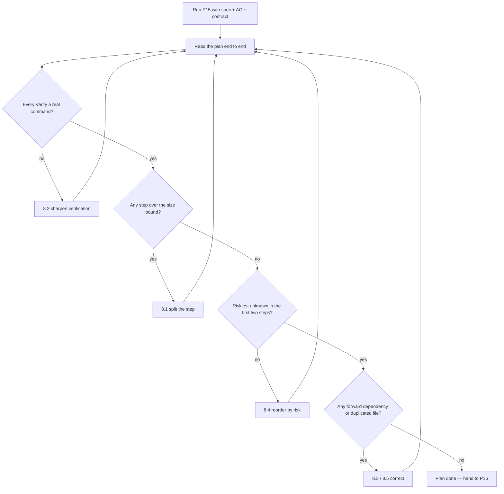

# P15 — Implementation Plan

← [Previous](../phase-2-design/P14-ui-ux-design-brief.md) · [Library index](../README.md) · Next: [P16](P16-sprint-plan-and-assignment.md)

> **One line:** Turn a signed-off spec into an ordered build sequence that never leaves the app broken.

| | |
|---|---|
| **Phase** | 3 — Planning |
| **Who runs it** | Team Lead (Rahul Nair) |
| **When** | The day after the spec, ADR and data contract are signed off; before anyone opens an editor |
| **Takes in** | `artifacts/spec-confidence-gate.md`, `artifacts/acceptance-criteria-NWD-103.md`, `artifacts/data-contract-counterparty-position.md`, `artifacts/adr/0002-*.md`, `artifacts/stories/NWD-103.md`, `artifacts/CLAUDE.md` |
| **Produces** | `artifacts/implementation-plan-NWD-103.md` |
| **Hands off to** | Project Manager (Farhan Qureshi), who runs [P16](P16-sprint-plan-and-assignment.md) |
| **Time to run** | 20 minutes to generate, 45 minutes of Rahul actually reading it |

---

## 1. The scene

Sprint 1 finished on a Thursday. By Friday morning Rahul Nair has four documents open on one screen and an empty editor on the other.

The documents are good. Sofia Marchetti's technical spec for the confidence gate says exactly what the gate must do. Amara Osei's acceptance criteria for NWD-103 say exactly when it counts as finished. The data contract from P13 says exactly what shape a position row has when it reaches Azure SQL. Ji-woo Park has her UI brief from [P14](../phase-2-design/P14-ui-ux-design-brief.md) and knows what the exception queue screen looks like.

What none of those documents say is **what to build first**.

Rahul has seen what happens when you skip this step, and he's seen it get worse since the team started building with AI. In the previous project someone pasted the spec into Claude and typed "implement this." Ninety seconds later there were nine new files, six hundred lines, three imports that didn't resolve, and a test suite that couldn't even collect because one module referenced a config key nobody had added yet. It took him two hours to find out that the actual logic was fine and the problem was a typo in a YAML path. Two hours, because there was no point in the whole thing where the code had ever run.

That is the failure this prompt exists to prevent. **The plan's job is not to describe the finished system — the spec already does that. The plan's job is to describe a path to the finished system where you can stop at any point and the thing still runs.**

So Rahul writes the sequence before anyone writes the code. And because the sequence itself is a piece of thinking that an AI is quite good at — dependency ordering, "what does this import need to exist first" — he uses a prompt for it, and then he reads every line of what comes back, because the sequence is the part he is personally accountable for.

---

## 2. What this prompt actually does — in plain language

### The thing we are producing

An **implementation plan** is an ordered list of steps that gets you from "nothing exists" to "the story is done."

That's it. It is not a design document. It does not re-explain what the confidence gate is or why the thresholds are what they are — the spec does that, and repeating it just creates two documents that can disagree with each other.

Each step in the plan answers four questions and nothing else:

1. **What changes** — in one sentence.
2. **Which files** — the actual paths, created or edited.
3. **How you know it worked** — a command you can literally type, and what you expect to see.
4. **What still doesn't work after this step** — so nobody panics that the feature isn't finished at step 2 of 8.

If a step can't answer all four, it isn't a step yet. It's a wish.

### "Always shippable" — what it actually means

The core rule of this prompt is: **after every single step, the application still compiles and still runs.**

That phrase needs unpacking, because "compiles" means different things in different languages and Python doesn't really compile at all.

For this project — Python 3.11 running inside an Azure Function — "still compiles and runs" means all three of these are true:

| Check | Command | What it proves |
|---|---|---|
| Every module still imports | `python -c "import doc_ingestion.function_app"` | No broken imports, no syntax errors, no reference to a file that doesn't exist yet |
| The test suite still passes | `pytest -q` | Nothing you just wrote broke something that already worked |
| The Function host still starts | `func start` | The app's entry point is still wired correctly |

If you're building something else, the equivalents are obvious enough: `tsc --noEmit` and `npm run build` for TypeScript, `dotnet build` for C#, `go build ./...` for Go. The principle doesn't change. **There is a command that says yes or no, and after every step it says yes.**

> **Why "still runs" is not the same as "still works".** After step 2 of the confidence gate the module imports fine, the tests pass, and the gate is not yet wired into the pipeline at all. The app runs. The feature doesn't work yet. Those are different, and conflating them is how people end up refusing to commit anything until the whole story is finished.

### Why this matters more when an AI is writing the code

Here is the part Rahul actually cares about, and the reason this prompt sits where it does in the book.

When a human writes code, they build up understanding as they type. They know why line 40 exists, because they wrote line 39 wondering what to do about it. By the time the file is finished, the author has read every line at least three times just in the process of producing it.

When an AI writes code, **none of that happens**. Four hundred lines appear, all at once, all plausible-looking, and your understanding of them starts at zero. The code and the comprehension are no longer produced together. That gap has a name worth using: **comprehension debt** — code that exists in your repository that nobody on your team can currently explain.

Comprehension debt is not hypothetical. It's the reason Tomas gets stuck in Sprint 3 and it's the reason [P21](../phase-4-build/P21-daily-standup-summary.md) treats "I don't understand what the AI gave me" as a legitimate standup blocker rather than an admission of weakness.

Sequencing the work into always-shippable steps is the cheapest available defence against it, for one reason:

**A step you can verify is a step you can also review. A step you can't verify is a step you'll skim.**

Think about the honest version of what happens. If Claude hands you 40 lines and a command that goes green, you read the 40 lines. It takes four minutes. You notice that it silently treats a `None` confidence as zero, you disagree, you fix it. If Claude hands you 400 lines and nothing runs until all 400 are correct, you don't read the 400 lines. You skim them, run the tests, see green, and merge. You will tell yourself you reviewed it. You did not.

So the rule is not really "the app must always run." The rule is: **create frequent points where a human can still tell whether this is going right.** The always-runs constraint is just the mechanical trick that forces those points to exist.

There's a second, quieter benefit. When something goes wrong at step 5 and the app worked at step 4, the bug is in step 5. That's not deduction, it's arithmetic. Without the checkpoints you get the two-hour hunt Rahul had last project, where the failure could have been anywhere in six hundred lines.

### Riskiest first — and what "risk" means here

The second rule of this prompt is that the riskiest unknowns go first, even when they're not the most natural starting point.

**Risk here has a specific meaning: the chance that something you don't yet know will change the design.** Not "the hard part." Not "the part that takes longest." The part where, if the answer is different from what you assumed, you have to throw away work.

For NWD-103 the risky unknown is embarrassingly specific:

> Does Azure AI Document Intelligence return a confidence score on each cell of a **line item inside a table**, or only on the top-level fields?

Azure AI Document Intelligence, for anyone meeting it for the first time, is a service you send a PDF to and get structured fields back — "this is the account number, this is the quantity" — instead of a wall of text. Every field it returns comes with a confidence score between 0 and 1, and that score is the entire reason this design works.

But a Broker Alpha position statement isn't one set of fields. It's a header (statement date, account) plus a **table** of positions — twenty, forty, sometimes ninety rows, each with a security name, a quantity and a market value. The whole story assumes each of those cells carries its own confidence. If it turns out only the header fields do, then the gate cannot be per-field at the line-item level, the spec is wrong, the acceptance criteria are wrong, and Tomas has been building the wrong shape for three days.

That question takes about forty minutes to answer with one real PDF and a throwaway script. So it goes first — before the dataclasses, before the thresholds, before anything that would need rewriting.

The general form: **put the step that could invalidate the plan at the top of the plan.** If the plan is wrong, you want to find out on day one, when the only cost is the plan.

### The kinds of step that belong in a plan

Not every step produces production code. Three shapes show up repeatedly:

- **A spike.** A deliberately throwaway experiment that answers a question. It gets deleted. It is still a step, and it still needs a verification command, because "I looked at it and it seemed fine" is not an answer.
- **A vertical slice.** A thin cut through every layer that makes one narrow case work end to end — one field, one broker, one row. The opposite of building all of layer one, then all of layer two. Vertical slices are what make "still runs" achievable.
- **A widening.** Taking something that works for one case and making it work for all of them. This is where most of the code volume lives, and it's the safest kind of step because you already have a green test to protect you.

A plan made only of widenings never proves anything. A plan made only of spikes never ships anything. You want a spike or two at the top, one thin vertical slice, then widenings.

### Why the prompt is shaped the way it is

The instructions in §3 are in a deliberate order, and each one exists because of a specific way the output goes wrong without it:

| Instruction in the prompt | The failure it prevents |
|---|---|
| "Read these files first and list what you learned" | The AI planning against its own guess of what the spec says |
| "State the green command up front" | Steps with no verification, or verification like "check it works" |
| "List the risky unknowns before the steps" | A tidy, logical, bottom-up plan that discovers the design is wrong on day four |
| "No step may leave the green command failing" | The big-bang plan — nine files, nothing runs until all nine land |
| "Name every file, created or edited" | Steps like "wire up the config", which mean nothing to the person executing them |
| "Say what still doesn't work" | The reader assuming step 3 was supposed to finish the feature |
| "STOP after the plan. Do not write code." | Claude helpfully implementing all eight steps immediately, which is exactly what you were trying to avoid |

That last one deserves the bold. **The single most common failure of this prompt is that the AI writes the plan and then, unprompted, starts building it.** You end up with the thing you were trying to prevent, produced by the very prompt meant to prevent it. Say stop, early and loudly.

### What the AI is actually doing when this runs

It's worth being clear about this, because it sets your expectations for what to check.

The model is doing **dependency ordering over a described system.** It reads the spec and the data contract, extracts the set of things that must exist (a threshold table, a result type, a per-broker override, a call site in the rules engine, a database table for exceptions), works out which of those refer to which others, and emits an order in which nothing refers to something that doesn't exist yet.

That is genuinely a thing language models are good at. It's close to topological sorting with a lot of natural-language context attached, and it's tedious for a human.

What it is **not** good at, and what you must supply:

- **Knowing what already exists in your repo.** It will happily plan to create `core/clients.py` when you wrote it in Sprint 0. Tell it what's there.
- **Knowing which unknown is actually risky.** Risk is a judgement about your project, your client and your team. Rahul knows the line-item confidence question is the scary one because he's seen the raw API response. Claude doesn't.
- **Knowing your team's real velocity.** It has no idea whether a step is an hour or a day. Don't ask it to estimate; ask [P16](P16-sprint-plan-and-assignment.md) to do that with a human in the room.

### The one idea to keep

If you forget everything else in this file:

**Sequence the work so that a human can still tell whether it's going right at every point along the way.**

Everything else — riskiest first, name the files, state the command — is machinery in service of that one sentence.

---

## 3. The prompt

Paste this into a session that has access to the repository. It expects the spec, acceptance criteria and data contract to exist already; if they don't, stop and go back to [P11](../phase-2-design/P11-write-the-technical-spec.md) and [P08](../phase-1-discovery/P08-write-acceptance-criteria.md).

```text
You are the technical lead planning the build sequence for one user story.

**Read** these files completely before writing anything:
- Story: [STORY FILE PATH]
- Technical spec: [SPEC PATH]
- Acceptance criteria: [ACCEPTANCE CRITERIA PATH]
- Data contract: [DATA CONTRACT PATH]
- Project context: [PROJECT CONTEXT FILE PATH]
- Definition of Done: [DEFINITION OF DONE PATH]

**STOP GATE — read this before you do anything else.**
You are producing a plan document ONLY. You must NOT write, edit or create any
source file, test file or config file in this session. If you find yourself
writing an implementation, stop and return to the plan. Your entire output is
one markdown document.

**Start** by listing, in no more than eight bullets, what you learned from the
files above that constrains the build. If any of the six files is missing or
contradicts another, say so and stop — do not plan around a gap.

**The runtime and the green command.**
The project runs on: [LANGUAGE AND RUNTIME]
The command that proves the application still compiles and runs is:
[GREEN COMMAND]
State this command at the top of your plan. Every step will be checked against it.

**What already exists** in the repository and must not be re-created:
[WHAT ALREADY EXISTS]

**Identify the risky unknowns first.**
Before listing any steps, produce a short risk register: things that are not yet
known, where a different answer than assumed would change the design or throw
away work. For each: the unknown, why it could change the design, and roughly
how long it takes to answer. I believe the riskiest is:
[RISKIEST UNKNOWN]
Tell me if you think something else is riskier.

**Then produce the ordered steps.** Rules for the sequence:

1. **Order by risk, not by architecture layer.** Anything that could invalidate
   the design goes first, even if it produces throwaway code.
2. **After every single step, the green command above must still pass.** No step
   may leave the application unable to import, build or start. If a step would
   break it, split the step.
3. **No step may be larger than [MAX STEP SIZE].** If it is, split it.
4. **Every step must name the exact files** it creates or edits, using real paths
   from this repository.
5. **Every step must give a verification command** that can literally be typed,
   plus the expected result in one line. "Check it works" is not a verification.
6. **Every step must say what still does not work** after it — so the person
   executing knows the feature is not meant to be finished yet.
7. **Every step must say how to undo it** in one line.
8. Mark any step that is a throwaway spike as SPIKE and say what deletes it.

**Format each step exactly like this:**

### Step N — <one-line goal>
- **Why now:** <what makes this the right next step>
- **Files:** <path — created | edited>
- **Change:** <2-4 sentences, what the code does, not how>
- **Verify:** `<command>` → <expected result>
- **Not working yet:** <what a user still cannot do>
- **Undo:** <one line>
- **Size:** <rough lines of code>

**Finish** with a short section called "Where a human must look" naming the two
or three steps where reviewing the code matters most, and why.

**Do not:**
- Do not write any implementation code, in any file or in the plan.
- Do not restate the spec. Reference it by section instead.
- Do not invent files, config keys, tables or services that are not in the spec,
  the data contract or the existing repository. If you need something that is not
  described, list it under "Open questions" instead of assuming it.
- Do not estimate the work in days or story points. Steps and rough line counts only.
- Do not produce more than [MAX STEPS] steps. If it needs more, the story is too
  big — say so and stop.

**You are done when:** every acceptance criterion in the story maps to at least
one step, every step passes the green command, the riskiest unknown is retired in
the first two steps, and no step touches a file that another step is still
mid-way through.

**Save the result to:** [OUTPUT PATH]
```

---

## 4. Every placeholder, explained

| Placeholder | What to put in it | Northwind example | What happens if you get it wrong |
|---|---|---|---|
| `[STORY FILE PATH]` | The one story you are planning. One story, never a whole epic. | `artifacts/stories/NWD-103.md` | Give it three stories and you get a plan with forty steps and no risk ordering, because the risks of different stories don't sort against each other |
| `[SPEC PATH]` | The technical spec produced by [P11](../phase-2-design/P11-write-the-technical-spec.md) | `artifacts/spec-confidence-gate.md` | Without it the model invents the design. It will look confident and it will be its design, not Sofia's |
| `[ACCEPTANCE CRITERIA PATH]` | The AC from [P08](../phase-1-discovery/P08-write-acceptance-criteria.md) | `artifacts/acceptance-criteria-NWD-103.md` | The "every AC maps to a step" check in the done condition becomes unverifiable, so steps quietly miss requirements |
| `[DATA CONTRACT PATH]` | The agreed row shape from [P13](../phase-2-design/P13-design-the-data-contract.md) | `artifacts/data-contract-counterparty-position.md` | Steps invent field names. Tomas builds `confidence_score`, Ji-woo's UI expects `min_confidence`, and you find out in Sprint 3 |
| `[PROJECT CONTEXT FILE PATH]` | Your repo's standing instructions from [P01](../phase-0-foundation/P01-generate-the-project-context-file.md) | `artifacts/CLAUDE.md` | The plan ignores your conventions — wrong test framework, wrong folder layout, wrong logging approach |
| `[DEFINITION OF DONE PATH]` | The team-wide DoD from [P17](P17-definition-of-done.md) | `artifacts/definition-of-done.md` | Steps stop at "code written" and the plan silently omits tests, telemetry and the human-read requirement |
| `[LANGUAGE AND RUNTIME]` | Language, version, and what hosts it | `Python 3.11 on Azure Functions v4 (Python worker), pytest for tests` | The plan proposes a project layout that your runtime rejects — Azure Functions is fussy about where `function_app.py` lives |
| `[GREEN COMMAND]` | The literal command that proves the app still runs | `pytest -q && python -c "import doc_ingestion.function_app"` | This is the load-bearing one. Leave it vague and every "Verify" line degrades into "run the tests", which does not prove the app still starts |
| `[WHAT ALREADY EXISTS]` | Modules, tables and config written in earlier sprints | `core/clients.py (DefaultAzureCredential wiring), config/sources.yaml (broker_alpha, broker_beta_em), sql/schema.sql (positions_staging)` | You get steps that re-create existing files. Worse, you get a *second* implementation of something you already have — see §9 |
| `[RISKIEST UNKNOWN]` | The thing that would force a redesign if the answer surprises you | "Whether Document Intelligence returns a confidence per cell inside a table, or only on top-level fields" | The plan comes out neatly bottom-up and you discover the design problem on day four instead of day one |
| `[MAX STEP SIZE]` | An upper bound in lines of code or files | `120 lines and 3 files` | Without a bound the model produces four steps of 400 lines each, which is a big-bang plan wearing a numbered list as a disguise |
| `[MAX STEPS]` | An upper bound on step count, which doubles as a story-size check | `10` | No bound means no signal that the story is too big. A story that needs 25 steps is two stories |
| `[OUTPUT PATH]` | Where the plan lives, in the repo, reviewable | `artifacts/implementation-plan-NWD-103.md` | The plan lives in a chat window, Farhan can't read it for [P16](P16-sprint-plan-and-assignment.md), and it's gone by Tuesday |

---

## 5. The filled-in example

Rahul runs this on Friday morning, in a session opened at the repository root, with the Sprint 1 artifacts already committed.

```text
You are the technical lead planning the build sequence for one user story.

**Read** these files completely before writing anything:
- Story: artifacts/stories/NWD-103.md
- Technical spec: artifacts/spec-confidence-gate.md
- Acceptance criteria: artifacts/acceptance-criteria-NWD-103.md
- Data contract: artifacts/data-contract-counterparty-position.md
- Project context: artifacts/CLAUDE.md
- Definition of Done: artifacts/definition-of-done.md

**STOP GATE — read this before you do anything else.**
You are producing a plan document ONLY. You must NOT write, edit or create any
source file, test file or config file in this session. If you find yourself
writing an implementation, stop and return to the plan. Your entire output is
one markdown document.

**Start** by listing, in no more than eight bullets, what you learned from the
files above that constrains the build. If any of the six files is missing or
contradicts another, say so and stop — do not plan around a gap.

**The runtime and the green command.**
The project runs on: Python 3.11 on Azure Functions v4 (Python worker),
pytest for tests, PyYAML for config.
The command that proves the application still compiles and runs is:
pytest -q && python -c "import doc_ingestion.function_app"
State this command at the top of your plan. Every step will be checked against it.

**What already exists** in the repository and must not be re-created:
- core/clients.py — DefaultAzureCredential wiring for Document Intelligence,
  Blob and Key Vault. No API keys anywhere.
- core/extract.py — calls the custom extraction model, returns the raw Azure
  response and persists it to bronze/ before anything is parsed.
- config/sources.yaml — one block per counterparty; broker_alpha and
  broker_beta_em exist, each with model_id and a field_map.
- config/settings.py — settings loader.
- sql/schema.sql — positions_staging table only. No exceptions table yet.
- tests/ — pytest is configured and currently green.

**Identify the risky unknowns first.**
Before listing any steps, produce a short risk register: things that are not yet
known, where a different answer than assumed would change the design or throw
away work. For each: the unknown, why it could change the design, and roughly
how long it takes to answer. I believe the riskiest is:
Whether Azure AI Document Intelligence returns a per-cell confidence score for
line items inside a table, or only for top-level document fields. The entire
story assumes per-cell confidence on the positions table.
Tell me if you think something else is riskier.

**Then produce the ordered steps.** Rules for the sequence:

1. **Order by risk, not by architecture layer.** Anything that could invalidate
   the design goes first, even if it produces throwaway code.
2. **After every single step, the green command above must still pass.** No step
   may leave the application unable to import, build or start. If a step would
   break it, split the step.
3. **No step may be larger than 120 lines of code and 3 files.** If it is, split it.
4. **Every step must name the exact files** it creates or edits, using real paths
   from this repository.
5. **Every step must give a verification command** that can literally be typed,
   plus the expected result in one line. "Check it works" is not a verification.
6. **Every step must say what still does not work** after it — so the person
   executing knows the feature is not meant to be finished yet.
7. **Every step must say how to undo it** in one line.
8. Mark any step that is a throwaway spike as SPIKE and say what deletes it.

**Format each step exactly like this:**

### Step N — <one-line goal>
- **Why now:** <what makes this the right next step>
- **Files:** <path — created | edited>
- **Change:** <2-4 sentences, what the code does, not how>
- **Verify:** `<command>` → <expected result>
- **Not working yet:** <what a user still cannot do>
- **Undo:** <one line>
- **Size:** <rough lines of code>

**Finish** with a short section called "Where a human must look" naming the two
or three steps where reviewing the code matters most, and why.

**Do not:**
- Do not write any implementation code, in any file or in the plan.
- Do not restate the spec. Reference it by section instead.
- Do not invent files, config keys, tables or services that are not in the spec,
  the data contract or the existing repository. If you need something that is not
  described, list it under "Open questions" instead of assuming it.
- Do not estimate the work in days or story points. Steps and rough line counts only.
- Do not produce more than 10 steps. If it needs more, the story is too big —
  say so and stop.

**You are done when:** every acceptance criterion in NWD-103 maps to at least one
step, every step passes the green command, the riskiest unknown is retired in the
first two steps, and no step touches a file that another step is still mid-way
through.

**Save the result to:** artifacts/implementation-plan-NWD-103.md
```

---

## 6. What comes back

Abridged — the real file has nine steps and a longer risk register. This is enough to see the shape.

```markdown
# Implementation Plan — NWD-103: Gate every extracted field on its confidence score

Owner: Tomas Vargas · Lead: Rahul Nair
Spec: artifacts/spec-confidence-gate.md · AC: artifacts/acceptance-criteria-NWD-103.md
Runtime: Python 3.11, Azure Functions v4 (Python worker)

**Green command — must pass after every step:**
`pytest -q && python -c "import doc_ingestion.function_app"`

## What I took from the inputs

- Thresholds are per field *type*, not per field: currency 0.90, number 0.90,
  date 0.85, string 0.75. (spec §3.1)
- broker_alpha overrides currency to 0.92 because their scan quality is poor.
  The override lives in config/sources.yaml, not in code. (spec §3.2, ADR-0002)
- One failing field sends the whole document to review. Partial ingestion is
  explicitly forbidden. (spec §2, invariant 2)
- A missing value is a failure even when confidence is high, and a null
  confidence never auto-accepts. (AC-4, AC-5)
- The gate must produce a machine-readable reason per failure, because the
  exception queue UI renders it to Priya. (data contract §4)
- The row that reaches Snowflake carries MIN_CONFIDENCE. The gate is the only
  place that value is computed. (data contract §3)
- Adding a counterparty must remain a YAML change. No code change. (ADR-0002)
- Nothing in the spec says whether line items carry their own confidence.
  This is the gap the risk register below addresses.

## Risk register

| # | Unknown | Why it could change the design | Time to answer |
|---|---|---|---|
| R1 | Does Document Intelligence return a confidence per cell for line items inside a table, or only for top-level fields? | If line-item cells have no confidence, the gate cannot be per-field below the header and the spec's §3 is wrong. Everything downstream changes. | ~40 min with one real broker_alpha PDF from bronze/ |
| R2 | Do all broker_alpha statements use the same field names across model versions v2 and v3? | If not, the field_map needs versioning and config/sources.yaml grows a dimension. | ~20 min, compare two bronze responses |
| R3 | Is there an existing exceptions table anywhere, or does this story create it? | sql/schema.sql has only positions_staging. If NWD-108 assumes a table shape, we must agree it before Step 7. | Ask Ji-woo — 5 min |

I agree R1 is the riskiest. R3 is not technically risky but it is a
cross-person dependency and it blocks Ji-woo, so it is answered before Step 7.

## Steps

### Step 0 — Prove line items carry per-cell confidence (SPIKE)
- **Why now:** If this is false, Steps 1-8 are the wrong shape. Nothing else
  should be written until it is answered.
- **Files:** `scratch/spike_lineitem_confidence.py` — created (throwaway)
- **Change:** Load one already-persisted broker_alpha response from `bronze/`,
  walk the positions table, and print the confidence attached to each cell of
  the first three rows. No new Azure call — bronze already has the JSON, which
  is exactly why bronze exists.
- **Verify:** `python scratch/spike_lineitem_confidence.py` → prints three rows,
  each with a float confidence per cell, none of them `None`
- **Not working yet:** Everything. No production code exists.
- **Undo:** Delete `scratch/`. Nothing else imports it.
- **Size:** ~25 lines, deleted at Step 1

### Step 1 — Pure confidence module with the default thresholds
- **Why now:** R1 is retired. This is the smallest piece of real behaviour and
  it has no dependencies at all.
- **Files:** `core/confidence.py` — created · `tests/test_confidence.py` — created
- **Change:** Add the default threshold table, an `ExtractedField` value type
  and a `GateResult` value type carrying `passed`, `failures`, `min_confidence`
  and `straight_through`. Add `evaluate_document` handling top-level fields only.
  No Azure imports, no I/O, no config reading — this module takes everything it
  needs as arguments. That is deliberate; see "Where a human must look".
- **Verify:** `pytest -q tests/test_confidence.py` → 4 passed
- **Not working yet:** Nothing calls the gate. Line items are ignored. Broker
  overrides are ignored.
- **Undo:** Delete both files. No other module imports them.
- **Size:** ~90 lines plus ~60 lines of tests

### Step 2 — Per-counterparty threshold overrides from YAML
- **Why now:** broker_alpha's 0.92 currency override is in the acceptance
  criteria and it is the reason thresholds are data rather than constants.
- **Files:** `core/confidence.py` — edited · `config/sources.yaml` — edited ·
  `tests/test_confidence.py` — edited
- **Change:** Add a `thresholds:` block under `broker_alpha` in sources.yaml
  setting `currency: 0.92`. Add an override argument to `evaluate_document` that
  merges over the defaults. The module still does not read the file itself — the
  caller passes the resolved dict in.
- **Verify:** `pytest -q tests/test_confidence.py` → 7 passed, including one
  asserting 0.91 currency fails for broker_alpha and passes for broker_beta_em
- **Not working yet:** Still nothing calls the gate.
- **Undo:** Revert the three files; the YAML block is additive and ignored if left.
- **Size:** ~30 lines plus ~25 lines of tests

### Step 3 — Gate line items, one bad row fails the document
- **Why now:** This is invariant 2 from the spec and the single behaviour most
  likely to be got subtly wrong.
- **Files:** `core/confidence.py` — edited · `tests/test_confidence.py` — edited
- **Change:** Accept an ordered sequence of line items alongside the header
  fields. Evaluate every cell of every row. Record the row index on each failure
  so the exception queue can point Priya at row 34 rather than "somewhere in the
  table". Any single failure sets `passed = False` for the whole document.
- **Verify:** `pytest -q tests/test_confidence.py` → 11 passed, including one
  with 40 good rows and 1 bad row asserting the document fails
- **Not working yet:** Still nothing calls the gate. Nothing is persisted.
- **Undo:** Revert both files.
- **Size:** ~40 lines plus ~40 lines of tests

### Step 4 — Call the gate from the rules engine
- **Why now:** First point at which the feature does something in the running
  application. This is the vertical slice.
- **Files:** `core/rules.py` — edited · `tests/test_rules.py` — edited
- **Change:** After extraction and before transform, resolve the counterparty's
  thresholds from sources.yaml, build the field and line-item structures from the
  extraction result, and call `evaluate_document`. On pass, continue. On fail,
  return a rejection carrying the `GateResult` and stop the document.
- **Verify:** `pytest -q && python -c "import doc_ingestion.function_app"` →
  all pass, import clean
- **Not working yet:** A rejected document stops silently. Nothing is written to
  the exception queue, and Priya cannot see it.
- **Undo:** Revert the gate call; rules.py returns to pass-through.
- **Size:** ~50 lines plus ~35 lines of tests

### Step 5 — Exceptions table
- **Why now:** R3 is answered (agreed shape with Ji-woo). The table must exist
  before anything writes to it, and Ji-woo is blocked on the column names.
- **Files:** `sql/schema.sql` — edited
- **Change:** Add `ingestion_exceptions` with the columns agreed in the data
  contract §4: document hash, counterparty, bronze path, failure reason code,
  field name, line item index, confidence, threshold, created timestamp, status.
- **Verify:** `sqlcmd -i sql/schema.sql` against the dev database → runs clean;
  re-running is a no-op
- **Not working yet:** The table is empty. Nothing writes to it.
- **Undo:** `DROP TABLE ingestion_exceptions` — no data yet, no dependents.
- **Size:** ~25 lines of DDL

### Step 6 — Persist rejections to the exception queue
- **Why now:** The table exists and the gate produces the reasons. This closes
  the backend half of the story.
- **Files:** `sinks/sql_sink.py` — edited · `core/rules.py` — edited ·
  `tests/test_rules.py` — edited
- **Change:** On rejection, write one exception row per failure, all carrying the
  same document hash and bronze path so the UI can group them and so a reviewer
  can always get back to the original PDF.
- **Verify:** `pytest -q` → all pass, including a test asserting three failures
  produce three rows sharing one document hash
- **Not working yet:** No metric is emitted. The straight-through rate is not
  measurable.
- **Undo:** Revert; rejections stop persisting but nothing else changes.
- **Size:** ~45 lines plus ~30 lines of tests

### Step 7 — Emit the straight-through metric
- **Why now:** The headline business metric for the whole project. It is one
  call, and leaving it to "later" means it never happens.
- **Files:** `core/logging_config.py` — edited · `core/rules.py` — edited
- **Change:** Emit a custom event per document to Application Insights carrying
  `straight_through`, `min_confidence`, counterparty and failure reason codes.
  No PII, no field values — codes and numbers only.
- **Verify:** `pytest -q` → pass; then run one document locally and confirm the
  event appears in the local telemetry output
- **Not working yet:** Nothing. The story is complete after this step.
- **Undo:** Revert; behaviour is unchanged, only telemetry stops.
- **Size:** ~30 lines

## Where a human must look

- **Step 1** — the shape of `GateResult` is the contract three other pieces of
  work depend on: the exception queue UI, the Snowflake MIN_CONFIDENCE column,
  and the metric. Getting the field names wrong here is cheap now and expensive
  in two weeks. Read this one properly.
- **Step 3** — the line-item loop is where an off-by-one on the row index will
  send Priya to the wrong row, and she will not be able to tell that it is wrong.
- **Step 4** — the only step that changes behaviour of the running pipeline.
  Everything before it is additive.

## Open questions

- The spec does not say what happens to a document that fails the gate twice
  after an analyst correction. Assumed: it re-enters the queue. Confirm with Amara.
```

### How to read this

Three parts carry the weight.

**The green command at the top.** Everything else in the document is checked against that one line. If a reviewer wants to sanity-check the plan in thirty seconds, they read that line and then read the seven "Verify" lines to see whether any of them is weaker than it.

**The risk register, and specifically Step 0.** Notice that Step 0 produces nothing shippable and gets deleted. That's the point. It costs forty minutes and it de-risks the other eight steps. Notice too that it uses a PDF response **already in bronze** rather than making a fresh Azure call — that's the immutable-bronze invariant paying rent on day one.

**The "Not working yet" lines.** Read them in order and they tell a story: nothing works, nothing works, nothing works, the pipeline gates but silently, rejections are stored, the metric exists. Anyone can see at a glance how far through the story they are, which is exactly what Farhan needs on day six of the sprint.

**The part that is commonly wrong:** the size estimates. Claude routinely says "~40 lines" for something that lands at 130. Treat them as ordering hints, not budgets. If a step comes in at three times its estimate, that's a signal the step should have been two steps — and it's worth saying so at standup rather than quietly absorbing it.

---

## 7. Why this is the final prompt

**What "done" means here.** The plan is done when a competent engineer who was not in the design discussions could execute it without asking you a question — and when you personally believe that stopping after any step would leave the repository in a state you'd be willing to commit.

That second half is the real test, and it's a test only a human can run. Read the plan and ask, at each step boundary: *if Tomas got flu right here, what state is the repo in?* If the answer is ever "half a module that doesn't import", the plan isn't done.

**The checklist:**

- [ ] The green command is stated once, at the top, and is a command you have actually typed on this repo
- [ ] Every step has a Verify line containing a command, not a sentiment
- [ ] The riskiest unknown is retired in the first two steps
- [ ] Every acceptance criterion in the story maps to at least one step (check this by name, not by vibe)
- [ ] No step names a file that doesn't exist and isn't created by an earlier step
- [ ] No step exceeds the size bound you set
- [ ] The "Where a human must look" section names steps you agree with

**Why you should stop rather than keep prompting.** The failure mode for this artifact is **plan inflation**. Ask for one more pass and the model will add sub-steps, a testing strategy section, a rollout section, and a table of dependencies that duplicates the step order. None of it makes the build safer, and every extra page makes it less likely Tomas reads the whole thing.

A plan people read is better than a plan that's complete. Nine steps on two pages beats twenty-two steps on seven.

**The signal that you are NOT done:** you read a step and cannot picture, concretely, the command you'd type to check it — or you can picture it and you know it would fail. That leads straight into §8.

---

## 8. When it is not done — the follow-up prompts

| What you're seeing | What's actually wrong | Run this next |
|---|---|---|
| Four steps, each roughly 300 lines | The size bound was missing or ignored — this is a big-bang plan in a numbered list | §8.1 |
| Step 5's Verify says "run the app and check" | The green command wasn't concrete enough to propagate down | §8.2 |
| A step plans to create `core/clients.py`, which you wrote in Sprint 0 | The `[WHAT ALREADY EXISTS]` block was too thin | §8.3 |
| Steps are ordered bottom-up: types, then config, then service, then wiring | Risk ordering was ignored in favour of architecture layers | §8.4 |
| Step 3 needs something Step 6 creates | Dependency ordering failed, usually because two steps touch the same file | §8.5 |
| The plan is fine but the story needs 22 steps | The story is too big, and no prompt fixes that | **[P07](../phase-1-discovery/P07-slice-the-prd-into-stories.md)** — go back and split it |
| The plan contradicts the spec | The spec is ambiguous, not the plan | **[P29](../phase-6-rework/P29-the-spec-was-wrong.md)** |
| Claude wrote the plan and then implemented all of it | The stop gate was buried or missing | Discard the code, restart with the gate at the top, and see §9 |

### 8.1 "The steps are too big"

Use this when any step spans more than a handful of files or reads like a whole afternoon.

```text
Step [N] is too large — it touches [X] files and roughly [Y] lines.

**Split** it into two or three steps such that the green command
`[GREEN COMMAND]` passes after each one. It is acceptable for an intermediate
step to add code that nothing calls yet, as long as the module imports and the
tests pass.

**Keep** the same format: Why now / Files / Change / Verify / Not working yet /
Undo / Size.

**Do not** renumber the whole plan — use N.1, N.2, N.3 so the rest of the
document and any references to it stay valid.
```

What changes: you get sub-steps where the first typically adds an unused pure function, the second calls it, and the third widens it. The "adds something nothing calls yet" permission is the key sentence — without it the model insists every step must be user-visible and refuses to split.

### 8.2 "The verification steps are vague"

Use this when Verify lines say "check the tests pass" or "confirm it works."

```text
Rewrite only the **Verify** lines in this plan.

Each one must be:
1. A command that can be pasted into a terminal in this repository, with real
   paths and real test names.
2. Followed by the expected result in one line — a specific count, a specific
   string, or a specific exit condition.

If a step genuinely cannot be verified by a command, say so explicitly and give
the manual check as a numbered two-line procedure, naming the file or screen to
look at.

Output only the revised step headings and their Verify lines. Do not restate
the rest of the plan.
```

What changes: "run the tests" becomes `pytest -q tests/test_confidence.py -k line_item` → `3 passed`. The counts are frequently wrong at this stage — that's fine, they get corrected on first run, and a wrong count is still more useful than no count because it forces someone to look.

### 8.3 "It planned files that already exist"

Use this when the plan proposes creating something you wrote weeks ago.

```text
The following files already exist in this repository and must not be created,
re-implemented or duplicated:

[LIST WITH ONE LINE EACH ON WHAT THEY ALREADY DO]

For each step in the plan, **re-check** whether the behaviour it describes is
already provided by one of those files. Where it is, rewrite the step to *use*
the existing code and say which function it calls.

Where you believe the existing code is genuinely insufficient, say so explicitly
in one sentence and describe the smallest possible extension to it — do not
create a parallel implementation.

List anything you changed at the end under "Corrections".
```

What changes: steps shrink, sometimes disappear. The "smallest possible extension" phrasing matters — without it you get a plan that wraps your existing module in a new one "for cleanliness", which is a second implementation with extra steps.

### 8.4 "It's ordered by architecture, not by risk"

Use this when the plan reads types → config → logic → wiring, which is tidy and wrong.

```text
This plan is ordered bottom-up by architecture layer. Re-order it by risk.

**Move to the front** any step that would have to be thrown away or substantially
rewritten if one of these turned out to be false:
[LIST THE ASSUMPTIONS]

A step that produces throwaway code but retires a risk belongs before a step that
produces production code but retires nothing. Mark those as SPIKE.

**Keep** the constraint that the green command passes after every step.

Show the new order as a short before/after list before giving the full revised
plan, so I can see what moved and why.
```

What changes: spikes appear at the top and the neat layer cake breaks up. The before/after list is worth asking for — it's often the fastest way to spot that the model reordered nothing and just relabelled.

### 8.5 "Step 3 needs something Step 6 creates"

Use this when the sequence has a forward reference.

```text
There is a forward dependency in this plan: Step [A] requires [THING], which is
not created until Step [B].

**Trace** every step's inputs against what earlier steps produce, and list any
other forward dependencies you find.

**Then fix the order.** If reordering is not possible because two steps both edit
the same file, split that file's changes so each step owns a distinct part of it,
and say which part.

Give me the corrected step order first as a one-line list, then the full steps.
```

What changes: usually one step moves and one splits. The "two steps edit the same file" clause is there because that's the real cause about 70% of the time — the model wants to write all of `rules.py` at once and can't decide where it goes in the order.

### The loop shape



---

## 9. How this goes wrong

### The plan becomes a cage

Three days into the build, Tomas discovers that resolving thresholds from YAML is genuinely nicer done inside `config/settings.py` than passed in by the caller. The plan says otherwise. He follows the plan, because the plan is the plan, and the code is slightly worse for it.

This is a real cost and it's worth naming out loud. **A plan is a hypothesis about the order of work, not a contract about the design.** When the code teaches you something the plan didn't know, the plan is what changes.

The fix is a rule Rahul states at sprint planning: *if you deviate from the plan, edit the plan in the same commit.* One line in the step saying what actually happened. It takes twenty seconds and it means the plan is still true at the end of the sprint, which matters because [P32](../phase-7-release/P32-release-readiness-check.md) reads it.

### Planning something that doesn't need a plan

NWD-139 — the confidence rendering as `0.8234567` instead of `82%` — is a one-line fix in one file. Writing an implementation plan for it would take longer than fixing it, and would be faintly insulting to whoever has to read it.

The rough boundary: **if the work is under a day and touches fewer than three files, skip this prompt.** Go straight to [P18](../phase-4-build/P18-implement-a-story.md) with the story and the acceptance criteria. The plan earns its keep when the work is multi-day, crosses layers, or has an unknown in it.

Sofia's version of this test is sharper: "Would two competent people build this in a different order? If no, don't plan it."

### "Always shippable" taken so literally you get nineteen steps

Push the size bound too low and the model obliges. You get nineteen steps, four of which are "add an import", and the plan becomes longer than the code it describes. Nobody reads it, so it stops being a plan and becomes a document.

The signal is a step whose Verify line is identical to the previous step's and whose "Not working yet" is unchanged. That step didn't change anything a human can observe, so it isn't a checkpoint — merge it upward.

A useful calibration: a step should be something you could reasonably describe at standup tomorrow morning without embarrassment. "I built the threshold table and its tests" is a step. "I added an import" is not.

### The plan silently assumes an interface that doesn't exist

This one bit Kestrel on the previous project and nearly bit them here. The plan's Step 6 wrote exception rows in a shape Ji-woo's UI didn't expect, because the plan invented the column names rather than reading them off the data contract. Nobody noticed until integration, because both sides had tests and both sides passed.

The `[DATA CONTRACT PATH]` placeholder and the "do not invent files, config keys, tables or services" line in the Do-not list exist entirely because of that. If the thing you need isn't in the contract, it goes under **Open questions** and a human answers it. In the sample output above, R3 — "is there an exceptions table?" — is exactly this, caught early and routed to Ji-woo as a five-minute conversation rather than a two-week misunderstanding.

### The prompt runs and then implements everything

You paste the prompt, go and make coffee, and come back to a plan followed by eight implemented steps, 600 lines, all committed to the working tree.

It happens because "produce a plan" reads to the model like an intermediate step towards the obvious goal of working software. The stop gate at the top of §3 is the fix, and it has to be **at the top** — a stop instruction in the last paragraph is read after the model has already decided what it's doing.

If it happens anyway: throw the code away. Don't keep it. The reason isn't purity, it's comprehension debt — you now have 600 lines nobody has read, produced in exactly the mode this prompt exists to prevent. Restart from the plan and build it step by step with [P18](../phase-4-build/P18-implement-a-story.md).

### When this prompt is the wrong tool entirely

If you don't know what you're building yet, this prompt will give you a confident, well-formatted plan for the wrong thing. Sequencing is downstream of design. If the spec has open questions in it, go back to [P10](../phase-2-design/P10-ultra-plan-mode.md) or [P11](../phase-2-design/P11-write-the-technical-spec.md) first.

The tell is the "What I took from the inputs" section coming back thin or generic. If the model couldn't extract eight concrete constraints from your spec, your spec doesn't have eight concrete constraints in it.

---

## 10. The handoff

Farhan Qureshi picks this up on Friday afternoon, and he reads it for exactly one thing: **shape and dependency.** He is not technical enough to judge whether Step 3's line-item loop is correct, and he doesn't try. What he can see is that there are eight steps, that Step 5 creates a database table Ji-woo needs, and that the story is not finished until Step 7.

That single observation — Step 5 unblocks Ji-woo — is what makes [P16](P16-sprint-plan-and-assignment.md) work. Farhan now knows that NWD-108, the exception queue screen, has nothing to display until part of NWD-103 lands, and he can plan around it instead of discovering it on day seven when Ji-woo goes quiet.

Tomas picks it up on Monday morning and reads it differently: as a to-do list with verification commands attached. He works through it with [P18](../phase-4-build/P18-implement-a-story.md), one step at a time, and the plan's "Not working yet" lines are what stop him from thinking he's broken something when the feature is half-built.

Ananya Iyer reads it too, before she writes a single test, because "Where a human must look" tells her where the risk is concentrated. Step 3 — the line-item loop — is on that list. In the story that follows she does test it, thoroughly, and still misses NWD-142, for reasons [P20](../phase-4-build/P20-write-tests-alongside-the-code.md) takes apart in detail.

> **Artifact contract — `artifacts/implementation-plan-NWD-103.md`**
> Anyone reading this file can rely on finding:
> - One green command, stated once, that proves the application still runs
> - An ordered list of steps, each naming the exact files it creates or edits
> - A typeable verification command and expected result for every step
> - An explicit statement, per step, of what still does not work
> - A risk register whose top entry is retired within the first two steps
> - A named list of the steps where human review matters most
> - Any assumption the plan had to make, under "Open questions", unresolved rather than guessed
>
> If any of those is missing, the artifact is not done — go back to §7.

---

## 11. In the case study

This prompt runs in [Chapter 4 — Sprint 2 Planning](../../Case-Study/Python-ETL/04-sprint-2-planning.md), on the Friday between Sprint 1 and Sprint 2, and it produces [`implementation-plan-NWD-103.md`](../../Case-Study/Python-ETL/artifacts/implementation-plan-NWD-103.md).

The interesting thing is what Rahul changed. The first version came back with the gate module reading `config/sources.yaml` directly — a perfectly reasonable design, and the one most engineers would write. Rahul rewrote Step 1 so that `core/confidence.py` takes thresholds as an argument and imports nothing but the standard library.

Sofia asked him why, since it made the call site in `rules.py` slightly uglier. His answer was that a module with no Azure client and no file access can be tested with four lines of setup instead of a mocking framework, and that a gate you can't easily test is a gate nobody will extend. That decision is why the tests in [P20](../phase-4-build/P20-write-tests-alongside-the-code.md) are as short as they are, and it's why the NWD-142 fix in [Chapter 8](../../Case-Study/Python-ETL/08-sprint-3-rework.md) lands in a couple of hours rather than a couple of days.

The other thing worth noticing: Step 0, the spike, came back **negative-ish**. Line items did carry per-cell confidence — but only for the fields the custom model had been explicitly labelled on, and one of Broker Alpha's columns hadn't been. That surfaced on the Monday morning, cost half a day of relabelling, and would have surfaced on Thursday afternoon if the spike hadn't been step zero. Farhan's note in the sprint log is one line: *"Spike paid for itself before lunch."*

---

← [Previous](../phase-2-design/P14-ui-ux-design-brief.md) · [Library index](../README.md) · Next: [P16](P16-sprint-plan-and-assignment.md)
