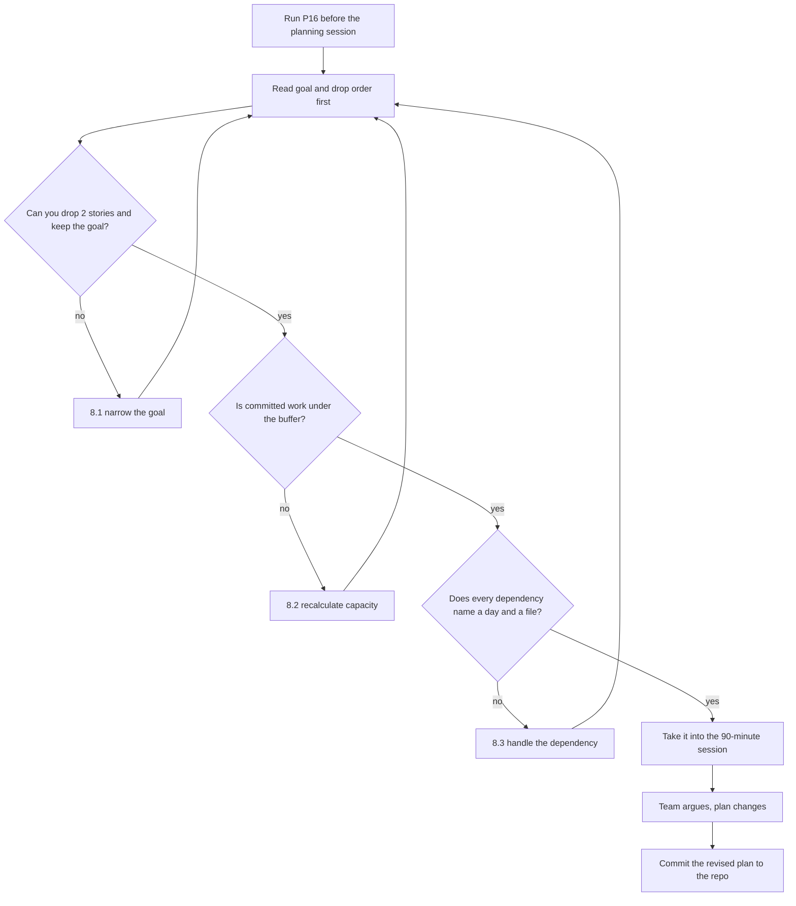

# P16 — Sprint Plan and Assignment

← [Previous](P15-implementation-plan.md) · [Library index](../README.md) · Next: [P17](P17-definition-of-done.md)

> **One line:** Turn a ranked backlog into one sprint with a goal, real capacity, and honest dependencies.

| | |
|---|---|
| **Phase** | 3 — Planning |
| **Who runs it** | Project Manager (Farhan Qureshi) |
| **When** | Sprint planning, the first morning of the sprint, with the whole team in the room |
| **Takes in** | `artifacts/prd-counterparty-ingestion.md`, `artifacts/stories/NWD-101 … NWD-108`, `artifacts/implementation-plan-NWD-103.md`, `artifacts/definition-of-done.md`, the team's availability |
| **Produces** | `artifacts/sprint-2-plan.md` |
| **Hands off to** | Team Lead + QA (Rahul Nair, Ananya Iyer), who run [P17](P17-definition-of-done.md) |
| **Time to run** | 15 minutes to generate; a 90-minute planning session to argue with it |

---

## 1. The scene

Monday, nine in the morning. Farhan Qureshi has a whiteboard, seven people, and eight stories.

Sprint 1 is over. Amara Osei's PRD has been sliced into stories NWD-101 through NWD-108. Sofia Marchetti's spec and ADRs are signed. Ji-woo Park has her UI brief. Rahul Nair spent Friday producing the implementation plan for NWD-103 with [P15](P15-implementation-plan.md), and it's sitting in the repo.

What Farhan does not have is a sprint. He has a pile of work and two engineers, and the pile is not evenly shaped: seven of the eight stories are backend and belong to Tomas Vargas. One is the exception queue screen and belongs to Ji-woo.

And there is a problem sitting in plain sight that nobody has said out loud yet. Ji-woo's screen exists to display things the confidence gate rejects. The confidence gate is NWD-103. NWD-103 does not exist. If Ji-woo starts on Monday she has nothing to render, no API to call, and no idea what an exception row looks like on the wire.

Farhan has seen two ways this goes wrong. Either Ji-woo waits — three days of a frontend engineer being politely blocked — or she guesses at the shape of the data and builds against her guess, and then spends day eight rewriting when the real shape arrives. He is not enthusiastic about either.

**Sprint planning is where that gets solved before it costs anything.** It is not a meeting where you read out tickets. It's the one hour in the fortnight where the team looks at the work together and finds the collisions while they're still free to fix.

---

## 2. What this prompt actually does — in plain language

This section assumes you have never worked in scrum and have no idea what any of these words mean. Nothing is skipped.

### What a sprint is

A **sprint** is a fixed block of time — almost always one or two weeks — in which a team agrees to build a specific set of things, and at the end of which they show what they built.

Three properties make it a sprint rather than just "the next two weeks":

1. **The length is fixed and never moves.** If work isn't finished, the sprint still ends. The work moves, not the date. This sounds like a small rule and it is the entire mechanism — a deadline that can slide teaches you nothing, a deadline that can't forces you to face what you actually got done.
2. **The scope is agreed at the start and defended during.** Not frozen — things genuinely change — but new work doesn't get quietly poured in on Wednesday without something coming out.
3. **It ends with something you can show.** Not a status update. Working software, demonstrated.

Kestrel runs two-week sprints: ten working days. Sprint 2 for Northwind starts on a Monday and ends a fortnight later on a Friday.

### The vocabulary, all of it

You will hit these words constantly and most explanations assume you already know them. Here they are in one place.

| Term | What it actually means |
|---|---|
| **Backlog** | The full list of everything anyone wants built, ordered by priority. Owned by the Product Owner — Amara. Most of it will never be built, and that's fine. |
| **Story** | One piece of work, described from the point of view of the person who wants it, small enough to finish inside one sprint. NWD-103 is a story. |
| **Sprint backlog** | The subset of stories the team pulled into *this* sprint. Eight of them, here. |
| **Acceptance criteria** | The specific, checkable conditions that make one story done. Per-story. Written by Amara with Ananya, using [P08](../phase-1-discovery/P08-write-acceptance-criteria.md). |
| **Definition of Done** | The rules that apply to *every* story, no exceptions. Team-wide, not per-story. That's [P17](P17-definition-of-done.md), and the difference between it and acceptance criteria trips up almost everyone — §2 of that file explains it properly. |
| **Story point** | A number expressing how big a story feels relative to other stories. Not hours. Explained below, because it's the most misunderstood idea in the whole framework. |
| **Velocity** | How many story points the team actually completed in past sprints. A measurement, never a target. |
| **Capacity** | How many days of human attention actually exist in this sprint. Calendar days minus leave, minus meetings, minus everything else. |
| **Sprint goal** | One sentence saying what this sprint is *for*. The most important line in the plan and the one most teams skip. |
| **Standup** | A fifteen-minute daily check-in. That's [P21](../phase-4-build/P21-daily-standup-summary.md). |
| **Demo / review** | End of sprint. The team shows working software to the client. |
| **Retrospective** | End of sprint. The team talks about how the sprint went. That's [P35](../phase-8-improve/P35-run-the-retrospective.md). |
| **Blocked** | Someone cannot progress and cannot fix it alone. The single most valuable word in standup. |
| **Dependency** | Story B cannot be finished until something in story A exists. The thing this prompt is really for. |

### Story points, and why they aren't hours

A **story point** is a relative size. NWD-101 (land PDFs in blob storage) is a 3. NWD-107 (load into Azure SQL and Snowflake idempotently) is an 8. That doesn't mean 107 takes eight hours or eight days. It means it feels somewhere between two and three times as big as 101.

Why not just use hours? Because humans are demonstrably bad at estimating hours and reasonably good at estimating *relative* size. Ask a team "how long will this take?" and you get optimism. Ask "is this bigger or smaller than that thing we did last month?" and you get something usable.

The scale is usually 1, 2, 3, 5, 8, 13 — roughly Fibonacci, deliberately gappy, because the gaps stop people arguing about whether something is a 6 or a 7. Anything above 8 is a signal, not an estimate: it means "we don't understand this well enough yet, go and split it" ([P07](../phase-1-discovery/P07-slice-the-prd-into-stories.md)).

Points only become useful when you have **velocity** — a history of how many points you actually finished. Two or three sprints in, you know your team completes about 22 points a sprint, and a 34-point plan is visibly a fantasy.

> **Watch out.** Sprint 2 is Kestrel's first *build* sprint on this project. Sprints 0 and 1 were foundations and design. There is no build velocity. Anyone who tells you their velocity in sprint one is telling you a number they made up. Farhan's plan has to be honest about this instead of inventing a baseline, and §6 shows how.

### Capacity, properly

**Capacity** is the boring arithmetic that stops sprints being fiction: how many days of actual work exist.

You start with the calendar and subtract reality:

```text
Ten working days in the sprint.

Tomas Vargas
  10.0  working days
 − 1.0  annual leave, Thursday of week one
 − 0.5  ceremonies: planning, three standups' worth of overhead, demo, retro
 − 0.5  Sprint 1 carry-over: finishing the bronze persistence review
  =====
   8.0  available engineering days

Ji-woo Park
  10.0  working days
 − 0.5  ceremonies
 − 1.0  supporting the Sprint 1 design review with Priya at Northwind
  =====
   8.5  available engineering days
```

Two things about this that people get wrong.

First, **ceremonies are not free**. Planning is ninety minutes. Standup is fifteen minutes a day, which is two and a half hours a sprint once you count the context-switch either side. Demo and retro are another two hours. That's the better part of a day, per person, every sprint. Pretending otherwise is how sprints end 10% short every single time and nobody can explain why.

Second, **capacity is not a target to fill**. If Tomas has eight days, you do not plan eight days of work. You plan six or seven, because something will go wrong — a 429 from an Azure service at exactly the wrong moment, a labelled document set that turns out to be mislabelled, a production incident on another account. Farhan's instinct here is well-earned: he plans to about 75% and is pleasantly surprised roughly never.

### The sprint goal, and why it isn't the ticket list

This is the part the assignment for this file specifically wants nailed down, so here it is at length.

A **sprint goal** is one sentence describing what the sprint achieves, written in terms a non-engineer cares about.

A bad sprint goal: *"Complete NWD-101 through NWD-108."*

A good sprint goal, and the real one for Northwind Sprint 2:

> **A Broker Alpha position statement can land in the raw zone, be classified, be gated on confidence, and reach Azure SQL — and anything the gate rejects is visible to Priya in a browser.**

Read those two again. The first is a list. The second is a claim about the world that is either true or false at the end of the fortnight.

Here's why the difference is load-bearing, and it's not about motivation or team spirit. It's about **what happens on day eight when you realise you can't finish everything.**

With a ticket list, day eight looks like this. Six of eight stories are done. Which two do you drop? Everyone has an opinion. The PM wants the one with the client's name on it. The engineer wants the one that's nearly finished. The architect wants the one that's technically foundational. There is no principle to appeal to, so it becomes a negotiation, and negotiations take time you don't have on day eight.

With a goal, day eight looks like this. Read the goal. Ask of each remaining story: *does the goal survive without this?* NWD-104 is translating EM documents to English. The goal says Broker Alpha, which is English. The goal survives. NWD-104 slips. It took forty seconds and nobody's feelings were involved.

**The sprint goal is the thing that tells you what to drop.** A ticket list can only tell you what you didn't do. That's the whole argument.

Two corollaries worth having:

- A goal that every story is essential to is a bad goal — it gives you no room, which means it gives you no information.
- If you finish the goal on day seven, you are not finished. You pull the next thing. The goal is the floor, not the ceiling.

### Assignment, and the dependency problem

**Assignment** is deciding who does what. In a big team this is contentious; with two engineers and a clean split between backend Python and frontend React, it takes about ninety seconds. Tomas takes NWD-101 to NWD-107. Ji-woo takes NWD-108.

The interesting bit is the **dependency**.

A dependency is when one piece of work can't finish until another exists. NWD-108, Ji-woo's exception queue screen, exists to show a human the documents the confidence gate rejected and why. If NWD-103 hasn't produced any rejections, and there's no table holding them, and no API returning them, Ji-woo has a screen with nothing to put on it.

There are four ways to handle a dependency, and only one of them is any good.

**1. Wait.** Ji-woo does nothing until NWD-103 lands. Costs three or four days of a frontend engineer. Obviously bad, and yet extremely common.

**2. Reorder.** Do NWD-103 first, then start NWD-108. Doesn't help — the backend still takes the same number of days, so Ji-woo still waits, just at the front instead of the back.

**3. Guess.** Ji-woo invents a plausible shape for an exception row and builds against it. Fast right up until the real shape arrives, at which point she rewrites. This is the one teams do accidentally, and it's the expensive one, because the rewrite happens in the last three days of the sprint.

**4. Agree the contract first, then work in parallel against a fixture.** Tomas and Ji-woo spend forty minutes on Monday agreeing exactly what an exception row looks like — field names, types, what `confidence` is, whether `line_item_index` can be null. That agreement is written down. Ji-woo then builds against a static JSON file containing six fake exception rows in that exact shape. Tomas builds the real thing. On day five they swap the fixture for the real endpoint.

Option 4 is the answer, and it works for a specific reason: **the expensive part of a dependency is not the code, it's the agreement.** Once the shape is agreed, the two sides are genuinely independent. Once it isn't, no amount of scheduling helps.

This is also exactly why [P13](../phase-2-design/P13-design-the-data-contract.md) exists a whole phase earlier. If the data contract already covers the exception row, Monday's forty-minute conversation becomes a five-minute confirmation. Farhan's job in the plan is to notice the dependency, name it, and say which of the four options is being used and by when.

A **fixture**, since we've used the word: a fixed, fake piece of data used to develop or test against, so you don't need the real system running. Ji-woo's is `src/features/exceptions/fixtures/exceptions.sample.json` — six rows, one of them with a null line item index, one with three failures on the same document, because the awkward cases are the ones you want in front of you on day one.

### Why the prompt is shaped the way it is

| Instruction in the prompt | The failure it prevents |
|---|---|
| "State the sprint goal first, before any assignment" | A plan that's just the ticket list re-formatted, with no basis for descoping |
| "Show the capacity arithmetic" | Ten-day sprints planned as if they contained ten days of work |
| "Say explicitly if there is no velocity yet" | An invented baseline that everyone then treats as real |
| "Find every dependency and say how it is handled" | The Ji-woo problem: found on day seven instead of day one |
| "Rank the stories against the goal" | No answer on day eight to "what do we drop" |
| "Name the riskiest assumption in this plan" | Optimism, formatted neatly |
| "Do not assign work to anyone whose availability I have not given you" | Confidently planned work for a person who is on leave |

### What the AI is actually doing

Three things, and it's worth knowing which is which because they need different amounts of checking.

**Arithmetic and bookkeeping** — summing points, subtracting leave, checking that assigned work fits capacity. Reliable. Skim it.

**Dependency detection** — reading eight stories and noticing that NWD-108 mentions "exceptions produced by the confidence gate" while NWD-103 produces them. Surprisingly good, and genuinely useful, because it reads all eight stories properly, which humans in a planning meeting largely do not. Check it, but expect it to find things you missed.

**Judgement** — is this sprint realistic, is this the right goal, is Tomas actually going to manage seven stories. Not reliable. This is Farhan's job and the model can only prompt him to do it. The "name the riskiest assumption" instruction exists to get the model to hand the judgement back rather than pretend to make it.

### The one idea to keep

**The sprint goal is what lets you drop work without a meeting.** Everything else in the plan — points, capacity, assignment — is arithmetic in service of that.

---

## 3. The prompt

Run this before the planning session, not during it. The output is the strawman the team argues with for ninety minutes; it is not the plan.

```text
You are the project manager producing a sprint plan for a small delivery team.

**Read** these first:
- Product requirements: [PRD PATH]
- The candidate stories: [STORIES FOLDER OR LIST]
- Implementation plan for the flagship story: [IMPLEMENTATION PLAN PATH]
- Definition of Done: [DEFINITION OF DONE PATH]

**Sprint facts:**
- Sprint number and name: [SPRINT NUMBER AND NAME]
- Length: [SPRINT LENGTH IN WORKING DAYS]
- Previous velocity: [VELOCITY OR "none — first build sprint"]

**The team and their real availability:**
[TEAM, ROLE, AVAILABLE DAYS, AND WHAT IS EATING THE REST]

**Produce the plan in this order. The order matters — do not reorganise it.**

**1. The sprint goal.** One sentence. It must describe an outcome someone
non-technical would recognise, not a list of tickets. It must be possible to
achieve it without completing every story in the sprint — if it is not, say so
and propose a narrower goal. Write two candidate goals and recommend one, with
one line on why the other is worse.

**2. Capacity.** Show the arithmetic per person: working days, minus leave,
minus ceremonies, minus carry-over, equals available days. Then state the total.
**Do not** plan to fill more than [PLANNING BUFFER] of available capacity, and
say what the remainder is reserved for.

**3. Velocity honesty.** If there is no previous velocity, say so plainly and
explain what you are using instead. **Do not invent a baseline.**

**4. The stories.** A table: ID, title, points, owner, and — this column is
required — **"does the sprint goal survive without it?"** answered yes or no.

**5. Dependencies.** For every pair of stories where one cannot finish until
something in another exists, give: what is needed, by whom, from whom, the day
it is needed by, and which mitigation is being used —
(a) wait, (b) reorder, (c) build against an agreed fixture, (d) descope.
Recommend one and say what has to be agreed, by whom, on day one, for it to work.
**Treat this section as the most important part of the plan.**

**6. Day-level shape.** A rough sketch of which days carry which work per person.
Not a Gantt chart. Enough that a dependency landing on day five is visible.

**7. The drop order.** If the sprint runs short, the exact order in which stories
come out, justified against the sprint goal — not against effort or preference.

**8. The riskiest assumption in this plan.** One paragraph. What would have to be
true for this plan to work, that you are not certain is true.

**Do not:**
- Do not assign work to anyone whose availability is not listed above.
- Do not estimate in hours. Points and days only.
- Do not invent stories, acceptance criteria or team members.
- Do not describe the plan as achievable. Show the arithmetic and let me judge.
- Do not add process the team has not asked for — no new ceremonies, no new
  documents, no RACI matrix.
- Do not restate the stories' contents. Reference them by ID.

**You are done when:** the sprint goal survives the loss of at least one story,
every story has an owner whose capacity has room for it, every cross-person
dependency names a day and a mitigation, and the drop order is justified against
the goal rather than against effort.

**Save the result to:** [OUTPUT PATH]
```

---

## 4. Every placeholder, explained

| Placeholder | What to put in it | Northwind example | What happens if you get it wrong |
|---|---|---|---|
| `[PRD PATH]` | The product requirements from [P06](../phase-1-discovery/P06-write-a-full-prd.md) | `artifacts/prd-counterparty-ingestion.md` | The goal comes out as a technical statement instead of a business one — "the gate works" rather than "Priya can see rejections" |
| `[STORIES FOLDER OR LIST]` | Every candidate story, with points | `artifacts/stories/` (NWD-101 … NWD-108) | Dependency detection is the whole point of this prompt and it can only find dependencies in stories it has read |
| `[IMPLEMENTATION PLAN PATH]` | The build sequence from [P15](P15-implementation-plan.md) | `artifacts/implementation-plan-NWD-103.md` | You lose the day-level detail — the plan can't tell you the exceptions table lands at Step 5, so it can't tell Ji-woo when to expect it |
| `[DEFINITION OF DONE PATH]` | The team-wide DoD, [P17](P17-definition-of-done.md) | `artifacts/definition-of-done.md` | Capacity gets planned against "code written", not "done". Review, tests and the human-read clause all take real time |
| `[SPRINT NUMBER AND NAME]` | Which sprint and what it's for | `Sprint 2 — Planning & Build` | Cosmetic, until you have four sprint plans in a folder and can't tell them apart |
| `[SPRINT LENGTH IN WORKING DAYS]` | Working days, not calendar days | `10 working days` | Bank holidays vanish and the sprint is silently 20% shorter than planned |
| `[VELOCITY OR "none"]` | Points completed in recent comparable sprints, or an honest "none" | `none — Sprints 0 and 1 were foundations and design, no build velocity exists` | Say nothing and the model helpfully assumes one. A fabricated velocity gets quoted back at you in the retro |
| `[TEAM, ROLE, AVAILABLE DAYS, AND WHAT IS EATING THE REST]` | Every person, with the subtractions spelled out | `Tomas Vargas — backend — 8.0 of 10 (1d leave Thu wk1, 0.5d ceremonies, 0.5d Sprint 1 carry-over)` | The single highest-value input. Wrong here and every other number in the plan is wrong |
| `[PLANNING BUFFER]` | The fraction of capacity you're willing to commit | `75%` | Plan to 100% and the first surprise turns a full sprint into a failed one |
| `[OUTPUT PATH]` | Where it lives, in the repo, next to the other artifacts | `artifacts/sprint-2-plan.md` | It lives in a chat window and gets quoted from memory in the retro, which is where sprint plans go to become fiction |

---

## 5. The filled-in example

Farhan runs this at 8:15am on the Monday, forty-five minutes before the planning session, having collected everyone's availability in Slack on Friday.

```text
You are the project manager producing a sprint plan for a small delivery team.

**Read** these first:
- Product requirements: artifacts/prd-counterparty-ingestion.md
- The candidate stories: artifacts/stories/ (NWD-101 through NWD-108)
- Implementation plan for the flagship story: artifacts/implementation-plan-NWD-103.md
- Definition of Done: artifacts/definition-of-done.md

**Sprint facts:**
- Sprint number and name: Sprint 2 — Planning & Build
- Length: 10 working days
- Previous velocity: none. Sprint 0 was foundations (repo, context file, DB
  connection, MCP server, hooks) and Sprint 1 was discovery and design (PRD,
  stories, spec, ADRs, data contract, UI brief). Neither produced shippable
  application code, so there is no build velocity to extrapolate from.

**The team and their real availability:**
- Tomas Vargas — Backend Engineer (Python, Azure) — 8.0 of 10 days.
  1.0 day annual leave Thursday week one; 0.5 day ceremonies; 0.5 day Sprint 1
  carry-over finishing the bronze persistence review with Sofia.
- Ji-woo Park — Frontend Engineer (React, TypeScript) — 8.5 of 10 days.
  0.5 day ceremonies; 1.0 day supporting the design walkthrough with Priya Raman
  at Northwind on Wednesday week one.
- Rahul Nair — Team Lead — not taking stories. Reserve 0.5 day per day for code
  review, pairing and unblocking.
- Ananya Iyer — QA — writing the E2E harness this sprint, not taking build
  stories. She needs a working exception queue by day 8 to start against.
- Sofia Marchetti — Architect — 1 day total, on call for design questions.
- Amara Osei — Product Owner — available for acceptance, not building.
- Farhan Qureshi — Project Manager — me.

Candidate stories and points, as estimated in P09:
  NWD-101 Land counterparty PDFs immutably in the raw zone — 3
  NWD-102 Classify an incoming PDF to its counterparty layout — 5
  NWD-103 Gate every extracted field on its confidence score — 5
  NWD-104 Translate EM documents to English before matching — 3
  NWD-105 Redact PII before anything is persisted — 5
  NWD-106 Transform extracted fields into the canonical position schema — 5
  NWD-107 Load positions into Azure SQL and Snowflake idempotently — 8
  NWD-108 Exception queue screen for analyst review — 8

**Produce the plan in this order. The order matters — do not reorganise it.**

[... sections 1 to 8 exactly as in §3 ...]

**Do not:**
- Do not assign work to anyone whose availability is not listed above.
- Do not estimate in hours. Points and days only.
- Do not invent stories, acceptance criteria or team members.
- Do not describe the plan as achievable. Show the arithmetic and let me judge.
- Do not add process the team has not asked for — no new ceremonies, no new
  documents, no RACI matrix.
- Do not restate the stories' contents. Reference them by ID.

**You are done when:** the sprint goal survives the loss of at least one story,
every story has an owner whose capacity has room for it, every cross-person
dependency names a day and a mitigation, and the drop order is justified against
the goal rather than against effort.

**Save the result to:** artifacts/sprint-2-plan.md
```

---

## 6. What comes back

```markdown
# Sprint 2 Plan — Planning & Build
Northwind counterparty ingestion · 10 working days · Prepared by Farhan Qureshi

## 1. Sprint goal

**Recommended:**
> A Broker Alpha position statement lands in the raw zone, is classified, is
> gated on confidence, and reaches Azure SQL — and anything the gate rejects is
> visible to Priya in a browser.

**Alternative considered:**
> The full ingestion pipeline works end to end for both counterparties, in both
> languages, loading to Snowflake.

The alternative is worse for one reason: nothing can be dropped from it. It
requires NWD-104 (translation) and NWD-107 (Snowflake load) to be complete, which
means on day eight there is no principled way to descope. The recommended goal
deliberately says *Broker Alpha* and *Azure SQL* — one English counterparty, one
sink — which leaves translation, redaction and the Snowflake half of the load as
material that can slip without failing the sprint.

The recommended goal also names Priya. That is intentional: it is the only
version of the goal that Amara can judge without an engineer translating it.

## 2. Capacity

| Person | Working days | Leave | Ceremonies | Carry-over | Available |
|---|---|---|---|---|---|
| Tomas Vargas | 10.0 | −1.0 | −0.5 | −0.5 | **8.0** |
| Ji-woo Park | 10.0 | 0 | −0.5 | −1.0 | **8.5** |
| **Total build capacity** | | | | | **16.5 days** |

Rahul (0.5 day/day review + unblocking), Ananya (E2E harness), Sofia (1 day
design support) and Amara (acceptance) are not counted as build capacity. That is
deliberate — counting a reviewer's time as build capacity is how review becomes
the thing that gets skipped.

**Planning buffer:** committing to 75% of 16.5 = **12.4 days of planned work.**
The remaining 4.1 days are reserved for: Azure service surprises (a 429 at
month-end is a known risk, see NWD-141 in the risk log), the labelled-document
set needing correction, and rework arising from Rahul's reviews. It is not spare
capacity to fill on day three.

## 3. Velocity

**There is no velocity for this team on this project.** Sprints 0 and 1 produced
foundations and design documents, not application code. Any points-per-sprint
number quoted now would be invented.

What I am using instead:
- The step counts and rough sizes in `implementation-plan-NWD-103.md`, which
  gives a real bottom-up read on the flagship story: 8 steps, ~350 lines of
  production code plus tests, call it 2.5 days including review and rework.
- The team's own relative estimates from P09, used for ordering only.

Consequence: **this plan is a forecast, not a commitment.** Sprint 3's plan will
be the first one with a real baseline behind it. Expect this one to be wrong and
expect to learn how wrong at the retro.

## 4. Stories

| ID | Title | Pts | Owner | Goal survives without it? |
|---|---|---|---|---|
| NWD-101 | Land counterparty PDFs immutably in the raw zone | 3 | Tomas | **No** — nothing works without the landing zone |
| NWD-102 | Classify an incoming PDF to its counterparty layout | 5 | Tomas | **No** — the gate needs to know which thresholds apply |
| NWD-103 | Gate every extracted field on its confidence score | 5 | Tomas | **No** — this is the sprint |
| NWD-104 | Translate EM documents to English before matching | 3 | Tomas | **Yes** — the goal says Broker Alpha, which is English |
| NWD-105 | Redact PII before anything is persisted | 5 | Tomas | **Yes** for the goal, **no** for go-live. See risk below |
| NWD-106 | Transform extracted fields into the canonical position schema | 5 | Tomas | **No** — nothing reaches SQL without it |
| NWD-107 | Load positions into Azure SQL and Snowflake idempotently | 8 | Tomas | **Partly** — Azure SQL half is required, Snowflake half is not |
| NWD-108 | Exception queue screen for analyst review | 8 | Ji-woo | **No** — "visible to Priya" is half the goal |

Tomas carries 34 points; Ji-woo carries 8. That imbalance is real and it is not
solved by moving points around — Ji-woo cannot write the Python and Tomas is not
building React this sprint. It is managed by the drop order in §7: four of
Tomas's 34 points are explicitly droppable, and Ji-woo's spare 4-5 days are
committed in §6 below.

## 5. Dependencies

### D1 — NWD-108 needs NWD-103 (critical)

- **What is needed:** exception rows to display. Specifically: the shape of an
  exception record (field names and types), and an endpoint that returns a list
  of them.
- **From:** Tomas · **To:** Ji-woo · **Needed by:** end of day 5
- **Why it is critical:** NWD-108 is Ji-woo's entire sprint. Blocked, she has
  nothing else assigned.

| Option | Assessment |
|---|---|
| (a) Wait | Costs 4-5 days of frontend capacity. Rejected. |
| (b) Reorder | Does not help — the backend takes the same time either way. Rejected. |
| (c) **Agreed fixture** | **Recommended.** |
| (d) Descope NWD-108 | Fails half the sprint goal. Rejected. |

**Recommended mitigation (c), and what has to happen for it to work:**

Day 1, before either of them writes anything: Tomas and Ji-woo agree the exception
record shape against `data-contract-counterparty-position.md` §4 and
`implementation-plan-NWD-103.md` Step 5. Forty minutes, both present, Rahul in
the room. Output is a committed `exceptions.sample.json` fixture containing six
rows and covering, at minimum:
  - a document with three separate field failures sharing one document hash
  - a failure on a line item (non-null row index) and a failure on a header
    field (null row index)
  - one BELOW_THRESHOLD, one MISSING_VALUE, one NULL_CONFIDENCE reason code
  - one row where confidence is null, so the UI has to decide what to render

Ji-woo builds against that fixture until day 5. Tomas's Step 5 (exceptions
table) and Step 6 (persist rejections) land by day 5, and they swap the fixture
for the real endpoint on day 6.

**If the shape changes after day 1**, it is a change both of them attend, and it
is raised at standup, not fixed silently. A quiet rename of one column costs
Ji-woo half a day she does not have.

### D2 — NWD-103 needs NWD-102 (in-person, low risk)

The gate resolves per-counterparty thresholds, so it needs to know the
counterparty. Both stories are Tomas's, in sequence, so this is a sequencing note
rather than a coordination risk. Implementation plan Step 2 depends on it.

### D3 — Ananya needs a working exception queue by day 8

Not a story dependency, a people one. Ananya cannot start the E2E harness against
a screen that does not render. If NWD-108 slips past day 8, her sprint slips too
and the E2E work lands in Sprint 3. Flag at standup on day 6 if it looks tight.

### D4 — NWD-107's Snowflake half needs key-pair auth provisioned by Northwind IT

External dependency, outside the team's control. Requested; not yet confirmed. If
it has not landed by day 7, the Snowflake half of NWD-107 drops and the Azure SQL
half still meets the goal. Chase on day 3, not day 7.

## 6. Day-level shape

```text
Day  1   2   3   4   5   6   7   8   9  10
Tomas
     [--101--][----102----][------103------][--106--][----107----]
                                        ^Step5/6 land (D1)
     Thu wk1 = leave (day 4)
Ji-woo
     [D1 agree][------108 against fixture------][real API][--polish/a11y--]
                                        ^swap day 6
     Wed wk1 = Northwind (day 3)
Reserve (4.1 days, unallocated): 104, 105, Snowflake half of 107
```

Ji-woo has roughly 4 days of slack after NWD-108's core screens. Committed to,
in order: the loading/empty/error states the UI brief calls for, keyboard
accessibility for Priya's actual working pattern (she does this 200 times a day
and will not use a mouse), and pairing with Ananya on the E2E selectors so the
harness is not built against fragile CSS classes.

## 7. Drop order

If the sprint runs short, work comes out in this order. Justification is against
the sprint goal only.

1. **Snowflake half of NWD-107.** The goal says Azure SQL. Snowflake is the gold
   layer and nobody is reporting off it this sprint.
2. **NWD-104 (translation).** The goal says Broker Alpha, which is English. EM
   documents are Sprint 3 material regardless.
3. **NWD-105 (redaction).** The goal survives without it. **Caveat: this cannot
   ship to production without it**, and dropping it must be a decision Amara and
   Sofia make consciously, not a thing that quietly happens on day nine. If it
   drops, it is the first story in Sprint 3 and it is marked as blocking release.
4. **Nothing else.** Stories 101, 102, 103, 106 and 108 are the goal. If those
   are at risk, the sprint has failed and we should say so on day six rather than
   day ten.

## 8. The riskiest assumption

**That NWD-103 lands by day 5.** Everything downstream of it — Ji-woo's real API
integration, Ananya's E2E start, and the second half of Tomas's sprint — is
scheduled behind it, and Tomas loses day 4 to leave.

What would have to be true: that the line-item confidence spike in
`implementation-plan-NWD-103.md` Step 0 comes back clean on day one. If it does
not — if the custom model turns out not to return per-cell confidence on the
positions table — the spec changes, the gate's shape changes, and this plan is
void by Tuesday afternoon.

I would rather find that out on day one than day four, which is why Step 0 is a
spike and why it is scheduled first. But it is genuinely unknown today, and
nothing in this plan survives it being false. That is the assumption to watch.
```

### How to read this

**Read §1 and §7 together, and nothing else, if you have two minutes.** The goal and the drop order are the plan. Everything between them is the evidence.

**Section 5, dependency D1, is the reason this prompt exists.** Look at what it actually specifies: not "coordinate with Ji-woo" but a forty-minute meeting on day one, a named fixture file, and four specific awkward cases the fixture must contain. That's the difference between a dependency being *noted* and a dependency being *handled*. The awkward cases matter more than the happy ones — a null `line_item_index` is exactly the sort of thing that gets designed out of a fixture and then arrives in production.

**Section 3 is where most sprint plans lie and this one doesn't.** "There is no velocity for this team on this project" is an uncomfortable sentence to put in a document you send to a client, and it's the correct one. Watch for the model quietly reinstating a velocity if you re-prompt it; it will offer "industry typical" numbers if you let it, and those are worse than nothing because they look like data.

**The part that is commonly wrong:** the day-level shape in §6. It's drawn from point estimates, which for a first build sprint are guesses, and it will be wrong by day three. Treat it as showing *the order and the collision points*, not the dates. The only genuinely load-bearing thing in it is the arrow marking where Step 5 lands, because that's D1's deadline.

---

## 7. Why this is the final prompt

**What "done" means here.** The plan is done when Farhan can walk into the room and defend three things without opening another document: why this is the goal, what comes out first if things go badly, and what has to happen on day one for Ji-woo not to be blocked.

If he'd have to say "let me check" to any of those, the plan isn't finished.

**The checklist:**

- [ ] The sprint goal is one sentence and names an outcome, not a ticket range
- [ ] At least one story in the sprint can be dropped without failing the goal — and you can name it
- [ ] Capacity arithmetic is shown per person, with ceremonies actually subtracted
- [ ] Planned work is meaningfully below available capacity, and the reserve has a stated purpose
- [ ] Every cross-person dependency has a named day and one of the four mitigations
- [ ] The drop order is justified against the goal, not against effort or sunk cost
- [ ] The riskiest assumption is something you'd actually be nervous about, not a formality

**Why you should stop rather than keep prompting.** Sprint plans rot in two ways when over-polished. They grow — a risk register, a RACI matrix, a communications plan, a stakeholder map — until they're twelve pages and nobody reads past the goal. And they become **falsely precise**: the model will happily produce a half-day-resolution schedule for a ten-day sprint whose underlying estimates are relative guesses. Precision you haven't earned is worse than an honest range, because people plan against it.

The plan is a strawman for a ninety-minute conversation. Its job is to be specific enough to argue with. Once it is, stop and go and have the conversation.

**The signal that you are NOT done:** you read the drop order and think "we'd never actually drop that." That means the goal is wrong, not the drop order — and §8 has the fix.

---

## 8. When it is not done — the follow-up prompts

| What you're seeing | What's actually wrong | Run this next |
|---|---|---|
| The goal is "complete NWD-101 to NWD-108" | No goal, just a ticket list — nothing to descope against | §8.1 |
| Every story is marked "goal does not survive without it" | The goal is too wide. It has no slack, so it gives no information | §8.1 |
| The plan commits 100% of available days | The buffer was ignored, or ceremonies weren't subtracted | §8.2 |
| Dependencies say "coordinate with Ji-woo" | Detected but not handled — no day, no fixture, no owner | §8.3 |
| A velocity number appears that you never supplied | Fabricated baseline | §8.4 |
| One person carries four times the other's points | Real imbalance, and points can't be moved across skills | §8.5 |
| Stories keep coming back as 13s and 21s | The stories are too big for a sprint | **[P07](../phase-1-discovery/P07-slice-the-prd-into-stories.md)** |
| You cannot tell whether a story is finished | Missing acceptance criteria | **[P08](../phase-1-discovery/P08-write-acceptance-criteria.md)** |
| The team disagrees on what "finished" means at all | Missing team-wide DoD | **[P17](P17-definition-of-done.md)** |

### 8.1 "The sprint goal is just the ticket list"

Use this when §1 comes back as a restatement of the sprint backlog, or when every story is essential to it.

```text
The sprint goal you produced is a list of stories, not an outcome.

**Rewrite** it as one sentence that:
- names a person or a system doing something they cannot do today,
- would be understood by [NON-TECHNICAL STAKEHOLDER NAME] without explanation,
- and can be achieved **without completing at least two** of the stories in
  this sprint.

Then prove the last point: list which stories can be dropped while the goal still
holds, and for each one write the sentence you would say to the client explaining
why it slipped.

If you cannot find two droppable stories, the goal is too wide. Narrow it — by
counterparty, by document type, by sink, or by language — and try again.
```

What changes: the goal narrows to something specific like "Broker Alpha, to Azure SQL". Narrowing feels like reducing ambition; it isn't. A goal that covers everything protects nothing.

### 8.2 "It planned every available day"

Use this when planned work equals capacity, or when capacity forgot ceremonies.

```text
This plan commits [X] days against [Y] available days. That is [Z]% of capacity.

**Recalculate** capacity with these subtracted explicitly per person, and show
each line:
- sprint planning, demo and retrospective (real hours, not zero)
- daily standup across the whole sprint
- code review time for whoever is reviewing
- any carry-over from the previous sprint

**Then commit to no more than [PLANNING BUFFER] of what remains**, and state in
one sentence what the reserve is for — naming the two most likely surprises on
this project specifically, not generic ones.

Show me the before and after totals.
```

What changes: available days drop by 10-20% and something moves into the drop order. The "name the two most likely surprises specifically" clause is what stops the reserve being described as "contingency", which is a word that means nothing and therefore gets spent first.

### 8.3 "The dependencies are noted but not handled"

Use this when a dependency section exists but reads like a warning rather than a plan.

```text
Dependency [D#] is described but not mitigated. "Coordinate with X" is not a
mitigation.

For this dependency, produce:
1. The exact artifact the blocked person needs — file, endpoint, schema or
   fixture — named, with the field names it must contain.
2. The day it must exist by, and the day the blocked work starts.
3. Which of the four mitigations applies: wait / reorder / build against an
   agreed fixture / descope. Pick one.
4. If it is "build against an agreed fixture": what conversation happens on day
   one, who is in it, how long it takes, and what file it produces.
5. The three most awkward cases that fixture must contain — nulls, empties,
   multiples — so the blocked person hits them on day one rather than day nine.
6. What happens if the real thing arrives shaped differently, and who is told.

Do not generalise. Be specific to this dependency.
```

What changes: a paragraph becomes a Monday-morning action with a named file. Point 5 is the one that earns its keep — fixtures built without it are all happy path, and the happy path is not where integration breaks.

### 8.4 "It invented a velocity"

Use this the moment a points-per-sprint figure appears that you didn't supply.

```text
You have used a velocity figure of [N] points per sprint. I did not give you one
and this team has no build history on this project.

**Remove it.** Replace §3 with an honest statement that no velocity exists, and
say what you are using in its place — specifically, the bottom-up step counts and
size estimates in [IMPLEMENTATION PLAN PATH].

**Then re-label** this plan as a forecast rather than a commitment, in one
sentence, and say which sprint will be the first to have a real baseline.

Do not substitute an industry average, a typical figure, or an assumption. If a
number is not measured, it does not go in the plan.
```

What changes: §3 shortens and gets more honest. This matters beyond this document — a fake velocity in Sprint 2 becomes the benchmark everyone measures Sprint 3 against, and then someone is "underperforming" against a number that was invented by a language model in a planning session.

### 8.5 "One person has four times the work of the other"

Use this when the assignment table is visibly lopsided.

```text
This plan gives [PERSON A] [X] points and [PERSON B] [Y] points. Their skills do
not overlap, so points cannot simply be moved.

**Do not** rebalance by reassigning work across skill boundaries.

**Instead:**
1. Say plainly which of the heavier person's stories are in the drop order and
   how many points that removes if all of them go.
2. For the lighter person, propose what their spare capacity is committed to
   — concrete work that helps the sprint goal, not filler. Prefer: the states
   and edge cases in their own story, accessibility, or pairing with QA on
   test selectors.
3. Say whether the heavier person becomes a single point of failure, and what
   happens to the sprint if they are ill for two days.

Keep it to half a page.
```

What changes: the imbalance stops being hidden and becomes two explicit decisions. Point 3 is the one Farhan actually cares about — with two engineers and no overlap, one person off sick is a sprint-level event, and it's better said out loud in the plan than discovered on a Tuesday.

### The loop shape



---

## 9. How this goes wrong

### The plan is presented as a commitment

Farhan sends the plan to Northwind. Somebody at Northwind reads "Sprint 2 delivers NWD-101 to NWD-108" and writes it in a steering pack. Three weeks later the sprint delivered six of eight and Kestrel is explaining a shortfall against a number nobody on the team ever committed to.

The cause is a first build sprint with no velocity being written in the same confident register as a fifth sprint with three data points behind it. The document doesn't look like a forecast, so it isn't read as one.

The fix is a single sentence at the top and the drop order at the bottom. "This is a forecast; Sprint 3 will be the first plan with a measured baseline behind it" costs nothing and changes how the whole document is read. Farhan writes it every first sprint and has never regretted it.

### The dependency is found and then not acted on

This is the failure that actually happened to Kestrel on the previous engagement, and it's why D1 in §6 is as specific as it is.

The plan correctly identified that the frontend needed the backend's data shape. Everyone nodded. Nobody scheduled the conversation. The frontend engineer, being sensible, made a reasonable guess and got on with it. The backend engineer, being sensible, made a different reasonable guess. Both were right by their own lights. Integration was on day eight and took two days.

**A dependency in a plan is not handled until it has a date, an owner and an artifact.** "We'll coordinate" is a hope. "Tomas and Ji-woo, day one, forty minutes, output is `exceptions.sample.json` committed to the repo" is a plan. The difference is about ninety seconds of writing.

### The goal is written after the assignment

You can tell when this has happened: the goal reads like a summary of the stories, because it is one. Somebody listed the work first and then wrote a sentence describing it.

A goal derived from the ticket list can't do the one job a goal has, which is to be an independent standard the ticket list is measured against. If it's just a summary, then by definition every story is essential to it, and you're back to negotiating on day eight.

This is why the prompt in §3 forces the goal into section 1, before capacity and before assignment, and asks for two candidates. Two candidates forces a comparison, and comparison is where the goal gets sharpened.

### Capacity is planned as though people only do the sprint

Tomas is on this project full time, except when he isn't. There's the support rota. There's the interview panel on Thursday. There's the twenty minutes a day answering questions about last quarter's project that nobody has counted since March.

Real availability is almost never above 80% of calendar time for anyone who has been at a company longer than six months, and it's lower for anyone senior. Plan at 100% and you're not being ambitious, you're being wrong in a way that will be blamed on the team.

The fix is in the input, not the prompt: collect real availability on the Friday before, in writing, from each person, including the things they feel slightly awkward mentioning. Farhan asks a specific question rather than an open one — "what is definitely taking you away from this sprint?" — because "are you free?" gets you "yes" and then a training day nobody knew about.

### When this prompt is the wrong tool entirely

If the stories don't have acceptance criteria, this prompt produces a beautiful plan for work nobody can agree is finished. If the stories are 13s and 21s, it produces a plan for a sprint that cannot contain them. If the team has never agreed a Definition of Done, the whole notion of planning capacity is unmoored, because "done" means something different to each person and the estimates aren't comparable.

Go back to [P07](../phase-1-discovery/P07-slice-the-prd-into-stories.md), [P08](../phase-1-discovery/P08-write-acceptance-criteria.md) and [P17](P17-definition-of-done.md) first. Sprint planning is downstream of all three, and it will happily produce confident output on top of a broken foundation.

---

## 10. The handoff

The plan goes into the ninety-minute planning session on Monday morning, and it comes out changed. That is a success, not a failure — a strawman that survives untouched wasn't specific enough to argue with.

What actually changes in the room is usually the capacity numbers (someone remembers a commitment) and the dependency mitigation (the engineers know something about the shape of the work the PM doesn't). What rarely changes is the goal and the drop order, because those are Amara's call and she is in the room to make it.

Rahul and Ananya pick it up next, and they run [P17](P17-definition-of-done.md). The connection is direct: the plan committed 12.4 days of work, and the estimates behind that number are only meaningful if everyone agrees what "done" includes. If Tomas thinks done means the tests pass and Ananya thinks it means she's signed it off, the capacity arithmetic in §2 is fiction. The Definition of Done is what makes the number mean something.

Ji-woo's first action out of this plan happens before any prompt: the forty-minute conversation with Tomas on day one that produces the fixture. Then she goes to [P19](../phase-4-build/P19-build-the-ui-from-the-brief.md) with her UI brief and that fixture in hand. Tomas goes to [P18](../phase-4-build/P18-implement-a-story.md) with NWD-101 and the implementation plan.

> **Artifact contract — `artifacts/sprint-2-plan.md`**
> Anyone reading this file can rely on finding:
> - One sprint goal, in one sentence, that at least two stories can be dropped from
> - Per-person capacity arithmetic with ceremonies and leave visibly subtracted
> - An honest statement of velocity, including "none" where that is the truth
> - Every story with an owner and an explicit yes/no on whether the goal survives without it
> - Every cross-person dependency with a day, an artifact, and one of four named mitigations
> - A drop order justified against the goal
> - One named riskiest assumption, stated as something that might be false
>
> If any of those is missing, the artifact is not done — go back to §7.

---

## 11. In the case study

This runs in [Chapter 4 — Sprint 2 Planning](../../Case-Study/Python-ETL/04-sprint-2-planning.md) and produces `artifacts/sprint-2-plan.md`.

The interesting thing that happened is that the first draft got D1 backwards. It correctly spotted that NWD-108 depended on NWD-103, and then recommended mitigation (b) — reorder, do NWD-103 first. Farhan read that and immediately saw the flaw: reordering doesn't shorten the backend work, it just moves Ji-woo's idle days from the end of the sprint to the start. He ran the §8.3 follow-up and got the fixture approach, which is what the team actually did.

The conversation that came out of it lasted thirty-five minutes rather than the forty budgeted, and produced `exceptions.sample.json` with seven rows rather than six. Ji-woo added the seventh herself: a document where the same field failed twice at different line-item indices, because she wanted to know whether to group by field or by row before she wrote a single component. Tomas hadn't thought about it. The answer changed one line of his Step 6.

That is the whole argument for this prompt in one anecdote. Thirty-five minutes on day one, against two days of integration pain on day eight.

The other thing worth recording: NWD-105, redaction, did drop. It slipped to Sprint 3 exactly as the drop order predicted, and because the plan had flagged it as *blocking release rather than blocking the goal*, Amara made the call knowingly on day nine instead of discovering it in the release readiness check. [P32](../phase-7-release/P32-release-readiness-check.md) picks that thread up.

---

← [Previous](P15-implementation-plan.md) · [Library index](../README.md) · Next: [P17](P17-definition-of-done.md)
