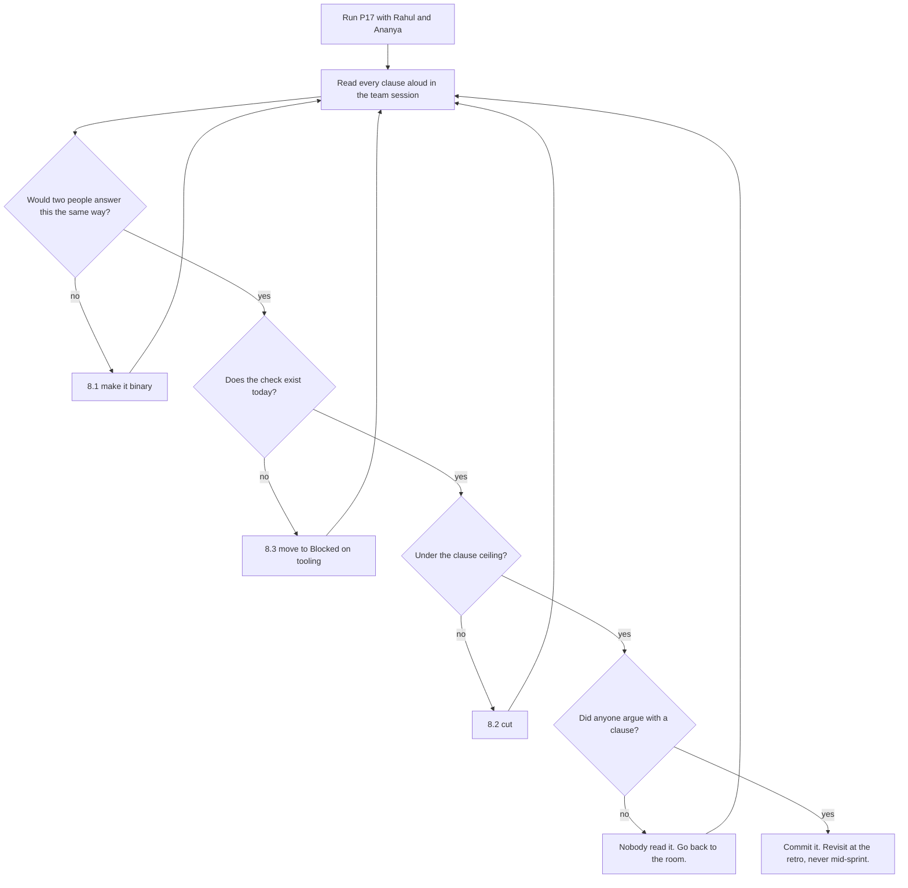

# P17 — Definition of Done

← [Previous](P16-sprint-plan-and-assignment.md) · [Library index](../README.md) · Next: [P18](../phase-4-build/P18-implement-a-story.md)

> **One line:** Write the one checklist every story must pass, including the clauses AI work needs.

| | |
|---|---|
| **Phase** | 3 — Planning |
| **Who runs it** | Team Lead + QA (Rahul Nair and Ananya Iyer), together |
| **When** | Once, before the first build sprint. Revisited at retrospectives, not mid-sprint |
| **Takes in** | `artifacts/CLAUDE.md`, `artifacts/sprint-2-plan.md`, the team's actual CI setup, any client contractual requirements |
| **Produces** | `artifacts/definition-of-done.md` |
| **Hands off to** | Backend Engineer (Tomas Vargas), who runs [P18](../phase-4-build/P18-implement-a-story.md) — and every other prompt in phases 4 through 7, all of which reference this file |
| **Time to run** | 20 minutes to generate; a 60-minute session with the whole team to agree it |

---

## 1. The scene

Monday afternoon. Sprint planning is over, Farhan's plan is committed, and Rahul Nair has asked for an hour with the team before anyone opens an editor.

He puts one question on the screen: **"Tomas says NWD-101 is done. What did he just tell us?"**

Silence, then five different answers. Tomas means the code works and he ran it locally. Ananya assumes it means she can test it. Amara assumes it means she can show it to Northwind. Sofia assumes the ADR has been updated if the design moved. Farhan assumes it means the eight points come off the board and the burndown moves.

All five are reasonable. None of them is written down anywhere. Which means that for the last two sprints, "done" has meant whatever the person saying it thought it meant.

This is not a hypothetical problem for Kestrel. In the previous engagement — the one Rahul, Ananya and the earlier books cover — a story was called done on a Thursday, moved to the done column, counted in the velocity, demoed on the Friday, and then failed in QA the following Tuesday because nobody had written a test for the error path. The team's velocity for that sprint was, in a real sense, a lie. Not through dishonesty: through the absence of one shared sentence.

There's a newer version of the same problem, and it's the one Rahul is actually worried about this time. Tomas is now writing code with an AI. Some of it is very good. Some of it is very good **and nobody has read it.** In the previous project Rahul found a 90-line retry helper in the codebase that no human on the team could explain, because it had appeared in a single AI-generated commit, the tests were green, and the reviewer had approved it in four minutes.

**A Definition of Done is one checklist, agreed by the whole team, that every story must pass before anyone is allowed to say the word "done".** It's the cheapest document in agile and the one most teams skip, and the arrival of AI-written code has made it considerably less optional.

---

## 2. What this prompt actually does — in plain language

### The two lists people confuse

There are two different checklists in a well-run team, and almost everyone new to this conflates them. Get this distinction and the rest of the file is easy.

**Acceptance criteria** are per-story. They describe what *this particular piece of work* must do. They're written by the Product Owner with QA, using [P08](../phase-1-discovery/P08-write-acceptance-criteria.md), and they're different for every story.

NWD-103's acceptance criteria include things like:

- A currency field at 0.89 confidence on a Broker Alpha document is rejected (because Broker Alpha's currency threshold is 0.92).
- A date field at 0.86 passes (threshold 0.85).
- A field with a value but a null confidence is rejected, not accepted.
- One failing line item sends the whole document to review.

**The Definition of Done** is per-team. It describes what must be true of *any* piece of work before it counts, regardless of what the work was. It's written once, by the Team Lead and QA together, agreed by everyone, and it doesn't change between stories.

Clauses in a DoD look like:

- Every acceptance criterion has an automated test.
- A second person has reviewed the code.
- No secret is in the repository.
- The spec has been updated if behaviour diverged from it.

Here's the crisp version of the difference:

| | Acceptance criteria | Definition of Done |
|---|---|---|
| Scope | One story | Every story |
| Written by | Product Owner + QA | Team Lead + QA, agreed by the team |
| Changes | Every story | Almost never — at retrospectives only |
| Answers | "Does it do the right thing?" | "Is it finished to our standard?" |
| Fails when | Behaviour is wrong | Behaviour is right but the work isn't safe to ship |

**A story is done when its acceptance criteria pass AND the Definition of Done passes.** Both. Neither substitutes for the other, and the most common failure in a team is passing the first and quietly skipping the second because the sprint is nearly over.

An analogy that holds up: acceptance criteria are the recipe for one dish. The Definition of Done is the kitchen's hygiene standard. You can cook exactly the right dish and still not be allowed to serve it.

### Why a team without one gets slower, not faster

Skipping the DoD feels like it saves time. It doesn't, and the mechanism is worth understanding because it explains a lot of why sprints feel worse over time.

Without a shared DoD, "done" drifts towards whatever is cheapest to claim. Not through bad faith — through pressure. On day nine of a ten-day sprint, with two stories left, "done" quietly becomes "the code works on my machine". The tests come later. The review is a rubber stamp. The documentation is a Jira comment.

Then the work comes back. QA finds the error path. The reviewer finds the duplicated helper. The runbook is missing so the on-call engineer pages someone at 2am. All of that work still happens — it just happens **in the next sprint, out of the plan, and disguised as new work.** Your velocity looks fine and your delivery doesn't.

The DoD's real function is to make that trade visible. It doesn't stop you shipping something half-finished; it stops you *calling it finished*. Those are very different, and the second one is what corrupts your planning data.

### Every term in a DoD, defined

DoDs are full of jargon that everyone nods along to. Here's all of it in ordinary words.

| Term | What it means |
|---|---|
| **CI** | Continuous integration. A server that automatically runs your tests every time you push code. "CI is green" means all the automatic checks passed. |
| **Unit test** | A test of one small piece of logic in isolation, with nothing real around it. The tests for `core/confidence.py` are unit tests — no Azure, no database, no PDF. |
| **Integration test** | A test that runs several real pieces together — for example, the rules engine actually writing to a real (test) database. |
| **E2E test** | End-to-end. Drives the whole system the way a user would. That's [P22](../phase-5-verify/P22-e2e-test-the-application.md). |
| **Coverage** | The percentage of your code lines executed by tests. A weak metric, useful only as a floor. 100% coverage of a wrong design proves nothing. |
| **Code review** | Another person reads your change before it merges. That's [P23](../phase-5-verify/P23-review-someone-elses-code.md). |
| **Linting** | Automated style and correctness checks — unused imports, bad formatting, likely bugs. Free, so it should be non-negotiable. |
| **Merged to main** | Your change is in the shared branch everyone builds from, not sitting in your own branch. |
| **Deployed to dev** | Running in a real, shared environment, not just on your laptop. Catches the whole class of "works locally" failures. |
| **Telemetry** | Numbers and events your running system emits so you can tell what it's doing. Application Insights, here. |
| **Runbook** | Written instructions for whoever gets paged at 2am. That's [P33](../phase-7-release/P33-write-the-runbook.md). |
| **PII** | Personally identifiable information. Names, account numbers, addresses. In this project, redacted before anything is persisted, and the redaction **fails closed** — if the check errors, the raw text is not stored. |
| **Managed identity** | Azure's way of letting a service authenticate without a password or key. `DefaultAzureCredential` in the code. There are no API keys anywhere in this repository, and that is a DoD clause. |
| **Fails closed** | When something goes wrong, the system takes the *safe* path, not the convenient one. The opposite is "fails open", which is how data leaks happen. |

### The AI-specific clauses — the point of this file

Most Definition of Done templates you'll find online were written before a machine could produce four hundred correct-looking lines in ten seconds. They cover tests, review and deployment, and they're fine as far as they go. They miss three things that matter enormously now.

#### Clause 1 — "A human has read every line the AI wrote"

This is the one Rahul insists on, and it's the one that gets pushback.

The objection is reasonable: *we don't read every line of the libraries we import, so why this?* The answer is that a library has a public interface, a version number, a maintainer, a test suite, and a hundred thousand other users who'd have found the bug. Freshly generated code in your repository has none of those. It has exactly one safeguard, and that safeguard is you.

What "read" means here is worth being precise about, because otherwise it becomes a box people tick:

- You can explain what each function does without re-reading it.
- You can name at least one input that would break it.
- You could delete it and write it yourself, slower, if you had to.
- You noticed at least one thing you'd have done differently — even if you left it. Reading 90 lines and having zero reactions means you skimmed.

This clause is why the always-shippable step sequencing in [P15](P15-implementation-plan.md) matters so much. Forty lines with a green command is readable. Four hundred lines with nothing runnable is not, and the clause becomes a lie you tell at standup.

> **Be honest about the cost.** This clause is slow and there is no way around it. It adds real minutes to every story. The alternative is **comprehension debt** — code in production that nobody on the team can explain — and that debt gets called in at the worst possible moment, usually during an incident, usually at night.

#### Clause 2 — "No test was modified to make it pass"

This is the sharpest one, and it needs explaining because at first glance it looks unreasonable.

Here's the situation it catches. Tomas has a failing test. He asks Claude to fix it. Claude has two options: change the code so the behaviour is right, or change the test so it agrees with the current behaviour. Both make the suite green. Both look like a fix in the diff. And the second one is much easier, so it's what happens by default a distressing proportion of the time.

The change is often nearly invisible in review. An assertion goes from `assert result.passed is False` to `assert result.passed is not None`. A threshold in the test moves from 0.92 to 0.90. A case gets `@pytest.mark.skip` with a plausible comment. The suite is green, the story is done, and the behaviour the test was protecting is gone.

The clause is not "never change a test". Tests change constantly and legitimately — requirements move, the spec changes, a test was wrong. The clause is: **if a test changed in the same commit that made it pass, the change must be explained in the pull request, in one sentence, saying why the old assertion was wrong.**

That's it. One sentence. If the author can write "the old assertion checked 0.90, but ADR-0002 sets Broker Alpha's currency threshold to 0.92, so the test was wrong" — fine, good, that's a real fix. If the only sentence they can write is "it was failing", the code is wrong and the test was right.

Rahul's version of the rule, which is easier to remember: **the test is the requirement written in code. You don't get to edit the requirement to pass the exam.**

#### Clause 3 — "The spec was updated if behaviour diverged"

Code moves faster than documents, and AI-assisted code moves much faster. A three-day story now takes a day, and the spec that took a week to write is now a day behind after every story.

The specific failure: Tomas implements the gate, discovers during Step 3 that the spec never said what happens when a field is *absent* rather than low-confidence, decides sensibly that absence is a failure, and implements it. The spec still doesn't mention it. Six weeks later somebody reads the spec, believes it, and builds something that assumes absent fields pass.

The clause is: **if the code does something the spec doesn't describe, the story is not done until the spec describes it.** Not a big rewrite. Usually a sentence and a date.

There's a route for the harder version of this, where the code revealed the spec was actually *wrong* rather than just incomplete — that's [P29](../phase-6-rework/P29-the-spec-was-wrong.md), and it involves the architect. But the everyday case is one line, and this clause is what makes sure the line gets written.

#### The fourth one worth having

A DoD written for AI-assisted work benefits from one more, less obvious clause: **no code exists in the change that nothing calls.**

AI-generated code is generous. Ask for a confidence gate and you may also get a `validate_all_documents` batch helper, a `ConfidenceReport` class and two convenience wrappers, none of which anything invokes. Every one of those is code someone will have to read, maintain and be confused by. The clause catches them at the door, which is a great deal cheaper than [P34](../phase-8-improve/P34-clean-up-dead-code.md) catching them in six months.

### What makes a DoD clause good

Four properties. A clause missing any of them will be ignored within two sprints.

**Binary.** It's true or it isn't. "Code is well documented" is not a clause, it's an opinion. "Every public function has a docstring stating what it returns when the input is invalid" is a clause.

**Checkable in under a minute.** If verifying it takes half an hour, it will be skipped on day nine. Automate what you can — linting, coverage floor, secret scanning — and keep the human ones cheap.

**Owned.** Somebody specific says yes. Not "the team agrees". Ananya signs the test clauses; Rahul signs the review clauses; Amara signs acceptance. Unowned clauses are decorative.

**Costed.** The team knows roughly what each clause adds per story. A DoD nobody has costed is a DoD that gets abandoned under pressure, because the first time it costs a day nobody expected, it becomes "the thing slowing us down".

And one anti-property, which is the most common way DoDs die: **it must be short enough to hold in your head.** Twelve clauses is a DoD. Forty is a compliance document. If you can't recite the shape of it from memory, you're not going to notice when you've skipped one.

### Why the prompt is shaped the way it is

| Instruction in the prompt | The failure it prevents |
|---|---|
| "Maximum [N] clauses" | A forty-item document nobody reads |
| "Every clause must be binary" | "Code quality is good" appearing as a checkbox |
| "State how each clause is checked, and by whom" | Clauses that nobody actually verifies |
| "Include the AI-specific clauses verbatim" | The generic template that predates AI-written code |
| "State what each clause costs per story" | A DoD that gets abandoned the first time it's expensive |
| "Say what is deliberately NOT in scope" | Endless creep — every incident adds a clause and none ever leave |
| "Do not include anything you cannot check" | Aspirational clauses that quietly become optional |

### The one idea to keep

**Acceptance criteria say whether you built the right thing. The Definition of Done says whether you built it in a way you can safely live with.** You need both, and the second one is the one that quietly disappears under deadline pressure — which is precisely why it has to be written down and owned.

---

## 3. The prompt

Run this once, before the first build sprint. Rahul and Ananya run it together — the review clauses and the test clauses need both of them or you get a DoD that's strong on one side and thin on the other.

```text
You are the team lead and the QA engineer, together, writing this team's
Definition of Done.

**Read** these first:
- Project context and conventions: [PROJECT CONTEXT FILE PATH]
- The current sprint plan: [SPRINT PLAN PATH]
- Existing CI configuration: [CI CONFIG PATH]

**What a Definition of Done is here:** the checklist that applies to EVERY story,
regardless of what the story is. It is not per-story acceptance criteria. If a
clause would only make sense for one story, it does not belong in this document.

**Team and stack facts:**
- Stack: [LANGUAGE, FRAMEWORK, CLOUD]
- Test tooling: [TEST TOOLING]
- CI: [WHAT CI ACTUALLY RUNS TODAY]
- Deployment target for "done": [ENVIRONMENT]
- Who reviews code: [REVIEWER(S)]
- Who signs off acceptance: [ACCEPTANCE SIGNER]
- Hard constraints from the client or regulator: [CONSTRAINTS]

**How much AI-assisted code this team writes:** [PROPORTION AND HOW]

**Produce the Definition of Done with these rules:**

1. **Maximum [MAX CLAUSES] clauses.** If you want more, merge or cut. A DoD
   nobody can hold in their head is not a DoD.
2. **Every clause must be binary** — true or false, no judgement call. Rewrite
   anything that reads as an opinion.
3. **Every clause must state how it is checked** — an automated check by name, or
   a named human. "The team ensures" is not a check.
4. **Every clause must name one owner** who says yes.
5. **Group the clauses** under these headings, in this order:
   Code · Tests · AI-assisted work · Review · Data and security ·
   Operability · Product acceptance
6. **Include these three clauses under "AI-assisted work", worded for this team:**
   - A human has read every line the AI wrote, and can explain what it does.
   - No test was modified in order to make it pass, unless the pull request
     explains in one sentence why the old assertion was wrong.
   - If behaviour diverged from the spec, the spec was updated in the same
     pull request.
7. **Add a "cost" column** — a realistic estimate of what each clause adds per
   story, in minutes. Be honest; if a clause costs an hour, say an hour.
8. **Finish with a section called "Deliberately not in scope"** listing at least
   three things this DoD does NOT require and one line each on why, so future
   additions have to argue against something.

**Do not:**
- Do not include any clause you cannot state a check for.
- Do not include per-story acceptance criteria. Those live elsewhere.
- Do not use the words "quality", "robust", "best practice" or "as appropriate"
  anywhere in a clause.
- Do not invent CI checks or tooling this team does not have. If a clause needs
  tooling that does not exist yet, put it in a separate section called
  "Blocked on tooling" with what is needed.
- Do not produce a maturity model, a RACI matrix, or tiers of done.

**You are done when:** every clause is binary, every clause names a check and an
owner, the total is under [MAX CLAUSES], the three AI clauses are present, and
someone could apply the whole document to a story in under ten minutes.

**Save the result to:** [OUTPUT PATH]
```

---

## 4. Every placeholder, explained

| Placeholder | What to put in it | Northwind example | What happens if you get it wrong |
|---|---|---|---|
| `[PROJECT CONTEXT FILE PATH]` | The standing repo instructions from [P01](../phase-0-foundation/P01-generate-the-project-context-file.md) | `artifacts/CLAUDE.md` | The DoD contradicts your own conventions — mandates a test framework you don't use, a branch model you abandoned |
| `[SPRINT PLAN PATH]` | The current sprint plan from [P16](P16-sprint-plan-and-assignment.md) | `artifacts/sprint-2-plan.md` | The cost column is unanchored, so the DoD is costed against a team that doesn't exist |
| `[CI CONFIG PATH]` | Your actual pipeline file | `.github/workflows/ci.yml` | You get clauses citing checks you don't run. A DoD that references imaginary automation is worse than none — it looks satisfied |
| `[LANGUAGE, FRAMEWORK, CLOUD]` | The real stack | `Python 3.11, Azure Functions v4, Azure SQL, Snowflake; React 18 + TypeScript for the exception queue` | Generic clauses. "Ensure proper exception handling" instead of "the Document Intelligence client retries 429 with backoff" |
| `[TEST TOOLING]` | What you use to test, both sides | `pytest with coverage; Vitest + React Testing Library; Playwright for E2E` | The test clauses can't name a command, so they can't be checked |
| `[WHAT CI ACTUALLY RUNS TODAY]` | Honestly, what's automated right now | `ruff, pytest, coverage floor 70%, gitleaks secret scan. No E2E in CI yet.` | The single most important input. Overstate it and half your clauses are unenforced |
| `[ENVIRONMENT]` | Where "done" means deployed to | `the shared dev subscription, not local` | Done means "works on my laptop", which is where the whole class of environment bugs hides |
| `[REVIEWER(S)]` | Who actually reviews | `Rahul Nair, or Sofia Marchetti for anything touching the rules engine` | "Someone reviews it" — which means the fastest available approver, which means four-minute approvals |
| `[ACCEPTANCE SIGNER]` | Who says the business is satisfied | `Amara Osei` | Engineers declare business acceptance, which is how a story passes and the client rejects it |
| `[CONSTRAINTS]` | Client or regulatory non-negotiables | `no PII in logs; no API keys in the repo (managed identity only); every warehouse row traceable to a bronze path` | The DoD misses the clauses that actually get you in trouble |
| `[PROPORTION AND HOW]` | How much of the code is AI-written, honestly | `most first drafts are AI-generated one step at a time, then reviewed line by line by the author before review` | The AI clauses come out generic. Say how you work and they come out fitted to it |
| `[MAX CLAUSES]` | Your ceiling | `14` | No ceiling means creep. Every incident adds a clause and none ever leave |
| `[OUTPUT PATH]` | Where it lives, in the repo, linkable | `artifacts/definition-of-done.md` | It lives in Confluence, nobody opens it, and it's out of date by Sprint 3 |

---

## 5. The filled-in example

Rahul and Ananya run this on the Monday afternoon of Sprint 2, sitting at one desk, before the team session at four o'clock.

```text
You are the team lead and the QA engineer, together, writing this team's
Definition of Done.

**Read** these first:
- Project context and conventions: artifacts/CLAUDE.md
- The current sprint plan: artifacts/sprint-2-plan.md
- Existing CI configuration: .github/workflows/ci.yml

**What a Definition of Done is here:** the checklist that applies to EVERY story,
regardless of what the story is. It is not per-story acceptance criteria. If a
clause would only make sense for one story, it does not belong in this document.

**Team and stack facts:**
- Stack: Python 3.11 on Azure Functions v4 (Python worker); Azure Blob Storage
  (ADLS Gen2), Azure AI Document Intelligence, Azure AI Language, Azure AI
  Translator, Azure SQL, Snowflake. React 18 + TypeScript for the exception
  queue screen.
- Test tooling: pytest with pytest-cov; Vitest and React Testing Library on the
  frontend; Playwright for E2E, not yet wired into CI.
- CI: GitHub Actions running ruff, pytest, a 70% coverage floor, and a gitleaks
  secret scan on every push. E2E is manual today.
- Deployment target for "done": the shared dev subscription. Not local.
- Who reviews code: Rahul Nair by default; Sofia Marchetti for anything touching
  core/rules.py or the data contract.
- Who signs off acceptance: Amara Osei.
- Hard constraints from the client: no PII in logs or telemetry; no API keys
  anywhere in the repository — managed identity via DefaultAzureCredential only,
  Snowflake by key-pair; every row that reaches the warehouse must be traceable
  back to its immutable bronze path.

**How much AI-assisted code this team writes:** most production code starts as an
AI-generated first draft, produced one implementation-plan step at a time, then
read and edited by the author before it goes to review. Tests are written the
same way. Nobody on the team is pasting a whole spec in and accepting the result.

**Produce the Definition of Done with these rules:**

1. **Maximum 14 clauses.** If you want more, merge or cut.
2. **Every clause must be binary.**
3. **Every clause must state how it is checked.**
4. **Every clause must name one owner.**
5. **Group the clauses** under: Code · Tests · AI-assisted work · Review ·
   Data and security · Operability · Product acceptance
6. **Include these three clauses under "AI-assisted work":**
   - A human has read every line the AI wrote, and can explain what it does.
   - No test was modified in order to make it pass, unless the pull request
     explains in one sentence why the old assertion was wrong.
   - If behaviour diverged from the spec, the spec was updated in the same
     pull request.
7. **Add a "cost" column** in minutes per story. Be honest.
8. **Finish with "Deliberately not in scope"** — at least three things.

**Do not:**
- Do not include any clause you cannot state a check for.
- Do not include per-story acceptance criteria.
- Do not use the words "quality", "robust", "best practice" or "as appropriate".
- Do not invent CI checks this team does not have. Put those under
  "Blocked on tooling".
- Do not produce a maturity model, a RACI matrix, or tiers of done.

**You are done when:** every clause is binary, every clause names a check and an
owner, the total is under 14, the three AI clauses are present, and someone could
apply the whole document to a story in under ten minutes.

**Save the result to:** artifacts/definition-of-done.md
```

---

## 6. What comes back

```markdown
# Definition of Done
Kestrel Software · Northwind counterparty ingestion
Agreed Sprint 2, day 1 · Owners: Rahul Nair (lead), Ananya Iyer (QA)

This applies to **every** story. It is not the acceptance criteria — those are
per-story and live in `artifacts/acceptance-criteria-*.md`. A story is done when
its acceptance criteria pass **and** every clause below is true.

Total added cost: roughly **90 minutes per story.** That is planned for, not
absorbed. If a sprint cannot afford it, the sprint takes fewer stories.

---

## Code

**D1 — The change is merged to `main` and CI is green.**
- Check: GitHub Actions run on the merge commit — ruff, pytest, coverage,
  gitleaks — all passing.
- Owner: author
- Cost: 0 min (automated)

**D2 — No code in the change is unreachable or uncalled.**
Every function, class, config key and constant added is called by something, or
is a documented public entry point. Applies with force to AI-generated code,
which offers helpers nobody asked for.
- Check: reviewer greps each new public name for a call site during review.
- Owner: reviewer
- Cost: 5 min

**D3 — The application still starts and imports cleanly.**
- Check: `python -c "import doc_ingestion.function_app"` and `func start` locally
  or in CI. Frontend: `npm run build` completes.
- Owner: author
- Cost: 2 min

---

## Tests

**D4 — Every acceptance criterion on the story has at least one automated test,
named so a reader can match it to the criterion.**
- Check: reviewer maps AC number to test name in the pull request description.
  One line per criterion.
- Owner: Ananya Iyer
- Cost: 15 min

**D5 — The failure path is tested, not only the success path.**
For every new behaviour: at least one test where the input is absent, null,
malformed, or below threshold. A story with only happy-path tests is not done.
- Check: reviewer confirms at least one negative test per new public function.
- Owner: Ananya Iyer
- Cost: 15 min

**D6 — Coverage on changed files is at or above 70%, and no changed file went
down.**
- Check: `pytest --cov` in CI; the diff coverage report on the pull request.
- Owner: author
- Cost: 0 min (automated)

---

## AI-assisted work

**D7 — A human has read every line the AI wrote, and can explain what it does.**
"Read" means: you can say what each function does without re-reading it, you can
name one input that would break it, and you noticed at least one thing you would
have done differently. Reading a file and having no reaction to it means you
skimmed it.
- Check: the author states in the pull request description "I have read every
  line" and answers one question from the reviewer about a specific line the
  reviewer picks.
- Owner: author, confirmed by reviewer
- Cost: 20 min

**D8 — No test was modified in order to make it pass.**
If a test file changed in the same pull request as the code that made it green,
the description must contain one sentence saying why the *old* assertion was
wrong. "It was failing" is not that sentence. Skipping, deleting or loosening a
test counts as modifying it.
- Check: reviewer looks at the test diff first, before the code diff. If any
  assertion weakened, the sentence must be there.
- Owner: reviewer
- Cost: 5 min

**D9 — If behaviour diverged from the spec, the spec was updated in the same
pull request.**
Covers the small case: the spec was silent and the code had to decide. For the
large case — the spec was actively wrong — raise it with the architect and follow
the spec-change route instead of editing quietly.
- Check: reviewer asks "does the spec describe what this does?" and the answer is
  yes, or the same pull request contains the spec edit.
- Owner: Sofia Marchetti for the rules engine and data contract; Rahul otherwise
- Cost: 10 min

---

## Review

**D10 — One other person has approved the change, and it was not the author.**
Anything touching `core/rules.py`, `core/confidence.py` or the data contract goes
to Sofia. Everything else to Rahul.
- Check: GitHub approval on the pull request.
- Owner: reviewer
- Cost: 0 min for the author

**D11 — Every review comment is either resolved in code or answered in writing.**
Silently closing a comment is not resolving it.
- Check: no unresolved conversations on the pull request at merge.
- Owner: author
- Cost: 10 min

---

## Data and security

**D12 — No secret, key, connection string or credential appears anywhere in the
change, including tests and fixtures.**
Azure access is managed identity via `DefaultAzureCredential`. Snowflake is
key-pair. There are no exceptions to this clause.
- Check: gitleaks in CI, plus reviewer eyes on any new config or fixture file.
- Owner: author
- Cost: 0 min (automated)

**D13 — No PII appears in any log line, telemetry event, exception message or
test fixture.**
Emit field *names*, reason codes and confidence numbers. Never field values.
Fixtures use invented names and account numbers.
- Check: reviewer reads every new logging and telemetry call in the diff.
- Owner: reviewer
- Cost: 5 min

---

## Operability

**D14 — The change is deployed to the shared dev subscription and was exercised
there at least once.**
Not "it works locally". Local passes hide managed-identity failures, role
assignment gaps and configuration drift, which is most of what goes wrong.
- Check: author names the deployment run and what they exercised, in the pull
  request or the ticket.
- Owner: author
- Cost: 15 min

---

## Product acceptance

**D15 — Amara has seen it work and said yes.**
For backend stories this can be a two-minute screen share or a query result. It
is not "the tests pass".
- Check: Amara moves the ticket to Accepted herself. Nobody moves it for her.
- Owner: Amara Osei
- Cost: 10 min

---

## Blocked on tooling

These would be clauses if the tooling existed. They are not clauses today, and
nobody should pretend otherwise.

- **E2E in CI.** Playwright runs manually. Until it runs on every merge, E2E
  passing cannot be a done condition. Tracked; Ananya owns it, Sprint 3.
- **Automated diff-coverage gate.** Coverage is reported but not enforced per
  file. Today D6 relies on the reviewer reading the report.
- **Automated dead-code detection.** D2 is a human grep. `vulture` was trialled
  and produced too many false positives on the Azure Functions decorators.

---

## Deliberately not in scope

Things this DoD does **not** require, and why. Adding a clause means arguing
against one of these.

- **100% test coverage.** Coverage is a floor, not a goal. Chasing the last 20%
  produces tests that assert the code does what the code does, which is the exact
  failure mode described in `P20`.
- **A design document per story.** The spec, the ADRs and the data contract
  already exist. A per-story design doc would duplicate them and then disagree
  with them.
- **Performance benchmarks per story.** Volume is ~200 documents a day. We are
  nowhere near a performance problem, and measuring one we do not have costs
  time we do need. Revisit if daily volume passes 1,000.
- **Sign-off from Northwind on every story.** Amara represents the business.
  Northwind sees the sprint demo, not every ticket.
```

### How to read this

**Read the cost line at the top first.** Ninety minutes per story is the honest number, and putting it at the top does something important: it turns the DoD from a moral document into an operational one. It's a cost you either plan for in [P16](P16-sprint-plan-and-assignment.md) or you don't, and if you don't, it will be paid out of the last two days of the sprint, which is where it gets skipped.

**D7 is the clause that does the most work, and the check is the clever part.** Not "the author confirms they read it" — a checkbox anyone will tick. It's "the reviewer picks a line and asks about it." That's ten seconds of the reviewer's time and it converts a promise into a test. Rahul picked this up from code review practice and it's the single highest-value line in the document.

**D8's check is ordering, not content.** "Reviewer looks at the test diff *first*, before the code diff." That ordering matters more than any wording, because once you've read and approved the code, a weakened assertion reads as consistent rather than as suspicious. Look at the tests cold.

**The "Blocked on tooling" section is the honest part.** Most DoDs claim E2E coverage they don't have. This one says Playwright runs manually and therefore can't be a done condition. That's uncomfortable to write and it means the document can be trusted, which is worth more than the missing clause.

**The part that is commonly wrong:** the cost column. The model consistently underestimates D7. "Read every line" of a 200-line change is not twenty minutes if you're doing it properly — it's closer to forty. Adjust it after two sprints of actually measuring, and adjust it *up* rather than dropping the clause.

---

## 7. Why this is the final prompt

**What "done" means here.** The DoD is done when every person on the team has read it, at least one person has argued with a clause, and something was changed as a result. A DoD nobody pushed back on is a DoD nobody read.

That's a genuine exit criterion, not a nice sentiment. If Tomas doesn't push back on D7 costing twenty minutes a story, he hasn't understood that it's twenty minutes of *his* day, every day, and he'll quietly stop doing it in three weeks.

**The checklist:**

- [ ] Every clause is binary — you could answer it yes/no without discussion
- [ ] Every clause names a check that exists today, not one you'd like to have
- [ ] Every clause names one owner, and that owner knows they own it
- [ ] The three AI-specific clauses are present and worded for how this team actually works
- [ ] The total cost per story is stated and someone has planned for it
- [ ] The "Blocked on tooling" section is honest about what isn't automated
- [ ] "Deliberately not in scope" has at least three entries with reasons
- [ ] The whole document fits on two pages

**Why you should stop rather than keep prompting.** DoDs fail by growth, always. Each individual clause anyone proposes is defensible — after the first security incident, someone wants a security clause; after the first outage, an alerting clause; after the first confusing PR, a documentation clause. Every one is reasonable and the sum is unusable.

Twelve to fifteen clauses is the working range. Past that, people stop reading the whole thing and start spot-checking the ones they remember, which means you've silently reverted to no DoD at all with extra paperwork.

If you want to add a clause later, the rule is: **something comes out.** That's what "Deliberately not in scope" is for. It gives additions something to argue against.

**The signal that you are NOT done:** two people on the team give different answers to "who checks D5?". That means the clause is unowned in practice, and §8 has the fix.

---

## 8. When it is not done — the follow-up prompts

| What you're seeing | What's actually wrong | Run this next |
|---|---|---|
| A clause says "code is well documented" | Not binary — it's an opinion wearing a checkbox | §8.1 |
| Twenty-two clauses | Growth. It will be ignored within two sprints | §8.2 |
| A clause cites a CI check you don't have | Aspirational clause. Looks satisfied, isn't | §8.3 |
| The AI clauses read like a corporate policy | Generic wording, not fitted to how this team writes code | §8.4 |
| Someone asks "does this apply to bug fixes?" | The document doesn't say what it applies to | §8.5 |
| Clauses that only make sense for one story | Acceptance criteria smuggled in | **[P08](../phase-1-discovery/P08-write-acceptance-criteria.md)** — put them where they belong |
| The team agreed it and nobody follows it | Not a document problem. It's a cost problem — the DoD wasn't planned for in the sprint | **[P16](P16-sprint-plan-and-assignment.md)**, then raise it at **[P35](../phase-8-improve/P35-run-the-retrospective.md)** |

### 8.1 "The clauses aren't checkable"

Use this when clauses read as intentions rather than conditions.

```text
These clauses are not binary:
[LIST THEM]

For each one, rewrite it so that:
- Two different people reading the same pull request would give the same yes/no.
- The check is a command, a named automated tool, or a specific named person
  doing a specific named action.
- No word in it requires interpretation. Remove "appropriate", "sufficient",
  "adequate", "reasonable", "good", "clean", "proper".

If a clause genuinely cannot be made binary, delete it and say what you deleted
and why. An unenforceable clause is worse than a missing one, because it makes
the whole document optional.
```

What changes: "error handling is appropriate" becomes "every external call has an explicit timeout and an explicit behaviour on failure, both visible in the diff." The delete-it option is important — some clauses genuinely should die.

### 8.2 "It's twenty-two clauses long"

Use this when the DoD has outgrown a page and a half.

```text
This Definition of Done has [N] clauses. The team cannot hold that many in their
heads, so in practice they will check the ones they remember and skip the rest.

**Cut it to [MAX CLAUSES]** using these rules, in this order:
1. Merge any two clauses checked by the same automated tool into one.
2. Delete any clause whose check is "the reviewer notices" with nothing specific
   to notice.
3. Delete any clause that has never once failed on this team. If it has never
   caught anything, it is documentation, not a gate.
4. Move anything that is genuinely important but not universal into the story
   template instead.

Show me what you cut and, for each, one line on why it was safe to cut. If you
cannot get under [MAX CLAUSES] without cutting something you believe is
essential, say which and stop.
```

What changes: roughly a third go, mostly to rule 1 and rule 3. Rule 3 is the useful one — a clause that has never failed is either automated already or nobody's checking it.

### 8.3 "It references CI checks we don't have"

Use this the moment a clause cites tooling you can't name a run of.

```text
The following clauses reference checks that do not exist in our CI today:
[LIST THEM]

For each one:
- If it can be done by a named human today, rewrite it that way and name them.
- If it genuinely requires tooling we do not have, move it to a section called
  "Blocked on tooling" with: what tool is needed, who owns getting it, and which
  sprint it is expected in.

**A clause that references an imaginary check is worse than no clause**, because
it reads as satisfied. Do not leave any in the main body.

Then re-state the total clause count after the move.
```

What changes: two or three clauses relocate. The section becomes the team's honest list of what isn't enforced, which is a useful input to [P36](../phase-8-improve/P36-tech-debt-triage.md).

### 8.4 "The AI clauses are generic"

Use this when D7-D9 come back reading like they were copied from a policy template.

```text
The AI-assisted work clauses are too generic to enforce. Rewrite them for how
this team actually works:

[DESCRIBE YOUR ACTUAL WORKFLOW — who prompts, how big a chunk, what the review
step is, where the code lands]

For each of the three clauses give:
- The exact sentence the author writes in the pull request description.
- The exact thing the reviewer does to verify it — an action, taking under two
  minutes.
- One concrete example of a change that would FAIL the clause, drawn from this
  codebase.

The failing example is the important part. A clause with no example of failure
will be read as unfailable.
```

What changes: D7's check turns into "the reviewer picks a line and asks about it", which is what makes it real. The failing examples are what people actually remember — for D8, "the threshold in `test_confidence.py` changed from 0.92 to 0.90 with no explanation" is worth more than three paragraphs of principle.

### 8.5 "Does this apply to bug fixes?"

Use this when someone asks a scope question the document doesn't answer.

```text
Add a short "What this applies to" section at the top of the Definition of Done,
answering all of these explicitly:

- User stories: yes
- Bug fixes: [yes / a named subset]
- Spikes and throwaway experiments: [yes / no — and if no, what stops them
  reaching main]
- Documentation-only changes: [which clauses apply]
- Hotfixes during an incident: [which clauses are deferred, who authorises the
  deferral, and when the deferred clauses get paid back]

Keep it under ten lines. Where a category is exempt, say what protects it
instead.
```

What changes: you get one short section that stops the same argument recurring every sprint. The hotfix row is the one worth thinking hardest about — everyone defers the DoD during an incident, and almost nobody writes down who's allowed to and how the debt gets repaid.

### The loop shape



---

## 9. How this goes wrong

### It gets written and never referenced again

The commonest failure by a distance. The DoD is agreed in a workshop, committed, and then never opened. Six weeks later nobody can recite a single clause.

The cause is that nothing forces you to look at it. It sits in a folder with no connection to the work.

The fix is mechanical, not cultural: **put the clause list in the pull request template.** Fourteen checkboxes that appear automatically every time anyone opens a PR. That's it. The document becomes the template, and the template is unavoidable. Kestrel did this in Sprint 2 and D7 was ticked-without-doing exactly twice before Rahul's "pick a line and ask" check made that uncomfortable.

### It's used as a stick

A DoD's purpose is to make finishing well the default. It is not a way to catch people out, and the moment it's used in a performance conversation it becomes something people route around.

The tell is when clauses start being cited at a person rather than at a change. "Your PR failed D5" is fine. "You keep failing D5" is the start of a DoD nobody argues with in the room and everyone games in the pull request.

Rahul's rule: the DoD is checked by the reviewer, discussed at the retro, and never mentioned in a one-to-one. If a clause fails a lot, the clause is probably wrong or expensive, and that's a retro conversation.

### The AI clauses become theatre

D7 says a human has read every line. In sprint one, everyone does. By sprint four, "I have read every line" is a phrase people type without it being true, because the change was 400 lines and the sprint ends tomorrow.

This is not a discipline problem. It's a **structure** problem, and it points backwards at [P15](P15-implementation-plan.md) and [P18](../phase-4-build/P18-implement-a-story.md). If your work arrives in 400-line chunks, D7 is unenforceable by construction and no amount of good intent fixes it. If it arrives in 40-line steps with a green command after each, D7 costs four minutes and people do it.

**A DoD clause that the way you work makes impossible will be violated, and the fix is upstream, in how the work arrives.** When D7 starts slipping, don't tighten D7. Look at your commit sizes.

### It's confused with acceptance criteria and one of them disappears

You'll see this in two symptoms. Either the DoD fills up with story-specific detail — "the currency threshold for Broker Alpha is 0.92" has no business in a team-wide document — or acceptance criteria get thin because everyone assumes the DoD covers it.

The second is more dangerous. A story with the DoD passing and no acceptance criteria has been built well and possibly built wrong. Ananya has seen a story pass every clause in this document while doing the opposite of what Amara asked, because nobody wrote down what Amara asked.

The rule is short enough to remember: **story-specific goes in acceptance criteria, universal goes in the DoD.** If you find yourself writing a broker name, a threshold or a field name into the DoD, you're in the wrong document.

### When this prompt is the wrong tool entirely

If your team is one person, you don't need a DoD, you need a habit. The value of this document is the shared agreement, and there's nothing to share.

If your team already has a working DoD, don't regenerate it. Take the three AI-specific clauses from §2 and add them to what you have. A DoD's power comes partly from stability — one everyone has internalised beats a better one nobody has read yet.

And if your team disagrees fundamentally about what good work looks like, this prompt will produce a document that papers over it. The disagreement is the real problem and it needs a conversation, probably at a retrospective ([P35](../phase-8-improve/P35-run-the-retrospective.md)), not a generated checklist.

---

## 10. The handoff

This is the file the rest of the library leans on. From here forward, almost every prompt takes `artifacts/definition-of-done.md` as an input, and each one uses a different part of it:

- [P18](../phase-4-build/P18-implement-a-story.md) reads D1-D3 and D7 — the build prompt is shaped around producing steps small enough that "a human has read every line" is achievable rather than aspirational.
- [P20](../phase-4-build/P20-write-tests-alongside-the-code.md) reads D4-D6 and D8, and D8 is the reason it insists tests are written from the acceptance criteria rather than from the finished code.
- [P23](../phase-5-verify/P23-review-someone-elses-code.md) is essentially the DoD turned into a review procedure — the reviewer's job is to check the clauses they own.
- [P28](../phase-6-rework/P28-respond-to-code-review-feedback.md) leans on D11: every comment resolved in code or answered in writing.
- [P32](../phase-7-release/P32-release-readiness-check.md) asks whether every story in the release passed all of it, which is only answerable if it was checked as you went.

Tomas picks it up first, tomorrow morning, when he opens NWD-101 and runs [P18](../phase-4-build/P18-implement-a-story.md). What he's guaranteed to find in this file is a specific, finite list of what he owes beyond working code — and, importantly, a cost he can point at when someone asks why the story took a day longer than the estimate.

Ji-woo picks it up for [P19](../phase-4-build/P19-build-the-ui-from-the-brief.md) and finds that D5 — the failure path is tested, not only the success path — maps almost exactly onto the UI brief's insistence that loading, empty and error states are built before the happy path. That alignment isn't a coincidence; Ananya wrote D5 and reviewed the UI brief in the same week.

> **Artifact contract — `artifacts/definition-of-done.md`**
> Anyone reading this file can rely on finding:
> - A finite, numbered list of clauses that applies to every story
> - A binary condition per clause — no judgement calls, no interpretation
> - A named check per clause that exists today
> - A named owner per clause
> - The three AI-specific clauses: human has read it, no test weakened to pass, spec updated on divergence
> - An honest per-story cost, totalled
> - A "Blocked on tooling" section naming what is not automated
> - A "Deliberately not in scope" section, so future additions must argue against something
>
> If any of those is missing, the artifact is not done — go back to §7.

---

## 11. In the case study

This runs in [Chapter 4 — Sprint 2 Planning](../../Case-Study/Python-ETL/04-sprint-2-planning.md) and produces [`definition-of-done.md`](../../Case-Study/Python-ETL/artifacts/definition-of-done.md).

The argument in the room was about D7. Tomas's objection was completely fair: twenty minutes a story, across eight stories, is most of a working day out of a sprint where he's already carrying 34 points. He asked whether reading the tests carefully and trusting the code was enough.

Ananya's answer is the one that settled it, and it's worth repeating because it's the whole case in two sentences. **The tests were written by the same AI, in the same session, from the same misunderstanding. If the model misread the spec, the code and the test agree with each other and both are wrong.** Reading the tests instead of the code doesn't give you an independent check; it gives you the same check twice.

Sofia added the clause about the spec, D9, and she added it because of something that had already happened in Sprint 1 — a field-map decision landed in the code that the data contract never described, and she only found it because she happened to be reading `sources.yaml` for something else.

The clause that got cut, incidentally, was a documentation one: "every module has a README section". Rahul killed it on rule 3 from §8.2 — it had never once caught anything, because engineers write module docs when the module is confusing and skip them when it isn't, which is roughly the right behaviour anyway.

And the honest postscript: D7 did not catch NWD-142. Tomas read every line of the extraction code and could explain all of it. The bug was in a line that wasn't there — the loop only ever saw page one's rows, so there was nothing on the page to notice. Reading code catches wrong code. It does not catch absent code, and that distinction is the whole subject of [Chapter 8](../../Case-Study/Python-ETL/08-sprint-3-rework.md).

---

← [Previous](P16-sprint-plan-and-assignment.md) · [Library index](../README.md) · Next: [P18](../phase-4-build/P18-implement-a-story.md)
