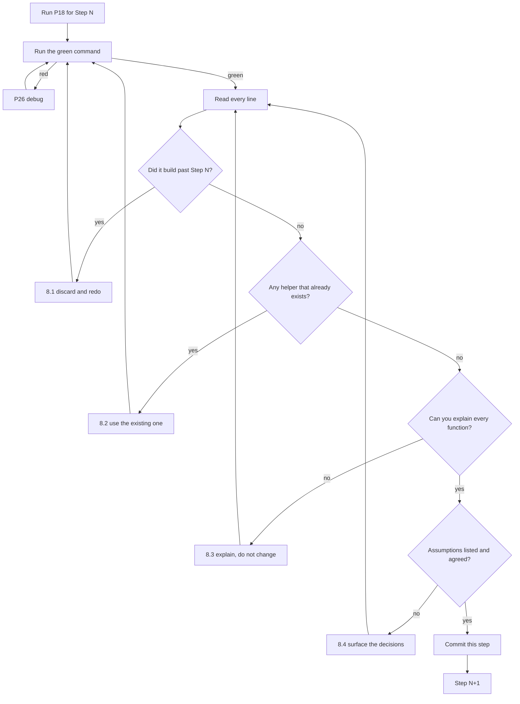

# P18 — Implement a Story

← [Previous](../phase-3-planning/P17-definition-of-done.md) · [Library index](../README.md) · Next: [P19](P19-build-the-ui-from-the-brief.md)

> **One line:** Build one story, one verifiable step at a time, with the app running after each.

| | |
|---|---|
| **Phase** | 4 — Build |
| **Who runs it** | Backend Engineer (Tomas Vargas) |
| **When** | Every build day, once per step of the implementation plan |
| **Takes in** | `artifacts/stories/NWD-103.md`, `artifacts/acceptance-criteria-NWD-103.md`, `artifacts/spec-confidence-gate.md`, `artifacts/implementation-plan-NWD-103.md`, `artifacts/definition-of-done.md`, `artifacts/CLAUDE.md` |
| **Produces** | Working code — for the worked example, `code/doc_ingestion/core/confidence.py` and its tests |
| **Hands off to** | Frontend Engineer (Ji-woo Park) for [P19](P19-build-the-ui-from-the-brief.md); the same author for [P20](P20-write-tests-alongside-the-code.md) |
| **Time to run** | 15–40 minutes per step, including reading what came back |

---

## 1. The scene

Tuesday, day two of Sprint 2. Tomas Vargas has NWD-101 finished — PDFs land immutably in the raw zone — and he's opening NWD-103, the flagship story of the whole project: gate every extracted field on its confidence score.

He has more supporting material than he's ever had for a story. Sofia's spec says what the gate must do. Amara's acceptance criteria say when it's finished. Rahul's implementation plan from [P15](../phase-3-planning/P15-implementation-plan.md) has eight steps, and Step 0 — the spike — came back yesterday afternoon with an answer: yes, line items carry per-cell confidence, but only on fields the custom model was labelled for, and one of Broker Alpha's columns wasn't. Half a day of relabelling, already done.

So he's at Step 1. And Step 1 says something that looks, at first glance, a bit odd:

> Add the default threshold table, an `ExtractedField` value type and a `GateResult` value type. **No Azure imports, no I/O, no config reading — this module takes everything it needs as arguments.**

Tomas's first instinct is to argue with it. The gate needs the per-broker overrides from `config/sources.yaml`. Why not just read the file? It's one import and one function call. Passing thresholds in from the caller means `core/rules.py` has to do the resolving, which makes the call site messier.

He raises it with Rahul, who gives him an answer that takes about forty seconds and turns out to matter more than either of them expects: **if this module imports nothing, you can test it with four lines of setup instead of a mocking framework.** And a gate you can't easily test is a gate nobody will extend.

Three weeks later, when Ananya files NWD-142 and Tomas has to change how line items are counted, that decision is why the fix takes an afternoon instead of two days.

The temptation on day two is to paste the whole spec into a chat window and type "implement this". That gets you four hundred lines in ninety seconds and comprehension debt that comes due in Sprint 3. **This prompt exists to make you build the same thing in eight pieces you can actually check.**

---

## 2. What this prompt actually does — in plain language

### The problem

You have a story, a spec and a plan. You need code. The obvious approach — describe the whole thing to an AI and let it build — fails, and it fails in a specific way that's worth naming precisely.

It doesn't fail by producing bad code. That's the surprising part. The code that comes back from "implement this spec" is usually *fine*: plausibly structured, reasonably named, mostly correct. It fails because of what happens to you, the human, on the other end.

Four hundred lines land in your editor at once. You didn't write any of them, so your understanding of them starts at zero. To review them properly you'd need to read every line carefully, which takes about forty minutes and requires holding the whole design in your head simultaneously. You have a sprint to finish. So you skim, run the tests, see green, and merge.

That's **comprehension debt** — code in your repository that nobody on the team can currently explain. It doesn't hurt today. It hurts in six weeks when something breaks in it, at which point you're debugging a codebase you've never read, written by something you can't ask.

The Definition of Done ([P17](../phase-3-planning/P17-definition-of-done.md)) has a clause — D7 — that says a human has read every line the AI wrote. **This prompt is the mechanism that makes D7 possible rather than aspirational.** Forty lines with a green command is a four-minute read. Four hundred lines is not.

### The shape: one step, verified, then stop

The prompt does one step of the implementation plan. Not the story. Not two steps. One.

The loop is:

```text
1. Give the AI ONE step from the plan, plus the surrounding context.
2. It writes the code for that step and nothing else.
3. It gives you the verification command.
4. You run the command. Green or red.
5. You READ the code. Every line.
6. You commit.
7. Next step.
```

Five things about this loop are worth spelling out.

**Step 2's "and nothing else" is the hard part.** Models want to be helpful. Given the confidence gate, they will offer the line-item handling too, because they can see it coming. That's the failure this prompt spends the most instruction budget preventing.

**Step 4 comes before step 5, deliberately.** Run the command first. If it's red, there's no point reading the code carefully — something's wrong and you'll re-read after the fix. Green first, then read.

**Step 5 is the whole point.** Everything else is scaffolding to make step 5 achievable. If you skip it, you have automated the production of code you don't understand, which is a worse position than writing it slowly yourself.

**Step 6, committing per step, is what gives you a bisect history.** If something breaks at step 6, `git bisect` walks you back to the exact step that did it. With one giant commit you get nothing.

**Step 7 starts a fresh cycle, not a fresh conversation.** Keep the session — the model has useful context about what it just built. Just don't let that context turn into permission to build ahead.

### The Northwind example, so you know what we're building

**What the confidence gate is, in one line.** Every number pulled off a PDF comes with a score saying how sure the extraction service was. The gate compares that score to a limit. Below the limit, the document doesn't go into the database — it goes to a human.

**Why it exists.** Northwind reconciles internal records from BlackRock Aladdin against counterparty statements that arrive as PDFs. If a wrong number gets into the warehouse, reconciliation reports a break that isn't real, and after a few of those, operations stops trusting the break report entirely. **A wrong number is worse than no number.**

**The thresholds**, from the spec, which the gate must honour:

| Field type | Threshold | Why this number |
|---|---|---|
| Currency (market value, price) | 0.90 | Money. Highest consequence if wrong |
| Number / quantity | 0.90 | A wrong quantity is a wrong position |
| Date | 0.85 | Dates are structurally constrained, so OCR errors are more often caught by parsing |
| String / descriptive | 0.75 | A slightly wrong security *name* doesn't corrupt a number; a human can still read it |

Broker Alpha overrides currency to **0.92** because their scan quality is poor. That override lives in `config/sources.yaml`, not in code, because adding a counterparty must never be a code change.

**And the invariant that shapes everything:** one failing field sends the *whole document* to review. Not the field, not the row. The whole document. Partial ingestion of a statement produces a reconciliation break that looks exactly like a real settlement failure, and chasing one of those costs an operations analyst half a day.

### Why the gate is pure — this is the part that matters

Here's the critical teaching point, the one the assignment for this file specifically wants nailed down.

`core/confidence.py` imports nothing except the Python standard library. No Azure SDK. No `yaml`. No database client. No logging handler. It receives every single thing it needs as a function argument, and it returns a value. That's it.

**This is a design decision, not an accident, and it is the highest-leverage decision in the whole story.**

Consider the alternative, which is what most people would write. The gate reads `config/sources.yaml` itself to get the broker override. It calls the Document Intelligence client to fetch the extraction result. It writes rejections to Azure SQL. All perfectly reasonable — that's what the gate *does*, after all.

Now try to test it.

```python
# What a test looks like when the module has dependencies
@patch("core.confidence.yaml.safe_load")
@patch("core.confidence.DocumentIntelligenceClient")
@patch("core.confidence.get_sql_connection")
def test_currency_below_threshold_is_rejected(mock_sql, mock_di, mock_yaml):
    mock_yaml.return_value = {"broker_alpha": {"thresholds": {"currency": 0.92}}}
    mock_di.return_value.analyze_document.return_value = _build_fake_azure_response()
    mock_sql.return_value.cursor.return_value = MagicMock()
    ...
```

A **mock** is a fake stand-in for a real dependency, used in tests so you don't need the real thing. Mocking isn't wrong, and sometimes there's no alternative. But look at what that test costs:

- You need `_build_fake_azure_response()`, a helper that fabricates Azure's exact JSON shape. Sixty lines, and it will drift out of date when Azure changes.
- The test now depends on the *internal structure* of the module — that it calls `yaml.safe_load`, that the client is named `DocumentIntelligenceClient`. Rename anything and the test breaks without the behaviour changing.
- You cannot tell, reading the test, what business rule is being checked. It's buried under setup.
- Adding a fifth test means repeating all of it.

Now the pure version:

```python
def test_currency_below_threshold_is_rejected():
    result = evaluate_document(
        {"market_value": ExtractedField("market_value", 1_250_000.00, 0.89, "currency")}
    )
    assert result.passed is False
    assert result.failures[0].reason == "BELOW_THRESHOLD"
```

Four lines. No mocks. No fixture files. No knowledge of Azure. And you can read it and immediately see the rule: money at 0.89 fails.

The trade is real and worth stating honestly: **the caller gets slightly uglier.** `core/rules.py` now has to load the YAML, resolve the thresholds, reshape Azure's response into `ExtractedField` objects, and then call the gate. That's about fifteen extra lines in `rules.py` that would otherwise have been inside `confidence.py`.

Fifteen lines of slight awkwardness in one file, in exchange for a core business rule that can be tested in four lines and understood in one sitting.

**Why it pays off in the rework chapter.** When Ananya files NWD-142 — the bug where line items on page two of a Broker Alpha statement are silently dropped — Tomas has to change how the gate counts and validates line items. Because the gate is pure, he can write a failing test for the new behaviour in about ninety seconds, watch it go red, change the module, and watch it go green. The whole fix cycle is minutes.

Had the gate been tangled up with the Azure client and the YAML loader, that same fix would have required updating the fake Azure response builder, re-checking three mocks, and running a test suite that takes ninety seconds instead of two. Not impossible — just slow enough that you'd be tempted to test it by hand instead. And "I tested it by hand" is how a fix ships without a regression test, which is how the same bug comes back.

The general rule, which Sofia states in her ADR and which is worth stealing:

> **Push the decisions to the edges and keep the rules in the middle.** I/O, configuration and network calls live at the boundary of your system. Business rules live in the middle, where they can be tested without any of it.

### The stop gate, and why it's the most important line

The single most common failure of this prompt is that the AI builds ahead. You ask for Step 1 and get Steps 1 through 4, because the model can see the plan and it's trying to be useful.

This defeats the entire purpose. You're back to a large chunk you'll skim.

So the prompt says stop, and it says it early — in the second paragraph, not the last. Instructions near the end are read after the model has already formed a plan for what it's producing. The stop gate needs to be read before that happens.

It's phrased two ways deliberately: what to do (implement Step N) and what not to do (write no code for any other step, even if you can see it's needed). Models respect explicit negatives better than implied ones.

### What the AI is actually doing

Three distinct activities, needing different amounts of your scepticism:

**Translating a described behaviour into idiomatic code.** Very good. This is what the technology is best at. Given "reject a currency field below 0.90", it produces correct, readable Python with reasonable naming and type hints.

**Following your repository's conventions.** Only as good as the context you give it. It cannot know you use `pytest` fixtures rather than setup methods, or that `core/` modules never log directly, unless a file tells it. That's what `artifacts/CLAUDE.md` from [P01](../phase-0-foundation/P01-generate-the-project-context-file.md) is for.

**Deciding what the code should do when the spec is silent.** This is the dangerous one. The spec doesn't say what happens when a field has a value but a null confidence. The model will decide — probably sensibly, possibly not — and it will not tell you it decided. The prompt therefore requires an explicit "Assumptions I had to make" section, which turns a silent decision into a line you can read and either accept or override.

That section is worth its weight. In the sample output below it surfaces two real gaps in Sofia's spec, both of which end up as one-line spec updates under D9 of the Definition of Done.

### The one idea to keep

**Small enough to read is the requirement. Everything else is how you get there.**

---

## 3. The prompt

Run this once per step. Keep the session open across steps — the accumulated context is useful — but issue this prompt fresh each time with a new step number.

```text
You are a [LANGUAGE] engineer implementing ONE step of an agreed implementation
plan. You are not implementing the story.

**STOP GATE — read before anything else.**
You will implement **Step [STEP NUMBER] only**. Do not write, sketch, stub or
scaffold code for any other step, even if you can see it will be needed, even if
it is two lines. If Step [STEP NUMBER] leaves something incomplete, that is
correct and intended. Say what is incomplete; do not fix it.

**Read** these completely first:
- Story: [STORY PATH]
- Acceptance criteria: [ACCEPTANCE CRITERIA PATH]
- Technical spec: [SPEC PATH]
- Implementation plan: [IMPLEMENTATION PLAN PATH]
- Definition of Done: [DEFINITION OF DONE PATH]
- Repository conventions: [PROJECT CONTEXT PATH]

**Before writing code, list in five bullets or fewer:**
- What Step [STEP NUMBER] must produce
- Which acceptance criteria it moves toward (by number)
- Which existing files or functions in this repository you will call
- Anything the spec does not say that you will have to decide
- Anything that makes you think the step as written is wrong

**Existing code you must use rather than re-create:**
[EXISTING MODULES AND WHAT THEY DO]

**Design constraints for this step:**
[DESIGN CONSTRAINTS]

**Then write the code.** Rules:

1. **Only the files named in Step [STEP NUMBER].** If you believe another file
   must change, stop and say so instead of changing it.
2. **The application must still run after this change.** The green command is:
   `[GREEN COMMAND]`
3. **Use what already exists.** Before writing any helper, search the repository
   for one that already does it. If you write a new helper, say in one line why
   the existing options did not fit.
4. **No code that nothing calls.** No convenience wrappers, no "might be useful"
   utilities, no alternative entry points. Definition of Done clause D2.
5. **Type hints on every public function.** Docstrings stating what the function
   returns when the input is invalid.
6. **No secrets, no credentials, no connection strings**, including in comments
   and test data.
7. **No PII in any log line, exception message or test fixture.** Field names,
   reason codes and numbers only — never field values.

**Then give me, in this order:**
- The complete file(s), ready to paste, not a diff and not fragments.
- The exact verification command, and what I should see when it passes.
- **Assumptions I had to make** — every decision you took that the spec did not
  cover, one line each. If there are none, say "none" explicitly.
- **What still does not work** after this step, in one line.
- The one-line summary of what Step [NEXT STEP NUMBER] would be. Do not implement it.

**Do not:**
- Do not implement any step other than [STEP NUMBER].
- Do not write tests unless this step's plan entry names test files. Tests have
  their own prompt.
- Do not refactor code you were not asked to touch, however tempting.
- Do not add logging, metrics, retries, caching or error handling that the step
  does not call for.
- Do not modify an existing test to make anything pass. Definition of Done clause D8.
- Do not explain the code back to me at length. Short comments in the code, then stop.

**You are done when:** the files named in Step [STEP NUMBER] exist, the green
command passes, every assumption is listed, and nothing outside the step changed.
```

---

## 4. Every placeholder, explained

| Placeholder | What to put in it | Northwind example | What happens if you get it wrong |
|---|---|---|---|
| `[LANGUAGE]` | Language and version | `Python 3.11` | You get syntax your runtime doesn't support. `match` statements on 3.9, `X \| None` on 3.8 |
| `[STEP NUMBER]` | One step. One. | `1` | Give it a range and every guardrail in the prompt collapses — you're back to a big-bang generation |
| `[NEXT STEP NUMBER]` | The step after this one | `2` | Minor, but naming it stops the model drifting into it "for continuity" |
| `[STORY PATH]` | The story being built | `artifacts/stories/NWD-103.md` | The code loses its purpose. Correct mechanics, wrong intent |
| `[ACCEPTANCE CRITERIA PATH]` | The AC from [P08](../phase-1-discovery/P08-write-acceptance-criteria.md) | `artifacts/acceptance-criteria-NWD-103.md` | The model can't say which criteria the step moves toward, so you can't tell how far through the story you are |
| `[SPEC PATH]` | The technical spec | `artifacts/spec-confidence-gate.md` | The thresholds get invented. They'll look plausible and be wrong |
| `[IMPLEMENTATION PLAN PATH]` | The plan from [P15](../phase-3-planning/P15-implementation-plan.md) | `artifacts/implementation-plan-NWD-103.md` | No step boundaries exist, so "Step 1 only" means nothing |
| `[DEFINITION OF DONE PATH]` | The DoD from [P17](../phase-3-planning/P17-definition-of-done.md) | `artifacts/definition-of-done.md` | The dead-code, no-secrets and no-PII rules aren't enforced during generation, so you catch them in review instead |
| `[PROJECT CONTEXT PATH]` | Repo conventions from [P01](../phase-0-foundation/P01-generate-the-project-context-file.md) | `artifacts/CLAUDE.md` | Wrong folder layout, wrong test framework, wrong logging pattern. All correct in general and wrong here |
| `[EXISTING MODULES AND WHAT THEY DO]` | What's already in the repo, one line each | `core/clients.py — DefaultAzureCredential wiring; core/extract.py — calls the custom model and persists to bronze; config/settings.py — settings loader` | The most common real failure: a second implementation of something you already have. See §8.2 |
| `[DESIGN CONSTRAINTS]` | Non-obvious shape decisions for this step | `core/confidence.py must import only the standard library. No Azure SDK, no yaml, no DB. Thresholds are passed in by the caller.` | You lose the purity decision, and with it the four-line tests. This is the highest-value placeholder in the table |
| `[GREEN COMMAND]` | The command that proves the app still runs | `pytest -q && python -c "import doc_ingestion.function_app"` | "Verify" becomes advisory. Steps land that break the import and you find out three steps later |

---

## 5. The filled-in example

Tomas runs this on Tuesday morning, day two, in a session opened at the repository root with the Sprint 1 artifacts committed. Step 0's spike is already deleted.

```text
You are a Python 3.11 engineer implementing ONE step of an agreed implementation
plan. You are not implementing the story.

**STOP GATE — read before anything else.**
You will implement **Step 1 only**. Do not write, sketch, stub or scaffold code
for any other step, even if you can see it will be needed, even if it is two
lines. If Step 1 leaves something incomplete, that is correct and intended. Say
what is incomplete; do not fix it.

**Read** these completely first:
- Story: artifacts/stories/NWD-103.md
- Acceptance criteria: artifacts/acceptance-criteria-NWD-103.md
- Technical spec: artifacts/spec-confidence-gate.md
- Implementation plan: artifacts/implementation-plan-NWD-103.md
- Definition of Done: artifacts/definition-of-done.md
- Repository conventions: artifacts/CLAUDE.md

**Before writing code, list in five bullets or fewer:**
- What Step 1 must produce
- Which acceptance criteria it moves toward (by number)
- Which existing files or functions in this repository you will call
- Anything the spec does not say that you will have to decide
- Anything that makes you think the step as written is wrong

**Existing code you must use rather than re-create:**
- core/clients.py — DefaultAzureCredential wiring for Document Intelligence,
  Blob and Key Vault. No API keys anywhere in this repo.
- core/extract.py — calls the custom extraction model and persists the raw
  response to bronze/ before anything is parsed.
- config/settings.py — settings loader reading environment and Key Vault.
- config/sources.yaml — one block per counterparty; broker_alpha and
  broker_beta_em, each with model_id and field_map.
- tests/ — pytest configured, currently green.

**Design constraints for this step:**
- core/confidence.py must import ONLY the Python standard library. No Azure SDK,
  no yaml, no database client, no logging handler.
- Every input arrives as a function argument. The module reads no file and makes
  no network call.
- Thresholds are resolved by the CALLER and passed in. The module owns the
  defaults and the comparison logic, not the configuration source.
- The result type is the contract that the exception queue UI, the Snowflake
  MIN_CONFIDENCE column and the straight-through metric all depend on. Name its
  fields carefully; they are expensive to change later.

**Then write the code.** Rules:

1. **Only the files named in Step 1.** If you believe another file must change,
   stop and say so instead of changing it.
2. **The application must still run after this change.** The green command is:
   `pytest -q && python -c "import doc_ingestion.function_app"`
3. **Use what already exists.** Before writing any helper, search the repository
   for one that already does it. If you write a new helper, say in one line why
   the existing options did not fit.
4. **No code that nothing calls.** Definition of Done clause D2.
5. **Type hints on every public function.** Docstrings stating what the function
   returns when the input is invalid.
6. **No secrets, no credentials, no connection strings.**
7. **No PII in any log line, exception message or test fixture.**

**Then give me, in this order:**
- The complete file(s), ready to paste, not a diff and not fragments.
- The exact verification command, and what I should see when it passes.
- **Assumptions I had to make** — every decision the spec did not cover.
- **What still does not work** after this step, in one line.
- The one-line summary of what Step 2 would be. Do not implement it.

**Do not:**
- Do not implement any step other than 1.
- Do not write tests unless Step 1 names test files. (It does name
  tests/test_confidence.py — write those, and nothing beyond them.)
- Do not refactor code you were not asked to touch.
- Do not add logging, metrics, retries, caching or error handling the step does
  not call for.
- Do not modify an existing test to make anything pass.
- Do not explain the code back to me at length.

**You are done when:** the files named in Step 1 exist, the green command passes,
every assumption is listed, and nothing outside the step changed.
```

---

## 6. What comes back

The response opens with the five bullets, then the file. This is the real thing, lightly trimmed.

### The pre-flight bullets

```text
- Step 1 must produce core/confidence.py containing the default threshold table,
  an ExtractedField input type, a GateResult output type, and evaluate_document
  handling top-level fields only. Plus tests/test_confidence.py.
- Moves toward AC-1 (currency below threshold rejected), AC-2 (date at 0.86
  passes), AC-4 (missing value is a failure), AC-5 (null confidence never
  auto-accepts). Does NOT touch AC-3 (per-broker override, Step 2) or AC-6
  (one bad line item fails the document, Step 3).
- Calls nothing. This module has no dependencies by constraint.
- The spec does not say what to do when field_type is a value not in the
  threshold table, and does not define straight_through precisely enough to
  implement. I have made a decision on each; both are listed below.
- One concern with the step as written: GateResult.straight_through is listed in
  the plan but the spec never defines it against a resubmitted document. See
  Assumptions.
```

### `code/doc_ingestion/core/confidence.py`

```python
"""Confidence gating for extracted counterparty documents.

Pure logic. This module imports only the standard library: no Azure SDK, no
YAML, no database client, no logging handler. Everything it needs arrives as a
function argument and everything it produces is returned.

That is deliberate. The gate is the single business rule that decides whether a
document reaches the warehouse or reaches a human, and it must be testable
without a single mock. See ADR-0002 and spec-confidence-gate.md §3.

Threshold defaults come from spec-confidence-gate.md §3.1. Per-counterparty
overrides live in config/sources.yaml and are resolved by the caller
(core/rules.py) — this module never reads configuration.
"""

from __future__ import annotations

from dataclasses import dataclass
from typing import Mapping, Sequence

# --- Field types ------------------------------------------------------------

CURRENCY = "currency"
NUMBER = "number"
DATE = "date"
STRING = "string"

#: Default minimum confidence per field type (spec §3.1).
#: Money and quantities are gated hardest because a wrong number is worse than
#: no number. Descriptive strings are gated loosest because a slightly wrong
#: security name does not corrupt a position.
DEFAULT_THRESHOLDS: Mapping[str, float] = {
    CURRENCY: 0.90,
    NUMBER: 0.90,
    DATE: 0.85,
    STRING: 0.75,
}

#: Applied when a field arrives with a type we do not recognise. Fails closed:
#: an unknown type is gated at the strictest threshold we have, never the
#: loosest. See Assumption 1.
STRICTEST_THRESHOLD: float = max(DEFAULT_THRESHOLDS.values())

# --- Failure reason codes ---------------------------------------------------
# These strings reach the exception queue UI and the telemetry event. They are
# part of the data contract; do not rename without updating
# data-contract-counterparty-position.md §4.

BELOW_THRESHOLD = "BELOW_THRESHOLD"
MISSING_VALUE = "MISSING_VALUE"
NULL_CONFIDENCE = "NULL_CONFIDENCE"
UNKNOWN_FIELD_TYPE = "UNKNOWN_FIELD_TYPE"


@dataclass(frozen=True)
class ExtractedField:
    """One field pulled off a document by the extraction model.

    `value` is None when the model found no value at all. `confidence` is None
    when the model returned a value without a score — which happens, and which
    must never be treated as certainty.
    """

    name: str
    value: object | None
    confidence: float | None
    field_type: str


@dataclass(frozen=True)
class FieldFailure:
    """One reason a document is not allowed through the gate."""

    field_name: str
    field_type: str
    confidence: float | None
    threshold: float
    reason: str
    line_item_index: int | None = None

    def describe(self) -> str:
        """Human-readable reason for the exception queue.

        Contains no field VALUE — names, codes and numbers only, so this string
        is safe to log and safe to render. Definition of Done clause D13.
        """
        where = (
            f"line item {self.line_item_index}"
            if self.line_item_index is not None
            else "document header"
        )
        if self.reason == MISSING_VALUE:
            return f"{self.field_name} ({where}): no value extracted"
        if self.reason == NULL_CONFIDENCE:
            return f"{self.field_name} ({where}): no confidence score returned"
        if self.reason == UNKNOWN_FIELD_TYPE:
            return (
                f"{self.field_name} ({where}): unrecognised field type "
                f"'{self.field_type}', gated at {self.threshold:.2f}"
            )
        return (
            f"{self.field_name} ({where}): confidence {self.confidence:.4f} "
            f"below required {self.threshold:.2f}"
        )


@dataclass(frozen=True)
class GateResult:
    """The gate's verdict on one document.

    `passed`          — may this document continue downstream?
    `failures`        — every reason it may not, in document order. Empty when passed.
    `min_confidence`  — lowest confidence seen across all checked fields, or None
                        if no field carried a score. Carried to Snowflake as
                        MIN_CONFIDENCE for audit.
    `straight_through`— did this document cost a human nothing? False for any
                        document that has already been through the exception
                        queue, even when it now passes. This is the field the
                        headline metric reads; `passed` is not.
    `fields_checked`  — how many fields were evaluated, header plus line items.
    """

    passed: bool
    failures: tuple[FieldFailure, ...]
    min_confidence: float | None
    straight_through: bool
    fields_checked: int

    @property
    def review_reason(self) -> str | None:
        """One-line summary for the exception queue list view, or None if passed."""
        if self.passed:
            return None
        first = self.failures[0]
        extra = len(self.failures) - 1
        suffix = f" (+{extra} more)" if extra else ""
        return f"{first.describe()}{suffix}"


def resolve_thresholds(overrides: Mapping[str, float] | None = None) -> dict[str, float]:
    """Merge per-counterparty overrides over the defaults.

    The caller reads overrides from config/sources.yaml; this function only
    merges. Returns the defaults unchanged when `overrides` is None or empty.
    An override for an unknown field type is kept, not rejected — that is how a
    new field type is introduced without a code change.
    """
    resolved = dict(DEFAULT_THRESHOLDS)
    if overrides:
        resolved.update(overrides)
    return resolved


def threshold_for(field_type: str, thresholds: Mapping[str, float]) -> tuple[float, bool]:
    """Return (threshold, is_known) for a field type.

    An unrecognised type is gated at the strictest configured threshold and
    reported as unknown, so it fails closed rather than slipping through on the
    loosest rule.
    """
    if field_type in thresholds:
        return thresholds[field_type], True
    return max(thresholds.values(), default=STRICTEST_THRESHOLD), False


def evaluate_field(
    field: ExtractedField,
    thresholds: Mapping[str, float],
    *,
    line_item_index: int | None = None,
) -> FieldFailure | None:
    """Check one field. Returns a FieldFailure, or None if the field is fine.

    Order of checks matters and is deliberate:
      1. No value at all  -> MISSING_VALUE, whatever the confidence says.
      2. No confidence    -> NULL_CONFIDENCE. Absence of a score is never
                             treated as a high score.
      3. Unknown type     -> UNKNOWN_FIELD_TYPE if it also fails the strictest
                             threshold; a strong unknown-type field is allowed.
      4. Below threshold  -> BELOW_THRESHOLD.
    """
    threshold, is_known = threshold_for(field.field_type, thresholds)

    if field.value is None or field.value == "":
        return FieldFailure(
            field_name=field.name,
            field_type=field.field_type,
            confidence=field.confidence,
            threshold=threshold,
            reason=MISSING_VALUE,
            line_item_index=line_item_index,
        )

    if field.confidence is None:
        return FieldFailure(
            field_name=field.name,
            field_type=field.field_type,
            confidence=None,
            threshold=threshold,
            reason=NULL_CONFIDENCE,
            line_item_index=line_item_index,
        )

    if field.confidence < threshold:
        return FieldFailure(
            field_name=field.name,
            field_type=field.field_type,
            confidence=field.confidence,
            threshold=threshold,
            reason=UNKNOWN_FIELD_TYPE if not is_known else BELOW_THRESHOLD,
            line_item_index=line_item_index,
        )

    return None


def evaluate_document(
    fields: Mapping[str, ExtractedField],
    line_items: Sequence[Mapping[str, ExtractedField]] = (),
    *,
    threshold_overrides: Mapping[str, float] | None = None,
    prior_review: bool = False,
) -> GateResult:
    """Gate a whole document.

    `fields`      — header fields, keyed by name.
    `line_items`  — ordered rows; each row is a mapping of field name to field.
                    Order is significant: the index becomes line_item_index on
                    any failure, and that is what points the analyst at a row.
    `threshold_overrides` — per-counterparty overrides, already loaded by the caller.
    `prior_review` — True when this document has already been corrected by a
                    human. It may pass, but it is never straight-through.

    A single failing field anywhere fails the whole document. Partial ingestion
    of a statement produces a reconciliation break indistinguishable from a real
    settlement failure. Spec §2, invariant 2.

    Returns a GateResult with passed=True and no failures when `fields` and
    `line_items` are both empty — an empty document has nothing to reject. The
    caller is responsible for deciding an empty extraction is itself an error.
    """
    thresholds = resolve_thresholds(threshold_overrides)

    failures: list[FieldFailure] = []
    confidences: list[float] = []
    checked = 0

    for field in fields.values():
        checked += 1
        if field.confidence is not None:
            confidences.append(field.confidence)
        failure = evaluate_field(field, thresholds)
        if failure is not None:
            failures.append(failure)

    for index, row in enumerate(line_items):
        for field in row.values():
            checked += 1
            if field.confidence is not None:
                confidences.append(field.confidence)
            failure = evaluate_field(field, thresholds, line_item_index=index)
            if failure is not None:
                failures.append(failure)

    passed = not failures
    return GateResult(
        passed=passed,
        failures=tuple(failures),
        min_confidence=min(confidences) if confidences else None,
        straight_through=passed and not prior_review,
        fields_checked=checked,
    )
```

### The verification

```text
Verify with:

    pytest -q tests/test_confidence.py

Expected:  4 passed

Then confirm the application still imports:

    python -c "import doc_ingestion.function_app"

Expected: no output, exit code 0. Nothing imports core/confidence.py yet, so
this only proves you have not broken anything.
```

### Assumptions I had to make

```text
1. UNKNOWN FIELD TYPE. The spec §3.1 lists four field types and does not say
   what happens to a fifth. I gate an unrecognised type at the STRICTEST
   configured threshold rather than the loosest, and report UNKNOWN_FIELD_TYPE
   when it fails. Rationale: invariant 1, "a wrong number is worse than no
   number". A new field type appearing should send documents to review, not
   through the gate unchecked. This needs a line in the spec.

2. STRAIGHT-THROUGH ON RESUBMISSION. The plan lists straight_through on
   GateResult but the spec never defines it for a document an analyst has
   already corrected and resubmitted. I have added a `prior_review` argument
   defaulting to False, and straight_through is False whenever it is True. A
   document a human fixed cost a human something and must not count toward the
   85% target. This is a business decision, not a technical one — confirm with
   Amara.

3. EMPTY VALUE STRING. I treat "" as missing, the same as None. The spec says
   "no value extracted" without defining it. An empty string from OCR is not a
   value.

4. MIN_CONFIDENCE WHEN NOTHING HAS A SCORE. Returns None rather than 0.0.
   0.0 would be indistinguishable from a genuine zero-confidence field in the
   Snowflake column.
```

### What still does not work

```text
Nothing calls the gate. Per-counterparty overrides are accepted as an argument
but nothing loads them from config/sources.yaml. Line items are gated correctly
if you pass them, but no caller builds that structure yet.
```

```text
Step 2 would be: load broker_alpha's currency: 0.92 override from
config/sources.yaml and pass it through resolve_thresholds. Not implemented.
```

### How to read this

Three things carry the weight, and one is commonly wrong.

**The module docstring.** It says the module imports only the standard library and it says *why*. That paragraph is the design decision written where the next person will read it, and it's the difference between a constraint that survives six months and one that quietly erodes the first time someone needs a config value.

**The check order inside `evaluate_field`.** Missing value, then null confidence, then threshold. That order encodes two of the acceptance criteria directly. A field with `value=None, confidence=0.99` fails on the first check — high confidence in nothing is still nothing. A field with a good value and `confidence=None` fails on the second — absence of a score is not a high score. Both of these are ways people accidentally build a gate that lets bad data through, and both are one `if` away from being wrong.

**The `straight_through` field and the `prior_review` argument.** This is the most interesting thing in the file and it came out of Assumption 2. `passed` and `straight_through` differ in exactly one case: a document a human already fixed. That case is the whole reason the headline metric — 61% today, 85% target — means anything. Without it, every analyst correction inflates the number the project is judged by.

**The part that is commonly wrong:** the `UNKNOWN_FIELD_TYPE` reason is only reported when the field also fails the strict threshold. A strong unknown-type field passes silently and nobody learns that an unrecognised type appeared. Tomas spotted this on the read-through and it became a one-line addition in Step 4, where the caller logs unknown types regardless of outcome. **That is exactly what reading every line is for** — the code is not wrong, it's just quieter than it should be, and no test would have told you.

---

## 7. Why this is the final prompt

**What "done" means here.** The step is done when the green command passes, you have read every line, and you could explain any function in the file to Rahul without opening it again.

That last condition is D7 of the Definition of Done and it's the real gate. Everything else can be checked by a machine.

**The checklist:**

- [ ] The green command passes — you ran it, you didn't assume it
- [ ] You read every line, and you had at least one reaction. Zero reactions to 150 lines means you skimmed
- [ ] The Assumptions section exists and you agree with every entry, or you've overridden it
- [ ] Nothing outside the step's named files changed — check `git status`, not memory
- [ ] No helper was written that duplicates something already in the repo
- [ ] Nothing in the change is uncalled, unless it's this step's public entry point
- [ ] "What still does not work" matches what the plan said would still be missing

**Why you should stop rather than keep prompting.** The failure mode here is **prompting past the step**. The code works, you can see step 2 is small, and asking for it costs nothing.

It costs the checkpoint. That's the entire thing you bought with the plan. The moment you take two steps in one prompt, the review gets longer, the commit gets bigger, and the bisect history stops being useful. It feels like it saves five minutes and it removes the property that makes the whole approach work.

There's a second, subtler version: asking the model to improve the code it just wrote. "Can you make this more elegant?" produces a different file that you now have to read from scratch. If the code passes and you understand it, it is finished. Elegance that costs a re-read is a bad trade.

**The signal that you are NOT done:** you read the file and there's a section you'd have to trace through carefully to explain. That's not a defect in the code — it might be perfectly correct — it's an unpaid comprehension debt, and §8.3 is how you settle it.

---

## 8. When it is not done — the follow-up prompts

| What you're seeing | What's actually wrong | Run this next |
|---|---|---|
| It implemented steps 1 through 4 | The stop gate didn't hold | §8.1 |
| There's a `_load_yaml_config` helper and `config/settings.py` already does that | It couldn't see your repo, or you didn't tell it what's there | §8.2 |
| Tests pass, you read it, you still can't say whether it's right | Comprehension debt. The commonest and least-discussed state | §8.3 |
| "Assumptions: none" but the spec is clearly silent on something | It decided silently, which is the thing you were trying to prevent | §8.4 |
| Three helper functions nothing calls | Generosity. DoD clause D2 | §8.5 |
| The green command fails | An actual bug, in your code or the plan's assumptions | **[P26](../phase-6-rework/P26-debug-an-error-fast.md)** |
| The step can't be built as written because the spec is wrong | Not a code problem | **[P29](../phase-6-rework/P29-the-spec-was-wrong.md)** |
| Four rounds in and it's producing variations, not progress | It's stuck, and more prompting makes it worse | **[P30](../phase-6-rework/P30-when-the-ai-is-stuck.md)** |
| No tests exist for the new behaviour | You're at the next prompt | **[P20](P20-write-tests-alongside-the-code.md)** |

### 8.1 "It wrote the whole thing at once instead of step by step"

The most common failure, and the most important to fix immediately rather than absorb. Use this the moment you see files from later steps.

```text
You implemented more than Step [N]. The following are outside its scope:

[LIST THE FILES AND FUNCTIONS THAT BELONG TO LATER STEPS]

**Discard all of it.** Do not adapt it, do not keep the useful parts, do not
"leave it in since it's already written."

**Reproduce Step [N] alone**, containing only what the plan's Step [N] entry
names. It is correct for the result to be incomplete. State what is incomplete
rather than completing it.

Then answer one question in one sentence: which instruction in my prompt led you
to build beyond the step? I want to fix the prompt, not just this output.
```

What changes: you get the smaller file. The last question is worth asking — the answer is usually that the plan's step description mentioned a later step as motivation ("so that Step 3 can iterate line items"), and the model read that as a requirement. Trim the forward references out of your step descriptions and this mostly stops happening.

**Do not keep the extra code.** It is tempting — it's written, it looks fine, deleting it feels wasteful. But it is code nobody has reviewed, produced in exactly the mode this whole approach exists to avoid, and keeping it means your next commit is four steps wide. Throw it away. Regenerating it later costs ninety seconds.

### 8.2 "It invented a helper that already exists in the repo"

Use this when you spot a new function doing something you already have. It happens most with config loading, retry logic, date parsing and logging setup.

```text
You wrote `[NEW HELPER NAME]` in `[FILE]`. This repository already has
`[EXISTING FUNCTION]` in `[EXISTING FILE]`, which does [WHAT IT DOES].

**Remove** your helper and call the existing one.

If the existing function genuinely does not fit, do not work around it and do
not wrap it. Instead:
1. State in one sentence what it does that is wrong for this case.
2. Propose the smallest possible change to the EXISTING function that would make
   it fit.
3. Stop, and let me decide. Do not make that change.

Then scan the rest of this step's code for the same problem: for every function
you wrote, name the repository search you did to check it did not already exist.
If you did not search, say so.
```

What changes: the duplicate goes and the call site gets shorter. The "name the search you did" line is the useful one — it surfaces that the model often doesn't search at all, which tells you your `[EXISTING MODULES]` block needs to be fuller next time.

Why this matters more than it looks: duplicated helpers don't cause bugs immediately. They cause them in four months when someone fixes a timezone bug in one copy. Kestrel had exactly this on the previous engagement — two date parsers, one fixed, one not — and it cost a day of confusion.

### 8.3 "The code runs but I can't tell if it's right"

This is the most honest and most useful entry in this table. Use it when the tests are green, you've read the file, and you still couldn't defend it in review.

```text
The code passes and I have read it, but I cannot yet judge whether it is
correct. Do not change the code. Explain it, in this exact structure:

**1. The rules, in plain English.** Every business rule this code enforces, one
sentence each, no code references. If a rule cannot be stated without pointing
at a line of code, say so — that is a rule that is not really expressed.

**2. Rule to line.** For each rule, the exact function and the exact line that
enforces it.

**3. Where it would break.** Three specific inputs that would produce a wrong
answer, ordered by how likely they are to actually occur in
[YOUR REAL DATA DESCRIPTION]. For each: the input, what happens, and what
should happen.

**4. What is NOT checked.** Anything a reader might reasonably assume this code
validates but which it does not. Be exhaustive. This is the section I care
about most.

**5. The riskiest line.** The single line where a subtle change would cause the
most damage without failing a test, and why.

Do not add code. Do not add tests. Explain only.
```

What changes: you get a map from behaviour to line, which is what your understanding was actually missing. Section 4 is where the value is — it's how Tomas learned that the gate validates every field it is *given* and has no opinion whatsoever about whether it was given all of them.

**That sentence, in Sprint 2, was the whole of NWD-142 sitting in plain view, and nobody acted on it.** It wasn't ignored out of carelessness — it was true and it sounded obvious, and there was no reason yet to think the extractor might hand over an incomplete set of rows. [P20](P20-write-tests-alongside-the-code.md) takes apart exactly why the tests didn't catch it either, and [Chapter 8](../../Case-Study/Python-ETL/08-sprint-3-rework.md) is the fix.

Run this follow-up more often than you think you need to. It costs two minutes and it is the cheapest defence against comprehension debt in the whole library.

### 8.4 "It says no assumptions but the spec is silent"

Use this when the Assumptions section is empty and you know the spec has gaps.

```text
You reported no assumptions. The spec does not cover these cases:

[LIST THE GAPS YOU KNOW ABOUT]

For each one: say what your code currently does, whether that was a deliberate
choice or a side effect of how you structured it, and what the alternative
behaviour would be.

Then re-scan the whole step for anything else the spec does not state and your
code decides. Include decisions that feel obvious — "empty string counts as
missing" is exactly the kind of obvious decision that turns out to be contested
three weeks later.

Do not change the code yet. I want the list first.
```

What changes: you typically get two or three more assumptions, and at least one of them is genuinely contested. The "include decisions that feel obvious" clause is the important half — models under-report because they filter for interestingness, and the boring decisions are the ones that bite.

Each surviving assumption becomes either a one-line spec update under DoD clause D9, or a question for Amara. Both are cheap now.

### 8.5 "It wrote helpers nothing calls"

Use this when the file contains more surface than the step needed.

```text
The following are defined in this step but nothing calls them:

[LIST THEM]

**Delete each one** unless it is the public entry point named in the plan's
Step [N].

For anything you believe should stay, give the exact caller — file and line —
that will use it. "Step 4 will need it" is not a caller; Step 4 can add it when
Step 4 arrives.

Then confirm the green command still passes after the deletions.
```

What changes: the file gets 20-40% shorter, which directly reduces what you have to read. Every deleted function is a function nobody has to understand, review, test or maintain.

The "Step 4 will need it" rejection is deliberate. Code written for a future requirement is code written against a guess, and the guess is usually slightly wrong in a way that's more expensive than writing it fresh.

### The loop shape



---

## 9. How this goes wrong

### You stop reading around step four

Steps 1, 2 and 3 get read carefully. By step 4 the model has been right three times, the code looks like the code you already approved, and you skim. By step 6 you're checking the test output and nothing else.

This is not laziness. It's calibration — you've built a reasonable model of the tool's reliability and you're acting on it. The problem is that the failure you're watching for isn't random. Code that looks like previously-correct code is exactly what a subtly wrong version looks like.

Rahul's countermeasure is blunt and works: **the reviewer picks one line and asks the author what it does.** Ten seconds, and it converts D7 from a promise into a check. It's in the Definition of Done for that reason.

The other countermeasure is structural: if the steps are getting easier to skim, they're probably too similar, which means the plan is over-decomposed. Merge some.

### The step is right and the design is wrong

You can execute eight steps perfectly and end up with something that doesn't fit. The prompt asks "anything that makes you think the step as written is wrong" for exactly this reason, but the model is comparing the step against the spec, not against reality.

The tell: three steps in, you notice you're passing the same four arguments through every function. That's the design telling you something wants to be an object, and no step will say so because no step can see the shape.

When you feel it, stop building and talk to the architect. A design conversation on day three is cheap; the same conversation on day nine involves rewriting six files. Sofia's line — "what does this look like when it's wrong?" — is a good prompt for the conversation.

### The tests are written by the same session that wrote the code

Ask the same session for the code and then the tests, and you get tests that agree with the code. If the model misread the spec, both the code and the test embody the misreading, and green means nothing.

This is why the prompt says **do not write tests unless the step names test files**, and why [P20](P20-write-tests-alongside-the-code.md) exists separately with a hard rule: tests are written from the acceptance criteria, not from the implementation.

It's also Ananya's argument in the Definition of Done session for why D7 requires reading the *code*, not just the tests. Reading the tests instead gives you the same check twice, from the same misunderstanding.

### Everything is a step, including the two-line ones

NWD-139 is one line: the exception queue shows `0.8234567` instead of `82%`. Running this prompt for it — reading the plan, the spec, the DoD, listing assumptions — takes longer than the fix and produces a paragraph of ceremony around a formatting call.

The boundary is roughly: **if you know exactly what to type and it's under about twenty lines, just type it.** The prompt earns its keep when the work is large enough that you'd otherwise generate it in one go.

Under-using this prompt on small work is a much smaller sin than over-using it on large work. But the ceremony has a cost, and a team that applies it uniformly starts resenting it, and then abandons it for the large work too.

### When this prompt is the wrong tool entirely

If there's no implementation plan, this prompt has no steps to reference and degrades into "implement this story", which is the thing you were avoiding. Go to [P15](../phase-3-planning/P15-implementation-plan.md) first — twenty minutes.

If you're exploring rather than building — you don't know if an approach works, you're trying two designs against each other — this is the wrong shape entirely. Spikes want freedom, not step gates. Do the spike, learn the answer, throw the code away, then plan and build properly. The implementation plan's Step 0 is exactly this, and it's marked SPIKE for a reason.

And if the same step comes back wrong three times in a row, stop prompting. More attempts on a stuck problem produce variations, not progress. [P30](../phase-6-rework/P30-when-the-ai-is-stuck.md) is the honest exit.

---

## 10. The handoff

Two people pick this up, and they pick up different things.

**Tomas himself, immediately**, with [P20](P20-write-tests-alongside-the-code.md). Step 1 of the plan names `tests/test_confidence.py`, and the four tests that go in it are written from Amara's acceptance criteria, not from the module that just appeared. That ordering is the whole point of P20 and it's why it's a separate prompt rather than a paragraph in this one.

**Ji-woo, on day one and again on day six**, for [P19](P19-build-the-ui-from-the-brief.md). What she needs from this file is `GateResult` and `FieldFailure` — specifically `reason`, `field_name`, `line_item_index`, `confidence`, `threshold` and `describe()`. Those field names are the wire contract between the gate and her exception queue screen, which is why the prompt's design constraints told the model to name them carefully. She built against a fixture in that exact shape from day one; on day six she swaps the fixture for the real endpoint and, if the agreement held, changes one import.

**Rahul, at review**, with [P23](../phase-5-verify/P23-review-someone-elses-code.md). He reads the test diff before the code diff (D8), picks a line and asks Tomas what it does (D7), and greps every new public name for a call site (D2). Roughly fifteen minutes for a step this size.

**Ananya, before she writes an E2E test**, reads the Assumptions sections across all eight steps. They're the fastest available map of where the spec is thin, and thin spec is where bugs live. She reads Assumption 2 — straight-through on resubmission — and immediately writes a test case for a document corrected and resubmitted, because that's a path nobody has exercised.

> **Artifact contract — `code/doc_ingestion/core/confidence.py`**
> Anyone reading this file can rely on finding:
> - No imports outside the Python standard library — the gate can be tested without a single mock
> - The four default thresholds from spec §3.1, as data, not as scattered constants
> - `evaluate_document` returning a `GateResult` with `passed`, `failures`, `min_confidence`, `straight_through` and `fields_checked`
> - A `FieldFailure` per rejection carrying field name, type, confidence, threshold, reason code and line item index
> - Reason codes matching `data-contract-counterparty-position.md` §4 exactly
> - No field *value* in any string this module produces — names, codes and numbers only
> - A module docstring explaining why it has no dependencies, so the constraint survives the next person
>
> If any of those is missing, the artifact is not done — go back to §7.

---

## 11. In the case study

This runs throughout [Chapter 5 — Sprint 2 Build (Backend)](../../Case-Study/Python-ETL/05-sprint-2-build-backend.md), once per step, eight times for NWD-103 alone. The artifact is [`core/confidence.py`](../../Case-Study/Python-ETL/code/doc_ingestion/core/confidence.py).

The moment worth recording happened at Step 3, the line-item loop. Tomas ran the prompt, got the code, ran the tests, all green. Then he ran the §8.3 follow-up — "explain it, don't change it" — mostly out of habit, and section 4 of the answer came back with this line:

> **Not checked:** whether the set of line items passed to the gate is complete. This module validates the rows it is given and has no way to know how many rows the source document contained.

He read it. He agreed with it. It was obviously true — the gate takes a list, it can't know what isn't in the list. He moved on to Step 4.

Nineteen days later Ananya filed NWD-142: a Broker Alpha statement whose positions table spans a page boundary loads into Snowflake with only page one's rows. Every field that *was* extracted had high confidence, so the gate passed it cleanly. Reconciliation then reported `MISSING_EXTERNAL` breaks for the dropped positions, indistinguishable from a genuine settlement failure. Priya spent most of a morning chasing three of them.

The sentence describing the bug had been sitting in Tomas's terminal since day three of Sprint 2.

This is not a story about Tomas being careless. He did more than most engineers would: he ran the explanation follow-up, he read the answer, and he understood it. **The gap was that "the gate cannot know if rows are missing" read as a definition rather than a risk** — it's true of any function that takes a list, so it sounds like a tautology rather than a warning. Turning it into a risk requires knowing that the extractor sometimes returns fewer rows than the document has, and nobody knew that yet.

What the team changed afterwards is in [Chapter 10 — Retrospective](../../Case-Study/Python-ETL/10-retrospective.md): every "What is NOT checked" line from an §8.3 run now goes onto the story as a comment, and Ananya reads them when she writes test cases. It's a two-minute habit that would have caught NWD-142 in Sprint 2 rather than Sprint 3.

The other, smaller thing: Assumption 2 — `prior_review` and the straight-through metric — went to Amara on day three. She confirmed it and added one sentence to the PRD. If it had gone unasked, the headline metric the entire business case rests on would have counted analyst-corrected documents as straight-through, and Northwind would have been shown a number that was wrong in the flattering direction. Two minutes of asking.

---

← [Previous](../phase-3-planning/P17-definition-of-done.md) · [Library index](../README.md) · Next: [P19](P19-build-the-ui-from-the-brief.md)
