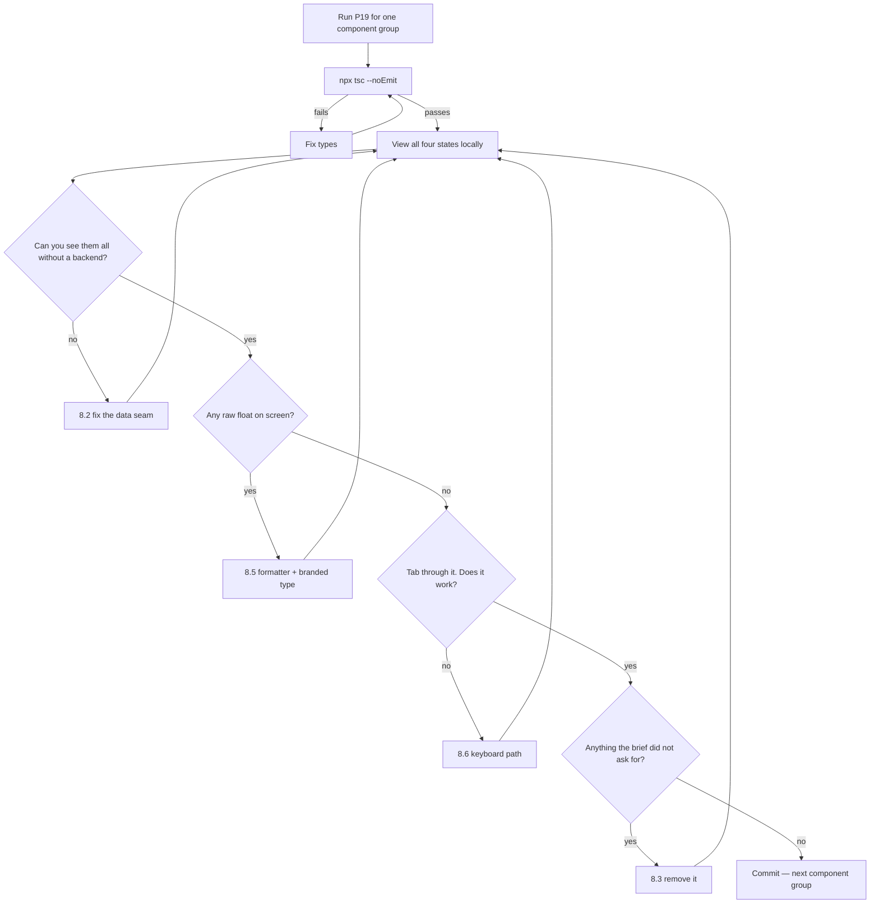

# P19 — Build the UI from the Brief

← [Previous](P18-implement-a-story.md) · [Library index](../README.md) · Next: [P20](P20-write-tests-alongside-the-code.md)

> **One line:** Turn a UI brief into a React screen, building the awkward states before the happy one.

| | |
|---|---|
| **Phase** | 4 — Build |
| **Who runs it** | Frontend Engineer (Ji-woo Park) |
| **When** | Day one of the build sprint, as soon as the data shape is agreed — not when the backend is ready |
| **Takes in** | `artifacts/ui-brief-exception-queue.md`, `artifacts/stories/NWD-108.md`, `artifacts/data-contract-counterparty-position.md`, `artifacts/definition-of-done.md`, the agreed fixture |
| **Produces** | The exception queue screen under `code/exception-queue/src/features/exceptions/` |
| **Hands off to** | Backend + Frontend Engineer, who run [P20](P20-write-tests-alongside-the-code.md) |
| **Time to run** | 30–60 minutes per component, including reading and adjusting |

---

## 1. The scene

Monday afternoon, day one of Sprint 2. Ji-woo Park has just come out of a thirty-five minute conversation with Tomas Vargas that Farhan scheduled in the sprint plan, and she has a file: `exceptions.sample.json`, seven fake rows, committed to the repo.

That file is the reason she is not blocked. Her story, NWD-108, is a screen that shows an analyst the documents the confidence gate rejected and lets her fix them. The confidence gate doesn't exist yet — Tomas is on Step 1 of eight and won't have an endpoint until day five. Without the agreed shape she'd be waiting, or guessing.

She also has the UI brief from [P14](../phase-2-design/P14-ui-ux-design-brief.md), and the brief has one line in it that has been bothering her since she read it:

> Priya opens this screen roughly forty times a day and spends between ninety seconds and four minutes on each document. She does not have a second monitor.

Forty times a day. That single number changes the whole design. It means the screen is not a form Priya visits — it's the tool she lives in. It means keyboard navigation isn't an accessibility nice-to-have, it's the primary interaction. It means an empty state that says "No results" is a small insult, because "no exceptions in the queue" is the *good* outcome and should look like it.

And it means something less obvious that Ji-woo has learned the hard way: **the states she'll spend the most time in are the ones that aren't the happy path.** Loading. Errors. The document that won't render. The row that's already been fixed by someone else. Build the happy path first and those get bolted on at the end of the sprint, badly, in whatever time is left.

So she starts with the states.

---

## 2. What this prompt actually does — in plain language

### What we're building

**The exception queue** is a screen. On the left, a list of documents the confidence gate rejected. Click one and you get a split view: the original PDF on one side, the extracted fields on the other, with the failing ones marked. Priya reads the PDF, corrects the fields the machine got wrong, and submits. The document goes back through the pipeline.

That's the entire feature. It exists because of the design invariant that runs through this whole project: **a wrong number is worse than no number.** When the extraction service isn't sure, the document doesn't quietly enter the warehouse — it comes here, to a human.

Ji-woo's screen is where that principle stops being architecture and becomes somebody's Tuesday.

### Why a UI prompt is different from a backend prompt

[P18](P18-implement-a-story.md) builds backend code one step at a time against an implementation plan. This prompt looks similar and differs in three ways that matter.

**There is no single verification command.** The backend's green command — `pytest -q && python -c "import ..."` — tells you yes or no. A UI has `npm run build` and `tsc --noEmit`, which tell you it compiles, and that's a much weaker claim. A screen can compile perfectly and be unusable. So the verification is partly a command and partly *you looking at it*, which means the prompt has to produce something you can actually look at on day one, without a backend.

**The design is already decided, and it's not the model's to change.** The UI brief specifies layout, states and behaviour. A backend prompt gives the model latitude on implementation; this one deliberately gives it almost none on interface. If the model invents a tab bar the brief didn't ask for, that's a defect, not a contribution.

**The data isn't real yet.** The whole screen is built against `exceptions.sample.json` for the first five days. That's not a compromise — it's the better order, and §2 below explains why.

### States before happy path — what this means and why

This is the core instruction of the prompt, so it's worth being precise.

A screen has **states**: the different things it can be showing depending on what's happened. The exception queue has at least six:

| State | What Priya sees | When |
|---|---|---|
| **Loading** | The list is being fetched | First paint, and after every refresh |
| **Empty** | There are no exceptions | Good morning. The pipeline had a clean run |
| **Error** | The fetch failed | The API is down, her token expired, the network dropped |
| **Populated** | A list of documents to review | The normal working state |
| **Detail loading** | She clicked a row, the PDF is fetching | Every single time she opens a document — PDFs are slow |
| **Detail error** | The PDF won't render | Corrupt blob, expired SAS URL, a 40 MB scan |

Most people build "populated" first. It's the interesting one, it's what the design mockup shows, and it feels like progress. The others get added at the end of the sprint from a to-do list, which means they get whatever time is left, which is usually none.

**Build them in the other order and three things change.**

First, **you find out on day one what the states need**, not on day nine. The error state needs an error message, which means the API needs to return one, which means Tomas needs to know that. That's a five-minute conversation on Monday and a redesign on Thursday of week two.

Second, **the component's shape comes out right.** A component built happy-path-first usually holds its data in a way that has no room for "loading" or "failed", and retrofitting means restructuring. Built states-first, the data model has a slot for every outcome from the beginning.

Third, and most practically: **you can build all of them without a backend.** A loading state is a component and a boolean. An error state is a component and an error object. You do not need an API to build either. By the time Tomas's endpoint arrives on day five, the hard parts are done and you're wiring, not designing.

The order in the prompt is deliberate: loading, empty, error, then populated. Empty comes second because it's the one most often forgotten entirely, and because on this screen an empty queue is a *success* and should feel like one.

> **Watch out.** "Empty" and "loading" look the same for the first 200 milliseconds and teams routinely ship a screen that flashes "No exceptions to review" before the data arrives. Priya sees that forty times a day. It has to be a distinct state from the first line of code, not a `data.length === 0` check bolted on later.

### Keeping the PDF and the field list in sync

The detail view has two halves. Left: the original PDF, the thing Priya is reading from. Right: the extracted fields, the thing she's correcting.

They have to agree with each other at all times, and that's harder than it sounds.

Here's the concrete requirement from the brief. Priya clicks the `market_value` field on row 34 of the field list. Three things must happen: the PDF scrolls to the page that field came from, the region of the page the value was read from is highlighted, and the field gets focus for editing. And it has to work the other way too — if she scrolls the PDF to page 2, the field list should indicate which fields are on the page she's looking at.

Why this matters at all: **without it, Priya is doing the synchronisation herself, in her head, forty times a day.** She reads "quantity: 1,250" in the field list, then hunts down the PDF looking for where that number lives, then compares. That hunt is most of the ninety seconds. Removing it is most of the value of the screen.

The technical shape is straightforward once you name it. Every extraction carries a **bounding region** — the page number and the rectangle on that page the value was read from. Azure AI Document Intelligence returns these; the data contract carries them through. So the sync is:

- One piece of shared state: which field is currently selected.
- The field list reads it to know what to highlight and focus.
- The PDF viewer reads it to know which page to show and which rectangle to draw.
- Both write to it: clicking a field sets it, clicking a highlight sets it.

The mistake to avoid is letting each half keep its own idea of "current". Two sources of truth for the same thing will drift, and the drift shows up as the viewer sitting on page 1 while the field list insists you're editing something on page 3. **One piece of state, both halves read it, both halves write it.**

### Every confidence renders as a percentage — and the bug when it doesn't

The gate returns confidence as a float between 0 and 1. `0.8234567`.

Priya does not think in floats. She thinks in percentages, because everyone does, and because the thresholds she's been told about are "90% for money, 85% for dates". A number that reads `0.8234567` requires her to do a conversion, every time, on every field, forty times a day.

So the rule is absolute: **no raw confidence float ever reaches the DOM.** Every one goes through a single formatter that turns `0.8234567` into `82%`.

One formatter, in one file, used everywhere. Not a formatting call inline in each component — a named function, imported. The reason is not tidiness. It's that a rule enforced in one place can be tested once and cannot drift, whereas a rule everyone remembers to apply is a rule someone will eventually forget.

Somebody eventually forgot. That's **NWD-139**, and it's worth telling now because it's the most instructive small bug in the book.

Ji-woo built the field list correctly. `formatConfidence(field.confidence)` everywhere, tested, reviewed, done. On the last day of the sprint she added a compact summary table showing the line items in a document, wrote `{item.confidence}` in a cell because she was typing quickly at four in the afternoon, and shipped it. Ananya found it in Sprint 3. Priya saw `0.8234567` in one table and `82%` in another and reasonably assumed they were different things.

One line. Cosmetic. And it took a bug report, a triage, a fix, a review and a re-test — call it ninety minutes of five people's time for a character count you could fit in a tweet.

**The lesson is not "be careful".** Being careful doesn't scale to four in the afternoon on the last day of a sprint. The lesson is that a rule you rely on humans to remember will be broken, and the fix is to make it structurally hard to break. Two options, both cheap:

- Give the type system the job. Make the component prop a branded `FormattedConfidence` type that only the formatter can produce, so `{item.confidence}` is a compile error rather than an ugly render.
- Or a lint rule that flags any JSX expression containing a bare identifier named `confidence`.

The prompt in §3 asks for the first, because the compiler runs on every keystroke and nobody has to remember it.

### Every term, defined

| Term | What it means |
|---|---|
| **React** | A JavaScript library for building UIs out of components — reusable pieces that take inputs and produce a piece of screen |
| **TypeScript** | JavaScript with types. Catches "you passed a number where a string was expected" before the code runs |
| **Component** | One reusable piece of UI. `ExceptionRow` is a component |
| **Props** | The inputs to a component. Like function arguments |
| **State** | Data a component holds that can change over time and causes a re-render when it does |
| **Hook** | A function starting with `use` that lets a component hold state or side effects. `useState`, `useEffect`, and custom ones like `useExceptions` |
| **Fixture** | Fixed fake data used to build and test against, so you don't need the real API |
| **Skeleton** | A grey placeholder shaped like the content, shown while loading. Better than a spinner because the layout doesn't jump when data arrives |
| **Discriminated union** | A TypeScript pattern where a type has a `status` field, and the other fields available depend on its value. The core trick for modelling states properly |
| **Bounding region** | Page number plus a rectangle, saying where on the PDF a value was read from |
| **a11y** | Accessibility. Whether the screen works with a keyboard and a screen reader |
| **ARIA** | Attributes that tell assistive technology what a piece of UI *is* — `role="alert"`, `aria-live` |
| **Vitest / React Testing Library** | The test tools. RTL tests components the way a user meets them — by visible text and roles, not by internal structure |

### Why the prompt is shaped the way it is

| Instruction in the prompt | The failure it prevents |
|---|---|
| "Build loading, empty and error before populated" | Three states bolted on badly in the last two days of the sprint |
| "Model the states as a discriminated union" | `isLoading`, `error` and `data` as three independent booleans, which permits impossible combinations |
| "Build against the fixture; do not call the API" | Four days of a frontend engineer waiting for a backend |
| "One shared selection state, read and written by both halves" | The viewer on page 1 while the field list edits page 3 |
| "Confidence is a branded type only the formatter can produce" | NWD-139 |
| "Do not invent UI the brief does not specify" | A tab bar, a settings drawer and a dark mode toggle nobody asked for |
| "Keyboard path first, for a user doing this forty times a day" | A mouse-only screen that is slower than the spreadsheet it replaced |

### The one idea to keep

**Build the states nobody demos first.** The happy path is the easy part and it's the part you'll get right anyway.

---

## 3. The prompt

Run this once per component or small group of components. Like [P18](P18-implement-a-story.md), keep the session but scope each run tightly.

```text
You are a React and TypeScript engineer building one screen from an agreed UI brief.

**STOP GATE — read before anything else.**
Build **[WHAT THIS RUN COVERS] only**. Do not build other screens, other routes,
navigation, authentication, theming, or anything the brief does not specify. If
you think something else is needed, say so at the end; do not build it.

**Read** these completely first:
- UI brief: [UI BRIEF PATH]
- Story: [STORY PATH]
- Data contract: [DATA CONTRACT PATH]
- Definition of Done: [DEFINITION OF DONE PATH]
- Repository conventions: [PROJECT CONTEXT PATH]
- The agreed fixture: [FIXTURE PATH]

**The user.** [WHO USES THIS, HOW OFTEN, IN WHAT CONDITIONS]
Every interaction decision is judged against that sentence, not against what
looks good in a screenshot.

**Build in this order and do not deviate:**
1. The **types**, derived from the data contract. Model the screen's states as a
   discriminated union on a `status` field — not as independent booleans.
2. The **loading** state. A skeleton shaped like the real content, not a spinner.
3. The **empty** state. Distinct from loading. On this screen an empty queue is a
   good outcome; make it read that way.
4. The **error** state. Shows what failed in words the user can act on, and a
   retry. Announced to assistive technology.
5. Only then the **populated** state.

**Data source.** Build entirely against `[FIXTURE PATH]`. Do not call any API, do
not add a fetch client, do not invent endpoints. The fixture is loaded behind one
function so that swapping it for the real call later touches exactly one file.

**Formatting rules that are not negotiable:**
[FORMATTING RULES]

**Synchronisation requirement:**
[SYNC REQUIREMENT]

**Then give me, in this order:**
- The complete files, ready to paste. Real paths from this repository.
- The command that proves it compiles, and what I should see.
- How to view each state locally — the exact thing I change to see loading,
  empty and error, without a backend.
- **Assumptions I had to make** — anything the brief did not cover, one line each.
- **What still does not work**, in one line.

**Do not:**
- Do not add UI elements the brief does not specify. No tabs, no toolbars, no
  settings, no theme switcher, no toasts unless asked.
- Do not install or import any library not already in package.json. If you
  believe one is needed, name it and stop.
- Do not render any raw confidence, ratio or currency value. Every one goes
  through the named formatter.
- Do not put styling decisions in components that the brief assigns to tokens or
  the existing stylesheet.
- Do not write tests in this run. Tests have their own prompt.
- Do not use `any`. If a type is genuinely unknown, use `unknown` and narrow it.
- Do not add `console.log` anywhere.

**You are done when:** all five build-order items exist, the type checker passes,
every state can be viewed locally without a backend, and no raw float reaches
the DOM.
```

---

## 4. Every placeholder, explained

| Placeholder | What to put in it | Northwind example | What happens if you get it wrong |
|---|---|---|---|
| `[WHAT THIS RUN COVERS]` | One component or one tight group | `the exception queue list: types, states and the row component. Not the detail view.` | Give it the whole screen and you get 600 lines of TSX across nine files that you will skim, which is the [P18](P18-implement-a-story.md) failure in a different language |
| `[UI BRIEF PATH]` | The brief from [P14](../phase-2-design/P14-ui-ux-design-brief.md) | `artifacts/ui-brief-exception-queue.md` | The model designs the screen. It will be a competent generic screen and it will not be the one Priya needs |
| `[STORY PATH]` | The story | `artifacts/stories/NWD-108.md` | You lose the acceptance criteria, so you can't tell when it's finished |
| `[DATA CONTRACT PATH]` | The agreed shape from [P13](../phase-2-design/P13-design-the-data-contract.md) | `artifacts/data-contract-counterparty-position.md` | Field names get invented. The fixture and the real API then disagree and you find out on day six |
| `[DEFINITION OF DONE PATH]` | The DoD from [P17](../phase-3-planning/P17-definition-of-done.md) | `artifacts/definition-of-done.md` | The no-PII-in-fixtures and no-dead-code clauses go unenforced during generation |
| `[PROJECT CONTEXT PATH]` | Repo conventions from [P01](../phase-0-foundation/P01-generate-the-project-context-file.md) | `artifacts/CLAUDE.md` | Wrong folder structure, wrong styling approach, a state library you don't use |
| `[FIXTURE PATH]` | The file you and the backend agreed | `src/features/exceptions/fixtures/exceptions.sample.json` | Without it the model invents data, and its invented data is all happy path |
| `[WHO USES THIS, HOW OFTEN, IN WHAT CONDITIONS]` | The real user, in one honest sentence | `Priya Raman, operations analyst at Northwind. Opens this ~40 times a day, 90 seconds to 4 minutes each, single monitor, keyboard-heavy, under time pressure before the T+1 cutoff.` | The highest-value line in the prompt. Without it you get a screen designed for a demo rather than for a shift |
| `[FORMATTING RULES]` | The non-negotiables | `Confidence is never rendered raw. formatConfidence(0.8234567) → "82%". The component prop type is a branded FormattedConfidence that only that function can produce.` | NWD-139, in production, in front of the client |
| `[SYNC REQUIREMENT]` | What must stay in step with what | `Selecting a field scrolls the PDF to its page, highlights its bounding region, and focuses the input. One shared selection state; both halves read and write it.` | Two sources of truth, drifting. The most expensive UI bug class there is because it's intermittent |

---

## 5. The filled-in example

Ji-woo runs this on Monday afternoon, day one, immediately after committing the fixture. Tomas has written no gate code yet.

```text
You are a React and TypeScript engineer building one screen from an agreed UI brief.

**STOP GATE — read before anything else.**
Build **the exception queue list only**: the shared types, the four states, and
the row component. Do NOT build the detail view, the PDF viewer, the edit form,
routing, or authentication. If you think something else is needed, say so at the
end; do not build it.

**Read** these completely first:
- UI brief: artifacts/ui-brief-exception-queue.md
- Story: artifacts/stories/NWD-108.md
- Data contract: artifacts/data-contract-counterparty-position.md
- Definition of Done: artifacts/definition-of-done.md
- Repository conventions: artifacts/CLAUDE.md
- The agreed fixture: src/features/exceptions/fixtures/exceptions.sample.json

**The user.** Priya Raman, operations analyst at Northwind Asset Management. She
opens this screen roughly 40 times a day and spends between 90 seconds and 4
minutes per document. Single monitor, no second screen. She is fast on a keyboard
and reaches for the mouse reluctantly. She is working against the T+1 break
reporting cutoff, so every extra second is felt.
Every interaction decision is judged against that, not against what looks good
in a screenshot.

**Build in this order and do not deviate:**
1. The types, derived from the data contract. States as a discriminated union on
   a `status` field.
2. The loading state — a skeleton shaped like the rows, not a spinner.
3. The empty state. Distinct from loading. An empty queue means the pipeline had
   a clean run; it should read as good news, not as "no results found".
4. The error state — what failed, in words Priya can act on, plus a retry, and
   announced to assistive technology.
5. Only then the populated list.

**Data source.** Build entirely against
src/features/exceptions/fixtures/exceptions.sample.json. Do not call any API, do
not add a fetch client, do not invent endpoints. The fixture is loaded behind one
function so swapping it for the real call later touches exactly one file.

**Formatting rules that are not negotiable:**
- Confidence arrives from the API as a float 0..1 and is NEVER rendered raw.
  formatConfidence(0.8234567) returns "82%". Rounded, no decimals.
- The prop type for any rendered confidence is a branded FormattedConfidence
  that only formatConfidence can produce, so a raw float in JSX is a compile
  error rather than an ugly render.
- Timestamps render in the analyst's local timezone, as "14:32, 3 Mar".
- A document hash is shown as its first 8 characters, in a monospace face.

**Synchronisation requirement:**
Not applicable to this run — the list has no second pane. It applies to the
detail view, which is a later run. Keep the selected exception id in a shape that
the detail view can consume.

**Then give me, in this order:**
- The complete files, ready to paste, with real paths.
- The command that proves it compiles, and what I should see.
- How to view each state locally, without a backend.
- Assumptions I had to make.
- What still does not work.

**Do not:**
- Do not add UI elements the brief does not specify.
- Do not install or import any library not already in package.json.
- Do not render any raw confidence, ratio or currency value.
- Do not put styling decisions in components that belong in tokens.
- Do not write tests in this run.
- Do not use `any`.
- Do not add `console.log` anywhere.

**You are done when:** all five build-order items exist, `tsc --noEmit` passes,
every state can be viewed locally without a backend, and no raw float reaches
the DOM.
```

---

## 6. What comes back

Four files. Trimmed of repetitive markup, otherwise real.

### `src/features/exceptions/types.ts`

```typescript
/**
 * Types for the exception queue, derived from
 * artifacts/data-contract-counterparty-position.md §4.
 *
 * Field names here match the wire format exactly. Renaming one is a contract
 * change and needs Tomas.
 */

/** Reason codes produced by core/confidence.py. Closed set — do not widen here. */
export type FailureReason =
  | 'BELOW_THRESHOLD'
  | 'MISSING_VALUE'
  | 'NULL_CONFIDENCE'
  | 'UNKNOWN_FIELD_TYPE';

export type FieldType = 'currency' | 'number' | 'date' | 'string';

/** Where on the PDF a value was read from. Page is 1-based, as Azure returns it. */
export interface BoundingRegion {
  page: number;
  x: number;
  y: number;
  width: number;
  height: number;
}

export interface FieldFailure {
  fieldName: string;
  fieldType: FieldType;
  /** Raw float 0..1, or null when the model returned no score. NEVER render this. */
  confidence: number | null;
  threshold: number;
  reason: FailureReason;
  /** null for a header field; 0-based row index for a line item. */
  lineItemIndex: number | null;
  region: BoundingRegion | null;
}

export interface ExceptionSummary {
  exceptionId: string;
  documentHash: string;
  counterparty: string;
  documentType: string;
  receivedAt: string; // ISO 8601, UTC
  bronzePath: string;
  failureCount: number;
  /** Raw float 0..1. NEVER render this. */
  minConfidence: number | null;
  topReason: FailureReason;
  status: 'awaiting_review' | 'in_review' | 'resubmitted';
}

/**
 * The screen's state, as a discriminated union.
 *
 * Deliberately NOT three independent fields (isLoading, error, data). Those
 * permit combinations that cannot happen — loading AND error AND data — and
 * every component then has to decide which wins. Here, exactly one is true at
 * a time and TypeScript enforces it.
 */
export type QueueState =
  | { status: 'loading' }
  | { status: 'empty' }
  | { status: 'error'; message: string; canRetry: boolean }
  | { status: 'ready'; exceptions: ExceptionSummary[] };
```

### `src/features/exceptions/formatConfidence.ts`

```typescript
/**
 * The ONLY place a confidence float becomes something a human reads.
 *
 * Confidence arrives as 0..1. Priya thinks in percentages, and the thresholds
 * she has been trained on are stated as percentages ("90% for money"). Rendering
 * 0.8234567 makes her do the conversion herself, 40 times a day.
 *
 * The branded return type is the enforcement. A component that renders
 * confidence takes a FormattedConfidence, which only this module can produce,
 * so writing {field.confidence} in JSX is a type error rather than a bug
 * somebody has to notice in review.
 */

declare const brand: unique symbol;

/** A confidence value that has been through formatConfidence. */
export type FormattedConfidence = string & { readonly [brand]: 'FormattedConfidence' };

/**
 * Format a confidence for display.
 *
 * Returns "—" when confidence is null. A null score is not zero confidence and
 * must not render as "0%", which would read as "the model was certain it was
 * wrong" rather than "the model gave no score".
 */
export function formatConfidence(confidence: number | null): FormattedConfidence {
  if (confidence === null) {
    return '—' as FormattedConfidence;
  }
  return `${Math.round(confidence * 100)}%` as FormattedConfidence;
}

/**
 * Format a threshold for display alongside a confidence, e.g. "needs 92%".
 * Thresholds are configured to two decimals (0.92) and always land on a whole
 * percent, so no rounding surprise here.
 */
export function formatThreshold(threshold: number): FormattedConfidence {
  return `${Math.round(threshold * 100)}%` as FormattedConfidence;
}
```

### `src/features/exceptions/ExceptionQueue.tsx`

```tsx
import { useEffect, useState } from 'react';
import type { ExceptionSummary, QueueState } from './types';
import { loadExceptions } from './exceptionsSource';
import { ExceptionRow } from './ExceptionRow';
import { QueueSkeleton } from './QueueSkeleton';

/**
 * The exception queue list.
 *
 * States are handled in the order they were built: loading, empty, error, then
 * populated. Each returns early, so the populated branch never has to defend
 * itself against half-loaded data.
 */
export function ExceptionQueue({
  selectedId,
  onSelect,
}: {
  selectedId: string | null;
  onSelect: (exceptionId: string) => void;
}) {
  const [state, setState] = useState<QueueState>({ status: 'loading' });

  useEffect(() => {
    let cancelled = false;

    async function run() {
      setState({ status: 'loading' });
      try {
        const exceptions = await loadExceptions();
        if (cancelled) return;
        setState(
          exceptions.length === 0
            ? { status: 'empty' }
            : { status: 'ready', exceptions },
        );
      } catch (error) {
        if (cancelled) return;
        setState({
          status: 'error',
          message:
            error instanceof Error
              ? error.message
              : 'The review queue could not be loaded.',
          canRetry: true,
        });
      }
    }

    void run();
    return () => {
      cancelled = true;
    };
  }, []);

  // 1. Loading — a skeleton shaped like six rows, so the layout does not jump
  //    when the real rows arrive. Never a bare spinner: Priya opens this 40
  //    times a day and a moving layout costs her a beat every time.
  if (state.status === 'loading') {
    return <QueueSkeleton rows={6} />;
  }

  // 2. Empty — a clean pipeline run. This is the good outcome and reads as one.
  if (state.status === 'empty') {
    return (
      <div className="queue-empty" role="status">
        <h2>Nothing to review</h2>
        <p>
          Every document processed today passed the confidence gate. Nothing is
          waiting for you.
        </p>
      </div>
    );
  }

  // 3. Error — say what failed and offer the way out. role="alert" so a screen
  //    reader announces it without Priya having to go looking.
  if (state.status === 'error') {
    return (
      <div className="queue-error" role="alert">
        <h2>The review queue could not be loaded</h2>
        <p>{state.message}</p>
        {state.canRetry && (
          <button type="button" onClick={() => window.location.reload()}>
            Try again
          </button>
        )}
        <p className="queue-error-hint">
          If this keeps happening, the ingestion pipeline may be down. Documents
          are still landing safely — nothing is being lost.
        </p>
      </div>
    );
  }

  // 4. Populated. Only reachable when there is at least one exception.
  return (
    <ul
      className="queue-list"
      aria-label={`${state.exceptions.length} documents awaiting review`}
    >
      {state.exceptions.map((exception: ExceptionSummary) => (
        <ExceptionRow
          key={exception.exceptionId}
          exception={exception}
          selected={exception.exceptionId === selectedId}
          onSelect={onSelect}
        />
      ))}
    </ul>
  );
}
```

### `src/features/exceptions/ExceptionRow.tsx`

```tsx
import type { ExceptionSummary, FailureReason } from './types';
import { formatConfidence } from './formatConfidence';

const REASON_LABEL: Record<FailureReason, string> = {
  BELOW_THRESHOLD: 'Low confidence',
  MISSING_VALUE: 'Value missing',
  NULL_CONFIDENCE: 'No confidence score',
  UNKNOWN_FIELD_TYPE: 'Unrecognised field',
};

function formatReceived(iso: string): string {
  const date = new Date(iso);
  const time = date.toLocaleTimeString(undefined, {
    hour: '2-digit',
    minute: '2-digit',
  });
  const day = date.toLocaleDateString(undefined, {
    day: 'numeric',
    month: 'short',
  });
  return `${time}, ${day}`;
}

export function ExceptionRow({
  exception,
  selected,
  onSelect,
}: {
  exception: ExceptionSummary;
  selected: boolean;
  onSelect: (exceptionId: string) => void;
}) {
  return (
    <li className="queue-row">
      {/*
        A real button, not a div with onClick. Priya works from the keyboard;
        a button is focusable, activates on Enter and Space, and announces
        itself. Tab order follows document order, which follows queue order,
        which is the order she works in.
      */}
      <button
        type="button"
        className={selected ? 'queue-row-button is-selected' : 'queue-row-button'}
        aria-current={selected ? 'true' : undefined}
        onClick={() => onSelect(exception.exceptionId)}
      >
        <span className="queue-row-counterparty">{exception.counterparty}</span>
        <span className="queue-row-type">{exception.documentType}</span>

        <span className="queue-row-reason">
          {REASON_LABEL[exception.topReason]}
          {exception.failureCount > 1 && ` +${exception.failureCount - 1}`}
        </span>

        {/*
          formatConfidence, never the raw float. minConfidence is typed
          number | null and the span below only accepts FormattedConfidence,
          so {exception.minConfidence} here would not compile.
        */}
        <span className="queue-row-confidence">
          {formatConfidence(exception.minConfidence)}
        </span>

        <span className="queue-row-received">
          {formatReceived(exception.receivedAt)}
        </span>

        <span className="queue-row-hash" title={exception.documentHash}>
          {exception.documentHash.slice(0, 8)}
        </span>
      </button>
    </li>
  );
}
```

### The verification

```text
Type check:

    npx tsc --noEmit

Expected: no output, exit code 0.

Build:

    npm run build

Expected: build succeeds, no warnings about unused exports.

To view each state without a backend, edit src/features/exceptions/
exceptionsSource.ts — it is the single seam between this screen and the data:

  - loading : add `await new Promise(r => setTimeout(r, 3000));` before the return
  - empty   : `return [];`
  - error   : `throw new Error('Request timed out after 30 seconds.');`
  - ready   : the default — returns the seven fixture rows

Nothing else in the feature imports the fixture, so this file is also the only
file that changes when the real endpoint lands.
```

### Assumptions I had to make

```text
1. RETRY BEHAVIOUR. The brief asks for a retry on error but does not say whether
   it re-fetches or reloads the page. I have used a full reload, which is the
   honest option until there is a real fetch layer to retry against. Revisit
   when the API lands on day 5.

2. NULL MIN_CONFIDENCE. The contract allows minConfidence to be null (no field
   carried a score). I render "—" rather than "0%". "0%" would read as "the
   model was certain and wrong", which is a different and more alarming claim
   than "no score was returned". Confirm the wording with Priya.

3. ROW ORDER. The brief does not specify. I preserve the order the API returns
   and do not sort client-side, so the server owns priority. If Priya needs
   oldest-first this is a backend change, not a UI one.

4. TIMEZONE. Rendered in the browser's local timezone. Priya is in London and
   the Los Angeles desk also uses this screen, so a document received at 14:32
   London shows as 06:32 in LA. This is probably right and is worth confirming —
   the alternative is to pin everything to London, which is where the T+1
   cutoff lives.
```

### What still does not work

```text
There is no detail view. Clicking a row raises onSelect and nothing renders. No
PDF, no field editing, no submit. The data comes from the fixture, so the counts
never change.
```

### How to read this

**Look at `QueueState` first.** Four cases, one `status` field, and TypeScript will not let you be in two at once. Compare that to the version everyone writes first — `isLoading`, `error`, `data` — which allows eight combinations, of which four are nonsense, and every component then has to pick which one wins. The union removes the question. It's four lines of type and it prevents a whole category of bug.

**Then look at the order of the early returns in `ExceptionQueue`.** Loading, empty, error, populated. Same order as the build order, and it's not coincidence: because each returns early, the populated branch at the bottom is reached only when there is at least one exception, so it never has to defend itself against undefined data. That's why the last twelve lines of that component are as plain as they are.

**Then `formatConfidence.ts`, specifically the branded type.** `FormattedConfidence` is a string that carries an invisible marker only that module can attach. The practical effect is that `<span>{exception.minConfidence}</span>` doesn't compile if the span's type demands a `FormattedConfidence`. That's NWD-139 prevented by the compiler rather than by somebody remembering at four in the afternoon.

**The part that is commonly wrong:** the empty state's wording. The model's first attempt was "No exceptions found." Ji-woo rewrote it to "Nothing to review — every document processed today passed the confidence gate." The difference matters: "No results" is what a failed search says, and an analyst arriving at an empty queue should immediately know whether that's *good* or whether something is broken upstream. The line about documents still landing safely, in the error state, does the same job — it answers the question Priya would otherwise have to Slack somebody to ask.

---

## 7. Why this is the final prompt

**What "done" means here.** The component is done when you can see every one of its states on your own machine, with no backend running, by changing one file — and when the type checker refuses to let you render a raw float.

Not "when it looks like the mockup". The mockup only shows one state.

**The checklist:**

- [ ] `npx tsc --noEmit` passes
- [ ] You have looked at loading, empty, error and populated with your own eyes, locally
- [ ] Loading and empty are visually distinct, and empty does not flash before data arrives
- [ ] Every confidence on screen is a percentage — grep the diff for `confidence` in JSX
- [ ] The error state says what failed and what to do, not "Something went wrong"
- [ ] You can reach and activate every control with Tab and Enter only, no mouse
- [ ] Only one file knows where the data comes from
- [ ] Nothing was added that the brief doesn't specify

**Why you should stop rather than keep prompting.** UI is where over-prompting does the most damage, because there's always something to improve. Ask again and you'll get spacing tweaks, a transition, a slightly different empty-state illustration, an extracted sub-component. Each is defensible. None of them is the thing Priya needs, and each one is a fresh file you have to read.

There's a specific trap worth naming: **asking the model to "polish" or "make it more professional".** That reliably produces added visual complexity — gradients, shadows, a status pill where a word would do — on a screen whose entire job is to be scanned quickly forty times a day. Ji-woo's rule is that any change she can't justify against the forty-times-a-day sentence doesn't ship.

**The signal that you are NOT done:** you cannot see a state without running the backend. That means the data seam isn't clean, and §8.2 fixes it.

---

## 8. When it is not done — the follow-up prompts

| What you're seeing | What's actually wrong | Run this next |
|---|---|---|
| One component handling the whole screen, states as booleans | Happy path first, states retrofitted | §8.1 |
| You can't see the error state without breaking the API | The data seam leaks through the components | §8.2 |
| A tab bar, a filter drawer and a theme toggle appeared | It designed instead of building | §8.3 |
| The viewer sits on page 1 while you edit a page-3 field | Two sources of truth for "selected" | §8.4 |
| `0.8234567` on screen somewhere | The formatter rule wasn't enforced by types | §8.5 |
| Everything works with a mouse and nothing with a keyboard | Divs with onClick instead of buttons | §8.6 |
| It imported a component library you don't use | The "no new dependencies" rule was ignored | Revert, restate it, and check `package.json` yourself |
| The brief doesn't cover a state you've hit | Not a code problem | Ask the designer, or **[P14](../phase-2-design/P14-ui-ux-design-brief.md)** for the missing section |
| No tests | You're at the next prompt | **[P20](P20-write-tests-alongside-the-code.md)** |

### 8.1 "It built the happy path and bolted the states on"

Use this when the states are handled by `if (loading) return <Spinner/>` inside a component that's mostly about the populated case.

```text
This component handles the populated case and treats loading, empty and error as
special cases inside it. Restructure it.

1. Define the screen's state as a **discriminated union** on a `status` field,
   with one case per state. Independent booleans are not acceptable — they permit
   combinations that cannot occur.
2. Handle each state with an **early return**, in this order: loading, empty,
   error, populated. The populated branch must be reachable only when there is
   data, so it needs no defensive checks.
3. Extract the loading state into its own component that renders a skeleton
   shaped like the real content, not a spinner.
4. Make empty and loading visually distinct enough that a 200ms flash of empty
   before data arrives would be obvious in review.

Keep the same visible behaviour for the populated case. Do not change styling.
```

What changes: the component gets shorter and the populated branch loses its defensive checks. Point 4 is the one that catches the flash-of-empty bug, which otherwise ships and gets reported as "the screen flickers", which is very hard to diagnose from that description.

### 8.2 "I can't see the error state without breaking something"

Use this when viewing a state requires a backend, a network throttle, or commenting out code in three places.

```text
I cannot view every state of this screen locally without a running backend.
That is a structural problem, not a testing inconvenience.

**Introduce one module** — [PATH] — that is the single source of the screen's
data. Every component imports from it and nothing else knows where data comes
from.

That module must let me switch between: a delayed success, an empty result, a
thrown error, and the fixture, by changing one line in one place. Say exactly
which line I change for each.

Then confirm no other file in the feature imports the fixture or references an
endpoint.

This module is also the ONLY file that changes when the real API arrives on
day 5. If that is not true, it is not the right seam.
```

What changes: you get one file with a clear switch. The last paragraph is the real test of the design — if swapping the fixture for a real fetch would touch four files, the seam is in the wrong place and you'll feel it on day six.

### 8.3 "It invented UI the brief doesn't mention"

Use this when things appear that nobody specified.

```text
The following are not in the UI brief:

[LIST THEM]

**Remove all of them.** Do not keep any "because it will probably be needed" —
unspecified UI is unreviewed UI, and it is unreviewed by the designer, the
product owner and the user.

Then list, separately and without building anything, what you removed and the
one-sentence case for each. I will take that list to the brief's author. If it
belongs in the product, it belongs in the brief first.

Confirm the screen still satisfies every acceptance criterion in [STORY PATH]
after the removals.
```

What changes: the screen shrinks back to the brief. The separate list is worth keeping — one or two of the suggestions are usually good, and they belong in [P14](../phase-2-design/P14-ui-ux-design-brief.md)'s next revision rather than in a surprise commit.

### 8.4 "The viewer and the field list drift apart"

Use this the first time you see the PDF on one page while the field list thinks you're editing another.

```text
The PDF viewer and the field list are drifting out of sync. Each is holding its
own idea of what is selected.

Restructure so there is **exactly one piece of selection state**, owned by their
common parent, holding at minimum:
  - the selected field name
  - the line item index, or null for a header field
  - the bounding region, or null when the extraction returned none

Both panes read that state. Both panes write to it, through one setter. Neither
keeps a derived copy in its own `useState`.

Then make the two directions explicit:
  - Selecting a field: the viewer scrolls to `region.page` and draws the
    highlight; the field's input receives focus.
  - Clicking a highlight in the viewer: the same state is set and the field
    list scrolls that field into view.

Say what happens when the bounding region is null — the field was extracted but
Azure returned no location. The viewer must not scroll to page 0 or throw.
```

What changes: the derived copies disappear. The null-region question is the one that actually bites — it happens on merged table cells and on some scanned pages, and if nobody asks, the viewer scrolls somewhere arbitrary and Priya loses her place.

### 8.5 "There's a raw float on screen"

Use this the moment you see a long decimal anywhere. This is NWD-139 caught before it ships.

```text
A raw confidence float is being rendered at [LOCATION].

1. Fix that instance to go through `formatConfidence`.
2. Then find every other place any confidence, ratio or threshold reaches the
   DOM in this feature and confirm each goes through the formatter. List them.
3. Then make it structural: the prop type of any component that displays a
   confidence must be `FormattedConfidence`, the branded type only
   `formatConfidence` can produce, so passing a raw number is a compile error.

Point 3 is the actual fix. Points 1 and 2 fix today; point 3 fixes the next time
someone adds a table at four in the afternoon on the last day of a sprint.

Confirm `npx tsc --noEmit` still passes.
```

What changes: one render fixed, several found, and the class closed. In the Northwind story this follow-up existed and was not run on the line-items table, because the table was added after the review. Which is the point of doing it structurally.

### 8.6 "It only works with a mouse"

Use this when Tab does nothing useful, which you will only notice if you try.

```text
This screen is not keyboard-operable. The user does this 40 times a day and
reaches for the mouse reluctantly.

1. Replace every interactive `div` or `span` with a real `button` or `a`.
   Do not add `tabIndex` and `onKeyDown` to a div — use the element that already
   has the behaviour.
2. Confirm tab order follows the visual order, which follows the queue order.
3. Give the selected row `aria-current` and make focus visible with something
   other than colour alone.
4. Add these shortcuts, and nothing else: `j`/`k` to move between rows, `Enter`
   to open, `Escape` to return to the list. Do not add a shortcut overlay.
5. State plainly which parts still require a mouse, if any.

Do not add a library for this.
```

What changes: divs become buttons and the screen becomes usable at speed. Point 5 matters — there's usually one thing left, often the PDF pan, and it's better named than silently missing.

### The loop shape



---

## 9. How this goes wrong

### It looks finished and it's five states short

The screenshot matches the mockup. The demo goes well. Then it meets a slow network, an empty queue, an expired token and a 40 MB scanned PDF, and four of those produce a blank screen with a console error nobody sees.

This happens because the mockup shows one state and the review compares against the mockup. There is no artifact anywhere in the process that says "and here are the other five", unless somebody makes one.

The countermeasure is the build order in this prompt, and a review habit: **the reviewer asks to see the empty state before they look at anything else.** Ten seconds, and it's impossible to fake.

### The fixture is all happy path

Ji-woo's fixture has seven rows and four of them are awkward on purpose: a document with three failures, a header failure with a null line-item index, a null confidence, and a field with no bounding region.

The default fixture — the one a model generates if you don't specify — has five clean rows that all look the same. You build against it, everything works, and every awkward case arrives on day six with the real API.

**The awkward cases belong in the fixture on day one.** That's why the sprint plan's dependency mitigation in [P16](../phase-3-planning/P16-sprint-plan-and-assignment.md) specifies exactly which cases the fixture must contain rather than just saying "agree a fixture". It's the difference between the fixture being a formality and the fixture being useful.

### The screen is designed for the demo, not the shift

This is the failure Ji-woo cares most about and it's invisible in review. A screen with generous whitespace, a big heading and a card layout demos beautifully and is slightly worse to use for the two-hundredth time. Every extra pixel of vertical rhythm is one fewer row visible, and one more scroll, forty times a day.

There's no prompt that fixes this. The fix is the sentence in `[WHO USES THIS, HOW OFTEN]` and the discipline of judging every decision against it. When Ji-woo can't decide between two options she asks: which one is better on the fortieth document of the day? The answer is nearly always the denser, plainer one.

Worth being honest: this is also the thing most likely to cause friction with whoever wrote the visual design. That conversation is easier if the usage number is written down in the brief, which is why [P14](../phase-2-design/P14-ui-ux-design-brief.md) asks for it.

### The formatting rule holds for four days

NWD-139 in one sentence: the rule was followed everywhere it was reviewed and broken in the one component added after the review.

The general shape — **a convention enforced by memory decays; a convention enforced by the compiler doesn't** — applies to more than confidence formatting. Currency, dates, anything with a house format. If you find yourself writing "remember to use the formatter" in a code review comment, you've found a place for a branded type or a lint rule.

The cost is about fifteen lines of TypeScript once. The bug cost five people ninety minutes and a small dent in Northwind's confidence, on a screen whose entire purpose is to be trusted about numbers.

### When this prompt is the wrong tool entirely

If you don't have a UI brief, this prompt will design the screen for you. It'll be a competent generic screen — a table, some filters, a modal — and it won't be shaped by anything about Priya. Go to [P14](../phase-2-design/P14-ui-ux-design-brief.md) first; it takes an hour and it's the difference between a screen that works and a screen that works *here*.

If you're exploring an interaction — you genuinely don't know whether the split view or a stacked layout is better — don't build it with this prompt. Build two throwaway versions, put them in front of Priya for ten minutes, and then build the winner properly. Prototypes want speed, not structure, and the states-first discipline is wasted on something you're about to delete.

---

## 10. The handoff

Ji-woo hands off to herself first, with [P20](P20-write-tests-alongside-the-code.md). The components exist; now they need tests written from NWD-108's acceptance criteria rather than from the components. That ordering matters as much on the frontend as on the backend — a test written by reading the component will assert whatever the component does, including the bugs.

The tests that matter most are the ones for the states, because those are the ones that will be broken by a refactor six months from now and nobody will notice by eye. There's a specific one worth writing that catches the flash-of-empty: assert that the empty state is *not* rendered while the fetch is pending.

On day six she swaps the fixture for the real endpoint. If the agreement from day one held, that's a change to `exceptionsSource.ts` and nothing else — which is the whole return on the seam. If it isn't, the sync-up cost gets raised at standup ([P21](P21-daily-standup-summary.md)) rather than absorbed quietly, because a data-shape disagreement discovered on day six is a sprint-level fact, not a personal one.

Ananya picks the screen up around day eight for [P22](../phase-5-verify/P22-e2e-test-the-application.md). What she needs is stable selectors, which is why Ji-woo's spare capacity in the sprint plan was committed partly to pairing with her on them. E2E tests hung off CSS class names break every time someone touches the styling; tests hung off roles and accessible names survive, which is a second, unadvertised return on doing the keyboard work properly.

And Priya sees it at the sprint demo. Her first question, recorded in the case study, is not about the layout.

> **Artifact contract — `code/exception-queue/src/features/exceptions/`**
> Anyone reading this feature can rely on finding:
> - A `QueueState` discriminated union with exactly one case per screen state
> - Loading, empty, error and populated all implemented, all viewable locally with no backend
> - Exactly one module that knows where the data comes from
> - `formatConfidence` as the single path from a raw float to rendered text, enforced by a branded type
> - Every interactive element a real `button` or `a`, reachable and operable by keyboard
> - Field names matching `data-contract-counterparty-position.md` §4 exactly
> - No invented UI beyond what `ui-brief-exception-queue.md` specifies
>
> If any of those is missing, the artifact is not done — go back to §7.

---

## 11. In the case study

This runs in [Chapter 6 — Sprint 2 Build (Frontend)](../../Case-Study/Python-ETL/06-sprint-2-build-frontend.md), across five runs over six days: types and list states, the row, the detail shell, the PDF pane, the field editor.

The swap on day six took eleven minutes. One file, `exceptionsSource.ts`, and one field name that had drifted — Tomas had shipped `line_item_index` in snake case where the fixture used `lineItemIndex`, because the fixture was hand-written and the API serialises from Python. They found it in eleven minutes instead of two days precisely because everything else matched, so the one mismatch stood out. Ji-woo added a camel-case mapping in the source module and moved on.

The demo moment worth recording is Priya's first question. Ji-woo showed the populated queue, opened a document, corrected a market value and resubmitted. Priya watched, and then asked: *"What happens if I open one and someone else is already fixing it?"*

Nobody had an answer. The brief didn't cover it, the data contract had a `status` field with an `in_review` value that nothing ever set, and the screen would have let two analysts fix the same document twice. It became a story in Sprint 3. It is the single best argument in the book for demoing to the actual user rather than to a stakeholder — the person who does the job forty times a day asks the question the design review didn't.

And NWD-139. The line-items table was added at 16:10 on day nine, reviewed at 16:40, merged at 16:55. `{item.confidence}`. The branded type was in `formatConfidence.ts` from day one and the summary table's cell was typed `string`, so the compiler had nothing to object to — the brand only protects components that ask for it, and a plain `<td>{value}</td>` asks for nothing.

Ji-woo's fix in Sprint 3 was two characters of formatter call and, more usefully, a lint rule flagging any JSX expression whose identifier ends in `confidence` and isn't wrapped. That rule has fired twice since. [Chapter 8](../../Case-Study/Python-ETL/08-sprint-3-rework.md) has the full loop.

---

← [Previous](P18-implement-a-story.md) · [Library index](../README.md) · Next: [P20](P20-write-tests-alongside-the-code.md)
