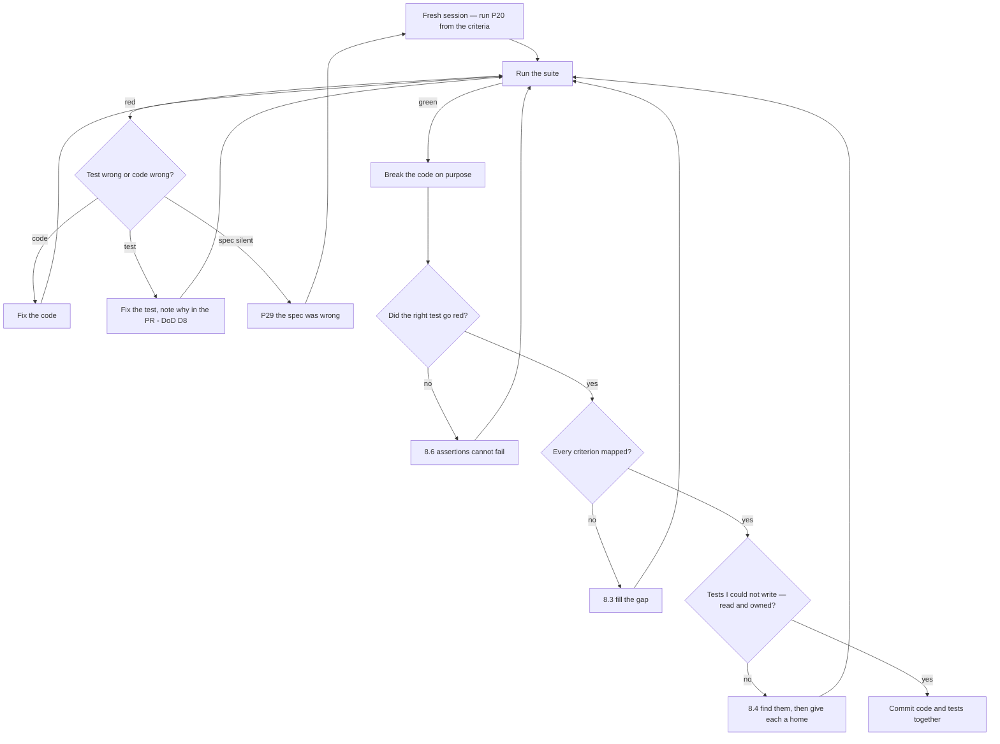

# P20 — Write Tests Alongside the Code

← [Previous](P19-build-the-ui-from-the-brief.md) · [Library index](../README.md) · Next: [P21](P21-daily-standup-summary.md)

> **One line:** Write tests from the acceptance criteria, not from the code you just wrote.

| | |
|---|---|
| **Phase** | 4 — Build |
| **Who runs it** | Backend and Frontend Engineer (Ravi Mullick, Dzmitry ) |
| **When** | Immediately after each implementation step, before the commit |
| **Takes in** | `artifacts/acceptance-criteria-NWD-103.md`, `artifacts/spec-confidence-gate.md`, `artifacts/definition-of-done.md`, the code from [P18](P18-implement-a-story.md) or [P19](P19-build-the-ui-from-the-brief.md) |
| **Produces** | `code/doc_ingestion/tests/test_confidence.py` and its frontend equivalents |
| **Hands off to** | Everyone, at [P21](P21-daily-standup-summary.md); then QA at [P22](../phase-5-verify/P22-e2e-test-the-application.md) |
| **Time to run** | 15–25 minutes per step |

---

## 1. The scene

Tuesday afternoon. `core/confidence.py` exists. It compiles, it imports cleanly, and Ravi has read every line of it, including the check order in `evaluate_field` that he had to think about twice.

Now the tests. Step 1 of the implementation plan names `tests/test_confidence.py`, and the Definition of Done clause D4 says every acceptance criterion needs at least one automated test, named so a reader can match it to the criterion.

His instinct — everyone's instinct — is to keep the same chat session going and type "now write the tests for this." The model has all the context. It knows the module. It'll take thirty seconds.

Gautam, walking past, says no. And the reason he gives takes ten seconds and changes how Ravi tests for the rest of his career:

**"Those tests will be written by the same thing that wrote the code, from the same reading of the spec. If it misread the spec, the code and the tests agree with each other and they're both wrong. Green means nothing."**

That's the whole argument. A test's value comes entirely from being an *independent* statement of what the code should do. Generate it from the code and you haven't tested anything — you've written the code twice, in two dialects, and checked that both copies say the same thing.

So Ravi opens Preetinka's acceptance criteria in a fresh session, and doesn't paste the module in at all.

---

## 2. What this prompt actually does — in plain language

### The two kinds of test

This is the heart of the file. There are two things people call a unit test and only one of them is worth writing.

**A behaviour test says what the system does, in terms someone outside the code would recognise.**

```python
def test_money_is_gated_harder_than_a_description():
    """A field at 0.88 confidence: currency fails, descriptive string passes."""
```

Read that name aloud to Preetinka and she'd nod. It's a business rule. It would still be true if the module were rewritten in Rust.

**An implementation test says what the code currently does, in terms of the code.**

```python
def test_evaluate_field_returns_none_when_confidence_gte_threshold():
    """evaluate_field returns None when confidence >= thresholds[field_type]."""
```

Read that to Preetinka and she'd have nothing to say, because it isn't about anything she cares about. It's a restatement of a line of code in a different font.

The difference isn't style. It's what happens when things change, and there are three cases:

| | Behaviour test | Implementation test |
|---|---|---|
| **Code refactored, behaviour unchanged** | Stays green. Good — that's the point | Goes red. You "fix" the test. It taught you nothing and cost you time |
| **Code changed, behaviour broken** | Goes red. Excellent — this is the whole job | Might go red, might not. It's checking a mechanism, not an outcome |
| **Requirement changes** | Goes red, and the test name tells you exactly which rule moved | Goes red, and you have to work out from the code what it was protecting |

An implementation test is only ever green when the code is unchanged, which means **it protects the code from you rather than protecting the user from the code.**

There's a sharper way to spot one, and it's worth keeping. **If you deleted the implementation and gave the test suite to a competent engineer who had never seen the code, could they rebuild the behaviour from the tests alone?** Behaviour tests, yes. Implementation tests, no — they'd only tell you what function names to use.

Three quick tells that you're looking at an implementation test:

- The test name contains a function name from the module.
- The test asserts on a private helper rather than the public entry point.
- Changing a variable name in the source breaks the test.

### Why AI makes this much worse

The distinction has always mattered. Two things about AI-assisted work make it urgent.

**First: models generate implementation tests by default.** Ask for "tests for this module" with the module in context and you'll get one test per function, named after the function, asserting the branches you can see in the source. That's not a failure of the model — it's a completely reasonable reading of the request. It's just not testing.

**Second, and much worse: same-session tests inherit the misunderstanding.**

Suppose the spec is ambiguous about whether a missing value with high confidence should pass. The model reads it one way, writes code that lets it through, and then writes a test asserting it goes through. Green. Reviewed. Merged. The bug is now *protected by a test*, which is materially worse than having no test, because the next person who fixes the behaviour will see a red test and assume they broke something.

**A test that agrees with a bug is a bug with a bodyguard.**

The defence is structural and it's the core instruction of this prompt: **write the tests from the acceptance criteria, in a session that has not seen the implementation.** Then the test and the code are two independent readings of the same requirement, and disagreement between them is information.

When they disagree, that's the good case. One of them is wrong and you get to find out which — usually by reading the spec a third time, occasionally by discovering the spec is silent, which is a [P29](../phase-6-rework/P29-the-spec-was-wrong.md) conversation.

### The Definition of Done clause behind this

Clause D8 says: **no test was modified in order to make it pass**, unless the pull request explains in one sentence why the old assertion was wrong.

This prompt is the other half of that clause. D8 stops you weakening a test after the fact. This stops you writing a test that was never strong to begin with.

Gautam's phrasing, from the DoD session: *the test is the requirement written in code, and you don't get to edit the requirement to pass the exam.* For that to mean anything, the test has to actually be the requirement — derived from the acceptance criteria, not from the source file.

### Every term, defined

| Term | What it means |
|---|---|
| **pytest** | The Python test runner. Finds functions starting with `test_` and runs them. `assert` is just Python's `assert` |
| **Unit test** | Tests one piece of logic in isolation. No database, no network, no filesystem |
| **Integration test** | Runs several real pieces together — the rules engine actually writing to a test database |
| **E2E test** | Drives the whole system as a user would. [P22](../phase-5-verify/P22-e2e-test-the-application.md) |
| **Fixture** (pytest) | A reusable piece of setup, shared between tests via `@pytest.fixture` |
| **Mock** | A fake stand-in for a real dependency. The tests below need none, and that's the whole payoff from [P18](P18-implement-a-story.md)'s purity decision |
| **Parametrise** | Run one test body over many inputs, with `@pytest.mark.parametrize` |
| **Arrange / Act / Assert** | The three parts of a test: set up, do the thing, check the result. Keep them visually separate |
| **Coverage** | Percentage of code lines executed by tests. A floor, never a goal |
| **Regression test** | A test written because something broke, to make sure it stays fixed |
| **Test double** | Any stand-in for a real thing — mock, stub, fake, spy |
| **Vitest / React Testing Library** | The frontend equivalents. RTL queries by what a user sees — visible text, roles — not by internal structure |

### The four tests, and why exactly these four

NWD-103's acceptance criteria produce four tests that carry almost all the value. They're worth walking through individually because each protects a different way the gate could be wrong.

**1. Money is gated harder than text.** The same confidence — 0.88 — must fail for a currency field and pass for a descriptive string. This is the whole design in one assertion. If someone flattens the thresholds to a single constant "for simplicity", this test goes red immediately. It also encodes *why* the thresholds differ: a slightly wrong security name is readable, a slightly wrong market value is a false break in reconciliation.

**2. A missing value is a failure, not a pass.** A field with `value=None` and `confidence=0.99`. This one catches a genuinely easy mistake. The natural way to write the check is "if confidence < threshold, fail" — and a missing value has no confidence problem at all. High confidence in nothing sails straight through. The test forces the missing-value check to come *first*, before the threshold check.

**3. Null confidence never auto-accepts.** A field with a good value and `confidence=None`. Same trap from the other direction: `None < 0.90` raises a TypeError in Python 3, and the tempting fix is `confidence or 1.0`, which silently treats "no score" as "perfect score". The test makes that impossible. Note that the *right* answer here isn't obvious from first principles — it's a business decision (a wrong number is worse than no number) and the test is where it's recorded.

**4. One bad line item fails the whole document.** Forty good rows, one row with a low-confidence market value, and the document must fail. This is spec invariant 2, and it's the least intuitive of the four. A reasonable engineer might well decide to reject just the bad row and load the other forty — that's what most systems do. Here it's forbidden, because a statement loaded with 40 of its 41 positions produces a reconciliation break that looks exactly like a real settlement failure, and an analyst will spend half a day chasing it.

Four tests. Roughly forty lines. No mocks, because the gate imports nothing — that's the return on the design decision in [P18](P18-implement-a-story.md).

### Test 4, and why it nearly caught NWD-142 and didn't

This is the part the assignment specifically wants, and it deserves the space, because it's the most instructive thing in the book about the limits of testing.

**What NWD-142 is.** A Broker Alpha position statement where the positions table spans a page boundary. The extraction returns page one's rows and silently drops page two's. Every field that *was* extracted has high confidence, so the gate passes the document cleanly. It loads into Snowflake with half its positions. Reconciliation then reports `MISSING_EXTERNAL` breaks for the dropped rows, indistinguishable from a genuine settlement failure.

**Why test 4 is the closest anyone came.** It's the only test in the suite that is *about line items as a collection*. Every other test looks at one field. This one builds a list of 41 rows and asserts something about the document as a whole. It is thinking at the right level. It is one conceptual step away from the bug.

**Why it still missed it.** Look at what the test actually does:

```python
line_items = [_good_row() for _ in range(40)] + [_bad_row()]
result = evaluate_document(header, line_items)
assert result.passed is False
```

The test **constructs the list itself** and then asks the gate what it thinks of that list. It is asking: *given these 41 rows, does the gate reach the right verdict?* Answer: yes, correctly.

The bug is not in that question. The bug is that in production, `line_items` had 22 entries when the document had 41. The gate was handed an incomplete list and reached a perfectly correct verdict about the wrong input.

**The gate cannot detect this, and that is not a defect in the gate.** A function that takes a list has no way to know what isn't in it. That's not a bug you can fix inside `evaluate_document` — the information simply isn't there.

So the missing test isn't a better version of test 4. It's a test of something else entirely: **a completeness assertion, on the extraction step, comparing the number of rows returned against a count the document itself states.** Broker Alpha statements carry a "Total positions: 41" line in the footer, because a statement that doesn't tell you how many rows it has is a statement no operations team would accept. Nobody had thought to use it.

**Now the part that actually matters — why nobody wrote it.**

It's tempting to say the team wasn't thorough enough. That's wrong, and it lets you off too easily, because "be more thorough" is not a technique.

Three real reasons, all structural:

**The fixture and the code came from the same mental model.** Ravi built the extractor and the test fixture in the same week, from the same understanding of what a Broker Alpha statement looks like — a single page with a table on it. Every real document he'd looked at was one page. So the fixture had one page's worth of rows, and the extractor handled one page's worth of rows, and they agreed perfectly. **A fixture built from the same assumption as the code inherits the same blind spot, and the test that uses it is then testing the assumption against itself.**

**The tests were scoped to the module, and the bug lives between modules.** Every test in `test_confidence.py` correctly tests the gate. The bug is in the handoff: what `core/extract.py` gives to `core/rules.py` to give to the gate. Nobody's tests covered a seam, because everybody's tests covered a module. This is the standard failure mode of good unit testing and it's why integration and E2E tests exist — and why [P25](../phase-5-verify/P25-data-quality-validation.md) is a separate discipline from unit testing.

**It's a test for absence, and absence has no obvious shape.** Every one of the four tests asserts that something present is wrong. Nothing asserts that something absent should be present. That's a genuinely harder kind of test to think of, because it requires an independent source of truth about what *should* be there — and in this case that source (the footer total) was sitting in the document the whole time, unused.

**The general lesson, and the thing to actually take away:** your tests assert on the data you hand them. They say nothing at all about whether that data is complete. Any time a step in your pipeline produces a *collection*, ask one question: **what would tell me this collection is missing items, and do I check it?** Row counts, control totals, checksums, sequence numbers, page counts. The document usually tells you. Nobody usually looks.

Pankaj's rule after the retro is one line, and it's in the case study: *for every list the system produces, there is a test that the list is complete, or a written note saying why we can't know.*

### Why the prompt is shaped the way it is

| Instruction in the prompt | The failure it prevents |
|---|---|
| "Do not read the implementation" | Tests that mirror the code and inherit its misunderstanding |
| "One test per acceptance criterion, named after the criterion" | A pile of tests nobody can map to a requirement |
| "Test names describe behaviour, never function names" | Tests that go red on a rename and teach you nothing |
| "Assert on the public entry point only" | Tests coupled to private helpers, which block every refactor |
| "For every collection, ask what proves it is complete" | NWD-142 |
| "State any test you could not write from the criteria alone" | Silent gaps in the acceptance criteria |
| "Do not use mocks unless you say why" | Mock-heavy tests that pass while the system is broken |

### The one idea to keep

**A test is only worth having if it could disagree with the code.** Generate it from the code and it never can.

---

## 3. The prompt

Run this in a **fresh session**. That's not a stylistic preference — it's the mechanism. If the implementation is in context, the model will write tests that match it.

```text
You are a test engineer writing tests for one piece of behaviour, from its
acceptance criteria.

**STOP GATE — read before anything else.**
Do NOT read, open, request or infer the implementation. You are writing tests
from the requirement, not from the code. If you find yourself needing to know how
something is implemented in order to test it, that is a signal the requirement is
under-specified — say so and stop, rather than guessing.

**Read** these and nothing else:
- Acceptance criteria: [ACCEPTANCE CRITERIA PATH]
- Technical spec: [SPEC PATH]
- Definition of Done: [DEFINITION OF DONE PATH]
- Repository test conventions: [PROJECT CONTEXT PATH]

**The public interface you are testing** — signature only, no body:
[PUBLIC INTERFACE SIGNATURES]

**Test framework and conventions:** [TEST FRAMEWORK AND CONVENTIONS]

**Write the tests. Rules:**

1. **One test per acceptance criterion, minimum.** Name each test after the
   BEHAVIOUR in the criterion, in plain words. The name must make sense to
   someone who has never seen the code.
2. **Never put an implementation detail in a test name.** No function names, no
   variable names, no internal helper names.
3. **Assert on the public interface only.** Do not reach into private helpers,
   internal attributes or module state.
4. **Every test is Arrange / Act / Assert**, visually separated, in that order.
   One behaviour per test.
5. **Test the failure path as hard as the success path.** For every rule, include
   at least one case where the input is absent, null, empty, malformed or on the
   wrong side of a boundary. Definition of Done clause D5.
6. **Boundaries explicitly.** Where a rule has a threshold, test just below, just
   above, and exactly on it. State which side "exactly on" falls, and say if the
   criteria do not tell you.
7. **For every collection the code produces or consumes, ask: what would prove
   this collection is COMPLETE?** Write that test if the criteria give you a way
   to. If they do not, say so explicitly under "Tests I could not write" — do not
   skip it silently.
8. **No mocks** unless you state, per mock, why the behaviour cannot be tested
   without one.
9. **No PII in any fixture.** Invented names, invented account numbers, invented
   security identifiers only.

**Then give me, in this order:**
- The complete test file, ready to paste.
- The command to run it, and the expected result.
- **Criteria-to-test map** — a table, one row per acceptance criterion, naming
  the test that covers it. Any criterion with no test is listed as a gap.
- **Tests I could not write** — behaviours you believe should be tested but the
  acceptance criteria do not give you enough to test. One line each, with what
  you would need.
- **Assumptions I had to make** — anything you decided because the criteria were
  silent.

**Do not:**
- Do not write a test that would pass regardless of the implementation.
- Do not write one test per function. Write one test per behaviour.
- Do not test that a constant equals itself, or that a getter returns what was set.
- Do not add tests for behaviour the criteria do not mention. List those as gaps
  instead.
- Do not chase coverage. A criterion covered by one sharp test is better than
  five overlapping ones.
- Do not use `sleep`, real network calls, real files or real clocks.

**You are done when:** every acceptance criterion maps to a named test, every
threshold has a below/above/on case, every collection has either a completeness
test or a stated reason it cannot have one, and no test name mentions a function.

**Save the result to:** [OUTPUT PATH]
```

---

## 4. Every placeholder, explained

| Placeholder | What to put in it | Northwind example | What happens if you get it wrong |
|---|---|---|---|
| `[ACCEPTANCE CRITERIA PATH]` | The AC from [P08](../phase-1-discovery/P08-write-acceptance-criteria.md). The single most important input | `artifacts/acceptance-criteria-NWD-103.md` | Without it there's nothing independent to test against, and the prompt collapses into "write tests for this code" |
| `[SPEC PATH]` | The spec, for the numbers and the rationale | `artifacts/spec-confidence-gate.md` | Thresholds get invented. 0.90 becomes 0.9 becomes 0.8 and looks fine |
| `[DEFINITION OF DONE PATH]` | The DoD from [P17](../phase-3-planning/P17-definition-of-done.md) | `artifacts/definition-of-done.md` | D5 (failure path tested) and D13 (no PII in fixtures) go unenforced |
| `[PROJECT CONTEXT PATH]` | Test conventions — framework, layout, naming | `artifacts/CLAUDE.md` | Wrong idioms. `unittest.TestCase` classes in a pytest repo, or setup methods where fixtures belong |
| `[PUBLIC INTERFACE SIGNATURES]` | Signatures only. Names, arguments, return types. **No bodies** | `def evaluate_document(fields: Mapping[str, ExtractedField], line_items: Sequence[...] = (), *, threshold_overrides=None, prior_review: bool = False) -> GateResult` | Paste bodies and you've handed it the implementation, and the whole independence property is gone. This is the placeholder people get wrong |
| `[TEST FRAMEWORK AND CONVENTIONS]` | Runner, file layout, naming style | `pytest; tests/ mirrors the package; test_*.py; plain functions not classes; pytest fixtures for shared setup` | The file doesn't fit the repo and the pre-commit hook rejects it |
| `[OUTPUT PATH]` | Where the file goes | `tests/test_confidence.py` | Tests land somewhere the runner doesn't look, and green means nothing |

---

## 5. The filled-in example

Ravi runs this in a **new session**, on Tuesday afternoon, with `core/confidence.py` deliberately not open.

```text
You are a test engineer writing tests for one piece of behaviour, from its
acceptance criteria.

**STOP GATE — read before anything else.**
Do NOT read, open, request or infer the implementation. You are writing tests
from the requirement, not from the code. If you find yourself needing to know how
something is implemented in order to test it, that is a signal the requirement is
under-specified — say so and stop, rather than guessing.

**Read** these and nothing else:
- Acceptance criteria: artifacts/acceptance-criteria-NWD-103.md
- Technical spec: artifacts/spec-confidence-gate.md
- Definition of Done: artifacts/definition-of-done.md
- Repository test conventions: artifacts/CLAUDE.md

**The public interface you are testing** — signature only, no body:

    @dataclass(frozen=True)
    class ExtractedField:
        name: str
        value: object | None
        confidence: float | None
        field_type: str

    @dataclass(frozen=True)
    class FieldFailure:
        field_name: str
        field_type: str
        confidence: float | None
        threshold: float
        reason: str
        line_item_index: int | None

    @dataclass(frozen=True)
    class GateResult:
        passed: bool
        failures: tuple[FieldFailure, ...]
        min_confidence: float | None
        straight_through: bool
        fields_checked: int

    def evaluate_document(
        fields: Mapping[str, ExtractedField],
        line_items: Sequence[Mapping[str, ExtractedField]] = (),
        *,
        threshold_overrides: Mapping[str, float] | None = None,
        prior_review: bool = False,
    ) -> GateResult: ...

    Reason codes: BELOW_THRESHOLD, MISSING_VALUE, NULL_CONFIDENCE,
    UNKNOWN_FIELD_TYPE

**Test framework and conventions:** pytest. Tests live in tests/ mirroring the
package layout. Files are test_*.py, tests are plain functions not classes,
shared setup uses pytest fixtures. No mocking library is in use on this project
and we would like to keep it that way.

**Write the tests. Rules:**

1. One test per acceptance criterion, minimum. Name each test after the
   BEHAVIOUR, in plain words.
2. Never put an implementation detail in a test name.
3. Assert on the public interface only.
4. Every test is Arrange / Act / Assert, visually separated.
5. Test the failure path as hard as the success path.
6. Boundaries explicitly: just below, just above, exactly on.
7. For every collection the code produces or consumes, ask what would prove that
   collection is COMPLETE. Write that test if the criteria allow. If not, list it
   under "Tests I could not write".
8. No mocks unless you state why.
9. No PII in any fixture.

**Then give me, in this order:**
- The complete test file, ready to paste.
- The command to run it, and the expected result.
- Criteria-to-test map.
- Tests I could not write.
- Assumptions I had to make.

**Do not:**
- Do not write a test that would pass regardless of the implementation.
- Do not write one test per function.
- Do not test that a constant equals itself.
- Do not add tests for behaviour the criteria do not mention.
- Do not chase coverage.
- Do not use sleep, real network calls, real files or real clocks.

**You are done when:** every acceptance criterion maps to a named test, every
threshold has a below/above/on case, every collection has either a completeness
test or a stated reason it cannot have one, and no test name mentions a function.

**Save the result to:** tests/test_confidence.py
```

---

## 6. What comes back

### `code/doc_ingestion/tests/test_confidence.py`

```python
"""Behaviour tests for the confidence gate.

Written from artifacts/acceptance-criteria-NWD-103.md, not from the
implementation. Every test name states a business rule; none of them mentions a
function, a helper or an internal name. If core/confidence.py is rewritten
tomorrow, these should still pass unchanged — and if they do not, the behaviour
changed and somebody needs to know.

No mocks. The gate takes everything as arguments and returns a value, so there
is nothing to fake. That is the return on the design decision in
implementation-plan-NWD-103.md Step 1.
"""

import pytest

from doc_ingestion.core.confidence import (
    BELOW_THRESHOLD,
    MISSING_VALUE,
    NULL_CONFIDENCE,
    ExtractedField,
    evaluate_document,
)

# --- Builders ---------------------------------------------------------------
# Small, obvious, no PII. Security names and account numbers are invented.


def field(name: str, value: object | None, confidence: float | None, field_type: str):
    return ExtractedField(name=name, value=value, confidence=confidence, field_type=field_type)


def good_header() -> dict[str, ExtractedField]:
    """A header every field of which comfortably clears its threshold."""
    return {
        "statement_date": field("statement_date", "2026-03-03", 0.97, "date"),
        "account_ref": field("account_ref", "NW-EM-0001", 0.95, "string"),
    }


def good_line_item(index: int) -> dict[str, ExtractedField]:
    """One position row, all fields well above threshold."""
    return {
        "security_name": field("security_name", f"Invented Holding {index}", 0.94, "string"),
        "quantity": field("quantity", 1000 + index, 0.96, "number"),
        "market_value": field("market_value", 25_000.00 + index, 0.97, "currency"),
    }


@pytest.fixture
def header():
    return good_header()


# --- AC-1: field type determines how hard a field is gated -------------------


def test_money_is_gated_harder_than_a_description():
    """The same confidence passes for a descriptive string and fails for money.

    Currency threshold is 0.90, string threshold is 0.75 (spec §3.1). A field at
    0.88 sits between them. This single assertion is the reason thresholds are
    per field type rather than one global number: a slightly wrong security NAME
    is still readable by an analyst; a slightly wrong market VALUE becomes a
    reconciliation break that looks real.
    """
    # Arrange
    money_only = {"market_value": field("market_value", 1_250_000.00, 0.88, "currency")}
    text_only = {"security_name": field("security_name", "Invented Holding A", 0.88, "string")}

    # Act
    money_result = evaluate_document(money_only)
    text_result = evaluate_document(text_only)

    # Assert
    assert money_result.passed is False
    assert money_result.failures[0].reason == BELOW_THRESHOLD
    assert money_result.failures[0].field_name == "market_value"

    assert text_result.passed is True
    assert text_result.failures == ()


@pytest.mark.parametrize(
    "field_type, threshold",
    [("currency", 0.90), ("number", 0.90), ("date", 0.85), ("string", 0.75)],
)
def test_a_field_exactly_on_its_threshold_is_accepted(field_type, threshold):
    """On the threshold passes; a hair below does not.

    The criteria say "below the threshold" is a failure, so equality is
    acceptance. Stated here so the boundary is a decision on the record rather
    than an accident of a < versus a <=.
    """
    # Arrange
    on_threshold = {"f": field("f", "value", threshold, field_type)}
    just_below = {"f": field("f", "value", threshold - 0.0001, field_type)}

    # Act / Assert
    assert evaluate_document(on_threshold).passed is True
    assert evaluate_document(just_below).passed is False


# --- AC-4: a value that is not there is a failure ---------------------------


def test_a_missing_value_is_a_failure_even_at_high_confidence(header):
    """No value extracted means the document goes to review, whatever the score.

    This is the easy mistake: a gate written only as "confidence < threshold"
    lets a missing value through, because a missing value has no confidence
    problem. High confidence in nothing is still nothing.
    """
    # Arrange
    fields = header | {"market_value": field("market_value", None, 0.99, "currency")}

    # Act
    result = evaluate_document(fields)

    # Assert
    assert result.passed is False
    assert result.failures[0].reason == MISSING_VALUE
    assert result.failures[0].field_name == "market_value"


# --- AC-5: absence of a score is never treated as certainty -----------------


def test_a_field_with_no_confidence_score_never_auto_accepts(header):
    """A value with confidence None goes to review.

    The extraction service does sometimes return a value without a score. The
    tempting shortcut — treating a missing score as 1.0, or skipping the check —
    quietly accepts exactly the fields the model was least sure about. A wrong
    number is worse than no number (spec §2, invariant 1).
    """
    # Arrange
    fields = header | {"quantity": field("quantity", 1250, None, "number")}

    # Act
    result = evaluate_document(fields)

    # Assert
    assert result.passed is False
    assert result.failures[0].reason == NULL_CONFIDENCE
    assert result.failures[0].confidence is None


# --- AC-6: partial ingestion is forbidden -----------------------------------


def test_one_bad_line_item_fails_the_whole_document(header):
    """Forty good rows and one bad row means the whole statement goes to review.

    Loading 40 of 41 positions produces a reconciliation break indistinguishable
    from a genuine settlement failure, and an analyst loses half a day to it.
    Partial ingestion is forbidden (spec §2, invariant 2).

    NOTE: this test asserts the gate's verdict on the rows it is GIVEN. It says
    nothing about whether those are all the rows the document contained — see
    "Tests I could not write".
    """
    # Arrange
    line_items = [good_line_item(i) for i in range(40)]
    line_items.append(
        {
            "security_name": field("security_name", "Invented Holding 40", 0.93, "string"),
            "quantity": field("quantity", 500, 0.95, "number"),
            "market_value": field("market_value", 9_400.00, 0.71, "currency"),
        }
    )

    # Act
    result = evaluate_document(header, line_items)

    # Assert
    assert result.passed is False
    assert len(result.failures) == 1
    assert result.failures[0].line_item_index == 40
    assert result.failures[0].field_name == "market_value"


def test_the_failing_row_is_identified_by_its_position(header):
    """A failure points the analyst at a row number, not just at the document.

    Preeti reviews these by eye against the PDF. "Somewhere in the table" costs
    her the time this screen exists to save.
    """
    # Arrange
    line_items = [good_line_item(0), good_line_item(1), good_line_item(2)]
    line_items[1]["quantity"] = field("quantity", 88, 0.40, "number")

    # Act
    result = evaluate_document(header, line_items)

    # Assert
    assert result.failures[0].line_item_index == 1


# --- AC-3: per-counterparty overrides ---------------------------------------


def test_a_counterparty_with_poor_scans_is_gated_more_strictly(header):
    """0.91 on money passes by default and fails for Broker Alpha.

    Broker Alpha's currency threshold is raised to 0.92 because their scan
    quality is poor (spec §3.2, ADR-0002). The override is configuration, not
    code, so this is the test that proves configuration actually reaches the gate.
    """
    # Arrange
    fields = header | {"market_value": field("market_value", 500_000.00, 0.91, "currency")}

    # Act
    default_result = evaluate_document(fields)
    broker_alpha_result = evaluate_document(fields, threshold_overrides={"currency": 0.92})

    # Assert
    assert default_result.passed is True
    assert broker_alpha_result.passed is False
    assert broker_alpha_result.failures[0].threshold == 0.92


# --- AC-7: the straight-through metric excludes human-corrected documents ---


def test_a_document_a_human_already_fixed_is_not_straight_through(header):
    """It may pass, but it cost a human something, so it does not count.

    The headline metric is the percentage of documents needing zero human touch
    (61% today, 85% target). A document corrected in the exception queue and
    resubmitted passes the gate on the second run. Counting it as
    straight-through would inflate the one number the business case rests on.
    """
    # Arrange / Act
    first_pass = evaluate_document(header)
    after_correction = evaluate_document(header, prior_review=True)

    # Assert
    assert first_pass.passed is True
    assert first_pass.straight_through is True

    assert after_correction.passed is True
    assert after_correction.straight_through is False


# --- Audit trail ------------------------------------------------------------


def test_the_lowest_confidence_seen_is_reported_for_audit(header):
    """MIN_CONFIDENCE reaches Snowflake, so the gate must compute it correctly.

    Includes line-item fields, not just the header. A row scraping past its
    threshold is exactly the case an auditor wants to find later.
    """
    # Arrange
    line_items = [good_line_item(0)]
    line_items[0]["security_name"] = field("security_name", "Invented Holding X", 0.78, "string")

    # Act
    result = evaluate_document(header, line_items)

    # Assert
    assert result.passed is True
    assert result.min_confidence == pytest.approx(0.78)
```

### The verification

```text
    pytest -q tests/test_confidence.py

Expected: 12 passed (the parametrised boundary test contributes 4).
```

### Criteria-to-test map

```text
| Criterion | Test |
|---|---|
| AC-1 currency below 0.90 rejected        | test_money_is_gated_harder_than_a_description |
| AC-2 date at 0.86 accepted               | test_a_field_exactly_on_its_threshold_is_accepted [date] |
| AC-3 Broker Alpha currency at 0.92       | test_a_counterparty_with_poor_scans_is_gated_more_strictly |
| AC-4 missing value is a failure          | test_a_missing_value_is_a_failure_even_at_high_confidence |
| AC-5 null confidence never auto-accepts  | test_a_field_with_no_confidence_score_never_auto_accepts |
| AC-6 one bad line item fails the document| test_one_bad_line_item_fails_the_whole_document |
| AC-7 resubmitted docs are not STP        | test_a_document_a_human_already_fixed_is_not_straight_through |
| AC-8 failure identifies the row          | test_the_failing_row_is_identified_by_its_position |
| AC-9 MIN_CONFIDENCE carried for audit    | test_the_lowest_confidence_seen_is_reported_for_audit |

No criterion is unmapped.
```

### Tests I could not write

```text
1. COMPLETENESS OF THE LINE ITEM LIST. I cannot write a test proving the gate
   received every line item the document contained. `evaluate_document` takes a
   sequence and has no access to the source document, so the information does not
   exist at this layer. The acceptance criteria do not state where completeness
   is meant to be checked. To write this test I would need either (a) an expected
   row count passed in alongside the line items, or (b) a completeness check at
   the extraction layer with its own criteria. Recommend raising this with the
   architect.

2. UNKNOWN FIELD TYPE. The criteria do not say what happens to a field type
   outside the four in spec §3.1. There is a reason code UNKNOWN_FIELD_TYPE in
   the interface, so behaviour clearly exists, but I cannot test behaviour the
   criteria do not define. Needs a criterion.

3. EMPTY DOCUMENT. The criteria do not say whether a document with no fields and
   no line items should pass. Passing seems technically defensible and
   operationally alarming. Needs a criterion.
```

### Assumptions I had to make

```text
1. Confidence exactly equal to the threshold is ACCEPTED. The criteria say
   "below the threshold" fails; equality is therefore not below. Encoded in
   test_a_field_exactly_on_its_threshold_is_accepted so the decision is on the
   record rather than implied by an operator.

2. Failures are reported in document order — header fields, then line items in
   index order. The criteria do not say, but the exception queue renders them as
   a list and an unstable order would move rows around under Preeti as she works.
```

### How to read this

**Read the test names, alone, in order, and nothing else.** They read as a specification: money is gated harder than a description; a field exactly on its threshold is accepted; a missing value is a failure even at high confidence; a field with no confidence score never auto-accepts; one bad line item fails the whole document. That list is the requirement. Hand it to Preetinka and she can check it. That is what a behaviour test suite looks like.

**Then read what's absent from every name.** No `evaluate_document`. No `evaluate_field`. No `resolve_thresholds`. Rewrite the module completely tomorrow and, if the behaviour is the same, this file doesn't change.

**Then read "Tests I could not write", item 1.** That paragraph is NWD-142, described accurately, nineteen days before Pankaj found it. It came out of the prompt's instruction to ask what proves a collection is complete. It correctly says the information doesn't exist at this layer and recommends raising it with the architect.

Nobody raised it. Not through negligence — it reads as a limitation of the module rather than as a risk to the system, and everyone who read it agreed with it and moved on. **Which is exactly why the "Tests I could not write" section has to go somewhere with a name on it, not just be read and nodded at.** After the retrospective, every entry goes onto the story as a comment and Pankaj reads them before writing E2E cases.

**The part that is commonly wrong:** the boundary test's direction. "Exactly on the threshold" passing rather than failing is a real decision with real consequences — it's the difference between 0.90 accepting and rejecting on the most common confidence value the model emits. The criteria imply it and don't state it. The model got it right here; it gets it wrong about a third of the time, and it never flags it as uncertain. Check that one yourself, every time.

---

## 7. Why this is the final prompt

**What "done" means here.** The tests are done when every acceptance criterion maps to a named test, the names read as requirements, and you have deliberately made one test fail to check it can.

That last one is not optional and takes ninety seconds: change one number in the source, run the suite, watch the right test go red, change it back. **A test you have never seen fail is a test you have no evidence works.** People discover assertions that can't fail more often than you'd think — usually because a builder function was reused in a way that made the "bad" case not actually bad.

**The checklist:**

- [ ] Every acceptance criterion appears in the criteria-to-test map with a real test
- [ ] No test name contains a function, method or variable name from the source
- [ ] Every threshold has below / above / exactly-on covered
- [ ] At least one test per rule uses absent, null, empty or malformed input
- [ ] Every collection has a completeness test, or an entry in "Tests I could not write"
- [ ] "Tests I could not write" has been read by someone other than the author, and each entry has a home — a story, a comment, or a decision to accept it
- [ ] You broke the code once and watched the right test go red
- [ ] No mock is present without a written reason

**Why you should stop rather than keep prompting.** Test suites inflate faster than anything else in a codebase, and the inflation is invisible because more tests feels like more safety.

Ask for more tests and you'll get them. They'll be variations: 0.89 as well as 0.88, three field types where one made the point, a test that a `FieldFailure` carries the field name you just constructed it with. Each is defensible; together they triple the runtime and none of them can fail in a way the existing ones wouldn't.

The check is simple. **For each test, name the bug it would catch.** If you can't, delete it. If two tests would catch the same bug, keep the clearer one.

There's a specific version worth naming: **chasing coverage.** Coverage below your floor is a signal to look. Coverage above it is not a reason to write more tests. The last 20% is almost always error branches, defensive code and the `__repr__` you never call, and testing those produces the exact tests that break on every refactor.

**The signal that you are NOT done:** "Tests I could not write" is empty, and you know the criteria have gaps. That means it stopped asking rather than found nothing, and §8.4 is the fix.

---

## 8. When it is not done — the follow-up prompts

| What you're seeing | What's actually wrong | Run this next |
|---|---|---|
| Test names contain function names | Implementation tests. They'll break on the next rename | §8.1 |
| Every test is a happy path | The failure-path rule was ignored. DoD clause D5 | §8.2 |
| A criterion has no test | Coverage gap against the actual requirement | §8.3 |
| "Tests I could not write" is empty | It stopped asking. This is where the expensive bugs are | §8.4 |
| Six mocks in a file testing pure logic | It assumed dependencies that aren't there | §8.5 |
| Tests pass with the code deliberately broken | The assertions can't fail | §8.6 |
| A test fails and you can't tell if the test or the code is wrong | Genuine disagreement, and the good case | **[P26](../phase-6-rework/P26-debug-an-error-fast.md)**, then **[P29](../phase-6-rework/P29-the-spec-was-wrong.md)** if the spec is silent |
| The tests are fine and the system is still broken end to end | Unit tests can't see across seams | **[P22](../phase-5-verify/P22-e2e-test-the-application.md)**, **[P25](../phase-5-verify/P25-data-quality-validation.md)** |

### 8.1 "The tests just restate the implementation"

Use this when test names mention functions, or when you couldn't rebuild the behaviour from the test names alone.

```text
These tests describe the implementation rather than the behaviour:

[LIST THEM]

Rewrite each one so that:
- The name states a rule a non-engineer would recognise. No function, method or
  variable names from the source.
- The assertion is on the public entry point only.
- The test would survive a complete rewrite of the module, provided the
  behaviour is unchanged.

Then apply one check to the whole file: **if I deleted the implementation and
handed this file to an engineer who had never seen it, could they rebuild the
behaviour from the tests alone?** List any behaviour they could not recover, and
add a test for it.

Do not add tests for anything the acceptance criteria do not mention.
```

What changes: names get longer and more useful, and one or two tests disappear entirely because they were checking a getter. The rebuild question is the sharpest single test of a suite's worth — it's worth applying to test files you inherit, too.

### 8.2 "Every test is a happy path"

Use this when everything asserts success. Extremely common.

```text
These tests only cover the success path. Definition of Done clause D5 requires
the failure path to be tested as hard as the success path.

For every rule in [ACCEPTANCE CRITERIA PATH], add cases where the input is:
- absent (the field is not there at all)
- null (present, no value)
- empty (present, empty string or empty collection)
- on the wrong side of a boundary by the smallest possible amount
- of a type or shape the rule does not anticipate

For each, assert BOTH that it is rejected AND the specific reason code, so a
future change that rejects it for the wrong reason still fails.

If the criteria do not say what should happen for one of these, do not guess.
List it under "Tests I could not write" and say what you would need.
```

What changes: the file roughly doubles and its value more than doubles. Asserting the *reason* as well as the verdict is what catches a gate that rejects the right documents for the wrong reasons — which matters here because the reason code is what Preeti reads in the exception queue.

### 8.3 "A criterion has no test"

Use this when the criteria-to-test map has a gap.

```text
Acceptance criterion [AC-N] has no test:

    [PASTE THE CRITERION]

Write one. If the criterion is not testable as written, say precisely what is
missing — an unstated input, an undefined output, an ambiguous boundary — and
propose a rewording that would be testable. Do not invent the missing part.

Then re-check every other criterion for the same problem: one that is technically
covered by a test that would pass even if the behaviour were wrong is not
covered. For each, name the specific bug the test would catch.
```

What changes: either a new test or a rewritten criterion. The "name the bug it would catch" check regularly demotes two or three tests from covered to not-really-covered.

### 8.4 "It didn't tell me what it couldn't test"

Use this when "Tests I could not write" is empty or thin. **This is the highest-value follow-up in the file.**

```text
You reported no untestable behaviours. Look again, specifically for these
categories:

1. **Completeness.** For every collection this code receives or produces: what
   would prove nothing is missing from it? Row counts, control totals, sequence
   numbers, page counts, a total stated in the source document. If nothing at
   this layer can prove it, say so explicitly and say which layer could.
2. **Ordering.** Where order matters to a consumer, is it specified anywhere?
3. **Idempotency.** What happens if the same input arrives twice?
4. **Boundaries the criteria imply but do not state.** Every threshold: is
   "exactly on" defined, or inferred?
5. **Failure modes the criteria are silent on.** Empty input, unknown enum
   values, values outside the expected range.

For each: what you would need in order to test it, and which document should
define it.

Assume there IS something in each category. There almost always is.
```

What changes: three to six real gaps, usually including at least one that matters. In the Northwind story, category 1 is where the NWD-142 note came from — and it came from the *first* run, not this follow-up, because the instruction is already in the main prompt. Run this anyway; the second pass finds ordering and idempotency gaps the first misses.

Then do the thing that didn't happen at Northwind: **give every entry a home.** A story, a comment on the ticket, or an explicit written decision to accept it. An untested behaviour that nobody owns is a bug with a date on it.

### 8.5 "It mocked everything"

Use this when a file testing pure logic has more setup than assertions.

```text
This test file uses [N] mocks. The code under test takes all its inputs as
arguments and returns a value, so there should be nothing to fake.

For each mock:
1. State what it is standing in for.
2. State why the behaviour cannot be tested by passing a plain value.
3. If it can be, remove the mock and pass the value.

If a mock genuinely cannot be removed, that is a signal about the DESIGN, not
about the test — the code is reaching out to something instead of being handed
it. Say which dependency it is and where it would have to move to.

Then re-run and confirm the file is shorter and the assertions are unchanged.
```

What changes: usually all of them go, and the file halves. The design signal in the middle is the real value — mock count is one of the better proxies for how tangled a module is, and a rising one is worth raising at [P36](../phase-8-improve/P36-tech-debt-triage.md).

### 8.6 "The tests pass even when I break the code"

Use this after you deliberately introduce a bug and nothing goes red.

```text
I changed [WHAT YOU CHANGED] in the implementation and every test still passed.
At least one assertion cannot fail.

For each test, state:
- The exact change to the source that would make it fail.
- Whether that change is plausible — something a person might actually do.

Any test with no plausible failing change is not a test. Rewrite it so it asserts
the outcome the criterion cares about, or delete it.

Pay particular attention to tests where the arrange step and the assert step were
built from the same helper — those frequently assert that a builder built what it
built.
```

What changes: one or two tests get rewritten and one usually gets deleted. The last paragraph names the commonest cause: a shared builder used to construct both the input and the expected value, which asserts nothing about the code in between.

### The loop shape



---

## 9. How this goes wrong

### The tests are written in the same session as the code

The failure this whole prompt exists to prevent, and it's the path of least resistance every single time. The session is open, the context is there, it takes thirty seconds.

What you get looks like a test suite and functions as a mirror. If the model misread the spec, both halves embody the misreading and green is meaningless.

The fix is mechanical: **new session, criteria only, signatures not bodies.** It costs a minute of setup.

And when a test written this way fails against the code — celebrate it. That's the mechanism working. Two independent readings disagreed, and you're about to find out which is right, before Pankaj does.

### Coverage becomes the goal

Someone puts an 80% coverage gate in CI. Within two sprints there are tests asserting that a dataclass constructor sets its fields, that a `__repr__` returns a string, that a constant equals its own value.

Those tests never fail usefully and they break on every refactor, which teaches the team that failing tests are noise. **That's the real damage — not the wasted effort, but the erosion of the signal.** Once red is normal, red stops meaning anything.

Kestrel's DoD puts the floor at 70% and lists "100% coverage" under "Deliberately not in scope" precisely to stop this. Coverage below the floor means look. Coverage above it means nothing.

### The suite gets slow and people stop running it

Every test is cheap. Four hundred tests with real files, real sleeps and a database container are not. When the suite takes four minutes, people run it before pushing instead of while working, and the feedback loop that made testing valuable is gone.

`test_confidence.py` runs in under 50 milliseconds because the module has no dependencies. That's not luck — it's the payoff from the design decision in [P18](P18-implement-a-story.md), and it's worth protecting. A pure module's tests are the ones you'll actually run on every save.

If your suite is getting slow, the fix is usually not faster tests. It's moving logic out of the places that need I/O.

### Testing the module instead of the seam

Every test in the file above is correct and the system still shipped NWD-142, because the bug lives in the handoff between `core/extract.py` and `core/rules.py` and every test file covers one module.

This is the standard limitation of unit testing and it isn't fixable by writing better unit tests. It's fixable by writing a different *kind* of test — one that runs a real PDF through the real pipeline and asserts on what comes out the other end. That's [P22](../phase-5-verify/P22-e2e-test-the-application.md), and for data specifically, [P25](../phase-5-verify/P25-data-quality-validation.md).

The practical rule: **any time data crosses a module boundary and changes shape, there is a seam, and the seam needs its own test.** Unit tests on both sides of a seam can both be green while the seam is broken.

### When this prompt is the wrong tool entirely

If there are no acceptance criteria, this prompt has nothing independent to work from and quietly degrades into "write tests for this code" — the exact thing it exists to prevent. Go to [P08](../phase-1-discovery/P08-write-acceptance-criteria.md) first.

If you're writing a regression test for a bug that's already been found, you don't need this. You need the bug report, and [P27](../phase-6-rework/P27-fix-from-a-qa-bug-report.md) covers that loop — the failing test comes first, from the reproduction steps, before any fix.

And if you're testing something genuinely hard to pin down — a rendering pipeline, a heuristic, anything where "correct" is a judgement — this prompt will produce confident assertions about things that aren't really assertable. Some things want a human looking at them, or a golden-file comparison, and pretending otherwise gets you tests that fail for reasons nobody can explain.

---

## 10. The handoff

The tests commit alongside the code, in the same commit, always. Separating them means there is a commit in your history where the behaviour exists unprotected, and if anyone bisects through it they get a confusing result.

**Gautam** picks it up at review with [P23](../phase-5-verify/P23-review-someone-elses-code.md), and he reads the test diff *before* the code diff. That ordering is in the Definition of Done for a reason: once you've read and approved the code, a weakened assertion reads as consistent rather than suspicious. Cold, the tests tell you what the author believed the requirement was, and you can compare that against the criteria without the code's influence.

**Pankaj** picks up "Tests I could not write" before she writes a single E2E case. It's the fastest available map of where the requirement is thin, and thin requirement is where bugs live. Item 1 in the sample above — completeness of the line item list — is the one that mattered, and the change the team made after the retrospective is that entries like it now go onto the story as comments rather than living in a chat transcript.

**Everyone** reports it at standup, and this is where [P21](P21-daily-standup-summary.md) picks up. "Twelve tests green" is not a standup line. "The gate is tested against all nine criteria, and there's one thing I couldn't test — whether we got all the rows" is, and it's the kind of line that gets a two-minute conversation rather than a nod.

> **Artifact contract — `code/doc_ingestion/tests/test_confidence.py`**
> Anyone reading this file can rely on finding:
> - One test per acceptance criterion, named after the behaviour, never after a function
> - A criteria-to-test map with no unmapped criterion
> - Below / above / exactly-on coverage for every threshold
> - At least one absent, null, empty or malformed case per rule
> - Assertions on both the verdict and the specific reason code
> - No mock without a written justification
> - No PII in any fixture — invented names and identifiers only
> - A "Tests I could not write" section that is either empty for a good reason or has an owner for every entry
>
> If any of those is missing, the artifact is not done — go back to §7.

---

## 11. In the case study

This runs throughout [Chapter 5](../../Case-Study/Python-ETL/05-sprint-2-build-backend.md) and [Chapter 6](../../Case-Study/Python-ETL/06-sprint-2-build-frontend.md), once per implementation step, and produces `tests/test_confidence.py` among others.

The disagreement worth recording happened on the first run. The tests, written from the criteria in a clean session, asserted that a field exactly on its threshold **passes**. The code, written the day before, used `<=` and rejected it. Red.

Neither was obviously wrong. The criteria say "below the threshold is a failure", which makes equality a pass. The spec's prose says "at least 0.90 confidence is required", which also makes equality a pass. But Hem's ADR, written a fortnight earlier, has a sentence about being conservative at boundaries.

It went to Preetinka. Her answer took thirty seconds: 0.90 is the most common confidence value the extraction model emits for a clean currency field, and rejecting every one of them would send hundreds of perfectly good documents a month to Preeti. Equality passes. Ravi changed one character in the source and the spec gained one sentence under Definition of Done clause D9.

**That entire exchange only happened because the test was written independently.** Same session, and the test would have agreed with the `<=`, the suite would have been green, and Preeti would have found out in production by receiving three hundred documents a month she didn't need.

And then the other thing. "Tests I could not write", item 1, in the very first run:

> I cannot write a test proving the gate received every line item the document contained.

Nineteen days later Pankaj filed NWD-142. Between those two dates that sentence was read by Ravi, by Gautam at review, and by Pankaj when she scanned the file — three competent people, all of whom read it and agreed with it, and none of whom converted it into an action. It reads as a fact about how functions work, not as a warning about a specific document.

Turning it into a warning required one piece of knowledge nobody had: that Broker Alpha's positions table sometimes runs onto a second page, and that the extraction model, trained on fifteen single-page samples, stops at the page break. That's not in any document. It's in the PDFs, and nobody had looked at forty of them.

The retrospective ([Chapter 10](../../Case-Study/Python-ETL/10-retrospective.md)) produced two changes. Pankaj's rule: *for every list the system produces, there is a test that the list is complete, or a written note saying why we can't know.* And Hem's, which is cheaper and probably caught more: **the training sample set must include the ugliest real document anyone can find, not fifteen clean ones.**

---

← [Previous](P19-build-the-ui-from-the-brief.md) · [Library index](../README.md) · Next: [P21](P21-daily-standup-summary.md)
