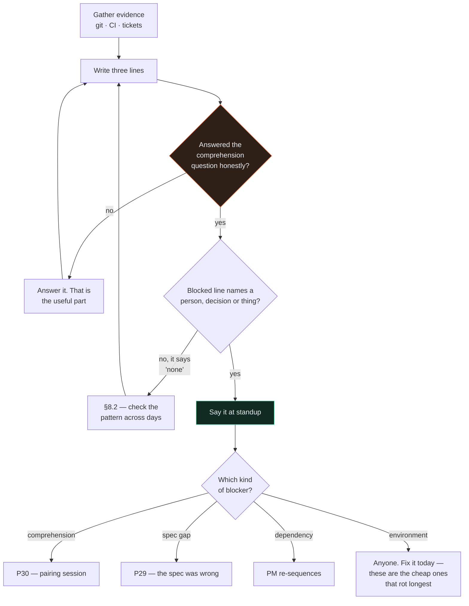

# P21 — Daily Standup Summary

← [P20 — Write tests alongside the code](P20-write-tests-alongside-the-code.md) · [Library index](../README.md) · Next: [P22 — E2E test the application](../phase-5-verify/P22-e2e-test-the-application.md)

> **One line:** turns yesterday's actual evidence into three honest lines per person, and surfaces the blocker.

| | |
|---|---|
| **Phase** | 4 — Build |
| **Who runs it** | Everyone, individually, before standup. The Project Manager (Atul) runs the consolidation |
| **When** | Every working morning, ten minutes before the meeting |
| **Takes in** | Yesterday's git log, ticket movements, CI results, and your own session history |
| **Produces** | Three lines per person — done / doing / blocked — grounded in evidence, not memory |
| **Hands off to** | Whoever picks up the blocker. Often [P30](../phase-6-rework/P30-when-the-ai-is-stuck.md) or [P29](../phase-6-rework/P29-the-spec-was-wrong.md) |
| **Time to run** | 3 minutes each, 10 for the consolidation |

---

## 1. The scene

Day nine of Sprint 2. Standup at 9:30.

Ravi goes first, and what he says is: *"Yesterday I worked on the confidence gate. Today I'll carry on with the confidence gate. No blockers."*

Atul writes it down. It is the fourth morning in a row Ravi has said a version of that sentence, and it contains no information whatsoever. Atul cannot tell from it whether the gate is nearly finished or has not started.

Meanwhile the actual truth of Ravi's Tuesday, had anyone asked, was this: he built the whole per-field threshold evaluation in about ninety minutes, it works, and then he spent five hours on something else entirely — his AI produced a `_deep_merge` helper for the config defaults that is elegant, recursive, and which he does not fully understand. He has read it four times. He is fairly sure it is correct. He is not sure enough to merge it into the thing that decides whether a wrong number reaches the warehouse.

That is the single most useful fact in the room, and the standup format he was using had no slot for it.

Pankaj, two people later, says her version of the same nothing: *"Writing tests. No blockers."* What she actually needs is a fixture PDF with a table that spans two pages, and she has been waiting three days for someone to say who can produce one.

Standup takes six minutes. Everyone is efficient and nobody learns anything.

Atul changes the format that afternoon, and the change is small: **stop asking people what they did, and start asking the evidence.**

---

## 2. What this prompt actually does — in plain language

### What a standup even is

If you have never worked in scrum, the daily standup is a short meeting — ten to fifteen minutes — where each person on the team says three things:

1. **What I finished since yesterday**
2. **What I'm working on today**
3. **What's in my way**

The name comes from the idea that everyone literally stands up, so it stays short.

Here is what it is genuinely for, which is not obvious and which most teams get wrong: **it is not a status report to the manager.** If it were, it could be an email. The point is that seven people who have each been working alone for a day get one chance to discover that their work has drifted apart — or that one of them is stuck on something another one solved last week.

**Item 3 is the whole meeting.** Items 1 and 2 exist to give item 3 enough context to make sense. A standup where nobody says a blocker is not a standup where nothing is blocked. It is a standup where the format failed.

### Why it goes wrong

Standups decay in a predictable way, and it takes about a week.

People start reporting from **memory**, and memory produces summaries. A summary of a day's work is almost always some version of "I worked on the thing I am assigned to." True, useless, and impossible to disagree with.

Then two things follow. Nobody can tell whether progress is real, so the PM starts asking follow-up questions, so the meeting gets longer, so people compress their updates further to keep it short — which makes them vaguer, which prompts more questions. The format eats itself.

The fix is not "be more detailed." It is **stop reporting from memory.** Your git log knows exactly what you did yesterday. Your ticket board knows what moved. CI knows what broke. All of that is evidence, it takes thirty seconds to gather, and it cannot be vague.

### What this prompt does

You point it at yesterday's evidence and it writes your three lines from that, rather than from your recollection.

It reads:
- **Your git commits** since yesterday's standup — what actually changed
- **Ticket movements** — what genuinely moved column, not what feels nearly done
- **CI results** — what is green, what is red, what has been red for three days and everyone has stopped noticing
- **Your own session history** if you have it — where the time actually went

And it produces three lines. Short ones.

The important part is the third line, and this prompt is deliberately aggressive about it. It asks you directly: **is there anything you are not saying because it feels like an admission rather than a blocker?**

### The new kind of blocker

Here is the part that did not exist five years ago, and it is why this prompt is in the book at all.

When a human writes code slowly, they understand it, because understanding it *is* how it got written. The understanding and the artifact arrive together.

With an AI, they come apart. You can have 400 working lines in front of you in twenty minutes, and your understanding of those lines lags a long way behind their existence. Usually that gap closes as you read. Sometimes it does not.

**"The AI produced something I don't fully understand and I'm not comfortable merging it"** is a completely legitimate blocker. It is also one people are embarrassed to say out loud, because it sounds like an admission that you cannot read code.

It is not. It is the correct instinct, functioning properly. It means your Definition of Done — [P17](../phase-3-planning/P17-definition-of-done.md), which says *a human has read every line the AI wrote* — is doing its job, and the person is honouring it rather than quietly waving it through.

The alternative, which is what happens on teams that make this awkward to say, is that the code gets merged with a shrug. And the thing about code nobody understands is that it works fine right up until the day it needs changing, at which point it is somebody else's problem entirely.

So this prompt names it explicitly as a category. That is most of the work — once it is on a list, saying it stops feeling like a confession.

### Four blocker types worth naming

| Type | Sounds like | Who unblocks it |
|---|---|---|
| **Dependency** | "I need the gate's failure shape before I can render anything" | Another engineer, or the PM re-sequencing |
| **Decision** | "I need someone to tell me whether 0.90 or 0.92 for this broker" | The PO or the Architect |
| **Comprehension** | "The AI wrote it, it works, I don't understand it yet" | A pairing session, or [P30](../phase-6-rework/P30-when-the-ai-is-stuck.md) |
| **Environment** | "I've been waiting three days for a two-page fixture PDF" | Anyone. These are usually trivial and invisible |

Pankaj's fixture is the fourth kind, and it is the one that hurts most in practice — because it is small, so nobody escalates it, so it sits there for three days costing more than any of the interesting problems.

### The one idea to keep

> **A standup reports evidence, not recollection. And the only line that matters is the third one.**

---

## 3. The prompt

Run this on your own, in your repo, before the meeting. It takes about three minutes.

```text
You are helping me prepare my daily standup update. Be brief and factual.

**Do not** invent progress, soften a problem, or pad the update to sound productive.

Gather the evidence first — do not ask me what I did:

1. **Run** `git log --author="[MY GIT NAME]" --since="[LAST STANDUP TIME]" --oneline --stat`
2. **Run** `git status` and `git diff --stat` to see what is still uncommitted
3. **Read** the CI results at [CI COMMAND OR PATH]
4. **List** the tickets currently assigned to me from [TICKET SOURCE], with their column

Then write exactly three lines:

**Done since yesterday** — what actually landed, grounded in the commits.
If a commit is work-in-progress rather than finished, say so. If nothing landed, say that.

**Today** — the single next thing, specific enough that tomorrow's update can say whether it happened.
Not "carry on with [STORY]".

**Blocked** — anything stopping me, from these four categories:
* **Dependency** — I need something another person or story has to produce first
* **Decision** — I need someone with authority to decide something
* **Comprehension** — code exists and works and I do not understand it well enough to merge it
* **Environment** — tooling, data, access, or a fixture I have been waiting on

Then ask me this directly, and wait for my answer:

> Is there anything you have not mentioned because it feels like an admission rather than a
> blocker? In particular: is there code in your branch that an AI wrote, that passes, and that
> you could not explain line by line if asked in review?

If the answer is yes, that goes in the Blocked line. It is the most useful thing you will say
all morning.

Finally, flag anything the evidence shows that I have not mentioned:
* A test that has been failing for more than one day
* A branch with no commits for more than two days
* A ticket in "In Progress" that no commit has touched

You are done when the three lines are each under 25 words and the Blocked line either names a
specific person or decision, or honestly says "nothing".
```

---

## 4. Every placeholder, explained

| Placeholder | What to put in it | Northwind example | What happens if you get it wrong |
|---|---|---|---|
| `[MY GIT NAME]` | Your git author name or email, exactly as it appears in commits | `Ravi Mullick` | Returns an empty log and the AI cheerfully reports you did nothing |
| `[LAST STANDUP TIME]` | When the last standup was, as a git-parseable date | `"yesterday 09:30"` | Too wide and you re-report work you already reported; too narrow and you miss the evening's commits |
| `[CI COMMAND OR PATH]` | How to see build status — a CLI command, a log path, or a URL you can fetch | `gh run list --limit 5` | The long-running red test stays invisible, which is exactly the failure this prompt exists to catch |
| `[TICKET SOURCE]` | Where tickets live and how to read them — a CLI, an MCP server, or a file | the Jira MCP server configured in [P03](../phase-0-foundation/P03-wire-up-an-mcp-server.md) | The AI works from commits alone and misses that a ticket has been "In Progress" untouched for four days |
| `[STORY]` | Used only in the "not this" example — the story ID you would lazily name | `NWD-103` | None. It is there to show the AI what a bad answer looks like |

> **Watch out.** If your team squashes commits or works on long-lived branches, the git log will under-report. Add `--all` and widen the window, or the evidence will be thinner than the reality.

---

## 5. The filled-in example

Ravi, day nine of Sprint 2, at 9:20am.

```text
You are helping me prepare my daily standup update. Be brief and factual.

**Do not** invent progress, soften a problem, or pad the update to sound productive.

Gather the evidence first — do not ask me what I did:

1. **Run** `git log --author="Ravi Mullick" --since="yesterday 09:30" --oneline --stat`
2. **Run** `git status` and `git diff --stat` to see what is still uncommitted
3. **Read** the CI results at `gh run list --limit 5 --branch feat/NWD-103-confidence-gate`
4. **List** the tickets currently assigned to me from the Jira MCP server, with their column

Then write exactly three lines:

**Done since yesterday** — what actually landed, grounded in the commits.
If a commit is work-in-progress rather than finished, say so. If nothing landed, say that.

**Today** — the single next thing, specific enough that tomorrow's update can say whether it
happened. Not "carry on with NWD-103".

**Blocked** — anything stopping me, from these four categories:
* **Dependency** — I need something another person or story has to produce first
* **Decision** — I need someone with authority to decide something
* **Comprehension** — code exists and works and I do not understand it well enough to merge it
* **Environment** — tooling, data, access, or a fixture I have been waiting on

Then ask me this directly, and wait for my answer:

> Is there anything you have not mentioned because it feels like an admission rather than a
> blocker? In particular: is there code in your branch that an AI wrote, that passes, and that
> you could not explain line by line if asked in review?

If the answer is yes, that goes in the Blocked line. It is the most useful thing you will say
all morning.

Finally, flag anything the evidence shows that I have not mentioned:
* A test that has been failing for more than one day
* A branch with no commits for more than two days
* A ticket in "In Progress" that no commit has touched

You are done when the three lines are each under 25 words and the Blocked line either names a
specific person or decision, or honestly says "nothing".
```

---

## 6. What comes back

```text
Evidence gathered
─────────────────
git log (Ravi Mullick, since yesterday 09:30):
  8f3a1c2  feat(confidence): per-field-type threshold evaluation      core/confidence.py  +94 -0
  2b7e419  test(confidence): money gated harder than descriptive text tests/test_confidence.py +38 -0
  c14d803  wip(config): recursive default merge for source overrides  config/settings.py  +47 -3

git status: 1 modified, uncommitted — config/settings.py (+22 lines)

CI (feat/NWD-103-confidence-gate): last 5 runs
  #218  pass   2h ago
  #217  pass   6h ago
  #216  FAIL   yesterday 16:02   tests/test_extract.py::test_array_field_maps_line_items
  #215  FAIL   yesterday 11:40   tests/test_extract.py::test_array_field_maps_line_items
  #214  pass   2 days ago

Jira: NWD-103 In Progress (4d)  ·  NWD-106 To Do  ·  NWD-107 To Do

─────────────────
Proposed update
─────────────────
Done since yesterday
  Confidence gate evaluates per-field-type thresholds; first two tests green.
  Config default-merge is committed but WIP, not finished.

Today
  Finish the config default merge so broker_alpha's 0.92 currency override actually applies,
  and get test_extract green.

Blocked
  (pending your answer below)

─────────────────
One question before this is ready
─────────────────
Is there anything you have not mentioned because it feels like an admission rather than a
blocker? In particular: is there code in your branch that an AI wrote, that passes, and that
you could not explain line by line if asked in review?

─────────────────
Things the evidence shows that you did not mention
─────────────────
1. test_extract.py::test_array_field_maps_line_items has failed twice, first failing
   yesterday morning. It is not in your update. It has been red for over 24 hours.
2. Commit c14d803 is prefixed "wip" and config/settings.py has further uncommitted changes.
   That is the third commit touching the merge logic. Two prior attempts appear to have been
   reworked — that pattern usually means the approach is not settling.
```

Ravi answers the question honestly. The final update reads:

```text
Done      Confidence gate evaluates per-field-type thresholds; first two tests green.
Today     Finish the config default merge so broker_alpha's 0.92 override applies.
Blocked   The recursive _deep_merge my AI wrote works but I can't fully explain it,
          and it decides which threshold applies. Want 20 minutes with Gautam before I merge.
          Also test_extract has been red since yesterday morning.
```

### How to read this

**The evidence block is the point.** It took thirty seconds to produce and it contains two facts Ravi did not have in his head: that a test has been red for over a day, and that this is his *third* commit to the same merge logic.

**The two-day-red test is the classic catch.** Nobody is hiding it. It has simply stopped being visible — it went red on a Tuesday morning, everyone was busy, and by Thursday it is part of the furniture. Evidence-based standups find these every time.

**The third-attempt pattern is the subtle one.** The AI is not saying the code is wrong. It is saying *this is the third go at the same twenty lines*, which is the signal from [the rework loop](../03-the-rework-loop.md) that the session is circling. That is a [P30](../phase-6-rework/P30-when-the-ai-is-stuck.md) situation and Ravi had not recognised it as one.

**Commonly wrong:** the Today line. The output above says *"finish the config default merge so broker_alpha's 0.92 override applies"* — tomorrow you can say yes or no to that. The version people write by hand is *"continue with NWD-103,"* which is unfalsifiable and can be said again on Friday.

---

## 7. Why this is the final prompt

**Done means:** three lines, each under 25 words, every claim traceable to a commit, a ticket or a CI run — and a Blocked line that either names a specific person or decision, or honestly says nothing.

Tick these:

- [ ] Every claim in **Done** maps to a commit or a ticket transition
- [ ] **Done** distinguishes finished work from work-in-progress
- [ ] **Today** is specific enough that tomorrow's update can say yes or no to it
- [ ] **Blocked** names a person, a decision, or a thing — not a feeling
- [ ] You answered the comprehension question honestly
- [ ] Anything the evidence flagged and you had not mentioned is either in the update or consciously dismissed

**Why stop rather than keep prompting.** This is a three-minute artifact and the temptation is to make it *good*. Don't. A polished standup update is a worse standup update — the polish comes from adding context, the context makes it longer, and a longer update gets less attention, not more. The three lines are short on purpose. If your update needs a paragraph, that paragraph is a conversation to have after standup with the two people it concerns, not a broadcast to seven.

**You are not done if** the Blocked line says "no blockers" and you had to think about whether that was true.

---

## 8. When it is not done — the follow-up prompts

| What you're seeing | What's actually wrong | Run this next |
|---|---|---|
| Every update is "worked on X, continuing X" | Reporting from memory, not evidence. The git-log step is being skipped | §8.1 |
| Nobody ever has a blocker | The format has made blockers feel like admissions | §8.2 |
| Standup runs 25 minutes | It has become a status meeting; problem-solving is happening in the room | §8.3 |
| Two people describe the same work differently | Their sessions have diverged — a handoff problem, not a standup problem | [P02 handoff contract](../02-the-handoff-contract.md), then §8.4 |
| The blocker is "the AI wrote it and I don't get it" | Correct blocker, wrong forum. It needs a pairing session | [P30](../phase-6-rework/P30-when-the-ai-is-stuck.md) |
| The blocker is "this case isn't in the spec" | The spec is wrong, and this will recur across stories | [P29](../phase-6-rework/P29-the-spec-was-wrong.md) |
| A test has been red for days and nobody mentions it | Alert blindness. Make it a standing agenda item | §8.5 |

### 8.1 "Everyone's update is the same three words"

Use this when updates have gone generic and you need the evidence to speak instead.

```text
Ignore what I tell you I did. Work only from the evidence.

Run `git log --author="[MY GIT NAME]" --since="[LAST STANDUP]" -p --stat` and read the actual diffs.

Write my Done line using only what the diffs show changed, in plain language a non-engineer
could follow. If the diffs show nothing meaningful landed, write exactly: "Nothing landed
yesterday." Do not soften that.
```

The output is sometimes uncomfortable, which is the point. "Nothing landed yesterday" is a real and legitimate update, and a team where it can be said is healthier than one where it cannot.

### 8.2 "Nobody ever has a blocker"

For the PM, run once across the team, when the Blocked column has been empty for a week.

```text
Here are the last [N] days of standup updates for the team:

<paste them>

Every Blocked line says "none". That is unlikely to be true.

For each person, look at their Done and Today lines across the days and find evidence of an
unstated blocker:
* The same Today line repeated three or more days running
* Work that started and then silently stopped appearing
* A ticket that has not moved column while being mentioned daily

For each one you find: state the person, the evidence, and the question I should ask them
privately — not in standup.

Do not guess at motives. Report only what the pattern shows.
```

The instruction to ask privately matters. A blocker somebody has been sitting on is usually being sat on because raising it feels costly. Asking in the meeting confirms that it is.

### 8.3 "Standup takes 25 minutes"

```text
Here is a transcript of this morning's standup:

<paste>

Split every exchange into one of three buckets:
1. **Information** — something the whole team needed to hear
2. **Two-person conversation** — a problem being solved that concerns two people
3. **Status theatre** — reporting for its own sake

For bucket 2, name the two people and what they should have taken offline.
For bucket 3, say what the person could have said instead in under 25 words.
Estimate the meeting length if only bucket 1 had happened.
```

Almost always the answer is that two people started debugging in front of five spectators. Naming it once fixes it for about a month.

### 8.4 "Two people are describing the same work differently"

```text
Here are today's updates from [PERSON A] and [PERSON B]:

<paste both>

They appear to be describing the same piece of work with different assumptions about what it
does. Identify the specific point of disagreement and state which artifact should settle it —
the spec, the data contract, the acceptance criteria, or none of them.

If the answer is "none of them", that is the finding. Say so plainly.
```

"None of them" is the interesting answer. It means the thing they disagree about was never written down anywhere, and one of them has been building on an assumption. That is a [handoff contract](../02-the-handoff-contract.md) gap, and finding it at standup is the cheapest place you will ever find it.

### 8.5 "The red test nobody mentions"

Standing check, run by the PM once a week.

```text
Run `gh run list --limit 40 --json conclusion,headBranch,createdAt,displayTitle`.

Find every test that has failed on two or more consecutive runs, and for each one report:
the test name, when it first went red, how many runs it has been red for, and which branch.

Rank by how long it has been red. Do not propose fixes.
```

Ranking by duration rather than count is deliberate. A test that failed nine times this morning has someone's attention. A test that has been red since last Tuesday does not, and it is the one that is actually dangerous.

### The loop



---

## 9. How this goes wrong

### It becomes a report to the manager

The most common decay. People start addressing their three lines to the PM, and once that happens, the meeting is an audit and everyone optimises to look productive rather than to surface problems.

**Why it happens:** the PM is usually the one running the meeting, so they become the audience by default.

**The fix:** have people address the team, not Atul. Rotate who facilitates. And the PM should have a blocker sometimes, out loud — nothing normalises admitting a problem faster than the person you are worried about impressing admitting one first.

### The AI writes a nicer update than the truth

Ask for a standup update and an AI will produce something well-structured and mildly flattering, because that is what "write my status update" usually means.

**Why it happens:** the request is ambiguous between *report* and *represent*.

**The fix:** the `Do not invent progress, soften a problem, or pad the update` line at the top, plus the instruction to write "Nothing landed yesterday" without softening. Check the output against the git log occasionally — if the update sounds better than the diffs, the prompt is being too kind.

### The comprehension question gets answered on autopilot

By week three, "is there code you can't explain?" gets a reflexive no.

**Why it happens:** it is a yes/no question and no is easier.

**The fix:** make it concrete. Ask instead: *"pick the most complex function in your branch. Could you explain it, line by line, to Gautam, right now, with no preparation?"* Naming a specific function and a specific person changes the answer noticeably more often than you would expect.

### Standup replaces the actual conversation

The opposite failure: a blocker gets raised, everyone nods, and nothing happens because it was "covered at standup."

**Why it happens:** raising it feels like progress. It isn't.

**The fix:** every blocker leaves standup with a name and a time attached, not just an acknowledgement. Pankaj's fixture PDF sat for three days after being mentioned twice. It was fixed in forty minutes on the day somebody said "Ravi, you, after this."

### It is the wrong tool entirely

If the team is two people sitting together, you do not need this. You do not really need standup. The information moves anyway.

**Where the line is:** roughly four people, or any distributed team. Below that the ceremony costs more than it returns, and running it anyway teaches people that ceremonies are theatre — which is expensive later, when you need one that matters.

---

## 10. The handoff

Standup produces the smallest artifact in the book and the widest one — three lines per person, and its output goes to whoever the blocker belongs to.

**A comprehension blocker** goes to a pairing session, usually with Gautam, and it is worth protecting. It is the [Definition of Done](../phase-3-planning/P17-definition-of-done.md) clause *"a human has read every line the AI wrote"* being enforced by the person it applies to, before review rather than during it. Catching it here costs twenty minutes. Catching it in review costs a round trip. Not catching it at all costs whoever changes that code in eight months.

**A spec-gap blocker** goes to [P29](../phase-6-rework/P29-the-spec-was-wrong.md), and quickly, because a gap one person has hit is a gap several stories are quietly built on.

**A dependency blocker** goes back to the PM for re-sequencing. Atul spotted NWD-108's dependency on NWD-103 during [sprint planning](../phase-3-planning/P16-sprint-plan-and-assignment.md), three weeks before it bit — but most dependencies are not visible that early, and standup is where the rest of them surface.

**An environment blocker** goes to anyone with a spare hour. These are the ones to watch: individually trivial, therefore never escalated, therefore the longest-lived items on any team.

> **Artifact contract — the three lines**
>
> Produced by: each team member, using P21, before standup
>
> Anyone hearing this update can rely on it containing:
> - What actually landed, traceable to a commit or ticket transition
> - A Today commitment specific enough to be judged tomorrow
> - A Blocked line naming a person, a decision, or a thing — or honestly saying nothing
> - An honest answer to the comprehension question
>
> This update does **not** contain: solutions, design discussion, or anything that concerns
> only two people. Those happen after standup.
>
> **If the Blocked line is "none" and you had to think about whether that was true, it is not done.**

---

## 11. In the case study

Day nine of Sprint 2, in [chapter 05](../../Case-Study/Python-ETL/05-sprint-2-build-backend.md).

Ravi gives his fourth identical update. Atul writes it down without comment, and after standup asks a different question — not *what did you do*, but *show me yesterday's commits*. Three commits, one prefixed `wip`, all three touching the same twenty lines of config merging.

Ravi explains: the gate itself took ninety minutes. The rest of the day went on a recursive helper his AI produced for merging per-broker config overrides onto the defaults. It works. Every test passes. He has read it four times and he could not confidently explain what it does when a nested key exists on one side and not the other — which is precisely the case that decides whether Broker Alpha's 0.92 currency threshold overrides the 0.90 default.

That code decides which threshold applies. Which decides what reaches the warehouse.

Gautam spends twenty minutes with him after standup. The helper turns out to be correct. Ravi can now explain it, and the review is a formality rather than an argument.

The genuinely useful part, though, is what Atul changes that afternoon: he adds the comprehension question to the team's standup format, permanently. Two days later Dzmitry uses it to flag a `useMemo` dependency array in the exception queue that they had not reasoned through — a much smaller thing, caught much earlier, precisely because the format now had a slot for it.

And in the same standup, three days late, Pankaj finally says out loud that she has been waiting for a two-page fixture PDF. It takes forty minutes to produce. It is the fixture she uses, two weeks later, to find [NWD-142](../../Case-Study/Python-ETL/artifacts/bug-NWD-142.md).

---

← [P20 — Write tests alongside the code](P20-write-tests-alongside-the-code.md) · [Library index](../README.md) · Next: [P22 — E2E test the application](../phase-5-verify/P22-e2e-test-the-application.md)
