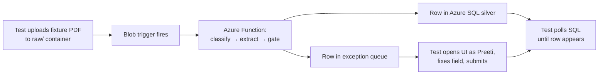
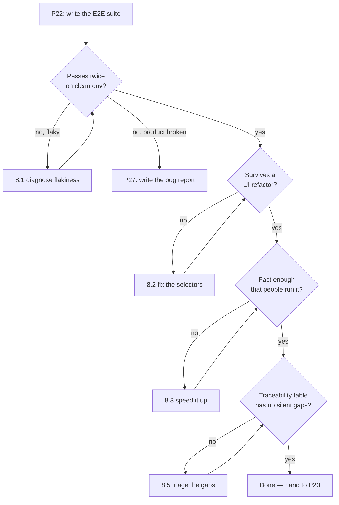

# P22 — E2E Test the Application

← [Previous](../phase-4-build/P21-daily-standup-summary.md) · [Library index](../README.md) · Next: [P23](P23-review-someone-elses-code.md)

> **One line:** Turn acceptance criteria into automated tests that drive the whole pipeline, not the parts.

| | |
|---|---|
| **Phase** | 5 — Verify |
| **Who runs it** | QA Engineer (Pankaj ) |
| **When** | Sprint 3, day 2. Ravi's pipeline and Dzmitry's exception queue are both merged to `main` and deployed to the test environment. Nobody has yet run a document all the way through in one go. |
| **Takes in** | `Case-Study/Python-ETL/artifacts/acceptance-criteria-NWD-103.md`, `artifacts/ui-brief-exception-queue.md`, `artifacts/definition-of-done.md`, the deployed test environment |
| **Produces** | `Case-Study/Python-ETL/code/doc_ingestion/tests/e2e/` — `exception_queue.spec.ts`, `pipeline_happy_path.spec.ts`, `fixtures/`, `helpers/` |
| **Hands off to** | Team Lead (Gautam), who runs [P23](P23-review-someone-elses-code.md) on the code the failing tests point at |
| **Time to run** | Two hours for the first pass. Half a day including making the tests actually pass reliably. |

---

## 1. The scene

It's Tuesday of Sprint 3. Yesterday's standup summary — the one [P21](../phase-4-build/P21-daily-standup-summary.md) produced — had a line in it that Atul read out twice: *"NWD-103 and NWD-108 both merged Friday. No end-to-end run yet."*

Atul is the project manager and he is allergic to optimism. He asked the obvious question. "So we've built a pipeline and a screen, and nobody has actually put a PDF in one end and looked at the other end?"

Correct. Ravi has unit tests. Good ones — [P20](../phase-4-build/P20-write-tests-alongside-the-code.md) produced 47 of them and they all pass. `test_confidence.py` proves the gate rejects a 0.71 currency field. `test_transform.py` proves a Spanish date string becomes a proper `DATE`. Dzmitry has component tests that prove the exception queue table renders 200 rows without dying.

None of that tells you what happens when a real Broker Alpha PDF lands in `raw/broker_alpha/2026-03-10/` at 06:14 and something in the middle quietly does the wrong thing.

Pankaj has been the QA engineer on this team since `AI-Skills`. She has a specific opinion about this moment, and it's the one she opens with every time: **the unit tests prove the parts do what Ravi thought they'd do. Nothing yet proves the parts are wired together.**

So this morning she is going to write the tests that treat the whole system as a black box. Drop a file in blob storage. Wait. See a row in Azure SQL. Open the exception queue as Preeti would, fix the field the gate rejected, click Submit, and watch the row appear in the warehouse. Two journeys, both of them the thing Northwind is actually paying for.

She is not going to write those by hand from a blank file. She is going to hand the acceptance criteria to the AI and make it do the tedious part — the selectors, the waits, the fixture wiring — while she keeps hold of the part that matters, which is deciding what a passing test actually proves.

---

## 2. What this prompt actually does — in plain language

### The problem: "all the tests pass" and "it works" are different sentences

Here is the shape of the trap.

Ravi wrote `core/confidence.py`. It has a function that takes a field and a threshold and returns pass or fail. He wrote a unit test that feeds it a field with confidence `0.71` and a threshold of `0.90` and asserts it fails. The test passes. The function is correct.

Then somewhere in `core/rules.py` the code that *calls* that function passes the threshold for `string` (0.75) where it meant to pass the threshold for `currency` (0.90). Both files are individually correct. Both files have passing tests. The system is wrong.

**Unit tests prove each piece behaves. Only an end-to-end test proves the pieces were connected in the right order with the right arguments.** That's the whole reason this layer exists, and it is why "we have 94% coverage" is not an answer to "does it work."

### The three sizes of test, defined once so the rest of this file makes sense

You will hear these three words used loosely. Here they are pinned down, in the order of how much of the system they touch.

| Name | What it touches | Example from Northwind | Runs in |
|---|---|---|---|
| **Unit test** | One function, everything else faked | `passes_gate(field, 0.90)` returns `False` for confidence `0.71` | milliseconds |
| **Integration test** | Two or three real components together, external services faked | `rules.py` calling the real `confidence.py` against a real config file from `sources.yaml` | tenths of a second |
| **End-to-end test (E2E)** | The whole system, as a user or an outside event would touch it | Drop a PDF in blob → 90 seconds later a row exists in Azure SQL with the right values | tens of seconds |

"Faked" above means replaced with a stand-in. If a function normally calls Azure AI Document Intelligence over the network, a unit test replaces that call with a hardcoded response so the test is fast and doesn't cost money. The word you'll see in code for this is **mock** — a mock is a fake stand-in object that records how it was called and returns whatever you told it to return.

E2E tests use no mocks. That is the point and also the cost. They are slow, they need a real environment, and when they fail they don't tell you which line broke. They tell you *the journey* broke, and you go and find out why.

### What "end to end" means when the thing isn't a website

Most tutorials about E2E testing assume the system is a web app. User opens page, clicks button, sees result. That's a clean story and it's half of what Northwind needs.

The other half is a **pipeline**, and a pipeline has no browser in it at all.

A pipeline's "user" is a file arriving. Its "screen" is a database table. So an end-to-end test here has a shape most E2E guides never mention:



The test does two things a browser test never does:

1. **It writes to storage** to start the journey. Not a click — an upload.
2. **It waits for something asynchronous.** Between the upload and the row there is a queue, a function cold start, three Azure AI calls and a database write. That takes anywhere from eight seconds to ninety. The test cannot just check immediately; it has to poll — ask repeatedly, with a gap between asks, until either the row shows up or a deadline passes.

Getting that wait right is the single most fiddly thing in this file, and §9 has a whole failure mode about it.

### Playwright, in one paragraph, for someone who has never used it

**Playwright** is a tool from Microsoft that drives a real browser from code. You write TypeScript (or Python) that says "go to this URL, find the button labelled Submit, click it, now check the page says Loaded." Playwright launches a real Chromium, does exactly that, and reports pass or fail. It is the current default choice for this job — the alternatives you'll hear named are Cypress and the older Selenium.

Two things about it matter for this prompt:

- **It auto-waits.** When you tell Playwright to click a button, it waits for that button to actually exist and be clickable before clicking. You almost never write `sleep(2)`. This kills the single biggest source of flaky browser tests.
- **It can do more than the browser.** A Playwright test is just TypeScript, so the same test file can call the Azure Blob SDK to upload a fixture and call a SQL driver to check a row. That's what makes it usable for a pipeline as well as a UI.

**Flaky** is the word for a test that passes sometimes and fails sometimes with no code change. A flaky test is worse than no test, because after the third false alarm the team stops reading the failures.

### Why selectors by role and label, and never CSS chains

This is the rule that separates E2E tests that survive a redesign from ones that don't.

A **selector** is how the test finds a thing on the page. You have choices.

The bad choice — a **CSS selector chain** — describes where the element sits in the HTML structure:

```typescript
await page.click('div.container > div:nth-child(3) > table tbody tr:first-child button.btn-primary');
```

That test breaks the moment Dzmitry wraps the table in one extra `<div>` for spacing. The behaviour didn't change. The test failed anyway. That's a **false failure** and it teaches the team to distrust the suite.

The good choice describes the element the way a human describes it:

```typescript
await page.getByRole('button', { name: 'Submit correction' }).click();
```

`getByRole` finds the element by its **accessibility role** — the semantic job the element does, the same information a screen reader uses. A `<button>` has role `button`. A `<table>` has role `table`. A heading has role `heading`. The `name` is the visible or accessible text.

Three reasons this is better and they are worth knowing separately:

1. **It survives refactoring.** Dzmitry can restructure the whole component tree; as long as there is still a button that says "Submit correction," the test passes.
2. **It tests what the user sees.** If the button's label changes to something confusing, the test fails, and it *should* fail, because Preeti would also be confused.
3. **It doubles as an accessibility check.** If `getByRole('button', { name: 'Submit correction' })` finds nothing because Dzmitry used a clickable `<div>` with no label, that's a real defect for anyone using a screen reader. The test catching it is a bonus, not an accident.

The order of preference, best first: `getByRole`, `getByLabel` (for form fields, finds the input by its `<label>` text), `getByText`, and only as a last resort `getByTestId` — a `data-testid` attribute you add to the markup purely for tests. Test IDs are a legitimate escape hatch for things with no accessible name, like a coloured status dot. They are not the default.

> **Watch out.** If you can't find an element by role or label, that is usually a bug in the UI, not a reason to reach for a CSS selector. Tell Dzmitry before you work around it.

### Test what the user sees, not what the implementation does

The second teaching point, and it's the one people push back on.

A test that reads the React component's internal state, or asserts that a specific function was called, is testing the implementation. When Dzmitry swaps a `useState` for a reducer, the behaviour is identical and the test breaks.

A test that asserts "after clicking Submit, the row disappears from the exception queue and a toast says 'Loaded to silver'" is testing the behaviour. It survives any rewrite that keeps the behaviour.

The practical rule: **write the assertion as a sentence Preeti could say.** "After I fix the quantity and submit, the document leaves my queue." If your assertion can't be said that way, you're testing the wrong layer.

For the pipeline half, the same rule applies with the database standing in for the user: "after a Broker Alpha statement lands, there are fourteen position rows in `silver.counterparty_position` with `bronze_path` set." That's an outcome. `assert extract_fields() was called with 3 arguments` is not.

### Every test seeds its own data — the isolation rule

This one causes more misery than any other and it's easy to state.

**A test must create everything it needs and clean up after itself. It must not depend on data another test created, and it must not care whether it runs first, last, or alone.**

The failure it prevents looks like this. Test A drops a fixture PDF and asserts the exception queue has one item. Test B drops a different fixture and asserts the queue has two items — because it was written on a day when test A had already run. Now someone runs test B alone. It fails. Someone runs them in parallel. Both fail. Someone reorders them and everything fails. Nobody knows which failure is real.

The fix is mechanical:

- Every test generates a **unique run identifier** — a random string — and uses it in every filename, every folder path, every document reference it creates.
- Every assertion is scoped to that identifier. Not "the queue has one item" but "the queue has one item whose `source_file` contains `e2e-a4f21c`."
- Every test tears down what it made in an `afterEach` block, which is Playwright's word for "run this after every test in the file whether it passed or failed."

The unique identifier does the heavy lifting. It means the test is correct even if forty other documents are sitting in the queue from a manual session an hour ago. That matters a lot in a shared test environment, which is what Northwind has.

There is one deliberate exception, and it's worth naming: some fixture data is **reference data**, not test data. The `sources.yaml` config that defines `broker_alpha`'s thresholds is deployed with the app; a test doesn't create it. The rule is about *rows the test's journey produces*, not about the system's own configuration.

### Why the prompt is shaped the way it is

Read §3 and you'll see the instructions come in a specific order. That order is not decoration.

1. **Give it the acceptance criteria first.** The AI's job is not to invent what to test. Preetinka and Pankaj already decided that in [P08](../phase-1-discovery/P08-write-acceptance-criteria.md). Handing over `acceptance-criteria-NWD-103.md` means the tests map to criteria one-for-one, and a reviewer can check that mapping in thirty seconds.
2. **Describe the environment before asking for code.** The AI cannot guess that the queue takes up to 90 seconds, that the fixture PDFs live in `tests/fixtures/pdf/`, or that the UI runs on a URL with an auth token. Every one of those is a fact only you have. Left out, the AI invents a plausible wrong version and you spend an hour deleting it.
3. **Ban CSS selectors explicitly.** Models default to CSS selectors because most of the test code on the internet uses them. You have to say no in the prompt or you get them.
4. **Demand the polling helper be written once and reused.** Without that instruction you get the same 20-line wait loop copy-pasted into six tests with slightly different timeouts, and you will be maintaining that forever.
5. **Ask for the traceability table at the end.** A short table mapping each test to the acceptance criterion it covers. That table is what Pankaj pastes into the story when she moves it to Done, and it's what makes the coverage gap visible — if AC-4 has no test next to it, you can see that in one glance.

### What the AI is actually doing when this runs

It is not "running the tests." It has never seen your environment and cannot click anything.

It is doing three things, and it's worth knowing which is which because they fail differently:

- **Translation.** It turns each acceptance criterion, written in English, into a test body with an arrange/act/assert shape. This it does very well.
- **Recall of idiom.** It writes idiomatic Playwright — the right imports, the right `test.describe` nesting, the right assertion functions. Also very good, because there is a lot of Playwright in its training data.
- **Guessing your specifics.** Selector names, table names, column names, timeouts, the exact shape of your fixture folder. This it does badly, because it's guessing. Everything you fail to tell it becomes an invention.

The practical consequence: the first output will be structurally right and factually wrong in a handful of specific places. That's normal. You fix the facts, not the structure. §8 has the follow-ups.

### The one idea to keep

If you forget the rest of this file, keep this:

**An end-to-end test is a claim about the user's journey, written down so a machine can check it every day. Everything else — the selectors, the waits, the fixtures — is plumbing in service of that claim.**

When you're deciding whether a test is worth writing, ask what claim it makes. "Clicking Submit calls `handleSubmit`" is not a claim anyone at Northwind cares about. "A Broker Alpha statement with one low-confidence quantity reaches Preeti's queue, and after she fixes it, all fourteen positions load" is the entire business case in one sentence.

---

## 3. The prompt

Paste this into a session that has the repository open. It needs to be able to read the acceptance criteria file and the UI code, so run it from the repo root, not from a blank chat.

```text
You are a **senior QA automation engineer**. Write Playwright end-to-end tests for the
counterparty document ingestion system.

**Read these files first** and base every test on what they say. Do not invent requirements:
- [PATH TO ACCEPTANCE CRITERIA]
- [PATH TO UI BRIEF]
- [PATH TO THE UI SOURCE FOLDER]

**STOP GATE — before writing a single test, list the user journeys you are going to cover
and wait for my confirmation.** One line each, in the form "As <who>, <does what>, so that
<outcome>." Do not write test code in that first reply.

## The system under test

- **Pipeline:** a PDF lands in Azure Blob at `raw/{broker}/{yyyy-mm-dd}/{file}.pdf`.
  A blob trigger runs classify → translate → extract → confidence gate → transform.
  Rows land in Azure SQL `[SILVER TABLE NAME]`, or the document goes to the exception queue.
- **UI:** [UI BASE URL] — a React exception queue where an analyst reviews and corrects
  rejected fields, then submits.
- **End-to-end latency:** a document takes [TYPICAL SECONDS] seconds typically and up to
  [MAX SECONDS] seconds at worst to appear downstream.

## What to write

**Cover** these journeys:
[LIST OF JOURNEYS]

**Structure** the output as:
- `tests/e2e/helpers/` — shared helpers. At minimum: a blob upload helper, a SQL query
  helper, and ONE polling helper used by every test that waits for async work.
- `tests/e2e/fixtures/` — a manifest describing each fixture PDF and what it should produce.
- One `.spec.ts` file per journey.
- `playwright.config.ts` with sensible retry, timeout and reporter settings.

**Follow** these rules without exception:

- **Select elements by role or label only.** `getByRole`, `getByLabel`, `getByText`.
  `getByTestId` only where an element genuinely has no accessible name, and add a comment
  saying why.
- **Never use CSS selector chains**, `nth-child`, XPath, or class names as selectors.
- **Assert on what the user or the database sees**, never on internal component state,
  never on whether a function was called.
- **Every test seeds its own data.** Generate a unique run id per test and put it in every
  filename and folder path the test creates. Scope every assertion to that run id so the
  test is correct when other data exists.
- **Every test cleans up in `afterEach`**, including when it failed.
- **Never use a fixed `sleep` or `waitForTimeout` to wait for the pipeline.** Poll with a
  deadline, using the single shared polling helper.
- **Write the test name as the claim it makes**, in plain English, not
  `test('test upload 1')`.

**Do not:**
- Do not mock anything. This is end to end; every service is the real one.
- Do not write unit tests or component tests. Those already exist.
- Do not assert on exact timing, row ids, or generated timestamps.
- Do not put credentials, connection strings or tokens in the test files. Read them from
  environment variables and list the required variables in a README.
- Do not write tests for journeys not in the list above without telling me first.

**Finish with** a traceability table: one row per acceptance criterion ID, the test that
covers it, and the file it lives in. Mark any criterion with no test as `UNCOVERED` —
do not quietly leave it out.

**You are done when** every journey in the list has at least one test, the traceability
table has no silent gaps, and no test contains a CSS selector, a mock, or a fixed sleep.

Save the tests under `[TEST OUTPUT PATH]` and the traceability table as a markdown section
in `[TEST OUTPUT PATH]/README.md`.
```

---

## 4. Every placeholder, explained

| Placeholder | What to put in it | Northwind example | What happens if you get it wrong |
|---|---|---|---|
| `[PATH TO ACCEPTANCE CRITERIA]` | The acceptance criteria file for the stories under test. This is what stops the AI inventing requirements. | `Case-Study/Python-ETL/artifacts/acceptance-criteria-NWD-103.md` | The AI writes tests for a plausible generic document pipeline. They pass, they prove nothing, and the traceability table is fiction. |
| `[PATH TO UI BRIEF]` | The design brief for the screen, so the AI knows the intended labels and flow. | `Case-Study/Python-ETL/artifacts/ui-brief-exception-queue.md` | Selectors get invented. You'll spend an hour replacing `'Save'` with `'Submit correction'` one at a time. |
| `[PATH TO THE UI SOURCE FOLDER]` | The actual React source, so the AI reads the real button labels rather than guessing from the brief. | `Case-Study/Python-ETL/code/exception_queue/src/` | Same as above but worse, because the brief and the built UI have already drifted. Dzmitry renamed two fields during the build. |
| `[SILVER TABLE NAME]` | The fully-qualified staging table the pipeline writes to. | `silver.counterparty_position` | Tests query a table that doesn't exist and every pipeline test errors on connection, which reads like an environment problem for the first twenty minutes. |
| `[UI BASE URL]` | Where the exception queue is deployed in the test environment. | `https://nwd-exceptions-test.azurewebsites.net` | Tests try `localhost:3000`, hang, and time out. |
| `[TYPICAL SECONDS]` / `[MAX SECONDS]` | How long the pipeline really takes, measured, not guessed. Typical is for the poll interval; max sets the deadline. | 25 typical, 90 max | Too short and every test is flaky at month-end when the queue backs up. Too long and a genuine hang takes six minutes to report. |
| `[LIST OF JOURNEYS]` | The user journeys, in your words, one line each. Keep it to the ones that matter. | See §5 — four journeys | Leave it blank and you get twelve shallow tests including three that test the login page. |
| `[TEST OUTPUT PATH]` | Where the tests live in the repo. | `Case-Study/Python-ETL/code/doc_ingestion/tests/e2e` | Tests land in a folder your CI pipeline doesn't run, and nobody notices for two sprints. |

---

## 5. The filled-in example

This is what Pankaj actually pasted on the Tuesday morning of Sprint 3, with the repo open at the root.

```text
You are a **senior QA automation engineer**. Write Playwright end-to-end tests for the
counterparty document ingestion system.

**Read these files first** and base every test on what they say. Do not invent requirements:
- Case-Study/Python-ETL/artifacts/acceptance-criteria-NWD-103.md
- Case-Study/Python-ETL/artifacts/ui-brief-exception-queue.md
- Case-Study/Python-ETL/code/exception_queue/src/

**STOP GATE — before writing a single test, list the user journeys you are going to cover
and wait for my confirmation.** One line each, in the form "As <who>, <does what>, so that
<outcome>." Do not write test code in that first reply.

## The system under test

- **Pipeline:** a PDF lands in Azure Blob at `raw/{broker}/{yyyy-mm-dd}/{file}.pdf`.
  A blob trigger runs classify → translate → extract → confidence gate → transform.
  Rows land in Azure SQL `silver.counterparty_position`, or the document goes to the
  exception queue.
- **UI:** https://nwd-exceptions-test.azurewebsites.net — a React exception queue where an
  analyst reviews and corrects rejected fields, then submits.
- **End-to-end latency:** a document takes 25 seconds typically and up to 90 seconds at
  worst to appear downstream.

## What to write

**Cover** these journeys:
1. As the system, a clean Broker Alpha position statement lands and loads to silver with
   no human touch, carrying its bronze path and minimum confidence.
2. As the system, a Broker Alpha statement with one quantity field below 0.90 confidence is
   held entirely — no partial rows in silver — and appears in the exception queue with the
   failing field and the reason named.
3. As Preeti (operations analyst), I open the exception queue, correct the flagged quantity,
   submit, and the document leaves my queue and all its positions load to silver.
4. As the system, a Broker Beta EM confirmation in Spanish is translated and loads with the
   security identifier unchanged.

**Structure** the output as:
- `tests/e2e/helpers/` — shared helpers. At minimum: a blob upload helper, a SQL query
  helper, and ONE polling helper used by every test that waits for async work.
- `tests/e2e/fixtures/` — a manifest describing each fixture PDF and what it should produce.
- One `.spec.ts` file per journey.
- `playwright.config.ts` with sensible retry, timeout and reporter settings.

**Follow** these rules without exception:

- **Select elements by role or label only.** `getByRole`, `getByLabel`, `getByText`.
  `getByTestId` only where an element genuinely has no accessible name, and add a comment
  saying why.
- **Never use CSS selector chains**, `nth-child`, XPath, or class names as selectors.
- **Assert on what the user or the database sees**, never on internal component state,
  never on whether a function was called.
- **Every test seeds its own data.** Generate a unique run id per test and put it in every
  filename and folder path the test creates. Scope every assertion to that run id so the
  test is correct when other data exists.
- **Every test cleans up in `afterEach`**, including when it failed.
- **Never use a fixed `sleep` or `waitForTimeout` to wait for the pipeline.** Poll with a
  deadline, using the single shared polling helper.
- **Write the test name as the claim it makes**, in plain English, not
  `test('test upload 1')`.

**Do not:**
- Do not mock anything. This is end to end; every service is the real one.
- Do not write unit tests or component tests. Those already exist.
- Do not assert on exact timing, row ids, or generated timestamps.
- Do not put credentials, connection strings or tokens in the test files. Read them from
  environment variables and list the required variables in a README.
- Do not write tests for journeys not in the list above without telling me first.

**Finish with** a traceability table: one row per acceptance criterion ID, the test that
covers it, and the file it lives in. Mark any criterion with no test as `UNCOVERED` —
do not quietly leave it out.

**You are done when** every journey in the list has at least one test, the traceability
table has no silent gaps, and no test contains a CSS selector, a mock, or a fixed sleep.

Save the tests under `Case-Study/Python-ETL/code/doc_ingestion/tests/e2e` and the
traceability table as a markdown section in
`Case-Study/Python-ETL/code/doc_ingestion/tests/e2e/README.md`.
```

Pankaj confirmed the four journeys at the stop gate with one change — she added "and the raw blob is still present and unmodified" to journey 1, because Hem's invariant is that bronze is immutable and nothing was checking it.

---

## 6. What comes back

First reply, at the stop gate — short, which is what you want:

```text
Journeys I will cover (confirm before I write code):

1. As the system, a clean Broker Alpha position statement lands and loads all positions to
   silver with no human touch, carrying bronze_path and min_confidence.
2. As the system, a Broker Alpha statement with one sub-threshold quantity is held whole and
   surfaces in the exception queue naming the field and reason.
3. As Preeti, I correct the flagged field in the exception queue and the whole document loads.
4. As the system, a Spanish Broker Beta confirmation loads with descriptive fields translated
   and the security identifier byte-identical to the source.

Two things I need before writing:
- Does the exception queue require sign-in in the test environment? If so, how do tests
  authenticate?
- Is there an existing fixture PDF set, or should the manifest reference files you will add?
```

Both good questions. Pankaj answered: a service-principal token in an env var, and yes, six fixture PDFs already exist under `tests/fixtures/pdf/`.

Then the code. Here is the polling helper — the piece everything else depends on:

```typescript
// tests/e2e/helpers/waitFor.ts

/**
 * Poll an async check until it returns a truthy value or the deadline passes.
 *
 * This is the ONLY waiting mechanism in the E2E suite. Do not add
 * page.waitForTimeout() anywhere — a fixed sleep is either too short (flaky)
 * or too long (slow), and it is always both on a different day.
 */
export async function pollUntil<T>(
  description: string,
  check: () => Promise<T | null | undefined>,
  opts: { timeoutMs?: number; intervalMs?: number } = {},
): Promise<T> {
  const timeoutMs = opts.timeoutMs ?? 90_000;   // worst observed pipeline latency
  const intervalMs = opts.intervalMs ?? 2_000;
  const deadline = Date.now() + timeoutMs;
  let lastError: unknown = null;
  let attempts = 0;

  while (Date.now() < deadline) {
    attempts += 1;
    try {
      const result = await check();
      if (result !== null && result !== undefined && result !== false) {
        return result as T;
      }
    } catch (err) {
      lastError = err; // transient connection errors are expected while warming up
    }
    await new Promise((r) => setTimeout(r, intervalMs));
  }

  throw new Error(
    `Timed out after ${timeoutMs}ms (${attempts} attempts) waiting for: ${description}` +
      (lastError ? `\nLast error: ${String(lastError)}` : ''),
  );
}
```

The blob helper, with the run-id scheme that makes tests independent:

```typescript
// tests/e2e/helpers/blob.ts
import { BlobServiceClient } from '@azure/storage-blob';
import { DefaultAzureCredential } from '@azure/identity';
import { readFileSync } from 'node:fs';
import { randomBytes } from 'node:crypto';
import path from 'node:path';

const account = requireEnv('NWD_STORAGE_ACCOUNT');

const service = new BlobServiceClient(
  `https://${account}.blob.core.windows.net`,
  new DefaultAzureCredential(),   // managed identity — no keys anywhere, per ADR-0002
);

/** Short, unique, greppable. Every artefact a test creates carries it. */
export function newRunId(): string {
  return `e2e-${randomBytes(3).toString('hex')}`;
}

export async function uploadFixture(opts: {
  fixture: string;      // filename under tests/e2e/fixtures/pdf/
  broker: string;       // 'broker_alpha' | 'broker_beta_em'
  runId: string;
}): Promise<{ blobPath: string; container: string }> {
  const today = new Date().toISOString().slice(0, 10);           // yyyy-mm-dd
  const name = `${opts.runId}-${opts.fixture}`;
  const blobPath = `${opts.broker}/${today}/${name}`;

  const container = service.getContainerClient('raw');
  const body = readFileSync(
    path.join(__dirname, '..', 'fixtures', 'pdf', opts.fixture),
  );

  await container.getBlockBlobClient(blobPath).uploadData(body, {
    blobHTTPHeaders: { blobContentType: 'application/pdf' },
  });

  return { blobPath, container: 'raw' };
}

export async function deleteTestBlobs(runId: string): Promise<void> {
  for (const containerName of ['raw', 'bronze']) {
    const container = service.getContainerClient(containerName);
    for await (const blob of container.listBlobsFlat()) {
      if (blob.name.includes(runId)) {
        await container.getBlobClient(blob.name).deleteIfExists();
      }
    }
  }
}

function requireEnv(key: string): string {
  const v = process.env[key];
  if (!v) throw new Error(`Missing required environment variable: ${key}`);
  return v;
}
```

The straight-through test — journey 1, with Pankaj's added bronze-immutability check:

```typescript
// tests/e2e/pipeline_happy_path.spec.ts
import { test, expect } from '@playwright/test';
import { uploadFixture, deleteTestBlobs, newRunId } from './helpers/blob';
import { querySilver, deleteSilverRows } from './helpers/sql';
import { pollUntil } from './helpers/waitFor';
import { FIXTURES } from './fixtures/manifest';

test.describe('Straight-through processing', () => {
  let runId: string;

  test.beforeEach(() => {
    runId = newRunId();
  });

  test.afterEach(async () => {
    await deleteSilverRows(runId);
    await deleteTestBlobs(runId);
  });

  test('a clean Broker Alpha statement loads every position without human review', async () => {
    const fixture = FIXTURES.brokerAlphaClean;   // 14 positions, all fields > 0.95

    const { blobPath } = await uploadFixture({
      fixture: fixture.file,
      broker: 'broker_alpha',
      runId,
    });

    const rows = await pollUntil(
      `${fixture.expectedPositions} silver rows for ${runId}`,
      async () => {
        const found = await querySilver(runId);
        return found.length === fixture.expectedPositions ? found : null;
      },
    );

    // Every position from the PDF is present. This is the count check that
    // NWD-142 later proves we were right to make explicit.
    expect(rows).toHaveLength(fixture.expectedPositions);

    for (const row of rows) {
      expect(row.bronze_path, 'audit trail must survive to silver').toContain(runId);
      expect(Number(row.min_confidence)).toBeGreaterThanOrEqual(0.90);
      expect(row.review_status).toBe('AUTO');
      expect(row.quantity).not.toBeNull();
      expect(row.market_value).not.toBeNull();
    }

    // Hem's invariant: the raw blob is immutable. Reprocessing must be free.
    const raw = await pollUntil('raw blob still present', async () => {
      const props = await rawBlobProperties(blobPath);
      return props ?? null;
    });
    expect(raw.contentLength).toBe(fixture.byteLength);
  });
});
```

And the correction journey — the one with the browser in it:

```typescript
// tests/e2e/exception_queue.spec.ts
import { test, expect } from '@playwright/test';
import { uploadFixture, deleteTestBlobs, newRunId } from './helpers/blob';
import { querySilver, deleteSilverRows } from './helpers/sql';
import { pollUntil } from './helpers/waitFor';
import { FIXTURES } from './fixtures/manifest';

test.describe('Analyst correction path', () => {
  let runId: string;

  test.beforeEach(() => {
    runId = newRunId();
  });

  test.afterEach(async () => {
    await deleteSilverRows(runId);
    await deleteTestBlobs(runId);
  });

  test('a low-confidence quantity holds the whole document and names the failing field',
    async ({ page }) => {
      const fixture = FIXTURES.brokerAlphaLowConfidenceQuantity;  // one field at 0.71

      await uploadFixture({ fixture: fixture.file, broker: 'broker_alpha', runId });

      // Invariant: one failing field holds the ENTIRE document. No partial load.
      const rows = await querySilverAfterSettling(runId);
      expect(rows, 'partial ingestion creates a fake reconciliation break').toHaveLength(0);

      await page.goto('/queue');

      const item = page.getByRole('row', { name: new RegExp(runId) });
      await pollUntil(`queue row for ${runId}`, async () =>
        (await item.count()) > 0 ? true : (await page.reload(), null),
      );

      await item.getByRole('link', { name: 'Review' }).click();

      await expect(
        page.getByRole('heading', { name: 'Fields needing review' }),
      ).toBeVisible();

      await expect(page.getByText('quantity')).toBeVisible();
      await expect(
        page.getByText('Confidence 71% is below the 90% threshold for quantity'),
      ).toBeVisible();
    });

  test('Preeti corrects the flagged field and the whole document loads to silver',
    async ({ page }) => {
      const fixture = FIXTURES.brokerAlphaLowConfidenceQuantity;

      await uploadFixture({ fixture: fixture.file, broker: 'broker_alpha', runId });

      await page.goto('/queue');
      const item = page.getByRole('row', { name: new RegExp(runId) });
      await pollUntil(`queue row for ${runId}`, async () =>
        (await item.count()) > 0 ? true : (await page.reload(), null),
      );
      await item.getByRole('link', { name: 'Review' }).click();

      // Found by label, the way Preeti finds it: the field is labelled "Quantity".
      const quantity = page.getByLabel('Quantity');
      await quantity.fill('12500');
      await page.getByRole('button', { name: 'Submit correction' }).click();

      await expect(
        page.getByRole('status'),           // the toast region
      ).toHaveText(/loaded to silver/i);

      await expect(
        page.getByRole('row', { name: new RegExp(runId) }),
      ).toHaveCount(0);

      const rows = await pollUntil(
        `${fixture.expectedPositions} silver rows after correction`,
        async () => {
          const found = await querySilver(runId);
          return found.length === fixture.expectedPositions ? found : null;
        },
      );

      const corrected = rows.find((r) => r.security_id === fixture.correctedSecurityId);
      expect(Number(corrected!.quantity)).toBe(12500);
      expect(corrected!.review_status).toBe('CORRECTED');
      expect(corrected!.reviewed_by).toBeTruthy();
    });
});
```

Finally, the traceability table it appended to `tests/e2e/README.md`:

```markdown
| Criterion | Statement | Test | File |
|---|---|---|---|
| AC-1 | Every extracted field is compared to its type threshold | `a clean Broker Alpha statement loads every position without human review` | `pipeline_happy_path.spec.ts` |
| AC-2 | A field below threshold sends the whole document to review | `a low-confidence quantity holds the whole document and names the failing field` | `exception_queue.spec.ts` |
| AC-3 | No partial rows are written when a document is held | same as AC-2 (asserts `toHaveLength(0)`) | `exception_queue.spec.ts` |
| AC-4 | The rejection reason names the field and the threshold | same as AC-2 | `exception_queue.spec.ts` |
| AC-5 | A corrected document loads in full and is marked CORRECTED | `Preeti corrects the flagged field and the whole document loads to silver` | `exception_queue.spec.ts` |
| AC-6 | `min_confidence` and `bronze_path` reach the warehouse | **UNCOVERED at gold** — covered at silver only. Snowflake MERGE not tested E2E. | — |
| AC-7 | Per-broker threshold override is applied (`broker_alpha` currency 0.92) | `UNCOVERED` | — |
```

### How to read this

Three things deserve your attention, and one of them is the reason this whole exercise was worth two hours.

**The `UNCOVERED` rows are the most valuable output in the file.** AC-6 and AC-7 have no test. The AI did not quietly skip them and produce a clean-looking table — it was told to mark gaps, so it did. Pankaj took that straight into standup: "Two acceptance criteria on the flagship story have no automated coverage. AC-7 is the per-broker override, which is the thing Broker Alpha specifically asked for." That's a conversation that would not have happened otherwise.

**The `expect(rows).toHaveLength(0)` in the hold test is the invariant, written as code.** DOMAIN invariant #2 — one failing field sends the whole document to review — has lived in a spec document since Sprint 1. Now a machine checks it every night. If someone later "optimises" the pipeline to load the good rows and hold the bad one, that test goes red immediately and the reason is in the assertion message.

**The `expect(rows).toHaveLength(fixture.expectedPositions)` in the happy path looks trivial and is not.** That single line is a row-count check, and it is the same class of check that [P25](P25-data-quality-validation.md) turns into a systematic thing. It works here only because the fixture manifest states how many positions the PDF contains. Two weeks from now, NWD-142 will be exactly this check failing on a two-page statement — and the reason it *didn't* catch NWD-142 in Sprint 3 is that the fixture set had no multi-page document in it. Hold that thought until P25.

**The part that is commonly wrong:** the `pollUntil` wrapped around `page.reload()` in the queue tests. It works, but it is reloading the page every two seconds for up to 90 seconds, which is heavy and slightly rude to the test environment. The better version subscribes to the UI's own refresh, or polls the queue's API endpoint directly and only opens the browser once the item is known to be there. The AI will not do this unless you ask. Pankaj asked, in follow-up 8.3 below.

---

## 7. Why this is the final prompt

### What "done" means here

Done is not "the tests are written." Done is: **every journey has a test, every test passes twice in a row on a clean environment, and every acceptance criterion is either covered or explicitly marked UNCOVERED with a name next to it.**

Twice in a row matters. A test that passes once might have passed by luck of timing. Running the suite twice back to back is the cheapest flakiness check there is.

### The checklist

- [ ] Every journey from the confirmed stop-gate list has at least one test.
- [ ] The full suite passes twice consecutively against a clean test environment.
- [ ] `grep` for `waitForTimeout`, `nth-child`, `querySelector` and `.class` in the test folder returns nothing.
- [ ] Every test generates a run id and every assertion is scoped to it — run one test alone and it still passes.
- [ ] `afterEach` cleanup runs on failure, not just on success (force a failure once and check the environment is clean after).
- [ ] The traceability table exists and its `UNCOVERED` rows have been read out loud to someone.
- [ ] No connection string, token or key appears in any test file.

### Why you should stop rather than keep prompting

The over-prompting failure mode for E2E tests is specific and expensive: **you keep asking for more tests and end up with a suite that takes forty minutes and nobody runs.**

E2E tests are the slowest and most fragile layer of the pyramid. Their job is to prove the wiring, not to exhaust every combination. Every edge case you can push down to a unit test *should* be a unit test — it runs in a millisecond, it fails with a precise line number, and it never flakes. If you find yourself prompting for "a test for the case where the currency field is exactly 0.90," stop. That's `test_confidence.py`'s job and it already does it.

The other over-prompting trap is polish. Asking the AI to "make the tests more readable" three times gets you a helpers file with eleven layers of abstraction and no test you can read top to bottom. E2E tests should be boringly literal. Some duplication is fine.

### The signal that you are NOT done

**A test failed and you can't say, without opening a debugger, whether the product is broken or the test is.** That's the signal, and §8 is where you go.

---

## 8. When it is not done — the follow-up prompts

| What you're seeing | What's actually wrong | Run this next |
|---|---|---|
| Tests pass locally, fail in CI, pass on rerun | Timing. Either the poll deadline is shorter than a cold start, or two tests are colliding on shared data. | **8.1** below |
| A UI change broke six tests and the behaviour didn't change | Selectors are describing structure, not meaning. The ban on CSS wasn't followed, or `getByText` is matching too loosely. | **8.2** below |
| The suite takes 25 minutes | Too many browser tests doing pipeline work, or every test opening a browser it doesn't need. | **8.3** below |
| A test failed and the message is `Timed out after 90000ms` and nothing else | The assertion doesn't say what it wanted. Failure messages are an output, not an afterthought. | **8.4** below |
| The traceability table has four UNCOVERED rows and you don't know which matter | Coverage gaps need triage, not more tests. | **8.5** below |
| A test proves the code is wrong, not the test | You're out of QA and into engineering. | **[P27](../phase-6-rework/P27-fix-from-a-qa-bug-report.md)** — write the bug report first |
| Tests are fine but you don't trust the *data* they loaded | Different problem entirely. Passing E2E tests say nothing about whether the numbers are right. | **[P25](P25-data-quality-validation.md)** |

### 8.1 "The tests are flaky"

Use this when a test passes and fails on the same code, especially in CI.

```text
The E2E suite is flaky. [PASTE THE FAILURE OUTPUT AND WHICH TESTS ARE AFFECTED]

**Diagnose before fixing.** For each flaky test, tell me which of these it is:
(a) a wait that is too short for a cold start or a busy environment,
(b) two tests sharing state — the same file path, the same queue item, the same row,
(c) an assertion that depends on ordering the system does not guarantee,
(d) a genuine intermittent product bug.

**Do not** fix a flaky test by increasing a timeout unless you have shown me (a) is the
cause with evidence from the failure output.

**Do not** add a retry to hide it. If you propose a retry, say explicitly what real failure
that retry would now hide.

For (b), show me exactly which two tests collide and on what.
For (d), stop and tell me — that is a bug report, not a test fix.
```

What changes: you get a diagnosis per test instead of a blanket timeout bump. Pankaj ran this on a Thursday and (b) turned out to be two tests both uploading `broker_alpha_clean.pdf` on the same date path — the run id was in the filename but not in the folder, so the blob trigger picked up the wrong one.

### 8.2 "A cosmetic change broke six tests"

Use this after a UI refactor turns the suite red for no behavioural reason.

```text
These E2E tests broke after a UI change that did not alter behaviour:
[PASTE THE FAILING TESTS AND THE DIFF OF THE UI CHANGE]

**Rewrite the selectors** so the tests survive this class of change. Rules:
- Find elements by accessible role and visible name, or by form label.
- Do not use class names, structure, position, or `nth-child`.
- Where an element has no accessible name, do not add a test id — tell me, because that is
  an accessibility defect Dzmitry should fix in the component.

**Then tell me** which of the six failures were false alarms (test was wrong) and which, if
any, were real (behaviour genuinely changed). Do not silently fix a real one.
```

What changes: the tests stop describing HTML and start describing the screen. The "which were real" question is the important half — it catches the case where a refactor did quietly break something.

### 8.3 "The suite is too slow"

Use this when the suite has crossed about ten minutes and people have started skipping it.

```text
The E2E suite takes [DURATION]. Make it faster without reducing what it proves.

**Analyse first**, then change:
- Which tests open a browser but only need the API or the database? Convert those.
- Which tests can share one uploaded fixture because they only read, never write?
  Be careful: only share when the tests genuinely cannot affect each other.
- Which assertions are waiting on the full pipeline when they could poll a cheaper
  intermediate signal?
- Which tests are safe to run in parallel, given the run-id isolation scheme?

**Do not** reduce coverage. **Do not** delete a test to make the number go down.
**Do not** replace a real service with a mock — that stops it being end to end.

Report the before and after duration per file, and say what risk each change introduces.
```

What changes: the pipeline tests stop launching Chromium, and Playwright's `fullyParallel` gets switched on now that isolation is proven. Northwind's suite went from 24 minutes to 7.

### 8.4 "The failure message tells me nothing"

Use this when a red test costs you twenty minutes of investigation before you know what happened.

```text
This test failed with a message that did not help me:
[PASTE THE TEST AND ITS FAILURE OUTPUT]

**Improve the diagnostics** so the next person reads the failure and knows what broke:
- Give every `expect` a message saying what it was proving and why it matters.
- On timeout, include what the poll last saw — the actual row count, the actual page
  heading, the last error — not just "timed out."
- Attach the page screenshot and the queue's API response to the Playwright report on
  failure.

**Do not** change what the test asserts. Only what it reports.
```

What changes: `Timed out after 90000ms` becomes `Timed out after 90000ms (45 attempts) waiting for: 14 silver rows for e2e-a4f21c. Last seen: 7 rows.` That message is one line and it is the whole of NWD-142 sitting in plain sight.

### 8.5 "There are UNCOVERED rows and I don't know which matter"

Use this when the traceability table has gaps and you need to decide, not just add tests.

```text
The E2E traceability table has these UNCOVERED acceptance criteria:
[PASTE THE UNCOVERED ROWS]

For each one, tell me:
1. What would break in production if this were wrong, in one concrete sentence about
   Northwind — not "the feature would fail."
2. Whether it can be covered by a cheaper test — unit or integration — instead of E2E.
3. If it needs E2E, what fixture or environment change is required first.

**Rank them** by the cost of being wrong, highest first.
**Do not** write any test code yet. I want the decision before the code.
```

What changes: you get a ranked list instead of four more slow tests. AC-7 (per-broker threshold override) turned out to be perfectly coverable by an integration test against `sources.yaml` — no fixture PDF needed, runs in 40ms.

### The loop



---

## 9. How this goes wrong

### You let the AI decide what to test

This is the big one and it is seductive, because the AI is genuinely good at producing a plausible-looking test suite from nothing but a folder of source code.

What you get is tests that mirror the implementation. If `rules.py` has six functions, you get six tests, one per function, at E2E level, each one slow and each one proving something a unit test already proved. What you don't get is the journey — because the journey is not visible in the code. It's in Preetinka's acceptance criteria and in Preeti's actual working day.

The fix is the stop gate. Make the AI list the journeys in English and confirm them before a line of code exists. Thirty seconds of reading saves a suite you'll delete.

### The fixture set doesn't include the case that will break you

This one bit Northwind directly, so it's worth being blunt about.

Pankaj's six fixture PDFs were all single-page or had tables entirely within one page. The suite passed. Two weeks later NWD-142 turned up: a Broker Alpha statement where the positions table spans a page boundary, and the line items on page 2 are silently dropped. Every field that *was* extracted had high confidence, so the gate passed it, and the document loaded to Snowflake with half its positions.

The E2E suite could have caught it in one line — `expect(rows).toHaveLength(14)` — if any fixture had been a two-page statement. It wasn't. The tests were correct and the fixture set was incomplete.

The fix has two halves. Half one: **build the fixture set from real production-shaped documents, not from convenient ones.** Ask the client for the ugliest five statements they have. Half two: accept that fixtures will always have gaps, and add a layer that doesn't depend on you having predicted the case. That layer is [P25](P25-data-quality-validation.md), and this is exactly why it exists.

### Fixed sleeps creep back in

You banned `waitForTimeout` in the prompt. Three weeks later there are four of them, because someone had a flaky test at 5pm on a Friday and `await page.waitForTimeout(3000)` made it green.

It always comes back, because it always works today. The problem is it works by being longer than the system currently takes, and the system gets slower. At month-end, when Northwind's volume spikes and Document Intelligence starts returning 429s (see NWD-141), that 3000 becomes 8000 and the test fails for a reason that has nothing to do with the code.

The fix is a lint rule, not discipline. Add `no-restricted-syntax` to the ESLint config banning `waitForTimeout` in the E2E folder, and have the pre-commit hook from [P04](../phase-0-foundation/P04-hooks-as-guardrails.md) enforce it. Rules that depend on people remembering are not rules.

### Tests that share the environment fight each other

Two engineers run the suite at the same time. Both upload to `raw/broker_alpha/2026-03-10/`. Both wait for rows in silver. Both see each other's rows. Both fail. Neither failure is real.

The run-id scheme in §6 prevents this — but only if the run id is in the *folder path*, not just the filename, and only if every query filters on it. It is easy to get 90% of the way there and still collide, because the one query you forgot to scope is the one that runs at the wrong moment.

The fix is a test that proves the isolation: run the whole suite twice concurrently against the same environment and require both runs green. If they aren't, the isolation is incomplete and you'll find out on a Tuesday instead of during a demo.

### This is the wrong tool entirely: you're using E2E to find logic bugs

Here is the honest failure mode. E2E tests are for proving the wiring. They are bad at finding logic bugs, and if you're using them that way you will be slow and frustrated.

Symptom: you're adding a seventh E2E test to cover another combination of confidence thresholds. Each one takes 90 seconds to run and when it fails it says "expected 14 rows, got 0" with no indication which of the eight pipeline stages went wrong.

That work belongs in `test_confidence.py` and `test_rules.py`, where it runs in milliseconds and the failure names the function. Push it down. Keep the E2E layer thin — a handful of journeys that prove the system is connected — and put the combinatorics where they're cheap.

The counter-case, so this isn't a rule you follow off a cliff: **a bug that only appears when real services are involved belongs at E2E level and nowhere else.** NWD-141, the 429 at month-end, is one of those. No unit test with a mocked Document Intelligence client will ever produce it.

---

## 10. The handoff

Pankaj's suite goes to Gautam, and the handoff is not just "here are some tests."

Two of the four journeys pass. The third — Preeti's correction path — fails on a detail: after Submit, the row leaves the queue but takes 40 seconds to appear in silver, and the toast says "Loaded to silver" before it actually has. That is a real defect, small, in the code Ravi wrote. The fourth, the Spanish confirmation, fails because the translated security name doesn't match the identifier the transform expects. That is NWD-138, and it is a bigger deal.

So Gautam's job now is to look at the code those two failures point at. He runs [P23](P23-review-someone-elses-code.md) on Ravi's NWD-103 branch, with the failing tests in hand — which changes the review completely, because a review with a red test attached to it asks a much sharper question than a review of code in the abstract.

The traceability table travels with the suite. When Gautam reads it and sees AC-7 marked `UNCOVERED`, he knows before opening a single file that the per-broker threshold override is a place to look hardest, because nothing automated is watching it.

> **Artifact contract — `Case-Study/Python-ETL/code/doc_ingestion/tests/e2e/`**
>
> Anyone reading this folder can rely on finding:
> - One `.spec.ts` file per user journey, named after the journey, not after the code.
> - A single shared `pollUntil` helper — no fixed sleeps anywhere in the folder.
> - Every test generating and scoping to a unique run id, so any test can run alone.
> - `afterEach` cleanup that runs on failure as well as success.
> - No credentials, connection strings or tokens in any file; required env vars listed in the README.
> - A traceability table in `README.md` mapping every acceptance criterion to a test or to the word `UNCOVERED`.
>
> If any of those is missing, the artifact is not done — go back to §7.

---

## 11. In the case study

This is Sprint 3, day 2, in [`07-sprint-3-verify.md`](../../Case-Study/Python-ETL/07-sprint-3-verify.md).

The thing worth remembering from that morning is not the tests. It's what happened at the stop gate. The AI listed four journeys and then asked two questions — does the queue need sign-in, and do fixtures already exist — and Pankaj answered both in about ninety seconds. Those ninety seconds are the difference between a suite that runs and a suite where every test has an invented auth helper you spend an afternoon unpicking.

The thing that went wrong is more instructive. Pankaj's fixture set had six PDFs and every one of them was a single-page statement, because that's what the team had been developing against since Sprint 2. The suite went green on the happy path and everyone felt good about it. NWD-142 — the page-boundary bug that drops half a statement's positions and loads it to Snowflake looking perfectly healthy — was sitting there the whole time, untouched by four passing tests, because no fixture had two pages.

Pankaj's own note in the retrospective ([`10-retrospective.md`](../../Case-Study/Python-ETL/10-retrospective.md)) is the honest version: *"Our E2E tests proved the system was wired up correctly. They did not prove the data was right. Those are different jobs and I was doing one of them."*

That sentence is the reason [P25](P25-data-quality-validation.md) exists in this library at all.

---

← [Previous](../phase-4-build/P21-daily-standup-summary.md) · [Library index](../README.md) · Next: [P23](P23-review-someone-elses-code.md)
