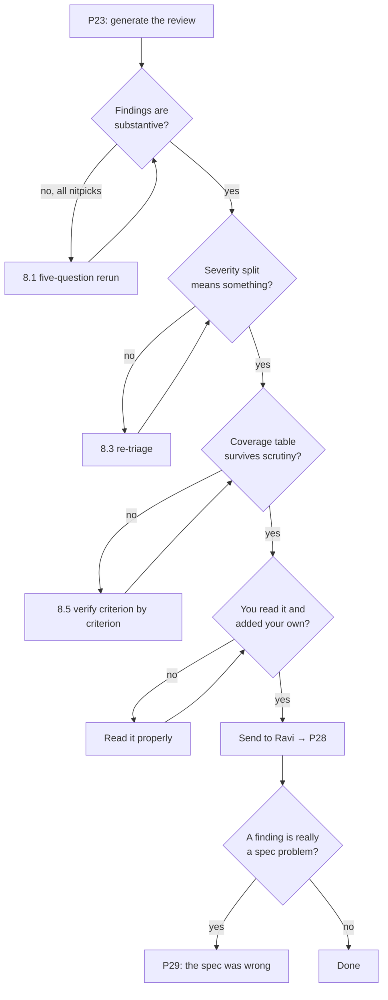

# P23 — Review Someone Else's Code

← [Previous](P22-e2e-test-the-application.md) · [Library index](../README.md) · Next: [P24](P24-find-security-gaps.md)

> **One line:** Review a branch for the things tests cannot catch, and write it down.

| | |
|---|---|
| **Phase** | 5 — Verify |
| **Who runs it** | Team Lead (Gautam ), reviewing Ravi Mullick's work |
| **When** | Sprint 3, day 3. NWD-103 is merged, Pankaj's E2E suite is red on two journeys, and Gautam has the branch open. |
| **Takes in** | The diff for NWD-103, `Case-Study/Python-ETL/artifacts/acceptance-criteria-NWD-103.md`, `artifacts/spec-confidence-gate.md`, `artifacts/definition-of-done.md`, `artifacts/CLAUDE.md`, Pankaj's failing tests from [P22](P22-e2e-test-the-application.md) |
| **Produces** | `Case-Study/Python-ETL/artifacts/code-review-NWD-103.md` |
| **Hands off to** | Backend Engineer (Ravi), who runs [P28](../phase-6-rework/P28-respond-to-code-review-feedback.md) |
| **Time to run** | 20 minutes to generate. An hour with Gautam's own reading on top. The hour is not optional. |

---

## 1. The scene

Wednesday morning. Gautam has the NWD-103 branch open in one window and Pankaj's E2E report in the other. Two journeys red: Preeti's correction path, and the Spanish confirmation.

He's been the team lead on this crew since `AI-Skills`, and in each of the previous books he built the same thing in a slightly better form. In `AI-Skills` it was a review skill — a set of instructions the AI picked up automatically when he said "review this." In `AI-Workflows` it became a workflow, a fixed plan with five review passes running in parallel: correctness, tests, security, readability, spec compliance. In `AI-Agents` it became an agent that could decide for itself which files to open next based on what the first file turned up.

All three still exist in this repo. Gautam uses the agent version daily and it's good. But this morning he's doing something different, and it's worth understanding why.

The confidence gate is the flagship story. It is the piece of code that decides whether a number reaches Northwind's warehouse or reaches Preeti. Hem wrote an ADR about it. Preetinka wrote seven acceptance criteria. If it's subtly wrong, the failure mode is not a crash — it's a quietly wrong number in a reconciliation report, which is exactly the thing Northwind hired Kestrel to stop happening.

So Gautam wants a review that produces a document, not a chat. Something with file and line numbers, a severity per finding, and a clear "must fix before merge" versus "nice to have" split — because that document is what Ravi will work from, and it's what Gautam will point at in three weeks when someone asks why the code looks the way it does.

He also has a specific worry. Roughly two-thirds of the diff was written by AI. It reads beautifully. Consistent naming, docstrings on everything, type hints throughout, no dead code. **The classic review checklist finds nothing in AI-written code, and that is not the same thing as the code being right.**

---

## 2. What this prompt actually does — in plain language

### What code review is actually for

Ask ten engineers what code review is for and you'll get "catching bugs." That's not wrong but it's a small part of it, and if it's your whole model you will run bad reviews.

Here is the honest list, in order of how much value each one carries.

**1. Catching what tests structurally cannot.** A test proves the code does what the test expects. It cannot tell you the test expected the wrong thing. It cannot tell you a case was never considered — the test for the case you forgot doesn't exist, so nothing goes red. Review is where a second brain reads the code and asks "what about a document with no positions at all?"

**2. Catching the wrong abstraction.** The code works, and the shape of it will make the next six changes expensive. A function that takes eleven parameters. A class that exists to hold one dictionary. Logic in a place where nobody will think to look for it. None of this fails a test, ever, and it's the thing you can't fix cheaply in six months.

**3. Catching unclear intent.** Not "add a comment." The deeper version: this code is correct and nobody reading it in April will be able to tell *why* it's correct, so the first person who touches it will break it. If a reviewer has to reconstruct the reasoning, the reasoning isn't in the code.

**4. Spreading knowledge.** After the review, two people understand the confidence gate instead of one. This matters more than most teams admit. When Ravi is on holiday and month-end goes wrong, someone has to be able to open `rules.py`.

**5. Checking it matches what was agreed.** Preetinka wrote seven acceptance criteria. Hem wrote an ADR. Does the code do what those say? Tests check the criteria that got tested. Review checks the ones that didn't.

Notice what's not on the list: style. Whether you use single or double quotes is a formatter's job. If your review is finding style issues, your tooling is broken, and you're spending human attention on something a machine does for free.

### Why AI-written code needs a different review emphasis

This is the part of §2 that matters most, and it's the reason this prompt exists rather than "just use the review agent."

Here's the shape of the problem. When a human writes code under time pressure, the tell-tale signs are visible. Inconsistent naming. A function that grew to 200 lines. A `TODO: handle this properly`. Copy-pasted blocks with one variable changed. No docstring. The classic review checklist was designed against exactly those signals, and it works.

AI-written code has none of them.

It is syntactically clean. It follows the conventions of the surrounding file, because it read the surrounding file. Every function has a docstring, and the docstring is grammatical and accurate about what the function does. Type hints are complete. Names are sensible. Error handling exists. **It looks like the work of a careful senior engineer who was not in a hurry.**

So the classic checklist runs, finds nothing, and the reviewer approves. Meanwhile the real problems are in a different place entirely.

### The four things that actually go wrong in AI-written code

Learn these four. They are the substance of this prompt, and they're why §3 tells the AI to hunt for specific things rather than to "review the code."

#### The invented helper that duplicates something already there

The AI needs a function that normalises a decimal to two places. It writes one. It writes a good one — clean, tested, documented. It is the fourth such function in the repository, because `core/transform.py` already has `to_money()`, `sinks/sql_sink.py` has `_round_currency()`, and there's a third in the reconciliation module.

Why it happens: the AI sees the file it's editing and maybe a handful of related ones. It does not hold the whole repository in mind. When it needs a capability and doesn't find it in what it can see, it builds it. That is the reasonable thing to do with incomplete information, and it produces duplication at a rate humans don't.

Why it matters at Northwind specifically: four rounding functions means four rounding behaviours. `to_money()` uses `ROUND_HALF_EVEN`. The new one uses Python's default `round()`, which is also banker's rounding but behaves differently on floats than on `Decimal`. Now the same market value rounds two ways depending on which path it took, and the reconciliation tolerance of 0.005 quietly absorbs it — until the day it doesn't.

**What to hunt for:** any new function, constant or class. For each one, does something equivalent exist elsewhere in the repo? This is a search question, not a reading question, and it's the single highest-yield thing an AI reviewer can do because it can search fast.

#### The case that got silently dropped

You asked for a function that handles three document types. The AI wrote a function that handles two of them beautifully and, for the third, either falls through to the default or returns `None` without saying so.

This is the hardest one to see, because nothing is wrong on the screen. There's no `raise NotImplementedError`. There's no TODO. There's a clean `if/elif/else` where the `else` happens to swallow a case that should have been handled.

At Northwind, the shape it took was this: the confidence gate handles `currency`, `number`, `date` and `string` field types with thresholds 0.90, 0.90, 0.85 and 0.75. What about a field with no type declared in `sources.yaml`? The code has an `else` branch. The `else` branch uses 0.75. So an undeclared field — which will happen the first time someone adds a counterparty and forgets a line in the YAML — gets the loosest threshold in the system and sails through.

**What to hunt for:** every branch point. For each, what input reaches the final `else`, and is that deliberate? Every `except`. What is being swallowed? Every early `return None`. Who checks it?

#### The test written to pass rather than to check

This one is uncomfortable because it looks like diligence.

Ask the AI to write code and tests together and you often get tests that assert what the code does, not what the requirement says. The mechanism is simple: the code is in the context window, so the expected values in the test come from reading the code rather than from reading the spec. If the code rounds down and it should round up, the test asserts it rounds down. Green. Wrong.

The sharper version, and the one that actually happened on NWD-103: a test that mocks so thoroughly it tests nothing. `test_gate_rejects_low_confidence` mocked `load_thresholds()` to return `{'quantity': 0.90}`, mocked the field parser, and then asserted the gate rejected a 0.71 field. Every real component in that path was replaced. The test proves the mock returns what the mock was told to return.

**What to hunt for:** for each test, what would have to break in production for this test to go red? If the answer is "nothing," it's decoration. Also: does the expected value in the assertion come from the spec, or from running the code?

#### Confident code for something that was guessed

The AI doesn't know your environment. When it doesn't know, it produces something plausible with the same confidence as something it does know. A retry policy with three attempts and exponential backoff — where did 3 come from? A timeout of 30 seconds — based on what? A column named `min_confidence` — is that what the data contract says, or is that a good guess?

There's no signal in the code that says "this bit I knew, this bit I invented." Both look equally deliberate.

**What to hunt for:** every magic number, every default, every name that has to match something external. Trace each one to a source — a spec, a config file, a measurement — or flag it as unverified.

### What "the classic checklist" would have found on NWD-103: nothing

Worth stating plainly, because it's the argument for this whole file.

Gautam ran his standard review agent from `AI-Agents` on the NWD-103 diff first. It returned six findings. Two were about docstring formatting. Two suggested extracting a helper. One flagged a broad `except Exception`. One noted a variable name could be clearer.

All six were true. None of them were the undeclared-field-type bug, the duplicate rounding function, or the test that tested its own mocks. The checklist was looking for a hurried human and the code wasn't written by one.

### Why the prompt is shaped the way it is

The instructions in §3 are ordered deliberately.

- **Context before code.** The spec, the acceptance criteria and the project conventions go in first. A review with no spec can only check the code against itself, which is the exact failure the AI already makes on its own.
- **Named hunt list, not "review this."** "Review this code" gets you the generic checklist. Naming the four failure classes above forces the model to go looking for specific things it would not otherwise look for.
- **Search the repo, don't just read the diff.** The duplicate-helper finding is impossible without searching outside the changed files. The prompt says so explicitly.
- **Severity with a definition.** "Blocker / Major / Minor / Question" with a written meaning for each. Without definitions you get everything labelled Major and the label carries no information.
- **File and line on every finding.** A finding without a location is an opinion. A finding with `core/rules.py:87` is a task.
- **A cap on Minor findings.** Ten, and then it stops. This is the single most useful line in the prompt and §8.1 explains why.
- **Forbidden from praising.** "This is well structured" costs a paragraph and carries nothing. Reviews are for problems; say it in standup if the code was good.
- **A required "what I could not check" section.** The AI cannot run the code, cannot see the production data, cannot know whether the 30-second timeout is right. Making it list its blind spots stops the report reading as more authoritative than it is.

### What the AI is actually doing when this runs

Three distinct activities, with very different reliability.

| Activity | How good | Why |
|---|---|---|
| Searching the repo for duplicates and near-duplicates | Excellent | It's a search problem and the model is fast at it. This is the highest-value thing you get. |
| Comparing the code against a written spec, clause by clause | Very good | Both texts are in front of it. It's a matching exercise. |
| Reasoning about what input reaches which branch | Good | Reliable on straightforward control flow. Gets shakier across three or four files. |
| Judging whether an abstraction is right for this codebase | Weak | Needs taste and knowledge of where the code is going. This is the part Gautam does himself. |
| Knowing whether a magic number is correct | Cannot | It has no way to know. The best it can do is flag that it's unverified — which is why the prompt asks for exactly that. |

**The practical consequence: the report is a very good first pass and a bad final word.** Gautam reads every finding and adds his own. The AI found the duplicate rounding function in eleven seconds — he'd have taken twenty minutes. He found the abstraction problem in `rules.py` that the AI called "well structured."

### The one idea to keep

**A review of AI-written code should spend its time on what is missing, not on what is present.**

Present code you can read. Missing code — the case not handled, the check not made, the test not written, the existing helper not reused — is invisible by definition, and it is where almost all the risk lives. Point the review at the gaps.

---

## 3. The prompt

Run this from the repository root with the branch checked out, so the AI can actually search the codebase. A review that can only see a pasted diff will miss the highest-value finding class entirely.

```text
You are a **senior engineer reviewing a colleague's branch before it ships**. Produce a
written review document, not a conversation.

## What you are reviewing

- **Branch / diff:** [BRANCH OR DIFF COMMAND]
- **Story:** [STORY ID AND ONE-LINE TITLE]
- **Author:** [AUTHOR NAME] — a colleague. Write findings you would be comfortable saying
  to their face.

**Read these first.** Everything you flag must be justified against one of them or against
the code itself:
- Spec: [PATH TO SPEC]
- Acceptance criteria: [PATH TO ACCEPTANCE CRITERIA]
- Project conventions: [PATH TO PROJECT CONTEXT FILE]
- Definition of Done: [PATH TO DOD]
- Failing tests, if any: [PATH OR PASTE OF FAILING TEST OUTPUT]

## How to review

A large share of this diff was written with AI assistance. It will be syntactically clean,
conventionally styled and well documented. **Assume the ordinary checklist will find
nothing and go looking for these four things specifically:**

1. **Duplicated capability.** For every new function, constant, class or helper in the
   diff, **search the whole repository** for something that already does the same job.
   Report near-misses too — two functions that round money differently are worse than one.
   Do not limit yourself to the changed files.

2. **A silently dropped case.** For every branch, `else`, `except` and early return, state
   what input reaches it and whether that is deliberate. Name any input the code will
   accept and quietly mishandle rather than reject.

3. **Tests that do not test.** For each new or changed test, answer: what would have to
   break in production for this to go red? If the answer is "nothing," say so. Flag any
   test whose expected value looks derived from the implementation rather than the spec,
   and any test that mocks the thing it claims to be testing.

4. **Confident guesses.** Every magic number, timeout, retry count, threshold, default and
   externally-matched name. Trace each to a spec, config file or measurement. If you cannot,
   mark it **UNVERIFIED** and say what would confirm it.

**Then check** the diff against the acceptance criteria, one criterion at a time, and say
covered / not covered / partly covered for each.

## Output format

A markdown document with these sections, in this order:

1. **Verdict** — one of `Approve`, `Approve with comments`, `Changes requested`. One
   sentence of justification. Put this first, not last.
2. **Blockers** — must be fixed before this ships.
3. **Major** — should be fixed now; would cost real money or real time later.
4. **Minor** — worth doing, will not hurt anyone if deferred. **Maximum ten. If you have
   more than ten, keep the ten that matter and drop the rest.**
5. **Questions for [AUTHOR NAME]** — things you cannot resolve by reading. Real questions,
   not disguised instructions.
6. **Acceptance criteria coverage** — a table, one row per criterion.
7. **What I could not check** — your blind spots. Anything needing the running system,
   production data, or knowledge you do not have.

Every finding uses this shape:

    ### [SEVERITY] Short title
    `path/to/file.py:LINE`
    **What:** what the code does now.
    **Why it matters:** the concrete consequence, in terms of [DOMAIN CONSEQUENCE].
    **Suggested fix:** specific. Include a code snippet where it is short enough to help.

**Do not:**
- Do not comment on formatting, quote style, line length or import order. A formatter owns
  those.
- Do not praise. No "this is well structured." The document is for problems.
- Do not suggest a rewrite of code that works, unless you name the specific future change
  the current shape makes expensive.
- Do not report the same underlying issue as three separate findings.
- Do not soften a Blocker into a Minor to keep the list short.
- Do not invent a convention. If you flag something as against project style, quote the
  line from the project context file that says so.

**You are done when** every finding has a file and line, every severity is justified by its
definition, the acceptance criteria table has a row per criterion, and the "what I could not
check" section is honest rather than empty.

Save the review as `[OUTPUT PATH]`.
```

---

## 4. Every placeholder, explained

| Placeholder | What to put in it | Northwind example | What happens if you get it wrong |
|---|---|---|---|
| `[BRANCH OR DIFF COMMAND]` | The exact way to see the change. A branch name, or a git command the AI can run. Prefer the command — it gets the real diff, not a summary. | `git diff main...feature/NWD-103-confidence-gate` | Give it a vague "the recent changes" and it reviews whatever files are open, including ones nobody touched. You get findings about code that isn't in the change. |
| `[STORY ID AND ONE-LINE TITLE]` | The story this implements. Anchors the review to a purpose. | `NWD-103 — Gate every extracted field on its confidence score` | The review has no notion of what the code was supposed to do, so criterion coverage becomes guesswork. |
| `[AUTHOR NAME]` | Whose branch it is. Genuinely changes the tone. | `Ravi` | Reviews written for nobody read like a compliance audit. Ravi is more likely to act on findings addressed to him. |
| `[PATH TO SPEC]` | The design document the code implements. | `Case-Study/Python-ETL/artifacts/spec-confidence-gate.md` | Without it, the review can only check the code against itself. It will find style issues and miss the fact that the spec says 0.92 for `broker_alpha` currency and the code says 0.90. |
| `[PATH TO ACCEPTANCE CRITERIA]` | What "done" means for this story. | `Case-Study/Python-ETL/artifacts/acceptance-criteria-NWD-103.md` | The coverage table is fabricated from the code's own structure. It will look complete and mean nothing. |
| `[PATH TO PROJECT CONTEXT FILE]` | The repo conventions file from [P01](../phase-0-foundation/P01-generate-the-project-context-file.md). | `Case-Study/Python-ETL/artifacts/CLAUDE.md` | The review invents conventions. You get told to use a logging pattern the team deliberately rejected in Sprint 0. |
| `[PATH TO DOD]` | The Definition of Done from [P17](../phase-3-planning/P17-definition-of-done.md). | `Case-Study/Python-ETL/artifacts/definition-of-done.md` | The review checks the code but not whether the story is actually shippable — no logging, no runbook entry, no migration. |
| `[PATH OR PASTE OF FAILING TEST OUTPUT]` | Pankaj's red tests. Optional, and it sharpens the review a lot when present. | The two failing journeys from [P22](P22-e2e-test-the-application.md) | You lose the review's best lead. A reviewer who knows *which* journey fails looks in the right file first. |
| `[DOMAIN CONSEQUENCE]` | How to phrase "why it matters" so it lands with your team. | "a wrong number reaching Northwind's reconciliation, or a document held that should have loaded" | Consequences come out as "this could cause a bug," which is true of everything and therefore useless for prioritising. |
| `[OUTPUT PATH]` | Where the document goes. It must be a file, not chat. | `Case-Study/Python-ETL/artifacts/code-review-NWD-103.md` | The review lives in a chat window, Ravi can't reference it in his PR, and in three weeks nobody can find why the code looks like it does. |

---

## 5. The filled-in example

Gautam, Wednesday of Sprint 3, with `feature/NWD-103-confidence-gate` checked out and Pankaj's report open.

```text
You are a **senior engineer reviewing a colleague's branch before it ships**. Produce a
written review document, not a conversation.

## What you are reviewing

- **Branch / diff:** git diff main...feature/NWD-103-confidence-gate
- **Story:** NWD-103 — Gate every extracted field on its confidence score
- **Author:** Ravi — a colleague. Write findings you would be comfortable saying to their
  face.

**Read these first.** Everything you flag must be justified against one of them or against
the code itself:
- Spec: Case-Study/Python-ETL/artifacts/spec-confidence-gate.md
- Acceptance criteria: Case-Study/Python-ETL/artifacts/acceptance-criteria-NWD-103.md
- Project conventions: Case-Study/Python-ETL/artifacts/CLAUDE.md
- Definition of Done: Case-Study/Python-ETL/artifacts/definition-of-done.md
- Failing tests: two E2E journeys are red — "Preeti corrects the flagged field and the whole
  document loads to silver" and "a Spanish Broker Beta confirmation loads with the security
  identifier unchanged". Output in tests/e2e/report/index.html.

## How to review

A large share of this diff was written with AI assistance. It will be syntactically clean,
conventionally styled and well documented. **Assume the ordinary checklist will find nothing
and go looking for these four things specifically:**

1. **Duplicated capability.** For every new function, constant, class or helper in the diff,
   **search the whole repository** for something that already does the same job. Report
   near-misses too — two functions that round money differently are worse than one. Do not
   limit yourself to the changed files.

2. **A silently dropped case.** For every branch, `else`, `except` and early return, state
   what input reaches it and whether that is deliberate. Name any input the code will accept
   and quietly mishandle rather than reject.

3. **Tests that do not test.** For each new or changed test, answer: what would have to break
   in production for this to go red? If the answer is "nothing," say so. Flag any test whose
   expected value looks derived from the implementation rather than the spec, and any test
   that mocks the thing it claims to be testing.

4. **Confident guesses.** Every magic number, timeout, retry count, threshold, default and
   externally-matched name. Trace each to a spec, config file or measurement. If you cannot,
   mark it **UNVERIFIED** and say what would confirm it.

**Then check** the diff against the acceptance criteria, one criterion at a time, and say
covered / not covered / partly covered for each.

## Output format

[...sections 1-7 exactly as in §3...]

Every finding uses this shape:

    ### [SEVERITY] Short title
    `path/to/file.py:LINE`
    **What:** what the code does now.
    **Why it matters:** the concrete consequence, in terms of a wrong number reaching
    Northwind's reconciliation, or a document held that should have loaded.
    **Suggested fix:** specific. Include a code snippet where it is short enough to help.

**Do not:**
[...as in §3...]

**You are done when** every finding has a file and line, every severity is justified by its
definition, the acceptance criteria table has a row per criterion, and the "what I could not
check" section is honest rather than empty.

Save the review as Case-Study/Python-ETL/artifacts/code-review-NWD-103.md.
```

---

## 6. What comes back

Abridged — the real file is longer — but this is the substance.

```markdown
# Code review — NWD-103: Gate every extracted field on its confidence score

**Branch:** `feature/NWD-103-confidence-gate`
**Author:** Ravi
**Reviewer:** Gautam (AI-assisted first pass)
**Date:** 2026-03-11
**Files changed:** 7 (+412 / −38)

---

## 1. Verdict

**Changes requested.** Two blockers: an undeclared field type silently receives the loosest
threshold in the system, and the per-broker threshold override from the spec is not applied
anywhere in the code path.

---

## 2. Blockers

### [BLOCKER] Undeclared field types fall through to the loosest threshold
`core/confidence.py:41`

**What:** `threshold_for()` maps `currency`→0.90, `number`→0.90, `date`→0.85, and everything
else to `DEFAULT_THRESHOLD = 0.75`.

```python
def threshold_for(field_type: str, overrides: dict[str, float]) -> float:
    if field_type in overrides:
        return overrides[field_type]
    return TYPE_THRESHOLDS.get(field_type, DEFAULT_THRESHOLD)   # ← line 41
```

**Why it matters:** the field type comes from `config/sources.yaml`, which a human edits every
time a counterparty is added. Invariant 8 in the project context says adding a counterparty is
a YAML change — so a typo (`currncy`, or an omitted `type:`) is not a hypothetical, it is the
expected human error for this file. The result is a currency field gated at 0.75 instead of
0.90, silently, with no error. A 0.78-confidence market value reaches Snowflake and shows up in
reconciliation as a real break that nobody can explain.

This inverts the system's core invariant: a wrong number is worse than no number. The current
default is the most permissive value available.

**Suggested fix:** unknown types must fail closed, not open.

```python
def threshold_for(field_type: str, overrides: dict[str, float]) -> float:
    if field_type in overrides:
        return overrides[field_type]
    if field_type not in TYPE_THRESHOLDS:
        raise UnknownFieldTypeError(
            f"Field type {field_type!r} is not declared in TYPE_THRESHOLDS. "
            f"Add it to sources.yaml or to the type table — do not default."
        )
    return TYPE_THRESHOLDS[field_type]
```

A raised error sends the document to the exception queue with a clear reason, which is the
correct behaviour. `DEFAULT_THRESHOLD` should then be deleted, not left unused.

---

### [BLOCKER] The per-broker threshold override is never loaded
`core/rules.py:118`, `config/sources.yaml:22`

**What:** `sources.yaml` declares, for `broker_alpha`:

```yaml
broker_alpha:
  model: broker-alpha-position-v3
  threshold_overrides:
    currency: 0.92        # poor scan quality — spec §4.2
```

`rules.py:118` calls `threshold_for(field.type, overrides={})`. The `threshold_overrides` key is
read nowhere in the repository — I searched for `threshold_overrides` and it appears only in
the YAML and in one test fixture.

**Why it matters:** Broker Alpha's scan quality is the specific reason the override exists.
Spec §4.2 sets it at 0.92 because their OCR misreads decimals. Running them at 0.90 means the
band between 0.90 and 0.92 — exactly the band the spec identified as unreliable — flows
straight through to the warehouse.

This is also AC-7, which Pankaj's E2E traceability table marks `UNCOVERED`. Nothing in the test
suite is watching it, which is why it merged.

**Suggested fix:** load the override at the call site, from the already-loaded source config:

```python
# core/rules.py:118
source_cfg = load_source_config(document.counterparty)
threshold = threshold_for(
    field.type,
    overrides=source_cfg.get("threshold_overrides", {}),
)
```

Add a unit test asserting that a `broker_alpha` currency field at 0.91 is rejected and the same
field for `broker_beta_em` at 0.91 is accepted. That test is 8 lines and it is the whole
feature.

---

## 3. Major

### [MAJOR] Fourth implementation of decimal rounding in the repository
`core/confidence.py:88`

**What:** the diff adds `_round_conf(value: float) -> float` using Python's builtin `round()`.

Existing equivalents:
- `core/transform.py:34` — `to_money(value: Decimal) -> Decimal`, `ROUND_HALF_EVEN`
- `sinks/sql_sink.py:76` — `_round_currency()`, `ROUND_HALF_UP`
- `recon/reconcile.py:52` — inline `round(x, 4)` on quantities

**Why it matters:** `round()` on a float and `Decimal.quantize(ROUND_HALF_EVEN)` disagree on
values that are not exactly representable in binary. `round(2.675, 2)` returns `2.67` in Python;
the `Decimal` path returns `2.68`. Market values are compared in reconciliation with a 0.005
tolerance, which absorbs this — until a value sits on the boundary, and then a phantom break
appears that nobody can reproduce, because it depends on which code path wrote the row.

Four rounding behaviours in one pipeline is a latent reconciliation bug, and it is exactly the
class of thing that takes a week to find.

**Suggested fix:** delete `_round_conf`. Move `to_money` to `core/numeric.py`, add
`to_confidence(value) -> Decimal` beside it, and have all four call sites use them. Separate
commit — this touches files outside NWD-103.

---

### [MAJOR] `test_gate_rejects_low_confidence` mocks everything it claims to test
`tests/test_confidence.py:61`

**What:**

```python
def test_gate_rejects_low_confidence(monkeypatch):
    monkeypatch.setattr(confidence, "threshold_for", lambda *_: 0.90)
    monkeypatch.setattr(confidence, "load_thresholds", lambda: {"quantity": 0.90})
    field = SimpleNamespace(type="quantity", confidence=0.71)
    assert confidence.passes_gate(field, 0.90) is False
```

**Why it matters:** `threshold_for` and `load_thresholds` are both patched out, and the
threshold is then passed in by hand as a literal. What remains under test is the single
comparison `0.71 < 0.90`. If `threshold_for` returned 0.10 for every field in production, this
test would still pass.

This is the test that should have caught blocker 1 above, and it is why it did not.

**Suggested fix:** patch nothing. Use the real config loader against a fixture YAML:

```python
def test_gate_rejects_currency_below_broker_threshold(tmp_path):
    cfg = write_fixture_sources(tmp_path, {
        "broker_alpha": {"threshold_overrides": {"currency": 0.92}},
    })
    field = ExtractedField(name="market_value", type="currency", confidence=0.91)
    assert passes_gate(field, counterparty="broker_alpha", config=cfg) is False
    assert passes_gate(field, counterparty="broker_beta_em", config=cfg) is True
```

---

### [MAJOR] A whole document can be held with no reason recorded
`core/rules.py:203`

**What:** when any field fails, the document is queued for review and `rejection_reason` is set
from the first failing field. If the failure came from a raised exception rather than a gate
comparison, `rejection_reason` stays `None`.

**Why it matters:** Preeti opens the exception queue and sees a document with no explanation.
AC-4 requires the reason to name the field and the threshold. The E2E test covering AC-4 passes,
because it uses the gate-comparison path, not the exception path.

**Suggested fix:** make `rejection_reason` a required constructor argument on the queue item so
it cannot be omitted, rather than a field assigned afterwards.

---

## 4. Minor

1. `core/confidence.py:12` — `DEFAULT_THRESHOLD` becomes dead once blocker 1 is fixed. Delete it.
2. `core/rules.py:88` — `except Exception` around the extraction call catches `KeyboardInterrupt`
   subclasses in some Python versions. Narrow to the client's exception types.
3. `core/rules.py:145` — `retry(attempts=3, backoff=2)`. **UNVERIFIED.** No spec, no measurement.
   NWD-141 says a 429 at month-end currently kills the run; three attempts with a 2s base gives
   up after ~6 seconds, which is short for a throttled cognitive service.
4. `sinks/sql_sink.py:41` — `min_confidence` is written as `FLOAT`. The data contract says
   `DECIMAL(5,4)`. Float will lose the fourth decimal.
5. `core/confidence.py:55` — docstring says "returns True if the field passes"; the function
   returns a `GateResult`, not a bool. Docstring is from an earlier version.
6. `tests/test_rules.py:120` — expected value `0.7500000001` looks derived from running the code.
   The spec says 0.75.
7. `core/rules.py:230` — log line includes the full extracted field value. If that field is a
   name or an account number, this writes PII to Application Insights. See NWD-105 / redaction.
8. `config/sources.yaml:31` — `broker_beta_em` has no `threshold_overrides` key at all. Works
   today because of `.get(..., {})`, but it is inconsistent with `broker_alpha`. Add an empty map.

*(Stopped at 8. Nothing else worth your time.)*

---

## 5. Questions for Ravi

1. `rules.py:118` passes `overrides={}` — was the override wiring deliberately deferred, or
   missed? If deferred, there is no TODO or issue reference, so I could not tell.
2. Was `DEFAULT_THRESHOLD = 0.75` chosen, or is it 0.75 because that happens to be the `string`
   threshold? The spec does not mention a default at all.
3. The two red E2E journeys: is the Spanish identifier failure (NWD-138) in scope for this
   branch, or a separate story? The translation call in `core/translate.py:44` is inside this
   diff, so I could not tell where the boundary is.

---

## 6. Acceptance criteria coverage

| AC | Statement | Status | Note |
|---|---|---|---|
| AC-1 | Every extracted field is compared to its type threshold | Covered | `rules.py:110-130` |
| AC-2 | A field below threshold sends the whole document to review | Covered | `rules.py:190-210` |
| AC-3 | No partial rows are written when a document is held | Covered | Transaction boundary at `sql_sink.py:98` is correct |
| AC-4 | The rejection reason names the field and the threshold | **Partly** | Gate path yes; exception path leaves it `None`. See Major 3. |
| AC-5 | A corrected document loads in full and is marked CORRECTED | **Partly** | `review_status` set, `reviewed_by` never written. Pankaj's E2E asserts it — this is one of her two red journeys. |
| AC-6 | `min_confidence` and `bronze_path` reach the warehouse | Covered at silver | Type is wrong — see Minor 4. Snowflake MERGE not in this diff. |
| AC-7 | Per-broker threshold override is applied | **Not covered** | See Blocker 2. |

---

## 7. What I could not check

- **Whether 0.92 is the right number for Broker Alpha.** I can see the spec says so; I cannot
  see their scan quality. If that figure came from a sample of ten documents it may not hold.
- **Whether the retry policy is adequate.** Needs a measurement against the real Document
  Intelligence throttling behaviour at month-end volume. I have no data.
- **Whether the transaction boundary actually holds under concurrency.** The code looks correct;
  proving it needs two functions writing the same document simultaneously, which I cannot run.
- **Performance.** The gate now loads source config per field rather than per document. At 200
  documents × ~40 fields that is 8,000 config lookups a day. Probably fine; unmeasured.
- **Anything in `function_app.py`.** It is unchanged in this diff, but blocker 2's fix will
  likely need a change there, and I have not reviewed it.
```

### How to read this

**Start at the verdict and the blockers, and notice they are not code-quality findings.** Both blockers are missing behaviour — a case that falls through, and a config key that is read nowhere. Neither would be caught by a linter, a formatter, a type checker, or any test that currently exists. This is the "review what's missing" idea in concrete form.

**Look at Major 2, the mocked test.** It's the most uncomfortable finding in the document because the test exists, it's well written, and it's green. The review's question — "what would have to break in production for this to go red?" — is the thing that exposes it. Gautam now has a rule from this: any test that patches more than one thing gets read twice.

**Section 7 is what makes the document trustworthy.** A review that claims complete coverage is lying, and everyone reading it knows it's lying, so they discount the whole thing. Listing the blind spots explicitly means the findings that *are* there get taken at face value.

**The part that is commonly wrong:** the Minor list. There are eight items and at least three of them (5, 6, 8) are the sort of thing a formatter or a stricter type check should have caught, which means they're really a tooling gap, not a review finding. Gautam's actual response was to add a docstring check and a stricter `mypy` setting rather than to send items 5, 6 and 8 to Ravi. Findings that repeat across reviews are configuration problems wearing a review's clothes.

---

## 7. Why this is the final prompt

### What "done" means here

Done is: **a document exists at the artifact path, every finding has a file and a line, the severity split is honest, and you have read all of it yourself and added or removed findings.**

The last clause is the one people skip and it is not optional. The AI produced a first pass. A review nobody read is not a review; it's a file.

### The checklist

- [ ] Verdict is at the top and is one of the three allowed values.
- [ ] Every finding carries `path:line`. No finding says "in the confidence module."
- [ ] Every Blocker names a concrete consequence in Northwind terms, not "this could cause issues."
- [ ] The acceptance criteria table has one row per criterion, including the ones that are fine.
- [ ] "What I could not check" is not empty.
- [ ] You have read the whole thing and either agreed with each finding or struck it out.
- [ ] You have added at least one finding of your own — if you added none, you probably skimmed.
- [ ] Minor list is capped and the capped-off items were genuinely dropped, not renamed Major.

### Why you should stop rather than keep prompting

The over-prompting failure mode here is very specific: **you keep asking for more findings and you get longer prose about smaller things.**

Ask "anything else?" and the model will find something, because it can always find something. The fifteenth finding is a variable name. The twentieth is a suggestion to extract a two-line function. The document grows, the signal-to-noise ratio collapses, and Ravi — who has to act on this — starts skimming. A 40-finding review gets the same amount of attention as a 6-finding review, spread thinner.

The second trap is asking the AI to justify a finding you disagree with. It will comply, at length, and it will sound convincing, because producing plausible justification is exactly what it's good at. If you think a finding is wrong, strike it. Don't debate it.

The third: don't ask it to re-review after Ravi fixes things until Ravi has actually fixed things. Reviewing a review is a loop with no exit.

### The signal that you are NOT done

**You read the review and cannot point at a single thing you would not have found yourself in an hour.** That means it ran the generic checklist. Go to §8.

---

## 8. When it is not done — the follow-up prompts

| What you're seeing | What's actually wrong | Run this next |
|---|---|---|
| Twenty findings, all naming, formatting, docstrings | It ran the generic checklist. It never searched the repo or reasoned about missing cases. | **8.1** below |
| It approved code you know has a bug | It reviewed the code against itself. It had no spec, or the bug is in an interaction it can't see from the diff. | **8.2** below |
| Every finding is "Major" | No severity definitions took hold. Severity carries no information. | **8.3** below |
| Findings are true but you can't act on them | No file:line, or the fix is described rather than shown. | **8.4** below |
| The coverage table says everything is covered | It generated the table from the code, not the criteria. Classic. | **8.5** below |
| Findings are right and the author disagrees | Not a prompting problem. A conversation problem. | Talk to Ravi. Then **[P28](../phase-6-rework/P28-respond-to-code-review-feedback.md)** |
| A blocker turns out to be a spec problem, not a code problem | The code matches a spec that is wrong. | **[P29](../phase-6-rework/P29-the-spec-was-wrong.md)** |

### 8.1 "The review is all nitpicks and no substance"

The most common failure by a distance. Use it when the findings are true, trivial, and could have been produced without reading the story.

```text
That review is all surface. Every finding is naming, formatting or documentation — things a
formatter and a linter already own. Redo it, and this time **do not report a single finding
about style.**

Answer these five questions instead, each with a file and line, and treat the answers as the
review:

1. **What does this code do that the spec does not ask for?** Extra behaviour is where
   unreviewed risk lives.
2. **What does the spec ask for that this code does not do?** Go clause by clause through
   [PATH TO SPEC]. Do not skip clauses you think are obviously handled.
3. **What input reaches an `else`, an `except` or an early return and is quietly mishandled
   rather than rejected?** For each one, name the input concretely.
4. **What in this diff already exists elsewhere in the repository?** Search the whole repo,
   not the changed files. Include near-misses — two functions doing the same job slightly
   differently are worse than one.
5. **Which new tests would still pass if the code they test were deleted and replaced with
   `return True`?**

If a question genuinely has no findings, say "none found" and say what you checked to be
sure. Do not fill the space with something smaller.
```

What changes: the shape of the output. Question 4 alone typically produces the highest-value finding in the whole review, and no amount of "review this code" ever gets there.

### 8.2 "It approved code I know is wrong"

Use this when you have a specific defect in mind — often because a test is failing — and the review didn't mention it.

```text
The review approved this branch. I know there is a defect in it. Here is what I know:

[SYMPTOM — the failing test, the wrong output, or the behaviour you observed]

**Do not** start from the code. **Start from the symptom** and work backwards:

1. List every code path that could produce that symptom. All of them, including ones you
   think are unlikely.
2. For each path, say what would have to be true for it to be the cause.
3. For each, say what in the diff you can check to confirm or eliminate it — and check it.
4. Report which paths survive.

Then answer this directly: **why did the first review miss it?** One of:
- the defect is in an interaction between files, not in any single file;
- the defect is a missing case, and nothing on screen was wrong;
- the review had no spec to compare against so it checked the code against itself;
- the review checked it and got it wrong — say which finding and how.

I want that answer even if it is unflattering. It tells me what to change in how I ask.
```

What changes: you get a diagnosis of the review process as well as the bug. Gautam ran this after the review missed a transaction-scope problem in `sql_sink.py`, and the answer — "the defect is in an interaction between the sink and the rules engine; I reviewed each file's correctness in isolation" — is why the prompt in §3 now explicitly says to search outside the changed files.

### 8.3 "Everything is Major"

Use this when severity has stopped meaning anything.

```text
Every finding in that review is Major. Re-triage with these definitions and move each finding
to exactly one level:

- **Blocker** — if this ships, a wrong number can reach Northwind's warehouse, or a document
  that should have loaded is held, or an audit trail is lost. Data-correctness or
  data-loss consequence, concretely stated.
- **Major** — no data consequence, but it will cost real time or money later: duplicated
  logic that will diverge, a test that does not test, a missing case that will surface at
  month-end.
- **Minor** — worth doing, harms nobody if it waits a sprint.
- **Question** — you cannot tell without asking the author.

**Rules:** at most three Blockers. If you have four, one of them is a Major. For every
Blocker, write the sentence "If this ships, then ___" and make it specific to Northwind — if
you cannot finish that sentence concretely, it is not a Blocker.
```

What changes: the list gets a shape. The "at most three Blockers" cap forces a real ranking; artificial constraints are how you get judgement out of a model that would otherwise hedge.

### 8.4 "The findings are right but I can't act on them"

Use this when the review is correct and vague.

```text
These findings are correct but not actionable:
[PASTE THE FINDINGS]

Rewrite each one as a task the author can start immediately:
- The exact `path/to/file.py:LINE`.
- The current code, quoted.
- The replacement code, written out — not described. If the fix is more than about fifteen
  lines, describe the shape and write out the two or three lines that matter most.
- The test that proves the fix, written out.
- Anything else in the repo that must change at the same time.

**Do not** write "consider refactoring" or "this could be improved." If you do not know the
fix, say so and say what information would settle it.
```

What changes: findings turn into commits. It also surfaces the findings that were vague because the model didn't actually know the fix — those come back as honest "I don't know," which is far more useful than a confident non-answer.

### 8.5 "The coverage table says everything is covered"

Use this when the acceptance criteria table is suspiciously green.

```text
The acceptance criteria coverage table says every criterion is covered. Verify that, one
criterion at a time, and be adversarial about it.

For each criterion:
1. Quote the criterion exactly as written in [PATH TO ACCEPTANCE CRITERIA].
2. Quote the specific lines of code that implement it, with file and line.
3. Quote the specific test that would fail if that code were removed, with file and line.
4. Only if all three exist, mark it Covered.

If step 2 or step 3 has nothing to quote, mark it **Not covered** — not "partly," not
"implicitly covered," not "covered by the E2E suite" unless you can name the test.

I would rather have four honest "not covered" rows than seven green ones.
```

What changes: on NWD-103 this turned two "Covered" rows into "Partly," and one into "Not covered" — AC-7, the per-broker override, which is Blocker 2. The table was green because the model matched criterion text to plausible-looking code without checking a test existed.

### The loop



---

## 9. How this goes wrong

### You send the AI's output straight to the author

The document is well written, the findings are numbered, the severities look considered. It is very tempting to paste it into the PR and move on.

Don't. Two reasons, and the second is the important one.

First, some findings will be wrong. Not many, but some, and a wrong finding costs the author an hour proving it's wrong and costs you credibility you'll want later.

Second — and this is the real cost — **the review is also a conversation, and you just opted out of it.** Ravi is going to read this and think about how he writes code next time. If the document is entirely the AI's, you've delegated the one part of a lead's job that isn't delegable. Gautam's rule: he strikes at least one finding and adds at least one of his own before sending. If he can't do either, he didn't read it.

### No spec, so the review checks the code against itself

Give the AI a diff and nothing else and it will produce a review. It will be about internal consistency: does this function match its docstring, is this variable used, is this error handled.

What it cannot do is tell you the code implements the wrong thing, because it has no idea what the right thing was. Blocker 2 in §6 — the missing per-broker override — is invisible without `spec-confidence-gate.md`. The code is perfectly coherent. It's just not what was agreed.

The fix is in the prompt: spec, acceptance criteria, project context, DoD. If those documents don't exist, that's your finding, and it's a bigger one than anything in the code.

### The review becomes a linting service

Six sprints in, every review comes back with the same eight findings: docstring drift, `except Exception`, a magic number, an inconsistent import. Every time. Nobody's learning anything and the reviews take an hour.

That's a tooling gap, not a review finding. Every finding that repeats across three reviews should become a lint rule, a `mypy` setting, or a hook from [P04](../phase-0-foundation/P04-hooks-as-guardrails.md). Review is expensive human-shaped attention; spending it on something a machine catches for free is a waste twice over — once for the cost, once because the real findings get buried.

Gautam's version of this rule: **if the review found it twice, automate it. If it found it three times and you didn't automate it, that's on you, not the author.**

### You review the diff and miss the interaction

The diff touches `confidence.py`, `rules.py` and `sql_sink.py`. Each file is correct. The bug is that `rules.py` opens a transaction and `sql_sink.py` opens another one inside it, and on a rollback only the inner one unwinds.

Reviewing files is easy. Reviewing the seams between them is hard, and it's where the expensive bugs live — partial writes, double transactions, retries that aren't idempotent, two components that both think they own an error.

The fix is to review the *path*, not the files. Pick one document and trace it: blob arrival → classify → extract → gate → transform → sink. Read the code in that order rather than in diff order. It's slower and it finds a different class of problem. Gautam does this once per story, on the flagship one, and skips it on the small ones.

### This is the wrong tool entirely: the code is fine and the design is wrong

Here's the failure mode where you should put this prompt down.

Symptom: the review keeps producing findings that are all variations of "this is awkward." The abstraction fights you. Every fix suggestion is a workaround. You've been through two rounds and it still doesn't feel right.

That's not a review problem. The code is a faithful implementation of a design that doesn't fit, and no amount of review will fix a design from below. What you need is [P29](../phase-6-rework/P29-the-spec-was-wrong.md) — go back to the spec, decide what it should have said, and change it deliberately with Hem in the room.

This happened on NWD-142. The page-boundary bug was not a code defect in any meaningful sense; the spec had no rule for a table that continues across pages, so there was nothing for the code to be wrong about. Reviewing `extract.py` harder would never have produced the fix. The fix was a new clause in the spec and a new class of test.

---

## 10. The handoff

The review goes to Ravi, and it goes as a file in the repository, not as a comment thread. That matters more than it sounds. A PR comment disappears when the branch merges; `artifacts/code-review-NWD-103.md` is still there in June when someone asks why `threshold_for` raises instead of defaulting, and the answer is in Blocker 1 with the reasoning attached.

Ravi runs [P28](../phase-6-rework/P28-respond-to-code-review-feedback.md) against it. That prompt takes the review as input and produces a response per finding — fixed, disagreed with and why, or deferred with a ticket. Not every finding gets fixed, and the review is not a list of orders. Ravi pushed back on Major 1, the rounding consolidation, on the grounds that it touches four files outside NWD-103 and belongs in its own change. Gautam agreed, and it became a tech-debt item for [P36](../phase-8-improve/P36-tech-debt-triage.md).

Two of the review's questions go to Hem rather than Ravi. Question 2 — was `DEFAULT_THRESHOLD = 0.75` chosen or accidental — is a spec question, and the spec has nothing to say about a default at all. That gap is real and it becomes an amendment to `spec-confidence-gate.md` via [P29](../phase-6-rework/P29-the-spec-was-wrong.md).

Meanwhile Pankaj carries on. The review answered why one of her two red journeys is red; the other, NWD-138, is a different story. She moves to [P24](P24-find-security-gaps.md), which is the same review instinct pointed at a different threat model — and with Hem joining her, because half the findings there are architecture decisions, not code.

> **Artifact contract — `Case-Study/Python-ETL/artifacts/code-review-NWD-103.md`**
>
> Anyone reading this file can rely on finding:
> - A verdict in the first ten lines, from a fixed set of three values.
> - Every finding located at `path/to/file.py:LINE` — never "somewhere in the rules engine."
> - Every Blocker stating a concrete Northwind consequence, in the form "if this ships, then ___".
> - A suggested fix per finding, with code where code is short enough to help.
> - A coverage table with one row per acceptance criterion, including the ones that pass.
> - A "what I could not check" section that is not empty.
> - The reviewer's own name on it, because a human read it and changed it.
>
> If any of those is missing, the artifact is not done — go back to §7.

---

## 11. In the case study

This is Sprint 3, day 3, in [`07-sprint-3-verify.md`](../../Case-Study/Python-ETL/07-sprint-3-verify.md). The artifact is [`code-review-NWD-103.md`](../../Case-Study/Python-ETL/artifacts/code-review-NWD-103.md).

The moment worth remembering: Gautam ran his existing review agent first — the one he'd built in `AI-Agents` and used every day for months — and it returned six findings, all of them style. He nearly approved the branch on that basis. What stopped him was Pankaj's failing test on the correction path, which was pointing at code the review had called clean.

So he ran it again with the four-question hunt list, and it came back with Blocker 2 in about forty seconds: `threshold_overrides` appears in `sources.yaml` and in one test fixture and nowhere else in the repository. Broker Alpha's 0.92 threshold — the whole reason that override exists, because their scans are bad — had never been wired up. The code had been in `main` for four days.

The uncomfortable part is the arithmetic. Broker Alpha is roughly 40% of Northwind's daily document volume. Four days of running their currency fields at 0.90 instead of 0.92 means the 0.90–0.92 band flowed straight through — the exact band Hem identified in the ADR as the one you cannot trust from that counterparty. Nothing had broken visibly. It would have shown up eventually as reconciliation breaks nobody could explain, which is precisely the outcome Kestrel was hired to eliminate.

Gautam's line in the retrospective ([`10-retrospective.md`](../../Case-Study/Python-ETL/10-retrospective.md)) was blunt: *"My review agent was calibrated for code a tired human wrote. Nobody on this team is writing that code any more."*

---

← [Previous](P22-e2e-test-the-application.md) · [Library index](../README.md) · Next: [P24](P24-find-security-gaps.md)
