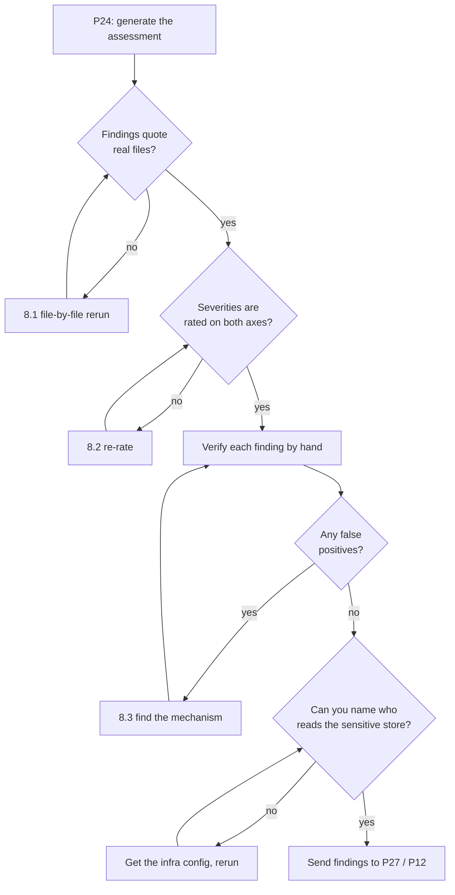

# P24 — Find Security Gaps

← [Previous](P23-review-someone-elses-code.md) · [Library index](../README.md) · Next: [P25](P25-data-quality-validation.md)

> **One line:** Attack your own system on paper before someone does it for real.

| | |
|---|---|
| **Phase** | 5 — Verify |
| **Who runs it** | QA Engineer (Pankaj ) and Architect (Hem Singh), together |
| **When** | Sprint 3, day 4. The pipeline works end to end. Release readiness is two weeks out and Northwind's information security team wants a document. |
| **Takes in** | The whole `code/doc_ingestion/` tree, `artifacts/adr/0002-managed-identity.md`, `artifacts/data-contract-counterparty-position.md`, the Bicep/Terraform for the Azure resources, `requirements.txt` |
| **Produces** | `Case-Study/Python-ETL/artifacts/security-review-doc-ingestion.md` |
| **Hands off to** | Backend Engineer (Ravi) for the fixes, Architect (Hem) for anything that changes the design, and [P32](../phase-7-release/P32-release-readiness-check.md) at release |
| **Time to run** | 45 minutes to generate. A full day with Hem and Pankaj verifying each finding by hand. |

---

## 1. The scene

Thursday. Pankaj has spent three days finding functional defects — five of them, filed as NWD-138 through NWD-142. Gautam's review yesterday found two blockers in the confidence gate. The system works, mostly.

Then Atul forwards an email. Northwind's information security team has heard that a consultancy is building something that touches counterparty statements, and they have questions. Specifically: *"Please provide a security assessment covering credential management, data classification and third-party dependencies prior to any production deployment."*

Hem reads it and says the thing she always says. "What does this look like when it's wrong?"

She has a specific reason for asking here. The documents flowing through this pipeline contain account numbers, sometimes client names, sometimes both, on a statement from a prime broker. The pipeline persists the raw API response to `bronze/` before anything is parsed — deliberately, so a parsing bug next month can be reprocessed for free instead of re-paying Azure per page. That's a good design decision and it also means **there is a container full of unredacted broker statements sitting in Northwind's storage account, and its access rules had better be right.**

Pankaj's instinct is different from Hem's and that's why they run this together. Hem thinks about the architecture: who can reach what, what the trust boundaries are, what happens when a component is compromised. Pankaj thinks like an attacker with a browser: what happens if I change the ID in this URL, what happens if I upload something that isn't a PDF, what does the error message tell me that it shouldn't.

Both perspectives produce different findings. The prompt below is written to get both, because a security review that only does one of them misses half of what matters.

Nothing here is a penetration test. Nobody is running exploits against Northwind's Azure tenant. This is a **paper review with code access** — reading the system the way an attacker would read it, and writing down what you find, ranked so somebody can actually act on it.

---

## 2. What this prompt actually does — in plain language

### The problem: security bugs don't look like bugs

A functional bug announces itself. Something crashes, a number is wrong, a page doesn't load. Pankaj finds those by using the system.

A security bug is usually the system working exactly as written. The exception queue loads a document when you ask for a document ID — that's the feature. The fact that it will load *anyone's* document when you ask for *any* document ID is the bug, and no test fails, no log line appears, and nothing looks wrong until someone tries it.

So you can't find these by testing. You find them by asking, deliberately and systematically, a different set of questions: who can reach this, what are they trusted with, and what happens if that trust is misplaced.

That's what a **threat model** is, and it doesn't need to be more complicated than that phrase. A threat model is a written answer to: what are we protecting, who might want it, how could they get it, and what have we done about it.

### The six attack classes that matter for Northwind — each one explained first

The prompt in §3 names six focus areas. Here is each one in plain language, before any of it appears in a prompt. If you already know these, skim. If you don't, this is the section that means you won't need a search engine.

#### 1. Secrets in code and in git history

A **secret** is anything that grants access: a password, an API key, a connection string with a password in it, a private key, a token. The classic failure is that someone pastes one into a config file to get something working on a Friday, commits it, and it's in the repository forever.

"Forever" is the part people miss. **Deleting a secret from a file does not remove it from git history.** Git keeps every version of every file. If `settings.py` had a connection string in commit `a3f21c` and you deleted it in commit `b8e440`, anyone who clones the repository can read commit `a3f21c`. The only real fixes are to rewrite history — messy, disruptive, and it doesn't help if the repo was ever pushed anywhere — or to rotate the secret, meaning change it at the source so the leaked one stops working.

For Northwind this should be a short section, because ADR-0002 says there are no API keys anywhere. Authentication is by **managed identity**: Azure gives the Function App its own identity, you grant that identity roles on the resources it needs, and the code asks Azure for a token at runtime with `DefaultAzureCredential`. Nothing to leak, because nothing is written down.

Should be. The review checks whether it's actually true — including in test files, in CI configuration, in `.env.example`, and in every commit ever made.

#### 2. PII leakage

**PII** stands for personally identifiable information: anything that identifies a specific person. A name, an account number, an address, a national insurance number. For an asset manager the relevant regulation is GDPR in the UK and Europe, and the practical rule is that PII must not be stored or transmitted anywhere it isn't needed, and must not end up somewhere unexpected.

"Somewhere unexpected" is nearly always one of three places, and they're worth knowing by name because they're where you go looking:

- **Logs.** A developer adds `logger.info(f"Processing field {field}")` to debug something. `field` contains an account holder's name. Application Insights now has it, retained for 90 days, readable by anyone with monitoring access.
- **Error messages.** An exception includes the value that caused it. The stack trace goes to the logs, and sometimes to the user's screen.
- **Caches and intermediate storage.** The bronze container is the obvious one here — raw, unredacted, by design.

Northwind's design has a redaction step: `core/redact.py` calls Azure AI Language, which finds names, account numbers and similar entities in text and masks them. The critical property is that it **fails closed** — if the redaction call errors, the raw text is not persisted; a marker is written instead. Fails closed means: when the safety check breaks, the system takes the safe option, not the convenient one. The opposite, failing open, is when a broken check gets skipped and everything sails through.

The review's job on this one is to find every path where text can reach persistent storage, and prove redaction sits on all of them. One missed path is the whole control gone.

#### 3. IDOR — the exception queue's most likely hole

**IDOR** stands for Insecure Direct Object Reference, and the name is worse than the idea.

Here is the idea. Preeti opens a document in the exception queue. The URL is `/queue/document/4471`. She changes the number to `4472` and presses enter. Does she see a document she shouldn't?

If the server takes the ID, looks it up, and returns it — yes. That's IDOR. The check that should be there is: *is this document one this user is allowed to see?* It's easy to leave out because the feature works perfectly without it. Every test passes. Preeti never notices, because Preeti doesn't type random numbers into URLs.

The reason this matters at Northwind specifically: the exception queue will eventually be used by analysts on both the EM book and the EQ book, and there are entitlement rules about who sees which counterparty's data. Right now there's one analyst and the question feels academic. It stops being academic the day the second team is onboarded, and by then the code has been "working" for eight months.

The related failure is **privilege escalation**: a read-only user finding they can hit the correction endpoint and change a value. Same shape — the UI doesn't show them the button, but the API doesn't check.

The rule that prevents both: **authorisation is checked on the server, on every request, for every object. The UI hiding a button is not a security control.**

#### 4. Storage container access — the bronze problem

Azure Blob Storage holds files in **containers**, which are like top-level folders. Northwind has `raw/` (the original PDFs), `bronze/` (the full unparsed API responses) and others.

Three things can go wrong and they're worth separating:

- **Public access.** A container can be configured to allow anonymous reads. Then anyone with the URL — no credentials at all — can download every file in it. This is how most publicly reported "cloud storage leak" stories happen. Azure defaults to private now, but a setting can be changed, and a container created by a script three months ago may not match the one created by the Bicep template today.
- **Over-broad role assignments.** The Function App needs `Storage Blob Data Contributor` to write. If someone granted it at the *subscription* scope instead of on the one storage account, that identity can now read and write every blob in every storage account Northwind owns. This is the most common real finding in Azure reviews, and it's invisible in the code — it lives in the infrastructure definition.
- **SAS tokens.** A **shared access signature** is a URL with a signature in it that grants time-limited access to a blob without needing credentials. Convenient. The problem is a SAS with a long expiry, or one that grants write when read would do, or one that ends up in a log. Anyone holding that URL has access until it expires, and you cannot revoke an individual SAS without rotating the key that signed it.

For `bronze/` specifically, the review needs to answer one question crisply: **who and what can read the container holding unredacted broker statements, and is that list as short as it can be?**

#### 5. Snowflake key-pair authentication

**Snowflake** is the data warehouse — the gold layer, where the finished position data lands. Connecting to it needs authentication, and there are two options.

The one to avoid is a username and password stored somewhere. The one Northwind uses is **key-pair authentication**: you generate a pair of cryptographic keys, give Snowflake the public one, and keep the private one. The client signs a short-lived token — a **JWT**, JSON Web Token, a signed blob saying "I am this user, valid for the next few minutes" — with the private key. Snowflake verifies the signature with the public key. The private key never travels.

That's a good design. The things that undermine it in practice:

- The private key file is sitting on disk unencrypted, or committed to the repo.
- The private key has no passphrase, so anyone who gets the file has full access.
- The Snowflake role attached to the key can do far more than load positions — `ACCOUNTADMIN` instead of a purpose-built role with insert rights on one schema.
- Key rotation was never set up, so the same key is in use in three years' time.

The review checks where the key lives, what the role can do, and whether anyone thought about rotation.

#### 6. Dependency CVEs

Your code is maybe 5% of what runs. The rest is libraries: `azure-functions`, `pandas`, `snowflake-connector-python`, `pydantic`, whatever else is in `requirements.txt`, plus everything *those* libraries depend on.

A **CVE** — Common Vulnerabilities and Exposures — is a publicly catalogued security flaw with an ID like `CVE-2024-35195`. When someone finds a flaw in a popular library, it gets a CVE number, a severity score, and usually a fixed version.

Two facts make this worth a section rather than a footnote:

- **Transitive dependencies.** You depend on library A; A depends on B; B has the CVE. Nothing in your `requirements.txt` mentions B. You are still affected.
- **Pinning without updating.** Pinning versions (`pandas==2.1.4`) makes builds reproducible, which is good, and means you sit on a known-vulnerable version indefinitely unless someone actively checks, which is bad. Both are true at once; the answer is pinned versions plus an automated check, not one or the other.

The tool for this is a scanner: `pip-audit`, `safety`, GitHub's Dependabot. The review's job isn't to be a scanner — it's to check that one is wired into CI and that somebody looks at the output.

### Severity, and why "ranked" is the whole point

An unranked list of 30 security findings gets one of two responses: everything is dropped to fix it, or nothing is. Both are wrong.

Rank by two things multiplied together:

- **Impact** — how bad if it happens. Reading one document is bad. Reading every document is much worse. Being able to write to the warehouse is worse again.
- **Likelihood** — how easy, and who has to be involved. Something exploitable by anyone with a browser is not in the same category as something requiring an already-compromised Azure subscription.

Four levels, with meanings that let you sort:

| Severity | Meaning | Example from Northwind |
|---|---|---|
| **Critical** | Exploitable now, by someone outside the trust boundary, with serious consequence. Stop and fix. | A container with anonymous read on unredacted statements. |
| **High** | Exploitable by an authenticated user beyond their entitlement, or a credential exposure. Fix before release. | IDOR on the exception queue. |
| **Medium** | Needs a precondition, or the consequence is limited. Fix this sprint or next. | Over-broad role assignment on a storage account. |
| **Low** | Defence in depth. Nothing bad happens today. | Missing security headers on the UI. |

The prompt demands each finding carry both impact and likelihood, stated separately, and the severity derived from them. That way you can argue with the reasoning instead of arguing with the label.

### Why the prompt is shaped the way it is

- **Six named areas, not "find security issues."** Ask generically and you get the OWASP Top Ten recited at you, most of it irrelevant to a Python ETL pipeline with no public web surface. Naming the six areas points the search at Northwind's actual attack surface.
- **Attacker's-eye phrasing.** "Try to read another analyst's document" produces better findings than "check authorisation." The first is a goal with a test; the second is a category.
- **Evidence required per finding.** File and line, or a resource name from the infrastructure definition. A security finding without a location is a lecture.
- **Explicit instruction to say when a control is present and working.** Unusual for a review prompt — [P23](P23-review-someone-elses-code.md) bans praise. Here it's necessary, because Northwind's infosec team asked for an assessment, and "we checked credential management and found managed identity correctly used with no static secrets" is a required answer, not padding.
- **A "false positive" instruction.** Security scanners and models both over-report. Telling it to mark anything it's unsure of as `NEEDS VERIFICATION` rather than asserting it is the difference between a report Hem can use and one she has to re-check line by line.
- **Ban on running exploits.** Worth saying out loud. The AI has tool access; you do not want it probing a live Azure tenant or a client's storage account. This is a reading exercise.

### What the AI is genuinely good and bad at here

Good: finding hardcoded secrets, spotting a missing authorisation check in a route handler, reading a Bicep file and noticing a role assignment scope, listing which of your dependencies have known CVEs, tracing which code paths reach persistent storage without passing through redaction.

Bad: knowing whether your Azure tenant's network configuration makes something unreachable anyway. Knowing whether the person who can read the storage account is already trusted with the data. Judging real-world likelihood. Any question where the answer depends on organisational context it cannot see.

The consequence, which §8 leans on: **treat every finding as a hypothesis until you have verified it by hand.** Hem's rule on this project was that no finding went into the document sent to Northwind's infosec team until she or Pankaj had reproduced it. Three of the AI's twelve findings didn't survive that.

### The one idea to keep

**A security review asks a different question from every other kind of review: not "does this do what it should?" but "what else does this let someone do?"**

Every feature is also a capability. The exception queue lets Preeti fix a field — and lets anyone who can call that endpoint change a number in the warehouse. The bronze container gives you free reprocessing — and gives anyone who reaches it a pile of unredacted broker statements. Neither is a bug. Both are surface, and surface is what you're inventorying.

---

## 3. The prompt

Run from the repository root with access to the code, the infrastructure definitions and the git history. It needs all three; a review of application code alone will miss most of the storage and identity findings.

```text
You are a **security engineer reviewing a system before its first production release.** This
is a paper review with source access. Produce a ranked written assessment.

## The system

[SYSTEM DESCRIPTION — what it does, what data flows through it, who the users are]

**Sensitive data handled:** [WHAT IS SENSITIVE AND WHY]
**Stated security design:** [THE INTENDED CONTROLS — link the ADR]

**Read:**
- Application code: [CODE PATH]
- Infrastructure definitions: [IAC PATH]
- Dependencies: [REQUIREMENTS PATH]
- Security-relevant decisions: [ADR PATH]

## STOP GATE

**Do not run any exploit, probe, scan or request against a live environment, and do not
attempt to authenticate to anything.** This is a reading exercise against source code and
configuration. If you believe a finding can only be confirmed by testing a live system, say
so and describe the test — do not run it.

## What to look for

Work through these six areas in order. For each, state what you checked, not only what you
found.

1. **Secrets in code and history.** Search the working tree AND the full git history for
   API keys, passwords, connection strings, private keys, tokens, and SAS URLs. Include test
   files, CI configuration, notebooks, `.env` examples and documentation. For anything found,
   say whether it is live or a placeholder, and state that history rewriting alone does not
   remove the need to rotate.

2. **Sensitive data leakage.** Trace every path by which text extracted from a document can
   reach somewhere persistent — a database, a blob, a log, an exception message, a telemetry
   event, a cache. For each path, say whether it passes through [REDACTION MODULE]. Name any
   path that does not. Check specifically: log statements that interpolate field values,
   exception messages that include the offending value, and anything written before the
   redaction step.

3. **Authorisation on every object.** For each API route and each UI action, answer: can an
   authenticated user access an object belonging to another user by changing an identifier?
   Can a user perform an action the UI does not offer them? **Assume the attacker calls the
   API directly and ignores the UI entirely.** Quote the line that performs the ownership or
   entitlement check, or state that there is none.

4. **Storage access.** For every storage container: is anonymous access possible; what
   identities and roles can read it; at what scope is each role assigned; are any shared
   access signatures issued, and with what permissions and expiry. Pay particular attention
   to [MOST SENSITIVE CONTAINER] and state plainly who can read it.

5. **Downstream credentials.** For each external system this connects to, state the
   authentication method, where the credential material lives, what permissions the
   associated identity or role holds, and whether rotation is defined anywhere.

6. **Dependencies.** List every direct and transitive dependency with a known CVE, with the
   CVE id, severity, affected version, fixed version, and whether the vulnerable code path is
   actually reachable from this application. State whether an automated dependency scan runs
   in CI.

## Output format

A markdown document:

1. **Summary** — three to five sentences. The overall posture, the worst finding, and whether
   you would release. Written for someone non-technical.
2. **Ranked findings table** — id, title, severity, area, one-line impact, file or resource.
   Sorted by severity, worst first.
3. **Findings in detail** — one section each, in the ranked order.
4. **Controls verified as working** — what you checked and found correct. Be specific;
   this section is evidence, not reassurance.
5. **Out of scope / could not verify** — what you could not check from source alone and what
   would be needed.

Each detailed finding uses:

    ### [ID] [SEVERITY] Title
    **Location:** `file:line` or the resource name
    **What an attacker can do:** concrete. A sentence describing the actual action.
    **Impact:** what is lost or exposed, in terms of [DOMAIN CONSEQUENCE].
    **Likelihood:** who has to be able to do what, before this works.
    **Evidence:** the code, config or history that shows it.
    **Fix:** specific and minimal. Code where code helps.
    **Confidence:** CONFIRMED (evidence is conclusive) or NEEDS VERIFICATION (state what would
    settle it).

**Do not:**
- Do not report a generic checklist item with no evidence in this codebase. Every finding
  names a file, a line or a resource.
- Do not recite the OWASP Top Ten. Report what is here.
- Do not mark something CONFIRMED unless the evidence you quote is conclusive on its own.
- Do not rank by how alarming the name sounds. Rank by impact times likelihood, and show both.
- Do not suggest adding a security product where a configuration change or a five-line check
  is the actual fix.
- Do not omit an area because you found nothing in it. "Checked, nothing found, here is what
  I checked" is a required answer.

**You are done when** all six areas have been covered and reported on including the empty
ones, every finding has a location and a confidence level, the table is sorted by severity,
and the "controls verified" section names specific controls rather than making general
statements.

Save the assessment as [OUTPUT PATH].
```

---

## 4. Every placeholder, explained

| Placeholder | What to put in it | Northwind example | What happens if you get it wrong |
|---|---|---|---|
| `[SYSTEM DESCRIPTION]` | What the system does, what flows through it, who touches it. Three or four sentences. | "An Azure Functions pipeline that ingests counterparty PDF statements, extracts fields with Azure AI Document Intelligence, gates them on confidence, and loads to Azure SQL and Snowflake. One React screen where an operations analyst corrects rejected fields." | Without it, findings are generic web-app advice. You'll get told to add CSRF tokens to a queue-triggered function. |
| `[WHAT IS SENSITIVE AND WHY]` | The actual sensitive data and the reason it matters. | "Counterparty statements contain account numbers, position sizes, and sometimes client names. Position data is commercially sensitive; account holder data is PII under GDPR." | The review can't rank impact. Everything ends up Medium. |
| `[THE INTENDED CONTROLS]` | What you believe is protecting you, with a link. This is what the review tests. | "Managed identity via `DefaultAzureCredential`, no static secrets — see `artifacts/adr/0002-managed-identity.md`. PII redaction fails closed. Snowflake key-pair auth." | The review re-derives your design from scratch and half its findings are "you should consider managed identity," which you already do. |
| `[CODE PATH]` | Application source. | `Case-Study/Python-ETL/code/doc_ingestion/` | Obvious, but: point it at the whole tree, not the module you're worried about. The finding you don't expect is in the module you didn't name. |
| `[IAC PATH]` | Infrastructure as code — the Bicep, Terraform or ARM templates defining the Azure resources. | `Case-Study/Python-ETL/infra/` | You lose the entire storage and identity section. Role scope problems are invisible from application code and they are the most common real finding. |
| `[REQUIREMENTS PATH]` | The dependency manifest. | `Case-Study/Python-ETL/code/doc_ingestion/requirements.txt` | No CVE section, or a fabricated one. |
| `[ADR PATH]` | The architecture decision records covering security. | `Case-Study/Python-ETL/artifacts/adr/` | Findings contradict decisions you made deliberately, and you waste a meeting re-litigating them. |
| `[REDACTION MODULE]` | The specific module that must sit on every persistence path. | `core/redact.py` | The data-leakage trace has no anchor. It reports every log line as a risk instead of the ones that bypass redaction. |
| `[MOST SENSITIVE CONTAINER]` | The one storage location you'd least like to be public. | the `bronze/` container — full unredacted extraction responses | Storage findings get spread evenly across containers instead of focused where it matters. |
| `[DOMAIN CONSEQUENCE]` | How to phrase impact so your organisation feels it. | "exposure of a counterparty's positions, or of an account holder's identity, or an unauthorised change to a number that reaches the reconciliation" | Impact reads as "data could be exposed," which does not help anyone prioritise. |
| `[OUTPUT PATH]` | Where it's saved. Infosec asked for a document. | `Case-Study/Python-ETL/artifacts/security-review-doc-ingestion.md` | The assessment lives in a chat window and Atul has nothing to send. |

---

## 5. The filled-in example

Pankaj and Hem, Thursday afternoon of Sprint 3, one laptop between them.

```text
You are a **security engineer reviewing a system before its first production release.** This
is a paper review with source access. Produce a ranked written assessment.

## The system

An Azure Functions pipeline that ingests counterparty PDF statements from a blob landing
zone, classifies them to a broker layout, translates Spanish and Portuguese documents,
extracts fields with Azure AI Document Intelligence, gates every field on its confidence
score, and loads accepted rows to Azure SQL (silver) and Snowflake (gold). Rejected documents
go to an exception queue with a React UI where a Northwind operations analyst corrects the
flagged fields and resubmits. Roughly 200 documents a day.

**Sensitive data handled:** counterparty statements contain account numbers, position sizes
and market values, and sometimes account holder names. Position data is commercially
sensitive. Account holder data is PII under GDPR. The `bronze/` container holds the complete
unparsed extraction response for every document, unredacted, by design, so that a parsing bug
can be reprocessed without re-paying per page.

**Stated security design:** no API keys anywhere — managed identity via
`DefaultAzureCredential`, with roles `Cognitive Services User`, `Storage Blob Data
Contributor` and `Key Vault Secrets User`. Snowflake uses key-pair (JWT) authentication. PII
redaction via Azure AI Language runs before anything is persisted downstream and fails closed.
See artifacts/adr/0002-managed-identity.md and artifacts/adr/0003-redaction-fails-closed.md.

**Read:**
- Application code: Case-Study/Python-ETL/code/doc_ingestion/
- Infrastructure definitions: Case-Study/Python-ETL/infra/
- Dependencies: Case-Study/Python-ETL/code/doc_ingestion/requirements.txt
- Security-relevant decisions: Case-Study/Python-ETL/artifacts/adr/

## STOP GATE

**Do not run any exploit, probe, scan or request against a live environment, and do not
attempt to authenticate to anything.** This is a reading exercise against source code and
configuration. If you believe a finding can only be confirmed by testing a live system, say
so and describe the test — do not run it.

## What to look for

[...six areas exactly as in §3, with:]
  - [REDACTION MODULE] = core/redact.py
  - [MOST SENSITIVE CONTAINER] = the bronze/ container
  - [DOMAIN CONSEQUENCE] = exposure of a counterparty's positions, or of an account holder's
    identity, or an unauthorised change to a number that reaches Northwind's reconciliation

[...output format and Do-not list exactly as in §3...]

Save the assessment as
Case-Study/Python-ETL/artifacts/security-review-doc-ingestion.md.
```

---

## 6. What comes back

Abridged. The full document runs to about 400 lines; this is the ranked table and the findings that mattered.

```markdown
# Security assessment — Counterparty document ingestion

**Reviewed:** `code/doc_ingestion/` @ `feature/NWD-103` · `infra/` @ `main`
**Reviewers:** Pankaj  (QA), Hem Singh (Architect), AI-assisted first pass
**Date:** 2026-03-12
**Method:** source and configuration review. No live testing performed.

---

## 1. Summary

The credential design is sound and correctly implemented — there are no static secrets in the
code or in the git history, and every Azure call uses managed identity as the ADR specifies.
The two serious problems are elsewhere: the exception queue API performs no ownership check on
document access, so any authenticated user can read and modify any document by changing a
number in a URL; and the Function App's storage role is assigned at resource-group scope
rather than to the single storage account, which grants it read access to the `bronze/`
container's neighbours including a backup account it has no business touching.

Both are fixable in under a day. **We would not release without them.** Everything else is
Medium or below.

---

## 2. Ranked findings

| ID | Title | Severity | Area | Impact | Location |
|---|---|---|---|---|---|
| SEC-01 | No ownership check on exception queue documents | **High** | Authorisation | Any authenticated user reads or edits any document | `api/routes/documents.py:34` |
| SEC-02 | Storage role assigned at resource-group scope | **High** | Storage | Function identity can read all blobs in the RG, incl. unredacted bronze in other accounts | `infra/main.bicep:88` |
| SEC-03 | Field values interpolated into log statements | **Medium** | PII | Account holder names reach App Insights, 90-day retention | `core/rules.py:230`, `core/extract.py:117` |
| SEC-04 | Snowflake private key has no passphrase | **Medium** | Credentials | Anyone reading the key file gets warehouse write access | `config/settings.py:61`, Key Vault secret `snowflake-key` |
| SEC-05 | Snowflake role holds `CREATE TABLE` on the gold schema | **Medium** | Credentials | Pipeline compromise can alter warehouse structure, not just insert | `infra/snowflake/roles.sql:12` |
| SEC-06 | `cryptography` 41.0.3 — CVE-2024-26130, high | **Medium** | Dependencies | Reachable via `snowflake-connector-python` JWT signing | `requirements.txt:9` |
| SEC-07 | No dependency scan in CI | **Medium** | Dependencies | CVEs are found manually or not at all | `.github/workflows/ci.yml` |
| SEC-08 | Exception detail returned to the UI includes stack trace | **Low** | Information disclosure | Reveals file paths and library versions | `api/errors.py:22` |
| SEC-09 | No `Content-Security-Policy` on the exception queue | **Low** | Web hardening | Defence in depth against injected script | `staticwebapp.config.json` |
| SEC-10 | Bronze container has no lifecycle or retention policy | **Low** | Data minimisation | Unredacted statements retained indefinitely | `infra/storage.bicep:41` |

---

## 3. Findings in detail

### [SEC-01] High — No ownership check on exception queue documents

**Location:** `api/routes/documents.py:34`

**What an attacker can do:** any user with a valid session calls
`GET /api/documents/{id}` with any id and receives the full document, including every
extracted field value, the counterparty, and the account numbers. The same applies to
`POST /api/documents/{id}/correct`, which changes a field value and releases the document to
the warehouse.

**Impact:** exposure of one counterparty's positions and account holder data to an analyst
entitled only to another. Worse for the correction endpoint: an unauthorised change to a
number that then flows to Northwind's reconciliation as an analyst-approved value, with the
wrong analyst's name attached in `reviewed_by`.

**Likelihood:** high. Requires only an authenticated session and a changed number in a URL.
There is one analyst today, which limits impact now — but the entitlement model in the data
contract already anticipates EM and EQ analysts being separate.

**Evidence:**

```python
# api/routes/documents.py:30-38
@router.get("/documents/{document_id}")
async def get_document(document_id: int, user=Depends(current_user)):
    doc = await repo.get_document(document_id)      # ← line 34, no user scoping
    if doc is None:
        raise HTTPException(404)
    return DocumentDetail.from_row(doc)
```

`current_user` authenticates but is never used after the dependency resolves. Searched the
repository for an entitlement or ownership check on documents: none exists. `repo.get_document`
is `SELECT * FROM silver.document WHERE document_id = ?` with no user or book predicate.

**Fix:** scope every document read and write to the caller's entitlement, in the repository,
not in the route — so a new route cannot forget it.

```python
# repo.py
async def get_document(document_id: int, *, books: set[str]) -> Row | None:
    return await conn.fetchrow(
        "SELECT * FROM silver.document WHERE document_id = $1 AND book = ANY($2)",
        document_id, list(books),
    )
```

Return 404, not 403, for a document outside the caller's entitlement — a 403 confirms the
document exists, which is itself a small disclosure.

**Confidence:** CONFIRMED. The absence of the check is visible in the quoted lines; the
repository search for an entitlement predicate returned nothing.

---

### [SEC-02] High — Storage role assigned at resource-group scope

**Location:** `infra/main.bicep:88`

**What an attacker can do:** anything that can execute code as the Function App's managed
identity — including a compromised dependency, or an injection through a crafted PDF that
reached a code path with file access — can read and write every blob in every storage account
in the resource group. That includes `stnwdbackup`, which is not part of this system.

**Impact:** the `bronze/` container holds complete unredacted extraction responses for every
document ever processed. Read access to it is read access to every account number and every
position Northwind has ingested.

**Likelihood:** medium. Requires code execution as the function identity, which is a real but
not trivial precondition. The severity is driven by impact, not by ease.

**Evidence:**

```bicep
// infra/main.bicep:84-92
resource storageRole 'Microsoft.Authorization/roleAssignments@2022-04-01' = {
  name: guid(resourceGroup().id, functionApp.id, storageBlobDataContributor)
  scope: resourceGroup()                                    // ← line 88
  properties: {
    roleDefinitionId: storageBlobDataContributor
    principalId: functionApp.identity.principalId
  }
}
```

`scope: resourceGroup()` grants the role across every storage account in the group. ADR-0002
states the intent as least privilege on the ingestion storage account specifically.

**Fix:** narrow the scope to the one account, and split the roles by container where the SDK
allows — the function needs write on `raw/` and `bronze/`, read only on the rest.

```bicep
  scope: ingestionStorageAccount
```

**Confidence:** CONFIRMED.

---

### [SEC-03] Medium — Field values interpolated into log statements

**Location:** `core/rules.py:230`, `core/extract.py:117`

**What an attacker can do:** nothing directly. This is a leak, not an attack path. Extracted
field values are written to Application Insights before redaction runs.

**Impact:** account holder names and account numbers in telemetry with 90-day retention,
readable by anyone holding Monitoring Reader on the workspace — a broader group than those
entitled to the source documents. Gautam's code review flagged the same line as Minor 7.

**Evidence:**

```python
# core/rules.py:228-231
except GateError as exc:
    logger.warning(
        "Field %s failed gate: value=%s confidence=%s", field.name, field.value, field.confidence
    )                                                   # ← line 230, field.value is raw
```

Traced all persistence paths. `redact.py` is correctly applied before the SQL sink
(`sql_sink.py:44`) and before the Snowflake sink (`snowflake_sink.py:31`). It is **not**
applied on the logging path, and logging is a persistence path.

**Fix:** never log a field value. Log the field name, the type, the confidence and the
document reference — everything needed to debug, nothing that identifies anyone.

```python
logger.warning(
    "Field %s (%s) failed gate: confidence=%.4f doc=%s",
    field.name, field.type, field.confidence, document.sha256[:12],
)
```

Add a lint rule banning `field.value` and `field.raw` inside logging calls, so this cannot
come back.

**Confidence:** CONFIRMED.

---

### [SEC-06] Medium — `cryptography` 41.0.3, CVE-2024-26130

**Location:** `requirements.txt:9`

**Impact:** a NULL pointer dereference in PKCS#12 handling, reachable when loading malformed
key material. Fixed in 42.0.4.

**Likelihood:** low in practice — the vulnerable path is exercised when parsing a PKCS#12 file,
and this application loads a PEM private key for Snowflake JWT signing, not PKCS#12. Reported
as Medium rather than High for that reason.

**Evidence:** `requirements.txt:9` pins `cryptography==41.0.3`. It is also a transitive
dependency of `snowflake-connector-python==3.6.0`.

**Fix:** `cryptography>=42.0.4`. Verify `snowflake-connector-python` accepts it — 3.6.0 does.

**Confidence:** CONFIRMED for the version; **NEEDS VERIFICATION** for reachability. Confirming
requires tracing every call into `cryptography` from both this code and the Snowflake
connector's JWT path, which I did not exhaustively do.

---

## 4. Controls verified as working

These were checked and found correctly implemented. Listing them because they are the answer
to Northwind infosec's question about credential management.

- **No static secrets in the working tree.** Searched for the standard patterns —
  `AccountKey=`, `SharedAccessSignature`, `-----BEGIN`, `api_key`, `password=`,
  `Ocp-Apim-Subscription-Key` — across all file types including notebooks, YAML, and
  documentation. Nothing found.
- **No secrets in git history.** Scanned all 340 commits on all branches for the same
  patterns. Nothing found. `.env.example` contains variable names only, no values.
- **Managed identity used consistently.** All eleven Azure client constructions use
  `DefaultAzureCredential()`. No `AzureKeyCredential`, no connection strings, no SAS
  generation anywhere in the codebase.
- **Redaction fails closed on the paths it covers.** `redact.py:58` — on any exception from
  Azure AI Language, the function returns a `RedactionFailed` marker and `sql_sink.py:44`
  raises rather than persisting raw text. Verified by reading both sides. This is correct and
  it is the control most likely to have been implemented the wrong way round.
- **Blob containers are private.** All four containers in `infra/storage.bicep` set
  `publicAccess: 'None'`, and the storage account sets `allowBlobPublicAccess: false`, which
  is belt and braces and correct.
- **Snowflake uses key-pair JWT authentication**, not password auth. Private key is read from
  Key Vault at runtime, not from disk. (The passphrase gap is SEC-04; the mechanism is right.)
- **SQL access is parameterised throughout.** Every query in `sinks/` and `api/` uses bound
  parameters. No string-concatenated SQL found.

---

## 5. Out of scope / could not verify

- **Network configuration.** Whether the Function App and storage account are on a private
  endpoint, and whether the SQL server has a firewall rule allowing broad access, is defined
  outside this repository. SEC-02's real-world impact depends on it.
- **Who actually holds Monitoring Reader** on the Application Insights workspace. SEC-03's
  impact assumes that group is larger than the entitled analyst group. Verify with Northwind.
- **Whether the Snowflake role's grants match `roles.sql`.** Drift between the file and the
  live warehouse is common and cannot be checked from source.
- **The trained Document Intelligence models.** Whether a model could be replaced or poisoned
  by someone with Cognitive Services access is a question about that resource's own access
  control, which is not in this repository.
- **Anything requiring live testing.** SEC-01 in particular is confirmed by the absence of a
  check in source; confirming the runtime behaviour needs a request with a second user's
  session, which I did not perform per the stop gate.
```

### How to read this

**The two High findings are in completely different places and neither is in the "security code."** SEC-01 is a missing line in a route handler. SEC-02 is one word in a Bicep file. Nobody wrote anything insecure — in both cases somebody wrote the straightforward version and the strict version was one small step further. That is what almost all real findings look like.

**Section 4 is the section Atul actually forwards.** Northwind's infosec team asked about credential management. "We checked these seven specific things and here is what we found" is an answer. "We found no issues" is not, because it's unfalsifiable and everyone knows it.

**Notice SEC-06's split confidence.** The version is CONFIRMED; the reachability is NEEDS VERIFICATION. That's the honest shape of most dependency findings, and it's why the severity is Medium rather than High. A report that marked it High because the CVE says High would have had the team stop work on a code path this application never executes.

**The part that is commonly wrong:** the likelihood reasoning. The AI's first draft rated SEC-02 as Critical on the strength of "can read all blobs," and Hem argued it down to High. Reading every blob in the resource group requires already having code execution as the function identity — at which point you have quite a lot regardless. Impact was Critical; likelihood was not; the product is High. Models systematically over-rate likelihood on findings with alarming impact, and this is the number you should expect to argue about.

---

## 7. Why this is the final prompt

### What "done" means here

Done is: **all six areas reported on including the ones that came back empty, every finding located and rated with impact and likelihood stated separately, every CONFIRMED finding verified by a human, and a "controls verified" section specific enough to send to somebody who is going to check it.**

Verified by a human is the load-bearing clause. Pankaj and Hem reproduced SEC-01 by hand in the test environment with two accounts. That took twenty minutes and it is the difference between a finding and an allegation.

### The checklist

- [ ] All six areas appear in the document, including any that found nothing.
- [ ] Every finding has a file and line, or a named infrastructure resource.
- [ ] Every finding states impact and likelihood separately, and the severity follows from both.
- [ ] Every CONFIRMED finding has been reproduced or read by a human. Anything not reproduced says NEEDS VERIFICATION.
- [ ] The "controls verified as working" section names specific controls, with the file that implements each.
- [ ] The "could not verify" section is not empty.
- [ ] Nothing in the document required running an exploit against a live system.
- [ ] Someone who doesn't work on this project can read the summary and know whether to release.

### Why you should stop rather than keep prompting

Two over-prompting failures here, and the first is expensive.

**Asking "anything else?" produces false positives, not new findings.** Once the real issues are out, further prompting fills the gap with plausible-sounding generic advice: add rate limiting, add a WAF, consider certificate pinning. Each one costs Hem twenty minutes to evaluate and reject. A security report with three real findings and twelve invented ones is worse than one with three, because the team learns to discount the whole document.

**Asking it to be more thorough produces longer explanations of the same findings.** The finding does not get better. It gets four paragraphs of context about what IDOR is, which belongs in this file, not in a report going to Northwind.

The genuine way to find more is to change the input, not the prompt: give it the infrastructure definitions it didn't have, or the network configuration, or the Snowflake grants as they actually are rather than as `roles.sql` says. New information finds new things. More prompting on the same information finds fiction.

### The signal that you are NOT done

**You cannot answer "who can read the bronze container" with a list of names.** If the most sensitive store in the system has a fuzzy answer to that question, the review hasn't finished, whatever the document says.

---

## 8. When it is not done — the follow-up prompts

| What you're seeing | What's actually wrong | Run this next |
|---|---|---|
| Generic OWASP advice with no file references | It never read the code, or the paths were wrong | **8.1** below |
| Every finding is Critical | Likelihood was ignored; only impact was rated | **8.2** below |
| Findings you know are false | It asserted from pattern-matching rather than evidence | **8.3** below |
| The dependency section is a version list with no reachability | It read `requirements.txt` and stopped | **8.4** below |
| Nothing found in the storage section | It had no infrastructure definitions to read | Give it `infra/` and rerun §3 |
| A finding needs a design change, not a fix | It's an architecture decision now | **[P12](../phase-2-design/P12-record-an-architecture-decision.md)** — write the ADR |
| Findings are real and you need them fixed | Hand them over as work | **[P27](../phase-6-rework/P27-fix-from-a-qa-bug-report.md)** per finding |

### 8.1 "It gave me a generic security checklist"

Use this when the output could have been written without seeing your code.

```text
That assessment is generic. There is not one file reference in it and every item could apply
to any web application.

Redo it with this constraint: **every single finding must quote code, configuration or a git
commit from this repository.** If you cannot quote something, the finding does not go in.

Work file by file, not category by category:
1. List every file that reads or writes a credential, a token, or a key. Report on each.
2. List every function that writes to a database, a blob, or a log. For each, say what data
   reaches it and whether it passed through core/redact.py first.
3. List every HTTP route. For each, quote the line that checks the caller is entitled to the
   object being acted on — or state that there is no such line.
4. List every role assignment in infra/. For each, quote the scope and say what it grants
   beyond what this system needs.

Report the file list even where you found nothing. I want to know what you looked at.
```

What changes: findings become located and countable. The demand for the file list is what stops it quietly skipping the folder where the problem is.

### 8.2 "Everything is Critical"

Use this when the severity column is a wall of red.

```text
Every finding in that assessment is Critical or High. Re-rate all of them, and show your
working.

For each finding, state separately:
- **Impact (1-5):** what is lost if this is exploited. 5 = every document's account data, or
  an unauthorised write reaching the warehouse. 1 = information that helps an attacker
  slightly.
- **Likelihood (1-5):** what an attacker needs before this works. 5 = anyone with a browser.
  3 = an authenticated user of this system. 1 = already has code execution in our subscription.
- **Severity:** derived from the product, not from how bad the name sounds.

**Specifically re-examine** any finding you rated on impact alone. If a finding requires the
attacker to already have code execution as our managed identity, its likelihood is 1 or 2,
whatever its impact is.

At most two Critical. If you have three, one of them is a High.
```

What changes: the list becomes sortable, and the arguments become about numbers rather than about adjectives. Hem's version of this conversation took four minutes instead of forty.

### 8.3 "Some of these findings are wrong"

Use this when you've checked a finding by hand and it isn't real.

```text
I checked these findings by hand and they are not real:
[LIST THE FINDINGS AND WHAT YOU FOUND WHEN YOU CHECKED]

Two things:

1. **For each one, say why you reported it.** Was it a pattern match on a function name?
   An assumption about a framework's defaults? Code you did not read the callers of? I need
   to know the mechanism, because it tells me what else in this report to distrust.

2. **Re-examine every remaining finding for the same mechanism** and downgrade any that share
   it to NEEDS VERIFICATION, with the specific check that would settle each one.

Do not replace the removed findings with new ones. A shorter, correct report is what I want.
```

What changes: you learn the failure mode and can spot its siblings. On this project the mechanism was "assumed a framework's dependency-injected `current_user` implied authorisation" — which was correct in one route and wrong as a general assumption, and it explained two other findings.

### 8.4 "The dependency section is just a version list"

Use this when the CVE section names versions but tells you nothing about your risk.

```text
The dependency findings list CVEs but do not tell me whether they matter here. For each CVE:

1. **Which package**, direct or transitive, and if transitive, which direct dependency pulls
   it in.
2. **What the vulnerability actually is**, in one plain sentence — not the CVE description
   verbatim.
3. **Is the vulnerable code path reachable from this application?** Name the function in the
   library and say whether anything in our code, or in our other dependencies, calls it.
   If you cannot determine this, say NEEDS VERIFICATION and name the function to check.
4. **The upgrade**, and whether it breaks anything — check our pinned versions for conflicts.

Then tell me whether a dependency scan runs in CI, quoting the workflow file, and if not,
give me the exact step to add.
```

What changes: you get a triage rather than a list. Roughly half of a typical CVE list turns out to be unreachable, and knowing which half is the difference between an afternoon of upgrades and a week.

### The loop



---

## 9. How this goes wrong

### You skip the infrastructure and review only the application code

This is the most common way to run this prompt badly and it's easy to do, because the application code is the thing in front of you.

Both High findings at Northwind were split across the boundary: SEC-01 in Python, SEC-02 in one line of Bicep. A review of `code/doc_ingestion/` alone finds SEC-01 and is completely blind to SEC-02, because role scope does not appear in application code at all. The application looks identical whether its identity is scoped to one storage account or to the whole subscription.

The fix is in §3's `[IAC PATH]` and it is not optional. If your infrastructure is clicked together in the Azure portal rather than defined in code, that is itself a finding — you have no way to review it and no way to know when it changes.

### The report becomes a compliance document nobody reads

Twelve findings, four of them real, eight of them generic hardening advice. It gets sent to infosec, filed, and nothing is fixed. Three months later somebody asks whether the IDOR was ever dealt with and nobody knows.

The mechanism is dilution. Every low-value finding costs the reader attention, and the reader has a fixed amount. A report with three findings gets three fixed. A report with twelve gets four fixed and eight ignored, and nobody can tell you which four.

The fix is the ranking, taken seriously, plus a rule Hem imposed here: **anything rated Low goes on the tech-debt list, not in the report.** The report carries what has to be fixed before release. SEC-08 through SEC-10 went to [P36](../phase-8-improve/P36-tech-debt-triage.md) and the release document had seven findings, not ten.

### You trust CONFIRMED without checking

The confidence field is there so you know what to verify. It's tempting to treat CONFIRMED as meaning verified.

It doesn't. It means the model believes its evidence is conclusive. On SEC-01 it was right, and Pankaj reproduced it in twenty minutes with two accounts. On a finding in an earlier run it was wrong — it reported that the SQL sink built a query by string concatenation, quoting a line that turned out to be a logging format string three lines above the actual parameterised query.

The fix is procedural and boring: **nothing goes in the document sent outside the team until a human has reproduced it or read the code themselves.** Hem's rule. It cost a day and it's why nobody at Northwind has had to argue about a finding.

### You find something real and it turns into a design argument

SEC-02's fix is one word. SEC-01's fix is a design question: what *is* the entitlement model? Which analysts see which counterparties? Does the EM/EQ split map to entitlements or is there something more granular?

Nobody had decided. The data contract mentions `book` as a column and says nothing about who can see what. So a security finding turned into an afternoon with Preetinka working out the actual rule, which turned into an ADR.

That's not a failure of this prompt — it's a genuinely good outcome — but budget for it. Some fraction of security findings are undecided design questions wearing a bug's clothes, and they take days, not hours. If you're running this the week before release, that's a problem. Run it earlier.

### This is the wrong tool entirely: you needed a penetration test

Be honest about the limit. This prompt reads source code and configuration. It cannot find:

- A misconfiguration made in the portal that doesn't match the infrastructure code.
- A vulnerability in Azure's own services.
- Anything about the running system's network reachability.
- Timing attacks, race conditions under load, or anything else that only appears at runtime.
- A logic flaw that requires chaining three legitimate behaviours together, which is what a good human tester finds and nothing else does.

If the system handles money movement, if it's internet-facing, or if a regulator is going to ask, you need a real penetration test by people who do it for a living. This prompt is what you do first so the pen test finds interesting things instead of the obvious ones. Hem's framing to Atul, which is the right one: *"This gets us from careless to careful. It doesn't get us to assured. Assured costs money and takes three weeks."*

---

## 10. The handoff

The assessment splits three ways, and the split matters more than the document.

**SEC-01 and SEC-02 go to Ravi as work**, immediately, through [P27](../phase-6-rework/P27-fix-from-a-qa-bug-report.md) — the same route as a QA bug, because that's what they are. SEC-02 is a one-word Bicep change and a redeploy. SEC-01 is not, because it needs the entitlement model decided first.

**The entitlement question goes to Hem and Preetinka.** It becomes ADR-0004 through [P12](../phase-2-design/P12-record-an-architecture-decision.md), and it changes the data contract, because `book` needs to be on the document row and it isn't. That's a Sprint 4 item and Atul gets to ask his favourite question about it.

**SEC-08, SEC-09 and SEC-10 go to the tech-debt list** for [P36](../phase-8-improve/P36-tech-debt-triage.md). They are real and none of them is worth a day in Sprint 3.

The document itself becomes an input to [P32](../phase-7-release/P32-release-readiness-check.md). At release, the question is not "is it secure" but "are the findings from the assessment closed, and if not, which are we accepting and who signed that off." A finding accepted with a name against it is a legitimate outcome. A finding forgotten is not.

Pankaj moves on to the last thing in Phase 5, and it's the one that has been bothering her since the E2E suite went green. The tests pass. The security review is clean enough. And she still doesn't know whether the numbers loading into Snowflake are *right*. That's [P25](P25-data-quality-validation.md), and it's the prompt that finds NWD-142 properly.

> **Artifact contract — `Case-Study/Python-ETL/artifacts/security-review-doc-ingestion.md`**
>
> Anyone reading this file can rely on finding:
> - A summary in the first ten lines that a non-technical reader can act on, including a release recommendation.
> - A findings table sorted by severity, worst first, every row carrying a file or a named resource.
> - Impact and likelihood stated separately on every finding, with the severity derived from both.
> - A confidence marker on every finding — CONFIRMED or NEEDS VERIFICATION with the check named.
> - A "controls verified as working" section naming specific controls and the file implementing each.
> - An explicit "could not verify" section listing what source review cannot answer.
> - A statement that no live exploitation was performed.
>
> If any of those is missing, the artifact is not done — go back to §7.

---

## 11. In the case study

Sprint 3, day 4, in [`07-sprint-3-verify.md`](../../Case-Study/Python-ETL/07-sprint-3-verify.md).

The thing that stuck with the team wasn't SEC-01, which everyone agreed was a real gap the moment they saw it. It was SEC-02 — the word `resourceGroup()` in a Bicep file that Ravi had written in Sprint 0 and nobody had looked at since.

Hem had written ADR-0002 specifically about least privilege. The ADR says, in as many words, that the Function App's identity gets `Storage Blob Data Contributor` on the ingestion storage account. The infrastructure granted it on the resource group. The decision was right, it was written down, it was reviewed, and the implementation quietly did something broader — because scoping to the resource group is what every Bicep example on the internet does, and it works, and nothing complains.

**An ADR is a decision, not a control.** Nothing was checking that the code matched it. That gap is now a test in the deployment pipeline: a script that reads the deployed role assignments and fails the build if any scope is broader than the ADR allows.

The other thing worth recording: the AI's first draft rated SEC-02 as Critical. Hem argued it to High on likelihood grounds — you need code execution as the managed identity before it's worth anything — and Pankaj disagreed with her for about ten minutes. That argument was the most useful part of the day, and neither of them would have had it without a document to argue about. In the retrospective ([`10-retrospective.md`](../../Case-Study/Python-ETL/10-retrospective.md)) Hem listed it as the sprint's best hour.

---

← [Previous](P23-review-someone-elses-code.md) · [Library index](../README.md) · Next: [P25](P25-data-quality-validation.md)
