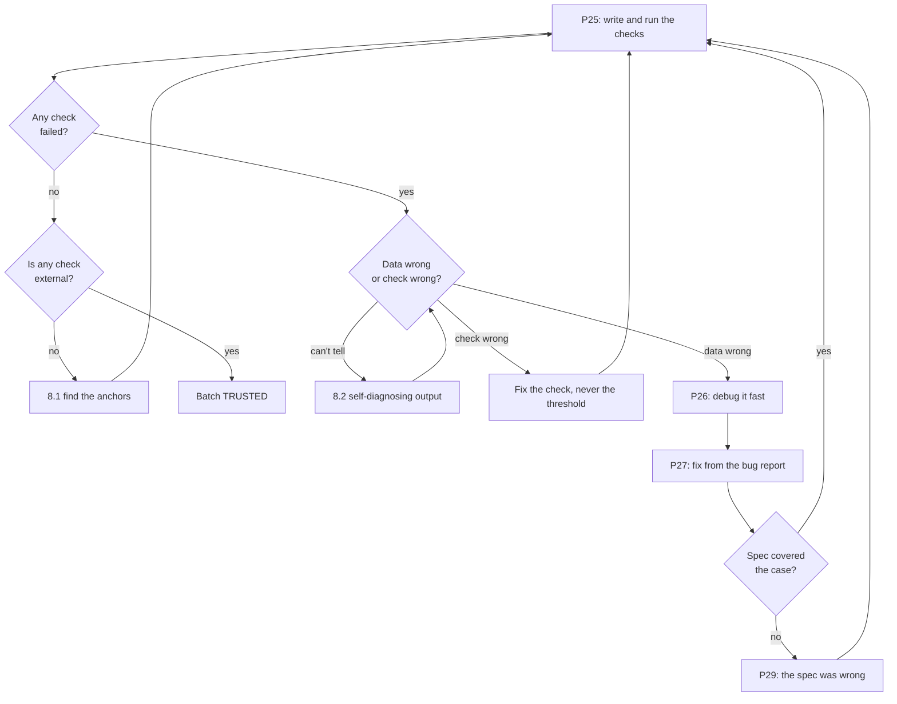

# P25 — Data Quality Validation

← [Previous](P24-find-security-gaps.md) · [Library index](../README.md) · Next: [P26](../phase-6-rework/P26-debug-an-error-fast.md)

> **One line:** Prove the numbers are right, not just that the code ran.

| | |
|---|---|
| **Phase** | 5 — Verify |
| **Who runs it** | QA Engineer (Pankaj ) with Backend Engineer (Ravi Mullick) |
| **When** | Sprint 3, day 5. The E2E suite is green, the security review is written, and Pankaj still doesn't trust the numbers. |
| **Takes in** | `Case-Study/Python-ETL/artifacts/data-contract-counterparty-position.md`, `code/doc_ingestion/sql/schema.sql`, a real day of loaded data in silver and gold, the Aladdin feed for the same day |
| **Produces** | `code/doc_ingestion/quality/checks.py` + `quality/checks.sql`, and a report at `artifacts/data-quality-report-2026-03-13.md` |
| **Hands off to** | Backend Engineer (Ravi), who takes the failures into [P26](../phase-6-rework/P26-debug-an-error-fast.md) and [P27](../phase-6-rework/P27-fix-from-a-qa-bug-report.md) |
| **Time to run** | 90 minutes to write the checks. 20 minutes to run them. Then a very long afternoon. |

---

## 1. The scene

Friday morning. Pankaj has had a good week by every measure that usually counts. The E2E suite from [P22](P22-e2e-test-the-application.md) is green on all four journeys. Gautam's review from [P23](P23-review-someone-elses-code.md) found two blockers and Ravi has fixed one. The security assessment from [P24](P24-find-security-gaps.md) is written and Hem has signed the summary.

And she is not happy, and she has been trying since Wednesday to say why.

Here is what she keeps coming back to. Every test she has written asks a question about *behaviour*. Does the gate reject a low-confidence field — yes. Does a corrected document load — yes. Does the queue show the reason — yes. Each one takes a document she chose, with an outcome she predicted, and checks that the outcome happened.

None of them ask the question Northwind actually cares about, which is: **of the two hundred documents that went through this pipeline yesterday, is every number in the warehouse the number that was on the PDF?**

She can't answer that. Nobody can. Not because the system is broken — as far as anyone knows it isn't — but because nothing is looking. The pipeline reports success. Application Insights shows 197 documents processed, 3 sent to review, zero errors. That's a green dashboard describing a system whose output nobody has checked.

Ravi, when she says this, is defensive for about ninety seconds and then he isn't. He pulls up yesterday's load. 197 documents. He counts rows in `silver.counterparty_position`: 2,844.

Pankaj asks the question that starts the whole afternoon. "How many should there be?"

Neither of them knows. There is no number to compare it to.

---

## 2. What this prompt actually does — in plain language

### "The code works" and "the data is right" are two different claims

This is the whole file in one idea, so it's worth being slow about it.

Every test written so far in this book proves a claim about **code**. Given this input, the function produces this output. Given this PDF, this row appears. The subject of the sentence is always a piece of code and the thing being checked is its behaviour.

A data quality check proves a claim about **data**. There are 2,844 rows and there should be 2,844 rows. No `quantity` is negative. Every `security_id` in silver exists in the instrument reference table. The sum of market values for the EM book is within 50 basis points of what Aladdin says.

The subject is the data. There is no function under test. The check would still be meaningful if the entire pipeline were rewritten in a different language tomorrow.

That difference sounds academic until you see the gap it leaves. Here is the gap:

> **A unit test can only fail on a case someone thought of. Data that is silently missing is, by definition, a case nobody thought of — otherwise it wouldn't be missing.**

Read that twice. It is the reason this prompt exists and it is why NWD-142 got to production.

### Why an ETL pipeline can pass every test and load wrong numbers

**ETL** stands for extract, transform, load — pull data from somewhere, reshape it, put it somewhere else. Northwind's pipeline is one: extract from PDFs, transform to the canonical position schema, load to Azure SQL and Snowflake.

ETL has a specific failure signature that ordinary application code doesn't, and it comes from one property: **the failures are quiet**.

When a web request fails you get a 500 and someone notices. When an ETL job processes 47 rows instead of 62, it *succeeds*. It writes 47 rows, logs "load complete," updates the run status to green, and goes home. There is no error, because from the code's point of view nothing went wrong — it was given 47 rows and it loaded 47 rows. The information that there should have been 62 does not exist anywhere in the process.

Five shapes this takes, all of them producing a green run:

| What happens | Why nothing errors | What you see downstream |
|---|---|---|
| Rows are dropped upstream (a page not read, a filter too aggressive, a join that silently excludes) | The code loaded everything it was given | Fewer rows. Reconciliation breaks that look like settlement failures. |
| A value is truncated (`DECIMAL(10,2)` receiving 4 decimal places) | The database rounds and accepts it | Small differences that pass tolerance until they don't |
| A timezone shifts (a UTC timestamp interpreted as local) | Both are valid dates | Trades on the wrong day. Month-end totals wrong on exactly two days a month. |
| A join duplicates rows (many-to-one where you assumed one-to-one) | More rows is not an error | Positions double-counted. Market value exactly 2× for some securities. |
| A `NULL` where a number should be (an optional field that wasn't optional) | `NULL` is a legal value | Sums that quietly exclude rows. `SUM` ignores `NULL`. |

Every one of those runs green. Four of the five make the numbers wrong in a direction nobody will spot by looking, because a plausible-looking number is not distinguishable from a correct one without something to compare it to.

**That "something to compare it to" is the entire job of this prompt.**

### The nine checks that matter, each explained

The prompt in §3 asks for nine categories of check. Here is each one in plain language, with what it catches at Northwind. If you write nothing else, write the first one.

#### 1. Row counts in versus out — the reconciliation of volume

The simplest check and by a distance the highest value.

For every stage of the pipeline, count what went in and count what came out, and account for the difference. Not "roughly the same" — account for it. If 197 documents went in and 2,844 rows came out, the check is: does the sum of the position counts across those 197 documents equal 2,844?

That requires knowing the expected count per document, which is the part people skip because it's work. At Northwind you can get it: **a Broker Alpha position statement states its own position count in the summary block** — "Total positions: 14" — and Document Intelligence extracts it as a field. So the check writes itself:

```
for each document: extracted_position_count == count of rows loaded for that document
```

**This is the check that catches NWD-142.** More on that below, because it deserves its own section.

The general form, which applies to every ETL pipeline ever built: **at every boundary, count both sides and require the difference to be explained by a number you can name.** "17 rows fewer because 17 were rejected by the gate and here they are in the exception queue" is an explanation. "Roughly the same" is not.

#### 2. Null rates per column

For every column, what fraction of rows is `NULL`, and is that fraction what you expect?

`NULL` means "no value" in SQL. It is not zero, not an empty string — it's the absence of a value, and it has a nasty property: it propagates silently. `SUM(market_value)` skips `NULL`s. `WHERE quantity > 0` excludes them. A column that is 8% `NULL` produces totals that are quietly 8% short, with no error anywhere.

The check has two forms and you want both:

- **Absolute:** a column that must never be `NULL` (`security_id`, `quantity`, `as_of_date`) has zero. If it has one, that's a defect, full stop.
- **Relative:** a column that is *sometimes* `NULL` legitimately (`isin`, say, which not every instrument has) should have a *stable* null rate. 12% yesterday, 12% today, 61% this morning — the 61% is the finding, even though `NULL` is legal in that column.

The relative version catches things the absolute version can't: a change in an upstream layout, a model that stopped extracting a field, a new counterparty whose documents don't carry it.

#### 3. Duplicate detection on the natural key

A **natural key** is the combination of columns that uniquely identifies a real-world thing. Not the database's auto-increment id — that's a **surrogate key**, and it's unique by construction, so counting distinct surrogate keys proves nothing.

For a counterparty position the natural key is `(counterparty, account, security_id, as_of_date)`. One broker, one account, one security, one date — there can be exactly one position row. Two is a defect.

```sql
SELECT counterparty, account, security_id, as_of_date, COUNT(*) AS n
FROM silver.counterparty_position
GROUP BY counterparty, account, security_id, as_of_date
HAVING COUNT(*) > 1;
```

Nine lines and it catches an entire class of bug. NWD-140 — the resent statement under a new filename creating a duplicate row, because idempotency was hashing the filename in one code path instead of the content — shows up here immediately and shows up nowhere else. The E2E suite didn't catch it because the E2E suite uploads each fixture once.

**Idempotency**, since it's the word underneath NWD-140: an operation is idempotent if doing it twice has the same effect as doing it once. Counterparties resend the same statement under new filenames constantly, so the pipeline must recognise "I have already seen this content" — which is why Northwind's design keys on the SHA-256 hash of the file content, not the name.

#### 4. Referential integrity

**Referential integrity** means every reference points at something that exists. If a position row says `security_id = 'GB00B03MLX29'`, there had better be an instrument with that identifier in the reference data.

An **orphan** is a row whose reference points at nothing. Orphans happen when two datasets are loaded independently and one gets ahead of the other, or when an identifier is transformed slightly differently on the two sides — a trailing space, a case difference, a translated value.

NWD-138 is exactly this shape: a Spanish confirmation where the translation ran on the identifier field as well as the descriptive ones, so `BONO DEL ESTADO` became `GOVERNMENT BOND` and stopped matching. The position loaded. The reference lookup produced nothing. The reconciliation reported a break.

The check:

```sql
SELECT p.*
FROM silver.counterparty_position p
LEFT JOIN ref.instrument i ON i.security_id = p.security_id
WHERE i.security_id IS NULL;
```

A `LEFT JOIN` keeps every row from the left table and fills in `NULL` where the right table has no match, so `WHERE right IS NULL` is the standard way to ask "which rows have no match."

#### 5. Numeric range and sign checks

Every numeric column has values that are physically impossible for it, and stating them is cheap.

- `quantity` — can be negative (a short position) but is never zero on a position statement, and a magnitude above, say, 10⁹ on a single line is worth flagging.
- `market_value` — must have the same sign as `quantity` for a long, opposite for a short. Sign disagreement is nearly always a parse error on a value in parentheses, which is how accountants write negatives and how OCR reliably loses them.
- `price` — always positive. A negative price is a parse error, no exceptions.
- `confidence` — between 0 and 1 inclusive. Outside that range means something upstream returned a percentage where a fraction was expected, which is a real and common bug.

The value here is that these checks catch garbage that is *within* the data type. `DECIMAL(18,4)` will happily store -47.3 as a price. Nothing complains. The range check is the only thing that will.

#### 6. Decimal precision loss

A number in a PDF might be `12,500.4567`. The database column is `DECIMAL(18,2)`. The value stored is `12500.46`. Nothing errors — the database rounds and accepts.

Two decimal places lost on one quantity is nothing. Two decimal places lost on ten thousand positions, compared against Aladdin which kept four, is a systematic drift in one direction that eats into your reconciliation tolerance until breaks start appearing that aren't real.

The check is to compare stored precision against the source: for each numeric column, how many rows have a source value with more decimal places than the column can hold? At Northwind this is checkable because the bronze layer holds the unparsed response — you have the original string. That's one of the underrated benefits of persisting bronze before parsing.

The related trap is **float versus decimal**. A `FLOAT` (also called `REAL` or `DOUBLE`) stores numbers in binary and cannot exactly represent most decimal fractions — `0.1 + 0.2` is famously not `0.3`. `DECIMAL`/`NUMERIC` stores digits and is exact. **Money and quantities are always `DECIMAL`.** Gautam's review flagged `min_confidence` stored as `FLOAT` against a data contract that says `DECIMAL(5,4)`; this is the check that would have caught it independently.

#### 7. Timezone drift

Northwind has offices in London and Los Angeles. Brokers send statements from multiple timezones. Azure runs in UTC. Snowflake has its own session timezone setting. Python's `datetime` objects can be **naive** — carrying no timezone information at all — and when a naive datetime meets a system that assumes a timezone, it gets one silently.

The symptom is the giveaway: **things are off by exactly one day, and only sometimes.** A trade at 23:30 London on 12 March is 12 March in London and 12 March in UTC — fine. The same trade at 00:30 on 13 March London during summer time is 23:30 on 12 March UTC. Now it's booked to the wrong day, and it will reconcile against Aladdin as a break on both days: missing on one, unexpected on the other.

Checks that find it:

- Any timestamp with a time component of exactly `00:00:00` in a column that should have real times — a sign of a date being parsed and the time defaulting.
- Any `as_of_date` outside the document's own stated statement period.
- The distribution of hours across a day. If everything clusters at 00:00 or at a fixed offset from the expected hours, something converted.
- Anything dated in the future, or more than a few business days in the past for a daily statement.

#### 8. Reconciliation tolerance

The pipeline exists to feed a reconciliation. So the strongest data quality check available is the reconciliation itself, run as a check.

Take the loaded positions and full-outer-join them against the Aladdin feed for the same date. A **full outer join** keeps every row from both sides, matching where it can, so you see three groups: matched, present only in the external data, present only in Aladdin.

Northwind's tolerances, which exist because two systems will never agree to the last digit:

- **Quantity: 0.0001.** Float noise, not a real break.
- **Market value: 0.005** — 50 basis points. Different pricing sources legitimately differ by small amounts.

A **basis point** is one hundredth of a percent, so 50 bps is 0.5%. Finance uses it constantly and nobody defines it.

The check is not "are there breaks" — there are always some. It's about the *shape*:

- Has the break count changed materially since yesterday?
- Are breaks concentrated on one counterparty, one security, one document? Concentration means a systematic cause. Scatter means genuine settlement differences.
- Are the `MISSING_EXTERNAL` breaks — present in Aladdin, absent from the counterparty data — clustered on documents that loaded successfully? **That specific pattern is NWD-142's signature**, and it is visible in this check even when the row-count check is unavailable.

#### 9. Distribution drift over time

The subtlest and the one people leave until last, which is fine, but know it exists.

Everything above compares today's data to a rule. This compares today's data to *yesterday's data*. Mean market value per position. Row count per document. Straight-through rate. Null rate per column. Counterparty mix.

None of these have a correct value. They have a normal range, and a sudden move outside it means something changed — a broker altered their layout, a model degraded, a threshold was edited, an upstream system started sending different data.

Northwind's headline metric, the **straight-through rate** — the percentage of documents needing zero human touch — is exactly this kind of measure. It started at 61% and the target is 85%. If it drops to 40% overnight, no individual check fails and something is badly wrong.

### The check that would have caught NWD-142 — say it plainly

This deserves its own section because it is the argument for the entire file.

**NWD-142:** on a Broker Alpha statement where the positions table spans a page boundary, the line items on page 2 are dropped silently. The document still passes the confidence gate — every field it *did* extract was high confidence — so it loads into Snowflake with half its positions. Reconciliation then reports `MISSING_EXTERNAL` breaks for the dropped rows, which look exactly like a genuine settlement failure.

Now go through what was in place and ask, honestly, what would have caught it.

| Layer | Would it catch NWD-142? | Why not |
|---|---|---|
| Unit tests (`test_extract.py`) | No | Tests extraction of a table it was given. Nothing tests "were you given the whole table?" |
| Confidence gate | No | Confidence was high on every field present. The gate has no opinion about absent fields. |
| E2E suite ([P22](P22-e2e-test-the-application.md)) | No | Asserted a row count — but no fixture was a two-page statement. Correct test, incomplete fixtures. |
| Code review ([P23](P23-review-someone-elses-code.md)) | No | There is no wrong line. The extraction code is correct for the pages it processes. |
| Security review ([P24](P24-find-security-gaps.md)) | No | Different question entirely. |
| **Row-count check (§2.1)** | **Yes. First run.** | The PDF says "Total positions: 14". Fourteen rows loaded? No — seven. Fail. |

That last row is one comparison between two numbers that both already existed in the system. The statement's stated position count was being extracted — it was in the bronze JSON, sitting there, unused. The loaded row count is a `COUNT(*)`. Nobody had ever put them next to each other.

The general principle, which is the thing to take away:

> **Data quality checks catch the class of bug that unit tests structurally cannot: silently missing data. A test can only fail on a case someone anticipated. A count check fails on a case nobody anticipated, because it doesn't need to know what went missing — only that the arithmetic doesn't add up.**

That is not a small distinction. It's the difference between finding NWD-142 on day one of the pipeline running and finding it three weeks later when a Northwind analyst asks why there are eleven settlement failures that the brokers say never happened.

### Where these checks run, and why it isn't in the test suite

One practical point that trips people up.

These are not tests in the CI sense. They don't run against fixtures; they run against real loaded data, after a load, on a schedule. Three places to put them:

- **Post-load, in-pipeline.** The check runs as the last step of each load and marks the batch as verified or quarantined. Strongest, because bad data never reaches consumers.
- **Scheduled, daily.** A job that runs the full suite each morning and reports. Simplest to add to an existing system.
- **On demand, during investigation.** What Pankaj is doing on this Friday.

Northwind ended up with all three, and the same `quality/checks.py` module backs all of them. That's why the prompt asks for the checks as a module with a report, not as a one-off script.

### The one idea to keep

**Every number in your warehouse should be traceable to a number somewhere else that it has to agree with.**

If a value exists in exactly one place, nothing can validate it, and you are trusting the pipeline on faith. The whole discipline is finding the second source — the statement's own stated total, the Aladdin feed, yesterday's value, the arithmetic sum of the parts — and making the comparison explicit.

---

## 3. The prompt

Run from the repository root with database access. It needs the data contract and the schema; without them it will invent column names and every check will error on the first run.

```text
You are a **data quality engineer**. Write executable data quality checks for a loaded
dataset, run them, and produce a report.

## The dataset

- **Pipeline:** [WHAT THE PIPELINE DOES, IN TWO SENTENCES]
- **Target tables:** [TABLES TO CHECK]
- **Data contract:** [PATH TO DATA CONTRACT]
- **Schema:** [PATH TO SCHEMA]
- **Natural key:** [THE COLUMNS THAT UNIQUELY IDENTIFY A ROW]
- **Independent source to reconcile against:** [THE SECOND SOURCE]
- **Batch to check:** [WHICH LOAD, BY DATE OR RUN ID]

## The job

Write checks in these nine categories. **Write every category, even where you expect it to
pass.** A category you skip is a category nobody is watching.

1. **Row count reconciliation.** For every boundary in the pipeline, count both sides and
   require the difference to be explained by a named number. In particular:
   [THE PER-DOCUMENT EXPECTED COUNT — where the expected number comes from]
   This is the most important check in the file. Write it first.

2. **Null rates per column.** For each column: the null count and rate. Fail any column the
   contract marks NOT NULL that has any. Fail any nullable column whose rate has moved more
   than [DRIFT THRESHOLD] from the previous batch.

3. **Duplicates on the natural key.** Group by the natural key and report every group with
   more than one row. Do not use the surrogate key — it is unique by construction and proves
   nothing.

4. **Referential integrity.** For every foreign key or logical reference, report orphans —
   rows whose reference matches nothing. Report both directions where both matter.

5. **Numeric range and sign.** For each numeric column, assert what is physically possible:
   sign rules, plausible magnitude, and any relationship between columns that must hold.
   [KNOWN RANGE RULES]

6. **Decimal precision.** For each numeric column, find rows where the source value carried
   more precision than the column can store. Report the count and the largest loss.
   Separately: flag any money or quantity column not stored as DECIMAL/NUMERIC.

7. **Timestamps and timezone.** Report: rows with a time component of exactly 00:00:00 in a
   column that should carry real times; rows outside the batch's own stated period; the
   distribution of hours; anything in the future or implausibly far in the past.

8. **Reconciliation against the independent source.** Full outer join on the natural key.
   Report matched, source-only, target-only. Apply these tolerances and count a difference
   within tolerance as matched: [TOLERANCES]. Then report the *shape*: is the break count
   materially different from the previous batch, and are breaks concentrated on one
   counterparty, one security or one document?

9. **Distribution drift.** For the metrics below, report this batch's value, the previous
   batch's value, and the percentage change. Flag anything moving more than
   [DRIFT THRESHOLD]: [METRICS TO TRACK]

## How to write it

- Put reusable SQL in `[SQL OUTPUT PATH]`, one named query per check, each returning failing
  rows — not a boolean. **A check that returns only pass/fail is useless at 7am.**
- Put the runner in `[PY OUTPUT PATH]`: executes each check, captures failing rows, writes
  the report. It must be runnable on a schedule, not just by hand.
- Every check declares its own **severity**: `FAIL` (this batch must not be trusted),
  `WARN` (investigate today), `INFO` (recorded for trend).
- Every check states, in a docstring, **what real defect it is designed to catch.** In plain
  English, one sentence. If you cannot write that sentence, the check does not earn its place.
- Cap failing-row output at [SAMPLE SIZE] examples per check, with the full count alongside.

## Then run them against [BATCH TO CHECK] and write the report

The report has:
1. **Verdict** — TRUSTED / QUARANTINE / INVESTIGATE, and one sentence.
2. **Summary table** — check name, category, severity, pass/fail, count of failing rows.
3. **Failures in detail** — for each failure: what it found, sample rows, the most likely
   cause given the pipeline design, and what to look at first.
4. **Trend** — the drift metrics against the previous batch.
5. **What is not checked** — gaps in coverage. Be explicit.

**Do not:**
- Do not write a check that can only pass. If a check cannot fail on any realistic data, drop it.
- Do not return booleans. Return the offending rows.
- Do not assume a column exists — read the schema.
- Do not tune a threshold to make a check pass. If a check fails, that is the output.
- Do not treat "no rows returned" as proof of correctness without saying what the check
  actually looked at.
- Do not silently skip a category. Say why if you skip it.

**You are done when** all nine categories have at least one executable check, every check has
a severity and a plain-English statement of the defect it catches, the checks have been run
against real loaded data, and the report has a verdict.

Save the checks to [SQL OUTPUT PATH] and [PY OUTPUT PATH], and the report to [REPORT PATH].
```

---

## 4. Every placeholder, explained

| Placeholder | What to put in it | Northwind example | What happens if you get it wrong |
|---|---|---|---|
| `[WHAT THE PIPELINE DOES]` | Two sentences on what produces this data. Shapes what "wrong" means. | "Extracts positions from counterparty PDF statements via Azure AI Document Intelligence, gates each field on confidence, loads accepted rows to Azure SQL silver and Snowflake gold." | You get generic checks. Nothing about confidence, nothing about the gate, nothing about the exception queue's effect on counts. |
| `[TABLES TO CHECK]` | The tables, fully qualified. Include the exception queue — rows that *didn't* load are half the count reconciliation. | `silver.counterparty_position`, `silver.document`, `silver.exception_queue`, `gold.position` | Miss the exception queue and every count check is unexplainable, because you can't account for the missing rows. |
| `[PATH TO DATA CONTRACT]` | The agreed shape from [P13](../phase-2-design/P13-design-the-data-contract.md): columns, types, nullability, meaning. | `Case-Study/Python-ETL/artifacts/data-contract-counterparty-position.md` | Checks are derived from the schema alone, so they can only verify the database agrees with itself. The contract is what says `min_confidence` should be `DECIMAL(5,4)` when the schema says `FLOAT`. |
| `[PATH TO SCHEMA]` | The actual DDL. | `Case-Study/Python-ETL/code/doc_ingestion/sql/schema.sql` | Invented column names. Every check errors on the first run and you spend forty minutes on typos. |
| `[THE COLUMNS THAT UNIQUELY IDENTIFY A ROW]` | The natural key. Get this wrong and the duplicate check is worthless. | `(counterparty, account, security_id, as_of_date)` | Include the surrogate id and the check always passes. Omit `as_of_date` and every day's reload looks like a duplicate. |
| `[THE SECOND SOURCE]` | The independent data you can compare against. Without one, check 8 is impossible. | The Aladdin position feed for the same `as_of_date`, via `sources/aladdin_api.py` | You lose the strongest check available. Everything else compares the data to rules; only this compares it to reality. |
| `[WHICH LOAD, BY DATE OR RUN ID]` | The specific batch. Checks run against a batch, not "the table." | `as_of_date = '2026-03-12'` — yesterday's load, 197 documents | Checks run across all history, take twenty minutes, and every historical oddity shows up mixed with today's real problem. |
| `[THE PER-DOCUMENT EXPECTED COUNT]` | **The most important placeholder in this file.** Where the expected row count per document comes from. | "Broker Alpha statements state 'Total positions: N' in the summary block; it is extracted as `stated_position_count` and stored on `silver.document`." | Leave it out and you get `COUNT(*)` with nothing to compare it to. This is the difference between finding NWD-142 and not. |
| `[DRIFT THRESHOLD]` | How much movement between batches is worth flagging. | 20% for null rates, 15% for volume metrics | Too tight and every Monday alerts because Friday's volume differs. Too loose and a broker changing their layout looks like normal variation. |
| `[KNOWN RANGE RULES]` | The physical constraints you already know. | "`price` > 0 always. `market_value` and `quantity` share a sign for long positions. `confidence` in [0,1]. `quantity` ≠ 0." | Ranges get invented from the data itself, so anything already wrong becomes the baseline. |
| `[TOLERANCES]` | The agreed match tolerances, with a reason. | quantity 0.0001 (float noise), market value 0.005 (50bps, pricing source differences) | No tolerance means every row breaks. Too generous means real breaks hide inside it. |
| `[METRICS TO TRACK]` | The handful of numbers that describe a normal day. | straight-through rate, rows per document, documents per counterparty, mean market value per position, exception queue depth | Check 9 becomes a dump of every column's statistics and nobody reads it. |
| `[SAMPLE SIZE]` | How many failing rows to print per check. | 10 | Print all of them and one broken check produces a 40,000-line report. |
| `[SQL OUTPUT PATH]` / `[PY OUTPUT PATH]` / `[REPORT PATH]` | Where each artifact goes. Checks are code; the report is dated. | `code/doc_ingestion/quality/checks.sql`, `quality/checks.py`, `artifacts/data-quality-report-2026-03-13.md` | Checks written into a chat window get run once, ever. The value is entirely in running them tomorrow. |

---

## 5. The filled-in example

Pankaj and Ravi, Friday morning of Sprint 3, connected to the test warehouse with yesterday's load in it.

```text
You are a **data quality engineer**. Write executable data quality checks for a loaded
dataset, run them, and produce a report.

## The dataset

- **Pipeline:** extracts positions from counterparty PDF statements using Azure AI Document
  Intelligence, gates every field on its confidence score, and loads accepted rows to Azure
  SQL (silver) and Snowflake (gold). Documents failing the gate go to an exception queue for
  analyst review instead of loading.
- **Target tables:** `silver.counterparty_position`, `silver.document`,
  `silver.exception_queue`, `gold.position`
- **Data contract:** Case-Study/Python-ETL/artifacts/data-contract-counterparty-position.md
- **Schema:** Case-Study/Python-ETL/code/doc_ingestion/sql/schema.sql
- **Natural key:** (counterparty, account, security_id, as_of_date)
- **Independent source to reconcile against:** the BlackRock Aladdin position feed for the
  same as_of_date, pulled by sources/aladdin_api.py into ref.aladdin_position
- **Batch to check:** as_of_date = '2026-03-12' — yesterday's load, 197 documents processed,
  3 sent to the exception queue

## The job

Write checks in these nine categories. **Write every category, even where you expect it to
pass.** A category you skip is a category nobody is watching.

1. **Row count reconciliation.** For every boundary in the pipeline, count both sides and
   require the difference to be explained by a named number. In particular:
   Broker Alpha and Broker Beta statements both state their own position count in the summary
   block ("Total positions: N" / "Total posiciones: N"). It is extracted as
   `stated_position_count` and stored on `silver.document`. Compare it, per document, to the
   count of rows actually loaded for that document. Also reconcile:
   documents landed in blob → documents in silver.document → (rows loaded + documents in
   exception queue), and silver → gold.
   This is the most important check in the file. Write it first.

2. **Null rates per column.** For each column: the null count and rate. Fail any column the
   contract marks NOT NULL that has any. Fail any nullable column whose rate has moved more
   than 20% from the previous batch.

3. **Duplicates on the natural key.** Group by (counterparty, account, security_id,
   as_of_date) and report every group with more than one row. Do not use document_id or any
   surrogate key — they are unique by construction and prove nothing.

4. **Referential integrity.** Orphans in both directions:
   - positions whose security_id has no match in ref.instrument
   - positions whose document_id has no matching row in silver.document
   - gold.position rows with no corresponding silver row
   - silver rows that never reached gold

5. **Numeric range and sign.** price > 0 always. market_value and quantity must share a sign
   for long positions and be opposite for shorts. quantity != 0. min_confidence in [0,1].
   |market_value| < 1e10 on a single line.

6. **Decimal precision.** For each numeric column, use the raw value in the bronze JSON to
   find rows whose source carried more decimal places than the column stores. Report the count
   and the largest single loss. Separately flag any money or quantity column not declared
   DECIMAL/NUMERIC in schema.sql.

7. **Timestamps and timezone.** Report rows where as_of_date has a time component of exactly
   00:00:00; rows whose as_of_date falls outside the statement period stated on the document;
   the distribution of extracted trade times by hour; anything dated in the future or more
   than 10 business days old.

8. **Reconciliation against the independent source.** Full outer join silver.counterparty_position
   against ref.aladdin_position on the natural key for 2026-03-12. Report matched,
   external-only, aladdin-only. Tolerances: quantity 0.0001 (float noise), market value 0.005
   (50 basis points, pricing source differences). Then report the shape: is the break count
   materially different from 2026-03-11, and are breaks concentrated on one counterparty, one
   security or one document?

9. **Distribution drift.** Report this batch, the previous batch, and the percentage change,
   flagging anything moving more than 20%: straight-through rate (% of documents loading with
   no human touch), mean rows per document, documents per counterparty, mean absolute market
   value per position, exception queue depth.

## How to write it

- Put reusable SQL in `Case-Study/Python-ETL/code/doc_ingestion/quality/checks.sql`, one named
  query per check, each returning failing rows — not a boolean. **A check that returns only
  pass/fail is useless at 7am.**
- Put the runner in `Case-Study/Python-ETL/code/doc_ingestion/quality/checks.py`: executes each
  check, captures failing rows, writes the report. It must be runnable on a schedule, not just
  by hand.
- Every check declares its own severity: FAIL / WARN / INFO.
- Every check states, in a docstring, what real defect it is designed to catch, in one plain
  English sentence.
- Cap failing-row output at 10 examples per check, with the full count alongside.

## Then run them against as_of_date = '2026-03-12' and write the report

[...report structure and Do-not list exactly as in §3...]

Save the checks to Case-Study/Python-ETL/code/doc_ingestion/quality/checks.sql and
quality/checks.py, and the report to
Case-Study/Python-ETL/artifacts/data-quality-report-2026-03-13.md.
```

---

## 6. What comes back

Two artifacts. First the checks — abridged, but this is the real shape.

```sql
-- quality/checks.sql
-- Every query returns FAILING ROWS. None returns a boolean.
-- :as_of_date is bound by the runner.

-- ============================================================================
-- DQ-01  Row count per document vs the count the statement declares
-- Severity: FAIL
-- Catches: line items silently dropped during extraction — a table spanning a
--          page boundary, a truncated response, a filter excluding rows.
--          The confidence gate cannot see this: everything present was high
--          confidence. Nothing else in the system compares these two numbers.
-- ============================================================================
-- name: dq01_row_count_per_document
SELECT
    d.document_id,
    d.counterparty,
    d.source_file,
    d.stated_position_count            AS expected_rows,
    COUNT(p.position_id)               AS loaded_rows,
    d.stated_position_count - COUNT(p.position_id) AS missing_rows,
    d.page_count,
    d.bronze_path
FROM silver.document d
LEFT JOIN silver.counterparty_position p
       ON p.document_id = d.document_id
WHERE d.as_of_date = :as_of_date
  AND d.load_status = 'LOADED'
  AND d.stated_position_count IS NOT NULL
GROUP BY d.document_id, d.counterparty, d.source_file,
         d.stated_position_count, d.page_count, d.bronze_path
HAVING COUNT(p.position_id) <> d.stated_position_count
ORDER BY (d.stated_position_count - COUNT(p.position_id)) DESC;

-- ============================================================================
-- DQ-02  Documents in, documents accounted for
-- Severity: FAIL
-- Catches: documents that vanish between stages — a crashed worker, a swallowed
--          exception, a message dead-lettered without anyone noticing.
-- ============================================================================
-- name: dq02_document_accounting
WITH landed AS (
    SELECT COUNT(*) AS n FROM silver.blob_arrival WHERE arrival_date = :as_of_date
),
in_silver AS (
    SELECT COUNT(*) AS n FROM silver.document WHERE as_of_date = :as_of_date
),
loaded AS (
    SELECT COUNT(*) AS n FROM silver.document
     WHERE as_of_date = :as_of_date AND load_status = 'LOADED'
),
queued AS (
    SELECT COUNT(*) AS n FROM silver.exception_queue WHERE as_of_date = :as_of_date
)
SELECT landed.n AS landed, in_silver.n AS in_silver,
       loaded.n AS loaded, queued.n AS queued,
       landed.n - in_silver.n            AS unaccounted_at_ingest,
       in_silver.n - (loaded.n + queued.n) AS unaccounted_at_gate
FROM landed, in_silver, loaded, queued
WHERE landed.n <> in_silver.n
   OR in_silver.n <> loaded.n + queued.n;

-- ============================================================================
-- DQ-05  Duplicates on the natural key
-- Severity: FAIL
-- Catches: a resent statement loading twice — the NWD-140 shape, where
--          idempotency hashed the filename rather than the content.
-- ============================================================================
-- name: dq05_natural_key_duplicates
SELECT counterparty, account, security_id, as_of_date,
       COUNT(*)                          AS row_count,
       COUNT(DISTINCT document_id)       AS distinct_documents,
       STRING_AGG(CAST(document_id AS VARCHAR), ',') AS document_ids
FROM silver.counterparty_position
WHERE as_of_date = :as_of_date
GROUP BY counterparty, account, security_id, as_of_date
HAVING COUNT(*) > 1
ORDER BY COUNT(*) DESC;

-- ============================================================================
-- DQ-07  Orphaned security identifiers
-- Severity: FAIL
-- Catches: an identifier transformed on its way through — the NWD-138 shape,
--          where translation ran on the identifier field and not just the
--          descriptive ones.
-- ============================================================================
-- name: dq07_orphan_security_id
SELECT p.document_id, p.counterparty, p.security_id, p.security_name,
       d.source_language
FROM silver.counterparty_position p
LEFT JOIN ref.instrument i ON i.security_id = p.security_id
JOIN silver.document d ON d.document_id = p.document_id
WHERE p.as_of_date = :as_of_date
  AND i.security_id IS NULL;

-- ============================================================================
-- DQ-09  Sign disagreement between quantity and market value
-- Severity: FAIL
-- Catches: a negative rendered in parentheses that OCR read as positive —
--          "(1,250.00)" arriving as 1250.00.
-- ============================================================================
-- name: dq09_sign_disagreement
SELECT document_id, counterparty, security_id, quantity, market_value, position_side
FROM silver.counterparty_position
WHERE as_of_date = :as_of_date
  AND (
        (position_side = 'LONG'  AND SIGN(quantity) <> SIGN(market_value))
     OR (position_side = 'SHORT' AND SIGN(quantity)  = SIGN(market_value))
      );

-- ============================================================================
-- DQ-12  Precision lost against the bronze source value
-- Severity: WARN
-- Catches: decimals silently truncated by the column type. One row is noise;
--          a systematic pattern eats the reconciliation tolerance.
-- ============================================================================
-- name: dq12_precision_loss
SELECT p.document_id, p.security_id,
       b.raw_quantity, p.quantity,
       LEN(b.raw_quantity) - CHARINDEX('.', b.raw_quantity) AS source_dp,
       ABS(CAST(b.raw_quantity AS DECIMAL(28,8)) - p.quantity) AS loss
FROM silver.counterparty_position p
JOIN silver.bronze_field b
  ON b.document_id = p.document_id AND b.line_no = p.line_no
WHERE p.as_of_date = :as_of_date
  AND CHARINDEX('.', b.raw_quantity) > 0
  AND LEN(b.raw_quantity) - CHARINDEX('.', b.raw_quantity) > 4
ORDER BY loss DESC;

-- ============================================================================
-- DQ-15  Reconciliation against Aladdin, within tolerance
-- Severity: WARN  (breaks are expected; the shape is the signal)
-- Catches: everything the other checks miss, by comparing to reality.
--          MISSING_EXTERNAL concentrated on successfully-loaded documents is
--          the NWD-142 signature.
-- ============================================================================
-- name: dq15_aladdin_reconciliation
SELECT
    COALESCE(e.counterparty, a.counterparty)  AS counterparty,
    COALESCE(e.security_id,  a.security_id)   AS security_id,
    COALESCE(e.account,      a.account)       AS account,
    e.quantity      AS external_quantity,
    a.quantity      AS aladdin_quantity,
    e.market_value  AS external_mv,
    a.market_value  AS aladdin_mv,
    e.document_id,
    CASE
      WHEN e.security_id IS NULL THEN 'MISSING_EXTERNAL'
      WHEN a.security_id IS NULL THEN 'MISSING_INTERNAL'
      WHEN ABS(e.quantity - a.quantity) > 0.0001 THEN 'QUANTITY_BREAK'
      WHEN ABS(e.market_value - a.market_value)
           / NULLIF(ABS(a.market_value), 0) > 0.005 THEN 'VALUE_BREAK'
    END AS break_type
FROM silver.counterparty_position e
FULL OUTER JOIN ref.aladdin_position a
  ON  a.counterparty = e.counterparty
  AND a.account      = e.account
  AND a.security_id  = e.security_id
  AND a.as_of_date   = e.as_of_date
WHERE COALESCE(e.as_of_date, a.as_of_date) = :as_of_date
  AND (
        e.security_id IS NULL
     OR a.security_id IS NULL
     OR ABS(e.quantity - a.quantity) > 0.0001
     OR ABS(e.market_value - a.market_value)
        / NULLIF(ABS(a.market_value), 0) > 0.005
      );
```

The runner, abridged to the parts that matter:

```python
# quality/checks.py
"""Data quality checks for the counterparty ingestion pipeline.

Run after every load, and on a schedule at 07:00 IST for the previous day.
Every check returns failing rows, never a boolean — at 7am the question is
never "did it pass", it is "what exactly is wrong".
"""
from __future__ import annotations

import datetime as dt
from dataclasses import dataclass, field
from enum import Enum


class Severity(str, Enum):
    FAIL = "FAIL"     # do not trust this batch
    WARN = "WARN"     # investigate today
    INFO = "INFO"     # recorded for trend


@dataclass(frozen=True)
class Check:
    id: str
    name: str
    category: str
    severity: Severity
    catches: str          # one plain sentence. If you cannot write it, drop the check.
    sql_name: str


CHECKS: list[Check] = [
    Check("DQ-01", "Row count per document vs stated count", "row_count",
          Severity.FAIL,
          "Line items silently dropped during extraction — e.g. a positions table "
          "spanning a page boundary.",
          "dq01_row_count_per_document"),
    Check("DQ-02", "Document accounting across stages", "row_count", Severity.FAIL,
          "Documents that vanish between blob arrival, silver and the gate.",
          "dq02_document_accounting"),
    # ... DQ-03 … DQ-14 …
    Check("DQ-15", "Aladdin reconciliation within tolerance", "reconciliation",
          Severity.WARN,
          "Anything the other checks miss, by comparing to an independent source.",
          "dq15_aladdin_reconciliation"),
]


@dataclass
class CheckResult:
    check: Check
    failing_row_count: int
    sample_rows: list[dict] = field(default_factory=list)
    error: str | None = None

    @property
    def passed(self) -> bool:
        return self.error is None and self.failing_row_count == 0


def run_all(conn, as_of_date: dt.date, sample_size: int = 10) -> list[CheckResult]:
    results: list[CheckResult] = []
    for check in CHECKS:
        try:
            rows = conn.execute(load_sql(check.sql_name), {"as_of_date": as_of_date}).fetchall()
            results.append(CheckResult(
                check=check,
                failing_row_count=len(rows),
                sample_rows=[dict(r) for r in rows[:sample_size]],
            ))
        except Exception as exc:                      # a broken check is itself a finding
            results.append(CheckResult(check=check, failing_row_count=-1, error=str(exc)))
    return results


def verdict(results: list[CheckResult]) -> str:
    """TRUSTED / QUARANTINE / INVESTIGATE.

    Any FAIL-severity check with failing rows quarantines the batch. A broken
    check counts as a failure — a check that errored proves nothing.
    """
    if any(r.check.severity is Severity.FAIL and not r.passed for r in results):
        return "QUARANTINE"
    if any(not r.passed for r in results):
        return "INVESTIGATE"
    return "TRUSTED"
```

And the report it produced. This is the part of the afternoon that changed the sprint.

```markdown
# Data quality report — as_of_date 2026-03-12

**Generated:** 2026-03-13 09:41
**Batch:** 197 documents landed · 194 loaded · 3 in exception queue
**Rows in `silver.counterparty_position`:** 2,844

---

## 1. Verdict

**QUARANTINE.** Three FAIL-severity checks have failing rows. The most serious, DQ-01, shows
that **11 documents loaded fewer position rows than the statement itself declares** — 89 rows
missing in total. Every one of those documents passed the confidence gate and is marked
LOADED. This batch should not be used for reconciliation.

---

## 2. Summary

| ID | Check | Category | Severity | Result | Failing rows |
|---|---|---|---|---|---|
| DQ-01 | Row count per document vs stated count | row_count | FAIL | **FAIL** | **11 documents, 89 rows missing** |
| DQ-02 | Document accounting across stages | row_count | FAIL | PASS | 0 |
| DQ-03 | NOT NULL columns | nulls | FAIL | PASS | 0 |
| DQ-04 | Null rate drift | nulls | WARN | PASS | 0 |
| DQ-05 | Natural key duplicates | duplicates | FAIL | **FAIL** | **2 groups (4 rows)** |
| DQ-06 | Orphan document_id | referential | FAIL | PASS | 0 |
| DQ-07 | Orphan security_id | referential | FAIL | **FAIL** | **6 rows** |
| DQ-08 | Silver rows absent from gold | referential | WARN | PASS | 0 |
| DQ-09 | Sign disagreement | range | FAIL | PASS | 0 |
| DQ-10 | Price non-positive | range | FAIL | PASS | 0 |
| DQ-11 | Confidence outside [0,1] | range | FAIL | PASS | 0 |
| DQ-12 | Precision loss vs bronze | precision | WARN | **WARN** | **312 rows** |
| DQ-13 | Money column not DECIMAL | precision | WARN | **WARN** | **1 column** |
| DQ-14 | Timestamp anomalies | timezone | WARN | PASS | 0 |
| DQ-15 | Aladdin reconciliation | reconciliation | WARN | **WARN** | **97 breaks (was 14)** |
| DQ-16 | Distribution drift | drift | INFO | **INFO** | 2 metrics moved |

---

## 3. Failures in detail

### DQ-01 — FAIL — 11 documents loaded fewer rows than they declare

89 position rows are missing across 11 documents. Sample:

| document_id | counterparty | source_file | expected | loaded | missing | pages |
|---|---|---|---|---|---|---|
| 4471 | broker_alpha | BA_POS_20260312_0614.pdf | 14 | 7 | 7 | 2 |
| 4488 | broker_alpha | BA_POS_20260312_0621.pdf | 22 | 11 | 11 | 2 |
| 4502 | broker_alpha | BA_POS_20260312_0633.pdf | 31 | 12 | 19 | 3 |
| 4519 | broker_alpha | BA_POS_20260312_0641.pdf | 9 | 9 | 0 | 1 |
| 4530 | broker_alpha | BA_POS_20260312_0652.pdf | 18 | 9 | 9 | 2 |
| … | | | | | | |

**Pattern.** Every affected document has `page_count > 1`. Every single-page document loaded
its full stated count. The loaded count is consistently the number of rows that fit on page 1.
Document 4502 has three pages and loaded 12 of 31 — again, page 1 only.

**Most likely cause.** The extraction step is reading the table from the first page and not
following it across the page boundary. `core/extract.py` builds the line-item list from the
first table object in the Document Intelligence response; a table continuing onto the next page
is returned as a separate table object with no header row, and nothing joins them.

**Why nothing else caught this.** Every field on every row that *was* extracted had confidence
above threshold, so the gate passed the document. The gate has no opinion about rows that are
absent — it can only score what it is given. `test_extract.py` asserts extraction of a table it
supplies; there is no test supplying a table split across pages.

**Look at first:** `core/extract.py:88` — `tables[0]`. And the bronze JSON for document 4471,
which will show two table objects where the code expects one.

---

### DQ-05 — FAIL — 2 natural key groups with duplicate rows

| counterparty | account | security_id | as_of_date | rows | distinct docs |
|---|---|---|---|---|---|
| broker_alpha | NW-EM-004 | GB00B03MLX29 | 2026-03-12 | 2 | 2 (4455, 4491) |
| broker_alpha | NW-EM-004 | US0378331005 | 2026-03-12 | 2 | 2 (4455, 4491) |

Documents 4455 and 4491 have different `source_file` values and identical content hashes are
**not** recorded — `sha256` is null on 4491. Consistent with NWD-140: a resent statement under
a new filename, where one code path hashed the filename instead of the content.

---

### DQ-07 — FAIL — 6 positions reference an unknown security_id

All six are on `broker_beta_em` documents with `source_language = 'es'`. The `security_name`
column holds English text ("GOVERNMENT BOND 2029") while `ref.instrument` holds the identifier
form. This is NWD-138: translation applied to the identifier field, not only the descriptive
ones.

---

### DQ-12 / DQ-13 — WARN — precision

312 rows carry a source quantity with more than four decimal places; the column is
`DECIMAL(18,4)`. Largest single loss 0.00004 — immaterial per row, systematically in one
direction across 312 rows.

Separately, `min_confidence` is declared `FLOAT` in `schema.sql:34`. The data contract
specifies `DECIMAL(5,4)`. Same finding as Minor 4 in `code-review-NWD-103.md`, reached
independently.

---

### DQ-15 — WARN — 97 reconciliation breaks, up from 14

| break_type | count | previous batch |
|---|---|---|
| MISSING_EXTERNAL | 89 | 3 |
| MISSING_INTERNAL | 2 | 2 |
| QUANTITY_BREAK | 0 | 4 |
| VALUE_BREAK | 6 | 5 |

**The 89 MISSING_EXTERNAL breaks are the same 89 rows as DQ-01.** They are not settlement
failures. Aladdin has the position; the counterparty statement has it too; it was dropped
during extraction. Anyone reading the break report without this check in hand would open 89
queries with brokers about positions the brokers correctly reported.

---

## 4. Trend

| Metric | 2026-03-11 | 2026-03-12 | Change |
|---|---|---|---|
| Straight-through rate | 63.1% | 62.9% | −0.2% |
| Mean rows per document | 17.2 | 14.7 | **−14.5%** |
| Documents per counterparty (alpha/beta) | 141/53 | 144/50 | +2% / −6% |
| Mean abs market value per position | 412,880 | 418,204 | +1.3% |
| Exception queue depth | 4 | 3 | −25% |

Mean rows per document dropped 14.5% with no change in counterparty mix. Consistent with DQ-01.
This metric alone, tracked from day one, would have flagged the problem without any other check.

---

## 5. What is not checked

- **Whether the extracted values are correct**, only whether they are plausible and internally
  consistent. A quantity of 12,500 that should be 12,600 passes everything here. Catching that
  needs a human comparing to the PDF, or a second extraction pass.
- **Documents that never landed at all.** DQ-02 reconciles from blob arrival onward. A broker
  who did not send a statement is invisible to every check in this file.
- **Gold-layer transformations.** DQ-08 checks presence, not correctness of the MERGE.
- **`stated_position_count` itself.** If Document Intelligence misreads "Total positions: 14"
  as 11, DQ-01 compares against a wrong number. Confidence on that field is checked; it is not
  independently verified.
```

### How to read this

**DQ-01 is NWD-142, found in twenty seconds by comparing two numbers that were both already in the database.** The statement says 14 positions. Seven rows loaded. Every affected document has more than one page. That's not a hint or a lead — it's the bug, with its cause visible in the `pages` column of the same table.

Pankaj had already found NWD-142 by hand on Wednesday, on one document, by opening a PDF and counting. What this report added was the scale — 11 documents, 89 rows, in one day's load — and the pattern that names the cause. One document is an anecdote you argue about. Eleven documents all with `page_count > 1` and all missing exactly the rows that don't fit on page one is a diagnosis.

**Section 3's DQ-15 is the sentence that made Atul go quiet.** Eighty-nine of the ninety-seven reconciliation breaks are not breaks. They're the same missing rows. Without this report, an operations analyst spends a day opening queries with brokers about positions the brokers reported correctly — which is precisely the manual work Kestrel was hired to eliminate, reappearing in a new form because the automation was quietly wrong.

**The trend table is the cheapest insurance in the document.** Mean rows per document fell 14.5% overnight. That single number, tracked from the first day the pipeline ran, would have raised a flag with no other check in place. It requires no reference data, no Aladdin feed, no stated count — just yesterday's value.

**The part that is commonly wrong:** §5's last bullet, and it's the one to internalise. DQ-01 compares the loaded count against `stated_position_count`, which is itself extracted by the same AI from the same PDF. If that field is misread, the check compares against a wrong number and can produce a false pass. It's still enormously better than no check — but "we validated the data" is not the same as "the data is right," and a report that pretends otherwise is doing harm.

---

## 7. Why this is the final prompt

### What "done" means here

Done is: **all nine categories have at least one executable check, every check has been run against real loaded data, every check states in one sentence what defect it catches, and the report has a verdict a person can act on without reading the detail.**

The "run against real data" clause is the one that matters. A check suite that has never been run against production-shaped data is a design document. Half of the checks will error on the first run — a column name that doesn't exist, a join that explodes, a type mismatch. That's expected and it's part of the work.

### The checklist

- [ ] Every one of the nine categories has at least one check, including the ones you expected to pass.
- [ ] Every check returns rows, not a boolean. Run one deliberately against bad data and confirm you get useful output.
- [ ] Every check's docstring names a real defect in one sentence. If any says "validates data quality," delete it and write a real one.
- [ ] The suite has been run against at least one full day of real loaded data.
- [ ] At least one check failed on the first run. If none did, be suspicious — either the data is genuinely clean or the checks are too loose.
- [ ] The report has a verdict, and the verdict rule is written in code, not decided by a human each morning.
- [ ] "What is not checked" is filled in honestly, including anything that validates against a value the pipeline itself produced.
- [ ] The suite is wired to run on a schedule, not only by hand.

### Why you should stop rather than keep prompting

Two failure modes, and the first is the dangerous one.

**Do not tune thresholds to make checks pass.** This is the strongest temptation in the whole file and it is always available. DQ-12 flags 312 rows of precision loss; you could raise the threshold from four decimal places to six and it would go green. The check would then be watching nothing. Every threshold you loosen to make a report look good is a defect you have agreed not to see, and you will not remember agreeing.

The honest move when a check fails on acceptable data is to change the *check*, deliberately and with a comment saying why — not to move the number until the red goes away.

**Do not keep adding checks past the point where someone reads the report.** Sixteen checks that people read beats sixty they skim. Every check costs runtime, maintenance, and a share of the reader's attention, and the ones added at the end are always the least valuable. Northwind's suite settled at sixteen and has stayed there.

The third, smaller one: don't ask for a dashboard. A dashboard is a nice thing to have later. Right now the check that fires and stops a bad batch is worth ten times the chart that shows it went wrong yesterday.

### The signal that you are NOT done

**Every check passed and you still can't say where the numbers come from.** Which means nothing is comparing your data to anything outside itself. §8.1.

---

## 8. When it is not done — the follow-up prompts

| What you're seeing | What's actually wrong | Run this next |
|---|---|---|
| Every check passed and the numbers are still wrong | Every check compares the data to itself. There is no independent source anywhere in the suite. | **8.1** below — the essential one |
| A check failed and you can't tell if the data or the check is wrong | The check doesn't return enough context to diagnose. | **8.2** below |
| Thirty checks and the report is unreadable | No severity discipline; everything is FAIL. | **8.3** below |
| Checks pass on the batch and downstream users still complain | You're checking the wrong grain — row-level checks, aggregate-level problem. | **8.4** below |
| Checks fail every day for the same known reason | Missing an accepted-exceptions mechanism, so the suite is being ignored. | **8.5** below |
| A check found a real defect | Good. That's the point. | **[P26](../phase-6-rework/P26-debug-an-error-fast.md)** then **[P27](../phase-6-rework/P27-fix-from-a-qa-bug-report.md)** |
| The defect means the spec never covered a case | The code isn't wrong; the spec is silent. | **[P29](../phase-6-rework/P29-the-spec-was-wrong.md)** |

### 8.1 "Every check passed but the numbers are still wrong"

The most important follow-up in this file. Use it when the suite is green and someone downstream is telling you the data is wrong — and they are right.

```text
Every data quality check passes and the numbers are still wrong. Here is what is wrong:

[THE SPECIFIC DISCREPANCY — what value, what it should be, who noticed, how they know]

The suite is therefore validating the data against itself. Fix that.

**First, classify every existing check** into one of two groups:
- **Internal:** compares the data to a rule, a type, or another column in the same dataset.
  Can only catch data that is malformed.
- **External:** compares the data to a number produced by something outside this pipeline.
  Can catch data that is well-formed and wrong.

I expect most checks to be internal. Tell me the ratio.

**Then find every external anchor available**, whether or not we currently use it. For each,
say what it can prove and what it cannot:
- Any total, count or subtotal the source document states about itself.
- Any independent system holding overlapping data.
- Any arithmetic identity that must hold — parts summing to a stated total, a balance
  equation, a value equal to price times quantity.
- Yesterday's value for the same entity.
- Any external published reference — a price source, an instrument master, a calendar.

**Then write the specific check** that would have caught the discrepancy above. Not a general
improvement — that one check. Show me the SQL and tell me what it would have returned on the
batch where the problem occurred.

**Finally, and be blunt about this:** what class of wrongness can this data still have with
every check green? I want the honest list.
```

What changes: you stop adding checks and start adding *anchors*. On this project the answer to the last question was the one that mattered — with every check green, the data can still be wrong about the actual value of a correctly-shaped, correctly-counted, correctly-typed number. That's the residual risk, it's real, and knowing it is why the confidence gate exists.

### 8.2 "A check failed and I can't diagnose it"

Use this when a check goes red and you spend an hour working out whether it's the data or the check.

```text
This check failed and I cannot tell whether the data is wrong or the check is:
[PASTE THE CHECK AND ITS OUTPUT]

Rewrite it so the output diagnoses itself:
- Return the columns needed to identify the source of each failing row — document id, source
  file, counterparty, bronze path. Not just the offending value.
- Return the neighbouring context: for a count mismatch, both counts and the difference; for a
  range violation, the value and the bound it broke.
- Group the failing rows by whatever they have in common and report the grouping. Eleven
  failures sharing one counterparty is a different problem from eleven scattered.
- Add, as a comment on the check, the two or three most likely causes given the pipeline
  design, in order, and what to look at for each.

**Do not** change what the check tests. Only what it tells me when it fails.
```

What changes: the check starts naming its own cause. DQ-01's `page_count` column exists only because of this follow-up, and it is the single column that turned "89 rows missing" into "the extractor doesn't follow tables across pages."

### 8.3 "The report is unreadable"

Use this when there are too many checks and no way to triage.

```text
The data quality report is too long to act on. Re-triage every check.

Assign each a severity by this rule, and say which rule applied:
- **FAIL** — if this fires, a downstream consumer will make a wrong decision. The batch must
  not be used. Examples: missing rows, duplicates on the natural key, a NOT NULL column with
  nulls.
- **WARN** — the data is usable but something changed and somebody should look today.
- **INFO** — recorded for trend. Never blocks anything, never wakes anyone.

**At most six checks may be FAIL.** If you have seven, one of them is a WARN — decide which
and justify it.

Then restructure the report: verdict and the FAIL checks first, WARN second, INFO in an
appendix. Someone should be able to read the first fifteen lines at 7am and know whether to
stop the pipeline.
```

What changes: the report acquires a front page. The six-FAIL cap is artificial and it works — it forces the judgement that "everything is important" avoids.

### 8.4 "Row checks pass, aggregates are wrong"

Use this when every row looks fine and a total doesn't.

```text
Every row-level check passes but an aggregate is wrong:
[WHICH AGGREGATE, WHAT IT SHOULD BE, HOW YOU KNOW]

Row-level checks cannot catch this. Add checks at the aggregate grain:
- For each meaningful grouping — counterparty, account, book, security type, date — compare
  the aggregate to an independent value for the same group.
- Check that aggregates decompose: does the sum of per-account totals equal the book total,
  and does the book total equal the reported total?
- Check aggregates against the previous batch, with a percentage-change threshold per group.
  A group appearing or disappearing entirely is a finding on its own.
- Check for the classic aggregate distortions: a join that fans out and double-counts, a
  filter applied before an aggregation that should have come after, and NULLs silently
  excluded from a SUM or an AVG.

For each new check, say what row-level defect would produce that aggregate symptom.
```

What changes: you get checks at the grain where the problem lives. The fan-out check in particular catches a class of bug that is invisible row by row — every row is correct, there are just twice as many as there should be.

### 8.5 "The same checks fail every day and everyone ignores them"

Use this when the suite has become background noise.

```text
These checks fail every day for reasons we have already investigated and accepted:
[LIST THE CHECKS AND THE ACCEPTED REASON FOR EACH]

The suite is being ignored because of them. Add an accepted-exceptions mechanism:

- A declarative list of accepted exceptions, each with: the check id, a predicate identifying
  exactly the rows being accepted, the reason, who accepted it, and an **expiry date**.
- An exception must never be a blanket "ignore this check." It matches specific rows.
- An expired exception makes the check fail again, loudly, and names who accepted it.
- The report shows both numbers: failing rows, and failing rows excluding accepted exceptions.
  Never hide the first.
- Adding an exception is a code change and goes through review.

Then apply it to the list above and show me the resulting report.

**Do not** implement this by loosening the checks themselves. The check keeps finding the rows;
the exception records that we chose to accept them, and when we agreed to look again.
```

What changes: the suite becomes trustworthy again, and — more usefully — the expiry dates turn accepted exceptions into a visible backlog instead of permanent silent debt. Northwind carries three, all expiring at the end of Q2.

### The loop



---

## 9. How this goes wrong

### Every check compares the data to itself

The commonest and quietest failure. You write sixteen checks, all sixteen pass, and none of them could ever have caught a wrong number — because every one asks whether the data is well-formed, and none asks whether it is true.

Null rates, type checks, range checks, duplicate checks: all internal. They catch malformed data. They cannot catch a quantity of 12,500 that should be 12,600, because 12,500 is a perfectly well-formed quantity.

The tell is that everything passes on the first run. Real data does not do that. If your suite went green immediately, you have written a suite that describes your data rather than tests it.

The fix is 8.1, and the specific move is to hunt for external anchors. At Northwind the anchors were sitting in plain sight: the statement's own stated position count, the Aladdin feed, and yesterday's numbers. All three were available on day one. None was being used.

### You tune a threshold to make a check pass

DQ-12 flags 312 rows. Someone raises the precision threshold from four decimal places to six and the report goes green. Everyone feels better. The check now watches nothing, and nobody will ever remember that it used to.

This happens because a red report is uncomfortable and a threshold is a number you're allowed to change. It is the mechanism by which every quality suite dies, and it dies quietly.

The fix is procedural: **a threshold change is a code change and it goes through review with a comment explaining why the old value was wrong.** Not "adjusted threshold" — a sentence about the data. If you can't write that sentence, don't change the number.

### The checks run and nobody reads the output

The suite runs at 07:00 and writes a report to a folder. Three weeks later somebody notices DQ-05 has been failing since the 4th.

Reports nobody reads are the same as checks that don't exist, except they cost runtime and give false comfort. The word for this is alert fatigue, and it arrives fast.

Two fixes and you want both. **First, wire FAIL to something that blocks:** a batch that quarantines is not published to gold, and someone has to actively release it. Consequence beats notification every time. **Second, make sure a FAIL is rare enough to mean something** — which is 8.3 and 8.5, severity discipline and accepted exceptions.

### You check the batch and miss what never arrived

Every check in §6 operates on rows that exist. Not one of them can see a document that was never sent.

If Broker Alpha's overnight job fails and no statement arrives, the pipeline processes zero Broker Alpha documents, every check passes on the 194 documents that did arrive, and the verdict is TRUSTED. Reconciliation then shows several hundred `MISSING_EXTERNAL` breaks, and it takes someone a morning to work out that the answer is "the file never came."

This is the hardest gap in data quality work and it needs a different kind of check: an **expectation of arrival**. What should have arrived today, by when, and did it. That means a table of expected feeds with schedules, which is real work and it is the right work.

Northwind's version is one row per counterparty per business day, marked expected/received/late, and a check that fails at 08:00 if anything expected before then hasn't landed. Note the shape: it is not a check on data. It's a check on the absence of data, and it is the only kind that can see this.

### This is the wrong tool entirely: you need a human with the PDF

Be honest about the ceiling.

Every check here validates structure, completeness, consistency and plausibility. None validates truth. If Document Intelligence reads `12,500` as `12,600` with 0.97 confidence, the value is well-formed, in range, correctly typed, unique on its key, references a real security and reconciles against Aladdin within 50 basis points because market value moves with quantity. Every check passes. The number is wrong.

The only things that catch that are the confidence gate — which is why it exists and why "a wrong number is worse than no number" is invariant number one — and a human comparing the row to the PDF.

So the honest framing, and the one Pankaj used with Preetinka: **data quality checks catch missing, duplicated, malformed and structurally wrong data, at scale, every day. They do not catch a plausible wrong number. That's what the gate is for, and it's why the straight-through rate is 62% and not 100%.**

If someone asks you to replace the gate with data quality checks because the exception queue is annoying, this paragraph is your answer.

---

## 10. The handoff

The report goes to Ravi and it goes as a quarantine, not a suggestion. Yesterday's batch is not published to gold. That's the point of a verdict written in code — nobody had to decide it on a Friday afternoon.

Ravi takes DQ-01 into [P26](../phase-6-rework/P26-debug-an-error-fast.md) first, because the report already contains the diagnostic lead: every affected document has `page_count > 1`, the loaded count matches what fits on page one, and `core/extract.py:88` takes `tables[0]`. That's about as good a starting position as a debugging session ever gets. From there it becomes NWD-142 properly, through [P27](../phase-6-rework/P27-fix-from-a-qa-bug-report.md) — the flagship of the rework chapter.

And it doesn't stop at code, which is the part worth watching. The spec has no rule for a positions table that continues across a page boundary. There is nothing in `spec-confidence-gate.md` or in the extraction spec saying what should happen, so the code isn't wrong so much as unguided. That makes it a [P29](../phase-6-rework/P29-the-spec-was-wrong.md) job for Hem — a table-continuation rule, written down, with a matching test class added through [P20](../phase-4-build/P20-write-tests-alongside-the-code.md).

DQ-05 and DQ-07 map to NWD-140 and NWD-138, both already filed from Pankaj's manual testing. The report adds scale and a reproduction path to each, which turns two "I saw this once" bugs into two bugs with a query that finds every instance.

The check suite itself outlives the sprint. It runs at 07:00 every morning from Sprint 4 onward, quarantines any batch with a FAIL, and its trend table becomes the source of the straight-through-rate number that Atul reports to Northwind. It is the only artifact in Phase 5 that is still doing work six months later.

> **Artifact contract — `code/doc_ingestion/quality/checks.py` + `checks.sql` + the dated report**
>
> Anyone reading these can rely on finding:
> - At least one executable check in each of the nine categories, including the ones that pass.
> - Every check returning failing rows with enough context to diagnose them — never a bare boolean.
> - Every check carrying a severity (FAIL / WARN / INFO) and a one-sentence plain-English statement of the defect it catches.
> - At least one check comparing the data to a source outside this pipeline.
> - A report with a verdict (TRUSTED / QUARANTINE / INVESTIGATE) decided by code, not by a person.
> - A trend section comparing this batch to the previous one.
> - A "what is not checked" section naming the gaps, including any check that validates against a value this pipeline itself produced.
>
> If any of those is missing, the artifact is not done — go back to §7.

---

## 11. In the case study

Sprint 3, day 5, in [`07-sprint-3-verify.md`](../../Case-Study/Python-ETL/07-sprint-3-verify.md), and it's the hinge of the sprint.

Pankaj had already found NWD-142 on the Wednesday, by hand, on one document, by opening `BA_POS_20260312_0614.pdf` and counting fourteen positions where the warehouse had seven. She filed it. The reaction was proportionate to the evidence — one document, one broker, probably an odd statement, Ravi would look at it next week.

Friday's report changed the size of the thing. Eleven documents in a single day's load. Eighty-nine missing rows. Every affected document multi-page, every single-page document perfect. And the line that made the room go quiet: eighty-nine of the ninety-seven reconciliation breaks were the same eighty-nine rows. The break report Northwind was going to use to chase brokers was 92% noise generated by Kestrel's own pipeline.

Atul did the arithmetic out loud, which is a very Atul thing to do. Roughly 12% of documents are multi-page. At 200 documents a day, that's 24 a day, averaging around 8 dropped rows each — call it 190 phantom breaks a day. Northwind's whole reason for the project was to get break detection from T+2 to T+1. They would have got it to T+1 and buried the operations team in false positives, which is worse than T+2, because at T+2 the numbers were at least right.

The uncomfortable retrospective note ([`10-retrospective.md`](../../Case-Study/Python-ETL/10-retrospective.md)) is Ravi's, not Pankaj's: *"The number I needed was already in the database. We extracted `stated_position_count` in Sprint 2 because it was on the statement and it seemed like it might be useful. It sat in a column for three weeks. Nobody wrote the one line of SQL that compares it to `COUNT(*)`."*

That's the honest lesson and it generalises. The check that catches your worst bug is usually a comparison between two numbers you already have.

---

← [Previous](P24-find-security-gaps.md) · [Library index](../README.md) · Next: [P26](../phase-6-rework/P26-debug-an-error-fast.md)
