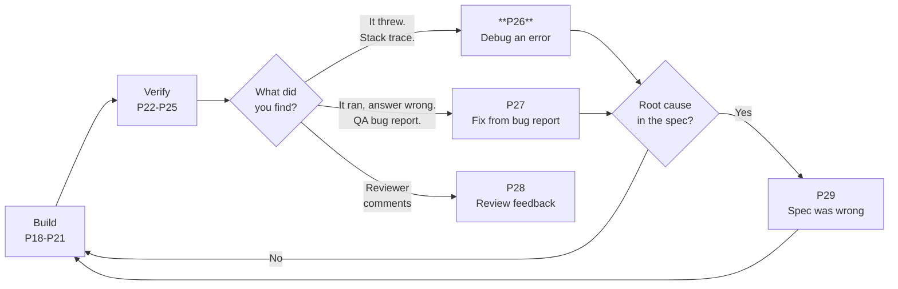
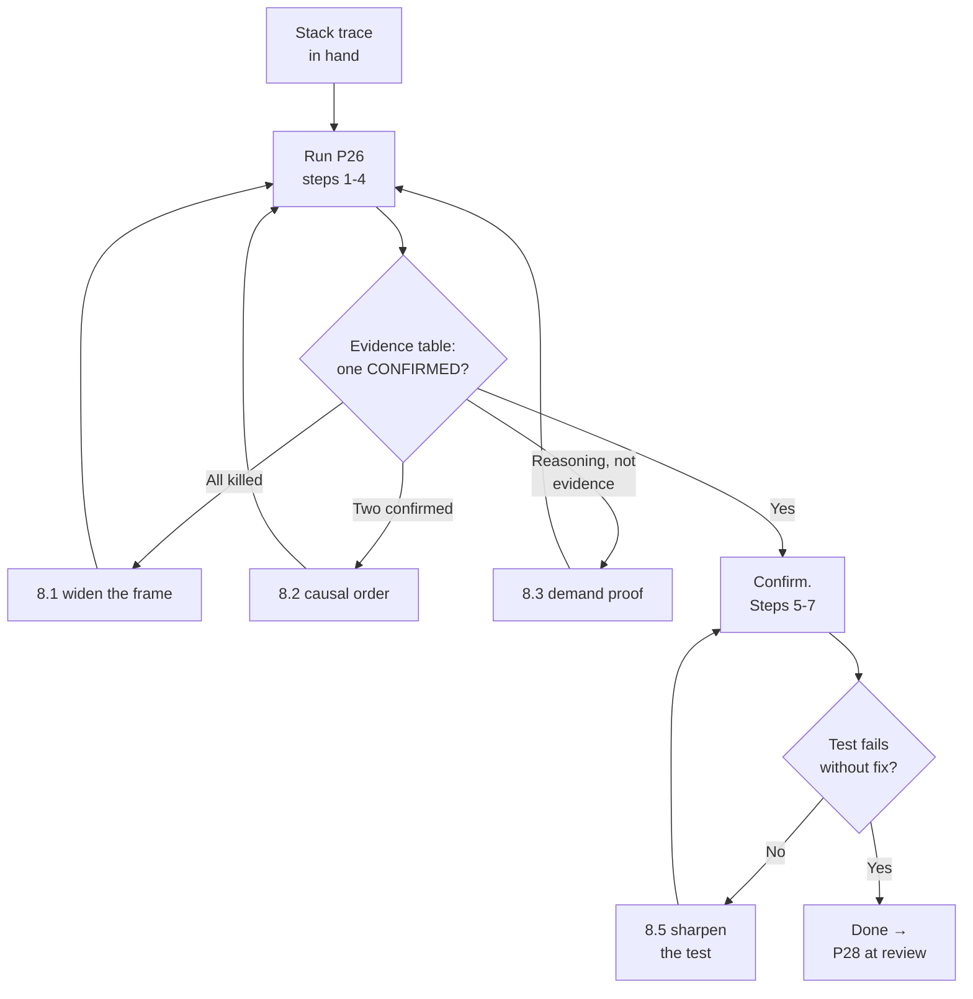

# P26 — Debug an Error Fast

← [Previous](../phase-5-verify/P25-data-quality-validation.md) · [Library index](../README.md) · Next: [P27](P27-fix-from-a-qa-bug-report.md)

> **One line:** Turn a stack trace into a ranked set of hypotheses, then kill them with evidence.

| | |
|---|---|
| **Phase** | 6 — Rework |
| **Who runs it** | Backend or Frontend Engineer (Ravi Mullick; Dzmitry  for UI errors) |
| **When** | The moment something throws — a failed Function invocation, a red test, a 500 in the browser console |
| **Takes in** | The stack trace or error output, the failing command, and the repo (`Case-Study/Python-ETL/code/doc_ingestion/`) |
| **Produces** | A root-cause statement, a minimal fix, a repo-wide sweep for the same pattern, and a regression test in `tests/` |
| **Hands off to** | Yourself, then Gautam  at review time via [P28](P28-respond-to-code-review-feedback.md) |
| **Time to run** | 20 minutes for a shallow bug, 90 minutes for a real one |

---

## 1. The scene

It is the last business day of the month. Northwind's counterparties all dump their statements at once, because everybody's month-end close lands on the same date. The normal 200 documents a day becomes something closer to 600 in four hours.

Ravi is not watching. He is in a sprint planning session with Atul. What he gets instead is an alert from Application Insights — that is Azure's telemetry service, the thing that collects logs, traces and exception records from a running app and lets you query them — saying that seventeen invocations of the ingestion Function failed in eleven minutes.

He opens the failure log and finds this:

```text
Traceback (most recent call last):
  File "/home/site/wwwroot/function_app.py", line 74, in on_blob_landed
    fields = extract_fields(blob_bytes, model_id=layout.model_id)
  File "/home/site/wwwroot/core/extract.py", line 61, in extract_fields
    result = poller.result()
  File "/home/site/wwwroot/.python_packages/azure/core/polling/_poller.py", line 261, in result
    self.wait(timeout)
azure.core.exceptions.HttpResponseError: (429) Too many requests
Code: 429
Message: Requests to the Analyze Document Operation under Document Intelligence
have exceeded call rate limit. Please retry after 4 seconds.
```

Pankaj files it as **NWD-141**, one line long: *"A 429 from Document Intelligence at month-end kills the run instead of backing off."* That is all the information anybody has.

Here is what Ravi does *not* do, and what he would have done eighteen months ago. He does not paste the traceback into a chat window with the words "fix this". He knows what he gets back if he does — a `try/except` wrapped around line 61 with a `time.sleep(5)` inside it, delivered with total confidence, that makes the alert stop and leaves the actual problem in place. That is not a fix. That is a bandage over a warning light.

**A stack trace tells you where the program noticed the problem. It almost never tells you where the problem is.** The gap between those two places is the whole job, and P26 is the prompt that forces the AI to walk that gap instead of jumping it.

---

## 2. What this prompt actually does — in plain language

### The fork in the road: is this an error, or a wrong answer?

This is the first thing to get straight, and it decides which prompt you reach for.

**An error** is when the program stopped. Something raised an exception, a process exited non-zero, a request came back 500, the browser console went red. There is a stack trace — a printed list of the function calls that were in flight when it blew up, innermost last. The program is telling you, loudly, that it could not continue.

**A wrong answer** is when the program ran to completion, reported success, and produced something incorrect. No exception. No red. Every log line says `INFO`. The pipeline wrote rows to Snowflake and the rows are wrong.

Those two need completely different attacks.

For an **error**, you have a free gift: the machine has already narrowed the search space for you. It told you a file, a line, and an exception type. Your job is to work *outward* from that point until you find the decision that made the exception inevitable. That is P26 — this file.

For a **wrong answer**, you have nothing. No line number, no exception type. You have a human — usually Pankaj — saying "this output is not what it should be". Your job is to build a reproduction from scratch, prove the failure with a test that fails, and only then look for the cause. That is [P27](P27-fix-from-a-qa-bug-report.md), and it is a different discipline with different steps.

Getting this fork wrong is expensive in one specific direction. If you run P26 on a wrong-answer bug, the AI has no stack trace to anchor on, so it invents one — it picks a plausible-looking line of code and reasons confidently from there. You end up with a fix to code that was never involved.

> **The test.** Did something throw? If yes, P26. If it ran clean and lied to you, P27.

### You are here



You are the top branch. The stack trace is what got you here.

### Why "just fix it" fails

Give a competent AI a traceback and no instructions, and it does something entirely reasonable and entirely useless. It reads the innermost frame, sees `poller.result()` raised a 429, and writes the code that makes that specific line stop raising. Usually a retry loop. Sometimes a broad `except Exception: pass`.

There are three things wrong with that, and they are worth naming individually because each one bites differently.

**It fixes the symptom, not the cause.** The 429 is Azure saying "you are calling me faster than your pricing tier allows". Wrapping the call in a sleep makes the message go away. It does not answer *why* we are calling too fast, whether the retry configuration we thought we had is actually running, or whether the same mistake exists in the three other Azure clients in the codebase.

**It fixes exactly one site.** If the root cause is a misconfigured client, that client is probably constructed the same wrong way somewhere else. In Northwind's codebase it was — three times. A fix that patches one call site leaves the other two waiting for the next month-end.

**It leaves nothing behind that would catch a regression.** Six months from now someone refactors the client factory, reintroduces the bug, and the tests stay green because no test ever asserted the behaviour. The alert fires again at month-end and nobody remembers this week.

### The discipline the prompt enforces

P26 is not a clever prompt. It is a **checklist that survives contact with an impatient engineer**. Every clause exists to stop one specific shortcut.

Here is the sequence, and what each step is for.

**Step 1 — Read the trace properly, innermost frame first.** A Python traceback prints oldest call first and newest call last, so the *bottom* frame is where the exception was raised and the *top* frame is where the request originally entered your code. Both matter. The bottom tells you what broke. The top tells you what asked for it. Everything in between is the path, and the path is usually where the real decision was made.

**Step 2 — State expected versus actual, in one sentence each.** This sounds like busywork. It is the single highest-value step in the whole list. Writing "I expected the call to be retried with a backoff and it instead propagated a 429 to the caller" forces you to commit to a belief about how the system was supposed to behave. Half the time, writing that sentence reveals you had no such belief — you assumed the SDK handled it and never checked. That assumption is now visible, and a visible assumption is testable.

*Backoff*, since we are naming things: when a service tells you to slow down, you wait before retrying, and you wait *longer* on each successive failure — one second, then two, then four. That is exponential backoff. Its purpose is to stop a thundering herd of clients all retrying in the same instant and re-creating the overload they were reacting to.

**Step 3 — Produce exactly three hypotheses, ranked.** Not one, not seven. One hypothesis means the AI has anchored and will spend the rest of the session defending it. Seven means it is listing possibilities rather than thinking. Three forces a genuine ranking, and the act of ranking forces a reason for the ranking.

**Step 4 — Kill each hypothesis with evidence, not reasoning.** This is the clause that does the most work, so it is worth being precise about it. *Evidence* means something the AI read or ran: the contents of a file, the output of a command, a log query result, a value printed from a debug run. *Reasoning* means "this is likely because Azure SDKs typically…". The prompt bans the second kind. If the AI wants to claim the retry policy is disabled, it has to show you the line that disables it.

**Step 5 — Fix the root cause, and say in one sentence why this is the root and not another symptom.** The test for "root cause" that actually works: if you fix this, does the entire class of failure become impossible, or just this instance of it?

**Step 6 — Search the repo for the same pattern.** This step is why P26 pays for itself. Bugs are rarely lonely. The mistake that caused this one was made by a person with a habit, and habits repeat. The prompt makes the AI go looking.

**Step 7 — Write a regression test that fails without the fix.** A *regression test* is a test written specifically to catch a bug coming back. The critical word in that sentence is **fails**. If the test passes with the fix reverted, it is not testing the fix — it is decoration. The prompt makes the AI prove the test fails first.

### What the AI is actually doing when this runs

It reads the traceback and maps each frame to a real file in the repo. It opens those files. It follows the construction of any object involved — in NWD-141, that meant chasing `extract_fields` back to the client factory in `core/clients.py`. It reads configuration. It reads whatever settings file governs the behaviour in question.

Then it does the thing that separates a useful debugging session from a guessing session: it looks for **the difference between what the code says and what you believed the code said**. Almost every non-trivial bug lives in that gap. Somebody believed retries were on. Somebody believed the field was always present. Somebody believed the list had one element.

The AI is good at finding those gaps *if you make it look*. Left alone it will assume the common case, because the common case is what it has seen most of.

### The stop gate, and why it is at the top of the prompt

A **stop gate** is an instruction that halts the AI mid-task and hands control back to you. The prompt puts one after the hypothesis ranking: the AI presents its three hypotheses and its evidence, and then stops. It does not write a fix until you say go.

Two reasons.

First, you know things the AI does not. You know it is month-end. You know the pricing tier was changed last Tuesday. You know a colleague deployed at 14:00. That context can eliminate a hypothesis in one sentence and save twenty minutes of investigation.

Second, and this is the honest one: **once an AI has written a fix, it is committed to the diagnosis behind that fix.** Ask it afterwards whether the diagnosis was right and it will defend it. Ask before, and it will still be genuinely uncertain, and genuine uncertainty is what you want at that moment.

### The one thing to remember

If you forget everything else in this file:

> **Make the AI prove the diagnosis before it is allowed to write the fix.** Everything else in the prompt is scaffolding around that one rule.

---

## 3. The prompt

Paste this into your AI coding tool with the repo open. Fill the bracketed placeholders first — the prompt is worth much less with them left generic.

```text
You are a senior [LANGUAGE] engineer debugging a failure in [PROJECT NAME].
Your goal is to find the ROOT CAUSE of the error below and fix it once, correctly.

**STOP GATE — read this before anything else.**
Do NOT write, edit, propose or sketch a fix until you have completed steps 1-4 and I
have replied "confirmed". If the evidence does not support any hypothesis, say so and
tell me exactly what evidence you need and how I can get it for you.

## The failure

Error output / stack trace:
[PASTE THE FULL STACK TRACE OR ERROR OUTPUT]

How it was triggered:
[THE COMMAND, ENDPOINT, TEST, OR EVENT THAT CAUSED IT]

When it started / how often it happens:
[E.G. "first seen 31 Jul, only at month-end, 17 times in 11 minutes"]

Relevant code:
[FILE PATHS THE TRACE MENTIONS, PLUS ANY YOU SUSPECT]

Known context the trace doesn't show:
[ANYTHING YOU KNOW: RECENT DEPLOYS, CONFIG CHANGES, LOAD, TIER LIMITS]

## Step 1 — Read the trace

**Quote** the innermost frame (where it was raised) and the outermost frame in our own
code (where the request entered). **List** every frame in between that belongs to us,
not to a library. For each of our frames, **say in one line** what that function was
trying to do.

## Step 2 — Expected vs actual

**Write** exactly two sentences:
- Expected: what should have happened at the point of failure.
- Actual: what did happen.
Then **state** the assumption that gap reveals. Name it plainly, e.g. "I assumed the
SDK retried 429s by default."

## Step 3 — Three hypotheses, ranked

**Produce** exactly three candidate root causes, ranked most to least likely. Not two,
not five. For each one give:
- The hypothesis, in one sentence.
- Why it would produce THIS trace specifically, not just a similar error.
- The single cheapest piece of evidence that would prove or kill it.

## Step 4 — Kill them with evidence

For each hypothesis, **go and get the evidence**. Read the file. Run the command.
Query the log. Then **fill in this table**:

| # | Hypothesis | Evidence gathered | Verdict |
|---|---|---|---|

Verdict is CONFIRMED, KILLED, or NEED MORE — never "likely" or "probably".
Evidence must be something you actually read or ran, quoted. An argument from how
libraries usually behave is NOT evidence and must be marked NEED MORE.

**STOP HERE.** Show me steps 1-4 and wait for "confirmed".

## Step 5 — Fix the root cause (only after I confirm)

**Write** the minimal change that removes the cause, not the symptom.
**State** in one sentence why this is the root and not another symptom, using this
test: if I ship this, does the entire class of failure become impossible, or only
this instance of it?
**Show** the change as a unified diff per file.

## Step 6 — Find the same mistake elsewhere

**Search** the repository for the same pattern. Report every other place the same
mistake exists, with file and line. If there are none, say "no other occurrences"
and name the search you ran so I can check it.

## Step 7 — Regression test

**Write** a test that FAILS on the current code and PASSES with your fix.
**Show** the test, and **show** the failure output you would expect with the fix
reverted. Put it in [TEST FILE PATH].

## Do not

- Do not wrap the failing line in try/except to make the error disappear.
- Do not add a bare `except Exception` or an empty catch block anywhere.
- Do not add a fixed `sleep()` as a retry strategy.
- Do not refactor anything the fix does not require. No renames, no reformatting,
  no "while I was in here" improvements.
- Do not change more than [MAX FILES] files without telling me why first.
- Do not claim a library behaves a certain way without opening it or citing docs.
- Do not skip step 6 because the fix "obviously only applies here".

## You are done when

- The evidence table has one CONFIRMED and two KILLED.
- The diff changes the cause, and you have said why it is the cause.
- Step 6 has an answer, even if that answer is "no other occurrences".
- The regression test fails without the fix and passes with it, and you have shown
  both outputs.

Save a short write-up of steps 1-5 as a comment on the ticket [TICKET ID]. Save the
test in [TEST FILE PATH].
```

---

## 4. Every placeholder, explained

| Placeholder | What to put in it | Northwind example | What happens if you get it wrong |
|---|---|---|---|
| `[LANGUAGE]` | The language and, if it matters, the runtime and major framework | `Python 3.11 on Azure Functions (v2 programming model)` | The AI writes idiomatic code for the wrong stack — `asyncio` retry loops in a sync Function, or a `@app.route` decorator that does not exist in your version |
| `[PROJECT NAME]` | The system, in enough words that the AI can orient | `the Northwind counterparty document ingestion pipeline` | Generic advice. It will not know that a failed document has a defined destination (the exception queue) rather than being dropped |
| `[PASTE THE FULL STACK TRACE OR ERROR OUTPUT]` | The **whole** trace, top to bottom, unedited, including the library frames | The eleven-line traceback from §1, including the Azure `Retry after 4 seconds` message | Truncate it and you delete the evidence. The `Please retry after 4 seconds` line is what proves the service is *telling* us how to back off, which kills one hypothesis outright |
| `[THE COMMAND, ENDPOINT, TEST, OR EVENT THAT CAUSED IT]` | Exactly how to make it happen, or the trigger if you cannot | `blob landed at raw/broker_alpha/2026-07-31/BA_POS_20260731_0142.pdf; queue worker picked it up` | The AI proposes a reproduction you cannot run, and you lose an hour arguing with it |
| `[E.G. "first seen 31 Jul, only at month-end..."]` | Frequency and timing. "Always" and "only under load" point at completely different causes | `first seen 31 Jul 14:02 IST; 17 failures in 11 minutes; never seen on a normal day` | "Only at month-end" is the single biggest clue in NWD-141. Omit it and rate limiting drops down the hypothesis list |
| `[FILE PATHS THE TRACE MENTIONS, PLUS ANY YOU SUSPECT]` | Every file in the trace, plus the ones you suspect even if they are not in it | `core/extract.py`, `core/clients.py`, `config/settings.py`, `function_app.py` | The AI reads only what the trace names, and the root cause is almost never in the file that threw |
| `[ANYTHING YOU KNOW: RECENT DEPLOYS, CONFIG CHANGES...]` | The things a human knows and a log does not | `S0 tier, not F0. 8 concurrent queue workers. No deploy since 24 Jul.` | The AI wastes a hypothesis on the free tier, which you already ruled out |
| `[MAX FILES]` | How wide a blast radius you will accept without a conversation | `3` | Leave it blank and a two-line fix arrives as a fourteen-file refactor you cannot review |
| `[TEST FILE PATH]` | Where the regression test goes, matching the repo's existing layout | `tests/test_extract.py` | The AI invents a new test file with a new fixture style, and your test suite grows a second personality |
| `[TICKET ID]` | The bug ID, so the write-up lands somewhere findable | `NWD-141` | The diagnosis lives in a chat window that closes, and the next person repeats the whole investigation |

---

## 5. The filled-in example

Ravi runs this at 14:40 on the last business day of July, twenty minutes after the alert, with the `doc_ingestion` repo open.

```text
You are a senior Python 3.11 / Azure Functions (v2 programming model) engineer
debugging a failure in the Northwind counterparty document ingestion pipeline.
Your goal is to find the ROOT CAUSE of the error below and fix it once, correctly.

**STOP GATE — read this before anything else.**
Do NOT write, edit, propose or sketch a fix until you have completed steps 1-4 and I
have replied "confirmed". If the evidence does not support any hypothesis, say so and
tell me exactly what evidence you need and how I can get it for you.

## The failure

Error output / stack trace:
Traceback (most recent call last):
  File "/home/site/wwwroot/function_app.py", line 74, in on_blob_landed
    fields = extract_fields(blob_bytes, model_id=layout.model_id)
  File "/home/site/wwwroot/core/extract.py", line 61, in extract_fields
    result = poller.result()
  File "/home/site/wwwroot/.python_packages/azure/core/polling/_poller.py", line 261, in result
    self.wait(timeout)
azure.core.exceptions.HttpResponseError: (429) Too many requests
Code: 429
Message: Requests to the Analyze Document Operation under Document Intelligence
have exceeded call rate limit. Please retry after 4 seconds.

How it was triggered:
A blob landed at raw/broker_alpha/2026-07-31/BA_POS_20260731_0142.pdf. The queue
worker picked it up and called extract_fields. Same trace for 17 blobs.

When it started / how often it happens:
First seen 31 Jul 14:02. 17 failures in 11 minutes, all between 14:02 and 14:13.
Never seen on a normal trading day. Month-end volume is roughly 600 documents in
four hours against a normal 200 per day.

Relevant code:
core/extract.py, core/clients.py, config/settings.py, function_app.py,
core/translate.py, core/redact.py

Known context the trace doesn't show:
- We are on the S0 (standard) tier of Azure AI Document Intelligence, not F0.
- 8 concurrent queue workers, set in host.json.
- No deploy since 24 Jul. Config unchanged since 18 Jul.
- The failed documents were NOT sent to the exception queue. They were
  dead-lettered by the queue, which is not the behaviour we designed.

## Step 1 — Read the trace
[... steps 1-7 exactly as in the library prompt ...]

## Do not
[... as in the library prompt ...]
- Do not change more than 3 files without telling me why first.

## You are done when
[... as in the library prompt ...]

Save a short write-up of steps 1-5 as a comment on NWD-141. Save the test in
tests/test_extract.py.
```

Note what he added that the template did not ask for: the last bullet in *Known context*. The dead-lettering is a second symptom he noticed while reading logs. He did not know it was related. It turned out to be half the fix.

---

## 6. What comes back

The AI works for about four minutes, reading five files, then stops at the gate. This is the output, lightly abridged.

````markdown
## Step 1 — Reading the trace

**Innermost frame (raised here):**
`azure/core/polling/_poller.py:261` in `result()` → `self.wait(timeout)`
This is inside the Azure SDK, not our code. The exception surfaced while the
long-running operation poller was waiting on the analyze job.

**Outermost frame in our code (entry point):**
`function_app.py:74` in `on_blob_landed` → `extract_fields(blob_bytes, ...)`
This is the blob-triggered Function handler.

**Our frames in between:**

| Frame | What it was trying to do |
|---|---|
| `function_app.py:74` `on_blob_landed` | Handle one landed PDF end to end |
| `core/extract.py:61` `extract_fields` | Submit the PDF to the custom extraction model and wait for the result |

Only two frames are ours. The failure is at the boundary between our code and the
Azure SDK, which means the interesting decision is almost certainly in how we
*constructed* the SDK client, not in how we called it.

## Step 2 — Expected vs actual

- **Expected:** a 429 from Document Intelligence is retried automatically by the
  azure-core pipeline, honouring the `Retry-After: 4` the service returned, and
  `extract_fields` eventually returns a result.
- **Actual:** the 429 propagated out of `poller.result()` on the first occurrence,
  `extract_fields` raised, `on_blob_landed` did not catch it, and the queue message
  was dead-lettered.

**Assumption this reveals:** I assumed azure-core's default retry policy was active
on this client and covered the poller's status requests. I have not checked either
half of that.

## Step 3 — Three hypotheses, ranked

**H1 — Retry is disabled or misconfigured on the DocumentIntelligenceClient we build.**
Would produce this trace because a 429 with `Retry-After` present is exactly what
azure-core retries by default; seeing it escape means something turned that off.
Cheapest evidence: read the client construction in `core/clients.py`.

**H2 — Retry is on, but 8 concurrent workers exceed the S0 transactions-per-second
limit badly enough that we exhaust the retry budget.**
Would produce this trace because after `retry_total` attempts azure-core re-raises
the last response. Cheapest evidence: the failure timestamps. If retries happened,
the gap between the first attempt and the exception would be several seconds.

**H3 — The exception is not from the initial submit but from a poller status GET,
which the client-level retry policy does not cover.**
Would produce this trace because the frame is `_poller.py:261`, not the submit call.
Cheapest evidence: check whether `begin_analyze_document`'s polling method inherits
the client's pipeline.

## Step 4 — Evidence

**H1.** Read `core/clients.py` lines 28-44:

```python
def get_document_client() -> DocumentIntelligenceClient:
    return DocumentIntelligenceClient(
        endpoint=settings.DOCINTEL_ENDPOINT,
        credential=DefaultAzureCredential(),
        retry_total=0,          # TODO(Ravi): fail fast while iterating locally
        connection_timeout=30,
    )
```

`retry_total=0` disables the retry policy entirely. The comment is dated by
`git blame` to commit `a41c9e2`, 12 Jun, message "speed up local loop".

**H2.** From Application Insights, `customDimensions.durationMs` for the 17 failed
invocations ranges 812-1104 ms. A single retry honouring `Retry-After: 4` would put
the floor above 4000 ms. No retry occurred. H2 depends on retries existing.

**H3.** In azure-ai-documentintelligence 1.0.0, `begin_analyze_document` builds its
poller from the same `_client._pipeline`, so the polling GETs run through the same
policy chain — including the disabled retry policy. H3 collapses into H1: the poller
is not a separate path, it is the same disabled path.

| # | Hypothesis | Evidence gathered | Verdict |
|---|---|---|---|
| H1 | Retry disabled on the client | `retry_total=0` at `core/clients.py:32`, committed 12 Jun as a local-dev shortcut | **CONFIRMED** |
| H2 | Retry budget exhausted under load | All 17 failures completed in 812-1104 ms; a single honoured `Retry-After: 4` would exceed 4000 ms | **KILLED** |
| H3 | Poller GETs bypass the retry policy | Poller reuses `_client._pipeline`; same policy chain | **KILLED** (reduces to H1) |

**Note before you confirm.** You mentioned the documents were dead-lettered rather
than sent to the exception queue. That is a *second*, independent defect:
`function_app.py:74` has no handler for a transient extraction failure, so any
exception escapes to the queue runtime. Fixing retries alone would hide it until the
next time retries genuinely run out. I recommend fixing both. Say the word and I
will include it.

**STOPPING HERE.** Waiting for "confirmed".
````

Ravi replies: `confirmed — and yes, fix the dead-lettering too.` The AI continues.

````markdown
## Step 5 — The fix

**Root cause:** every Azure AI client in this codebase is constructed with retries
disabled, because a local-development shortcut from 12 Jun was committed. Under
normal volume we never hit a 429, so nothing surfaced it for seven weeks.

**Why this is the root and not a symptom:** with retries restored and `Retry-After`
honoured, the entire class "transient throttling response kills the run" becomes
impossible, for every Azure AI call in the pipeline, not just extraction. A retry
loop around line 61 would fix one call site and one status code.

```diff
--- a/core/clients.py
+++ b/core/clients.py
@@ -1,10 +1,26 @@
 from azure.identity import DefaultAzureCredential
 from azure.ai.documentintelligence import DocumentIntelligenceClient
+from azure.core.pipeline.policies import RetryPolicy
 from config import settings
 
+# Throttling (429) and transient server errors are expected at month-end, when
+# counterparty volume triples. azure-core honours the service's Retry-After
+# header when a retry policy is present. See NWD-141.
+def _retry_policy() -> RetryPolicy:
+    return RetryPolicy(
+        retry_total=5,
+        retry_backoff_factor=1.0,
+        retry_backoff_max=60,
+        retry_on_status_codes=[429, 500, 502, 503, 504],
+        respect_retry_after_header=True,
+    )
+
 
 def get_document_client() -> DocumentIntelligenceClient:
     return DocumentIntelligenceClient(
         endpoint=settings.DOCINTEL_ENDPOINT,
         credential=DefaultAzureCredential(),
-        retry_total=0,          # TODO(Ravi): fail fast while iterating locally
+        retry_policy=_retry_policy(),
         connection_timeout=30,
     )
```

```diff
--- a/function_app.py
+++ b/function_app.py
@@ -68,10 +68,20 @@ def on_blob_landed(blob: func.InputStream) -> None:
     layout = classify(blob_bytes)
-    fields = extract_fields(blob_bytes, model_id=layout.model_id)
+    try:
+        fields = extract_fields(blob_bytes, model_id=layout.model_id)
+    except HttpResponseError as exc:
+        if exc.status_code == 429:
+            # Retries are already exhausted by the time we see this. This is a
+            # capacity problem, not a document problem: the document is fine and
+            # must not be dead-lettered. Requeue with a visibility delay.
+            log.warning("throttled_after_retries", extra={"blob": blob.name})
+            raise TransientCapacityError(blob.name) from exc
+        raise
```

## Step 6 — The same mistake elsewhere

Search run: `rg "retry_total\s*=\s*0" --type py`

| File | Line | Client |
|---|---|---|
| `core/clients.py` | 32 | Document Intelligence — **fixed above** |
| `core/translate.py` | 19 | Azure AI Translator |
| `core/redact.py` | 24 | Azure AI Language (PII detection) |

All three carry the same `TODO(Ravi): fail fast while iterating locally` comment
and the same commit `a41c9e2`. Translation and redaction have the same month-end
exposure. Recommend routing all three through `_retry_policy()` in `core/clients.py`
so there is one place to change it.

Note: redaction fails closed by design, so a throttled PII call currently persists a
marker instead of the text. That is correct behaviour but it is silently degrading
output under load. Worth a ticket of its own.

## Step 7 — Regression test

```python
# tests/test_extract.py

def test_429_is_retried_and_honours_retry_after(monkeypatch):
    """NWD-141: a throttling response must be retried, not propagated."""
    calls = []

    class FakeTransport(HttpTransport):
        def send(self, request, **kwargs):
            calls.append(request)
            if len(calls) == 1:
                return _response(429, headers={"Retry-After": "1"})
            return _response(200, json=_MINIMAL_ANALYZE_RESULT)

    client = build_document_client(transport=FakeTransport())
    result = extract_fields(_PDF_BYTES, model_id="broker-alpha-position-v3",
                            client=client)

    assert len(calls) == 2, "expected one retry after the 429"
    assert result.fields  # the retry produced a usable result
```

With the fix reverted (`retry_total=0` restored) this fails as:

```text
E   azure.core.exceptions.HttpResponseError: (429) Too many requests
tests/test_extract.py:118: HttpResponseError
```

With the fix in place: `1 passed`.
````

### How to read this

Three parts matter more than the rest.

**The evidence table is the product.** Not the diff. The table is what you would put in the ticket, what you would show Gautam in review, and what stops the next person re-running this investigation in September. Notice that every cell in the *Evidence gathered* column contains something concrete — a line number, a commit hash, a measured duration. Nothing says "typically" or "usually".

**Step 6 found two more instances.** That is the step people delete from the prompt because it feels like scope creep, and it is the step that turns a one-ticket fix into a fixed system. Two more month-end outages did not happen because of eleven lines of `rg` output.

**The AI volunteered a second defect and asked before acting on it.** The dead-lettering was in Ravi's *Known context* block, not in the trace. The AI noticed it did not fit, flagged it, and stopped. That behaviour is a direct product of the stop gate — an AI that has already started writing a fix does not pause to ask about scope.

**The part that is commonly wrong:** the regression test. Read it sceptically every time. This one asserts `len(calls) == 2`, which proves a retry happened. A weaker version would assert only `result.fields` is truthy, which passes for the wrong reason — it would pass if the fake transport returned 200 on the first call. **A regression test that does not assert the specific mechanism you fixed is not a regression test.** Ask yourself: what would break this test? If the answer is "almost anything", it is too broad. If the answer is "only the bug coming back", it is right.

---

## 7. Why this is the final prompt

### What "done" means here

Done is not "the error stopped". Done is: **you can explain, to someone who was not in the room, why this failure was inevitable given the code, and you have left behind a test that will fail the moment it becomes inevitable again.**

Those two conditions are checkable by another human, which is the point. "The alert cleared" is not checkable — alerts clear for all sorts of reasons, including the load going away.

### The checklist

- [ ] The evidence table has exactly one **CONFIRMED** and the rest **KILLED**. No "likely", no "probably", no two confirmed rows fighting each other.
- [ ] Every *Evidence gathered* cell contains something read or run — a line number, a query result, a measured value — not an argument about how libraries normally behave.
- [ ] The root-cause sentence passes the class test: fixing this makes the whole class of failure impossible, not just this instance.
- [ ] The diff touches the cause. If the diff is entirely inside a `try` block wrapped around the line in the trace, go back.
- [ ] Step 6 has an answer, and if the answer is "no other occurrences" you have seen the search command and believe it.
- [ ] You have run the regression test with the fix **reverted** and watched it fail. Not "the AI says it would fail" — watched it.
- [ ] The write-up is on the ticket, not in a chat window.

### Why you should stop rather than keep prompting

The failure mode of over-prompting a debugging session is specific and predictable: **the AI starts hardening code that has nothing to do with the bug.**

You ask "anything else?" and it finds the missing timeout on an unrelated HTTP call, the broad exception handler in the SQL sink, the log line that should be a warning. All true. All worth doing. None of them are NWD-141, and every one of them makes the diff harder to review and the revert harder to perform.

The discipline is: **one bug, one diff, one ticket.** Everything else the AI noticed goes on a list. Ravi kept a running note called `found-while-debugging.md` and fed it into [P36 — Tech Debt Triage](../phase-8-improve/P36-tech-debt-triage.md) at the end of the sprint. Hem read it. Two items became stories. The rest were correctly ignored.

The second failure mode is subtler. If you keep pushing after the evidence table is complete, the AI will start generating *more* hypotheses, because you have implicitly told it three were not enough. Hypotheses four through nine are always worse than one through three, and evaluating them costs the same. Stop at the confirmed row.

### The signal that you are NOT done

**You cannot say, in one sentence and without the word "probably", why the error happened.** If your explanation still needs a hedge, the evidence table has a lie in it somewhere, and §8 is where you go.

---

## 8. When it is not done — the follow-up prompts

| What you're seeing | What's actually wrong | Run this next |
|---|---|---|
| All three hypotheses came back KILLED | The real cause is outside the code the AI was given — config, infrastructure, data, or another service | §8.1 |
| Two hypotheses came back CONFIRMED | They are not independent. One is a consequence of the other, and the AI has not worked out which way round | §8.2 |
| The evidence column says "typically", "usually", "in most SDKs" | The AI reasoned instead of reading. It has not opened the file it is describing | §8.3 |
| The fix is a `try/except` around the line in the trace | It fixed the symptom. The stop gate did not hold, usually because the trace was pasted with the words "fix this" above it | §8.4 |
| The regression test passes with the fix reverted | The test does not exercise the bug. It asserts something true both before and after | §8.5 |
| The error is intermittent and you cannot reproduce it | You do not have an error you can attack yet; you have a report. Get a reproduction first | §8.6 |
| The root cause is "the code does what the spec said, and the spec is wrong" | This is no longer a bug fix | **[P29](P29-the-spec-was-wrong.md)** |
| The code never threw — it produced a wrong answer | Wrong prompt entirely | **[P27](P27-fix-from-a-qa-bug-report.md)** |
| The AI has now made the same failed fix twice | It is stuck, and more prompting will not help | **[P30](P30-when-the-ai-is-stuck.md)** |

### 8.1 "All three hypotheses were killed"

Use this when the evidence table comes back with no confirmed row. That is not a failure — it is information. It means the cause is outside the material you supplied.

```text
All three hypotheses are KILLED. Do not generate three more.

Instead, **widen the frame**. The cause is outside what I gave you.

**List** every input to the failing code path that is NOT source code:
environment variables, config files, the contents of the blob, the pricing tier,
the identity the process runs as, the state of the database, the clock.

For each one, **say**:
- What value it would need to have for this exact trace to appear.
- How I can check its actual value in under two minutes.

**Rank** them by how cheap the check is. Do not propose a fix. I will go and look.
```

What changes: you get a checklist of things to go and inspect outside the repo, ordered cheapest first, instead of three more code-shaped guesses. In Northwind this is how a "bug" turned out to be a managed identity that had lost its `Cognitive Services User` role assignment during a subscription move.

### 8.2 "Two hypotheses are both confirmed"

Use this when the table has two CONFIRMED rows and you cannot tell which one to fix.

```text
You have two CONFIRMED hypotheses. They cannot both be the root cause.

**Determine the causal order.** For the pair, answer:
- If I fixed only H[A], would H[B] still occur? Show the reasoning against the code.
- If I fixed only H[B], would H[A] still occur?

Exactly one of those answers should be "no". That one is downstream, and it is a
symptom. **Name** the upstream cause and demote the other to a consequence.

If both answers are "yes", they are independent defects that happen to share a
trace. **Say so plainly** and I will raise a second ticket. Do not fix both in one
change.
```

What changes: you get a causal ordering instead of a list, and — the useful outcome — sometimes you learn you have two tickets, not one. Ravi hit this on NWD-141: throttling and dead-lettering were genuinely independent, and saying so out loud is what kept the diff reviewable.

### 8.3 "The evidence is just reasoning"

Use this when the *Evidence gathered* column reads like a paragraph from a blog post about the library.

```text
Row [N] of your evidence table is reasoning, not evidence. "[QUOTE THE CELL]" is a
claim about how the library behaves. You have not shown me that it behaves that way
here, in this version, in this repo.

**Re-do that row only.** Evidence means one of:
- A quoted block of source, with file path and line numbers, from our repo or from
  the installed package under .venv / .python_packages.
- The output of a command, with the command shown.
- A log or telemetry query result, with the query shown.
- A value printed from a run you actually performed.

If you cannot get any of those, mark the row **NEED MORE** and tell me the one
command I should run to settle it.
```

What changes: the row either becomes real or becomes honest. Both are progress. The pattern to watch for is an AI that describes the behaviour of a *newer or older* version of a library than the one you have pinned — that is where confident-but-wrong lives.

### 8.4 "It wrapped the failing line in try/except"

Use this when the diff makes the error disappear without addressing why it happened.

```text
Your fix catches the exception at the point it was raised. That is a symptom fix.

**Revert it mentally and answer three questions:**
1. What condition in the system made this exception the correct thing for the
   library to raise? (The library is probably not wrong.)
2. What in OUR code created that condition?
3. What would have to be true for the library to never need to raise it?

Then **propose the fix that makes (3) true.** If the answer genuinely is "the
library is right, the condition is legitimate, and we must handle it" — say that
explicitly, and show me where the handling belongs, which is almost never the line
that threw.
```

What changes: the fix moves up the stack to where the decision was made. In NWD-141 that moved it from `core/extract.py:61` to `core/clients.py:32`, three files and one abstraction layer away — which is where fixes usually live.

### 8.5 "The regression test passes with the fix reverted"

Use this when you revert the fix, run the test, and it stays green.

```text
I reverted your fix and your test still passes. It is therefore not testing the bug.

**Work backwards.** State the single observable difference between the buggy code
and the fixed code — one sentence, expressed as something a test can assert.

Then **rewrite the test to assert exactly that difference and nothing else.** Do not
assert that the function returns successfully; assert the mechanism. For a retry
bug, assert the number of attempts. For an ordering bug, assert the order. For a
missing-data bug, assert the count.

Finally **show me the exact failure message** the new test produces on the buggy
code, so I can verify it myself.
```

What changes: the test gets narrower and sharper. The instruction to assert "the mechanism, not the outcome" is what separates a test that catches the regression from a test that catches almost nothing.

### 8.6 "I cannot reproduce it"

Use this when the error appears in production logs and never on your machine.

```text
I cannot reproduce this locally. Before you propose any fix, **help me build a
reproduction.**

**Compare** the failing environment to mine along these axes and tell me which
differences could plausibly matter:
concurrency, data volume, input size, input content, credentials and roles,
service tier and quota, region, package versions, clock and timezone, warm vs
cold start.

For the top two differences, **write** the smallest possible harness that
recreates that condition locally — a script, a test with a fake transport, a
docker command. Show me the harness, not a description of it.

If a condition genuinely cannot be recreated locally, **say so** and tell me what
instrumentation to add so the next occurrence in production tells us what we need.
Do not fix a bug you cannot make happen.
```

What changes: you stop guessing. Half the time the harness reveals the cause on its own, because writing "the smallest thing that makes this happen" is itself an act of diagnosis.

### The loop



---

## 9. How this goes wrong

### You paste the trace and the words "fix this" in the same message

This is the most common failure and it is entirely self-inflicted. The stop gate is at the top of the prompt for a reason, and the reason evaporates if the surrounding message says "fix this". The AI reads intent, not just instructions, and a direct imperative outranks a procedural gate almost every time.

Why it happens: you are under pressure, the alert is firing, and the checklist feels like ceremony. It is not ceremony. On NWD-141 the checklist is what found the two extra `retry_total=0` instances, and finding those is the difference between one outage and three.

The fix: paste the prompt clean, with nothing above or below it. If you catch yourself typing "just", "quickly" or "obviously", delete the message and start again.

### The trace was truncated to "the interesting bit"

Everyone does this. The trace is forty lines, thirty-two of them are library internals, so you paste the top and bottom and drop the middle. Then the AI cannot see that the call went through the retry policy, or through a thread pool, or through a decorator that swallows the original context.

In NWD-141 the line that mattered most was not in our code at all. It was `Please retry after 4 seconds` in the service's response body. That single phrase proves Azure was actively telling the client how to back off — which is what kills the "the service just refuses under load" hypothesis and points straight at "we are not listening". Trim it out and you lose the fastest route to the answer.

The fix: paste the whole thing. If it is genuinely enormous, paste the whole thing and say "frames 12-40 are library internals" rather than deleting them. Let the AI decide what is boring.

### The AI describes the wrong version of the library

You have `azure-ai-documentintelligence` pinned at 1.0.0. The AI describes the behaviour of the preview SDK, which had a different client class and a different retry surface. Every sentence is confident and internally consistent and wrong.

This is the most dangerous failure mode in P26 because it produces evidence-shaped output. A paragraph explaining exactly how the poller inherits the pipeline *looks* like the evidence column is doing its job.

The fix is mechanical: make the AI read the installed package. Not the docs, not its memory — the code sitting in `.venv/lib/python3.11/site-packages/` or `.python_packages/`. Add one line to the prompt: *"When you describe library behaviour, quote the installed source with its path. If you cannot find it, say so."* Follow-up §8.3 is the recovery when you catch it late.

### You fix it, and then keep going

The alert clears. The test passes. And you are still in the session, and the AI is still helpful, and it mentions that `core/redact.py` has a broad exception handler. Twenty minutes later the diff is nine files and Gautam rejects it at review because he cannot tell which change fixed the bug.

This one hurt at Northwind. Ravi's first NWD-141 pull request touched `clients.py`, `translate.py`, `redact.py`, `function_app.py`, `logging_config.py` and two tests. Gautam's review comment was four words: *"Which line fixed it?"* The PR was split into three, and the split took longer than the original fix.

The fix: decide the blast radius *before* you start, put it in `[MAX FILES]`, and treat exceeding it as a conversation rather than a decision the AI makes on your behalf. Everything else goes in a note for [P36](../phase-8-improve/P36-tech-debt-triage.md).

### This is the wrong prompt entirely

P26 assumes a stack trace. Three situations look like they need it and do not.

**No exception, wrong output.** The pipeline ran, said `INFO: 1 document processed`, and wrote fourteen positions where the statement had forty-seven. Nothing threw. There is no innermost frame. Use [P27](P27-fix-from-a-qa-bug-report.md), which starts by building a reproduction rather than reading one.

**The code is correct and the specification is not.** You find the root cause, and the root cause is that `spec-confidence-gate.md` says to do exactly the thing that is causing the problem. Fixing the code now creates a worse problem: the code and the spec disagree, and the next person to read the spec is misled. Use [P29](P29-the-spec-was-wrong.md).

**The AI has now failed twice in the same way.** Two rounds of hypotheses, two fixes, two failures, and the third attempt looks a lot like the first. More prompting will not help; the session's context is now mostly wrong turns. Use [P30](P30-when-the-ai-is-stuck.md), and be prepared for its central and unpopular recommendation.

---

## 10. The handoff

The immediate handoff is to yourself, ten minutes later, when you open the pull request. The evidence table becomes the PR description. That is not a nice-to-have — Gautam's review prompt in [P23](../phase-5-verify/P23-review-someone-elses-code.md) explicitly asks "what problem does this change solve and how do we know", and a PR that answers that question in a table gets reviewed in five minutes instead of thirty.

The second handoff is to Gautam, and it comes back to you as review comments. When it does, you run [P28 — Respond to Code Review Feedback](P28-respond-to-code-review-feedback.md), which is the prompt for sorting his comments into "real defect", "preference" and "this is unclear" before you touch anything.

The third handoff is conditional and it is the one people miss. If step 5's root cause turned out to be *"the code does what the spec told it to do"* — then you are not holding a bug, you are holding a specification defect. Stop, and run [P29 — The Spec Was Wrong](P29-the-spec-was-wrong.md) with Hem. NWD-141 did not go down this path; NWD-142 did, and that is why P29 exists.

> **Artifact contract — the NWD-141 write-up on the ticket**
> Anyone reading this comment can rely on finding:
> - The full stack trace, unedited.
> - An evidence table with exactly one CONFIRMED row and a verdict for every hypothesis considered.
> - A one-sentence root-cause statement that names a file and a line.
> - The result of the repo-wide search for the same pattern, including the search command.
> - The path of the regression test, and confirmation that it was observed failing with the fix reverted.
>
> If any of those is missing, the artifact is not done — go back to §7.

---

## 11. In the case study

NWD-141 lands in [`07-sprint-3-verify.md`](../../Case-Study/Python-ETL/07-sprint-3-verify.md) as a footnote and gets fixed at the start of [`08-sprint-3-rework.md`](../../Case-Study/Python-ETL/08-sprint-3-rework.md). It is deliberately the *small* bug in that chapter — the warm-up before NWD-142, which is the one that eats the sprint.

The thing that actually happened, and that readers remember: Ravi ran P26, got a clean evidence table, and then argued with it. He did not believe `retry_total=0` was in the repo, because he remembered writing it and he remembered taking it out. He had taken it out — on a branch that was never merged. The `git blame` line in the evidence table settled it in about four seconds. **The value of "quote the evidence with a file and a line" is not that the AI needs the discipline. It is that you need something to argue against that cannot argue back.**

The second thing worth noting is the scope fight. Ravi's first PR touched seven files, Gautam asked "which line fixed it", and the PR was split. Atul then pointed out at standup that the split cost more than the fix and asked whether the team should just set a file limit. That conversation is why `[MAX FILES]` is in the template, and it is why the team's [definition of done](../../Case-Study/Python-ETL/artifacts/definition-of-done.md) grew a line about single-purpose pull requests.

The lasting artifact is smaller than either. `core/clients.py` gained one shared `_retry_policy()` function used by all three Azure AI clients, so the next time somebody needs to change retry behaviour there is exactly one place to change it. Hem liked that enough to note it in the sprint 3 retrospective as the pattern to copy: **when the same mistake appears three times, the fix is not three fixes — it is one place where the decision now lives.**

---

← [Previous](../phase-5-verify/P25-data-quality-validation.md) · [Library index](../README.md) · Next: [P27](P27-fix-from-a-qa-bug-report.md)
