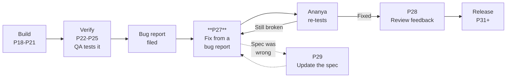
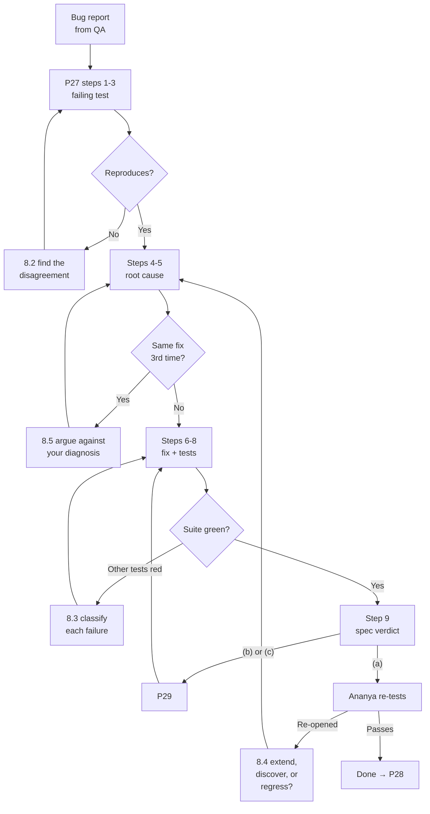

# P27 — Fix From a QA Bug Report

← [Previous](P26-debug-an-error-fast.md) · [Library index](../README.md) · Next: [P28](P28-respond-to-code-review-feedback.md)

> **One line:** Turn a QA bug report into a failing test, a proven root cause, and a fix that holds.

| | |
|---|---|
| **Phase** | 6 — Rework |
| **Who runs it** | Backend or Frontend Engineer (Tomas Vargas; Ji-woo Park for UI defects) |
| **When** | QA has tested a story you marked done and filed a defect against it |
| **Takes in** | The bug report (`Case-Study/Python-ETL/artifacts/bug-NWD-142.md`), the story it belongs to, the spec that story was built from, and the repo |
| **Produces** | A failing test that reproduces the defect, a root-cause statement, a fix, a regression test, and a verdict on whether the spec was wrong |
| **Hands off to** | Ananya Iyer to re-test; Sofia Marchetti via [P29](P29-the-spec-was-wrong.md) if the spec is implicated; Rahul Nair at review via [P28](P28-respond-to-code-review-feedback.md) |
| **Time to run** | Half a day for a real defect. NWD-142 took Tomas a day and a half. |

---

## 1. The scene

It is Wednesday of Sprint 3. The story is closed. The tests are green. Tomas moved `NWD-103 — Gate every extracted field on its confidence score` to Done eleven days ago, and the pipeline has been running against real Broker Alpha statements since.

Then Priya Raman, the operations analyst at Northwind who used to type these PDFs into a spreadsheet by hand, sends a message that is three words long and ruins everybody's morning:

> "The recon's wrong."

She has attached a screenshot of the break report. Sixteen positions on the Broker Alpha book, all flagged `MISSING_EXTERNAL` — meaning Aladdin, Northwind's internal portfolio system, thinks Northwind holds them, and the counterparty statement apparently does not mention them at all. Sixteen missing positions on a single day is not a data quality wobble. That is the shape of a counterparty failing to settle. If it were real, someone would be on the phone to Broker Alpha's operations desk within the hour.

It is not real. Ananya spends the afternoon on it and files **NWD-142**.

What she finds is this. The Broker Alpha daily position statement for 29 July was three pages. The positions table starts on page 1 and continues onto page 2 — the header row does not repeat, the table just keeps going. Forty-seven positions in total: thirty-one on page 1, sixteen on page 2. The pipeline extracted thirty-one.

And here is the part that makes Tomas put his coffee down. **Nothing failed.** No exception. No 429. No log line above `INFO`. The confidence gate — the checkpoint that is supposed to be the whole safety mechanism of this system — looked at all thirty-one extracted positions, found every single field above threshold, and waved the document through. Because it was right. Every field it examined *was* high confidence. The gate was never shown the sixteen rows that were missing, so it had nothing to be uncertain about.

The document loaded to Snowflake cleanly. The straight-through rate metric — the percentage of documents needing zero human touch, the number Farhan reports to the client every Friday — counted it as a success. Reconciliation then did exactly what it was designed to do, compared Aladdin's forty-seven positions against the warehouse's thirty-one, and correctly reported sixteen breaks.

Every component behaved correctly. The system was wrong.

**This is the situation this whole book exists for.** Not "the code crashed" — that is [P26](P26-debug-an-error-fast.md) and it is comparatively easy, because the machine tells you where to look. This is "the code ran, the tests passed, QA found it anyway". There is no stack trace. There is a human, a bug report, and a decision to make about how to attack it.

---

## 2. What this prompt actually does — in plain language

### You are here



Note the two dotted lines. P27 is not a straight road. It loops back on itself when the re-test fails, and it can hand sideways to [P29](P29-the-spec-was-wrong.md) mid-flight when the root cause turns out to be a specification defect rather than a coding one. Both of those detours are normal. Planning for them is the difference between a rework loop that converges and one that grinds.

### The first thing to understand: a bug report is a better prompt input than a description

This sounds backwards. Surely the more you explain to the AI, the better it does?

No. And the reason is worth sitting with, because it changes how you work with QA forever.

When you *describe* a problem to an AI, you unavoidably describe your **theory** of the problem. You do not type "the positions are wrong". You type "I think the table parser is dropping rows when the table spans a page". That sentence contains a diagnosis you have not proven. The AI takes it as given — it is the most authoritative statement in the conversation, coming from the person who wrote the code — and every subsequent step is downstream of your guess.

If your guess is right, you have saved ten minutes. If your guess is wrong, you have poisoned the entire session, and worse, the AI will produce a confident, well-structured, entirely plausible fix to the wrong thing. You will review it, it will look correct, and you will ship it.

A good bug report contains something different. It contains **observations**:

- The input: this exact file, `BA_POS_20260729.pdf`, three pages, Broker Alpha layout.
- The expected output: forty-seven position rows in `NWD_SILVER.COUNTERPARTY_POSITION`.
- The actual output: thirty-one rows.
- The observable side effects: no exception, no exception-queue entry, `MIN_CONFIDENCE` recorded as 0.94, sixteen `MISSING_EXTERNAL` breaks downstream.
- The steps to reproduce, precisely enough that someone else can do it.

Not one of those is a theory. They are all facts, and facts are what you want the AI reasoning *from* rather than *toward*.

> **The rule.** Give the AI the observation, not the explanation. If you already knew the explanation you would not need the prompt.

This is why Ananya's bug reports became a plot point in the Northwind project. She writes them well enough to paste directly into a prompt with no editing, and that single habit is worth more to the team than any tool they installed. Her reports have a `Steps to reproduce` section that is literally executable, and an `Expected / Actual` pair that is literally assertable. Which brings us to the next idea.

### The second thing: reproduce before you fix, with a test, not with your eyes

Here is the instruction that people push back on hardest, and it is the one that matters most:

**Make the AI write a test that fails, and watch it fail, before it is allowed to write a single line of the fix.**

The pushback is always the same: "I can see what's wrong, I can just fix it, writing the test first is ceremony." Three answers.

**First: you do not know what is wrong yet, you know what you suspect.** The gap between those two is where fixes to the wrong thing come from. A test that fails is proof. Not evidence, not a strong indication — proof. The code does the wrong thing on this exact input, and here is the assertion that says so in machine-checkable form.

**Second: without a failing test you cannot tell whether your fix worked.** You can tell whether the symptom went away, which is a different and much weaker statement. Symptoms go away for all sorts of reasons — a cache expired, the test data changed, you fixed a *different* bug that was masking this one. A red test turning green is unambiguous.

**Third, and this is the one people underestimate: the act of writing the failing test forces you to pin down what "correct" means.** Ananya's report says the output should be forty-seven rows. Forty-seven rows *where*? In the parsed field object? In Azure SQL? In Snowflake? Each of those is a different test at a different layer, and they catch different bugs. Deciding which one you are writing forces you to decide where in the pipeline you believe the defect lives — and to say it out loud, where it can be challenged.

The name for this discipline, if you want the jargon: **red-green**. Write the test, watch it go red, write the fix, watch it go green. It comes from test-driven development, but you do not have to buy into TDD wholesale to use it for bug fixing. For bug fixing it is not a philosophy, it is just the only way to know.

#### Where the reproduction comes from — and why bronze is a gift

There is a practical problem hiding here. To write a failing test you need the input that triggers the failure. For NWD-142 that input is a call to Azure AI Document Intelligence, which costs money, takes eight seconds, and needs credentials.

Except it does not, and this is where an architecture decision from Sprint 1 pays for itself.

One of the system's design invariants is that **bronze is immutable and comes before parsing**. *Bronze* is the layer where the full raw JSON response from the Document Intelligence API is written to blob storage, byte for byte, before any of our code tries to interpret it. Sofia insisted on it in [ADR 0001](../../Case-Study/Python-ETL/artifacts/adr/) with the argument that a parsing bug discovered next month should be reprocessable for free instead of re-paying thirty dollars per thousand pages.

That argument was about cost. The payoff turned out to be debugging. The exact API response that produced the wrong answer is sitting in blob storage at `bronze/broker_alpha/2026-07-29/BA_POS_20260729.json`. You do not need the PDF, the credentials, the network, or eight seconds. You copy that JSON into `tests/fixtures/` and you have a perfect, deterministic, offline reproduction of a production defect.

**If your system stores the raw response before parsing it, every production bug in your parsing layer comes with its own reproduction attached.** That is worth more than most testing tooling.

### The third thing: trace the fix back to the spec

When the root cause is found, there is one more question that most bug-fixing processes skip, and skipping it is how systems rot:

**Did the code do something the spec did not ask for, or did the code do exactly what the spec asked for and the spec was wrong?**

Those need different responses.

If the code diverged from the spec, you have a coding defect. Fix the code, and the spec stays as the true description of the system. Simple.

If the code matched the spec, you have a **specification defect**, and fixing the code silently is actively harmful. Now the spec says one thing and the system does another. The next engineer reads the spec, believes it, and builds on a lie. Worse, in a project where the AI is given the spec as context — which is the entire premise of this book — **the AI is now being grounded in a false document, and every future output inherits the falsehood.**

NWD-142 is a specification defect, and it is a beautiful one.

Read `spec-confidence-gate.md` carefully and you find it defines exactly one kind of doubt: **per-field confidence**. Every field carries a score from Document Intelligence, the score is compared to a threshold, and below threshold means human review. Currency fields at 0.90, quantities at 0.90, dates at 0.85, descriptive strings at 0.75.

Every one of those rules is about a field that *exists*. There is not one sentence in the document about a field that is **absent**. There is nothing about whether the set of extracted rows is complete. The spec cannot express the concept, because when Sofia wrote it, nobody in the room had thought about a table that continues onto page two.

So the code is not buggy against the spec. The code implements the spec faithfully. **The spec has a hole in it, and the hole is the difference between confidence and completeness.** Confidence asks "how sure am I about what I found". Completeness asks "did I find everything". They are different questions and this system only ever asked one of them.

That is why NWD-142's fix path is not just a diff. It runs P27 → [P29](P29-the-spec-was-wrong.md) → back to P27, and it changes a document that four other stories were built from.

### The fourth thing: where else does this pattern exist?

Same instruction as [P26](P26-debug-an-error-fast.md), and it earns its place twice as hard here.

A missing-data bug is invisible by definition. Nobody notices rows that were never there. So when you find one instance, the correct assumption is that there are more instances that nobody has noticed *yet*, sitting in the warehouse right now, quietly generating reconciliation breaks that operations has learned to shrug at.

On NWD-142 this step found the identical mistake in the trade-confirmation path for `broker_beta_em` — the Spanish-language EM counterparty. That path was live. Nobody had reported anything, because the EM book's break volume was already high enough that sixteen extra breaks did not stand out.

### The terms, defined

The prompt and the example use these. None of them are optional knowledge.

| Term | What it means, plainly |
|---|---|
| **Reconciliation** | Proving two sets of records agree. Northwind's internal book (from BlackRock Aladdin, their portfolio management system) against the counterparty's statement. |
| **Break** | A place where the two do not agree. Every break costs an analyst time, so false breaks are expensive. |
| **`MISSING_EXTERNAL`** | A break type: our internal records have a position, the counterparty statement does not. Genuinely it means a settlement failure. Falsely it means our extraction dropped a row. Those look identical on the report, which is the whole problem. |
| **Confidence score** | A number from 0 to 1 that Azure AI Document Intelligence returns alongside every field it extracts, saying how sure the model is. |
| **Confidence gate** | Our own checkpoint in `core/rules.py`. It compares each field's score to a threshold. Below threshold, the whole document goes to the exception queue instead of the warehouse. |
| **Exception queue** | The place documents go when the gate rejects them. A human — Priya — opens Ji-woo's React screen and fixes the extraction by hand. |
| **Straight-through rate** | The headline metric: percentage of documents needing zero human touch. Started at 61%, target 85%. NWD-142 was inflating it, because a silently truncated document counted as a clean pass. |
| **Silver / gold** | Warehouse layers. Silver is typed staging in Azure SQL. Gold is Snowflake, what the business queries. |
| **Line item** | One row of the positions table — one security, its quantity, its market value. |
| **Fixture** | A saved file of test input, checked into the repo, so a test runs the same way on every machine forever. |
| **Regression test** | A test written specifically to fail if a fixed bug comes back. |

### Why the prompt is shaped this way

The order of the steps is not arbitrary. Each one exists to block a specific way this goes wrong.

**Restate the bug in your own words, first.** This costs thirty seconds and catches misreadings before they compound. If the AI's restatement says "the parser crashes on multi-page documents", you have learned immediately that it did not read the report, and you have learned it cheaply.

**Separate observations from theories in the report itself.** Even good bug reports contain a stray hypothesis. Ananya's NWD-142 has one — she wrote "possibly the page-2 table has no header row so it isn't recognised". She is a good QA engineer and she flagged it as a guess. The prompt makes the AI quarantine that guess and treat it as one candidate among several, not as the brief.

**Write the failing test before diagnosing.** Note the order — before diagnosing, not after. This feels wrong and it is deliberate. The test asserts the *observed* behaviour from the report, which requires no theory at all. You can write `assert len(rows) == 47` without knowing anything about why it is 31.

**Stop gate one.** Show the failing test and its failure output. Wait. This is where you catch a test that reproduces something *adjacent* to the reported bug rather than the bug.

**Then diagnose, with evidence.** Same evidence discipline as P26: quoted code, run commands, real values. No arguments from how things usually work.

**Stop gate two.** Show the root cause. Wait. This is where you catch the AI about to fix a symptom.

**Then fix, then sweep, then regression-test, then judge the spec.**

The spec judgement is deliberately last. Ask it first and the AI will speculate. Ask it after the root cause is nailed down and it is answering a concrete question: does `spec-confidence-gate.md` describe the behaviour we just found to be wrong, or does it not mention it at all?

### What the AI is actually doing when this runs

It reads the bug report and maps the reported input to something it can load. It opens the fixture, or asks you to fetch one from bronze. It reads the code path from entry point to output — for NWD-142 that is `function_app.py` → `core/classify.py` → `core/extract.py` → `core/rules.py` → `core/transform.py` → `sinks/sql_sink.py`.

Then it does the specific thing that makes it useful on missing-data bugs: it looks for places where the code **chooses a subset without saying so.** Indexing into a list. Taking the first match. A filter with no else branch. A dictionary lookup with a default. Every one of those is a place where "some" quietly became "all", and missing-data bugs live in exactly those lines.

`result.documents[0]` is that line, and it is four characters wide.

### The one idea to remember

If you forget everything else in this file:

> **The failing test comes before the fix, and the spec question comes before you close the ticket.** The first stops you fixing a bug you guessed at. The second stops the system's documentation drifting away from the system.

---

## 3. The prompt

This is the longest prompt in the library and it should be. Paste it whole. The two stop gates are load-bearing — do not remove them because you are in a hurry, because being in a hurry is precisely when they save you.

```text
You are a senior [LANGUAGE] engineer fixing a defect found by QA in [PROJECT NAME].
Your goal is to reproduce the defect with a failing test, prove the root cause, fix
it once, and determine whether the specification was also wrong.

**STOP GATE 1 — after step 3.** Do NOT diagnose or fix until you have written a test
that reproduces the reported behaviour and shown me its failure output. Wait for me
to reply "reproduced".

**STOP GATE 2 — after step 5.** Do NOT write the fix until you have shown me the root
cause with evidence and I have replied "confirmed".

If you cannot reproduce the defect, say so and tell me exactly what input or access
you need. Do not proceed on a guess.

## The bug report

[PASTE THE FULL BUG REPORT, UNEDITED]

## The story this defect belongs to

[STORY ID AND TITLE]
Acceptance criteria: [PATH TO ACCEPTANCE CRITERIA FILE]
Specification it was built from: [PATH TO SPEC FILE]

## The code

Repository root: [REPO PATH]
Code path involved, best guess: [ENTRY POINT → ... → OUTPUT]
Test suite lives at: [TEST DIRECTORY]
Reproduction input available at: [FIXTURE OR RAW PAYLOAD PATH]

## Step 1 — Restate the defect

**Write** the defect in your own words in three sentences: the input, the expected
output, the actual output. Do not include any theory about the cause.
If your restatement differs from the report in any way, **say so explicitly** — that
means one of us has misread it and we settle it now, not later.

## Step 2 — Separate observation from theory

The bug report may contain guesses as well as facts. **Split it into two lists:**

**Observed** — things QA saw. Inputs, outputs, log lines, row counts, screenshots.
**Theorised** — anything that explains WHY, including anything QA suggested.

Treat everything in the second list as unproven. You may use it to generate
hypotheses. You may not use it as a premise.

## Step 3 — Reproduce it with a failing test

**Write** the smallest test that asserts the EXPECTED behaviour from the report and
therefore FAILS on the current code.

Rules for this test:
- Assert the observation, not your theory. If the report says 47 rows and we produce
  31, assert 47.
- Use the real captured input from [FIXTURE OR RAW PAYLOAD PATH]. Do not hand-craft
  a synthetic input that you think reproduces it — that tests your theory, not the bug.
- Put it at the layer where the report observed the problem. If QA saw wrong rows in
  the database, do not write a unit test of a helper function.
- No mocking of the thing under test.

**Show me** the test AND its actual failure output, including the assertion message.

**STOP HERE.** Wait for "reproduced".

## Step 4 — Trace the data

Starting from the reproduction, **trace the value through the code path** and tell me
where it changes from correct to incorrect. Give me, as a table:

| Stage | File:line | Value here | Correct? |

Go stage by stage. The first row where "Correct?" flips to No is where you look next.

## Step 5 — Root cause with evidence

**State** the root cause in one sentence naming a file and a line.
**Quote** the code that causes it.
**Explain** why this produced silence rather than an error — why nothing threw, why
no gate caught it, why the logs looked clean. If the system had a safety mechanism
that should have caught this, **say why it did not.**

Evidence rules: quoted source with paths, command output with the command shown, or
values from a run you performed. An argument from how something usually behaves is
not evidence.

**STOP HERE.** Wait for "confirmed".

## Step 6 — Fix the root cause

**Write** the minimal change that removes the cause.
**Show** it as a unified diff per file.
**State** why this is the root and not another symptom, using this test: after this
change, is the entire class of failure impossible, or only this instance?

If making the whole class impossible requires more than a code change — a new rule,
new configuration, a change to the specification — **say so and stop before writing
that part.** Name what is needed. Do not invent a rule that is not in the spec.

## Step 7 — Where else does this pattern exist?

**Search** the repository for the same mistake. Report every occurrence with file and
line, and for each one say whether it is: the same bug, the same pattern but safe
here and why, or needs a human decision.

Show the search command you ran.

## Step 8 — Regression tests

**Write** tests that fail without the fix and pass with it. At minimum:
- One that reproduces the exact reported defect (this is your step 3 test).
- One for the general class, not just the reported instance.
- One for the boundary — the case that is right next to the bug and must keep working.

**Show** each test and the failure output it produces on the unfixed code.

## Step 9 — Was the specification wrong?

Read [PATH TO SPEC FILE] and answer ONE of these three, explicitly:

(a) **The spec was right and the code diverged from it.** Quote the line of the spec
    the code violated. Nothing further is needed.
(b) **The spec was silent.** It does not address this situation at all. Quote the
    closest thing it says and explain the gap. This requires a spec change before
    the ticket can close.
(c) **The spec was wrong.** It explicitly asks for the behaviour that is causing the
    defect. Quote it. This requires a spec change AND a review of every other story
    built from that spec.

For (b) and (c), **do not edit the spec.** Say what needs to change and stop. That is
a separate conversation with the architect.

## Do not

- Do not write any fix before the failing test exists and I have seen it fail.
- Do not "improve" the test until it passes. If the test is wrong, say it is wrong.
- Do not fix more than the reported defect. Other things you notice go in a list at
  the end, not in the diff.
- Do not add a try/except, a null check, or a default value that hides the condition
  instead of handling it.
- Do not change the specification, the acceptance criteria, or the story.
- Do not touch more than [MAX FILES] files without telling me why first.
- Do not mark this done because the symptom stopped. It is done when the test proves
  it stopped for the reason you claimed.

## You are done when

- A test exists that failed before your change and passes after, and I have seen
  both outputs.
- The root cause names a file and a line, and explains why the system was silent.
- Step 7 has an answer, including "no other occurrences" with the search shown.
- Step 9 has a letter — (a), (b) or (c) — with a quote from the spec.
- The diff contains nothing that is not required by the root cause.

Save your write-up as a comment on [TICKET ID]. Put tests in [TEST FILE PATH].
```

---

## 4. Every placeholder, explained

| Placeholder | What to put in it | Northwind example | What happens if you get it wrong |
|---|---|---|---|
| `[LANGUAGE]` | Language, runtime, framework version | `Python 3.11 on Azure Functions (v2 programming model)` | The AI writes tests in a framework you do not use — `unittest` classes into a `pytest` suite, or `async def` tests with no async runner configured |
| `[PROJECT NAME]` | The system, in enough words to orient | `the Northwind counterparty document ingestion pipeline` | It will not know that rejected documents have a defined destination, and may propose "skip the bad rows" — which is exactly the behaviour that caused this bug |
| `[PASTE THE FULL BUG REPORT, UNEDITED]` | The **whole** report. Do not summarise it. Do not remove QA's guesses | The full text of `artifacts/bug-NWD-142.md` including Ananya's "possibly the page-2 table has no header row" note | Summarising is where your theory gets injected. You will cut the detail that turns out to matter — for NWD-142 that was the sentence "MIN_CONFIDENCE recorded as 0.94" |
| `[STORY ID AND TITLE]` | The story this was built under | `NWD-103 — Gate every extracted field on its confidence score` | The AI cannot judge whether the code met its acceptance criteria, so step 9 becomes guesswork |
| `[PATH TO ACCEPTANCE CRITERIA FILE]` | The criteria the story was accepted against | `artifacts/acceptance-criteria-NWD-103.md` | You lose the ability to say "this passed acceptance and was still wrong", which is the most valuable output of a bug like this |
| `[PATH TO SPEC FILE]` | The specification the code implements | `artifacts/spec-confidence-gate.md` | Step 9 is unanswerable. You will fix the code, the spec stays wrong, and the next story inherits the error |
| `[REPO PATH]` | Root of the code | `Case-Study/Python-ETL/code/doc_ingestion/` | The AI writes code for files it has not read, which is the number one source of plausible-but-wrong output |
| `[ENTRY POINT → ... → OUTPUT]` | Your best guess at the path, marked as a guess | `function_app.py → core/classify.py → core/extract.py → core/rules.py → core/transform.py → sinks/sql_sink.py` | Omit it and the AI reads too much or too little. Get it wrong and it still helps — step 4's trace will correct you |
| `[TEST DIRECTORY]` | Where tests live, so new ones match | `tests/` with `pytest`, fixtures in `tests/fixtures/` | You get a second test style in the repo. Six months later half the suite uses one pattern and half the other |
| `[FIXTURE OR RAW PAYLOAD PATH]` | The **real captured input**. For us, the bronze payload | `bronze/broker_alpha/2026-07-29/BA_POS_20260729.json`, copied to `tests/fixtures/broker_alpha_2page_response.json` | This is the most important placeholder in the prompt. Leave it out and the AI invents a synthetic input shaped like its theory, and the test passes for the wrong reason |
| `[MAX FILES]` | Blast radius you will review without a conversation | `4` | A four-line fix arrives as a refactor of the extraction module |
| `[TEST FILE PATH]` | Where the tests go | `tests/test_extract.py` and `tests/test_rules.py` | Tests land in a new file with a new naming convention and nobody finds them |
| `[TICKET ID]` | The bug ID | `NWD-142` | The diagnosis lives in a chat window and dies with it |

---

## 5. The filled-in example

Tomas runs this on Thursday morning, having spent Wednesday evening copying the bronze payload into `tests/fixtures/`. Ananya is sitting next to him, which turns out to matter.

```text
You are a senior Python 3.11 / Azure Functions (v2 programming model) engineer fixing
a defect found by QA in the Northwind counterparty document ingestion pipeline.
Your goal is to reproduce the defect with a failing test, prove the root cause, fix
it once, and determine whether the specification was also wrong.

**STOP GATE 1 — after step 3.** Do NOT diagnose or fix until you have written a test
that reproduces the reported behaviour and shown me its failure output. Wait for me
to reply "reproduced".

**STOP GATE 2 — after step 5.** Do NOT write the fix until you have shown me the root
cause with evidence and I have replied "confirmed".

If you cannot reproduce the defect, say so and tell me exactly what input or access
you need. Do not proceed on a guess.

## The bug report

---
ID: NWD-142
Title: Positions on page 2 of a Broker Alpha statement are silently dropped
Severity: Critical — corrupts the warehouse and produces false reconciliation breaks
Found by: Ananya Iyer
Found in: Sprint 3 acceptance testing, build 1.0.0-rc3
Environment: dev, run 2026-07-29T18:14 IST

STEPS TO REPRODUCE
1. Drop BA_POS_20260729.pdf into raw/broker_alpha/2026-07-29/.
   (3 pages. Positions table starts on page 1, continues on page 2 with no
   repeated header row. Page 3 is a disclaimer.)
2. Let the queue worker run to completion.
3. Query NWD_SILVER.COUNTERPARTY_POSITION where source_file = 'BA_POS_20260729.pdf'.

EXPECTED
47 rows — one per position on the statement. I counted them by hand twice.

ACTUAL
31 rows. Exactly the positions printed on page 1. The 16 on page 2 are absent.

OBSERVED SIDE EFFECTS
- No exception anywhere. Function invocation reported Success.
- No entry in the exception queue.
- MIN_CONFIDENCE on the gold row recorded as 0.94.
- Straight-through rate counted this document as a clean pass.
- recon/reconcile.py subsequently reported 16 MISSING_EXTERNAL breaks against the
  Aladdin feed, which is what Priya escalated.

NOTES
- Reproduced 3/3 times.
- Also happens on BA_POS_20260722.pdf (2-page positions table, same shape).
- Does NOT happen on single-page statements (checked 6).
- The bronze payload is intact at
  bronze/broker_alpha/2026-07-29/BA_POS_20260729.json — I checked and it does
  contain page 2's rows, so extraction from Azure worked. We lose them after that.
- GUESS, not verified: possibly the page-2 table has no header row so our code
  doesn't recognise it as a continuation.
---

## The story this defect belongs to

NWD-103 — Gate every extracted field on its confidence score
Acceptance criteria: artifacts/acceptance-criteria-NWD-103.md
Specification it was built from: artifacts/spec-confidence-gate.md

## The code

Repository root: Case-Study/Python-ETL/code/doc_ingestion/
Code path involved, best guess: function_app.py → core/classify.py →
core/extract.py → core/rules.py → core/transform.py → sinks/sql_sink.py
Test suite lives at: tests/ (pytest; fixtures in tests/fixtures/)
Reproduction input available at:
tests/fixtures/broker_alpha_2page_response.json
(copied verbatim from bronze/broker_alpha/2026-07-29/BA_POS_20260729.json)

## Step 1 — Restate the defect
[... steps 1-9 exactly as in the library prompt ...]

## Do not
[... as in the library prompt ...]
- Do not touch more than 4 files without telling me why first.

## You are done when
[... as in the library prompt ...]

Save your write-up as a comment on NWD-142. Put tests in tests/test_extract.py and
tests/test_rules.py.
```

The single most useful line in that whole prompt is Ananya's: *"The bronze payload is intact and it does contain page 2's rows, so extraction from Azure worked. We lose them after that."*

That one sentence eliminates half the system. Azure did its job. The PDF is fine. The model is fine. The defect is in our code, downstream of the API response, and the API response is sitting in a file you can load in a test. **A QA engineer who checks the raw payload before filing is worth two engineers who do not.**

---

## 6. What comes back

### Steps 1–3, up to the first gate

````markdown
## Step 1 — Restating the defect

A three-page Broker Alpha daily position statement, whose positions table starts on
page 1 and continues onto page 2 without a repeated header row, is ingested. The
pipeline should write 47 rows to NWD_SILVER.COUNTERPARTY_POSITION, one per position
printed on the statement. It writes 31 — exactly the positions on page 1.

No difference from the report. One thing I want to flag as significant rather than
different: the report says the bronze payload contains page 2's rows. That means the
defect is entirely downstream of the Azure call, which narrows the search to our own
parsing and rules code.

## Step 2 — Observation vs theory

**Observed**
- Input: BA_POS_20260729.pdf, 3 pages, positions table spanning pages 1-2.
- Expected 47 rows in silver; actual 31.
- No exception; invocation reported Success.
- No exception-queue entry.
- MIN_CONFIDENCE 0.94 on the gold row.
- 16 MISSING_EXTERNAL breaks reported by reconciliation.
- Reproduced 3/3. Also on BA_POS_20260722.pdf. Not on any of 6 single-page
  statements.
- The bronze JSON contains page 2's rows.

**Theorised (unproven, will not be used as a premise)**
- "Possibly the page-2 table has no header row so our code doesn't recognise it as
  a continuation." — QA flagged this as a guess. It presumes our code has
  continuation-detection logic. I have not yet checked whether it has any.

## Step 3 — Failing test

Loaded tests/fixtures/broker_alpha_2page_response.json. Structure check first, before
writing anything:

```bash
$ python -c "import json;d=json.load(open('tests/fixtures/broker_alpha_2page_response.json'));\
print('documents:', len(d['analyzeResult']['documents']));\
print('pages:', len(d['analyzeResult']['pages']));\
print([len(x['fields']['Positions']['valueArray']) for x in d['analyzeResult']['documents']])"
documents: 2
pages: 3
[31, 16]
```

The payload contains **two** AnalyzedDocument objects, with 31 and 16 line items. That
is 47. Writing the test at the parse layer, since that is the first place our code
touches the payload:

```python
# tests/test_extract.py

import json
from pathlib import Path
import pytest
from core.extract import parse_analyze_result

FIXTURES = Path(__file__).parent / "fixtures"


def _load(name: str) -> dict:
    return json.loads((FIXTURES / name).read_text(encoding="utf-8"))


def test_multi_page_positions_table_keeps_page_two_rows():
    """NWD-142: a positions table spanning a page boundary must not lose rows.

    Fixture is the verbatim bronze payload from
    bronze/broker_alpha/2026-07-29/BA_POS_20260729.json.
    The statement has 47 positions: 31 printed on page 1, 16 on page 2.
    """
    payload = _load("broker_alpha_2page_response.json")

    extracted = parse_analyze_result(payload, model_id="broker-alpha-position-v3")

    assert len(extracted.line_items) == 47
```

Failure output on current code:

```text
$ pytest tests/test_extract.py::test_multi_page_positions_table_keeps_page_two_rows -q

=================================== FAILURES ===================================
______________ test_multi_page_positions_table_keeps_page_two_rows _____________

    def test_multi_page_positions_table_keeps_page_two_rows():
        payload = _load("broker_alpha_2page_response.json")
        extracted = parse_analyze_result(payload, model_id="broker-alpha-position-v3")
>       assert len(extracted.line_items) == 47
E       assert 31 == 47
E        +  where 31 = len([LineItem(security_id='US0378331005', ...), ...])

tests/test_extract.py:31: AssertionError
=========================== 1 failed in 0.31s ==================================
```

Reproduced. 31 against an expected 47, offline, in 0.31 seconds, no Azure call.

**STOPPING HERE.** Waiting for "reproduced".
````

Tomas replies `reproduced`.

### Steps 4–5, up to the second gate

````markdown
## Step 4 — Tracing the data

| Stage | File:line | Value here | Correct? |
|---|---|---|---|
| Azure response persisted | `sinks/blob_sink.py:41` | `analyzeResult.documents` = 2 entries, 31 + 16 line items | Yes |
| Payload loaded for parsing | `core/extract.py:71` | same dict, 2 documents | Yes |
| Document selected | `core/extract.py:78` | **1 document, 31 line items** | **No** |
| Fields mapped | `core/extract.py:84-96` | 31 `LineItem` objects | No (already lost) |
| Confidence gate applied | `core/rules.py:112` | 31 items, all fields ≥ threshold, min 0.94 → PASS | No (evaluating an incomplete set) |
| Transform to canonical | `core/transform.py:58` | 31 canonical rows | No |
| Silver write | `sinks/sql_sink.py:63` | 31 rows inserted | No |

The flip is at `core/extract.py:78`.

## Step 5 — Root cause

**Root cause:** `core/extract.py:78` takes `result.documents[0]` and discards every
other AnalyzedDocument in the response. Azure AI Document Intelligence returns one
AnalyzedDocument per detected document region, and a custom extraction model splits a
table that continues across a page boundary into a second region. Page 2's 16 line
items live in `documents[1]` and are never read.

```python
# core/extract.py, lines 71-84
def parse_analyze_result(payload: dict, model_id: str) -> Extracted:
    result = payload["analyzeResult"]

    # Take the document the model is most confident about.
    doc = result["documents"][0]                      # <-- line 78

    header = _map_header_fields(doc["fields"])
    line_items = [
        _map_line_item(row)
        for row in doc["fields"]["Positions"]["valueArray"]
    ]
    return Extracted(header=header, line_items=line_items, ...)
```

`git blame` puts line 78 in commit `7c30fb1`, 8 Jul, "NWD-102 wire up extraction",
with the comment already present. The comment is the tell: whoever wrote it believed
`documents` was a ranked list of candidate interpretations of one document. It is
not. It is a list of distinct document regions found in one file. Every single test
fixture in the suite has exactly one entry, so the belief was never challenged.

**Why the system was silent.** This is the part that matters most, so I am being
explicit about each safety mechanism in turn:

1. **No exception.** `documents[0]` is valid. There is a document at index 0. Nothing
   is out of range, nothing is null, nothing is malformed.
2. **The confidence gate did not fire.** `core/rules.py` iterates the fields it is
   given and compares each score to its threshold. It was given 31 complete,
   high-confidence line items. Every check passed, correctly. The gate has no concept
   of a field that is *absent* — it can only be uncertain about things it can see.
   MIN_CONFIDENCE 0.94 is a true statement about a false dataset.
3. **The transform did not fire.** `core/transform.py` validates the shape of each
   row. All 31 rows were well-formed.
4. **The sink did not fire.** 31 rows is a legitimate row count. Nothing declares
   what the count should have been.
5. **Reconciliation "caught" it, but reported it as the wrong thing.** It correctly
   found 16 positions in Aladdin with no counterparty match, and correctly labelled
   them MISSING_EXTERNAL — a settlement failure. The extraction defect is
   indistinguishable, at that layer, from a genuine counterparty failure.

There is no mechanism anywhere in this pipeline that asks "did we get everything?"
The system validates the quality of what it found. It never validates the quantity.

**STOPPING HERE.** Waiting for "confirmed".
````

Ananya, reading over Tomas's shoulder, says the sentence that ends up in the retrospective: *"So the gate isn't broken. The gate answers a question we never should have thought was the only question."*

Tomas replies `confirmed`.

### Steps 6–9

````markdown
## Step 6 — The fix

**Root cause fix:** merge line items across every AnalyzedDocument in the response,
in page then row order.

```diff
--- a/core/extract.py
+++ b/core/extract.py
@@ -68,20 +68,49 @@ from core.models import Extracted, LineItem
 
 
 def parse_analyze_result(payload: dict, model_id: str) -> Extracted:
     result = payload["analyzeResult"]
 
-    # Take the document the model is most confident about.
-    doc = result["documents"][0]
+    docs = result.get("documents") or []
+    if not docs:
+        raise ExtractionError(f"{model_id}: analyzeResult contained no documents")
 
-    header = _map_header_fields(doc["fields"])
-    line_items = [
-        _map_line_item(row)
-        for row in doc["fields"]["Positions"]["valueArray"]
-    ]
-    return Extracted(header=header, line_items=line_items, ...)
+    # Document Intelligence returns ONE AnalyzedDocument per detected document
+    # region, not a ranked list of interpretations of one document. A table that
+    # continues across a page boundary is returned as a second region. Taking
+    # documents[0] silently discarded the continuation. See NWD-142.
+    #
+    # Header fields are only present on the first region; line items must be
+    # gathered from all of them, in page then row order.
+    header = _map_header_fields(docs[0]["fields"])
+
+    line_items: list[LineItem] = []
+    for doc in _in_reading_order(docs):
+        positions = doc["fields"].get("Positions")
+        if positions is None:
+            # A region with no positions table — e.g. the disclaimer page.
+            continue
+        line_items.extend(
+            _map_line_item(row) for row in positions.get("valueArray", [])
+        )
+
+    return Extracted(
+        header=header,
+        line_items=line_items,
+        pages_analysed=len(result.get("pages", [])),
+        regions_analysed=len(docs),
+    )
+
+
+def _in_reading_order(docs: list[dict]) -> list[dict]:
+    """Sort document regions by first page, then by vertical position on it."""
+    def key(doc: dict) -> tuple[int, float]:
+        spans = doc.get("boundingRegions") or [{}]
+        first = spans[0]
+        page = first.get("pageNumber", 1)
+        top = (first.get("polygon") or [0, 0])[1]
+        return (page, top)
+    return sorted(docs, key=key)
```

**Why this is the root, not a symptom:** after this change, no region of a response
is discarded, for any model, on any layout. The class "content in a later document
region is silently dropped" becomes impossible in this function. A fix that special-
cased two-page Broker Alpha statements would close this instance only.

**Where I am stopping.** This makes the reported defect impossible. It does NOT make
the *class* of missing-data defect impossible. If Document Intelligence returns a
truncated response for any other reason — a timeout mid-analysis, a page it fails to
recognise as containing a table, a future model change — we would again produce a
short, high-confidence, silently-accepted document.

Closing that requires a **completeness check**: something that independently asserts
the extracted set is whole. Broker Alpha statements carry a summary block with
`TotalPositions` and `TotalMarketValue`, which would let us assert exactly that. But
`artifacts/spec-confidence-gate.md` contains no concept of completeness, and I was
told not to invent rules that are not in the spec. See step 9. I have not written
that part.

## Step 7 — Where else does this pattern exist?

Search run: `rg '\["documents"\]\[0\]|\.documents\[0\]' --type py`

| File:line | Occurrence | Verdict |
|---|---|---|
| `core/extract.py:78` | The reported bug | **Fixed above** |
| `core/extract.py:141` | `parse_confirmation_result()` — the trade-confirmation path for `broker_beta_em`, same `documents[0]`, same assumption | **Same bug.** This path is live. EM confirmations routinely run to 4-6 pages. Nobody has reported it because the EM book's break volume is high enough to hide it. Recommend fixing in the same change. |
| `core/classify.py:44` | `result["documents"][0]["docType"]` in the classifier | **Same pattern, different risk.** For classification, multiple regions means the file contains more than one document type — e.g. a statement with a disclaimer page that classifies differently. Taking the first is *probably* right but it is undocumented and untested. **Needs a human decision, not a fix from me.** |

Fixing `core/extract.py:141` in this change takes us to 2 files, within the limit of 4.

## Step 8 — Regression tests

```python
# tests/test_extract.py

def test_multi_page_positions_table_keeps_page_two_rows():
    """NWD-142: the exact reported defect. 47 positions across 2 regions."""
    payload = _load("broker_alpha_2page_response.json")
    extracted = parse_analyze_result(payload, model_id="broker-alpha-position-v3")
    assert len(extracted.line_items) == 47


def test_all_document_regions_contribute_line_items():
    """NWD-142, the general class: every region with a Positions table is read."""
    payload = _load("broker_alpha_2page_response.json")
    per_region = [
        len(d["fields"]["Positions"]["valueArray"])
        for d in payload["analyzeResult"]["documents"]
    ]
    extracted = parse_analyze_result(payload, model_id="broker-alpha-position-v3")
    assert len(extracted.line_items) == sum(per_region)
    assert extracted.regions_analysed == len(per_region)


def test_line_items_are_in_reading_order():
    """NWD-142: page 2's rows must follow page 1's, not be prepended."""
    payload = _load("broker_alpha_2page_response.json")
    extracted = parse_analyze_result(payload, model_id="broker-alpha-position-v3")
    assert extracted.line_items[30].security_id == "GB0002634946"   # last on page 1
    assert extracted.line_items[31].security_id == "JP3633400001"   # first on page 2


def test_region_without_positions_table_is_skipped_not_fatal():
    """Boundary: page 3 is a disclaimer with no Positions field. Must not raise."""
    payload = _load("broker_alpha_3page_with_disclaimer.json")
    extracted = parse_analyze_result(payload, model_id="broker-alpha-position-v3")
    assert len(extracted.line_items) == 47      # unchanged by the disclaimer region


def test_single_page_statement_is_unaffected():
    """Boundary: the case that worked before must still work identically."""
    payload = _load("broker_alpha_1page_response.json")
    extracted = parse_analyze_result(payload, model_id="broker-alpha-position-v3")
    assert len(extracted.line_items) == 12
    assert extracted.regions_analysed == 1


def test_empty_documents_list_raises_rather_than_returning_nothing():
    """Boundary: zero regions is an error, not an empty statement."""
    payload = {"analyzeResult": {"documents": [], "pages": []}}
    with pytest.raises(ExtractionError, match="no documents"):
        parse_analyze_result(payload, model_id="broker-alpha-position-v3")
```

Failure output on the unfixed code:

```text
$ pytest tests/test_extract.py -q -k "NWD-142 or region or reading_order"

FAILED test_multi_page_positions_table_keeps_page_two_rows - assert 31 == 47
FAILED test_all_document_regions_contribute_line_items    - assert 31 == 47
FAILED test_line_items_are_in_reading_order  - IndexError: list index out of range
FAILED test_region_without_positions_table_is_skipped_not_fatal - assert 31 == 47
FAILED test_empty_documents_list_raises... - IndexError: list index out of range
PASSED test_single_page_statement_is_unaffected
6 tests, 5 failed, 1 passed in 0.44s
```

The one that passes is the boundary test, which is correct — it is asserting the
behaviour that was never broken. With the fix: `6 passed in 0.46s`.

## Step 9 — Was the specification wrong?

**(b) — The spec was silent.**

`artifacts/spec-confidence-gate.md` §3 is the closest it comes:

> "Every extracted field carries a confidence score returned by the extraction model.
> The gate compares each score against the threshold for that field's type. If ANY
> field falls below its threshold, the entire document is routed to the exception
> queue. Partial ingestion is never permitted."

Read that last sentence carefully. *"Partial ingestion is never permitted"* is
exactly the invariant NWD-142 violated — and the code did not violate the spec,
because the spec defines partial ingestion solely in terms of **fields that failed a
confidence check**. Section 3 goes on to enumerate thresholds by field type. There is
no clause anywhere in the document about:

- a field or row that is absent rather than uncertain;
- the expected number of line items in a document;
- pages that were analysed but contributed nothing;
- any cross-check against a total declared on the statement itself.

The spec's model of doubt is *"the model is unsure about this value"*. NWD-142's
failure mode is *"the model was never asked about this value"*. The spec cannot
express the second, so the implementation could not honour it.

**What needs to change (I am not editing it, per instructions):** the spec needs a
completeness rule alongside the confidence rule — a page-level and count-level check,
and a statement of what happens when a document declares a total that the extracted
rows do not reach. Broker Alpha statements carry `TotalPositions` and
`TotalMarketValue` in the summary block, which is a ready-made cross-check.
`broker_beta_em` confirmations carry no such totals, so the rule must be
configurable per counterparty in `config/sources.yaml` rather than hard-coded —
consistent with the invariant that adding a counterparty is a YAML change.

That is an architecture conversation, not a code change. Stopping here.

## Other things I noticed (not in the diff)

- `core/extract.py:96` uses `doc["fields"]["Positions"]` with a hard KeyError if the
  field is missing. Now guarded in my change, but the same unguarded pattern appears
  at `core/transform.py:44`.
- No test fixture in the suite had more than one document region before today. Worth
  a note in the test README.
````

### How to read this

Five things in that output deserve more attention than the rest.

**The bash one-liner in step 3 is the highest-value thirty seconds of the session.** Before writing any test, the AI printed the shape of the fixture: two documents, 31 and 16 line items. That single command converts a theory ("something drops page 2") into an arithmetic fact ("31 + 16 = 47, and we return 31"). It also quietly kills Ananya's guess about the missing header row — the model *did* recognise page 2's table, it just put it in a different place. **When a reproduction is available, look at it before you reason about it.**

**The failure message is the deliverable.** `assert 31 == 47` is worth more than three paragraphs of explanation. It is unambiguous, it is machine-checkable, and it is the thing you will re-run after the fix. Notice also that it runs in 0.31 seconds with no network and no credentials, because the bronze layer handed us the input for free.

**Step 5's "why the system was silent" is the part most engineers skip.** Enumerating each safety mechanism and saying why it did not fire is what turns a bug fix into a lesson. Four mechanisms existed. All four behaved correctly. The system still shipped wrong data. That finding is what justifies the spec change in [P29](P29-the-spec-was-wrong.md), and without it you would be arguing for a spec change on a hunch.

**Step 6 stops halfway and says so.** This is the behaviour the prompt was designed to produce and it is easy to miss because it looks like the AI refusing to finish. It is not. It fixed what the root cause demanded, and then drew a clear line at the point where the next step would require inventing a rule that no specification authorises. **An AI that tells you where the code fix ends and the design decision begins is doing the most useful thing it can do.**

**Step 7 found a live bug nobody had reported.** `core/extract.py:141`, the `broker_beta_em` confirmation path, has the identical mistake and has been dropping rows in production. That is the single highest-value line in the entire output, and it came from a step that costs one `rg` command. It is also a good illustration of why missing-data bugs need this step more than any other class: nobody complains about rows that were never there.

**The part that is commonly wrong:** the *reading order* test. `test_line_items_are_in_reading_order` asserts two specific security identifiers at two specific indices. That test is correct and it is also brittle — regenerate the fixture and it breaks for reasons unrelated to the bug. Tomas kept it anyway, and wrote a comment saying why: ordering matters because the transform assigns a `line_no` used in the reconciliation key, so a silent reordering would produce a different and equally invisible class of break. **A brittle test that guards a real invariant is better than no test, as long as the next person can tell from the comment why it exists.**

---

## 7. Why this is the final prompt

### What "done" means here

Done is four separate conditions, and all four have to hold. This is stricter than most bug workflows and deliberately so, because the entire point of NWD-142 is that "it looks fixed" was already true once.

1. **A test failed before your change and passes after, and you watched both.** Not "the AI reported it would fail". You ran it on the unfixed code.
2. **The root cause names a file and a line, and explains the silence.** If your explanation does not include why nothing threw and no gate caught it, you do not yet understand the bug — you understand the symptom.
3. **Step 7 has an answer.** Including "no other occurrences", with the search command shown so someone can disagree with it.
4. **Step 9 has a letter.** (a), (b) or (c), with a quote. This is the condition people skip and it is the one that prevents the spec drifting away from reality.

### The checklist

- [ ] The failing test uses **captured real input**, not a synthetic fixture the AI built to match its theory.
- [ ] You ran the test on the unfixed code and saw the assertion message with your own eyes.
- [ ] The root cause statement names a file and a line number.
- [ ] The root cause statement explains **why every existing safety mechanism failed to catch it**, one by one.
- [ ] The diff contains nothing not required by the root cause. No renames, no reformatting, no adjacent improvements.
- [ ] The regression tests include one for the exact defect, one for the general class, and at least one boundary case that must keep working.
- [ ] Step 7 has been answered and you believe the search.
- [ ] Step 9 has a letter and a quote from the spec.
- [ ] QA has re-tested against the original steps to reproduce, not against your test.

That last box is not decoration. Your test proves your code does what you now believe. Ananya's re-test proves the *system* does what the business needs. They are different claims and only one of them is what the ticket asked for.

### Why you should stop rather than keep prompting

Two failure modes, and they pull in opposite directions.

**Scope creep, dressed as thoroughness.** The AI has now read `core/extract.py` closely and has opinions. It will offer to add type hints, extract the mapping helpers, introduce a dataclass, guard the other unchecked dictionary access. Every suggestion is reasonable. None of them are NWD-142. A fix diff that is 90% unrelated improvement is a diff that cannot be reviewed and cannot be reverted, and reverting a bug fix cleanly is something you will one day need to do at 11pm.

Tomas's rule after this sprint: **the diff should be readable as an answer to "which line fixed it".** Everything the AI noticed goes in the "other things I noticed" list at the end of the write-up, and from there into [P36 — Tech Debt Triage](../phase-8-improve/P36-tech-debt-triage.md).

**Chasing the class instead of the instance.** The opposite trap, and the more seductive one because it feels like good engineering. Having understood that the system validates quality but never quantity, it is tempting to keep prompting until you have designed a general completeness framework. Do not. That design belongs to Sofia, it changes a specification four stories depend on, and it needs the Product Owner to agree that a document failing a completeness check should go to the exception queue — which has a real cost, because it lowers the straight-through rate that Farhan reports every Friday.

**The code fix closes the ticket. The design change opens a different one.** Keeping those separate is what stops a bug fix from turning into an unreviewable architecture change.

### The signal that you are NOT done

**Ananya re-tests with the original steps and still sees a wrong number.** Not a different wrong number, not a smaller wrong number — any wrong number. That takes you straight to §8, which is the longest section in this file for a reason.

---

## 8. When it is not done — the follow-up prompts

This is the section the author of this book asked for by name, and it is the one every other prompt library is missing. A fix that works first time is not the common case. Here is what to do in each of the ways it does not.

| What you're seeing | What's actually wrong | Run this next |
|---|---|---|
| The test still fails after the fix | The fix does not address what the test asserts. Either the diagnosis is wrong or the fix is in a code path the test does not exercise | §8.1 |
| The test passes but Ananya still sees the bug | Your test and the real system disagree about what the code does. Usually a layer mismatch or a config difference | §8.2 |
| The fix works but three other tests went red | You changed behaviour something else relied on. Which is a finding, not necessarily a mistake | §8.3 |
| QA re-opened the ticket with a *different* symptom | Either an adjacent bug the fix exposed, or an incomplete fix. These need different responses | §8.4 |
| The AI keeps producing variations on the same fix | It has anchored on a wrong diagnosis and is now defending it | §8.5 |
| It turns out the behaviour is correct and the report is wrong | Not a bug. This is a real outcome and it needs handling properly, not silently | §8.6 |
| Step 9 came back (b) or (c) | The spec has a hole or an error in it | **[P29](P29-the-spec-was-wrong.md)** |
| The AI has now failed twice in the same way | Prompting harder will not help | **[P30](P30-when-the-ai-is-stuck.md)** |
| Rahul's review comments arrive on the fix PR | Sort them before you act on them | **[P28](P28-respond-to-code-review-feedback.md)** |

### 8.1 "The fix is in and the test still fails"

Use this when you apply the diff, re-run, and the assertion message is unchanged or barely changed. Resist the urge to ask for a different fix — you will get one, and it will be a guess.

```text
Your fix is applied and the test still fails. Here is the exact output:

[PASTE THE FULL FAILURE OUTPUT]

**Do not propose another fix.** First, work out which of these is true, and prove it:

(a) **The fix is not running.** The code path under test does not reach your change.
    Prove it or kill it by adding a temporary assertion or print at the changed line
    and telling me what you expect to see.
(b) **The fix runs but does not do what you thought.** Show me the actual value at
    the changed line, not the value you expect.
(c) **The diagnosis was wrong.** The line you changed is not where the data is lost.

**Say which one, with evidence.** If (c), go back to step 4 and re-trace, and tell me
which row of your original trace table was wrong and how you know.
```

What changes: instead of a second guess, you get a discrimination between three very different situations. Option (a) is by far the most common and by far the least suspected — the fix is correct and the test is calling a different function, an older import, or a cached module.

### 8.2 "The test passes but QA still sees the bug"

Use this when your suite is green, you are confident, and Ananya runs the original reproduction steps and gets 31 rows again. This is the most disorienting outcome in the whole loop.

```text
My test passes. QA ran the original steps to reproduce and still observes the defect.

That means my test and the running system disagree. **Find the disagreement.**

**Enumerate** every difference between what my test exercises and what the real run
exercises:
- Which function does each actually call, and are they the same one? Check for
  duplicate implementations, wrappers, and older copies.
- Does the real path use different configuration? Show me which config values and
  where they come from.
- Is the input different? My fixture came from bronze; the real run comes from a live
  API call. Compare the SHAPES, not the values.
- Is there caching, memoisation, or a stored intermediate that would serve a
  pre-fix result?
- Is the deployed code actually the fixed code? Tell me how to check.

For each difference, **say whether it could produce the observed gap.** Rank them.
Do not change any code yet.
```

What changes: you get a list of environmental suspects instead of a code change. In practice the answer is one of four things, in descending order of frequency: the deployed build is stale; there is a second copy of the function; the real path reads a config value the test hard-codes; the real input has a shape the fixture does not. All four are found by comparison, not by more fixing.

### 8.3 "The fix works but broke three other tests"

Use this when the target test goes green and the suite goes red elsewhere. Do not immediately "fix" the other tests — that is how a bug fix becomes a data corruption.

```text
My fix passes its own test and breaks these:

[PASTE THE OTHER FAILURES]

**Do not change those tests yet.** For each failure, classify it as exactly one of:

1. **The test asserted the buggy behaviour.** It was codifying the defect. The test is
   wrong and must change. Quote the assertion and explain why it encoded the bug.
2. **The fix has a genuine unintended side effect.** The test is right and my fix is
   too broad. The fix must change.
3. **The test is coincidentally coupled** — it depends on an implementation detail my
   fix altered without changing behaviour. Neither is wrong; the test needs
   re-pointing at behaviour rather than internals.

**Give me the classification with a one-line justification each.** For any test you
classify as (1), quote the assertion and say who would notice if the buggy behaviour
were restored — if the answer is "nobody", question whether the test earns its place.

Only after I agree with the classification, make the changes.
```

What changes: you find out whether you broke something or whether you exposed something. On NWD-142 there was one of each. `test_extract_returns_first_document` was category (1) — a test that literally asserted the bug, written in Sprint 2 by someone documenting observed behaviour rather than required behaviour. `test_transform_line_numbers_are_contiguous` was category (2) — the reading-order sort changed `line_no` assignment for one edge case and the transform genuinely needed updating.

> **Watch out.** Category (1) — a test that asserts buggy behaviour — is more common than people expect, and it is created by a specific habit: writing a test by running the code and pasting the output into the assertion. That produces a test that can never fail and never finds anything. If a test's expected value was copied from actual output rather than derived from the spec, it is not a test. It is a snapshot of a moment.

### 8.4 "QA re-opened it with a different symptom"

Use this when the original defect is genuinely fixed and Ananya files against the same ticket with a new observation. Now 47 rows appear, but the market values on 3 of them are wrong.

```text
QA re-opened [TICKET ID]. Original defect is fixed — [STATE THE EVIDENCE]. New
observation:

[PASTE THE NEW REPORT]

**Determine which of these it is, and say so plainly:**

(a) **The same root cause, incompletely fixed.** My change handled part of the class
    and missed part. Same ticket, extend the fix.
(b) **A second defect that the first one was hiding.** The rows were never present
    before, so nobody could see they were wrong. Same ticket only if trivially
    related; otherwise a new ticket.
(c) **A defect my fix introduced.** Regression. Highest priority, and my regression
    tests failed to catch it — say which test SHOULD have caught it and did not.

Prove your answer by **checking whether the new symptom is observable on the
pre-fix code.** If the new symptom cannot occur before my change, it is (c). If it
could occur but was invisible, it is (b).

Do not fix anything until you have told me which.
```

What changes: you learn whether you are extending, discovering, or regressing. That check — "is the new symptom observable on the pre-fix code" — is the whole discrimination, and it takes one `git stash` and one test run.

On NWD-142 this happened, and the answer was (b). Three of the sixteen recovered page-2 rows had market values in a different currency column position, because Broker Alpha's continuation pages have a slightly narrower table. Nobody could have found that before the rows existed. It became **NWD-145** and it is the reason the completeness rule in the revised spec checks a declared total rather than only a row count.

### 8.5 "The AI keeps fixing the symptom"

Use this when three rounds have produced three variations on the same wrong idea. You will recognise it: each new fix is the previous fix plus a condition.

```text
Stop. You have proposed three fixes and each one adds a condition to the last. That
is a sign the diagnosis is wrong, not that the fix is incomplete.

**Do not propose a fourth fix.**

Instead, **argue against your own diagnosis.** Write the strongest case that your
root cause is NOT the root cause:
- What would we expect to see if your diagnosis were true that we have NOT seen?
- What have we observed that your diagnosis does not explain?
- What is the simplest alternative explanation that fits every observation,
  including the ones your diagnosis handles awkwardly?

Then **list the observations from the bug report one by one** and mark each as
EXPLAINED or NOT EXPLAINED by your current diagnosis.

If anything is NOT EXPLAINED, your diagnosis is at best partial. Say so, and start
step 4 again from the trace.
```

What changes: the AI stops defending and starts re-examining. The "mark each observation EXPLAINED or NOT EXPLAINED" instruction is doing the real work — it is very hard to hold a wrong diagnosis once you have written down, in a list, the three facts it fails to account for.

If this does not break the loop, you are past the point where prompting helps. Go to [P30](P30-when-the-ai-is-stuck.md).

### 8.6 "It turns out not to be a bug"

Use this when investigation shows the system is behaving correctly and the report is based on a wrong expectation. This happens, it is fine, and handling it badly is how QA stops filing reports.

```text
Investigation suggests this is not a defect: the system is behaving as specified.
Before I close it as "works as designed", **stress-test that conclusion.**

**Quote** the line of [PATH TO SPEC FILE] or the acceptance criterion that authorises
the current behaviour. If you cannot quote one, it is not "as designed" — it is
undefined, which is a different and worse thing. Say so.

Then answer honestly:
1. Did QA observe something real? (Almost always yes. What was it?)
2. Is the specified behaviour the RIGHT behaviour, or merely the specified one?
3. What would a user reasonably have expected instead, and why?
4. If the spec is right but confusing, what would stop the next person filing this
   same report — a log message, an error text, a field name, a document?

**Draft** a closing comment for the ticket that: says what the system does, quotes the
authority for it, acknowledges what QA saw, and states the follow-up action if any.
Do not draft anything that implies QA wasted their time.
```

What changes: you get a closure that respects the report and, usually, one small improvement — a clearer log line or a renamed field — that prevents the same non-bug being filed again next quarter.

The distinction that matters most is question 2. **"The spec says so" is an explanation, not a justification.** If the specified behaviour is genuinely wrong, you have not closed a bug — you have found a spec defect, and that is [P29](P29-the-spec-was-wrong.md).

At Northwind, **NWD-139** — the exception queue showing confidence as `0.8234567` instead of `82%` — was very nearly closed as "works as designed", because the data contract does specify a float. Ji-woo pushed back with question 3: Priya reads forty of these a day and is comparing them to a threshold expressed as a percentage. The fix was one line of formatting. The lesson was that "as designed" and "as needed" are not the same sentence.

### The loop



---

## 9. How this goes wrong

### You summarise the bug report

The report is ninety lines. You paste the first twenty and the "Expected/Actual" block, because the rest is environment detail and QA's notes.

You have just deleted the evidence. In NWD-142 the deleted parts contained: `MIN_CONFIDENCE recorded as 0.94` (which proves the gate ran and passed, eliminating "the gate crashed"), `does NOT happen on single-page statements, checked 6` (which proves it is page-boundary specific, eliminating half the hypotheses), and `the bronze payload does contain page 2's rows` (which eliminates the entire Azure side of the system and hands you a free offline reproduction).

Three of the four most useful facts in the investigation were in the part that looks like padding.

The fix is embarrassingly simple: paste all of it. Bug reports are short. Your judgement about which parts matter is exactly the judgement you are running this prompt to avoid making prematurely.

### You let the AI build its own reproduction

The AI cannot find your fixture, so it constructs one — a small dictionary with two documents, one with three line items and one with two — and writes a test against that.

The test fails. The fix makes it pass. Everything looks right, and the fixture was built from the AI's model of the bug, which means the test proves the AI's theory rather than the system's behaviour. If the real payload has a shape the AI did not anticipate — a `boundingRegions` array with a different key name, a `Positions` field that is absent rather than empty on the disclaimer page — the test passes and production stays broken.

This is the single most common way P27 produces confident, useless output.

The fix is the `[FIXTURE OR RAW PAYLOAD PATH]` placeholder and the prompt's explicit rule: *use the real captured input; do not hand-craft a synthetic input that you think reproduces it.* If you genuinely have no captured input, that is the problem to solve first. And if your architecture does not preserve raw responses before parsing, NWD-142 is a good argument for changing that — this is exactly the payoff Sofia predicted when she wrote the bronze layer into the ADR.

### The fix makes the symptom stop for the wrong reason

A specific and nasty variant. Someone proposes: "if the number of extracted rows is less than the declared total, re-run the extraction with a higher page limit." The symptom stops. The rows appear. The test goes green.

But the actual cause — discarding document regions — is untouched. What is happening is that the retry happens to produce a response where all the content lands in `documents[0]`, some of the time. It works in testing and fails at month-end under load, which is the worst possible failure schedule.

The tell is always the same: **the fix contains a retry, a fallback, a widened limit, or a second attempt, and nobody can say precisely why the first attempt failed.** If you cannot explain the mechanism, you have not found it.

The prompt guards this with the "why is this the root and not a symptom" test in step 6, and the "explain why the system was silent" requirement in step 5. Both are skippable and both are where this failure gets caught.

### You fix the code and never answer step 9

The fix ships. The ticket closes. `spec-confidence-gate.md` still describes a system that gates on confidence alone, and still contains the sentence *"partial ingestion is never permitted"* with no mechanism behind it.

Six weeks later a new engineer joins, is pointed at the spec as the description of how the pipeline works, and builds the third counterparty's ingestion against it. They implement the confidence gate faithfully. They do not implement a completeness check, because the document they were given does not mention one. The bug is back, in new code, written by someone who did everything right.

And in a project where the AI is handed the spec as context — which is the premise of this entire book — **the AI is now grounded in a document that is a partial lie.** Every future implementation inherits it.

This is why step 9 is not optional and why it produces a letter rather than a paragraph. (a) means you are finished. (b) and (c) mean you have a second piece of work, and it is [P29](P29-the-spec-was-wrong.md).

### This is the wrong prompt entirely

Three situations look like a QA bug and are not.

**Something threw.** If there is a stack trace, the machine has already narrowed the search for you and P27's reproduction step is wasted effort. Use [P26](P26-debug-an-error-fast.md).

**It is a change request wearing a bug's clothes.** "The exception queue should sort by confidence ascending" is not a defect; it is a new requirement filed on the wrong form. Fixing it under a bug ticket means it skips the Product Owner, skips estimation, and skips the acceptance criteria conversation. Amara will find out when it ships. Send it back to the backlog and run [P07](../phase-1-discovery/P07-slice-the-prd-into-stories.md).

**The report describes a data problem, not a code problem.** "The security identifiers are wrong for 12 rows" might be an extraction bug — or Broker Alpha might have sent a statement with wrong identifiers. Those have entirely different owners. [P25 — Data Quality Validation](../phase-5-verify/P25-data-quality-validation.md) is the prompt for telling them apart, and it is worth running before P27 whenever the symptom is "wrong values" rather than "wrong behaviour".

---

## 10. The handoff

Three handoffs come out of one P27 run, and they go to three different people. Getting them all is what stops a fixed bug from leaving a system that is quietly less true than it was before.

**To Ananya, immediately.** She re-tests against the original steps to reproduce — not against your test. Your test proves the code does what you believe. Her re-test proves the system does what the business needs. On NWD-142 that meant dropping `BA_POS_20260729.pdf` into the raw zone again, letting the queue worker run, and counting rows in silver. She got 47. She then did the thing that makes her good at her job and dropped in `BA_POS_20260722.pdf` as well, the other statement from her report, which was a different shape. That one produced 47 too, and also produced NWD-145.

**To Sofia, because step 9 came back (b).** The spec is silent on completeness and needs a rule it never contemplated. That is [P29 — The Spec Was Wrong](P29-the-spec-was-wrong.md), and it is genuinely a separate piece of work with a separate approval path: Sofia drafts, Amara agrees the operational cost — a completeness failure sends a document to the exception queue, which is human time and a lower straight-through rate — and Rahul re-checks the four other stories built from that spec. Only then does the code change that implements the new rule get written, and it gets written as its own story, not smuggled into a bug fix.

**To Rahul, at review.** The pull request goes up with the write-up as its description. His review prompt is [P23](../phase-5-verify/P23-review-someone-elses-code.md), and what he is looking for is not whether the code is elegant — it is whether the diff matches the claimed root cause and whether the regression test would actually fail without it. When his comments come back, you run [P28 — Respond to Code Review Feedback](P28-respond-to-code-review-feedback.md), which exists because "address this review" is a genuinely bad instruction to give an AI.

There is a fourth, quieter handoff. The "other things I noticed" list at the end of the write-up goes into the tech debt backlog for [P36](../phase-8-improve/P36-tech-debt-triage.md). Not into the diff. Ever.

> **Artifact contract — the NWD-142 write-up and the fix PR**
> Anyone reading these can rely on finding:
> - The full original bug report, unedited, including QA's unproven guesses clearly marked as guesses.
> - A test that reproduces the defect from **captured real input**, with the failure output it produced on the unfixed code.
> - A root-cause statement naming a file and a line, plus an explanation of why every existing safety mechanism failed to catch it.
> - A diff containing only what the root cause requires.
> - The result of a repo-wide search for the same pattern, with the search command shown.
> - Regression tests covering the exact defect, the general class, and the adjacent boundary that must keep working.
> - A step 9 verdict — (a), (b) or (c) — quoting the specification.
>
> If any of those is missing, the artifact is not done — go back to §7.

---

## 11. In the case study

NWD-142 is the spine of [`08-sprint-3-rework.md`](../../Case-Study/Python-ETL/08-sprint-3-rework.md). It arrives at the end of [`07-sprint-3-verify.md`](../../Case-Study/Python-ETL/07-sprint-3-verify.md) as the last of five defects Ananya files, and it eats the rest of the sprint. The report itself is checked in at [`artifacts/bug-NWD-142.md`](../../Case-Study/Python-ETL/artifacts/bug-NWD-142.md), unedited, because half the point of the chapter is that a bug report written well enough to paste into a prompt is a deliverable in its own right.

The thing that actually happened, and the reason this chapter exists in the shape it does: **Tomas fixed it in eleven minutes and it took a day and a half to close.** He read the report, saw `documents[0]`, changed it to a loop, ran the suite, and moved the ticket to Done before lunch. Rahul rejected it at review with one question — *"How do you know that's the reason, and what stops it coming back?"* — and Tomas had no answer to either half. There was no failing test, so there was no proof the diagnosis was right rather than lucky. There was no regression test, so there was nothing to stop the next refactor undoing it. He went back and ran the full prompt, and the full prompt found the second live instance in the `broker_beta_em` confirmation path — a bug that had been silently corrupting the EM book for eleven days and that nobody had filed, because sixteen extra breaks in a book that already had two hundred does not stand out.

The second thing worth reading the chapter for is Ananya's sentence in the standup the next morning, which Farhan wrote on the whiteboard and left there for the rest of the project: *"The gate isn't broken. The gate answers a question we never should have thought was the only question."* That is the sentence that turns a bug fix into a spec change, and it is what makes NWD-142 the hinge of the whole book — the moment where the team stops treating the AI's output as the thing to verify, and starts treating the *specification* as the thing to verify.

Amara's contribution was the least technical and the most consequential. When Sofia proposed the completeness rule in [`03-sprint-1-design.md`](../../Case-Study/Python-ETL/03-sprint-1-design.md)'s revised spec, Amara asked what it would do to the straight-through rate — the headline metric, 61% at the time, target 85%. The answer was that it would push more documents to Priya for manual review, and the rate would go down before it went up. She approved it anyway, in four words that Farhan quoted in the retrospective: *"A wrong number is worse than no number."* Which is design invariant number one, written into the project's foundations in Sprint 1, arriving back on the table in Sprint 3 to justify a decision that made a metric look worse. That is what an invariant is for.

---

← [Previous](P26-debug-an-error-fast.md) · [Library index](../README.md) · Next: [P28](P28-respond-to-code-review-feedback.md)
