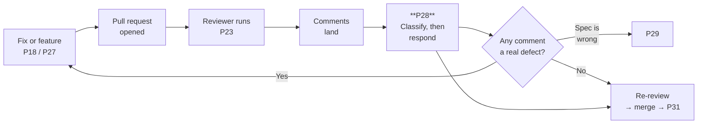
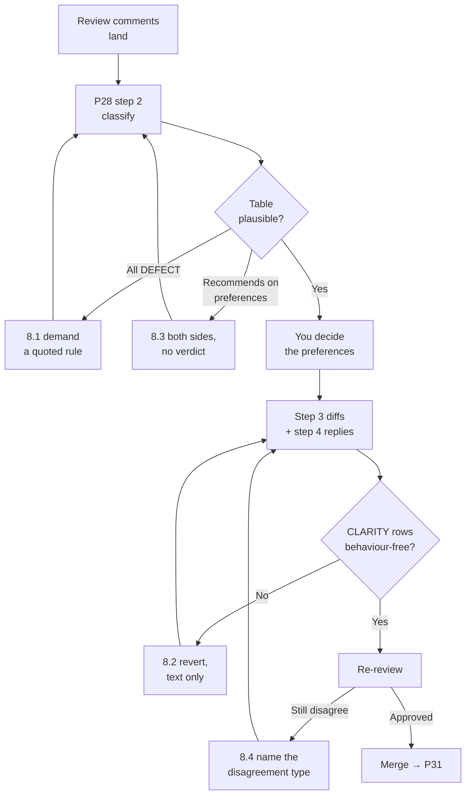

# P28 — Respond to Code Review Feedback

← [Previous](P27-fix-from-a-qa-bug-report.md) · [Library index](../README.md) · Next: [P29](P29-the-spec-was-wrong.md)

> **One line:** Classify every review comment before you change a single line of code.

| | |
|---|---|
| **Phase** | 6 — Rework |
| **Who runs it** | Backend or Frontend Engineer (Tomas Vargas; Ji-woo Park on the UI) |
| **When** | Review comments have landed on your pull request and you are about to start "addressing" them |
| **Takes in** | The review (`Case-Study/Python-ETL/artifacts/code-review-NWD-103.md`), the code under review, the spec it implements |
| **Produces** | A classified response to every comment, a diff for the ones that need one, and written replies for the ones that do not |
| **Hands off to** | Rahul Nair for re-review; Ananya Iyer if a comment turned out to be a defect |
| **Time to run** | 45 minutes for a normal review. Longer if a comment turns into a bug. |

---

## 1. The scene

Tomas has just fixed NWD-142. The pull request went up on Thursday afternoon with the evidence table from [P27](P27-fix-from-a-qa-bug-report.md) as its description, and Rahul reviewed it on Friday morning using the review prompt from [P23](../phase-5-verify/P23-review-someone-elses-code.md).

But that is not the review sitting in front of Tomas right now. The one in front of him is older and larger, and it has been open for four days. It is Rahul's review of **NWD-103 — Gate every extracted field on its confidence score**, the flagship story of the whole build, the code that everything else in the pipeline depends on. Eleven comments. Tomas has been avoiding it because he does not agree with most of them.

He opens his AI tool, pastes the eleven comments, pastes `core/confidence.py`, and types: **"address this review feedback."**

Ninety seconds later he has a diff that touches four files. Every comment has been actioned. The dictionary became a dataclass. The three helper functions became a class. The function that returns `None` now returns an empty string instead. The unknown-field-type fallback is unchanged, because Rahul phrased that one as a question and the AI answered the question in prose instead of changing the code.

Read that last sentence again, because it is the whole problem in one line. **The only comment that identified a real defect is the only comment the AI did not act on.** Everything else — the stylistic preferences, the naming — got a code change. The one that mattered got a paragraph.

This is not an unusual outcome. It is what "address this review" reliably produces, and the reason is not that the AI is careless. It is that "address" is a genuinely ambiguous instruction, and code review comments are not one kind of thing.

---

## 2. What this prompt actually does — in plain language

### First, what a code review actually is

If you have not worked in a team that does this: a **code review** is when someone other than the author reads a change before it is merged into the shared codebase. They leave comments on specific lines. The author responds. When both agree, the change is merged.

The mechanism it usually runs through is a **pull request** — a proposal to merge one branch of code into another, with a discussion attached. Some teams call it a merge request. Same thing.

The purpose is not to catch typos. Compilers catch typos. The purpose is to have a second person who understands the system look at whether this change is a good idea, whether it does what it claims, and whether the next person will be able to understand it. That third one is the underrated part.

### You are here



You are the box in the middle. The important thing about that box is that it has an internal step — classify — before it has an output.

### The three kinds of comment, and why the difference matters

Every review comment is one of three things. They look identical on the screen. They need completely different responses.

**(a) A defect.** The code is wrong. It produces an incorrect result, fails on an input it should handle, violates the spec, or breaks an invariant the system depends on. There is no discussion to have. You fix it.

*Example:* "Line 34 returns a 0.0 threshold for an unknown field type, so an unrecognised type passes every check."

**(b) A preference.** The code is correct. The reviewer would have written it differently. Sometimes their way is better, sometimes it is a coin flip, sometimes yours is better and they have not seen why. This is a conversation, and you are allowed to win it.

*Example:* "These three helpers would read better as a class."

**(c) A question that reveals the code is unclear.** The code is correct, and a competent reader could not tell that it was correct without asking. The reviewer is not requesting a behaviour change — they are reporting that they got confused. **The fix for confusion is almost never a behaviour change.** It is a rename, a comment, a docstring, a smaller function, or a test that demonstrates the intent.

*Example:* "I spent a while working out whether this returning `None` means 'no override' or 'the override is zero'."

Now the crucial part. **An AI told to "address this review" changes code for all three.** It is being helpful in the only way the instruction allows. And the outcomes are:

| Kind | What "address it" produces | Is that right? |
|---|---|---|
| (a) Defect | A code change | Yes |
| (b) Preference | A code change | Only if you actually agree — otherwise you have surrendered a design decision to whoever commented fastest |
| (c) Question | A code change | **No.** You have changed working code because someone was confused by it, and the confusion is still there for the next reader |

That third row is the expensive one, and it is expensive in a way that compounds. Code changed to satisfy a misunderstanding tends to become code that nobody fully understands, because the change was not driven by a reason — it was driven by a comment. Six months later there is a `return ""` where a `return None` used to be, and nobody, including you, can say why.

> **The rule.** Classify first. Respond second. The classification is the work; the diff is the consequence.

### The fourth kind, which is really the first two in disguise

Honest addition, because real reviews are messier than a three-way split.

Sometimes a comment arrives phrased as a question — "should this be `>` or `>=`?" — and you cannot classify it without going and checking something. If the spec says a score exactly at the threshold passes, then `>` is a **defect** and it is category (a). If the spec is silent, it is a design decision and it is category (b). If the spec says `>` explicitly and the reviewer just did not know, it is category (c) and the fix is a comment citing the spec.

You cannot tell which from the comment. You have to go and read the specification.

Call these **unclassified**, and treat "go and find out" as a legitimate first response. What you must not do is guess. Guessing on this category is how a genuine off-by-one bug gets closed as a style preference — which is exactly what happened on NWD-103, and it is the story in §11.

### Why pushing back is a professional obligation, not rudeness

New engineers accept every comment. It feels polite and it feels safe. It is neither.

If you accept a preference you disagree with, three things happen. The codebase acquires a pattern nobody actually chose. You have taught the reviewer that their preferences are decisions, which makes the next review slower and heavier. And you have lost the chance to say the thing you know and they do not — that the dictionary is a dictionary because it gets serialised straight to the exception queue payload, and a dataclass adds a conversion step on a path that runs two hundred times a day.

**Disagreement is how the reviewer learns something.** A review where the author accepted everything is a review that transferred information in one direction only, and that is half a review.

The etiquette that works, and that this prompt encodes:

- **Never silently ignore a comment.** Every comment gets a reply, even if the reply is "no, and here is why". Silence reads as either agreement or contempt and the reviewer cannot tell which.
- **Disagree with a reason and a cost, not with a taste.** "I prefer it this way" loses. "This dict is serialised directly into the exception queue payload; a dataclass adds a conversion on the hot path and a second place to keep the field names in sync" wins, or at least deserves to.
- **Separate "I disagree" from "not now".** Sometimes the reviewer is right and the change is out of scope for this pull request. That is not a disagreement — it is a ticket. Say so and raise it.
- **When you are wrong, say "good catch" and move on.** No paragraph of justification. It costs nothing and it makes the next review faster.

### What the AI is actually doing when this runs

It reads each comment and asks a specific question of the code: *does this comment assert something about behaviour, or about form?*

Behaviour claims — "this returns the wrong value", "this fails on empty input", "this violates the spec" — it must verify against the code and the spec. Verification means reading, not assuming the reviewer is right. Reviewers are wrong reasonably often, and a reviewer who is wrong and gets a code change is worse than one who is wrong and gets pushback.

Form claims — "this would read better as", "consider extracting", "I'd use a different name" — it must **not** verify, because there is nothing to verify. It must instead surface the tradeoff so you can make the call.

Questions it must treat as evidence of confusion, and propose a clarity fix rather than a behaviour fix.

And for anything it cannot place, it must say so and tell you what to go and check.

### Why the prompt is shaped this way

**Classification comes before any diff, and it comes as a table.** A table forces a verdict per comment. Prose lets the AI blur three comments into one paragraph and act on all of them.

**The AI must quote the code for every (a) claim.** A comment saying "this is wrong" is a hypothesis until someone reads the line. Roughly one in five "defect" comments in a real review turns out to be the reviewer misreading the code, and finding that out is much cheaper than fixing something that was never broken.

**Preferences get a tradeoff, not a recommendation.** You want the argument on both sides so you can decide. An AI that recommends will recommend whatever the reviewer said, because the reviewer's text is the most recent and most specific instruction in the context.

**Questions get a clarity fix and an explicit "no behaviour change" statement.** This is the clause that saves the most damage.

**The diff is scoped to (a) only, by default.** Preferences you accepted get added deliberately, by you, after the classification. This keeps the diff reviewable: the second review can be read as "here is what was actually wrong".

### The one idea to remember

> **A review comment is a report of what one person saw, not an instruction. Your job is to work out which of the three things they saw, and only then decide what to change.**

---

## 3. The prompt

```text
You are a senior [LANGUAGE] engineer responding to a code review on [PROJECT NAME].

**STOP GATE.** Do NOT write any code, diff, or fix until you have produced the
classification table in step 2 and I have replied "classified". The classification is
the work. The diff is a consequence of it.

## The review

[PASTE EVERY REVIEW COMMENT, VERBATIM, WITH ITS FILE AND LINE]

## The code under review

Files: [PATHS]
Story: [STORY ID AND TITLE]
Specification it implements: [PATH TO SPEC FILE]
Team conventions: [PATH TO PROJECT CONTEXT / CONVENTIONS FILE]

## Step 1 — Restate each comment

For each comment, **write in one sentence** what the reviewer is asserting. Strip the
politeness. "Might it be worth considering whether we could perhaps..." becomes
"replace X with Y".

If a comment is asserting more than one thing, **split it** into numbered parts. A
single comment that says "this is wrong, and also I'd use a dataclass" is two
comments and they are different kinds.

## Step 2 — Classify every comment

**Produce this table.** One row per comment. No comment may be omitted.

| # | Comment (restated) | Kind | Basis | Proposed response |
|---|---|---|---|---|

**Kind** is exactly one of:
- **DEFECT** — the code is wrong. Produces an incorrect result, mishandles an input
  it must handle, violates the spec, or breaks a stated invariant.
- **PREFERENCE** — the code is correct; the reviewer would have written it
  differently. No behaviour change is required for correctness.
- **CLARITY** — the reviewer is reporting confusion, not incorrectness. The code is
  right and a competent reader could not tell.
- **UNCLASSIFIED** — you cannot tell without checking something. Say exactly what you
  need to check and where.

**Basis** rules, and these are not optional:
- For DEFECT you must **quote the offending code** and **quote the spec line or
  invariant it violates**. If you cannot quote both, it is not a DEFECT — it is
  UNCLASSIFIED. Reviewers are wrong sometimes.
- For PREFERENCE, state the tradeoff in one line each way. Do NOT recommend.
- For CLARITY, state what a reader would reasonably have concluded, and why it is
  wrong.
- For UNCLASSIFIED, name the file or document I should open.

**Proposed response** is one of: fix the code / push back with a reason / clarify
without changing behaviour / go and check X.

**STOP HERE.** Wait for "classified".

## Step 3 — After I confirm the classification

**For DEFECT comments:** write the fix as a unified diff. Add or extend a test that
fails without it. One diff per defect, kept separable.

**For PREFERENCE comments I said to ACCEPT:** write the change as a separate diff,
clearly labelled as a preference change, so review two can read defects and
preferences apart.

**For PREFERENCE comments I said to DECLINE:** draft the reply to the reviewer. Give
the technical reason and the cost of doing it their way. Two to four sentences. Be
direct, not defensive. Do not say "I prefer".

**For CLARITY comments:** propose the smallest change that removes the confusion
WITHOUT changing behaviour — a rename, a docstring, a comment, a type annotation, an
extracted named constant, or a test that demonstrates the intent. **State
explicitly: "no behaviour change."** If you believe the confusion can only be fixed
by changing behaviour, say so and re-classify it as PREFERENCE or DEFECT.

**For UNCLASSIFIED:** do nothing until I have given you the answer.

## Step 4 — The reply

**Draft a reply to every comment**, in review-thread form, in the reviewer's numbering.
Rules:
- Every comment gets a reply. None may be silently skipped.
- Where you fixed something, say what you changed in one line, and name the test.
- Where you declined, give the reason and the cost. No hedging.
- Where you clarified, say explicitly that behaviour is unchanged.
- Where a comment revealed a defect the reviewer did not realise they had found,
  **say so loudly** and tell me whether it needs its own bug ticket.

## Do not

- Do not change behaviour in response to a question. A question is not a request.
- Do not accept a PREFERENCE on my behalf. Present the tradeoff; I decide.
- Do not classify something as DEFECT without quoting the code and the spec.
- Do not roll defect fixes and preference changes into one diff.
- Do not fix anything the review did not mention. If you spot something, list it at
  the end.
- Do not soften a disagreement into agreement. If the reviewer is wrong, say the
  reviewer is wrong, politely and once.
- Do not touch more than [MAX FILES] files.

## You are done when

- Every comment has a row in the table with a Kind and a Basis.
- Every DEFECT row quotes both the code and the rule it breaks.
- Every DEFECT has a diff and a failing-first test.
- Every declined PREFERENCE has a written reason with a cost.
- Every CLARITY change is stated as "no behaviour change".
- Every comment has a reply.

Save the classification table and the replies as a comment on the pull request for
[STORY ID].
```

---

## 4. Every placeholder, explained

| Placeholder | What to put in it | Northwind example | What happens if you get it wrong |
|---|---|---|---|
| `[LANGUAGE]` | Language and framework | `Python 3.11 on Azure Functions` | Preference tradeoffs get argued in the idioms of the wrong language — "use a struct", "make it a POJO" |
| `[PROJECT NAME]` | The system in a phrase | `the Northwind counterparty document ingestion pipeline` | The AI cannot judge whether a preference conflicts with a system-level constraint like "fails closed" |
| `[PASTE EVERY REVIEW COMMENT, VERBATIM, WITH ITS FILE AND LINE]` | All of them, unedited, including the ones you disagree with and the ones that seem trivial | The eleven comments in `artifacts/code-review-NWD-103.md` | Filter out the ones you plan to reject and you have pre-decided the classification. The comment you were most annoyed by is disproportionately often the defect |
| `[PATHS]` | Every file the review touches | `core/confidence.py`, `core/rules.py`, `tests/test_confidence.py` | The AI classifies a defect claim without reading the code, which is exactly the failure this prompt exists to prevent |
| `[STORY ID AND TITLE]` | The story under review | `NWD-103 — Gate every extracted field on its confidence score` | Scope arguments become unresolvable. "Out of scope for this PR" needs a scope |
| `[PATH TO SPEC FILE]` | The spec the code implements | `artifacts/spec-confidence-gate.md` | Every DEFECT becomes UNCLASSIFIED, because there is nothing to quote as the violated rule. This is the most important placeholder here |
| `[PATH TO PROJECT CONTEXT / CONVENTIONS FILE]` | The team's written conventions | `artifacts/CLAUDE.md` | Preference arguments have no tiebreak. "The team uses dataclasses for anything crossing a module boundary" settles three comments in one line if it is written down |
| `[MAX FILES]` | Blast radius | `3` | An eleven-comment review becomes a nine-file diff that needs its own review |

---

## 5. The filled-in example

Tomas runs this on Monday morning, four days after Rahul's review landed, having deleted his first "address this review" attempt.

```text
You are a senior Python 3.11 / Azure Functions engineer responding to a code review
on the Northwind counterparty document ingestion pipeline.

**STOP GATE.** Do NOT write any code, diff, or fix until you have produced the
classification table in step 2 and I have replied "classified". The classification is
the work. The diff is a consequence of it.

## The review

--- from artifacts/code-review-NWD-103.md, reviewer: Rahul Nair ---

R1. core/confidence.py:34
    `THRESHOLDS.get(field_type, 0.0)` — what happens when field_type is something we
    haven't seen? A new layout adds a field type we don't have a threshold for and it
    sails through at 0.0. I think this fails open.

R2. core/confidence.py:12
    GateResult is a dict. Can we make it a dataclass? Dicts with a fixed shape always
    drift.

R3. core/confidence.py:22-58
    _threshold_for, _broker_override and _is_currency are three module-level
    functions that all take the same two arguments. That's a class wearing a
    disguise. Consider a ThresholdResolver.

R4. core/confidence.py:47
    _broker_override returns None when the broker has no override. I read this three
    times trying to work out whether None meant "no override configured" or "the
    override is zero". Why does it return None?

R5. core/confidence.py:41
    `if score > threshold:` — should a score exactly equal to the threshold pass or
    fail? I genuinely don't know what we decided.
--- end ---

## The code under review

Files: core/confidence.py, core/rules.py, tests/test_confidence.py
Story: NWD-103 — Gate every extracted field on its confidence score
Specification it implements: artifacts/spec-confidence-gate.md
Team conventions: artifacts/CLAUDE.md

## Step 1 — Restate each comment
[... steps 1-4 exactly as in the library prompt ...]

## Do not
[... as in the library prompt ...]
- Do not touch more than 3 files.

## You are done when
[... as in the library prompt ...]

Save the classification table and the replies as a comment on the pull request for
NWD-103.
```

Five comments, not eleven — the other six were on `core/rules.py` and Tomas ran them as a second pass. **Splitting a large review by file is legitimate and it makes the classification table readable.** Splitting it by "the ones I agree with" is not.

---

## 6. What comes back

### Steps 1–2, up to the gate

````markdown
## Step 1 — Restated

R1. `THRESHOLDS.get(field_type, 0.0)` defaults to 0.0 for an unknown field type,
    which lets any confidence value pass. Reviewer believes this fails open.
R2. Replace the `GateResult` dict with a dataclass.
R3. Collapse `_threshold_for`, `_broker_override` and `_is_currency` into a
    `ThresholdResolver` class.
R4. Why does `_broker_override` return `None` for "no override"? Reviewer could not
    distinguish "not configured" from "configured as zero".
R5. Should a score exactly equal to the threshold pass or fail? Reviewer does not
    know what was decided.

R1 is one assertion. R2 and R3 are each one. R4 is a question. R5 is a question that
may or may not be about correctness — I cannot tell yet.

## Step 2 — Classification

| # | Comment (restated) | Kind | Basis | Proposed response |
|---|---|---|---|---|
| R1 | Unknown field type defaults to a 0.0 threshold | **DEFECT** | Code, `core/confidence.py:34`: `threshold = THRESHOLDS.get(field_type, 0.0)`. Spec §2: *"Any field whose type is not listed in the threshold table MUST be treated as failing the gate. The system must never assign a default threshold."* The code does exactly what the spec forbids. | Fix the code + test |
| R2 | GateResult should be a dataclass | **PREFERENCE** | For: fixed shape, typo-safe, self-documenting, matches `CLAUDE.md` §4 "prefer dataclasses for structures crossing a module boundary". Against: `GateResult` is serialised straight into the exception-queue JSON payload at `core/rules.py:131`; a dataclass adds an `asdict()` call on a path that runs ~200×/day, and a second place to keep field names in sync with the queue schema. No recommendation. | You decide |
| R3 | Three helpers should be a ThresholdResolver class | **PREFERENCE** | For: they share `(field_type, broker)`; a class would hold them once. Against: all three are pure functions with no state to hold; a class here would carry two attributes and three methods and add an instantiation to every call site. `CLAUDE.md` §4 says "prefer functions to classes where there is no state". No recommendation. | You decide |
| R4 | Why does `_broker_override` return None? | **CLARITY** | Code is correct. `None` means "no override configured, use the base threshold" and is checked with `is None` at line 52, so a configured 0.0 would be handled correctly. But the function name says nothing about it, there is no docstring, and the return annotation is bare `float \| None`. A reader would reasonably conclude `None` meant "zero". Confusion is real; behaviour is right. | Clarify, no behaviour change |
| R5 | `>` or `>=` at the threshold? | **DEFECT** (was UNCLASSIFIED — I checked) | I could not classify this from the comment, so I read the spec. `artifacts/spec-confidence-gate.md` §3: *"A field passes the gate when its confidence score is greater than **or equal to** the threshold for its type."* Code at `core/confidence.py:41` is `if score > threshold`. A currency field at exactly 0.900 is rejected today and the spec says it must pass. | Fix the code + test |

**Flagging this before you confirm.** R5 arrived as a question and it is a real
off-by-one defect against the spec. Broker Alpha's currency threshold is 0.92 and
Document Intelligence returns scores rounded to two decimals, so scores land exactly
on 0.92 regularly — this is not a theoretical boundary. Every such field is being
sent to the exception queue unnecessarily, which depresses the straight-through rate.
I recommend a bug ticket so it is visible outside this pull request.

**STOPPING HERE.** Waiting for "classified".
````

Tomas reads R5 twice, checks the spec himself, and swears. He replies:

`classified — decline R2, accept R3? no, decline R3 too. raise a ticket for R5.`

### Steps 3–4

````markdown
## Step 3 — Changes

### R1 — DEFECT — fail closed on unknown field types

```diff
--- a/core/confidence.py
+++ b/core/confidence.py
@@ -28,10 +28,17 @@ THRESHOLDS: dict[str, float] = {
     "string":   0.75,
 }
 
 
 def threshold_for(field_type: str, broker: str) -> float:
-    threshold = THRESHOLDS.get(field_type, 0.0)
+    # Spec §2: an unlisted field type MUST fail the gate. Defaulting to 0.0 let
+    # any new field type from a new layout pass unchecked. Raising here routes the
+    # document to the exception queue via the handler in core/rules.py:118.
+    if field_type not in THRESHOLDS:
+        raise UnknownFieldTypeError(
+            f"no confidence threshold configured for field type {field_type!r}; "
+            f"add it to THRESHOLDS or to the layout's config in config/sources.yaml"
+        )
+    threshold = THRESHOLDS[field_type]
     override = _broker_override(field_type, broker)
     return override if override is not None else threshold
```

```python
# tests/test_confidence.py

def test_unknown_field_type_fails_closed():
    """R1 / spec §2: an unlisted field type must never receive a default threshold."""
    with pytest.raises(UnknownFieldTypeError, match="percentage"):
        threshold_for("percentage", broker="broker_alpha")


def test_unknown_field_type_routes_document_to_exception_queue():
    """The raise must surface as a review decision, not a crash."""
    doc = _document_with_field(field_type="percentage", score=0.99)
    outcome = apply_gate(doc, broker="broker_alpha")
    assert outcome.decision == "REVIEW"
    assert "percentage" in outcome.reason
```

Both fail on current code: the first with `Failed: DID NOT RAISE`, the second with
`assert 'PASS' == 'REVIEW'`.

### R5 — DEFECT — boundary is inclusive

```diff
--- a/core/confidence.py
+++ b/core/confidence.py
@@ -38,7 +38,9 @@ def evaluate_field(field: ExtractedField, broker: str) -> FieldVerdict:
     threshold = threshold_for(field.field_type, broker)
-    if field.score > threshold:
+    # Spec §3: a score greater than OR EQUAL TO the threshold passes. Scores from
+    # Document Intelligence are rounded to 2dp and land exactly on the threshold
+    # routinely, so this boundary is hit in production, not just in tests.
+    if field.score >= threshold:
         return FieldVerdict.PASS
     return FieldVerdict.REVIEW
```

```python
def test_score_exactly_at_threshold_passes():
    """R5 / spec §3: the boundary is inclusive."""
    field = ExtractedField(field_type="currency", score=0.92)
    assert evaluate_field(field, broker="broker_alpha") is FieldVerdict.PASS


def test_score_one_tick_below_threshold_is_reviewed():
    """Guard the other side of the boundary so we don't over-correct."""
    field = ExtractedField(field_type="currency", score=0.91)
    assert evaluate_field(field, broker="broker_alpha") is FieldVerdict.REVIEW
```

First fails with `assert <FieldVerdict.REVIEW> is <FieldVerdict.PASS>`. Second
already passes and must keep passing.

### R4 — CLARITY — **no behaviour change**

```diff
--- a/core/confidence.py
+++ b/core/confidence.py
@@ -44,10 +44,20 @@
-def _broker_override(field_type: str, broker: str) -> float | None:
-    return OVERRIDES.get(broker, {}).get(field_type)
+def find_broker_override(field_type: str, broker: str) -> float | None:
+    """Return this broker's threshold override for a field type, if one exists.
+
+    Returns None to mean "no override is configured", NOT "the override is zero".
+    A configured override of 0.0 is a legitimate value and is returned as 0.0.
+    Callers must therefore test with `is None`, never with a truthiness check.
+
+    Example: broker_alpha overrides currency to 0.92 because their scan quality is
+    poor. Every other field type for that broker returns None and falls back to the
+    base threshold.
+    """
+    return OVERRIDES.get(broker, {}).get(field_type)
```

Plus one test that pins the distinction the reviewer could not see:

```python
def test_configured_zero_override_is_not_treated_as_missing():
    """R4: 0.0 is a value, None is an absence. This is what the docstring claims."""
    with _overrides({"broker_zeta": {"currency": 0.0}}):
        assert find_broker_override("currency", "broker_zeta") == 0.0
        assert find_broker_override("date", "broker_zeta") is None
```

**No behaviour change.** Rename, docstring, and a test. The rename `_broker_override`
→ `find_broker_override` also drops the leading underscore because `core/rules.py`
already imports it across a module boundary, so the private marker was a lie.

## Step 4 — Replies

> **R1** — Good catch, and it is worse than fails-open: spec §2 explicitly forbids a
> default threshold and I implemented the exact thing it forbids. `threshold_for` now
> raises `UnknownFieldTypeError`, which `core/rules.py:118` already converts into a
> REVIEW decision, so a new layout with an unrecognised field type routes to the
> exception queue instead of sailing through. Two tests added:
> `test_unknown_field_type_fails_closed` and
> `test_unknown_field_type_routes_document_to_exception_queue`.

> **R2** — Declining, and I want to check you agree with the reason. `GateResult` is
> serialised directly into the exception-queue payload at `core/rules.py:131`. Making
> it a dataclass adds an `asdict()` on a path that runs about 200 times a day, and
> more importantly it creates a second place where the field names have to match the
> queue schema in `sql/schema.sql`. I would rather have one shape defined once. If we
> do move to dataclasses I would want to do it for the whole payload chain in one
> change, not just this one struct — happy to raise that as tech debt.

> **R3** — Declining. All three are pure functions of `(field_type, broker)` with no
> state between calls. A `ThresholdResolver` would hold two attributes it never
> mutates and add an instantiation at every call site. `CLAUDE.md` §4 says to prefer
> functions where there is no state, and I think this is the case it had in mind. If
> the concern is that they are scattered, I would rather group them with a section
> comment than introduce an object.

> **R4** — You are right that it is unreadable, and you are right to have been
> unsure — but the behaviour is correct: `None` means "no override configured", and a
> configured 0.0 is handled properly because line 52 checks `is None`. Renamed to
> `find_broker_override`, added a docstring that says exactly this, and added
> `test_configured_zero_override_is_not_treated_as_missing` so the distinction is
> pinned by a test rather than by a comment. **No behaviour change.**

> **R5** — This one turned out to be a real bug, so thank you for asking rather than
> assuming. Spec §3 says a score greater than **or equal to** the threshold passes.
> The code had `>`. Broker Alpha's currency threshold is 0.92 and Document
> Intelligence returns two-decimal scores, so fields land exactly on 0.92 regularly
> and every one of them has been going to the exception queue unnecessarily since we
> shipped. That is depressing the straight-through rate and adding manual work for
> Priya. Fixed to `>=` with tests on both sides of the boundary. Raised as **NWD-146**
> so it is visible outside this PR and so Ananya can quantify how many documents it
> affected.

## Other things I noticed (not changed)

- `OVERRIDES` is a module-level dict populated at import from `config/sources.yaml`.
  A YAML change requires a restart to take effect. Not mentioned in the review, not
  in scope, probably worth a ticket.
````

### How to read this

**R5 is the entire justification for this prompt.** It arrived as a politely hedged question — *"I genuinely don't know what we decided"* — the kind of comment that gets a one-line reply and no code change in nine reviews out of ten. It was a live defect that had been silently pushing work onto a human analyst for eleven days. The only reason it was found is that the prompt refused to let it be classified without checking the spec, and refused to let it sit as UNCLASSIFIED once the spec had been read.

**The two declined preferences have costs attached, not tastes.** "Declining, because it creates a second place where field names must match `sql/schema.sql`" is an argument Rahul can engage with, agree with, or defeat. "I prefer dicts" is not. Notice too that R2's reply offers a larger version of the change as tech debt — that is how you decline without dismissing.

**R4's clarity fix is four things and none of them change behaviour:** a rename, a docstring, a test, and dropping a misleading underscore. The test is the interesting one. **A comment explains intent to whoever reads that line; a test enforces it on whoever changes that line.** If someone later "simplifies" `is None` into a truthiness check, the comment will not stop them and the test will.

**The part that is commonly wrong:** the DEFECT rows. Read the Basis column sceptically every single time. R1's basis quotes the code *and* quotes spec §2 forbidding exactly that code — that is a complete argument. A weak basis reads "this fails open, which is bad practice", which is an opinion in a defect's clothing. **If a DEFECT row cannot quote a rule, it is a PREFERENCE with confidence.**

---

## 7. Why this is the final prompt

### What "done" means here

Done is: **every comment has a classification, a response, and a reply — and the diff contains only what the DEFECT rows and your explicitly accepted preferences require.**

Not "all comments resolved". Resolving a comment by making a code change you did not agree with is not resolution, it is attrition.

### The checklist

- [ ] Every comment appears in the table. Count them against the review. None dropped.
- [ ] Every DEFECT row quotes **both** the offending code and the rule it violates. If it cannot quote a rule, re-check whether it is really a defect.
- [ ] Every PREFERENCE row states the tradeoff both ways and **you** made the call, not the AI.
- [ ] Every CLARITY change is labelled "no behaviour change" and the diff proves it — a rename, a docstring, a comment, a test, and nothing else.
- [ ] Every DEFECT has a test that fails without the fix, and you have seen it fail.
- [ ] Every declined preference has a reason with a cost in it.
- [ ] Any comment that turned out to be a defect the reviewer did not realise they had found has been raised as its own ticket.
- [ ] Nothing in the diff was not mentioned in the review.

### Why you should stop rather than keep prompting

Two failure modes, and they are opposites.

**Over-accommodation.** You keep asking "is Rahul right about this one?" and eventually the AI says yes, because agreeing with the most recent authoritative statement in the context is its default gravity. Ask a preference question three different ways and you will get three different answers, weighted toward whoever spoke last. **Decide preferences yourself, once, and move on.** The AI's job on a preference is to give you both sides, not to break the tie.

**Rabbit-holing a preference into a redesign.** You accept R3, the AI writes `ThresholdResolver`, and then observes that the resolver would be cleaner with the overrides injected, and then that injection would be cleaner with a config protocol. Forty minutes later you have a dependency-injection layer in a module that has three functions. The review said "consider a class". It did not say "redesign the module".

The discipline: **a review response should be readable as an answer to the review.** If a reviewer cannot map your diff back to their comments, you have done something other than respond to the review.

### The signal that you are NOT done

**You changed behaviour in response to a comment that was a question.** Go back to the table, find the row you marked CLARITY, and look at what the diff actually did.

---

## 8. When it is not done — the follow-up prompts

| What you're seeing | What's actually wrong | Run this next |
|---|---|---|
| Every comment came back DEFECT | The AI is deferring to the reviewer instead of checking. Real reviews are mostly preference | §8.1 |
| A CLARITY row produced a behaviour change | It was misclassified, or the AI could not resist "improving" while it was in there | §8.2 |
| A PREFERENCE row came with a recommendation | The AI made a design decision that is yours to make | §8.3 |
| The reviewer rejected your pushback and you still disagree | You need the disagreement escalated, not re-argued | §8.4 |
| A comment turned out to be a defect nobody had filed | You are now holding a bug, not a review comment | **[P27](P27-fix-from-a-qa-bug-report.md)** |
| The reviewer is right and the spec is what is wrong | Not a code change | **[P29](P29-the-spec-was-wrong.md)** |
| The AI keeps re-litigating a comment you already settled | Session is polluted | **[P30](P30-when-the-ai-is-stuck.md)** |

### 8.1 "Everything came back as a defect"

Use this when the table has five DEFECT rows and no preferences. That is not what a real review looks like.

```text
You classified [N] of [N] comments as DEFECT. That is implausible — most review
comments are preferences, and reviewers are wrong often enough to matter.

**Re-examine each DEFECT row.** For each, answer:
- Which specific line of [PATH TO SPEC FILE], the acceptance criteria, or a stated
  system invariant does this code violate? Quote it in full.
- If you cannot quote one: is this actually incorrect, or is it a style the reviewer
  dislikes? Say which.
- Is there any input for which the current code produces a wrong result? Give me the
  input and the wrong result.

**Re-classify** anything you cannot support. A comment I cannot act on with a quote
is a PREFERENCE, and I need to know that before I change code.
```

What changes: the table shrinks to the comments that are actually defects. Typically two of five survive. The three that fall out are not wasted — they are now preferences you get to decide on.

### 8.2 "The clarity fix changed behaviour"

Use this when a CLARITY row produced a diff that does more than rename and document.

```text
Comment [N] was classified CLARITY — the code is correct, the reader was confused.
Your diff changes behaviour: [QUOTE THE BEHAVIOUR CHANGE].

**Revert that.** Then produce a version that changes only:
- names,
- docstrings and comments,
- type annotations,
- extracted named constants (same value),
- tests that demonstrate the intent,
- function boundaries, IF the split is provably behaviour-preserving.

**Prove it is behaviour-preserving** by naming the existing test that would catch a
change, or by writing one first.

If you genuinely cannot remove the confusion without changing behaviour, **stop and
say so** — that means I misclassified it and it is a PREFERENCE or a DEFECT.
```

What changes: the diff shrinks to text. The "prove it is behaviour-preserving" clause is what makes this trustworthy — a rename that silently changes a call site is not a rename.

### 8.3 "It told me what to do about a preference"

Use this when a PREFERENCE row ends with "recommend adopting the reviewer's suggestion".

```text
You recommended on comment [N]. I asked for the tradeoff, not the answer — that
decision is mine and I need both sides argued properly.

**Redo it as an argument on both sides:**
- The strongest case FOR the reviewer's version. Name a concrete benefit: a bug it
  prevents, a reader it helps, a convention it aligns with. Cite [CONVENTIONS FILE].
- The strongest case AGAINST it. Name a concrete cost: work added, a second place to
  keep in sync, a runtime cost on a hot path, a pattern it introduces that we do not
  otherwise use.
- What breaks if we do it and get it slightly wrong.
- What we lose by never doing it.

**No recommendation. No "on balance".** End with the one question I need to answer to
decide.
```

What changes: you get a decision brief instead of an endorsement. The final clause is the useful one — most preference arguments collapse to a single question, and seeing it stated is usually enough to answer it.

### 8.4 "We still disagree after the pushback"

Use this when your declined preference came back with a counter-argument and neither of you is moving. This is a people problem with a technical surface.

```text
The reviewer rejected my pushback on comment [N]. Their counter-argument:

[PASTE IT]

**Do not re-argue my position.** Instead:

1. **Steelman the reviewer.** Write the strongest version of their case, stronger than
   they wrote it. If it is stronger than mine, say so plainly.
2. **Name the disagreement type:** is this about correctness (one of us is wrong
   about what the code does), about a fact (a benchmark, a convention, a constraint
   we can look up), or about values (both work, we weight things differently)?
3. If **correctness** — what experiment settles it? Write it.
4. If **fact** — what do we look up, and where?
5. If **values** — say so explicitly and draft two sentences proposing we escalate to
   [ARCHITECT / TEAM LEAD] rather than iterate. Include what a written convention
   would need to say to prevent this recurring.

Getting to "this is a values disagreement" quickly is a win, not a failure.
```

What changes: you find out whether the argument is winnable. Values disagreements do not converge through more comments — they converge through someone writing the convention down. On NWD-103 the dataclass argument went this way and ended with two lines added to `CLAUDE.md`, which settled it for the rest of the project.

### The loop



---

## 9. How this goes wrong

### You paste the review and type "address this"

The failure that opens this file. Every comment becomes a code change, including the ones that were questions, and the one genuine defect gets a paragraph of prose because it was phrased as a question too.

Why it happens: "address the review" is how humans talk about this task, so it is what you type. The word does not distinguish between fixing, arguing and explaining, and the AI has to pick one. It picks the one that looks like progress.

The fix is the stop gate and the classification table. Not a longer instruction — a *different shaped* one, that produces a verdict per comment before it produces any code.

### You filter the review before pasting it

You drop the two comments you think are nitpicks. One of them was R5.

This is the most common failure in practice because it does not feel like a decision. It feels like tidying. But the comment you skimmed past is disproportionately likely to be the one that matters, precisely because the reviewer phrased it tentatively — people phrase things tentatively when they are unsure, and being unsure about your code is exactly the signal worth investigating.

The fix: paste all of them, always. The classification step is cheap and it is what filtering was trying to do, except done with evidence.

### The AI agrees with the reviewer about everything

Reviewer comments are specific, recent, and written with authority. That combination makes them the strongest signal in the context window, and the AI's default is to treat the most authoritative recent instruction as ground truth. So "this fails open" becomes an established fact rather than a claim to check.

The tell is a Basis column full of restatements: *"Basis: the reviewer notes this fails open."* That is not a basis. That is the comment, again.

The fix is the rule that a DEFECT must quote both the code and the violated rule. It is a hard requirement and it is unfakeable — either there is a line in the spec or there is not. Follow-up §8.1 is the recovery.

### You accept a preference to be agreeable and it becomes a precedent

You did not care much about the dataclass, so you accepted it. Now `GateResult` is a dataclass, and `ExtractedField` next to it is not, and the next person sees two patterns and asks which one is right, and nobody knows because the decision was never made — it was conceded.

The compounding cost is real. Northwind's `CLAUDE.md` grew a conventions section specifically because three preference concessions in Sprint 2 had produced a module with three different ways of representing a result.

The fix: if a preference is worth accepting, accept it as a decision and write it down where the next person will find it. If it is not worth writing down, it was not worth accepting.

### This is the wrong prompt entirely

**The reviewer found a bug.** If a comment turns out to be a genuine defect with real user impact — R5 was — it deserves a ticket, a reproduction, and the full treatment in [P27](P27-fix-from-a-qa-bug-report.md). Fixing it quietly inside a review response means it never gets counted, never gets a regression test at the right layer, and QA never gets to check how many documents it affected.

**The reviewer is right and the spec is wrong.** Sometimes a comment is "the spec says X but X is wrong". That is not yours to fix in a pull request. It is [P29](P29-the-spec-was-wrong.md), with Sofia, and it has an approval path.

**The review is really a design disagreement.** Eleven comments all circling the same structural choice is not a review, it is an architecture conversation that got filed as line comments. Stop responding line by line, book twenty minutes, and settle the shape. Then the comments answer themselves.

---

## 10. The handoff

The immediate handoff is back to Rahul. What he is guaranteed to find is a reply on every single comment — including the ones you declined — and a diff he can read against his own numbering. That second property is why the prompt insists on keeping defect fixes and accepted-preference changes in separate diffs. **A second review that has to re-read the whole file is a second full review. A second review that can read "here are the two defects you found, fixed" is five minutes.**

The second handoff is to Ananya, and it only exists because R5 turned into a real bug. `NWD-146` gets a ticket, and Ananya's job is the part that the pull request cannot answer: how many documents went to the exception queue since the build shipped because of a strictly-greater-than? That number is what tells Amara and Farhan whether the straight-through rate they have been reporting was wrong, and by how much. Fixing the code closes the defect. Quantifying the impact closes the incident.

The third handoff is to `CLAUDE.md`. Every preference argument that was genuinely hard should leave something behind. On NWD-103 the dataclass argument added two lines to the conventions file: *"Structures that are serialised directly into a persisted payload stay as dicts, defined once alongside their schema. Structures crossing a module boundary within the app use dataclasses."* That sentence prevents the same review comment on the next four pull requests, which is a better outcome than winning the argument.

> **Artifact contract — the review response on the NWD-103 pull request**
> Anyone reading this can rely on finding:
> - A row for every comment in the original review, none omitted.
> - A Kind for each: DEFECT, PREFERENCE, CLARITY or UNCLASSIFIED.
> - For every DEFECT: a quote of the offending code and a quote of the rule it violates.
> - For every DEFECT: a diff and a test that fails without it.
> - For every declined PREFERENCE: a written reason that names a cost.
> - For every CLARITY change: an explicit "no behaviour change" statement.
> - A reply to every comment, in the reviewer's numbering.
>
> If any of those is missing, the artifact is not done — go back to §7.

---

## 11. In the case study

This runs in [`08-sprint-3-rework.md`](../../Case-Study/Python-ETL/08-sprint-3-rework.md), and the review itself is checked in at [`artifacts/code-review-NWD-103.md`](../../Case-Study/Python-ETL/artifacts/code-review-NWD-103.md) so you can read Rahul's original wording next to Tomas's classification.

What happened is the reason this file exists. Tomas's first attempt was the "address this review" run described in §1, and he nearly shipped it. Rahul caught it in the second review with a comment that has become the team's shorthand: *"You've changed five things and fixed none of them."* Four of the five changes were preferences the AI had accepted on Tomas's behalf, and the fifth was a rename that made R4's confusing `None` return into a confusing `""` return — same confusion, new value, plus a subtle bug waiting for the first broker who configures an override of zero.

The comment that mattered was **R5**, and it was the last one in the review, phrased as the most tentative thing Rahul wrote all week: *"I genuinely don't know what we decided."* Tomas had read it four days earlier, thought "it's fine, `>` is obviously right", and moved on. It was not right. Spec §3 says the boundary is inclusive, Broker Alpha's currency threshold is 0.92, and Document Intelligence returns two-decimal scores — so every currency field that landed exactly on 0.92 had been going to the exception queue since the build shipped. Ananya later counted it: **eighty-one documents in eleven days**, every one of which Priya opened, looked at, and approved unchanged. Eighty-one pieces of pointless human work caused by one character, found by a question that almost got a shrug.

Farhan's reaction at the next standup is the line that ended up in [`10-retrospective.md`](../../Case-Study/Python-ETL/10-retrospective.md), and it is worth remembering the next time you are tempted to skim a hedged comment: **"The bug wasn't hiding. It was in a review, in writing, for four days, phrased as a question. We just didn't have a way of taking questions seriously."**

---

← [Previous](P27-fix-from-a-qa-bug-report.md) · [Library index](../README.md) · Next: [P29](P29-the-spec-was-wrong.md)
