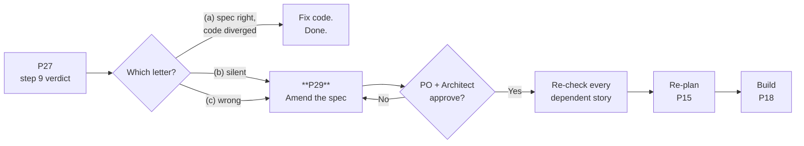
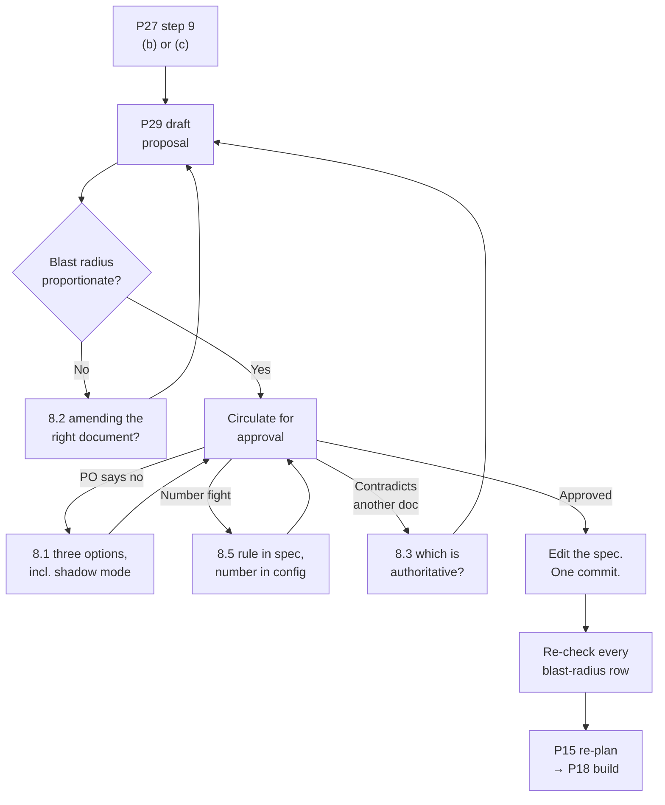

# P29 — The Spec Was Wrong

← [Previous](P28-respond-to-code-review-feedback.md) · [Library index](../README.md) · Next: [P30](P30-when-the-ai-is-stuck.md)

> **One line:** Fix the document before you fix the code, or the next person inherits a lie.

| | |
|---|---|
| **Phase** | 6 — Rework |
| **Who runs it** | Architect (Hem Singh) with the Team Lead (Gautam ); Product Owner (Preetinka Sharma) approves |
| **When** | A bug fix has stopped, because the root cause is that the specification asked for the wrong thing |
| **Takes in** | The step 9 verdict from [P27](P27-fix-from-a-qa-bug-report.md), the spec (`artifacts/spec-confidence-gate.md`), the stories built from it |
| **Produces** | A spec amendment with replacement text, an impact assessment across every dependent story, a business-cost statement, and a signed approval |
| **Hands off to** | Gautam for re-planning ([P15](../phase-3-planning/P15-implementation-plan.md)), Ravi to implement, Dzmitry for the UI change |
| **Time to run** | Two hours to draft. A day to get it agreed. Do not compress the second part. |

---

## 1. The scene

It is Thursday, late afternoon. Ravi has finished the NWD-142 investigation, the fix is written, the tests are green, and step 9 of his write-up says one letter: **(b)**.

The spec was silent.

He walks over to Hem's desk with a laptop and reads her the quote he pulled from `spec-confidence-gate.md` §3:

> *"Every extracted field carries a confidence score returned by the extraction model. The gate compares each score against the threshold for that field's type. If ANY field falls below its threshold, the entire document is routed to the exception queue. Partial ingestion is never permitted."*

Hem reads it twice, which is what she does when something is about to be expensive. Then she says: **"That last sentence is a promise we never built anything to keep."**

She is right, and the way she is right is worth being precise about. *"Partial ingestion is never permitted"* is a real invariant, written down deliberately, in the document that four stories were built from. But everything around it defines partial ingestion in terms of **fields that scored badly**. There is no mechanism anywhere in the specification for a field, a row, or a page that simply is not there. The spec asks "how sure are we about what we found" and never once asks "did we find everything".

Ravi's fix — reading all the document regions instead of only the first — closes the specific hole NWD-142 fell through. It does not close the class. And he cannot close the class, because closing it means inventing a rule, and inventing rules is not what an engineer does mid-bug-fix at 4pm on a Thursday.

So this is the moment. The code is not wrong against the spec. The spec has a hole in it. And the tempting thing — the thing that happens in most teams, most of the time — is for Ravi to write a sensible completeness check into `core/rules.py`, close NWD-142, and get on with the sprint.

**That is the decision this prompt exists to prevent.** Not because the check would be wrong. Because of what it does to the document.

---

## 2. What this prompt actually does — in plain language

### First: what a spec is, and what it is for

A **specification** — spec — is a written description of what a piece of the system must do, precise enough that someone can build it and someone else can check it. It is not a design document (that is how you will build it) and it is not a requirement (that is what the business wants). It sits between them: *given this input, the system must produce this output, and here is what happens in every case where it cannot.*

At Northwind, `spec-confidence-gate.md` was written by Hem in Sprint 1 using [P11](../phase-2-design/P11-write-the-technical-spec.md). It defines the confidence gate — the checkpoint where every number the AI pulled off a PDF is compared to a threshold, and below-threshold documents go to a human instead of the warehouse. Four stories were built directly from it: NWD-103, NWD-106, NWD-107 and NWD-108.

Its job is to be the **single place the answer lives**. When Ravi asks "what happens if the date field scores 0.84", he reads the spec. When Pankaj writes an acceptance test, she reads the spec. When Dzmitry decides what text the exception queue shows an analyst, he reads the spec. When Preetinka decides whether a change is acceptable to the business, she reads the spec.

And — this is the part that is new in a project like this one — **when the AI writes code, the spec is in its context window.** It is grounding. Every implementation the team generates is downstream of that document being true.

### The three ways a spec can be wrong

Not all spec defects are the same and they need different amounts of work.

**Silent.** The spec does not address the situation at all. It is not incorrect; it is incomplete. Someone implementing it will make a judgement call, and the judgement call will not be written anywhere. NWD-142 is this case. The cost is that different people make different judgement calls and nobody notices until reconciliation breaks.

**Wrong.** The spec explicitly asks for behaviour that is incorrect. Someone implemented it faithfully and the result is a defect. This is the most dangerous kind because the code review passed, the acceptance test passed, and the tests test the wrong thing. Everything downstream is wrong in a coordinated, confident way.

**Ambiguous.** The spec says something that can be read two ways, and two people read it differently. You find out when their code disagrees. The fix is usually one sentence, but the finding is often expensive — you have to work out which reading everything downstream assumed.

All three produce the same immediate symptom: a bug that cannot be fixed correctly by changing code alone.

### You are here



You arrive here from exactly one place — a step 9 verdict of (b) or (c) — and you leave to exactly one place, which is back into planning. **P29 is the only prompt in the library that changes a document from an earlier phase.** That is why it has an approval gate in it.

### Why fixing it quietly in code is the expensive option

This is the argument, and it has four parts. Each one on its own is a reason. Together they are the reason this file exists.

**One: the spec and the system diverge, and nobody records the moment.** Ravi adds a completeness check to `core/rules.py`. It is a good check. `spec-confidence-gate.md` still describes a system that gates on confidence alone. From that afternoon onward, the document and the code are two different descriptions of the same thing, and there is no note anywhere saying which one is current.

**Two: the next person reads the document and believes it.** Six weeks later, a new engineer joins to onboard the third counterparty. They are handed the spec. They implement the confidence gate faithfully and do not implement a completeness check, because the document they were given does not mention one. They have done everything right. The bug is back, in new code, and it is nobody's fault — which makes it very hard to prevent from happening again.

**Three, and this is the one specific to how this book works: the AI is grounded in that document.** The whole premise of the library is that you give the model the spec, the story, the acceptance criteria and the conventions, and it produces code consistent with them. That is why the output is trustworthy at all. **The moment the spec contains a falsehood, every future generation inherits it — confidently, consistently, and at speed.** A human reading a stale document might notice something feels off. An AI will not. It will produce four hundred lines of internally coherent code that implements a rule the team abandoned in July.

This is the genuinely new failure mode in AI-assisted delivery, and it is worth stating plainly: **stale documentation used to be a nuisance. When your documents are model context, stale documentation is a defect generator.**

**Four: the tests get written against the old rule.** Pankaj writes acceptance tests from the spec. If the spec is wrong, her tests certify the wrong behaviour, and now you have a green suite defending a defect. Undoing that is much harder than the original fix, because "the tests pass" is the sentence everybody trusts.

> **The rule.** The document is the system's memory. Changing the system without changing the memory is how a team ends up unable to say what its own software does.

### The correct sequence, and why the order is not negotiable

1. **Stop.** The code change waits. This is the hard part.
2. **Write down the divergence.** What the spec says, what the system actually needs, and the evidence that they differ — which is the bug.
3. **Draft the amendment as replacement text.** Not "we should add a completeness check". The actual paragraphs, ready to paste into the document.
4. **State the business cost.** Every spec change has one, and it is usually not measured in engineering days.
5. **Assess the blast radius.** Every story, artifact, test and piece of code built on the old text.
6. **Get approval.** Architect for the shape, Product Owner for the cost.
7. **Then** change the code.
8. **Then** re-check everything the blast radius named.

Step 4 is the one engineers skip and it is the one that gets the change approved or rejected. For NWD-142 the cost is concrete and unwelcome: a completeness check sends more documents to a human. The **straight-through rate** — the percentage of documents needing zero human touch, which started at 61% against a target of 85% and which Atul reports to the client every Friday — will go *down*. Somebody has to agree to that in advance, or it becomes an argument in week two when the number moves.

Step 6 is the one that feels like bureaucracy and is not. **An approval is not permission. It is a record of who agreed, to what, and knowing what cost.** In six months, when the straight-through rate is being questioned, the answer is a line in a document with two names on it.

### Confidence and completeness are different questions

The technical heart of this particular amendment, stated plainly because the distinction generalises well beyond Northwind.

**Confidence** asks: *how sure is the model about the value it gave me?* It is a property of a thing that exists. Azure AI Document Intelligence returns a score from 0 to 1 with every field it extracts, and the gate compares that score to a threshold.

**Completeness** asks: *did I get everything?* It is a property of the set. It cannot be answered by looking at any individual item, because every item present can be perfect while half the items are missing.

NWD-142 is the collision of those two. Thirty-one positions, every field above threshold, minimum confidence 0.94, and sixteen positions missing. The gate answered its question correctly and the answer was irrelevant.

**A system that only validates the quality of what it found cannot detect what it never found.** You need an independent assertion about the size or total of the set — a declared count, a declared total value, a page coverage rule — something the document itself tells you that you can check your extraction against. That is what the amendment adds.

### What the AI is actually doing when this runs

It reads the current spec and the bug evidence and finds the gap between them — not the gap in the code, the gap in the *text*. Then it drafts replacement prose in the same register and structure as the existing document, which matters more than it sounds: a spec written in three different voices stops being read.

Then it does the part humans reliably get wrong, because it is tedious and requires no judgement: it walks every story, artifact and file that referenced the changed section and reports what each one needs. Eight stories, an acceptance criteria file, a data contract, a SQL schema, a React screen, and a set of tests. Nobody does that thoroughly by memory at 5pm on a Thursday.

What it must **not** do is decide. The prompt forbids it from choosing between design options, from setting thresholds, and from approving anything. It presents; humans decide.

### The one idea to remember

> **When the root cause is in the document, the fix goes in the document first — and it is not done until somebody has agreed to what it costs.**

---

## 3. The prompt

Run this with the spec, the bug write-up and the story list all available to the tool.

```text
You are an architect assessing a specification defect on [PROJECT NAME], working with
the team lead. Your goal is to produce a spec amendment that can be reviewed and
approved by a Product Owner who is not an engineer.

**STOP GATE.** Do NOT propose any code change, and do NOT edit the specification file
directly. You are producing a PROPOSAL. The code follows approval, not the other way
round.

## The trigger

Bug: [BUG ID AND ONE-LINE SUMMARY]
Investigation write-up: [PATH OR PASTE OF THE P27 OUTPUT]
Step 9 verdict: [(b) SILENT or (c) WRONG]

## The specification

File: [PATH TO SPEC FILE]
The section implicated: [SECTION NUMBER AND HEADING]
[PASTE THE RELEVANT SECTION IN FULL]

## What was built from it

Stories: [STORY IDS AND TITLES]
Other artifacts: [ACCEPTANCE CRITERIA, DATA CONTRACT, ADRs, SCHEMA, UI BRIEF]
Code: [MODULE PATHS]
Tests: [TEST PATHS]

## System invariants that must not be broken

[LIST THEM — the non-negotiables the amendment must stay inside]

## Step 1 — State the divergence

**Write** three short paragraphs:
- **What the spec says.** Quote it. Do not paraphrase.
- **What the system actually needs.** State it as a rule, not as a fix.
- **The evidence they differ.** Cite the bug, the observed behaviour, and the impact.

Then **classify** the defect as SILENT, WRONG, or AMBIGUOUS, and say which in one line.

## Step 2 — Name the concept the spec is missing

Specification gaps are usually a missing *concept*, not a missing sentence. **Name it.**
Say what question the spec currently asks, what question it fails to ask, and why the
two are genuinely different. If you cannot name a distinct concept, say so — this may
be a wording fix rather than an amendment.

## Step 3 — Draft the amendment

**Write the replacement text.** Not a description of it. The actual prose, numbered
and structured to match the existing document, ready to paste in.

It must:
- Use the same voice, register and numbering style as the current spec.
- Be testable. Every rule must be checkable by a person or a test. No "should
  generally".
- Define what happens when the rule fails, by name — which reason code, which
  destination, which audit record.
- Stay inside the invariants listed above, or explicitly flag which one it strains.
- Be configurable per [VARIABLE DIMENSION] where counterparties/tenants differ, if
  the invariants require it.
- Say what is explicitly OUT of scope, so the next reader does not over-read it.

**Show old and new side by side** where you are replacing rather than adding.

## Step 4 — The business cost

**State, for a non-engineer:**
- What changes for the user of this system, concretely.
- What operational metric moves, in which direction, and roughly by how much.
- What it costs if we DON'T make this change.
- The cheapest alternative that partially addresses it, and what that alternative
  fails to cover.

No engineering effort estimates here. This section is for the Product Owner.

## Step 5 — Blast radius

**Produce a table** covering every story, artifact, code module and test built on the
changed section:

| Item | Depends on the old text how? | Impact | Action needed | Owner |

For every row, Impact is one of: NO CHANGE / CLARIFY ONLY / CODE CHANGE /
RE-TEST / RE-ESTIMATE. Do not write "possibly affected" — go and check.

Include, explicitly:
- Any acceptance criteria that now certify the wrong behaviour.
- Any test that would need to change, and whether it currently asserts the defect.
- Any already-processed data that is now known to be wrong, and whether it can be
  reprocessed.

## Step 6 — The approval block

**Draft** an approval section listing exactly who must agree to what:
- The architect approves the shape of the rule.
- The product owner approves the cost.
- Anyone else whose work changes acknowledges it.

Each with the specific question they are being asked, in one sentence, in their
language — not "approve the amendment".

## Do not

- Do not edit [PATH TO SPEC FILE]. Produce a proposal.
- Do not write any application code.
- Do not choose between design options. Present them with tradeoffs.
- Do not invent a threshold, tolerance or limit. Where a number is needed, say what
  it is for and who decides it, and mark it [TBD — decided by X].
- Do not widen scope. Fix the identified gap, not every gap you notice.
- Do not remove or soften an existing invariant to make the new rule easier.
- Do not assume the change is approved. Write it as a proposal throughout.

## You are done when

- The divergence is stated with a direct quote from the spec.
- The missing concept has a name.
- The amendment is complete replacement text, testable, with named failure behaviour.
- The business cost is stated in a sentence a non-engineer can act on.
- Every dependent item has a row and an Impact that is not "possibly".
- The approval block names people and the specific question each is answering.

Save as [PATH FOR THE PROPOSAL]. Do not touch the spec until it is approved.
```

---

## 4. Every placeholder, explained

| Placeholder | What to put in it | Northwind example | What happens if you get it wrong |
|---|---|---|---|
| `[PROJECT NAME]` | The system in a phrase | `the Northwind counterparty document ingestion pipeline` | The amendment reads as generic policy and the PO cannot tell what actually changes for Preeti |
| `[BUG ID AND ONE-LINE SUMMARY]` | The defect that forced this | `NWD-142 — positions on page 2 of a Broker Alpha statement are silently dropped` | The proposal has no evidence attached and reads as an opinion about how things ought to be |
| `[PATH OR PASTE OF THE P27 OUTPUT]` | The full investigation, including the "why the system was silent" enumeration | Ravi's step 5 walkthrough of all four safety mechanisms | Without it the amendment cannot justify itself. "Four existing mechanisms all passed and the data was still wrong" is the argument |
| `[(b) SILENT or (c) WRONG]` | The step 9 letter | `(b) — silent` | SILENT and WRONG need different amendments. WRONG also needs everything built on the old text re-validated, not just re-checked |
| `[PATH TO SPEC FILE]` | The spec | `artifacts/spec-confidence-gate.md` | The AI drafts in a different voice and structure, and the document becomes two documents stapled together |
| `[PASTE THE RELEVANT SECTION IN FULL]` | The whole implicated section, not a summary | §3 of the spec, all of it | Summarising loses the sentence that turns out to matter. Here that is *"partial ingestion is never permitted"*, which is the hook the whole amendment hangs on |
| `[STORY IDS AND TITLES]` | Everything built from this spec | `NWD-103, NWD-106, NWD-107, NWD-108` | Blast radius is guesswork. This is the section that turns a two-hour change into a three-day one, and you want to know that before you commit |
| `[ACCEPTANCE CRITERIA, DATA CONTRACT, ADRs, SCHEMA, UI BRIEF]` | Every downstream document | `acceptance-criteria-NWD-103.md`, `data-contract-counterparty-position.md`, `adr/0002`, `sql/schema.sql`, `ui-brief-exception-queue.md` | Documents drift silently. A data contract that no longer matches the schema is found by a failing load at 2am |
| `[MODULE PATHS]` / `[TEST PATHS]` | The code and tests | `core/rules.py`, `core/extract.py`, `core/transform.py`, `sinks/`; `tests/test_rules.py`, `tests/test_confidence.py` | The AI cannot tell you which tests currently assert the defect, which is the most useful single output of step 5 |
| `[LIST THEM — the non-negotiables]` | The system invariants | "A wrong number is worse than no number", "one failing field sends the whole document to review", "bronze is immutable", "adding a counterparty is a YAML change, never a code change" | Without them the AI proposes a rule that quietly violates a foundational decision — most commonly by hard-coding something that must be per-counterparty config |
| `[VARIABLE DIMENSION]` | Where tenants legitimately differ | `per counterparty, in config/sources.yaml` | The rule gets hard-coded for Broker Alpha and breaks the eighth invariant on the day counterparty three arrives |
| `[PATH FOR THE PROPOSAL]` | Where the proposal lives before approval | `artifacts/spec-amendment-completeness-v1.md` | It gets written into the spec directly and the approval step is skipped, which is the entire failure this prompt prevents |

---

## 5. The filled-in example

Hem runs this on Thursday evening with Gautam beside her. Ravi has gone home.

```text
You are an architect assessing a specification defect on the Northwind counterparty
document ingestion pipeline, working with the team lead. Your goal is to produce a
spec amendment that can be reviewed and approved by a Product Owner who is not an
engineer.

**STOP GATE.** Do NOT propose any code change, and do NOT edit the specification file
directly. You are producing a PROPOSAL. The code follows approval, not the other way
round.

## The trigger

Bug: NWD-142 — on a Broker Alpha statement whose positions table spans a page
boundary, the line items on page 2 are silently dropped. The document passes the
confidence gate (everything extracted was high confidence), loads to Snowflake with
31 of 47 positions, and reconciliation reports 16 MISSING_EXTERNAL breaks that look
identical to a genuine settlement failure.

Investigation write-up: [full P27 output pasted, including the step 5 enumeration of
why all four safety mechanisms passed]

Step 9 verdict: (b) — SILENT

## The specification

File: artifacts/spec-confidence-gate.md
The section implicated: §3 — The gate
[full text of §3 pasted]

## What was built from it

Stories:
  NWD-103 Gate every extracted field on its confidence score (Ravi)
  NWD-106 Transform extracted fields into the canonical position schema (Ravi)
  NWD-107 Load positions into Azure SQL and Snowflake idempotently (Ravi)
  NWD-108 Exception queue screen for analyst review (Dzmitry)
Other artifacts:
  artifacts/acceptance-criteria-NWD-103.md
  artifacts/data-contract-counterparty-position.md
  artifacts/adr/0002-confidence-thresholds.md
  artifacts/ui-brief-exception-queue.md
  code/doc_ingestion/sql/schema.sql
Code: core/extract.py, core/rules.py, core/confidence.py, core/transform.py,
      sinks/sql_sink.py, sinks/snowflake_sink.py
Tests: tests/test_confidence.py, tests/test_rules.py, tests/test_extract.py,
       tests/test_transform.py

## System invariants that must not be broken

1. A wrong number is worse than no number.
2. One failing field sends the WHOLE document to review. Partial ingestion of a
   statement creates a reconciliation break that looks real.
3. Bronze is immutable and written before parsing; reprocessing is free.
4. Idempotency is by SHA-256 of content, never filename.
5. Redaction fails closed.
6. The confidence gate sits upstream of reconciliation.
7. Adding a counterparty is a YAML change plus a trained model — never a code change.

## Step 1 — State the divergence
[... steps 1-6 exactly as in the library prompt ...]

## Do not
[... as in the library prompt ...]
- Be configurable per counterparty, in config/sources.yaml, if the invariants require it.

## You are done when
[... as in the library prompt ...]

Save as artifacts/spec-amendment-completeness-v1.md. Do not touch the spec until it
is approved.
```

Note the invariants block. Hem pasted all seven even though only two are obviously relevant. That is deliberate — invariant 7 is what turns a hard-coded row-count check into a per-counterparty YAML rule, and nobody would have thought to mention it.

---

## 6. What comes back

````markdown
# Spec amendment proposal — completeness

**Status:** PROPOSED — not yet approved. Do not implement.
**Trigger:** NWD-142
**Target document:** `artifacts/spec-confidence-gate.md`
**Author:** drafted for Hem Singh / Gautam , 2026-07-30

## 1. The divergence

**What the spec says.** `spec-confidence-gate.md` §3:

> "Every extracted field carries a confidence score returned by the extraction
> model. The gate compares each score against the threshold for that field's type.
> If ANY field falls below its threshold, the entire document is routed to the
> exception queue. Partial ingestion is never permitted."

**What the system actually needs.** A document must be rejected not only when a
value it extracted is doubtful, but when the SET of values it extracted is
incomplete. Completeness must be asserted independently of confidence, because a
document can be entirely made of high-confidence values and still be missing half
its content.

**The evidence they differ.** NWD-142. A three-page Broker Alpha statement with 47
positions produced 31 rows in silver. Minimum confidence on the loaded row: 0.94.
No exception, no exception-queue entry, no log line above INFO. Four independent
safety mechanisms — the confidence gate, the transform validation, the sink, and
reconciliation — each behaved exactly as specified, and the warehouse received
wrong data. Reconciliation then reported 16 MISSING_EXTERNAL breaks that are
operationally indistinguishable from a counterparty settlement failure, and were
escalated as such by the client.

The final sentence of §3 states the invariant this bug violated. The rest of §3
defines it exclusively in terms of failed confidence checks, so nothing was ever
built to enforce it.

**Classification: SILENT.** The spec is not incorrect. It never contemplated the
situation.

## 2. The missing concept

The spec has one concept of doubt: **confidence** — how sure the model is about a
value it produced. It has no concept of **completeness** — whether the set of values
is whole.

- Confidence is a property of an item. It is answerable by looking at that item.
- Completeness is a property of a collection. It is not answerable by looking at any
  item, however carefully.

The gate asks "is this value trustworthy?" for every value present. NWD-142's
failure mode is a value that was never presented, so the question was never asked.
No amount of tightening thresholds addresses this; the thresholds are working.

These are genuinely different concepts and the spec needs both.

## 3. The amendment

### 3.1 Amend §3 — one sentence

| | |
|---|---|
| **Old** | "If ANY field falls below its threshold, the entire document is routed to the exception queue. Partial ingestion is never permitted." |
| **New** | "If ANY field falls below its threshold, the entire document is routed to the exception queue. Partial ingestion is never permitted — see §5, which defines the completeness checks that enforce this for content that was never extracted at all." |

### 3.2 Add a new §5 — Completeness

> ## 5. Completeness
>
> The confidence gate (§3) evaluates the quality of extracted values. It cannot
> detect content that was not extracted, because absent content carries no
> confidence score. Section 5 defines the independent checks that determine whether
> an extraction is **whole**.
>
> A document must pass **both** §3 and §5 to be ingested. The two are evaluated
> independently and either may reject a document on its own.
>
> ### 5.1 Region coverage
>
> The extraction service may return more than one document region for a single file;
> a table that continues across a page boundary is returned as an additional region.
> **Every region returned by the extraction service must be consumed.** Discarding a
> region is never permitted, including when it appears empty.
>
> If the response contains zero regions, the document fails §5 with reason
> `COMPLETENESS_NO_REGIONS`.
>
> ### 5.2 Page coverage
>
> Every page that the layout configuration declares to be a **content page** must
> contribute at least one line item. A content page that contributes none fails §5
> with reason `COMPLETENESS_EMPTY_PAGE`, carrying the page number.
>
> Pages declared as non-content — cover pages, disclaimers, notices — are exempt and
> are listed per layout in `config/sources.yaml`.
>
> ### 5.3 Declared totals
>
> Where a layout declares its own totals, the extraction must agree with them.
>
> - **Row count.** If the layout declares a total line-item count, the number of
>   extracted line items must equal it exactly. A mismatch fails §5 with reason
>   `COMPLETENESS_COUNT_MISMATCH`, carrying both numbers.
> - **Value total.** If the layout declares a total market value, the sum of the
>   extracted line items' market values must agree with it within the market value
>   tolerance already defined for reconciliation (0.005, i.e. 50 basis points, which
>   allows for pricing-source differences). A mismatch fails §5 with reason
>   `COMPLETENESS_VALUE_MISMATCH`, carrying both totals and the difference.
>
> The declared-total fields are named per layout in `config/sources.yaml`. Where a
> layout declares no totals — `broker_beta_em` trade confirmations, for example,
> carry none — §5.3 does not apply and §5.1 and §5.2 alone govern.
>
> ### 5.4 Failure behaviour
>
> A §5 failure is a **review decision, not an error**. The document is routed to the
> exception queue exactly as a §3 failure is, with:
>
> - a reason code from §5.1–5.3,
> - a human-readable explanation naming the specific discrepancy,
> - the page number or numbers involved where applicable.
>
> A §5 failure must never raise an unhandled exception, must never dead-letter the
> message, and must never result in partial ingestion of the document.
>
> ### 5.5 Audit
>
> Every row loaded to gold carries `COMPLETENESS_BASIS`, recording which §5 checks
> were applicable to that layout and that they passed. A row loaded when §5.3 did
> not apply is distinguishable from one where it applied and passed.
>
> ### 5.6 Out of scope
>
> §5 does not attempt to detect a counterparty sending a genuinely incomplete
> statement. If Broker Alpha's own file omits a position, and its declared totals
> omit it consistently, §5 will pass. That is a reconciliation concern, not an
> extraction concern, and the resulting break is correct.

## 4. What this costs

**For Preeti (operations analyst):** more documents in her queue. Every document
whose extracted totals do not match the statement's own totals now arrives for
manual review instead of loading silently. Each carries a specific message — "found
31 positions, statement declares 47" — so the review is a fast confirm rather than a
re-key.

**Metric movement:** the straight-through rate will **fall**. Current 61% against a
target of 85%. Best estimate is a drop of 3–6 points initially, recovering as the
extraction models improve. The precise number is unknowable until it runs.

**This is a real cost and it should be accepted deliberately.** The rate measures
documents needing no human touch. Today it counts NWD-142-class documents as
successes. The current 61% is therefore overstated by an unknown amount, and part of
the drop is not a regression — it is the number becoming true.

**What it costs to do nothing:** silently truncated documents continue loading. Each
produces false MISSING_EXTERNAL breaks indistinguishable from settlement failures.
The client escalated the last one within a day. The failure mode is not "some rows
are missing" — it is "operations stops trusting the break report", which removes the
business case for the project.

**Cheapest partial alternative:** implement §5.1 (region coverage) alone. It is a
few lines, it closes NWD-142 exactly, it costs nothing operationally, and it moves
no metric. What it does not cover: any other reason content goes missing — a page
the model fails to recognise as containing a table, a truncated response, a future
model change. §5.1 alone makes this specific bug impossible and leaves the class
open.

## 5. Blast radius

| Item | Depends on the old text how? | Impact | Action needed | Owner |
|---|---|---|---|---|
| `NWD-103` gate the confidence score | Implements §3 only | **CODE CHANGE** | Gate call site must evaluate §5 alongside §3 | Ravi |
| `NWD-106` transform to canonical schema | Consumes gate output | **CODE CHANGE** | Must carry declared totals through from extraction so §5.3 can compare | Ravi |
| `NWD-107` load to SQL + Snowflake | Writes `MIN_CONFIDENCE`, `BRONZE_PATH` | **CODE CHANGE** | New `COMPLETENESS_BASIS` column; schema migration in both sinks | Ravi |
| `NWD-108` exception queue screen | Renders reason codes from §3 | **CODE CHANGE** | Four new reason codes with new message shapes; two carry page numbers, two carry a pair of totals. Not a cosmetic change | Dzmitry |
| `acceptance-criteria-NWD-103.md` | AC-4: *"a document with all fields above threshold is ingested without human review"* | **RE-TEST** | **This criterion now certifies the defect.** It is true and insufficient. Must be qualified with "and passing §5" | Pankaj + Preetinka |
| `data-contract-counterparty-position.md` | Defines the gold row shape | **CODE CHANGE** | Add `COMPLETENESS_BASIS`; version the contract | Hem |
| `adr/0002-confidence-thresholds.md` | Records why the thresholds are what they are | **CLARIFY ONLY** | Add a note that ADR 0002 governs §3 only; §5 is a separate decision | Hem |
| `ui-brief-exception-queue.md` | Lists reason codes to display | **CODE CHANGE** | Add the four codes and their message templates | Dzmitry |
| `sql/schema.sql` | Silver + gold DDL | **CODE CHANGE** | New nullable column, backfilled as NULL for existing rows | Ravi |
| `config/sources.yaml` | Per-counterparty layout config | **CODE CHANGE** | New `completeness:` block per layout: content pages, declared-total field names | Ravi |
| `tests/test_rules.py::test_all_fields_above_threshold_passes` | Asserts a full-confidence document loads | **RE-TEST** | **Currently asserts the defect.** Passes today on a document with missing rows | Ravi |
| `tests/test_extract.py` | Every fixture has one region | **RE-TEST** | No fixture in the suite has more than one region. Multi-region fixtures needed | Ravi |
| `recon/reconcile.py` | Reports MISSING_EXTERNAL | **NO CHANGE** | Behaviour is correct. It reported a real difference; the cause was upstream | — |
| Already-loaded data, 19–30 Jul | Loaded under the old rule | **RE-TEST** | Every Broker Alpha document in the window must be re-checked against §5. **Reprocessing is free from bronze — invariant 3 pays for itself here.** Scope: ~230 documents | Ravi + Pankaj |

## 6. Approvals

| Who | The question they are answering | Status |
|---|---|---|
| **Hem Singh**, Architect | Is completeness the right concept, is it correctly separated from confidence, and does §5 stay inside the seven invariants — particularly invariant 7, that adding a counterparty stays a YAML change? | ☐ |
| **Preetinka Sharma**, Product Owner | Do you accept that more documents reach Preeti for manual review, and that the straight-through rate will fall by an estimated 3–6 points before it recovers — in exchange for never again loading a silently truncated statement? | ☐ |
| **Gautam **, Team Lead | Four stories need code changes and roughly 230 documents need reprocessing. Does this fit Sprint 3, or does it become Sprint 4's first item? | ☐ |
| **Pankaj **, QA | AC-4 of NWD-103 currently certifies the defect. Do you agree it must be rewritten, and can you quantify how many documents since 19 Jul were affected? | ☐ |
| **Dzmitry **, Frontend | Four new reason codes with two new message shapes. Is that a change to the brief or a change to the screen? | ☐ |

**Numbers marked for decision:**
- Estimated straight-through drop of 3–6 points is an engineering guess. [TBD — measured by Pankaj against the 19–30 Jul reprocessing run.]
- §5.3's value tolerance reuses reconciliation's 0.005. [TBD — confirmed by Hem; reuse proposed rather than a new number invented.]
````

### How to read this

**Section 2 is what makes this a spec change rather than a bug fix.** Naming the missing concept — completeness, as distinct from confidence — is what turns "we should check the row count" into a rule that generalises to counterparties nobody has met yet. A proposal that skips this step produces a check for the bug it saw. A proposal that does it produces a section of a specification.

**Section 4's third paragraph is the one to steal.** *"Part of the drop is not a regression — it is the number becoming true."* That sentence is what got the amendment approved. Preetinka's objection was going to be the metric; the answer is that the metric was already wrong and the change makes it honest. **When a fix makes a number look worse, find out whether the number was lying.**

**Two rows in the blast radius table say a test currently asserts the defect.** `test_all_fields_above_threshold_passes` and AC-4 of the acceptance criteria both certify behaviour that is now known to be insufficient. Finding those is the highest-value output of step 5, because they are the things that will silently defend the old behaviour against the new one. A green test is very hard to argue with.

**The AI refused to invent two numbers** and marked them `[TBD — decided by X]`. That is the prompt's "do not invent a threshold" rule working. It also proposed *reusing* the existing 0.005 reconciliation tolerance rather than inventing a new one, which is the right instinct — a system with two tolerances that mean roughly the same thing acquires a third within a year.

**The part that is commonly wrong:** §5.6, the out-of-scope section. It is easy to skip and it is what stops the next reader over-reading the rule. Without it, somebody eventually files a bug saying "§5 didn't catch that Broker Alpha omitted a position from their own statement", and they will be right that it did not and wrong that it should have. **A rule without a stated boundary grows one by accident.**

---

## 7. Why this is the final prompt

### What "done" means here

Done is **an approved amendment, not a written one.** The proposal is a draft until the approval block has names against it. That distinction is the entire point of this prompt and it is the one people find hardest, because a well-written proposal feels finished.

The specification file itself is *still unchanged* at this point. It changes when the approvals land, and it changes as a single commit that references the proposal and the bug.

### The checklist

- [ ] The divergence quotes the spec directly. Not a paraphrase — the actual sentence.
- [ ] The missing concept has a name, and you can say in one line why it is different from what the spec already covers.
- [ ] The amendment is replacement text you could paste in, not a description of what to write.
- [ ] Every rule in the amendment is testable. No "should generally", no "where appropriate".
- [ ] Every rule says what happens when it fails, by reason code and destination.
- [ ] The business cost is a sentence Preetinka can act on without asking a follow-up.
- [ ] Every dependent item has a row with a definite Impact. No "possibly affected".
- [ ] Any test or acceptance criterion that currently certifies the defect is identified explicitly.
- [ ] Every invented number is marked `[TBD — decided by X]` rather than guessed.
- [ ] The approval block asks each person a question in their own language.

### Why you should stop rather than keep prompting

The failure mode here is **the amendment growing into a redesign**.

Once the missing concept is named, everything adjacent starts looking wrong. If completeness is a first-class concern, shouldn't we also validate that the statement date matches the folder date? Shouldn't we check the counterparty identifier against the classifier's output? Shouldn't there be a general validation framework?

All reasonable. None of them are NWD-142. Each one adds a story, a decision, an approval and an argument, and the amendment that could have been agreed on Friday gets agreed the following Thursday, during which time the bug is still live.

**A spec amendment should be the smallest change that makes the defect class impossible.** Everything else is a separate proposal, and separate proposals get separate approvals — which is exactly what you want, because it means each one can be rejected without blocking the others.

The second failure mode: **polishing the prose instead of the rules.** After three rounds the amendment reads beautifully and says the same things. The test for whether another round is worth running is simple — does it change what somebody would build? If not, stop.

### The signal that you are NOT done

**Somebody in the approval block asks a question you cannot answer from the document.** That is not an objection to handle in conversation; it is a gap in the proposal, and §8 is where you go.

---

## 8. When it is not done — the follow-up prompts

| What you're seeing | What's actually wrong | Run this next |
|---|---|---|
| The PO will not approve the cost | The tradeoff is real and needs options, not more argument | §8.1 |
| The blast radius is bigger than the fix | You may be amending the wrong section, or the spec has a structural problem | §8.2 |
| The amendment now contradicts another document | The specs were never reconciled and you have found the seam | §8.3 |
| The amendment has grown three new rules since the first draft | Scope creep | §8.4 |
| The team is arguing about the *number*, not the rule | Rule and threshold are separable. Ship the rule,  the number | §8.5 |
| This is a new capability, not a correction | Not a spec defect | **[P07](../phase-1-discovery/P07-slice-the-prd-into-stories.md)** |
| Approved — now it needs building | Re-plan | **[P15](../phase-3-planning/P15-implementation-plan.md)** |

### 8.1 "The Product Owner won't approve the cost"

Use this when Preetinka says no, or says "not this sprint", and you believe the change is necessary.

```text
The Product Owner has not approved the amendment. Their objection:

[PASTE IT]

**Do not re-argue.** Produce three options at different cost points:

**Option A — the full amendment as drafted.** State the cost and what it buys.
**Option B — the minimum that closes the reported defect only.** State precisely what
class of failure remains open afterwards, and give a concrete example of a document
that would still get through.
**Option C — detect but do not block.** The check runs and records the result, the
document still loads, and a report shows how often it would have fired. Zero
operational cost, zero metric movement, and it produces the evidence to make the
decision with real numbers in two weeks.

For each: what changes for the user, what moves on the metric, what risk remains.

Then **state which one you would choose and why, in two sentences.** Here — unlike
step 3 — a recommendation is wanted.
```

What changes: the conversation stops being yes/no. Option C is the one that usually breaks the deadlock, because it converts a disagreement about a predicted cost into a measurement. Two weeks of shadow-mode data ends most of these arguments, and it ends them with a number rather than a concession.

### 8.2 "The blast radius is enormous"

Use this when a one-paragraph amendment produces a fourteen-row impact table.

```text
The blast radius is out of proportion to the change. Before we plan this work, **test
whether we are amending the right thing.**

Answer:
1. Is the concept I am adding actually part of THIS specification, or does it belong
   in a separate document that this one references? What would the split look like?
2. How many of the impacted items are impacted because of the new rule, and how many
   are impacted because the spec was already carrying too many responsibilities?
3. Is there a place further upstream where one change would satisfy several rows of
   the table at once?
4. Which rows could be deferred without leaving the system in an inconsistent state?
   Distinguish "must ship together" from "should ship soon".

If the honest answer is that the specification needs restructuring, **say so** — that
is a bigger conversation and it should not be smuggled in under a bug fix.
```

What changes: sometimes the answer is a new document. At Northwind, `spec-completeness.md` nearly became its own file; it stayed inside the gate spec because the two rules are evaluated at the same moment on the same object, and splitting them would have meant two documents that always changed together. That is the right test — **split documents that change independently, keep together documents that do not.**

### 8.3 "It now contradicts another document"

Use this when the amendment lands and something else says the opposite.

```text
The amendment contradicts [OTHER DOCUMENT]. The conflict:

[QUOTE BOTH]

**Do not resolve this by editing whichever is easier.** Determine:
1. Which document is authoritative for this concept? Say why — is it ownership,
   scope, or recency? If both claim authority, that is the real finding.
2. Was the contradiction introduced by my amendment, or did it exist and my
   amendment exposed it? Check the history.
3. What is the minimum edit to the NON-authoritative document to remove the
   contradiction without changing its meaning elsewhere?
4. If both are authoritative in their own scope and the scopes overlap, **name the
   overlap** and propose which document owns it going forward.

Produce the edit as a proposal, and add its approver to the approval block.
```

What changes: you find out whether you created a problem or found one. Question 2 matters more than it looks — a contradiction that predates your change is a finding worth its own ticket, and fixing it silently under your amendment buries it.

### 8.4 "The amendment keeps growing"

Use this when draft three has rules the bug never touched.

```text
The amendment has grown from [N] rules to [M]. **Cut it back.**

For each rule currently in the draft, answer one question: **would removing this rule
allow [BUG ID] to happen again?**

- If YES — it stays.
- If NO — move it to a "future considerations" section at the bottom, with one line
  saying what it would address.

Then **re-check the blast radius** against the reduced amendment and tell me how many
rows fall away.

I would rather ship a rule that closes this defect class this week than a complete
model of document validation next month.
```

What changes: the amendment shrinks and the impact table shrinks with it, usually by more than the amendment did. The removed rules are not lost — they are in a section, in a document, findable when somebody needs them.

### 8.5 "Everyone is arguing about the number"

Use this when the rule is agreed and the debate is about the tolerance.

```text
The rule is agreed; the disagreement is about [THE NUMBER]. **Separate them.**

**Restate** the amendment so the rule is fixed and the number is configuration:
- The rule in the spec text, with the number referenced by name, not by value.
- The value in [CONFIG LOCATION], with a stated default and who may change it.
- What must be true to change it, and who decides.

Then **propose a starting value with its justification**, explicitly labelled as a
starting value that we expect to tune, and say what measurement would tell us it is
wrong in each direction.

A rule blocked on a number is a rule that does not exist yet.
```

What changes: the amendment gets approved with the number marked as tunable. This is almost always the right resolution, and it has the pleasant side effect of forcing you to write down what evidence would change your mind — which is the sentence that makes the next argument short.

### The loop



---

## 9. How this goes wrong

### The developer fixes it in code and tells nobody

The default outcome, and the one this whole file argues against. It is not laziness — it is that the code fix is obviously within your authority and the spec change obviously is not, so the path of least resistance is the one that does not require a meeting.

The cost arrives later and lands on someone else. A new engineer builds counterparty three from a spec that no longer describes the system. Pankaj writes acceptance tests from a document that is wrong. And in this project specifically, the AI generates code grounded in a stale rule and generates it confidently, at volume, all the way down.

The fix is cultural and it is one sentence, which Gautam added to the team's [definition of done](../../Case-Study/Python-ETL/artifacts/definition-of-done.md) after this sprint: **"If the fix required understanding something the spec does not say, the spec is part of the fix."**

### The amendment is written as a description instead of as text

The proposal says "we should add a completeness check that validates the extracted row count against the declared total". Everybody nods. Nobody disagrees, because there is nothing specific enough to disagree with.

Then Ravi implements it, and has to decide: exactly? Within a tolerance? What if the total is missing? What if it is unreadable? What reason code? Does it block or warn? Every one of those is a decision he now makes alone, at implementation time, which is precisely the situation the spec exists to prevent.

The fix is the prompt's instruction to produce **replacement text, ready to paste**. Prose that a reviewer can disagree with word by word. If nobody has a comment on your amendment, it is probably too vague to argue with.

### The blast radius is done from memory

Somebody says "this affects NWD-103 and probably NWD-108", and that is the impact assessment. Three weeks later Snowflake rejects a load because `sql/schema.sql` was never updated, and the data contract file still describes a row shape that no longer exists.

The parts people forget are consistent and worth listing: the SQL schema, the data contract, the UI brief, the acceptance criteria, the fixtures, and already-loaded data. The last one is the biggest and the least often remembered — **if the rule changes, data loaded under the old rule is now of unknown quality**, and somebody has to decide whether that matters.

At Northwind it did not cost much, and the reason is invariant 3. Bronze is immutable and written before parsing, so 230 documents were reprocessed from stored JSON for the price of some compute. **That is the moment an architecture decision from Sprint 1 paid for itself, and it is worth pointing at the next time someone asks why you would store raw responses you have already parsed.**

### Approval becomes a rubber stamp

Hem sends the proposal to Preetinka, Preetinka replies "fine", and it is marked approved. Three weeks later the straight-through rate is at 56% and Atul is being asked about it by the client, and Preetinka does not remember agreeing that it would fall.

She did agree. But "approve this amendment" is not a question anybody can answer, so what she actually agreed to was that Hem had thought about it.

The fix is in the prompt's step 6: **each approver gets a specific question in their own language.** Preetinka's was not "approve the amendment". It was: *"Do you accept that more documents reach Preeti, and that the straight-through rate falls by an estimated 3–6 points before recovering, in exchange for never again loading a silently truncated statement?"* That is answerable, and answering it is a real decision.

### This is the wrong prompt entirely

**It is a new requirement, not a defect.** "The exception queue should let Preeti bulk-approve" is not a spec that was wrong. It is a thing the business now wants. Running it through P29 skips estimation, skips prioritisation, and skips Preetinka's judgement about whether it beats the other things in the backlog. Send it to [P07](../phase-1-discovery/P07-slice-the-prd-into-stories.md).

**The spec is right and the code diverged.** Step 9 verdict (a). Fix the code, and if the divergence was easy to make, consider whether the spec sentence needs a clearer wording — but that is a clarification, not an amendment, and it does not need an approval block.

**It is an architecture decision, not a spec change.** If the answer changes *how* the system is built rather than *what* it must do — swapping a service, changing a storage layer, altering a boundary — that is an ADR, and the prompt is [P12](../phase-2-design/P12-record-an-architecture-decision.md). The tell: if you find yourself writing about components rather than behaviour, you are in the wrong document.

---

## 10. The handoff

The first handoff is to the approvers, and it is not a formality — it is the work. Hem answers whether completeness is the right concept and whether §5 stays inside the seven invariants, particularly the seventh, that adding a counterparty stays a YAML change. Preetinka answers whether the operational cost is acceptable. Gautam answers whether it fits the sprint. **Until all three have answered their own question, the specification file is untouched.**

Once approved, the amendment goes into `spec-confidence-gate.md` as a single commit referencing both the proposal and NWD-142, and the proposal file stays in `artifacts/` as the record of why. Not because anyone will read it often, but because in six months when somebody asks why the straight-through rate dropped in August, the answer is a document with five names on it and a stated tradeoff.

The second handoff is to Gautam for re-planning. The blast radius table is a work breakdown that has already been done — fourteen rows, each with an owner and an action — and it goes straight into [P15 — Implementation Plan](../phase-3-planning/P15-implementation-plan.md). Four stories need code changes, one acceptance criterion needs rewriting, and roughly 230 documents need reprocessing from bronze. Atul will ask what happens if the reprocessing takes twice as long, because that is what Atul does, and the honest answer is that it is bounded by compute rather than by anybody's time.

The third handoff goes back to Ravi, who is where this started. He now implements the completeness check under a *new story*, not under NWD-142. NWD-142 closes with the region-coverage fix he already wrote, because that fix is complete against the defect as reported. The rest is new work with new acceptance criteria, and Pankaj writes those from the amended spec — which is the loop closing properly.

> **Artifact contract — `artifacts/spec-amendment-completeness-v1.md`**
> Anyone reading this file can rely on finding:
> - A direct quote of the specification text that was wrong or silent.
> - A named concept the specification was missing, and why it is distinct from what it already covers.
> - Complete replacement text, ready to paste, with every rule testable and every failure named.
> - A statement of business cost a non-engineer can act on, including which metric moves and in which direction.
> - A blast-radius table with a definite impact and a named owner for every dependent item.
> - Explicit identification of any test or acceptance criterion that currently certifies the defect.
> - Every invented number marked `[TBD — decided by X]`.
> - An approval block naming each approver and the specific question they are answering.
>
> If any of those is missing, the artifact is not done — go back to §7.

---

## 11. In the case study

This is the hinge of [`08-sprint-3-rework.md`](../../Case-Study/Python-ETL/08-sprint-3-rework.md), and the amended specification is at [`artifacts/spec-confidence-gate.md`](../../Case-Study/Python-ETL/artifacts/spec-confidence-gate.md) with §5 in place. Reading §3 and §5 next to each other is the fastest way to understand the confidence-versus-completeness distinction, because you can see the two questions sitting side by side in the same voice.

What actually happened is that Hem nearly did not run it. Her first instinct on Thursday evening was that Ravi's region-coverage fix was sufficient — it closed the bug, it was three lines, and the sprint was already short. What changed her mind was her own recurring question, the one she asks in every design review and which appears in the ADRs she wrote in Sprint 1: **"What does this look like when it's wrong?"** Applied to the region fix, the answer was uncomfortable. It looks exactly like it did on 29 July: high confidence, clean logs, a successful invocation, and wrong data in the warehouse. The fix removes one cause of that picture and leaves the picture available.

The argument that mattered happened on Friday morning and it was with Preetinka, not with the engineers. Preetinka's objection was the straight-through rate — 61% against a target of 85%, reported to the client every Friday by Atul, and now going down as a direct result of a change the team was proposing. Hem's answer is the sentence that got it approved and that Atul repeated in [`10-retrospective.md`](../../Case-Study/Python-ETL/10-retrospective.md): **"The 61% includes documents like the twenty-ninth. We are not lowering the number. We are finding out what it is."**

Preetinka approved it, and then did the thing that makes her good at her job. She asked for the reprocessing of 19–30 July to run *before* the new rule went live, so the team would know how many documents had been affected before anyone had to explain a moving metric. Pankaj ran it against the bronze layer — free, no re-payment for analysis, exactly as [ADR 0001](../../Case-Study/Python-ETL/artifacts/adr/) had predicted eight weeks earlier. The answer was **nine documents out of 230**, four of which had already generated breaks that Preeti had chased manually and written off as counterparty error.

That number is the whole case study in miniature. Nine silently wrong documents in eleven days, in a system where every component was working as specified, found because one person asked what it looks like when it is wrong.

---

← [Previous](P28-respond-to-code-review-feedback.md) · [Library index](../README.md) · Next: [P30](P30-when-the-ai-is-stuck.md)
