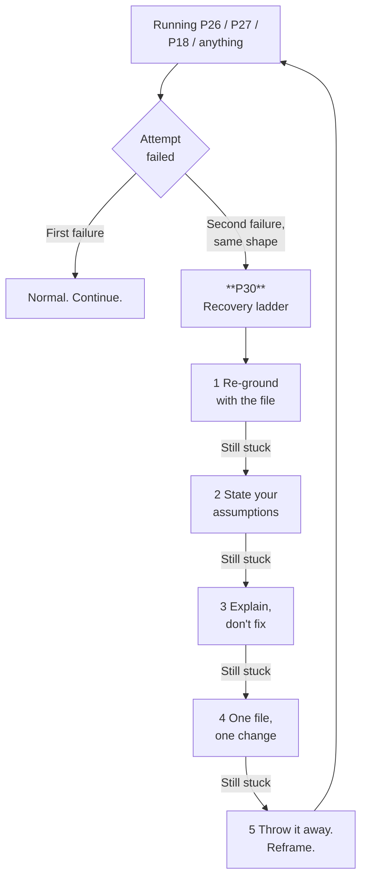
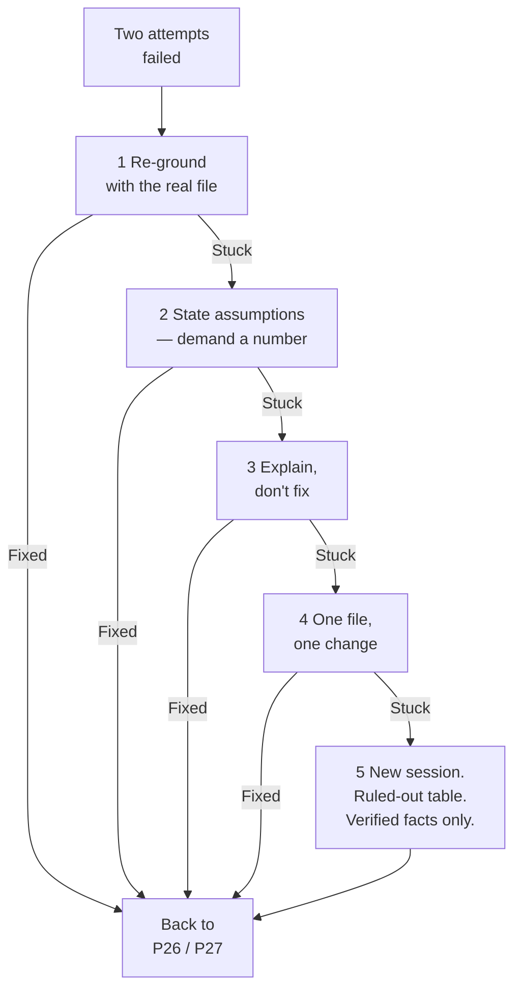

# P30 — When the AI Is Stuck

← [Previous](P29-the-spec-was-wrong.md) · [Library index](../README.md) · Next: [P31](../phase-7-release/P31-write-clean-git-commits.md)

> **One line:** Five recovery moves, cheapest first, ending with the one nobody wants to do.

| | |
|---|---|
| **Phase** | 6 — Rework |
| **Who runs it** | Anyone. Tomas, Ji-woo, Ananya, Rahul, Sofia — this is not a role-specific prompt |
| **When** | Two or more attempts have failed and the third looks like the first |
| **Takes in** | The stuck session, the actual files, and an honest account of what has already been tried |
| **Produces** | Either a diagnosis of why it is stuck, or a clean restart with a better-framed prompt |
| **Hands off to** | Back to whichever prompt you were running — [P26](P26-debug-an-error-fast.md), [P27](P27-fix-from-a-qa-bug-report.md), [P18](../phase-4-build/P18-implement-a-story.md) — or forward to [P31](../phase-7-release/P31-write-clean-git-commits.md) once you are moving again |
| **Time to run** | 5 minutes for the first move. 20 to admit you need the last one. |

---

## 1. The scene

Tuesday, Sprint 3. Tomas is on **NWD-140** — the third of Ananya's five defects, and on paper the easiest of them. A counterparty resends a statement under a new filename and the pipeline creates a duplicate row. Idempotency was supposed to prevent exactly this. It is not preventing it.

*Idempotency*, since it matters here: the property that doing something twice has the same effect as doing it once. Ingest the same statement twice and you should end up with one set of rows, not two. Northwind's rule is invariant 4 in the project's foundations — **idempotency is by SHA-256 of the file's content, never its filename** — because counterparties resend the same statement under new names constantly, and a name-based key would treat every resend as new data.

Attempt one. Tomas describes the bug, the AI reads `core/idempotency.py`, finds nothing wrong, and suggests the hash might not be canonicalising whitespace. It adds normalisation. The duplicate still appears.

Attempt two. The AI now suspects the hash is computed before the blob is fully written. It adds a size check. The duplicate still appears.

Attempt three. It goes back to canonicalisation, with a different implementation. Tomas notices that the diff is roughly the diff from attempt one with the arguments in a different order.

Attempt four. He types "that didn't work either" and gets a fourth theory involving blob metadata, delivered with the same confidence as the first three. He accepts it. It does not work.

Attempt five is where he stops, because he reads the message properly and finds this sentence in it: *"As we established, `core/idempotency.py` is the only place the deduplication key is computed."*

Nobody established that. The AI said it in attempt one, Tomas did not challenge it, and it has been load-bearing ever since. Four attempts, ninety minutes, and every one of them was a fix to a file that was working correctly, because the search space was closed in the first three minutes by an assertion nobody checked.

**The AI was not stuck because the problem was hard. It was stuck because it was standing in the wrong place and had no way of finding that out.**

---

## 2. What this prompt actually does — in plain language

### The honest framing

Most writing about AI coding tools is either advertising or complaint. This section is neither. These are the five ways a session actually goes wrong, described plainly, with no attempt to make any of them sound like a feature.

Before the list, one piece of vocabulary you need.

**The context window** is everything the model can see when it produces its next response: your instructions, the files it has read, its own previous replies, and the results of anything it ran. It is finite. When it fills, the earliest material starts falling out or being compressed. Crucially, **the model's own previous statements are in there with the same weight as the facts** — it cannot tell its earlier guess from a file it actually read. That single property causes three of the five failures below.

**A session** is one continuous conversation with one context window. Starting a new session is starting with an empty one.

### Failure one: going in circles

The same fix arrives twice, sometimes with the variables renamed. Attempt three is attempt one wearing a hat.

Why it happens: each failed attempt goes into the context as text. The model reads its own reasoning back and finds it persuasive, because it wrote it. Meanwhile you have said "that didn't work" four times without saying what changed, so the only new information in the context is a negative signal with no direction attached.

How to spot it: put two diffs side by side. If they touch the same lines and differ only in shape, you are in a circle. **The tell is not that the fixes are wrong. It is that they are variations rather than alternatives.**

### Failure two: confidently asserting something false about the codebase

*"As we established, `core/idempotency.py` is the only place the deduplication key is computed."*

Nothing was established. That was a plausible inference from a filename, made in attempt one, restated as a premise in attempt five. Once it is in the context it is indistinguishable from something read.

Why it happens: models produce the most likely continuation. In a codebase where a file is called `idempotency.py`, "that is where the idempotency logic lives" is overwhelmingly the likely continuation. It is usually true. When it is false, it is false silently and with total confidence, because **the model has no internal signal that distinguishes recall from inference.** There is no hesitancy to detect.

How to spot it: watch for "as we established", "since X is the only", "given that Y always". Every one of those is a claim about your codebase, and you can check any of them in about ten seconds.

### Failure three: plausible code for a file it never read

You get a diff against `sinks/sql_sink.py` with correct-looking imports, matching style, and a function signature that does not exist.

Why it happens: the model has read thousands of files shaped like yours. It can produce a very convincing average of them. If it never actually opened your file — because it was not given, because a tool call failed quietly, or because it decided it did not need to — the output is a plausible file, not your file.

How to spot it: line numbers that do not match, a function that is not there, an import of something you do not depend on, a config key spelled almost right. If a diff does not apply cleanly, do not fix the diff. Ask whether the file was read.

### Failure four: the context fills with failure

By attempt five, the useful material — the bug report, the spec, the real file contents — is buried under four failed diffs and four apologies. If the window is near full, some of it has been dropped entirely.

Why it happens: mechanical. Failed attempts are verbose. Signal-to-noise degrades monotonically and there is no way to reclaim it from inside the session.

How to spot it: it starts forgetting things it knew. It re-reads a file it read twenty minutes ago. It asks you something you told it at the start. **These are not signs it is thinking harder. They are signs the good information is gone.**

### Failure five: the helpful rewrite

You ask for one thing. You get that thing, plus a renamed variable, plus a reordered import block, plus a changed default from `None` to `{}` that alters behaviour in a case you have not thought about.

Why it happens: the model is trained to be helpful, and improving nearby code is helpful in most contexts. It is not helpful in a bug fix, where the value of a diff is inversely proportional to how much of it is unrelated to the bug.

How to spot it: read the whole diff, always, including the parts that look like formatting. The dangerous change is never in the part you were looking at.

> **The one that costs the most.** Failure two, by a distance. The others waste time; a false premise wastes time *and* closes the search space, so every subsequent attempt is inside a box you did not know you were in.

### You are here



### The ladder, and why it is ordered by cost

Each move is more disruptive than the last. Work down, not across. Most sessions recover at move one or two, and the people who end up at move five are usually the ones who tried moves one to four in the wrong order or not at all.

**Move 1 — Re-ground it with the actual file.** Paste the real current contents of the file in question and say "this is the current state, ignore anything you believe about it". Cheapest possible move, fixes failures two, three and often four in one go. It works because you are inserting fresh, authoritative material at the most recent position in the context, which outranks the stale claim.

**Move 2 — Make it state assumptions before acting.** Not "what do you think is wrong" — *"list everything you are treating as true, and mark each as VERIFIED or ASSUMED."* This is the highest-yield move in the whole ladder and the least used. A false premise cannot survive being written down next to the word ASSUMED, because the next question — "how would we check that?" — takes ten seconds to answer.

**Move 3 — Ask it to explain the failure rather than fix it.** Change the task. "Do not propose a fix. Explain why the last one did not work." Explanation and generation pull differently: generation rewards a confident next step, explanation rewards accounting for the evidence. It also stops the diff pile growing.

**Move 4 — Narrow the scope to one file, one change.** Take everything else away. "Only `sinks/sql_sink.py`. One change. Nothing else may be touched." Constraint is a debugging tool — if the fix cannot be made inside the file you believe is at fault, that belief is wrong, and you have learned something rather than generating something.

**Move 5 — Throw the session away.** Start a new one, with an empty context, and a prompt rewritten to include everything you learned. This is the move people resist and it is frequently the fastest. The cost is not the restart. The cost is admitting the last hour produced nothing but knowledge.

Except knowledge is not nothing. **The restart prompt you write after ninety minutes of failure is a much better prompt than the one you started with**, because it contains four eliminated hypotheses, the real file contents, and a sharper description of the symptom. Throwing the session away does not throw the learning away — it throws the noise away and keeps the learning.

### The sunk cost section

The honest advice, which is unwelcome and which is why it gets its own heading.

**After two failed attempts at the same problem, the third is rarely the charm.**

The instinct is the opposite. You have invested forty minutes. The AI *nearly* had it last time. One more round. And the reasoning feels sound — surely each attempt narrows things down?

It does not, and here is the mechanism. In a normal debugging process, each failed attempt eliminates a hypothesis and the search space shrinks. In a stuck AI session, each failed attempt **adds text to the context** and the signal-to-noise ratio shrinks. Those are opposite dynamics. The human process converges. The stuck-session process diverges, and it diverges faster the longer you stay.

This is what the sunk cost fallacy looks like in this specific setting: **the forty minutes you have spent is an argument for starting fresh, not for continuing.** It is why you now have a good prompt to start fresh with.

A rule of thumb that holds up in practice:

| Attempts | What to do |
|---|---|
| 1 fails | Normal. Continue. Failing once means nothing. |
| 2 fail, different shape | Continue, but run move 2 — get the assumptions on the table before attempt 3. |
| 2 fail, same shape | You are in a circle. Move 1 or 2 now. Do not attempt 3 as-is. |
| 3 fail | Move 3 or 4. Stop asking for fixes entirely. |
| 4 fail | Move 5. Restart. There is nothing left in the session worth keeping. |

And one thing that is worth saying because it is often true: **sometimes the AI is not stuck — you are.** If you cannot state what "working" looks like in a checkable sentence, no prompt will help, because there is nothing for the model to aim at. That is not a tooling problem. That is a problem specification problem, and the fix is [P08](../phase-1-discovery/P08-write-acceptance-criteria.md) or a conversation with Ananya.

### The one idea to remember

> **When two attempts have failed, stop asking for a third fix and start asking what it believes. The problem is almost never the fix. It is a premise nobody checked.**

---

## 3. The prompt

This is five prompts, not one, and you use them in order. Move 5 has a full template because it is the one that needs the most rebuilding.

### Moves 1 to 4

```text
**MOVE 1 — RE-GROUND**

Stop. Before anything else: here is the ACTUAL CURRENT CONTENT of [FILE PATH].

[PASTE THE REAL FILE, IN FULL]

**Discard** anything you currently believe about this file. If any statement you made
earlier contradicts what you are now reading, **say which statement and correct it
explicitly** before continuing.

Then answer one question only: **does what you are reading change your diagnosis?**
Yes or no, and why. Do not propose a fix in this message.


**MOVE 2 — ASSUMPTIONS**

Stop proposing fixes. **List every assumption you are currently treating as true**
about this codebase, this bug and this system.

Format each as:
- The assumption, in one sentence.
- **VERIFIED** (you read it — give file and line) or **ASSUMED** (you inferred it).
- If ASSUMED: the single command or file that would settle it.

Include the ones that feel too obvious to state. Especially those. State at least
[N] assumptions. Do not propose a fix in this message.


**MOVE 3 — EXPLAIN, DON'T FIX**

**Do not propose a fix.** Your last [N] attempts did not work.

**Explain**, in plain language:
1. What you expected each attempt to change, specifically.
2. What actually happened instead.
3. What each failure RULES OUT. Be precise — a failed fix is evidence.
4. What all [N] attempts have in common. If they share a premise, name it.
5. Given 1-4, what do you now believe you were wrong about?

If the honest answer to 5 is "nothing, I still think the diagnosis is right", say
that plainly, and tell me what evidence would change your mind.


**MOVE 4 — ONE FILE, ONE CHANGE**

New constraints. These override everything earlier in this conversation.

- You may read any file.
- You may change **exactly one file**: [FILE PATH].
- You may make **one change**, under [N] lines.
- You may not add a dependency, a helper, a new function, or a new file.
- You may not refactor, rename, or reformat anything.

**If the bug cannot be fixed within those constraints, say so and say why.** That
answer is more useful to me than a fix that breaks them. Do not negotiate the
constraints.
```

### Move 5 — the restart

Open a **new session**. Do not continue the old one. Fill this in from what the failed session taught you.

```text
You are a senior [LANGUAGE] engineer working on [PROJECT NAME].

**Context you must not skip:** I have already attempted this [N] times in another
session and failed. I am starting fresh deliberately. Everything below is what those
attempts established. Treat the ruled-out list as settled — do not re-propose
anything on it.

## The problem, restated from scratch

[THE SYMPTOM, IN OBSERVABLE TERMS ONLY — NO THEORY]

Expected: [WHAT SHOULD HAPPEN]
Actual: [WHAT DOES HAPPEN]
Reproduce with: [EXACT COMMAND OR STEPS]

## Already ruled out — do not re-propose these

| # | Attempted | Result | What it rules out |
|---|---|---|---|
| 1 | [WHAT WAS TRIED] | [WHAT HAPPENED] | [THE CONCLUSION] |

## Facts I have VERIFIED myself

[EACH ONE WITH HOW YOU KNOW — file and line, command output, observed value.
Only things you personally checked. Nothing the previous session asserted.]

## What I have NOT verified

[THE THINGS YOU BELIEVE BUT HAVE NOT CHECKED. Being honest here is the point of
the restart.]

## The files

[PASTE THE FULL CURRENT CONTENT OF EVERY FILE THAT COULD PLAUSIBLY BE INVOLVED —
INCLUDING THE ONES YOU DO NOT THINK ARE INVOLVED]

## Your first task — and only this

**Do not propose a fix.**

**Find every place in the pasted code where [THE BEHAVIOUR IN QUESTION] is decided.**
List them all with file and line, including any you would expect me to already know
about. If there is exactly one, say so and say how you confirmed it is the only one.

Then **state what you would check next and why**, and stop.

## Do not

- Do not re-propose anything in the ruled-out table.
- Do not treat anything in "not verified" as true.
- Do not write code in your first response.
- Do not tell me the previous attempts were close.
```

---

## 4. Every placeholder, explained

| Placeholder | What to put in it | Northwind example | What happens if you get it wrong |
|---|---|---|---|
| `[FILE PATH]` (move 1) | The file the AI is making claims about — usually the one it has *not* read | `sinks/sql_sink.py` | Re-ground the file it already read correctly and nothing changes. Ground the one it assumed and the session unsticks in one message |
| `[PASTE THE REAL FILE, IN FULL]` | The whole file, current on disk, no ellipses | All 140 lines of `sql_sink.py` | Paste an excerpt and you have re-grounded it with a partial truth, which is how failure three recurs |
| `[N]` (move 2) | A floor on the assumption count, high enough to be uncomfortable | `at least 8` | Ask for "your assumptions" and you get three safe ones. The false premise is never in the first three — it is too obvious to mention, which is exactly why it was never checked |
| `[N]` (move 3) | How many attempts have failed | `4` | The AI does not know how deep the hole is and treats this as a normal follow-up |
| `[FILE PATH]`, `[N] lines` (move 4) | The single file and a hard line budget | `sinks/sql_sink.py`, `10` | Loose constraints defeat the purpose. The value of move 4 is that failing the constraint is itself informative |
| `[LANGUAGE]`, `[PROJECT NAME]` (move 5) | As in every other prompt | `Python 3.11 on Azure Functions`, `the Northwind ingestion pipeline` | Generic output |
| `[THE SYMPTOM, IN OBSERVABLE TERMS ONLY]` | What you can see. No causes | `resending BA_POS_20260722.pdf as BA_POS_20260722_v2.pdf produces 2 rows in silver for every position` | Include your theory and you have rebuilt the box you just escaped. This is the single most important line in the restart |
| Ruled-out table | Every attempt, its result, and the conclusion | Four rows covering whitespace canonicalisation, blob size, re-canonicalisation, blob metadata | Omit it and you will watch the new session propose whitespace canonicalisation within two minutes |
| `Facts I have VERIFIED myself` | Only things **you** checked, with how | "I ran `SELECT COUNT(*) ... GROUP BY security_id` and saw exactly 2 of each" | Copy the old session's assertions in here and you have transplanted the false premise into a fresh context, which is the worst possible restart |
| `What I have NOT verified` | The things you believe but have not checked | "I have not confirmed `core/idempotency.py` is the only place a dedup key is computed" | Skip this and the restart carries your blind spots forward invisibly |
| `[PASTE THE FULL CURRENT CONTENT OF EVERY FILE...]` | Everything plausibly involved, **including** what you think is irrelevant | `core/idempotency.py`, `sinks/sql_sink.py`, `sinks/snowflake_sink.py`, `function_app.py` | The file you leave out because it is obviously fine is the file with the bug. This happened on NWD-140 |
| `[THE BEHAVIOUR IN QUESTION]` | The behaviour whose decision points you want enumerated | `the deduplication key for a document is computed` | Vague phrasing gets a vague list. "Where is idempotency handled" gets an essay; "where is a dedup key computed" gets line numbers |

---

## 5. The filled-in example

Tomas, ninety minutes into NWD-140, tries move 2 first because move 1 needs him to know which file to paste and he does not.

```text
**MOVE 2 — ASSUMPTIONS**

Stop proposing fixes. **List every assumption you are currently treating as true**
about this codebase, this bug and this system.

Format each as:
- The assumption, in one sentence.
- **VERIFIED** (you read it — give file and line) or **ASSUMED** (you inferred it).
- If ASSUMED: the single command or file that would settle it.

Include the ones that feel too obvious to state. Especially those. State at least
8 assumptions. Do not propose a fix in this message.
```

Eight is not an arbitrary number. Tomas picked it because asking for "your assumptions" had already produced three, all of them true, none of them the problem.

---

## 6. What comes back

### Move 2's output

````markdown
## Assumptions I am currently treating as true

1. **The pipeline computes a deduplication key from the file's content, not its name.**
   VERIFIED — `core/idempotency.py:18`, `sha256(content).hexdigest()`.

2. **`core/idempotency.py` is the only place a deduplication key is computed.**
   ASSUMED — I inferred this from the module name and from the fact that
   `function_app.py:52` calls `compute_content_key()`. I have not searched for other
   key computations.
   *Settle it with:* `rg -n "sha256|md5|dedup|idempot|_key\s*=" --type py`

3. **The duplicate rows are created at the silver (Azure SQL) layer, not gold.**
   ASSUMED — the bug report says "duplicate row" and mentions silver. I have not
   read `sinks/sql_sink.py`.
   *Settle it with:* open `sinks/sql_sink.py`.

4. **The content of the two files is byte-identical.**
   ASSUMED — the report says the counterparty "resent the same statement". Resent
   PDFs are often regenerated with a new timestamp in the metadata, which would
   change the bytes.
   *Settle it with:* `sha256sum` both files.

5. **The key computed in `idempotency.py` is the key actually used by the insert.**
   ASSUMED — this is a separate claim from assumption 2 and I have been conflating
   them. Computing a correct key is not the same as using it.
   *Settle it with:* read the INSERT/MERGE statement in `sinks/sql_sink.py`.

6. **The database has a uniqueness constraint on the dedup key.**
   ASSUMED — not checked. If the constraint is missing, a correct key would not
   prevent a duplicate anyway.
   *Settle it with:* `sql/schema.sql`.

7. **Both ingestions took the same code path.**
   ASSUMED — a resend could arrive by a different route (SFTP vs email) and hit a
   different handler.
   *Settle it with:* the two invocation logs in Application Insights.

8. **My four previous fixes were applied to code that actually runs.**
   ASSUMED — I have not confirmed the deployed build includes them.

**Where this leaves me.** Assumptions 2 and 5 are the load-bearing ones, and I have
been treating both as established since my first response without reading
`sinks/sql_sink.py` at all. I should not have proposed any fix while assumption 5
was unverified. Assumption 5 in particular is one I did not realise I was making —
I collapsed "the key is computed correctly" and "the key is used" into one idea.
````

Tomas runs the command under assumption 2. It takes four seconds.

```text
$ rg -n "sha256|md5|dedup|idempot|_key\s*=" --type py

core/idempotency.py:18:    return hashlib.sha256(content).hexdigest()
core/idempotency.py:31:    content_key = compute_content_key(blob_bytes)
function_app.py:52:    key = compute_content_key(blob_bytes)
sinks/sql_sink.py:78:    dedup_key = hashlib.sha256(blob_name.encode()).hexdigest()
sinks/snowflake_sink.py:44:    merge_key = row["CONTENT_KEY"]
```

`sinks/sql_sink.py:78`. Hashing `blob_name`. Ninety minutes of fixes to a file that was correct the whole time, because of an assumption made in the first three minutes and never written down until now.

### Move 1, immediately after

Now Tomas knows which file to paste. He runs move 1 with the real `sinks/sql_sink.py`, and gets:

````markdown
Reading the actual file changes my diagnosis completely.

**Correcting my earlier statement.** In my first response I said "`core/idempotency.py`
is the only place the deduplication key is computed" and I have repeated it as an
established fact four times since. It is false. `sinks/sql_sink.py:78` computes its
own key from the blob name:

```python
# sinks/sql_sink.py, lines 74-82
def upsert_positions(rows: list[CanonicalPosition], blob_name: str) -> int:
    # Skip if we've already loaded this file.
    dedup_key = hashlib.sha256(blob_name.encode()).hexdigest()
    if _already_loaded(dedup_key):
        return 0
    ...
```

The content key is computed correctly at `function_app.py:52` and passed down the
chain, but this function never receives it — the signature takes `blob_name`, not the
key. It recomputes, from the wrong input.

That explains every observation, including the ones my four attempts did not:
- Identical content under a new filename produces a different `dedup_key`, so
  `_already_loaded` returns False and the rows insert again.
- Nothing raises, because the key is valid, just wrong.
- The content key at `function_app.py:52` is correct, which is why every check I ran
  there passed.
- My whitespace and blob-size fixes changed the content key, which this function
  never used, which is why they had no effect whatsoever. They were not "close".

`sinks/snowflake_sink.py:44` uses `row["CONTENT_KEY"]`, which is correct — that is
why the duplicate appears in silver and not in gold, and it is why gold has been
quietly disagreeing with silver on row counts.

**Yes, this changes my diagnosis.** No fix proposed, as instructed.
````

### How to read this

**Assumption 5 is the one that matters and the AI would never have produced it unprompted.** "The key computed is the key used" is not a hypothesis anyone forms deliberately. It is the kind of thing you only notice you assumed when something forces you to write out eight of them. Asking for three would have produced assumptions 1, 3 and 4. **The floor is the mechanism.** That is the whole reason move 2 specifies a number.

**Four seconds of `rg` beat ninety minutes of prompting.** Not because the tool is better than the model, but because the question changed. "What is wrong with this code" is a hard question. "Where else is a hash computed" is a search, and searches are cheap and total. **When you are stuck, replace a reasoning question with a searching question.**

**The AI corrected itself explicitly and named the false statement.** That is the move-1 instruction working — "say which statement and correct it explicitly". Without that clause you get a new diagnosis quietly replacing the old one, and you never learn that the old one was invented rather than read, which means you learn nothing about how to spot the next one.

**The last paragraph is a bonus finding.** `snowflake_sink.py` uses the right key, so gold and silver have been disagreeing on row counts for some unknown period. Nobody had noticed. That became its own ticket.

**The part that is commonly wrong:** it is tempting, at this point, to skip straight to the fix, because the fix is obvious — pass the content key down instead of recomputing. Do not. You have just watched this session make four confident wrong claims. Take the diagnosis into a fresh run of [P27](P27-fix-from-a-qa-bug-report.md) and do it properly, with a failing test first. **A session that has just been wrong four times has not earned your trust back by being right once.**

---

## 7. Why this is the final prompt

### What "done" means here

Done for P30 is not "the bug is fixed". P30 does not fix bugs. Done is: **you are unstuck** — meaning either you have a diagnosis you can act on, or you have a clean session with a materially better prompt in it.

Concretely, one of these is true:

- A false premise has been identified and corrected, and you can name it.
- Something the AI claimed has been checked and found wrong, by you, with a command.
- The scope has been narrowed enough that the next step is obvious.
- You have restarted with a prompt containing your ruled-out table and your verified facts.

If none of those is true, you are still stuck and you have gone up the ladder rather than down it.

### The checklist

- [ ] You have identified **which specific claim** was wrong, not just that "it wasn't working".
- [ ] You verified that claim yourself — a command you ran, a file you opened.
- [ ] The assumption list had at least one ASSUMED item that turned out to be false. If everything was VERIFIED, you did not ask for enough of them.
- [ ] You have not accepted any fix you cannot explain in one sentence.
- [ ] If you restarted, the new prompt contains the ruled-out table and only facts you personally checked.
- [ ] You have counted the attempts honestly. Four is four, not "a couple".

### Why you should stop rather than keep prompting

This is the prompt where "keep prompting" is itself the failure being treated, so the advice is unusually direct.

**Every additional message in a stuck session makes the session worse.** Not neutral — worse. The context fills with failure, the model reads its own wrong reasoning back as established fact, and the ratio of good information to noise falls with each turn. There is no move available from inside the session that reclaims it.

The specific trap: **the fix that is "almost right".** It gets closer each time. Attempt three fails on one test instead of three. That feels like convergence and it is usually the model narrowing its output to satisfy your feedback rather than to fix the bug — it is fitting to your responses, not to the problem. The test for whether it is real: can you state, in one sentence, the mechanism by which the last change moved things? If not, it is not converging.

The second trap: **restarting without changing anything.** You throw the session away and paste the same opening prompt into a fresh one. You will get the same failure, because the prompt was the problem and the prompt has not changed. Move 5 is a *reframe*, not a reset. The ruled-out table is not optional garnish; it is the entire difference.

### The signal that you are NOT done

**The AI is still asserting things about your code that you have not personally checked.** Go back to move 2 and raise the number.

---

## 8. When it is not done — the follow-up prompts

| What you're seeing | What's actually wrong | Run this next |
|---|---|---|
| Two diffs that touch the same lines differently | Circling. Failure one | Move 1 (§8.1) |
| "As we established…" about something nobody established | False premise. Failure two | Move 2 (§8.2) |
| A diff that will not apply; a function that does not exist | It never read the file. Failure three | Move 1 (§8.1) |
| It forgot something you told it at the start | Context is full. Failure four | Move 5 (§8.5) |
| The diff changed things you did not ask about | Helpful rewrite. Failure five | §8.6 |
| It keeps proposing fixes when you asked for analysis | Momentum. It is optimising for looking productive | Move 3 (§8.3) |
| Everything it says is defensible and nothing works | The scope is too wide to test anything | Move 4 (§8.4) |
| You cannot state what "working" looks like | Not an AI problem | **[P08](../phase-1-discovery/P08-write-acceptance-criteria.md)** |
| You are unstuck and have a diagnosis | Go do it properly | **[P27](P27-fix-from-a-qa-bug-report.md)** or **[P26](P26-debug-an-error-fast.md)** |

### 8.1 Move 1 — re-ground with the actual file

Use this the moment you suspect the AI is describing a file rather than reading it. Cheapest move; try it first, every time.

The prompt is in §3. Two things about using it well.

**Paste the file whole.** An excerpt re-grounds it with a partial truth, and partial truths are what got you here.

**Include the file it says is irrelevant.** On NWD-140 the file with the bug was the one that had never been mentioned. The AI's model of which files matter is exactly the thing that is wrong.

What changes: usually everything, in one message. The correction is often startling in scope, because a single false premise can be supporting the entire diagnosis.

### 8.2 Move 2 — make it state its assumptions

Use this when nothing is obviously wrong and yet nothing works. Highest yield in the ladder.

The prompt is in §3. The thing to get right is the number.

Ask for "your assumptions" and you get three or four, and they will be the ones that were already conscious — which are, by definition, the ones you have already thought about. **The false premise is always in the part that felt too obvious to write down.** Ask for eight and the model has to reach past comfort. Ask for twelve on a hard one.

What changes: you get a list where roughly a third are marked ASSUMED, each with a check that takes seconds. Run the checks. On NWD-140 the second one, `rg -n "sha256|md5|dedup..."`, ended a ninety-minute session in four seconds.

### 8.3 Move 3 — explain, do not fix

Use this when it will not stop generating diffs. Changing the task changes the behaviour.

The prompt is in §3. Point 3 — *"what each failure RULES OUT"* — is the load-bearing clause. It converts four wasted attempts into four eliminated hypotheses, which is the thing a stuck session most needs and least produces on its own.

What changes: the diff pile stops growing and you get an accounting instead. If point 5 comes back "nothing, I still think the diagnosis is right", that is not stubbornness, it is useful — it tells you the model has no alternative available and you should go to move 4 or 5 rather than asking again.

### 8.4 Move 4 — one file, one change

Use this when everything sounds plausible and nothing is testable, or when the diffs keep growing.

The prompt is in §3. The clause that makes it work is *"if the bug cannot be fixed within those constraints, say so and say why"*. That answer is the point. A constraint you cannot satisfy is a measurement.

What changes: either you get a small fix you can actually review, or you get "this cannot be fixed in that file", which relocates the bug for free. Both are progress. Neither requires the model to be right about the cause.

### 8.5 Move 5 — throw it away and reframe

Use this after four failures, or the moment it forgets something you told it at the start.

The full template is in §3. What matters is what goes in it, and there are three rules.

**The ruled-out table is mandatory.** Without it you will watch the new session propose attempt one within two minutes, and you will lose faith in the restart rather than in the prompt.

**The verified-facts section contains only what you checked.** Not what the old session asserted. If you copy its claims across, you have transplanted the false premise into a clean context, which produces the same failure with less noise to spot it in.

**The not-verified section is the hard one and the most valuable.** Writing "I have not confirmed that `core/idempotency.py` is the only place a dedup key is computed" is admitting you built ninety minutes on an unchecked belief. Do it anyway. It is the sentence that stops it happening again.

What changes: the first response usually finds the thing. Not because the model got better — because the prompt did.

### 8.6 "It changed things I didn't ask about"

Use this when the diff contains a rename, a reordered import block, or a changed default you never mentioned.

```text
Your diff changes things I did not ask for. Specifically:

[LIST THEM]

**Produce the diff again with those removed.** Only the change that addresses
[THE ACTUAL PROBLEM].

Then, separately and below the diff, **list every incidental change you removed**,
and for each one say in one line whether it alters behaviour in ANY input case. Be
specific: a default changed from None to an empty collection is a behaviour change,
not a tidy-up.

I will consider them separately. Do not reintroduce any of them.
```

What changes: you get a reviewable diff, plus a list you can triage later. The second half is the useful half — asking "does this alter behaviour" catches the class of change that looks cosmetic and is not, which is where the genuinely nasty bugs come from.

### The ladder



---

## 9. How this goes wrong

### You keep going because it is almost right

The most expensive failure in this file. Each attempt fails slightly less badly, and "slightly less badly" reads as progress.

It is usually not. What is happening is that the model is narrowing its output to satisfy your feedback rather than to fix the bug — you said "that broke test X", so the next diff does not break test X. That is fitting to your responses. The bug is unaffected.

The test that works: **can you state, in one sentence, the mechanism by which the last change moved things?** "It doesn't break test X any more" is not a mechanism. "The key is now computed from content, which is what `_already_loaded` compares against" is. If you cannot state one, you are not converging, and the attempt counter in §2 is the honest guide.

### You blame the model when the input was bad

Sometimes the session is stuck because the prompt never contained the file with the bug in it. That is not a model failure. That is you having decided, before you started, which parts of the system were relevant.

On NWD-140 this is precisely what happened. Tomas never pasted `sinks/sql_sink.py`, because idempotency obviously lives in `idempotency.py`. His own assumption was the one the AI inherited, and then he spent ninety minutes watching it fail to escape a box he had built.

The fix is a habit and it is cheap: **when you are stuck, paste the file you think is irrelevant.** It costs a few thousand tokens. Ninety minutes costs more.

### You restart without reframing

You throw the session away, feel virtuous, and paste the same opening prompt into a fresh window. You get the same failure and conclude that restarting does not work.

Restarting does not work. **Reframing works, and restarting is how you make room for it.** If your new prompt does not contain the ruled-out table and the verified-facts list, you have not reframed anything, you have just cleared the screen.

### You accept a fix you cannot explain

Attempt five produces something that makes the test pass. You do not understand why. It is late, it works, you ship it.

Two weeks later it breaks in a way nobody can diagnose, because nobody ever knew why it worked. And you have spent your evidence — the reproduction is gone, the symptom is gone, and the only thing you have is a change of unknown mechanism sitting in the codebase.

The rule Rahul put in the team's [definition of done](../../Case-Study/Python-ETL/artifacts/definition-of-done.md) after this sprint: **"If you cannot explain in one sentence why the fix works, it is not a fix. It is a coincidence you have committed."**

### This is the wrong prompt entirely

**You are the one who is stuck.** If you cannot state what correct behaviour is in a checkable sentence, no recovery move helps — there is nothing for the model to aim at. Go and write it down, with Ananya or Amara, using [P08](../phase-1-discovery/P08-write-acceptance-criteria.md). It is remarkable how often "I don't know what it should do" is the actual blocker wearing a technical disguise.

**The problem needs information nobody has.** Sometimes the answer lives in Broker Alpha's operations team, or in an Azure service's undocumented behaviour, or in a log nobody enabled. No amount of restarting produces information that does not exist. Stop, name what you need, and go and get it. On NWD-141 that meant enabling a diagnostic setting and waiting for the next month-end — annoying, correct.

**It is genuinely a hard problem and you are doing fine.** Not every long session is a stuck one. Three hours on a real concurrency bug, with each hour eliminating something, is a good three hours. The distinction is whether the search space is shrinking. **Stuck is not "slow". Stuck is "not converging".**

---

## 10. The handoff

P30 hands back, not forward. Once you are unstuck you return to whatever you were doing — [P26](P26-debug-an-error-fast.md) if there was a stack trace, [P27](P27-fix-from-a-qa-bug-report.md) if QA filed it, [P18](../phase-4-build/P18-implement-a-story.md) if you were building. And you return **at the start of that prompt, not in the middle of it.**

That matters more than it sounds. The temptation after a rescue is to take the diagnosis and go straight to the fix, because you have already spent ninety minutes and the answer is finally visible. Resist it. On NWD-140, Tomas restarted P27 from step 1 with the new understanding, wrote a failing test that resent a file under a new name and asserted one row rather than two, watched it fail, and only then changed `sinks/sql_sink.py`. That test is what caught the follow-on problem — that `snowflake_sink.py` was already using the content key, so silver and gold had been disagreeing on row counts for an unknown period. **The session that has just been wrong four times has not earned a shortcut.**

The forward handoff, once the fix is real, is [P31 — Write Clean Git Commits](../phase-7-release/P31-write-clean-git-commits.md). It is worth naming because of a specific trap: after a long stuck session your working directory is full of the debris of four failed attempts. Debug prints, a commented-out block, a dependency added and never removed, a test file with an experiment in it. Committing that mess alongside the real fix is how a two-line change becomes an unreviewable one, and it undoes everything the recovery bought you.

There is one more handoff, and it is to the team rather than to a prompt. **If a session got stuck because a false premise was plausible, the premise is worth writing down.** Northwind's `CLAUDE.md` gained one line after NWD-140: *"Deduplication keys are computed in exactly one place, `core/idempotency.py`. Any sink that computes its own is a bug."* That sentence is now in the context of every future session, and it makes the same false premise impossible to hold. A stuck session that produces a line in the conventions file has paid for itself.

> **Artifact contract — what you carry out of a P30 session**
> Whatever you take forward can be relied on to include:
> - The specific claim that was false, named.
> - How you verified it was false — a command you ran or a file you opened, not the AI's word.
> - A list of what the failed attempts ruled out.
> - An honest count of how many attempts were made.
> - If you restarted: a prompt containing the ruled-out table and only facts you personally checked.
>
> If any of those is missing, you are not unstuck — you are between attempts. Go back to §7.

---

## 11. In the case study

NWD-140 sits in the middle of [`08-sprint-3-rework.md`](../../Case-Study/Python-ETL/08-sprint-3-rework.md), between the two big ones, and it is the chapter's quiet lesson. NWD-142 teaches you what a good process looks like. NWD-140 teaches you what happens without one.

The detail that readers remember is the timing. **Ninety minutes of prompting, four seconds of `rg`.** Tomas kept the terminal output and pinned it above his desk, which Farhan found funny and Rahul found instructive enough to bring to the retrospective. The point is not that grep is better than an AI. The point is that he had spent ninety minutes asking a *reasoning* question — "what is wrong with this code" — when a *searching* question would have closed it immediately. Move 2 is valuable precisely because it converts the first kind of question into the second.

The second detail is the one Rahul pushed at in [`10-retrospective.md`](../../Case-Study/Python-ETL/10-retrospective.md), and it is less comfortable. The false premise did not originate with the AI. Tomas believed idempotency lived in `idempotency.py` — reasonably, since that is what the file is called — and never pasted `sinks/sql_sink.py` into the session at all. The AI inherited his blind spot and then reflected it back at him with enough confidence that he stopped questioning it. **The model did not mislead him. It agreed with him, fluently, four times.** That is a different and harder failure to guard against, and it is why move 2 asks for assumptions rather than for hypotheses: hypotheses are about the bug, and assumptions are about you.

The lasting artifact is the smallest thing in the chapter. One line in [`artifacts/CLAUDE.md`](../../Case-Study/Python-ETL/artifacts/CLAUDE.md): *"Deduplication keys are computed in exactly one place, `core/idempotency.py`. Any sink that computes its own is a bug."* It is now in the context of every session the team runs, which means that particular false premise is not available to be held any more — not by the AI, and not by the next engineer who joins and reads the filename and assumes.

---

← [Previous](P29-the-spec-was-wrong.md) · [Library index](../README.md) · Next: [P31](../phase-7-release/P31-write-clean-git-commits.md)
