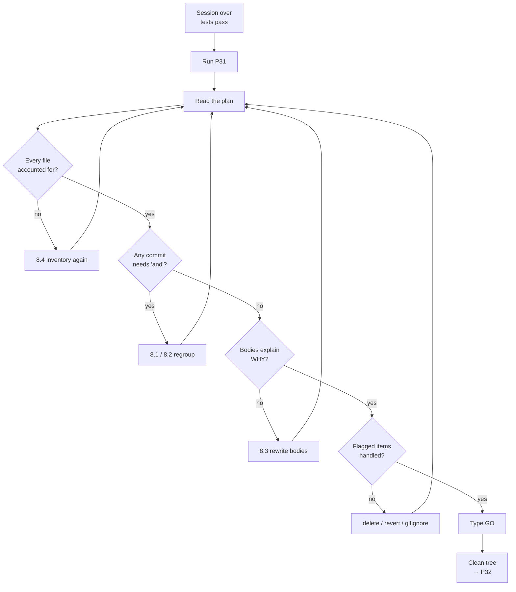

# P31 — Write Clean Git Commits

← [Previous](../phase-6-rework/P30-when-the-ai-is-stuck.md) · [Library index](../README.md) · Next: [P32](P32-release-readiness-check.md)

> **One line:** Turn one messy AI session into several clean, single-purpose commits.

| | |
|---|---|
| **Phase** | 7 — Release |
| **Who runs it** | Everyone. Worked example: Backend Engineer (Ravi Mullick) |
| **When** | End of a working session, after the tests pass, before you push |
| **Takes in** | An uncommitted working tree, plus the story or bug ID it belongs to (e.g. `artifacts/bug-NWD-142.md`) |
| **Produces** | A written commit plan, then the commits themselves in git history |
| **Hands off to** | Project Manager + Team Lead — [P32 Release Readiness Check](P32-release-readiness-check.md) |
| **Time to run** | 10 minutes, most of it reading the plan |

---

## 1. The scene

It is Thursday afternoon in Sprint 4. Ravi has just closed out NWD-142 — the bug Pankaj found where a Broker Alpha statement whose positions table runs across a page boundary silently drops every line item on page two. The document sailed through the confidence gate because every field it *did* extract was high confidence, loaded into Snowflake with half the positions, and then reconciliation reported `MISSING_EXTERNAL` breaks that looked exactly like real settlement failures.

Getting there took most of two days and it ran through half the rework library. Pankaj's bug report went into [P27](../phase-6-rework/P27-fix-from-a-qa-bug-report.md). The reproduction went sideways so he ran [P26](../phase-6-rework/P26-debug-an-error-fast.md). The fix turned out to need a spec change, which meant [P29](../phase-6-rework/P29-the-spec-was-wrong.md), then Gautam's review comments meant [P28](../phase-6-rework/P28-respond-to-code-review-feedback.md). Somewhere in the middle the AI got wedged on a broken test fixture and he had to run [P30](../phase-6-rework/P30-when-the-ai-is-stuck.md) to unstick it.

Now he types `git status` and gets eleven modified files.

Some of them are the fix. Some of them are the new test. One is `artifacts/spec-confidence-gate.md`, which is documentation, not code. One is a `requirements.txt` line he bumped while chasing a red herring and never reverted. One is a `print()` he added to `core/logging_config.py` at 11pm on Tuesday. And one is `config/sources.yaml`, where he temporarily lowered `broker_alpha`'s currency threshold from 0.92 to 0.50 to force the failure — a change that must absolutely not reach `main`.

**Ravi's instinct is to type `git commit -am "fix NWD-142"` and go home, and that single command would destroy about six hours of future debugging value for whoever comes after him.** This prompt is the thing that stops him.

---

## 2. What this prompt actually does — in plain language

### The problem: a work session is not a change

When you work, you work in *sessions* — a block of time where you chase a problem. When you record work in git, you record it in *changes* — one self-contained thing that happened to the code.

Those two units almost never line up. One session usually contains several unrelated changes. One change sometimes takes three sessions. A session has a start time and a coffee break; a change has a purpose.

This prompt exists to translate one into the other. It takes what happened in your session and reshapes it into what actually changed, so that the history of the repository reads like a list of decisions instead of a list of afternoons.

### What a commit actually is, if you have never had this explained

Git is the tool that records the history of a codebase. A **commit** is one saved snapshot of every file in the project, plus a message explaining it, plus a pointer to the commit that came before it. String them together and you get the project's history.

Three terms you will see in this prompt, defined before you need them:

| Term | What it means in ordinary words |
|---|---|
| **Working tree** | The files as they exist on your disk right now, including your half-finished edits. |
| **Staging area** (also "the index") | A holding pen. You *stage* the specific changes you want in the next commit, then commit only those. This is the mechanism that lets one messy working tree become three clean commits. |
| **Hunk** | A contiguous block of changed lines inside one file. `git add -p` walks you through your changes hunk by hunk and asks "include this one?" — which is how you split *within* a file, not just between files. |

The staging area is the whole reason splitting is possible. Without it, git would only be able to save "everything on disk right now," and one messy session would always produce one messy commit.

### Why anyone cares about the message

A commit message is not paperwork. It is the only artefact in the entire system that answers the question *why is this line like this?*

Six months from now someone will run `git blame core/extract.py`, which prints, for every line in the file, the commit that last changed it. They will land on your commit. What they need at that moment is not "what did this change" — the diff already tells them that. They need **why**. Why did the page-stitching logic have to look at `bounding_regions` instead of just concatenating tables? Because Document Intelligence returns a continued table as a *second* table object with no relationship marker, and the only reliable signal that it is a continuation is that its column headers are absent and its bounding box starts at the top of the next page.

That paragraph costs you ninety seconds to write today and saves someone half a day in March.

### Conventional Commits, explained from zero

**Conventional Commits** is a naming convention for commit subjects. That is all it is — a shared shape so that both humans and tools can tell at a glance what kind of change a commit was.

The shape:

```text
type(scope): subject

body explaining WHY, wrapped at 72 characters

footer: refs NWD-142
```

The types you will actually use:

| Type | Use it when | Northwind example |
|---|---|---|
| `feat` | You added behaviour a user or caller can observe | `feat(recon): classify MISSING_EXTERNAL breaks` |
| `fix` | You corrected wrong behaviour | `fix(extract): stitch continued position tables` |
| `test` | You added or changed tests only, no production code | `test(extract): cover tables spanning page breaks` |
| `refactor` | You changed structure, behaviour identical | `refactor(rules): extract threshold lookup` |
| `docs` | Documentation, specs, ADRs, runbooks | `docs(spec): add table continuation rule` |
| `chore` | Build files, dependencies, tooling, config | `chore(deps): pin azure-ai-documentintelligence` |
| `perf` | Faster, behaviour identical | `perf(recon): vectorise the quantity compare` |

The **scope** in brackets is the part of the system you touched — for this codebase, that is usually the module: `extract`, `rules`, `confidence`, `recon`, `sql`, `snowflake`, `ui`. Keep the vocabulary small and consistent. If every engineer invents their own scope names the convention stops being useful within a sprint.

> **Why bother with the convention at all?** Because it makes history *filterable*. `git log --oneline --grep '^fix'` gives you every bug fix since the last release, which is exactly what P32's release readiness review needs. Without the convention you would be reading 200 free-text subjects by hand.

### The 50 and the 72

Two numbers that look arbitrary and are not.

**Subject under 50 characters, written as an imperative.** Fifty is roughly what fits in a single line of `git log --oneline` output, in a GitHub pull request title, and in most terminal widths without wrapping. Imperative means you write it as a command — "stitch continued position tables", not "stitched" or "stitches" or "this commit stitches". The reason is that git itself writes messages in the imperative ("Merge branch...", "Revert..."), so your commits read consistently alongside the generated ones. A useful test: the subject should complete the sentence *"If applied, this commit will ___"*.

**Body wrapped at 72 characters.** Git does not wrap text for you. When you run `git log`, it indents the body by four spaces. Seventy-two plus four is 76, which fits an 80-column terminal. Longer lines run off the edge or wrap raggedly in exactly the tools people read history in.

Neither number is a rule you obey because a linter said so. They are both "this is what makes it readable in the place people actually read it."

### One logical change per commit — what "logical" means

A logical change is one thing you can describe in a single sentence without using the word "and."

- "Stitch position tables that continue onto the next page" — one logical change.
- "Stitch continued tables and bump the SDK version and fix a typo in the runbook" — three.

The test is reversibility. If someone finds that your table-stitching change broke Broker Beta's confirmations, they want to run `git revert` on exactly that commit and get their pipeline back. If your commit also carried the SDK bump and a spec edit, reverting the bug takes the other two with it, and now they have a second problem while still holding the first.

### The AI-specific point — why splitting matters more now than it used to

Here is the part that is genuinely new, and it is the reason this prompt gets a whole library entry instead of a paragraph in a style guide.

When a human made every edit by hand, the edits were *deliberate by construction*. You touched `core/extract.py` because you decided to touch `core/extract.py`. Your working tree was messy in proportion to how distracted you were, which is to say: a bit messy, in ways you could remember.

An AI-assisted session does not work like that. You describe a problem, and over the next two hours the assistant reads twenty files, edits eight, adds a test, adjusts an import, notices an unrelated type error and fixes it, adds a debug log to diagnose something, tries an approach, abandons it, and leaves two helper functions behind. Every one of those edits was reasonable in the moment. **Collectively they are three or four unrelated changes wearing the trench coat of one session, and unlike a human's mess, you did not personally make each edit, so you do not personally remember why each one is there.**

That has two consequences.

First, **the splitting step is now the expensive, valuable part of this prompt** — not the message wording. Wording is a convention anyone can learn in ten minutes. Splitting requires someone to look at eleven changed files and work out that they represent three intentions, and that one of them should not be committed at all. That is real analysis, and it is exactly the thing you are asking the AI to do first.

Second, **the risk profile changed.** A human rarely accidentally commits a threshold they lowered to force a test failure, because they remember lowering it. In an AI session that edit might have been made by the assistant, forty minutes ago, in a file you have not looked at since. This is not hypothetical for Northwind — it is precisely the `config/sources.yaml` change sitting in Ravi's working tree right now, and it would have shipped `broker_alpha` with a currency confidence threshold of 0.50 instead of 0.92, which is to say it would have shipped a pipeline that quietly accepts garbage from the counterparty with the worst scan quality.

So the shape of this prompt is: **inventory everything, group by intention, flag what should not be committed, show me the plan, and only then commit.**

### Never mix a refactor with a behaviour change

This one deserves its own heading because it is the single most common way a clean-looking commit becomes unreviewable.

A refactor is a change where the code moves but the behaviour does not. Renaming a variable, extracting a function, reordering imports, changing a loop to a comprehension.

A behaviour change is one where the output differs for some input.

When you mix them, the diff shows sixty changed lines, of which four matter. The reviewer has to read all sixty to find the four, and reviewers under time pressure do not do that — they skim, and the four lines slide past. Gautam's review discipline in this team is explicitly built around this: he will send back a mixed commit without reading it, and he is right to.

Keep them separate and both commits become trivial. The refactor commit gets reviewed as "does the behaviour still match?" — the test suite answers that. The behaviour commit is four lines and the reviewer's full attention is on them.

### Never commit secrets or generated files

Two categories that should never enter history, for two different reasons.

**Secrets** — API keys, connection strings, private keys, tokens. The reason to care is that git history is permanent. Deleting the secret in a later commit does not remove it; it is still in the earlier commit, still in every clone anyone made, still in the fork someone opened last month. The only real remediation is to rotate the credential, which means an incident. For Northwind this should never happen because of design invariant six — no API keys anywhere, managed identity via `DefaultAzureCredential`, Snowflake on key-pair auth — but the private key file lives on developer machines during setup, and a `.pem` in a working tree is exactly the kind of thing an over-eager `git add .` scoops up.

**Generated files** — `__pycache__/`, `.venv/`, `dist/`, `node_modules/`, `.coverage`, local `.env` files, anything a build step produces. These bloat the repository, create merge conflicts nobody can resolve meaningfully, and make diffs unreadable. They belong in `.gitignore`. If the AI proposes committing one, that is a signal `.gitignore` has a gap, and fixing the gap is the actual correct response.

### The stop gate — and why it is the whole design

A **stop gate** is an instruction that tells the AI to stop and show you something before doing the irreversible part.

Here the gate is: **produce the complete commit plan, in full, and wait. Do not run a single `git commit` until I say go.**

Why this matters more here than in most prompts: commits are *semi*-irreversible. You can undo them, but undoing them involves history rewriting, which is fiddly, and which is genuinely dangerous once you have pushed to a shared branch. Ten seconds of reading a plan beats twenty minutes of `git rebase -i` and the small but real chance of losing work.

The gate also creates the moment where a human looks at the inventory and says "wait, why is `sources.yaml` in there?" That question is the entire value of this prompt. Every other part is bookkeeping.

### What the AI is actually doing when this runs

Mechanically, four passes:

1. **Inventory.** Run `git status` and `git diff` and read every changed hunk. Not the file names — the actual changed lines.
2. **Group by intention.** For each hunk, answer "what problem was this solving?" Hunks that answer the same way belong in the same commit.
3. **Triage the leftovers.** Anything that does not fit an intention is either debug scaffolding (delete it), an unrelated drive-by fix (its own commit, or revert it and do it separately), or a secret/generated file (never commit).
4. **Order the commits.** Put them in an order where the repository builds and the tests pass at every step, if you can. Test-first is a natural ordering: the failing test, then the fix that makes it pass.

Then it stops and shows you the result.

### If you remember one thing

**Commit history is a message to a stranger — and after an AI session, that stranger includes you next month.** The AI can write beautiful subject lines all day. What it cannot do without being asked is notice that your eleven changed files are actually three changes plus one thing that must never ship. Ask it to do the noticing.

---

## 3. The prompt

Paste this after a work session, with the changes still uncommitted. It runs in your repository, so the assistant needs shell access to run `git status` and `git diff`.

```text
You are a senior engineer preparing my working tree for review. **Split this
session's changes into clean, single-purpose commits.**

**STOP GATE — read this first:** produce the complete commit plan and STOP.
Do NOT run `git add`, `git commit`, `git reset`, or any command that changes
the repository, until I reply with the word GO. Read-only git commands
(`git status`, `git diff`, `git log`) are fine and expected.

CONTEXT
- Repository: [REPO PATH]
- Branch: [BRANCH NAME]
- What I was working on: [STORY OR BUG ID + ONE LINE]
- Ticket/spec reference: [ARTIFACT PATH]
- Commit convention: Conventional Commits (type(scope): subject)
- Allowed scopes: [SCOPE LIST]

STEP 1 — INVENTORY
**Run** `git status --porcelain` and `git diff` (staged and unstaged).
**List** every changed file and, for each one, summarise what actually changed
in the hunks — not the filename, the content.

STEP 2 — GROUP BY INTENTION
**Group** the hunks by the problem each one was solving. One logical change per
group. A group is correct if you can describe it in one sentence with no "and".
**Split within a file** where a single file contains hunks from two different
intentions — say which hunks go where.

STEP 3 — FLAG WHAT MUST NOT BE COMMITTED
**Flag separately**, and do NOT put in any commit:
- Debug scaffolding: print statements, temporary logging, commented-out code
- Test-forcing edits: thresholds, dates, feature flags changed to reproduce a
  failure and never reverted
- Secrets: keys, tokens, connection strings, .pem/.key files, .env files
- Generated files: __pycache__, .venv, dist, node_modules, coverage output
For each flagged item say: DELETE, REVERT, or ADD-TO-GITIGNORE.

STEP 4 — WRITE THE PLAN
For each commit, in the order they should be applied, give me:
- The exact `git add` commands (file paths, or `git add -p` with which hunks)
- The full commit message: subject line, blank line, body, footer
- Subject: imperative mood, under 50 characters, `type(scope): subject`
- Body: explains WHY this change exists, hard-wrapped at 72 characters
- Footer: `Refs: [STORY OR BUG ID]`
- One line: what the reviewer of this commit should be looking at

RULES
- **Never mix** a refactor with a behaviour change. If one file has both, split
  the hunks and produce two commits.
- **Order** the commits so the build and tests pass after each one where that is
  achievable. Say so explicitly if it is not achievable and why.
- **Explain WHY in the body, not what.** The diff already shows what. If the
  body would just restate the diff, write the reason the change was needed
  instead, including what was wrong before.

DO NOT
- Do NOT commit anything before I say GO.
- Do NOT use `git add .` or `git add -A` anywhere in the plan.
- Do NOT amend or rebase existing commits.
- Do NOT invent a reason for a change you cannot explain from the diff — mark it
  "NEEDS EXPLANATION FROM AUTHOR" and ask me.
- Do NOT write subjects like "fix bug", "update code", "changes" or "wip".
- Do NOT bundle unrelated drive-by fixes into a related commit to save time.

YOU ARE DONE WHEN
Every changed hunk in the working tree is either assigned to exactly one commit
in the plan, or explicitly flagged for DELETE / REVERT / GITIGNORE — with
nothing unaccounted for — and I have the exact commands to execute the plan.

Output the plan as markdown to the chat. After I reply GO, execute it commit by
commit, pausing after each one to show me `git log --oneline -1`.
```

---

## 4. Every placeholder, explained

| Placeholder | What to put in it | Northwind example | What happens if you get it wrong |
|---|---|---|---|
| `[REPO PATH]` | The absolute path to the repository root, so the assistant runs git in the right place | `Case-Study/Python-ETL/code/doc_ingestion` | Runs git in the wrong directory, reports "not a git repository", or worse, inventories a different project's changes |
| `[BRANCH NAME]` | The branch you are on. Get it from `git branch --show-current` | `fix/NWD-142-table-continuation` | Low risk, but the plan may suggest a merge or push target that does not exist |
| `[STORY OR BUG ID + ONE LINE]` | The ticket ID plus a one-sentence description of what you set out to do | `NWD-142 — line items on page 2 of a Broker Alpha statement are silently dropped` | This is the anchor for grouping. Without it the AI groups by file, which produces one commit per file and defeats the whole exercise |
| `[ARTIFACT PATH]` | Path to the bug report, story, or spec this work traces to. The AI reads it for the WHY | `artifacts/bug-NWD-142.md` | Bodies become vague. You get "fixes a bug in extraction" instead of the actual mechanism and its consequence |
| `[SCOPE LIST]` | The allowed scope words for `type(scope):`, so the vocabulary stays consistent across the team | `land, classify, translate, extract, redact, rules, confidence, transform, sql, snowflake, recon, ui, infra` | The AI invents scopes. Six months later you have `extraction`, `extract`, `doc-extract` and `parser` all meaning the same module, and grep stops working |

> **On `[SCOPE LIST]`.** Keep this list in your project context file (see [P01](../phase-0-foundation/P01-generate-the-project-context-file.md)) so every engineer pastes the same one. Gautam added it to Northwind's `CLAUDE.md` in Sprint 0 for exactly this reason.

---

## 5. The filled-in example

Ravi runs this on Thursday afternoon of Sprint 4, with the NWD-142 fix finished and eleven files modified.

```text
You are a senior engineer preparing my working tree for review. **Split this
session's changes into clean, single-purpose commits.**

**STOP GATE — read this first:** produce the complete commit plan and STOP.
Do NOT run `git add`, `git commit`, `git reset`, or any command that changes
the repository, until I reply with the word GO. Read-only git commands
(`git status`, `git diff`, `git log`) are fine and expected.

CONTEXT
- Repository: Case-Study/Python-ETL/code/doc_ingestion
- Branch: fix/NWD-142-table-continuation
- What I was working on: NWD-142 — on a Broker Alpha statement where the
  positions table spans a page boundary, every line item on page 2 is silently
  dropped. The document still passes the confidence gate, loads into Snowflake
  with half the positions, and reconciliation then reports MISSING_EXTERNAL
  breaks that look like genuine settlement failures.
- Ticket/spec reference: artifacts/bug-NWD-142.md and
  artifacts/spec-confidence-gate.md
- Commit convention: Conventional Commits (type(scope): subject)
- Allowed scopes: land, classify, translate, extract, redact, rules,
  confidence, transform, sql, snowflake, recon, ui, infra

STEP 1 — INVENTORY
**Run** `git status --porcelain` and `git diff` (staged and unstaged).
**List** every changed file and, for each one, summarise what actually changed
in the hunks — not the filename, the content.

STEP 2 — GROUP BY INTENTION
**Group** the hunks by the problem each one was solving. One logical change per
group. A group is correct if you can describe it in one sentence with no "and".
**Split within a file** where a single file contains hunks from two different
intentions — say which hunks go where.

STEP 3 — FLAG WHAT MUST NOT BE COMMITTED
**Flag separately**, and do NOT put in any commit:
- Debug scaffolding: print statements, temporary logging, commented-out code
- Test-forcing edits: thresholds, dates, feature flags changed to reproduce a
  failure and never reverted
- Secrets: keys, tokens, connection strings, .pem/.key files, .env files
- Generated files: __pycache__, .venv, dist, node_modules, coverage output
For each flagged item say: DELETE, REVERT, or ADD-TO-GITIGNORE.

STEP 4 — WRITE THE PLAN
For each commit, in the order they should be applied, give me:
- The exact `git add` commands (file paths, or `git add -p` with which hunks)
- The full commit message: subject line, blank line, body, footer
- Subject: imperative mood, under 50 characters, `type(scope): subject`
- Body: explains WHY this change exists, hard-wrapped at 72 characters
- Footer: `Refs: NWD-142`
- One line: what the reviewer of this commit should be looking at

RULES
- **Never mix** a refactor with a behaviour change. If one file has both, split
  the hunks and produce two commits.
- **Order** the commits so the build and tests pass after each one where that is
  achievable. Say so explicitly if it is not achievable and why.
- **Explain WHY in the body, not what.** The diff already shows what. If the
  body would just restate the diff, write the reason the change was needed
  instead, including what was wrong before.

DO NOT
- Do NOT commit anything before I say GO.
- Do NOT use `git add .` or `git add -A` anywhere in the plan.
- Do NOT amend or rebase existing commits.
- Do NOT invent a reason for a change you cannot explain from the diff — mark it
  "NEEDS EXPLANATION FROM AUTHOR" and ask me.
- Do NOT write subjects like "fix bug", "update code", "changes" or "wip".
- Do NOT bundle unrelated drive-by fixes into a related commit to save time.

YOU ARE DONE WHEN
Every changed hunk in the working tree is either assigned to exactly one commit
in the plan, or explicitly flagged for DELETE / REVERT / GITIGNORE — with
nothing unaccounted for — and I have the exact commands to execute the plan.

Output the plan as markdown to the chat. After I reply GO, execute it commit by
commit, pausing after each one to show me `git log --oneline -1`.
```

---

## 6. What comes back

This is the plan Ravi gets. It is long because the session was long, and that is the point — this is what two days of AI-assisted work actually looks like before anyone tidies it.

````markdown
# Commit plan — fix/NWD-142-table-continuation

## Step 1 — Inventory (11 changed paths)

| File | What actually changed |
|---|---|
| `core/extract.py` | +48/-6. New `_stitch_continued_tables()` joins a table with no header row to the preceding table when its bounding region starts at the top of the next page. `extract_line_items()` now calls it before mapping rows. |
| `core/extract.py` | +3/-3, separate hunk. Renamed local `t` to `table` in three places. Behaviour identical. |
| `core/confidence.py` | +22/-1. New `check_row_count()` compares the extracted line-item count against the statement's declared "Total positions: N" field and raises `RowCountMismatch`. |
| `core/rules.py` | +9/-2. `apply()` now routes a `RowCountMismatch` to the exception queue with reason `ROW_COUNT_MISMATCH` instead of letting it escape. |
| `tests/test_extract.py` | +64/-0. New `TestTableContinuation` class, 4 cases, using a new two-page Broker Alpha fixture. |
| `tests/test_confidence.py` | +31/-0. Three cases for `check_row_count()`. |
| `tests/fixtures/broker_alpha_two_page.json` | New file, 812 lines. Captured Document Intelligence response for the failing statement, PII already redacted. |
| `artifacts/spec-confidence-gate.md` | +37/-4. New section "Table continuation across page boundaries" plus a completeness rule: a document is only gate-passing if the extracted row count matches the declared count. |
| `core/logging_config.py` | +2/-0. `print(f"DEBUG rows={len(rows)}")` at line 61. |
| `config/sources.yaml` | +1/-1. `broker_alpha.thresholds.currency` changed 0.92 → 0.50. |
| `requirements.txt` | +1/-1. `azure-ai-documentintelligence` 1.0.0 → 1.0.2. |

## Step 2 — Grouping (3 intentions)

1. **Prove the bug exists** — the fixture and the failing tests.
2. **Fix the bug** — table stitching, the row-count check, and the rules routing.
3. **Update the spec** — the rule the fix now implements.

`core/extract.py` contains hunks from intention 2 AND a pure rename. The rename
is split out into its own commit (commit 4) so the fix diff stays four hunks
wide and readable.

## Step 3 — Must NOT be committed

| Item | Verdict | Command |
|---|---|---|
| `core/logging_config.py` debug print, line 61 | **DELETE** | `git checkout -- core/logging_config.py` |
| `config/sources.yaml` currency 0.92 → 0.50 | **REVERT** — this is the reproduction hack. Shipping it would set the *lowest* currency threshold in the system on the counterparty with the *worst* scan quality. | `git checkout -- config/sources.yaml` |
| `requirements.txt` SDK bump 1.0.0 → 1.0.2 | **NEEDS EXPLANATION FROM AUTHOR** — nothing in this session's diff requires 1.0.2. If it was deliberate it belongs in its own `chore(deps)` commit with a note on what it fixes. If it was speculative, revert it. | ask |
| `__pycache__/` (4 dirs, untracked) | **ADD-TO-GITIGNORE** — `.gitignore` has `*.pyc` but not `__pycache__/` | add line to `.gitignore` |

## Step 4 — The plan

### Commit 1 of 4 — the failing test

```bash
git add tests/fixtures/broker_alpha_two_page.json
git add tests/test_extract.py
```

```text
test(extract): cover tables spanning page breaks

Adds a captured Document Intelligence response for the Broker Alpha
daily position statement that triggered NWD-142: 23 positions, of
which 9 fall on page 2 because the table continues across the page
boundary.

These four cases fail against the current extractor. That is
deliberate — they are the reproduction, committed before the fix so
the failure is recorded in history and anyone can check out this
commit and see the bug for themselves.

The fixture is a real response with PII already redacted through
core/redact.py. Account holder names are replaced, position data is
untouched, because the position data is the thing under test.

Refs: NWD-142
```

Reviewer should look at: whether the fixture is genuinely representative
of a Broker Alpha statement, not a hand-crafted shape that only fails in
one contrived way.

### Commit 2 of 4 — the fix

```bash
git add -p core/extract.py     # hunks 1, 2, 4, 5 — skip hunk 3 (the rename)
git add core/confidence.py
git add core/rules.py
git add tests/test_confidence.py
```

```text
fix(extract): stitch continued position tables

Document Intelligence returns a table that continues onto the next
page as a SEPARATE table object with no relationship back to the
first one. The extractor mapped each table independently, so every
line item after the page break was dropped on the floor.

Nothing caught this. Every field that WAS extracted had high
confidence, so the confidence gate passed the document and it loaded
into Snowflake with 14 of 23 positions. Reconciliation then reported
MISSING_EXTERNAL on the other 9, which is indistinguishable from a
genuine settlement failure.

Two changes, because one of them alone would not be enough:

1. _stitch_continued_tables() joins a table to its predecessor when
   it has no header row and its bounding region starts at the top of
   the following page. That fixes the observed case.

2. check_row_count() compares the extracted line-item count with the
   statement's declared total and sends any mismatch to the exception
   queue. That catches the NEXT variant of this, whatever it turns
   out to be, because the failure mode here is missing data and
   missing data is invisible to a per-field confidence check.

Refs: NWD-142
```

Reviewer should look at: the continuation heuristic in
`_stitch_continued_tables()`. "No header row and starts at top of next page"
is the assumption the whole fix rests on. Ask what happens when a broker
sends two genuinely separate tables back to back.

### Commit 3 of 4 — the spec

```bash
git add artifacts/spec-confidence-gate.md
```

```text
docs(spec): add table continuation rule

The spec said what to do with a field whose confidence is too low. It
said nothing about a field, or a row, that never arrived at all. That
gap is why NWD-142 shipped: the code matched the spec exactly.

Adds two rules:
- Tables continuing across a page boundary are one logical table.
- A document only passes the gate if the extracted row count matches
  the declared total. Completeness is now a gate condition, not just
  confidence.

Written up as a spec change rather than folded into the fix commit,
because this changes what "correct" means for every future
counterparty, not just Broker Alpha.

Refs: NWD-142
```

Reviewer should look at: whether the declared-total field exists on every
counterparty layout. If `broker_beta_em` confirmations do not carry one,
this rule needs a per-source opt-out and the spec should say so.

### Commit 4 of 4 — the rename

```bash
git add -p core/extract.py     # hunk 3 only
```

```text
refactor(extract): rename loop variable t to table

Pure rename inside extract_line_items(). No behaviour change. Split
out of the NWD-142 fix so that commit's diff shows only the four
hunks that change behaviour.

Refs: NWD-142
```

Reviewer should look at: nothing. Confirm the tests pass and move on.

## Ordering note

Tests pass after commits 2, 3 and 4. They FAIL after commit 1, by design —
commit 1 is the reproduction. If your CI blocks on any red commit, invert
the order of 1 and 2, or mark the four new cases `xfail` in commit 1 and
remove the marker in commit 2.
````

### How to read this

Three things in there matter more than the rest.

**The `config/sources.yaml` line in Step 3.** That is the whole reason the stop gate exists. Ravi lowered `broker_alpha`'s currency threshold to 0.50 on Tuesday night to force the extractor to accept a bad scan so he could get to the table-continuation code path. He forgot. A `git commit -am` would have shipped it, and the next Broker Alpha statement with smudged scan quality would have loaded a currency value nobody had any reason to trust — into the warehouse, past the gate, into the reconciliation. That single flagged row justifies the prompt.

**The body of commit 2.** Read it again and notice what it does *not* say. It does not say "added a function to join tables." It says what Document Intelligence actually returns, why the old code was reasonable, what the consequence was downstream, and why there are two changes rather than one. That is what someone running `git blame` in March needs.

**The `NEEDS EXPLANATION FROM AUTHOR` on `requirements.txt`.** This is the AI correctly refusing to guess. It cannot tell from the diff whether the SDK bump was deliberate or a leftover from a dead end, and inventing a plausible reason would put a lie in permanent history. Ravi remembers: it was a dead end. He reverts it.

**The part that is commonly wrong:** the ordering note. A lot of teams have continuous integration that rejects any commit where tests fail, which makes "commit the failing test first" impossible as written. The plan flags this rather than silently producing something your pipeline will reject. Read that note before you type GO.

---

## 7. Why this is the final prompt

**What "done" means here.** Every hunk in your working tree is accounted for — assigned to a commit or explicitly flagged for deletion, reversion, or gitignore — and the flagged items have been dealt with. Not "most of them." All of them. `git status` after execution should show a clean tree.

**The checklist:**

- [ ] Every changed file from `git status` appears somewhere in the plan.
- [ ] No commit description needs the word "and" to explain it.
- [ ] Every flagged item (debug print, threshold hack, secret, generated file) has been deleted, reverted, or gitignored — and you have re-run `git status` to confirm.
- [ ] Every subject line is under 50 characters, imperative, and would complete the sentence "If applied, this commit will ___".
- [ ] Every body explains *why*, not *what*. If you can delete a body sentence and lose nothing the diff does not already say, delete it.
- [ ] No commit mixes a refactor with a behaviour change.
- [ ] The test suite passes at the tip of the branch.

**Why you should stop rather than keep prompting.** The failure mode specific to this prompt is polishing. Ask for a rewrite and you will get better prose — a tighter subject, a smoother body — and none of that changes whether the split is correct. The split is the substance. Once the grouping is right and the flags are handled, further prompting is editing, and editing a commit message you already understand is time spent on nothing. Type GO.

There is also a real cost to hesitating: while you deliberate, the branch drifts from `main` and you inherit merge conflicts you did not have when the plan was written.

**The signal that you are NOT done.** Any commit in the plan whose description contains "and", or any file in `git status` that does not appear anywhere in the plan. Either one means the grouping missed something — go to §8.

---

## 8. When it is not done — the follow-up prompts

| What you're seeing | What's actually wrong | Run this next |
|---|---|---|
| One giant commit containing everything | The AI grouped by session, not by intention. Usually because `[STORY OR BUG ID + ONE LINE]` was vague, so there was nothing to group *against* | **8.1** |
| A commit description that needs "and" | Two intentions got merged. Almost always a refactor riding along with a behaviour change | **8.2** |
| Bodies that just restate the diff in prose | The AI had no access to the WHY. It read the code but not the bug report | **8.3** |
| A file in `git status` that is in no commit and on no flag list | Incomplete inventory. Common with untracked files, which `git diff` does not show | **8.4** |
| A commit you already made is wrong, and you have not pushed | Nothing wrong with the prompt — you need the amend/split recipe | **8.5** |
| Plan is fine but CI rejects the red test commit | Your pipeline forbids failing commits | Use the `xfail` variant in **8.5**, or invert commits 1 and 2 |
| The AI keeps proposing `git add .` | It is optimising for your typing speed over your safety. Restate the DO NOT | Re-run §3 and add "Any plan containing `git add .` is rejected" |
| Confusion about which commits belong to this release at all | Wrong prompt — you need the release view | **[P32](P32-release-readiness-check.md)** |

### 8.1 "It gave me one giant commit"

Use this when the plan came back with a single commit covering an entire two-day session.

```text
That is one commit for a session that solved several different problems. **Redo
the grouping** using this test: for each proposed commit, write the sentence
"This commit ___". If the sentence needs the word "and", it is two commits.

**Go back to the hunks**, not the files. For every single hunk, answer one
question in five words or fewer: what problem was this hunk solving?

Then **group by the answer**, not by the file it lives in. Expect a file to
appear in more than one commit — that is normal and it is what `git add -p` is
for.

**Give me** the revised plan with the one-sentence test written out under each
commit so I can check it myself.
```

*What changes:* you get three to five commits instead of one, and each carries its own justification sentence you can verify at a glance.

### 8.2 "One of these commits has an 'and' in it"

Use this when the split is mostly right but one commit is doing two jobs.

```text
Commit [N] fails the one-sentence test — it mixes [DESCRIBE THE TWO THINGS].

**Split it.** Show me the exact hunk boundaries: which hunks of which files go
to each half.

**Order** the two halves so the behaviour-changing one comes second, and the
refactor first — a reviewer reading the second diff should see only lines that
change what the code does.

**Re-check every other commit** in the plan against the same test while you are
in there, and tell me if any others fail it.
```

*What changes:* one commit becomes two with explicit hunk assignments, and you usually discover a second mixed commit you had not noticed.

### 8.3 "The bodies just describe the diff"

Use this when every body reads like "this change adds a function that joins tables."

```text
The commit bodies restate the diff. The diff is already in the commit — I do not
need it twice.

**Read** [ARTIFACT PATH] and any linked spec before rewriting.

For each commit, **rewrite the body** to answer these four questions in order,
in prose, hard-wrapped at 72 characters:
1. What was the behaviour BEFORE this change?
2. Why was that wrong, and what did it cost downstream?
3. What assumption or fact about the system made the old code look correct at
   the time it was written?
4. Why this fix rather than an obvious alternative?

If you cannot answer question 3 or 4 from the material you have, write
"NEEDS EXPLANATION FROM AUTHOR" and ask me the specific question. **Do not
guess** — a plausible invented reason in permanent history is worse than a gap.
```

*What changes:* bodies stop narrating the diff and start carrying the reasoning. Question 3 is the one that produces the genuinely useful sentences.

### 8.4 "There is a file in git status that is nowhere in the plan"

Use this when the inventory missed something. Untracked files are the usual culprit.

```text
`git status` shows [FILE PATH], which appears in no commit and on no flag list.

**Re-run the inventory** including untracked files:
`git status --porcelain --untracked-files=all`

`git diff` does not show untracked files at all, so anything newly created was
invisible to your first pass.

For every file in that output, **assign it** to exactly one of: a commit in the
plan, DELETE, REVERT, or ADD-TO-GITIGNORE. **Print the complete list** with a
verdict against each line, and confirm the count matches the count from
`git status --porcelain --untracked-files=all | wc -l`.
```

*What changes:* new fixture files, new modules and stray `.env` files stop hiding. The count check is what makes it trustworthy.

### 8.5 "I already committed and it is wrong (not pushed)"

Use this when you jumped the gate, or a review comment landed after you committed.

```text
I have already made commit [SHA] on branch [BRANCH] and it is NOT pushed
anywhere. It is wrong because [REASON].

**Tell me which case this is** and give me only that recipe:

A. Message wrong, content right → amend
B. Content wrong, message right → fix, then amend
C. One commit should be two → soft reset and re-split
D. Commit should not exist at all → drop it

For the case you pick, **give me** the exact commands with the real SHA and real
paths filled in, plus a one-line safety note on what is unrecoverable if I get
it wrong.

**Confirm first** that [SHA] is not pushed: run
`git branch -r --contains [SHA]` and tell me what it returns. If it returns
anything at all, **stop** and tell me to use `git revert` instead — I am not
rewriting shared history.
```

*What changes:* you get one recipe instead of four, and the push check runs before anything destructive. That check is the important half.

### The loop



---

## 9. How this goes wrong

### You type GO without reading the flag list

The single most expensive mistake available here, and it happens because the flag list sits in the middle of a long document and the commit messages at the bottom are more interesting to read.

The flag list is the part that catches things you cannot see any other way. Ravi's `sources.yaml` threshold is the example this chapter is built around, but the general shape recurs constantly: a test date pinned to last Tuesday, a feature flag flipped on to skip redaction while debugging, a retry count set to 1 to make a failure reproduce faster. Every one of those is a change that looks harmless in a diff and is a production incident in a deployment.

**The fix:** read Step 3 first, deal with every item in it, re-run `git status`, and only then read the commit messages. Make it a habit in that order.

### You let the AI use `git add .`

`git add .` stages everything, which is the exact opposite of what this prompt is for. The AI will drift toward it whenever the hunk-level plan gets complicated, because it is shorter to write and it "works."

It works right up until it stages the `.env` file you created twenty minutes ago while testing a local Snowflake connection.

**The fix:** the DO NOT list already forbids it, but check the actual commands before executing. If you see `git add .` or `git add -A` anywhere, reject the plan and say so — do not fix it yourself, because if the AI reached for it once it will have reached for it in more than one place.

### You commit the fix and the spec together because they feel like one thing

They genuinely do feel like one thing. Ravi fixed the extractor and updated `artifacts/spec-confidence-gate.md` in the same session, for the same reason, tracing to the same bug. Why two commits?

Because they have different audiences and different lifespans. The code change is reviewed by Gautam against the test suite. The spec change is reviewed by Hem against every *other* counterparty — and her question is going to be "does `broker_beta_em` even have a declared-total field?" That is a different conversation, on a different timescale, and it may well conclude that the spec rule needs a per-source opt-out while the code fix is perfectly fine as it stands.

If they are one commit, "the spec rule needs more thought" blocks the bug fix. If they are two, the fix ships today and the spec conversation continues.

**The fix:** separate any commit that changes an artefact in `artifacts/` from any commit that changes code in `code/`. Different reviewers, different commits. That heuristic is crude and it is right about 90% of the time.

### You use this prompt on someone else's branch

This prompt reads your working tree and proposes rewriting how your work is recorded. Pointed at a branch where a colleague has already committed and pushed, it will cheerfully suggest amends and re-splits that rewrite shared history, which breaks the branch for everyone who has pulled it.

**The fix:** only run this on unpushed work on a branch you own. Follow-up 8.5 has a push check built in for exactly this reason. If someone else's commits need reorganising, that is a conversation with them, not a prompt.

### This is the wrong tool: you have one two-line change

If you fixed a typo in `NWD-139` — the exception queue showing `0.8234567` instead of `82%` — you do not need a commit plan. You need `git commit -m "fix(ui): format confidence as a percentage"` and your afternoon back.

The prompt costs about ten minutes including the reading. That is excellent value against a two-day session with eleven changed files. It is terrible value against a one-line change, and running it there teaches you the wrong lesson, which is that this ceremony is bureaucracy rather than a tool for a specific problem.

**The rule:** three or more changed files, or any session where an AI assistant made edits you did not individually review, run the prompt. Otherwise just commit.

---

## 10. The handoff

Atul picks this up, though not in the way most handoffs work. He does not read your commits one by one. He reads the *history*, in aggregate, when he runs the release readiness review in [P32](P32-release-readiness-check.md).

That review asks a question that only clean history can answer: **what actually changed between the last release and this one?** With Conventional Commits, that is `git log v0.9..HEAD --oneline` filtered by type — every `fix` is a defect closed, every `feat` is scope delivered, every `docs` is an artefact that moved. Atul builds the change inventory in the readiness document straight off that output. If the history is forty commits called "wip" and "more fixes", he has to interview the whole team instead, and the readiness review slips a day.

Gautam picks it up sooner and more directly. He reviews commit by commit, and his review speed is a direct function of your splitting. A four-hunk behaviour change gets his full attention in three minutes. The same four hunks buried inside a sixty-line diff with a rename get skimmed, and skimmed reviews are how bugs like NWD-142 reach QA in the first place.

And Pankaj picks it up in the least visible way. When she retests NWD-142 and it still fails on some new edge, the first thing she does is find the commit that claimed to fix it and read the body. If that body explains the continuation heuristic and its assumption, she knows immediately whether her new case is a regression or a case the fix never claimed to cover. That distinction changes whether she files a new bug or reopens the old one.

> **Artifact contract — git history on `fix/NWD-142-table-continuation`**
> Anyone reading this branch's history can rely on finding:
> - Every commit subject in `type(scope): subject` form, imperative, under 50 characters.
> - Every commit describable in one sentence without the word "and".
> - Every commit body answering *why*, not *what*, hard-wrapped at 72 characters.
> - Every commit carrying `Refs: NWD-142` so it traces to `artifacts/bug-NWD-142.md`.
> - No secrets, no generated files, no debug scaffolding, no test-forcing config edits.
> - No commit mixing a refactor with a behaviour change.
> - A clean `git status` at the tip.
>
> If any of those is missing, the branch is not ready for review — go back to §7.

---

## 11. In the case study

This runs in [09-sprint-4-release.md](../../Case-Study/Python-ETL/09-sprint-4-release.md), on the Thursday afternoon of Sprint 4, and it is the first thing that happens in that chapter.

The moment worth remembering is the `sources.yaml` line. Ravi genuinely did not know it was there. He had lowered `broker_alpha`'s currency threshold from 0.92 to 0.50 on Tuesday night, in a session that also touched five other files, specifically so a badly-scanned test statement would get past the gate and reach the table-continuation code he was trying to reproduce. It worked. He fixed the bug. He never went back.

That threshold is not decorative. `broker_alpha` sits at 0.92 rather than the standard 0.90 *because* their scan quality is poor — Hem raised it deliberately during Sprint 1 design after seeing how often their currency fields came back marginal. Setting it to 0.50 does not just weaken one counterparty's gate; it inverts the design decision, applying the loosest threshold in the entire system to the source that needed the tightest.

Nobody would have caught it in review, either. Gautam reviews diffs against their stated purpose, and the stated purpose was "fix NWD-142." A one-line YAML change in a fifteen-file diff is invisible. The prompt caught it because the prompt was explicitly asked to look for exactly that class of edit — a config value changed to force a failure and never reverted — and it was asked to look *before* anything was committed.

The commit plan itself survives as the worked example above, and the four commits it produced are the ones Atul counts in [`artifacts/release-readiness-v1.0.md`](../../Case-Study/Python-ETL/artifacts/release-readiness-v1.0.md) the following Monday.

---

← [Previous](../phase-6-rework/P30-when-the-ai-is-stuck.md) · [Library index](../README.md) · Next: [P32](P32-release-readiness-check.md)
