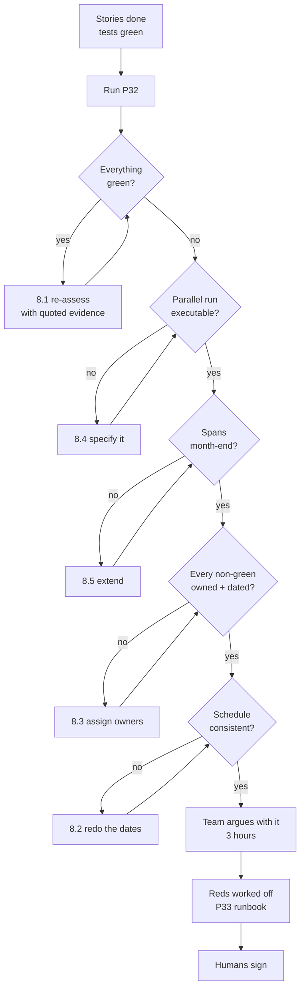

# P32 — Release Readiness Check

← [Previous](P31-write-clean-git-commits.md) · [Library index](../README.md) · Next: [P33](P33-write-the-runbook.md)

> **One line:** Decide honestly whether this thing is safe to switch on, and prove it.

| | |
|---|---|
| **Phase** | 7 — Release |
| **Who runs it** | Project Manager (Atul) with the Team Lead (Gautam ) |
| **When** | Sprint 4, one week before the proposed go-live date. Not the day before |
| **Takes in** | `artifacts/definition-of-done.md`, the story list NWD-101…NWD-108, the bug list NWD-138…NWD-142, `artifacts/spec-confidence-gate.md`, clean git history from [P31](P31-write-clean-git-commits.md) |
| **Produces** | `Case-Study/Python-ETL/artifacts/release-readiness-v1.0.md` |
| **Hands off to** | Backend Engineer — [P33 Write the Runbook](P33-write-the-runbook.md) |
| **Time to run** | Half a day: 30 minutes to generate, three hours of the team arguing with it |

---

## 1. The scene

Monday morning, Sprint 4. Atul has a date in a plan and a client who has started using the word "launch" in emails.

The evidence looks good. All eight stories from NWD-101 to NWD-108 are marked done against the definition of done the team agreed in [P17](../phase-3-planning/P17-definition-of-done.md). Pankaj's five defects are closed, including NWD-142, whose fix Ravi committed on Thursday and Gautam reviewed on Friday. The straight-through rate — the percentage of documents that need zero human touch, the headline metric for this whole project — has climbed from 61% to 84% against a target of 85%. The test suite is green. Azure costs are running at about $420 a month, near enough to the estimate.

By any normal software standard this is a release.

Then Preetinka says the thing that changes the meeting. She spent nine years on the operations floor at a custodian bank before she became a product owner, and what she says is: "Preeti has been keying these statements by hand for four years. On the day we go live, she stops. If we are wrong about anything, nobody is checking. What exactly is our evidence that we are not wrong?"

Atul's answer is "the tests pass," and he hears how thin it sounds as he says it.

**Tests prove the code does what you told it to do. They cannot prove you told it the right thing — and this system is replacing a human control, not adding a feature.** NWD-142 was precisely a case where every test passed and the system was wrong, and it was found by a person looking at output, not by a suite. Atul opens a new file and starts the readiness review.

---

## 2. What this prompt actually does — in plain language

### What a release readiness review is, if you have never been in one

A **release readiness review** is a meeting, plus a document, whose only job is to answer one question honestly: *should we switch this on?*

That sounds obvious and it is not what usually happens. What usually happens is that a date arrives, everyone feels roughly positive, someone deploys, and the question is never actually asked out loud. The readiness review exists to force the question into the open, in writing, with named owners and a recorded decision.

Three things distinguish it from a status update:

1. **It has a verdict.** Go, no-go, or go-with-conditions. Not "we're about 90% there."
2. **It is evidence-based.** Every green item points at something you can look at — a test run, a document, a measurement. "Ravi says it's fine" is not evidence.
3. **It includes the things nobody wants to raise.** The half-finished monitoring, the runbook that does not exist, the fact that nobody has tested what happens when Document Intelligence returns a 429 at month-end. A readiness review where nothing is amber is a readiness review that was not honest.

The document that comes out is not for you. It is for the person six weeks from now asking "who decided this was safe, and what did they know at the time?" That person might be an auditor. It might be you.

### Why a normal software release checklist is not enough here

Most release checklists assume you are adding something. New feature, new screen, new endpoint. If it goes wrong, you turn it off and you are back where you started. The cost of being wrong is an outage and an apology.

Northwind is not that. Northwind is **replacing a manual control process in a regulated context**, and both halves of that phrase change the maths.

**Manual control process** means there is a human today who catches things. Preeti does not just type numbers. She notices when a Broker Alpha statement has fourteen positions and last month had twenty-three. She notices when a currency looks wrong. Nobody wrote that down as a requirement, nobody specified it, and she does it anyway. When you automate her keying, you also automate away that noticing, and the system has to replace it — or you have quietly removed a control that nobody documented and everybody depended on.

**Regulated context** means the firm has obligations about the accuracy and timeliness of its books, and being able to demonstrate to a regulator or an auditor that a control operates effectively. "We ran some tests" is not a demonstration of control effectiveness. "We ran both processes side by side for three weeks and they agreed on every row" is.

And the failure is silent. If your new checkout page breaks, orders stop and someone shouts within the hour. If your extraction pipeline silently drops nine positions from a statement, nothing breaks. The reconciliation reports `MISSING_EXTERNAL` breaks, they look exactly like genuine settlement failures, and somebody spends a day chasing a counterparty about a trade that settled perfectly well. That is NWD-142. It shipped past a green test suite and a passing confidence gate.

> **The pattern to hold on to.** When automation replaces human judgement rather than human typing, the readiness question stops being "does it work" and becomes "how do we know it agrees with the human it is replacing." Those are different questions with different evidence.

### The parallel run — the centre of this whole chapter

Here is the answer, and it is old, boring, and almost never skipped by anyone who has been through a bad cutover.

A **parallel run** is a period where **both** the old manual process and the new automated system operate on the same real inputs at the same time, and you compare their outputs every single day. The humans keep doing exactly what they did before. The pipeline does its thing. Nobody relies on the pipeline for anything yet. Every day, someone diffs the two and investigates every difference.

For Northwind, concretely:

- Preeti keeps opening PDFs and keying them into her spreadsheet, exactly as she has for four years. Her output is still the one the business uses.
- Every one of those same PDFs also lands in `raw/{broker}/{yyyy-mm-dd}/{file}.pdf` and runs the full pipeline: classify, translate, extract, redact, rules engine, Azure SQL, Snowflake.
- Each morning a comparison job joins Preeti's spreadsheet against the pipeline's Snowflake rows on the natural key and reports every field that differs.
- Every difference gets investigated and classified: pipeline wrong, human wrong, or a legitimate tolerance difference.
- This runs for **two to four weeks** — long enough to include a month-end, because month-end is when volume spikes and where the interesting failures live.

**The exit condition is the part people get wrong.** It is not "few enough differences." It is: **zero divergence on auto-accepted rows.**

That qualifier carries the whole design. The pipeline produces two kinds of output. Rows that passed the confidence gate go straight to the warehouse with no human involvement — those are *auto-accepted*. Rows that failed the gate go to the exception queue for Preeti to fix in Dzmitry's UI — those are *human-reviewed*.

You are only asserting one thing at cutover: **when this system says "I am confident, no human needed," it is right.** So divergence on an auto-accepted row is a hard failure — the gate let something through that was wrong, which is the exact scenario the whole design exists to prevent. Divergence on a row that went to the exception queue is not a failure at all. The system said "I am not sure about this" and it was right not to be sure. That is the design working.

A parallel run that measures overall accuracy instead of auto-accepted accuracy will happily pass a system that is 96% correct overall while being wrong on 4% of the rows it swore it was certain about. That is a worse system than one that is 80% correct overall and never wrong when confident, because the second one you can trust and route around, and the first one you cannot trust at all.

| Row type | Divergence found | Verdict |
|---|---|---|
| Auto-accepted (passed the gate) | Any at all | **Hard fail.** Fix the root cause, reset the clock |
| Sent to exception queue | Yes | Fine. The gate did its job |
| Sent to exception queue | No — human agreed with the pipeline's rejected value | Note it. Too many of these means the thresholds are too tight and the straight-through rate is being suppressed for no benefit |

### Why skipping the parallel run is the classic way this fails

This is the failure mode worth dwelling on, because it is common, it is understandable, and it is fatal.

The pressure to skip is real and it comes from good places. The parallel run costs Preeti's time — she is doing the manual work for another month when the entire point of the project was to stop her doing it. It delays the benefit. It feels like a lack of confidence in the team's own work, which is uncomfortable to argue for out loud. And every metric on the dashboard is green, so what exactly are you expecting to find?

What you are expecting to find is the thing you did not think to test. That is not a rhetorical answer, it is the literal one. NWD-142 is the proof: nobody thought to test a positions table that spans a page boundary, because nobody knew Document Intelligence returned a continued table as a separate object with no relationship marker. It was not in the spec. It could not have been in the test suite, because you cannot write a test for a case you do not know exists. It was found by a human comparing real output against reality.

A parallel run is a machine for finding the cases you did not think of, running on real production data, with a human checking every answer, before anyone depends on it.

**And when it goes wrong without one, it goes wrong in the worst possible order.** You switch off the manual process. Two weeks later someone notices the EM book has been quietly short on some Broker Beta confirmations. Now you have bad data in the warehouse, you do not know how far back it goes, the manual process you would use to check has been switched off, Preeti's spreadsheet from before cutover is the last known-good state, and you are reconstructing a month of positions by hand under time pressure. In a regulated firm you are also now explaining to an auditor how a control failed and why it was not detected for a fortnight.

The parallel run is the answer to "how did you know it was safe to switch the manual process off." If you cannot answer that question with something concrete, you did not know. You hoped.

### The other things a readiness review must cover

Parallel run is the headline, not the whole list. The prompt asks for eight areas, and the reason for each:

| Area | The question it answers | Northwind specifics |
|---|---|---|
| **Scope** | Did we build what we said? | All of NWD-101…108 against `artifacts/definition-of-done.md`. Anything descoped, named and agreed by Preetinka |
| **Defects** | What is broken, and what did we accept? | NWD-138…142 all closed. Any open defect carries a severity and an explicit accept/fix decision |
| **Non-functional** | Does it survive real conditions? | 200 docs/day, month-end spike, 429 back-off, the Function timeout on a large document |
| **Security** | Can it leak or be abused? | No API keys anywhere, managed identity, redaction fails closed, [P24](../phase-5-verify/P24-find-security-gaps.md) findings closed |
| **Data quality** | Is the output actually correct? | Straight-through rate 84%, the parallel run comparison, [P25](../phase-5-verify/P25-data-quality-validation.md)'s row-count reconciliation |
| **Operability** | Can someone run it at 3am who did not build it? | Alerts wired, the runbook from [P33](P33-write-the-runbook.md), an on-call rota that exists |
| **Rollback** | How do we undo this? | Turn off the trigger, resume manual keying, and — because bronze is immutable — reprocess later for free |
| **Sign-off** | Who is accountable? | Named humans with dates. Not "the team" |

**Rollback deserves a note.** For most systems rollback means redeploying an old version. Here it means something more interesting, and better. Because bronze is immutable and written before anything is parsed, and because idempotency is by SHA-256 of content rather than filename, you can stop the pipeline, fix a parsing bug next month, and reprocess every document from bronze at zero additional Azure AI cost — with no risk of duplicate rows, even for the statements counterparties resend under new filenames. That property was designed in during Sprint 1 and this is the meeting where it pays for itself. Say so explicitly in the document; it converts a scary rollback into a routine one.

### Red, amber, green — and why amber must have a name attached

Each area gets a colour.

- **Green** — evidence exists, you have looked at it, it is sufficient. Cite the evidence.
- **Amber** — a real gap, but you can go live with a stated mitigation and a named owner and a date. Not "we'll keep an eye on it."
- **Red** — go-live blocker. Nothing else in the document matters until it is green or amber.

The discipline that makes this useful is that **amber is not a colour, it is a commitment.** An amber with no owner and no date is a green that someone felt vaguely uneasy about, and it will be forgotten within the week. If you cannot name a person and a date, the item is red.

The most common corruption of this ceremony is colour inflation under deadline pressure — reds becoming amber on Tuesday, ambers becoming green on Thursday, nothing having actually changed. Writing the evidence next to the colour is what prevents it. It is very hard to write "Evidence: none" next to a green.

### The stop gate

The gate here is: **produce the assessment, and stop before writing the verdict.**

The AI can assemble evidence, spot gaps, and colour items honestly. It should not be the thing that says go. That decision needs a human who will be in the room when it goes wrong, and in this case it needs three of them: Atul for delivery risk, Gautam for technical readiness, Preetinka for whether the business can actually live with the exceptions.

There is a second reason. An AI asked for a verdict tends to produce a favourable one, because the input it was given is your team's own evidence, written by people who want to ship. Asking it to assess and stop keeps it in the role where it is genuinely good — noticing that operability has no evidence at all — and out of the role where it is worse than useless.

### What the AI is actually doing when this runs

It reads your artefacts and your git history, builds an inventory of what was delivered, and then, area by area, asks the same two questions: *what would count as evidence here, and do they have it?* The value is almost entirely in the second question. Teams are good at listing what they did and bad at noticing the category they never thought about. Operability is the classic — nobody puts "can someone else run this" on a plan, and it is the thing that hurts most in week two.

### If you remember one thing

**When you are replacing a human control, the release gate is a parallel run, not a test suite.** Two to four weeks, both processes live, outputs compared daily, zero divergence on auto-accepted rows. Everything else in the readiness document is supporting evidence for that one decision.

---

## 3. The prompt

Run this a week before the proposed date, in a session that can read the artefacts folder and the git history.

```text
You are a delivery lead preparing a release readiness review. **Assess whether
[SYSTEM NAME] is safe to put into production**, and produce the readiness
document.

**STOP GATE:** produce the assessment with a colour and evidence for every area,
then **STOP**. Do NOT write a final GO / NO-GO verdict. The verdict is a human
decision and the sign-off block stays blank for us to fill in.

CONTEXT
- System: [SYSTEM NAME] — [ONE LINE ON WHAT IT DOES]
- Release: [VERSION] targeting [TARGET DATE]
- What it replaces: [THE CURRENT PROCESS AND WHO PERFORMS IT]
- Regulatory or audit context: [CONSTRAINT, OR "none"]
- Delivered scope: [STORY IDS]
- Defects raised: [BUG IDS]
- Definition of done: [PATH]
- Key artefacts: [PATHS]

**Read** every artefact listed before you assess anything. **Run**
`git log [LAST TAG]..HEAD --oneline` to inventory what actually changed.

ASSESS THESE EIGHT AREAS
For each one: a RED / AMBER / GREEN colour, the evidence you found, the gap if
any, and — for anything not green — a named owner and a date.

1. **Scope** — every story delivered and meeting the definition of done. Name
   anything descoped and who agreed it.
2. **Defects** — every raised defect closed, or explicitly accepted with a
   severity and a reason.
3. **Non-functional** — volume, peak load, timeouts, throttling, cost.
4. **Security** — credentials, access, data protection, findings closed.
5. **Data quality** — is the output correct, and how do you know?
6. **Operability** — monitoring, alerts, runbook, on-call. Can someone who did
   not build it run it at 3am?
7. **Rollback** — how we undo this, how long it takes, what is lost.
8. **Cutover** — the specific plan for switching from the old process to the new
   one, including the parallel run.

THE PARALLEL RUN — TREAT THIS AS THE PRIMARY GATE
This release replaces a manual control performed by a human. Tests cannot prove
that safe. **Specify a parallel run** and make it a named section:
- **Duration:** [DURATION], and say explicitly whether it spans a month-end.
- **What runs in parallel:** both processes, same real inputs, same days.
- **The comparison:** what is joined to what, on what key, how often, by whom.
- **The exit condition:** state it as ZERO divergence on AUTO-ACCEPTED rows —
  rows the system processed with no human involvement. **Explain in the document
  why divergence on human-reviewed rows is not a failure.**
- **What happens on a divergence:** who investigates, and whether the clock
  resets.
- **Who signs off** that the parallel run passed.

RULES
- **Every green must cite evidence** — a test run, a document path, a measured
  number, a dated review. A green with no evidence is an amber.
- **Every amber must name a person and a date.** If you cannot, it is red.
- **Flag anything with no evidence either way** as amber and say "no evidence
  found", rather than assuming it is fine.
- **Be specific about numbers.** Not "performance is acceptable" — the measured
  figure against the expected load.

DO NOT
- Do NOT write a GO or NO-GO verdict.
- Do NOT mark anything green because the team says it is fine. Cite the artefact
  or mark it amber.
- Do NOT soften a red. If a blocker exists, say blocker.
- Do NOT propose skipping or shortening the parallel run to hit the date.
- Do NOT invent evidence. "No evidence found" is a valid and useful finding.

YOU ARE DONE WHEN
All eight areas carry a colour with cited evidence, the parallel run section
specifies duration / comparison / exit condition / owner, every non-green item
has a named owner and a date, and the sign-off block is present and empty.

Write the document to [OUTPUT PATH].
```

---

## 4. Every placeholder, explained

| Placeholder | What to put in it | Northwind example | What happens if you get it wrong |
|---|---|---|---|
| `[SYSTEM NAME]` | The name the business uses, not the repo name | `Counterparty Document Ingestion` | The document reads as an internal engineering note and the business signatories do not recognise their own system in it |
| `[ONE LINE ON WHAT IT DOES]` | Plain English, no service names | `Turns counterparty PDF statements into reconciled position rows without manual keying` | Assessment drifts toward component health instead of business outcome |
| `[VERSION]` | The release tag | `v1.0` | Nothing serious, but the document cannot be tied to a specific deployment later |
| `[TARGET DATE]` | The proposed go-live | `2 December` | Without it the AI cannot judge whether an amber's remediation date is even feasible |
| `[THE CURRENT PROCESS AND WHO PERFORMS IT]` | The manual thing being replaced, and the human's name | `Preeti Singh, operations analyst at Northwind, opens each counterparty PDF and types the positions into a spreadsheet before reconciliation can run` | **The most load-bearing placeholder.** Leave it vague and you get a generic software checklist with no parallel run, which defeats the entire purpose |
| `[CONSTRAINT, OR "none"]` | The audit or regulatory obligation | `Books and records accuracy; the firm must evidence that the control operates effectively` | Audit trail, evidence retention and sign-off requirements silently drop out |
| `[STORY IDS]` | Everything in the release | `NWD-101 … NWD-108` | Scope assessment becomes guesswork off the git log |
| `[BUG IDS]` | Everything raised during verification, closed or not | `NWD-138, 139, 140, 141, 142` | Closed defects get missed, and worse, open ones do |
| `[PATH]` / `[PATHS]` | Real artefact paths | `artifacts/definition-of-done.md`, `artifacts/spec-confidence-gate.md`, `artifacts/bug-NWD-142.md` | The AI assesses from your prompt summary rather than the real material, and everything comes back green |
| `[LAST TAG]` | The previous release tag, or the first commit | `v0.9` | Change inventory is empty or contains the whole project history |
| `[DURATION]` | How long the parallel run lasts | `4 weeks, spanning the November month-end` | A two-week run that misses month-end misses the throttling and volume failures, which are the ones that actually bite |
| `[OUTPUT PATH]` | Where the document lands | `Case-Study/Python-ETL/artifacts/release-readiness-v1.0.md` | It lives in a chat window and does not exist when the auditor asks |

---

## 5. The filled-in example

Atul runs this on the Monday morning of Sprint 4, with Gautam next to him, a week before the proposed 2 December go-live.

```text
You are a delivery lead preparing a release readiness review. **Assess whether
Counterparty Document Ingestion is safe to put into production**, and produce
the readiness document.

**STOP GATE:** produce the assessment with a colour and evidence for every area,
then **STOP**. Do NOT write a final GO / NO-GO verdict. The verdict is a human
decision and the sign-off block stays blank for us to fill in.

CONTEXT
- System: Counterparty Document Ingestion — turns counterparty PDF statements
  and trade confirmations into reconciled position rows in Snowflake without
  manual keying.
- Release: v1.0 targeting 2 December
- What it replaces: Preeti Singh, operations analyst at Northwind Asset
  Management, currently opens each counterparty PDF and types the positions into
  a spreadsheet before the reconciliation can run. That manual step is why breaks
  surface on T+2 instead of T+1.
- Regulatory or audit context: books and records accuracy across the EM and EQ
  reporting books. The firm must be able to evidence that this control operates
  effectively.
- Delivered scope: NWD-101, 102, 103, 104, 105, 106, 107, 108
- Defects raised: NWD-138, NWD-139, NWD-140, NWD-141, NWD-142
- Definition of done: artifacts/definition-of-done.md
- Key artefacts: artifacts/prd-counterparty-ingestion.md,
  artifacts/spec-confidence-gate.md,
  artifacts/data-contract-counterparty-position.md,
  artifacts/adr/0001-document-intelligence-over-ocr.md,
  artifacts/bug-NWD-142.md, artifacts/code-review-NWD-103.md

**Read** every artefact listed before you assess anything. **Run**
`git log v0.9..HEAD --oneline` to inventory what actually changed.

ASSESS THESE EIGHT AREAS
For each one: a RED / AMBER / GREEN colour, the evidence you found, the gap if
any, and — for anything not green — a named owner and a date.

1. **Scope** — every story delivered and meeting the definition of done. Name
   anything descoped and who agreed it.
2. **Defects** — every raised defect closed, or explicitly accepted with a
   severity and a reason.
3. **Non-functional** — volume, peak load, timeouts, throttling, cost.
4. **Security** — credentials, access, data protection, findings closed.
5. **Data quality** — is the output correct, and how do you know?
6. **Operability** — monitoring, alerts, runbook, on-call. Can someone who did
   not build it run it at 3am?
7. **Rollback** — how we undo this, how long it takes, what is lost.
8. **Cutover** — the specific plan for switching from the old process to the new
   one, including the parallel run.

THE PARALLEL RUN — TREAT THIS AS THE PRIMARY GATE
This release replaces a manual control performed by a human. Tests cannot prove
that safe. **Specify a parallel run** and make it a named section:
- **Duration:** 4 weeks spanning the November month-end, and say explicitly
  whether it spans a month-end.
- **What runs in parallel:** both processes, same real inputs, same days.
- **The comparison:** what is joined to what, on what key, how often, by whom.
- **The exit condition:** state it as ZERO divergence on AUTO-ACCEPTED rows —
  rows the system processed with no human involvement. **Explain in the document
  why divergence on human-reviewed rows is not a failure.**
- **What happens on a divergence:** who investigates, and whether the clock
  resets.
- **Who signs off** that the parallel run passed.

RULES
- **Every green must cite evidence** — a test run, a document path, a measured
  number, a dated review. A green with no evidence is an amber.
- **Every amber must name a person and a date.** If you cannot, it is red.
- **Flag anything with no evidence either way** as amber and say "no evidence
  found", rather than assuming it is fine.
- **Be specific about numbers.** Not "performance is acceptable" — the measured
  figure against the expected load.

DO NOT
- Do NOT write a GO or NO-GO verdict.
- Do NOT mark anything green because the team says it is fine. Cite the artefact
  or mark it amber.
- Do NOT soften a red. If a blocker exists, say blocker.
- Do NOT propose skipping or shortening the parallel run to hit the date.
- Do NOT invent evidence. "No evidence found" is a valid and useful finding.

YOU ARE DONE WHEN
All eight areas carry a colour with cited evidence, the parallel run section
specifies duration / comparison / exit condition / owner, every non-green item
has a named owner and a date, and the sign-off block is present and empty.

Write the document to Case-Study/Python-ETL/artifacts/release-readiness-v1.0.md.
```

---

## 6. What comes back

Abridged, but this is the shape and the substance of what lands in `artifacts/release-readiness-v1.0.md`.

```markdown
# Release Readiness Review — Counterparty Document Ingestion v1.0

**Target date:** 2 December
**Prepared:** 25 November by Atuland Gautam 
**Replaces:** manual keying of counterparty PDFs by Preeti Singh, Northwind operations
**Verdict:** _(not filled — human decision, see sign-off)_

## Summary of colours

| # | Area | Colour |
|---|---|---|
| 1 | Scope | GREEN |
| 2 | Defects | GREEN |
| 3 | Non-functional | AMBER |
| 4 | Security | GREEN |
| 5 | Data quality | AMBER |
| 6 | Operability | **RED** |
| 7 | Rollback | GREEN |
| 8 | Cutover / parallel run | **RED** |

---

## 1. Scope — GREEN

All eight stories delivered and meeting `artifacts/definition-of-done.md`.

| Story | Title | State | Evidence |
|---|---|---|---|
| NWD-101 | Land PDFs immutably in the raw zone | Done | `sinks/blob_sink.py`; immutability policy on the container verified 18 Nov |
| NWD-102 | Classify to counterparty layout | Done | `core/classify.py`; 0.75 minimum enforced, below → review, never guessed |
| NWD-103 | Gate every field on confidence | Done | `core/confidence.py`, `spec-confidence-gate.md`, review in `code-review-NWD-103.md` |
| NWD-104 | Translate EM documents | Done | `core/translate.py`; identifier fields excluded after NWD-138 |
| NWD-105 | Redact PII before persistence | Done | `core/redact.py`; fails closed, marker persisted on error |
| NWD-106 | Transform to canonical schema | Done | `core/transform.py` against `data-contract-counterparty-position.md` |
| NWD-107 | Load to Azure SQL and Snowflake idempotently | Done | `sinks/`; SHA-256 content hash, `MIN_CONFIDENCE` and `BRONZE_PATH` carried to gold |
| NWD-108 | Exception queue screen | Done | Dzmitry; accepted by Preetinka 21 Nov against `ui-brief-exception-queue.md` |

**Descoped, agreed by Preetinka Sharma 12 Nov:** bulk-approve in the exception queue,
and a third counterparty layout. Both moved to v1.1. The classifier ships knowing
two layouts: `broker_alpha` and `broker_beta_em`.

## 2. Defects — GREEN

| ID | Summary | State | Evidence |
|---|---|---|---|
| NWD-138 | Translation applied to identifier fields broke matching | Closed | `test_transform.py::TestIdentifierNotTranslated` |
| NWD-139 | Confidence shown as `0.8234567` not `82%` | Closed | Dzmitry, one line, verified by Pankaj 19 Nov |
| NWD-140 | Resent statement under new filename duplicated a row | Closed | Idempotency now hashes content; `test_reconcile.py::TestResentStatement` |
| NWD-141 | 429 from Document Intelligence killed the run | Closed | Exponential back-off in `core/clients.py`; **see Non-functional — not load-tested** |
| NWD-142 | Line items on page 2 dropped silently | Closed | `test_extract.py::TestTableContinuation`; spec rule added; row-count check added |

No open defects. No accepted-with-known-issue defects.

## 3. Non-functional — AMBER

| Item | Expected | Measured | Evidence |
|---|---|---|---|
| Daily volume | ~200 docs/day, 3 pages avg | 214 docs on 19 Nov, all processed | App Insights, 19 Nov |
| Monthly pages | 12,600 | 12,910 (Oct actual) | Azure billing |
| Azure AI cost | ~$420/month | $431 (Oct) | Azure billing |
| Month-end spike | Unknown multiple | **Never tested** | — |
| 429 back-off | Retries and completes | Unit-tested only | `test_extract.py::TestThrottleRetry` |
| Function timeout | Under 10 min | 4m 20s on the largest doc seen (11 pages) | App Insights |

**Gap.** The 429 back-off from NWD-141 is proven by a unit test with a mocked
429. It has never been exercised against a real throttled Document Intelligence
endpoint under real month-end concurrency. Month-end is exactly when it fires.

**Owner:** Ravi Mullick. **Date:** 29 November. Run a load test at 3x normal
concurrency against the real endpoint and record the result here.

## 4. Security — GREEN

- No API keys in code or config. `DefaultAzureCredential` throughout, roles
  `Cognitive Services User`, `Storage Blob Data Contributor`,
  `Key Vault Secrets User`. Verified by grep across the repo, 22 Nov.
- Snowflake uses key-pair (JWT) auth. Private key in Key Vault, not on disk.
- Redaction fails closed: on a PII call error the raw text is NOT persisted, a
  marker is. Verified `test_rules.py::TestRedactFailsClosed`.
- Raw zone is immutable, write-once.
- All P24 security review findings closed, 20 Nov.

## 5. Data quality — AMBER

| Metric | Target | Current | Evidence |
|---|---|---|---|
| Straight-through rate | 85% | **84.1%** (7-day avg to 22 Nov) | Snowflake `v_straight_through_daily` |
| Row-count reconciliation | 100% match or exception | Enforced | `core/confidence.py::check_row_count` |
| Confidence thresholds | Per data contract | Enforced | currency 0.90 (0.92 `broker_alpha`), number 0.90, date 0.85, string 0.75 |
| Classifier minimum | 0.75 | Enforced | `core/classify.py` |

**Gap.** 84.1% against a target of 85%. The shortfall is concentrated in
`broker_beta_em` Spanish confirmations, where date fields land between 0.85 and
0.88 more often than expected.

This is **not** a correctness problem — those documents go to the exception
queue, which is the design working. It is a workload problem: it means roughly
30 more documents a day reach Preeti than the business case assumed.

**Owner:** Preetinka Sharma. **Date:** 29 November. Decide whether to accept 84% for
v1.0 or hold. Recommendation: accept. Chasing the last point by loosening a date
threshold trades a real correctness guarantee for a workload convenience.

## 6. Operability — RED

**No evidence found for any of the following.**

| Item | State |
|---|---|
| Runbook | Does not exist |
| Alerts | Application Insights collects telemetry. No alert rules configured |
| On-call rota | Not defined. Unclear whether Kestrel or Northwind holds it after go-live |
| Straight-through rate monitoring | Query exists, nothing watches it |
| Exception queue depth alert | None. Nothing tells anyone the queue is growing |
| Dead-letter handling | Poison messages go to a poison queue nobody reads |

**This is a go-live blocker.** On 3 December this system becomes the only way
counterparty positions reach the warehouse. Today, if it stops at 2am, the first
person who finds out is Preeti at 8am when the exception queue is empty and so is
the warehouse.

**Owner:** Ravi Mullick (runbook and alerts), Atul(on-call rota).
**Date:** 29 November. Runbook per P33. Minimum alert set: pipeline failure rate,
straight-through rate below 70%, exception queue depth over 50, poison queue
non-empty.

## 7. Rollback — GREEN

Rollback is cheap here and that is a deliberate design property, not luck.

1. Disable the blob trigger. Documents keep landing in `raw/`, nothing processes.
2. Preeti resumes manual keying. Her spreadsheet process is unchanged and will
   still exist — she is not being retrained away from it before the parallel run
   completes.
3. Warehouse rows already loaded stay. Each carries `MIN_CONFIDENCE` and
   `BRONZE_PATH`, so any row can be traced to its source document.
4. **Reprocessing is free.** Bronze holds the full raw API response before
   parsing, so a parsing bug found in January is fixed and replayed at zero
   additional Azure AI cost. Idempotency is by SHA-256 of content, so replay
   cannot duplicate rows.

Time to roll back: under 5 minutes. Data lost: none.

## 8. Cutover and parallel run — RED

**Not yet started. This is the primary gate and it has not begun.**

### Why tests are not sufficient here

This release removes a human control. Preeti does not only type numbers — she
notices when a statement has fourteen positions and last month had twenty-three.
That check was never specified, never tested, and the business has depended on it
for four years. NWD-142 is the proof of what happens when it is absent: every
test passed, every extracted field was high confidence, the gate approved the
document, and nine positions vanished. It was found by a person looking at real
output.

### The parallel run

| | |
|---|---|
| **Duration** | 4 weeks, minimum 3, and **must span a month-end** |
| **Both processes live** | Preeti keys every document exactly as today. Her spreadsheet remains the record the business uses. The pipeline processes the same documents in the same period |
| **Comparison** | Daily 09:00. `recon/parallel_compare.py` joins Preeti's spreadsheet to Snowflake `POSITIONS_GOLD` on (broker, statement_date, security_id, account). Compares quantity, market value, currency, trade date |
| **Tolerances** | Quantity 0.0001 (float noise). Market value 0.005 (50bp, pricing source differences). Anything outside is a divergence |
| **Exit condition** | **ZERO divergences on auto-accepted rows** across the full period |

### Why the exit condition has that exact shape

The pipeline produces two kinds of row.

**Auto-accepted** — passed the confidence gate, no human touched it. At cutover
we are asserting exactly one thing about these: when the system says "I am
confident, no human needed," it is right. A divergence here is a hard failure,
because it means the gate approved something wrong, which is the one outcome the
entire design exists to prevent.

**Human-reviewed** — failed the gate, went to the exception queue, Preeti fixed it
in Dzmitry's UI. A divergence here is **not a failure**. The system said "I am not
sure" and it was correct not to be sure. That is the design working as intended,
and counting it as a failure would push us toward loosening thresholds, which is
the opposite of what we want.

We track a third number for information only: rows sent to review where Preeti
agreed with the value the pipeline had already extracted. A high count means the
thresholds are tighter than they need to be — real, but a v1.1 tuning question,
not a go-live question.

### On a divergence

1. Investigate same day. Classify: pipeline wrong, human wrong, or tolerance.
2. **Pipeline wrong on an auto-accepted row → the clock resets.** Fix the root
   cause, then run a further 10 clean business days minimum.
3. Human wrong → record it. It is evidence for the business case, not against
   the system.
4. Tolerance → adjust the tolerance in the comparison, with Hem's agreement,
   and note it here.

### Sign-off that the parallel run passed

Preetinka Sharma (business), Pankaj  (QA evidence), Hem Singh (architecture
and audit trail). All three, in writing, in this document.

### Effect on the date

2 December is not achievable as a full cutover. Realistic sequence:

| Date | Event |
|---|---|
| 2 Dec | Parallel run **starts**. Pipeline live, nothing depends on it |
| 2 Dec – 3 Jan | Daily comparison, spanning the December month-end |
| ~6 Jan | Parallel run review, three sign-offs |
| ~8 Jan | Cutover. Preeti stops manual keying |
| 8 Jan – 5 Feb | 4-week heightened monitoring, manual process available for 90 days |

---

## Sign-off

| Role | Name | Verdict | Date | Signature |
|---|---|---|---|---|
| Project Manager | Atul| | | |
| Team Lead | Gautam  | | | |
| Product Owner | Preetinka Sharma | | | |
| Architect | Hem Singh | | | |
| QA | Pankaj  | | | |

_Verdict deliberately blank. This assessment is input to a human decision._
```

### How to read this

**Start with the two reds, not the summary table.** Operability and Cutover are red for the same underlying reason: both are about what happens *after* the code is written, and both are the areas a team under deadline pressure is structurally worst at noticing. Everything green in this document is about the software. Everything red is about the operation. That ratio is normal and it is the most useful thing the review tells you.

**Read the parallel run's exit condition twice.** "Zero divergence on auto-accepted rows" is a much stronger and much more achievable standard than "zero divergence," and the difference between the two is the entire confidence-gate design. If you take one paragraph from this document into your own project, take that one.

**Notice what the amber on data quality actually says.** 84.1% against a target of 85% is presented as a workload problem, not a correctness problem, with a recommendation to accept. That framing is correct and it is the kind of judgement the document exists to record. The alternative — loosening a date threshold to buy the last point — trades a real guarantee for a convenience, and having that written down means nobody proposes it again in three weeks having forgotten why.

**The part that is commonly wrong:** the date section at the end. A first pass often produces a beautiful parallel run specification and then leaves the original go-live date untouched, as though the two were unrelated. They are not. If the parallel run starts on the target date, the target date is not a cutover date, and the document must say so in a table someone can take to a client. If your output does not restate the schedule, that is follow-up 8.2.

---

## 7. Why this is the final prompt

**What "done" means here.** All eight areas coloured with cited evidence, the parallel run fully specified — duration, comparison, exit condition, divergence handling, sign-off — every non-green item carrying a named human and a date, and an empty sign-off block. The document is done when it is ready to be *argued with*, not when everyone agrees with it.

**The checklist:**

- [ ] Every one of the eight areas has a colour.
- [ ] Every green cites a document path, a test name, a measured number, or a dated review. No green says "the team confirmed."
- [ ] Every amber and red names a person and a date. Not a role. A person.
- [ ] The parallel run section states duration, what is compared, the join key, the tolerances, the exit condition, and what happens on a divergence.
- [ ] The exit condition is expressed as zero divergence on **auto-accepted** rows, with the reason for that qualifier written out.
- [ ] The document restates the schedule if the parallel run does not fit the original date.
- [ ] The sign-off block exists and is empty.

**Why you should stop rather than keep prompting.** Two failure modes here, and both are seductive.

The first is asking for the verdict. The AI will give you one, it will be reasonable, and it will be worthless — because a readiness verdict is an assignment of accountability, and accountability cannot be delegated to something that will not be in the room. The empty sign-off block is the point of the document, not an omission.

The second is re-prompting until the reds go away. They will go away. The AI is agreeable, and if you push back on the operability red three times you will get an amber with a soothing mitigation. Nothing about the system will have changed. The only legitimate way a red becomes an amber is that someone did work.

**The signal that you are NOT done.** Any item coloured green whose evidence column would read "the team says so" if you were honest about it. That is a green built on nothing, and it is exactly where the surprise comes from.

---

## 8. When it is not done — the follow-up prompts

| What you're seeing | What's actually wrong | Run this next |
|---|---|---|
| Everything is green | The AI took your summary as evidence rather than reading artefacts. Almost always a `[PATHS]` problem | **8.1** |
| Beautiful parallel run, original date untouched | It specified the gate and did not do the arithmetic on the calendar | **8.2** |
| Ambers with no owner, or owned by "the team" | Colour inflation. An amber without a person is a green in a hat | **8.3** |
| Parallel run says "compare outputs daily" and nothing more | Under-specified. Unrunnable as written | **8.4** |
| No mention of month-end | It picked a duration without looking at where the load actually is | **8.5** |
| Verdict written despite the stop gate | Gate ignored. Delete the verdict and re-read §7 | Restate the stop gate and re-run |
| Reds became ambers on the second pass with no work done | You are re-prompting for comfort | Stop. Revert to the first output |
| The runbook red needs closing | Correct finding, different prompt | **[P33](P33-write-the-runbook.md)** |
| Data quality evidence is thin | You never ran the validation properly | **[P25](../phase-5-verify/P25-data-quality-validation.md)** |

### 8.1 "Everything came back green"

Use this when the assessment is uniformly positive, which for a real system a week before go-live is not plausible.

```text
Every area came back green. That is not credible for a system that has not been
run in production.

**Re-assess** with this rule: an area is GREEN only if you can quote the exact
sentence from an artefact, the exact test name, or the exact measured number that
proves it. **Quote it inline.** If you cannot quote something, the area is AMBER
with the note "no evidence found".

**Read these files before re-assessing** — do not work from my summary:
[LIST THE REAL PATHS]

**Pay specific attention to operability.** Answer these four questions with a
file path or a "no":
1. Does a runbook exist? Where?
2. Are alert rules configured? Which ones, on what metrics, with what thresholds?
3. Who is on call after go-live, by name?
4. What tells anyone the pipeline has stopped?

**Report the count** of greens before and after so I can see what changed.
```

*What changes:* typically two or three greens become amber, and operability goes red. The before/after count is what makes it honest.

### 8.2 "The parallel run is specified but the date did not move"

Use this when the document specifies four weeks of parallel running and still claims the original go-live date.

```text
The parallel run runs [DURATION] and the document still shows [TARGET DATE] as
go-live. Those are inconsistent.

**Do the arithmetic.** Produce a dated schedule table with these rows:
- Parallel run starts
- Parallel run ends
- Parallel run review and sign-off
- Cutover (the day the manual process stops)
- Heightened monitoring ends

**State clearly** that [TARGET DATE] is the date the parallel run STARTS, not
the date the manual process stops, and that the pipeline runs live from that date
with nothing depending on it.

**Then list** the two options honestly, with what each one costs:
(a) hold the cutover date and shorten the parallel run — say exactly what
    coverage is lost, especially month-end
(b) keep the full parallel run and move the cutover date

**Do not recommend one.** Atul takes both to Northwind.
```

*What changes:* you get a schedule you can put in front of a client, and the shortening option is written down with its cost attached rather than being proposed informally in a meeting.

### 8.3 "The ambers have no owners"

Use this when non-green items name a team or nobody.

```text
Several amber and red items name no owner, or name a team rather than a person.

**Rewrite every non-green item** in this exact form:

  GAP: <one sentence, what is missing>
  RISK IF WE GO LIVE ANYWAY: <one sentence, the concrete consequence>
  OWNER: <one named person>
  DATE: <a specific date before [TARGET DATE]>
  DONE WHEN: <the checkable condition>

Owners must be from: Atul, Gautam , Hem Singh, Ravi Mullick,
Dzmitry , Pankaj , Preetinka Sharma.

**If you cannot identify a plausible owner or a feasible date, promote the item
to RED** and say why. An amber nobody owns is a red with better manners.
```

*What changes:* half your ambers become reds, which is uncomfortable and correct. The "risk if we go live anyway" line is what makes the meeting productive.

### 8.4 "The parallel run section is too vague to actually run"

Use this when it says "compare outputs daily" and stops.

```text
The parallel run section is not executable. Someone has to run this on 2 December
and nothing here tells them how.

**Specify, concretely:**
1. The exact join: which table, which spreadsheet, which columns form the key.
2. The exact fields compared, with the tolerance for each. Use quantity 0.0001
   and market value 0.005 — those are the reconciliation tolerances already in
   the data contract.
3. Who runs the comparison, at what time, and where the output goes.
4. The exact definition of an AUTO-ACCEPTED row in terms of the data we store
   (which column tells you a row did not go through the exception queue).
5. The daily report format: total rows, auto-accepted count, divergences by
   category.
6. Where the daily results are recorded so they are auditable afterwards.

**Then write** the one-paragraph explanation, aimed at Preetinka, of why divergence
on a human-reviewed row is not a failure. She has to defend this to Northwind.
```

*What changes:* it becomes a procedure someone can execute. Item 4 is the sleeper — teams routinely discover they cannot tell after the fact which rows were auto-accepted, which means adding a column before the run starts.

### 8.5 "It never mentioned month-end"

Use this when the duration was chosen without reference to load.

```text
The parallel run duration does not account for month-end, which is when volume
spikes and when the failures we care about actually happen.

**Revise** the duration so the run spans at least one full month-end close,
and say which one by date.

**Add** a specific month-end section covering:
- Expected volume multiple versus a normal day, and what we base that on
- Whether the 429 back-off from NWD-141 has ever been exercised at that
  concurrency against the real Document Intelligence endpoint
- Whether the Function timeout has been tested against the largest document we
  have seen, and what that document was
- Who is watching on the month-end days specifically

**State plainly** that a parallel run which does not include a month-end has not
tested the pipeline under the conditions where it is most likely to fail.
```

*What changes:* the duration usually stretches by a week, and NWD-141's back-off gets a load test instead of a unit test — which is the single highest-value change this whole follow-up set produces.

### The loop



---

## 9. How this goes wrong

### You run it the day before go-live

By far the most common mistake, and it makes the whole ceremony theatre.

The point of a readiness review is to surface gaps while there is time to close them. Run it a week out and the operability red is a genuine problem with a genuine solution: Ravi writes the runbook, someone configures six alert rules, Atul agrees the rota with Northwind, and the release goes ahead. Run it the day before and the identical finding produces one of two outcomes, both bad. Either you slip publicly, having told the client for a month that everything was on track. Or you go live anyway, having written down in a permanent document that you knew there was no runbook and no alerting — which is materially worse than not having reviewed at all, because now the gap is evidenced.

**The fix:** put the readiness review in the sprint plan as a dated activity a week before the release, in [P16](../phase-3-planning/P16-sprint-plan-and-assignment.md). Not as a checklist item on release day.

### You shorten the parallel run to hit the date

The pressure is real. Preeti is doing double work. The client is waiting for a benefit they have already paid for. Every dashboard is green. Four weeks feels like an eternity of not-shipping.

So it becomes three weeks. Then it becomes two. Then somebody notices the two weeks fall between month-ends, so the run covers only quiet days at normal volume — which means it has tested precisely the conditions that were never going to fail. NWD-141 exists because Document Intelligence returns a 429 at month-end. A parallel run that skips month-end does not test the thing NWD-141 taught you to worry about.

The pattern is worth naming: a shortened parallel run does not reduce your risk proportionally. It removes the specific coverage that mattered most, because the interesting failures cluster in exactly the period you cut.

**The fix:** make month-end coverage a stated requirement of the parallel run, in the document, before anyone starts negotiating duration. Then the conversation is "which month-end" rather than "how many weeks," and the second conversation is much harder to lose.

### Colour inflation between drafts

Version one has two reds and four ambers. Version three has no reds and two ambers. Nobody did any work in between.

This happens through entirely reasonable-sounding moves. "We'll have the runbook by Friday, so that's amber not red." "The load test is planned, so amber." "Alerting is a day's work, call it green." Each step is defensible. The cumulative effect is a document that says the system is ready when it is not, signed by five people who each nudged it slightly.

**The fix:** keep every draft. Put a revision table at the top of the document listing what changed and, crucially, what work was done to justify the change. A colour may only improve when there is a commit, a configured resource, or a completed test attached to it. Atul enforces this at Northwind and it is not popular.

### Nobody outside the team reads it

The readiness review is written by the delivery team, assessing the delivery team's own work, using evidence the delivery team produced. That is fine as a starting point and inadequate as a finish.

The most valuable reviewer of this document at Northwind is Preetinka, because she came off an operations floor and knows what a reconciliation break actually costs to chase. She is the one who asks whether the exception queue at 30 documents a day is a workload Preeti can absorb alongside her other duties, or whether it quietly becomes a two-hour daily job that nobody budgeted for. Hem is the second, because her recurring question — "what does this look like when it's wrong?" — is the exact question a readiness review is trying to answer, and she asks it about things engineers consider settled.

**The fix:** the sign-off block is not decoration. Five named signatories from three different perspectives is the mechanism that forces the document out of the engineering room.

### This is the wrong tool: you are shipping a UI tweak

If the release is NWD-139 — the exception queue formatting confidence as `82%` instead of `0.8234567` — you do not need a readiness review, a parallel run, or a sign-off block. You need Pankaj to look at the screen and say yes.

The weight of this ceremony should scale with the consequence of being wrong. Replacing a manual control in a regulated firm sits at the top of that scale. A cosmetic fix sits at the bottom, and applying the full ceremony there devalues it everywhere — people learn the ritual is noise and start skipping it on the release where it mattered.

**The rule:** run the full review when the release changes what humans do, touches data that feeds a regulated report, or cannot be trivially rolled back. Otherwise a definition-of-done check is enough.

---

## 10. The handoff

Ravi picks this up, and he picks up the worst item in the document.

Operability is red, and the largest piece of that red is that no runbook exists. That is his next job, and it is [P33](P33-write-the-runbook.md). What he is guaranteed to find in the readiness document is unusually specific: not "write some docs" but a named list of what is missing — no alert rules, no on-call rota, nothing watching the straight-through rate, an unread poison queue, no documented way to reprocess a document. That list is the runbook's table of contents, already written, by a document whose job was to notice the absence.

The parallel run section hands off differently, to three people at once. Ravi or Pankaj builds `recon/parallel_compare.py` to the join and tolerances specified in §8. Preetinka takes the schedule table to Northwind, because "2 December is when the pipeline goes live and 8 January is when Preeti stops keying" is a conversation with the client, not an internal decision. And Hem reads the exit condition, because "zero divergence on auto-accepted rows" is an assertion about the confidence gate she designed in Sprint 1, and she is the one who will be asked to defend it.

Atul keeps the document itself as a living artefact through the parallel run. Every daily comparison result is appended. When the three sign-offs land in January, the file is the complete evidence trail from "all stories done" to "the manual control was safely switched off" — which is precisely the artefact an auditor asks for, and precisely the artefact nobody has when they skipped this.

> **Artifact contract — `Case-Study/Python-ETL/artifacts/release-readiness-v1.0.md`**
> Anyone reading this file can rely on finding:
> - Eight assessed areas, each with a red/amber/green colour.
> - Cited evidence against every green — a path, a test name, a number, or a dated review.
> - A named person and a date against every amber and red.
> - A parallel run specification with duration, comparison method, join key, tolerances, exit condition, divergence handling, and named sign-off.
> - The exit condition expressed as zero divergence on auto-accepted rows, with the reason for that qualifier stated.
> - A dated cutover schedule consistent with the parallel run duration.
> - A sign-off block, empty until humans sign it.
>
> If any of those is missing, the review is not done — go back to §7.

---

## 11. In the case study

This is the opening scene of [09-sprint-4-release.md](../../Case-Study/Python-ETL/09-sprint-4-release.md), and it is the chapter where the project's date changes.

The moment that matters is Preetinka's question. Atul had walked into that room genuinely believing the release was a formality — eight stories done, five defects closed, straight-through rate at 84%, tests green, costs on budget. Every number he had was good. What he did not have was an answer to "what is our evidence that we are not wrong," and the reason he did not have one is that every piece of evidence he was holding had been produced by the team that built the thing.

The readiness review came back with two reds, and the operability red was the one that stung, because it was not a hard problem. Nobody had configured a single alert rule. Application Insights was collecting telemetry that nothing was watching. If the pipeline had stopped at 2am on 3 December, the first person to notice would have been Preeti at 8am, looking at an empty exception queue and an empty warehouse, with no idea whether that meant "no exceptions today" or "nothing ran." That gap existed for the ordinary reason: it was nobody's story, so it was nobody's job.

The parallel run finding moved the date by five weeks and Atul had to take that to Northwind. It went better than he expected, and the reason is worth noting. He did not present it as a delay. He presented the schedule table from §8 — pipeline live on 2 December as originally promised, manual keying stops on 8 January once four weeks of daily comparison show zero divergence on auto-accepted rows. Northwind's head of operations, who had lived through a cutover at a previous firm that went the other way, approved it in the meeting.

The document is [`artifacts/release-readiness-v1.0.md`](../../Case-Study/Python-ETL/artifacts/release-readiness-v1.0.md). Its final sign-off block was completed on 6 January, and the parallel run found two divergences — both on rows that had gone to the exception queue, neither a failure, both of which are described in [10-retrospective.md](../../Case-Study/Python-ETL/10-retrospective.md).

---

← [Previous](P31-write-clean-git-commits.md) · [Library index](../README.md) · Next: [P33](P33-write-the-runbook.md)
