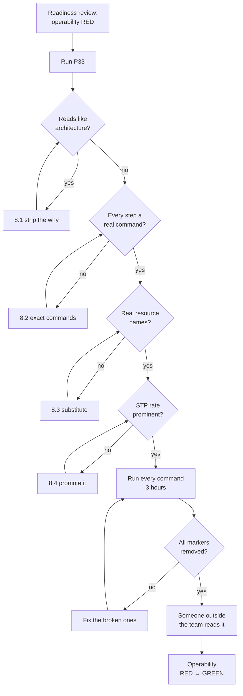

# P33 — Write the Runbook

← [Previous](P32-release-readiness-check.md) · [Library index](../README.md) · Next: [P34](../phase-8-improve/P34-clean-up-dead-code.md)

> **One line:** Write the document a stranger reads at 3am when your pipeline stops.

| | |
|---|---|
| **Phase** | 7 — Release |
| **Who runs it** | Backend Engineer (Tomas Vargas) |
| **When** | Sprint 4, immediately after the readiness review turns operability red |
| **Takes in** | `artifacts/release-readiness-v1.0.md`, the code in `code/doc_ingestion/`, the closed defects NWD-138…NWD-142 |
| **Produces** | `Case-Study/Python-ETL/artifacts/runbook-doc-ingestion.md` |
| **Hands off to** | Team Lead — [P34 Clean Up Dead Code](../phase-8-improve/P34-clean-up-dead-code.md) |
| **Time to run** | Half a day: an hour to generate, three hours walking the commands to check they work |

---

## 1. The scene

Tomas has the readiness review open on one screen and it is not comfortable reading. Area 6, Operability, is red. Under it, six lines, and every one of them is something he could have done in an afternoon at any point in the last two sprints:

No runbook. No alert rules. No on-call rota. Nothing watching the straight-through rate. Nothing watching the exception queue depth. A poison queue that nobody reads.

None of that was in a story. NWD-101 through NWD-108 covered landing, classifying, translating, extracting, redacting, transforming, loading, and the exception queue screen. Every one of those is a thing the pipeline *does*. Not one of them is about what happens when it stops doing it.

Farhan's note in the document is blunt: on 3 December this becomes the only path counterparty positions take into the warehouse, and if it stops at 2am the first person to find out is Priya at 8am, looking at an empty exception queue with no way to tell whether that means "no exceptions today" or "nothing ran at all."

Tomas starts writing and gets four paragraphs in before he notices what he is producing. He has written a description of the architecture. Blob lands, trigger enqueues, worker classifies, extraction runs, rules engine gates, sinks write. All true. All useless at 2am.

**A runbook is not a description of how the system works. It is a set of instructions for a person who does not care how it works and needs it working again.** He deletes the four paragraphs and starts over with a different question: what will actually go wrong, and what does someone type when it does?

---

## 2. What this prompt actually does — in plain language

### What a runbook is

A **runbook** is the document the person on call reads at 3am. That person did not build the system. They may have joined last month. They have an alert on their phone, a laptop, and a decreasing amount of patience.

What they need, in this order:

1. Is this actually broken, or is it noise?
2. If it is broken, what specifically is broken?
3. What do I type to fix it?
4. If I cannot fix it, who do I wake up?

That is the whole document. Everything else is padding.

The name comes from operations, where a "run book" was literally a binder next to the machine containing the procedures for running it. The physical binder is gone. The idea — that operating a system is a separate discipline from building it, with its own written procedures — is not.

### A runbook is not architecture documentation, and confusing them is the classic failure

This distinction is the single most useful thing in this chapter, so it gets a table.

| | Architecture documentation | Runbook |
|---|---|---|
| **Reader** | Someone extending the system | Someone restoring the system |
| **Question it answers** | Why is it built this way? | What do I type right now? |
| **Written in** | Prose and diagrams | Symptom → cause → command |
| **Time available to the reader** | An afternoon | Four minutes |
| **State of the reader** | Curious | Woken up, mildly panicked |
| **Correct level of detail** | Concepts and trade-offs | Exact commands, exact paths, exact resource names |
| **Where it lives at Northwind** | `artifacts/adr/`, `artifacts/spec-confidence-gate.md` | `artifacts/runbook-doc-ingestion.md` |

The reason engineers write architecture when asked for a runbook is not laziness. It is that architecture is the thing they have in their head, and it is genuinely more interesting to write. Explaining why bronze is immutable and comes before parsing is a satisfying paragraph. Writing `az storage message peek --queue-name doc-ingestion-poison` is not.

But the second one is what gets typed at 3am.

The tell that you have drifted is the word "because." A runbook step almost never needs it. "Requeue the message from the poison queue with this command" is a runbook. "The poison queue exists because Azure Storage queues move a message there after five failed dequeues, which prevents an infinite retry loop" is architecture. Both are true. Only one of them shortens the outage.

> **A rough test.** Read a section aloud and ask: could someone who has never seen this codebase follow it without asking a question? If they would have to ask "what is the resource group called?" or "which subscription?" you wrote architecture with commands sprinkled in.

### The structure, and why it is in that order

Seven sections. The order is not arbitrary — it follows what the reader needs at each moment.

**1. What this system does — two lines.** Not two paragraphs. The on-call reader needs orientation, not education. "It turns counterparty PDF statements into position rows in Snowflake. If it stops, positions do not reach the warehouse and reconciliation runs against incomplete external data." That is enough for them to understand the stakes and stop reading.

**2. How to tell if it is healthy.** Before diagnosis, orientation. Three or four queries or dashboard checks that answer "is this actually broken?" A surprising fraction of pages are noise, and letting someone confirm that in ninety seconds is worth more than any remediation section.

**3. The alerts and what each one means.** Every alert that can fire, with its threshold, what it actually indicates, and how urgent it is. The reader arrived here *because* of an alert, so this is where they navigate from symptom to section.

**4. Failure modes with exact remediation.** The bulk. Symptom, how to confirm it, exactly what to type, how to verify it worked.

**5. Common operations.** Things that are not failures but need doing: reprocess a document, drain the exception queue, add a counterparty.

**6. Escalation.** Who to wake, when, and what to tell them.

**7. Appendix.** Resource names, connection details, useful queries.

Note what is missing: no architecture section, no design rationale, no history. Those live in the ADRs and the spec. Link to them, do not restate them.

### The failure modes — and why you write them from real incidents, not imagination

The temptation is to brainstorm. Do not. Brainstormed failure modes are generic ("the database might be unavailable") and the remediation is generic ("check the connection"). Neither helps.

Real failure modes come from three places: defects you have already hit, things the readiness review flagged as untested, and the specific ways your specific dependencies fail. For Northwind that gives five, and each one teaches something different.

**Counterparty template change.** A broker redesigns their statement. The classifier, trained on ~50 labelled documents of the old layout, drops below its 0.75 minimum confidence, or worse, classifies confidently and the extraction model pulls fields from the wrong places. Nothing crashes. Nothing errors. The straight-through rate falls off a cliff and the exception queue fills.

This is the most important entry in the runbook because **it is invisible to every technical alert you have.** CPU is fine. Errors are zero. The Function is running happily. The only signal is a business metric moving. If you write no other failure mode, write this one.

**Poison blob.** A file lands in `raw/` that the pipeline cannot process — a corrupt PDF, a password-protected file, a zero-byte upload from a failed SFTP transfer, a `.xlsx` someone dropped in the wrong folder. The queue worker picks it up, fails, the message returns to the queue, and it tries again. Azure Storage queues move a message to a poison queue after five failed dequeues, which stops the loop but silently — the document is now stuck and nobody knows.

**429 throttling at month-end.** This is NWD-141, which Ananya found and Tomas fixed with exponential back-off. A `429 Too Many Requests` from Document Intelligence means you exceeded the request rate. At month-end volume spikes and it fires. The fix exists but the readiness review flagged it as unit-tested only, never exercised against the real endpoint at real concurrency. That makes it exactly the sort of thing that needs a runbook entry, because "it should retry" and "it does retry, at this scale, for this long" are different claims.

**Redaction API failure.** Azure AI Language finds and masks personal data before anything is persisted downstream, and by design it **fails closed** — if the call errors, the raw text is not persisted, a marker is instead. That is correct and it is not obvious under pressure. The on-call reader's instinct will be to make the pipeline continue. The runbook has to state plainly that there is no bypass, that documents queue up safely and reprocess when the service recovers, and that anyone proposing to skip redaction to clear a backlog is proposing to persist unredacted personal data.

**Function timeout on a large document.** Azure Functions kill a run after a configured timeout. Most documents are three pages and finish in seconds. Then a counterparty sends a 60-page quarterly statement, extraction takes longer than the limit, the Function is terminated mid-flight, and the message goes back on the queue to be retried — and time out again, five times, into the poison queue. The remediation is a real decision, not a command: raise the timeout, or split the document, or route large files to a different plan.

### Straight-through rate — the one number that does three jobs

The **straight-through rate** is the percentage of documents that go from arrival to warehouse with zero human touch. Northwind started at 61% and targets 85%. At the readiness review it sat at 84.1%.

It deserves its own section in the runbook and its own alert, because it is simultaneously three different things, and no other metric in the system does more than one job.

**It is the business metric.** The entire business case is "stop Priya keying PDFs." Straight-through rate *is* that, measured. At 85% she touches 30 documents a day; at 50% she touches 100, and the project has not delivered what it promised. Nobody needs it translated into business value because it already is business value.

**It is the model-health metric.** The rate falls when extraction confidence falls. Confidence falls when documents stop looking like the training data. So the rate is a continuous, free, production measurement of whether your models are still fit for the documents actually arriving — without labelling anything, without a validation set, without any ML monitoring infrastructure at all.

**It is the early warning that a counterparty changed their template.** This is the one that matters operationally. When a broker redesigns their statement, no exception is raised anywhere. What happens is that the straight-through rate for that broker drops, sharply, on a specific day. Sliced per counterparty, the metric names the culprit and dates the change.

That third property is why the runbook must specify the alert **per counterparty, not just overall**. Northwind processes 200 documents a day across two counterparty families. If `broker_beta_em` changes its layout and every one of its documents starts failing the gate, the overall rate might fall from 84% to 71% — a drop that looks like a bad day. Sliced, `broker_beta_em` went from 80% to 4% and `broker_alpha` did not move. The first number prompts a shrug. The second names the problem in one glance.

**One number, three jobs, and it costs a SQL query.** Watch it per counterparty, daily, with a threshold.

### The other metrics worth an alert

Seven more, listed in full in the sample output below: overall straight-through rate, documents processed, exception queue depth, poison queue depth, Function failure rate, average classification confidence, and end-to-end latency. Only one of those — Function failure rate — is a conventional infrastructure alert. The rest measure the pipeline's *output*, because that is where this system fails.

**"Documents processed = zero" deserves a note.** It is the alert teams forget, because they instrument failures rather than absence. A pipeline processing nothing produces no errors, no failed runs, and a beautifully green dashboard. The only way to detect it is to alert on the absence of success, and the only way to remember to do that is to have been burned once.

### Why the AI is good at this and where you must not trust it

Good at: structure, completeness, turning your scattered knowledge into consistent symptom-cause-command form, and remembering the boring sections you would skip. It will produce a better-organised runbook than you would in the same hour, reliably.

Not to be trusted on: **the commands themselves.** It will confidently produce `az` commands with plausible flag names that do not exist, resource names it inferred from your project name, and query syntax for the wrong Application Insights table. A wrong command in a runbook is worse than no command, because at 3am someone will type it, get an error, lose four minutes, and lose confidence in the rest of the document.

Hence the rule in the prompt: **every command is marked UNVERIFIED until a human has run it.** And hence the three hours in the time estimate. Generating is an hour. Walking every command in a terminal to confirm it works is the other three, and it is not optional.

### If you remember one thing

**Write it for someone who has never seen the code and cannot ask you a question, because at 3am both of those things are literally true.** Every step is a command they can type. Every command names its resource explicitly. Every section starts with the symptom they will actually observe, not the cause you happen to know about.

---

## 3. The prompt

Run this with the codebase available, so the assistant can read the actual module names, config keys, and error paths rather than inventing them.

```text
You are a site reliability engineer writing an operational runbook. **Write the
runbook for [SYSTEM NAME]** — the document an on-call engineer who did NOT build
this system reads at 3am.

**THE READER:** has never seen this codebase, cannot ask anyone a question, has
an alert on their phone, and needs the system working again. Write for them.

**STOP GATE:** mark every command you produce as `[UNVERIFIED]`. Do NOT remove
that marker. A human will run each command and remove the markers manually. If
you are not certain a command or flag is correct, say so inline rather than
guessing.

CONTEXT
- System: [SYSTEM NAME] — [ONE LINE ON WHAT IT DOES]
- Codebase: [CODE PATH]
- Cloud resources: [RESOURCE NAMES]
- Known defects already fixed: [BUG IDS AND ONE LINE EACH]
- Untested areas from the readiness review: [PATHS / ITEMS]
- Escalation contacts: [NAMES AND ROLES]

**Read** the code at [CODE PATH] before writing. Use the REAL module names,
config keys, queue names, table names and error types from the code. Do not
invent them.

WRITE THESE SEVEN SECTIONS, IN THIS ORDER

**1. What this system does** — TWO LINES maximum. What it produces, and what
breaks downstream if it stops. No architecture.

**2. How to tell if it is healthy** — 3 to 5 checks the reader can run in under
two minutes to decide whether this is a real problem. Give the exact query or
command and the expected answer.

**3. Alerts** — every alert that can fire. For each: the exact name, the
threshold, what it actually indicates, the urgency, and which failure-mode
section to jump to.

**4. Failure modes** — one subsection per mode, and use exactly this shape:
   - **Symptom** — what the reader observes, in their words not yours
   - **Confirm it** — the command or query that proves this is the cause
   - **Fix it** — numbered steps, exact commands
   - **Verify** — how they know it worked
   - **If that did not work** — the next thing, or escalate
Cover at minimum: [LIST THE FAILURE MODES]

**5. Common operations** — not failures, but things that need doing. Cover at
minimum: [LIST THE OPERATIONS]

**6. Escalation** — who to contact, at what point, and what information to have
ready before contacting them.

**7. Appendix** — resource names, environment variables, the queries used above
in full, and links to deeper documentation.

RULES
- **Every step is a command or a click**, not a description of an intention.
- **Name resources explicitly.** Never "the storage account" — the actual name.
- **Lead with the symptom.** The reader arrives knowing what they saw, not what
  caused it.
- **State the urgency** of each failure mode: fix now / fix today / fix this week.
- **Where a fix is a judgement call, say so** and give the options with their
  trade-offs. Do not pretend a decision is a command.

DO NOT
- Do NOT explain the architecture. Link to [ARCHITECTURE DOCS] instead.
- Do NOT write "check the logs" without the exact query.
- Do NOT write "contact the team" without a name.
- Do NOT invent Azure CLI flags, resource names or query syntax. Mark anything
  uncertain and say what you are unsure about.
- Do NOT bury the straight-through rate. It is the headline metric — give it its
  own subsection in section 2 and its own alert in section 3.

YOU ARE DONE WHEN
Every listed failure mode has symptom / confirm / fix / verify / next, every
command names its resource explicitly, every alert maps to a failure-mode
section, and someone who has never seen this codebase could follow any section
without asking a question.

Write the runbook to [OUTPUT PATH].
```

---

## 4. Every placeholder, explained

| Placeholder | What to put in it | Northwind example | What happens if you get it wrong |
|---|---|---|---|
| `[SYSTEM NAME]` | The operational name — what the alert will say | `doc-ingestion` | The on-call reader cannot match the alert on their phone to the runbook in the wiki |
| `[ONE LINE ON WHAT IT DOES]` | What it produces and what breaks if it stops | `Turns counterparty PDF statements into position rows in Snowflake; if it stops, reconciliation runs against incomplete external data` | Section 1 becomes architecture, which is the failure this whole prompt exists to prevent |
| `[CODE PATH]` | The real code path, so real names get used | `Case-Study/Python-ETL/code/doc_ingestion` | The AI invents module and config names. Every command in the runbook is subtly wrong |
| `[RESOURCE NAMES]` | Actual cloud resource names: storage account, queues, Function app, databases | `stnwdingestprod`, container `raw`, queue `doc-ingestion`, poison queue `doc-ingestion-poison`, Function app `func-nwd-ingest-prod`, `sql-nwd-prod`, Snowflake `NWD_PROD.POSITIONS` | Every command needs a lookup before it can be run, at 3am, by someone who does not know where to look |
| `[BUG IDS AND ONE LINE EACH]` | Defects already hit. These become failure modes with proven remediation | `NWD-141 — 429 from Document Intelligence at month-end killed the run`, `NWD-142 — table spanning a page boundary dropped page 2 line items` | You get generic imagined failures instead of the ones that have actually happened to you |
| `[PATHS / ITEMS]` | What the readiness review flagged as untested | `429 back-off never load-tested against the real endpoint at month-end concurrency` | The runbook is confident about things nobody has verified, which is the most dangerous kind of runbook |
| `[NAMES AND ROLES]` | Real humans, with how to reach them | `Tomas Vargas (backend, pipeline), Sofia Marchetti (architecture, data decisions), Priya Raman (Northwind ops, exception queue), Farhan Qureshi (PM, client comms)` | "Escalate to the team" — which at 3am means nobody gets called |
| `[LIST THE FAILURE MODES]` | The specific things that go wrong here | template change, poison blob, 429 throttling, redaction failure, Function timeout | Generic infrastructure failures that are already covered by your cloud provider's own docs |
| `[LIST THE OPERATIONS]` | Routine tasks that are not failures | reprocess a document, drain the exception queue, add a counterparty, replay a date range from bronze | The reader improvises a reprocess, and improvised reprocessing is how you get duplicate rows |
| `[ARCHITECTURE DOCS]` | Where the design rationale actually lives | `artifacts/adr/`, `artifacts/spec-confidence-gate.md` | The AI restates architecture in the runbook to be helpful, doubling its length and halving its usefulness |
| `[OUTPUT PATH]` | Where it lands | `Case-Study/Python-ETL/artifacts/runbook-doc-ingestion.md` | It exists in a chat window, which is not where an on-call engineer looks |

---

## 5. The filled-in example

Tomas runs this on the Tuesday of Sprint 4, the day after the readiness review turned operability red.

```text
You are a site reliability engineer writing an operational runbook. **Write the
runbook for doc-ingestion** — the document an on-call engineer who did NOT build
this system reads at 3am.

**THE READER:** has never seen this codebase, cannot ask anyone a question, has
an alert on their phone, and needs the system working again. Write for them.

**STOP GATE:** mark every command you produce as `[UNVERIFIED]`. Do NOT remove
that marker. A human will run each command and remove the markers manually. If
you are not certain a command or flag is correct, say so inline rather than
guessing.

CONTEXT
- System: doc-ingestion — turns counterparty PDF statements and trade
  confirmations into position rows in Snowflake. If it stops, positions do not
  reach the warehouse and reconciliation runs against incomplete external data.
- Codebase: Case-Study/Python-ETL/code/doc_ingestion
- Cloud resources:
  - Storage account `stnwdingestprod`, containers `raw`, `bronze`
  - Queue `doc-ingestion`, poison queue `doc-ingestion-poison`
  - Function app `func-nwd-ingest-prod`, resource group `rg-nwd-ingest-prod`
  - Azure AI Document Intelligence `di-nwd-prod` (classifier + custom models
    `broker-alpha-position-v3`, `broker-beta-confirm-v1`)
  - Azure AI Language `lang-nwd-prod` (PII redaction)
  - Azure AI Translator `trans-nwd-prod`
  - Azure SQL `sql-nwd-prod`, database `nwd_silver`
  - Snowflake `NWD_PROD.RECON.POSITIONS_GOLD`
  - Application Insights `appi-nwd-ingest-prod`
- Known defects already fixed:
  - NWD-140 — a resent statement under a new filename created a duplicate row;
    idempotency now hashes content (SHA-256), not filename
  - NWD-141 — a 429 from Document Intelligence at month-end killed the run
    instead of backing off
  - NWD-142 — a positions table spanning a page boundary silently dropped every
    line item on page 2; row-count reconciliation now catches it
- Untested areas from the readiness review: the NWD-141 back-off is proven by a
  unit test with a mocked 429 only. It has never run against the real endpoint at
  month-end concurrency.
- Escalation contacts:
  - Tomas Vargas — backend engineer, owns the pipeline
  - Sofia Marchetti — architect, owns data decisions and anything touching the
    confidence gate or the canonical schema
  - Priya Raman — Northwind operations analyst, owns the exception queue
  - Farhan Qureshi — project manager, owns client communication

**Read** the code at Case-Study/Python-ETL/code/doc_ingestion before writing. Use
the REAL module names, config keys, queue names, table names and error types from
the code. Do not invent them.

WRITE THESE SEVEN SECTIONS, IN THIS ORDER

**1. What this system does** — TWO LINES maximum. What it produces, and what
breaks downstream if it stops. No architecture.

**2. How to tell if it is healthy** — 3 to 5 checks the reader can run in under
two minutes to decide whether this is a real problem. Give the exact query or
command and the expected answer.

**3. Alerts** — every alert that can fire. For each: the exact name, the
threshold, what it actually indicates, the urgency, and which failure-mode
section to jump to.

**4. Failure modes** — one subsection per mode, and use exactly this shape:
   - **Symptom** — what the reader observes, in their words not yours
   - **Confirm it** — the command or query that proves this is the cause
   - **Fix it** — numbered steps, exact commands
   - **Verify** — how they know it worked
   - **If that did not work** — the next thing, or escalate
Cover at minimum:
   - A counterparty changed their statement template
   - A poison blob the pipeline cannot process
   - 429 throttling from Document Intelligence at month-end
   - Azure AI Language (redaction) unavailable
   - Function timeout on a large document

**5. Common operations** — not failures, but things that need doing. Cover at
minimum: reprocess a single document; replay a date range from bronze; drain the
exception queue; add a new counterparty.

**6. Escalation** — who to contact, at what point, and what information to have
ready before contacting them.

**7. Appendix** — resource names, environment variables, the queries used above
in full, and links to deeper documentation.

RULES
- **Every step is a command or a click**, not a description of an intention.
- **Name resources explicitly.** Never "the storage account" — the actual name.
- **Lead with the symptom.** The reader arrives knowing what they saw, not what
  caused it.
- **State the urgency** of each failure mode: fix now / fix today / fix this week.
- **Where a fix is a judgement call, say so** and give the options with their
  trade-offs. Do not pretend a decision is a command.

DO NOT
- Do NOT explain the architecture. Link to artifacts/adr/ and
  artifacts/spec-confidence-gate.md instead.
- Do NOT write "check the logs" without the exact query.
- Do NOT write "contact the team" without a name.
- Do NOT invent Azure CLI flags, resource names or query syntax. Mark anything
  uncertain and say what you are unsure about.
- Do NOT bury the straight-through rate. It is the headline metric — give it its
  own subsection in section 2 and its own alert in section 3.

YOU ARE DONE WHEN
Every listed failure mode has symptom / confirm / fix / verify / next, every
command names its resource explicitly, every alert maps to a failure-mode
section, and someone who has never seen this codebase could follow any section
without asking a question.

Write the runbook to
Case-Study/Python-ETL/artifacts/runbook-doc-ingestion.md.
```

---

## 6. What comes back

Abridged — the real file also covers translation failures, SQL connectivity and Snowflake MERGE conflicts. This is enough to show the shape and the level of detail that makes a runbook usable.

````markdown
# Runbook — doc-ingestion

**Last verified:** 26 November by Tomas Vargas
**Escalation:** see §6. **Architecture:** `artifacts/adr/`, `artifacts/spec-confidence-gate.md`

> Commands marked `[UNVERIFIED]` have not been run by a human. Do not trust them.

---

## 1. What this system does

Turns counterparty PDF statements and trade confirmations into position rows in
`NWD_PROD.RECON.POSITIONS_GOLD`. If it stops, external positions do not reach the
warehouse and the daily reconciliation runs against incomplete data — breaks will
appear that are not real.

---

## 2. How to tell if it is healthy

Four checks. Under two minutes. Do these before anything else.

### 2.1 Straight-through rate — the one number that matters

The percentage of documents that reached the warehouse with no human touch.
Healthy is **80–90%**. This single number is the business metric, the model-health
metric, and the early warning that a counterparty changed their template.

```sql
-- Snowflake. Last 7 days, sliced per counterparty.
SELECT  statement_date,
        broker,
        COUNT(*)                                        AS docs,
        SUM(IFF(exception_id IS NULL, 1, 0))            AS straight_through,
        ROUND(100.0 * SUM(IFF(exception_id IS NULL,1,0)) / COUNT(*), 1) AS pct
FROM    NWD_PROD.RECON.DOCUMENT_LOG
WHERE   statement_date >= DATEADD(day, -7, CURRENT_DATE())
GROUP BY 1, 2
ORDER BY 1 DESC, 2;
```

**Read it per broker, not just overall.** A single counterparty changing its
template shows as that broker collapsing from 80% to near zero while the overall
number only dips. See §4.1.

### 2.2 Is anything being processed at all?

```bash
az monitor app-insights query \
  --app appi-nwd-ingest-prod \
  --resource-group rg-nwd-ingest-prod \
  --analytics-query "customEvents
    | where name == 'DocumentProcessed'
    | where timestamp > ago(4h)
    | summarize count() by bin(timestamp, 30m)
    | order by timestamp desc"      # [UNVERIFIED]
```

Expect a non-zero count in every 30-minute bucket during UK business hours.
**All zeros during business hours means the pipeline has stopped**, and nothing
else will tell you — an idle pipeline looks exactly like a healthy one on every
infrastructure dashboard.

### 2.3 Queue depths

```bash
az storage queue stats --name doc-ingestion \
  --account-name stnwdingestprod --auth-mode login          # [UNVERIFIED]

az storage queue stats --name doc-ingestion-poison \
  --account-name stnwdingestprod --auth-mode login          # [UNVERIFIED]
```

Main queue: normally under 20, spikes to a few hundred at month-end and drains.
**Poison queue: should be zero. Anything above zero is a stuck document — §4.2.**

### 2.4 Exception queue depth

```sql
-- Azure SQL, sql-nwd-prod, database nwd_silver
SELECT reason, COUNT(*) AS n
FROM   dbo.exception_queue
WHERE  resolved_at IS NULL
GROUP BY reason
ORDER BY n DESC;
```

Normally 20–40 open. Above 50 means Priya cannot keep up. Look at the `reason`
breakdown — a single reason dominating points at a specific cause, and
`ROW_COUNT_MISMATCH` specifically means the NWD-142 completeness check is firing.

---

## 3. Alerts

| Alert name | Threshold | What it means | Urgency | Go to |
|---|---|---|---|---|
| `nwd-stp-rate-drop-broker` | Any broker's daily rate falls 20+ points vs its 7-day average | That counterparty changed their template | **Fix today** | §4.1 |
| `nwd-stp-rate-low` | Overall below 70% for a full day | Systemic. Model, service, or shared upstream change | Fix today | §4.1 |
| `nwd-no-documents` | Zero `DocumentProcessed` events in 4h, 07:00–19:00 UK | Pipeline stopped | **Fix now** | §4.5, then §4.2 |
| `nwd-poison-queue` | Depth > 0 | A document is stuck. No other signal exists | Fix today | §4.2 |
| `nwd-function-failures` | Failure rate > 5% over 15 min | Ordinary breakage | **Fix now** | §4.3, §4.4 |
| `nwd-exception-depth` | Open exceptions > 50 | Priya is behind, or a quality problem upstream | Fix this week | §5.3 |
| `nwd-latency-p95` | p95 end-to-end > 15 min | Backing up. Usually throttling | Fix today | §4.3 |
| `nwd-redaction-marker` | Any `REDACTION_FAILED` marker written | PII service failed; text deliberately not persisted | **Fix now** | §4.4 |

---

## 4. Failure modes

### 4.1 A counterparty changed their statement template

**Urgency: fix today.** Nothing is broken technically. Data is not wrong. It is
just all going to a human, and that human is one person.

**Symptom.** `nwd-stp-rate-drop-broker` fires. The exception queue fills with one
broker. No errors anywhere. Function health is green. Priya says the documents
"look normal" to her.

**Confirm it.**

```sql
-- Snowflake. Did one broker fall off a cliff on a specific day?
SELECT  statement_date, broker,
        ROUND(100.0*SUM(IFF(exception_id IS NULL,1,0))/COUNT(*),1) AS pct,
        ROUND(AVG(classifier_confidence),3)  AS avg_class_conf,
        ROUND(AVG(min_field_confidence),3)   AS avg_min_field_conf
FROM    NWD_PROD.RECON.DOCUMENT_LOG
WHERE   statement_date >= DATEADD(day, -14, CURRENT_DATE())
GROUP BY 1,2 ORDER BY 2,1;
```

Two distinct shapes, and they need different responses:

- **`avg_class_conf` dropped below 0.75** — the classifier no longer recognises
  the layout. Documents are going to review unclassified. Annoying, safe.
- **`avg_class_conf` still high, `avg_min_field_conf` dropped** — worse. The
  classifier is still confident it is the old layout, and the extraction model is
  pulling fields from positions that have moved. **Check a sample by hand before
  assuming anything downstream is correct.**

Then look at an actual document:

```bash
az storage blob download --account-name stnwdingestprod \
  --container-name raw \
  --name "broker_alpha/2025-11-26/statement_0412.pdf" \
  --file ./sample.pdf --auth-mode login          # [UNVERIFIED]
```

Compare against a sample from two weeks ago. You are looking for a moved column,
a renamed header, a new logo pushing the table down the page, or an added summary
block.

**Fix it.** A judgement call, not a command. Three options:

1. **Ride it out.** If Priya can absorb the volume via the exception queue, do
   nothing operationally and raise a story to retrain. Correct for a broker
   sending 5 documents a day.
2. **Retrain the extraction model.** The real fix. Needs ~50 labelled documents
   of the new layout (15 to prove the approach). Training is free — you pay only
   for analysis. Turnaround is days, because labelling is the slow part.
3. **Add a new layout family** if the change is large enough that it is really a
   different document. **A YAML change plus a trained model — never a code
   change.**

**Do NOT lower the confidence thresholds to push the rate back up.** That is
trading a correctness guarantee for a dashboard number, and it is how wrong
values reach the warehouse. Escalate to Sofia before anyone touches a threshold.

**Verify.** Straight-through rate for that broker returns to its prior level over
the following two days. Sample five documents by hand and check the extracted
values against the PDF.

**If that did not work.** Escalate to Tomas, then Sofia. Take with you: the
broker, the date the drop started, whether classifier or field confidence moved,
and one before-and-after PDF pair.

### 4.2 Poison blob — a document the pipeline cannot process

**Urgency: fix today.** One document is stuck. The rest of the pipeline is fine.

**Symptom.** `nwd-poison-queue` fires. Or the main queue is draining but a
document Priya expected never appears.

**Confirm it.**

```bash
az storage message peek --queue-name doc-ingestion-poison \
  --account-name stnwdingestprod --num-messages 10 \
  --auth-mode login        # [UNVERIFIED]
```

The message body carries the blob path. Find out why it failed:

```bash
az monitor app-insights query --app appi-nwd-ingest-prod \
  --resource-group rg-nwd-ingest-prod \
  --analytics-query "exceptions
    | where timestamp > ago(24h)
    | where customDimensions.blob_path contains 'statement_0412'
    | project timestamp, type, outerMessage, customDimensions
    | order by timestamp desc"       # [UNVERIFIED]
```

**Fix it**, by cause:

| Cause | Action |
|---|---|
| Zero-byte file (failed SFTP) | Delete the poison message, ask for a resend. Idempotency is by SHA-256 of content, so a resend under any filename is safe |
| Password-protected PDF | Cannot process. Delete the message, raise an exception queue row manually, tell Priya, ask for an unprotected copy |
| Not a PDF (`.xlsx`, `.zip`) | Wrong folder. Move it out of `raw/`, notify the sender |
| Corrupt PDF | Ask for a resend. Recurring from one counterparty is a transfer problem, not a pipeline problem |
| Genuine code bug | Leave the message in the poison queue as evidence. Raise a defect, fix, deploy, then requeue |

To requeue after a fix, `az storage message get` from `doc-ingestion-poison` then
`az storage message put` onto `doc-ingestion` with the same base64 body, both
`--account-name stnwdingestprod --auth-mode login`. `[UNVERIFIED]`

**Verify.** Poison queue depth returns to zero. The document appears in
`DOCUMENT_LOG` with a `processed_at` timestamp.

**If that did not work.** If the same document poisons twice after a fix, stop
requeuing — you are burning Azure AI spend on a document that will not process.
Escalate to Tomas with the blob path and the exception detail.

### 4.3 429 throttling from Document Intelligence

**Urgency: fix now if the queue is growing.** Expect this at month-end.

**Symptom.** Latency alert fires, queue depth climbing, Function failure rate
elevated. Errors say `429 Too Many Requests`. Almost always the last two business
days of the month.

> **Context.** This is NWD-141. Exponential back-off is implemented in
> `core/clients.py`. It has been proven by a unit test with a mocked 429 and
> **has never been exercised against the real endpoint at month-end
> concurrency** — the readiness review flagged this. Watch it closely the first
> month-end.

**Confirm it.**

```bash
az monitor app-insights query --app appi-nwd-ingest-prod \
  --resource-group rg-nwd-ingest-prod \
  --analytics-query "dependencies
    | where timestamp > ago(2h)
    | where target contains 'di-nwd-prod'
    | summarize total=count(), throttled=countif(resultCode == '429')
              by bin(timestamp, 10m)
    | order by timestamp desc"       # [UNVERIFIED]
```

**Fix it.**

1. **Check the tier first.** If this resource is on the free tier (F0), that is
   the whole problem — F0 allows roughly one transaction per second, caps files
   at 4 MB, and analyses only the first two pages while telling you nothing about
   it. Production must be a paid tier.

   ```bash
   az cognitiveservices account show \
     --name di-nwd-prod --resource-group rg-nwd-ingest-prod \
     --query "sku.name"                # [UNVERIFIED]
   ```

2. **Slow the workers down.** The queue is durable; messages are not lost by
   processing slower. Reduce concurrency:

   ```bash
   az functionapp config appsettings set \
     --name func-nwd-ingest-prod --resource-group rg-nwd-ingest-prod \
     --settings AzureFunctionsJobHost__extensions__queues__batchSize=4 \
     # was 16                          # [UNVERIFIED]
   ```

3. **Wait.** Back-off is working if throttled requests are being retried and the
   queue is draining, even slowly. A draining queue is not an incident.

4. **Raise the quota** if this is now normal volume rather than a month-end
   spike. Azure support request, not a config change.

**Verify.** 429 rate falls, queue depth declines over 30 minutes, latency p95
returns under 15 minutes.

**If that did not work.** If the queue is still growing after an hour at reduced
concurrency, the back-off is not behaving as designed under real load — that is
exactly the untested case. Escalate to Tomas immediately and capture the
dependency query output before anything is changed.

### 4.4 Redaction unavailable — Azure AI Language failing

**Urgency: fix now.** Documents are not being persisted, deliberately.

**Symptom.** `nwd-redaction-marker` fires. Documents complete but rows carry a
`REDACTION_FAILED` marker instead of text. Straight-through rate drops sharply
across every counterparty at once.

> **Read this before you do anything.** Redaction **fails closed** by design. If
> the PII call errors, the raw text is NOT persisted — a marker is written
> instead. This is correct. There is no bypass, there is no flag, and the answer
> to a growing backlog is not to skip redaction. Anyone proposing to persist
> unredacted text to clear a queue is proposing a data protection incident. See
> `artifacts/spec-confidence-gate.md`.

**Confirm it.**

```bash
az cognitiveservices account show --name lang-nwd-prod \
  --resource-group rg-nwd-ingest-prod \
  --query "properties.provisioningState"     # [UNVERIFIED]

az monitor app-insights query --app appi-nwd-ingest-prod \
  --resource-group rg-nwd-ingest-prod \
  --analytics-query "dependencies
    | where timestamp > ago(1h)
    | where target contains 'lang-nwd-prod'
    | summarize count() by resultCode
    | order by count_ desc"                  # [UNVERIFIED]
```

Also check Azure Service Health for a regional incident on Azure AI Language.

**Fix it.**

1. **Regional Azure incident** — nothing to do but wait. Documents keep landing
   in `raw/`. Bronze is immutable and written before parsing, so once the service
   recovers you replay from bronze at **zero additional Azure AI cost** (§5.2).
2. **Authentication, 403** — the managed identity lost its
   `Cognitive Services User` role. Check with
   `az role assignment list --assignee <function-mi-object-id> --output table`
   `[UNVERIFIED]`.
3. **Throttling, 429** — same treatment as §4.3, reduce concurrency.

**Verify.** Dependency calls to `lang-nwd-prod` return 200. New documents persist
text rather than markers. Then replay the affected range per §5.2.

**If that did not work.** Escalate to Sofia, not Tomas. Anything touching
redaction is a data protection decision and she owns it. Do not make a judgement
call on this one alone at 3am.

### 4.5 Function timeout on a large document

**Urgency: fix today.** One document is stuck and it is burning retries.

**Symptom.** A specific document never completes. Logs show the Function
terminated mid-run with no exception. Usually a quarterly or annual statement —
30 pages or more instead of the usual three.

**Confirm it.**

```bash
az monitor app-insights query --app appi-nwd-ingest-prod \
  --resource-group rg-nwd-ingest-prod \
  --analytics-query "requests
    | where timestamp > ago(24h)
    | where success == false and resultCode == ''
    | project timestamp, name, duration, customDimensions
    | order by duration desc | take 20"      # [UNVERIFIED]
```

A run whose duration sits just under the configured timeout with no exception
recorded is a termination, not a failure. Check `functionTimeout` in `host.json`
and the page count of the offending blob.

**Fix it.** A judgement call, in preference order:

1. **Raise the timeout** if the plan allows. Premium or Dedicated goes to 30
   minutes or unbounded; on Consumption the ceiling is 10 minutes and this option
   does not exist.
2. **Confirm the document is genuinely large.** A 3-page document timing out is a
   bug, not a size problem — treat it as §4.2.
3. **Route large documents separately** via a page-count check at classification.
   That is a code change and a story, not a 3am fix.

**Verify.** The document appears in `DOCUMENT_LOG`. Poison queue depth is zero.

**If that did not work.** Escalate to Tomas with the blob path, page count, run
duration, and current `functionTimeout`.

---

## 5. Common operations

### 5.1 Reprocess a single document

Safe to do at any time. Idempotency is by **SHA-256 of content**, so reprocessing
cannot create a duplicate row — that was NWD-140 and it is fixed.

```bash
az storage message put --queue-name doc-ingestion \
  --account-name stnwdingestprod \
  --content "$(echo -n '{"container":"raw","blob":"broker_alpha/2025-11-26/statement_0412.pdf"}' | base64)" \
  --auth-mode login                          # [UNVERIFIED]
```

### 5.2 Replay a date range from bronze

Use after fixing a parsing bug, or after a redaction outage. **This does not
re-call Document Intelligence** — bronze holds the full raw API response,
persisted before anything was parsed, so a replay costs nothing in Azure AI spend.

```bash
python -m tools.replay_bronze \
  --from 2025-11-24 --to 2025-11-26 \
  --broker broker_alpha \
  --dry-run                                  # [UNVERIFIED]
```

Run with `--dry-run` first. It prints the document count and the rows that would
change. Remove the flag to execute.

### 5.3 Drain the exception queue

The exception queue is Priya's work, not on-call work. Escalate rather than
resolve rows yourself — an on-call engineer guessing at a position value is
exactly the failure this system exists to prevent.

What on-call can usefully do is diagnose the shape:

```sql
SELECT reason, broker, COUNT(*) AS n,
       MIN(created_at) AS oldest
FROM   dbo.exception_queue
WHERE  resolved_at IS NULL
GROUP BY reason, broker
ORDER BY n DESC;
```

- One `reason` dominating → a systemic cause. Go to the matching §4 section.
- One broker dominating → §4.1, template change.
- Evenly spread, growing slowly → a staffing problem. Tell Farhan, not Tomas.

### 5.4 Add a new counterparty

Not an on-call task. Recorded here because people ask. Collect ~50 labelled
documents (15 to prove the approach), train a custom extraction model in Document
Intelligence Studio (training is free), add the layout to the classifier and
retrain, then add an entry to `config/sources.yaml` with model name, language,
field map and threshold overrides. **No code change.** If a code change appears
necessary, that is a design conversation with Sofia, not a deployment.

---

## 6. Escalation

| When | Who | Reach via | Bring |
|---|---|---|---|
| Pipeline stopped, §4 did not fix it | **Tomas Vargas** — backend, owns the pipeline | Phone, then Teams | Alert name, App Insights query output, blob path if one document |
| Anything touching redaction, the confidence gate, or thresholds | **Sofia Marchetti** — architect | Phone | What you were about to change and why. **Do not change a threshold before speaking to her** |
| Exception queue backlog, or Priya cannot work | **Priya Raman** — Northwind operations | Northwind ops line, business hours only | Queue depth by reason and broker |
| Anything Northwind will notice, or a missed T+1 | **Farhan Qureshi** — PM | Phone | Impact in business terms: which book, which day, how many positions |

**Rule of thumb.** If you have been working the problem for 30 minutes with no
progress, escalate. If the straight-through rate is below 50%, escalate
immediately regardless of how long you have been at it.

---

## 7. Appendix

### Resource names

`stnwdingestprod` (containers `raw`, `bronze`) · queues `doc-ingestion` /
`doc-ingestion-poison` · Function app `func-nwd-ingest-prod` in
`rg-nwd-ingest-prod` · `di-nwd-prod` (models `broker-alpha-position-v3`,
`broker-beta-confirm-v1`) · `lang-nwd-prod` · `trans-nwd-prod` ·
`sql-nwd-prod`/`nwd_silver` · `NWD_PROD.RECON.POSITIONS_GOLD` ·
`appi-nwd-ingest-prod`.

### Confidence thresholds

Currency **0.90** (`broker_alpha` overridden to **0.92** — poor scan quality).
Number/quantity **0.90**. Date **0.85**. String/descriptive **0.75**.
Classifier minimum **0.75**. Defined in `config/sources.yaml`.
**Changing any of these requires Sofia's sign-off.**

### Deeper documentation

- `artifacts/spec-confidence-gate.md` — why the gate works this way
- `artifacts/adr/0001` … `0003` — architecture decisions
- `artifacts/data-contract-counterparty-position.md` — the canonical schema
- `artifacts/release-readiness-v1.0.md` — known gaps at go-live
````

### How to read this

**Section 2.1 is the section that earns the document.** Everything else is a response to something already going wrong. The straight-through rate query, sliced per broker, is the thing that tells you a counterparty changed their template on the day it happens rather than the week Priya finally complains. Read it, run it, and put it on a dashboard.

**Section 4.1 is the failure mode with no technical signal.** Notice that it has no error, no exception, no failed run — and notice that the "confirm it" step distinguishes two shapes that look identical from the outside and need completely different responses. Classifier confidence dropping is safe. Classifier confidence holding while field confidence drops is the dangerous one, because the model is confidently reading fields from positions that have moved.

**Section 4.4 contains the sentence that is the reason this section exists at all:** there is no bypass for redaction. At 3am, with a backlog growing, a reasonable engineer under pressure will look for a flag to skip the failing step and get things moving. The runbook has to close that door explicitly and route the decision to Sofia. If it does not say so, someone will eventually find the door.

**The part that is commonly wrong:** the `[UNVERIFIED]` markers. It is very tempting to strip them because they make the document look unfinished. They are the most honest thing in it. The `az monitor app-insights query` syntax in particular is a common place for a confidently-wrong flag, and the only way a marker comes off is that a human ran that exact command and saw output. Tomas spent three hours doing exactly this and found four commands that did not work as written.

---

## 7. Why this is the final prompt

**What "done" means here.** Every failure mode has symptom, confirm, fix, verify, and next-step. Every command names its resources explicitly. Every alert points at a section. Every `[UNVERIFIED]` marker has been removed by a human who ran the command. And the acid test: **someone who has never seen the codebase can follow any section without asking a question.**

**The checklist:**

- [ ] Section 1 is genuinely two lines and contains no architecture.
- [ ] Section 2 has the straight-through rate query, sliced per counterparty, with a stated healthy range.
- [ ] Every alert in section 3 maps to a section-4 subsection.
- [ ] Every failure mode has all five parts. No mode has "check the logs" without the exact query.
- [ ] Every command has been run by a human and every `[UNVERIFIED]` marker is gone.
- [ ] Every escalation names a person, not a team, with what information to bring.
- [ ] Someone outside the team has read it and told you which bit they could not follow.

**Why you should stop rather than keep prompting.** The failure mode here is completeness theatre. Ask for more failure modes and you will get more — DNS resolution failures, certificate expiry, disk pressure, network partitions. All possible. None of them have ever happened to you, and each one adds length to a document whose usefulness is inversely proportional to how long it takes to find the right section at 3am.

Five well-written failure modes drawn from real incidents beat twenty imagined ones. The right way to grow a runbook is one incident at a time: something breaks, you fix it, you add the section. That way every entry has been proven by reality.

**The signal that you are NOT done.** Any command still carrying `[UNVERIFIED]`, or any step that would make the reader ask a question you are not there to answer.

---

## 8. When it is not done — the follow-up prompts

| What you're seeing | What's actually wrong | Run this next |
|---|---|---|
| It reads like architecture documentation | The AI wrote what is interesting, not what is typed | **8.1** |
| Steps say "check the logs" or "investigate the error" | Intentions where commands should be | **8.2** |
| Commands use `<placeholder>` for resource names | It did not have `[RESOURCE NAMES]`, or ignored them | **8.3** |
| Every command still marked `[UNVERIFIED]` | You skipped the three hours. Not a prompt problem | Go run them |
| Straight-through rate mentioned once, in passing | It treated the headline metric as one of many | **8.4** |
| Fifteen failure modes, most speculative | Completeness theatre | **8.5** |
| Escalation says "contact the team" | No names supplied | Re-run §3 with real names in `[NAMES AND ROLES]` |
| Alerts exist in the runbook but not in Azure | The document describes alerts nobody configured | Configure them, then verify against the readiness review |
| You need the deeper design rationale | Wrong document entirely | `artifacts/adr/`, [P12](../phase-2-design/P12-record-an-architecture-decision.md) |

### 8.1 "This is architecture documentation, not a runbook"

Use this when it explains how the pipeline works instead of what to type.

```text
This reads like architecture documentation. The reader is not curious about how
the system works — they are awake at 3am and need it working.

**Delete every sentence** that explains how or why the system is designed the way
it is. Replace each one with either a command, or a link to
`artifacts/adr/` and `artifacts/spec-confidence-gate.md`.

**Apply this test to every paragraph:** would someone type this, click this, or
read this number off a screen? If not, cut it.

**The two exceptions** where a "why" sentence earns its place:
1. Where the reader's instinct would be actively harmful — redaction failing
   closed is the example. Say why there is no bypass.
2. Where a fix is a judgement call rather than a command, and they need the
   trade-off to choose.

**Report** the before and after word count.
```

*What changes:* the document usually loses 30–40% of its length and gets sharply more usable. The two stated exceptions stop it stripping the sentences that genuinely matter.

### 8.2 "Steps say 'check the logs'"

Use this when remediation steps describe intentions.

```text
Several steps describe an intention rather than an action: "check the logs",
"investigate the error", "verify the connection", "review the configuration".

**Rewrite each one as the exact command**, with the real resource names filled in
already. For Application Insights, give the complete KQL query. For Azure CLI,
give the complete command including `--resource-group` and `--name`. For SQL,
give the full statement including the database.

**For each command, add** what the reader should expect to see, and what an
abnormal result looks like. A command with no expected output is only half a
step.

**If you do not know the exact syntax**, write the command as best you can, mark
it `[UNVERIFIED — check flag names]`, and say specifically which part you are
unsure about.
```

*What changes:* every step becomes copy-pasteable. The "expected output" addition is what turns a command into a diagnostic.

### 8.3 "Commands have placeholders in them"

Use this when you see `<storage-account>` or `your-resource-group`.

```text
Commands contain placeholders like `<storage-account>` and `<resource-group>`.
At 3am the reader does not know these values and does not know where to look them
up.

**Substitute the real names throughout**, from this list:
[PASTE THE REAL RESOURCE NAMES]

The ONLY placeholders that may remain are values that genuinely vary per
incident — a specific blob path, a specific date, a specific message ID. For
each of those, **give an example value inline** so the shape is obvious:

  --name "broker_alpha/2025-11-26/statement_0412.pdf"

**Then add** the full resource table to the appendix, so anything not inlined can
be looked up in one place.
```

*What changes:* commands become copy-paste rather than fill-in-the-blank, which at 3am is the difference between thirty seconds and five minutes.

### 8.4 "The straight-through rate is buried"

Use this when the headline metric is one bullet among many.

```text
The straight-through rate is mentioned in passing. It is the single most useful
number in this system and it needs to be treated that way.

**Give it its own subsection at the top of section 2**, containing:
1. The complete Snowflake query, sliced **per counterparty** as well as overall.
2. The healthy range (80–90%) and the current baseline (84%).
3. Three sentences explaining that this one number is simultaneously the business
   metric, the model-health metric, and the early warning that a counterparty
   changed their template.
4. An explicit instruction to read it per broker, with an example: an overall
   drop from 84% to 71% can mean one broker collapsed from 80% to 4% while the
   other did not move.

**Add two alerts** in section 3: overall below 70% for a day, and any single
broker dropping 20+ points against its own 7-day average. **State that the
per-broker one is the highest-value alert in the system.**
```

*What changes:* the metric moves from a footnote to the first thing an on-call reader looks at, and the per-broker slice — the part that actually detects template changes — stops being optional.

### 8.5 "Fifteen failure modes and most have never happened"

Use this when the AI got enthusiastic.

```text
There are [N] failure modes here and most of them have never occurred. A runbook
gets less useful as it gets longer, because finding the right section at 3am is
the actual task.

**Keep only** failure modes that meet one of these three tests:
1. It has actually happened — trace it to a defect ID (NWD-138 … NWD-142).
2. The readiness review flagged it as untested and likely.
3. It is a documented failure mode of a service we depend on, with a
   system-specific response — not one that is already covered by the vendor's own
   documentation.

**Cut everything else** and list what you cut at the end under "Considered and
excluded", with one line each, so we can add them back if they ever happen.

**Then re-order** the survivors by how likely they are on a given day, most
likely first. The reader scans top-down.
```

*What changes:* the document roughly halves. The "considered and excluded" list means nothing is lost, which is what makes cutting palatable.

### The loop



---

## 9. How this goes wrong

### You write architecture because architecture is more interesting

The most common outcome of asking an engineer for a runbook, and Tomas did it in the first four paragraphs before catching himself.

It happens because architecture is what you have in your head and it is genuinely satisfying to write down. Explaining why bronze is immutable and written before parsing, why idempotency hashes content rather than filename, why the confidence gate sits upstream of reconciliation — these are good paragraphs. They belong in an ADR.

At 3am, none of them shorten the outage. The person reading needs `az storage message peek --queue-name doc-ingestion-poison --account-name stnwdingestprod`, and if they have to read three paragraphs of design rationale to reach it, the document has cost them time rather than saved it.

**The fix:** the rule in follow-up 8.1 — would someone type this, click this, or read this number off a screen? If not, cut it or link to it. Keep the two exceptions (harmful instincts, judgement calls) and cut everything else.

### You trust the AI's commands

This one costs real time during a real incident, which is the worst moment to discover it.

The AI produces plausible commands. `az monitor app-insights query --analytics-query "..."` is close to right, and the exact flag names, the exact KQL table names, and whether your App Insights workspace uses classic or workspace-based schema are all things it will guess at confidently. Four of the commands in Tomas's first draft did not work as written.

A wrong command at 3am does more damage than a missing one. A missing step makes someone think. A wrong step makes them type it, get an error, wonder if they made a typo, type it again, and start doubting every other command in the document.

**The fix:** the `[UNVERIFIED]` marker, and actually doing the three hours. Run every command. Fix the ones that fail. Remove the marker only when you have seen real output. The markers looking unprofessional is not a reason to strip them — it is the point.

### The runbook is written and never tested by anyone else

You wrote it, so you can follow it. That proves nothing, because you are the one person who does not need it.

The gaps are always things you know so well you did not notice you knew them: which subscription, that you have to `az login` with a particular tenant, that the Snowflake role has to be switched before the query runs, that `tools.replay_bronze` must be run from the repo root.

**The fix:** hand it to someone who has not worked on the pipeline, give them a real symptom — "the poison queue has three messages in it" — and watch them work through it without helping. Every question they ask is a gap. This takes forty minutes and it is the highest-value forty minutes in the whole exercise.

### The alerts exist in the runbook but not in Azure

A subtle one, and it makes the readiness review's operability finding look closed when it is not.

The runbook lists eight alerts with names and thresholds. It is a good list. Nobody configured any of them. Six weeks later something goes wrong, someone opens the runbook, finds the alert that should have caught it, and discovers it was only ever a table row in a markdown file.

**The fix:** treat the alert table as a specification, not a record. Each row is a task. Configure it, then put the Azure alert rule ID next to it in the table. If the ID column is empty, the alert does not exist.

### This is the wrong tool: nobody is on call

If your system has no on-call rota, writing a runbook is premature. Not wrong exactly, but you are writing instructions for a role that does not exist, which means nobody will read it, which means it will drift out of date and then be actively misleading the first time someone does read it.

Northwind's readiness review flagged this correctly: no runbook *and* no on-call rota, both under the same red, both owned. Farhan agreeing the rota with Northwind is the same piece of work as Tomas writing the document, and doing one without the other leaves you with the appearance of operability rather than the thing.

**The rule:** the runbook and the rota ship together, or neither has any effect.

---

## 10. The handoff

Rahul picks this up, and the handoff is less direct than most in this library.

What he gets immediately is a closed red. Operability moves from red to amber in `artifacts/release-readiness-v1.0.md` once the runbook exists, the eight alert rules are configured with real IDs, and Farhan has an on-call rota agreed with Northwind. That unblocks the parallel run starting on 2 December, which unblocks everything downstream.

What he gets less obviously is a map of the system's real surface area, and that feeds straight into [P34](../phase-8-improve/P34-clean-up-dead-code.md). Writing the runbook forced Tomas to walk every code path that can fail, and walking every path is how you notice which paths cannot be reached at all. Two extraction helpers left over from the rejected OCR-plus-regex approach appear in no failure mode, no operation, and no alert — because nothing calls them. A feature flag in `config/settings.py` is on in every environment and has been since Sprint 2, so no runbook section can meaningfully describe the off case. Neither of those was visible while writing features. Both are obvious once you try to document the operational reality.

The runbook also becomes the reference during the parallel run itself. When the daily comparison in [P32](P32-release-readiness-check.md)'s cutover plan turns up a divergence, the first question is always "which failure mode is this?" — and §4 is the list of answers. Divergences that match a known mode are handled. Divergences that match nothing are the interesting ones, and each becomes a new §4 subsection, which is how a runbook is supposed to grow.

> **Artifact contract — `Case-Study/Python-ETL/artifacts/runbook-doc-ingestion.md`**
> Anyone reading this file can rely on finding:
> - What the system does in two lines, with the downstream consequence of it stopping.
> - Health checks runnable in under two minutes, with the straight-through rate query sliced per counterparty.
> - Every alert that can fire, its threshold, its urgency, and the section it points to.
> - Every failure mode in symptom / confirm / fix / verify / next form, with exact commands.
> - Named escalation contacts with what to bring them.
> - No `[UNVERIFIED]` markers — every command has been run by a human.
> - No architecture. Links to `artifacts/adr/` instead.
>
> If any of those is missing, the runbook is not done — go back to §7.

---

## 11. In the case study

This is the middle of [09-sprint-4-release.md](../../Case-Study/Python-ETL/09-sprint-4-release.md), the Tuesday and Wednesday of Sprint 4.

The moment worth keeping is the four deleted paragraphs. Tomas started writing what he knew, which was the architecture, and he was some way in before he asked himself who would read it. That is not a failure of care. It is what happens when you ask the person who built a thing to document operating it, and it is why the prompt states the reader's situation in its second line rather than assuming anyone will infer it.

The three hours of command verification found four broken commands, and one of them mattered more than the others. His first draft of the poison queue peek used `az storage queue peek`, which is not a command — it is `az storage message peek --queue-name`. A small thing. But it sat in section 4.2, the response to the alert most likely to fire in the first month, and someone would have typed it at 3am and got `az storage queue: 'peek' is not in the 'az storage queue' command group`. That is four minutes of doubt at the exact moment when doubt is expensive.

The section that took longest to write was 4.1, the counterparty template change, and it took longest because it has no error to anchor on. Every other failure mode starts from something the system tells you. This one starts from a number moving, and Tomas had to work out from first principles what an on-call engineer would actually see — the exception queue filling with one broker, everything green, Priya saying the documents look normal — before he could write a symptom worth leading with. Sofia reviewed that section specifically, and the sentence she added is the one forbidding anyone to lower a threshold to push the rate back up. Her note in the margin was her usual question: what does this look like when it's wrong?

The document is [`artifacts/runbook-doc-ingestion.md`](../../Case-Study/Python-ETL/artifacts/runbook-doc-ingestion.md). Ji-woo read it cold on the Thursday, given nothing but "the poison queue has three messages," and asked six questions. All six became appendix entries.

---

← [Previous](P32-release-readiness-check.md) · [Library index](../README.md) · Next: [P34](../phase-8-improve/P34-clean-up-dead-code.md)
