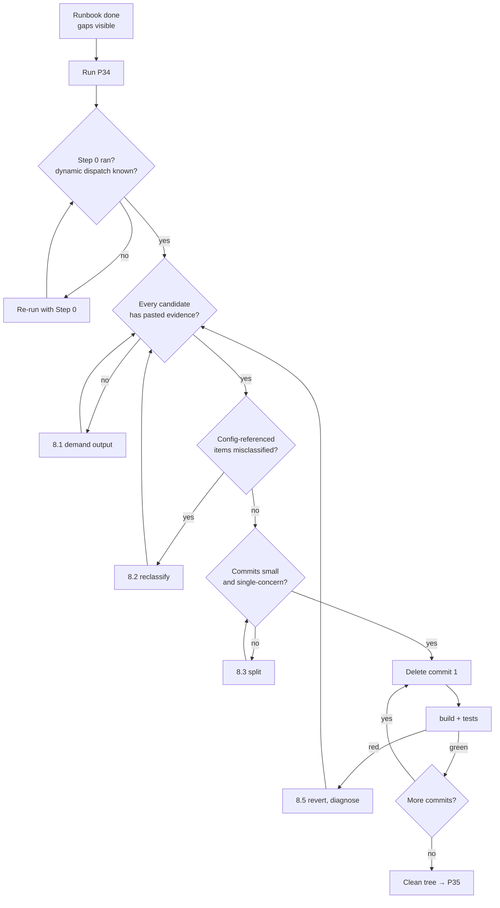

# P34 — Clean Up Dead Code

← [Previous](../phase-7-release/P33-write-the-runbook.md) · [Library index](../README.md) · Next: [P35](P35-run-the-retrospective.md)

> **One line:** Find code nothing calls, prove nothing calls it, then delete it safely.

| | |
|---|---|
| **Phase** | 8 — Improve |
| **Who runs it** | Team Lead (Gautam ) |
| **When** | Sprint 4, after the runbook is written and before the parallel run starts |
| **Takes in** | The codebase at `Case-Study/Python-ETL/code/doc_ingestion/`, plus `artifacts/adr/` to know which approaches were rejected |
| **Produces** | A dead code inventory with evidence, then a sequence of small deletion commits |
| **Hands off to** | Project Manager — [P35 Run the Retrospective](P35-run-the-retrospective.md) |
| **Time to run** | Two hours to inventory and verify, then an afternoon of small commits |

---

## 1. The scene

Gautam is reading the runbook Ravi finished yesterday, and something is bothering him.

It is a good runbook. Five failure modes, all traced to real defects. Four common operations. Every command verified. But he has read it twice now and there are parts of the codebase that appear in none of it — not in a failure mode, not in an operation, not in an alert. That is odd. Writing an operational document forces you to walk every path that can go wrong, and if a module never shows up in that walk, one of two things is true. Either Ravi missed it, or nothing ever reaches it.

He opens `code/doc_ingestion/core/extract.py` and finds two functions near the bottom: `_ocr_text_blocks()` and `_regex_field_scan()`. Both about forty lines. Both carefully written. Neither is called from anywhere in the file.

Then he remembers where they came from. Back in Sprint 1, before Hem wrote [ADR 0001](../phase-2-design/P12-record-an-architecture-decision.md), the team spent two days on a cheaper approach: run open-source OCR over the PDF to get raw text, then pull fields out with regular expressions. It failed for a completely predictable reason — no confidence scores. Without a per-field confidence you cannot build a confidence gate, and without a confidence gate the entire "a wrong number is worse than no number" design collapses. Azure AI Document Intelligence won on exactly that point.

The approach was rejected. The helpers stayed. Nobody deleted them because nobody remembered they were speculative, and by Sprint 2 they just looked like part of the file.

**Dead code is not harmless clutter — it is a lie about what the system does, and everyone who reads the file afterwards believes it.** Gautam opens a session and starts an inventory.

---

## 2. What this prompt actually does — in plain language

### What dead code actually is

**Dead code** is code that exists in the repository and can never run. Not "rarely runs." Cannot run, because nothing reaches it.

It comes in more shapes than people expect:

| Shape | What it looks like | Northwind example |
|---|---|---|
| **Unreferenced function** | Defined, never called | `_ocr_text_blocks()` in `core/extract.py` |
| **Unreferenced module** | A whole file nothing imports | A `core/ocr.py` that survived the ADR |
| **Unreachable branch** | An `if` whose condition can never be true | A flag checked in code where the flag is always on |
| **Stuck feature flag** | A toggle that has been on in every environment for months | `ENABLE_ROW_COUNT_CHECK` |
| **Unused dependency** | A package in `requirements.txt` nothing imports | `azure-ai-formrecognizer` |
| **Orphaned test** | A test for code that no longer exists | Left after a refactor |
| **Dead config** | A key nothing reads | A `sources.yaml` field the rules engine ignores |
| **Vestigial parameter** | An argument every caller passes the same value for | `strict=True` everywhere |

The unifying property: **removing it changes nothing about what the system does.** If removing it changes behaviour, it was not dead, and you have just found out the interesting way.

### Why it matters, concretely

The abstract argument — "cleaner code is better" — is true and does not persuade anyone under deadline pressure. Here are the concrete costs.

**It misleads readers.** Someone opens `core/extract.py` to understand extraction and finds a regex-based field scanner. Reasonable conclusion: extraction sometimes falls back to regex. That conclusion is wrong, and it will inform their next change, and their next change will be built on a false model of the system.

**It gets maintained.** A dependency upgrade breaks `_ocr_text_blocks()`. Someone fixes it. That is an hour spent making dead code work, and it happens because nothing in the file says it is dead.

**It gets resurrected.** This is the expensive one. Six months on, someone needs a text fallback, greps the codebase, finds a working-looking implementation, and wires it up. They have just reintroduced an approach that was rejected for a reason recorded in an ADR they never read — because the code did not link to it.

**It corrupts your search results.** You grep for `confidence` to find every place confidence is handled and get eleven hits, four of which are in dead code. Every future investigation pays a small tax.

**It inflates your attack surface and your dependency list.** An unused `azure-ai-formrecognizer` still gets pulled into the container image, still gets scanned, still generates CVE alerts someone has to triage, and still has to be argued about at the next security review.

### The AI-era point — why this got worse, fast

This is the part that has genuinely changed, and it is why a prompt from the original fifteen needed rewriting rather than reprinting.

When you write code by hand, dead code accumulates slowly and with a paper trail in your own memory. You tried an approach, you remember trying it, and when you abandon it you usually delete it in the same afternoon because it is still fresh and slightly embarrassing.

AI-assisted development produces dead code faster, and it produces a specific kind that is much harder to spot.

Here is the mechanism. You ask for an approach. The assistant builds it — the main function plus three helpers plus a small utility for parsing something. It works partially. You look at the result, decide the approach is wrong, and ask for a different one. The assistant builds the new approach, cleanly, and it works. You move on.

The helpers from attempt one are still there.

Nobody deleted them because the conversation moved forward, not backward. The assistant is not tracking "these three functions were only ever scaffolding for an idea we dropped" — it responded to your latest instruction, which was about the new approach. And crucially, **you did not write those helpers, so you have no personal memory of them being speculative.** Next week they look exactly like code somebody wrote on purpose.

Three consequences worth naming:

**Volume.** A two-day AI-assisted spike can leave behind more orphaned code than a month of hand-written work, because trying an approach is so much cheaper. Cheap experiments are good. Cheap experiments that leave permanent residue are not.

**Plausibility.** AI-generated dead code is well-formed. It has type hints, a docstring, sensible names, and consistent style. Hand-written abandoned code usually looks abandoned — half-finished, a stray `TODO`, inconsistent naming. AI-generated abandoned code looks finished, which removes the visual cue that would have prompted someone to ask about it.

**Attribution loss.** `git blame` tells you which commit added it and which human authored that commit. It does not tell you that the human never really read it. So the social signal that normally protects code — "Ravi wrote this deliberately, better ask him" — is misleading. Ravi may have no idea it exists.

**So dead code cleanup has moved from a nice-to-have tidy-up to a routine part of the loop, and it needs to run more often than it used to.** Once a sprint, not once a year.

### The safety rule that makes this prompt trustworthy

Here is the thing that separates a useful dead code prompt from a dangerous one.

**Verify with a search before every single deletion. Not once at the start. Before each one.**

The reason is that "nothing calls this" is much harder to establish in Python than it looks, because Python has several ways to reach code that no static analysis will find:

**Dynamic imports.** `importlib.import_module(f"core.{module_name}")` resolves a module name at runtime from a string. Static analysis sees no import. The module is very much alive.

**String-based dispatch.** A registry like `HANDLERS = {"broker_alpha": "extract_alpha_positions"}` where the value is later resolved with `getattr()`. The function name exists only as a string.

**Config-driven references.** This one is specific to Northwind and it is the big one. Design invariant eight says adding a counterparty is a YAML change plus a trained model, never a code change. That is a good design and it means **`config/sources.yaml` contains function names, field names and model names as strings.** A field mapper referenced only from YAML has zero code references and is entirely load-bearing.

**Entry points and decorators.** `@app.blob_trigger(...)` in `function_app.py` registers a function with the Azure Functions runtime. Nothing in your code calls it. The platform does.

**Tests.** Something might be called only from a test. That is a real signal but a different one — it usually means the code is dead in production and the test is testing nothing useful. Both should probably go, but that is a decision, not a deletion.

**Reflection and serialisation.** A dataclass field that only ever appears in a `model_dump()` or a SQL column mapping.

So the verification is not "does the IDE say unused." It is a deliberate, recorded search across code, config, tests, SQL, and any string that could name the thing:

```bash
# For a symbol named _ocr_text_blocks
rg -n "_ocr_text_blocks" --type py
rg -n "ocr_text_blocks" .          # no underscore, catches string refs
rg -n "ocr" config/                # config by concept, not exact name
rg -n "ocr" sql/
rg -n "importlib|getattr|__import__" --type py    # is dynamic dispatch used at all?
```

The last one is the clever one. Before you trust *any* static reasoning about this codebase, find out whether the codebase does dynamic dispatch anywhere. If it does not, static analysis is reliable. If it does, every conclusion needs the string search too.

> **The rule in one line.** A symbol is dead when a search across code, config, tests and SQL finds no reference, and you have pasted that search output next to the deletion. Evidence, not confidence.

### The second safety rule: small commits, tests after each

Delete in small commits. Run the build and the full test suite after each one. Never one giant "remove dead code" commit.

The reason is failure isolation. If you delete fourteen things in one commit and the pipeline breaks, you know one of fourteen things mattered and you have no idea which. You either bisect by hand or you revert the whole thing and lose the twelve deletions that were fine.

If you delete them in six commits grouped by concern, and commit four breaks something, you have six lines of diff to look at. You revert one commit. The other five stand.

There is a second, subtler reason. A `git revert` on a small, focused commit is a *routine* operation — one command, no thought. A revert on a 900-line deletion commit is a decision, and decisions under pressure get deferred, which means broken code stays broken longer.

Group commits by concern, not by file: all the OCR-approach helpers together, the feature flag separately, the dependency separately. Each group is one idea, which is exactly the rule from [P31](../phase-7-release/P31-write-clean-git-commits.md).

### The three Northwind examples, and what each one teaches

**The two OCR helpers.** `_ocr_text_blocks()` and `_regex_field_scan()` in `core/extract.py`, left over from the approach rejected in ADR 0001. What this teaches: an abandoned approach leaves its helpers behind, and after the main function is replaced the helpers become invisible. Deleting them is easy. **Recording *why* in the commit message is the actual work**, because the next person who wants a text fallback needs to land on ADR 0001, not on a working implementation.

**The stuck feature flag.** `ENABLE_ROW_COUNT_CHECK` in `config/settings.py`, added when the NWD-142 fix went in so it could be turned off if it proved too noisy. It has been on in every environment since. The `if not settings.ENABLE_ROW_COUNT_CHECK:` branch is unreachable in practice.

What this teaches: **a flag is a promise to make a decision later, and the decision is now made.** The flag is not free — it doubles the logical paths through the gate, it appears in the runbook as a thing someone might toggle at 3am, and worst of all it advertises that turning off the completeness check is a supported operation. It is not. Deleting it is a deliberate statement that the row-count check is now part of the design, and that statement belongs in the spec too.

Note the discipline: you delete a flag when it has been at one value across every environment for long enough that flipping it would now be a change rather than a rollback. Not when you feel like it.

**The unused dependency.** `azure-ai-formrecognizer` in `requirements.txt`. Microsoft renamed this SDK — the service is now Azure AI Document Intelligence and the package is `azure-ai-documentintelligence`. Northwind migrated to the new package in Sprint 2. The old line stayed.

What this teaches: dependencies rot quietly. Nothing imports it, nothing breaks, and it costs you a slower install, a larger image, and a CVE feed entry that somebody triages every time it fires. Removing it is one line and the verification is one grep. This is the easiest win on the list and it is the one most often skipped, because nobody owns `requirements.txt`.

### What the AI is actually doing when this runs

Four passes:

1. **Detection.** Static analysis over the codebase for symbols with no inbound references, plus dependency checks, plus flags with a single value.
2. **Verification.** For each candidate, the multi-surface search — code, config, tests, SQL — with the output captured as evidence.
3. **Classification.** Confident dead / needs a human decision / actually alive via a dynamic path. That middle category is where the value is; it is where the AI says "this is only called from a test" and a human decides what that means.
4. **Sequencing.** Grouping into small commits, ordered least to most risky.

Then it stops, because deleting is the irreversible part and you want a human looking at the list first.

### If you remember one thing

**Confidence is not evidence.** The AI will tell you a function is unused and it will usually be right. The times it is wrong are the times something is referenced from a YAML file or resolved by name at runtime, and those are precisely the references that matter most in a config-driven system like this one. Paste the search output next to every deletion. It takes ten seconds and it is the difference between a tidy-up and an incident.

---

## 3. The prompt

Run this with the codebase available. It needs to read files and run searches.

```text
You are a senior engineer removing dead code. **Find code in [CODE PATH] that
nothing can reach, prove it, and give me a deletion plan.**

**STOP GATE:** produce the inventory and the plan, then **STOP**. Do NOT delete
anything. Do NOT edit a file. Do NOT commit. I execute the deletions myself,
one commit at a time.

CONTEXT
- Codebase: [CODE PATH]
- Language and tooling: [LANGUAGE / PACKAGE MANAGER]
- Rejected approaches whose remnants may survive: [ADR PATHS + ONE LINE EACH]
- Feature flags and where they live: [FLAG LOCATION]
- Config that references code by name: [CONFIG PATHS]
- Entry points the platform calls, not our code: [ENTRY POINTS]

STEP 0 — ESTABLISH WHETHER STATIC ANALYSIS IS EVEN RELIABLE HERE
**Search first** for dynamic dispatch:
  rg -n "importlib|__import__|getattr\(|globals\(\)|eval\(" --type py
**Report** what you find. If this codebase resolves names at runtime, say so
explicitly and treat every static "unused" conclusion as unproven until the
string search below also comes back empty.

STEP 1 — FIND CANDIDATES
Look for all of these, not just unused functions:
- Functions, methods and classes with no inbound references
- Modules nothing imports
- Branches that cannot be taken (including flags with one value everywhere)
- Feature flags set to the same value in every environment
- Dependencies in [DEPENDENCY FILE] that nothing imports
- Tests for code that no longer exists
- Config keys nothing reads
- Function parameters every caller passes identically

STEP 2 — VERIFY EACH ONE. THIS IS THE PART THAT MATTERS.
For EVERY candidate, run and **paste the actual output** of a search across all
of these surfaces:
  1. Code:   rg -n "<exact symbol>" --type py
  2. Strings: rg -n "<symbol without leading underscore>" .
  3. Config: rg -n "<symbol or its concept>" [CONFIG PATHS]
  4. SQL:    rg -n "<symbol or its concept>" [SQL PATH]
  5. Tests:  rg -n "<symbol>" [TEST PATH]

**A candidate with no pasted search output is not a candidate.** I will reject
any row in your table that does not carry evidence.

STEP 3 — CLASSIFY
| Verdict | Meaning |
|---|---|
| **DEAD** | All five searches clean. Safe to delete |
| **DECISION** | Only referenced from tests, or only from config — needs a human |
| **ALIVE** | Reachable via a dynamic path, an entry point, or config. Do not touch |

**Be conservative.** When unsure, classify DECISION, not DEAD.

STEP 4 — THE DELETION PLAN
Group the DEAD items into **small commits by concern**, not by file. For each:
- What is being removed and from where
- The Conventional Commits message, with the WHY in the body — especially where
  something links back to a rejected approach in an ADR
- The exact verification command to run after that commit
- What breaking looks like, so I know what to watch for

**Order the commits least risky first**: dependencies, then unreferenced private
helpers, then flags, then anything public.

DO NOT
- Do NOT delete, edit or commit anything. Plan only.
- Do NOT classify something DEAD on static analysis alone.
- Do NOT propose one large "remove dead code" commit.
- Do NOT remove anything referenced from [CONFIG PATHS] — that is the
  config-driven design working, not dead code.
- Do NOT remove entry points registered by decorators.
- Do NOT touch anything in a rejected-approach ADR without saying which ADR and
  what it decided.

YOU ARE DONE WHEN
Every candidate carries pasted search output across all five surfaces, every one
has a verdict, every DEAD item sits in a small commit with a message explaining
WHY it is dead, and every DECISION item has the specific question I need to
answer written out.

Output the inventory and plan as markdown to the chat.
```

---

## 4. Every placeholder, explained

| Placeholder | What to put in it | Northwind example | What happens if you get it wrong |
|---|---|---|---|
| `[CODE PATH]` | The code root to scan | `Case-Study/Python-ETL/code/doc_ingestion` | Scans the whole repo including artefacts and docs, and reports markdown headings as unused symbols |
| `[LANGUAGE / PACKAGE MANAGER]` | So it uses the right tools | `Python 3.11, pip, requirements.txt, ruff, pytest` | Suggests tooling you do not have, or misses `ruff --select F401` which finds unused imports for free |
| `[ADR PATHS + ONE LINE EACH]` | Rejected approaches, so remnants get recognised | `artifacts/adr/0001 — chose Document Intelligence over OCR+regex, because OCR gives no per-field confidence and without confidence there is no gate` | The OCR helpers get flagged as "unused, unclear purpose" instead of "remnant of the approach ADR 0001 rejected", and the commit message loses the sentence that stops someone resurrecting it |
| `[FLAG LOCATION]` | Where feature flags live | `config/settings.py` and Function app settings | Stuck flags never get found. They are the highest-value category and the easiest to miss |
| `[CONFIG PATHS]` | Config that names code as strings | `config/sources.yaml` | **The dangerous one.** Miss this and a field mapper referenced only from YAML gets classified DEAD, and deleting it silently breaks one counterparty |
| `[ENTRY POINTS]` | What the platform calls, not your code | `function_app.py` — `@app.blob_trigger` and `@app.queue_trigger` handlers | The Function entry points get flagged as unused, because within the codebase they genuinely are |
| `[DEPENDENCY FILE]` | Where dependencies are declared | `requirements.txt` | Unused dependencies never surface. Easiest win on the list, routinely skipped |
| `[SQL PATH]` | Schema and query files | `sql/schema.sql`, `recon/reconcile.py` | Column and table names referenced only from SQL get missed in verification |
| `[TEST PATH]` | The test tree | `tests/` | Everything looks more dead than it is, and you delete something with only test coverage without noticing that is what happened |

---

## 5. The filled-in example

Gautam runs this on the Thursday of Sprint 4, after reading the runbook.

```text
You are a senior engineer removing dead code. **Find code in
Case-Study/Python-ETL/code/doc_ingestion that nothing can reach, prove it, and
give me a deletion plan.**

**STOP GATE:** produce the inventory and the plan, then **STOP**. Do NOT delete
anything. Do NOT edit a file. Do NOT commit. I execute the deletions myself,
one commit at a time.

CONTEXT
- Codebase: Case-Study/Python-ETL/code/doc_ingestion
- Language and tooling: Python 3.11, pip with requirements.txt, ruff, pytest
- Rejected approaches whose remnants may survive:
  - artifacts/adr/0001 — chose Azure AI Document Intelligence over an
    open-source OCR plus regex extraction approach. Rejected because OCR gives
    no per-field confidence score, and without a per-field confidence there is
    no confidence gate, which is the core of the whole design. Two days of spike
    code may still be in core/extract.py.
  - artifacts/adr/0002 — chose SHA-256 content hashing for idempotency over
    filename-based deduplication. The filename path caused NWD-140.
- Feature flags and where they live: config/settings.py, plus Function app
  settings in Azure. ENABLE_ROW_COUNT_CHECK was added with the NWD-142 fix.
- Config that references code by name: config/sources.yaml — this drives the
  whole counterparty design. Adding a counterparty is a YAML change plus a
  trained model, never a code change, so field mappers and model names appear
  there as strings with no code reference.
- Entry points the platform calls, not our code: function_app.py, the
  @app.blob_trigger and @app.queue_trigger decorated handlers.

STEP 0 — ESTABLISH WHETHER STATIC ANALYSIS IS EVEN RELIABLE HERE
**Search first** for dynamic dispatch:
  rg -n "importlib|__import__|getattr\(|globals\(\)|eval\(" --type py
**Report** what you find. If this codebase resolves names at runtime, say so
explicitly and treat every static "unused" conclusion as unproven until the
string search below also comes back empty.

STEP 1 — FIND CANDIDATES
Look for all of these, not just unused functions:
- Functions, methods and classes with no inbound references
- Modules nothing imports
- Branches that cannot be taken (including flags with one value everywhere)
- Feature flags set to the same value in every environment
- Dependencies in requirements.txt that nothing imports
- Tests for code that no longer exists
- Config keys nothing reads
- Function parameters every caller passes identically

STEP 2 — VERIFY EACH ONE. THIS IS THE PART THAT MATTERS.
For EVERY candidate, run and **paste the actual output** of a search across all
of these surfaces:
  1. Code:   rg -n "<exact symbol>" --type py
  2. Strings: rg -n "<symbol without leading underscore>" .
  3. Config: rg -n "<symbol or its concept>" config/
  4. SQL:    rg -n "<symbol or its concept>" sql/ recon/
  5. Tests:  rg -n "<symbol>" tests/

**A candidate with no pasted search output is not a candidate.** I will reject
any row in your table that does not carry evidence.

STEP 3 — CLASSIFY
| Verdict | Meaning |
|---|---|
| **DEAD** | All five searches clean. Safe to delete |
| **DECISION** | Only referenced from tests, or only from config — needs a human |
| **ALIVE** | Reachable via a dynamic path, an entry point, or config. Do not touch |

**Be conservative.** When unsure, classify DECISION, not DEAD.

STEP 4 — THE DELETION PLAN
Group the DEAD items into **small commits by concern**, not by file. For each:
- What is being removed and from where
- The Conventional Commits message, with the WHY in the body — especially where
  something links back to a rejected approach in an ADR
- The exact verification command to run after that commit
- What breaking looks like, so I know what to watch for

**Order the commits least risky first**: dependencies, then unreferenced private
helpers, then flags, then anything public.

DO NOT
- Do NOT delete, edit or commit anything. Plan only.
- Do NOT classify something DEAD on static analysis alone.
- Do NOT propose one large "remove dead code" commit.
- Do NOT remove anything referenced from config/sources.yaml — that is the
  config-driven design working, not dead code.
- Do NOT remove entry points registered by decorators.
- Do NOT touch anything in a rejected-approach ADR without saying which ADR and
  what it decided.

YOU ARE DONE WHEN
Every candidate carries pasted search output across all five surfaces, every one
has a verdict, every DEAD item sits in a small commit with a message explaining
WHY it is dead, and every DECISION item has the specific question I need to
answer written out.

Output the inventory and plan as markdown to the chat.
```

---

## 6. What comes back

Abridged to nine of the fourteen candidates. Note how much of it is search output rather than prose — that ratio is the point.

````markdown
# Dead code inventory — doc_ingestion

## Step 0 — Is static analysis reliable here?

```
$ rg -n "importlib|__import__|getattr\(|globals\(\)|eval\(" --type py
core/rules.py:41:    mapper = getattr(transform, spec["mapper"])
core/clients.py:88:  cls = getattr(sys.modules[__name__], client_name)
```

**Two dynamic dispatch sites. Static analysis alone is NOT sufficient here.**

`core/rules.py:41` resolves a transform function **by name from
`config/sources.yaml`**. Any function in `core/transform.py` may be referenced
only as a string in YAML and will look unused to every static tool.

Every candidate below therefore carries the full five-surface search. I have
classified nothing DEAD on static analysis alone.

---

## The inventory

| # | Candidate | Where | Verdict |
|---|---|---|---|
| 1 | `azure-ai-formrecognizer==3.3.0` | `requirements.txt:7` | **DEAD** |
| 2 | `_ocr_text_blocks()` | `core/extract.py:214` | **DEAD** |
| 3 | `_regex_field_scan()` | `core/extract.py:256` | **DEAD** |
| 4 | `OCR_LINE_PATTERN` | `core/extract.py:31` | **DEAD** |
| 5 | `ENABLE_ROW_COUNT_CHECK` | `config/settings.py:44` | **DEAD** (flag stuck on) |
| 6 | `_hash_filename()` | `core/idempotency.py:30` | **DECISION** |
| 7 | `map_beta_isin()` | `core/transform.py:118` | **ALIVE** |
| 8 | `on_blob_landed()` | `function_app.py:22` | **ALIVE** |
| 9 | `strict=` parameter | `core/rules.py:apply()` | **DECISION** |

---

## Evidence

### 1 — `azure-ai-formrecognizer` (DEAD)

```
$ rg -n "formrecognizer|FormRecognizer" --type py
(no matches)

$ rg -n "formrecognizer" .
requirements.txt:7:azure-ai-formrecognizer==3.3.0

$ rg -n "formrecognizer" config/ sql/ recon/ tests/
(no matches)
```

Nothing imports it. This is the pre-rename SDK — the service became Azure AI
Document Intelligence and the package became `azure-ai-documentintelligence`,
which IS imported (`core/clients.py:12`). The old line survived the Sprint 2
migration.

### 2, 3, 4 — the OCR remnants (DEAD)

```
$ rg -n "_ocr_text_blocks" --type py
core/extract.py:214:def _ocr_text_blocks(pdf_bytes: bytes) -> list[TextBlock]:

$ rg -n "ocr_text_blocks" .
core/extract.py:214:def _ocr_text_blocks(pdf_bytes: bytes) -> list[TextBlock]:

$ rg -n "_regex_field_scan" --type py
core/extract.py:256:def _regex_field_scan(blocks, pattern_map) -> dict:
core/extract.py:271:        # matches = _regex_field_scan(blocks, PATTERNS)   <- commented out

$ rg -n "OCR_LINE_PATTERN" .
core/extract.py:31:OCR_LINE_PATTERN = re.compile(r"^([A-Z0-9]{12})\s+([\d,\.]+)\s+")
core/extract.py:262:    m = OCR_LINE_PATTERN.match(line)

$ rg -n "ocr|OCR" config/ sql/ recon/ tests/
(no matches)
```

Definition sites and one commented-out call. `OCR_LINE_PATTERN` is used only by
`_regex_field_scan`, which is itself dead — so all three go together as one
connected component. Nothing in config, SQL, recon or tests.

**These are the remnants of the approach `artifacts/adr/0001` rejected.** The
ADR is explicit: OCR plus regex gives no per-field confidence score, and without
per-field confidence there is no confidence gate. That decision is load-bearing
for the entire design.

`TextBlock` (`core/extract.py:18`) is used only by these three. It goes with them.

### 5 — `ENABLE_ROW_COUNT_CHECK` (DEAD — flag stuck on)

```
$ rg -n "ENABLE_ROW_COUNT_CHECK" .
config/settings.py:44:    ENABLE_ROW_COUNT_CHECK: bool = True
core/confidence.py:97:    if not settings.ENABLE_ROW_COUNT_CHECK:
core/confidence.py:98:        return GateResult.PASS
tests/test_confidence.py:203:    monkeypatch.setattr(settings, "ENABLE_ROW_COUNT_CHECK", False)
```

Default `True`. Not overridden in any environment — no `.env` sets it, and the
Function app settings list does not contain it (verify against the real app
settings before deleting; I cannot read Azure from here).

Added with the NWD-142 fix as a kill switch in case the completeness check
proved noisy. It has not. **The dead half is the `False` branch**, and one test
exists purely to exercise that branch.

> Note: this is a design statement, not just a cleanup. Removing the flag makes
> row-count reconciliation unconditional. `artifacts/spec-confidence-gate.md`
> should be updated in the same commit so the spec and the code agree.

### 6 — `_hash_filename()` (DECISION — test-only)

```
$ rg -n "_hash_filename" .
core/idempotency.py:30:def _hash_filename(name: str) -> str:
tests/test_reconcile.py:88:    assert _hash_filename("a.pdf") == _hash_filename("a.pdf")
```

No production caller. **This is the filename-hashing path that caused NWD-140** —
a counterparty resent a statement under a new filename and it created a duplicate
row. `artifacts/adr/0002` chose SHA-256 of content instead.

The only survivor is a test asserting the old function is deterministic, which
tests nothing anyone depends on.

**Question for you:** delete the function and the test together, or keep the test
as a regression guard? My view: delete both. The real guard is
`tests/test_reconcile.py::TestResentStatement`, which asserts a resend under a
new filename does NOT duplicate — that is the behaviour we care about, and it
does not need the old function to exist.

### 7 — `map_beta_isin()` (ALIVE — config-referenced)

```
$ rg -n "map_beta_isin" --type py
core/transform.py:118:def map_beta_isin(raw: str) -> str:

$ rg -n "map_beta_isin" config/
config/sources.yaml:64:      mapper: map_beta_isin
```

**Zero code references and completely alive.** Resolved at runtime by
`core/rules.py:41` via `getattr(transform, spec["mapper"])` from
`config/sources.yaml:64`, on the `broker_beta_em` ISIN field.

Every static tool will report this as unused. **Do not delete it.** This is
invariant 8 working as designed — adding a counterparty is a YAML change plus a
trained model, never a code change.

I checked the other three functions in `core/transform.py` with no code callers.
All four are referenced from `sources.yaml`. None is dead.

### 8 — `on_blob_landed()` (ALIVE — platform entry point)

```
$ rg -n "on_blob_landed" .
function_app.py:22:def on_blob_landed(myblob: func.InputStream) -> None:
```

Decorated `@app.blob_trigger(arg_name="myblob", path="raw/{name}", ...)`. Called
by the Azure Functions runtime. Nothing in our code calls it and nothing should.

---

## The deletion plan — 4 commits, least risky first

### Commit 1 — the unused dependency

```bash
# remove requirements.txt:7
```
```text
chore(deps): drop azure-ai-formrecognizer

Nothing imports this. It is the pre-rename SDK — the service is now
Azure AI Document Intelligence and the package is
azure-ai-documentintelligence, which we migrated to in Sprint 2. The
old pin survived the migration.

Leaving it costs a slower install, a larger container image, and a
CVE feed entry someone triages every time it fires.

Refs: cleanup
```
**Verify:** `pip install -r requirements.txt && pytest -q`
**Breaking looks like:** an ImportError on `azure.ai.formrecognizer` at startup.
There should be none — the search found zero imports.

### Commit 2 — the OCR remnants

```bash
# core/extract.py: remove _ocr_text_blocks, _regex_field_scan,
# OCR_LINE_PATTERN, TextBlock, the commented-out call at line 271,
# and the now-unused `import re`
```
```text
refactor(extract): remove OCR spike remnants

Deletes _ocr_text_blocks, _regex_field_scan, OCR_LINE_PATTERN and
TextBlock. Nothing has called any of them since Sprint 1.

These are what is left of the approach ADR 0001 rejected: run
open-source OCR over the PDF, then pull fields out with regular
expressions. It was rejected because OCR returns no per-field
confidence score, and without a per-field confidence there is no
confidence gate — which is the design that makes this whole system
safe.

Removed rather than left in place because a working-looking text
fallback sitting in extract.py invites someone to wire it up in six
months without reading ADR 0001. If a text fallback is ever needed,
start from the ADR, not from this code.

Refs: cleanup, artifacts/adr/0001
```
**Verify:** `ruff check . && pytest -q`
**Breaking looks like:** nothing. If anything fails here, the five-surface
search missed a reference — revert and tell me what it was.

### Commit 3 — the stuck feature flag

```bash
# config/settings.py: remove ENABLE_ROW_COUNT_CHECK
# core/confidence.py: remove the early-return branch at lines 97-98
# tests/test_confidence.py: remove the flag-off test at line 203
# artifacts/spec-confidence-gate.md: state the check is unconditional
```
```text
refactor(confidence): make row-count check unconditional

ENABLE_ROW_COUNT_CHECK was added with the NWD-142 fix as a kill
switch, in case comparing the extracted line-item count against the
statement's declared total proved too noisy in production. It has
been True in every environment since, and the check has not been
noisy.

Removing it is a decision, not a tidy-up. Completeness is now part of
the gate, permanently, and there is no supported way to turn it off.
That is deliberate: NWD-142 was a missing-data bug that every
per-field confidence check passed, and a documented switch for
disabling the only defence against that class of error is a switch
someone will eventually flip at 3am to clear a backlog.

Spec updated in the same commit so the code and
spec-confidence-gate.md agree.

Refs: NWD-142, cleanup
```
**Verify:** `pytest -q tests/test_confidence.py && pytest -q`
**Breaking looks like:** documents that previously passed now going to the
exception queue. That would mean the flag was False somewhere. **Check the real
Function app settings before this commit** — I could not read Azure.

### Commit 4 — filename hashing (only after you answer question 6)

Deferred pending your decision on `_hash_filename` and its test.
````

### How to read this

**Step 0 is the most important twelve lines in the output.** Two `getattr` sites, one of them resolving transform function names from `config/sources.yaml`. That single finding changes the reliability of everything else. Without it, `map_beta_isin()` — a function with literally zero code references — gets classified DEAD, deleted, and `broker_beta_em`'s ISIN mapping breaks silently on the next Spanish confirmation. Which is exactly the sort of failure that surfaces as a reconciliation break three days later.

**Item 7 is the one to internalise.** Zero code references, completely alive. In a config-driven system, "no code references" is not evidence of anything on its own. The design invariant that makes Northwind good to extend — adding a counterparty is a YAML change, never a code change — is the same invariant that makes naive dead code detection dangerous.

**Commit 3's message is doing real work.** Read the second paragraph again: a documented switch for disabling the only defence against silently-missing data is a switch someone will eventually flip under pressure. That is not a tidy-up justification, it is a design argument, and it belongs in permanent history because the next person to propose a kill switch on a safety check needs to find it.

**The part that is commonly wrong:** the confidence on flag values. The AI can read `config/settings.py` and your `.env` files. It cannot read your Azure Function app settings, and a flag can absolutely be overridden there. It flagged its own limitation here, which is correct behaviour, and the instruction to check before committing is the one you must not skip. Run `az functionapp config appsettings list --name func-nwd-ingest-prod --resource-group rg-nwd-ingest-prod` and look with your own eyes.

---

## 7. Why this is the final prompt

**What "done" means here.** Every candidate carries pasted search output across all five surfaces. Every one has a verdict. The DEAD items are grouped into small commits, ordered least risky first, each with a message that explains why the code is dead and what decision made it so. The DECISION items have a specific question written out for a human.

Note what "done" does not mean: it does not mean anything is deleted. This prompt produces a plan. The deleting is yours, one commit at a time, tests after each.

**The checklist:**

- [ ] Step 0 ran, and you know whether this codebase uses dynamic dispatch.
- [ ] Every candidate has pasted search output. Every one. No exceptions for "obviously unused."
- [ ] Every function in a config-referenced module was checked against `config/sources.yaml` specifically.
- [ ] Nothing decorated as a platform entry point is on the DEAD list.
- [ ] Each commit covers one concern and can be described without "and".
- [ ] Feature flag values have been checked in the real deployed environment, not just in `settings.py`.
- [ ] Build and full test suite run after each commit, not once at the end.

**Why you should stop rather than keep prompting.** Two failure modes, and the second is the dangerous one.

The obvious one is scope creep: the prompt drifts from "remove code nothing calls" into "restructure this module while we're here." Those are different jobs with different risk profiles. Dead code removal is safe precisely because it changes no behaviour, and the moment you fold a refactor in, that guarantee is gone.

The dangerous one is pushing for a bigger list. Ask "are you sure that's everything?" and you will get more candidates, and the marginal ones will be marginal for a reason — usually because they are reachable through a path the AI is not certain about. **Aggression and safety trade off directly here, and the safe direction is the small list.** Fourteen candidates you can prove beats forty you mostly believe.

**The signal that you are NOT done.** Any row in the inventory whose evidence column is a claim rather than pasted search output.

---

## 8. When it is not done — the follow-up prompts

| What you're seeing | What's actually wrong | Run this next |
|---|---|---|
| A table of unused symbols with no search output | It used static analysis and reported confidence as evidence | **8.1** |
| Functions from `core/transform.py` on the DEAD list | It did not check `config/sources.yaml`. **Stop before deleting anything** | **8.2** |
| One "remove dead code" commit with 900 deleted lines | It grouped by convenience, not by concern | **8.3** |
| Only unused functions found — no flags, no deps, no config | It read "dead code" narrowly | **8.4** |
| A deletion broke the build | Verification missed a reference. Not a disaster, this is why commits are small | **8.5** |
| It started deleting despite the stop gate | Gate ignored. `git checkout .` and re-run with the gate restated | Re-run §3 |
| The list is all cosmetic — unused imports and variables | Real dead code is structural. Unused imports are `ruff --select F401`, not this prompt | Run ruff, then re-run §3 |
| You want to remove something because you dislike it | Not dead code. That is technical debt | **[P36](P36-tech-debt-triage.md)** |

### 8.1 "It gave me a list with no evidence"

Use this when the inventory is a table of names and confident assertions.

```text
The inventory has no evidence. "Unused" is a claim; I need the search output.

**For every candidate**, run and paste the ACTUAL terminal output of all five:
  1. rg -n "<exact symbol>" --type py
  2. rg -n "<symbol without leading underscore>" .
  3. rg -n "<symbol or its concept>" config/
  4. rg -n "<symbol or its concept>" sql/ recon/
  5. rg -n "<symbol>" tests/

Paste the output even when it is empty — write `(no matches)`. An empty result I
can see is evidence. An assertion is not.

**Remove from the list** any candidate you cannot produce all five searches for.
A shorter list I can trust is worth more than a longer one I cannot.
```

*What changes:* the list usually shrinks by a third and every survivor is checkable in ten seconds.

### 8.2 "It wants to delete config-referenced functions"

Use this the moment you see anything from `core/transform.py` on the DEAD list. This is the highest-severity correction in this file.

```text
**Stop.** You have classified functions from `core/transform.py` as dead. They
are referenced by name as strings from `config/sources.yaml` and resolved at
runtime by `core/rules.py:41` via `getattr(transform, spec["mapper"])`.

This is design invariant 8: adding a counterparty is a YAML change plus a
trained model, never a code change. Every mapper referenced from YAML has zero
code callers and is fully alive.

**Re-verify every single candidate** against `config/` specifically, not just
`--type py`. Paste the output.

**Then enumerate**, from `config/sources.yaml`, every string that names a
function, a field, or a model — for both `broker_alpha` and `broker_beta_em` —
and check each name against your DEAD list.

**Reclassify** everything that appears in YAML as ALIVE, and say plainly which
ones you had wrong. I need to know how far the error spread before I trust the
rest of the inventory.
```

*What changes:* the config-referenced functions move to ALIVE, and asking what it got wrong tells you whether to re-verify everything else.

### 8.3 "It gave me one giant deletion commit"

Use this when the plan is a single commit removing hundreds of lines.

```text
One commit deleting [N] lines is unrevertable in practice. If it breaks, I have
to bisect by hand or lose every deletion at once.

**Split into commits of one concern each.** Group by *why the code is dead*, not
by which file it lives in:
- Unused dependencies together
- Each abandoned approach's remnants as one commit (they are one connected
  component — the helper, its constants, its types)
- Each feature flag on its own
- Anything public on its own

**Order least risky first**: dependencies, then private helpers, then flags, then
public symbols.

**For each commit give me** the verification command to run before moving on, and
one line describing what breakage would look like — so I know what I am watching
for rather than just hoping the tests are green.
```

*What changes:* one commit becomes four to six, each independently revertable, each with a stated failure signature.

### 8.4 "It only found unused functions"

Use this when the categories are narrow.

```text
You only looked for unreferenced functions. Dead code has more shapes and the
most valuable ones are not functions.

**Search specifically for each of these:**
1. **Feature flags** in `config/settings.py` with the same value in every
   environment. For each, say which branch is unreachable.
2. **Dependencies** in `requirements.txt` with no matching import anywhere.
3. **Config keys** in `config/sources.yaml` that no code reads — the reverse of
   the usual direction. Enumerate the keys, then grep for each in the code.
4. **Unreachable branches**: `if` conditions that cannot be false given
   surrounding code or a constant.
5. **Parameters** every caller passes identically — check `strict=`, `dry_run=`
   and anything defaulted.
6. **Tests** whose target no longer exists.
7. **SQL columns** in `sql/schema.sql` that nothing writes and nothing reads.

**Report** each category separately, with the same five-surface evidence, even
where the category comes back empty. Empty is a useful answer.
```

*What changes:* categories 1, 2 and 3 usually produce the highest-value finds. Category 7 occasionally produces an uncomfortable one.

### 8.5 "A deletion broke the build"

Use this when a commit went red. This is a normal event, not a crisis.

```text
Commit [SHA] removed [WHAT] and broke [WHAT BROKE]. Here is the failure:

[PASTE THE ERROR]

**Revert it first** — `git revert [SHA]` — before diagnosing anything. Small
commits exist for exactly this and I want green before I think.

**Then answer**, precisely: what reference did the five-surface search miss, and
which surface would have caught it?

**Then tell me** whether the same class of reference could exist for any other
item on the DEAD list. Re-verify every remaining candidate against that specific
surface and report the results.

**Do not re-attempt this deletion** until you can show me the search that proves
it is now safe.
```

*What changes:* you get green immediately, plus a systematic check of whether the same blind spot affects the rest of the list. That second part is the valuable half.

### The loop



---

## 9. How this goes wrong

### You trust "unused" without searching config

The one that actually breaks production, and the one this whole prompt is shaped around.

`map_beta_isin()` in `core/transform.py` has zero code references. Every static analyser, every IDE, every linter will tell you it is unused. It is called on every single `broker_beta_em` confirmation, resolved by name at runtime from `config/sources.yaml`.

Delete it and nothing fails at deploy time. The Function starts fine. Tests pass, because the tests exercise the mappers directly. The failure arrives the next time a Spanish confirmation comes through: the ISIN mapping raises an `AttributeError`, the document goes to the exception queue, and the first person to notice is Preeti wondering why `broker_beta_em` volume tripled.

**The fix:** Step 0. Find the dynamic dispatch sites before you trust any static conclusion. If `getattr` appears anywhere near a config read, every candidate needs the config search, without exception.

### You delete in one commit because it feels efficient

Fourteen deletions, one commit, one test run at the end. It is faster and it feels tidier.

Then something breaks two days later — not immediately, because the tests passed. Now you have a 900-line deletion commit and a symptom, and reverting it costs you the thirteen deletions that were fine. So instead you spend an hour picking through the diff to find the one that mattered, which is exactly the hour the small commits would have saved you.

**The fix:** group by concern, tests after each. It costs about twenty extra minutes across the whole exercise and it converts a potential hour of archaeology into a one-command revert.

### You remove a flag that is set differently in production

`config/settings.py` says `ENABLE_ROW_COUNT_CHECK: bool = True`. Nothing in the repo overrides it. Confident conclusion: the flag is stuck on, the `False` branch is dead.

But Azure Function app settings override Python defaults at runtime, and they live in Azure, not in your repository. If someone set that flag to `False` in production during an incident three weeks ago and forgot to tell anyone, removing it does not restore the default — it makes the check unconditional and suddenly turns on a gate condition that was deliberately off. Documents that were passing start going to the exception queue en masse.

The AI cannot see Azure. It said so, which is good behaviour. You have to actually go and look.

**The fix:** before deleting any flag, run `az functionapp config appsettings list --name func-nwd-ingest-prod --resource-group rg-nwd-ingest-prod --output table` and read it with your own eyes. Every environment, not just production.

### You delete without explaining why, and the code comes back

You remove `_ocr_text_blocks()` with the commit message "remove unused function." Correct deletion, worthless message.

Eight months later a counterparty starts sending documents Document Intelligence handles poorly, and someone asks whether a text-extraction fallback would help. They search the history, find a commit removing something called `_ocr_text_blocks`, see "unused function", and conclude it was removed for tidiness. So they write it again. Two weeks later they hit the same wall ADR 0001 hit: no per-field confidence, no gate, no design.

**The fix:** the commit body links the deletion to the decision. "This is what remains of the approach ADR 0001 rejected, because OCR returns no per-field confidence score" is a sentence that saves someone two weeks, and it costs you thirty seconds. This is the same discipline as [P31](../phase-7-release/P31-write-clean-git-commits.md) — bodies explain why — applied to the one case where the "why" is a decision made a year ago.

### This is the wrong tool: the code is ugly, not dead

Someone looks at `core/rules.py`, decides `apply()` is doing too much, and reaches for this prompt.

It is the wrong tool and it will produce nothing useful, because `apply()` is called on every document. It is not dead. It might be badly structured, hard to test, and overdue for a split — and none of that is what this prompt does.

The distinction matters because the two jobs have completely different risk profiles. Dead code removal is safe by construction: you delete something unreachable and behaviour is provably unchanged. Restructuring live code changes execution paths, and it needs tests, review, and a reason beyond taste.

**The rule:** if removing it changes behaviour, it is not dead code. If you want to change it because it is hard to work with, that is technical debt and it goes through [P36](P36-tech-debt-triage.md), where it gets classified, costed, and ranked against everything else rather than done on a whim.

---

## 10. The handoff

Atul picks this up, and it lands in the retrospective.

The immediate output — four commits, a smaller `requirements.txt`, a `core/extract.py` that no longer advertises a text fallback — is worth having and is not the interesting part. The interesting part is what the exercise revealed about how the team works.

Two extraction helpers survived from Sprint 1 to Sprint 4, through code review, through three sprints of people opening that file. A feature flag added as a kill switch became permanent without anyone deciding it should. A dependency line survived an SDK migration. None of those is a mistake anyone made. Each is a small gap in a process, and process gaps are exactly what [P35](P35-run-the-retrospective.md) exists to surface.

The pointed question Gautam takes into the retro is: **why did nothing catch this for three sprints?** The honest answer is that nothing was looking. Code review looks at the diff, and dead code is defined by its absence from diffs. The definition of done in [P17](../phase-3-planning/P17-definition-of-done.md) does not mention it. That is a process finding, not a personal one, and it turns into an action item.

Hem gets something narrower and sharper. The dead code inventory is a list of decisions the codebase made and did not record. The OCR helpers were a decision that lived in ADR 0001 but not in the code. The stuck flag was a decision nobody realised they had made. That maps directly onto the debt inventory in [P36](P36-tech-debt-triage.md), where the recurring pattern is the same: a shortcut taken deliberately, and then forgotten about.

> **Artifact contract — the dead code inventory and its commits**
> Anyone reading this work can rely on finding:
> - A Step 0 finding stating whether the codebase uses dynamic dispatch, with the search output.
> - Every candidate carrying pasted search output across code, strings, config, SQL and tests.
> - A verdict of DEAD, DECISION or ALIVE against every candidate, with DECISION items carrying a written question.
> - Small commits grouped by concern, ordered least risky first, each with a verification command.
> - Commit bodies that link a deletion to the decision that made the code dead, by ADR or defect ID.
> - A green build and test suite after every individual commit.
>
> If any of those is missing, the cleanup is not done — go back to §7.

---

## 11. In the case study

This appears in [09-sprint-4-release.md](../../Case-Study/Python-ETL/09-sprint-4-release.md), on the Thursday, and it starts because of the runbook rather than because anyone planned it.

Gautam noticed the gap while reading [P33](../phase-7-release/P33-write-the-runbook.md)'s output. Writing an operational document forces you to walk every path that can fail, and the modules that never appear in that walk are worth a second look. That is a genuinely useful habit and it is not obvious in advance — the runbook is an operability artefact, and its side effect is a map of what the system actually does versus what the codebase claims it does.

The find that surprised the team was not the OCR helpers. Everyone half-remembered those. It was `map_beta_isin()`, which the first pass of the inventory classified DEAD with high confidence, and which is called on every Spanish confirmation `broker_beta_em` sends. Gautam caught it because he read the evidence column, saw that the config search had not been run, and asked for it. Had he skimmed — and the row looked exactly like the four rows above it — the deletion would have shipped, and the failure would have surfaced days later as a cluster of exception queue rows that looked like a translation problem.

Hem's reaction to that near miss is the sentence the team kept. Her recurring question is "what does this look like when it's wrong?", and applied to dead code removal the answer is uncomfortable: it looks like nothing at all, for as long as it takes for the right document to arrive. There is no deploy-time error, no failing test, no alert. That is why the evidence rule is not bureaucracy.

The stuck flag became a small argument. Ravi wanted to keep `ENABLE_ROW_COUNT_CHECK` on the grounds that a kill switch on a new check is prudent. Hem's counter is in the commit message above and it won: a documented switch for disabling the only defence against silently-missing data is a switch someone will eventually flip at 3am to clear a backlog, and NWD-142 is the proof of what silently-missing data costs. The flag went, and `artifacts/spec-confidence-gate.md` was updated in the same commit so the spec and the code agreed for once.

---

← [Previous](../phase-7-release/P33-write-the-runbook.md) · [Library index](../README.md) · Next: [P35](P35-run-the-retrospective.md)
