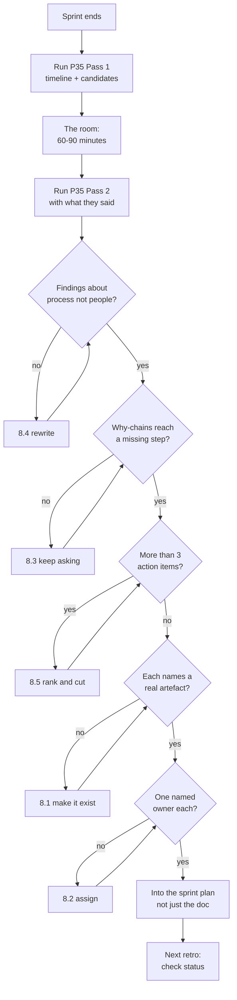

# P35 — Run the Retrospective

← [Previous](P34-clean-up-dead-code.md) · [Library index](../README.md) · Next: [P36](P36-tech-debt-triage.md)

> **One line:** Find the process gap that let a bug through, and fix the process.

| | |
|---|---|
| **Phase** | 8 — Improve |
| **Who runs it** | Project Manager (Atul), with the whole team in the room |
| **When** | End of a sprint. For Northwind, the Sprint 3 retro, run late — in Sprint 4 |
| **Takes in** | `artifacts/bug-NWD-142.md`, the Sprint 3 story and defect list, `artifacts/spec-confidence-gate.md`, `artifacts/definition-of-done.md` |
| **Produces** | `Case-Study/Python-ETL/artifacts/retrospective-sprint-3.md` |
| **Hands off to** | Architect + Team Lead — [P36 Tech Debt Triage](P36-tech-debt-triage.md) |
| **Time to run** | 15 minutes to prepare, 60 to 90 minutes in the room |

---

## 1. The scene

Atul is running the Sprint 3 retrospective two weeks late, and he knows exactly why it slipped. Sprint 3 was the verify-and-rework sprint. Pankaj found five defects, NWD-142 turned out to be a two-day fix that changed the spec, and by the time the last one closed everyone was already in Sprint 4 doing release work. The retro got moved twice and then quietly dropped.

That is itself worth noticing, and he writes it at the top of his notes before anything else. **The ceremony that exists to fix your process is the first ceremony to get cut when your process is under strain**, which is precisely backwards.

Now he has to run it, and he is worried about how it will go. NWD-142 is going to dominate the room. It is the biggest thing that happened in Sprint 3: a Broker Alpha statement whose positions table ran across a page boundary, page two silently dropped, straight through the confidence gate because every field that *was* extracted had high confidence, into Snowflake with fourteen of twenty-three positions, and out the other side as `MISSING_EXTERNAL` reconciliation breaks that looked exactly like real settlement failures.

Ravi wrote that code. Ravi is going to be in the room. And Atul can already see the version of this meeting where everyone is very polite about it, Ravi says he should have tested the multi-page case, everyone agrees, and the action item is "be more careful with page boundaries."

That meeting would be a waste of ninety minutes, and worse, it would be wrong. Ravi did test. He tested against three real Broker Alpha statements. All three were single-page position tables, because that is what Broker Alpha usually sends. **The failure was not that one engineer missed a case. It was that nowhere in the entire process — not the spec, not the acceptance criteria, not the confidence gate, not the test suite, not the review — did anyone ask whether all the data had arrived.**

That is the finding. Atul's job for the next ninety minutes is to get the room there without letting it stop at the easier, more personal, completely useless version.

---

## 2. What this prompt actually does — in plain language

### What a retrospective is, if you have never been in one

A **retrospective** — "retro" — is a meeting at the end of a fixed period of work where the team looks at *how they worked* and decides what to change.

Note the distinction. It is not a review of *what* was built. That is a different ceremony called a demo or a review, where you show working software to the people who asked for it. The retro is about the process itself: how work flowed, where it got stuck, what surprised you, what you would do differently.

It comes from scrum, which is a way of organising software work into fixed-length blocks called **sprints**, usually one to four weeks. At the end of each sprint scrum prescribes several ceremonies — a **demo** (show what was built), a **retrospective** (improve how you build), and then **planning** for the next sprint. This library covers the planning side in [P16](../phase-3-planning/P16-sprint-plan-and-assignment.md) and the daily coordination in [P21](../phase-4-build/P21-daily-standup-summary.md).

The mechanics are simple enough to describe in four lines:

1. Everyone in the delivery team attends. Not managers observing. The people who did the work.
2. You look back at the sprint and gather observations — what went well, what did not, what surprised you.
3. You pick the two or three things that actually matter and dig into *why* they happened.
4. You leave with a small number of specific, owned, dated changes to how you work.

Step 4 is the only part that produces value. Steps 1 to 3 are how you get there honestly.

### Why the retro exists at all

The argument for it is that **teams get worse by default and better only on purpose.**

Left alone, process problems compound quietly. A spec template that never asks the right question keeps not asking it. A review checklist with a gap keeps having the gap. A handoff that loses information keeps losing it, and everyone routes around it individually rather than fixing it, because fixing it is nobody's story.

None of that surfaces in the work itself. Your daily standup is about today's blockers. Your sprint planning is about the next two weeks. There is no other moment in the cycle where anyone is asked "is the way we work actually working?" The retro is that moment, and if you skip it the answer defaults to "yes" forever.

### Why it is not a blame session, and what happens if it becomes one

This is the part that needs saying explicitly because it is where retros most often die.

A retrospective examines a system: the sequence of steps, checks, handoffs and habits that produced this sprint's outcome. People are part of that system, but the finding is almost never "this person was careless." It is almost always "this system had no step that would have caught this."

Two reasons this matters, and the first is moral while the second is purely practical.

**The moral reason:** in a sprint where things went wrong, the person who wrote the code is already thinking about it more than anyone else in the room. Ravi did not need a meeting to tell him NWD-142 was his code. Making that public adds nothing and costs a lot.

**The practical reason, which is the one that persuades sceptics:** blame produces bad information. If the retro is a place where mistakes get attributed to individuals, people stop volunteering things. Not dramatically — nobody refuses to speak. They just describe things a little more favourably. "The spec was a bit unclear" instead of "I did not read the spec, I read the story title and started coding." The second sentence is where the real finding is. You only get it in a room where saying it is safe.

**A retrospective is an information-gathering exercise, and blame is an information suppressant.** That is the whole argument.

The practical mechanics that keep it honest:

- **Talk about the system, not the person.** "The spec did not cover multi-page tables" rather than "Ravi did not handle multi-page tables." Both true. Only one leads anywhere.
- **Assume everyone did their best with what they had.** Then ask what they had. That question is where findings live.
- **Findings must be about a step, a check, a document, or a habit** — something that can be changed. If a finding cannot be changed by anything except someone trying harder, it is not a finding.

### Why "we'll be more careful" is not an action item

This is the single most common way a retrospective produces nothing, and it happens in retros that felt excellent at the time.

"We'll be more careful with page boundaries." "Let's remember to check for missing data." "We should test more edge cases." Everyone nods. It feels like a resolution. Nothing changes.

Three reasons it does not work:

**It is not checkable.** Six weeks later, has the team been more careful? Nobody can say. There is no artefact, no step, no observable difference. An action item you cannot verify is a feeling with a bullet point.

**It relies on memory under pressure.** The next multi-page statement arrives in four months, during a busy sprint, and whether anyone thinks about page boundaries depends on whether the person doing the work happened to be in this room and happened to remember. That is not a process, it is luck with extra steps.

**It puts the fix in the wrong place.** "Be careful" asks a human to reliably do something a system could do automatically. Humans are not reliable at that and it is unkind to ask them to be. The row-count reconciliation check that came out of this retro runs on every document forever and does not get tired.

The test is mechanical: **an action item must name a thing that will exist, or a step that will happen, that did not before.** A file, a check in code, a line in a template, a stage in the pipeline, a question in a checklist.

| Not an action item | Actual action item |
|---|---|
| Be more careful with multi-page documents | Add a row-count reconciliation check comparing extracted line items against the statement's declared total. Owner Ravi, by 28 Nov |
| Test edge cases better | Add "what does silently-missing data look like here?" to the spec template. Owner Hem, by 28 Nov |
| Communicate earlier about spec gaps | When a fix requires a spec change, raise it in the next standup. Add it to the definition of done. Owner Gautam, by 28 Nov |
| Improve our QA process | Pankaj adds a completeness check to the E2E suite: every test document asserts extracted row count equals expected. Owner Pankaj, by 5 Dec |

Notice what the right-hand column shares: each names a specific artefact that will be different afterwards, one person, and a date.

### The Sprint 3 finding, worked through properly

This is worth walking slowly because it is the pattern the whole ceremony exists to produce.

**The surface story.** Ravi wrote extraction code. It dropped page-two line items. Pankaj found it. Ravi fixed it.

**The first "why".** Why did the code drop them? Because Azure AI Document Intelligence returns a table continuing onto the next page as a *separate* table object with no relationship marker back to the first one, and the extractor mapped each table independently. Reasonable code, written against a reasonable assumption.

**The second "why".** Why did nobody notice? Because there was no test for it. Why no test? Because Ravi tested against three real Broker Alpha statements and all three were single-page. He was not being lazy; he was using real data, which is normally the right instinct.

**The third "why", and here it gets interesting.** Why did the confidence gate not catch it? Because the confidence gate checks confidence, and confidence was high on everything present. **The gate has nothing to say about data that never arrived.** A field extracted at 0.97 confidence and a field that does not exist look identical to a threshold check, because one of them is not there to check.

**The fourth "why", which is the actual finding.** Why did nobody realise the gate had that blind spot? Because everyone believed the gate covered correctness. It is the centrepiece of the design, it has its own spec, its own story, its own ADR, and the design invariant "a wrong number is worse than no number" is repeated throughout the project. Everyone — Hem who designed it, Gautam who reviewed it, Pankaj who tested against it, Preetinka who wrote acceptance criteria around it — carried a mental model in which the confidence gate was the thing that stopped bad data.

It stops bad *values*. It has never stopped *missing* data and was never designed to.

**So the finding is not "Ravi made a mistake." It is two things:**

1. **There was no data-completeness check anywhere in the process.** Not in the spec, not in the acceptance criteria, not in the code, not in the tests, not in the review. The entire pipeline verified that the values present were trustworthy and never asked whether all the values were present.

2. **The confidence gate gave everyone false confidence that a whole class of error was covered when it was not.** This is the deeper one and it is uncomfortable, because it means a good control created a blind spot precisely by being good. People stopped looking in that direction because something was already there.

> **The general shape.** A control that works well in its domain will be assumed to cover neighbouring domains. The better it is, the stronger the assumption. Ask of every control you rely on: what class of error does this specifically not see?

That finding produces two action items, and they operate at different levels.

**Action item one is the specific fix**: a row-count reconciliation check. Compare the number of line items extracted against the total the statement itself declares — most position statements carry a "Total positions: N" field — and send any mismatch to the exception queue. It catches this bug and, more importantly, it catches the next variant of this bug, whatever it turns out to be, because it checks completeness rather than checking for page boundaries specifically. That check becomes the headline check in [P25](../phase-5-verify/P25-data-quality-validation.md).

**Action item two is the general fix**: add the question **"what does silently-missing data look like here?"** to the spec template. Every future spec has to answer it. This is the one that pays over years, because it generalises the lesson beyond documents and tables to anything the team ever specifies. The Aladdin REST feed can return a partial page. A Snowflake MERGE can silently no-op. Both are the same class of failure and neither involves a PDF.

### The shape of the ceremony, and why in this order

Five phases. The order matters more than it looks.

**1. Set the scene (5 min).** Restate what the retro is for, out loud, every time: to improve how we work, not to assign fault. It sounds unnecessary after the first few. It is not, and it matters most in exactly the sprints where something went wrong.

**2. Gather data (15 min).** Facts first, opinions later. What actually happened: stories completed, defects found, dates, the sequence of events. This grounds the discussion in something checkable and stops it opening with whoever feels most strongly.

**3. Generate insights (30 min).** The digging. Why did things happen the way they did? This is where the "five whys" — asking why repeatedly until you reach something structural — earns its keep. **You are looking for the layer where the answer stops being about a person and starts being about a step that does not exist.**

**4. Decide what to do (20 min).** Pick two or three. Not ten. A retro that produces ten action items produces zero, because nobody can hold ten changes in a sprint alongside actual delivery. Two that get done beat ten that get listed.

**5. Close (5 min).** Read the action items back, with owners and dates, out loud. Check last retro's items while you are there — the fastest way to kill a retro programme is for people to notice that nothing from the last one happened.

### Where the AI fits, and where it must not

The AI is genuinely good at three things here: assembling the timeline from your artefacts and git history so nobody has to reconstruct it from memory, running the "why" chain past the point where a room usually gets uncomfortable and stops, and enforcing the action-item quality bar without any social cost.

That third one is worth dwelling on. Telling a colleague their proposed action item is too vague is socially awkward and people avoid it. A prompt that rejects "be more careful" and demands an artefact, an owner and a date is doing something a human facilitator finds genuinely hard, and it does it without anyone having to be the difficult person in the room.

Where it must not go: **the AI does not run the meeting.** It prepares the timeline and the candidate findings before the room, and it formats and sharpens the output afterwards. The insight generation in the middle is human, because the useful material is what people say out loud to each other — "honestly, I read the story title and started coding, I never opened the spec" — and that sentence does not exist in any artefact the AI can read.

Use it as a bookend, not as a chair.

### If you remember one thing

**Look for the missing step, not the mistaken person.** Every genuinely useful retro finding takes the form "there was no point in our process where anyone would have caught this," and every genuinely useful action item is a new step that now exists. If your output names a person and a virtue, you stopped digging too early.

---

## 3. The prompt

Run this in two passes: once before the meeting to prepare the timeline and candidate findings, and once after to sharpen the action items into the artefact.

```text
You are facilitating a sprint retrospective. **Prepare the retrospective for
[SPRINT NAME]** and produce the write-up.

**GROUND RULE — apply this to everything you write:** a retrospective examines a
PROCESS, not a person. Findings describe missing steps, gaps in documents,
absent checks and broken handoffs. **Never** attribute an outcome to an
individual's care, skill or attention. If a finding can only be fixed by someone
trying harder, it is not a finding — dig further.

**STOP GATE:** produce the timeline and the candidate findings, then **STOP**.
Do NOT write action items yet. The team discusses the findings in the room
first; I will come back with what they said.

CONTEXT
- Sprint: [SPRINT NAME] — [WHAT IT WAS FOR]
- Team: [NAMES AND ROLES]
- Delivered: [STORY IDS AND OUTCOMES]
- Defects found: [BUG IDS + ONE LINE EACH]
- The significant event: [THE ONE THING WORTH DIGGING INTO]
- Artefacts to read: [PATHS]
- Previous retro's action items: [ITEMS AND WHETHER THEY WERE DONE]

PASS 1 — BEFORE THE MEETING

**1. Timeline.** Read the artefacts and the git history. Build a factual,
dated sequence of what happened. Facts only, no interpretation.

**2. What went well.** 3 to 5 items, each with evidence. Do not skip this —
a retro that only examines failure teaches the team that surfacing problems is
punished.

**3. Candidate findings.** For [THE SIGNIFICANT EVENT], run a why-chain.
**Ask "why" at least four times.** Show every level. **Stop only when the answer
names a missing step, a missing check, a missing question in a document, or a
broken handoff** — not when it names a person or a decision someone made.

For each candidate finding, state:
   - The finding, in one sentence about the process
   - What in our process would have had to exist to catch this
   - What ELSE this same gap could let through in future

**4. Questions for the room.** 3 to 5 questions the team should answer that you
cannot answer from artefacts, because the answer only exists in someone's head.

**STOP HERE.**

PASS 2 — AFTER THE MEETING (I will paste what the team said)

**5. Action items.** Turn the discussion into **2 to 3** action items. No more.
Each MUST have:
   - A specific artefact that will exist, or a step that will happen, that does
     not today. Name the file or the check
   - One named owner. Not a role, not a team
   - A date
   - "Done when" — the checkable condition

**REJECT any action item** that is a resolution to be more careful, to remember
something, to communicate better, or to improve generally. For each one you
reject, say what it would have to become to be acceptable.

**6. Write it up** to [OUTPUT PATH], with: what went well, the timeline, the
findings with their why-chains, the action items table, and the status of the
previous retro's items.

DO NOT
- Do NOT name an individual as the cause of a defect.
- Do NOT produce more than 3 action items. Ranked, top 3, the rest go on the
  backlog with a note.
- Do NOT accept "be more careful", "remember to", "improve", "consider" or
  "keep in mind" as an action item.
- Do NOT stop a why-chain at "there was no test for it". That is a symptom. Ask
  why there was no test, and then why nobody expected one.
- Do NOT skip "what went well".
- Do NOT write action items in Pass 1.

YOU ARE DONE WHEN
Every finding describes a process gap and not a person, every why-chain reaches
a missing step, every action item names an artefact plus an owner plus a date
plus a done-when, there are no more than three of them, and the previous retro's
items have a status.

Write the retrospective to [OUTPUT PATH].
```

---

## 4. Every placeholder, explained

| Placeholder | What to put in it | Northwind example | What happens if you get it wrong |
|---|---|---|---|
| `[SPRINT NAME]` | Which sprint, and its dates | `Sprint 3 — Verify and Rework, 4–15 November` | Findings drift across sprint boundaries and you end up re-litigating decisions from Sprint 1 |
| `[WHAT IT WAS FOR]` | The sprint's goal in one line | `Pankaj tests the pipeline end to end; the team fixes what she finds` | The AI cannot judge whether the sprint succeeded, so "what went well" becomes generic |
| `[NAMES AND ROLES]` | Everyone who did the work | `Atul (PM), Preetinka (PO), Hem (architect), Gautam (lead), Ravi (backend), Dzmitry (frontend), Pankaj (QA)` | Handoff findings get missed, because a handoff is between two named roles |
| `[STORY IDS AND OUTCOMES]` | What was delivered, honestly | `NWD-103 done then reopened, NWD-106 done, NWD-107 done` | "What went well" has nothing concrete to point at |
| `[BUG IDS + ONE LINE EACH]` | Every defect, with a real description | `NWD-142 — page-2 line items dropped silently, passed the confidence gate, loaded half a statement` | Findings stay shallow. The one-line description is what the why-chain works from |
| `[THE ONE THING WORTH DIGGING INTO]` | The event that deserves the thirty minutes | `NWD-142 — a missing-data bug that every test and the confidence gate passed` | **The most important placeholder.** Without a focus you get five shallow findings instead of one real one |
| `[PATHS]` | Artefacts to read | `artifacts/bug-NWD-142.md`, `artifacts/spec-confidence-gate.md`, `artifacts/definition-of-done.md`, `artifacts/code-review-NWD-103.md` | The timeline gets reconstructed from your summary and quietly reflects your view of events |
| `[ITEMS AND WHETHER THEY WERE DONE]` | Last retro's actions and their status | `Sprint 2: "add acceptance criteria to every story before build starts" — done, held all sprint` | The retro programme rots. Nothing kills it faster than people noticing last time's items vanished |
| `[OUTPUT PATH]` | Where it lands | `Case-Study/Python-ETL/artifacts/retrospective-sprint-3.md` | The action items live in someone's notebook, which is the same as not existing |

---

## 5. The filled-in example

Atul runs Pass 1 on the Monday morning, an hour before the retro.

```text
You are facilitating a sprint retrospective. **Prepare the retrospective for
Sprint 3 — Verify and Rework** and produce the write-up.

**GROUND RULE — apply this to everything you write:** a retrospective examines a
PROCESS, not a person. Findings describe missing steps, gaps in documents,
absent checks and broken handoffs. **Never** attribute an outcome to an
individual's care, skill or attention. If a finding can only be fixed by someone
trying harder, it is not a finding — dig further.

**STOP GATE:** produce the timeline and the candidate findings, then **STOP**.
Do NOT write action items yet. The team discusses the findings in the room
first; I will come back with what they said.

CONTEXT
- Sprint: Sprint 3 — Verify and Rework, 4 to 15 November
- Team: Atul(PM), Preetinka Sharma (PO), Hem Singh (architect),
  Gautam  (team lead), Ravi Mullick (backend), Dzmitry  (frontend),
  Pankaj  (QA)
- Delivered: NWD-103 marked done, then reopened after NWD-142 and re-closed.
  NWD-104, NWD-105, NWD-106, NWD-107, NWD-108 all closed. Straight-through rate
  moved from 61% to 84%.
- Defects found:
  - NWD-138 — a Spanish confirmation where translation ran on the identifier
    field as well as descriptive fields, breaking the security match
  - NWD-139 — the exception queue UI showed confidence as 0.8234567, not 82%
  - NWD-140 — a resent statement under a new filename created a duplicate row;
    idempotency was hashing the filename in one code path
  - NWD-141 — a 429 from Document Intelligence at month-end killed the run
    instead of backing off
  - NWD-142 — on a Broker Alpha statement where the positions table spans a page
    boundary, every line item on page 2 was silently dropped. The document still
    passed the confidence gate because every field it DID extract was high
    confidence, so it loaded into Snowflake with 14 of 23 positions.
    Reconciliation then reported MISSING_EXTERNAL breaks for the dropped rows,
    which look exactly like genuine settlement failures.
- The significant event: NWD-142. It is the one where the code worked, the tests
  passed, and the confidence gate approved a document that was half missing.
- Artefacts to read: artifacts/bug-NWD-142.md,
  artifacts/spec-confidence-gate.md, artifacts/definition-of-done.md,
  artifacts/code-review-NWD-103.md, artifacts/acceptance-criteria-NWD-103.md
- Previous retro's action items (Sprint 2):
  1. "Every story gets acceptance criteria written by Preetinka and Pankaj before
     build starts" — DONE, held for the whole sprint
  2. "Gautam reviews within one working day of a PR opening" — PARTIALLY DONE,
     slipped twice during the NWD-142 rework week

PASS 1 — BEFORE THE MEETING

**1. Timeline.** Read the artefacts and the git history. Build a factual,
dated sequence of what happened. Facts only, no interpretation.

**2. What went well.** 3 to 5 items, each with evidence. Do not skip this —
a retro that only examines failure teaches the team that surfacing problems is
punished.

**3. Candidate findings.** For NWD-142, run a why-chain.
**Ask "why" at least four times.** Show every level. **Stop only when the answer
names a missing step, a missing check, a missing question in a document, or a
broken handoff** — not when it names a person or a decision someone made.

For each candidate finding, state:
   - The finding, in one sentence about the process
   - What in our process would have had to exist to catch this
   - What ELSE this same gap could let through in future

**4. Questions for the room.** 3 to 5 questions the team should answer that you
cannot answer from artefacts, because the answer only exists in someone's head.

**STOP HERE.**

PASS 2 — AFTER THE MEETING (I will paste what the team said)

**5. Action items.** Turn the discussion into **2 to 3** action items. No more.
Each MUST have:
   - A specific artefact that will exist, or a step that will happen, that does
     not today. Name the file or the check
   - One named owner. Not a role, not a team
   - A date
   - "Done when" — the checkable condition

**REJECT any action item** that is a resolution to be more careful, to remember
something, to communicate better, or to improve generally. For each one you
reject, say what it would have to become to be acceptable.

**6. Write it up** to Case-Study/Python-ETL/artifacts/retrospective-sprint-3.md,
with: what went well, the timeline, the findings with their why-chains, the
action items table, and the status of the previous retro's items.

DO NOT
- Do NOT name an individual as the cause of a defect.
- Do NOT produce more than 3 action items. Ranked, top 3, the rest go on the
  backlog with a note.
- Do NOT accept "be more careful", "remember to", "improve", "consider" or
  "keep in mind" as an action item.
- Do NOT stop a why-chain at "there was no test for it". That is a symptom. Ask
  why there was no test, and then why nobody expected one.
- Do NOT skip "what went well".
- Do NOT write action items in Pass 1.

YOU ARE DONE WHEN
Every finding describes a process gap and not a person, every why-chain reaches
a missing step, every action item names an artefact plus an owner plus a date
plus a done-when, there are no more than three of them, and the previous retro's
items have a status.

Write the retrospective to
Case-Study/Python-ETL/artifacts/retrospective-sprint-3.md.
```

---

## 6. What comes back

This is the finished artefact, after Pass 2 — Atul pasted the room's discussion back in and asked for the write-up.

````markdown
# Retrospective — Sprint 3, Verify and Rework

**Dates:** 4–15 November. **Held:** 25 November (two weeks late — see Finding 3).
**Present:** Atul, Preetinka, Hem, Gautam, Ravi, Dzmitry, Pankaj.
**Facilitator:** Atul.

> This retrospective examines our process. It does not assign fault to
> individuals, and no finding below should be read that way.

---

## Previous retro's action items

| From Sprint 2 | Owner | Status |
|---|---|---|
| Every story gets acceptance criteria from Preetinka and Pankaj before build starts | Preetinka | **Done.** Held all sprint. NWD-104 through NWD-108 all had criteria before a line was written |
| Gautam reviews within one working day of a PR opening | Gautam | **Partial.** Slipped twice, both during the NWD-142 rework week. Not a discipline problem — the rework consumed the review budget. Carried forward with the constraint acknowledged |

---

## What went well

1. **Pankaj's bug reports were good enough to prompt with directly.** `bug-NWD-142.md`
   carried the exact statement, the page count, the expected and actual row
   counts, and the resulting break IDs. Ravi pasted it straight into a session
   and got a working reproduction on the first attempt. This is now the standard.
2. **Straight-through rate moved 61% → 84% in one sprint**, mostly from NWD-138
   and NWD-104 landing together.
3. **NWD-139 took eleven minutes** from report to fix to verification. A cosmetic
   defect getting a proportionate response is worth noting, because the opposite
   is also common.
4. **The NWD-142 fix changed the spec, not just the code.** Ravi raised it as a
   spec problem rather than patching around it. That is the behaviour we want and
   it was not obvious.
5. **NWD-140 was caught before go-live.** A duplicate-row bug in production would
   have been an operations incident and a credibility problem with Northwind.

---

## Timeline — NWD-142

| Date | Event |
|---|---|
| 4 Nov | NWD-103 (confidence gate) marked done. Reviewed and merged |
| 6 Nov | Pankaj begins E2E testing against 40 real counterparty documents |
| 11 Nov | Pankaj notices `MISSING_EXTERNAL` breaks on a Broker Alpha statement she can see is complete in the PDF |
| 11 Nov | Opens the PDF: 23 positions, table continues onto page 2. Snowflake has 14 |
| 11 Nov | Files NWD-142 with the document, page count, expected and actual row counts, and the break IDs |
| 12 Nov | Ravi reproduces on the first attempt from the bug report |
| 12 Nov | Root cause: Document Intelligence returns a continued table as a SEPARATE table object with no relationship marker. The extractor mapped each independently |
| 13 Nov | Ravi raises that this needs a spec change, not just a fix. Hem agrees |
| 13–14 Nov | `spec-confidence-gate.md` gains a table-continuation rule and a completeness rule |
| 14 Nov | Fix plus row-count check plus four new tests. Reviewed by Gautam |
| 15 Nov | Pankaj re-verifies against the original statement and 12 others |

---

## Findings

### Finding 1 — There was no data-completeness check anywhere in our process

**The why-chain:**

| # | Question | Answer |
|---|---|---|
| 1 | Why were page-2 line items dropped? | Document Intelligence returns a continued table as a separate table object with no relationship marker. The extractor mapped each table independently |
| 2 | Why did no test catch it? | The tests used three real Broker Alpha statements, all with single-page position tables. That is what Broker Alpha usually sends |
| 3 | Why did nobody think to test a multi-page table? | Nobody knew Document Intelligence behaved that way, and the spec did not describe multi-page documents at all |
| 4 | Why did the confidence gate not catch it? | **The gate checks confidence. Confidence was high on everything present. A field extracted at 0.97 and a field that never arrived are indistinguishable to a threshold check** |
| 5 | Why did nobody notice the gate had that blind spot? | Because it is the centrepiece of the design and everyone assumed it covered correctness. It covers wrong VALUES. It has never covered MISSING values and was never designed to |

**The finding.** Nowhere in our process — spec, acceptance criteria, code, tests,
review — did anything ask whether all the expected data had arrived. Every check
we built verifies that the values present are trustworthy. None asks whether the
values are all there.

**What would have had to exist.** A completeness check: something comparing what
we extracted against what the document says it contains. The statement declares
"Total positions: 23". We extracted 14. That comparison is one line and no part
of our process performed it.

**What else this same gap could let through.**
- A truncated Aladdin REST response — page 1 of 3 returned, no error raised
- A Snowflake MERGE that silently matches zero rows
- A translated document losing a section
- Any counterparty whose statement format we have not seen at full length

**This is not specific to PDFs or tables.** It is a class of failure we have no
defence against anywhere.

### Finding 2 — A good control created a blind spot precisely by being good

The confidence gate is well designed, well specified, has its own ADR, and its
principle — "a wrong number is worse than no number" — is repeated throughout the
project.

That is exactly why nobody looked in that direction. Hem designed it, Gautam
reviewed against it, Pankaj tested against it, Preetinka wrote acceptance criteria
around it. All five of us carried a mental model in which the confidence gate was
"the thing that stops bad data reaching the warehouse."

It stops bad values. The gap between those two statements is where NWD-142 lived
for eleven days.

**In the room, Hem's framing:** we never asked what class of error the gate
specifically does NOT see. We asked whether it worked, and it does.

**What would have had to exist.** A question in the spec template that forces the
author to name what the design does not cover. Hem's standing question is
"what does this look like when it's wrong?" — which NWD-142 shows is not quite
enough, because a wrong value is visible and missing data is not.

### Finding 3 — This retro is two weeks late, and that is a finding

Sprint 3's retro was scheduled twice and dropped twice, because the rework
consumed the time. The same pressure delayed two of Gautam's code reviews.

The ceremony whose job is to improve the process is the first thing cut when the
process is under strain. That is backwards, and it is worth stating plainly
rather than apologising for.

**Discussed but not actioned.** We considered a rule that the retro cannot be
moved. The room's view was that a rule nobody can keep is worse than an honest
acknowledgement, and Atul will simply schedule it on the last day of the sprint
rather than the first day of the next. Noted, not an action item.

---

## Questions the room answered

**Q: Did anyone read the spec before building the extraction?**
Ravi: yes, and it says nothing about multi-page documents. Not a gap in reading.
A gap in the spec.

**Q: Would a code review have caught this?**
Gautam: no, and he is clear about it. The diff was correct code doing what the
spec described. Review compares a change against its stated purpose, and the
stated purpose did not mention completeness.

**Q: What made Pankaj look at the PDF at all?**
Pankaj: the break pattern looked wrong. Genuine settlement failures cluster around
specific securities or dates. These were a contiguous block of positions from one
statement, which is not a shape settlement failures make. **That is domain
judgement and no automated check we have would have flagged it.**

**Q: Has this happened before and gone unnoticed?**
Open. Ravi is checking the 40 E2E documents for any other row-count mismatch.
Result to Atul by 28 Nov.

---

## Action items

| # | Action | Owner | Date | Done when |
|---|---|---|---|---|
| 1 | Add a **row-count reconciliation check** to `core/confidence.py`: compare extracted line-item count against the statement's declared total; on mismatch send the whole document to the exception queue with reason `ROW_COUNT_MISMATCH` | **Ravi Mullick** | 28 Nov | `check_row_count()` exists, is called by the rules engine, has tests for match / mismatch / declared-total-absent, and re-running the NWD-142 statement produces an exception rather than a load |
| 2 | Add the question **"what does silently-missing data look like here, and what would detect it?"** to the spec template. Backfill an answer into `spec-confidence-gate.md` and `data-contract-counterparty-position.md` | **Hem Singh** | 28 Nov | The question is in the template; both existing specs carry an answered section; the next spec written cannot pass review without one |
| 3 | Extend the E2E suite so **every test document asserts an expected row count**, not just field values | **Pankaj ** | 5 Dec | All 40 E2E documents carry an expected row count; the suite fails if extracted count differs |

### Rejected as action items

| Proposed | Why rejected | What it became |
|---|---|---|
| "Be more careful with multi-page documents" | Not checkable, relies on memory, asks a human to do a machine's job | Action 1 |
| "Add more edge case tests" | No artefact, no owner, no way to know when it is done | Action 3, which names the artefact and the assertion |
| "Hem should review all extraction code" | Creates a bottleneck and puts the fix in a person rather than a process | Action 2, which puts it in the template |
| "Communicate spec gaps earlier" | Nothing would exist afterwards that does not exist now | Not carried. Raised again at the next retro if it recurs |

### Backlog, not actioned this sprint

- Investigate whether Document Intelligence exposes a page-continuation hint we
  are not reading. Raised by Ravi. Would make Action 1's check a backstop rather
  than the primary defence.
- Consider a canary document per counterparty, of known content, processed
  weekly. Raised by Pankaj. Good idea, no capacity.
````

### How to read this

**Finding 1's why-chain is the model.** Read down the five levels and watch where it stops being about code. Level 1 is a library behaviour. Level 2 is a test gap. Level 3 is a spec gap. Level 4 is the confidence gate's actual scope. Level 5 is what everyone believed about it. **A retro that stopped at level 2 would have produced "write more tests," which is the useless answer**, and level 2 is exactly where a room naturally stops because it feels like a satisfying conclusion.

**Finding 2 is the one worth stealing.** A control that works well in its domain gets assumed to cover neighbouring domains, and the better it is, the stronger the assumption. That is not a Northwind fact, it is a general property of good controls, and asking "what class of error does this specifically not see?" is a question worth carrying into every design review you ever do.

**The "rejected as action items" table is doing more work than it appears to.** It records that "be more careful" was proposed, by a real person, in a real room — and what it had to become. That is how the standard gets taught. Next retro, someone will propose something vague, someone else will point at this table, and the conversation is thirty seconds instead of ten minutes.

**Pankaj's answer about the break pattern is the uncomfortable part of the document.** She caught this because contiguous blocks of positions from one statement is not a shape settlement failures make. That is four years of domain knowledge and no check the team builds will replicate it. Writing it down is honest. It also quietly justifies the parallel run in [P32](../phase-7-release/P32-release-readiness-check.md) — human judgement caught the thing the system could not, which is exactly the argument for keeping a human in the loop while you prove the system.

**The part that is commonly wrong:** action item dates. Three items dated 28 Nov and 5 Dec, in a sprint that is already committed. Nobody checked whether Ravi has capacity that week, and he is also closing the operability red from the readiness review. This is the single most common way retro actions quietly die — they are real, owned, checkable, and slotted into a week with no room. Atul needs to put them into the sprint plan, not just the retro document.

---

## 7. Why this is the final prompt

**What "done" means here.** Two or three action items, each naming a specific artefact that will exist or a step that will happen, one named owner, a date, and a checkable "done when." The findings describe process gaps. The previous retro's items have a status. And the whole thing is written down somewhere the team will see it again.

**The checklist:**

- [ ] No finding names a person as the cause of a defect.
- [ ] Every why-chain went at least four levels and ended at a missing step, not a missing test.
- [ ] There are no more than three action items.
- [ ] Every action item names a file, a check, or a template question — something that will exist afterwards.
- [ ] Every action item has one named human, not a role.
- [ ] Every action item has a date, and someone has checked that date against the sprint plan.
- [ ] "What went well" is present and specific.
- [ ] Last retro's items have a status, including the ones that did not happen.

**Why you should stop rather than keep prompting.** The failure mode is thoroughness. Ask for more findings and you will get more — the review process, the estimation, the handoff between design and build, the test data strategy. All of them probably have real gaps. None of them will get fixed, because a team cannot absorb six process changes in a sprint alongside delivery.

Three action items is not a limitation, it is the point. **A retro that produces two changes that actually happen has improved the team. A retro that produces ten has produced a document.** The other findings do not vanish; they go on the backlog and, if they matter, they will come back next sprint with more evidence behind them.

**The signal that you are NOT done.** An action item you could not verify in three months' time by looking at a file. That is §8.

---

## 8. When it is not done — the follow-up prompts

| What you're seeing | What's actually wrong | Run this next |
|---|---|---|
| **Action items are all vague** — "be more careful", "improve testing" | Nothing will exist afterwards that does not exist now. **The most common failure of this whole ceremony** | **8.1** |
| **Nobody owns any of them** — owners are "the team", "QA", "whoever picks it up" | Shared ownership is no ownership. These will not happen | **8.2** |
| The why-chain stopped at "there was no test" | Symptom, not cause. It stopped one level too early, where it feels satisfying | **8.3** |
| A finding names a person | It slipped into blame. Rewrite it structurally before anyone reads it | **8.4** |
| Nine action items | Nothing will get done. Rank and cut | **8.5** |
| No "what went well" | The retro reads as punishment and people will bring less next time | Re-run §3, restate the instruction |
| Same finding as last sprint | The previous action item did not happen, or did not work. That is the real finding | **8.2**, then ask why the earlier item failed |
| The findings are all about code quality | You are in the wrong ceremony | **[P36](P36-tech-debt-triage.md)** |

### 8.1 "The action items are all vague"

The essential follow-up. Use it whenever an item could not be verified by looking at a file.

```text
These action items are not actionable. "[QUOTE THE VAGUE ONE]" cannot be checked
in three months — there is no way to tell whether it happened.

**For each action item, rewrite it to name a THING THAT WILL EXIST** that does
not exist today. One of:
- A file, and its path
- A function or check in code, and which module it lives in
- A line or question in a template, and which template
- A stage in the pipeline or the CI configuration
- A row in a checklist, and which checklist

**Then add "Done when"** — a condition someone could verify by opening that file
and looking, with no interpretation required.

**If an action item cannot be expressed this way, delete it** and say so. Some
findings do not have an action, and pretending they do is worse than admitting
it. A finding recorded honestly with no action is more useful than an action item
nobody can check.

**Apply the test explicitly to each one:** in three months, what exactly would I
open to see whether this happened?
```

*What changes:* roughly half the items get rewritten with real artefacts, and one or two get deleted, which is the correct outcome. The three-month question is the part that does the work.

### 8.2 "Nobody owns any of them"

The other essential follow-up. Use it when owners are roles, teams, or absent.

```text
The action items have no real owners. "[QUOTE ONE]" is owned by [ROLE / "the
team" / nobody], which means nobody.

**Assign exactly one named person to each item**, from: Atul,
Preetinka Sharma, Hem Singh, Gautam , Ravi Mullick, Dzmitry , Pankaj .

Rules:
- **One person, not two.** Shared ownership is the most reliable way to guarantee
  something does not happen.
- **The owner is the person who will DO it**, not the person who cares most about
  it and not the person who will chase it.
- **The owner should be in the room.** Assigning work to someone who was not at
  the retro is assigning work to someone who does not know why it matters.

**Then add a date** for each, and **flag any owner who has more than one item** —
that is a capacity risk and I need to see it before this goes into the sprint
plan.

**Finally**, cross-check the dates against the current sprint commitments and
tell me which ones look unrealistic. An owned, dated, impossible action item is
still an action item that will not happen.
```

*What changes:* you get one name per item and, more valuably, the capacity flag. The commonest reason a well-written action item fails is that its owner already had four other things that week.

### 8.3 "The why-chain stopped too early"

Use this when a finding bottoms out at "there was no test for it."

```text
The why-chain for [FINDING] stops at "there was no test for this case". That is a
symptom, not a cause, and it is where a room naturally stops because it feels
like an answer.

**Keep going. Ask, in order:**
1. Why was there no test? What data was the engineer testing against, and why
   that data?
2. Why did nobody expect this case to exist? What in the spec, the story, or the
   acceptance criteria would have raised it?
3. Which existing check did everyone believe covered this? Name it.
4. **What class of error does that check specifically not see?** Answer in
   general terms, not about this bug.
5. Where else in the system does that same blind spot apply?

**Stop only when the answer names a missing step, a missing question in a
document, or a missing check** — something we can add. If the answer is "nobody
thought of it", that is not a stopping point. Ask what would have made someone
think of it.

**Then state**, in one sentence, the general class of failure this belongs to,
independent of PDFs, tables and page boundaries.
```

*What changes:* levels 4 and 5 are where the generalisable finding lives. Question 4 in particular is what turns "we missed a page-boundary case" into "we have no completeness check anywhere," and only the second one produces an action item worth having.

### 8.4 "A finding names a person"

Use this the moment you see a name attached to a cause. Fix it before anyone else reads the document.

```text
Finding [N] reads "[QUOTE IT]". That attributes an outcome to an individual, and
this document will be read by that individual and by people who were not in the
room.

**Rewrite it structurally.** Answer these three, then write the finding from the
answers:
1. What information did that person have available at the time?
2. What step in our process would have given them the missing information?
3. What check would have caught the outcome regardless of what any individual
   knew?

**The rewritten finding describes the absent step**, not the person who was
standing where the step should have been.

**Then scan the whole document** for the same pattern, including the timeline —
"Ravi failed to handle X" belongs there as "the extractor mapped each table
independently". Report every instance you changed.
```

*What changes:* the finding gets stronger, not softer. "The spec did not describe multi-page documents" is a more actionable statement than "Ravi missed the multi-page case," because you can fix a spec.

### 8.5 "There are nine action items"

Use this when the list has grown past what a sprint can hold.

```text
There are [N] action items. A team can absorb two or three process changes in a
sprint alongside delivery. Nine means zero.

**Rank all of them** on two axes:
- **Impact:** how much of the class of failure it prevents, not how much of this
  specific bug
- **Cost:** hours of work, honestly, from the named owner

**Keep the top 3.** Move the rest to a "backlog, not actioned this sprint"
section with one line each, so nothing is lost and we can pick them up next
retro if they still matter.

**Prefer items that prevent a CLASS of failure** over items that prevent this
specific bug. A row-count check that catches every completeness failure beats a
page-boundary test that catches one.

**Then say plainly** which findings are going unaddressed, and what we are
accepting by not addressing them. I would rather record that honestly than
pretend nine things are happening.
```

*What changes:* three items and a visible backlog. The last instruction matters — an unaddressed finding recorded honestly is a real artefact, and it is the evidence that brings the item back next retro.

### The loop



---

## 9. How this goes wrong

### The room stops at the comfortable answer

Level 2 of the why-chain — "there was no test for it" — feels like a conclusion. It names something concrete, it suggests an obvious fix, and crucially it lets everyone stop digging. Rooms reach it and relax.

It is the wrong place to stop, and you can tell because the action item it produces is "write more tests," which nobody will be able to check and which would not have prevented this bug anyway. Ravi was testing. He was testing against real production documents, which is the *good* practice. More of that would not have found a page-boundary case, because Broker Alpha mostly sends single-page tables.

The useful answer was three levels further down: the confidence gate covers wrong values and not missing ones, and everyone believed otherwise.

**The fix:** follow-up 8.3, and a facilitator willing to ask "and why was that?" one more time than feels comfortable. The signal you have gone far enough is that the answer is no longer about this bug.

### The action items are real but nobody has capacity

This one kills more retro programmes than blame does, and it is much less visible.

The items are specific. They have owners. They have dates. Everyone means them. Then Ravi's week contains the row-count check, the runbook from [P33](../phase-7-release/P33-write-the-runbook.md), the alerting configuration to close the readiness review's operability red, and his actual sprint commitments. Something gives, and it is the retro item, because it is the only one with no ticket and no standup slot.

Six weeks later the same finding resurfaces, and now the team has learned that retro items do not happen — which means next time they will not bother writing good ones.

**The fix:** retro action items go into the sprint plan as work, with the same visibility as a story. If they do not fit, cut to two, or one. One action item that happens beats three that do not, and this is the calculation [P16](../phase-3-planning/P16-sprint-plan-and-assignment.md) exists to make.

### Someone treats it as performance feedback

A manager attends, hears "the extraction dropped page-two rows," and raises it in Ravi's next one-to-one.

The retro is dead from that moment. Not loudly. Ravi will still attend, still contribute, still be professional. He will just never again say the sentence that starts "honestly, what happened was..." And that sentence is where every real finding in this document came from.

**The fix:** the ground rule is stated at the top of the document and out loud at the start of every retro, and it is enforced. What is discussed in the retro is process. If there is a genuine individual performance issue, it is handled separately, privately, by the right person — and it is almost never what a retro turns up anyway.

### The document is written and never opened again

Everyone leaves the room feeling good. The write-up lands in `artifacts/`. Nobody reads it. Next retro nobody checks last time's items, and within three sprints the ceremony is a chat that produces a file.

**The fix:** the previous retro's action items are the *first* section of the next retro, not the last. Status against each, including "not done" with the honest reason. That five-minute habit is what converts a series of meetings into a process that improves. It is also mildly uncomfortable, which is why it works.

### This is the wrong tool: the problem is technical, not process

Someone brings "the reconciliation job is too slow" to the retro. It gets discussed for twenty minutes, produces an action item about performance, and displaces the process finding that was actually worth the time.

That is a technical debt item. It has a cost, an interest rate, and needs ranking against every other technical debt item — which is [P36](P36-tech-debt-triage.md), a different ceremony with different inputs and a different output.

The distinction: **the retro asks how we work. Debt triage asks what we built.** "Our spec template never asks about missing data" is a retro finding. "The reconciliation runs as a single-threaded pandas job that will not survive 10x volume" is debt.

They feed each other — a retro finding often explains *why* a piece of debt exists — but mixing them in one meeting means the technical items win, because they are more concrete and easier to talk about. Atul s technical items explicitly and routes them to triage.

---

## 10. The handoff

Hem and Gautam pick this up, and they pick up two different things from it.

Hem gets action item 2 directly: the spec template question. That is a small edit with a long tail — every spec written from now on has to answer "what does silently-missing data look like here, and what would detect it?", and the two existing specs get backfilled. It is the item most likely to still be paying off in two years, and it is also the one most likely to be quietly dropped, because unlike a code check nothing fails if it does not happen. Atul tracking it in the sprint plan is the only thing that makes it real.

Gautam gets something less direct. Finding 2 — a good control creating a blind spot by being good — is a debt-shaped observation wearing retro clothes. It says the team's mental model of the system diverged from the system, and divergences like that are exactly what [P36](P36-tech-debt-triage.md) inventories. When he and Hem run the debt triage, several items on the list turn out to have the same shape: a deliberate shortcut whose consequences nobody has revisited since taking it. The blob trigger processing inline instead of enqueuing is one. The classifier knowing only two layouts is another.

Ravi gets action item 1, and it goes further than a sprint. The row-count reconciliation check becomes the headline check in [P25](../phase-5-verify/P25-data-quality-validation.md) — not a Northwind-specific patch but the first thing that prompt now asks of any pipeline, because "did all the data arrive?" turns out to be the question nobody asks by default. A single retro finding propagating into a library prompt is the best outcome this ceremony produces.

Pankaj gets action item 3, and she also gets the sentence in the questions section about break patterns, which she raises again during the parallel run. Her observation that contiguous blocks of positions from one statement is not a shape settlement failures make is domain judgement no check replicates, and it is a quiet argument for the parallel run's whole design.

> **Artifact contract — `Case-Study/Python-ETL/artifacts/retrospective-sprint-3.md`**
> Anyone reading this file can rely on finding:
> - The previous retro's action items with an honest status, including failures.
> - A "what went well" section with specific evidence.
> - A dated factual timeline of the significant event.
> - Findings expressed as process gaps, with a why-chain of at least four levels, none naming an individual as a cause.
> - No more than three action items, each with an artefact, one named owner, a date, and a checkable "done when".
> - A record of what was proposed and rejected as an action item, and why.
> - A backlog of findings not actioned, so nothing is silently dropped.
>
> If any of those is missing, the retrospective is not done — go back to §7.

---

## 11. In the case study

This is [10-retrospective.md](../../Case-Study/Python-ETL/10-retrospective.md), held on 25 November, two weeks after Sprint 3 ended.

The moment the chapter turns on is fifteen minutes in. Ravi says, unprompted, "I should have tested a multi-page statement." It is offered honestly and it is the natural place for the room to settle — everyone can agree, it costs nothing, and the meeting can move on.

Atul does not let it. His question is the one that makes the whole ceremony work: "You tested against three real statements. What would have made you pick a fourth?" And the honest answer is nothing. Broker Alpha mostly sends single-page tables. Testing against real production documents is the right instinct, and it produced a test set that could not find this bug. There was no decision anyone made badly.

That is the point at which the room stops looking at Ravi and starts looking at the process, and Hem's contribution ninety seconds later is the finding: nobody ever asked what class of error the confidence gate does not see. She designed it. She had not asked either.

The action item that travelled furthest is the row-count check. It went into `core/confidence.py` as `check_row_count()`, it became the `ROW_COUNT_MISMATCH` exception reason Preeti now sees in Dzmitry's queue, it got a section in the runbook, and it ended up as the headline check in [P25](../phase-5-verify/P25-data-quality-validation.md). One retro finding, four artefacts.

The item that nearly did not happen is Hem's template question. It is one line in a markdown file. Nothing fails if it is missing. It survived because Atul put it in the Sprint 4 plan with a date, alongside the code work, and because Hem backfilled answers into the two existing specs the same afternoon — which meant that by the time anyone could forget about it, it was already load-bearing. Gautam's note in the margin of the retro document reads: "The cheap actions are the ones that need the most protection."

---

← [Previous](P34-clean-up-dead-code.md) · [Library index](../README.md) · Next: [P36](P36-tech-debt-triage.md)
