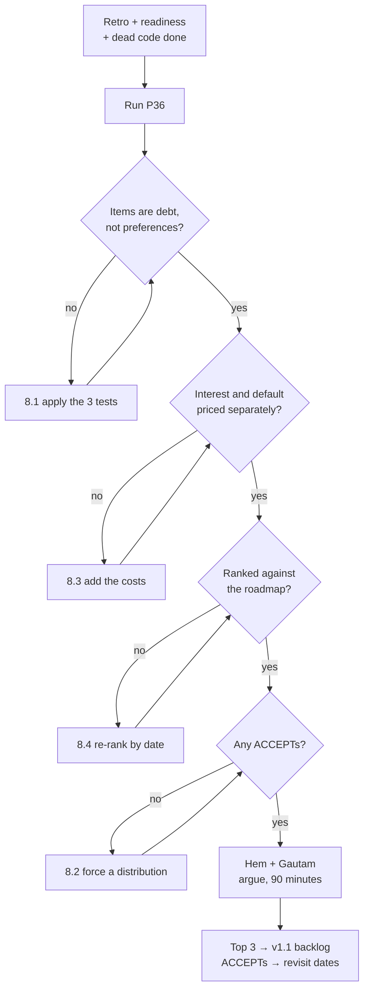

# P36 — Tech Debt Triage

← [Previous](P35-run-the-retrospective.md) · [Library index](../README.md) · Next: [Case study — Python ETL](../../Case-Study/Python-ETL/README.md)

> **One line:** List the shortcuts, price the interest on each, rank by what hurts next.

| | |
|---|---|
| **Phase** | 8 — Improve |
| **Who runs it** | Architect (Hem Singh) with the Team Lead (Gautam ) |
| **When** | Sprint 4, after the retrospective and before v1.1 planning |
| **Takes in** | `artifacts/retrospective-sprint-3.md`, `artifacts/release-readiness-v1.0.md`, `artifacts/adr/0001–0003`, the codebase, the dead code inventory from [P34](P34-clean-up-dead-code.md) |
| **Produces** | A ranked technical debt register, feeding the v1.1 backlog |
| **Hands off to** | Product Owner — the v1.1 backlog, and the case study end to end |
| **Time to run** | Two hours to inventory, then a 90-minute session with Hem and Gautam arguing about the ranking |

---

## 1. The scene

Hem has three documents open and they are all telling her the same thing from different directions.

The retrospective says the team had no data-completeness check anywhere, and that a good control created a blind spot precisely by being good. The readiness review says the 429 back-off has never been exercised at real month-end concurrency, and that the parallel run will not finish until January. The dead code inventory says two extraction helpers survived three sprints from an approach that was rejected in an ADR she wrote herself.

None of those are bugs. Everything works. The straight-through rate is 84%, the tests are green, the pipeline processes 200 documents a day and costs about $420 a month.

What they are is **a list of places where the system is not what she designed it to be, and where the difference is going to cost somebody something.**

The one bothering her most is the blob trigger. The architecture is explicit and has been since Sprint 1: a blob arriving enqueues a message, and a separate queue worker does the analysis. That separation exists so that a slow document cannot block the arrival of the next one, and so that a failure can be retried without re-triggering on the blob. In Sprint 2, under pressure to get NWD-101 and NWD-102 landing together, Ravi shipped the trigger doing the analysis inline. It was meant to be temporary. It has been in production-shaped code for six weeks and it is what is running on 2 December.

Right now it does not matter. Three-page documents finish in seconds. But the Function timeout section Ravi wrote into the runbook last week describes exactly what happens when a 60-page quarterly statement arrives, and the answer is that the Function is killed mid-run, the blob trigger fires again, and it is killed again, five times, into the poison queue.

**Technical debt is not code you dislike. It is a shortcut you took, deliberately or by accident, whose interest you pay on every future change — and the whole skill is telling the difference between the two.** Hem books ninety minutes with Gautam and starts the inventory.

---

## 2. What this prompt actually does — in plain language

### What technical debt actually means

The phrase comes from Ward Cunningham in 1992, and the original metaphor is precise in a way the casual usage is not.

You borrow money to do something now that you could not otherwise afford. You get the thing immediately. In exchange you pay interest, repeatedly, until you repay the principal. Borrowing is not irresponsible — it is sometimes exactly right — but you must know you are doing it, and you must know the rate.

**Technical debt is a shortcut in the code or the design that lets you ship sooner, in exchange for a cost you pay on every future change until you fix it.**

The three parts of the metaphor all matter, and the middle one is the one people drop:

| Metaphor | In code |
|---|---|
| **Principal** | The work to fix it properly. "Two days to move the analysis into a queue worker" |
| **Interest** | What it costs you *every time you touch this area*, until it is fixed. "Every new document type has to be tested against the timeout" |
| **Default** | What happens if you never pay. "A 60-page statement arrives and the pipeline poison-queues it, silently" |

Most debt conversations only ever discuss the principal — how long would it take to fix. That is the least useful number of the three, because it does not tell you whether fixing it is worth doing. A three-day fix on something you touch once a year is a bad trade. A three-day fix on something that costs half a day every sprint pays for itself in six weeks.

**You rank debt by its interest rate, not its principal.** That single sentence is most of this prompt.

### Debt versus "code I don't like"

This is the distinction that makes a debt register useful instead of a wish list, and it is genuinely hard, because the feeling is identical from the inside. Both produce the sensation "this should be different."

Three tests. An item needs to pass at least the first two.

**Test one: can you name the cost?** Real debt has a consequence you can describe without using an aesthetic word. "Every counterparty we add requires a code change in three places" is a cost. "This module is messy" is a feeling. If you cannot finish the sentence "this costs us ___ every time we ___", you have a preference.

**Test two: is the cost recurring?** Debt charges interest. A one-off ugliness in code nobody touches costs nothing after the day it was written. A one-off ugliness in the module every new counterparty passes through costs something every time.

**Test three: would a competent engineer who did not write it agree?** This one filters style disagreements. If the objection dissolves when you ask someone else, it was taste. Taste matters and belongs in code review, not in a debt register competing for sprint capacity.

| Not debt | Debt |
|---|---|
| "I would have used a dataclass here" | "Adding a counterparty needs a code change in three modules, so the config-driven design does not hold" |
| "This function is 60 lines" | "This function is 60 lines and every new document type adds a branch, so the test matrix doubles each time" |
| "The naming is inconsistent" | "The naming is inconsistent between the spec and the code, so every review has to re-establish which `confidence` is meant" |
| "We should use async here" | "The reconciliation is single-threaded and runs 40 minutes at current volume, so at 10x it misses the T+1 window" |

Notice the pattern: the right column always names a *thing you will do again* and what it costs you when you do.

### Deliberate versus accidental — and why it changes the response

Debt comes in two kinds, and they need different treatment.

**Deliberate debt** is a decision. You knew the right approach, you chose a shortcut, you had a reason — usually a date. The inline blob trigger is deliberate: Ravi knew the design said enqueue, and shipped inline to get NWD-101 and NWD-102 out together.

Deliberate debt is not a failure. It is often correct. The failure mode is not recording it, because an unrecorded deliberate shortcut becomes indistinguishable from a design decision within about a month. Six weeks later someone reads the code, sees inline processing, and concludes that is how the system works. It stops being debt and becomes architecture, which is how systems rot without anybody doing anything wrong.

**Accidental debt** is something you did not know at the time. The classifier knowing only two layouts is not a shortcut anybody took — it is a consequence of only having had two counterparties when it was built. Nobody decided the classifier should be inextensible. It just was not a question yet.

Accidental debt behaves differently: it accumulates through learning rather than through pressure, and it is discovered rather than remembered. You find it when reality contradicts an assumption nobody knew they had made. NWD-142 was exactly this shape, which is why the retrospective and the debt register keep pointing at each other.

Why the distinction changes what you do:

- **Deliberate debt** usually has a documented reason and often an ADR. You can find out whether the reason still holds. If the date pressure is gone, the trade has expired and you should repay.
- **Accidental debt** has no reason to check. It needs a *design conversation* first, because you are not restoring an intended design — you are deciding what the design should now be, with information you did not have before.

### Classifying by what the debt costs you

Naming the kind of cost is what makes a register rankable, because it tells you *when* the pain arrives.

**Slows change.** Every modification in this area takes longer than it should. Extra files to touch, extra tests to update, a mental model to rebuild each time. This is the most common kind and the most insidious, because it never causes an incident — it just quietly makes everything 20% slower forever.

**Risks correctness.** The shortcut makes a wrong answer more likely. The missing page-level quality pre-check is here: nothing breaks, but a badly-scanned page produces plausible-looking values that are wrong, and "a wrong number is worse than no number" is the project's first design invariant.

**Blocks scale.** Fine at today's volume, breaks at tomorrow's. The single-threaded reconciliation is the example. At 200 documents a day it is fine. At 2,000 it misses the window, and the whole business case is T+2 to T+1.

**Blocks change of a specific kind.** Not general slowness — a specific future thing you cannot do. The classifier knowing two layouts does not slow anything down today. It means adding a third counterparty requires a retrain and a redeploy, which contradicts invariant 8 and which is on the v1.1 roadmap.

The value of these categories is timing. Correctness risks hurt on a random Tuesday. Scale limits hurt on a date you can predict from a volume forecast. Change blockers hurt when someone asks for the specific thing. Slowness hurts continuously and never urgently, which is why it is chronically under-prioritised.

### Estimating the interest rate — the part everyone skips

Here is the practical method, and it is deliberately crude because precision is not available and not needed.

For each item, answer three questions:

1. **How often do we touch this area?** Every sprint, every few sprints, once a year, only when adding a counterparty.
2. **What does the debt add each time?** Hours. An honest estimate, not a defensive one.
3. **What is the probability and cost of the default?** The bad event, its likelihood in the next two quarters, and what it costs when it happens.

Multiply the first two for the running interest. Weigh the third separately, because a default is not an average — it is a cliff.

Worked, for the inline blob trigger:

- **Frequency:** every new document type or counterparty, roughly once a quarter, plus every time anyone changes the extraction path.
- **Cost each time:** about half a day, because you have to reason about the Function timeout budget and test against the largest realistic document.
- **Running interest:** ~4 hours per quarter. Small.
- **Default:** a 60-page statement arrives. Probability in the next two quarters: high — quarterly statements exist and month-end is when volume spikes. Cost: a document silently poison-queued, discovered by absence rather than by an alert, plus the on-call time in runbook §4.5.
- **Principal:** two days.

**The running interest alone would not justify fixing this. The default risk does.** That asymmetry is exactly why you estimate both, and it is the most common ranking mistake — teams rank on the running cost, which is visible, and ignore the cliff, which is not.

### Ranking by "what will hurt next quarter"

Two ranking rules that sound obvious and are routinely violated.

**Rule one: rank by what hurts next, not by what annoys most.** The most irritating debt is usually the code you work in daily, because irritation is a function of exposure. The most dangerous debt is often somewhere you rarely look, which is precisely why nobody is irritated by it. The single-threaded reconciliation annoys nobody today.

**Rule two: use a real time horizon, and make it short.** "Next quarter" is the right frame because it forces a concrete question — what is actually happening in the next three months? For Northwind: a parallel run through December, cutover in January, a third counterparty on the v1.1 roadmap, and Northwind talking about extending to a second book. That roadmap ranks the register almost by itself. Debt that blocks a known upcoming thing goes to the top; debt that blocks something hypothetical goes down.

Without a horizon, ranking degenerates into ranking by severity in the abstract, and everything with the word "risk" in it floats to the top regardless of whether the risk is imminent.

### What you do with the register once you have it

Four outcomes, and "fix it" is only one:

| Outcome | When | What it looks like |
|---|---|---|
| **Fix now** | High interest, or a default likely this quarter | Goes into the v1.1 backlog as a story with acceptance criteria |
| **Fix when triggered** | Cost only arrives on a specific event | Recorded with the trigger written down: "when we add a third counterparty" |
| **Accept** | Interest genuinely low, default unlikely | **Written down as accepted, with a date to revisit.** Silent acceptance is how debt becomes architecture |
| **Redesign** | Accidental debt where the right answer is not obvious | Goes to an ADR, not a backlog item — [P12](../phase-2-design/P12-record-an-architecture-decision.md) |

Accept is the underrated one. A register where everything is "fix" is not a register, it is a wish list, and it will be ignored wholesale. Explicitly accepting an item — writing down that you know about it, you have priced it, and you are choosing to live with it until March — is a real decision that saves the next person from rediscovering it and re-arguing it.

### What the AI is actually doing when this runs

Three passes: read the code and the artefacts to find divergences between what was designed and what exists; for each one estimate frequency, cost and default; then rank against the stated roadmap.

The AI is good at the first pass, because divergence between an ADR and a codebase is exactly the kind of cross-referencing it does well and humans do badly. It is mediocre at the second, because frequency estimates need to come from people who know how often they actually touch things. It is poor at the third without a roadmap, because ranking requires knowing what is coming.

So: let it find and describe, supply the roadmap, and argue about the ranking yourselves. That argument is the ninety minutes with Gautam and it is not delegable.

### If you remember one thing

**Price the interest, not just the principal, and rank against a real roadmap.** A debt register that lists problems without costs is a complaint. A register with costs but no time horizon is a philosophy. Costs plus horizon gives you an order, and an order is the only thing that turns a register into work that actually happens.

---

## 3. The prompt

Run this with the codebase and the artefacts available. It needs to compare what was designed against what exists.

```text
You are an architect building a technical debt register. **Inventory the
technical debt in [SYSTEM NAME], price it, and rank it.**

**DEFINITION — hold to this:** technical debt is a shortcut, deliberate or
accidental, whose interest you pay on every future change. It is NOT code
someone dislikes. **Every item must name a recurring cost** — finish the sentence
"this costs us ___ every time we ___". If you cannot, it is not debt and it does
not go on the register.

**STOP GATE:** produce the register with costs and a proposed ranking, then
**STOP**. Do NOT write stories, do NOT propose fixes in code, do NOT edit
anything. Hem and Gautam rank it in the room.

CONTEXT
- System: [SYSTEM NAME] — [ONE LINE]
- Codebase: [CODE PATH]
- Design intent, to compare the code against: [ADR PATHS + DESIGN INVARIANTS]
- Known gaps already surfaced: [READINESS REVIEW / RETRO PATHS]
- Current volume: [VOLUME]
- **Roadmap for the next two quarters:** [WHAT IS ACTUALLY COMING]

STEP 1 — INVENTORY
Find debt by comparing intent against reality. Look specifically for:
- **Divergence from a documented design.** Where does the code do something the
  ADRs or the architecture say it should not? This is the richest source
- Shortcuts with a `TODO`, `FIXME`, `HACK` or "for now" comment
- Places where a documented invariant is not actually enforced in code
- Scale assumptions no longer true at current or forecast volume
- Missing checks that let a wrong answer through
- Hard-coded values that the design says should be config
- Anything the readiness review or the retro flagged as untested or absent

**Exclude:** style, naming, formatting, and anything whose only cost is that
someone finds it unpleasant. Say explicitly what you excluded and why.

STEP 2 — CLASSIFY EACH ITEM
| Field | Values |
|---|---|
| **Kind** | DELIBERATE (a known shortcut — say what the reason was and whether it still holds) or ACCIDENTAL (nobody decided this) |
| **Cost type** | SLOWS CHANGE / RISKS CORRECTNESS / BLOCKS SCALE / BLOCKS A SPECIFIC CHANGE |

STEP 3 — PRICE IT. THIS IS THE PART THAT MATTERS.
For every item, give all four:
- **Principal** — the work to fix it properly, in days
- **Frequency** — how often we touch this area
- **Interest** — hours the debt adds each time we touch it, and therefore per
  quarter
- **Default** — the bad event if we never fix it: what happens, how likely in the
  next two quarters, and what it costs when it happens

**Interest and default are separate.** Low interest with a likely, expensive
default still ranks high. Say so explicitly where that applies.

STEP 4 — RANK
**Rank by what will hurt in the next two quarters**, given the roadmap above. Not
by severity in the abstract, and not by how annoying it is.

For each item, give one of four verdicts:
- **FIX NOW** — into the next release backlog
- **FIX WHEN TRIGGERED** — name the exact trigger event
- **ACCEPT** — with a revisit date. Say what we are accepting
- **REDESIGN** — the right answer is not obvious; needs an ADR, not a story

DO NOT
- Do NOT list style preferences, naming, or formatting.
- Do NOT include an item without a named recurring cost.
- Do NOT rank by principal. A one-day fix on something touched yearly ranks below
  a five-day fix on something touched weekly.
- Do NOT mark everything FIX NOW. A register with no ACCEPT rows has not made any
  decisions.
- Do NOT propose code changes. Register only.
- Do NOT confuse a bug with debt. A bug is wrong behaviour now; debt is correct
  behaviour that costs too much to change.

YOU ARE DONE WHEN
Every item names a recurring cost, carries a kind and a cost type, has all four
of principal / frequency / interest / default, has a verdict, and the ranking is
justified against the roadmap rather than against severity.

Output the register as markdown to the chat.
```

---

## 4. Every placeholder, explained

| Placeholder | What to put in it | Northwind example | What happens if you get it wrong |
|---|---|---|---|
| `[SYSTEM NAME]` | What you are triaging | `Counterparty Document Ingestion` | Scope drifts into adjacent systems you cannot change |
| `[ONE LINE]` | What it does | `Turns counterparty PDF statements into position rows in Snowflake` | Cost estimates lose their business framing and everything reads as equally important |
| `[CODE PATH]` | The code root | `Case-Study/Python-ETL/code/doc_ingestion` | It triages your artefacts folder and reports missing documentation as debt |
| `[ADR PATHS + DESIGN INVARIANTS]` | The design intent to compare against | `artifacts/adr/0001–0003`, plus: bronze immutable before parsing; idempotency by SHA-256 of content; redaction fails closed; adding a counterparty is a YAML change plus a trained model, never a code change; a blob arriving enqueues a message and a queue worker does the analysis | **The most load-bearing placeholder.** Without stated intent, the AI cannot see divergence, and divergence is where the real debt is. You get generic advice about type hints instead |
| `[READINESS REVIEW / RETRO PATHS]` | What you already know is weak | `artifacts/release-readiness-v1.0.md`, `artifacts/retrospective-sprint-3.md` | You re-discover findings you already have, and miss that the retro's "no completeness check anywhere" is a debt item as well as a process one |
| `[VOLUME]` | Current and forecast load | `~200 documents/day, 3 pages average, 12,600 pages/month, spiking at month-end` | Scale debt cannot be assessed. Everything looks fine because everything currently is |
| `[WHAT IS ACTUALLY COMING]` | The real roadmap for two quarters | `Parallel run through December, cutover January, third counterparty in v1.1, Northwind discussing a second reporting book` | **Ranking becomes arbitrary.** Without a horizon the AI ranks by abstract severity and every item with "risk" in it floats to the top |

---

## 5. The filled-in example

Hem runs this on the Friday of Sprint 4, before her session with Gautam.

```text
You are an architect building a technical debt register. **Inventory the
technical debt in Counterparty Document Ingestion, price it, and rank it.**

**DEFINITION — hold to this:** technical debt is a shortcut, deliberate or
accidental, whose interest you pay on every future change. It is NOT code
someone dislikes. **Every item must name a recurring cost** — finish the sentence
"this costs us ___ every time we ___". If you cannot, it is not debt and it does
not go on the register.

**STOP GATE:** produce the register with costs and a proposed ranking, then
**STOP**. Do NOT write stories, do NOT propose fixes in code, do NOT edit
anything. Hem and Gautam rank it in the room.

CONTEXT
- System: Counterparty Document Ingestion — turns counterparty PDF statements and
  trade confirmations into position rows in Snowflake without manual keying.
- Codebase: Case-Study/Python-ETL/code/doc_ingestion
- Design intent, to compare the code against:
  - artifacts/adr/0001 — Azure AI Document Intelligence over OCR+regex, because
    per-field confidence is required for the gate
  - artifacts/adr/0002 — idempotency by SHA-256 of content, not filename
  - artifacts/adr/0003 — bronze persisted before parsing
  - Design invariants: a wrong number is worse than no number; one failing field
    sends the WHOLE document to review; bronze is immutable and comes before
    parsing; redaction fails closed; no API keys anywhere; the confidence gate
    sits upstream of reconciliation; **adding a counterparty is a YAML change
    plus a trained model, never a code change**
  - Architecture: a blob arriving ENQUEUES a message; a separate queue worker
    does the analysis
- Known gaps already surfaced: artifacts/release-readiness-v1.0.md (operability
  red, 429 back-off never load-tested), artifacts/retrospective-sprint-3.md (no
  data-completeness check anywhere in the process; a good control created a blind
  spot)
- Current volume: ~200 documents/day, 3 pages average, 12,600 pages/month,
  spiking at month-end. Azure AI cost roughly $420/month.
- **Roadmap for the next two quarters:** parallel run through December, cutover
  8 January, a third counterparty in v1.1 (Q1), and Northwind are discussing
  extending this to their second reporting book, which would roughly triple
  volume.

STEP 1 — INVENTORY
Find debt by comparing intent against reality. Look specifically for:
- **Divergence from a documented design.** Where does the code do something the
  ADRs or the architecture say it should not? This is the richest source
- Shortcuts with a `TODO`, `FIXME`, `HACK` or "for now" comment
- Places where a documented invariant is not actually enforced in code
- Scale assumptions no longer true at current or forecast volume
- Missing checks that let a wrong answer through
- Hard-coded values that the design says should be config
- Anything the readiness review or the retro flagged as untested or absent

**Exclude:** style, naming, formatting, and anything whose only cost is that
someone finds it unpleasant. Say explicitly what you excluded and why.

STEP 2 — CLASSIFY EACH ITEM
| Field | Values |
|---|---|
| **Kind** | DELIBERATE (a known shortcut — say what the reason was and whether it still holds) or ACCIDENTAL (nobody decided this) |
| **Cost type** | SLOWS CHANGE / RISKS CORRECTNESS / BLOCKS SCALE / BLOCKS A SPECIFIC CHANGE |

STEP 3 — PRICE IT. THIS IS THE PART THAT MATTERS.
For every item, give all four:
- **Principal** — the work to fix it properly, in days
- **Frequency** — how often we touch this area
- **Interest** — hours the debt adds each time we touch it, and therefore per
  quarter
- **Default** — the bad event if we never fix it: what happens, how likely in the
  next two quarters, and what it costs when it happens

**Interest and default are separate.** Low interest with a likely, expensive
default still ranks high. Say so explicitly where that applies.

STEP 4 — RANK
**Rank by what will hurt in the next two quarters**, given the roadmap above. Not
by severity in the abstract, and not by how annoying it is.

For each item, give one of four verdicts:
- **FIX NOW** — into the next release backlog
- **FIX WHEN TRIGGERED** — name the exact trigger event
- **ACCEPT** — with a revisit date. Say what we are accepting
- **REDESIGN** — the right answer is not obvious; needs an ADR, not a story

DO NOT
- Do NOT list style preferences, naming, or formatting.
- Do NOT include an item without a named recurring cost.
- Do NOT rank by principal. A one-day fix on something touched yearly ranks below
  a five-day fix on something touched weekly.
- Do NOT mark everything FIX NOW. A register with no ACCEPT rows has not made any
  decisions.
- Do NOT propose code changes. Register only.
- Do NOT confuse a bug with debt. A bug is wrong behaviour now; debt is correct
  behaviour that costs too much to change.

YOU ARE DONE WHEN
Every item names a recurring cost, carries a kind and a cost type, has all four
of principal / frequency / interest / default, has a verdict, and the ranking is
justified against the roadmap rather than against severity.

Output the register as markdown to the chat.
```

---

## 6. What comes back

The register, ranked. Nine items in the real output; six shown here plus the exclusions.

````markdown
# Technical Debt Register — Counterparty Document Ingestion
**Compiled:** 28 November. **Horizon:** next two quarters, to end March.
**Roadmap assumed:** parallel run Dec, cutover 8 Jan, third counterparty in v1.1
(Q1), possible second reporting book (≈3x volume).

## Ranked summary

| # | Item | Kind | Cost type | Principal | Verdict |
|---|---|---|---|---|---|
| 1 | Blob trigger processes inline instead of enqueuing | DELIBERATE | BLOCKS SCALE + RISKS CORRECTNESS | 2 days | **FIX NOW** |
| 2 | No page-level OCR quality pre-check | ACCIDENTAL | RISKS CORRECTNESS | 3 days | **FIX NOW** |
| 3 | Classifier knows only two layouts | ACCIDENTAL | BLOCKS A SPECIFIC CHANGE | 4 days + labelling | **FIX WHEN TRIGGERED** |
| 4 | Reconciliation is a single-threaded pandas job | DELIBERATE | BLOCKS SCALE | 5 days | **FIX WHEN TRIGGERED** |
| 5 | Thresholds duplicated between `sources.yaml` and the data contract | ACCIDENTAL | SLOWS CHANGE | 1 day | **FIX NOW** |
| 6 | No automated straight-through rate monitoring | ACCIDENTAL | SLOWS CHANGE | 1 day | **ACCEPT** — covered by P33 alerting, revisit 31 Jan |

---

## 1. The blob trigger processes inline instead of enqueuing

**FIX NOW.** Kind: DELIBERATE. Cost: BLOCKS SCALE + RISKS CORRECTNESS.

**The divergence.** The architecture has said since Sprint 1 that a blob arriving
enqueues a message and a separate queue worker does the analysis. `function_app.py`
`on_blob_landed()` calls `classify()`, `extract()`, the rules engine and the sinks
directly, in the trigger.

**Why it is like this.** Ravi shipped it inline in Sprint 2 to get NWD-101 and
NWD-102 landing in the same week. Recorded nowhere. **The date pressure that
justified it is gone; the trade has expired.**

**The recurring cost.** Every new document type or extraction change has to be
reasoned about against the Function timeout budget, and tested against the
largest realistic document rather than a representative one.

| | |
|---|---|
| **Principal** | 2 days — move the body into a queue-triggered worker, keep the trigger as a thin enqueue |
| **Frequency** | Once a quarter for a new counterparty, plus any extraction change |
| **Interest** | ~4 hours per touch, so ~4–8 hours per quarter. Modest |
| **Default** | A 30+ page quarterly statement arrives. The Function is killed mid-run with no exception, the blob trigger fires again, killed again, five times, into the poison queue. **The document is silently absent.** Nothing alerts on absence of one document. Probability in the next two quarters: **high** — quarterly statements exist and Q4 statements land in January, during cutover week. Cost: one missing statement, a `MISSING_EXTERNAL` break cluster that looks like a settlement failure, and on-call time per runbook §4.5 |

**Why it ranks first despite modest interest.** The running interest alone would
not justify two days. **The default would, and it lands in cutover week.** This is
the case the ranking rule exists for: low interest, high and imminent default.

Note the second-order effect: the missing-document failure looks exactly like
NWD-142 from the reconciliation's point of view. We would be introducing a second
cause for a symptom we have taught the team to associate with a fixed bug.

## 2. No page-level OCR quality pre-check

**FIX NOW.** Kind: ACCIDENTAL. Cost: RISKS CORRECTNESS.

**The gap.** We check per-field confidence after extraction. We never check
whether a page was legible enough to extract from in the first place. Document
Intelligence returns page-level quality signals we do not read.

**Why it is like this.** Nobody decided against it. It was not a question when the
gate was designed, because the gate's mental model was "a field either extracts
well or it does not."

**Why that model is incomplete.** A badly-scanned page can produce a *confident
wrong value*. An OCR misread of `1,450` as `1,459` is high confidence and wrong —
the model is confident about the characters it thinks it sees. Per-field
confidence measures certainty about the reading, not the quality of the source.
`broker_alpha`'s currency threshold is already at 0.92 rather than 0.90 precisely
because their scan quality is poor, which is a workaround for this gap.

This is the same shape as retro Finding 2: a control that works well in its domain
being assumed to cover a neighbouring one.

| | |
|---|---|
| **Principal** | 3 days — read page-level quality from the response, add a threshold, route poor pages to review before extraction is trusted |
| **Frequency** | Continuous. Every `broker_alpha` document |
| **Interest** | Not hours-per-touch. It is a per-document probability of a wrong value entering the warehouse |
| **Default** | A wrong number in Snowflake that no check catches, because every check we have says it is fine. Probability: **already happening at some rate we cannot measure.** Cost: a reconciliation break chased against a counterparty who is not wrong, and — during the parallel run — a divergence on an auto-accepted row, which per the readiness review is a **hard fail that resets the clock** |

**Why it ranks second.** Design invariant 1 is "a wrong number is worse than no
number." This is the one item on the register that directly violates it. It also
threatens the parallel run's exit condition, which threatens the cutover date.

## 3. The classifier knows only two layouts

**FIX WHEN TRIGGERED** — trigger: Northwind confirms the third counterparty.
Kind: ACCIDENTAL. Cost: BLOCKS A SPECIFIC CHANGE.

**The gap.** The custom classifier was trained on `broker_alpha` and
`broker_beta_em`. A third layout requires retraining the classifier itself, not
just adding an extraction model, because a document it has never seen scores below
0.75 and goes to review unclassified.

**Is this actually debt?** Borderline, and worth stating. It is not a shortcut —
you cannot train a classifier on layouts you do not have. It is on the register
because it partially contradicts invariant 8: adding a counterparty is a YAML
change plus a trained model, never a code change. That holds for extraction. It
does **not** hold for classification, where a third counterparty degrades
classification of the first two until retrained.

| | |
|---|---|
| **Principal** | 4 days engineering, plus labelling ~50 documents. Training itself is free |
| **Frequency** | Once per new counterparty |
| **Interest** | Zero today. It costs nothing until the trigger fires |
| **Default** | Not a failure. A lead time. Adding a counterparty takes 4 days plus labelling rather than a YAML change |

**Why FIX WHEN TRIGGERED rather than FIX NOW.** Fixing it early means building
extensibility for a layout we have not seen, which historically produces the wrong
abstraction. **The valuable action now is not the fix — it is writing down that
invariant 8 has an exception, so nobody plans a two-day counterparty onboarding.**

## 4. Reconciliation is a single-threaded pandas job

**FIX WHEN TRIGGERED** — trigger: confirmed decision on the second reporting book,
or daily volume above 500. Kind: DELIBERATE. Cost: BLOCKS SCALE.

**The shortcut.** `recon/reconcile.py` loads both sides into pandas DataFrames and
does a full outer join in memory, single-threaded. Chosen in Sprint 2 because it
is readable, testable, and 200 documents a day is nothing.

**Where it breaks.** Memory and runtime both scale with total positions, not
documents. Current: ~40 minutes, well inside the window. At 3x — the second
reporting book — it is roughly 2 hours, plus a memory profile nobody has measured.
The T+1 commitment has a window, and 2 hours starts eating it.

| | |
|---|---|
| **Principal** | 5 days — push the join into Snowflake, or chunk by book and date |
| **Frequency** | Rarely touched. Once or twice a quarter |
| **Interest** | Near zero. This is well-written code that does its job |
| **Default** | Volume triples, the job misses the T+1 window or runs out of memory, and **the entire business case for this project is T+2 → T+1**. Probability in the next two quarters: **medium** — depends on a Northwind commercial decision. Cost: high, and it lands during a period of increased scrutiny |

**Why not FIX NOW.** Rewriting a working, well-tested reconciliation for a volume
that may not arrive is speculative, and pandas is genuinely the right tool at
200/day. **What we do now is measure**: add runtime and peak memory logging so we
have a real curve rather than an argument. That is 2 hours, not 5 days.

## 5. Thresholds duplicated between `sources.yaml` and the data contract

**FIX NOW.** Kind: ACCIDENTAL. Cost: SLOWS CHANGE.

Confidence thresholds appear in `config/sources.yaml` (which the code reads) and
in `artifacts/data-contract-counterparty-position.md` (which humans read). They
agree today. Nothing enforces that.

| | |
|---|---|
| **Principal** | 1 day — a test asserting the YAML matches the contract, or generate one from the other |
| **Frequency** | Every threshold discussion. Three so far |
| **Interest** | ~1 hour per touch, plus the risk that a review is conducted against a stale document |
| **Default** | Someone changes a threshold in one place. A reviewer approves against the other. **This nearly happened during NWD-142** — `broker_alpha`'s currency threshold was temporarily set to 0.50 in a working tree and caught only by the commit plan in P31, not by any check |

**Why FIX NOW despite the low cost.** One day, and it closes a near-miss we
already had.

## 6. No automated straight-through rate monitoring

**ACCEPT** until 31 January. Kind: ACCIDENTAL. Cost: SLOWS CHANGE.

The Snowflake view exists. Nothing watches it automatically, and it is the
headline metric for the whole system.

**Why ACCEPT rather than FIX NOW.** The P33 runbook work is already adding
`nwd-stp-rate-drop-broker` and `nwd-stp-rate-low` as alert rules, and during the
parallel run a human reads the number daily anyway. **We are accepting that
between the parallel run ending and the alerts being proven, there is a window
where a template change is detected by a person rather than a system.**

Revisit 31 January, after the alerts have run through a month-end.

---

## Considered and excluded — not debt

| Item | Why excluded |
|---|---|
| `core/rules.py::apply()` is 140 lines | Long, and no recurring cost. It is touched rarely and well tested. Style, not debt |
| Inconsistent use of dataclasses vs dicts in `core/transform.py` | Preference. A competent engineer who did not write it would shrug |
| No type hints on three private helpers in `core/extract.py` | Cosmetic. `ruff` would catch anything that mattered |
| Test fixtures are large JSON files | Deliberate and correct — they are real captured responses, which is the point |
| No async I/O in the sinks | Would help at 10x volume, but item 4 is the real constraint there. Listing it separately would double-count |
````

### How to read this

**Item 1 is the ranking rule made visible.** Modest interest — four to eight hours a quarter — and it ranks first. It ranks first because the default is likely and lands in cutover week. If you ranked this register by running cost, item 1 would sit fourth or fifth, and a quarterly statement in January would poison-queue during the week nobody can afford a surprise. **That gap between "what annoys us" and "what will hurt us" is the entire value of pricing the default separately.**

**Item 2 is the one to argue about.** It is the only item that directly contradicts design invariant 1, and its interest is not expressible in hours — it is a per-document probability of a wrong value. Hem would put it first. Gautam would point out that item 1 has a date attached and item 2 does not. That argument is the ninety minutes, and the register's job is to make it a good argument rather than to settle it.

**Item 3's real value is not the fix.** Read the last line: the useful action now is writing down that invariant 8 has an exception. Northwind will plan a third counterparty on the assumption that onboarding is a YAML change, because that is what the design says. It is not, for classification. **A debt item whose whole payload is "correct someone's mental model before they plan around it" is a legitimate and underrated kind.**

**Item 4 shows the middle option people forget.** Not "fix it" and not "ignore it" but *measure it*, for two hours, so the next conversation has a curve instead of two opinions. Most scale debt deserves this treatment first.

**The exclusions table is doing as much work as the register.** It records that someone considered `apply()`'s length and decided it was style. Without it, the same item gets raised at the next triage, discussed for ten minutes, and excluded again. It also demonstrates the standard, which is how the standard spreads.

**The part that is commonly wrong:** the principal estimates. Two days for item 1 assumes a clean extraction into a queue worker with the existing tests still passing. In practice the tests are written against the trigger, so some of them move too, and it is closer to three. Treat every principal as an order of magnitude, not a commitment — the ranking is insensitive to a 50% error, which is exactly why the crude method is good enough.

---

## 7. Why this is the final prompt

**What "done" means here.** Every item names a recurring cost you can state as a sentence. Every item carries kind, cost type, principal, frequency, interest and default. Every item has one of the four verdicts. The ranking is justified against the roadmap, not against severity. And there is at least one ACCEPT, because a register with no accepts has not decided anything.

**The checklist:**

- [ ] Every item completes "this costs us ___ every time we ___".
- [ ] No item is about naming, formatting, or personal preference.
- [ ] Every item has interest *and* default priced separately.
- [ ] The ranking references specific roadmap events, not abstract severity.
- [ ] At least one item is ACCEPT with a revisit date.
- [ ] Every FIX WHEN TRIGGERED names the exact trigger event.
- [ ] The exclusions are written down with reasons.
- [ ] Deliberate items say what the original reason was and whether it still holds.

**Why you should stop rather than keep prompting.** Two failure modes.

Ask for more items and you will get them, and they will be progressively more speculative, until the register contains forty entries and nobody reads it. A register's usefulness peaks somewhere around eight to twelve items — enough to be honest, few enough that the top three are obvious.

The second is asking the AI to settle the ranking. It will produce an order, confidently. But ranking debt is a judgement about what your business is going to do next, and the AI knows your roadmap only as a paragraph you typed. Hem and Gautam disagreeing about whether item 1 or item 2 goes first is not a failure of the process — it is the process. The register exists to make that disagreement well-informed.

**The signal that you are NOT done.** Every verdict is FIX NOW. That means the register recorded problems and made no decisions, and a list of everything that is wrong is not a plan.

---

## 8. When it is not done — the follow-up prompts

| What you're seeing | What's actually wrong | Run this next |
|---|---|---|
| Items about naming, line length, missing type hints | It treated code review comments as debt | **8.1** |
| Every item is FIX NOW | It recorded problems and decided nothing | **8.2** |
| Items have a principal but no interest | It priced the fix and not the cost of not fixing | **8.3** |
| Ranking looks like severity, not timing | The roadmap was missing or ignored | **8.4** |
| Forty items | Register nobody will read | **8.2**, then cut to twelve |
| An item is actually a bug | Wrong register. It has a defect ID or needs one | Move it to the defect list |
| Nothing about scale | No volume forecast supplied | Re-run §3 with `[VOLUME]` and the roadmap filled in |
| An item needs a design decision, not a fix | Correct finding, wrong destination | **[P12](../phase-2-design/P12-record-an-architecture-decision.md)** |
| The debt is dead code | Different job, safer method | **[P34](P34-clean-up-dead-code.md)** |

### 8.1 "Half of these are style preferences"

Use this when the register contains naming and formatting.

```text
Several items are style preferences, not debt. "[QUOTE ONE]" has no recurring
cost — it is something someone would do differently.

**Apply all three tests to every item and show your working:**
1. **Name the cost.** Complete this sentence with specifics: "this costs us ___
   every time we ___". If you cannot, it is not debt.
2. **Is the cost recurring?** A one-off ugliness in code nobody touches costs
   nothing after the day it was written.
3. **Would a competent engineer who did not write it agree?** If the objection
   dissolves when someone else looks, it is taste.

**Remove** anything failing test 1 or 2, and **move it to an "excluded" table**
with the reason. Do not delete it silently — recording the exclusion stops it
being raised again next quarter.

**Then re-check** the survivors: for each, state the specific future activity
that costs more because of it. "Adding a counterparty", "changing a threshold",
"onboarding a new engineer" are activities. "Reading the code" is not, unless you
can say how often and how much.
```

*What changes:* the register usually halves, and the exclusions table becomes the artefact that teaches the standard.

### 8.2 "Everything is FIX NOW"

Use this when nothing is accepted or deferred.

```text
Every item is FIX NOW. That is a list of problems, not a plan — we have capacity
for two or three of these in v1.1.

**Force a distribution.** Assign every item to exactly one:
- **FIX NOW** — at most 3. High interest, or a default likely this quarter
- **FIX WHEN TRIGGERED** — name the exact trigger event and who would notice it
- **ACCEPT** — at least 2. Say plainly what we are accepting and set a revisit
  date
- **REDESIGN** — the right answer is not obvious; this needs an ADR, not a story

**For every ACCEPT, write the sentence** we would have to say to Northwind if the
default happened: "we knew about this, we priced it at [X], and we chose to live
with it until [date] because [reason]." **If that sentence is uncomfortable to
write, the item is not an ACCEPT.**

That test is the whole point. Accepting debt is a real decision and it should feel
like one.
```

*What changes:* you get a plan instead of a list, and the "sentence we would say to the client" test reliably promotes one or two items you were about to wave through.

### 8.3 "Items have a principal but no interest"

Use this when everything says "2 days to fix" and nothing says what it costs to leave.

```text
Every item has a fix estimate and none has a cost of NOT fixing. That makes the
register unrankable — I cannot tell a cheap fix on something irrelevant from an
expensive fix on something that bites weekly.

**For each item, add all three, separately:**

1. **Frequency** — how often do we touch this area? Every sprint / quarterly /
   only when adding a counterparty / never until it breaks.
2. **Interest** — hours this debt adds each time we touch it, and therefore hours
   per quarter. State your assumption.
3. **Default** — the specific bad event: what happens, how likely in the next two
   quarters (high/medium/low with a reason), and what it costs when it happens.

**Keep interest and default apart.** They rank differently. Low interest with a
likely expensive default still ranks high — **call out every item where that is
the case**, because it is the pattern most often ranked wrong.

**Then re-rank** on interest-plus-default, and tell me which items MOVED compared
to your first ordering, and why. That delta is what I want to look at.
```

*What changes:* the ranking usually reorders substantially, and the moved-items list shows you exactly which ones you were about to misprioritise.

### 8.4 "The ranking ignores what we are actually doing next"

Use this when the order looks like abstract severity.

```text
The ranking reflects how serious each item sounds, not what will actually hurt us.

**Re-rank against this roadmap specifically:**
- Parallel run through December, daily comparison, **zero divergence required on
  auto-accepted rows**
- Cutover 8 January — the manual process stops
- Third counterparty in v1.1, Q1
- Possible second reporting book, roughly 3x volume, decision pending

**For every item, answer:**
1. Which roadmap event does this item touch?
2. Does it make that event later, riskier, or more expensive? Say which.
3. If it touches nothing on the roadmap, say so plainly — that is a strong signal
   for ACCEPT.

**Then rank by when the pain arrives**, earliest first, and **state the date or
event next to each item** so the order is auditable.

**Flag specifically** anything that threatens the parallel run's exit condition.
A divergence on an auto-accepted row resets the clock and moves the cutover date,
which makes it the most expensive kind of failure available to us right now.
```

*What changes:* the order becomes defensible to Atul and Preetinka, because every position has an event next to it. The parallel-run flag usually promotes the correctness items.

### The loop



---

## 9. How this goes wrong

### The register becomes a complaints box

Everyone contributes their least favourite thing about the codebase. Forty items. Half of them are naming, three are the same item described differently, and two are genuine bugs that should have defect IDs.

Nobody reads a forty-item register, so nothing on it gets fixed, so next quarter it has fifty items and even less credibility. Eventually someone declares debt bankruptcy and deletes the file, which loses the four items that were real.

**The fix:** the recurring-cost test at the door, enforced without apology. "This costs us four hours every time we add a counterparty" gets in. "This module is hard to read" goes to the exclusions table with a reason. The exclusions table is what makes the rejection survivable — nothing is lost, it is just correctly filed.

### You rank by principal because it is the only number you have

Estimating fix effort is easy and familiar. Estimating interest requires knowing how often you touch an area, which nobody tracks, and estimating a default requires forecasting a bad event, which feels like guessing.

So the register gets sorted by effort, and the quick wins go first. That feels productive and it optimises for the wrong thing entirely. The single-threaded reconciliation is five days and would sit last. It is also the item that ends the project's entire business case if Northwind adds a second book.

**The fix:** the crude method. Frequency times cost-per-touch, plus a separately-stated default. Both estimates will be wrong by 50% and the ranking will still be right, because the items differ by more than 50%. Precision is not what you need. Having the number at all is.

### Deliberate debt goes unrecorded and becomes architecture

This is the quiet one, and it is how systems drift.

Ravi shipped the blob trigger inline for a good reason under a real deadline. He did not write it down, because at the time it was obviously temporary and obviously his to fix. Six weeks later it is just how the system works. A new engineer reads `function_app.py`, sees inline processing, and builds their mental model on it. Someone writes a document describing the pipeline and describes what the code does. Now the shortcut is documented as the design.

Nobody did anything wrong at any step. The system's design and the system's behaviour simply diverged, and the divergence was never written down at the moment it was created — which is the only moment anybody knows about it.

**The fix:** deliberate debt gets recorded when it is taken, not when it is discovered. A one-line entry with a reason and an expiry: "trigger processes inline to hit the Sprint 2 date; revisit before go-live." That line would have saved this entire triage item, and it costs thirty seconds. Gautam added it to the definition of done afterwards.

### You fix debt nobody is paying interest on

Someone finds a genuinely inelegant module, spends four days making it good, and nothing improves — because that module is touched twice a year and was working fine.

This is the most seductive failure because it feels like exactly the right thing. The work is satisfying, the result is objectively better code, and the cost is invisible: four days that could have gone to item 1 or item 2.

**The fix:** the frequency column. If frequency is "rarely" and the default is unlikely, the correct verdict is ACCEPT regardless of how much better the fixed version would be. Better is not the bar. Better *per day spent, against what is coming* is the bar.

### This is the wrong tool: it is a bug, or it is dead code

Two neighbouring things that look like debt and are not.

**A bug** is wrong behaviour now. NWD-142 was a bug — half a statement in the warehouse is incorrect output, today. Debt is *correct* behaviour that costs too much to change. If it is producing wrong answers, it gets a defect ID and goes through [P27](../phase-6-rework/P27-fix-from-a-qa-bug-report.md), not through a quarterly ranking exercise. Debt triage runs on a quarter's cadence and bugs do not have that long.

**Dead code** is code nothing calls. It has no interest rate, because you never touch it — you delete it. [P34](P34-clean-up-dead-code.md) handles it with a much safer method, built around search evidence, and it should have run before this prompt. Hem ran the triage after Gautam's cleanup deliberately, so the register describes the system as it now is rather than including four items about code that no longer exists.

**The rule:** wrong behaviour now, defect. Unreachable, dead code. Correct but expensive to live with, debt.

---

## 10. The handoff

Preetinka picks this up, and it is the handoff that closes the loop back to the start of the book.

The top three items go into the v1.1 backlog as stories, and they go through exactly the same treatment as any other story — [P07](../phase-1-discovery/P07-slice-the-prd-into-stories.md) to slice them, [P08](../phase-1-discovery/P08-write-acceptance-criteria.md) to get acceptance criteria, [P09](../phase-1-discovery/P09-estimate-and-rank-the-backlog.md) to rank them against feature work. **That last part is the point.** Debt that lives in a separate document, competing for "spare capacity," never gets done, because there is no spare capacity. Debt that is a story with acceptance criteria, sitting in the same ranked backlog as a feature Northwind asked for, gets an honest conversation about what matters more.

Preetinka is well placed for that conversation. She came off an operations floor at a custodian bank, so "a wrong number reaches the warehouse and nobody catches it" is not an abstraction to her — she has chased that break. Item 2, the page-level quality check, will get a fairer hearing from her than from most product owners, and item 6's ACCEPT will get a harder time.

Hem keeps two items herself. Item 3's real deliverable is not code, it is a correction to the design record: invariant 8 has an exception for classification, and it needs writing into the architecture documentation before anyone plans a two-day counterparty onboarding. Item 4's real deliverable is two hours of measurement, so the next conversation about the reconciliation has a curve rather than two opinions.

And Gautam takes the process lesson. The blob trigger item exists because a deliberate shortcut was never recorded, and the fix for that is not in this register at all — it is a line in the definition of done saying that any knowingly-temporary implementation gets a register entry with a reason and an expiry, on the day it is written. That is a [P17](../phase-3-planning/P17-definition-of-done.md) change, and it is the kind of thing that stops the next triage having an item like this one.

> **Artifact contract — the technical debt register**
> Anyone reading this register can rely on finding:
> - Every item naming a recurring cost, phrased as what it costs and when.
> - Kind (deliberate or accidental) and, for deliberate items, the original reason and whether it still holds.
> - Cost type: slows change, risks correctness, blocks scale, or blocks a specific change.
> - Principal, frequency, interest and default priced separately.
> - One of four verdicts against every item, with triggers named and revisit dates set.
> - A ranking justified against named roadmap events, not abstract severity.
> - An exclusions table saying what was considered and rejected as debt, and why.
>
> If any of those is missing, the triage is not done — go back to §7.

---

## 11. In the case study

This closes [10-retrospective.md](../../Case-Study/Python-ETL/10-retrospective.md) and it is the last working session in the book.

The argument between Hem and Gautam over items 1 and 2 is the scene worth reading, because neither of them is wrong. Hem wants the page-quality check first: it is the only item on the register that directly contradicts design invariant 1, and her recurring question — what does this look like when it's wrong? — has an unusually bad answer here, which is that it looks like nothing at all. A confidently wrong number sits in Snowflake and no check the system has will ever object to it.

Gautam's counter is that item 1 has a date attached and item 2 does not. Quarterly statements land in January. The blob trigger's default is not a probability, it is a calendar entry, and it lands in cutover week when the team's tolerance for surprises is at its lowest.

They settled it the way these things get settled properly: both go into v1.1, item 1 first because of the date, and item 2 gets a smaller immediate action — during the parallel run, every `broker_alpha` divergence gets checked against page quality specifically, so that by January they have data rather than a theory. That compromise is only available because the register priced both, and it is a better answer than either opening position.

The item that changed the most in the room was item 3. It arrived on the register as "the classifier only knows two layouts," which reads like a feature gap. It left as "invariant 8 has an exception nobody has written down," which is a completely different kind of problem with a completely different fix. Northwind's account team had already told the client that adding a counterparty was a configuration change. That is true for extraction and false for classification, and finding it out during a v1.1 planning meeting would have been considerably more expensive than finding it out here.

And Gautam's line at the end of the session is the one the team kept, because it names the thing this whole phase has been circling: **"Every item on this list is something we knew at the time. We just didn't write any of it down."**

That is where the story ends and where the [case study](../../Case-Study/Python-ETL/README.md) picks it up from the beginning — thirty-six prompts, one pipeline, and a team that got better at writing things down.

---

← [Previous](P35-run-the-retrospective.md) · [Library index](../README.md) · Next: [Case study — Python ETL](../../Case-Study/Python-ETL/README.md)
