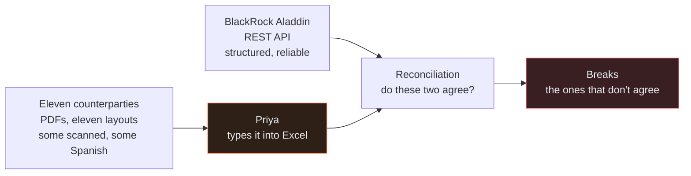
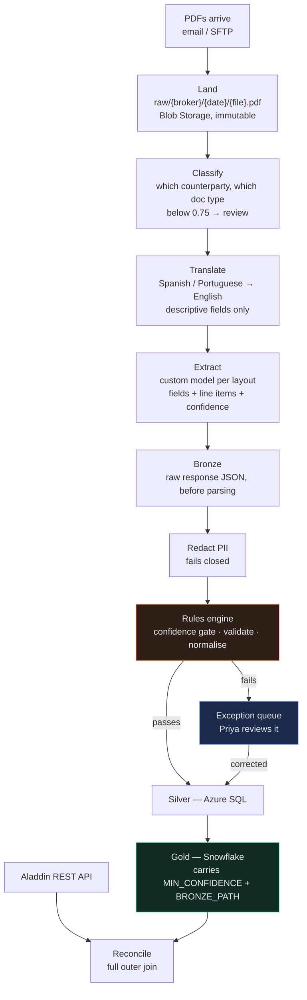

# 00 — The Brief

← [Book README](../../README.md) · [Case study index](README.md) · Next: [01 — Sprint 0: Foundations](01-sprint-0-foundations.md)

> **One line:** A person opens a PDF and types numbers into a spreadsheet, and everything downstream of her is a day late because of it.

---

## 1. 07:50, London

Priya Raman gets in before eight because the Los Angeles overnight files land at 07:20 and there is no point arriving after them.

She has three windows open. On the left, an Outlook folder called **INBOX/Counterparty** that filled overnight — forty-one messages, most with an attachment, a few with three. In the middle, Adobe Reader. On the right, an Excel workbook with one tab per counterparty and a fixed column order that she did not choose and cannot change, because the reconciliation macro that reads it was written in 2016 by somebody who has left.

The first PDF is from a prime broker. It is called `NW_DAILY_0311.pdf`, which tells her nothing, because the same broker also sends `NW_DAILY_0311_v2.pdf` about twice a week when they notice a mistake, and she has to work out which one is current by opening both.

The statement is three pages. Page one is a header and a summary. Pages two and three are a table of positions: fourteen rows this morning, each with an instrument name, an identifier, a quantity, a price, a market value and a currency. Priya reads a row, moves her eyes to Excel, types six values, moves back. Fourteen times. Then the next document.

She is very good at this. She has been doing it for four years and she does not lose her place. She still makes a transcription error roughly once a week, because she is a human being reading a scanned fax at 08:40, and one week in three that error becomes somebody's afternoon.

**By the time she finishes, it is somewhere between 11:00 and 13:00, and only then can the reconciliation actually run.** That single sentence is the entire business case for this project.

---

## 2. Northwind, in one paragraph

Northwind Asset Management is a mid-size asset manager with about $40 billion under management. Offices in London and Los Angeles. They run two reporting books — **EM** and **EQ** — which we'll define properly in a minute.

They are not a technology company and they do not want to become one. They have a portfolio management system they are happy with, a warehouse they are happy with, and a reconciliation process that works. What they have is a bottleneck made of a person and a keyboard, sitting in front of a process that would otherwise be automatic.

Kestrel Software has been hired to remove the bottleneck. Seven people, five sprints.

---

## 3. Two sets of books

Everything about this project comes out of one structural fact, so it is worth being slow about it.

Northwind keeps **two independent records of what it owns**, and the job of the operations team is to prove that the two agree.

### The internal book — what Northwind thinks it owns

This comes out of **BlackRock Aladdin**.

> **What Aladdin is, in one line.** Aladdin is a portfolio management system — the software an asset manager uses to hold its own authoritative record of every position it holds, every trade it has done, and what all of it is worth. BlackRock sells it; a large share of the industry runs on it. Inside Northwind it is the system of record: if Aladdin says Northwind owns 40,000 shares of something, that is Northwind's official position.

Aladdin exposes its data over a **REST API** — a normal web interface where you make an HTTP request and get structured data back, usually JSON. Northwind's engineers already pull positions and trades from it on a schedule. That side of the problem is solved, boring, and reliable.

In this project it is one Python file: [`sources/aladdin_api.py`](code/doc_ingestion/sources/aladdin_api.py). It is the least interesting file in the repository and nobody argues about it once.

### The external book — what everybody else says Northwind owns

This comes from **counterparties**.

> **Counterparty** is a general finance word for "the other side of an arrangement." In this project it means the outside firms who hold Northwind's assets or execute its trades, and who therefore keep their own independent record of them. Three kinds matter here.

| Kind of counterparty | What they do | What they send |
|---|---|---|
| **Prime broker** | Executes trades for the fund, lends it money and securities, and holds assets on its behalf | Daily position statements, trade confirmations |
| **Custodian** | A bank whose job is holding assets safely and settling trades. Not a trading firm — a vault with paperwork | Position statements, settlement reports, corporate action notices |
| **Fund administrator** | An outside firm that does a fund's accounting and calculates what it is worth | Valuation reports, NAV statements |

Every one of them sends **PDFs**.

Not a data feed. Not a CSV. A PDF, emailed or dropped on an SFTP server, in a layout that firm chose, in a format that firm changes when it feels like it. Some are properly generated PDFs with real text inside them. Some are scans. At least one is, demonstrably, a scan of a fax. For the EM book, some arrive in **Spanish** and some in **Portuguese**.

There are eleven counterparties in scope. There is no realistic world in which Northwind persuades all eleven to change what they send, and asking is an explicit non-goal of the project.



**Look at that diagram and notice that there is exactly one human in it, and everything to the right of her waits.**

---

## 4. What reconciliation actually is

You will meet the word in every chapter of this book, so here it is properly.

**Reconciliation is the act of proving that two independent records of the same thing agree.** That's it. You have your list, they have their list, and you go line by line asking whether each line appears on both, and whether the numbers match.

In practice it's a **full outer join** — a database operation that takes two tables and returns every row from both, matching them where it can and leaving a gap where it can't. Rows that appear on both sides with the same numbers are fine and nobody looks at them. The interesting output is the rows where something doesn't line up.

Concretely, for one instrument on one date, the join asks three questions:

1. Does Aladdin have a position that the counterparty doesn't? (Something we think we own that they don't think we own.)
2. Does the counterparty have a position that Aladdin doesn't? (Something they say we own that we haven't recorded.)
3. Where both have it, do the quantity and the market value match?

That third one needs a tolerance, because two systems will never agree to the last decimal place. Northwind uses two:

| Field | Tolerance | Why |
|---|---|---|
| Quantity | `0.0001` | Floating-point noise from unit conversions, not a real disagreement |
| Market value | `0.005` (50 basis points) | The two sides price from different sources at slightly different times of day |

> **Basis point.** One hundredth of one percent. Finance people count small percentage differences in basis points because "fifty basis points" is less error-prone to say than "nought point five percent." 50bp = 0.5% = the `0.005` above.

The code that does this is [`recon/reconcile.py`](code/doc_ingestion/recon/reconcile.py). **It already works. It is not what this project is about.** The project is about what has to happen before it can run.

---

## 5. What a break is

**A break is a line where the two records disagree.**

That is the whole definition, and it is a strangely calm word for what it means in practice, which is: somebody now has to find out why, and the clock is running.

Breaks come in types. Northwind's reconciliation classifies them like this:

| Break type | What it means | What it usually turns out to be |
|---|---|---|
| `MISSING_EXTERNAL` | Aladdin has the position; the counterparty's statement doesn't | A trade that didn't settle, or a statement that arrived incomplete |
| `MISSING_INTERNAL` | The counterparty has it; Aladdin doesn't | A trade booked late, or booked to the wrong account |
| `QUANTITY_MISMATCH` | Both have it, quantities differ beyond tolerance | A partial fill recorded differently, or a corporate action processed on one side only |
| `VALUE_MISMATCH` | Both have it, market values differ beyond tolerance | Different pricing sources, usually benign |

Most breaks are boring. Somebody looks, sees the cause, notes it, and moves on. **Some breaks are money.** A failed settlement that nobody chases can become an overdraft, a buy-in, or a regulatory report. A corporate action applied on one side and not the other can misstate the fund's value.

The expensive part is not the genuine breaks. It's the false ones.

Here is the sentence to hold on to, because it justifies half the design decisions in this book:

> **A false break costs more than a missing number, because a false break looks real.**

An analyst investigating a `MISSING_EXTERNAL` break has no way to tell, from the report, whether the position genuinely failed to settle or whether somebody's tool simply didn't read it off the page. So they investigate. They email the broker. They check the custodian. They spend a morning, and then they find out the answer was "the software was wrong."

Northwind have lived this. Two years ago they piloted an OCR tool that filled in values it wasn't sure about. They spent a fortnight chasing breaks that turned out to be the tool's own typos. That fortnight is the reason the head of operations wrote one specific line in the kickoff email, and that line is the reason this project has the shape it has.

---

## 6. Why one day matters: T+1 and T+2

> **T+1 and T+2.** Trade date plus one business day, and trade date plus two. Financial operations measure everything in business days after the trade. If you trade on Monday, Tuesday is T+1 and Wednesday is T+2.

Settlement — the actual exchange of cash for securities — happens on a schedule after the trade. For most equity markets that schedule is now T+1. Which means: if something is wrong with a trade, you want to know on T+1, while there is still a business day in which to fix it.

Northwind currently finds out on **T+2**.

Not because the reconciliation is slow. Because the reconciliation can't start until Priya has finished typing, and Priya finishes typing at lunchtime, and by the time the break report is produced and read it is the next morning.

**Moving break detection from T+2 to T+1 is the entire business goal of this project, and it is achieved by deleting a manual step, not by making anything cleverer.**

That's worth sitting with for a second, because it reframes everything. Nobody at Northwind asked for better extraction accuracy. They asked for the breaks to show up a day earlier. Those are not the same request, and building for the first one would have produced a system that scores well and helps nobody.

---

## 7. The vocabulary, all of it

You will meet all of these. None of them is complicated; they're just named. This table is the one to come back to.

| Term | What it means, plainly |
|---|---|
| **Aladdin** | BlackRock's portfolio management system. Northwind's internal system of record for positions and trades. Reached over a REST API. |
| **Position** | How much of one thing you hold, at one point in time. "40,000 shares of X, in account Y, on date Z, worth £N." A statement is mostly a list of positions. |
| **Trade confirmation** | A document from a counterparty saying "here is a trade we did with you": what, how much, at what price, on what date, settling when. Different shape from a position statement, which is why the pipeline has to tell them apart. |
| **Counterparty** | The firm on the other side. Here: prime brokers, custodians, fund administrators — the eleven firms who send PDFs. |
| **Prime broker** | Executes trades, lends money and stock, holds assets. Sends daily position statements and trade confirmations. |
| **Custodian** | A bank that holds assets safely and settles trades. Sends position statements and corporate action notices. |
| **Fund administrator** | Outside firm doing the fund's accounting. Sends valuations and NAV statements. |
| **Reconciliation** | Proving two independent records agree. A full outer join with tolerances. |
| **Break** | A line where they don't agree. Classified as `MISSING_EXTERNAL`, `MISSING_INTERNAL`, `QUANTITY_MISMATCH` or `VALUE_MISMATCH`. |
| **T+1 / T+2** | Trade date plus one or two business days. Northwind detects breaks on T+2 and wants T+1. |
| **Settlement** | The actual exchange of cash for securities, a fixed number of days after the trade. |
| **Corporate action** | Something the issuer does that changes what you hold without you trading: a dividend, a stock split, a merger, a rights issue. A 2-for-1 split doubles your share count overnight. If one side processes it and the other doesn't, you get a `QUANTITY_MISMATCH` that looks alarming and isn't. |
| **NAV** | Net Asset Value. What one unit of the fund is worth: everything the fund owns, minus what it owes, divided by the number of units. Calculated daily. Reconciliation feeds it, which is why a break that's still open at NAV time is a problem with a deadline. |
| **EM** | Northwind's Emerging Markets reporting book. The one with the Spanish and Portuguese documents and the worst scan quality. |
| **EQ** | Northwind's Equity reporting book. English, better scans, higher volume. |
| **Reporting book** | A grouping the firm reports on as a unit. Northwind has two. A document belongs to one of them, and that affects which team chases the break. |
| **Straight-through rate** | The percentage of documents that get from arriving to landing in the warehouse with **zero human touch**. Northwind's baseline is 61%. The target is 85%. This is the headline metric of the whole project. |
| **Basis point** | One hundredth of one percent. `0.005` = 50 basis points. |

One note on straight-through rate, because it comes up constantly and people misread it.

**The target is 85%, not 100%, and that is the design rather than a compromise.** Fifteen percent of documents going to a human is the plan. The project's job is to make sure the fifteen percent are the ones that genuinely need a human, and that when one arrives, the human gets everything they need to deal with it in two minutes.

---

## 8. What Kestrel was actually asked for

The written brief is a two-page email from Northwind's head of operations, sent three weeks late with an apology at the top. Amara Osei pastes it verbatim into her first prompt in [Chapter 2](02-sprint-1-discovery.md), so you'll see the whole thing there. The load-bearing paragraphs are these:

> Short version: we need to stop manually keying broker statements — it's killing our T+1 targets. Every morning the ops team downloads statements from the prime brokers and the custodians, opens each PDF, and types the positions into a spreadsheet so recon can run. Two analysts, most of the morning, every day. Month-end is worse.

> The layouts are all different. Every broker has their own format and they change them without telling us. Some of the EM ones come through scanned rather than as proper PDFs and a couple of them are in Spanish and Portuguese.

> One thing I'd flag — we've been burned before by a system that guessed. Two years ago we had an OCR pilot that filled in numbers it wasn't sure about and we spent a fortnight chasing breaks that turned out to be the tool's own typos. Whatever we do here, I'd rather it told us it didn't know than gave us a number that's wrong.

That third paragraph is the most valuable thing in the email and it is easy to skim past, because it reads like background rather than a requirement.

It isn't background. **It is the requirement.** Everything difficult in this project comes out of "I'd rather it told us it didn't know."

---

## 9. Why this is not an AI project

This matters enough to argue properly, because the instinct on reading "eleven PDF layouts, some scanned, some in Spanish" is to reach for a model, and that instinct produces the wrong system.

### It is a control process with a human step in it

Look at what Priya actually does. She is not making judgements. She is not exercising skill that took four years to acquire. She is **transcribing** — reading a number off one surface and typing it onto another — inside a process whose actual purpose is control.

> **A control process** is a process whose job is to catch errors, not to produce output. Reconciliation produces nothing anyone sells. It exists to detect discrepancies before they become losses. Every part of it is designed around a single question: how do we know this is right?

The transcription step is not part of the control. It is a gap in the pipe that a person is standing in. **The project's job is to close the gap without weakening the control.**

That framing has a direct consequence, and it's the one that decides the architecture: a system that reads the PDF and produces numbers is not a solution. A system that reads the PDF and produces numbers **plus a defensible statement about which of them can be trusted** is a solution.

### "AI project" is the wrong label because it points at the wrong risk

Call this an AI project and you start optimising the model. Accuracy goes up, the demo looks better, everybody is pleased.

Call it a control process and you start asking Sofia's question — *what does this look like when it's wrong?* — and you get a completely different system, because the answer to that question determines everything about the design.

Here is the concrete difference. Suppose an extraction gets 97% of fields right. Sounds excellent.

- **In an "AI project" framing:** 97% is the result, and the remaining 3% is a tuning problem you chase next quarter.
- **In a control-process framing:** the question is what happened to the 3%. If they went into the warehouse as confident wrong numbers, you have made things worse than Priya, whose error rate is lower and who at least knows when she's guessing. If they were withheld and flagged, you have made things dramatically better, and the 97% is almost incidental.

**Same accuracy, opposite outcome, and the difference is entirely in what the system does when it doesn't know.**

### What the AI is actually for

To be clear, there is machine learning in this system and it does real work. Azure AI Document Intelligence classifies the document and extracts the fields, and it does a job nobody could do with rules alone across eleven changing layouts.

But it is a component, and it was chosen for one property that has nothing to do with how clever it is.

> **Azure AI Document Intelligence, in one line.** A service you send a PDF to and get named fields back — "this is the account number, this is the quantity, this is the settlement date" — instead of just a wall of text.
>
> **Why it's here.** You train a **custom model** on about fifty labelled examples of one counterparty's layout: you draw boxes on the documents saying "this box is the quantity," and it learns that layout family. Training is free; you pay per page analysed.
>
> **The property that decided it.** Every field comes back with a **confidence score** — a number between 0 and 1 saying how sure the model is that it read that field correctly. `0.97` means very sure. `0.61` means it is guessing and knows it.

That score is the whole reason the design works, and Sofia rejects a large language model in [Chapter 3](03-sprint-1-design.md) largely because it cannot produce one you can trust. Hold that thought; it's the argument the book turns on.

---

## 10. The five constraints

Everything the team decides from here is shaped by five constraints. Four of them come from the client. One of them the team infers and then confirms.

### C1 — A wrong number is worse than no number

The one from the email. It is not a preference and it is not a quality bar. It is a statement about **asymmetry**: the two failure modes cost different amounts, in different places, to different people.

- A **missing** number produces an explicit flag. Priya sees it, opens the PDF, reads the value, types it in. Two minutes, in her own team, with the source document in front of her.
- A **wrong** number produces a break. Somebody in a different team, two systems downstream, spends a morning proving it isn't real. And the next time the break report shows something, they trust it slightly less.

This constraint is what makes every extracted field carry a score, and what makes low confidence stop at a gate rather than flow through. It becomes design invariant one, and it is quoted in three ADRs.

### C2 — Layouts change without notice

Nobody tells Northwind when a broker adds a column.

This rules out anything whose correctness depends on a fixed position on the page, which is what kills the cheapest approach in the design chapter. It also means the system must **notice** that something changed rather than silently produce wrong output. A trained model handles this well, and the way it handles it is worth naming: when a layout shifts materially, confidence drops across the affected fields, so the documents route to a human on the day it happens instead of loading incorrectly for three weeks.

> **This is what "failing loudly" means in practice.** Not an alert. A pile of documents in Priya's queue on Tuesday morning that wasn't there on Monday.

There is a second half to this constraint, and it is the one that shapes the code: **adding or fixing a counterparty must be a configuration change plus a trained model, never a code change.** The previous vendor built one Python module per counterparty, and onboarding a broker took three weeks. Nobody wants that again.

### C3 — Personal data must not reach the warehouse

Counterparty statements contain names, account numbers and sometimes addresses. Northwind's compliance team will not accept that landing in an analytical store.

> **PII** — personally identifiable information. Anything that identifies a specific human. Account numbers count, because they resolve to a person.

The pipeline therefore has a redaction step, and it has one property that matters more than the redaction itself: **it fails closed.** If the redaction service errors, the raw text is not persisted. A marker is persisted instead, saying "there was text here and we couldn't check it."

Failing closed is the opposite of the usual instinct, which is to keep the pipeline running. Sofia's position is that a redaction step which fails open is not a redaction step; it's a redaction step with an outage-shaped hole in it, and the hole will be used at month-end when everything is under pressure.

### C4 — It must fit the existing pipeline

Northwind is not rebuilding their platform. What exists already:

| Piece | What it is | Status |
|---|---|---|
| Aladdin feed | Positions and trades over REST, on a schedule | Working, not changing |
| Azure SQL | The staging database. Typed rows, per-source | Working, we write into it |
| Snowflake | The warehouse everything reports from | Working, we merge into it |
| The reconciliation | `recon/reconcile.py`, the full outer join | Working, not changing |
| Application Insights | Where operational telemetry goes | Existing, we log to it |

> **Snowflake, in one line.** A cloud data warehouse — a database built for analytical queries over large tables rather than for running an application. Northwind reports out of it.
>
> **Azure SQL, in one line.** Microsoft's managed SQL Server in the cloud. Here it holds the staging layer: typed rows that have passed validation but haven't reached the warehouse yet.

The consequence for the team is that they do not get to choose the shape of the output. There is a schema on the other side of them and it belongs to somebody else. This is why the data contract in [Chapter 3](03-sprint-1-design.md) is a real artifact and not a formality.

There's one more piece of C4 that costs the team a design change in Sprint 0. `sql/schema.sql` in production is owned by Northwind's DBA team, and they will not accept an automated migration from a vendor. That single answer changes the deployment design, adds a manual approval step to the runbook, and is the direct reason one of Rahul's hooks blocks edits to a file.

### C5 — Cost must be predictable

Not cheap. **Predictable.** Northwind's finance function needs a number they can put in a budget line and not revisit.

That word does more work than it looks like it does, and it eliminates an entire technical option in [Chapter 3](03-sprint-1-design.md). Here's the arithmetic the whole thing rests on:

```text
Volume:        200 documents/day
Pages:         3 pages average
Business days: 21 per month

              200 × 3 × 21 = 12,600 pages/month

Custom extraction:  ~$30 per 1,000 pages  →  12.6 × $30 = $378/month
Custom classifier:  ~$3  per 1,000 pages  →  12.6 × $3  =  $38/month
                                              ─────────────────────
                                              ≈ $420/month
```

Per page, predictable, and it moves with document volume, which is a number Northwind already forecasts. A pricing model based on the amount of text on a page is a number nobody at Northwind can forecast, and that turns out to matter more than the absolute cost.

> **Watch out — the free tier trap.** Azure AI Document Intelligence has a free tier (F0). It analyses only the **first two pages** of any document, caps files at **4 MB**, and rate-limits to roughly one transaction per second. It does not warn you about the two-page limit; it just returns what it found. Northwind's statements average three pages. A proof of concept run on F0 would have looked like it worked and would have silently ignored the last page of every document, which is a fairly on-the-nose foreshadowing of what happens later in this book anyway.

---

## 11. The shape of the answer

Here is what gets built, so you have the map before the arguments start. Every box gets a chapter.



Stage by stage, with the service that does it:

| Stage | What happens | Service |
|---|---|---|
| **Land** | PDFs arrive by email or SFTP and land unaltered at `raw/{broker}/{yyyy-mm-dd}/{file}.pdf` | Azure Blob Storage (ADLS Gen2) |
| **Trigger** | A blob arriving puts a message on a queue; a worker picks it up | Azure Functions (Python) |
| **Classify** | Which counterparty layout is this? Below 0.75 confidence it goes to review, never guessed | Document Intelligence (custom classifier) |
| **Translate** | EM documents in Spanish or Portuguese normalised to English first | Azure AI Translator |
| **Extract** | Custom model per layout family pulls fields and line items, each with a confidence score | Document Intelligence (custom extraction) |
| **Bronze** | The full raw API response JSON is persisted before anything is parsed | Blob `bronze/` |
| **Redact** | PII found and masked before anything is persisted downstream. Fails closed | Azure AI Language |
| **Rules engine** | Config-driven: confidence gate, field validation, normalisation, transform to canonical | [`core/rules.py`](code/doc_ingestion/core/rules.py) — our own code |
| **Silver** | Typed rows land in staging | Azure SQL |
| **Exception queue** | Anything rejected goes to a human, with the reason | Azure SQL + Ji-woo's React screen |
| **Gold** | MERGE into the warehouse, carrying `MIN_CONFIDENCE` and `BRONZE_PATH` for audit | Snowflake |
| **Reconcile** | Full outer join against the Aladdin feed, classify the breaks | [`recon/reconcile.py`](code/doc_ingestion/recon/reconcile.py) |

Three things in that diagram are worth flagging now, because each one is an argument later.

**Bronze comes before parsing.** The full raw response is written to storage before a single field is read out of it. That's [ADR-0002](artifacts/adr/), and the payoff is that a parsing bug found next month is fixed by reprocessing files you already have instead of re-uploading 12,600 pages and paying for them again. It pays for itself twice in this book, once in Sprint 2 and once in Sprint 3.

**The confidence gate sits upstream of reconciliation.** Not downstream, not alongside. If low-confidence rows reached the reconciliation, the break report would fill with false positives, and a break report with false positives stops being read.

**The exception queue is a destination, not an error log.** This is the part that nearly doesn't exist. The first cut of the design simply rejects low-confidence documents and writes a log line, which is a perfectly normal thing for a pipeline to do and is also useless to Priya. [Chapter 2](02-sprint-1-discovery.md) is where that gets caught, and [Chapter 3](03-sprint-1-design.md) is where it nearly gets lost again.

---

## 12. Two counterparties you'll see constantly

Rather than talk about eleven abstract brokers, the whole book uses two real examples. They're chosen because they break in different ways.

**`broker_alpha`** — "Broker Alpha, Daily Position Statement." English. Model `broker-alpha-position-v3`. High volume, and **poor scan quality**, which is why their currency threshold is overridden from the default 0.90 up to **0.92**. Broker Alpha is where most of the exceptions come from, and Broker Alpha's statements are the ones where a positions table sometimes spans a page boundary.

**`broker_beta_em`** — "Broker Beta, EM Trade Confirmations." **Spanish** (`es`). Model `broker-beta-confirm-v1`. Translated to English before matching, and the translation step is subtle enough to produce its own bug: translating a *descriptive* field is correct, translating an *identifier* field breaks the match.

Both live in one config file, and that file is the reason adding a counterparty is not a code change:

```yaml
counterparties:
  broker_alpha:
    display_name: "Broker Alpha, Daily Position Statement"
    model_id: broker-alpha-position-v3
    language: en
    thresholds:
      currency: 0.92        # overrides the 0.90 default — poor scan quality
  broker_beta_em:
    display_name: "Broker Beta, EM Trade Confirmations"
    model_id: broker-beta-confirm-v1
    language: es
    translate: true
```

That is [`config/sources.yaml`](code/doc_ingestion/config/sources.yaml). It is eleven blocks long by the end of the project and it is the most carefully guarded file in the repository, for reasons that become obvious in [Chapter 1](01-sprint-0-foundations.md).

---

## 13. The thresholds

You'll see these numbers everywhere from here on, so here they are once, in a table you can come back to.

| What is being checked | Threshold | Why this number |
|---|---|---|
| Currency amount | **0.90** | It's money. A wrong market value flows into NAV. |
| Number / quantity | **0.90** | A wrong quantity produces a `QUANTITY_MISMATCH` break that looks real. |
| Date | **0.85** | Dates are usually well-formed and easy to read; a marginal score is often still correct. |
| Descriptive string | **0.75** | An instrument description being slightly off doesn't break a match. Rejecting on it would swamp the queue. |
| Classifier — which counterparty is this? | **0.75** | Below this, extraction isn't even attempted. No point paying to read a document with the wrong model. |
| `broker_alpha` currency (override) | **0.92** | Their scan quality is poor enough that 0.90 lets marginal reads through. |

Two things about that table.

**The thresholds are different per field type on purpose.** A single global threshold either under-protects money or over-rejects text. Getting this agreed with Amara takes one conversation and it is the single most business-relevant technical decision in the project.

**They live in configuration, not in code.** Changing `broker_alpha`'s currency threshold from 0.90 to 0.92 is a YAML edit and a deploy, not a Python change and a code review. That's constraint C2 made real.

---

## 14. What "done" looks like for Northwind

Four goals, with baselines, from the PRD Amara writes in [Chapter 2](02-sprint-1-discovery.md).

| # | Goal | Baseline | Target |
|---|---|---|---|
| G1 | Reconciliation breaks detected on T+1 rather than T+2 | T+2 | T+1 |
| G2 | Straight-through rate — documents reaching the warehouse with zero human touch | 61% | 85% within a quarter of go-live |
| G3 | Manual keying eliminated as a routine daily task | 2 analysts, most of each morning | 0 hours routine keying; analyst time only on flagged exceptions |
| G4 | No incorrect value enters the reconciliation input via automated extraction | Never measured | Zero. Withheld and flagged, never estimated |

G4 is stated as an absolute rather than a percentage, and that's unusual for a goal. It is correct here, and it comes directly from one paragraph of the client's email about a failed pilot two years ago.

**When a client tells you about a previous failure, that story is usually the real requirement.** Amara says a version of this out loud in Sprint 1 and it is the most useful thing anyone says that week.

---

## 15. What happens to Priya

Worth being explicit about, because it is a design constraint rather than a nice sentiment, and because it shows up in the PRD, the UI brief and the runbook.

Priya's job does not disappear. It changes shape.

**Before:** transcribe every document. Several hours a day, every day, worse at month-end. Skill involved: accuracy under time pressure. Value added: none, structurally — she is a very reliable pipe.

**After:** adjudicate the hard ones. Roughly forty items in a morning, each one a document the machine flagged, with the failing field highlighted, the reason stated, and the source PDF beside it. Skill involved: judgement about what a smudged number probably says and whether a broker's layout has changed. Value added: her corrections are the training data for the next model version.

She ends up owning the accuracy of the system rather than being the mechanism of it.

That framing has a hard consequence for the build, and Ji-woo enforces it: **Priya clears around forty exceptions in a morning, so every extra click in the design is not one click, it is forty.** Every time the PDF viewer loses its scroll position, that's forty times she has to find her place again. It's why the exception queue ends up keyboard-first, and why one of the five bugs in this book is that the screen showed a confidence as `0.8234567` instead of `82%`.

---

## 16. How this case study is told

Eleven chapters, sprint by sprint. Each one follows one or two people through the prompts they ran, the artifacts they produced, and the thing they got slightly wrong first.

Three conventions, so you know what you're looking at:

**Prompts are linked, not reproduced.** When Amara runs [P06](../../AI-Prompts-Library/phase-1-discovery/P06-write-a-full-prd.md), you get the scene, the decision, the excerpt of what came back, and a link. The full prompt with every placeholder explained lives in the library file. Reproducing it here would double the length and halve the readability.

**Artifacts are real files.** Every document the team produces is in [`artifacts/`](artifacts/) and every link resolves. When a chapter shows you six lines of an ADR, the whole ADR is one click away.

**The mistakes stay in.** Every chapter ends with a section called *What this cost, honestly*, naming one thing that went wrong or nearly did. Not a summary. A confession. They are the most useful part of each chapter and they are why this reads less tidily than the first three books in the series.

---

## 17. What this cost, honestly

The brief you've just read took Amara three days to assemble, and about a third of what's in it was never written down by anybody at Northwind.

The tolerances, the break classifications, the fact that `sql/schema.sql` is owned by a DBA team who won't accept vendor migrations, the two-page limit on the free tier, and the entire existence of the `broker_alpha` currency override — none of that was in the two-page email. It came out of four conversations, two of which happened after design had already started.

**The thing that nearly went wrong is the F0 tier.** Tomas ran his first extraction spike on the free tier because it was free and available and he wanted to see something work by lunchtime. It worked. It returned clean fields with good confidence scores on a Broker Alpha statement, and he was pleased, and he showed Sofia.

What he had actually done was analyse pages one and two of a three-page document. The free tier does not tell you it has stopped. It returns what it found, with no flag, no warning and no page count in the response that anybody thought to check.

Sofia caught it in about ninety seconds, because her first question about any result is what it looks like when it's wrong, and "it silently ignored a third of the document" is a very good answer to that question. It cost an afternoon. Had it not been caught, the confidence numbers the whole design rests on would have been measured against a document the service had never fully read.

Keep that one in mind. This book has a bug in it, later, that is exactly the same shape.

---

**Next:** [Chapter 1 — Sprint 0: Foundations](01-sprint-0-foundations.md). Rahul spends two weeks shipping nothing, Farhan asks twice whether it can be cut to three days, and a hook blocks an edit that everybody agrees would otherwise have shipped.

---

← [Book README](../../README.md) · [Case study index](README.md) · Next: [01 — Sprint 0: Foundations](01-sprint-0-foundations.md)
