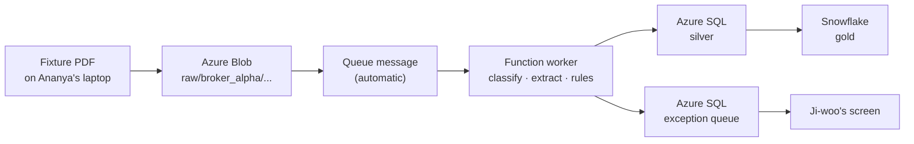

# Sprint 3 — Ananya Finds Out What Is Actually True

← [Previous](06-sprint-2-build-frontend.md) · [Case study index](README.md) · Next: [Sprint 3 — Rework](08-sprint-3-rework.md)

> **One line:** the whole suite is green, every check passes, and Ananya opens a real statement and counts the positions on it by hand.

---

## 1. Monday, 20 July — what Ananya is actually accountable for

Sprint 3 opens with everything built. Tomas closed NWD-101 through NWD-107 last sprint. Ji-woo closed NWD-108 on Friday. There are one hundred and ninety-four tests in `doc_ingestion/tests/` and they are all green. The pipeline has been running against real Broker Alpha statements in the dev environment for eleven days.

Farhan opens standup by asking how long verification will take. Ananya says a week. Farhan writes down two weeks, because he has met her before.

Here is the framing Ananya uses, and it is the reason her chapter exists:

**A test suite tells you the code does what its author thought it should. It cannot tell you whether what the author thought was right.** Those are different questions, and only the second one matters to Northwind.

She has three prompts for the week:

| Prompt | What it is for | Runs |
|---|---|---|
| [P22 — E2E test the application](../../AI-Prompts-Library/phase-5-verify/P22-e2e-test-the-application.md) | Does the whole thing work end to end, as a system, not as parts | Mon–Thu |
| [P24 — Find security gaps](../../AI-Prompts-Library/phase-5-verify/P24-find-security-gaps.md) | What can go wrong that is not a bug | Fri, with Sofia |
| [P25 — Data quality validation](../../AI-Prompts-Library/phase-5-verify/P25-data-quality-validation.md) | Is the data in the warehouse actually correct | Mon–Wed the following week |

The order is not arbitrary. E2E first, because if the pipe is broken nothing else is worth measuring. Security next, because a finding there can change the design and you want that news early. Data quality last, because it is the only one that requires the system to have been running long enough to have produced something to check.

---

## 2. The problem with "end to end" when the end is a warehouse

Most of what you read about E2E testing assumes a browser. Open a page, click a thing, assert a thing appeared.

Ananya's system has a browser in it — Ji-woo's exception queue — but that is not where the work is. Here is what "end to end" means for the Northwind pipeline, stage by stage:



**A single test spans six services, two clouds, and an event that fires on its own schedule.** Ananya's test does not call a function. It puts a file somewhere and waits for a row to appear somewhere else.

Everything hard about this kind of testing is in that last sentence, and it is worth being explicit about the four specific problems, because they are the same four in every event-driven system you will ever test.

**One: there is no return value.** You upload a blob. The upload succeeds. That tells you nothing about whether the pipeline ran. The only evidence is a side effect somewhere else, later.

**Two: "later" is not a fixed number.** A blob trigger in Azure Functions fires within seconds normally, and within a minute or two when the app has scaled to zero and has to cold-start. A test that waits five seconds passes on a warm app and fails on a cold one, which is the worst kind of test: one that fails for reasons unrelated to the code and teaches the team to re-run rather than investigate.

**Three: you cannot clean up by deleting rows.** The pipeline is idempotent by SHA-256 hash of the file content, deliberately — counterparties resend the identical statement under a new filename constantly, and the system must not double-count it. That is a genuine design win and a testing nuisance: **run your test twice with the same fixture and the second run does nothing at all, correctly**, and your assertion passes against the first run's data. You have a test that only really tests the first time it is ever run.

**Four: a passing E2E test is very weak evidence.** It proves one document made it through. It says nothing about the hundred and ninety-nine others that day.

Point four is the one that matters most and it comes back on Wednesday.

---

## 3. Running P22

Here is Ananya's filled-in [P22](../../AI-Prompts-Library/phase-5-verify/P22-e2e-test-the-application.md), trimmed to the parts that carry weight.

```text
You are a senior Python test engineer writing end-to-end tests for the Northwind
counterparty document ingestion pipeline.

## What "end to end" means here

There is no single process to call. A test:
  1. uploads a fixture PDF to Azure Blob Storage at
     raw/{source_prefix}/{yyyy-mm-dd}/{filename}.pdf
  2. waits for the blob-triggered Azure Function to process it
  3. asserts on rows in Azure SQL (silver.counterparty_position and
     etl.extraction_exception) and in Snowflake (gold)

## The environment

Dev subscription. Auth is DefaultAzureCredential — the test runner's own
identity, no keys anywhere. Connection details come from environment variables,
listed in tests/e2e/README.md. Tests are marked @pytest.mark.e2e and are
excluded from the default run.

## The three problems you must solve explicitly, not hide

1. TIMING. The trigger fires asynchronously and cold starts take up to 90s.
   Do NOT use sleep. Write one polling helper with a deadline and a clear
   timeout message that says what it was waiting for and what it saw instead.

2. IDEMPOTENCY. The pipeline dedupes on SHA-256 of file CONTENT. Running the
   same fixture twice is a no-op by design. Solve this so each test run
   processes genuinely new content, and explain your approach before writing it.

3. ISOLATION. Tests must be able to run concurrently against the same dev
   environment, and must not assert on rows another test created.

## Scenarios to cover

* Happy path — a clean single-page Broker Alpha statement lands in silver and
  in gold, with min_confidence and bronze_path populated.
* Gate rejection — a statement with one low-confidence field produces an
  exception-queue row and NO silver rows.
* Spanish path — a broker_beta_em confirmation is translated, then extracted,
  and the security identifier is unchanged by translation.
* Resend — the same content under a different filename produces no second row.
* Classifier below threshold — an unrecognised layout goes to review, is never
  guessed.

## Do not

* Do not mock any Azure service. That is what the unit tests are for.
* Do not use time.sleep as a synchronisation mechanism.
* Do not assert on a row count for the whole table. Scope every assertion to
  the content hash your test created.
* Do not leave data behind that another run will trip over. If cleanup is not
  possible, say so and explain what the residue is.

## You are done when

* Every scenario has a test that fails if you break the corresponding code
  path, and you tell me which line to break to prove it.
* The timeout message on a failure tells me what to look at next.
```

The section that produced the most useful output is the one headed **"the three problems you must solve explicitly, not hide."** Without it you get `time.sleep(10)` in every test and a suite that is 40% flaky by Thursday.

The idempotency answer came back before any code, which is what the prompt asked for:

> Three options. (a) Regenerate the fixture with a unique statement date stamped into it, so the content genuinely differs — realistic, but requires a PDF generator and the model then sees a document it was not trained on. (b) Append a unique comment to the PDF trailer, changing the bytes without changing what the model reads — cheap, and the extracted content is identical every run. (c) Delete the ledger row before the test — fastest, but it tests a pipeline in a state that never occurs in production, and would have hidden NWD-140 below.
>
> Recommending (b). It changes exactly the thing idempotency keys on and nothing else.

Ananya takes (b). The one-liner that makes it work:

```python
def unique_bytes(pdf_path: Path) -> bytes:
    """Byte-unique, content-identical. Changes the SHA-256, not what the model reads.

    A PDF ignores anything after %%EOF, so a trailing comment is invisible to
    every reader and to Document Intelligence, while guaranteeing this run's
    content hash has never been seen before.
    """
    return pdf_path.read_bytes() + f"\n% e2e-{uuid.uuid4()}\n".encode()
```

Four lines and a docstring, and it is the difference between a suite that works forever and one that works once.

### The waiting helper

```python
# tests/e2e/conftest.py

DEFAULT_TIMEOUT = 120.0
POLL_INTERVAL = 2.0


def wait_for(
    probe: Callable[[], T | None],
    *,
    what: str,
    timeout: float = DEFAULT_TIMEOUT,
    diagnostic: Callable[[], str] | None = None,
) -> T:
    """Poll until ``probe`` returns something truthy, or fail with real detail.

    The diagnostic callback is the whole point. A timeout that says
    "waited 120s for a silver row" sends you to the portal. A timeout that also
    says "the exception queue has a row for this hash with reason
    'low_confidence: quantity'" tells you the pipeline worked perfectly and
    your fixture is the problem.
    """
    deadline = time.monotonic() + timeout
    last_error: Exception | None = None

    while time.monotonic() < deadline:
        try:
            result = probe()
            if result:
                return result
        except Exception as exc:            # transient DB/network during scale-out
            last_error = exc
        time.sleep(POLL_INTERVAL)

    extra = f"\nDiagnostic: {diagnostic()}" if diagnostic else ""
    cause = f"\nLast probe error: {last_error!r}" if last_error else ""
    raise AssertionError(
        f"Timed out after {timeout:.0f}s waiting for {what}.{extra}{cause}"
    )
```

Note that `time.sleep` does appear — inside the poll loop, which is fine, because the loop has a deadline and an assertion. The banned thing was sleeping *as a way of synchronising*. Those look similar and are not.

The `diagnostic` callback is the part Ananya added herself after the first failing run sent her to the Azure portal for twenty minutes. It is the single highest-value addition to the whole harness.

### The happy path test

```python
# tests/e2e/test_document_to_warehouse.py

import pytest

pytestmark = pytest.mark.e2e


def test_clean_statement_reaches_silver_and_gold(blob, sql, snowflake, fixtures):
    """A clean single-page Broker Alpha statement passes the gate end to end."""
    content = unique_bytes(fixtures / "BA_POS_clean_1page.pdf")
    digest = hashlib.sha256(content).hexdigest()
    name = f"BA_POS_e2e_{digest[:8]}.pdf"

    blob.upload(f"raw/broker_alpha/{TODAY}/{name}", content)

    silver = wait_for(
        lambda: sql.rows(
            "SELECT * FROM silver.counterparty_position WHERE content_hash = ?",
            digest,
        ),
        what=f"silver rows for content_hash {digest[:12]}",
        diagnostic=lambda: sql.describe_exception(digest),
    )

    assert len(silver) == 12
    assert {r.account_number for r in silver} == {"NW-EQ-0041"}
    assert all(r.min_confidence >= 0.90 for r in silver)
    assert all(r.bronze_path.startswith("bronze/broker_alpha/") for r in silver)

    gold = wait_for(
        lambda: snowflake.rows(
            "SELECT * FROM NWD_GOLD.COUNTERPARTY_POSITION WHERE CONTENT_HASH = %s",
            digest,
        ),
        what="gold rows",
        diagnostic=lambda: f"silver has {len(silver)} rows; gold merge may be pending",
    )

    assert len(gold) == len(silver)
    assert sql.rows(
        "SELECT 1 FROM etl.extraction_exception WHERE content_hash = ?", digest
    ) == []
```

The last assertion is the one people forget. **Asserting the good thing happened is half a test. The other half is asserting the bad thing did not.** A document can land in silver *and* raise an exception-queue row if the code is wrong in a particular way, and only the second assertion catches it.

---

## 4. What the pipe tests found

Three defects over Tuesday, Wednesday and Thursday. All three are ordinary, all three are real, and none of them is the one this book is about.

**NWD-140 — a resent statement under a new filename creates a duplicate row.** The resend test failed on the first run. The document-level ledger dedupes on content hash correctly, but `sinks/blob_sink.py` was building the bronze path from the *filename*, so the same content resent as `BA_POS_20260722_RESEND.pdf` wrote a second bronze object and a second silver row keyed on a different hash-derived path. Two lines. Tomas fixed it Wednesday morning. Notably, option (c) from the idempotency discussion — deleting the ledger row before each test — would have hidden this completely.

**NWD-141 — a 429 from Document Intelligence at month-end kills the run.** Ananya ran forty documents through in ninety seconds to simulate a month-end spike. Azure returned `429 Too Many Requests` on document twenty-nine — the standard "you are going too fast" response — and the Function raised, the queue message went to the poison queue, and the document was never processed. There is retry logic in `core/clients.py`, but the retry predicate did not include 429. Half a day.

**NWD-138 — the Spanish path breaks the security match.** This one is more interesting. A `broker_beta_em` trade confirmation arrives in Spanish and is normalised to English by Azure AI Translator before extraction. The E2E assertion `security_id unchanged by translation` failed: `security_id` came out as `US0378331005` on one document and, on another, the *security name* had been translated so aggressively that a name-based fallback match in reconciliation stopped matching. The rule that emerged is one line in `config/sources.yaml`:

```yaml
  # NWD-138: translation must never touch a field the matching logic keys on.
  no_translate_fields:
    - account_number
    - security_id
    - isin
    - cusip
    - sedol
    - ticker
    - currency
    - trade_id
```

**Translate what a human reads. Never translate what a machine joins on.** That sentence goes in the spec, and it is a good example of a rule nobody would have written in advance and everybody agrees with instantly once seen.

By Thursday evening all three are fixed and re-tested. Farhan's burn-down looks healthy. This is the point in a project where everybody starts to relax.

---

## 5. Friday — P24, the security pass

Ananya and Sofia run [P24](../../AI-Prompts-Library/phase-5-verify/P24-find-security-gaps.md) together, which is unusual — most prompts have one owner — and the pairing is deliberate. Ananya knows what the system does. Sofia knows which of those things is expensive to have been wrong about.

Sofia's opening question, the one she asks about everything:

> "What does this look like when it's wrong?"

The filled-in prompt is scoped hard, because an unscoped security prompt returns forty generic findings about SQL injection in code that uses parameterised queries throughout:

```text
Audit the Northwind counterparty ingestion pipeline for security and data
protection gaps. Scope strictly to this repository plus the exception queue
UI's API layer.

The system's stated security invariants — check each one is actually true in
the code, and quote the line that makes it true or the gap where it is not:

1. No API keys anywhere. All Azure access is managed identity via
   DefaultAzureCredential. Roles: Cognitive Services User, Storage Blob Data
   Contributor, Key Vault Secrets User. Snowflake uses key-pair (JWT) auth.
2. PII is redacted before anything is persisted downstream, and redaction
   FAILS CLOSED — if the Azure AI Language call errors, the raw text is not
   persisted; a marker is.
3. Bronze is immutable. Nothing overwrites a bronze object.
4. The exception queue exposes a document to an analyst via a time-limited,
   read-only SAS URL. It never proxies storage credentials to the browser.
5. Nothing that reaches an application log contains an account number, a name,
   or a raw extracted value.

For each finding give me: file and line, what an attacker or an accident does
with it, severity, and the smallest fix. Rank by "what does this look like when
it's wrong", not by CVSS.

Do not report anything you cannot point at a line for.
```

Two findings survive triage. Both are the kind you only get by asking the right question rather than by running a scanner.

| | Finding | Why it matters | Fix |
|---|---|---|---|
| **SEC-01** | The SAS URL handed to the browser for the PDF is issued for 24 hours with read *and* write permission. `sinks/blob_sink.py`, `review_url()`. | A link pasted into a chat message is a 24-hour write handle on an immutable-by-policy raw document. The raw zone is the evidence trail for every number in the warehouse. | 15 minutes, read-only, regenerated on demand by the API. Nine lines. |
| **SEC-02** | `failures_json` on the exception row carries the raw `observed` value for every violation — including header fields like `account_number` — and the exception queue renders it. Redaction runs on the *text* path before persistence but the structured violation path was never in scope. | Redaction "fails closed" everywhere except the one place a human actually looks. Not a breach; a hole in a control that is documented as complete. | Apply the same masking function to `observed`/`expected` before serialising. Sixteen lines and a test. |

SEC-02 is the more instructive one. **The redaction control was genuinely correct on the path it was designed for, and the exception path was built later, by someone reading a different document.** Nobody was careless. The control had a boundary and the boundary was not written down.

Sofia writes it down, as a two-paragraph amendment to [ADR-0002](artifacts/adr/), and this is the first of two spec-level changes Sprint 3 produces. The second one is bigger.

Both fixes land Monday. Ananya re-tests. Green.

---

## 6. Monday 27 July — the data quality pass, which passes

Now the last of the three, [P25](../../AI-Prompts-Library/phase-5-verify/P25-data-quality-validation.md). This is the one that asks a different question from all the others: *not "does the code work" but "is the data right".*

Ananya and Tomas write it together. The checks are good checks. Here is the set, in the SQL they actually run against silver:

```sql
-- 01: no orphan rows — every silver row traces to a bronze payload
SELECT COUNT(*) AS orphans
FROM   silver.counterparty_position
WHERE  bronze_path IS NULL OR content_hash IS NULL;

-- 02: no row entered the warehouse below its threshold
SELECT COUNT(*) AS below_gate
FROM   silver.counterparty_position
WHERE  min_confidence < 0.90;

-- 03: arithmetic holds on every row the document itself proves
SELECT COUNT(*) AS value_mismatches
FROM   silver.counterparty_position
WHERE  ABS((quantity * price) - market_value) > (ABS(quantity * price) * 0.005);

-- 04: no duplicate positions within a document
SELECT content_hash, security_id, COUNT(*) AS n
FROM   silver.counterparty_position
GROUP  BY content_hash, security_id
HAVING COUNT(*) > 1;

-- 05: silver and gold agree
SELECT COUNT(*) FROM silver.counterparty_position
EXCEPT
SELECT COUNT(*) FROM NWD_GOLD.COUNTERPARTY_POSITION;   -- run cross-platform

-- 06: nothing in silver has a statement date in the future
SELECT COUNT(*) AS future_dated
FROM   silver.counterparty_position
WHERE  statement_date > DATEADD(day, 1, GETUTCDATE());
```

Every one returns zero.

Ananya runs them against eleven days of dev data — around two thousand two hundred rows across a hundred and forty documents. Zero. Zero. Zero. Zero. Zero. Zero.

She also pulls the operational numbers:

| Metric | Value |
|---|---|
| Documents processed, 16–27 July | 142 |
| Straight-through (zero human touch) | 87 (61%) |
| Sent to the exception queue | 55 (39%) |
| Failed with an error | 0 |
| Average `min_confidence` on accepted documents | 0.94 |
| Reconciliation breaks, most recent run | 31 |

Sixty-one percent straight-through against a target of eighty-five. That is a starting point, not a problem — it improves as the models get more labelled documents. Farhan reports it to the client on Friday and nobody is unhappy.

**Everything passes. Every test, every check, every metric. There is no failing thing anywhere in this system on the morning of Wednesday 29 July.**

---

## 7. Wednesday, 29 July, 09:40

Ananya is not satisfied, and she cannot say why.

This is worth sitting with, because it is the least teachable and most important part of the job. Nothing is wrong. The suite is green. The data quality checks are green. She has been doing this for eleven years and something about the shape of the numbers is bothering her.

She writes down what is bothering her, which is the habit that turns an instinct into a finding:

> *Every check I have written asks whether the rows in the warehouse are correct. Not one of them asks whether the rows that should be in the warehouse are there.*

That is the whole thing. She writes it in her notebook at 09:40 and then she does something no automated check does.

She opens a PDF.

Not a fixture. Not a generated document. The actual Broker Alpha daily position statement for Friday 24 July, the one that came in over SFTP at 06:15 that morning like every other morning, sitting in the raw zone at `raw/broker_alpha/2026-07-24/BA_POS_20260724.pdf`.

Two pages. The positions table starts about a third of the way down page 1, under the account header. It runs to the bottom of the page. It continues at the top of page 2 without repeating the header row — the columns are just there, and the rows keep going — and finishes about halfway down, followed by a totals line and a disclaimer.

She counts the positions with the cursor, line by line, the way Priya does.

Page 1: nine.

Page 2: five.

**Fourteen.**

She writes `14` in her notebook.

Then she queries the warehouse.

```sql
SELECT security_id, quantity, market_value, min_confidence
FROM   silver.counterparty_position
WHERE  source_file = 'BA_POS_20260724.pdf'
ORDER  BY line_no;
```

```text
security_id     quantity      market_value   min_confidence
------------    ----------    ------------   --------------
US0378331005      12500.00      2318750.00             0.96
US5949181045       8000.00      3312000.00             0.95
US0231351067       4200.00      7644000.00             0.97
GB0002634946      55000.00      1237500.00             0.94
GB00BH4HKS39      31000.00       852500.00             0.96
CH0038863350     124000.00      3162000.00             0.93
FR0000121014      15500.00      1194250.00             0.95
DE0007164600      22000.00      3234000.00             0.96
NL0011821202       9800.00       656600.00             0.94

(9 rows affected)
```

Nine rows.

She counts the PDF again. Fourteen. She counts the rows again. Nine.

---

## 8. Sit with how quiet this is

Take a moment before the story moves on, because everything that follows depends on understanding exactly how little happened here.

**There is no error.** The Function invocation for that document reported `Success`. Application Insights — the Azure service that collects the pipeline's logs and traces — has one `INFO` line for the run and nothing above it. Nothing threw. Nothing retried. Nothing timed out.

**There is no failing test.** All one hundred and ninety-four unit tests pass. All five E2E scenarios pass. All six data quality checks pass, on this exact document, right now.

**There is no exception-queue row.** Priya was never shown this document, because the system had no reason to show it to her. It looked perfect.

**The confidence gate reported everything fine, and it was telling the truth.** This is the part that takes a minute to accept. `min_confidence` on those nine rows is 0.93 at worst, well above the 0.90 threshold for a number and the 0.92 override Broker Alpha carries because their scan quality is poor. Every field the gate examined was genuinely, verifiably high confidence. The gate did not fail. The gate did not malfunction. **The gate was never shown the five missing rows, so it had nothing to be uncertain about.**

**The straight-through rate counted this as a win.** The metric on Farhan's Friday slide — 61% of documents needing zero human touch — includes this document in the numerator. A document that lost a third of its content is being reported to the client as a clean success.

**And reconciliation is doing its job perfectly, which makes it worse.** The next day's break report compares Aladdin's fourteen positions for that account against the warehouse's nine and correctly reports five discrepancies. It labels them `MISSING_EXTERNAL` — Northwind holds the position, the counterparty statement does not mention it. On a break report, `MISSING_EXTERNAL` means one thing to an operations analyst: **the counterparty may have failed to settle.** That is a phone call to Broker Alpha's operations desk. That is potentially a real amount of money.

Five of those breaks are not settlement failures. They are rows the pipeline dropped, wearing the costume of a settlement failure, and there is no field anywhere on the report that distinguishes the two.

Every single component in this system behaved correctly. The system was wrong.

**A failure that produces no error, no failing test, no alert and no log line above INFO is not a rare exotic case. It is what missing-data bugs always look like.** They are the hardest class of defect to find precisely because every mechanism you built to find defects is looking at things that exist.

---

## 9. Wednesday, 10:20 — confirming it is not a fluke

Ananya does not file yet. One document proves one document.

She pulls every Broker Alpha statement in the raw zone from the last two weeks and counts them by hand. It takes her the rest of the morning and it is the least glamorous work in this entire book.

| Statement | Pages | Positions on the PDF | Rows in silver | Table spans a page? |
|---|---|---|---|---|
| BA_POS_20260715.pdf | 1 | 12 | 12 | No |
| BA_POS_20260716.pdf | 1 | 11 | 11 | No |
| BA_POS_20260717.pdf | 1 | 14 | 14 | No |
| BA_POS_20260720.pdf | 1 | 9 | 9 | No |
| BA_POS_20260721.pdf | 1 | 13 | 13 | No |
| BA_POS_20260722.pdf | 2 | 26 | 18 | **Yes** |
| BA_POS_20260723.pdf | 1 | 12 | 12 | No |
| **BA_POS_20260724.pdf** | **2** | **14** | **9** | **Yes** |
| BA_POS_20260727.pdf | 1 | 10 | 10 | No |
| BA_POS_20260728.pdf | 1 | 15 | 15 | No |

Six single-page statements, all perfect. Two multi-page statements, both short. The pattern is exact and it took a morning of counting to see.

Then she checks the bronze layer, which is the single most useful thing she does all week.

Bronze is where the full raw JSON response from Azure AI Document Intelligence is written, byte for byte, before any of Tomas's code parses it. Sofia insisted on it in Sprint 1 for a cost reason — a parsing bug found next month should be reprocessable for free rather than costing thirty dollars per thousand pages again.

```bash
$ az storage blob download \
    --account-name nwdingestdev --container-name bronze \
    --name broker_alpha/2026-07-24/BA_POS_20260724.json \
    --file /tmp/ba24.json --auth-mode login

$ python - <<'PY'
import json
d = json.load(open("/tmp/ba24.json"))["analyzeResult"]
print("pages     :", len(d["pages"]))
print("documents :", len(d["documents"]))
for i, doc in enumerate(d["documents"]):
    arr = doc["fields"].get("Positions", {}).get("valueArray", [])
    pages = {r["boundingRegions"][0]["pageNumber"] for r in arr if r.get("boundingRegions")}
    print(f"  documents[{i}]: {len(arr)} line items, pages {sorted(pages)}")
PY
pages     : 2
documents : 2
  documents[0]: 9 line items, pages [1]
  documents[1]: 5 line items, pages [2]
```

There it is.

**Azure returned all fourteen.** Nine in the first document region, five in the second. The extraction worked. The model recognised the continuation. The API did exactly what it was paid to do, and Northwind was billed for two pages of analysis and received two pages of analysis.

The rows are lost after that. In Kestrel's own code, somewhere between the JSON on disk and the rows in the database.

That single check eliminates half the system before anyone has looked at a line of Python. **A QA engineer who checks the raw payload before filing is worth two engineers who do not.**

At 11:50 Priya messages the shared channel. Three words:

> "The recon's wrong."

Attached is a screenshot of that morning's break report against the 29 July statement. Sixteen positions on the Broker Alpha book, all flagged `MISSING_EXTERNAL`.

Ananya counts that statement too. Three pages. Forty-seven positions — thirty-one on page 1, sixteen on page 2, disclaimer on page 3. Thirty-one rows in silver.

Same bug. Bigger document. And this one has already produced an escalation that would, if nobody had been counting, have ended with somebody at Northwind ringing a broker to ask why sixteen positions had failed to settle.

---

## 10. The bug report

Ananya spends the afternoon on it and files this at 18:14.

Read it properly. Not as a plot point — as a document. The next chapter is built on the fact that this text can be pasted into a prompt without a single edit, and that is not an accident of her writing style. It is a set of choices you can copy.

```text
ID: NWD-142
Title: Positions on page 2 of a Broker Alpha statement are silently dropped
Severity: Critical — corrupts the warehouse and produces false reconciliation breaks
Found by: Ananya Iyer
Found in: Sprint 3 acceptance testing, build 1.0.0-rc3
Environment: dev, run 2026-07-29T18:14 IST

STEPS TO REPRODUCE
1. Drop BA_POS_20260729.pdf into raw/broker_alpha/2026-07-29/.
   (3 pages. Positions table starts on page 1, continues on page 2 with no
   repeated header row. Page 3 is a disclaimer.)
2. Let the queue worker run to completion.
3. Query NWD_SILVER.COUNTERPARTY_POSITION where source_file = 'BA_POS_20260729.pdf'.

EXPECTED
47 rows — one per position on the statement. I counted them by hand twice.

ACTUAL
31 rows. Exactly the positions printed on page 1. The 16 on page 2 are absent.

OBSERVED SIDE EFFECTS
- No exception anywhere. Function invocation reported Success.
- No entry in the exception queue.
- MIN_CONFIDENCE on the gold row recorded as 0.94.
- Straight-through rate counted this document as a clean pass.
- recon/reconcile.py subsequently reported 16 MISSING_EXTERNAL breaks against the
  Aladdin feed, which is what Priya escalated.

NOTES
- Reproduced 3/3 times.
- Also happens on BA_POS_20260722.pdf (2-page positions table, same shape).
- Does NOT happen on single-page statements (checked 6).
- First found on BA_POS_20260724.pdf, which I counted by hand while doing the
  P25 data quality pass: 14 positions on the PDF (9 on page 1, 5 on page 2),
  9 rows in silver. Full count of every Broker Alpha statement 15-28 July is
  attached as counts-broker-alpha-july.csv. Every multi-page statement is
  short. Every single-page statement is exact.
- The bronze payload is intact at
  bronze/broker_alpha/2026-07-29/BA_POS_20260729.json — I checked and it does
  contain page 2's rows, so extraction from Azure worked. We lose them after that.
- GUESS, not verified: possibly the page-2 table has no header row so our code
  doesn't recognise it as a continuation.
```

### Why this report is a prompt

Five choices in it, each of which you can make tomorrow.

**The reproduction is executable.** Three steps, one file path, one query. Nobody has to ask her what she did. An engineer, or an AI, can follow it exactly.

**Expected and actual are numbers, not adjectives.** `47` and `31`. Not "some positions are missing". You can turn `47` into `assert len(rows) == 47` without a conversation. **A bug report that can be turned directly into an assertion has done ninety percent of the work of fixing itself.**

**The side effects section documents the silence.** Every one of those five bullets is a thing that did *not* happen. Listing the absences is what tells the reader this is a missing-data bug rather than a broken one, and it is the section engineers most often leave out because "nothing happened" does not feel like information. It is the most useful information in the report.

**The boundary is established.** Six single-page statements checked and clean. Two multi-page statements checked and short. She has drawn a line around the defect before anyone has looked at code, which means the eventual fix has a shape to fit.

**The guess is labelled as a guess.** The last line is a hypothesis, and she has written `GUESS, not verified` in front of it in capitals.

That last one is the discipline that matters most and it is the least natural. Ananya has a theory. It is a reasonable theory. She has been doing this long enough to know that if she states it as a finding, the engineer who picks this up — and any AI that engineer pastes it into — will treat it as the brief and start there. Her theory happens to be wrong, as you will see, and labelling it is what stops it costing Tomas a morning.

**Give the observation, not the explanation. If you already knew the explanation, you would not need to file the bug.**

---

## 11. Handing over

Ananya assigns NWD-142 to Tomas at 18:20 and adds one comment:

> "Bronze payload is intact and has page 2's rows. Whatever this is, it's ours, and it's after the Azure call. You don't need credentials or a PDF to reproduce it — copy the JSON into tests/fixtures/ and you've got it offline."

Then she does one more thing, which is the difference between a good bug report and a good QA engineer. She goes back to her P25 checklist, the six checks that all returned zero, and she adds a line at the bottom in red:

> **Missing check: nothing in this suite compares the number of rows we loaded against the number of rows the document says it has. All six checks validate the quality of what is present. None validates that anything is absent.**

That line becomes the headline item in the [retrospective](10-retrospective.md), and the check itself becomes the first thing added to P25's standard set.

Tomas picks it up at 08:15 on Thursday morning. What he does in the first twenty minutes is a mistake, and it is the single most instructive twenty minutes in this book.

---

← [Previous](06-sprint-2-build-frontend.md) · [Case study index](README.md) · Next: [Sprint 3 — Rework](08-sprint-3-rework.md)
