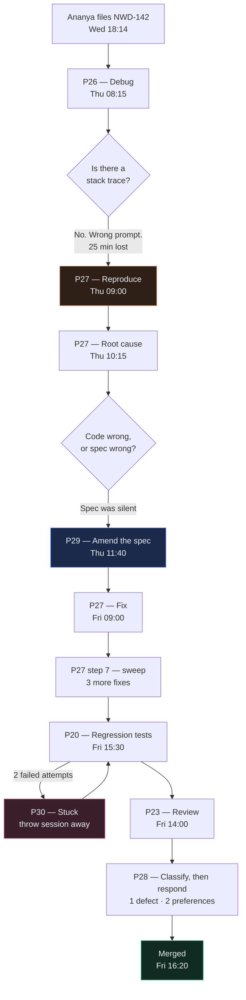

# Sprint 3 — The Rework Loop

← [Previous](07-sprint-3-verify.md) · [Case study index](README.md) · Next: [Sprint 4 — Release](09-sprint-4-release.md)

> **One line:** NWD-142 from bug report to merged fix, including the twenty minutes Tomas wasted at the start and the design decision that made the headline metric go down.

This is the longest chapter in the book and it covers thirty-one hours of one engineer's work. That ratio is the point. [Building](05-sprint-2-build-backend.md) NWD-101 through NWD-107 took four days. Fixing one defect found in them took a day and a half, and it changed a specification, three files and a metric.

---

## 1. Thursday, 30 July, 08:15 — the wrong prompt

Tomas reads Ananya's report twice, opens the repo, and reaches for [P26 — Debug an Error Fast](../../AI-Prompts-Library/phase-6-rework/P26-debug-an-error-fast.md).

This is not laziness. P26 is the prompt he has run more than any other. It is fast, it is reliable, and it has resolved dozens of defects for him over two sprints. It is genuinely the right tool for most of what lands on him.

It is the wrong tool for this, and understanding exactly why is worth more than the rest of the chapter.

Here is P26's opening, unedited from the library:

```text
You are a senior [LANGUAGE] engineer diagnosing a production error.

## The failure

Stack trace:
[PASTE THE FULL STACK TRACE]

## Step 1 — Read the trace and open the exact files involved
Start at the deepest frame in OUR code, not the library frame. Open that file.
Quote the line the trace names and the ten lines around it.
```

Look at what that prompt is built on. Every step after the first one is downstream of a location the machine handed you. The trace names a file and a line. The AI opens that file. It reads that line. **The anchor is free.**

Tomas has no trace. Nothing threw. So he does what everyone does with a placeholder they cannot fill: he writes prose into it.

```text
## The failure

Stack trace:
No exception was raised. On a Broker Alpha statement whose positions table
spans a page boundary we only get the page 1 rows. QA thinks the page 2 table
has no header row so we may not be recognising it as a continuation of the
same table. 47 positions on the statement, 31 rows in the database.
```

Read that paragraph as an AI would. There is exactly one causal statement in it — *"the page 2 table has no header row so we may not be recognising it as a continuation"* — and it arrives with no hedging, from the person who wrote the code, in the slot reserved for hard evidence.

Ananya wrote `GUESS, not verified` in capital letters in front of that sentence. Tomas summarised her report to fit the prompt, and the summary is where the label came off.

### What comes back

Forty seconds later:

````markdown
## Step 1 — Files involved

Working from the description rather than a trace. The behaviour described —
table continuation across pages not being recognised — points to the extraction
layer. Opening `core/extract.py`.

## Step 2 — Diagnosis

`analyze()` maps line items from the array field returned by the model. Document
Intelligence identifies a table by its header row; when a table continues onto a
following page without repeating its header, the model may emit it as a separate
structure that our field map does not pick up.

The extraction is therefore missing a continuation-detection step: after mapping
the primary array field, we should look for additional table structures on
subsequent pages whose column count and column positions match the primary
table, and treat them as continuations.

## Step 3 — Proposed fix

```python
def _continuation_rows(result, primary_columns: int) -> list[dict]:
    """Recover rows from a table that continues onto a later page without a header."""
    rows: list[dict] = []
    for table in result.tables or []:
        if table.column_count != primary_columns:
            continue
        if _has_header_row(table):
            continue          # already captured as the primary table
        for cells in _rows_of(table):
            rows.append(_cells_to_line_item(cells))
    return rows
```

Call this after the field-map loop and extend `line_items` with the result. This
recovers rows from continuation tables that the field extraction model did not
associate with the labelled array field.
````

Sit with that for a second, because it is very good work and it is completely wrong.

It is internally coherent. It uses real Document Intelligence concepts — `result.tables` is a genuine part of the response and column counts are a genuine way to compare tables. It reads like something a competent engineer would write. It is about eighty lines of new code when you include the three helpers it references, all of which it is happy to write for you.

And here is the part that would have cost Tomas a week: **on the 29 July statement, it would probably have worked.** Not reliably, not for the right reason, but it would have produced something close to forty-seven rows, and the symptom would have gone away.

You would then have shipped eighty lines of heuristic table-matching code, into a financial pipeline, to solve a bug you never actually located, and it would sit there being subtly wrong on the fourth Broker Alpha layout variant nobody has seen yet.

### The tell, and Rahul

Tomas is about ten minutes into reading the proposed helpers when Rahul stops behind his desk.

> **Rahul:** "What's the trace?"
>
> **Tomas:** "There isn't one. Nothing threw."
>
> **Rahul:** "Then what are you debugging?"
>
> **Tomas:** "...the extraction."
>
> **Rahul:** "You're debugging Ananya's guess. She even wrote *guess* on it."

That is the whole intervention and it takes about fifteen seconds.

**The rule, and it is worth putting on a wall: if you cannot paste a stack trace, you are not debugging. You are diagnosing, and they are different jobs with different prompts.**

Here is why the distinction is not pedantic:

| | Debugging | Diagnosing |
|---|---|---|
| What you have | A trace: a file, a line, an exception type | A disagreement between an output and an expectation |
| Who found the location | The machine, for free | Nobody yet. That is the work |
| Where the AI starts | The named line | Wherever it decides is plausible |
| What a wrong start costs | Little — the trace pulls you back | Everything — there is nothing to pull you back |
| The prompt | [P26](../../AI-Prompts-Library/phase-6-rework/P26-debug-an-error-fast.md) | [P27](../../AI-Prompts-Library/phase-6-rework/P27-fix-from-a-qa-bug-report.md) |

An AI with no anchor will always produce an anchor. That is not a flaw; it is what generating text means. It picks the most plausible file, forms the most plausible theory, and writes the most plausible fix, and every one of those steps is confident because confidence is not correlated with correctness in a language model. **The output looks identical whether it had evidence or not, which is precisely why you have to know which one you gave it.**

Tomas closes the session. He does not try to salvage it, which is the right call and is the same instinct that [P30](../../AI-Prompts-Library/phase-6-rework/P30-when-the-ai-is-stuck.md) formalises: a context full of a wrong theory keeps producing that theory.

Elapsed: twenty-five minutes. Cost: nothing, because he caught it. That is the good outcome.

---

## 2. 09:00 — reproduce it, with a test, before anything else

[P27](../../AI-Prompts-Library/phase-6-rework/P27-fix-from-a-qa-bug-report.md) opens differently. There is no stack trace slot. The first thing it asks for is not a diagnosis — it is a **reproduction**, and it will not let you past that point.

```text
**STOP GATE 1 — after step 3.** Do NOT diagnose or fix until you have written a
test that reproduces the reported behaviour and shown me its failure output.
Wait for me to reply "reproduced".
```

Before running it, Tomas does the thirty seconds of setup that makes the whole day work. He copies two files out of the bronze layer into the test fixtures directory:

```bash
$ az storage blob download --account-name nwdingestdev --container-name bronze \
    --name broker_alpha/2026-07-24/BA_POS_20260724.json \
    --file tests/fixtures/broker_alpha_2page_14_items.json --auth-mode login

$ az storage blob download --account-name nwdingestdev --container-name bronze \
    --name broker_alpha/2026-07-29/BA_POS_20260729.json \
    --file tests/fixtures/broker_alpha_2page_response.json --auth-mode login
```

**This is an architecture decision from Sprint 1 paying for itself in a way nobody predicted.**

Bronze is the layer where the full raw response from Azure AI Document Intelligence is written to blob storage, byte for byte, before any of Kestrel's code touches it. Sofia argued for it in [ADR-0001](artifacts/adr/) on cost grounds: a parsing bug found next month should be reprocessable for free rather than re-paying thirty dollars per thousand pages.

That argument was about money. The payoff is debugging. The exact API response that produced the wrong answer is a file on disk. Tomas does not need Azure credentials, the network, the PDF, eight seconds of analysis time, or anyone's permission. He needs `json.load`.

**If your system stores the raw response before parsing it, every production bug in your parsing layer arrives with its own reproduction attached.** That is worth more than most testing tooling you could buy.

He picks the 24 July document as the primary fixture — two pages, fourteen positions — rather than the 29 July one, for the reason the prompt asks for: *the smallest test that reproduces the reported behaviour*. Fourteen and nine are numbers you can hold in your head. Forty-seven and thirty-one are numbers you have to trust.

Then he runs P27, with Ananya's report pasted in whole and unedited, `GUESS` label and all.

### What comes back, up to the first gate

````markdown
## Step 1 — Restating the defect

A Broker Alpha daily position statement whose positions table starts on page 1
and continues onto page 2 is ingested. The pipeline should write one row to
silver per position printed on the statement. It writes only the rows printed
on page 1.

No difference from the report. One thing I want to flag as significant rather
than different: the report states the bronze payload contains page 2's rows.
That places the defect entirely downstream of the Azure call and eliminates the
model, the PDF and the API from the search.

## Step 2 — Observation vs theory

**Observed**
- BA_POS_20260724.pdf: 14 positions on the PDF (9 page 1, 5 page 2), 9 rows in
  silver.
- BA_POS_20260729.pdf: 47 positions (31 page 1, 16 page 2), 31 rows in silver.
- No exception. Invocation reported Success.
- No exception-queue entry.
- MIN_CONFIDENCE 0.94.
- 16 MISSING_EXTERNAL breaks downstream on the 29 July document.
- 6 single-page statements checked, all exact. 2 multi-page statements checked,
  both short.
- The bronze JSON contains page 2's rows.

**Theorised (unproven, will not be used as a premise)**
- "Possibly the page-2 table has no header row so our code doesn't recognise it
  as a continuation." Flagged by QA as a guess. It presumes our code contains
  continuation-detection logic. I have not yet checked whether it contains any.

## Step 3 — Reproducing it with a failing test

Before writing anything, checking the shape of the fixture:

```bash
$ python -c "
import json
d = json.load(open('tests/fixtures/broker_alpha_2page_14_items.json'))['analyzeResult']
print('pages    :', len(d['pages']))
print('documents:', len(d['documents']))
print('per doc  :', [len(x['fields']['Positions']['valueArray']) for x in d['documents']])
"
pages    : 2
documents: 2
per doc  : [9, 5]
```

The payload contains **two** AnalyzedDocument objects holding 9 and 5 line items.
9 + 5 = 14, which is the count QA made by hand.

This also disposes of the theory in step 2. The model did not fail to recognise
page 2's table — it recognised it and returned it, as a second document region.
Nothing about header rows is involved.

Test, at the layer where our code first touches the payload:

```python
# tests/test_extract.py

import json
from pathlib import Path

from config.settings import load_sources
from core.extract import build_document

FIXTURES = Path(__file__).parent / "fixtures"


def _payload(name: str) -> dict:
    return json.loads((FIXTURES / name).read_text(encoding="utf-8"))


def test_positions_table_spanning_a_page_keeps_page_two_rows():
    """NWD-142: a positions table crossing a page boundary must not lose rows.

    Fixture is the verbatim bronze payload from
    bronze/broker_alpha/2026-07-24/BA_POS_20260724.json.
    14 positions: 9 printed on page 1, 5 on page 2.
    """
    source = load_sources()["broker_alpha"]
    doc = build_document(_payload("broker_alpha_2page_14_items.json"), source)

    assert len(doc.line_items) == 14
```

Failure output on the current code:

```text
$ pytest tests/test_extract.py::test_positions_table_spanning_a_page_keeps_page_two_rows -q

=================================== FAILURES ===================================
_______ test_positions_table_spanning_a_page_keeps_page_two_rows _______

    def test_positions_table_spanning_a_page_keeps_page_two_rows():
        source = load_sources()["broker_alpha"]
        doc = build_document(_payload("broker_alpha_2page_14_items.json"), source)
>       assert len(doc.line_items) == 14
E       assert 9 == 14
E        +  where 9 = len([{'security_id': ExtractedField(name='security_id', ...

tests/test_extract.py:24: AssertionError
=========================== 1 failed in 0.28s ==================================
```

Reproduced. 9 against an expected 14, offline, in 0.28 seconds, no Azure call.

Note: `build_document` did not exist. `analyze()` currently fetches from Azure
and maps in one function, which is untestable without a network call. I have
extracted the mapping half into `build_document(payload, source)` and left
`analyze()` calling it. That is a refactor, not a fix, and it is the minimum
required to write a test at all. Flagging it rather than burying it.
````

Two things to notice, and they are both the prompt doing its job rather than the model being clever.

**The bash one-liner before the test is the highest-value thirty seconds of the entire day.** It converts a story ("something drops page 2") into arithmetic ("nine plus five is fourteen, we return nine"). It also kills Ananya's guess dead, in public, in three lines of output, before anybody has spent an hour on it. **When a reproduction is available, look at it before you reason about it.**

**The refactor is declared, not smuggled.** `analyze()` mixed fetching with mapping, so there was nothing to test without a network call. Splitting it is genuinely necessary and it is genuinely a change nobody asked for. The prompt's `Do not` list forbids unrequested changes, so the model flagged it instead of hiding it in the diff. Tomas approves it explicitly. That is the whole mechanism working — **the thing you want is not an AI that never exceeds scope, it is one that tells you when it has to.**

Tomas replies `reproduced`.

---

## 3. 10:15 — the trace, and four characters of code

````markdown
## Step 4 — Tracing the data

| Stage | File:line | Value here | Correct? |
|---|---|---|---|
| Azure response persisted to bronze | `sinks/blob_sink.py:52` | `documents` = 2 regions, 9 + 5 line items | Yes |
| Payload handed to mapping | `core/extract.py:201` | same dict, 2 regions | Yes |
| Region selected | `core/extract.py:206` | **1 region, 9 line items** | **No** |
| Field map applied | `core/extract.py:212-234` | 9 line-item dicts | No — already lost |
| Confidence gate | `core/confidence.py:107` | 9 rows, every field ≥ threshold, min 0.94 → PASS | No — evaluating an incomplete set |
| Rules engine | `core/rules.py:892` | 0 violations → `passed = True` | No |
| Transform to canonical | `core/transform.py:58` | 9 canonical rows | No |
| Silver write | `sinks/sql_sink.py:125` | 9 rows merged | No |

The flip is at `core/extract.py:206`.

## Step 5 — Root cause

**Root cause:** `core/extract.py:206` takes `result.documents[0]` and discards
every other AnalyzedDocument in the response. Azure AI Document Intelligence
returns one AnalyzedDocument per detected document *region*, not a ranked list of
candidate readings of one document. A custom extraction model splits a table that
continues across a page boundary into a second region. The continuation's line
items live in `documents[1]` and are never read.

```python
# core/extract.py, lines 203-213
    if not result.documents:
        raise ValueError(f"Model {source.model_id} returned no documents")

    doc = result.documents[0]                      # <-- line 206
    page_count = len(result.pages or [])

    header: dict[str, ExtractedField] = {}
    line_items: list[dict[str, ExtractedField]] = []

    for api_name, target_name in source.field_map.items():
        f = (doc.fields or {}).get(api_name)
```

`git blame` puts line 206 in commit `7c30fb1`, 8 July, "NWD-102 wire up
extraction". There is no comment on it, and there was never a reason to write
one, because at the time it was obviously right: every fixture in the suite has
exactly one region, so the assumption was never contradicted.

**Why the system was silent.** Taking each safety mechanism in turn:

1. **No exception.** `documents[0]` is valid. There is a document at index 0.
   Nothing is out of range, nothing is null, nothing is malformed.
2. **The confidence gate did not fire.** `core/confidence.py` iterates the fields
   it is given and compares each score to its threshold. It was given nine
   complete, high-confidence rows and passed all of them, correctly. The gate has
   no representation for a field that is *absent* — it can only be uncertain
   about values it can see. `min_confidence = 0.94` is a true statement about a
   false dataset.
3. **`min_line_items` did not fire.** It asserts at least one line item. There
   were nine.
4. **`value_consistency` did not fire.** quantity x price reconciles to market
   value on every one of the nine rows, because those nine rows are correct.
   Every row present is right. The bug is in the rows absent.
5. **`required_fields` did not fire.** Every required field is present on every
   row that exists.
6. **The silver write did not fire.** Nine rows is a legitimate row count.
   Nothing in the system declares what the count should have been.
7. **Reconciliation "caught" it and mislabelled it.** It correctly found five
   positions in Aladdin with no counterparty match, and correctly classified them
   `MISSING_EXTERNAL` — the signature of a settlement failure. At that layer the
   extraction defect is indistinguishable from a genuine counterparty failure.

Six controls. All six behaved exactly as specified. None of them asks
"did we get everything?" — the system validates the *quality* of what it found
and never the *quantity*.

**STOPPING HERE.** Waiting for "confirmed".
````

Ananya, reading over Tomas's shoulder, says the sentence that ends up in the retrospective:

> "So the gate isn't broken. The gate answers a question we never should have thought was the only question."

That step-5 enumeration is the part most engineers skip, and it is what turns a bug fix into a lesson. Listing six controls and saying, one by one, why each behaved correctly and still let this through, is what justifies the specification change that follows. **Without it you would be arguing for a spec change on a hunch, and Sofia does not approve spec changes on hunches.**

Tomas replies `confirmed`.

---

## 4. 10:40 — the fix that seems obvious

Step 6 comes back with the change any competent engineer would write. Merge the regions.

```diff
--- a/core/extract.py
+++ b/core/extract.py
@@ -200,18 +200,29 @@ def build_document(payload: dict, source: SourceConfig) -> ExtractedDocument:
     result = payload["analyzeResult"]
 
     if not result.documents:
         raise ValueError(f"Model {source.model_id} returned no documents")
 
-    doc = result.documents[0]
+    # Document Intelligence returns ONE AnalyzedDocument per detected document
+    # region, not a ranked list of readings of one document. A table that
+    # continues across a page boundary comes back as a second region. Taking
+    # documents[0] silently discarded the continuation. NWD-142.
+    regions = _in_reading_order(result.documents)
     page_count = len(result.pages or [])
 
     header: dict[str, ExtractedField] = {}
     line_items: list[dict[str, ExtractedField]] = []
 
-    for api_name, target_name in source.field_map.items():
-        f = (doc.fields or {}).get(api_name)
+    # Header fields appear only on the first region; line items are gathered
+    # from every region, in page then row order.
+    for index, doc in enumerate(regions):
+        for api_name, target_name in source.field_map.items():
+            f = (doc.fields or {}).get(api_name)
+            if f is None:
+                continue
+            if f.type == "array":
+                line_items.extend(_map_rows(f, source))
+            elif index == 0:
+                header[target_name] = _to_extracted(target_name, f)
```

Tomas runs the test.

```text
$ pytest tests/test_extract.py -q
1 passed in 0.29s
```

Fourteen rows. Green. It is 10:52 and he could raise the pull request now.

He does not, because P27's step 6 has one more instruction in it:

```text
**State** why this is the root and not another symptom, using this test: after
this change, is the entire class of failure impossible, or only this instance?
```

And the answer that comes back is the reason this chapter exists:

> After this change, no region of a response is discarded, so the reported defect
> is impossible. The **class** is not. If the response is short for any other
> reason — a mid-analysis timeout, a page the model does not recognise as
> containing a table, a future model version that merges regions differently —
> we again produce a short, high-confidence, silently-accepted document with no
> mechanism anywhere that notices.
>
> Closing the class requires something that independently asserts the extracted
> set is whole. `artifacts/spec-confidence-gate.md` contains no concept of
> completeness, and I was instructed not to invent rules that are not in the
> spec. See step 9. I have not written that part.

**An AI that tells you where the code fix ends and the design decision begins is doing the most useful thing it can do.** It is very easy to read that paragraph as the model refusing to finish. It is the opposite. It finished, and then it drew a line.

### Step 9 — was the spec wrong?

````markdown
## Step 9 — Was the specification wrong?

**(b) — The spec was silent.**

`artifacts/spec-confidence-gate.md` §3 is the closest it comes:

> "Every extracted field carries a confidence score returned by the extraction
> model. The gate compares each score against the threshold for that field's
> type. If ANY field falls below its threshold, the entire document is routed to
> the exception queue. Partial ingestion is never permitted."

Read the last sentence carefully. *"Partial ingestion is never permitted"* is
exactly the invariant NWD-142 violated — and the code did not violate the spec,
because the spec defines partial ingestion solely in terms of **fields that
failed a confidence check**. §3 then enumerates thresholds by field type. There
is no clause anywhere in the document about:

- a field or a row that is absent rather than uncertain;
- how many line items a document is expected to contain;
- pages that were analysed but contributed nothing;
- any cross-check against a total the statement declares about itself.

The spec's model of doubt is *"the model is unsure about this value."* NWD-142's
failure mode is *"the model was never asked about this value."* The spec cannot
express the second, so the implementation could not honour it.

**Per instructions I have not edited the spec.** This needs a completeness rule
alongside the confidence rule. Broker Alpha statements carry a `PositionCount`
in the summary block, which is a ready-made cross-check; `broker_beta_em`
confirmations carry `TradeCount`. Not every layout will, so the rule must be
configurable per counterparty in `config/sources.yaml` rather than hard-coded,
consistent with the invariant that adding a counterparty is a YAML change.

That is an architecture conversation, not a code change.
````

Tomas messages Sofia at 11:04. She comes over at 11:15.

---

## 5. 11:15 — the uncomfortable discovery

This is the turn of the chapter and it is worth reading slowly.

Tomas shows Sofia the merge diff and the passing test. Sofia reads the diff, reads the spec quote, and asks the question she asks about everything:

> **Sofia:** "What does this look like when it's wrong?"
>
> **Tomas:** "It's not wrong, it's green."
>
> **Sofia:** "That's not what I asked. Your code now merges every region in the response into one document. What is a region?"
>
> **Tomas:** "A chunk of the file the model thinks is a document."
>
> **Sofia:** "So what happens when a counterparty sends a PDF with two accounts in it? Or a statement with a trade confirmation stapled on the back? You'll merge them and produce one document with two accounts' positions in it under one account number, and nothing will throw, and the confidence will be 0.94."
>
> *(pause)*
>
> **Tomas:** "...that's the same bug."
>
> **Sofia:** "That's the same bug pointing the other way. You'd be inventing data instead of losing it. And you'd be inferring, from bounding polygons, that region two is a continuation rather than a separate document — which is a guess your code has no way to check."

That is the moment the fix stops being a diff.

**The code did exactly what the spec said. The spec is about confidence. This is about completeness. Nobody on the team had the concept.**

Not Tomas, who implemented it. Not Sofia, who wrote it. Not Amara, who accepted it. Not Ananya, who tested it, and not the acceptance criteria for NWD-103, which are four bullet points about thresholds. The word does not appear in any artifact the project has produced.

You cannot implement a concept nobody has. You cannot test for one either. And an AI, handed a spec that is silent on something, will not tell you the spec is silent — it will produce confident, complete-looking work inside the boundary the document draws, which is the whole reason this book keeps insisting on written artifacts rather than remembered conversations.

**This is the fork that [P29](../../AI-Prompts-Library/phase-6-rework/P29-the-spec-was-wrong.md) exists for, and it is the one people skip.** The temptation right now is enormous: the merge works, the test is green, and Tomas could ship it in ten minutes and put "fixed page boundary bug" in the commit message. The spec would then say one thing and the system would do another, and the next engineer — or the next AI session grounded in that document — would build on a description that is no longer true.

> **If you fix a specification problem in code and do not update the specification, the specification becomes a lie.** Everything grounded in it afterwards inherits the lie, confidently.

---

## 6. 11:40 — P29, and what Sofia and Amara actually decide

Sofia runs [P29](../../AI-Prompts-Library/phase-6-rework/P29-the-spec-was-wrong.md). The prompt's shape is deliberately awkward — write down the divergence, get it approved, *then* touch code — because the awkwardness is what stops people doing it silently.

```text
You are an architect updating a specification that a defect has proved
incomplete. Do not write code.

## The specification
[FULL TEXT OF artifacts/spec-confidence-gate.md]

## The defect that proved it incomplete
[FULL TEXT OF artifacts/bug-NWD-142.md]

## The root cause, already proven
core/extract.py:206 read only the first AnalyzedDocument region. All six
existing controls behaved as specified and none of them caught it. Full
analysis on NWD-142.

## Step 1 — State the divergence
In one paragraph: what does the spec say, what does reality require, and what is
the concept the spec is missing? Name the concept.

## Step 2 — Blast radius
Which OTHER stories were built from this spec? For each, say whether the gap
affects it, and how you know. Stories are in artifacts/stories/.

## Step 3 — Propose the amendment
Write the new section as it would appear in the document. It must be:
* Expressible as configuration per counterparty, not code. Adding a counterparty
  is a YAML change — that invariant is not negotiable.
* Testable — every clause must be checkable by a machine against one document.
* Explicit about what happens to a document that fails it, including what the
  ANALYST sees and does.

## Step 4 — State the cost
What does this rule do to the straight-through rate, and to Priya's workload?
Give a number using the counts in the bug report.

## Do not
* Do not write implementation code.
* Do not weaken any existing rule.
* Do not propose anything that lets a short document load with a warning.
```

Step 1 comes back with the sentence that ends up quoted in the retro, the runbook and the release pack:

> **The specification governs whether a value can be trusted. It has no concept of whether a value is present. The missing concept is *completeness*, and it is orthogonal to confidence: a document can be perfectly confident and materially incomplete, which is exactly what NWD-142 is.**

Step 2 is the part that justifies the whole awkward process. Four stories were built from this spec — NWD-103, NWD-105, NWD-106, NWD-107 — and the analysis finds that NWD-106 (transform) and NWD-107 (load) both silently inherit the gap, because both operate on whatever set of rows they are handed and neither has any notion of what the set should contain. That is not a new bug; it is the same one, and knowing it early stops three separate people rediscovering it in November.

### The amendment

Sofia edits `spec-confidence-gate.md` herself. The AI drafted it; she rewrote about half. Here is the diff that goes to Amara for approval:

```diff
--- a/artifacts/spec-confidence-gate.md
+++ b/artifacts/spec-confidence-gate.md
@@
 ## 3. The confidence gate
 
 Every extracted field carries a confidence score returned by the extraction
 model. The gate compares each score against the threshold for that field's
 type. If ANY field falls below its threshold, the entire document is routed to
 the exception queue. Partial ingestion is never permitted.
 
+> **Scope of this section.** The confidence gate governs whether an extracted
+> value can be *trusted*. It says nothing about whether a value is *present*.
+> Those are different questions and §7 covers the second one.
+
@@
+## 7. Completeness
+
+### 7.1 Why this section exists
+
+A document can be perfectly confident and materially incomplete. On 29 July a
+Broker Alpha statement whose positions table crossed a page boundary loaded 31
+of 47 positions with a minimum confidence of 0.94 and produced 16 false
+`MISSING_EXTERNAL` reconciliation breaks (NWD-142). Every control in §3 through
+§6 behaved exactly as specified. Confidence and completeness are orthogonal
+properties and the system must assert both.
+
+### 7.2 Rule C1 — declared count
+
+Where a counterparty layout states the number of line items it contains, that
+declared count MUST equal the number of line items extracted.
+
+* The header field carrying the declared count is named per counterparty in
+  `config/sources.yaml` as `line_item_count_field`. Where a layout declares no
+  count, this rule does not apply and rule C2 is the cover.
+* A mismatch is an **error**, not a warning. The document goes to the exception
+  queue and no rows load.
+* The violation message MUST carry both numbers, so the analyst reads
+  "declares 14 line items but 9 were extracted" rather than a rule name.
+* If the field is configured but its value cannot be read as an integer, that
+  is itself a violation. A completeness rule MUST NOT fail open.
+
+### 7.3 Rule C2 — page continuation
+
+Every page on which the layout model reports a table MUST have contributed at
+least one extracted line item.
+
+* The set of pages carrying a table comes from the layout analysis in the same
+  response. The set of pages that contributed line items comes from the page
+  provenance recorded on each extracted field.
+* A page in the first set and not the second is a dropped continuation page.
+  This is an **error**.
+* Where the model returns no table regions at all, the rule abstains and logs
+  that it abstained. Absence of evidence is not evidence of completeness, and a
+  false error here would send healthy documents to an analyst.
+
+### 7.4 Why both rules
+
+Deliberately overlapping. Not every layout declares a count; not every model
+returns table regions. Either rule alone closes the hole for the layouts it can
+see. Together they close it for all of them.
+
+### 7.5 What the analyst sees
+
+A completeness failure produces an exception-queue row like any other, with the
+reason and the structured violation attached. The analyst opens the document,
+sees which pages contributed nothing, and either corrects the extraction or
+rejects the document back to the counterparty. She is never shown a document
+that silently lost rows, which is the entire point.
+
+### 7.6 What this rule does NOT do
+
+It does not recover the missing rows. A document that fails C1 or C2 is
+refused, not repaired. Recovering multi-page tables automatically requires the
+extraction model to return them as one region, which is a model training
+concern and is tracked separately as NWD-145.
```

### Amara's question, which changes the answer

Amara reads it and asks the only question that matters to her, which is the same question she asked in Sprint 1 that produced the exception queue in the first place:

> **Amara:** "So on a day when Broker Alpha sends a two-page statement, Priya gets a document in her queue with forty-seven positions on it and has to key all forty-seven by hand?"
>
> **Sofia:** "Yes."
>
> **Amara:** "That's worse than today. Today the machine at least gets the first thirty-one right."
>
> **Sofia:** "Today the machine gets thirty-one right and sixteen wrong, and nobody knows which is which. Would you rather have a system that's honestly broken or dishonestly working?"
>
> **Amara:** *(after a moment)* "Honestly broken. But not for long. What's the actual fix?"

The actual fix is retraining `broker-alpha-position-v3` with labelled multi-page documents so the model returns one region. That costs nothing in money — Document Intelligence charges for analysis, not for training — and about a week of Priya's time labelling around fifty statements. It goes on the backlog as **NWD-145** with a date, and Amara will not approve §7.6 until it has one.

**That exchange is the healthiest thing in this book.** The product owner refuses to accept a control that dumps work on a human without a plan to remove it. The architect refuses to accept a system that is wrong quietly. Neither of them wins; the ticket with the date is what closes the gap between them.

### The cost, stated out loud

Step 4 of P29 forced a number, and here it is:

| | Before C1/C2 | After C1/C2 |
|---|---|---|
| Documents processed, 16–27 July | 142 | 142 |
| Straight-through (zero human touch) | 87 (**61%**) | 83 (**58%**) |
| Sent to the exception queue | 55 (39%) | 59 (42%) |
| Documents loaded with silently missing rows | **4** | **0** |

**The headline metric goes down by three points, and every one of those three points was a lie.**

Farhan has to tell the client that the number he reported last Friday was wrong and the new number is worse. He does it on the Monday call, in one sentence, without softening it: *"Sixty-one percent included four documents that loaded incomplete. The real number was fifty-eight and now the dashboard says fifty-eight."*

Nobody at Northwind objects. The head of operations says the only thing worth saying about it, which is: *"I'd rather have a number I can defend."*

---

## 7. 14:00 — the fix that actually ships

Sofia approves at 13:40. Amara approves at 13:55, with NWD-145 raised. Only now does Tomas touch the code again.

And the first thing he does is **delete the merge**.

That is worth stating plainly because it feels like waste. Three hours ago the merge made the test go green. It is now gone, because Sofia's counter-example — two accounts in one PDF, merged into one — is a data corruption bug and the code has no way to tell that case from a continuation. The merge traded a visible loss for an invisible invention, which is a bad trade in a system whose first invariant is *a wrong number is worse than no number*.

The merge lives on in NWD-145: once the model is retrained to return one region for a continued table, there is nothing to merge.

What ships instead is detection, in three parts.

### Part one — extraction records where things came from

You cannot check that page 2 contributed rows unless you know which page each row came from. That data was being thrown away.

```diff
--- a/core/extract.py
+++ b/core/extract.py
@@ class ExtractedField:
     name: str
     value: Any
     confidence: float | None
     field_type: str
     raw_content: str | None = None
+    page_number: int | None = None
 
@@ class ExtractedDocument:
     header: dict[str, ExtractedField] = field(default_factory=dict)
     line_items: list[dict[str, ExtractedField]] = field(default_factory=list)
     raw_response: dict[str, Any] | None = None
+
+    # Pages on which the model reported a table. Compare against the pages the
+    # line items actually came from to detect a dropped continuation page.
+    table_pages: list[int] = field(default_factory=list)
+    # The count the document states for itself, when the layout carries one.
+    declared_line_item_count: int | None = None
+
+    def line_item_pages(self) -> list[int]:
+        """Sorted distinct pages that contributed at least one line item."""
+        pages = {
+            f.page_number
+            for row in self.line_items
+            for f in row.values()
+            if f.page_number is not None
+        }
+        return sorted(pages)
+
+
+def _page_of(f: "DocumentField") -> int | None:
+    """The page a field was read from, via its first bounding region."""
+    regions = getattr(f, "bounding_regions", None) or []
+    if not regions:
+        return None
+    return getattr(regions[0], "page_number", None)
+
+
+def _table_pages(result: "AnalyzeResult") -> list[int]:
+    """Pages the layout model found a table on.
+
+    This is the ground truth the ``page_continuation`` rule compares line-item
+    provenance against. If the model saw a table on page 2 and no line item came
+    from page 2, rows were lost between layout and field extraction.
+    """
+    pages: set[int] = set()
+    for table in getattr(result, "tables", None) or []:
+        for region in getattr(table, "bounding_regions", None) or []:
+            page = getattr(region, "page_number", None)
+            if page is not None:
+                pages.add(page)
+    return sorted(pages)
```

Note `_table_pages` reads from the **layout** analysis, which is a different part of the same response from the field extraction. The layout model says "there is a table here, on these pages." The extraction model says "here are the labelled fields." They can disagree, and the whole detection rests on them disagreeing.

### Part two — two rules in the rules engine

The rules engine is config-driven: a rule is a `{id, type, severity, params}` block in YAML and `type` selects one of a set of registered Python implementations. Adding a control is a registration plus a YAML block, never a branch.

```python
# core/rules.py

@validator("line_item_count")
def line_item_count(
    doc: ExtractedDocument, source: SourceConfig, rule: RuleConfig
) -> list[RuleViolation]:
    """Declared line-item count must equal the number extracted. (NWD-142)

    Broker Alpha's statement header carries ``PositionCount``. When the positions
    table spanned a page boundary the extractor returned the page-1 rows only,
    and every one of them was high confidence — so the gate passed a document
    that was missing half its content.

    Comparing the document's own declared count against what we extracted turns
    that silent data loss into an exception-queue item with an exact number in
    it. The rule abstains, loudly, when the layout does not declare a count;
    :func:`page_continuation` is the cover for those layouts.
    """
    declared = doc.declared_line_item_count
    if declared is None:
        log.info(
            "line_item_count_not_declared",
            extra={"source": source.key, "rule": rule.id, "model": doc.model_id},
        )
        return []

    extracted = len(doc.line_items)
    if declared == extracted:
        return []

    return [
        RuleViolation(
            rule_id=rule.id,
            rule_type="line_item_count",
            severity=rule.severity,
            message=(
                f"document declares {declared} line items but {extracted} were "
                f"extracted across {doc.page_count} pages"
            ),
            field=source.line_item_count_field,
            row=None,
            observed=extracted,
            expected=declared,
        )
    ]


@validator("page_continuation")
def page_continuation(
    doc: ExtractedDocument, source: SourceConfig, rule: RuleConfig
) -> list[RuleViolation]:
    """Every page carrying a table must have contributed line items. (NWD-142)

    The layout model tells us which pages a table sits on. Our extracted line
    items tell us which pages we actually read rows from. A page in the first set
    and not the second is a continuation page we dropped.

    The rule abstains when the model returned no table regions, because absence
    of evidence is not evidence of completeness and a false error here would send
    healthy documents to an analyst.
    """
    if doc.page_count <= 1:
        return []

    table_pages = set(doc.table_pages)
    if not table_pages:
        log.info(
            "page_continuation_not_evaluable",
            extra={"source": source.key, "rule": rule.id, "pages": doc.page_count},
        )
        return []

    read_pages = set(doc.line_item_pages())
    if not read_pages:
        return []

    dropped = sorted(table_pages - read_pages)
    if not dropped:
        return []

    return [
        RuleViolation(
            rule_id=rule.id,
            rule_type="page_continuation",
            severity=rule.severity,
            message=(
                "the positions table continues onto "
                f"page(s) {dropped} but no line items were extracted from them"
            ),
            field=None,
            row=None,
            observed=sorted(read_pages),
            expected=sorted(table_pages),
        )
    ]
```

The `message` strings are not decoration. They are what Priya reads in Ji-woo's exception queue at 8:40 in the morning. *"The positions table continues onto page(s) [2] but no line items were extracted from them"* tells her exactly where to look on a document she has never seen. `page_continuation: failed` would tell her nothing and cost her ten minutes per document, forty times a morning.

### Part three — the YAML, because adding a control is configuration

```diff
--- a/config/sources.yaml
+++ b/config/sources.yaml
@@ defaults.rules
     - id: at_least_one_line
       type: min_line_items
       severity: error
       params:
         minimum: 1
 
+    # -- completeness (the NWD-142 class) ------------------------------------
+    - id: declared_line_item_count
+      type: line_item_count
+      severity: error
+      params: {}
+
+    - id: page_continuation
+      type: page_continuation
+      severity: error
+      params: {}
+
@@ sources.broker_alpha
     field_map:
       AccountNumber: account_number
       StatementDate: statement_date
+      PositionCount: declared_line_item_count
       Positions: positions
 
+    # The header field that tells us how many line items the document CLAIMS to
+    # contain. This is what turns NWD-142 from an invisible bug into a rule.
+    line_item_count_field: declared_line_item_count
+
@@ sources.broker_beta_em
     field_map:
       AccountNumber: account_number
       TradeDate: trade_date
       SettlementDate: settlement_date
+      TradeCount: declared_line_item_count
       Trades: trades
 
+    line_item_count_field: declared_line_item_count
```

Six lines of YAML and one new field-map entry per counterparty. **The invariant held: a new control did not require a new branch in the pipeline, and onboarding counterparty number three still does not require touching Python.**

---

## 8. 14:50 — where else is this assumption hiding?

Step 7 of P27 is the step people skip and it is the cheapest high-value step in the whole loop.

The instruction is not "find similar code." It is: **this defect came from a mistaken assumption. Find every other place that assumption is made.**

The assumption is not `documents[0]`. That is the symptom. The assumption is: *the set of things we received is the set of things there were.*

Tomas runs it:

```text
This defect came from the assumption that the set of records we received is the
complete set of records that existed. Search the repository for every other
place that assumption is made — anywhere the code accepts a collection from an
external system without an independent check that it is whole.

For each hit: file, line, whether it has the same defect, and why or why not.
Report only. Do not change anything yet. Show the searches you ran.
```

```bash
$ rg -n 'documents\[0\]|\.documents\[|\[0\]$' --type py
$ rg -n 'nextPageToken|pageToken|continuation|hasMore|next_cursor' --type py
$ rg -n 'def fetch_|def iter_|def read_|SELECT .* FROM' --type py -g '!tests/**'
```

Three real findings and one that needs a human.

### Finding 1 — `sources/aladdin_api.py`, the internal side of the reconciliation

```python
# sources/aladdin_api.py:155-178, before
def _iter_pages(self, path: str, params: dict[str, Any]) -> Iterator[dict[str, Any]]:
    page_params = {**params, "pageSize": self.config.page_size}
    while True:
        payload = self._get(path, page_params)
        records = payload.get("data") or []
        yield from records

        token = payload.get("nextPageToken")
        if not token:
            return                       # <-- "no token means we're done"
        page_params = {**page_params, "pageToken": token}
```

**Same bug, opposite direction, larger blast radius.**

`if not token: return` reads as "no next page, therefore finished." It actually means "the response did not contain a next-page token", and those are not the same statement. If Aladdin omits the token because of a server-side error, a proxy stripping a field, or a truncated response, this loop exits after one page of five hundred and reports it as a complete portfolio pull.

Reconciliation then compares five hundred internal positions against the counterparty's full book and reports **thousands** of `MISSING_INTERNAL` breaks. Nothing throws. The docstring on the module even says the design goal out loud — *"a partial failure loses one page rather than an afternoon"* — which is exactly the wrong instinct expressed as a feature.

The fix is the same shape as the completeness rules: make the system state what it expected and check it.

```diff
--- a/sources/aladdin_api.py
+++ b/sources/aladdin_api.py
@@
+class AladdinTruncatedError(AladdinError):
+    """A paged pull ended with fewer records than the API said existed."""
+
+
 def _iter_pages(self, path: str, params: dict[str, Any]) -> Iterator[dict[str, Any]]:
     page_params = {**params, "pageSize": self.config.page_size}
     page_number = 0
+    seen = 0
+    declared: int | None = None
 
     while True:
         payload = self._get(path, page_params)
         records = payload.get("data") or []
         page_number += 1
+        seen += len(records)
+
+        # Aladdin reports the total on every page. Capture it once and hold the
+        # pull to it. NWD-142: never treat "the response stopped" as "there was
+        # no more".
+        if declared is None and payload.get("totalRecords") is not None:
+            declared = int(payload["totalRecords"])
 
         log.info(
             "aladdin_page_fetched",
-            extra={"path": path, "page": page_number, "records": len(records)},
+            extra={
+                "path": path,
+                "page": page_number,
+                "records": len(records),
+                "seen": seen,
+                "declared": declared,
+            },
         )
         yield from records
 
         token = payload.get("nextPageToken")
         if not token:
+            if declared is not None and seen != declared:
+                raise AladdinTruncatedError(
+                    f"{path}: paging ended after {page_number} page(s) with "
+                    f"{seen} records, but the API declared {declared}"
+                )
+            if declared is None:
+                log.warning(
+                    "aladdin_total_not_declared",
+                    extra={"path": path, "pages": page_number, "records": seen},
+                )
             return
         page_params = {**page_params, "pageToken": token}
```

Raising rather than logging is the deliberate part. A truncated internal feed must not quietly become a reconciliation run. **The whole lesson of NWD-142 is that silence is the failure mode; a loud exception is a downgrade in severity, not an upgrade.**

### Finding 2 — `sinks/sql_sink.py`, the reconciliation input path

```python
# sinks/sql_sink.py:198, before
def fetch_positions_for_recon(conn, as_of: str, account_number: str | None = None):
    """Read silver rows for a reconciliation run, as a DataFrame."""
    sql = """
        SELECT account_number, security_id, ...
        FROM   silver.counterparty_position
        WHERE  statement_date = ?
    """
```

This one is subtle and it is the same assumption at the top of the pipeline instead of the bottom.

Reconciliation reads whatever silver happens to contain for a date. It has no idea what silver *should* contain. If a Broker Alpha statement went to the exception queue that morning and Priya has not worked it yet, the external side is missing that entire account and reconciliation reports every position in it as `MISSING_EXTERNAL` — the exact false-break signature that started this whole chapter, produced by the fix rather than the bug.

The fix is a manifest, not a query change:

```diff
+def recon_readiness(conn, as_of: str) -> ReconReadiness:
+    """What arrived, what loaded, and what is still sitting in the queue.
+
+    Reconciliation must never run against a partial external side. A statement
+    parked in the exception queue produces MISSING_EXTERNAL breaks that look
+    exactly like a settlement failure — NWD-142's signature, arriving the other
+    way round.
+    """
+    rows = conn.execute(
+        """
+        SELECT source_key,
+               SUM(CASE WHEN state = 'loaded'  THEN 1 ELSE 0 END) AS loaded,
+               SUM(CASE WHEN state = 'queued'  THEN 1 ELSE 0 END) AS in_queue,
+               SUM(CASE WHEN state = 'expected' THEN 1 ELSE 0 END) AS not_arrived
+        FROM   etl.document_ledger
+        WHERE  statement_date = ?
+        GROUP  BY source_key;
+        """,
+        as_of,
+    ).fetchall()
+    return ReconReadiness.from_rows(as_of, rows)
```

`recon/reconcile.py` now calls it first and refuses to produce a break report when anything is outstanding, naming what it is waiting for. The break report gains a header line: `External side complete: 2/2 sources, 0 documents in the exception queue.`

**A control that runs on incomplete input is worse than a control that does not run, because it produces output people act on.**

### Finding 3 — `core/classify.py:44`, needs a human decision

```python
doc_type = result.documents[0].doc_type
```

Same pattern in the classifier — the step that decides which counterparty layout a PDF is. Multiple regions here means the file contains more than one *kind* of document, which is a different situation from a continuation. Taking the first is probably right and it is undocumented and untested.

The AI flags it as needing a human decision rather than proposing a fix, which is the correct output. Sofia takes it, writes three lines into the spec saying multi-type documents are out of scope for v1.0 and are refused rather than guessed, and Tomas adds a test asserting exactly that.

**One bug report. Three fixes and a documented decision.** Two of those three were live in the dev environment and nobody had reported either of them, because nobody reports rows that were never there.

---

## 9. 15:30 — stuck, and the honest way out

Regression tests, which is [P20](../../AI-Prompts-Library/phase-4-build/P20-write-tests-alongside-the-code.md)'s territory. Most of them are straightforward. One is not, and it costs Tomas forty minutes.

He needs a test for `page_continuation` firing: a document where the layout reports a table on page 2 but no line item came from page 2. The 24 July fixture has this shape, so it should be easy.

**Attempt one.** The test passes when it should fail. The rule does not fire.

He tells the AI. It concludes the abstention branch is wrong and proposes removing the `if not table_pages: return []` guard. Tomas can see that is wrong — removing it makes the rule fire on every layout whose model returns no table regions, which sends healthy documents to Priya.

**Attempt two.** He says so. The AI proposes making the guard conditional on `page_count`. The test still passes. The rule still does not fire.

He is now about to type a third message. This is the moment [P30](../../AI-Prompts-Library/phase-6-rework/P30-when-the-ai-is-stuck.md) exists for.

> **Two failed attempts. The AI is not "nearly there."** Your context is now full of a wrong theory, two rejected fixes and a half-reverted edit, and every one of those is still shaping the next response. The good information is buried under the bad. The third attempt is statistically worse than the first, not better.

That is counterintuitive because it is the opposite of how it works with a person. A colleague's third attempt genuinely benefits from the first two.

Tomas runs P30's cheapest move first — **ask for assumptions, not action**:

```text
Stop. Do not propose any change.

State, as a numbered list, everything you currently believe to be true about how
`doc.table_pages` gets its value in this test, and for each one say how you know
it — file and line, or "assumed".
```

The answer:

````markdown
1. `ExtractedDocument.table_pages` holds the pages the layout model reported a
   table on. — core/extract.py, dataclass field. Known.
2. `page_continuation` reads it. — core/rules.py. Known.
3. In this test it is populated from the fixture payload when the document is
   built. — **Assumed.** I have not read the test's construction of the document.
````

Point three is the false belief, stated plainly, in fourteen seconds.

Tomas opens his test. He is not building the document with `build_document` at all — he is constructing an `ExtractedDocument` by hand, the way `tests/test_confidence.py` does, because that is the pattern he had open in the other tab. A hand-built document has `table_pages=[]`, so the rule abstains, correctly, every time.

**The rule was never broken. The test was.** And two rounds of "fix the rule" had been aimed at code that was already right — which is precisely the failure mode P26 nearly produced at 08:15 that morning, arriving from a different direction eight hours later.

Tomas throws the session away and starts a fresh one, narrowly framed, with the real dataclass pasted in:

```text
One file: tests/test_rules.py. One function to test: page_continuation in
core/rules.py, pasted below along with the ExtractedDocument dataclass it reads.

Write three tests. The document under test must be built by
build_document(payload, source) from a fixture file — NOT constructed by hand —
because table_pages is populated during document construction and a hand-built
document has an empty one. That is what wasted my last half hour.

Fixtures available in tests/fixtures/:
  broker_alpha_2page_14_items.json  — 2 pages, layout reports a table on pages
                                       1 and 2, field extraction returns rows
                                       from page 1 only. Should FIRE.
  broker_alpha_1page_12_items.json  — 1 page, complete. Must NOT fire.
  broker_alpha_2page_full.json      — 2 pages, rows from both. Must NOT fire.

[FULL TEXT OF page_continuation AND ExtractedDocument]
```

That prompt is forty percent longer than the ones that failed, and the extra length is entirely facts he learned from failing. **This is what "start again" actually means. Not repeating yourself — restarting with what the failure taught you.**

The tests come back correct on the first try and take four minutes.

```python
# tests/test_rules.py

def test_page_continuation_fires_when_a_table_page_contributed_nothing():
    """NWD-142: layout saw a table on page 2, extraction returned nothing from it."""
    source = load_sources()["broker_alpha"]
    doc = build_document(_payload("broker_alpha_2page_14_items.json"), source)

    assert doc.table_pages == [1, 2]
    assert doc.line_item_pages() == [1]

    violations = rules.page_continuation(doc, source, RULE)
    assert len(violations) == 1
    assert violations[0].severity == "error"
    assert "page(s) [2]" in violations[0].message


def test_page_continuation_silent_on_a_complete_two_page_statement():
    """Boundary: both pages contributed. Must not fire."""
    source = load_sources()["broker_alpha"]
    doc = build_document(_payload("broker_alpha_2page_full.json"), source)
    assert rules.page_continuation(doc, source, RULE) == []


def test_page_continuation_abstains_when_the_model_reports_no_tables():
    """Boundary: no layout evidence is not evidence of loss. Must not fire."""
    source = load_sources()["broker_alpha"]
    doc = build_document(_payload("broker_beta_no_table_regions.json"), source)
    assert doc.table_pages == []
    assert rules.page_continuation(doc, source, RULE) == []
```

### The full regression suite, and its failure output on unfixed code

```text
$ git stash && pytest tests/test_rules.py tests/test_extract.py -q -k "142 or continuation or count"

FAILED test_positions_table_spanning_a_page_keeps_page_two_rows       - assert 9 == 14
FAILED test_declared_count_mismatch_is_an_error                       - assert [] != []
FAILED test_declared_count_unparseable_is_an_error                    - assert [] != []
FAILED test_page_continuation_fires_when_a_table_page_contributed_nothing
                                                                      - AttributeError:
                                                                        'ExtractedDocument' object
                                                                        has no attribute 'table_pages'
FAILED test_aladdin_paging_raises_when_total_not_reached              - DID NOT RAISE
FAILED test_recon_refuses_to_run_with_documents_in_the_queue          - DID NOT RAISE
PASSED test_page_continuation_silent_on_a_complete_two_page_statement
PASSED test_single_page_statement_unaffected
PASSED test_page_continuation_abstains_when_the_model_reports_no_tables

9 tests, 6 failed, 3 passed in 0.71s

$ git stash pop && pytest tests/ -q
203 passed in 6.8s
```

The three that pass on the unfixed code are the boundary tests, which is exactly right — they assert behaviour that was never broken, and if they had failed it would mean the fix had changed something it should not have.

---

## 10. Friday 14:00 — the review

Rahul reviews it with [P23](../../AI-Prompts-Library/phase-5-verify/P23-review-someone-elses-code.md). Three comments come back.

Here they are as written:

> **1. `core/extract.py:167` — `_declared_count`.** This rule fails open. If the configured count field is present but unparseable you log a warning and return `None`, and `line_item_count` then abstains. A rule that exists to catch silent data loss must not itself go silent. If the layout is configured to declare a count and we cannot read it, that's a violation.
>
> **2. `core/rules.py:772` and `:817`.** Two validators with near-identical structure. I'd fold them into one `completeness` rule with a `mode` param. Fewer moving parts, one place to change the message format.
>
> **3. `core/extract.py:151` — `_table_pages`.** This is layout-model logic sitting in the extraction module. Belongs in a `core/layout.py` alongside anything else that reads bounding regions.

Tomas's first instinct is to do all three, because they are from his team lead and they are all reasonable-sounding. That instinct costs teams a great deal of time and produces diffs nobody can review.

He runs [P28](../../AI-Prompts-Library/phase-6-rework/P28-respond-to-code-review-feedback.md) instead, whose first step is not "fix these" but **classify each comment before responding to any of them**:

```text
Classify each comment as exactly one of:
  (a) DEFECT — the code is wrong. Correctness, security, or a broken contract.
  (b) RISK — not wrong today, but a foreseeable failure. Say what the failure is.
  (c) PREFERENCE — a different valid choice. Neither is wrong.
  (d) MISUNDERSTANDING — the reviewer has read it wrong. Say what they missed.

For each, quote the code, state the classification, and give the evidence. Do
not write any fix yet.
```

| # | Class | Evidence |
|---|---|---|
| 1 | **DEFECT** | `_declared_count` returns `None` on `ValueError`. `line_item_count` treats `None` as "layout declares no count" and returns `[]`. A Broker Alpha statement whose `PositionCount` OCRs as `"l4"` therefore loads with no completeness check at all. This is NWD-142's failure mode inside NWD-142's fix. |
| 2 | **PREFERENCE** | Both are valid. The two rules produce different messages, carry different `rule_id`s, and abstain for different reasons. |
| 3 | **PREFERENCE** | `_table_pages` is one function with one caller. |

### Comment 1 — fixed, because it is real

Rahul is right and it is the best comment on the review. The fix distinguishes "this layout declares no count" from "this layout declares a count we could not read":

```diff
--- a/core/extract.py
+++ b/core/extract.py
@@ def _declared_count(header, source) -> int | None:
     if not source.line_item_count_field:
         return None
     f = header.get(source.line_item_count_field)
     if f is None or f.value is None:
         return None
     try:
         return int(f.value)
     except (TypeError, ValueError):
         log.warning(
             "declared_count_unparseable",
             extra={"source": source.key, "value": f.value},
         )
-        return None
+        return UNREADABLE_COUNT
```

```diff
--- a/core/rules.py
+++ b/core/rules.py
@@ def line_item_count(doc, source, rule):
     declared = doc.declared_line_item_count
+
+    if declared is UNREADABLE_COUNT:
+        # The layout declares a count and we could not read it. Abstaining here
+        # would reproduce NWD-142 inside NWD-142's own fix. Fail closed.
+        return [
+            RuleViolation(
+                rule_id=rule.id,
+                rule_type="line_item_count",
+                severity=rule.severity,
+                message=(
+                    "the document declares a line-item count that could not be "
+                    "read, so completeness cannot be verified"
+                ),
+                field=source.line_item_count_field,
+                row=None,
+                observed=None,
+                expected="an integer",
+            )
+        ]
+
     if declared is None:
```

Plus the test, which is now in the suite above as `test_declared_count_unparseable_is_an_error`.

### Comment 2 — pushed back on, with a reason

Tomas replies rather than refactoring:

> Going to leave these as two rules, and here's the reasoning — happy to be overruled.
>
> The two `rule_id`s are what Priya sees in the exception queue and what she filters on. `declared_line_item_count` and `page_continuation` are different problems with different fixes: the first means a number disagrees, the second means a page contributed nothing. She acts on them differently.
>
> They also abstain for different reasons, and the abstention logic is the subtle part of both. Folding them into one function with a `mode` parameter means one function with two abstention paths and a branch at the top, which is harder to read than two functions, not easier.
>
> They're structurally similar because every validator in this engine is structurally similar. That's the registry pattern working, not duplication.

Rahul's reply is two words: `Fair. Keeping.`

**The pushback took four minutes and it is the reason the rule messages in production are specific.** If Tomas had merged them to avoid an awkward conversation, Priya's queue would say `completeness: failed` on both, and she would have to open the document to find out which.

### Comment 3 — answered with a comment, not a move

`_table_pages` is one function with one caller. Moving it creates `core/layout.py` containing one function, and a new import, and a new place for the next person to look. Tomas adds a docstring line instead:

```diff
 def _table_pages(result: "AnalyzeResult") -> list[int]:
     """Pages the layout model found a table on.
 
     This is the ground truth the ``page_continuation`` rule compares line-item
     provenance against. If the model saw a table on page 2 and no line item came
     from page 2, rows were lost between layout and field extraction.
+
+    Lives here rather than in a layout module because it has exactly one caller
+    and moving it would create a module with one function in it. If a second
+    reader of ``result.tables`` appears, move both.
     """
```

**A comment recording why the code is not organised the way a reviewer expected is worth more than the reorganisation.** It answers the question permanently instead of once.

Rahul approves at 15:40. Ananya re-tests against both fixtures and against the live 30 July statement, which is two pages and correctly lands in the exception queue with the message *"the positions table continues onto page(s) [2] but no line items were extracted from them."*

Priya opens it, keys the eight missing positions, and resolves it in about six minutes.

Merged 16:20, Friday 31 July.

---

## 11. The path actually taken

Here is the route through the [rework loop](../../AI-Prompts-Library/03-the-rework-loop.md), as it happened rather than as it is drawn.



Seventeen steps from bug report to merge. Two of them are "write the fix."

The accounting, honestly:

| | Time |
|---|---|
| Running the wrong prompt | 25 min |
| Reproducing with a failing test | 1h 15m |
| Root cause and trace | 45 min |
| Writing the fix that was later deleted | 40 min |
| The specification conversation (Sofia, Amara, P29) | 2h 20m |
| The fix that shipped | 3h |
| Sweeping for the pattern elsewhere, and two more fixes | 2h 30m |
| Regression tests, including 40 min stuck | 2h 10m |
| Review and response | 1h 20m |
| **Total** | **~14 hours over two days** |

Farhan's Sprint 3 estimate had one day for "bug fixing", for all defects, for the whole team. NWD-142 alone was a day and three quarters of one engineer's time, plus the architect, plus the product owner, plus QA re-testing.

**The estimate was not wrong because Farhan is bad at estimating. It was wrong because rework was never a named activity.** It had no prompts, no artifacts and no line in the plan, so it happened in the gaps and the sprint was late for reasons nobody could point at.

That is what the [retrospective](10-retrospective.md) is about, and Farhan's estimates carry an explicit rework line afterwards.

---

## 12. What actually got fixed

Five things, from one bug report:

| | Change | Where |
|---|---|---|
| 1 | Page provenance recorded on every extracted field, and table pages captured from the layout model | `core/extract.py` |
| 2 | Two completeness rules — declared count, and page continuation | `core/rules.py`, `config/sources.yaml` |
| 3 | Aladdin paging raises rather than silently truncating | `sources/aladdin_api.py` |
| 4 | Reconciliation refuses to run against a partial external side | `sinks/sql_sink.py`, `recon/reconcile.py` |
| 5 | A specification that now contains the concept of completeness | `artifacts/spec-confidence-gate.md` §7 |

Only the first two were the reported bug. Numbers three and four were live in the dev environment, undetected and unreported, and would have reached production.

And one thing that was deliberately *not* fixed: the extraction still cannot read a continued table. That is NWD-145 — retrain the model with labelled multi-page statements — and it has a date, an owner and Amara's signature on it. Until then, those documents go to Priya, and the straight-through rate says fifty-eight percent, and fifty-eight percent is true.

**The system got worse at its headline metric and better at telling the truth. If you only take one thing from this chapter, take that trade.**

---

← [Previous](07-sprint-3-verify.md) · [Case study index](README.md) · Next: [Sprint 4 — Release](09-sprint-4-release.md)
