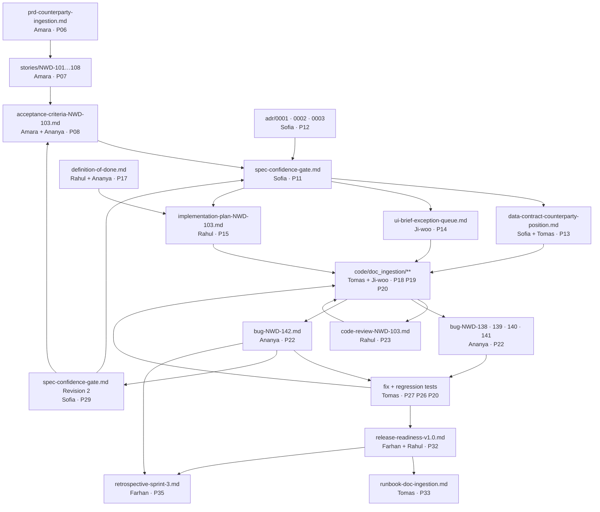

# The artifacts folder — what a real delivery leaves behind

Everything in this folder is an **output**, not an illustration.

Each file was produced by one of the seven people in the case study, using one of the numbered prompts in [`AI-Prompts-Library/`](../../../AI-Prompts-Library/README.md), at a specific point in the delivery. Nothing here was written to teach. The PRD was written because the team needed a PRD. The bug reports were written because Ananya found five defects. The spec has a Revision 2 because Revision 1 was wrong in a way nobody noticed until it cost Priya an afternoon.

That is the point of reading them. A prompt tells you what to ask for. An artifact tells you **what "good" looks like when the asking is done** — the level of detail, the numbers, the sign-offs, the things a professional includes that a summary leaves out.

Two habits are worth noticing before you read anything else.

**Every file carries a header table.** Who produced it, which prompt they used, the date, the status, the version. When you are six months in and someone asks "who decided the currency threshold was 0.90 and when," the answer is in the header and the changelog, not in someone's memory.

**Every file ends with an artifact contract.** A short block that states: what a consumer of this file is guaranteed to find, what it deliberately does *not* contain and where that lives instead, and who may change it. This is the mechanism that makes handoffs work. If a downstream reader opens the spec and one of its guarantees is missing, they do not guess and they do not build — they send it back. The contract turns "is this document finished?" from an opinion into a checklist.

---

## The index

### Requirements

| File | Produced by | Prompt |
|---|---|---|
| [`prd-counterparty-ingestion.md`](prd-counterparty-ingestion.md) | Amara Osei, Product Owner | [P06 — Write a Full PRD](../../../AI-Prompts-Library/phase-1-discovery/P06-write-a-full-prd.md) |
| [`stories/NWD-101…NWD-108`](stories/) | Amara Osei, Product Owner | [P07 — Slice the PRD into Stories](../../../AI-Prompts-Library/phase-1-discovery/P07-slice-the-prd-into-stories.md) |
| [`acceptance-criteria-NWD-103.md`](acceptance-criteria-NWD-103.md) | Amara Osei + Ananya Iyer | [P08 — Write Acceptance Criteria](../../../AI-Prompts-Library/phase-1-discovery/P08-write-acceptance-criteria.md) |

### Design

| File | Produced by | Prompt |
|---|---|---|
| [`adr/0001-extraction-approach.md`](adr/0001-extraction-approach.md) | Sofia Marchetti, Architect | [P12 — Record an Architecture Decision](../../../AI-Prompts-Library/phase-2-design/P12-record-an-architecture-decision.md) |
| [`adr/0002-persist-bronze-before-parsing.md`](adr/0002-persist-bronze-before-parsing.md) | Sofia Marchetti, Architect | P12 |
| [`adr/0003-one-failing-field-rejects-the-document.md`](adr/0003-one-failing-field-rejects-the-document.md) | Sofia Marchetti, Architect | P12 |
| [`spec-confidence-gate.md`](spec-confidence-gate.md) | Sofia Marchetti, Architect | [P11 — Write the Technical Spec](../../../AI-Prompts-Library/phase-2-design/P11-write-the-technical-spec.md) · Revision 2 via [P29 — The Spec Was Wrong](../../../AI-Prompts-Library/phase-6-rework/P29-the-spec-was-wrong.md) |
| [`data-contract-counterparty-position.md`](data-contract-counterparty-position.md) | Sofia Marchetti + Tomas Vargas | [P13 — Design the Data Contract](../../../AI-Prompts-Library/phase-2-design/P13-design-the-data-contract.md) |
| [`ui-brief-exception-queue.md`](ui-brief-exception-queue.md) | Ji-woo Park, Frontend Engineer | [P14 — UI/UX Design Brief](../../../AI-Prompts-Library/phase-2-design/P14-ui-ux-design-brief.md) |

### Planning

| File | Produced by | Prompt |
|---|---|---|
| [`implementation-plan-NWD-103.md`](implementation-plan-NWD-103.md) | Rahul Nair, Team Lead | [P15 — Implementation Plan](../../../AI-Prompts-Library/phase-3-planning/P15-implementation-plan.md) |
| [`definition-of-done.md`](definition-of-done.md) | Rahul Nair + Ananya Iyer | [P17 — Definition of Done](../../../AI-Prompts-Library/phase-3-planning/P17-definition-of-done.md) |

### Verify and rework

| File | Produced by | Prompt |
|---|---|---|
| [`code-review-NWD-103.md`](code-review-NWD-103.md) | Rahul Nair, Team Lead | [P23 — Review Someone Else's Code](../../../AI-Prompts-Library/phase-5-verify/P23-review-someone-elses-code.md) |
| [`bug-NWD-138.md`](bug-NWD-138.md) | Ananya Iyer, QA Engineer | [P22 — E2E Test the Application](../../../AI-Prompts-Library/phase-5-verify/P22-e2e-test-the-application.md) |
| [`bug-NWD-139.md`](bug-NWD-139.md) | Ananya Iyer, QA Engineer | P22 |
| [`bug-NWD-140.md`](bug-NWD-140.md) | Ananya Iyer, QA Engineer | P22 |
| [`bug-NWD-141.md`](bug-NWD-141.md) | Ananya Iyer, QA Engineer | P22 |
| [`bug-NWD-142.md`](bug-NWD-142.md) | Ananya Iyer, QA Engineer | P22 — the flagship defect |

### Release and improve

| File | Produced by | Prompt |
|---|---|---|
| [`release-readiness-v1.0.md`](release-readiness-v1.0.md) | Farhan Qureshi + Rahul Nair | [P32 — Release Readiness Check](../../../AI-Prompts-Library/phase-7-release/P32-release-readiness-check.md) |
| [`runbook-doc-ingestion.md`](runbook-doc-ingestion.md) | Tomas Vargas, Backend Engineer | [P33 — Write the Runbook](../../../AI-Prompts-Library/phase-7-release/P33-write-the-runbook.md) |
| [`retrospective-sprint-3.md`](retrospective-sprint-3.md) | Farhan Qureshi, Project Manager | [P35 — Run the Retrospective](../../../AI-Prompts-Library/phase-8-improve/P35-run-the-retrospective.md) |

### Also here

| File | What it is |
|---|---|
| [`CLAUDE.md`](CLAUDE.md) | The project context file, produced in Sprint 0 with [P01](../../../AI-Prompts-Library/phase-0-foundation/P01-generate-the-project-context-file.md). Every other prompt in the delivery was answered with this file in context. |

---

## How the artifacts depend on each other

Read this diagram as a chain of inputs. Nothing in it was produced from a blank page — each artifact is the output of a prompt whose main input was the artifact before it. That is the whole method: the previous document is the context for the next prompt.

Three things in that diagram are worth more than the rest.

**The arrows that point backwards.** `code-review → code`, `Revision 2 → acceptance criteria`, `Revision 2 → spec`. A delivery that only ever moves left to right is a delivery that has not discovered anything yet. The rework loop is not a failure mode; it is where the design actually got correct.

**`bug-NWD-142 → spec Revision 2`.** The defect changed a document, not only a file of Python. Tomas could have fixed the extraction bug in an afternoon and closed the ticket. The spec would then have described a control the system does not have, and the next engineer would have read it and believed it. Chasing a bug back into the spec is the most under-practised move in this entire book.

**`definition-of-done → implementation plan`.** The DoD is an input to planning, not a rubber stamp applied at the end. If "a human has read every line the AI wrote" is a completion condition, the plan has to leave time for it.

---

## How to read a single artifact

Take the spec. Read it in this order and you will get more out of it than reading top to bottom:

1. **The artifact contract at the bottom first.** It tells you what the document promises. Now you know what to look for.
2. **The header table.** Who owns it, what version you are reading, whether it has been revised.
3. **The changelog.** Every revision has a reason, and the reason is usually more interesting than the change.
4. **Then the body**, with the question "could I build from this without asking anyone a question?" held in mind the whole way.

That is also, not by coincidence, how you should judge the output of any prompt in the library.

---

> **Artifact contract — `Case-Study/Python-ETL/artifacts/README.md`**
>
> Produced by: the book, in teaching voice — the only file in this folder that is not an in-world working document
> Maintained by: whoever adds an artifact to this folder
>
> Anyone consuming this file can rely on finding:
> - An index of every artifact in the folder, with the character who produced it and the prompt ID they used
> - A dependency diagram covering the chain from PRD through to retrospective, including the backward arrows
> - An explanation of the header table and the artifact contract, the two conventions every file here shares
> - Guidance on how to read an artifact critically
>
> This file does **not** contain: any project content. Nothing here is a source of truth for the Northwind delivery — it is a map of files that are.
>
> **If any guarantee above is missing, this artifact is not done.**
>
> Changing this file: anyone adding, removing or renaming an artifact must update the index and the diagram in the same commit. An index that lies is worse than no index.
