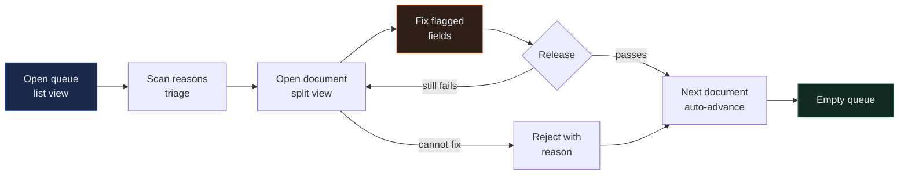

# UI Brief — Exception Queue (NWD-108)

| | |
|---|---|
| **Produced by** | Dzmitry  (Frontend Engineer) with Preetinka Sharma (Product Owner) |
| **Using** | [P14 — UI/UX Design Brief](../../../AI-Prompts-Library/phase-2-design/P14-ui-ux-design-brief.md) |
| **Date** | 2026-06-19 |
| **Status** | Approved |
| **Version** | 1.1 |
| **Story** | [NWD-108](stories/NWD-108.md) |
| **Input contract** | [`spec-confidence-gate.md` §5](spec-confidence-gate.md#5-failure-output-shape) — the failure record shape this screen renders |
| **Research** | Two shadowing sessions with Preeti Singh, Northwind operations, 2026-06-15 and 2026-06-17 |

---

## 1. Who this is for, and what her morning actually looks like

Preeti Singh is an operations analyst at Northwind's London office. She is not a power user, she is not a novice, and she has done this job for six years. She knows what a settlement break costs.

**Today, before this screen exists:** she arrives at 07:30. A folder holds the counterparty PDFs that landed overnight — 60 to 80 of them on her share. She opens each one, finds the account number, finds the positions table, types the rows into a spreadsheet, saves it to the recs share. Three and a half hours, four mornings out of five, longer at month-end. Two colleagues do the same for the other counterparties; one is in Los Angeles and covers the EM overnight arrivals.

**After this screen exists:** she opens one queue. Most documents are not there — they went straight through. What is there is the ones the system could not read confidently.

**The design number is 40 exceptions in a morning.** That comes from Preetinka's planning estimate of a 20% exception rate against ~200 documents a day, split across analysts, with month-end worse. In the first parallel-run week the real number was higher — 61% straight-through meant roughly 78 exceptions a day across two analysts — and it is expected to fall towards 30 a day as the straight-through rate reaches 85%.

Forty exceptions in a three-hour morning is **four and a half minutes each**, including the ones that need a phone call to the broker. So:

> **Design target: median 90 seconds from opening a document to releasing it.** Anything that adds a click to the common path fails this brief.

### What Preeti actually said

Three things from shadowing, kept verbatim because paraphrasing them loses the point:

- *"I don't need it to tell me it's wrong. I need it to tell me which number."*
- *"The worst part isn't the typing. It's finding the table. Some of them put it on page three."*
- *"I'd rather see everything and choose."* — on whether the LA analyst should have a separate queue. One queue, filterable. That resolved PRD open question Q3.

She does not use the mouse for the spreadsheet. That is not a preference we are accommodating; it is a working method that is faster than ours, and the screen has to keep up with it. Hence §6.

## 2. The journey



The load-bearing edge is `F → C`: after releasing, the next document opens automatically with focus on its first failing field. Preeti never returns to the list unless she wants to. Removing that edge would add two interactions to every document — 80 extra interactions a morning.

## 3. Layout

Two screens. No modals in the primary flow.

### 3.1 Queue list

Full width. A dense table, oldest first.

| Column | Width | Notes |
|---|---|---|
| Age | 72px | Relative — "2h ago". Turns amber past 4 hours, red past 8. |
| Counterparty | 160px | Display name, not the source key. |
| Document date | 120px | The statement or trade date, not the arrival date. |
| Reason | flexible | The human-readable summary from the gate: `low_confidence: currency, quantity`. Rendered as chips, one per failing field. |
| Failures | 64px | Count. Right-aligned, monospace. |
| Account | 120px | **Masked — last four digits only.** `••••4417`. |
| Pages | 56px | Right-aligned. |

Filter bar above: counterparty (multi-select), reason class (multi-select), age. Filters persist per user across sessions. No search box in v1 — Preeti works the queue in order and does not look documents up. That's a nice-to-have.

### 3.2 Document review — the split view

```text
┌──────────────────────────────────────────────┬─────────────────────────────┐
│  DOCUMENT           Broker Alpha · 2026-07-24│  FIELDS              3 of 3 │
│  ┌────────────────────────────────────────┐  │  ┌───────────────────────┐  │
│  │                                        │  │  │ ⚑ quantity   line 7   │  │
│  │        rendered PDF page 2             │  │  │   1250        71% →90%│  │
│  │        ▓▓▓ highlighted region ▓▓▓      │  │  └───────────────────────┘  │
│  │                                        │  │  ┌───────────────────────┐  │
│  │                                        │  │  │ ⚑ price      line 7   │  │
│  └────────────────────────────────────────┘  │  │   84.20       88% →92%│  │
│  ◀ page 2 of 3 ▶            zoom − ⌗ +       │  └───────────────────────┘  │
│                                              │  ⌄ 84 fields that passed    │
├──────────────────────────────────────────────┴─────────────────────────────┤
│  Esc back   ⇥ next field   ⏎ release   ⌘⌫ reject          [Reject][Release] │
└────────────────────────────────────────────────────────────────────────────┘
```

**PDF left at 60% width, fields right at 40%.** Not resizable in v1 — a resize handle is a preference nobody will set and a bug nobody will find.

Three rules govern this screen and they are the whole design:

1. **The PDF opens at the page the failure was found on.** Not page one. Preeti's second quote is about exactly this. Page provenance is on every failure record (`spec-confidence-gate.md` §5), so we have the page and there is no excuse for opening at the wrong one.
2. **The two panels stay in sync, in both directions.** Selecting a field scrolls the PDF to its bounding region and highlights it. Clicking a highlighted region on the PDF selects the field. Neither direction is optional; an analyst reads in both.
3. **Every failing field is shown at once, expanded, in document order.** The 80-odd fields that passed are collapsed behind one disclosure row and are read-only until expanded. Fixing one field, resubmitting, and finding the next is the interaction we are specifically preventing.

### 3.3 The field card

Each failing field is a card, not a table row, because it holds five things and a table row holds them badly.

| Element | Content | Notes |
|---|---|---|
| Flag | ⚑ | Severity colour. Amber for below-threshold, red for missing or unscored. |
| Field name | `quantity` | Canonical name. Never the counterparty's name for it. |
| Location | `line 7` | Omitted for header fields. |
| Value | `1250` | **Editable.** Text input, monospace, selected on focus. |
| Confidence | `71% → 90%` | Read at 71%, needed 90%. **Always a whole-number percentage.** See §7 note. |
| Reason | "read at 71%, we require 90%" | Ordinary words. Never a rule ID, never a stack trace. |

The confidence and threshold are both present in the failure record. The card renders them; it does not compute a verdict.

## 4. Component inventory

Every component defines four states. **A state that has not been designed will be encountered.**

| # | Component | Loading | Empty | Error | Success / default |
|---|---|---|---|---|---|
| C1 | `QueueList` | Six skeleton rows, no spinner | **Designed empty state** — see below | Inline banner, "Could not load the queue", Retry button, last-good data retained if any | Dense rows, oldest first |
| C2 | `QueueFilterBar` | Disabled, chips greyed | "No filters applied" is the default, not empty | Filter values failed to load → free-text fallback | Chips with counts |
| C3 | `QueueRow` | Skeleton | n/a | Row marked with a warning icon if its detail cannot be fetched | Hover highlight, focus ring |
| C4 | `DocumentViewer` | Skeleton page frame at the correct aspect ratio, then progressive render | n/a | "Could not render this document" + a link to the raw PDF in blob. The analyst is never blocked by our renderer. | Rendered page, region highlights |
| C5 | `PageControl` | Disabled | n/a | Disabled with tooltip | `◀ page 2 of 3 ▶`, zoom −/⌗/+ |
| C6 | `FieldList` | Three skeleton cards | "No failing fields" — only reachable after a fix; shows the Release affordance prominently | "Could not load fields" + Retry. The PDF stays rendered. | Failing cards expanded, passed fields collapsed |
| C7 | `FieldCard` | Skeleton | n/a | Per-field validation message under the input, red border, does not block other fields | Editable value, confidence pair, reason |
| C8 | `ConfidenceBadge` | — | Renders `—` when confidence is null, with tooltip "the model did not score this field" | — | `71% → 90%` |
| C9 | `ActionBar` | Buttons disabled | n/a | Submission failure → inline error above the bar, values preserved, nothing lost | Reject (secondary) / Release (primary) |
| C10 | `RejectDialog` | — | — | Validation: a reason is required | Reason select + free text |
| C11 | `Toast` | — | — | Error variant persists until dismissed | Success variant auto-dismisses at 4s |
| C12 | `KeyboardHintBar` | — | — | — | Always visible along the bottom |

### The empty queue is the primary state

Dzmitry's argument in refinement, and it held: **the success condition for this entire project is an empty queue.** At the 85% straight-through target, Preeti will open this screen and find nothing to do most mornings. An empty page with a grey "No items" is the wrong answer to the best possible outcome.

The empty state shows: a confirmation that the queue is genuinely clear, the count of documents that went straight through today, today's straight-through percentage, and the time of the most recent processed document. It is a small status board. It tells Preeti the system is working rather than merely that the list is short — which matters, because "queue is empty" and "ingestion has stopped" look identical otherwise.

## 5. Visual language

Northwind's design system, extended with four tokens this screen needs and it does not have. All colour pairs are checked to WCAG 2.2 AA at 4.5:1 for text and 3:1 for non-text.

### 5.1 Colour

| Token | Light | Dark | Used for |
|---|---|---|---|
| `--surface-base` | `#F7F8FA` | `#0E1117` | Page background |
| `--surface-raised` | `#FFFFFF` | `#161B22` | Cards, list rows |
| `--surface-sunken` | `#EDEFF3` | `#0A0D12` | PDF panel behind the page |
| `--text-primary` | `#12161C` | `#E8EEF4` | Values, field names |
| `--text-secondary` | `#5A6472` | `#9BA6B4` | Labels, metadata |
| `--accent` | `#2B5CE6` | `#6C8EF5` | Primary action, focus ring, selected field |
| `--flag-warn` | `#B25E00` | `#FF9F45` | Below-threshold field, amber age |
| `--flag-error` | `#B3261E` | `#FF6B60` | Missing or unscored field, red age |
| `--flag-ok` | `#0F7B4F` | `#3DDC97` | Passed field, empty-queue confirmation |
| `--highlight-region` | `#FFD54F` at 32% | `#FFD54F` at 24% | PDF region highlight |

**Colour is never the only signal.** Every flag carries a shape (⚑ outline vs filled) and a text label. A red-green colour deficiency is common enough among analysts that relying on hue for "this field failed" would exclude people, and in this screen the flag is the whole point.

### 5.2 Typography

| Role | Family | Size | Weight | Notes |
|---|---|---|---|---|
| Field values, quantities, confidences, hashes | `JetBrains Mono`, fallback `ui-monospace` | 14px | 500 | **Monospace, tabular figures.** Digits must align vertically down a column. Preeti compares numbers by eye against the PDF and proportional digits break that. |
| Field names | `Inter` | 13px | 600 | |
| Body, reasons | `Inter` | 14px | 400 | Line height 1.5 |
| Labels, metadata | `Inter` | 12px | 500 | Letter-spacing 0.02em |
| Section headers | `Inter` | 16px | 600 | |

No text below 12px anywhere. No fully-justified text. Minimum tap/click target 32px, minimum 40px for the Release and Reject buttons.

### 5.3 Spacing and motion

4px base scale — 4, 8, 12, 16, 24, 32, 48. Card padding 16px, list row height 40px, panel gutter 24px.

| Motion | Duration | Easing | Notes |
|---|---|---|---|
| PDF scroll to region | 220ms | `ease-out` | The only motion carrying meaning: it shows the analyst *where* the highlight moved from. |
| Field card selection | 120ms | `ease-out` | Border and background only |
| Toast in/out | 160ms | `ease-out` | |
| Skeleton shimmer | 1200ms | linear | |
| Page turn | 0ms | — | Instant. A transition here is decoration and costs 200ms forty times a morning. |

**`prefers-reduced-motion: reduce` removes all of it**, including the scroll animation, which becomes an instant jump with the highlight already applied. Nothing in this screen depends on animation to be understood.

## 6. Keyboard-first

Preeti works the spreadsheet without touching the mouse. This screen must be at least as fast, or she will be slower after we ship, and she will be right to say so.

| Key | Context | Action |
|---|---|---|
| `↑` `↓` | Queue list | Move selection |
| `⏎` | Queue list | Open selected document |
| `Esc` | Document view | Back to the list, prompting if there are unsaved edits |
| `⇥` / `⇧⇥` | Document view | Next / previous **failing** field. Passed fields are not in the tab order until expanded. |
| `⏎` | Field input | Commit and move to the next failing field |
| `⌘⏎` / `Ctrl+⏎` | Document view | Release |
| `⌘⌫` / `Ctrl+⌫` | Document view | Reject — opens the dialog, focus on the reason select |
| `⌥←` `⌥→` | Document view | Previous / next PDF page |
| `⌘0` | Document view | Reset zoom to fit-width |
| `?` | Anywhere | Keyboard shortcut sheet |

The hint bar along the bottom is always visible. It is 24px of screen we are spending deliberately: discoverability for a shortcut set nobody will read documentation for.

**Focus is never lost.** Releasing a document moves focus to the first failing field of the next one. Rejecting does the same. Closing a dialog returns focus to the control that opened it. An analyst who tabs into a black hole stops using the keyboard, and then §6 was pointless.

## 7. Accessibility

Target: **WCAG 2.2 Level AA**, verified by axe on every route in CI plus one manual screen-reader pass per release (NVDA on Windows, which is what Northwind deploys).

| Requirement | How |
|---|---|
| All contrast 4.5:1 text / 3:1 non-text | Token pairs in §5.1 are pre-checked |
| Never colour alone | Flags carry an icon shape and a text label |
| Every control keyboard reachable | §6, plus a visible 2px `--accent` focus ring at 2px offset. The ring is never removed. |
| Field errors announced | `aria-describedby` on the input pointing at the reason text; `role="alert"` on validation failures |
| Queue updates announced | `aria-live="polite"` region reporting "3 new documents in the queue". Polite, not assertive — it must not interrupt an analyst mid-edit. |
| PDF is not a black box | Each highlighted region is a focusable element with an accessible name: "quantity, line 7, page 2, failing". The rendered page carries a text-layer alternative. |
| Zoom to 200% | Layout reflows to a single column, PDF above fields. No horizontal scrolling of the page body. |
| Reduced motion honoured | §5.3 |
| Session timeout | Warned at 2 minutes remaining, with unsaved edits preserved through re-authentication. Losing forty minutes of corrections to a token expiry is a real risk in a three-hour session. |

## 8. Out of scope for v1

| Not building | Why |
|---|---|
| Mobile / tablet layout | Preeti works at a desk with two monitors and the PDF open. That's a nice-to-have. |
| Bulk release | Releasing documents without looking at them defeats the control. Deliberate, permanent. |
| In-app search across the queue | She works it in order. Filters cover the real need. |
| Annotation or comments on a document | Belongs to the recs workflow, not to ingestion. |
| Second-analyst approval | PRD open question Q1, resolved: single analyst for v1. |
| Dark mode toggle in-app | Tokens support it; it follows the OS setting. A toggle is a preference screen we do not otherwise need. |
| Undo after release | A released document has been re-run and loaded. Correcting it is a resend, which the pipeline already handles idempotently. |

## 9. Change log

| Version | Date | Change | By |
|---|---|---|---|
| 1.0 | 2026-06-19 | Initial | Dzmitry, Preetinka |
| 1.1 | 2026-07-07 | §3.3 gained the explicit "always a whole-number percentage" rule after [NWD-139](bug-NWD-139.md) — the badge rendered `0.8234567`. The brief already implied it; it did not say it, and an implication is not a specification. | Dzmitry |

---

> **Artifact contract — `Case-Study/Python-ETL/artifacts/ui-brief-exception-queue.md`**
>
> Produced by: Frontend Engineer (Dzmitry ) with Product Owner (Preetinka Sharma) using P14 — UI/UX Design Brief
> Approved by: Preetinka Sharma (PO) 2026-06-19 · Preeti Singh (Northwind operations, the actual user) 2026-06-22
>
> Anyone consuming this file can rely on finding:
> - The named user, her current working day with real numbers, and the design target derived from them
> - The user journey end to end, including what happens after a document is released
> - Layout for both screens, with the three rules that govern the split view stated explicitly
> - A component inventory naming every component and its loading, empty, error, and success state
> - Colour, typography, spacing and motion tokens with values, and the contrast standard they meet
> - The complete keyboard map, and the focus-management rule
> - Accessibility requirements with the target standard named and how each is verified
> - What is explicitly not being built, with a reason
>
> This file does **not** contain: React component APIs, state management, the REST endpoints this screen calls, or the failure record's field definitions.
> Those live in: `spec-confidence-gate.md` §5 (the input contract), `sinks/sql_sink.py` (the `etl.extraction_exception` shape), and the frontend repository.
>
> **If any guarantee above is missing, this artifact is not done.**
> Do not build on it — send it back.
>
> Changing this file: Dzmitry  and Preetinka Sharma jointly. A change to §3.3 or §4 requires re-checking `spec-confidence-gate.md` §5 — the screen renders that shape and the two drift silently. A change to §7 requires a fresh axe run and a screen-reader pass.
