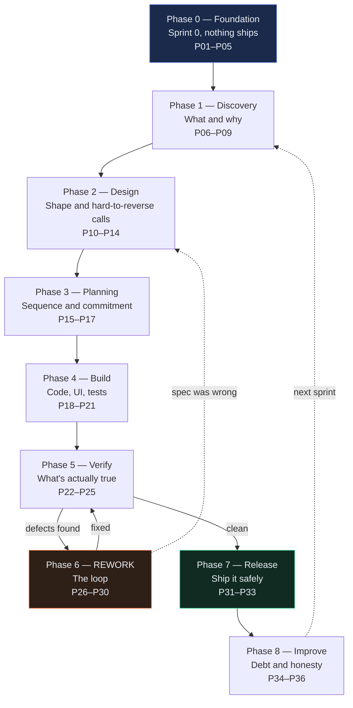

# AI-Agile-Development

**Running a seven-person software team on AI-assisted delivery — and what to do when the code comes back wrong.**

← [AI-Agents](../AI-Agents/README.md) · [How the books connect](../docs/how-the-three-connect.md)

---

## What this is

Two things that are meant to be read together.

### 📚 [The AI Prompts Library](AI-Prompts-Library/README.md)

Thirty-six prompts covering the complete agile lifecycle, organised into nine phases and mapped to seven team roles. Each prompt file tells you:

- **Who runs it** and what they need to already have
- **What it produces**, at a real file path
- The prompt itself, with **every placeholder explained**
- A **worked example** and the **actual output** it returns
- **Why this is the final prompt** — the exit criteria, so you know when to stop
- **What to run when it isn't** — the follow-up prompts, which is the part most libraries skip
- **Who picks it up next**, and what they're guaranteed to find

### 🏗 [The Case Study — Python ETL on Azure](Case-Study/Python-ETL/README.md)

The same thirty-six prompts, shown in use by named people over five sprints on a real-shaped project: an ETL pipeline that pulls portfolio data from a REST API, reads counterparty PDFs with Azure AI, runs them through a rules engine, and loads the result into Azure SQL and Snowflake.

Including the working code. Including the bug report. Including the retrospective where they admit what went wrong.

---

## Start here

| If you want to... | Go to |
|---|---|
| Understand why this book exists at all | [The story so far](00-the-story.md) |
| Know who's who before you start | [The cast](the-cast.md) |
| See the full map and pick a reading order | [Learning path](learning-path.md) |
| Find out what's wrong with your current prompt library | [Prompt analysis](prompt-analysis.md) — it's blunt |
| Just get the prompts | [Library index](AI-Prompts-Library/README.md) |
| See it all actually happen | [Case study](Case-Study/Python-ETL/README.md) |
| **Fix code that QA says is broken** | [P27 — Fix from a QA bug report](AI-Prompts-Library/phase-6-rework/P27-fix-from-a-qa-bug-report.md) |

---

## The problem this book solves

The first three books in this series each taught one clean idea, and each of them quietly assumed the same thing: **one person, one AI, one task.**

That's not a software project.

A software project is seven people, each excellent at prompting, each producing something good, none of it fitting together — because the gap between one person's output and the next person's input is where AI-assisted teams actually break. Not in the prompting. In the seam.

And then there's the second problem, which is the one that started this book:

> *"Suppose Dev A is working on a story which is code generated. Now after doing some testing there are some issues. For that, what kind of prompt do we have to use?"*

Every prompt library describes a straight line — plan, build, test, ship. Real software goes in a loop, and the loop is most of the sprint. [Phase 6](AI-Prompts-Library/03-the-rework-loop.md) is five prompts long for that reason.

---

## The nine phases

Notice the two arrows that leave Phase 6. One goes back to Verify — normal. One goes all the way back to Design, dotted, and that's the one nobody plans for: the discovery that the code isn't wrong, the **spec** is.

That's [P29](AI-Prompts-Library/phase-6-rework/P29-the-spec-was-wrong.md), and handling it badly is how a document quietly becomes a lie that every future AI session is grounded in.

---

## The full prompt index

### Phase 0 — Foundation · *Team Lead*
| | | |
|---|---|---|
| [P01](AI-Prompts-Library/phase-0-foundation/P01-generate-the-project-context-file.md) | Generate the Project Context File | Everything downstream depends on this existing |
| [P02](AI-Prompts-Library/phase-0-foundation/P02-connect-the-database.md) | Connect the Database | Azure SQL silver, Snowflake gold |
| [P03](AI-Prompts-Library/phase-0-foundation/P03-wire-up-an-mcp-server.md) | Wire Up an MCP Server | So the AI reads the real schema instead of guessing |
| [P04](AI-Prompts-Library/phase-0-foundation/P04-hooks-as-guardrails.md) | Hooks as Guardrails | The only way to guarantee something happens every time |
| [P05](AI-Prompts-Library/phase-0-foundation/P05-turn-a-repeated-task-into-a-skill.md) | Turn a Repeated Task into a Skill | The nine-step counterparty onboarding ritual |

### Phase 1 — Discovery · *Product Owner*
| | | |
|---|---|---|
| [P06](AI-Prompts-Library/phase-1-discovery/P06-write-a-full-prd.md) | Write a Full PRD | Success metrics that mean something to a business |
| [P07](AI-Prompts-Library/phase-1-discovery/P07-slice-the-prd-into-stories.md) | Slice the PRD into Stories | Vertical slicing, and why slicing by layer fails |
| [P08](AI-Prompts-Library/phase-1-discovery/P08-write-acceptance-criteria.md) | Write Acceptance Criteria | With QA in the room, or you only get the happy path |
| [P09](AI-Prompts-Library/phase-1-discovery/P09-estimate-and-rank-the-backlog.md) | Estimate and Rank the Backlog | AI changes some estimates and not others |

### Phase 2 — Design · *Architect*
| | | |
|---|---|---|
| [P10](AI-Prompts-Library/phase-2-design/P10-ultra-plan-mode.md) | Ultra Plan Mode | Stop gate first, code never |
| [P11](AI-Prompts-Library/phase-2-design/P11-write-the-technical-spec.md) | Write the Technical Spec | The behaviour contract, not the business document |
| [P12](AI-Prompts-Library/phase-2-design/P12-record-an-architecture-decision.md) | Record an Architecture Decision | So the reason survives the person |
| [P13](AI-Prompts-Library/phase-2-design/P13-design-the-data-contract.md) | Design the Data Contract | The most important artifact on an ETL project |
| [P14](AI-Prompts-Library/phase-2-design/P14-ui-ux-design-brief.md) | UI/UX Design Brief | Preeti's working day, not a component inventory |

### Phase 3 — Planning · *Team Lead + PM*
| | | |
|---|---|---|
| [P15](AI-Prompts-Library/phase-3-planning/P15-implementation-plan.md) | Implementation Plan | It compiles and runs after every single step |
| [P16](AI-Prompts-Library/phase-3-planning/P16-sprint-plan-and-assignment.md) | Sprint Plan and Assignment | Capacity, goal, and the dependency spotted early |
| [P17](AI-Prompts-Library/phase-3-planning/P17-definition-of-done.md) | Definition of Done | Including "a human has read every line the AI wrote" |

### Phase 4 — Build · *Engineers*
| | | |
|---|---|---|
| [P18](AI-Prompts-Library/phase-4-build/P18-implement-a-story.md) | Implement a Story | The central build prompt |
| [P19](AI-Prompts-Library/phase-4-build/P19-build-the-ui-from-the-brief.md) | Build the UI from the Brief | States before happy path |
| [P20](AI-Prompts-Library/phase-4-build/P20-write-tests-alongside-the-code.md) | Write Tests Alongside the Code | Behaviour, not a restatement of the implementation |
| [P21](AI-Prompts-Library/phase-4-build/P21-daily-standup-summary.md) | Daily Standup Summary | Where seven private AI sessions get reconciled |

### Phase 5 — Verify · *QA*
| | | |
|---|---|---|
| [P22](AI-Prompts-Library/phase-5-verify/P22-e2e-test-the-application.md) | E2E Test the Application | An E2E test here spans a pipeline, not a browser |
| [P23](AI-Prompts-Library/phase-5-verify/P23-review-someone-elses-code.md) | Review Someone Else's Code | AI code passes the classic checklist and is still wrong |
| [P24](AI-Prompts-Library/phase-5-verify/P24-find-security-gaps.md) | Find Security Gaps | Attack it like you want in |
| [P25](AI-Prompts-Library/phase-5-verify/P25-data-quality-validation.md) | Data Quality Validation | **The prompt that would have caught NWD-142** |

### Phase 6 — Rework · *the loop*
| | | |
|---|---|---|
| [P26](AI-Prompts-Library/phase-6-rework/P26-debug-an-error-fast.md) | Debug an Error Fast | For when something threw |
| [P27](AI-Prompts-Library/phase-6-rework/P27-fix-from-a-qa-bug-report.md) | **Fix From a QA Bug Report** | **For when nothing threw and it's still wrong** |
| [P28](AI-Prompts-Library/phase-6-rework/P28-respond-to-code-review-feedback.md) | Respond to Code Review Feedback | Classify first, change second |
| [P29](AI-Prompts-Library/phase-6-rework/P29-the-spec-was-wrong.md) | The Spec Was Wrong | The escape hatch nobody writes down |
| [P30](AI-Prompts-Library/phase-6-rework/P30-when-the-ai-is-stuck.md) | When the AI Is Stuck | Including the sunk-cost advice people resist |

### Phase 7 — Release
| | | |
|---|---|---|
| [P31](AI-Prompts-Library/phase-7-release/P31-write-clean-git-commits.md) | Write Clean Git Commits | The splitting step matters more now |
| [P32](AI-Prompts-Library/phase-7-release/P32-release-readiness-check.md) | Release Readiness Check | Parallel run — tests alone can't replace it |
| [P33](AI-Prompts-Library/phase-7-release/P33-write-the-runbook.md) | Write the Runbook | For 3am, for someone who didn't build it |

### Phase 8 — Improve
| | | |
|---|---|---|
| [P34](AI-Prompts-Library/phase-8-improve/P34-clean-up-dead-code.md) | Clean Up Dead Code | AI generates dead code faster than hands do |
| [P35](AI-Prompts-Library/phase-8-improve/P35-run-the-retrospective.md) | Run the Retrospective | "We'll be more careful" is not an action item |
| [P36](AI-Prompts-Library/phase-8-improve/P36-tech-debt-triage.md) | Tech Debt Triage | Interest rate, not just principal |

---

## The three ideas the book keeps coming back to

**1. The handoff is the failure point, not the prompt.**
When a human gets an incomplete handoff, they ask a question. An AI produces something confident and complete-looking on top of the gap. It will never tell you that you handed it the wrong thing. → [The handoff contract](AI-Prompts-Library/02-the-handoff-contract.md)

**2. Knowing when to stop is a skill.**
The expensive mistake in AI-assisted work isn't a bad prompt. It's a good prompt run eleven more times on something already finished, while the actual missing section stays missing. → §7 of every prompt file

**3. A wrong number is worse than no number.**
The design principle that runs through the whole case study, and the one that most of the arguments are about. → [ADR-0003](Case-Study/Python-ETL/artifacts/adr/)

---

## Where this sits in the series

| Book | The idea | Scope |
|---|---|---|
| [AI-Skills](../AI-Skills/README.md) | One focused instruction set, triggered automatically | One task |
| [AI-Workflows](../AI-Workflows/README.md) | A fixed plan coordinating several pieces | One job |
| [AI-Agents](../AI-Agents/README.md) | A goal and a loop that decides its own next step | One investigation |
| **AI-Agile-Development** | **Seven roles, thirty-six prompts, and the seams between them** | **One project** |

The first three are about getting an AI to do a thing well. This one is about seven people doing that at once without ending up in three different places.

---

← [AI-Agents](../AI-Agents/README.md) · [The story so far](00-the-story.md) · [Learning path](learning-path.md) →
